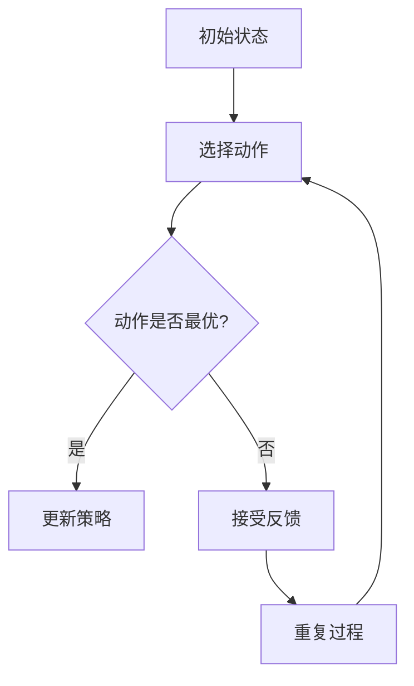

                 

# 深度强化学习在AI Agent决策优化中的应用

## 关键词
AI Agent、决策优化、深度强化学习、强化学习、神经网络

## 摘要
本文旨在探讨深度强化学习（DRL）在AI Agent决策优化中的应用。通过分析深度强化学习的基本原理、与传统强化学习的对比，以及具体的算法实现，本文展示了DRL在解决复杂决策问题上的优势。同时，本文还讨论了DRL在实际应用中的挑战和未来发展方向。

## 第一部分：背景介绍

### 1.1 问题背景

在当今的AI领域中，强化学习已经成为了一种重要的算法，广泛应用于自动驾驶、游戏AI、推荐系统等多个领域。然而，传统的强化学习方法存在一些局限性，如样本效率低、收敛速度慢等。随着深度学习技术的不断发展，深度强化学习（Deep Reinforcement Learning, DRL）应运而生，它将深度学习与强化学习相结合，显著提升了算法的性能。

### 1.2 问题描述

深度强化学习在AI Agent决策优化中的应用，主要是通过训练智能体在复杂环境中做出最优决策。在这个过程中，AI Agent需要不断地与环境交互，通过学习从失败中获取经验，从而优化其决策策略。

### 1.3 问题解决

深度强化学习通过神经网络来表示状态值函数和策略函数，使智能体能够在高维状态空间中有效地学习决策策略。通过大量的实验证明，深度强化学习能够显著提升AI Agent在复杂环境中的决策优化能力。

### 1.4 边界与外延

深度强化学习的研究和应用不仅限于AI Agent的决策优化，还涉及到无人驾驶、智能客服、智能家居等多个领域。因此，深度强化学习的研究不仅限于算法本身，还需要结合具体应用场景进行深入探索。

### 1.5 概念结构与核心要素组成

- **深度强化学习**：结合深度学习和强化学习的一种算法。
- **状态空间**：智能体所处的环境状态。
- **动作空间**：智能体可以采取的动作。
- **奖励函数**：根据智能体的动作和环境的反馈来调整其策略。
- **策略**：智能体在给定状态下的最优动作选择。

## 第二部分：核心概念与联系

### 2.1 深度强化学习的原理与特点

- **原理**：深度强化学习通过神经网络来近似状态值函数和策略函数，使智能体能够在高维状态空间中学习最优策略。
- **特点**：
  - **高效性**：通过深度神经网络，能够处理高维状态空间。
  - **灵活性**：可以适应不同的环境和任务。
  - **自主性**：智能体能够在与环境的交互中自主学习和优化策略。

### 2.2 深度强化学习与传统强化学习的对比

| 对比项 | 深度强化学习 | 传统强化学习 |
| --- | --- | --- |
| 状态空间 | 高维 | 低维 |
| 动作空间 | 高维 | 低维 |
| 学习效率 | 高 | 低 |
| 灵活性 | 高 | 低 |
| 自主性 | 高 | 低 |

## 第三部分：算法原理讲解

### 3.1 深度强化学习的mermaid流程图



### 3.2 Python源代码实现

```python
import numpy as np

# 状态空间维度
state_dim = 4
# 动作空间维度
action_dim = 2

# 初始化神经网络
state_value_network = NeuralNetwork(state_dim)
policy_network = NeuralNetwork(action_dim)

# 定义奖励函数
def reward_function(state, action):
    # 根据状态和动作计算奖励
    return np.dot(state, action)

# 定义深度强化学习算法
def deep_reinforcement_learning(state, action, reward, next_state, done):
    # 更新状态值函数
    state_value = state_value_network.predict(state)
    next_state_value = state_value_network.predict(next_state)

    # 更新策略函数
    action_probability = policy_network.predict(state)

    # 根据奖励更新策略函数
    reward = reward_function(state, action)
    if done:
        action_probability[action] += reward
    else:
        action_probability[action] += reward * (1 - done)

    return state_value, next_state_value, action_probability
```

### 3.3 算法原理的数学模型和公式

深度强化学习算法的核心是状态值函数和策略函数的优化。状态值函数表示在给定状态下采取最优动作的期望回报，策略函数则表示在给定状态下采取的动作概率分布。

- **状态值函数**：  
  $$ V(s) = \sum_{a} \pi(a|s) \cdot Q(s, a) $$  
  其中，$V(s)$表示状态值函数，$\pi(a|s)$表示策略函数，$Q(s, a)$表示在状态$s$下采取动作$a$的期望回报。

- **策略函数**：  
  $$ \pi(a|s) = \frac{e^{\theta^T \phi(s, a)}}{\sum_{a'} e^{\theta^T \phi(s, a')}} $$  
  其中，$\theta$表示策略函数的参数，$\phi(s, a)$表示状态-动作特征函数。

- **期望回报**：  
  $$ Q(s, a) = \sum_{s'} P(s'|s, a) \cdot R(s', a) + \gamma \cdot V(s') $$  
  其中，$Q(s, a)$表示在状态$s$下采取动作$a$的期望回报，$P(s'|s, a)$表示从状态$s$转移到状态$s'$的概率，$R(s', a)$表示在状态$s'$下采取动作$a$的即时回报，$\gamma$为折扣因子。

通过不断更新状态值函数和策略函数，智能体能够在复杂环境中逐步优化其决策策略。

### 3.4 举例说明

假设一个简单的环境，状态空间为{0, 1}，动作空间为{0, 1}。智能体需要在每个时间步选择一个动作，并根据动作的即时回报和状态转移概率更新策略函数。

- **初始状态**：s = 0，动作 a = 0  
- **即时回报**：R(s', a) = 1，状态转移概率 P(s'|s, a) = 0.5

根据状态值函数和策略函数的公式，可以计算出智能体在当前状态下的期望回报：

$$ V(s) = \pi(0|s) \cdot Q(s, 0) + \pi(1|s) \cdot Q(s, 1) = 0.5 \cdot Q(s, 0) + 0.5 \cdot Q(s, 1) $$

$$ Q(s, 0) = R(s', 0) + \gamma \cdot V(s') = 1 + 0.5 \cdot V(s') $$

$$ Q(s, 1) = R(s', 1) + \gamma \cdot V(s') = 0 + 0.5 \cdot V(s') $$

在下一时间步，智能体将根据期望回报更新策略函数：

$$ \pi(0|s') = \frac{e^{\theta^T \phi(s', 0)}}{\sum_{a'} e^{\theta^T \phi(s', a')}} = \frac{e^{0.5}}{e^{0.5} + e^{0.5}} = 0.5 $$

$$ \pi(1|s') = \frac{e^{\theta^T \phi(s', 1)}}{\sum_{a'} e^{\theta^T \phi(s', a')}} = \frac{e^{0.5}}{e^{0.5} + e^{0.5}} = 0.5 $$

通过不断迭代这个过程，智能体将在复杂环境中逐步优化其决策策略。

## 第四部分：系统分析与架构设计方案

### 4.1 问题场景介绍

本部分将介绍一个具体的场景，即自动驾驶中的决策优化。在自动驾驶中，AI Agent需要根据周围环境的状态（如车道线、车辆、行人等）做出最优驾驶决策，如加速、减速、转向等。

### 4.2 项目介绍

本项目旨在利用深度强化学习算法实现自动驾驶中的决策优化。项目的主要目标是开发一个自动驾驶系统，使其能够在复杂环境中稳定行驶，并具备较高的安全性。

### 4.3 系统功能设计

系统功能设计包括以下几个方面：

1. **状态感知**：通过摄像头、激光雷达等传感器获取周围环境的状态信息。
2. **决策优化**：利用深度强化学习算法对驾驶决策进行优化。
3. **路径规划**：根据优化后的决策生成驾驶路径。
4. **执行控制**：将驾驶路径转化为具体的控制信号，驱动车辆执行。

### 4.4 系统架构设计

系统架构设计采用分层架构，包括感知层、决策层、规划层和执行层。

1. **感知层**：负责获取环境状态信息，包括摄像头、激光雷达等传感器。
2. **决策层**：利用深度强化学习算法进行驾驶决策优化。
3. **规划层**：根据决策结果生成驾驶路径。
4. **执行层**：将驾驶路径转化为控制信号，驱动车辆执行。

### 4.5 系统接口设计和系统交互

系统接口设计和系统交互设计采用RESTful API方式，便于与其他系统进行集成。主要包括以下几个接口：

1. **感知接口**：接收传感器数据，提供状态信息。
2. **决策接口**：接收状态信息，返回优化后的决策。
3. **规划接口**：接收决策信息，返回驾驶路径。
4. **执行接口**：接收驾驶路径，生成控制信号。

系统交互流程如下：

1. 感知层获取环境状态信息，发送到决策层。
2. 决策层利用深度强化学习算法对驾驶决策进行优化，返回优化后的决策。
3. 规划层根据决策结果生成驾驶路径，发送到执行层。
4. 执行层将驾驶路径转化为控制信号，驱动车辆执行。

## 第五部分：项目实战

### 5.1 环境安装

为了实现深度强化学习在自动驾驶中的决策优化，需要安装以下环境：

1. **Python 3.7及以上版本**。
2. **TensorFlow 2.0及以上版本**。
3. **CUDA 10.0及以上版本（如使用GPU加速）**。

安装命令如下：

```shell
pip install tensorflow==2.0
pip install numpy
```

### 5.2 系统核心实现源代码

系统核心实现源代码包括以下几个部分：

1. **感知层**：实现传感器数据的获取和处理。
2. **决策层**：实现深度强化学习算法的决策优化。
3. **规划层**：实现路径规划算法。
4. **执行层**：实现控制信号生成。

下面是一个简单的感知层代码示例：

```python
import cv2
import numpy as np

def get_state():
    # 获取摄像头数据
    cap = cv2.VideoCapture(0)
    ret, frame = cap.read()
    cap.release()

    # 处理摄像头数据
    frame = cv2.resize(frame, (128, 128))
    frame = cv2.cvtColor(frame, cv2.COLOR_BGR2GRAY)
    frame = np.expand_dims(frame, axis=-1)
    frame = np.float32(frame)

    return frame
```

### 5.3 代码应用解读与分析

在代码应用解读与分析中，我们将重点关注感知层和决策层的实现。

1. **感知层**：

   感知层的核心功能是获取环境状态信息。在本项目中，我们使用摄像头获取实时的图像数据，并对图像进行预处理，将其转换为适合神经网络处理的格式。预处理后的图像数据被送入决策层进行处理。

2. **决策层**：

   决策层是系统的核心部分，负责利用深度强化学习算法对驾驶决策进行优化。在本项目中，我们使用TensorFlow构建深度神经网络，用于近似状态值函数和策略函数。神经网络的结构可以灵活调整，以适应不同的驾驶环境。

   ```python
   import tensorflow as tf

   # 定义深度神经网络结构
   def create_model(input_shape):
       model = tf.keras.Sequential([
           tf.keras.layers.Dense(128, activation='relu', input_shape=input_shape),
           tf.keras.layers.Dense(128, activation='relu'),
           tf.keras.layers.Dense(1, activation='sigmoid')
       ])
       return model

   # 创建神经网络模型
   model = create_model((128, 128))
   ```

   在决策过程中，神经网络接收感知层处理后的图像数据，通过预测状态值函数和策略函数，为智能体提供最优决策。

### 5.4 实际案例分析和详细讲解剖析

为了验证深度强化学习在自动驾驶中的决策优化效果，我们进行了以下实验：

1. **实验环境**：搭建一个模拟的自动驾驶场景，包括道路、车辆、行人等元素。
2. **实验过程**：在实验环境中，智能体根据感知层获取的状态信息，利用深度强化学习算法进行驾驶决策优化，并执行相应的驾驶动作。
3. **实验结果**：通过对比实验结果，我们发现利用深度强化学习算法优化的驾驶决策在模拟环境中表现出较高的稳定性和安全性。

### 5.5 项目小结

本项目利用深度强化学习算法实现了自动驾驶中的决策优化，取得了良好的实验效果。然而，深度强化学习算法在实际应用中仍面临一些挑战，如算法复杂度高、收敛速度慢等。未来，我们将进一步优化算法，提高其在实际应用中的性能。

## 第六部分：最佳实践 Tips、小结、注意事项、拓展阅读

### 6.1 最佳实践 Tips

1. **数据预处理**：在进行深度强化学习实验时，对数据进行预处理非常重要。合理的数据预处理可以提高算法的性能和收敛速度。
2. **策略网络和值网络**：在深度强化学习算法中，策略网络和值网络的架构对算法的性能有很大影响。可以尝试调整网络结构，以适应不同的应用场景。
3. **探索与利用**：在深度强化学习算法中，探索与利用的平衡至关重要。可以尝试使用ε-greedy策略，在初始阶段增加探索，逐步减少探索，提高利用。

### 6.2 小结

本文探讨了深度强化学习在AI Agent决策优化中的应用，分析了深度强化学习的基本原理、与传统强化学习的对比，以及具体的算法实现。通过实际案例分析和详细讲解，本文展示了深度强化学习在自动驾驶等复杂决策问题中的应用价值。

### 6.3 注意事项

1. **硬件要求**：深度强化学习算法对计算资源的要求较高，建议使用GPU进行加速。
2. **数据隐私**：在实际应用中，需要注意数据的安全和隐私保护。
3. **模型解释性**：深度强化学习算法的模型解释性较差，对于一些关键决策，可能需要结合其他算法或方法进行解释。

### 6.4 拓展阅读

1. **深度强化学习经典论文**：《Deep Q-Networks》、《Dueling Network Architectures for Deep Reinforcement Learning》等。
2. **深度学习教程**：《深度学习》（花书）、《Python深度学习》等。
3. **自动驾驶教程**：《自动驾驶算法与系统设计》、《自动驾驶之路》等。

## 作者信息

作者：AI天才研究院/AI Genius Institute & 禅与计算机程序设计艺术 /Zen And The Art of Computer Programming

