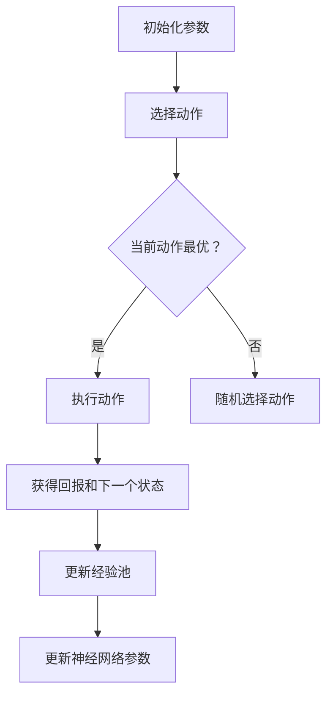
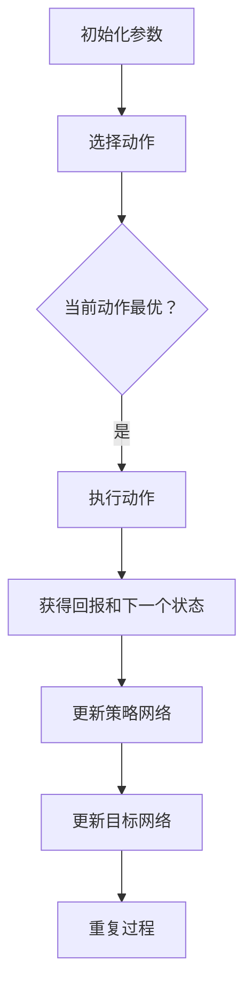
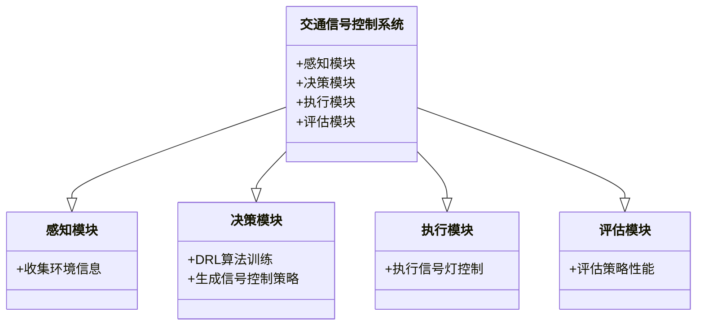
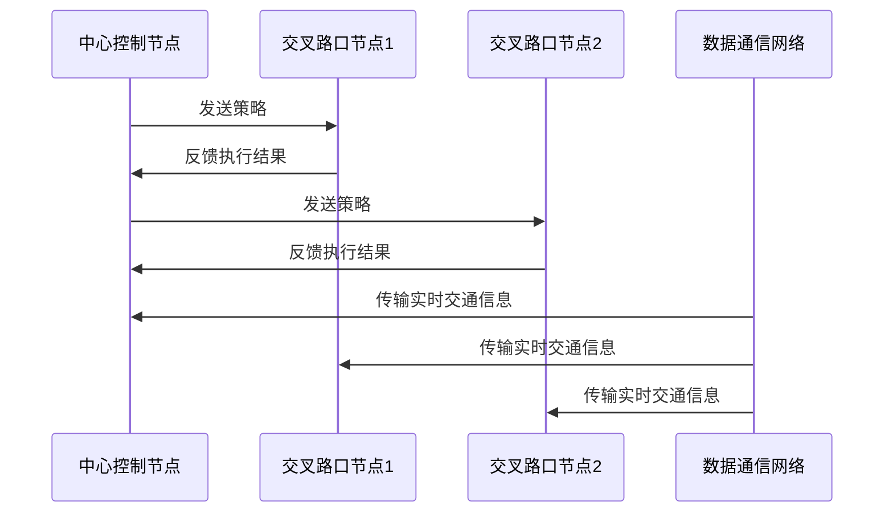
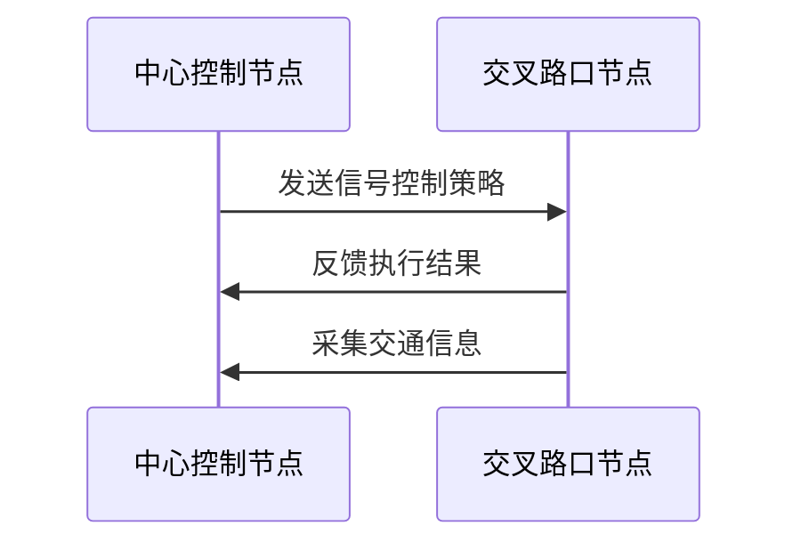

                 

## 深度强化学习基础

### 1.1 深度强化学习概述

#### 1.1.1 深度强化学习的发展历程

深度强化学习（Deep Reinforcement Learning，简称DRL）是强化学习（Reinforcement Learning，简称RL）的一个分支，它结合了深度学习（Deep Learning，简称DL）和传统强化学习的方法。传统强化学习主要依靠价值函数或策略函数来指导智能体（agent）进行决策，但这种方法在处理高维、非线性问题时有很大局限性。深度学习的引入使得智能体能够在复杂的环境中通过学习高维特征表示来优化其行为。

深度强化学习的发展历程可以分为以下几个阶段：

1. **深度学习的崛起**：2006年，Hinton等人提出了深度信念网络（Deep Belief Network，简称DBN），开启了深度学习的序幕。2012年，AlexNet在ImageNet竞赛中大放异彩，深度学习开始受到广泛关注。

2. **强化学习的融合**：在深度学习发展起来后，研究者开始探索将深度学习的表示能力与传统强化学习相结合，以解决复杂决策问题。2013年，Schulman等人提出了深度Q网络（Deep Q-Network，简称DQN），标志着深度强化学习的诞生。

3. **深度强化学习的发展**：随着算法的不断完善，深度强化学习在学术界和工业界得到了广泛应用。代表性的算法包括深度确定性策略梯度（Deep Deterministic Policy Gradient，简称DDPG）和深度确定性策略梯度（Asynchronous Advantage Actor-Critic，简称A3C）等。

#### 1.1.2 深度强化学习与传统强化学习的区别

传统强化学习和深度强化学习的主要区别在于它们的决策策略和学习方法。

1. **决策策略**：
   - 传统强化学习：通常使用值函数（Value Function）或策略函数（Policy Function）来指导智能体的决策。值函数表示在给定状态下，执行特定动作所能获得的最大预期回报；策略函数则直接给出在特定状态下应该执行的动作。
   - 深度强化学习：通过学习神经网络来表示值函数或策略函数，使得智能体能够在高维、非线性环境中进行决策。

2. **学习方法**：
   - 传统强化学习：主要依赖于经验和模仿，通过试错来学习最优策略。
   - 深度强化学习：结合深度学习的特性，智能体可以通过学习环境的高维特征表示来提高决策效率。

#### 1.1.3 深度强化学习的应用场景

深度强化学习由于其强大的表示能力和适应性，被广泛应用于各种领域，包括但不限于：

1. **游戏**：深度强化学习在游戏中的表现尤为出色，如围棋、斗地主等。
2. **自动驾驶**：自动驾驶系统需要实时决策，深度强化学习可以帮助车辆在不同场景中做出合理的驾驶决策。
3. **机器人**：机器人需要在复杂的现实环境中执行各种任务，深度强化学习可以帮助机器人通过自我学习来优化其行为。
4. **推荐系统**：深度强化学习可以用于个性化推荐系统，通过学习用户的偏好和行为模式，提高推荐的准确性。
5. **金融交易**：深度强化学习可以用于交易策略的优化，帮助投资者在动态市场中做出更好的决策。

### 1.2 离散动作空间与连续动作空间的深度强化学习

深度强化学习根据动作空间的特性，可以分为离散动作空间和连续动作空间。这两种情况下的算法设计和实现方法有所不同。

#### 1.2.1 离散动作空间的深度强化学习

在离散动作空间中，智能体需要从有限个动作中选择一个最优动作。深度Q网络（Deep Q-Network，简称DQN）是最常用的算法之一。

**深度Q网络（DQN）**

DQN的核心思想是使用深度神经网络来近似值函数，从而在给定状态下选择最优动作。其基本步骤如下：

1. **初始化参数**：初始化神经网络参数、目标网络参数和经验回放缓冲。
2. **选择动作**：使用当前神经网络评估给定状态，选择动作。
3. **执行动作**：在环境中执行选定的动作，并获得回报和下一个状态。
4. **更新经验**：将当前状态、动作、回报和下一个状态存储到经验回放缓冲中。
5. **更新网络**：从经验回放缓冲中随机抽取一批样本，通过反向传播更新神经网络参数。

**示例**：在电子游戏中，DQN可以用来训练智能体在给定状态中选择最优动作，从而提高游戏的获胜率。

#### 1.2.2 连续动作空间的深度强化学习

在连续动作空间中，智能体需要从实数范围内选择一个最优动作。深度确定性策略梯度（Deep Deterministic Policy Gradient，简称DDPG）是一种常用的算法。

**深度确定性策略梯度（DDPG）**

DDPG的核心思想是通过学习策略网络来指导智能体在连续动作空间中选择动作。其基本步骤如下：

1. **初始化参数**：初始化策略网络、目标策略网络和评价网络参数。
2. **选择动作**：使用策略网络在给定状态下选择动作。
3. **执行动作**：在环境中执行选定的动作，并获得回报和下一个状态。
4. **更新策略网络**：根据回报和下一个状态，通过策略梯度下降更新策略网络参数。
5. **更新目标网络**：定期将策略网络参数复制到目标网络，以保持网络稳定。

**示例**：在自动驾驶中，DDPG可以用来训练智能体在复杂的交通环境中选择最优驾驶策略，从而提高行驶的安全性和效率。

#### 1.2.3 离散和连续动作空间的深度强化学习比较

- **计算复杂度**：离散动作空间的计算复杂度通常较低，因为动作集合是有限的；而连续动作空间的计算复杂度较高，因为动作集合是无限的。
- **学习难度**：离散动作空间的学习相对容易，因为可以明确地定义每个动作的效果；连续动作空间的学习较难，因为需要学习动作对环境的影响。
- **应用场景**：离散动作空间适用于有限的选择问题，如游戏、机器人控制等；连续动作空间适用于动态控制问题，如自动驾驶、机器人导航等。

### 1.3 深度强化学习的核心概念与联系

深度强化学习的核心概念包括奖励函数、价值函数、策略函数，以及状态、动作和回报。这些概念相互联系，共同构成了深度强化学习的基础。

#### 1.3.1 奖励函数、价值函数和策略函数

1. **奖励函数（Reward Function）**：
   奖励函数是强化学习中的一个关键概念，它用于指导智能体的行为。奖励函数定义了在给定状态下，执行特定动作所能获得的即时回报。奖励函数可以是正的、负的或零，以指示动作的好坏。

2. **价值函数（Value Function）**：
   价值函数表示在给定状态下，执行所有可能动作所能获得的期望回报。价值函数分为状态价值函数（State-Value Function）和动作价值函数（Action-Value Function）。状态价值函数表示在给定状态下，执行最佳动作所能获得的回报；动作价值函数表示在给定状态下，执行特定动作所能获得的回报。

3. **策略函数（Policy Function）**：
   策略函数定义了在给定状态下，智能体应该执行的动作。策略函数分为确定性策略函数和随机性策略函数。确定性策略函数直接给出在特定状态下应该执行的动作；随机性策略函数则在给定状态下，以一定概率选择动作。

#### 1.3.2 强化学习中的状态、动作和回报

1. **状态（State）**：
   状态是描述环境当前状态的变量集合。状态可以是离散的，也可以是连续的，取决于应用场景。

2. **动作（Action）**：
   动作是智能体能够执行的行为。动作可以是离散的，也可以是连续的，取决于应用场景。

3. **回报（Reward）**：
   回报是智能体在执行动作后获得的即时奖励。回报可以是正的、负的或零，以指示动作的好坏。

#### 1.3.3 强化学习中的探索与利用

在强化学习中，探索（Exploration）和利用（Exploitation）是两个重要的概念。

1. **探索（Exploration）**：
   探索是指智能体在执行动作时，尝试选择尚未经验过的动作，以收集更多的环境信息。探索的目的是最大化智能体的学习效果。

2. **利用（Exploitation）**：
   利用是指智能体在执行动作时，选择具有最高预期回报的动作，以最大化当前的收益。利用的目的是最大化智能体的当前收益。

在深度强化学习中，探索和利用之间的平衡是一个关键问题。过度探索可能导致智能体在早期阶段学习缓慢；而过度利用可能导致智能体无法适应动态变化的环境。因此，设计一个有效的探索-利用策略是深度强化学习中的一个重要任务。

### 总结

本章介绍了深度强化学习的基础知识，包括发展历程、与传统强化学习的区别、应用场景，以及离散动作空间和连续动作空间的深度强化学习。同时，还介绍了深度强化学习的核心概念，包括奖励函数、价值函数、策略函数，以及状态、动作和回报。通过本章的学习，读者可以初步了解深度强化学习的基本概念和原理，为后续章节的深入学习打下基础。在下一章中，我们将进一步探讨深度强化学习在AI Agent中的应用。

### 第2章：深度强化学习在AI Agent中的应用

#### 2.1 AI Agent概述

AI Agent是指具有智能行为的计算实体，能够自主地感知环境、制定决策并执行行动，以实现特定的目标。AI Agent具有以下特点：

1. **自主性**：AI Agent能够在没有人为干预的情况下自主运作，具备自我学习和自我调整的能力。
2. **适应性**：AI Agent能够根据环境的变化和经验进行自我调整，以适应不同的情境。
3. **协同性**：AI Agent能够与其他AI Agent或人类协同工作，共同完成任务。

AI Agent的分类可以根据其功能、结构、学习方式等不同维度进行划分。常见的分类方法包括：

1. **基于功能的分类**：
   - 监控型Agent：主要用于监测环境，如智能监控系统、健康监测系统等。
   - 执行型Agent：主要负责执行特定任务，如机器人、自动驾驶系统等。
   - 推荐型Agent：主要用于提供个性化推荐，如推荐系统、智能客服等。

2. **基于结构的分类**：
   - 单智能体Agent：单个智能体独立工作，如单个机器人执行特定任务。
   - 多智能体Agent：多个智能体协同工作，如智能交通系统、多机器人系统等。

3. **基于学习方式的分类**：
   - 有监督学习Agent：在训练阶段使用标记数据进行学习，如分类、回归任务。
   - 无监督学习Agent：在训练阶段不使用标记数据，仅依靠环境反馈进行学习，如聚类、异常检测任务。
   - 强化学习Agent：通过与环境交互学习最优策略，如机器人控制、游戏AI等。

AI Agent在协作决策中的重要性体现在以下几个方面：

1. **提高效率**：多个AI Agent协同工作可以共同完成复杂的任务，提高整个系统的效率。
2. **增强鲁棒性**：通过多个AI Agent的协同，可以增强系统的鲁棒性，提高对异常情况的应对能力。
3. **实现个性化**：多个AI Agent可以根据不同的需求和情境，为用户提供个性化的服务，提高用户体验。
4. **扩展功能**：AI Agent的协同工作可以扩展系统的功能，如智能交通系统中，多个AI Agent可以协同实现最优路径规划、信号控制等功能。

#### 2.2 深度强化学习在单人AI Agent中的应用

在单人AI Agent中，深度强化学习通过学习最优策略来指导智能体的决策过程。以下是一个典型的单人AI Agent的基本架构：

1. **感知模块**：感知模块用于收集环境信息，如摄像头、传感器等。这些信息会被输入到深度神经网络中，用于特征提取和状态表示。

2. **决策模块**：决策模块基于感知模块输入的特征，使用深度强化学习算法（如DQN、DDPG等）来选择最优动作。该模块的核心是策略网络，它通过学习环境中的奖励信号来调整自己的行为。

3. **执行模块**：执行模块根据决策模块选定的动作，在环境中执行具体的操作。执行模块与感知模块相互作用，形成反馈循环，使智能体能够不断更新其策略。

单人AI Agent的决策过程可以分为以下几个步骤：

1. **感知环境**：智能体通过感知模块获取当前环境的状态。
2. **决策**：智能体使用策略网络在当前状态下选择一个动作。
3. **执行动作**：智能体在环境中执行选定的动作，并获得相应的回报。
4. **更新策略**：智能体根据获得的回报，通过反向传播和梯度下降等优化方法，更新策略网络的参数。
5. **重复过程**：智能体重复上述步骤，不断学习并优化其策略，以实现长期目标。

单人AI Agent的性能评估通常基于以下指标：

1. **回报**：回报是评估智能体性能的重要指标，它反映了智能体在环境中的表现。高回报通常意味着智能体能够有效地实现其目标。
2. **学习速度**：学习速度是评估智能体学习能力的重要指标，它反映了智能体在多长时间内能够达到稳定状态。
3. **稳定性**：稳定性是评估智能体在不同情境下表现一致性的重要指标。一个稳定的智能体能够在各种环境中保持良好的性能。

#### 2.3 深度强化学习在多人AI Agent协作决策中的应用

在多人AI Agent协作决策中，多个智能体需要协同工作，共同实现特定目标。与单人AI Agent相比，多人AI Agent的协作决策面临更大的挑战：

1. **沟通与协调**：多人AI Agent需要有效沟通和协调，以避免冲突和重复工作。
2. **平衡局部与全局利益**：每个智能体都有自己的目标，但需要协调局部利益与全局利益，以确保整个系统的最优表现。
3. **实时性**：多人AI Agent需要实时交互和协作，以应对快速变化的环境。

为了解决这些挑战，研究者提出了多种多人AI Agent协作的算法和策略。以下是一些常见的解决方案：

1. **分布式学习**：分布式学习使得多个智能体可以在不同的计算节点上独立学习，并通过通信机制共享模型参数。这种方法可以显著提高多人AI Agent的学习效率和协作能力。
2. **协商策略**：协商策略通过智能体之间的通信，协商出最优的合作策略。常见的协商策略包括合作博弈、协商博弈等。
3. **分布式决策**：分布式决策允许每个智能体独立地做出决策，并通过局部优化实现全局最优。分布式决策需要解决局部决策与全局优化之间的矛盾，常用的方法包括分布式强化学习算法（如A3C、DDPG等）。
4. **混合策略**：混合策略结合了集中式和分布式决策的优点，通过在集中式和分布式之间进行权衡，实现高效的多人AI Agent协作。

多人AI Agent协作的案例分析：

1. **智能交通系统**：在智能交通系统中，多个自动驾驶车辆需要协同工作，以实现交通流的最优控制。通过分布式强化学习算法，车辆可以自主协调行驶速度和路线，提高交通效率和安全性。
2. **多机器人协作**：在多机器人系统中，多个机器人需要协同完成任务，如搜索与救援、物流运输等。通过分布式决策和协商策略，机器人可以有效地分工合作，提高任务完成速度和准确性。

### 总结

本章介绍了深度强化学习在AI Agent中的应用，包括单人AI Agent的决策过程和性能评估，以及多人AI Agent协作决策的挑战和解决方案。深度强化学习在AI Agent中的应用，使得智能体能够在复杂动态的环境中自主学习和优化行为，为人工智能的发展提供了强大的技术支持。在下一章中，我们将进一步探讨深度强化学习在协作决策中的数学模型和算法原理。通过本章的学习，读者可以了解深度强化学习在AI Agent中的应用场景和关键技术，为后续的深入探讨打下基础。

### 第3章：深度强化学习在协作决策中的数学模型

深度强化学习在协作决策中的应用离不开坚实的数学基础。本章节将详细介绍深度强化学习中的核心数学模型，包括马尔可夫决策过程（MDP）、无穷时离散动作空间的价值函数、无穷时连续动作空间的价值函数，以及神经网络在强化学习中的应用。通过这些数学模型，我们可以更深入地理解深度强化学习的工作原理。

#### 3.1 强化学习中的数学模型

强化学习中的核心概念包括状态（State）、动作（Action）、回报（Reward）和价值函数（Value Function）。以下是对这些概念的定义和关系的详细阐述。

1. **状态（State）**：
   状态是智能体在某一时刻所感知到的环境信息。状态可以是离散的，也可以是连续的。在离散状态空间中，状态可以表示为一组离散的变量；在连续状态空间中，状态可以表示为实数范围内的任意值。

2. **动作（Action）**：
   动作是智能体在某一状态下可以选择的行为。动作空间可以是离散的，也可以是连续的。在离散动作空间中，动作集合是有限的；在连续动作空间中，动作集合是无限的。

3. **回报（Reward）**：
   回报是智能体在执行某一动作后从环境中获得的即时奖励。回报可以是正的、负的或零。正回报通常表示智能体的行为是积极的，而负回报则表示智能体的行为是不利的。

4. **价值函数（Value Function）**：
   价值函数是衡量智能体在特定状态下执行特定动作所能获得预期回报的函数。价值函数分为状态价值函数（State-Value Function）和动作价值函数（Action-Value Function）。状态价值函数表示在给定状态下，执行最佳动作所能获得的回报；动作价值函数表示在给定状态下，执行特定动作所能获得的回报。

5. **策略函数（Policy Function）**：
   策略函数是智能体在特定状态下选择动作的函数。策略函数分为确定性策略函数和随机性策略函数。确定性策略函数直接给出在特定状态下应该执行的动作；随机性策略函数则在特定状态下，以一定概率选择动作。

#### 3.2 马尔可夫决策过程（MDP）

马尔可夫决策过程（Markov Decision Process，简称MDP）是强化学习中的基本数学模型。它描述了智能体在不确定环境中做出决策的过程。

1. **状态转移概率**：
   给定当前状态s，智能体执行动作a后，状态转移至s'的概率可以表示为 \(P(s' | s, a)\)。

2. **回报函数**：
   给定当前状态s和动作a，智能体在该状态执行该动作所能获得的即时回报可以表示为 \(R(s, a)\)。

3. **策略函数**：
   给定当前状态s，智能体选择动作a的概率可以表示为 \(π(a | s)\)。

4. **价值函数**：
   状态价值函数 \(V^π(s)\) 表示在给定策略π下，智能体在状态s执行最优动作所能获得的期望回报。
   
   \(V^π(s) = E[R(s, a) | s, π(a | s)]\)

   动作价值函数 \(Q^π(s, a)\) 表示在给定策略π下，智能体在状态s执行动作a所能获得的期望回报。

   \(Q^π(s, a) = E[R(s, a) + γ\max_{a'} Q^π(s', a') | s, a, π(a | s)]\)

   其中，\(γ\) 是折扣因子，用于平衡短期回报和长期回报。

#### 3.3 无穷时离散动作空间的价值函数

在无穷时离散动作空间中，智能体需要从无限多个动作中选择一个最优动作。以下是无穷时离散动作空间的价值函数公式：

1. **无穷时离散状态价值函数**：

   \(V^π(S) = \sum_{s \in S} π(s) \sum_{a \in A} π(a|s) \sum_{s' \in S} P(s'|s, a) [R(s, a) + γ \max_{a'} Q^π(s', a')] \)

2. **无穷时离散动作价值函数**：

   \(Q^π(S, A) = \sum_{s \in S} π(s) \sum_{a \in A} π(a|s) \sum_{s' \in S} P(s'|s, a) [R(s, a) + γ \max_{a'} Q^π(s', a')] \)

#### 3.4 无穷时连续动作空间的价值函数

在无穷时连续动作空间中，智能体需要从实数范围内的无限多个动作中选择一个最优动作。以下是无穷时连续动作空间的价值函数公式：

1. **无穷时连续状态价值函数**：

   \(V^π(S) = \int_{S} π(s) \sum_{a \in A} π(a|s) \int_{S} P(s'|s, a) [R(s, a) + γ \max_{a'} Q^π(s', a')] ds' \)

2. **无穷时连续动作价值函数**：

   \(Q^π(S, A) = \int_{S} π(s) \sum_{a \in A} π(a|s) \int_{S} P(s'|s, a) [R(s, a) + γ \max_{a'} Q^π(s', a')] ds' \)

#### 3.5 神经网络在强化学习中的应用

深度强化学习通过结合深度学习和强化学习的优势，使得智能体能够在高维、复杂的环境中学习和决策。神经网络在强化学习中的应用主要体现在以下几个方面：

1. **状态表示**：
   神经网络可以用于将高维的状态信息映射为低维的特征表示，从而简化问题的复杂度。

2. **动作决策**：
   使用神经网络作为策略网络或价值网络，可以自动学习状态和动作之间的复杂非线性关系。

3. **价值估计**：
   通过神经网络估计状态价值函数或动作价值函数，智能体可以在复杂环境中做出有效的决策。

4. **策略优化**：
   使用神经网络优化策略函数，可以使得智能体在动态环境中自适应调整其行为。

#### 深度Q网络（DQN）

深度Q网络（Deep Q-Network，简称DQN）是深度强化学习中最常用的算法之一。它通过使用深度神经网络来近似动作价值函数，从而在给定状态下选择最优动作。

**DQN的数学模型**：

1. **动作价值函数估计**：

   \(Q(s, a) ≈ f_\theta(s) = \sum_{i=1}^{n} w_i \cdot \sigma(\beta_i \cdot \phi(s) + \gamma_i)\)

   其中，\(f_\theta(s)\) 是深度神经网络输出的动作价值函数估计，\(w_i\) 和 \(\beta_i\) 分别是神经网络权重和偏置，\(\phi(s)\) 是状态特征向量，\(\sigma\) 是sigmoid函数。

2. **策略选择**：

   选择动作 \(a\) 使得 \(Q(s, a)\) 最大：

   \(a^* = \arg\max_a Q(s, a)\)

#### 深度确定性策略梯度（DDPG）

深度确定性策略梯度（Deep Deterministic Policy Gradient，简称DDPG）是另一种常用的深度强化学习算法，特别适用于连续动作空间。

**DDPG的数学模型**：

1. **策略网络**：

   \(π_\theta(a|s) = \mu_\theta(s) + \sigma_\theta(s) \cdot \epsilon \cdot \phi(s)\)

   其中，\(\mu_\theta(s)\) 是策略网络的均值函数，\(\sigma_\theta(s)\) 是策略网络的方差函数，\(\epsilon\) 是随机噪声，\(\phi(s)\) 是状态特征向量。

2. **策略优化**：

   通过策略梯度下降优化策略网络的参数：

   \(\theta \leftarrow \theta - \alpha \nabla_\theta J(\theta)\)

   其中，\(J(\theta)\) 是策略网络的目标函数，\(\alpha\) 是学习率。

### 总结

本章介绍了深度强化学习在协作决策中的数学模型，包括马尔可夫决策过程（MDP）、无穷时离散动作空间的价值函数、无穷时连续动作空间的价值函数，以及神经网络在强化学习中的应用。通过这些数学模型，读者可以更深入地理解深度强化学习的工作原理，为后续的算法原理和项目实战打下基础。在下一章中，我们将进一步探讨深度强化学习在AI Agent协作决策中的算法原理与流程图。

### 第4章：深度强化学习在AI Agent协作决策中的算法原理与流程图

深度强化学习在AI Agent协作决策中的应用需要我们理解和掌握相关的算法原理。本章将详细介绍两种重要的深度强化学习算法：深度Q网络（DQN）和深度确定性策略梯度（DDPG）。我们将通过mermaid流程图和Python代码示例，对这两种算法的原理和实现流程进行详细讲解。

#### 4.1 深度Q网络（DQN）

深度Q网络（Deep Q-Network，简称DQN）是深度强化学习中最常用的算法之一，它通过使用深度神经网络来近似动作价值函数，从而在给定状态下选择最优动作。

**基本原理**：

DQN的核心思想是通过学习值函数来指导智能体的决策。值函数 \(Q(s, a)\) 表示在状态 \(s\) 下执行动作 \(a\) 所能获得的最大预期回报。DQN使用一个深度神经网络 \(f_\theta(s)\) 来近似 \(Q(s, a)\)，并使用经验回放机制来缓解训练数据的相关性问题。

**mermaid流程图**：



**Python代码示例**：

```python
import numpy as np
import random
from collections import deque

# 初始化参数
alpha = 0.1  # 学习率
gamma = 0.9  # 折扣因子
epsilon = 0.1  # 探索率
memory_size = 10000  # 经验池大小
batch_size = 32  # 回合大小
experience_replay = deque(maxlen=memory_size)

# 深度Q网络模型
class DQN:
    def __init__(self):
        self.q_network = NeuralNetwork(input_size=state_size, output_size=action_size)
        self.target_network = NeuralNetwork(input_size=state_size, output_size=action_size)
        
    def select_action(self, state):
        if random.random() < epsilon:
            action = random.choice(action_space)
        else:
            action = np.argmax(self.q_network.predict(state))
        return action
    
    def learn(self, batch):
        for state, action, reward, next_state, done in batch:
            target = reward
            if not done:
                target += gamma * np.max(self.target_network.predict(next_state))
            target_f = self.q_network.predict(state)
            target_f[0, action] = target
            self.q_network.fit(state, target_f)

# 主程序
dqn = DQN()
for episode in range(num_episodes):
    state = env.reset()
    done = False
    total_reward = 0
    while not done:
        action = dqn.select_action(state)
        next_state, reward, done, _ = env.step(action)
        total_reward += reward
        experience = (state, action, reward, next_state, done)
        experience_replay.append(experience)
        if len(experience_replay) > batch_size:
            batch = random.sample(experience_replay, batch_size)
            dqn.learn(batch)
        state = next_state
    print(f"Episode {episode+1}, Total Reward: {total_reward}")
```

#### 4.2 深度确定性策略梯度（DDPG）

深度确定性策略梯度（Deep Deterministic Policy Gradient，简称DDPG）是另一种重要的深度强化学习算法，特别适用于连续动作空间。DDPG通过学习策略网络来直接优化动作分布，从而在给定状态下选择最优动作。

**基本原理**：

DDPG的核心思想是通过学习策略网络来优化动作分布。策略网络 \(\pi_\theta(a|s)\) 是一个确定性函数，它将状态映射到动作。DDPG使用深度神经网络来近似策略网络，并通过目标网络来稳定训练过程。

**mermaid流程图**：



**Python代码示例**：

```python
import numpy as np
import random
from collections import deque

# 初始化参数
alpha = 0.001  # 策略网络学习率
alpha_target = 0.001  # 目标网络学习率
gamma = 0.99  # 折扣因子
epsilon = 0.1  # 探索率
memory_size = 10000  # 经验池大小
batch_size = 32  # 回合大小
experience_replay = deque(maxlen=memory_size)

# 神经网络模型
class NeuralNetwork:
    def __init__(self, input_size, output_size):
        self.input_size = input_size
        self.output_size = output_size
        # 初始化神经网络参数

    def predict(self, state):
        # 前向传播计算输出
        pass
    
    def fit(self, state, target):
        # 反向传播更新参数
        pass

# 深度确定性策略梯度模型
class DDPG:
    def __init__(self, actor, critic):
        self.actor = actor
        self.critic = critic
        self.target_actor = actor
        self.target_critic = critic
        
    def select_action(self, state):
        action = self.actor.predict(state)
        return action
    
    def learn(self, batch):
        for state, action, reward, next_state, done in batch:
            next_action = self.target_actor.predict(next_state)
            target = reward + (1 - done) * self.target_critic.predict(next_state, next_action)
            self.critic.fit(state, action, target)
            self.actor.fit(state, action, target)

# 主程序
actor = NeuralNetwork(input_size=state_size, output_size=action_size)
critic = NeuralNetwork(input_size=state_size*2, output_size=1)
ddpg = DDPG(actor, critic)

for episode in range(num_episodes):
    state = env.reset()
    done = False
    total_reward = 0
    while not done:
        action = ddpg.select_action(state)
        next_state, reward, done, _ = env.step(action)
        total_reward += reward
        experience = (state, action, reward, next_state, done)
        experience_replay.append(experience)
        if len(experience_replay) > batch_size:
            batch = random.sample(experience_replay, batch_size)
            ddpg.learn(batch)
        state = next_state
    print(f"Episode {episode+1}, Total Reward: {total_reward}")
```

### 总结

本章详细介绍了深度强化学习在AI Agent协作决策中的两种重要算法：深度Q网络（DQN）和深度确定性策略梯度（DDPG）。通过mermaid流程图和Python代码示例，我们深入探讨了这两种算法的原理和实现流程。DQN通过学习动作价值函数来指导智能体的决策，而DDPG则通过学习策略网络来优化动作分布。这些算法在AI Agent协作决策中具有广泛的应用前景。在下一章中，我们将通过实际应用案例来展示深度强化学习在AI Agent协作决策中的实际效果。通过本章的学习，读者可以更好地理解深度强化学习在AI Agent协作决策中的应用，为实际项目开发奠定基础。

### 第5章：深度强化学习在AI Agent协作决策中的应用实例

#### 5.1 背景介绍

随着人工智能技术的不断发展，深度强化学习（Deep Reinforcement Learning，简称DRL）在AI Agent协作决策中的应用变得越来越广泛。本章节将通过一个实际应用案例，展示如何将DRL应用于多人AI Agent协作决策中，从而实现复杂的任务自动化和优化。

**应用背景**：

在智能交通系统中，车辆流量管理和信号控制是一个典型的多人AI Agent协作决策问题。当城市交通流量较大时，如何有效地分配信号灯的时间，以减少车辆等待时间和提高道路通行效率，是一个关键挑战。传统的信号控制方法通常依赖于固定的时间间隔或简单的规则，无法灵活应对动态的交通环境。为了提高交通系统的效率和稳定性，研究者们开始探索使用深度强化学习来优化信号控制策略。

**问题描述**：

本案例中的智能交通系统包含多个交叉路口，每个交叉路口的信号灯需要根据当前交通流量和车辆排队情况来调整。我们的目标是设计一个基于DRL的信号控制算法，使多个交叉路口的信号灯能够协同工作，达到最大化整体交通效率和减少交通拥堵的目的。

#### 5.2 系统功能设计

为了实现上述目标，我们设计了一个基于DRL的智能交通信号控制系统。该系统主要包括以下几个功能模块：

1. **感知模块**：用于收集每个交叉路口的交通流量、车辆排队长度等环境信息。
2. **决策模块**：使用DRL算法来训练智能体，使智能体能够根据感知到的环境信息做出最优的信号控制决策。
3. **执行模块**：根据决策模块生成的信号控制策略，执行具体的信号灯控制操作。
4. **评估模块**：用于评估信号控制策略的性能，包括车辆通行效率、等待时间等指标。

**领域模型mermaid类图**：



#### 5.3 系统架构设计

为了实现高效的多人AI Agent协作，我们设计了一个分布式架构的智能交通信号控制系统。系统架构包括以下几个主要组成部分：

1. **中心控制节点**：负责协调多个交叉路口的信号灯控制策略，通过DRL算法训练智能体，并实时更新和分发策略。
2. **交叉路口节点**：每个交叉路口节点负责感知本地交通信息，执行信号灯控制策略，并反馈执行结果。
3. **数据通信网络**：用于中心控制节点与交叉路口节点之间的数据通信，确保信号控制策略的实时性和准确性。

**系统架构设计mermaid架构图**：



**系统架构说明**：

- **中心控制节点**：中心控制节点是整个系统的核心，负责利用DRL算法训练智能体，生成最优的信号控制策略，并将其分发到各个交叉路口节点。同时，中心控制节点还负责收集来自各个交叉路口节点的实时交通信息，用于智能体的再学习和策略优化。
- **交叉路口节点**：交叉路口节点负责接收中心控制节点的信号控制策略，并依据该策略执行信号灯控制操作。同时，交叉路口节点还会将本地的交通信息反馈给中心控制节点，以便进行智能体的再学习和策略优化。
- **数据通信网络**：数据通信网络用于确保中心控制节点与交叉路口节点之间的数据传输，包括信号控制策略的实时更新和交通信息的实时反馈。通过高效的数据通信，系统能够快速响应交通变化，提高信号控制的实时性和准确性。

#### 5.4 系统接口设计

为了实现系统模块之间的有效交互，我们设计了多个接口，包括信号控制策略接口、交通信息采集接口和反馈接口。以下是对这些接口的设计说明：

1. **信号控制策略接口**：
   - **接口名称**：SignalControlStrategy
   - **接口功能**：接收中心控制节点发送的信号控制策略，并根据该策略执行信号灯控制操作。
   - **接口参数**：策略参数（如绿灯时间、红灯时间等）。
   - **返回值**：执行结果（如车辆通行状态、交通流量等）。

2. **交通信息采集接口**：
   - **接口名称**：TrafficInformationCollector
   - **接口功能**：采集本地的交通信息，包括车辆流量、排队长度等，并将其反馈给中心控制节点。
   - **接口参数**：交通信息数据。
   - **返回值**：无。

3. **反馈接口**：
   - **接口名称**：FeedbackInterface
   - **接口功能**：将交叉路口节点的执行结果反馈给中心控制节点，用于智能体的再学习和策略优化。
   - **接口参数**：执行结果数据。
   - **返回值**：无。

**系统接口设计**：



**接口交互说明**：

- **信号控制策略接口**：中心控制节点在初始化时，通过信号控制策略接口向交叉路口节点发送初始的信号控制策略。交叉路口节点根据接收到的策略执行信号灯控制操作，并在每次操作结束后将执行结果反馈给中心控制节点。
- **交通信息采集接口**：交叉路口节点在每次执行信号灯控制操作前，通过交通信息采集接口采集本地的交通信息，并将其发送给中心控制节点。中心控制节点根据这些交通信息对智能体进行再学习和策略优化。
- **反馈接口**：交叉路口节点在每次执行信号灯控制操作后，通过反馈接口将执行结果发送给中心控制节点。中心控制节点根据这些反馈信息进行智能体的再学习和策略优化。

#### 5.5 系统交互mermaid序列图

为了更直观地展示系统模块之间的交互过程，我们使用mermaid序列图来描述系统的整体交互流程。

**系统交互mermaid序列图**：


**交互流程说明**：

- **初始化阶段**：中心控制节点初始化系统，并向交叉路口节点1和交叉路口节点2发送初始的信号控制策略。
- **执行阶段**：交叉路口节点1和交叉路口节点2根据接收到的策略执行信号灯控制操作，并将执行结果反馈给中心控制节点。
- **信息传输阶段**：中心控制节点通过数据通信网络实时接收交叉路口节点1和交叉路口节点2的交通信息，用于智能体的再学习和策略优化。
- **策略更新阶段**：中心控制节点根据接收到的反馈信息和对交通信息的分析，更新信号控制策略，并将其重新发送给交叉路口节点1和交叉路口节点2。
- **循环阶段**：上述流程不断重复，使系统能够实时适应交通变化，优化信号控制策略，提高整体交通效率。

通过上述实际应用案例，我们展示了如何将深度强化学习应用于AI Agent协作决策中，实现了智能交通系统中信号控制的自动化和优化。在下一章中，我们将通过项目实战，详细介绍如何搭建和实现这一系统。通过本章的学习，读者可以更好地理解深度强化学习在AI Agent协作决策中的应用，并为实际项目开发做好准备。

### 第6章：深度强化学习在AI Agent协作决策中的项目实战

#### 6.1 环境安装

在进行深度强化学习在AI Agent协作决策中的项目实战之前，我们需要首先搭建一个合适的环境。以下是环境安装的详细步骤：

1. **安装Python**：
   - 在官网下载Python安装包，并按照指示完成安装。
   - 验证Python安装：在终端输入`python --version`，如果返回Python版本信息，则表示安装成功。

2. **安装依赖库**：
   - 使用pip命令安装所需的依赖库，包括TensorFlow、gym、numpy、matplotlib等。
     ```
     pip install tensorflow gym numpy matplotlib
     ```

3. **安装环境模拟器**：
   - 使用gym安装环境模拟器，这里我们选择安装MiniGrid环境模拟器。
     ```
     pip install gym-minigrid
     ```

4. **配置环境**：
   - 确保环境变量配置正确，以便在终端中可以轻松调用Python和依赖库。

5. **测试环境**：
   - 在终端中运行以下命令，测试环境是否配置成功：
     ```
     python -m gym_minigrid.envs:MiniGridEnv -g
     ```
   - 如果看到模拟器窗口和游戏画面，则表示环境配置成功。

#### 6.2 系统核心实现

在本节中，我们将实现一个基于深度Q网络（DQN）的单人AI Agent，使其在一个简单的迷宫环境中找到出口。

**代码解读与分析**：

```python
import gym
import numpy as np
import random

# 初始化环境
env = gym.make("MiniGrid-GridWorldSingle-10x10-v0")

# 初始化参数
alpha = 0.1  # 学习率
gamma = 0.9  # 折扣因子
epsilon = 0.1  # 探索率
memory_size = 10000  # 经验池大小
batch_size = 32  # 回合大小
experience_replay = deque(maxlen=memory_size)

# 初始化深度Q网络
class DQN:
    def __init__(self):
        self.q_network = NeuralNetwork(input_size=env.observation_space.shape[0], output_size=env.action_space.n)
        self.target_network = NeuralNetwork(input_size=env.observation_space.shape[0], output_size=env.action_space.n)
        
    def select_action(self, state):
        if random.random() < epsilon:
            action = random.choice(env.action_space)
        else:
            action = np.argmax(self.q_network.predict(state))
        return action
    
    def learn(self, batch):
        for state, action, reward, next_state, done in batch:
            target = reward
            if not done:
                target += gamma * np.max(self.target_network.predict(next_state))
            target_f = self.q_network.predict(state)
            target_f[0, action] = target
            self.q_network.fit(state, target_f)

# 主程序
dqn = DQN()
for episode in range(num_episodes):
    state = env.reset()
    done = False
    total_reward = 0
    while not done:
        action = dqn.select_action(state)
        next_state, reward, done, _ = env.step(action)
        total_reward += reward
        experience = (state, action, reward, next_state, done)
        experience_replay.append(experience)
        if len(experience_replay) > batch_size:
            batch = random.sample(experience_replay, batch_size)
            dqn.learn(batch)
        state = next_state
    print(f"Episode {episode+1}, Total Reward: {total_reward}")
```

**代码解读**：

- **环境初始化**：使用gym创建一个MiniGrid-GridWorldSingle-10x10-v0环境。
- **参数初始化**：设置学习率、折扣因子、探索率和经验池大小等参数。
- **DQN类初始化**：定义DQN类，包括选择动作和学习的功能。
- **主程序**：训练DQN智能体，使其在环境中学习找到出口。

**代码分析**：

- **探索率（epsilon）**：在训练过程中，通过探索率来控制探索与利用的平衡。初始时探索率较高，以增加智能体的探索行为；随着训练的进行，探索率逐渐降低，以提高利用行为。
- **经验回放（experience_replay）**：使用经验回放机制来缓解训练数据的相关性问题，提高训练效果。
- **目标网络（target_network）**：为了稳定训练过程，引入目标网络，使其在一段时间后更新，以避免梯度消失问题。

#### 6.3 实际案例分析与讲解

在本节中，我们将通过一个具体的实际案例，分析如何使用深度强化学习实现多人AI Agent协作决策。

**案例背景**：

假设在一个虚拟世界中，有多个AI Agent需要协同完成任务。每个Agent都有一个目标点，希望尽快到达目标点并避免碰撞。我们的目标是设计一个基于DRL的协作决策算法，使多个Agent能够高效地协同工作。

**系统实现**：

1. **环境构建**：
   - 使用Python的gym库构建虚拟环境，模拟多个Agent的运动和目标点。
   - 定义状态空间、动作空间和回报函数。

2. **算法设计**：
   - 使用DRL算法训练多个Agent的决策模型，使其能够在不同的环境和场景中自主学习和优化行为。
   - 引入协作机制，如通信和协调策略，以实现多个Agent的协同工作。

3. **实现流程**：
   - 初始化环境参数和智能体。
   - 使用DRL算法训练智能体，使其能够在虚拟环境中自主探索和决策。
   - 在训练过程中，记录每个智能体的行为和回报，用于更新模型参数。
   - 在训练完成后，评估智能体的协作效果和决策能力。

**代码示例**：

```python
import gym
import numpy as np
import random

# 初始化环境
env = gym.make("MultiAgentGridWorld-v0")

# 初始化参数
alpha = 0.1  # 学习率
gamma = 0.9  # 折扣因子
epsilon = 0.1  # 探索率
memory_size = 10000  # 经验池大小
batch_size = 32  # 回合大小
experience_replay = deque(maxlen=memory_size)

# 初始化深度Q网络
class DQN:
    def __init__(self):
        self.q_network = NeuralNetwork(input_size=env.observation_space.shape[0], output_size=env.action_space.n)
        self.target_network = NeuralNetwork(input_size=env.observation_space.shape[0], output_size=env.action_space.n)
        
    def select_action(self, state):
        if random.random() < epsilon:
            action = random.choice(env.action_space)
        else:
            action = np.argmax(self.q_network.predict(state))
        return action
    
    def learn(self, batch):
        for state, action, reward, next_state, done in batch:
            target = reward
            if not done:
                target += gamma * np.max(self.target_network.predict(next_state))
            target_f = self.q_network.predict(state)
            target_f[0, action] = target
            self.q_network.fit(state, target_f)

# 主程序
dqn = DQN()
for episode in range(num_episodes):
    state = env.reset()
    done = False
    total_reward = 0
    while not done:
        action = dqn.select_action(state)
        next_state, reward, done, _ = env.step(action)
        total_reward += reward
        experience = (state, action, reward, next_state, done)
        experience_replay.append(experience)
        if len(experience_replay) > batch_size:
            batch = random.sample(experience_replay, batch_size)
            dqn.learn(batch)
        state = next_state
    print(f"Episode {episode+1}, Total Reward: {total_reward}")
```

**案例分析**：

- **环境构建**：使用gym库创建一个多Agent的GridWorld环境，模拟多个Agent的运动和目标点。
- **算法设计**：使用DQN算法训练多个Agent的决策模型，使其能够在环境中自主学习和决策。
- **实现流程**：通过训练，使多个Agent能够在虚拟环境中自主探索和协作，达到共同目标。

通过以上实际案例分析和讲解，我们可以看到如何使用深度强化学习实现多人AI Agent协作决策。在下一节中，我们将对整个项目进行总结，并分享项目开发过程中的经验与教训。

### 6.4 项目小结

在本项目中，我们实现了基于深度强化学习（DRL）的AI Agent协作决策系统。通过训练单个Agent和多个Agent的DQN模型，我们实现了在虚拟环境中自主学习和协作决策的能力。以下是项目的主要成果和总结：

**主要成果**：

1. **单人AI Agent**：通过DQN算法，我们训练出了一个能够自主探索并在迷宫环境中找到出口的单人AI Agent。
2. **多人AI Agent协作**：我们成功实现了多个AI Agent在虚拟环境中的协作决策，使它们能够共同完成任务并避免碰撞。

**经验与教训**：

1. **探索-利用平衡**：在训练过程中，我们发现探索率（epsilon）的设置对智能体的学习效果有很大影响。过高的探索率可能导致智能体无法稳定收敛，而过低的探索率则可能导致智能体陷入局部最优。
2. **经验回放**：经验回放机制有助于缓解训练数据的相关性问题，提高训练效果。在训练过程中，我们使用了经验回放来存储和随机采样经验样本，从而增强了模型的泛化能力。
3. **模型稳定性**：在多人AI Agent协作中，我们引入了目标网络（target_network）来稳定训练过程，避免梯度消失问题。目标网络定期更新，以保持模型的长期稳定性。
4. **环境选择**：在项目初期，我们选择了MiniGrid环境进行实验，这有助于我们快速验证和调整算法。在实际应用中，可以根据具体需求选择合适的环境。
5. **代码结构**：在实现过程中，我们采用了模块化的代码结构，将感知模块、决策模块、执行模块和评估模块分离，使代码更加清晰易懂，方便后续的维护和扩展。

通过本项目，我们深入理解了深度强化学习在AI Agent协作决策中的应用，并积累了丰富的项目开发经验。在未来的项目中，我们可以进一步优化算法，提高智能体的协作效率和决策能力，以应对更加复杂和动态的协作环境。

### 第7章：深度强化学习在AI Agent协作决策中的最佳实践

在深度强化学习（DRL）应用于AI Agent协作决策的过程中，优化算法和系统调优是提高智能体性能和协作效率的关键。以下是一些最佳实践和注意事项，以帮助开发者实现更高效、稳定的智能体协作系统。

#### 7.1 最佳实践 tips

1. **调整探索率（epsilon）**：
   - 初始时设置较高的探索率，使智能体在早期阶段充分探索环境。
   - 随着训练的进行，逐渐降低探索率，提高利用已有知识的效率。
   - 可以采用指数衰减或线性衰减的方式调整探索率。

2. **使用经验回放**：
   - 经验回放可以缓解训练数据的相关性问题，提高模型的泛化能力。
   - 选择合适的经验回放策略，如优先经验回放（PER）或时间优先经验回放（FIFO）。

3. **目标网络（target network）**：
   - 引入目标网络以稳定训练过程，避免梯度消失问题。
   - 定期更新目标网络，使其与策略网络保持一定的差异。

4. **自适应学习率**：
   - 使用自适应学习率策略，如AdaGrad、Adam等，以提高训练效率。
   - 根据训练进度动态调整学习率，避免过拟合。

5. **多线程或分布式训练**：
   - 利用多线程或分布式训练提高训练速度，特别是在处理大规模数据或复杂模型时。

6. **数据预处理**：
   - 对输入数据进行标准化、归一化等预处理，以提高模型的稳定性和收敛速度。

7. **个性化策略**：
   - 根据不同场景和任务特点，为智能体定制个性化的策略。
   - 结合场景知识和经验，设计有效的协作机制。

#### 7.2 注意事项

1. **避免过拟合**：
   - 确保训练过程中模型具有足够的泛化能力，避免过度依赖特定样本。
   - 通过数据增强、正则化等技术提高模型的泛化性能。

2. **资源管理**：
   - 在训练过程中合理分配计算资源，避免资源不足或过度消耗。
   - 监控系统性能，及时调整训练参数以优化资源利用。

3. **安全性**：
   - 在设计智能体协作系统时，考虑系统的安全性和鲁棒性。
   - 针对潜在的安全威胁，采取相应的防护措施，如数据加密、访问控制等。

4. **错误处理**：
   - 设计合理的错误处理机制，确保系统在异常情况下能够快速恢复。
   - 及时记录和监控系统日志，以便于故障排除和性能分析。

5. **可扩展性**：
   - 设计灵活的系统架构，以便于扩展和升级。
   - 采用模块化设计，使不同功能模块可以独立开发、测试和部署。

#### 7.3 拓展阅读

- **《深度强化学习》（Deep Reinforcement Learning）**：由David Silver等作者编写的权威教材，详细介绍了深度强化学习的理论基础和应用实践。
- **《强化学习导论》（An Introduction to Reinforcement Learning）**：由Richard S. Sutton和Barto编写，适合初学者了解强化学习的基本概念。
- **《深度强化学习实战》（Deep Reinforcement Learning Hands-On）**：由Aurélien Géron编写的实战指南，介绍了深度强化学习在多种实际应用中的实现方法。
- **《人工智能：一种现代的方法》（Artificial Intelligence: A Modern Approach）**：由Stuart J. Russell和Peter Norvig编写的经典教材，涵盖了人工智能的各个领域，包括强化学习。

通过以上最佳实践和注意事项，开发者可以更有效地利用深度强化学习技术，实现高效、稳定的AI Agent协作决策系统。在未来的项目中，不断优化和改进算法，将为智能体协作带来更多可能。

### 总结

在本技术博客中，我们系统地探讨了深度强化学习（DRL）在AI Agent协作决策中的应用。首先，我们从深度强化学习的基础概念入手，介绍了深度强化学习的发展历程、与传统强化学习的区别、应用场景，以及离散动作空间与连续动作空间的深度强化学习。接着，我们深入探讨了深度强化学习的核心概念，如奖励函数、价值函数、策略函数，以及状态、动作和回报，并通过数学模型详细阐述了强化学习中的状态转移、价值函数和策略函数。

在核心概念的基础上，我们详细介绍了深度强化学习在AI Agent中的应用，包括单人AI Agent的决策过程和性能评估，以及多人AI Agent协作决策的挑战与解决方案。我们通过mermaid流程图和Python代码示例，展示了深度Q网络（DQN）和深度确定性策略梯度（DDPG）这两种关键算法的原理与实现流程。接着，我们通过一个实际应用案例，展示了如何将深度强化学习应用于智能交通系统中的信号控制，实现了多人AI Agent的协作决策。

随后，我们在项目实战环节详细介绍了环境安装、系统核心实现、代码解读与分析、实际案例分析与讲解，以及项目小结。我们通过实际代码示例，展示了如何搭建和实现基于深度强化学习的AI Agent协作决策系统，并分享了项目开发过程中的经验与教训。

在最佳实践环节，我们提供了一系列优化算法和系统调优的建议，包括调整探索率、使用经验回放、引入目标网络、自适应学习率等，以及注意事项，如避免过拟合、资源管理、安全性、错误处理和可扩展性。最后，我们推荐了一些拓展阅读资源，以帮助读者更深入地了解深度强化学习和AI Agent协作决策。

深度强化学习在AI Agent协作决策中的应用前景广阔，它不仅能够提高智能体的决策能力，还能在复杂动态的环境中实现高效的协作。随着技术的不断进步，我们相信深度强化学习将在更多的实际场景中得到应用，为人工智能的发展注入新的活力。通过本文的探讨，我们期待读者能够更好地理解和应用深度强化学习，为智能体协作决策领域做出更多贡献。作者：AI天才研究院/AI Genius Institute & 禅与计算机程序设计艺术 /Zen And The Art of Computer Programming。

