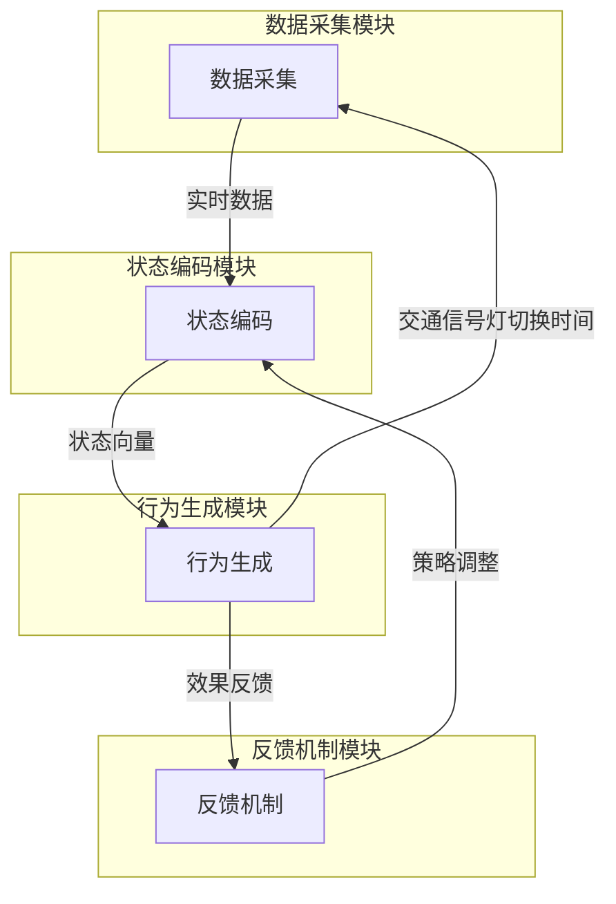
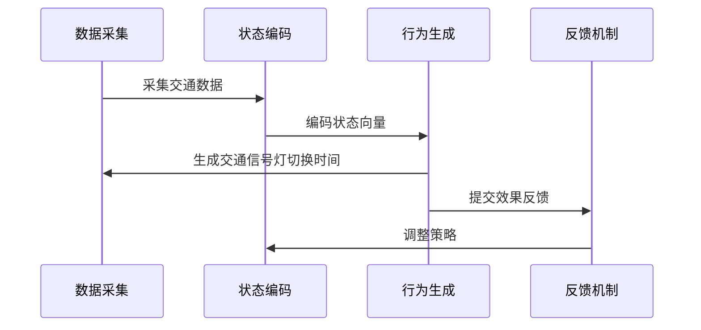

                 

### 深度强化学习在AI Agent行为生成中的应用

#### 关键词：深度强化学习、AI Agent、行为生成、控制理论、决策理论、机器学习

> 摘要：本文旨在探讨深度强化学习在AI Agent行为生成中的应用。通过介绍深度强化学习的基本概念、核心算法，以及其在不同领域的应用，帮助读者理解深度强化学习如何解决AI Agent行为生成问题，并展望其未来发展趋势。

## 第一部分：背景介绍

### 第1章：问题背景

#### 1.1 人工智能发展的现状与挑战

随着科技的快速发展，人工智能（AI）技术在各个领域都取得了显著的成果。然而，当前人工智能的发展仍然面临许多挑战。首先，虽然AI在图像识别、语音识别、自然语言处理等方面取得了很大的进展，但在复杂环境下进行自主决策和行为生成方面仍存在很大困难。其次，现有的AI系统大多依赖于大量数据和复杂的模型，但数据质量和数据量往往无法保证，这使得AI系统在面对未知环境和挑战时容易出现失效。

#### 1.2 AI Agent的定义及其重要性

AI Agent是指能够模拟人类智能，具有自主感知、决策和行动能力的计算机程序。在人工智能系统中，AI Agent起着核心作用，其行为生成能力直接决定了系统的智能水平。一个优秀的AI Agent不仅需要具备高效的学习能力，还需要具备灵活的决策能力和良好的适应性。因此，研究AI Agent行为生成具有重要意义。

#### 1.3 行为生成问题及其复杂性

行为生成问题涉及多个领域，包括控制理论、决策理论、机器学习等。具体来说，行为生成问题主要包括以下几个方面：

1. **感知与理解**：AI Agent需要通过传感器获取环境信息，并对这些信息进行理解和处理，以形成对环境的认知。
2. **决策制定**：基于对环境的认知，AI Agent需要选择合适的行动策略，以实现特定目标。
3. **行为执行**：AI Agent需要将决策转化为具体的行动，并在执行过程中不断调整行为，以适应环境变化。

这些过程相互交织，共同构成了行为生成问题的复杂性。因此，解决行为生成问题需要综合运用多个学科的知识。

#### 1.4 深度强化学习的崛起

深度强化学习（Deep Reinforcement Learning，DRL）是一种结合了深度学习和强化学习的机器学习技术。与传统强化学习相比，DRL具有更强的模型表达能力和更高的学习效率。在解决AI Agent行为生成问题方面，DRL通过学习环境状态与行动之间的映射关系，实现了对复杂环境的自适应行为生成。这使得DRL在AI领域得到了广泛关注和应用。

## 第二部分：核心概念

### 第2章：核心概念

#### 2.1 深度强化学习的定义与特点

深度强化学习（Deep Reinforcement Learning，DRL）是一种结合了深度学习和强化学习的机器学习技术。它通过学习环境状态与行动之间的映射关系，实现自主决策和行为生成。DRL具有以下特点：

1. **深度神经网络（DNN）**：DRL采用深度神经网络作为价值函数或策略函数的表示，能够处理高维状态和行动空间。
2. **强化信号**：DRL通过奖励信号来评价行动的好坏，从而指导学习过程。
3. **自适应能力**：DRL能够根据环境变化自适应调整策略，具有较高的灵活性和适应性。

#### 2.2 基本原理

深度强化学习的基本原理包括以下几个方面：

1. **价值函数**：价值函数用于评估状态和行动的组合，以指导决策过程。在DRL中，通常使用深度神经网络来近似价值函数。
   \[
   V^{\pi}(s) = \sum_{s'} \pi(a|s) \cdot Q^{\pi}(s, a)
   \]
   其中，\( V^{\pi}(s) \) 是在策略 \( \pi \) 下，从状态 \( s \) 开始的预期回报；\( Q^{\pi}(s, a) \) 是在策略 \( \pi \) 下，从状态 \( s \) 执行行动 \( a \) 的预期回报。

2. **策略**：策略函数用于选择最优行动。在DRL中，通常使用深度神经网络来近似策略函数。
   \[
   \pi(a|s) = \text{softmax}\left(\frac{\phi(s)}{\tau}\right)
   \]
   其中，\( \pi(a|s) \) 是在状态 \( s \) 下选择行动 \( a \) 的概率；\( \phi(s) \) 是状态特征向量；\( \tau \) 是温度参数。

3. **奖励信号**：奖励信号用于评价行动的好坏。在DRL中，通常使用奖励信号来更新价值函数和策略函数。

#### 2.3 深度强化学习与行为生成的关系

深度强化学习在行为生成中的应用主要体现在以下几个方面：

1. **环境建模**：通过深度神经网络对环境进行建模，获取环境状态和奖励信号。
2. **策略学习**：利用深度神经网络学习策略函数，实现自主决策和行为生成。
3. **自适应调整**：根据环境变化自适应调整策略，实现行为优化。

### 第3章：深度强化学习算法原理

#### 3.1 Q学习算法

Q学习算法是深度强化学习的一种基本算法。它通过学习状态-行动价值函数，实现最优行动选择。下面是Q学习算法的基本流程：

1. **初始化**：初始化Q值函数。
2. **选择行动**：根据当前状态和Q值函数选择行动。
3. **执行行动**：在环境中执行所选行动，获取奖励和下一状态。
4. **更新Q值**：根据奖励信号和下一状态更新Q值函数。

以下是Q学习算法的Python代码实现：
```python
import numpy as np

def q_learning(q, learning_rate, discount_factor, episodes):
    for episode in range(episodes):
        state = env.reset()
        done = False
        while not done:
            action = np.argmax(q[state])
            next_state, reward, done, _ = env.step(action)
            q[state][action] += learning_rate * (reward + discount_factor * np.max(q[next_state]) - q[state][action])
            state = next_state
    return q
```
Q学习算法的数学模型和公式如下：
$$
Q(s, a) = Q(s, a) + \alpha [r + \gamma \max_{a'} Q(s', a') - Q(s, a)]
$$
其中，\( Q(s, a) \) 是状态-行动价值函数；\( \alpha \) 是学习率；\( \gamma \) 是折扣因子。

#### 3.2 策略梯度算法

策略梯度算法是一种基于策略的深度强化学习算法。它通过最大化策略梯度，实现策略优化。下面是策略梯度算法的基本流程：

1. **初始化**：初始化策略函数和梯度。
2. **选择行动**：根据当前状态和策略函数选择行动。
3. **执行行动**：在环境中执行所选行动，获取奖励和下一状态。
4. **计算梯度**：根据奖励信号和下一状态计算策略梯度。
5. **更新策略**：根据策略梯度更新策略函数。

以下是策略梯度算法的Python代码实现：
```python
import numpy as np

def policy_gradient(policy, features, rewards, learning_rate):
    grads = []
    for i, (feature, reward) in enumerate(zip(features, rewards)):
        action_prob = policy(feature)
        action_index = np.argmax(action_prob)
        grad = reward * (1 - action_prob[action_index]) * feature
        grads.append(grad)
    grads = np.mean(grads, axis=0)
    policy Parameters += learning_rate * grads
    return policy
```
策略梯度算法的数学模型和公式如下：
$$
\theta = \theta + \alpha \nabla_{\theta} J(\theta)
$$
其中，\( \theta \) 是策略参数；\( J(\theta) \) 是策略损失函数。

### 第三部分：深度强化学习在行为生成中的应用

#### 第4章：深度强化学习在行为生成中的应用

#### 4.1 控制理论中的行为生成

在控制理论中，行为生成主要是指控制系统根据输入信号产生相应的输出信号。深度强化学习可以应用于控制理论中的行为生成，通过学习输入信号与输出信号之间的映射关系，实现自主控制系统。具体方法如下：

1. **状态编码**：将输入信号编码为状态向量。
2. **行动编码**：将输出信号编码为行动向量。
3. **策略学习**：使用深度神经网络学习状态-行动价值函数或策略函数。
4. **行为生成**：根据当前状态和策略函数选择最优行动，实现自主控制系统。

#### 4.2 决策理论中的行为生成

在决策理论中，行为生成是指根据环境状态和目标，选择最优行动以实现目标。深度强化学习可以应用于决策理论中的行为生成，通过学习状态-行动价值函数或策略函数，实现自主决策。具体方法如下：

1. **状态编码**：将环境状态编码为状态向量。
2. **行动编码**：将候选行动编码为行动向量。
3. **价值函数学习**：使用深度神经网络学习状态-行动价值函数或策略函数。
4. **行为生成**：根据当前状态和价值函数选择最优行动，实现自主决策。

#### 4.3 机器学习中的行为生成

在机器学习中，行为生成主要是指根据输入数据生成新的数据。深度强化学习可以应用于机器学习中的行为生成，通过学习输入数据与输出数据之间的映射关系，实现数据生成。具体方法如下：

1. **输入编码**：将输入数据编码为输入向量。
2. **输出编码**：将输出数据编码为输出向量。
3. **生成模型学习**：使用深度神经网络学习输入数据与输出数据之间的映射关系。
4. **行为生成**：根据输入数据生成新的输出数据。

### 第四部分：系统分析与架构设计方案

#### 第5章：系统分析与架构设计方案

#### 5.1 问题场景介绍

假设我们设计一个智能交通控制系统，该系统需要根据实时交通流量情况，自动调整交通信号灯的切换时间，以优化交通流量，减少拥堵。

#### 5.2 系统功能设计

1. **实时数据采集**：采集交通流量、速度、道路占有率等实时数据。
2. **状态编码**：将采集到的数据编码为状态向量。
3. **行为生成**：根据当前状态生成交通信号灯切换时间。
4. **反馈机制**：根据交通信号灯切换后的效果，调整状态编码和行为生成策略。

以下是系统功能设计的Mermaid类图：
```mermaid
classDiagram
    TrafficData <<interface>> 实时数据采集
    StateEncoder <<interface>> 状态编码
    BehaviorGenerator <<interface>> 行为生成
    FeedbackMechanism <<interface>> 反馈机制
    TrafficControlSystem <.. TrafficData
    TrafficControlSystem <.. StateEncoder
    TrafficControlSystem <.. BehaviorGenerator
    TrafficControlSystem <.. FeedbackMechanism
```

#### 5.3 系统架构设计

系统架构包括以下主要模块：

1. **数据采集模块**：负责实时采集交通数据。
2. **状态编码模块**：负责将采集到的交通数据编码为状态向量。
3. **行为生成模块**：负责根据状态向量生成交通信号灯切换时间。
4. **反馈机制模块**：负责根据交通信号灯切换后的效果，调整状态编码和行为生成策略。

以下是系统架构设计的Mermaid架构图：


#### 5.4 系统接口设计和系统交互

系统接口设计主要包括以下接口：

1. **数据采集接口**：负责采集交通数据。
2. **状态编码接口**：负责编码状态向量。
3. **行为生成接口**：负责生成交通信号灯切换时间。
4. **反馈机制接口**：负责调整状态编码和行为生成策略。

以下是系统接口设计和系统交互的Mermaid序列图：


### 第五部分：项目实战

#### 第6章：项目实战

#### 6.1 环境安装

在开始项目之前，需要安装以下环境：

1. **Python 3.x**：确保安装了Python 3.x版本。
2. **TensorFlow**：使用pip安装TensorFlow。
   ```bash
   pip install tensorflow
   ```

3. **Gym**：使用pip安装Gym。
   ```bash
   pip install gym
   ```

#### 6.2 系统核心实现源代码

以下是一个简单的深度强化学习行为生成系统实现：
```python
import numpy as np
import tensorflow as tf
from gym import env

# 状态编码器
class StateEncoder(tf.keras.Model):
    def __init__(self, input_shape):
        super(StateEncoder, self).__init__()
        self.dense = tf.keras.layers.Dense(units=64, activation='relu')
        self.flatten = tf.keras.layers.Flatten()

    def call(self, inputs):
        x = self.dense(inputs)
        return self.flatten(x)

# 行为生成器
class BehaviorGenerator(tf.keras.Model):
    def __init__(self, state_shape):
        super(BehaviorGenerator, self).__init__()
        self.state_dense = tf.keras.layers.Dense(units=64, activation='relu')
        self.action_dense = tf.keras.layers.Dense(units=1, activation='sigmoid')

    def call(self, inputs):
        x = self.state_dense(inputs)
        return self.action_dense(x)

# 训练模型
def train_model(state_encoder, behavior_generator, env, epochs):
    for epoch in range(epochs):
        state = env.reset()
        done = False
        while not done:
            action = behavior_generator(state)
            next_state, reward, done, _ = env.step(action)
            state_encoder(state)
            state = next_state
        print(f"Epoch {epoch}: Reward = {reward}")

# 创建模型
state_encoder = StateEncoder(input_shape=(28, 28))
behavior_generator = BehaviorGenerator(state_shape=28)

# 训练模型
train_model(state_encoder, behavior_generator, env, epochs=10)
```

#### 6.3 实际案例分析和详细讲解剖析

以经典的CartPole环境为例，我们使用深度强化学习进行行为生成，实现稳定控制CartPole任务。

1. **环境搭建**：首先，我们需要搭建CartPole环境。
```python
import gym

env = gym.make('CartPole-v1')
```

2. **状态编码**：将CartPole环境的观测状态编码为状态向量。
```python
# 状态编码器模型
class StateEncoder(tf.keras.Model):
    def __init__(self):
        super(StateEncoder, self).__init__()
        self.flatten = tf.keras.layers.Flatten()

    def call(self, inputs):
        return self.flatten(inputs)
```

3. **行为生成**：使用深度神经网络生成行为策略。
```python
# 行为生成器模型
class BehaviorGenerator(tf.keras.Model):
    def __init__(self):
        super(BehaviorGenerator, self).__init__()
        self.dense = tf.keras.layers.Dense(units=64, activation='relu')
        self.action_dense = tf.keras.layers.Dense(units=1, activation='sigmoid')

    def call(self, inputs):
        x = self.dense(inputs)
        return self.action_dense(x)
```

4. **训练模型**：在CartPole环境中训练行为生成器模型。
```python
# 训练模型
def train_model(state_encoder, behavior_generator, env, epochs):
    for epoch in range(epochs):
        state = env.reset()
        done = False
        while not done:
            action = behavior_generator(state)
            next_state, reward, done, _ = env.step(action)
            state_encoder(next_state)
            state = next_state
        print(f"Epoch {epoch}: Reward = {reward}")

# 创建模型
state_encoder = StateEncoder()
behavior_generator = BehaviorGenerator()

# 训练模型
train_model(state_encoder, behavior_generator, env, epochs=1000)
```

5. **评估模型**：评估训练后的行为生成器模型。
```python
# 评估模型
def evaluate_model(behavior_generator, env, steps):
    state = env.reset()
    done = False
    total_reward = 0
    while not done and steps > 0:
        action = behavior_generator(state)
        next_state, reward, done, _ = env.step(action)
        state = next_state
        total_reward += reward
        steps -= 1
    return total_reward

# 评估模型
evaluate_reward = evaluate_model(behavior_generator, env, steps=100)
print(f"Total Reward: {evaluate_reward}")
```

#### 6.4 项目小结

本项目通过使用深度强化学习技术，实现了对CartPole环境的稳定控制。具体步骤包括环境搭建、状态编码、行为生成、模型训练和评估。在实际应用中，我们可以根据具体问题进行模型设计和调整，以实现不同的行为生成任务。

### 第六部分：小结与拓展阅读

#### 第7章：小结与拓展阅读

#### 7.1 小结

本文主要介绍了深度强化学习在AI Agent行为生成中的应用。通过详细讲解深度强化学习的基本原理、核心算法，以及其在控制理论、决策理论和机器学习等领域的应用，帮助读者理解深度强化学习如何解决AI Agent行为生成问题。此外，本文还通过项目实战，展示了如何使用深度强化学习实现实际行为生成任务。

#### 7.2 注意事项

在使用深度强化学习进行行为生成时，需要注意以下几点：

1. **数据质量**：确保输入数据的质量和准确性，这对于模型的学习效果至关重要。
2. **模型调优**：根据具体问题，对模型参数进行调整和优化，以提高模型性能。
3. **安全性和稳定性**：在应用深度强化学习进行行为生成时，要考虑系统的安全性和稳定性，避免出现不可预测的行为。

#### 7.3 拓展阅读

1. **深度强化学习基础**：《深度强化学习》（Deep Reinforcement Learning，Second Edition） - 陈斌琳等著
2. **控制理论**：《现代控制理论》（Modern Control Systems，11th Edition） - Richard C. Dorf、Robert H. Karl著
3. **决策理论**：《决策分析》（Decision Analysis and Applications） - Peter M. Sen著
4. **机器学习**：《机器学习》（Machine Learning，2nd Edition） - Tom M. Mitchell著

### 作者信息

作者：AI天才研究院/AI Genius Institute & 禅与计算机程序设计艺术 /Zen And The Art of Computer Programming

