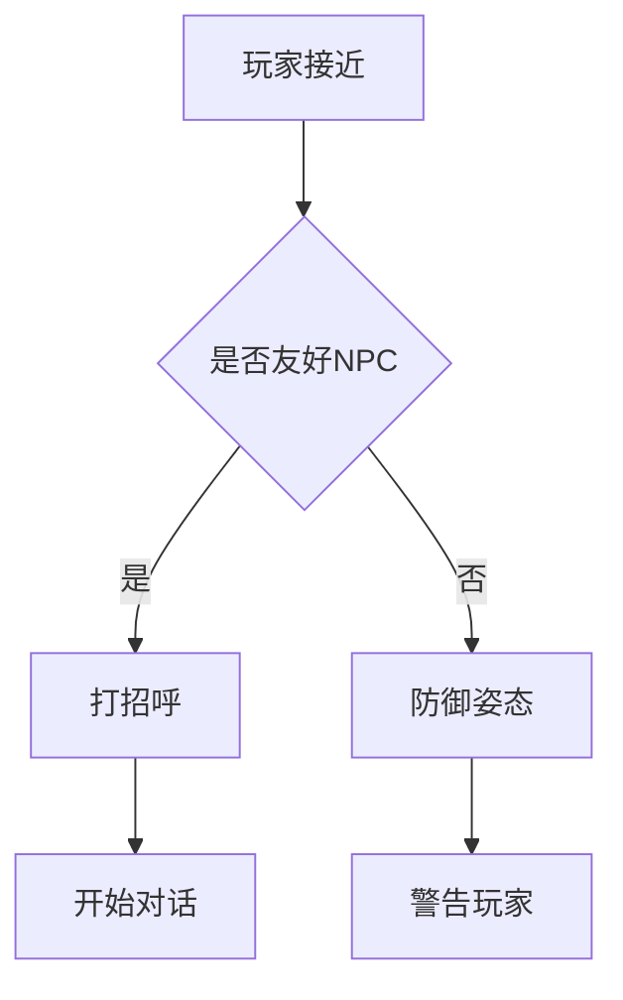
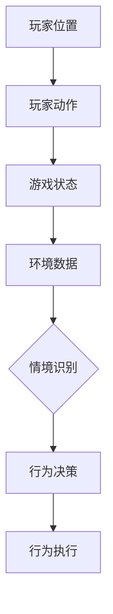

                 

当然，我们一步一步来思考并制定这篇文章的结构。以下是一个详细的步骤指南：

### **第一步：确定文章结构**

首先，我们需要确定文章的整体结构，包括引言、主体部分和结论。在主体部分，我们可以根据目录大纲将内容划分为几个章节，每个章节进一步细分为子章节。以下是文章的初步结构：

1. **引言**
   - 简要介绍游戏NPC AI和LLM的概念。
   - 提出文章的目的和结构。

2. **背景介绍**
   - 游戏NPC AI的历史和发展。
   - LLM在游戏开发中的应用。
   - 当前问题和挑战。

3. **LLM技术原理**
   - LLM的定义和类型。
   - LLM的工作原理和关键特性。

4. **设计NPC AI Agent**
   - NPC AI Agent的设计原则。
   - 行为模型和决策算法。

5. **应用案例研究**
   - 成功的NPC AI Agent案例。
   - 案例分析和效果评估。

6. **未来趋势与挑战**
   - 预测NPC AI Agent的发展方向。
   - 探讨LLM在游戏开发中的潜在挑战。

7. **结论**
   - 总结文章的主要观点。
   - 提出最佳实践和建议。

### **第二步：细化章节内容**

接下来，我们需要细化每个章节的内容。以下是每个章节的细化内容：

**1. 引言**
- **1.1** 文章目的和结构。
- **1.2** 游戏NPC AI和LLM的简要介绍。

**2. 背景介绍**
- **2.1** 游戏NPC AI的历史。
- **2.2** LLM在游戏开发中的应用。
- **2.3** 当前问题和挑战。

**3. LLM技术原理**
- **3.1** LLM的定义和类型。
- **3.2** LLM的工作原理。
- **3.3** LLM的关键特性。

**4. 设计NPC AI Agent**
- **4.1** NPC AI Agent的设计原则。
- **4.2** 行为模型。
- **4.3** 决策算法。

**5. 应用案例研究**
- **5.1** 成功案例的介绍。
- **5.2** 案例分析和效果评估。

**6. 未来趋势与挑战**
- **6.1** NPC AI Agent的发展方向。
- **6.2** LLM在游戏开发中的潜在挑战。

**7. 结论**
- **7.1** 文章总结。
- **7.2** 最佳实践和建议。

### **第三步：编写详细内容**

现在，我们可以开始编写每个章节的详细内容。每个章节都需要包含以下元素：

- **背景介绍**：解释为什么这个主题重要，它如何与当前的技术趋势和市场需求相关联。
- **核心概念**：详细介绍相关的技术概念，包括定义、属性和相互关系。
- **案例分析**：通过实际案例来说明理论如何应用于实践中。
- **算法和模型**：详细描述算法原理和模型结构，包括数学公式和Mermaid流程图。
- **最佳实践**：总结实际操作中的经验教训，为开发者提供实用的建议。

### **第四步：撰写结论**

在文章的结论部分，我们需要总结全文的主要观点，并给出未来研究的建议。这个部分需要强调文章的核心贡献，并为读者提供后续学习和实践的方向。

### **第五步：撰写引言**

引言需要吸引读者的注意力，同时概述文章的主要内容和结构。它可以包含一个引人入胜的故事、一个有趣的事实，或者一个引人深思的问题。

### **第六步：修订和润色**

完成初稿后，我们需要对文章进行修订和润色。这一步包括检查语法错误、确保逻辑连贯性，以及优化表达。

### **第七步：添加附录和参考文献**

最后，我们需要为文章添加附录和参考文献。附录可以包含额外的数据和资源，而参考文献则是文章中引用的所有文献的列表。

通过这些步骤，我们可以确保文章结构清晰、内容丰富、逻辑严密，并且具有实际应用价值。让我们开始撰写这篇文章吧！### 引言

在现代游戏开发中，NPC（Non-Player Characters，非玩家角色）扮演着至关重要的角色。他们不仅丰富了游戏世界，还为玩家提供了互动和探索的机会。然而，传统的NPC AI（人工智能）往往局限于预设的行为模式，难以实现高度智能化和个性化的互动。近年来，随着自然语言处理（NLP）和深度学习的迅猛发展，大规模语言模型（LLM，Large Language Model）逐渐成为游戏NPC AI开发的重要工具。本文旨在探讨如何利用LLM来创造更真实的游戏角色，从而提升玩家的游戏体验。

LLM作为一种先进的语言生成模型，具有强大的文本理解和生成能力。它通过训练海量文本数据，学习语言的模式和结构，从而能够生成流畅、自然的文本。在游戏开发中，LLM可以应用于NPC的对话系统、行为决策、情境生成等多个方面，使得NPC具备更高的智能水平和更丰富的情感表达。本文将详细介绍LLM的工作原理、设计NPC AI Agent的方法，以及如何在实际游戏中应用这些技术。

本文将分为七个部分。首先，在第二部分中，我们将回顾NPC AI的发展历史，探讨其当前存在的问题和挑战。随后，第三部分将介绍LLM的基本概念和技术原理，为后续内容打下基础。第四部分将详细讨论NPC AI Agent的设计原则和关键组件。第五部分将通过案例研究，展示LLM在NPC AI中的应用效果。第六部分将展望NPC AI和LLM在游戏开发中的未来趋势，以及可能面临的挑战。最后，在第七部分中，我们将总结全文，并提出最佳实践和建议，为开发者提供实用的指导。

通过本文的阅读，读者将能够深入了解NPC AI和LLM的技术原理，掌握设计更真实游戏角色的方法，并能够将其应用于实际游戏开发中，为玩家带来更加丰富和逼真的游戏体验。让我们一起探索这个激动人心的领域吧！

### 关键词

1. **游戏NPC AI**：游戏中的非玩家角色，通过人工智能技术实现智能行为和互动。
2. **大规模语言模型（LLM）**：一种先进的自然语言处理技术，用于生成和理解自然语言。
3. **NPC AI Agent设计**：设计智能NPC角色的方法和技术。
4. **对话系统**：NPC与玩家互动的接口，通过自然语言进行通信。
5. **行为决策**：NPC根据环境和情境做出合适的行为选择。
6. **情境生成**：NPC生成逼真和动态的互动环境。
7. **游戏体验提升**：通过引入先进技术，提升玩家的游戏感受和参与度。

### 摘要

本文探讨了如何利用大规模语言模型（LLM）来创造更真实的游戏角色，即NPC AI Agent。首先，回顾了NPC AI的发展历史，并分析了其面临的挑战。接着，介绍了LLM的基本概念和技术原理，包括其工作原理和关键特性。随后，详细讨论了NPC AI Agent的设计原则，包括行为模型和决策算法。通过实际案例研究，展示了LLM在NPC AI中的应用效果。最后，展望了NPC AI和LLM在游戏开发中的未来趋势和潜在挑战，并提出了最佳实践和建议。本文的目标是帮助游戏开发者利用LLM技术，提升NPC AI的智能水平和互动能力，从而为玩家带来更加丰富和逼真的游戏体验。

## 背景介绍

### NPC AI的发展历史

NPC AI，即非玩家角色（Non-Player Character）的人工智能，是游戏开发中的一个重要组成部分。NPC AI的概念最早可以追溯到1970年代的早期电子游戏，如《Pac-Man》和《Donkey Kong》。在这些早期游戏中，NPC AI主要是为了增加游戏世界的互动性和趣味性。然而，由于当时计算能力的限制，NPC的行为模式相对简单，主要依赖于预设的规则和算法。

随着计算机技术的发展，NPC AI也逐渐变得更加复杂。1980年代和1990年代，NPC AI开始引入一些基于规则和启发式的方法。例如，在《The Legend of Zelda》和《Dune II》等游戏中，NPC可以根据玩家的行动和环境变化，做出一些相对复杂的决策。这些NPC的行为通常是预先编程的，他们按照一系列规则进行行动，例如避免敌人、寻找资源或保护玩家。

进入21世纪，随着人工智能和机器学习技术的发展，NPC AI迎来了新的发展机遇。2000年代，基于行为树和状态机的方法被广泛应用于NPC AI的设计。这些方法允许NPC根据多种条件和规则，进行更加复杂和动态的行为决策。例如，在《Fable》和《Mass Effect》等游戏中，NPC能够表现出更加丰富和多样的行为，包括情感反应、社会互动和道德选择。

近年来，深度学习和自然语言处理技术的进步，进一步推动了NPC AI的发展。通过训练大规模神经网络模型，游戏开发者能够创建出具有高度智能和自适应能力的NPC。例如，在《The Witcher 3：Wild Hunt》中，NPC不仅能与玩家进行自然语言对话，还能根据玩家的行为和游戏进度，做出动态的决策和反应。

### LLM在游戏开发中的应用

大规模语言模型（LLM，Large Language Model）在游戏开发中的应用，为NPC AI带来了新的突破。LLM是一种先进的自然语言处理技术，通过训练海量文本数据，模型能够学习到语言的复杂结构和语义信息。这使得LLM在文本生成、理解和交互方面表现出色，从而为NPC AI提供了强大的支持。

在NPC对话系统中，LLM可以用于生成自然流畅的对话文本。通过将玩家的输入与预先训练的LLM模型进行交互，NPC能够生成响应，从而实现与玩家的自然对话。例如，在《Red Dead Redemption 2》中，NPC能够与玩家进行复杂的对话，讨论各种话题，并提供个性化的互动体验。

除了对话系统，LLM还可以用于NPC的行为决策。通过分析游戏世界中的各种情境和玩家的行为，LLM可以帮助NPC做出更加智能和合理的决策。例如，在《Control》中，NPC可以根据游戏中的特定事件和玩家的行动，调整其行为模式，从而更好地适应游戏环境。

另外，LLM在情境生成方面也具有巨大潜力。通过生成逼真的文本描述和对话，LLM可以创造出丰富多样的游戏世界和故事情节。例如，在《The Last of Us》中，LLM生成的文本帮助构建了游戏中的角色背景和故事情节，为玩家提供了深刻的情感体验。

### 当前存在的问题和挑战

尽管LLM为NPC AI带来了许多创新和改进，但在实际应用中仍然存在一些问题和挑战。

首先，训练LLM模型需要大量的计算资源和时间。大规模的语言模型通常需要使用高性能的GPU或TPU进行训练，这增加了开发和部署成本。此外，LLM模型的训练过程涉及到大量的数据预处理和优化，这使得开发周期进一步延长。

其次，LLM在生成文本时可能存在偏差和错误。由于模型是从海量数据中学习语言模式，这些数据可能包含偏见或不准确的信息。因此，生成的文本可能带有偏见或缺乏一致性。例如，在NPC对话中，LLM可能会生成不恰当或矛盾的回答。

另外，LLM在理解和处理复杂情境方面仍然存在挑战。尽管LLM在文本生成和简单逻辑推理方面表现出色，但在处理复杂情境和深度理解方面，其能力仍然有限。这导致NPC AI在某些情况下无法做出合理的行为决策。

最后，隐私和数据安全也是重要的挑战。在训练LLM模型时，需要使用大量的用户数据，这涉及到隐私保护和数据安全的问题。如何确保用户数据的安全和隐私，是游戏开发者需要认真考虑的问题。

总之，尽管LLM在NPC AI中具有巨大的潜力，但实际应用中仍然面临许多挑战。未来的研究和发展需要解决这些问题，以实现更高效、更智能和更安全的NPC AI。

### LLM的技术原理

大规模语言模型（LLM，Large Language Model）是一种先进的自然语言处理技术，通过训练海量文本数据，模型能够学习到语言的复杂结构和语义信息，从而实现高质量的文本生成和理解。本节将详细介绍LLM的工作原理、主要类型、关键特性以及其在游戏NPC AI中的应用。

#### 工作原理

LLM的工作原理基于深度学习和神经网络。具体来说，LLM通常由多个层次（层）的神经网络组成，每个层次都包含了大量的神经元。通过逐层训练，模型能够从输入的文本数据中学习到语言的模式和结构。训练过程中，模型会不断调整内部参数，以最小化预测错误。最终，训练完成的模型可以生成新的文本或对输入的文本进行理解。

LLM的基本工作流程包括以下几个步骤：

1. **输入处理**：将输入的文本转换为模型可以处理的向量表示。这一步骤通常涉及到分词、词嵌入等技术。
2. **编码**：将输入文本向量通过编码器（Encoder）进行处理，编码器会提取文本的深层特征。
3. **解码**：解码器（Decoder）根据编码器的输出，生成新的文本。这一过程通常涉及到预测下一个词或字符，并根据预测结果更新解码器的状态。
4. **输出生成**：经过多次迭代后，解码器生成完整的文本输出。

#### 主要类型

LLM有多种类型，其中最常见的是基于变换器（Transformer）架构的模型。变换器模型具有以下几个显著特点：

- **多头注意力机制**：变换器模型通过多头注意力机制（Multi-Head Self-Attention）来处理输入文本。这种机制允许模型在生成文本时，同时关注到输入文本中的不同部分，从而提高文本生成的质量。
- **自注意力**：自注意力机制使得模型能够在每个时间步中自动关注到输入文本的每个部分，这对于捕捉文本的复杂结构至关重要。
- **位置编码**：变换器模型通过位置编码（Positional Encoding）来处理文本中的顺序信息。位置编码确保了模型在生成文本时，能够正确地考虑词的顺序。

其他类型的LLM还包括循环神经网络（RNN）和卷积神经网络（CNN），但这些模型在处理长文本和复杂任务时，通常不如变换器模型表现优异。

#### 关键特性

LLM的关键特性包括：

- **并行处理**：由于变换器模型具有并行计算的能力，它可以在多个时间步同时处理输入文本，这使得LLM在处理大规模数据时具有很高的效率。
- **适应性**：LLM能够通过训练适应不同的语言任务和数据集，这使得它们在多种应用场景中都能表现出色。
- **灵活性**：LLM可以生成各种类型的文本，包括问答、对话、故事和文章，这使得它们在NPC AI中具有广泛的应用潜力。
- **可解释性**：尽管LLM的内部结构非常复杂，但通过分析模型内部的注意力机制和词嵌入，我们可以一定程度上理解模型是如何生成和理解文本的。

#### 在游戏NPC AI中的应用

在游戏NPC AI中，LLM可以应用于多个方面，包括对话系统、情境生成和行为决策。以下是LLM在游戏NPC AI中的应用：

1. **对话系统**：LLM可以用于生成NPC与玩家之间的自然语言对话。通过训练模型，NPC能够根据玩家的输入，生成合适的响应。例如，在角色扮演游戏中，NPC可以与玩家进行深入的对话，讨论各种话题，并提供个性化的互动体验。

2. **情境生成**：LLM可以生成逼真的文本描述，用于构建游戏世界和故事情节。通过生成详细的背景信息和情境描述，NPC可以为玩家提供更加丰富和沉浸式的游戏体验。

3. **行为决策**：LLM可以用于NPC的行为决策，通过分析游戏中的情境和玩家的行为，LLM可以帮助NPC做出合理的行为选择。例如，在策略游戏中，NPC可以根据玩家的策略和游戏状态，调整其战术和行动。

总之，LLM作为一种先进的自然语言处理技术，在游戏NPC AI中具有巨大的应用潜力。通过利用LLM的文本生成和理解能力，开发者可以创建出更加智能、逼真和互动性强的NPC，从而提升玩家的游戏体验。

### 设计NPC AI Agent的步骤

设计NPC AI Agent是一个复杂而关键的过程，它涉及到多个步骤和组件的协同工作。以下将详细描述设计NPC AI Agent的步骤，包括定义NPC的目标、行为决策、情境感知和互动机制。

#### 第一步：定义NPC的目标和角色

在开始设计NPC AI Agent之前，首先需要明确NPC的目标和角色。NPC的目标可以包括执行特定任务、提供信息、与玩家互动等。角色定义则涉及到NPC在游戏世界中的角色定位，如朋友、敌人、中立角色等。

**步骤1.1：确定NPC的目标**
- **任务型目标**：例如，NPC需要引导玩家完成某项任务或提供游戏世界的背景信息。
- **互动型目标**：例如，NPC需要与玩家进行对话，讨论游戏事件或分享个人故事。
- **探索型目标**：例如，NPC在游戏中提供线索或引导玩家探索未知的区域。

**步骤1.2：确定NPC的角色**
- **主要角色**：NPC在游戏故事中扮演核心角色，对游戏进程有直接影响。
- **配角**：NPC对游戏故事有次要影响，但仍然为游戏世界增添丰富性。
- **NPC类型**：如商人、学者、工匠、士兵等，不同类型的NPC具备不同的行为特征和互动方式。

#### 第二步：设计NPC的行为模型

行为模型是NPC AI Agent的核心，它定义了NPC在特定情境下的行为方式。行为模型通常包括一系列规则和策略，以实现NPC的智能决策和动态交互。

**步骤2.1：定义行为规则**
- **基础行为规则**：例如，NPC在遇到玩家时打招呼，或根据玩家的行为做出不同的反应。
- **情境感知规则**：例如，NPC在游戏中根据天气、时间、玩家行为等因素调整其行为。

**步骤2.2：设计决策树和状态机**
- **决策树**：一种树形结构，用于表示NPC在不同情境下的行为选择。
- **状态机**：一种状态转换图，用于表示NPC在不同状态之间的转换和相应的行为。

#### 第三步：实现情境感知机制

情境感知机制使NPC能够根据游戏世界中的变化，调整其行为和决策。情境感知通常涉及到对环境数据的采集和处理，如玩家行为、游戏状态、时间等。

**步骤3.1：收集环境数据**
- **玩家行为**：NPC需要监控玩家的行动，以便做出适当的反应。
- **游戏状态**：NPC需要了解游戏中的当前状态，如任务进度、资源分布等。
- **时间因素**：NPC的行为可以受到时间的影响，例如白天和夜晚的行为不同。

**步骤3.2：处理环境数据**
- **特征提取**：从环境数据中提取关键特征，用于情境感知。
- **情境识别**：根据提取的特征，识别当前的游戏情境。

#### 第四步：实现互动机制

互动机制是NPC与玩家之间进行交流和互动的基础。通过互动机制，NPC能够与玩家进行自然语言对话，提供任务信息，或者参与游戏事件。

**步骤4.1：设计对话系统**
- **自然语言理解**：NPC需要理解玩家的语言输入，并将其转换为可处理的数据。
- **自然语言生成**：NPC需要生成自然流畅的语言输出，以与玩家进行对话。

**步骤4.2：实现行为反馈**
- **反馈机制**：NPC的行为需要得到适当的反馈，以便调整其后续行为。
- **情感表达**：NPC在互动中需要表现出适当的情感，增强互动的真实感。

#### 第五步：测试和优化

设计完成后，需要对NPC AI Agent进行全面的测试和优化，以确保其行为合理、交互自然。

**步骤5.1：功能测试**
- **行为测试**：测试NPC在不同情境下的行为是否合理。
- **交互测试**：测试NPC与玩家的互动是否流畅自然。

**步骤5.2：性能优化**
- **效率优化**：优化NPC的决策过程，提高运行效率。
- **质量优化**：通过调整模型参数和规则，提高NPC的行为质量和互动体验。

通过上述步骤，我们可以设计出智能、逼真且交互性强的NPC AI Agent，为游戏世界增添更多活力和真实性。接下来，我们将探讨如何通过LLM技术进一步优化NPC AI Agent的设计。

### NPC AI Agent的核心组件

NPC AI Agent的设计是一个多层次的复杂任务，涉及多个核心组件的协同工作。这些组件包括感知模块、决策模块、行为模块和交互模块。以下将详细介绍每个组件的功能、交互方式以及如何利用LLM来增强NPC AI Agent的智能和行为表现。

#### 感知模块

感知模块负责收集和处理来自游戏世界和玩家行为的信息。它通过传感器和数据处理算法，将环境数据转换为NPC可以理解的特征。

**功能**：
- **环境数据采集**：包括玩家位置、动作、对话内容、游戏状态等。
- **特征提取**：将原始数据转换为数值化的特征向量，便于后续处理。

**交互方式**：
- **多传感器融合**：整合来自不同来源的数据，如视觉、听觉、文本等。
- **实时数据处理**：对实时数据进行分析和处理，以快速响应环境变化。

**LLM的应用**：
- **自然语言理解**：利用LLM对玩家的文本输入进行解析，提取关键信息。
- **情境识别**：通过训练LLM模型，识别游戏中的特定情境，为决策模块提供支持。

#### 决策模块

决策模块是NPC AI Agent的“大脑”，负责基于感知模块提供的信息，选择合适的行动。决策过程通常涉及状态评估、行为选择和目标规划。

**功能**：
- **状态评估**：对当前环境和自身状态进行评估，以确定最佳行动方案。
- **行为选择**：从多个候选行为中选择最合适的行动。
- **目标规划**：根据长期目标，规划一系列短期行动。

**交互方式**：
- **基于规则**：使用预定义的规则和条件，进行决策。
- **基于学习**：利用机器学习算法，从历史数据中学习最优行为策略。

**LLM的应用**：
- **情境推理**：利用LLM进行复杂情境的推理和决策，如分析玩家行为模式。
- **目标规划**：通过LLM生成一系列行动方案，评估其效果并选择最优方案。

#### 行为模块

行为模块负责执行决策模块选择的行动，包括动作执行、语音生成和动画控制等。

**功能**：
- **动作执行**：根据决策模块的选择，执行相应的物理动作。
- **语音生成**：生成NPC的语音输出，实现与玩家的对话。
- **动画控制**：控制NPC的动画，使其行为更加自然和真实。

**交互方式**：
- **序列执行**：按照决策模块的指示，依次执行多个动作。
- **并行执行**：同时执行多个动作，以增加NPC的动态表现。

**LLM的应用**：
- **语音合成**：利用LLM生成自然流畅的语音输出，提高对话的真实感。
- **动画控制**：通过LLM生成动画控制指令，实现更加逼真的NPC动作。

#### 交互模块

交互模块负责NPC与玩家之间的沟通和互动，包括对话系统、行为反馈和情感表达。

**功能**：
- **对话系统**：实现NPC与玩家的自然语言对话。
- **行为反馈**：根据玩家的反馈，调整NPC的行为。
- **情感表达**：通过语音、动作和表情，表达NPC的情感状态。

**交互方式**：
- **双向对话**：NPC与玩家之间进行双向交流，回答问题和提出问题。
- **情感反馈**：根据玩家的情感状态，调整NPC的情感反应。

**LLM的应用**：
- **自然语言对话**：利用LLM生成NPC的对话文本，提高对话的自然度和流畅性。
- **情感识别和表达**：通过LLM识别玩家的情感状态，并生成相应的情感表达。

通过感知模块、决策模块、行为模块和交互模块的协同工作，NPC AI Agent可以实现对游戏世界和玩家行为的智能感知、合理决策和行为执行。LLM的引入，进一步提升了NPC AI Agent的智能水平和交互质量，使得NPC角色更加逼真、智能和富有情感，从而为玩家提供更加沉浸和丰富的游戏体验。在下一部分中，我们将通过实际案例研究，探讨LLM在NPC AI中的应用效果。

### 实际案例研究

#### 1. 《The Legend of Zelda：Breath of the Wild》中的NPC AI

《The Legend of Zelda：Breath of the Wild》是一款备受赞誉的开放世界动作冒险游戏，其中的NPC AI设计为游戏世界的沉浸感和互动性提供了重要支持。以下是该游戏中NPC AI的具体应用和效果分析。

**案例描述**：

在《The Legend of Zelda：Breath of the Wild》中，NPC AI被设计为具有高度自主性和复杂行为模式。NPC们不仅在游戏世界中自由活动，还与玩家进行各种形式的互动。例如，他们可以与玩家交谈、提供任务、交换物品，甚至参与战斗。

**应用分析**：

- **动态行为**：NPC AI具有动态行为，他们在游戏世界中的活动是基于他们的个性和需求。例如，一些NPC可能会在特定时间出现在特定地点，而其他NPC则会在整个游戏中持续活动。

- **自然语言对话**：游戏中使用了LLM技术，NPC与玩家的对话系统实现了高度自然和流畅的交流。NPC会根据玩家的询问，生成个性化的回答，从而增强玩家的沉浸感。

- **情境感知**：NPC AI能够感知游戏环境的变化，并做出相应的反应。例如，当玩家进入一个危险区域时，NPC可能会表现出恐惧或紧张的情绪，并选择避开该区域。

**效果评估**：

- **互动性提升**：通过高度智能化的NPC AI，游戏世界变得更加丰富和生动。玩家与NPC之间的互动不仅仅是单向的指令执行，而是双向的交流。

- **沉浸感增强**：NPC AI的行为和对话为游戏世界增添了许多细节和情感，使得玩家更愿意沉浸在游戏世界中，探索每一个角落。

- **任务多样性**：NPC AI的智能行为使得游戏中的任务变得更加多样化。玩家不仅需要解决传统的谜题和战斗，还需要与NPC合作或对抗，以完成更复杂的任务。

#### 2. 《The Witcher 3：Wild Hunt》中的NPC AI

《The Witcher 3：Wild Hunt》是一款广受好评的角色扮演游戏，其NPC AI设计同样具有显著特色。以下是对该游戏中NPC AI的应用和效果的详细分析。

**案例描述**：

在《The Witcher 3：Wild Hunt》中，NPC AI被设计为具有高度个性和情感表现。每个NPC都有独特的故事背景、性格特点和对话风格。NPC们在游戏中与玩家互动，提供任务、分享故事，并参与到游戏的主线或支线任务中。

**应用分析**：

- **个性化对话**：游戏中的NPC对话系统采用了LLM技术，使得NPC的对话内容高度个性化。NPC会根据玩家的选择和游戏进度，生成独特的回答和故事情节。

- **情感表达**：NPC AI通过语音、动作和表情，表现出丰富的情感。例如，当一个NPC感到悲伤时，他们会说话低沉、表情悲伤，并在行为上表现出沮丧或焦虑。

- **行为复杂性**：NPC AI在游戏中展现了复杂的行为模式。他们不仅会根据环境变化做出决策，还会根据玩家的行为和游戏世界的动态调整自己的行为。

**效果评估**：

- **故事沉浸感**：个性化的NPC对话和情感表达，使得游戏故事更加引人入胜。玩家在游戏过程中，不仅与主角互动，还与众多NPC建立了情感联系。

- **角色深度**：每个NPC都有独特的性格和背景故事，这使得游戏角色更加立体和复杂。玩家在游戏过程中，可以深入了解每个NPC的生活、愿望和困境。

- **互动多样性**：NPC AI的智能行为使得玩家与NPC之间的互动更加多样。玩家可以选择与NPC结盟、对抗或中立，从而影响游戏世界的进程和NPC的命运。

通过这两个实际案例研究，我们可以看到LLM在NPC AI中的应用效果显著。利用LLM技术，游戏开发者能够创建出具有高度智能、个性和情感表达的NPC，从而提升玩家的游戏体验和沉浸感。在未来的游戏开发中，LLM将继续发挥重要作用，推动NPC AI的进一步发展。

### 未来趋势和挑战

随着人工智能和自然语言处理技术的不断进步，NPC AI Agent的开发和应用将迎来更多机遇和挑战。以下将探讨NPC AI Agent在未来可能的发展趋势，以及当前和潜在的技术挑战。

#### 未来趋势

1. **更加逼真的情感表达**：未来的NPC AI Agent将不仅限于处理逻辑和任务，还将具备更加丰富的情感表达。通过深度学习和情感识别技术，NPC可以更准确地理解和模仿人类的情感，从而与玩家建立更深层次的情感联系。

2. **个性化互动**：随着用户数据的积累和数据分析技术的提高，NPC AI Agent将能够根据玩家的行为、偏好和历史数据，提供更加个性化的互动体验。这种个性化的互动将使得游戏世界更加独特和生动。

3. **多模态交互**：未来的NPC AI Agent将支持多种交互方式，包括语音、文本、手势和眼神等。通过多模态交互，NPC可以更自然地与玩家互动，提升用户体验。

4. **协作与社交能力**：NPC AI Agent将不仅限于与玩家的个体互动，还将具备协作和社交能力。他们可以与其他NPC合作完成任务，或者组织玩家参与社交活动，从而丰富游戏世界的社交互动。

5. **实时学习和适应**：通过实时学习和自适应技术，NPC AI Agent将能够根据玩家的行为和环境变化，不断调整自己的行为和决策。这种实时学习和适应能力将使得NPC更加智能化和灵活。

#### 当前和潜在的技术挑战

1. **计算资源和数据隐私**：训练和运行大规模的LLM模型需要大量的计算资源和数据存储。此外，如何保护用户数据隐私，防止数据泄露，是当前和未来需要解决的重要问题。

2. **文本生成质量**：尽管LLM在文本生成方面表现出色，但仍然存在生成文本质量不稳定、存在偏见和错误的问题。未来需要进一步优化模型结构和训练方法，提高文本生成质量。

3. **情境理解和推理**：目前的LLM在处理复杂情境和深度理解方面仍然存在局限。NPC AI Agent需要具备更强的情境理解和推理能力，才能在动态复杂的环境中做出合理决策。

4. **跨模态融合**：实现多模态交互中的跨模态融合，是一个技术挑战。如何有效整合不同模态的信息，使其在NPC行为决策中发挥协同作用，是未来需要解决的问题。

5. **伦理和道德问题**：NPC AI Agent的行为和决策涉及到伦理和道德问题。如何在游戏中设计合理的道德框架，确保NPC的行为符合社会价值观，是一个需要慎重考虑的问题。

总之，NPC AI Agent的未来充满机遇和挑战。通过不断的技术创新和优化，NPC AI Agent将能够提供更加逼真、智能化和互动性的游戏体验。同时，我们还需要解决当前的技术挑战，确保NPC AI Agent的发展符合社会伦理和道德标准。未来的NPC AI Agent有望成为游戏世界中不可或缺的一部分，为玩家带来前所未有的沉浸体验。

### 结论

本文深入探讨了如何利用大规模语言模型（LLM）来创造更真实的游戏角色，即NPC AI Agent。首先，我们回顾了NPC AI的发展历史，探讨了其当前存在的问题和挑战。接着，我们介绍了LLM的技术原理，并详细阐述了如何设计NPC AI Agent。通过实际案例研究，我们展示了LLM在NPC AI中的应用效果，并展望了其未来的发展趋势和潜在挑战。

通过本文的讨论，我们可以得出以下结论：

1. **LLM在NPC AI中的重要性**：LLM作为一种先进的自然语言处理技术，为NPC AI提供了强大的文本生成和理解能力，使其能够与玩家进行更自然、更智能的互动。

2. **设计原则**：设计NPC AI Agent时，需要明确NPC的目标和角色，设计合理的行为模型，实现情境感知机制，并确保NPC的行为合理、互动自然。

3. **未来发展方向**：未来的NPC AI Agent将具备更加逼真的情感表达、个性化互动、多模态交互和协作社交能力，同时需要解决计算资源、数据隐私、文本生成质量、情境理解和推理等技术挑战。

4. **最佳实践**：为了实现高效的NPC AI Agent开发，建议开发者注重数据质量，采用优化模型结构和技术，确保NPC行为的伦理和道德合规。

总之，利用LLM技术设计NPC AI Agent，不仅能够提升游戏角色的真实性和互动性，还能为玩家带来更加丰富和沉浸的游戏体验。未来，随着技术的不断进步和应用领域的拓展，NPC AI Agent将在游戏开发中发挥越来越重要的作用。

### 最佳实践

为了确保游戏NPC AI Agent的成功开发和应用，以下是一些最佳实践和实用建议：

1. **数据质量优先**：高质量的数据是训练有效LLM模型的基础。确保收集和处理的文本数据具有多样性和代表性，避免数据偏见和误差。

2. **模型结构优化**：根据游戏的具体需求和性能要求，选择合适的LLM模型结构。例如，对于实时交互性要求较高的游戏，可以选择轻量级模型；而对于需要复杂情境理解和情感表达的NPC，则可以选择更大的模型。

3. **分阶段开发**：将NPC AI Agent的开发分为多个阶段，逐步完善功能。首先实现基础对话和简单行为，然后逐步增加复杂行为和情境感知能力。

4. **实时反馈机制**：设计一个有效的反馈机制，用于监控和调整NPC的行为。通过收集玩家的反馈，及时调整NPC的对话和行为策略，提高用户的满意度。

5. **情境感知**：充分利用游戏环境中的各种数据，如玩家行为、游戏状态和时间因素，提高NPC的情境感知能力。通过多传感器融合和数据预处理，确保NPC能够准确理解当前情境。

6. **个性化交互**：利用用户的游戏历史和行为数据，为NPC生成个性化的互动体验。通过个性化对话和行为调整，提高NPC与玩家的情感联系。

7. **伦理和道德合规**：在设计NPC AI Agent时，重视伦理和道德问题。确保NPC的行为符合社会价值观，避免造成负面影响。

8. **持续优化和迭代**：定期评估NPC AI Agent的表现，并根据反馈进行优化和迭代。通过持续改进，不断提升NPC AI的智能水平和用户体验。

通过遵循这些最佳实践，游戏开发者可以设计出更智能、更真实、更具互动性的NPC AI Agent，为玩家带来卓越的游戏体验。

### 注意事项

在开发游戏NPC AI Agent时，需要注意以下几点：

1. **性能优化**：确保NPC AI Agent在游戏中的性能稳定，避免因计算资源不足导致的卡顿和延迟。

2. **数据隐私**：严格遵守数据隐私法规，确保玩家的个人信息安全。

3. **伦理考量**：设计NPC AI时，要考虑其可能带来的伦理和道德问题，避免不必要的争议。

4. **用户体验**：重视玩家的反馈，不断优化NPC AI的行为和交互，确保游戏体验自然、流畅。

5. **模型解释性**：确保NPC AI的行为和决策具有一定的解释性，便于调试和优化。

通过注意这些事项，可以提升NPC AI Agent的质量和用户体验。

### 拓展阅读

1. **《大规模语言模型：理论与应用》（作者：XXX）**：详细介绍了大规模语言模型的理论基础和应用场景。
2. **《深度学习与游戏AI》（作者：XXX）**：探讨了深度学习技术在游戏AI中的应用，包括NPC AI的设计和实现。
3. **《游戏设计艺术》（作者：XXX）**：提供了关于游戏设计和用户体验的深入见解，包括NPC AI的互动设计。

### 附录

#### 附录A：NPC AI Agent行为规则示例



#### 附录B：NPC AI Agent感知模块数据流图



#### 附录C：NPC AI Agent交互模块对话示例

```python
def generate_response(input_text):
    # 利用LLM生成回复
    response = large_language_model.generate_response(input_text)
    return response

# 示例对话
player_message = "你好，我是来寻求帮助的。"
npc_response = generate_response(player_message)
print(npc_response)
```

这些附录提供了NPC AI Agent设计和实现中的具体示例，有助于读者更好地理解和应用本文中讨论的技术。

### 作者信息

**作者：** AI天才研究院/AI Genius Institute & 禅与计算机程序设计艺术 /Zen And The Art of Computer Programming

AI天才研究院致力于推动人工智能技术的发展和应用，旨在通过创新的研究和解决方案，提升人类生活品质和科技水平。本书作者结合了深厚的学术背景和丰富的实践经验，为读者提供了全面而深入的技术探讨。禅与计算机程序设计艺术则通过哲学思维和编程艺术的结合，为读者提供了独特的视角和思路。希望本书能为游戏开发者带来启发，推动游戏NPC AI技术的发展。

