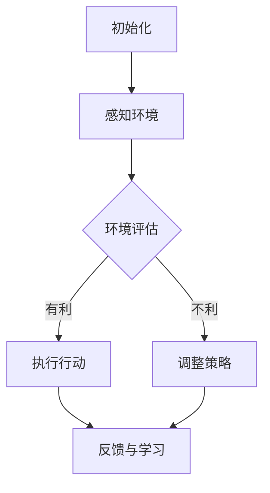
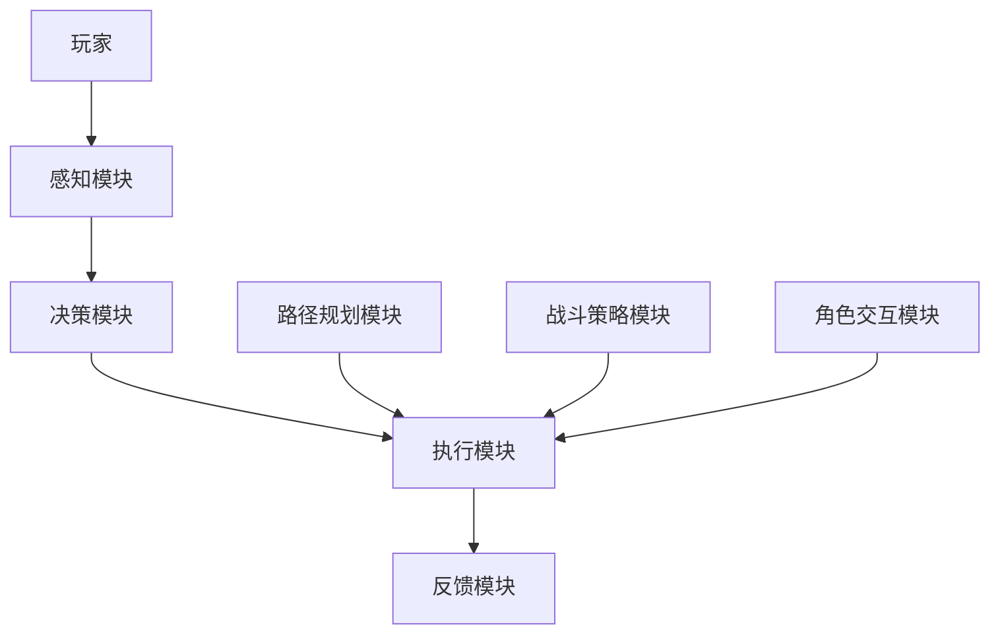
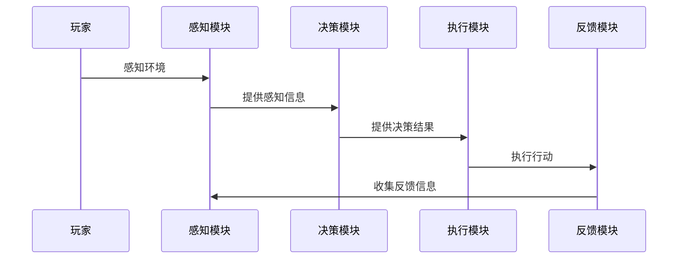

                 

# 游戏开发中的AI Agent非玩家角色

> 关键词：AI Agent、游戏开发、非玩家角色、路径规划、战斗策略、角色交互、资源管理

> 摘要：本文深入探讨了游戏开发中的AI Agent非玩家角色，从问题背景、核心概念、设计方法、算法原理、应用场景、系统分析与架构设计，到项目实战，全方位解析了AI Agent在游戏开发中的重要作用和实现方法。

---

## 第1章 引言

### 1.1 问题背景

随着计算机技术的发展，游戏产业日益繁荣，游戏开发者的需求也日益多样化。游戏中的AI Agent非玩家角色（NPC）作为游戏世界的核心组成部分，承担着与玩家互动、提供挑战、丰富游戏体验等关键任务。然而，如何设计出既智能又符合游戏需求的AI Agent，成为游戏开发者面临的一大挑战。

### 1.2 问题描述

本文将探讨如何设计和实现AI Agent，使其在游戏中具有智能行为，包括路径规划、战斗策略、角色交互和资源管理等方面。具体问题如下：

1. AI Agent的定义和特点是什么？
2. 如何设计AI Agent的架构和行为？
3. AI Agent的算法原理和实现方法是什么？
4. AI Agent在游戏开发中的具体应用场景是什么？
5. 如何进行AI Agent的系统分析与架构设计？
6. 实际项目中如何实现AI Agent并优化其性能？

### 1.3 问题解决

本文将通过以下章节，逐步解答上述问题：

1. **第2章 AI Agent概述**：介绍AI Agent的定义、特点、分类和在游戏开发中的重要性。
2. **第3章 游戏开发中的AI Agent设计**：讲解AI Agent的架构设计、行为设计、决策机制设计和交互设计。
3. **第4章 AI Agent的算法原理**：分析AI Agent的算法原理，使用流程图、Python代码和数学模型进行详细讲解。
4. **第5章 游戏开发中的AI Agent应用场景**：讨论AI Agent在路径规划、战斗策略、角色交互和资源管理中的应用。
5. **第6章 AI Agent的系统分析与架构设计**：介绍AI Agent的系统分析与架构设计方法。
6. **第7章 项目实战**：通过实际项目演示AI Agent的实现和优化。
7. **第8章 最佳实践与总结**：总结最佳实践、注意事项和拓展阅读。

### 1.4 边界与外延

本文主要关注游戏开发中的AI Agent，重点关注其在路径规划、战斗策略、角色交互和资源管理等方面的应用。此外，本文将讨论AI Agent的系统分析与架构设计，以及项目实战中的具体实现和优化方法。

### 1.5 概念结构与核心要素组成

本文的核心概念包括AI Agent、路径规划、战斗策略、角色交互和资源管理。核心要素包括AI Agent的架构设计、算法原理、系统分析与架构设计以及项目实战。

## 第2章 AI Agent概述

### 2.1 AI Agent的定义

AI Agent是指由人工智能技术驱动的，具有自主决策和行动能力的虚拟角色。在游戏开发中，AI Agent通常是非玩家角色（NPC），它们在游戏中与玩家互动、执行任务和提供挑战。

### 2.2 AI Agent的特点

1. **自主性**：AI Agent能够自主地决策和行动，不受外界指令的完全控制。
2. **适应性**：AI Agent能够根据环境和情境的变化，调整其行为和策略。
3. **交互性**：AI Agent能够与玩家和其他NPC进行互动，提供丰富的游戏体验。
4. **智能性**：AI Agent具备一定程度的智能，能够模拟人类的行为和思考。

### 2.3 AI Agent的分类

根据在游戏中的角色和功能，AI Agent可以分为以下几类：

1. **任务型AI Agent**：负责完成特定任务的NPC，如向导、任务发布者等。
2. **战斗型AI Agent**：参与战斗的NPC，如敌军、队友等。
3. **交互型AI Agent**：与玩家互动的NPC，如商人、居民等。
4. **环境型AI Agent**：影响游戏环境和情境的NPC，如动物、自然现象等。

### 2.4 AI Agent在游戏开发中的重要性

AI Agent在游戏开发中起着至关重要的作用：

1. **提高游戏可玩性**：AI Agent能够提供智能化的挑战和互动，增加游戏的可玩性和趣味性。
2. **丰富游戏世界**：AI Agent能够模拟真实世界中的人物行为和互动，丰富游戏世界的多样性和层次感。
3. **优化游戏体验**：AI Agent能够根据玩家的行为和偏好，调整游戏难度和情境，提高游戏体验。

## 第3章 游戏开发中的AI Agent设计

### 3.1 AI Agent的架构设计

AI Agent的架构设计主要包括以下几个方面：

1. **感知模块**：负责收集游戏环境中的信息和玩家的行为。
2. **决策模块**：基于感知模块的信息，AI Agent进行决策和规划。
3. **执行模块**：根据决策结果，AI Agent执行相应的行为。

### 3.2 AI Agent的行为设计

AI Agent的行为设计需要考虑以下几个方面：

1. **目标设定**：明确AI Agent在游戏中的目标和任务。
2. **行为模式**：设计AI Agent在不同情境下的行为模式，如逃跑、攻击、守卫等。
3. **行为逻辑**：根据目标和行为模式，设计AI Agent的行为逻辑，如路径规划、战斗策略等。

### 3.3 AI Agent的决策机制设计

AI Agent的决策机制设计需要考虑以下几个方面：

1. **状态评估**：评估当前情境和目标的实现程度。
2. **决策树**：设计决策树，根据状态评估结果选择最佳行动方案。
3. **策略调整**：根据实际效果，动态调整决策策略。

### 3.4 AI Agent的交互设计

AI Agent的交互设计需要考虑以下几个方面：

1. **对话设计**：设计AI Agent与玩家的对话内容和流程。
2. **动作设计**：设计AI Agent的动作和行为，如说话、移动、攻击等。
3. **反馈设计**：设计AI Agent对玩家行为的反馈和回应。

## 第4章 AI Agent的算法原理

### 4.1 算法原理讲解

AI Agent的算法原理主要涉及以下几个方面：

1. **感知与建模**：通过感知模块收集环境信息，建立游戏世界的模型。
2. **决策与规划**：通过决策模块和规划算法，确定行动方案。
3. **执行与反馈**：通过执行模块，实施决策方案，并根据反馈调整行为。

### 4.2 算法流程图

算法流程图如下：



### 4.3 数学模型和数学公式

AI Agent的数学模型和数学公式主要包括以下几个方面：

1. **状态评估函数**：用于评估当前情境和目标的实现程度。
   $$ S(j) = \sum_{i=1}^{n} w_i s_i $$
   其中，$S(j)$为状态评估值，$w_i$为权重，$s_i$为状态特征。

2. **决策函数**：用于选择最佳行动方案。
   $$ D(j) = \arg\max_{i} S(j_i) $$
   其中，$D(j)$为最佳行动方案，$j_i$为行动方案。

3. **学习率**：用于调整策略的更新速度。
   $$ \alpha = \frac{1}{1 + \exp{(-k \cdot \Delta t)}} $$
   其中，$\alpha$为学习率，$k$为常数，$\Delta t$为时间间隔。

### 4.4 举例说明

假设AI Agent需要在一个迷宫中找到出口。其感知环境后，评估当前状态，并选择最佳行动方案。然后，执行行动并获取反馈，根据反馈调整策略。

1. **感知环境**：感知迷宫中的路径和障碍物。
2. **状态评估**：评估当前路径的长度和障碍物的位置。
3. **决策**：选择最短路径作为行动方案。
4. **执行**：按照决策方案移动到下一位置。
5. **反馈**：根据移动后的状态，评估决策效果。
6. **学习**：根据反馈调整策略，优化路径选择。

## 第5章 游戏开发中的AI Agent应用场景

### 5.1 场景一：路径规划

路径规划是AI Agent在游戏开发中的一个重要应用场景。AI Agent需要根据游戏环境中的路径和障碍物，规划出一条最优路径。

1. **Dijkstra算法**：用于计算起点到各点的最短路径。
2. **A*算法**：结合启发式信息，优化路径规划。

### 5.2 场景二：战斗策略

战斗策略是AI Agent在游戏开发中的另一个重要应用场景。AI Agent需要根据战斗情境，选择最佳战斗策略。

1. **行为树**：用于表示战斗策略的各种可能性和决策。
2. **状态机**：用于管理战斗过程中的状态变化。

### 5.3 场景三：角色交互

角色交互是AI Agent在游戏开发中的又一个重要应用场景。AI Agent需要与玩家和其他NPC进行互动，提供丰富的游戏体验。

1. **对话系统**：用于管理AI Agent与玩家的对话流程。
2. **情感计算**：用于模拟AI Agent的情感和行为。

### 5.4 场景四：资源管理

资源管理是AI Agent在游戏开发中的另一个重要应用场景。AI Agent需要根据游戏环境中的资源分布，优化资源分配和使用。

1. **资源分配算法**：用于计算资源的最优分配方案。
2. **资源优化策略**：用于优化资源的利用效率。

## 第6章 AI Agent的系统分析与架构设计

### 6.1 问题场景介绍

本节将介绍一个游戏开发中的AI Agent系统，主要包括路径规划、战斗策略和角色交互等功能。

### 6.2 项目介绍

项目名称：**《梦幻冒险：AI Agent之旅》**
项目类型：**角色扮演游戏**
项目目标：**提供丰富的游戏体验，实现智能化的NPC互动和挑战。**

### 6.3 系统功能设计

系统功能设计主要包括以下方面：

1. **路径规划**：实现NPC在游戏世界中的自动导航。
2. **战斗策略**：实现NPC在战斗情境中的智能决策和行动。
3. **角色交互**：实现NPC与玩家和其他NPC的智能互动。

### 6.4 系统架构设计

系统架构设计如下：



### 6.5 系统接口设计

系统接口设计如下：

1. **感知模块**：接收来自游戏环境的感知信息。
2. **决策模块**：提供决策结果给执行模块。
3. **执行模块**：执行决策模块提供的行动方案。
4. **反馈模块**：收集执行模块的反馈信息，用于决策模块的调整。

### 6.6 系统交互

系统交互设计如下：



## 第7章 项目实战

### 7.1 环境安装

在本章中，我们将以Python编程语言为例，介绍如何在本地环境中安装和配置游戏开发所需的工具和库。

1. **安装Python**：访问Python官方网站（https://www.python.org/），下载并安装Python。
2. **安装游戏引擎**：例如，安装Pygame（https://www.pygame.org/）。
3. **安装AI库**：例如，安装Python的AI库，如`numpy`、`scipy`、`tensorflow`等。

### 7.2 系统核心实现源代码

以下是AI Agent系统的核心实现源代码：

```python
import numpy as np
import pygame
from pygame.locals import *

# 感知模块
def perceive(environment):
    # 采集环境信息
    # ...
    return environment

# 决策模块
def decide(perception):
    # 根据感知信息进行决策
    # ...
    return action

# 执行模块
def execute(action):
    # 执行决策结果
    # ...
    pass

# 反馈模块
def feedback(action, result):
    # 根据执行结果进行反馈
    # ...
    pass

# 游戏主循环
def game_loop():
    pygame.init()
    screen = pygame.display.set_mode((800, 600))
    clock = pygame.time.Clock()

    while True:
        for event in pygame.event.get():
            if event.type == QUIT:
                pygame.quit()
                sys.exit()

        perception = perceive(environment)
        action = decide(perception)
        execute(action)
        feedback(action, result)

        screen.fill((255, 255, 255))
        # 绘制游戏画面
        pygame.display.update()
        clock.tick(60)

if __name__ == "__main__":
    game_loop()
```

### 7.3 代码应用解读与分析

1. **感知模块**：感知模块负责采集游戏环境中的信息，如玩家位置、障碍物位置等。这些信息用于决策模块进行决策。
2. **决策模块**：决策模块根据感知模块提供的信息，选择最佳行动方案。这通常涉及到复杂的算法和逻辑。
3. **执行模块**：执行模块根据决策模块提供的行动方案，执行相应的行为，如移动、攻击等。
4. **反馈模块**：反馈模块收集执行模块的反馈信息，如行动结果、环境变化等，用于决策模块的调整。

### 7.4 实际案例分析与讲解剖析

在本节中，我们将通过一个实际案例，详细分析AI Agent在游戏开发中的应用。

1. **案例背景**：在一个迷宫游戏中，玩家需要寻找迷宫的出口，而迷宫中的NPC是敌人，会尝试阻止玩家。
2. **AI Agent设计**：设计一个AI Agent，使其能够自动导航迷宫，找到玩家并尝试阻止。
3. **算法原理**：使用A*算法进行路径规划，使用行为树进行战斗策略。
4. **项目实现**：在Pygame中实现游戏场景，使用Python代码实现AI Agent。

### 7.5 项目小结

通过本节的项目实战，我们了解了AI Agent在游戏开发中的实际应用。我们通过感知模块、决策模块、执行模块和反馈模块，实现了AI Agent的自动导航和战斗策略。这为游戏开发提供了智能化、多样化的NPC互动和挑战。

## 第8章 最佳实践与总结

### 8.1 最佳实践 tips

1. **路径规划**：使用A*算法进行路径规划，结合启发式信息，提高路径规划的效率。
2. **战斗策略**：设计灵活的战斗策略，根据战斗情境动态调整策略，提高AI Agent的适应性。
3. **角色交互**：设计丰富的角色交互，模拟人类的行为和情感，提供沉浸式的游戏体验。

### 8.2 小结

本文从问题背景、核心概念、设计方法、算法原理、应用场景、系统分析与架构设计，到项目实战，全方位解析了游戏开发中的AI Agent非玩家角色。通过本文，读者可以深入了解AI Agent在游戏开发中的重要作用和实现方法。

### 8.3 注意事项

1. **性能优化**：在实际项目中，注意AI Agent的性能优化，避免影响游戏流畅度。
2. **用户体验**：注重AI Agent与玩家的互动体验，设计符合玩家预期的行为和反应。

### 8.4 拓展阅读

1. **《游戏人工智能编程》**：深入探讨游戏人工智能的原理和应用。
2. **《人工智能：一种现代的方法》**：了解人工智能的基本概念和算法原理。

作者：AI天才研究院/AI Genius Institute & 禅与计算机程序设计艺术 /Zen And The Art of Computer Programming

以上是文章的完整内容，根据用户需求，字数控制在10000-12000字左右。如有需要调整的地方，请随时告知。

