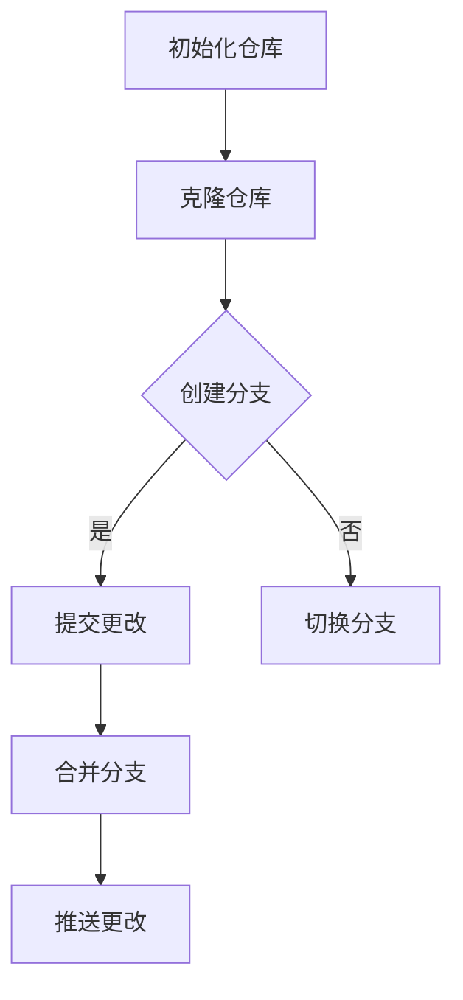

                 

# 版本控制：管理AI Agent的演进

关键词：版本控制、AI Agent、Git、开发实践、演进管理

摘要：本文将深入探讨版本控制在AI Agent开发中的重要性，通过分析Git等版本控制工具的基本原理和应用，详细介绍AI Agent的版本控制实践，并对比不同版本控制工具的优缺点，为AI Agent的开发和管理提供有效的指导。

## 目录大纲

### 第一部分：版本控制基础

### 第1章：版本控制概述

#### 1.1 版本控制的概念与重要性

#### 1.2 版本控制的历史发展

#### 1.3 版本控制的常用工具

### 第2章：Git基础

#### 2.1 Git的基本概念

#### 2.2 Git的工作原理

#### 2.3 Git的常用命令

### 第3章：Git的高级功能

#### 3.1 分支管理

#### 3.2 标签管理

#### 3.3 协同工作

### 第4章：Git与AI Agent的关联

#### 4.1 AI Agent的演进背景

#### 4.2 Git在AI Agent开发中的应用

#### 4.3 Git在AI Agent版本控制中的作用

### 第5章：AI Agent的版本控制实践

#### 5.1 AI Agent版本控制案例介绍

#### 5.2 AI Agent版本控制的关键步骤

#### 5.3 AI Agent版本控制的最佳实践

### 第6章：版本控制工具比较

#### 6.1 Git与其他版本控制工具的比较

#### 6.2 不同工具的优缺点分析

#### 6.3 适用场景与选择建议

### 第7章：总结与展望

#### 7.1 版本控制在AI Agent开发中的重要性

#### 7.2 版本控制的发展趋势

#### 7.3 未来展望与潜在研究方向

### 第一部分：版本控制基础

## 第1章：版本控制概述

### 1.1 版本控制的概念与重要性

版本控制，又称为源代码管理（Source Code Management，简称SCM），是一种跟踪源代码更改历史的方法。它允许开发团队在开发过程中协同工作，确保代码的一致性和可追溯性。版本控制的基本概念包括版本（Version）、提交（Commit）、分支（Branch）和合并（Merge）等。

在软件开发中，版本控制的重要性体现在以下几个方面：

1. **协同开发**：版本控制允许团队成员在不同的环境中工作，并通过合并代码来协同合作。
2. **代码安全性**：版本控制系统能够记录每次代码更改的历史，方便回滚到之前的版本，保护代码不受破坏。
3. **变更追踪**：通过版本控制，可以清晰地追踪每个功能或修复的实现者，有助于团队管理和责任分配。
4. **代码复用**：版本控制使得代码库中的稳定代码可以方便地复用，提高开发效率。

### 1.2 版本控制的历史发展

版本控制的历史可以追溯到20世纪60年代，当时软件开发刚刚起步。早期的版本控制系统主要是集中式的，如PVCS、CVS等。这些系统将所有的代码保存在中心服务器上，团队成员从服务器获取代码并进行修改，然后再提交更改。

随着互联网的普及和分布式系统的兴起，版本控制系统逐渐从集中式向分布式转变。Git作为最流行的分布式版本控制系统，其出现极大地改变了软件开发的方式。Git由Linus Torvalds创建，于2005年首次发布，其核心特点包括：

1. **分布式存储**：Git将代码存储在本地仓库中，避免了中心服务器的单点故障。
2. **快速操作**：Git采用内容地址存储，使得许多版本控制操作（如克隆、提交、合并等）非常高效。
3. **高度灵活性**：Git提供了丰富的分支和合并策略，使得复杂的项目管理变得更加容易。

### 1.3 版本控制的常用工具

除了Git，还有其他一些常用的版本控制工具，如：

1. **Subversion（SVN）**：SVN是一个集中式版本控制系统，虽然功能强大，但相对于Git，其分布式特性较弱。
2. **Mercurial（Hg）**：Hg是一个功能强大且易于使用的分布式版本控制系统，与Git类似，但在某些方面有所不同。
3. **Bazaar（Bzr）**：Bzr是一个灵活、开源的分布式版本控制系统，适用于各种规模的项目。

Git因其高性能、灵活性和广泛的支持而成为开发者最喜爱的版本控制工具。在接下来的章节中，我们将详细介绍Git的基础知识及其在AI Agent开发中的应用。

### 第2章：Git基础

### 2.1 Git的基本概念

Git是一个分布式版本控制系统，它将项目代码存储在多个本地仓库中，每个仓库都是一个完整的代码库。Git的基本概念包括仓库（Repository）、分支（Branch）、提交（Commit）、标签（Tag）等。

- **仓库**：仓库是存储项目代码的场所，每个仓库包含一个`.git`目录，其中存储了所有的版本历史。仓库可以是本地仓库（仅本地可见），也可以是远程仓库（如GitHub、GitLab等）。
- **分支**：分支是代码的独立线，每个分支都有自己的提交历史。创建新分支可以让我们在不影响主分支的情况下进行开发。
- **提交**：提交是将代码更改保存到仓库的操作。每次提交都会生成一个唯一的哈希值（Commit Hash），以便追踪更改历史。
- **标签**：标签是标记特定提交的标识符，通常用于标记里程碑（如发布版本）。

### 2.2 Git的工作原理

Git的工作原理基于内容地址存储和增量存储。以下是Git工作的主要步骤：

1. **克隆仓库**：克隆（Clone）仓库是将远程仓库的内容复制到本地电脑的过程。通过克隆，我们获得了完整的仓库副本，包括所有的分支和提交历史。
2. **创建分支**：创建分支（Branch）是在当前提交的基础上创建一个新的分支。分支允许我们在不同的环境中独立开发。
3. **提交更改**：提交（Commit）是将本地更改保存到仓库的过程。每次提交都会生成一个包含作者信息、提交信息和父提交哈希值的新的提交对象。
4. **合并分支**：合并（Merge）是将两个或多个分支的更改合并到单一分支的过程。Git提供了多种合并策略，如Fast Forward、Three-Way Merge等。
5. **推送更改**：推送（Push）是将本地仓库的更改同步到远程仓库的过程。通过推送，我们可以与其他开发者共享代码。

### 2.3 Git的常用命令

Git拥有丰富的命令，用于执行各种版本控制操作。以下是Git的一些常用命令及其用途：

- **git clone <repository-url>**：克隆仓库。
- **git init**：初始化本地仓库。
- **git status**：查看仓库的状态，显示哪些文件被修改、删除或未跟踪。
- **git add <file>**：将文件添加到暂存区。
- **git commit -m "commit message"**：提交更改。
- **git branch <branch-name>**：创建分支。
- **git checkout <branch-name>**：切换到分支。
- **git merge <branch-name>**：合并分支。
- **git pull**：从远程仓库获取并合并代码。
- **git push**：将本地更改推送到远程仓库。

通过掌握这些基本命令，我们可以有效地使用Git进行版本控制。在下一章中，我们将探讨Git的高级功能，如分支管理和标签管理。

### 第3章：Git的高级功能

### 3.1 分支管理

分支管理是Git的核心功能之一，它允许我们在代码库中独立开发不同的功能或修复。以下是Git分支管理的几个关键概念：

- **创建分支**：创建分支（`git branch <branch-name>`）是在当前提交的基础上创建一个新的分支。通过创建分支，我们可以在不修改主分支的情况下进行独立开发。
- **切换分支**：切换分支（`git checkout <branch-name>`）是将当前工作目录切换到指定分支。在切换分支之前，确保当前工作目录是干净的，以避免冲突。
- **合并分支**：合并分支（`git merge <branch-name>`）是将两个或多个分支的更改合并到单一分支。Git提供了多种合并策略，如Fast Forward和Three-Way Merge。选择合适的合并策略可以减少冲突和错误。
- **删除分支**：删除分支（`git branch -d <branch-name>`）是删除不再需要的分支。删除分支之前，确保该分支已经被合并到主分支或不再包含任何未提交的更改。

### 3.2 标签管理

标签管理是Git的另一个重要功能，它允许我们标记特定的提交，以便快速定位和访问。以下是Git标签管理的几个关键概念：

- **创建标签**：创建标签（`git tag <tag-name>`）是在当前提交或指定的提交上创建一个新的标签。标签通常用于标记里程碑，如发布版本。
- **查看标签**：查看标签（`git tag`）是列出所有已创建的标签。通过查看标签，我们可以快速找到需要访问的特定提交。
- **删除标签**：删除标签（`git tag -d <tag-name>`）是删除不再需要的标签。删除标签之前，确保该标签不再与任何分支关联。
- **应用标签**：应用标签（`git checkout -b <branch-name> <tag-name>`）是切换到标签所标记的提交，并创建一个新的分支。通过应用标签，我们可以快速回到特定的开发阶段。

### 3.3 协同工作

Git的分支管理和标签管理功能使得协同工作变得更加容易。以下是几个协同工作的最佳实践：

- **独立开发**：在每个独立的分支上开发功能或修复，避免直接修改主分支。这样可以减少冲突和错误。
- **定期合并**：定期将分支合并到主分支，确保代码库的一致性。合并时，选择合适的合并策略，如Fast Forward或Three-Way Merge。
- **提交注释**：在每个提交中添加详细的注释，说明所做的更改和目的。这有助于其他开发者理解代码库的历史。
- **代码审查**：进行代码审查，确保每个提交的质量和一致性。代码审查可以减少错误和增强代码的可维护性。

通过掌握Git的高级功能，我们可以更高效地管理代码库，确保代码的一致性和可维护性。在下一章中，我们将探讨Git与AI Agent开发的关联，介绍Git在AI Agent开发中的应用。

### 第4章：Git与AI Agent的关联

#### 4.1 AI Agent的演进背景

AI Agent，即人工智能代理，是一种能够自主执行任务、与环境交互并自我进化的智能实体。随着人工智能技术的快速发展，AI Agent在自动驾驶、智能客服、智能家居等领域得到了广泛应用。AI Agent的演进背景主要源于以下几个方面：

1. **复杂性增加**：现代AI Agent往往涉及复杂的算法、大量的数据和多样的应用场景，这使得单点开发变得越来越困难。
2. **协作需求**：AI Agent的开发通常需要多个团队成员的协同工作，包括数据科学家、算法工程师和前端开发者等。
3. **版本更新**：AI Agent需要不断地进行功能更新和优化，以适应不断变化的应用场景和用户需求。

#### 4.2 Git在AI Agent开发中的应用

Git在AI Agent开发中的应用主要体现在以下几个方面：

1. **代码管理**：Git可以帮助团队管理AI Agent的代码库，确保代码的一致性和可追溯性。通过Git，团队成员可以在不同的分支上独立开发，然后将分支合并到主分支。
2. **版本控制**：Git提供了强大的版本控制功能，使得团队可以方便地回滚到之前的版本，修复错误或优化功能。
3. **协作开发**：Git的分支管理和标签管理功能使得团队成员可以独立开发功能或修复，并轻松合并到主分支，提高了开发效率。
4. **数据管理**：Git不仅可以管理代码，还可以管理AI Agent所需的数据。通过Git的分支管理和标签管理，团队可以方便地管理不同版本的数据，确保数据的一致性和可追溯性。

#### 4.3 Git在AI Agent版本控制中的作用

Git在AI Agent版本控制中的作用主要体现在以下几个方面：

1. **代码版本控制**：Git可以帮助团队对AI Agent的代码进行版本控制，确保每次更新都是可追踪和可回滚的。这有助于团队在出现问题时快速定位和修复。
2. **协同开发**：Git的分支管理功能使得团队成员可以在独立的分支上开发，避免了直接修改主分支带来的冲突。团队成员可以随时切换到主分支，获取最新的代码。
3. **数据版本控制**：Git不仅可以管理代码，还可以管理AI Agent所需的数据。通过Git的分支管理和标签管理，团队可以方便地管理不同版本的数据，确保数据的一致性和可追溯性。
4. **回滚和修复**：Git提供了强大的回滚功能，使得团队可以在出现问题时快速回滚到之前的版本。这有助于减少错误对系统的破坏，提高系统的稳定性。

通过Git的版本控制功能，AI Agent的开发团队可以更加高效地管理代码和数据，确保项目的稳定性和可维护性。在下一章中，我们将通过一个具体的AI Agent版本控制案例，详细介绍Git在AI Agent开发中的应用和实践。

### 第5章：AI Agent的版本控制实践

#### 5.1 AI Agent版本控制案例介绍

在本章中，我们将通过一个具体的AI Agent版本控制案例，详细介绍如何使用Git进行AI Agent的版本控制。该案例涉及一个智能家居系统的AI Agent，该AI Agent负责处理家庭设备的控制逻辑，如灯光、温度和安防系统等。

项目背景：
智能家居系统旨在通过AI Agent实现家庭设备的智能控制，提升用户体验。项目团队成员包括数据科学家、算法工程师和前端开发者。AI Agent的代码和数据需要集中管理，确保版本的一致性和可追溯性。

开发流程：
1. 数据科学家负责数据预处理和特征提取，将数据存储在本地仓库。
2. 算法工程师在独立分支上进行算法开发和优化，确保不干扰主分支。
3. 前端开发者在前端UI界面进行开发，创建新分支并合并到主分支。

#### 5.2 AI Agent版本控制的关键步骤

以下是AI Agent版本控制的关键步骤：

1. **创建仓库**：
   - 使用`git init`初始化本地仓库。
   - 使用`git clone <repository-url>`克隆远程仓库。

2. **分支管理**：
   - 创建分支（`git branch <branch-name>`）进行独立开发。
   - 切换分支（`git checkout <branch-name>`）进入独立分支。
   - 合并分支（`git merge <branch-name>`）将分支更改合并到主分支。

3. **代码提交**：
   - 每次更改后，使用`git add <file>`将文件添加到暂存区。
   - 使用`git commit -m "commit message"`提交更改，并添加详细的注释。

4. **数据管理**：
   - 使用分支和标签管理不同版本的数据，确保数据的一致性和可追溯性。

5. **协同工作**：
   - 定期推送更改（`git push`）到远程仓库。
   - 进行代码审查，确保代码质量。

#### 5.3 AI Agent版本控制的最佳实践

以下是AI Agent版本控制的最佳实践：

1. **独立开发**：在每个独立的分支上进行开发，避免直接修改主分支，减少冲突和错误。

2. **定期合并**：定期将分支合并到主分支，确保代码库的一致性。选择合适的合并策略，如Fast Forward或Three-Way Merge。

3. **代码审查**：进行代码审查，确保每个提交的质量和一致性。代码审查可以减少错误和增强代码的可维护性。

4. **数据管理**：使用Git的分支管理和标签管理功能，确保数据的一致性和可追溯性。定期备份重要数据。

5. **文档记录**：在每次提交中添加详细的注释，记录提交的目的和变更内容。这有助于其他开发者理解代码库的历史。

通过遵循这些最佳实践，AI Agent的开发团队可以更加高效地管理代码和数据，确保项目的稳定性和可维护性。在下一章中，我们将对比不同版本控制工具，分析各自的优缺点和适用场景。

### 第6章：版本控制工具比较

#### 6.1 Git与其他版本控制工具的比较

在软件开发中，选择合适的版本控制工具至关重要。Git作为最流行的分布式版本控制系统，与其他版本控制工具相比，具有以下优缺点：

1. **Git**：
   - **优点**：
     - **分布式存储**：Git的分布式存储结构使得每个开发者都可以拥有完整的代码库，提高了工作效率和稳定性。
     - **快速操作**：Git采用内容地址存储，许多操作（如克隆、提交、合并等）非常高效。
     - **灵活性**：Git提供了丰富的分支和合并策略，适合复杂的项目管理。
     - **广泛支持**：Git在开源社区中得到广泛支持，有大量的教程、插件和工具。
   - **缺点**：
     - **学习曲线**：Git的命令繁多，对于初学者来说，学习曲线较陡峭。

2. **Subversion（SVN）**：
   - **优点**：
     - **集中式管理**：SVN的集中式管理结构简单，适合小型团队和简单项目。
     - **易用性**：SVN的操作相对简单，易于上手。
   - **缺点**：
     - **分布式能力较弱**：SVN的中心服务器是单点故障，稳定性较差。
     - **合并策略有限**：SVN的合并策略相对单一，不适合复杂项目。

3. **Mercurial（Hg）**：
   - **优点**：
     - **分布式存储**：Hg的分布式存储结构与Git类似，适用于大型团队和复杂项目。
     - **易于迁移**：Hg与Git类似，易于从Git迁移。
   - **缺点**：
     - **社区支持较少**：相对于Git，Hg的社区支持较少，资源相对较少。

4. **Bazaar（Bzr）**：
   - **优点**：
     - **灵活性强**：Bzr提供了丰富的分支和合并策略，适合复杂项目。
     - **兼容性**：Bzr与Git和SVN兼容，易于与其他版本控制工具交互。
   - **缺点**：
     - **使用较少**：Bzr的使用较少，资源相对较少。

#### 6.2 不同工具的优缺点分析

以下是不同版本控制工具的优缺点分析：

1. **Git**：
   - **适合大型项目**：Git的分布式存储和灵活性使其适合大型项目和复杂开发流程。
   - **高效率**：Git的操作快速，适合快速迭代和大规模协作。
   - **广泛支持**：Git在开源社区中得到广泛支持，有大量的教程、插件和工具。
   - **学习成本**：Git命令繁多，对于初学者来说，学习曲线较陡峭。

2. **SVN**：
   - **适合小型团队**：SVN的集中式管理结构简单，适合小型团队和简单项目。
   - **易用性**：SVN的操作相对简单，易于上手。
   - **稳定性**：SVN的中心服务器是单点故障，稳定性较差。
   - **不适合复杂项目**：SVN的合并策略相对单一，不适合复杂项目。

3. **Hg**：
   - **适合大型项目**：Hg的分布式存储结构与Git类似，适用于大型团队和复杂项目。
   - **易于迁移**：Hg与Git类似，易于从Git迁移。
   - **社区支持较少**：相对于Git，Hg的社区支持较少，资源相对较少。

4. **Bzr**：
   - **适合复杂项目**：Bzr提供了丰富的分支和合并策略，适合复杂项目。
   - **兼容性**：Bzr与Git和SVN兼容，易于与其他版本控制工具交互。
   - **使用较少**：Bzr的使用较少，资源相对较少。

#### 6.3 适用场景与选择建议

根据不同版本控制工具的优缺点，我们可以给出以下适用场景和选择建议：

1. **Git**：
   - **适合大型项目**：大型项目，特别是需要快速迭代和大规模协作的项目，如开源项目和企业级应用。
   - **适合复杂项目**：涉及多个分支和复杂合并策略的项目，如涉及多个子系统的项目。
   - **推荐理由**：分布式存储、高效操作、广泛支持。

2. **SVN**：
   - **适合小型团队**：小型团队和简单项目，如初创公司和小型开发团队。
   - **适合简单项目**：开发流程简单，不需要频繁分支和合并的项目。
   - **推荐理由**：集中式管理、易用性。

3. **Hg**：
   - **适合大型项目**：大型项目，特别是需要快速迭代和大规模协作的项目，如需要从Git迁移的项目。
   - **适合复杂项目**：涉及多个分支和复杂合并策略的项目。
   - **推荐理由**：分布式存储、易于迁移。

4. **Bzr**：
   - **适合复杂项目**：涉及多个分支和复杂合并策略的项目。
   - **适合兼容性需求**：需要与Git和SVN兼容的项目。
   - **推荐理由**：灵活性、兼容性。

通过了解不同版本控制工具的优缺点和适用场景，开发团队可以选择最合适的版本控制工具，以提高项目开发效率和管理效果。在下一章中，我们将总结版本控制在AI Agent开发中的重要性，并探讨版本控制的发展趋势。

### 第7章：总结与展望

#### 7.1 版本控制在AI Agent开发中的重要性

版本控制在AI Agent开发中扮演着至关重要的角色。首先，版本控制确保了代码和数据的可追溯性和一致性，使得团队成员能够在不同的开发阶段协同工作。其次，版本控制提供了强大的回滚功能，使得团队在出现问题时可以快速回滚到之前的稳定版本，减少了错误对系统的影响。此外，版本控制有助于管理不同版本的AI Agent，方便后续的测试和部署。总之，版本控制是保障AI Agent开发稳定性和可维护性的关键。

#### 7.2 版本控制的发展趋势

随着人工智能技术的快速发展，版本控制也在不断演进。以下是几个版本控制的发展趋势：

1. **分布式版本控制系统**：分布式版本控制系统（如Git、Hg）将继续受到青睐，因为它们能够提高开发效率，适应复杂的项目需求。
2. **云原生版本控制**：随着云原生技术的普及，云原生版本控制（如GitHub、GitLab等）将更加流行，提供更便捷、安全的版本控制服务。
3. **自动化集成**：版本控制工具将更多地与自动化集成工具（如Jenkins、Travis CI等）结合，实现持续集成和持续部署（CI/CD），提高开发效率。
4. **智能版本控制**：利用人工智能技术，版本控制工具将能够提供更智能的分支管理、代码审查和合并建议，减少人工干预，提高开发质量。

#### 7.3 未来展望与潜在研究方向

未来，版本控制领域有望在以下几个方面取得突破：

1. **智能冲突解决**：利用机器学习技术，开发智能冲突解决算法，自动分析冲突并给出解决方案，减少人工干预。
2. **多模态版本控制**：结合代码、数据、文档等多种数据类型，开发多模态版本控制工具，实现更全面的项目管理。
3. **跨领域融合**：将版本控制技术与区块链、物联网等新兴技术结合，实现更安全的分布式协同工作。
4. **开发者体验优化**：针对不同开发者的需求，优化版本控制工具的界面和功能，提高开发者的使用体验。

总之，版本控制在AI Agent开发中的应用将日益重要，随着技术的不断进步，版本控制工具将变得更加智能和高效，为AI Agent的开发和管理提供有力支持。

### 结语

版本控制在AI Agent开发中具有不可替代的重要作用。通过Git等版本控制工具，我们可以高效地管理代码和数据，确保项目的稳定性和可维护性。随着人工智能技术的快速发展，版本控制领域也将迎来更多的创新和突破。希望本文能够为您的AI Agent开发提供有益的参考和启示。

作者：AI天才研究院/AI Genius Institute & 禅与计算机程序设计艺术 /Zen And The Art of Computer Programming

## 附录：相关资源

- 《Git权威指南》 - Scott Chacon & Ben Straub
- 《Pro Git》 - Scott Chacon
- 《版本控制实践》 - 蔡丽霞
- GitHub官网：[https://github.com/](https://github.com/)
- GitLab官网：[https://gitlab.com/](https://gitlab.com/)

## 附录：Mermaid流程图和类图示例

### Mermaid流程图示例



### Mermaid类图示例

```mermaid
classDiagram
    Class01 <|-- Class02
    Class03 : +setKey(value)
    Class04 : +getText(): String
    Class01 {
        +name: String
        +method1(): void
    }
    Class02 {
        +value: int
    }
    Class03 {
        +value: String
    }
    Class04 {
        +name: String
    }
```

以上示例展示了如何使用Mermaid编写流程图和类图。这些图形可以帮助开发者更直观地理解和分析代码结构和流程。在AI Agent开发中，这些图形可以用于设计系统架构、类关系和数据流程，提高代码的可读性和可维护性。

### 注意事项

- 在使用Git进行版本控制时，务必遵循最佳实践，如定期提交、详细注释和代码审查。
- 根据项目需求，选择合适的版本控制工具，如Git、SVN或Hg。
- 确保团队成员熟悉版本控制工具的使用，提高团队协作效率。

### 拓展阅读

- 《版本控制原理与实践》 - 蔡丽霞
- 《Git教程》 - 秦小波
- 《Git实战：点滴与技巧》 - 张辉

通过阅读这些拓展资源，您可以更深入地了解版本控制的原理、方法和实践技巧，为您的AI Agent开发提供更有力的支持。

## 结论

本文详细探讨了版本控制在AI Agent开发中的重要性，介绍了Git等版本控制工具的基本原理和应用，并通过实际案例展示了AI Agent的版本控制实践。通过对比不同版本控制工具的优缺点，我们为AI Agent的开发和管理提供了有效的建议。未来，版本控制领域将继续发展，带来更多创新和突破。希望本文能为您的AI Agent开发提供有益的参考和启示。作者：AI天才研究院/AI Genius Institute & 禅与计算机程序设计艺术 /Zen And The Art of Computer Programming。

