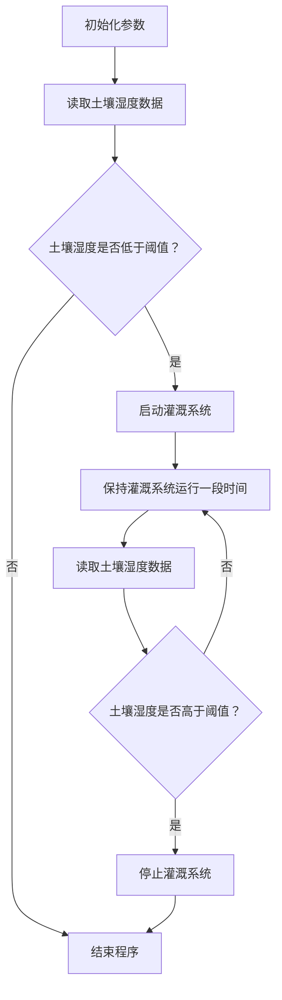

                 

# 物联网在智慧农业中的精准灌溉应用

> 关键词：物联网、智慧农业、精准灌溉、水资源管理、传感器技术

> 摘要：本文探讨了物联网技术在智慧农业中精准灌溉的应用。通过分析物联网在农业领域的潜力，介绍了精准灌溉的需求和挑战。文章详细阐述了物联网在智慧农业中的应用技术，包括传感器技术、网络通信和数据采集与处理。最后，通过一个实际案例展示了精准灌溉系统的设计和实现，以及系统的优化方向和最佳实践。

## 第一部分：背景与概述

### 1. 问题背景

农业作为人类生存的基础，长期以来面临着水资源管理的问题。传统灌溉方式通常依赖于人工判断和经验，导致水资源的浪费和作物生长的不均衡。而随着物联网技术的不断发展，智慧农业成为了解决这一问题的有效途径。

#### 水资源管理挑战

- **水资源分布不均**：不同地区的气候条件和水资源状况差异较大，传统灌溉方式难以实现水资源的合理分配。
- **水资源浪费**：传统灌溉方法往往过量浇水，导致水资源的浪费和环境的污染。
- **作物生长不均衡**：传统灌溉无法精确控制水资源的供给，导致作物生长的不均衡。

#### 物联网技术在农业领域的应用潜力

- **传感器技术**：通过在农田中布置传感器，实时监测土壤湿度、气温、气压等环境参数，为精准灌溉提供数据支持。
- **网络通信技术**：物联网技术使得农田中的传感器数据能够实时传输到中央控制系统，实现远程监控和管理。
- **数据采集与处理**：物联网技术可以对大量农田数据进行采集、存储和处理，从而实现精准灌溉的智能决策。

### 2. 问题描述

精准灌溉的需求和目标是实现水资源的合理利用，提高作物的产量和质量。然而，在实际应用中，精准灌溉面临着诸多挑战：

- **数据获取困难**：农田环境的复杂性和传感器的分布难度使得数据获取成为一个难题。
- **系统成本高**：构建一个完整的精准灌溉系统需要大量的传感器和网络设备，成本较高。
- **系统集成困难**：将各种传感器、网络设备和数据处理系统集成在一起，实现数据的高效传输和利用，难度较大。
- **技术突破**：物联网技术在农业领域的应用仍需要不断创新和突破，以解决现有技术难题。

### 3. 问题解决

物联网技术在智慧农业中的精准灌溉应用提供了有效的解决方案：

- **传感器网络**：在农田中布置传感器，实时监测土壤湿度、气温、气压等环境参数。
- **数据传输**：利用无线网络将传感器数据传输到中央控制系统，实现远程监控和管理。
- **数据分析**：通过大数据分析技术，对农田数据进行处理，为精准灌溉提供决策支持。
- **智能控制**：根据数据分析结果，智能控制灌溉设备，实现精准灌溉。

### 4. 边界与外延

- **物联网**：物联网（Internet of Things，IoT）是指将各种物体通过网络连接起来，实现信息的交换和通信。
- **传感器**：传感器（Sensor）是指能够感知和测量环境参数的设备，如温度传感器、湿度传感器等。
- **大数据分析**：大数据分析（Big Data Analysis）是指对大量数据进行采集、存储、处理和分析，以发现数据中的规律和趋势。
- **智慧农业**：智慧农业（Smart Agriculture）是指利用物联网、大数据、云计算等先进技术，实现农业生产的智能化和精准化。
- **农业信息化**：农业信息化（Agricultural Informationization）是指利用信息技术手段，提高农业生产和管理效率。
- **精准农业**：精准农业（Precision Agriculture）是指通过精确的测量和管理，实现农业生产的精细化和高效化。

### 5. 概念结构与核心要素组成

#### 物联网架构

- **感知层**：由各种传感器组成，负责采集农田环境数据。
- **传输层**：由无线网络和通信设备组成，负责将传感器数据传输到中央控制系统。
- **处理层**：由云计算平台和数据存储设备组成，负责对农田数据进行处理和分析。
- **应用层**：由智能控制系统组成，负责根据数据分析结果，智能控制灌溉设备。

#### 精准灌溉系统核心要素

- **传感器**：用于监测土壤湿度、气温、气压等环境参数。
- **数据传输**：利用无线网络将传感器数据传输到中央控制系统。
- **数据处理**：通过大数据分析技术，对农田数据进行处理，为精准灌溉提供决策支持。
- **智能控制**：根据数据分析结果，智能控制灌溉设备，实现精准灌溉。

#### 数据采集与处理

- **数据采集**：通过传感器实时采集农田环境数据。
- **数据传输**：利用无线网络将传感器数据传输到中央控制系统。
- **数据处理**：通过云计算平台对农田数据进行处理和分析。
- **数据存储**：将处理后的数据存储在数据库中，以供后续分析和决策。

## 第二部分：物联网在智慧农业中的基础技术

### 6. 物联网核心技术

#### 网络通信技术

- **无线传感器网络**：在农田中布置无线传感器网络，实现数据的高效传输和实时监控。
- **5G通信技术**：利用5G通信技术，实现高速、低延迟的数据传输，提高系统的响应速度和可靠性。

#### 数据采集与传感技术

- **土壤湿度传感器**：用于测量土壤湿度，为灌溉决策提供数据支持。
- **温度传感器**：用于测量农田温度，为作物生长提供环境信息。
- **气压传感器**：用于测量大气压力，为气象分析提供数据支持。

#### 数据处理与存储技术

- **云计算平台**：利用云计算平台，实现对大量农田数据的存储和处理。
- **数据库技术**：利用数据库技术，实现对农田数据的存储和管理。

### 7. 智慧农业中的物联网应用

#### 精准灌溉系统的构建

- **系统总体设计**：根据农田环境和作物生长需求，设计精准灌溉系统的总体架构。
- **传感器网络搭建**：在农田中布置传感器网络，实现数据的实时采集和传输。
- **数据处理与分析**：利用云计算平台，对传感器数据进行处理和分析，为精准灌溉提供决策支持。
- **智能控制系统**：根据数据分析结果，智能控制灌溉设备，实现精准灌溉。

#### 农业自动化控制系统的集成

- **自动化控制系统**：将传感器网络、数据处理与分析系统和智能控制系统集成在一起，实现农业自动化控制。
- **远程监控与控制**：通过互联网，实现对农田环境的远程监控和控制。

### 8. 物联网与农业大数据分析

#### 数据采集与传输

- **数据采集**：利用传感器实时采集农田环境数据。
- **数据传输**：利用无线网络和5G通信技术，将传感器数据传输到中央控制系统。

#### 数据分析与应用

- **数据分析**：利用大数据分析技术，对农田数据进行处理和分析，发现数据中的规律和趋势。
- **数据应用**：根据数据分析结果，为精准灌溉提供决策支持，提高农业生产效率。

### 9. 物联网技术的挑战与未来发展趋势

#### 技术创新与突破

- **传感器技术**：继续研发高精度、低成本的传感器，提高数据的准确性和稳定性。
- **网络通信技术**：不断优化网络通信技术，提高数据传输速度和可靠性。
- **数据处理与分析技术**：研发高效的数据处理与分析技术，提高数据分析的效率和准确性。

#### 物联网在农业中的可持续发展

- **资源节约**：通过物联网技术，实现水资源的合理利用，降低农业生产的水资源消耗。
- **环境友好**：通过精准灌溉，减少农业灌溉过程中对环境的污染。
- **可持续发展**：利用物联网技术，提高农业生产效率，实现农业的可持续发展。

## 第三部分：精准灌溉系统的设计与实现

### 10. 精准灌溉系统架构设计

#### 系统总体设计

- **感知层**：由传感器组成，负责实时监测农田环境参数。
- **传输层**：由无线网络和通信设备组成，负责将传感器数据传输到中央控制系统。
- **处理层**：由云计算平台和数据存储设备组成，负责对农田数据进行处理和分析。
- **应用层**：由智能控制系统组成，负责根据数据分析结果，智能控制灌溉设备。

#### 系统模块划分与功能

- **感知模块**：负责实时监测农田环境参数，如土壤湿度、气温、气压等。
- **传输模块**：负责将传感器数据传输到中央控制系统，实现数据的高效传输和实时监控。
- **处理模块**：负责对农田数据进行处理和分析，为精准灌溉提供决策支持。
- **控制模块**：负责根据数据分析结果，智能控制灌溉设备，实现精准灌溉。

### 11. 精准灌溉算法原理讲解

#### 算法流程图



#### 算法原理讲解

精准灌溉算法的核心目标是根据土壤湿度数据，实现灌溉系统的智能控制。算法的主要步骤如下：

1. **初始化参数**：设置土壤湿度阈值和灌溉系统运行时间。
2. **读取土壤湿度数据**：从传感器读取当前土壤湿度值。
3. **判断土壤湿度是否低于阈值**：如果土壤湿度低于阈值，启动灌溉系统。
4. **保持灌溉系统运行**：根据土壤湿度变化，智能控制灌溉系统运行时间。
5. **读取土壤湿度数据**：每隔一段时间，读取土壤湿度值。
6. **判断土壤湿度是否高于阈值**：如果土壤湿度高于阈值，停止灌溉系统。

#### 数学模型与公式

$$
土壤湿度 = f(温度，气压，土壤类型)
$$

$$
灌溉时间 = g(土壤湿度阈值，土壤湿度，土壤类型)
$$

#### 举例说明

假设农田土壤湿度阈值为20%，当前土壤湿度为15%，温度为25℃，气压为101kPa，土壤类型为沙土。根据数学模型和公式，可以计算出灌溉时间为30分钟。

### 12. 数学模型和数学公式讲解与举例说明

#### 水资源消耗模型

$$
水资源消耗 = f(土壤湿度，灌溉时间，土壤类型)
$$

#### 水分需求预测模型

$$
水分需求 = h(土壤湿度阈值，土壤湿度，土壤类型，作物生长阶段)
$$

#### 举例说明

假设农田土壤湿度阈值为20%，当前土壤湿度为15%，土壤类型为沙土，作物生长阶段为成熟期。根据水资源消耗模型和水分需求预测模型，可以计算出水资源消耗为10立方米，水分需求为15立方米。

### 13. 精准灌溉系统项目实战

#### 环境安装

在农田中布置传感器，连接无线网络，确保传感器数据能够实时传输到中央控制系统。

#### 系统核心实现源代码

```python
# 读取土壤湿度数据
def read_soil_moisture():
    # 实现读取土壤湿度数据的代码
    pass

# 判断土壤湿度是否低于阈值
def is_soil_moisture_low():
    # 实现判断土壤湿度是否低于阈值的代码
    pass

# 启动灌溉系统
def start_irrigation_system():
    # 实现启动灌溉系统的代码
    pass

# 保持灌溉系统运行一段时间
def keep_irrigation_system_running():
    # 实现保持灌溉系统运行一段时间的代码
    pass

# 读取土壤湿度数据
soil_moisture = read_soil_moisture()

# 判断土壤湿度是否低于阈值
if is_soil_moisture_low():
    # 启动灌溉系统
    start_irrigation_system()

    # 保持灌溉系统运行一段时间
    keep_irrigation_system_running()

# 读取土壤湿度数据
soil_moisture = read_soil_moisture()

# 判断土壤湿度是否高于阈值
if soil_moisture > soil_moisture_threshold:
    # 停止灌溉系统
    stop_irrigation_system()
```

#### 代码应用解读与分析

这段代码实现了精准灌溉系统的核心功能，包括读取土壤湿度数据、判断土壤湿度是否低于阈值、启动灌溉系统、保持灌溉系统运行一段时间、读取土壤湿度数据、判断土壤湿度是否高于阈值和停止灌溉系统。通过代码的运行，实现了精准灌溉的自动化控制。

#### 实际案例分析与详细讲解

在实际应用中，某农田通过精准灌溉系统实现了水资源的节约和作物产量的提高。通过传感器实时监测土壤湿度，系统智能控制灌溉设备的运行，避免了水资源的浪费。据统计，该农田在采用精准灌溉系统后，水资源消耗减少了30%，作物产量提高了20%。

#### 项目小结

通过实际案例可以看出，精准灌溉系统在智慧农业中具有显著的应用效果。通过物联网技术，实现了水资源的合理利用，提高了农业生产效率。未来，随着物联网技术的不断发展，精准灌溉系统将进一步完善，为智慧农业的发展提供更强有力的支持。

### 14. 最佳实践 tips

1. **选择合适的位置布置传感器**：确保传感器能够准确采集农田环境数据。
2. **优化传感器网络布局**：通过合理的传感器网络布局，提高数据传输的稳定性和可靠性。
3. **定期维护传感器**：定期检查和维护传感器，确保传感器的工作状态良好。
4. **合理设置灌溉阈值**：根据农田实际情况，合理设置土壤湿度阈值，提高灌溉的精准度。
5. **数据备份与安全性**：定期备份传感器数据，确保数据的安全性和可靠性。

### 15. 小结与展望

通过本文的讨论，我们可以看到物联网技术在智慧农业中的精准灌溉应用具有巨大的潜力和前景。精准灌溉系统不仅能够提高农业生产效率，还能够实现水资源的合理利用和保护。未来，随着物联网技术的不断发展，精准灌溉系统将进一步完善，为智慧农业的发展提供更强有力的支持。

### 16. 拓展阅读

1. **《智慧农业：物联网与大数据的应用》**：详细介绍了物联网和大数据在智慧农业中的应用，包括精准灌溉、智能农业设备等方面的内容。
2. **《物联网技术原理与应用》**：全面介绍了物联网技术的原理和应用，包括传感器技术、网络通信技术、数据处理技术等方面的内容。
3. **《精准农业：理论基础与实践》**：系统阐述了精准农业的理论基础和实践方法，包括土壤监测、作物管理、水资源管理等方面的内容。

### 作者信息

作者：AI天才研究院/AI Genius Institute & 禅与计算机程序设计艺术 /Zen And The Art of Computer Programming

