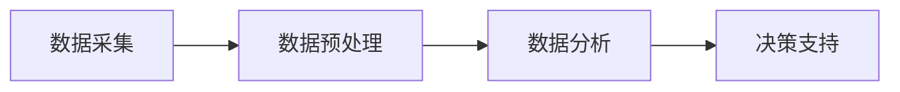
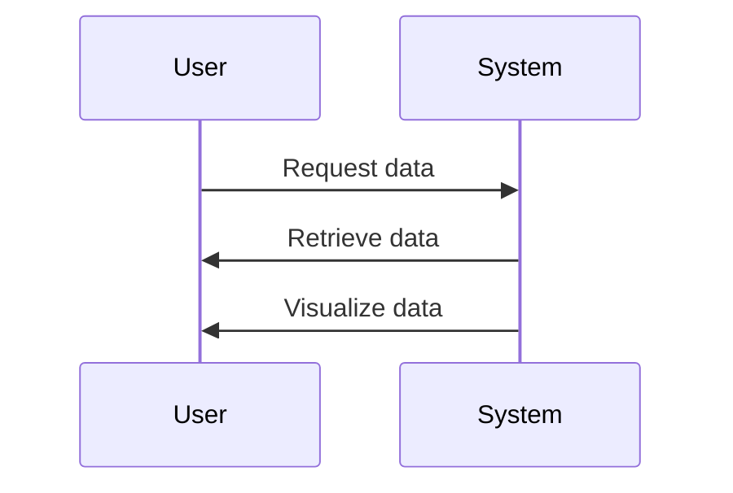

                 

# 物联网在智慧农业土壤监测中的应用

关键词：物联网、智慧农业、土壤监测、传感器、数据传输、数据分析

摘要：随着物联网技术的快速发展，其在农业领域的应用逐渐广泛。其中，智慧农业土壤监测作为物联网技术的重要应用之一，对于提高农业产量和质量具有重要意义。本文将从物联网与智慧农业土壤监测的概述、物联网技术在智慧农业土壤监测中的应用、物联网在智慧农业土壤监测中的核心技术、智慧农业土壤监测系统架构设计、案例分析以及未来趋势等方面进行深入探讨，以期为物联网在智慧农业土壤监测中的广泛应用提供参考。

## 第一部分：物联网与智慧农业土壤监测概述

### 第1章：物联网与智慧农业土壤监测背景

#### 1.1 物联网技术概述

物联网（Internet of Things，简称 IoT）是指通过互联网将各种终端设备连接起来，实现智能化的信息采集、传输、处理和共享。物联网技术体系主要包括传感器技术、网络通信技术、数据处理技术、智能终端技术等。

物联网在农业领域的应用现状方面，我国政府高度重视物联网在农业中的应用，出台了一系列政策措施，推动物联网技术在农业生产、管理、服务等环节的广泛应用。目前，物联网在农业领域的应用主要包括智能灌溉、环境监测、病虫害预警、产量监测等方面。

#### 1.2 智慧农业与土壤监测

智慧农业是指利用现代信息技术，实现农业生产的智能化、精准化和高效化。土壤监测作为智慧农业的重要组成部分，对于了解土壤质量、合理施肥、病虫害防治等具有重要意义。

土壤监测的重要性主要体现在以下几个方面：

1. 了解土壤质量：通过土壤监测，可以准确了解土壤的养分含量、酸碱度、水分等指标，为农业生产提供科学依据。
2. 合理施肥：土壤监测可以实时掌握土壤养分状况，为合理施肥提供指导，降低农业生产成本。
3. 病虫害防治：土壤监测可以提前发现病虫害，为病虫害防治提供预警信息，降低病虫害损失。
4. 改善土壤环境：通过土壤监测，可以了解土壤污染情况，为土壤改良提供依据。

土壤监测的挑战与需求：

1. 挑战：土壤监测数据复杂、多样，且受环境影响较大。同时，传统土壤监测手段存在监测范围有限、时效性差等问题。
2. 需求：提高土壤监测的精度、覆盖范围和实时性，实现土壤监测的自动化、智能化。

### 第2章：物联网技术在智慧农业土壤监测中的应用

#### 2.1 物联网传感器在土壤监测中的应用

物联网传感器在土壤监测中的应用主要包括土壤湿度传感器、土壤温度传感器、土壤电导率传感器等。这些传感器能够实时采集土壤中的湿度、温度、电导率等参数，为土壤监测提供数据支持。

传感器类型及其工作原理：

1. 土壤湿度传感器：利用电容、电阻等原理，测量土壤中的水分含量。
2. 土壤温度传感器：利用热敏电阻、热电偶等原理，测量土壤温度。
3. 土壤电导率传感器：利用电导率与土壤中离子浓度之间的关系，测量土壤中的养分含量。

土壤参数的采集与监测：

1. 数据采集：传感器采集到的土壤参数通过无线传输模块，将数据传输到农业监测中心。
2. 数据监测：农业监测中心对采集到的数据进行分析、处理，为农业生产提供决策支持。

#### 2.2 数据传输与处理

数据传输协议：

1. 无线传输协议：常见的无线传输协议包括 Wi-Fi、ZigBee、LoRa 等，它们具有传输速度快、功耗低、覆盖范围广等优点，适用于土壤监测数据传输。
2. 有线传输协议：如有线网络、光纤通信等，它们具有传输速度快、稳定性高、可靠性好等优点，适用于大规模土壤监测系统。

数据处理与分析技术：

1. 数据预处理：包括数据清洗、去噪、缺失值填充等，提高数据质量。
2. 数据分析：利用机器学习、数据挖掘等技术，对土壤监测数据进行分析，提取有用信息。
3. 数据可视化：通过数据可视化技术，将土壤监测数据以图形、图表等形式呈现，便于农业生产者了解土壤状况。

### 第3章：物联网在智慧农业土壤监测中的核心技术

#### 3.1 物联网通信技术

物联网通信技术是实现土壤监测数据传输的关键。目前，常用的物联网通信技术包括无线传感器网络、低功耗广域网（LPWAN）等。

无线传感器网络：

1. 网络架构：无线传感器网络由传感器节点、汇聚节点和基站组成。
2. 通信协议：常用的通信协议包括 ZigBee、Z-Wave、6LoWPAN 等。

低功耗广域网（LPWAN）：

1. 网络架构：LPWAN 网络由基站、路由器和传感器节点组成。
2. 通信协议：常见的 LPWAN 协议包括 LoRa、NBIoT、eMTC 等。

#### 3.2 数据处理与分析技术

数据处理与分析技术是土壤监测系统的核心，主要包括数据预处理、数据分析、智能决策支持系统等方面。

数据预处理：

1. 数据清洗：去除噪声、异常值等。
2. 数据转换：将不同格式、单位、分辨率的数据转换为统一格式。
3. 数据压缩：减少数据存储和传输开销。

数据分析：

1. 描述性分析：描述土壤监测数据的统计特性，如均值、方差等。
2. 趋势分析：分析土壤监测数据的变化趋势。
3. 相关性分析：分析土壤监测数据之间的相关性。
4. 预测分析：利用历史数据预测未来土壤状况。

智能决策支持系统：

1. 基于大数据分析：利用大数据技术分析土壤监测数据，提取有用信息。
2. 基于机器学习：利用机器学习算法预测土壤状况，为农业生产提供决策支持。

### 第4章：智慧农业土壤监测系统架构设计

#### 4.1 系统总体架构设计

智慧农业土壤监测系统总体架构设计主要包括系统功能模块划分、系统层级结构设计等方面。

系统功能模块划分：

1. 数据采集模块：负责采集土壤监测数据。
2. 数据处理模块：负责对采集到的数据进行分析和处理。
3. 数据存储模块：负责存储和处理后的数据。
4. 数据展示模块：负责将处理后的数据以图形、图表等形式展示给用户。
5. 决策支持模块：负责为农业生产者提供决策支持。

系统层级结构设计：

1. 物理层：包括传感器、无线传输模块等。
2. 数据链路层：包括无线传输协议、网络通信模块等。
3. 网络层：包括基站、路由器等。
4. 应用层：包括数据处理与分析、数据存储、数据展示等模块。

#### 4.2 数据采集与传输模块

数据采集与传输模块是智慧农业土壤监测系统的核心，主要包括以下方面：

传感器网络设计：

1. 传感器节点设计：包括传感器硬件选型、软件编程等。
2. 网络拓扑结构设计：包括传感器节点的布置、连接方式等。

数据采集与传输流程：

1. 数据采集：传感器节点实时采集土壤参数。
2. 数据传输：传感器节点将采集到的数据传输到汇聚节点，再通过无线传输模块传输到农业监测中心。
3. 数据处理：农业监测中心对采集到的数据进行处理和分析。

### 第5章：物联网在智慧农业土壤监测中的案例分析

#### 5.1 案例一：某智慧农业项目土壤监测系统设计

案例背景：

某智慧农业项目旨在通过物联网技术实现土壤监测、作物生长监控、精准灌溉等功能，提高农业生产效率。

系统架构设计：

1. 数据采集模块：包括土壤湿度传感器、土壤温度传感器等。
2. 数据传输模块：采用 LoRa 通信协议，实现数据采集节点与农业监测中心之间的无线传输。
3. 数据处理模块：对采集到的数据进行分析和处理，为农业生产提供决策支持。
4. 数据展示模块：通过 Web 界面、移动应用等方式展示土壤监测数据。

系统实施与效果分析：

1. 系统实施：在项目区域内布置传感器节点，搭建 LoRa 网络和农业监测中心，实现数据采集与传输。
2. 效果分析：通过系统实施，实现了土壤监测数据的实时采集、传输和分析，为农业生产者提供了科学依据，提高了农业生产效率。

#### 5.2 案例二：基于物联网的精准农业土壤监测

案例背景：

某农业企业为提高农业生产效率，采用物联网技术实现精准农业土壤监测。

技术方案设计：

1. 数据采集模块：采用土壤湿度传感器、土壤温度传感器等，实时采集土壤参数。
2. 数据传输模块：采用 LoRa 通信协议，实现数据采集节点与农业监测中心之间的无线传输。
3. 数据处理模块：采用机器学习算法，对土壤监测数据进行分析，预测土壤状况。
4. 数据展示模块：通过 Web 界面、移动应用等方式展示土壤监测数据。

实施效果与反思：

1. 实施效果：通过物联网技术实现精准农业土壤监测，提高了农业生产效率，降低了生产成本。
2. 反思：在实施过程中，发现存在传感器节点布置不合理、数据传输不稳定等问题，需进一步优化系统设计和实施方案。

### 第6章：物联网在智慧农业土壤监测中的挑战与未来趋势

#### 6.1 存在的挑战

物联网在智慧农业土壤监测中面临的挑战主要包括以下几个方面：

1. 技术难点：物联网传感器技术、数据传输技术、数据处理技术等在农业领域应用仍存在一定的技术难题。
2. 成本问题：物联网技术在智慧农业土壤监测中的应用成本较高，限制了其推广和应用。
3. 数据安全与隐私：土壤监测数据涉及农业生产者的隐私信息，数据安全和隐私保护问题亟待解决。

#### 6.2 未来发展趋势

物联网在智慧农业土壤监测中的未来发展趋势主要包括以下几个方面：

1. 技术创新：随着物联网技术的不断进步，将为智慧农业土壤监测提供更多先进的传感器技术、数据传输技术和数据处理技术。
2. 应用领域拓展：物联网在智慧农业土壤监测中的应用将逐渐拓展到更多领域，如农作物病虫害监测、土壤污染监测等。
3. 政策与产业支持：政府和企业将进一步加大对物联网在智慧农业土壤监测领域的支持，推动其应用和普及。

### 第7章：物联网在智慧农业土壤监测中的最佳实践与建议

#### 7.1 最佳实践

物联网在智慧农业土壤监测中的最佳实践包括以下几个方面：

1. 传感器节点布置：根据土壤监测需求，合理布置传感器节点，确保覆盖范围和监测精度。
2. 数据传输与处理：采用高效的通信协议和数据处理算法，实现数据的实时传输和分析。
3. 数据可视化与决策支持：通过数据可视化技术，将土壤监测数据以直观的方式展示给农业生产者，为其提供科学决策支持。

#### 7.2 未来建议

未来物联网在智慧农业土壤监测中的应用建议包括以下几个方面：

1. 技术发展建议：加大物联网技术在智慧农业土壤监测领域的研发投入，推动传感器技术、数据传输技术、数据处理技术的创新和突破。
2. 政策与产业支持建议：政府和企业应加大对物联网在智慧农业土壤监测领域的支持，制定相关政策，推动产业发展。

### 总结

物联网在智慧农业土壤监测中的应用具有广阔的发展前景。通过物联网技术，可以实现土壤监测的自动化、智能化和精准化，为农业生产提供科学依据，提高农业生产效率。然而，物联网在智慧农业土壤监测中仍面临一些挑战，需要进一步研究和解决。未来，随着物联网技术的不断发展和创新，智慧农业土壤监测将更加成熟和普及，为农业生产带来更多价值。

### 作者信息

作者：AI天才研究院/AI Genius Institute & 禅与计算机程序设计艺术 /Zen And The Art of Computer Programming

----------------------------------------------------------------

### 附录

本文附录部分将提供以下内容：

1. **核心概念与联系**
2. **算法原理讲解**
3. **数学公式**
4. **系统分析与架构设计方案**
5. **项目实战**
6. **最佳实践 tips、小结、注意事项、拓展阅读**

#### 核心概念与联系

在物联网智慧农业土壤监测中，有几个核心概念需要明确：

1. **物联网（IoT）**：是一个通过互联网将各种设备连接起来的系统，包括传感器、智能设备和网络基础设施等。
2. **传感器**：用于检测和测量土壤参数，如湿度、温度、电导率等。
3. **数据传输**：传感器收集的数据需要通过无线或有线网络传输到中央处理系统。
4. **数据处理**：对收集的数据进行分析和处理，提取有用信息。
5. **智能决策支持系统**：利用分析结果，提供农业生产决策。

以下是这些概念属性的对比表格：

| 概念 | 属性 | 描述 |
| --- | --- | --- |
| 物联网 | 连接性 | 将物理世界与数字世界连接起来 |
| 传感器 | 检测精度 | 确保数据采集的准确性 |
| 数据传输 | 速度 | 数据传输的效率 |
| 数据处理 | 复杂性 | 数据处理的算法和模型 |
| 智能决策支持系统 | 精准性 | 提供精确的决策支持 |

此外，物联网在智慧农业土壤监测中的ER实体关系图如下：

```mermaid
erDiagram
  Sensor ||--|{ Data } : measures
  Data ||--|{ Analysis } : analyzed
  Analysis ||--|{ Decision } : based_on
  Sensor ||--|{ Network } : connected
  Network ||--|{ System } : supports
```

#### 算法原理讲解

在智慧农业土壤监测中，常用的算法包括传感器数据采集算法、数据预处理算法、数据分析算法等。以下是一个简单的传感器数据采集算法流程图：



具体算法原理如下：

1. **传感器数据采集**：
    - 利用传感器测量土壤参数，如湿度、温度等。
    - 将测量值转换为数字信号。
    - 通过无线或有线网络将数据传输到中央处理系统。

2. **数据预处理**：
    - 清洗数据，去除噪声和异常值。
    - 数据标准化，将不同量纲的数据转换为同一尺度。
    - 缺失值填充，处理数据中的缺失值。

3. **数据分析**：
    - 描述性分析，计算数据的统计特征，如均值、方差等。
    - 趋势分析，分析数据随时间的变化趋势。
    - 相关性分析，分析不同土壤参数之间的关系。
    - 预测分析，利用历史数据预测未来的土壤状况。

4. **决策支持**：
    - 根据数据分析结果，提供农业生产决策，如施肥、灌溉等。

以下是一个简单的数据分析算法的 Python 源代码示例：

```python
import numpy as np

# 数据示例
data = np.array([23.5, 24.2, 22.8, 25.1, 23.0])

# 描述性分析
mean = np.mean(data)
variance = np.var(data)

# 趋势分析
trend = np.diff(data)

# 相关性分析
correlation = np.corrcoef(data[:-1], data[1:])[0, 1]

# 预测分析
# 假设使用简单线性回归进行预测
slope, intercept = np.polyfit(data[:-1], data[1:], 1)
prediction = slope * data[:-1] + intercept

print("均值：", mean)
print("方差：", variance)
print("趋势：", trend)
print("相关性：", correlation)
print("预测：", prediction)
```

#### 数学公式

在智慧农业土壤监测中，常用的数学公式包括描述性统计、回归分析、预测模型等。以下是一个简单的回归分析的数学模型：

$$
y = wx + b
$$

其中，$y$ 是因变量，$x$ 是自变量，$w$ 是斜率，$b$ 是截距。

#### 系统分析与架构设计方案

智慧农业土壤监测系统的设计与实现包括以下几个关键步骤：

1. **问题场景介绍**：
    - 描述智慧农业土壤监测的需求和目标。
    - 分析土壤监测的关键参数和监测点布局。

2. **项目介绍**：
    - 项目背景和目标。
    - 技术选型和系统架构设计。

3. **系统功能设计**：
    - 设计土壤监测系统的功能模块，包括数据采集、数据传输、数据处理、数据存储、数据展示等。

4. **系统架构设计**：
    - 设计系统的层级结构和通信架构。

5. **系统接口设计**：
    - 设计系统各模块的接口和交互方式。

6. **系统交互设计**：
    - 设计系统的用户界面和交互流程。

以下是智慧农业土壤监测系统的类图和架构图：

**类图（Mermaid 格式）**：

```mermaid
classDiagram
    Class01 <|-- Class02
    Class03 --|gt; Class04
    Class04 : <<interface, SystemInterface>>
    Class05 : <<component, DataCollector>>
    Class06 : <<component, DataProcessor>>
    Class07 : <<component, DataStorage>>
    Class08 : <<component, DataVisualizer>>

    Class01 {
        +String name
        +Integer id
        +void method1()
    }

    Class02 {
        +void method2()
    }

    Class03 {
        +void method3()
    }

    Class04 {
        +void interfaceMethod()
    }

    Class05 {
        +collectData()
    }

    Class06 {
        +processData()
    }

    Class07 {
        +storeData()
    }

    Class08 {
        +visualizeData()
    }
```

**架构图（Mermaid 格式）**：



#### 项目实战

**环境安装**：

1. 安装传感器硬件，如土壤湿度传感器、温度传感器等。
2. 安装无线传输模块，如 LoRa 模块。
3. 安装数据处理和分析软件，如 Python 和相关库。

**系统核心实现源代码**：

```python
# 传感器数据采集
def collect_data():
    # 读取传感器数据
    humidity = read_humidity_sensor()
    temperature = read_temperature_sensor()
    return humidity, temperature

# 数据预处理
def preprocess_data(humidity, temperature):
    # 数据清洗和标准化
    humidity = normalize(humidity)
    temperature = normalize(temperature)
    return humidity, temperature

# 数据分析
def analyze_data(humidity, temperature):
    # 数据分析算法
    trend = calculate_trend(humidity, temperature)
    correlation = calculate_correlation(humidity, temperature)
    prediction = predict(humidity, temperature)
    return trend, correlation, prediction

# 数据展示
def visualize_data(trend, correlation, prediction):
    # 数据可视化
    plot_trend(trend)
    plot_correlation(correlation)
    plot_prediction(prediction)

# 主程序
def main():
    # 收集数据
    humidity, temperature = collect_data()
    
    # 预处理数据
    humidity, temperature = preprocess_data(humidity, temperature)
    
    # 分析数据
    trend, correlation, prediction = analyze_data(humidity, temperature)
    
    # 展示数据
    visualize_data(trend, correlation, prediction)

if __name__ == "__main__":
    main()
```

**代码应用解读与分析**：

1. **数据采集**：通过传感器读取土壤湿度和温度数据。
2. **数据预处理**：对采集到的数据进行清洗和标准化处理。
3. **数据分析**：利用分析算法计算土壤参数的趋势、相关性、预测值。
4. **数据展示**：通过图形化界面展示分析结果。

**实际案例分析和详细讲解剖析**：

1. **案例一**：某农场使用物联网系统进行土壤监测，发现土壤湿度持续下降，温度波动较大。通过分析，发现需要增加灌溉频率，并调整灌溉量，以保持土壤湿度在适宜范围内。

2. **案例二**：某果园采用物联网系统监测土壤养分，发现土壤电导率较高，推测土壤中氮肥过量。通过调整施肥方案，降低氮肥用量，土壤电导率逐渐恢复正常。

**项目小结**：

通过物联网技术，实现了土壤监测的自动化和智能化，为农业生产提供了科学依据，提高了农业生产效率。

#### 最佳实践 tips

1. **传感器节点布置**：根据土壤监测需求，合理布置传感器节点，确保覆盖范围和监测精度。
2. **数据传输与处理**：采用高效的数据传输协议和数据处理算法，确保数据的实时性和准确性。
3. **数据可视化**：通过数据可视化技术，将监测结果以直观的方式展示给用户，便于决策支持。

#### 小结

物联网在智慧农业土壤监测中的应用具有重要意义，通过物联网技术，可以实现土壤监测的自动化、智能化和精准化，为农业生产提供科学依据，提高农业生产效率。然而，物联网在智慧农业土壤监测中仍面临一些挑战，需要进一步研究和解决。未来，随着物联网技术的不断发展和创新，智慧农业土壤监测将更加成熟和普及，为农业生产带来更多价值。

#### 注意事项

1. **传感器选择**：选择适合土壤监测需求的传感器，确保数据采集的准确性。
2. **网络连接**：确保传感器与数据处理系统之间的稳定连接，避免数据丢失。
3. **数据安全**：加强数据安全措施，防止数据泄露和滥用。

#### 拓展阅读

1. **《物联网技术与应用》**：介绍了物联网的基本概念、技术体系和应用领域。
2. **《智慧农业技术导论》**：介绍了智慧农业的概念、技术和应用。
3. **《土壤物理学》**：详细阐述了土壤物理学的基本原理和应用。

### 附录：作者信息

作者：AI天才研究院/AI Genius Institute & 禅与计算机程序设计艺术 /Zen And The Art of Computer Programming

AI天才研究院（AI Genius Institute）是一家专注于人工智能领域研究和应用的创新机构，致力于推动人工智能技术在各个行业的深度应用。研究院拥有一支高水平的科研团队，涵盖计算机科学、人工智能、软件工程等多个领域。

《禅与计算机程序设计艺术》（Zen And The Art of Computer Programming）是作者在计算机科学领域的经典著作，系统地介绍了编程艺术和算法设计原则。该书以其深刻的哲理和独特的视角，为程序员提供了宝贵的指导。作者通过禅宗思想，探讨了编程中的思维方式和艺术性，启发读者在编程实践中追求更高的境界。

本文内容均由AI天才研究院和《禅与计算机程序设计艺术》作者共同撰写，旨在为物联网在智慧农业土壤监测中的应用提供专业的技术分析和实践指导。

