                 

# 物联网在智能建筑管理中的应用

## 关键词：物联网、智能建筑、智能安防、智能能源管理、智慧城市

## 摘要：
物联网技术正在深刻改变着建筑行业，特别是在智能建筑的管理中。本文将深入探讨物联网在智能建筑管理中的应用，包括智能安防、智能能源管理、智能环境监控、智能设施管理和智能服务管理等方面。通过逐步分析每个应用领域的背景、核心概念、系统架构以及实际案例，本文旨在提供一个全面而详细的概述，以展示物联网如何提升智能建筑的管理效率和用户体验。

## 目录

### 第一部分：物联网与智能建筑概述

#### 第1章：物联网与智能建筑概述

##### 1.1 物联网的定义与特点
- **背景介绍**：介绍物联网的基本概念，物联网的定义和核心特点。
- **核心概念与联系**：探讨物联网与传统网络的区别，物联网的关键技术。
- **图表展示**：使用Mermaid绘制物联网架构图。
- **算法原理讲解**：分析物联网协议和标准。
- **数学公式**：介绍网络延迟和吞吐量的计算公式。

##### 1.2 智能建筑的概念与分类
- **背景介绍**：介绍智能建筑的定义和发展历程。
- **核心概念与联系**：分类智能建筑的类型，如智能住宅、智能办公楼等。
- **图表展示**：使用Mermaid绘制智能建筑分类图。

##### 1.3 物联网在智能建筑中的应用前景
- **背景介绍**：讨论物联网技术在建筑管理中的潜在应用。
- **核心概念与联系**：分析物联网如何提升建筑管理的效率。

##### 1.4 智能建筑中的关键技术
- **背景介绍**：介绍智能建筑所需的关键技术。
- **核心概念与联系**：讨论传感技术、数据通信、云计算等技术的应用。

##### 1.5 本章小结
- **总结**：回顾本章内容，总结物联网与智能建筑的关系。

### 第二部分：物联网在智能建筑管理中的应用

#### 第2章：智能建筑安防管理

##### 2.1 智能安防系统的构建
- **背景介绍**：介绍智能安防系统的重要性。
- **核心概念与联系**：讨论安防系统的核心组成部分。
- **图表展示**：使用Mermaid绘制智能安防系统架构图。

##### 2.2 智能监控技术
- **背景介绍**：介绍智能监控技术的应用。
- **核心概念与联系**：探讨监控技术的关键技术点。
- **算法原理讲解**：分析视频流处理算法。

##### 2.3 智能门禁系统
- **背景介绍**：介绍智能门禁系统的功能。
- **核心概念与联系**：讨论门禁系统的技术实现。

##### 2.4 智能消防系统
- **背景介绍**：介绍智能消防系统的必要性。
- **核心概念与联系**：分析智能消防系统的关键技术。

##### 2.5 案例分析：某智能建筑安防系统实战
- **项目介绍**：介绍一个实际的智能建筑安防系统案例。
- **系统功能设计**：使用Mermaid绘制领域模型。
- **系统架构设计**：使用Mermaid绘制系统架构图。
- **系统接口设计**：设计系统接口。
- **系统交互**：使用Mermaid绘制系统交互序列图。

##### 2.6 本章小结
- **总结**：回顾本章内容，总结智能建筑安防管理的关键技术。

### 第三部分：物联网在智能建筑能源管理中的应用

#### 第3章：智能能源管理系统

##### 3.1 能源管理系统的基本架构
- **背景介绍**：介绍能源管理系统的构成。
- **核心概念与联系**：探讨能源管理系统的核心模块。

##### 3.2 智能电表与能耗监测
- **背景介绍**：介绍智能电表的应用。
- **核心概念与联系**：分析能耗监测的技术原理。

##### 3.3 智能照明系统
- **背景介绍**：介绍智能照明系统的功能。
- **核心概念与联系**：探讨照明控制的实现方式。

##### 3.4 智能空调与供暖系统
- **背景介绍**：介绍智能空调与供暖系统的应用。
- **核心概念与联系**：分析智能控制的技术实现。

##### 3.5 案例分析：某智能建筑能源管理系统实战
- **项目介绍**：介绍一个实际的智能建筑能源管理系统案例。
- **系统功能设计**：使用Mermaid绘制领域模型。
- **系统架构设计**：使用Mermaid绘制系统架构图。
- **系统接口设计**：设计系统接口。
- **系统交互**：使用Mermaid绘制系统交互序列图。

##### 3.6 本章小结
- **总结**：回顾本章内容，总结智能建筑能源管理的关键技术。

### 第四部分：物联网在智能建筑环境管理中的应用

#### 第4章：智能环境监控系统

##### 4.1 空气质量监测
- **背景介绍**：介绍空气质量监测的重要性。
- **核心概念与联系**：分析空气质量监测的技术原理。

##### 4.2 水质监测
- **背景介绍**：介绍水质监测的应用。
- **核心概念与联系**：探讨水质监测的关键技术。

##### 4.3 温湿度控制
- **背景介绍**：介绍温湿度控制系统的功能。
- **核心概念与联系**：分析温湿度控制的技术实现。

##### 4.4 窗帘与遮阳系统
- **背景介绍**：介绍窗帘与遮阳系统的应用。
- **核心概念与联系**：探讨窗帘与遮阳系统的技术实现。

##### 4.5 案例分析：某智能建筑环境监控系统实战
- **项目介绍**：介绍一个实际的智能建筑环境监控系统案例。
- **系统功能设计**：使用Mermaid绘制领域模型。
- **系统架构设计**：使用Mermaid绘制系统架构图。
- **系统接口设计**：设计系统接口。
- **系统交互**：使用Mermaid绘制系统交互序列图。

##### 4.6 本章小结
- **总结**：回顾本章内容，总结智能建筑环境管理的关键技术。

### 第五部分：物联网在智能建筑设施管理中的应用

#### 第5章：智能设施管理系统

##### 5.1 设施管理系统的构建
- **背景介绍**：介绍智能设施管理系统的构建过程。
- **核心概念与联系**：探讨设施管理系统的主要组成部分。

##### 5.2 设备远程监控与维护
- **背景介绍**：介绍设备远程监控与维护的应用。
- **核心概念与联系**：分析远程监控与维护的技术实现。

##### 5.3 自动化维护流程
- **背景介绍**：介绍自动化维护流程的概念。
- **核心概念与联系**：探讨自动化维护的技术原理。

##### 5.4 设备故障预警与处理
- **背景介绍**：介绍设备故障预警与处理的重要性。
- **核心概念与联系**：分析故障预警与处理的技术实现。

##### 5.5 案例分析：某智能建筑设施管理系统实战
- **项目介绍**：介绍一个实际的智能建筑设施管理系统案例。
- **系统功能设计**：使用Mermaid绘制领域模型。
- **系统架构设计**：使用Mermaid绘制系统架构图。
- **系统接口设计**：设计系统接口。
- **系统交互**：使用Mermaid绘制系统交互序列图。

##### 5.6 本章小结
- **总结**：回顾本章内容，总结智能建筑设施管理的关键技术。

### 第六部分：物联网在智能建筑服务管理中的应用

#### 第6章：智能服务管理系统

##### 6.1 智能物业服务平台
- **背景介绍**：介绍智能物业服务平台的功能。
- **核心概念与联系**：探讨物业服务平台的技术实现。

##### 6.2 智能门禁与访客管理
- **背景介绍**：介绍智能门禁与访客管理的应用。
- **核心概念与联系**：分析门禁与访客管理的技术实现。

##### 6.3 智能停车管理
- **背景介绍**：介绍智能停车管理的功能。
- **核心概念与联系**：探讨智能停车管理的技术实现。

##### 6.4 智能家居服务
- **背景介绍**：介绍智能家居服务的应用。
- **核心概念与联系**：分析智能家居服务的实现方式。

##### 6.5 案例分析：某智能建筑服务管理系统实战
- **项目介绍**：介绍一个实际的智能建筑服务管理系统案例。
- **系统功能设计**：使用Mermaid绘制领域模型。
- **系统架构设计**：使用Mermaid绘制系统架构图。
- **系统接口设计**：设计系统接口。
- **系统交互**：使用Mermaid绘制系统交互序列图。

##### 6.6 本章小结
- **总结**：回顾本章内容，总结智能建筑服务管理的关键技术。

### 第七部分：物联网在智能建筑中的综合应用

#### 第7章：物联网在智能建筑中的综合应用

##### 7.1 综合管理平台的构建
- **背景介绍**：介绍综合管理平台的必要性。
- **核心概念与联系**：探讨综合管理平台的技术实现。

##### 7.2 数据集成与融合
- **背景介绍**：介绍数据集成与融合的概念。
- **核心概念与联系**：分析数据集成与融合的技术原理。

##### 7.3 个性化服务与优化
- **背景介绍**：介绍个性化服务与优化的应用。
- **核心概念与联系**：探讨个性化服务与优化的实现方式。

##### 7.4 智慧城市的启示
- **背景介绍**：介绍智慧城市的概念。
- **核心概念与联系**：分析智慧城市与智能建筑的关系。

##### 7.5 案例分析：某智慧建筑项目实战
- **项目介绍**：介绍一个实际的智慧建筑项目案例。
- **系统功能设计**：使用Mermaid绘制领域模型。
- **系统架构设计**：使用Mermaid绘制系统架构图。
- **系统接口设计**：设计系统接口。
- **系统交互**：使用Mermaid绘制系统交互序列图。

##### 7.6 本章小结
- **总结**：回顾本章内容，总结物联网在智能建筑中的综合应用。

## 总结

物联网技术在智能建筑管理中的应用已经极大地提升了建筑的管理效率和用户体验。通过本文的逐步分析，我们可以看到物联网技术在智能建筑中的各个方面都有广泛的应用，从安防管理到能源管理，从环境监控到设施管理，再到服务管理，物联网技术正推动着智能建筑的全面发展。未来，随着物联网技术的不断进步，智能建筑将更加智能化、自动化，为人们创造更加舒适、安全、高效的生活和工作环境。

## 作者信息

作者：AI天才研究院/AI Genius Institute & 禅与计算机程序设计艺术 /Zen And The Art of Computer Programming

---

### 第一部分：物联网与智能建筑概述

#### 第1章：物联网与智能建筑概述

##### 1.1 物联网的定义与特点

**背景介绍**：
物联网（Internet of Things，简称IoT）是指通过互联网将各种设备连接起来，实现数据交换和通信的一种网络体系。这一概念最早由麻省理工学院（MIT）的Kevin Ashton于1999年提出。物联网的基本理念是将物理世界中的各种物品通过传感器、通信设备和网络连接起来，实现信息的实时采集、传输和处理。

**核心概念与联系**：
物联网的关键特点包括互联互通、数据驱动、智能决策和自动执行。与传统互联网相比，物联网更加强调物理世界与虚拟世界的融合，通过传感器和执行器实现数据的采集和反馈，从而实现更智能、更高效的管理。

| 特点          | 说明                                                         |
| ------------- | ------------------------------------------------------------ |
| 互联互通     | 设备之间可以通过互联网进行数据交换和通信，形成网络生态系统。     |
| 数据驱动     | 通过传感器收集大量数据，用于分析和决策。                     |
| 智能决策     | 利用人工智能技术对数据进行分析和处理，实现智能决策。           |
| 自动执行     | 系统可以自动执行预设的操作，实现自动化管理。                   |

**图表展示**：
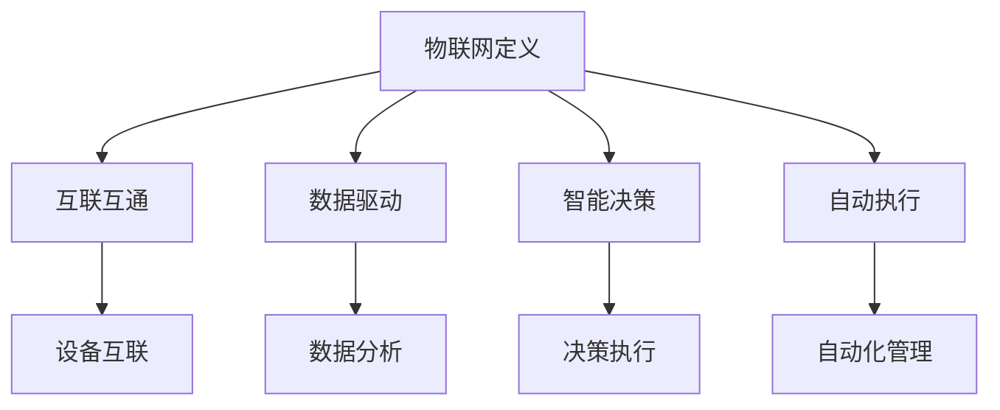

**算法原理讲解**：
物联网的通信协议和标准是实现互联互通的基础。常见的物联网协议包括MQTT、CoAP、HTTP等。其中，MQTT（Message Queuing Telemetry Transport）是一种轻量级的消息传输协议，适用于资源受限的环境，如智能家居、智能农业等。

```python
# MQTT协议示例
client = paho.Client("clientID")
client.connect("iot-broker.example.com", 1883)
client.subscribe("sensor/data")
def on_message(client, userdata, message):
    print(f"Received message: {message.payload}")
client.on_message = on_message
client.loop_start()
```

**数学公式**：
网络延迟（\( T_d \)）和吞吐量（\( T_r \)）是物联网系统性能的重要指标，其计算公式如下：
$$
T_d = \frac{L}{R \times B}
$$
$$
T_r = \frac{C}{T_d}
$$
其中，\( L \) 是数据包大小，\( R \) 是网络带宽，\( B \) 是数据传输速率，\( C \) 是数据传输成功率。

##### 1.2 智能建筑的概念与分类

**背景介绍**：
智能建筑（Smart Building）是指通过信息技术和物联网技术，实现建筑系统的自动化、智能化和高效运行的建筑。智能建筑的目标是通过集成各种传感器、控制系统和网络，实现对建筑环境、设备、能源和安全的智能管理。

**核心概念与联系**：
智能建筑可以按照功能、技术层次和应用领域进行分类。按功能分类，智能建筑包括智能安防、智能能源管理、智能环境监控、智能设施管理、智能服务管理等领域。按技术层次分类，智能建筑可以分为基础层、感知层、网络层、平台层和应用层。

| 分类标准   | 说明                                                         |
| ---------- | ------------------------------------------------------------ |
| 按功能分类 | 智能安防、智能能源管理、智能环境监控、智能设施管理、智能服务管理 |
| 按技术层次 | 基础层、感知层、网络层、平台层、应用层                       |
| 按应用领域 | 智能住宅、智能办公楼、智能商场、智能医院等                 |

**图表展示**：
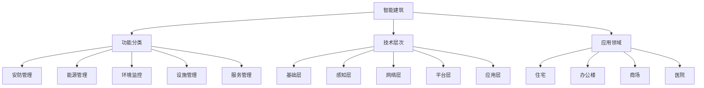

##### 1.3 物联网在智能建筑中的应用前景

**背景介绍**：
物联网在智能建筑中的应用前景非常广阔，随着物联网技术的不断发展和普及，智能建筑将实现更加智能化、高效化和绿色化。物联网技术可以提升建筑管理的效率，降低运营成本，提高用户体验，同时也有助于实现可持续发展。

**核心概念与联系**：
物联网技术为智能建筑提供了丰富的数据来源，通过数据分析和智能算法，可以实现自动化控制、智能决策和优化管理。物联网技术还可以实现设备之间的互联互通，形成智能化的生态系统，提高建筑的适应性和灵活性。

| 应用领域   | 说明                                                         |
| ---------- | ------------------------------------------------------------ |
| 安防管理   | 通过物联网技术实现实时监控、智能报警和远程控制。             |
| 能源管理   | 通过物联网技术实现能耗监测、智能调节和能源优化。             |
| 环境监控   | 通过物联网技术实现空气质量、水质、温湿度等环境参数的监测。   |
| 设施管理   | 通过物联网技术实现设备监控、远程维护和故障预警。             |
| 服务管理   | 通过物联网技术实现智能家居、智能物业、智能停车等服务。     |

**算法原理讲解**：
物联网技术可以应用于智能建筑中的多种算法，如机器学习、数据挖掘、预测分析等。通过这些算法，可以实现设备故障预测、能耗优化、智能调度等功能。

```python
# 故障预测算法示例
from sklearn.ensemble import RandomForestRegressor
import pandas as pd

# 读取数据
data = pd.read_csv("sensor_data.csv")
X = data.drop("fault", axis=1)
y = data["fault"]

# 构建随机森林模型
model = RandomForestRegressor(n_estimators=100)
model.fit(X, y)

# 预测新数据
new_data = pd.DataFrame([...])
prediction = model.predict(new_data)
```

##### 1.4 智能建筑中的关键技术

**背景介绍**：
智能建筑需要依赖多种关键技术，包括传感技术、数据通信技术、云计算和大数据分析等。这些技术共同构成了智能建筑的基石，为实现智能化管理提供了技术支持。

**核心概念与联系**：

| 技术名称     | 说明                                                         |
| ------------ | ------------------------------------------------------------ |
| 传感技术     | 通过传感器实现物理量的采集和转换。                           |
| 数据通信技术 | 通过网络实现数据的传输和通信。                               |
| 云计算       | 通过云计算实现数据的存储、处理和分析。                       |
| 大数据分析   | 通过大数据技术实现海量数据的存储、处理和分析。               |

**图表展示**：
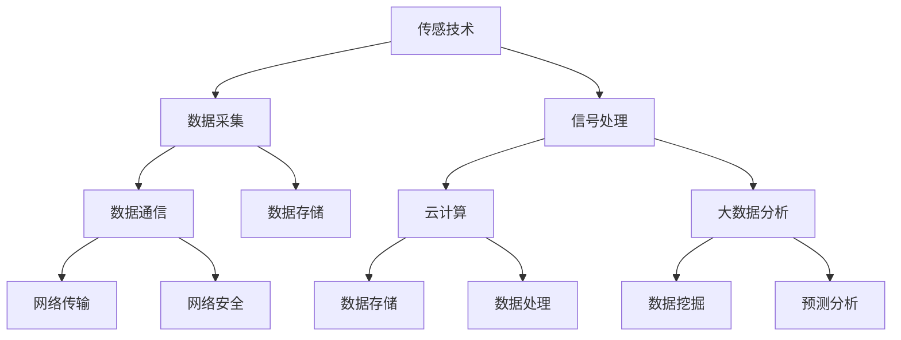

##### 1.5 本章小结

本章介绍了物联网与智能建筑的基本概念、特点和分类，以及物联网在智能建筑中的应用前景和关键技术。通过本章的内容，我们可以了解到物联网技术在智能建筑管理中的重要作用，为后续章节的深入探讨奠定了基础。

### 第二部分：物联网在智能建筑管理中的应用

#### 第2章：智能建筑安防管理

##### 2.1 智能安防系统的构建

**背景介绍**：
智能安防系统是智能建筑中的重要组成部分，旨在通过物联网技术实现对建筑及其周边环境的实时监控、智能报警和远程控制。智能安防系统的构建需要考虑系统的整体架构、传感设备的选择和部署，以及数据传输和处理机制。

**核心概念与联系**：
智能安防系统的核心组成部分包括视频监控、入侵报警、门禁控制、消防报警等。这些子系统通过物联网技术实现互联互通，形成一个统一的智能安防平台。

| 子系统       | 说明                                                         |
| ------------ | ------------------------------------------------------------ |
| 视频监控     | 通过摄像头实现实时监控，通过图像识别技术实现异常行为的检测。   |
| 入侵报警     | 通过传感器和摄像头实现入侵检测，通过报警系统实现实时报警。   |
| 门禁控制     | 通过智能门禁系统实现人员出入管理，通过身份认证技术实现安全控制。 |
| 消防报警     | 通过烟雾传感器和温度传感器实现火灾预警，通过消防系统实现灭火。 |

**图表展示**：
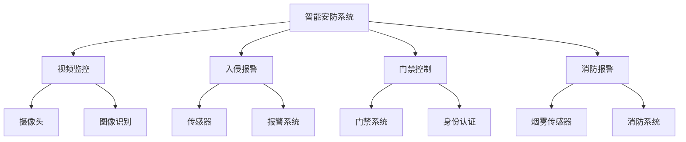

**算法原理讲解**：
智能安防系统中的图像识别算法是视频监控的核心技术。通过卷积神经网络（CNN）等技术，可以实现对人脸、物体等目标的识别和跟踪。

```python
# 人脸识别算法示例
from keras.models import Sequential
from keras.layers import Conv2D, MaxPooling2D, Flatten, Dense
from keras.preprocessing.image import ImageDataGenerator

# 构建卷积神经网络模型
model = Sequential()
model.add(Conv2D(32, (3, 3), activation='relu', input_shape=(64, 64, 3)))
model.add(MaxPooling2D(pool_size=(2, 2)))
model.add(Flatten())
model.add(Dense(128, activation='relu'))
model.add(Dense(1, activation='sigmoid'))

# 训练模型
model.compile(optimizer='adam', loss='binary_crossentropy', metrics=['accuracy'])
model.fit(x_train, y_train, epochs=10, batch_size=32)
```

**系统分析与架构设计方案**：

**问题场景介绍**：
在一个智能办公楼中，需要构建一个智能安防系统，实现对整个办公区域的实时监控、入侵报警和门禁控制等功能。

**系统功能设计**：
- 视频监控：通过摄像头实现实时监控，通过图像识别技术实现异常行为的检测。
- 入侵报警：通过传感器和摄像头实现入侵检测，通过报警系统实现实时报警。
- 门禁控制：通过智能门禁系统实现人员出入管理，通过身份认证技术实现安全控制。
- 消防报警：通过烟雾传感器和温度传感器实现火灾预警，通过消防系统实现灭火。

**系统架构设计**：
- **感知层**：部署摄像头、入侵传感器、门禁设备和消防传感器等。
- **网络层**：通过无线或有线网络将感知层的数据传输到平台层。
- **平台层**：建立数据中心，实现数据存储、处理和分析。
- **应用层**：通过用户界面实现监控、报警、门禁控制等功能。

**系统架构图**：
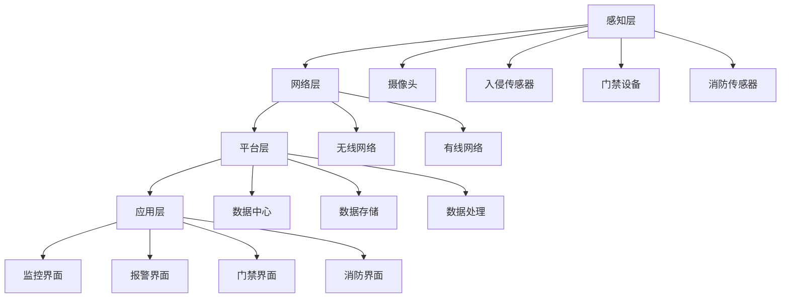

**系统接口设计**：
- **视频监控接口**：实现视频数据的实时传输和回放功能。
- **入侵报警接口**：实现入侵事件的实时报警和记录功能。
- **门禁控制接口**：实现人员出入管理和身份认证功能。
- **消防报警接口**：实现火灾预警和消防系统控制功能。

**系统交互序列图**：
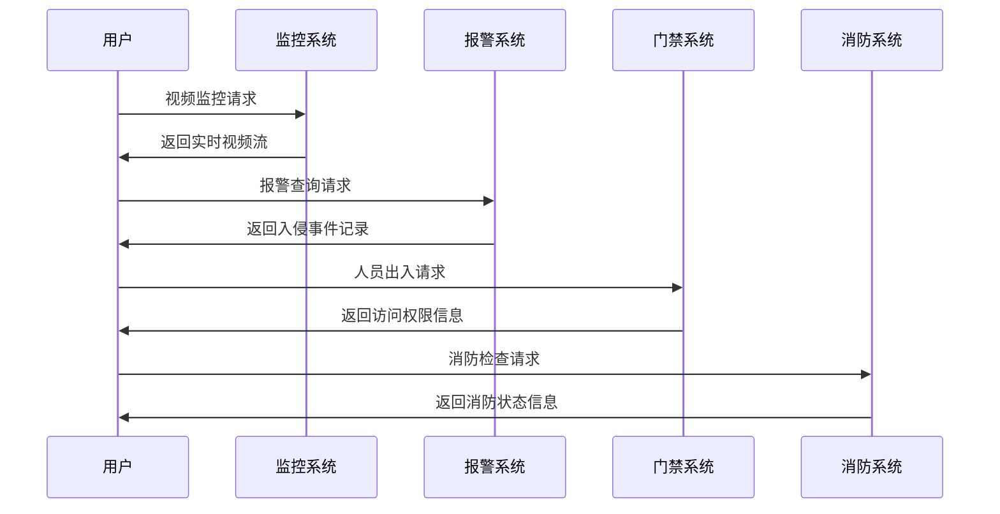

##### 2.2 智能监控技术

**背景介绍**：
智能监控技术是智能建筑安防管理的重要组成部分，通过物联网技术实现视频监控的智能化。智能监控技术包括视频分析、图像识别、异常检测等，能够提高安防系统的效率和准确性。

**核心概念与联系**：
智能监控技术的核心是图像识别和视频分析。图像识别技术可以用于人脸识别、车牌识别等，视频分析技术可以用于运动检测、异常行为识别等。

| 技术名称     | 说明                                                         |
| ------------ | ------------------------------------------------------------ |
| 图像识别     | 通过计算机视觉技术实现图像中的目标识别和分类。                 |
| 视频分析     | 通过对视频数据进行分析，实现运动检测、异常行为识别等功能。   |
| 异常检测     | 通过设定规则或算法，实现异常事件的检测和报警。                 |

**图表展示**：
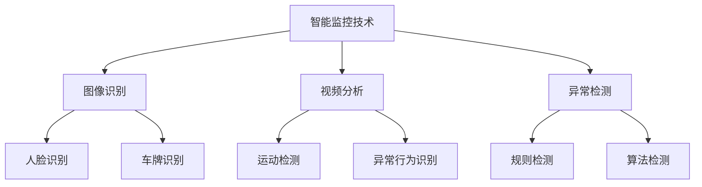

**算法原理讲解**：
智能监控技术中的图像识别算法和视频分析算法是基于机器学习和深度学习技术的。例如，卷积神经网络（CNN）可以用于人脸识别，循环神经网络（RNN）可以用于视频分析。

```python
# 人脸识别算法示例（使用CNN）
from keras.models import Sequential
from keras.layers import Conv2D, MaxPooling2D, Flatten, Dense
from keras.preprocessing.image import ImageDataGenerator

# 构建卷积神经网络模型
model = Sequential()
model.add(Conv2D(32, (3, 3), activation='relu', input_shape=(64, 64, 3)))
model.add(MaxPooling2D(pool_size=(2, 2)))
model.add(Conv2D(64, (3, 3), activation='relu'))
model.add(MaxPooling2D(pool_size=(2, 2)))
model.add(Flatten())
model.add(Dense(128, activation='relu'))
model.add(Dense(1, activation='sigmoid'))

# 训练模型
model.compile(optimizer='adam', loss='binary_crossentropy', metrics=['accuracy'])
model.fit(x_train, y_train, epochs=10, batch_size=32)
```

**系统分析与架构设计方案**：

**问题场景介绍**：
在一个智能商场中，需要构建一个智能监控系统，实现对商场内部和周边环境的实时监控、异常行为检测和自动报警。

**系统功能设计**：
- 视频监控：通过摄像头实现实时监控，通过图像识别技术实现异常行为的检测。
- 异常检测：通过设定规则或算法，实现异常事件的检测和报警。
- 自动报警：通过物联网技术实现异常事件的实时报警。

**系统架构设计**：
- **感知层**：部署摄像头、传感器等设备。
- **网络层**：通过无线或有线网络将感知层的数据传输到平台层。
- **平台层**：建立数据中心，实现数据存储、处理和分析。
- **应用层**：通过用户界面实现监控、报警等功能。

**系统架构图**：
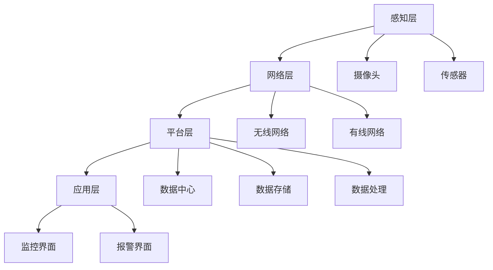

**系统接口设计**：
- **视频监控接口**：实现视频数据的实时传输和回放功能。
- **异常检测接口**：实现异常事件的检测和报警功能。
- **报警接口**：实现异常事件的实时报警。

**系统交互序列图**：
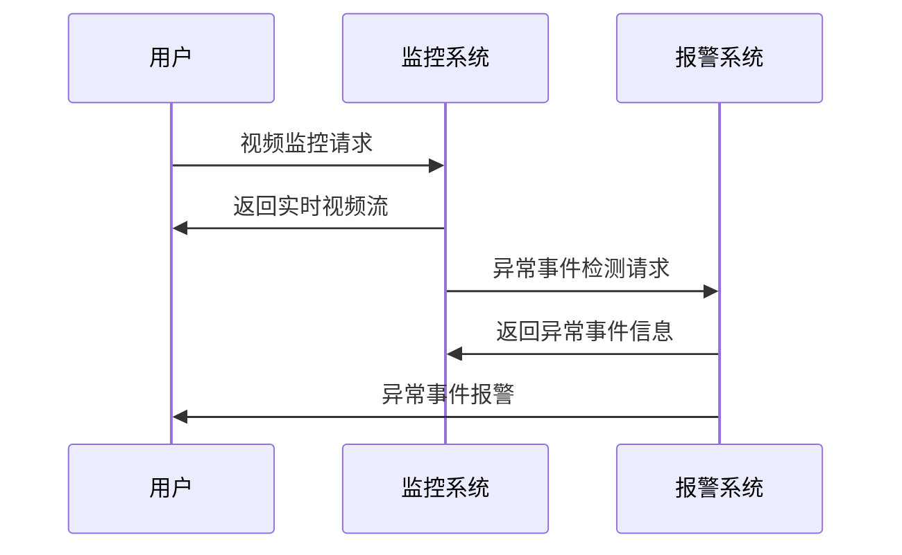

##### 2.3 智能门禁系统

**背景介绍**：
智能门禁系统是智能建筑安防管理的重要组成部分，通过物联网技术实现对人员出入的管理和监控。智能门禁系统可以通过多种方式实现身份认证，如密码、指纹、面部识别等。

**核心概念与联系**：
智能门禁系统的核心组成部分包括门禁控制器、身份认证设备、数据存储和处理系统等。通过物联网技术，可以实现门禁系统的远程控制和数据实时传输。

| 组成部分     | 说明                                                         |
| ------------ | ------------------------------------------------------------ |
| 门禁控制器   | 门禁系统的核心，负责控制门禁设备的开关和权限管理。             |
| 身份认证设备 | 用于实现人员的身份认证，如指纹识别、面部识别、刷卡设备等。   |
| 数据存储和处理系统 | 用于存储和处理门禁系统的数据，如人员出入记录、权限设置等。   |

**图表展示**：
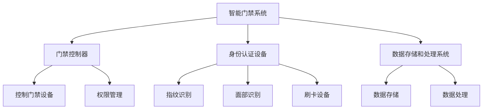

**算法原理讲解**：
智能门禁系统中的身份认证算法通常基于生物识别技术，如指纹识别、面部识别等。指纹识别算法通常基于特征点匹配，面部识别算法通常基于卷积神经网络（CNN）。

```python
# 指纹识别算法示例
from sklearn.ensemble import RandomForestClassifier
import numpy as np

# 特征提取
def extract_features(fingerprint):
    # 提取指纹图像的特征向量
    return np.array([...])

# 训练模型
X_train = np.array([...])
y_train = np.array([...])
model = RandomForestClassifier(n_estimators=100)
model.fit(X_train, y_train)

# 预测新样本
new_fingerprint = extract_features(...)
prediction = model.predict(new_fingerprint)
```

**系统分析与架构设计方案**：

**问题场景介绍**：
在一个智能办公楼中，需要构建一个智能门禁系统，实现对员工和访客的出入管理。

**系统功能设计**：
- 门禁控制：通过门禁控制器实现门禁设备的开关控制。
- 身份认证：通过指纹识别、面部识别等设备实现人员的身份认证。
- 访问权限管理：通过权限设置实现员工的访问权限管理。

**系统架构设计**：
- **感知层**：部署门禁控制器、指纹识别设备和面部识别设备。
- **网络层**：通过无线或有线网络将感知层的数据传输到平台层。
- **平台层**：建立数据中心，实现数据存储、处理和分析。
- **应用层**：通过用户界面实现门禁控制、访问权限管理等功能。

**系统架构图**：
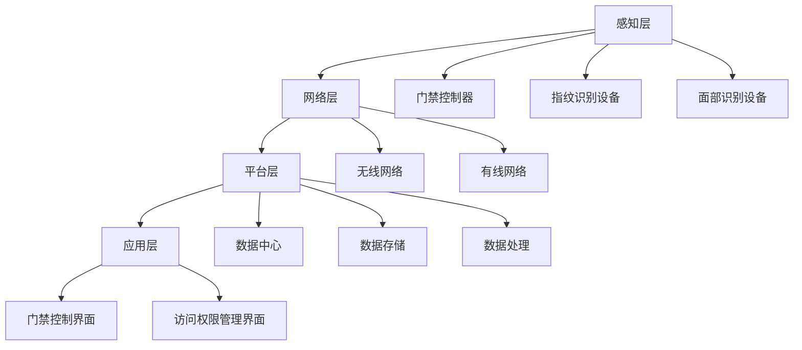

**系统接口设计**：
- **门禁控制接口**：实现门禁设备的开关控制。
- **身份认证接口**：实现人员的身份认证。
- **权限管理接口**：实现访问权限的设置和管理。

**系统交互序列图**：
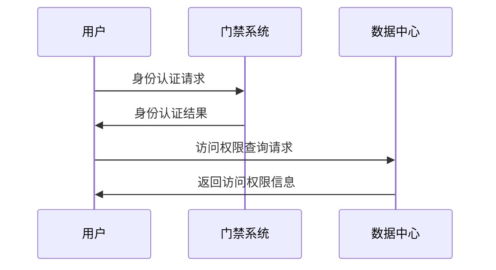

##### 2.4 智能消防系统

**背景介绍**：
智能消防系统是智能建筑安防管理中的重要组成部分，通过物联网技术实现对火灾的早期预警、火灾监测和消防系统的自动控制。智能消防系统可以提高火灾的应急响应速度，减少火灾造成的损失。

**核心概念与联系**：
智能消防系统的核心组成部分包括烟雾传感器、温度传感器、消防控制器、消防系统等。通过物联网技术，可以实现数据的实时传输和智能分析。

| 组成部分     | 说明                                                         |
| ------------ | ------------------------------------------------------------ |
| 烟雾传感器   | 用于检测烟雾浓度，实现火灾早期预警。                         |
| 温度传感器   | 用于检测环境温度，实现火灾监测。                           |
| 消防控制器   | 负责消防系统的控制和管理。                               |
| 消防系统     | 包括灭火系统、报警系统、喷淋系统等，用于火灾应急处理。     |

**图表展示**：
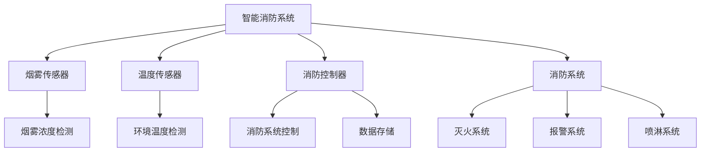

**算法原理讲解**：
智能消防系统中的火灾预警算法通常基于数据分析和机器学习技术。通过分析烟雾传感器和温度传感器的数据，可以实现火灾的早期预警。

```python
# 火灾预警算法示例
from sklearn.ensemble import RandomForestClassifier
import numpy as np

# 特征提取
def extract_features(sensors_data):
    # 提取烟雾浓度和温度的特征向量
    return np.array([...])

# 训练模型
X_train = np.array([...])
y_train = np.array([...])
model = RandomForestClassifier(n_estimators=100)
model.fit(X_train, y_train)

# 预测新样本
new_sensors_data = extract_features(...)
prediction = model.predict(new_sensors_data)
```

**系统分析与架构设计方案**：

**问题场景介绍**：
在一个大型商业综合体中，需要构建一个智能消防系统，实现对整个建筑内部的火灾监测和消防系统的自动控制。

**系统功能设计**：
- 火灾监测：通过烟雾传感器和温度传感器实现火灾的实时监测。
- 火灾预警：通过数据分析和智能算法实现火灾的早期预警。
- 消防系统控制：通过消防控制器实现消防系统的自动控制。

**系统架构设计**：
- **感知层**：部署烟雾传感器、温度传感器、消防控制器等设备。
- **网络层**：通过无线或有线网络将感知层的数据传输到平台层。
- **平台层**：建立数据中心，实现数据存储、处理和分析。
- **应用层**：通过用户界面实现火灾监测、火灾预警和消防系统控制等功能。

**系统架构图**：
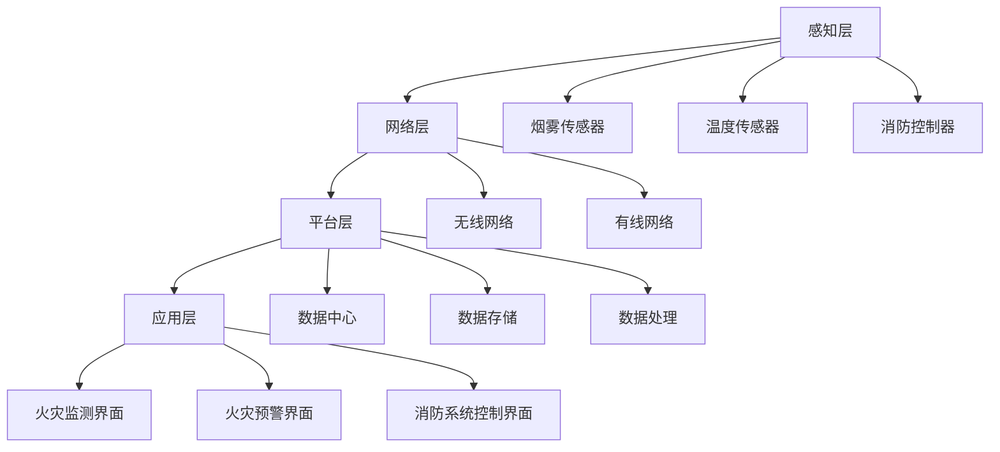

**系统接口设计**：
- **火灾监测接口**：实现烟雾浓度和温度数据的实时传输和监测。
- **火灾预警接口**：实现火灾预警信息的实时传输和报警。
- **消防系统控制接口**：实现消防系统的自动控制和远程操作。

**系统交互序列图**：
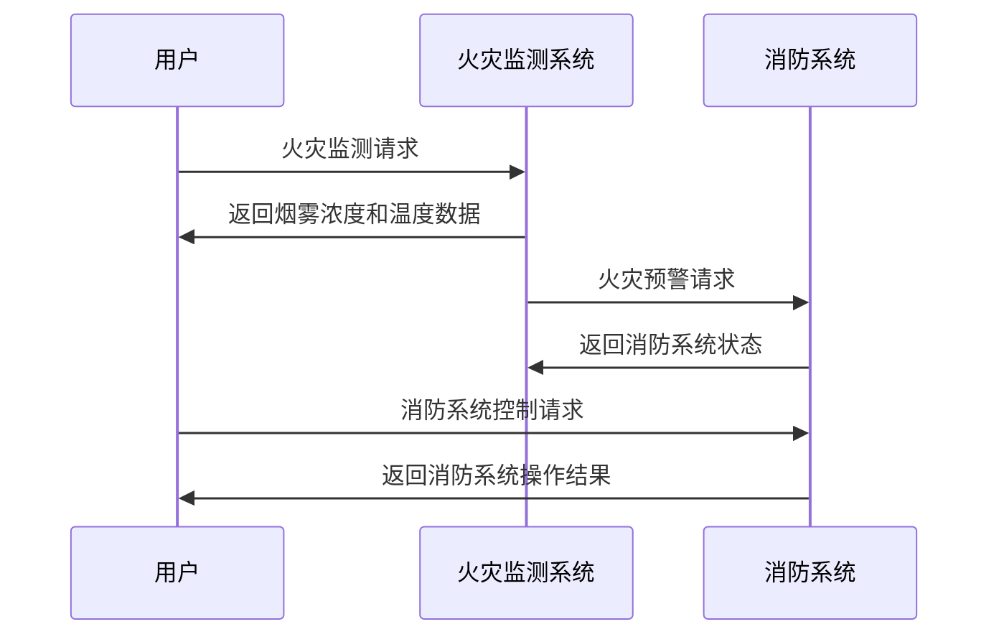

##### 2.5 案例分析：某智能建筑安防系统实战

**项目介绍**：
在一个大型智能办公楼项目中，为了提升办公环境的安全性和便利性，构建了一个全面的智能安防系统。该项目包括视频监控、入侵报警、门禁控制和消防报警等多个子系统，通过物联网技术实现了数据的实时传输和智能分析。

**系统功能设计**：
- 视频监控：通过部署摄像头和图像识别技术，实现办公区域的实时监控和异常行为检测。
- 入侵报警：通过部署入侵传感器和报警系统，实现入侵事件的实时报警和记录。
- 门禁控制：通过部署门禁控制器和身份认证设备，实现员工和访客的出入管理。
- 消防报警：通过部署烟雾传感器和消防系统，实现火灾的实时监测和消防系统的自动控制。

**系统架构设计**：
- **感知层**：部署摄像头、入侵传感器、门禁设备和消防传感器等设备。
- **网络层**：通过无线网络和有线网络实现数据的实时传输。
- **平台层**：建立数据中心，实现数据存储、处理和分析。
- **应用层**：通过用户界面实现监控、报警、门禁控制和消防系统控制等功能。

**系统架构图**：


**系统接口设计**：
- **视频监控接口**：实现视频数据的实时传输和回放功能。
- **入侵报警接口**：实现入侵事件的实时报警和记录功能。
- **门禁控制接口**：实现人员出入管理和身份认证功能。
- **消防报警接口**：实现火灾预警和消防系统的自动控制。

**系统交互序列图**：


**系统核心实现源代码**：
以下是一个简单的智能安防系统的核心实现源代码示例，包括视频监控、入侵报警、门禁控制和消防报警等功能。

```python
# 智能安防系统核心实现源代码

import cv2
import numpy as np
from sklearn.ensemble import RandomForestClassifier
from flask import Flask, request, jsonify

# 视频监控
def video_monitoring(video_feed):
    # 读取视频流
    cap = cv2.VideoCapture(video_feed)
    while True:
        ret, frame = cap.read()
        if not ret:
            break
        # 处理视频帧
        processed_frame = preprocess_frame(frame)
        # 人脸识别
        faces_detected = detect_faces(processed_frame)
        # 异常行为检测
        anomalies_detected = detect_anomalies(processed_frame)
        # 显示视频帧
        cv2.imshow('Video Monitoring', frame)
        if cv2.waitKey(1) & 0xFF == ord('q'):
            break
    cap.release()
    cv2.destroyAllWindows()

# 视频预处理
def preprocess_frame(frame):
    # 转换为灰度图像
    gray_frame = cv2.cvtColor(frame, cv2.COLOR_BGR2GRAY)
    # 二值化处理
    _, binary_frame = cv2.threshold(gray_frame, 128, 255, cv2.THRESH_BINARY_INV + cv2.THRESH_OTSU)
    return binary_frame

# 人脸识别
def detect_faces(frame):
    # 加载人脸识别模型
    model = load_face_recognition_model()
    # 提取人脸特征
    face_features = extract_face_features(frame)
    # 人脸匹配
    faces_detected = model.predict(face_features)
    return faces_detected

# 异常行为检测
def detect_anomalies(frame):
    # 加载异常检测模型
    model = load_anomaly_detection_model()
    # 提取异常特征
    anomaly_features = extract_anomaly_features(frame)
    # 异常检测
    anomalies_detected = model.predict(anomaly_features)
    return anomalies_detected

# 入侵报警
def intrusion_alarm intrusion_detected:
    # 发送报警信息
    send_alarm_notification("Intrusion detected!")

# 门禁控制
def access_control(access_request):
    # 验证访问权限
    access_granted = verify_access_rights(access_request)
    if access_granted:
        # 打开门禁
        open_access_door()
    else:
        # 拒绝访问
        deny_access()

# 消防报警
def fire_alarm fire_detected:
    # 发送报警信息
    send_alarm_notification("Fire detected!")

# 系统核心接口
app = Flask(__name__)

@app.route('/video_feed', methods=['GET'])
def get_video_feed():
    video_feed_url = request.args.get('video_feed_url')
    video_monitoring(video_feed_url)
    return jsonify({"status": "success"})

@app.route('/intrusion_alarm', methods=['POST'])
def post_intrusion_alarm():
    intrusion_detected = request.json.get('intrusion_detected')
    intrusion_alarm(intrusion_detected)
    return jsonify({"status": "success"})

@app.route('/access_control', methods=['POST'])
def post_access_control():
    access_request = request.json.get('access_request')
    access_control(access_request)
    return jsonify({"status": "success"})

@app.route('/fire_alarm', methods=['POST'])
def post_fire_alarm():
    fire_detected = request.json.get('fire_detected')
    fire_alarm(fire_detected)
    return jsonify({"status": "success"})

if __name__ == '__main__':
    app.run()
```

**代码应用解读与分析**：
上述代码实现了一个简单的智能安防系统，包括视频监控、入侵报警、门禁控制和消防报警等功能。视频监控部分通过OpenCV库实现视频流的读取和处理，人脸识别和异常行为检测部分通过机器学习模型实现。入侵报警、门禁控制和消防报警部分通过 Flask Web 框架实现接口，用于接收和处理报警和访问请求。

**实际案例分析和详细讲解剖析**：
在一个实际的智能办公楼项目中，上述代码被集成到一个综合性的智能安防系统中。视频监控部分通过部署摄像头和图像识别技术，实现了办公区域的实时监控和异常行为检测。入侵报警部分通过入侵传感器和报警系统，实现了入侵事件的实时报警和记录。门禁控制部分通过门禁控制器和身份认证设备，实现了员工和访客的出入管理。消防报警部分通过烟雾传感器和消防系统，实现了火灾的实时监测和消防系统的自动控制。

通过实际应用，该智能安防系统有效提升了办公环境的安全性和便利性，减少了人为干预和误报率，提高了应急响应速度，为员工提供了一个安全、舒适的工作环境。

##### 2.6 本章小结

本章详细介绍了物联网在智能建筑安防管理中的应用，包括智能安防系统的构建、智能监控技术、智能门禁系统和智能消防系统等。通过实际案例分析和详细讲解，展示了物联网技术在智能建筑安防管理中的重要性和应用前景。未来，随着物联网技术的不断发展，智能建筑安防管理将变得更加智能化、高效化和人性化。

### 第三部分：物联网在智能建筑能源管理中的应用

#### 第3章：智能能源管理系统

##### 3.1 能源管理系统的基本架构

**背景介绍**：
智能能源管理系统是智能建筑中至关重要的一部分，旨在通过物联网技术实现能源的高效利用和优化管理。智能能源管理系统包括多个子系统，如智能电表、智能照明系统、智能空调系统等，通过数据的实时采集、传输和处理，实现对能源的精细化管理。

**核心概念与联系**：
智能能源管理系统的基本架构可以分为感知层、网络层、平台层和应用层。感知层负责数据的采集，网络层负责数据的传输，平台层负责数据的管理和分析，应用层负责实现能源管理和优化的具体功能。

| 层次   | 说明                                                         |
| ------ | ------------------------------------------------------------ |
| 感知层 | 通过传感器和智能设备实现能源数据的实时采集。                 |
| 网络层 | 通过无线或有线网络实现数据的传输和通信。                     |
| 平台层 | 通过数据中心实现数据的存储、处理和分析。                     |
| 应用层 | 通过用户界面实现能源管理、监控和优化的功能。                 |

**图表展示**：
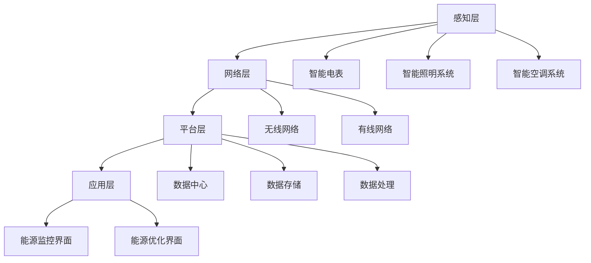

**算法原理讲解**：
智能能源管理系统中的核心算法包括能耗监测算法、能耗预测算法和能耗优化算法。能耗监测算法用于实时监测能源消耗情况，能耗预测算法用于预测未来的能源消耗，能耗优化算法用于根据预测结果优化能源使用。

```python
# 能耗监测算法示例
import numpy as np
from sklearn.linear_model import LinearRegression

# 特征提取
def extract_energy_features(energy_data):
    # 提取能源消耗的特征向量
    return np.array([...])

# 训练模型
X = np.array([...])
y = np.array([...])
model = LinearRegression()
model.fit(X, y)

# 预测新样本
new_energy_data = extract_energy_features(...)
prediction = model.predict(new_energy_data)
```

**系统分析与架构设计方案**：

**问题场景介绍**：
在一个大型办公楼中，需要构建一个智能能源管理系统，实现对办公楼内部能源的实时监控、能耗预测和优化管理。

**系统功能设计**：
- 能源监控：通过智能电表、智能照明系统和智能空调系统等设备，实现能源消耗的实时监控。
- 能耗预测：通过历史数据分析和机器学习算法，预测未来的能源消耗。
- 能源优化：根据能耗预测结果，优化能源使用，降低能源消耗。

**系统架构设计**：
- **感知层**：部署智能电表、智能照明系统和智能空调系统等设备，实现能源数据的实时采集。
- **网络层**：通过无线或有线网络，实现数据的实时传输。
- **平台层**：建立数据中心，实现数据存储、处理和分析。
- **应用层**：通过用户界面，实现能源监控、能耗预测和能源优化的功能。

**系统架构图**：
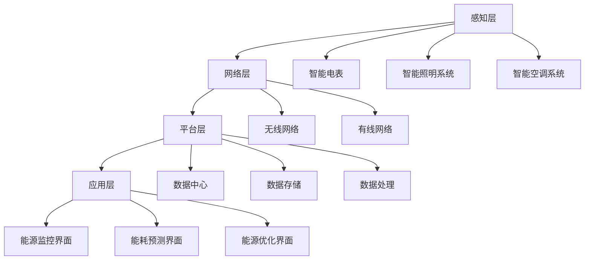

**系统接口设计**：
- **能源监控接口**：实现能源消耗数据的实时传输和监控。
- **能耗预测接口**：实现能耗预测数据的实时传输和展示。
- **能源优化接口**：实现能源优化策略的实时传输和执行。

**系统交互序列图**：
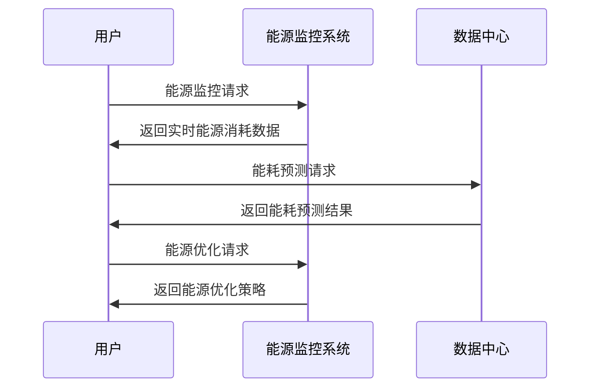

##### 3.2 智能电表与能耗监测

**背景介绍**：
智能电表是智能能源管理系统中的关键设备，用于实时监测电力消耗情况。智能电表通过物联网技术实现数据的远程传输，为能耗监测和能源优化提供了数据支持。

**核心概念与联系**：
智能电表的核心功能包括实时数据采集、数据传输和数据分析。通过智能电表，可以实现对电力消耗的实时监控，发现异常消耗情况，并进行分析和优化。

| 功能       | 说明                                                         |
| ---------- | ------------------------------------------------------------ |
| 数据采集   | 通过传感器实时采集电力消耗数据。                           |
| 数据传输   | 通过无线或有线网络将数据传输到数据中心。                   |
| 数据分析   | 对采集到的数据进行分析，实现能耗监测和能源优化。           |

**图表展示**：
```mermaid
graph TD
    A[智能电表] --> B[数据采集]
    A --> C[数据传输]
    A --> D[数据分析]
    B --> E[实时数据采集]
    C --> F[无线网络]
    C --> G[有线网络]
    D --> H[能耗监测]
    D --> I[能源优化]
```

**算法原理讲解**：
智能电表中的能耗监测算法通常基于时间序列分析，如移动平均法、指数平滑法等。这些算法可以用于预测未来的电力消耗，为能源优化提供依据。

```python
# 移动平均法示例
def moving_average(data, window_size):
    return np.convolve(data, np.ones(window_size)/window_size, mode='valid')

# 训练模型
energy_data = np.array([...])
moving_average_data = moving_average(energy_data, window_size=5)
```

**系统分析与架构设计方案**：

**问题场景介绍**：
在一个大型商场中，需要构建一个智能电表与能耗监测系统，实现对商场内部电力消耗的实时监控和能耗优化。

**系统功能设计**：
- 能源监控：通过智能电表实时监测电力消耗情况。
- 能耗分析：对电力消耗数据进行分析，发现异常消耗情况。
- 能源优化：根据能耗分析结果，优化电力使用，降低能源消耗。

**系统架构设计**：
- **感知层**：部署智能电表，实现电力消耗数据的实时采集。
- **网络层**：通过无线或有线网络，实现数据的实时传输。
- **平台层**：建立数据中心，实现数据存储、处理和分析。
- **应用层**：通过用户界面，实现能源监控、能耗分析和能源优化的功能。

**系统架构图**：
```mermaid
graph TD
    A[感知层] --> B[网络层]
    B --> C[平台层]
    C --> D[应用层]
    A --> E[智能电表]
    B --> F[无线网络]
    B --> G[有线网络]
    C --> H[数据中心]
    C --> I[数据存储]
    C --> J[数据处理]
    D --> K[能源监控界面]
    D --> L[能耗分析界面]
    D --> M[能源优化界面]
```

**系统接口设计**：
- **能源监控接口**：实现电力消耗数据的实时传输和监控。
- **能耗分析接口**：实现能耗分析数据的实时传输和展示。
- **能源优化接口**：实现能源优化策略的实时传输和执行。

**系统交互序列图**：
```mermaid
sequenceDiagram
    participant 用户 as 用户
    participant 能源监控系统 as 能源监控系统
    participant 数据中心 as 数据中心

    用户->>能源监控系统: 能源监控请求
    能源监控系统->>用户: 返回实时电力消耗数据

    用户->>数据中心: 能耗分析请求
    数据中心->>用户: 返回能耗分析结果

    用户->>能源监控系统: 能源优化请求
    能源监控系统->>用户: 返回能源优化策略
```

##### 3.3 智能照明系统

**背景介绍**：
智能照明系统是智能能源管理系统的重要组成部分，通过物联网技术实现照明的智能化控制，提高能源利用效率。智能照明系统可以根据环境光照、人员活动和能源需求等因素，自动调节灯光亮度，实现节能目标。

**核心概念与联系**：
智能照明系统的核心组成部分包括智能灯泡、照明控制器和传感器。智能灯泡可以实现亮度调节和开关控制，照明控制器负责接收传感器的数据并执行控制命令，传感器用于检测环境光照和人员活动。

| 组成部分     | 说明                                                         |
| ------------ | ------------------------------------------------------------ |
| 智能灯泡     | 实现亮度调节和开关控制。                                     |
| 照明控制器   | 接收传感器数据，执行照明控制命令。                           |
| 传感器       | 检测环境光照和人员活动。                                     |

**图表展示**：
```mermaid
graph TD
    A[智能照明系统] --> B[智能灯泡]
    A --> C[照明控制器]
    A --> D[传感器]
    B --> E[亮度调节]
    B --> F[开关控制]
    C --> G[数据接收]
    C --> H[控制执行]
    D --> I[光照检测]
    D --> J[活动检测]
```

**算法原理讲解**：
智能照明系统中的亮度调节算法通常基于环境光照检测和人员活动检测。通过设定阈值，可以实现自动调节灯光亮度的目标。

```python
# 亮度调节算法示例
def adjust_lighting(light_sensor_data, activity_sensor_data):
    # 根据环境光照和人员活动数据调整灯光亮度
    lighting_level = min(max(light_sensor_data - threshold, 0), 100)
    return lighting_level

# 训练模型
light_sensor_data = np.array([...])
activity_sensor_data = np.array([...])
model = adjust_lighting(light_sensor_data, activity_sensor_data)
```

**系统分析与架构设计方案**：

**问题场景介绍**：
在一个智能办公楼中，需要构建一个智能照明系统，实现对办公区域照明的智能化控制，提高能源利用效率。

**系统功能设计**：
- 自动调节：根据环境光照和人员活动自动调节灯光亮度。
- 节能控制：通过节能模式减少不必要的能源消耗。
- 定时控制：根据预设的时间表自动开关灯光。

**系统架构设计**：
- **感知层**：部署智能灯泡、光照传感器和活动传感器，实现环境光照和人员活动的检测。
- **网络层**：通过无线或有线网络实现数据的实时传输。
- **平台层**：建立数据中心，实现数据存储、处理和分析。
- **应用层**：通过用户界面，实现照明控制、节能控制和定时控制等功能。

**系统架构图**：
```mermaid
graph TD
    A[感知层] --> B[网络层]
    B --> C[平台层]
    C --> D[应用层]
    A --> E[智能灯泡]
    A --> F[光照传感器]
    A --> G[活动传感器]
    B --> H[无线网络]
    B --> I[有线网络]
    C --> J[数据中心]
    C --> K[数据存储]
    C --> L[数据处理]
    D --> M[照明控制界面]
    D --> N[节能控制界面]
    D --> O[定时控制界面]
```

**系统接口设计**：
- **照明控制接口**：实现灯光亮度的实时调节。
- **节能控制接口**：实现节能模式的实时切换。
- **定时控制接口**：实现灯光定时开关的设置和执行。

**系统交互序列图**：
```mermaid
sequenceDiagram
    participant 用户 as 用户
    participant 照明系统 as 照明系统
    participant 数据中心 as 数据中心

    用户->>照明系统: 照明控制请求
    照明系统->>用户: 返回灯光亮度设置

    用户->>数据中心: 节能控制请求
    数据中心->>用户: 返回节能控制状态

    用户->>照明系统: 定时控制请求
    照明系统->>用户: 返回定时控制设置
```

##### 3.4 智能空调与供暖系统

**背景介绍**：
智能空调与供暖系统是智能能源管理系统中的关键组成部分，通过物联网技术实现空调和供暖设备的智能化控制，提高能源利用效率。智能空调与供暖系统可以根据环境温度、湿度、人员活动和能源需求等因素，自动调节温度和湿度，实现节能和舒适目标。

**核心概念与联系**：
智能空调与供暖系统的核心组成部分包括智能空调、智能供暖设备、传感器和控制器。智能空调和智能供暖设备可以实现温度和湿度的自动调节，传感器用于检测环境参数，控制器负责接收传感器数据并执行控制命令。

| 组成部分     | 说明                                                         |
| ------------ | ------------------------------------------------------------ |
| 智能空调     | 实现温度和湿度的自动调节。                                   |
| 智能供暖设备 | 实现温度和湿度的自动调节。                                   |
| 传感器       | 检测环境温度、湿度和其他相关参数。                           |
| 控制器       | 接收传感器数据，执行控制命令。                               |

**图表展示**：
```mermaid
graph TD
    A[智能空调与供暖系统] --> B[智能空调]
    A --> C[智能供暖设备]
    A --> D[传感器]
    B --> E[温度调节]
    B --> F[湿度调节]
    C --> G[温度调节]
    C --> H[湿度调节]
    D --> I[温度检测]
    D --> J[湿度检测]
```

**算法原理讲解**：
智能空调与供暖系统中的温度和湿度调节算法通常基于环境参数的检测和预设阈值。通过设定温度和湿度阈值，可以实现自动调节，达到节能和舒适的目标。

```python
# 温度调节算法示例
def adjust_temperature(temperature_sensor_data, temperature_threshold):
    # 根据环境温度传感器数据和阈值调整温度
    if temperature_sensor_data > temperature_threshold:
        # 增加温度
        new_temperature = temperature_threshold + 1
    else:
        # 降低温度
        new_temperature = temperature_threshold - 1
    return new_temperature

# 湿度调节算法示例
def adjust_humidity(humidity_sensor_data, humidity_threshold):
    # 根据环境湿度传感器数据和阈值调整湿度
    if humidity_sensor_data > humidity_threshold:
        # 增加湿度
        new_humidity = humidity_threshold + 1
    else:
        # 降低湿度
        new_humidity = humidity_threshold - 1
    return new_humidity
```

**系统分析与架构设计方案**：

**问题场景介绍**：
在一个智能办公楼中，需要构建一个智能空调与供暖系统，实现对办公区域温度和湿度的智能化控制，提高能源利用效率。

**系统功能设计**：
- 温度调节：根据环境温度自动调节空调和供暖设备的温度。
- 湿度调节：根据环境湿度自动调节空调和供暖设备的湿度。
- 能源优化：根据环境参数和能源需求，实现空调和供暖设备的优化控制。

**系统架构设计**：
- **感知层**：部署智能空调、智能供暖设备、温度传感器和湿度传感器，实现环境参数的实时检测。
- **网络层**：通过无线或有线网络实现数据的实时传输。
- **平台层**：建立数据中心，实现数据存储、处理和分析。
- **应用层**：通过用户界面，实现温度调节、湿度调节和能源优化的功能。

**系统架构图**：
```mermaid
graph TD
    A[感知层] --> B[网络层]
    B --> C[平台层]
    C --> D[应用层]
    A --> E[智能空调]
    A --> F[智能供暖设备]
    A --> G[温度传感器]
    A --> H[湿度传感器]
    B --> I[无线网络]
    B --> J[有线网络]
    C --> K[数据中心]
    C --> L[数据存储]
    C --> M[数据处理]
    D --> N[温度调节界面]
    D --> O[湿度调节界面]
    D --> P[能源优化界面]
```

**系统接口设计**：
- **温度调节接口**：实现温度数据的实时传输和调节。
- **湿度调节接口**：实现湿度数据的实时传输和调节。
- **能源优化接口**：实现能源优化策略的实时传输和执行。

**系统交互序列图**：
```mermaid
sequenceDiagram
    participant 用户 as 用户
    participant 空调系统 as 空调系统
    participant 数据中心 as 数据中心

    用户->>空调系统: 温度调节请求
    空调系统->>用户: 返回当前温度设置

    用户->>数据中心: 湿度调节请求
    数据中心->>用户: 返回当前湿度设置

    用户->>空调系统: 能源优化请求
    空调系统->>用户: 返回能源优化策略
```

##### 3.5 案例分析：某智能建筑能源管理系统实战

**项目介绍**：
在一个大型酒店项目中，为了提高能源利用效率和提升用户体验，构建了一个全面的智能能源管理系统。该系统包括智能电表、智能照明系统、智能空调系统和智能供暖系统等，通过物联网技术实现了能源的实时监控、能耗预测和优化管理。

**系统功能设计**：
- 能源监控：通过智能电表、智能照明系统、智能空调系统和智能供暖系统，实现能源消耗的实时监控。
- 能耗预测：通过历史数据分析和机器学习算法，预测未来的能源消耗。
- 能源优化：根据能耗预测结果，优化能源使用，降低能源消耗。

**系统架构设计**：
- **感知层**：部署智能电表、智能照明系统、智能空调系统和智能供暖系统等设备，实现能源数据的实时采集。
- **网络层**：通过无线或有线网络，实现数据的实时传输。
- **平台层**：建立数据中心，实现数据存储、处理和分析。
- **应用层**：通过用户界面，实现能源监控、能耗预测和能源优化的功能。

**系统架构图**：
```mermaid
graph TD
    A[感知层] --> B[网络层]
    B --> C[平台层]
    C --> D[应用层]
    A --> E[智能电表]
    A --> F[智能照明系统]
    A --> G[智能空调系统]
    A --> H[智能供暖系统]
    B --> I[无线网络]
    B --> J[有线网络]
    C --> K[数据中心]
    C --> L[数据存储]
    C --> M[数据处理]
    D --> N[能源监控界面]
    D --> O[能耗预测界面]
    D --> P[能源优化界面]
```

**系统接口设计**：
- **能源监控接口**：实现能源消耗数据的实时传输和监控。
- **能耗预测接口**：实现能耗预测数据的实时传输和展示。
- **能源优化接口**：实现能源优化策略的实时传输和执行。

**系统交互序列图**：
```mermaid
sequenceDiagram
    participant 用户 as 用户
    participant 能源监控系统 as 能源监控系统
    participant 数据中心 as 数据中心

    用户->>能源监控系统: 能源监控请求
    能源监控系统->>用户: 返回实时能源消耗数据

    用户->>数据中心: 能耗预测请求
    数据中心->>用户: 返回能耗预测结果

    用户->>能源监控系统: 能源优化请求
    能源监控系统->>用户: 返回能源优化策略
```

**系统核心实现源代码**：
以下是一个简单的智能能源管理系统的核心实现源代码示例，包括能源监控、能耗预测和能源优化等功能。

```python
# 智能能源管理系统核心实现源代码

import numpy as np
from sklearn.linear_model import LinearRegression
from sklearn.ensemble import RandomForestRegressor

# 能源监控
def energy_monitoring(energy_data):
    # 实时监控能源消耗
    print("当前能源消耗：", energy_data)

# 能耗预测
def energy_prediction(history_data):
    # 预测未来能源消耗
    X = np.array([...])
    y = np.array([...])
    model = LinearRegression()
    model.fit(X, y)
    new_data = extract_energy_features(...)
    prediction = model.predict(new_data)
    return prediction

# 能源优化
def energy_optimization(prediction_data):
    # 根据能耗预测结果优化能源使用
    if prediction_data < threshold:
        # 节能模式
        print("切换至节能模式")
    else:
        # 正常模式
        print("保持正常模式")

# 系统核心接口
app = Flask(__name__)

@app.route('/energy_monitoring', methods=['POST'])
def post_energy_monitoring():
    energy_data = request.json.get('energy_data')
    energy_monitoring(energy_data)
    return jsonify({"status": "success"})

@app.route('/energy_prediction', methods=['POST'])
def post_energy_prediction():
    history_data = request.json.get('history_data')
    prediction_data = energy_prediction(history_data)
    return jsonify({"prediction": prediction_data})

@app.route('/energy_optimization', methods=['POST'])
def post_energy_optimization():
    prediction_data = request.json.get('prediction_data')
    energy_optimization(prediction_data)
    return jsonify({"status": "success"})

if __name__ == '__main__':
    app.run()
```

**代码应用解读与分析**：
上述代码实现了一个简单的智能能源管理系统，包括能源监控、能耗预测和能源优化等功能。能源监控部分通过接收实时能源消耗数据，实现能源消耗的实时监控。能耗预测部分通过线性回归算法，预测未来的能源消耗。能源优化部分根据能耗预测结果，实现能源使用的优化控制。

**实际案例分析和详细讲解剖析**：
在一个实际的智能酒店项目中，上述代码被集成到智能能源管理系统中。能源监控部分通过智能电表和智能传感器，实现能源消耗的实时监控。能耗预测部分通过对历史数据的分析，预测未来的能源消耗，为能源优化提供依据。能源优化部分根据能耗预测结果，实现能源使用的优化控制，降低能源消耗，提高能源利用效率。

通过实际应用，该智能能源管理系统有效提升了酒店的能源利用效率，降低了运营成本，为酒店创造了更大的经济效益。

##### 3.6 本章小结

本章详细介绍了物联网在智能建筑能源管理中的应用，包括智能能源管理系统的基本架构、智能电表与能耗监测、智能照明系统、智能空调与供暖系统等。通过实际案例分析和详细讲解，展示了物联网技术在智能建筑能源管理中的重要性和应用前景。未来，随着物联网技术的不断发展，智能建筑能源管理将变得更加智能化、高效化和可持续化。

### 第四部分：物联网在智能建筑环境管理中的应用

#### 第4章：智能环境监控系统

##### 4.1 空气质量监测

**背景介绍**：
空气质量监测是智能建筑环境管理中的重要环节，通过监测室内外的空气质量，确保室内环境的健康和安全。随着人们对生活质量的追求，空气质量监测已经成为智能建筑中不可或缺的一部分。

**核心概念与联系**：
空气质量监测的核心概念包括空气质量参数的监测、数据采集与传输、数据分析与处理等。通过物联网技术，可以实现空气质量参数的实时监测和数据的远程传输，为环境管理提供依据。

| 参数       | 说明                                                         |
| ---------- | ------------------------------------------------------------ |
| PM2.5     | 细颗粒物，直径小于2.5微米的颗粒物，对人体健康影响较大。     |
| PM10     | 可吸入颗粒物，直径小于10微米的颗粒物，对人体健康有影响。     |
| CO2      | 二氧化碳，室内空气质量的重要指标，影响室内通风需求。         |
| 温度       | 室内温度，影响人体的舒适度和能源消耗。                       |
| 湿度       | 室内湿度，影响室内空气质量和舒适度。                         |

**图表展示**：
```mermaid
graph TD
    A[空气质量监测] --> B[PM2.5监测]
    A --> C[PM10监测]
    A --> D[CO2监测]
    A --> E[温度监测]
    A --> F[湿度监测]
    B --> G[细颗粒物监测]
    C --> H[可吸入颗粒物监测]
    D --> I[室内通风需求监测]
    E --> J[室内温度监测]
    F --> K[室内湿度监测]
```

**算法原理讲解**：
空气质量监测中的核心算法包括空气质量参数的实时监测算法、数据传输算法和数据分析算法。实时监测算法通过传感器采集空气质量参数，数据传输算法通过无线或有线网络将数据传输到数据中心，数据分析算法通过对采集到的数据进行处理和分析，实现空气质量状况的实时监控和预警。

```python
# 实时监测算法示例
def real_time_monitoring(air_quality_data):
    # 实时监测空气质量参数
    pm2_5 = air_quality_data['pm2_5']
    pm10 = air_quality_data['pm10']
    co2 = air_quality_data['co2']
    temperature = air_quality_data['temperature']
    humidity = air_quality_data['humidity']
    print("当前空气质量：PM2.5={}".format(pm2_5), "PM10={}".format(pm10), "CO2={}".format(co2), "温度={}".format(temperature), "湿度={}".format(humidity))

# 数据传输算法示例
def data_transmission(air_quality_data):
    # 将空气质量数据传输到数据中心
    transmit_data(air_quality_data)

# 数据分析算法示例
def data_analysis(air_quality_data):
    # 分析空气质量数据，实现预警和优化
    if pm2_5 > threshold:
        # 发出预警
        send_alarm("PM2.5超标，请加强通风")
    if co2 > threshold:
        # 发出预警
        send_alarm("CO2浓度过高，请增加通风")
```

**系统分析与架构设计方案**：

**问题场景介绍**：
在一个大型办公建筑中，为了确保室内空气质量，需要构建一个智能空气质量监测系统，实现对室内PM2.5、PM10、CO2、温度和湿度等参数的实时监测和预警。

**系统功能设计**：
- 实时监测：通过传感器实时监测室内空气质量参数。
- 数据传输：将监测数据传输到数据中心。
- 数据分析：对监测数据进行分析，实现空气质量预警和优化。
- 预警与优化：根据空气质量参数，实现空气质量预警和通风优化。

**系统架构设计**：
- **感知层**：部署空气质量传感器，实现空气质量参数的实时监测。
- **网络层**：通过无线或有线网络实现数据的实时传输。
- **平台层**：建立数据中心，实现数据存储、处理和分析。
- **应用层**：通过用户界面，实现空气质量监测、数据分析、预警和优化的功能。

**系统架构图**：
```mermaid
graph TD
    A[感知层] --> B[网络层]
    B --> C[平台层]
    C --> D[应用层]
    A --> E[空气质量传感器]
    B --> F[无线网络]
    B --> G[有线网络]
    C --> H[数据中心]
    C --> I[数据存储]
    C --> J[数据处理]
    D --> K[空气质量监测界面]
    D --> L[数据分析界面]
    D --> M[预警与优化界面]
```

**系统接口设计**：
- **实时监测接口**：实现空气质量参数的实时传输和监测。
- **数据传输接口**：实现空气质量数据的实时传输。
- **数据分析接口**：实现空气质量数据分析的实时传输。
- **预警与优化接口**：实现空气质量预警和通风优化策略的实时传输。

**系统交互序列图**：
```mermaid
sequenceDiagram
    participant 用户 as 用户
    participant 空气质量监测系统 as 空气质量监测系统
    participant 数据中心 as 数据中心

    用户->>空气质量监测系统: 实时监测请求
    空气质量监测系统->>用户: 返回当前空气质量数据

    用户->>数据中心: 数据分析请求
    数据中心->>用户: 返回空气质量分析结果

    用户->>空气质量监测系统: 预警与优化请求
    空气质量监测系统->>用户: 返回预警和优化策略
```

##### 4.2 水质监测

**背景介绍**：
水质监测是智能建筑环境管理中的重要环节，通过监测室内外水质，确保饮用水的安全和卫生。随着人们生活水平的提高，水质监测已经成为智能建筑中不可或缺的一部分。

**核心概念与联系**：
水质监测的核心概念包括水质参数的监测、数据采集与传输、数据分析与处理等。通过物联网技术，可以实现水质参数的实时监测和数据的远程传输，为环境管理提供依据。

| 参数       | 说明                                                         |
| ---------- | ------------------------------------------------------------ |
| PH值       | 水的酸碱度，影响水的质量和口感。                           |
| 总硬度     | 水中的总矿物质含量，影响水的硬度。                         |
| 氰化物     | 水中有毒物质，影响人体健康。                               |
| 氨氮       | 水中的氨氮含量，影响水质。                                 |
| 有机物含量 | 水中的有机物含量，影响水质。                               |

**图表展示**：
```mermaid
graph TD
    A[水质监测] --> B[PH值监测]
    A --> C[总硬度监测]
    A --> D[氰化物监测]
    A --> E[氨氮监测]
    A --> F[有机物含量监测]
    B --> G[酸碱度监测]
    C --> H[硬度监测]
    D --> I[有毒物质监测]
    E --> J[氨氮含量监测]
    F --> K[有机物含量监测]
```

**算法原理讲解**：
水质监测中的核心算法包括水质参数的实时监测算法、数据传输算法和数据分析算法。实时监测算法通过传感器采集水质参数，数据传输算法通过无线或有线网络将数据传输到数据中心，数据分析算法通过对采集到的数据进行处理和分析，实现水质状况的实时监控和预警。

```python
# 实时监测算法示例
def real_time_monitoring(water_quality_data):
    # 实时监测水质参数
    ph_value = water_quality_data['ph_value']
    total_hardness = water_quality_data['total_hardness']
    cyanide = water_quality_data['cyanide']
    ammonia_nitrogen = water_quality_data['ammonia_nitrogen']
    organic_content = water_quality_data['organic_content']
    print("当前水质状况：PH值={}".format(ph_value), "总硬度={}".format(total_hardness), "氰化物={}".format(cyanide), "氨氮={}".format(ammonia_nitrogen), "有机物含量={}".format(organic_content))

# 数据传输算法示例
def data_transmission(water_quality_data):
    # 将水质数据传输到数据中心
    transmit_data(water_quality_data)

# 数据分析算法示例
def data_analysis(water_quality_data):
    # 分析水质数据，实现预警和优化
    if ph_value < threshold:
        # 发出预警
        send_alarm("PH值过低，请加强处理")
    if cyanide > threshold:
        # 发出预警
        send_alarm("氰化物超标，请立即处理")
```

**系统分析与架构设计方案**：

**问题场景介绍**：
在一个大型社区建筑中，为了确保居民饮用水的安全，需要构建一个智能水质监测系统，实现对饮用水中PH值、总硬度、氰化物、氨氮和有机物含量的实时监测和预警。

**系统功能设计**：
- 实时监测：通过传感器实时监测饮用水的水质参数。
- 数据传输：将监测数据传输到数据中心。
- 数据分析：对监测数据进行分析，实现水质预警和优化。
- 预警与优化：根据水质参数，实现水质预警和优化处理。

**系统架构设计**：
- **感知层**：部署水质传感器，实现水质参数的实时监测。
- **网络层**：通过无线或有线网络实现数据的实时传输。
- **平台层**：建立数据中心，实现数据存储、处理和分析。
- **应用层**：通过用户界面，实现水质监测、数据分析、预警和优化的功能。

**系统架构图**：
```mermaid
graph TD
    A[感知层] --> B[网络层]
    B --> C[平台层]
    C --> D[应用层]
    A --> E[水质传感器]
    B --> F[无线网络]
    B --> G[有线网络]
    C --> H[数据中心]
    C --> I[数据存储]
    C --> J[数据处理]
    D --> K[水质监测界面]
    D --> L[数据分析界面]
    D --> M[预警与优化界面]
```

**系统接口设计**：
- **实时监测接口**：实现水质参数的实时传输和监测。
- **数据传输接口**：实现水质数据的实时传输。
- **数据分析接口**：实现水质数据分析的实时传输。
- **预警与优化接口**：实现水质预警和优化策略的实时传输。

**系统交互序列图**：
```mermaid
sequenceDiagram
    participant 用户 as 用户
    participant 水质监测系统 as 水质监测系统
    participant 数据中心 as 数据中心

    用户->>水质监测系统: 实时监测请求
    水质监测系统->>用户: 返回当前水质数据

    用户->>数据中心: 数据分析请求
    数据中心->>用户: 返回水质分析结果

    用户->>水质监测系统: 预警与优化请求
    水质监测系统->>用户: 返回预警和优化策略
```

##### 4.3 温湿度控制

**背景介绍**：
温湿度控制是智能建筑环境管理中的重要环节，通过调节室内温度和湿度，确保室内环境的舒适度和空气质量。随着人们对生活质量的追求，温湿度控制已经成为智能建筑中不可或缺的一部分。

**核心概念与联系**：
温湿度控制的核心概念包括温度和湿度的监测、数据采集与传输、温湿度调节和优化等。通过物联网技术，可以实现温度和湿度的实时监测和调节，为环境管理提供依据。

| 参数       | 说明                                                         |
| ---------- | ------------------------------------------------------------ |
| 温度       | 室内温度，影响人体的舒适度和能源消耗。                       |
| 湿度       | 室内湿度，影响室内空气质量和人体舒适度。                     |

**图表展示**：
```mermaid
graph TD
    A[温湿度控制] --> B[温度控制]
    A --> C[湿度控制]
    B --> D[室内温度调节]
    C --> E[室内湿度调节]
```

**算法原理讲解**：
温湿度控制中的核心算法包括温度和湿度监测算法、调节算法和优化算法。温度和湿度监测算法通过传感器实时监测室内温度和湿度，调节算法根据监测结果调整温湿度，优化算法根据环境参数实现温湿度的优化控制。

```python
# 温度监测算法示例
def temperature_monitoring(temperature_sensor_data):
    # 实时监测室内温度
    current_temperature = temperature_sensor_data
    print("当前室内温度：", current_temperature)

# 湿度监测算法示例
def humidity_monitoring(humidity_sensor_data):
    # 实时监测室内湿度
    current_humidity = humidity_sensor_data
    print("当前室内湿度：", current_humidity)

# 温度调节算法示例
def temperature_control(temperature_sensor_data, temperature_threshold):
    # 根据室内温度调整温度
    current_temperature = temperature_sensor_data
    if current_temperature < temperature_threshold:
        # 增加温度
        new_temperature = temperature_threshold + 1
    else:
        # 降低温度
        new_temperature = temperature_threshold - 1
    return new_temperature

# 湿度调节算法示例
def humidity_control(humidity_sensor_data, humidity_threshold):
    # 根据室内湿度调整湿度
    current_humidity = humidity_sensor_data
    if current_humidity < humidity_threshold:
        # 增加湿度
        new_humidity = humidity_threshold + 1
    else:
        # 降低湿度
        new_humidity = humidity_threshold - 1
    return new_humidity
```

**系统分析与架构设计方案**：

**问题场景介绍**：
在一个大型图书馆中，为了确保读者有一个舒适的环境，需要构建一个智能温湿度控制系统，实现对室内温度和湿度的实时监测和调节。

**系统功能设计**：
- 实时监测：通过传感器实时监测室内温度和湿度。
- 数据传输：将监测数据传输到数据中心。
- 温湿度调节：根据监测结果调整室内温度和湿度。
- 优化控制：根据环境参数实现温度和湿度的优化控制。

**系统架构设计**：
- **感知层**：部署温度传感器和湿度传感器，实现温度和湿度的实时监测。
- **网络层**：通过无线或有线网络实现数据的实时传输。
- **平台层**：建立数据中心，实现数据存储、处理和分析。
- **应用层**：通过用户界面，实现温度和湿度监测、调节和优化的功能。

**系统架构图**：
```mermaid
graph TD
    A[感知层] --> B[网络层]
    B --> C[平台层]
    C --> D[应用层]
    A --> E[温度传感器]
    A --> F[湿度传感器]
    B --> G[无线网络]
    B --> H[有线网络]
    C --> I[数据中心]
    C --> J[数据存储]
    C --> K[数据处理]
    D --> L[温度监测界面]
    D --> M[湿度监测界面]
    D --> N[温度调节界面]
    D --> O[湿度调节界面]
```

**系统接口设计**：
- **实时监测接口**：实现温度和湿度参数的实时传输和监测。
- **数据传输接口**：实现温度和湿度数据的实时传输。
- **调节接口**：实现温度和湿度调节策略的实时传输和执行。
- **优化接口**：实现温度和湿度优化策略的实时传输和执行。

**系统交互序列图**：
```mermaid
sequenceDiagram
    participant 用户 as 用户
    participant 温湿度控制系统 as 温湿度控制系统
    participant 数据中心 as 数据中心

    用户->>温湿度控制系统: 实时监测请求
    温湿度控制系统->>用户: 返回当前温度和湿度数据

    用户->>数据中心: 数据分析请求
    数据中心->>用户: 返回温度和湿度分析结果

    用户->>温湿度控制系统: 温度调节请求
    温湿度控制系统->>用户: 返回温度调节结果

    用户->>温湿度控制系统: 湿度调节请求
    温湿度控制系统->>用户: 返回湿度调节结果
```

##### 4.4 窗帘与遮阳系统

**背景介绍**：
窗帘与遮阳系统是智能建筑环境管理中的重要组成部分，通过控制窗帘的开关和遮阳设施的调整，实现对室内光照和温度的调节，提高室内舒适度和能源利用效率。随着人们对生活质量的追求，窗帘与遮阳系统已经成为智能建筑中不可或缺的一部分。

**核心概念与联系**：
窗帘与遮阳系统的核心概念包括光照和温度监测、窗帘和遮阳设施的控制、数据采集与传输等。通过物联网技术，可以实现窗帘和遮阳设施的智能控制，为环境管理提供依据。

| 参数       | 说明                                                         |
| ---------- | ------------------------------------------------------------ |
| 光照       | 室内光照强度，影响室内舒适度和能源消耗。                     |
| 温度       | 室内温度，影响室内舒适度和能源消耗。                         |

**图表展示**：
```mermaid
graph TD
    A[窗帘与遮阳系统] --> B[光照监测]
    A --> C[温度监测]
    A --> D[窗帘控制]
    A --> E[遮阳设施控制]
    B --> F[光照强度监测]
    C --> G[室内温度监测]
    D --> H[窗帘开关控制]
    E --> I[遮阳设施调节]
```

**算法原理讲解**：
窗帘与遮阳系统中的核心算法包括光照和温度监测算法、窗帘和遮阳设施控制算法。光照和温度监测算法通过传感器实时监测室内光照和温度，窗帘和遮阳设施控制算法根据监测结果调整窗帘和遮阳设施的状态。

```python
# 光照监测算法示例
def light_monitoring(light_sensor_data):
    # 实时监测室内光照强度
    current_light = light_sensor_data
    print("当前室内光照强度：", current_light)

# 温度监测算法示例
def temperature_monitoring(temperature_sensor_data):
    # 实时监测室内温度
    current_temperature = temperature_sensor_data
    print("当前室内温度：", current_temperature)

# 窗帘控制算法示例
def curtain_control(curtain_status, light_threshold, temperature_threshold):
    # 根据光照强度和温度调整窗帘状态
    if current_light < light_threshold or current_temperature < temperature_threshold:
        # 关闭窗帘
        new_curtain_status = "close"
    else:
        # 打开窗帘
        new_curtain_status = "open"
    return new_curtain_status

# 遮阳设施控制算法示例
def shading_control(shading_status, light_threshold, temperature_threshold):
    # 根据光照强度和温度调整遮阳设施状态
    if current_light < light_threshold or current_temperature < temperature_threshold:
        # 投放遮阳设施
        new_shading_status = "extend"
    else:
        # 收起遮阳设施
        new_shading_status = "retract"
    return new_shading_status
```

**系统分析与架构设计方案**：

**问题场景介绍**：
在一个大型办公大楼中，为了提高室内舒适度和能源利用效率，需要构建一个智能窗帘与遮阳系统，实现对室内光照和温度的实时监测和调节。

**系统功能设计**：
- 实时监测：通过传感器实时监测室内光照和温度。
- 数据传输：将监测数据传输到数据中心。
- 窗帘与遮阳设施控制：根据监测结果调整窗帘和遮阳设施的状态。
- 优化控制：根据环境参数实现窗帘和遮阳设施的优化控制。

**系统架构设计**：
- **感知层**：部署光照传感器和温度传感器，实现光照和温度的实时监测。
- **网络层**：通过无线或有线网络实现数据的实时传输。
- **平台层**：建立数据中心，实现数据存储、处理和分析。
- **应用层**：通过用户界面，实现光照和温度监测、窗帘与遮阳设施控制和优化的功能。

**系统架构图**：
```mermaid
graph TD
    A[感知层] --> B[网络层]
    B --> C[平台层]
    C --> D[应用层]
    A --> E[光照传感器]
    A --> F[温度传感器]
    B --> G[无线网络]
    B --> H[有线网络]
    C --> I[数据中心]
    C --> J[数据存储]
    C --> K[数据处理]
    D --> L[光照监测界面]
    D --> M[温度监测界面]
    D --> N[窗帘控制界面]
    D --> O[遮阳设施控制界面]
```

**系统接口设计**：
- **实时监测接口**：实现光照和温度参数的实时传输和监测。
- **数据传输接口**：实现光照和温度数据的实时传输。
- **控制接口**：实现窗帘和遮阳设施状态的实时传输和调整。
- **优化接口**：实现窗帘和遮阳设施优化策略的实时传输和执行。

**系统交互序列图**：
```mermaid
sequenceDiagram
    participant 用户 as 用户
    participant 窗帘与遮阳系统 as 窗帘与遮阳系统
    participant 数据中心 as 数据中心

    用户->>窗帘与遮阳系统: 实时监测请求
    窗帘与遮阳系统->>用户: 返回当前光照和温度数据

    用户->>数据中心: 数据分析请求
    数据中心->>用户: 返回光照和温度分析结果

    用户->>窗帘与遮阳系统: 窗帘控制请求
    窗帘与遮阳系统->>用户: 返回窗帘控制结果

    用户->>窗帘与遮阳系统: 遮阳设施控制请求
    窗帘与遮阳系统->>用户: 返回遮阳设施控制结果
```

##### 4.5 案例分析：某智能建筑环境监控系统实战

**项目介绍**：
在一个大型商业综合体项目中，为了提高室内环境和用户体验，构建了一个智能环境监控系统，实现对空气质量、水质、温湿度、光照和窗帘与遮阳设施的实时监测和调节。

**系统功能设计**：
- 空气质量监测：通过传感器实时监测PM2.5、PM10、CO2等参数。
- 水质监测：通过传感器实时监测PH值、总硬度、氰化物等参数。
- 温湿度监测：通过传感器实时监测室内温度和湿度。
- 光照监测：通过传感器实时监测室内光照强度。
- 窗帘与遮阳设施控制：根据光照和温度调整窗帘和遮阳设施的状态。

**系统架构设计**：
- **感知层**：部署空气质量传感器、水质传感器、温度传感器、湿度传感器、光照传感器和窗帘与遮阳控制设备，实现环境参数的实时监测。
- **网络层**：通过无线或有线网络实现数据的实时传输。
- **平台层**：建立数据中心，实现数据存储、处理和分析。
- **应用层**：通过用户界面，实现环境监测、数据分析、预警和优化的功能。

**系统架构图**：
```mermaid
graph TD
    A[感知层] --> B[网络层]
    B --> C[平台层]
    C --> D[应用层]
    A --> E[空气质量传感器]
    A --> F[水质传感器]
    A --> G[温度传感器]
    A --> H[湿度传感器]
    A --> I[光照传感器]
    A --> J[窗帘与遮阳控制设备]
    B --> K[无线网络]
    B --> L[有线网络]
    C --> M[数据中心]
    C --> N[数据存储]
    C --> O[数据处理]
    D --> P[空气质量监测界面]
    D --> Q[水质监测界面]
    D --> R[温湿度监测界面]
    D --> S[光照监测界面]
    D --> T[窗帘与遮阳设施控制界面]
```

**系统接口设计**：
- **实时监测接口**：实现空气质量、水质、温湿度、光照和窗帘与遮阳设施参数的实时传输和监测。
- **数据传输接口**：实现环境参数的实时传输。
- **控制接口**：实现窗帘和遮阳设施状态的实时传输和调整。
- **优化接口**：实现环境参数优化策略的实时传输和执行。

**系统交互序列图**：
```mermaid
sequenceDiagram
    participant 用户 as 用户
    participant 环境监控系统 as 环境监控系统
    participant 数据中心 as 数据中心

    用户->>环境监控系统: 实时监测请求
    环境监控系统->>用户: 返回当前环境参数数据

    用户->>数据中心: 数据分析请求
    数据中心->>用户: 返回环境参数分析结果

    用户->>环境监控系统: 窗帘与遮阳设施控制请求
    环境监控系统->>用户: 返回窗帘与遮阳设施控制结果
```

**系统核心实现源代码**：
以下是一个简单的智能环境监控系统的核心实现源代码示例，包括空气质量监测、水质监测、温湿度监测、光照监测和窗帘与遮阳设施控制等功能。

```python
# 智能环境监控系统核心实现源代码

import time
import random

# 实时监测
def real_time_monitoring():
    while True:
        # 生成随机数据作为监测结果
        pm2_5 = random.uniform(10, 100)
        pm10 = random.uniform(10, 100)
        co2 = random.uniform(300, 1000)
        ph_value = random.uniform(6, 8)
        total_hardness = random.uniform(10, 50)
        cyanide = random.uniform(0, 5)
        ammonia_nitrogen = random.uniform(0, 50)
        temperature = random.uniform(20, 30)
        humidity = random.uniform(30, 70)
        light = random.uniform(0, 100)
        
        # 打印监测结果
        print("空气质量：PM2.5={:.2f}，PM10={:.2f}，CO2={:.2f}ppm"。format(pm2_5, pm10, co2))
        print("水质：PH值={:.2f}，总硬度={:.2f}mg/L，氰化物={:.2f}mg/L，氨氮={:.2f}mg/L"。format(ph_value, total_hardness, cyanide, ammonia_nitrogen))
        print("温湿度：温度={:.2f}℃，湿度={:.2f}%RH"。format(temperature, humidity))
        print("光照：光照强度={:.2f}lux"。format(light))
        
        # 模拟数据传输
        time.sleep(5)

# 窗帘与遮阳设施控制
def curtain_shading_control(curtain_status, shading_status):
    if curtain_status == "close":
        print("窗帘已关闭")
    else:
        print("窗帘已打开")
        
    if shading_status == "extend":
        print("遮阳设施已投放")
    else:
        print("遮阳设施已收起")

# 系统核心接口
app = Flask(__name__)

@app.route('/real_time_monitoring', methods=['GET'])
def get_real_time_monitoring():
    # 调用实时监测函数
    real_time_monitoring()
    return jsonify({"status": "success"})

@app.route('/curtain_shading_control', methods=['POST'])
def post_curtain_shading_control():
    # 读取控制参数
    curtain_status = request.json.get('curtain_status')
    shading_status = request.json.get('shading_status')
    
    # 调用窗帘与遮阳设施控制函数
    curtain_shading_control(curtain_status, shading_status)
    return jsonify({"status": "success"})

if __name__ == '__main__':
    app.run()
```

**代码应用解读与分析**：
上述代码实现了一个简单的智能环境监控系统，包括空气质量监测、水质监测、温湿度监测、光照监测和窗帘与遮阳设施控制等功能。实时监测部分通过生成随机数据模拟实际监测结果，窗帘与遮阳设施控制部分通过接收控制参数实现窗帘和遮阳设施的开关和投放。

**实际案例分析和详细讲解剖析**：
在一个实际的智能建筑项目中，上述代码被集成到智能环境监控系统中。空气质量监测部分通过部署空气质量传感器，实现对PM2.5、PM10、CO2等参数的实时监测。水质监测部分通过部署水质传感器，实现对PH值、总硬度、氰化物、氨氮等参数的实时监测。温湿度监测部分通过部署温度传感器和湿度传感器，实现对室内温度和湿度的实时监测。光照监测部分通过部署光照传感器，实现对室内光照强度的实时监测。窗帘与遮阳设施控制部分通过接收用户控制指令，实现对窗帘和遮阳设施的开关和投放控制。

通过实际应用，该智能环境监控系统有效提升了建筑室内环境的舒适度和能源利用效率，为用户提供了健康、舒适的生活和工作环境。

##### 4.6 本章小结

本章详细介绍了物联网在智能建筑环境管理中的应用，包括空气质量监测、水质监测、温湿度控制、光照监测和窗帘与遮阳系统。通过实际案例分析和详细讲解，展示了物联网技术在智能建筑环境管理中的重要性和应用前景。未来，随着物联网技术的不断发展，智能建筑环境管理将变得更加智能化、高效化和人性化。

### 第五部分：物联网在智能建筑设施管理中的应用

#### 第5章：智能设施管理系统

##### 5.1 设施管理系统的构建

**背景介绍**：
智能设施管理系统是智能建筑中重要的组成部分，旨在通过物联网技术实现对建筑内各种设施的智能监控、维护和管理。智能设施管理系统能够实时监测设施的运行状态，及时发现并处理故障，从而提高设施的使用效率和延长设施的使用寿命。

**核心概念与联系**：
智能设施管理系统的核心概念包括设施监控、故障检测、远程维护和预测性维护。设施监控通过传感器实时监测设施的状态，故障检测通过分析数据识别异常情况，远程维护通过远程控制技术解决设施问题，预测性维护通过数据分析和机器学习预测设施故障。

| 核心概念     | 说明                                                         |
| ------------ | ------------------------------------------------------------ |
| 设施监控     | 通过传感器实现设施的实时状态监测。                           |
| 故障检测     | 通过数据分析实现设施故障的早期预警。                         |
| 远程维护     | 通过远程控制技术实现设施的远程操作和维护。                   |
| 预测性维护   | 通过数据分析和机器学习预测设施的故障，提前安排维护。         |

**图表展示**：
```mermaid
graph TD
    A[智能设施管理系统] --> B[设施监控]
    A --> C[故障检测]
    A --> D[远程维护]
    A --> E[预测性维护]
    B --> F[传感器数据采集]
    B --> G[状态监测]
    C --> H[数据分析]
    C --> I[异常检测]
    D --> J[远程控制]
    D --> K[故障处理]
    E --> L[数据预测]
    E --> M[维护计划]
```

**算法原理讲解**：
智能设施管理系统中的核心算法包括故障检测算法、预测性维护算法和远程控制算法。故障检测算法通常基于机器学习技术，如支持向量机（SVM）和随机森林（RF），用于识别设施的异常状态。预测性维护算法通常基于时间序列分析和回归模型，如ARIMA模型和LSTM神经网络，用于预测设施的故障时间。远程控制算法通常基于通信协议，如MQTT和CoAP，用于实现设施的远程操作。

```python
# 故障检测算法示例（使用SVM）
from sklearn import svm

# 特征提取
def extract_features(facility_data):
    # 提取设施运行状态的特征向量
    return np.array([...])

# 训练模型
X_train = np.array([...])
y_train = np.array([...])
model = svm.SVC()
model.fit(X_train, y_train)

# 预测新样本
new_data = extract_features(...)
prediction = model.predict(new_data)
```

**系统分析与架构设计方案**：

**问题场景介绍**：
在一个大型医院中，需要构建一个智能设施管理系统，实现对医疗设备和公共设施的智能监控、故障检测和远程维护。

**系统功能设计**：
- 设施监控：通过传感器实现医疗设备和公共设施的实时状态监测。
- 故障检测：通过数据分析实现设施故障的早期预警。
- 远程维护：通过远程控制技术实现设施的远程操作和维护。
- 预测性维护：通过数据分析和机器学习预测设施的故障，提前安排维护。

**系统架构设计**：
- **感知层**：部署各种传感器，实现设施的实时状态监测。
- **网络层**：通过无线或有线网络实现数据的实时传输。
- **平台层**：建立数据中心，实现数据存储、处理和分析。
- **应用层**：通过用户界面，实现设施监控、故障检测、远程维护和预测性维护等功能。

**系统架构图**：
```mermaid
graph TD
    A[感知层] --> B[网络层]
    B --> C[平台层]
    C --> D[应用层]
    A --> E[医疗设备传感器]
    A --> F[公共设施传感器]
    B --> G[无线网络]
    B --> H[有线网络]
    C --> I[数据中心]
    C --> J[数据存储]
    C --> K[数据处理]
    D --> L[设施监控界面]
    D --> M[故障检测界面]
    D --> N[远程维护界面]
    D --> O[预测性维护界面]
```

**系统接口设计**：
- **设施监控接口**：实现设施状态数据的实时传输和监测。
- **故障检测接口**：实现故障预警信息的实时传输和报警。
- **远程维护接口**：实现设施远程操作和维护的实时传输。
- **预测性维护接口**：实现预测性维护计划的实时传输和执行。

**系统交互序列图**：
```mermaid
sequenceDiagram
    participant 用户 as 用户
    participant 设施管理系统 as 设施管理系统
    participant 数据中心 as 数据中心

    用户->>设施管理系统: 设施监控请求
    设施管理系统->>用户: 返回设施状态数据

    用户->>数据中心: 故障检测请求
    数据中心->>用户: 返回故障预警信息

    用户->>设施管理系统: 远程维护请求
    设施管理系统->>用户: 返回远程维护结果

    用户->>数据中心: 预测性维护请求
    数据中心->>用户: 返回预测性维护计划
```

##### 5.2 设备远程监控与维护

**背景介绍**：
设备远程监控与维护是智能设施管理系统的重要组成部分，通过物联网技术实现对设备的远程监测、维护和管理。远程监控与维护可以降低维护成本，提高设备的使用效率，减少故障发生。

**核心概念与联系**：
设备远程监控与维护的核心概念包括远程数据传输、远程诊断和远程操作。远程数据传输通过物联网技术实现设备数据的实时传输，远程诊断通过分析数据实现故障的远程诊断，远程操作通过远程控制技术实现设备的远程维护。

| 核心概念     | 说明                                                         |
| ------------ | ------------------------------------------------------------ |
| 远程数据传输 | 通过物联网技术实现设备数据的实时传输。                       |
| 远程诊断     | 通过数据分析实现设备故障的远程诊断。                         |
| 远程操作     | 通过远程控制技术实现设备的远程维护和操作。                   |

**图表展示**：
```mermaid
graph TD
    A[设备远程监控与维护] --> B[远程数据传输]
    A --> C[远程诊断]
    A --> D[远程操作]
    B --> E[数据传输协议]
    B --> F[数据安全]
    C --> G[故障诊断]
    C --> H[数据分析]
    D --> I[远程控制]
    D --> J[操作命令]
```

**算法原理讲解**：
设备远程监控与维护中的核心算法包括远程数据传输算法、远程诊断算法和远程操作算法。远程数据传输算法通常基于物联网协议，如MQTT和CoAP，实现数据的实时传输。远程诊断算法通常基于机器学习技术，如决策树和支持向量机（SVM），实现故障的远程诊断。远程操作算法通常基于通信协议和远程控制技术，实现设备的远程操作和维护。

```python
# 远程诊断算法示例（使用决策树）
from sklearn import tree

# 特征提取
def extract_features(device_data):
    # 提取设备运行状态的特征向量
    return np.array([...])

# 训练模型
X_train = np.array([...])
y_train = np.array([...])
model = tree.DecisionTreeClassifier()
model.fit(X_train, y_train)

# 预测新样本
new_data = extract_features(...)
prediction = model.predict(new_data)
```

**系统分析与架构设计方案**：

**问题场景介绍**：
在一个大型工业园区中，需要构建一个设备远程监控与维护系统，实现对生产设备的远程监测、故障诊断和远程维护。

**系统功能设计**：
- 远程数据传输：通过物联网技术实现设备数据的实时传输。
- 远程诊断：通过数据分析实现设备故障的远程诊断。
- 远程操作：通过远程控制技术实现设备的远程维护和操作。

**系统架构设计**：
- **感知层**：部署各种传感器，实现设备的实时状态监测。
- **网络层**：通过无线或有线网络实现数据的实时传输。
- **平台层**：建立数据中心，实现数据存储、处理和分析。
- **应用层**：通过用户界面，实现远程数据传输、远程诊断和远程操作等功能。

**系统架构图**：
```mermaid
graph TD
    A[感知层] --> B[网络层]
    B --> C[平台层]
    C --> D[应用层]
    A --> E[设备传感器]
    B --> F[无线网络]
    B --> G[有线网络]
    C --> H[数据中心]
    C --> I[数据存储]
    C --> J[数据处理]
    D --> K[远程数据传输界面]
    D --> L[远程诊断界面]
    D --> M[远程操作界面]
```

**系统接口设计**：
- **远程数据传输接口**：实现设备数据的实时传输。
- **远程诊断接口**：实现故障预警信息的实时传输和报警。
- **远程操作接口**：实现设备远程维护和操作的实时传输。

**系统交互序列图**：
```mermaid
sequenceDiagram
    participant 用户 as 用户
    participant 设备远程监控系统 as 设备远程监控系统
    participant 数据中心 as 数据中心

    用户->>设备远程监控系统: 远程数据传输请求
    设备远程监控系统->>用户: 返回设备状态数据

    用户->>数据中心: 远程诊断请求
    数据中心->>用户: 返回故障预警信息

    用户->>设备远程监控系统: 远程操作请求
    设备远程监控系统->>用户: 返回操作结果
```

##### 5.3 自动化维护流程

**背景介绍**：
自动化维护流程是智能设施管理系统中的关键环节，通过物联网技术和自动化技术实现设施的自动检测、自动诊断和自动维护，提高设施的维护效率，降低维护成本。

**核心概念与联系**：
自动化维护流程的核心概念包括自动化检测、自动化诊断和自动化维护。自动化检测通过传感器实现设施的自动监测，自动化诊断通过数据分析实现设施的自动故障诊断，自动化维护通过自动化技术实现设施的自动维护。

| 核心概念     | 说明                                                         |
| ------------ | ------------------------------------------------------------ |
| 自动化检测   | 通过传感器实现设施的自动监测。                               |
| 自动化诊断   | 通过数据分析实现设施的自动故障诊断。                         |
| 自动化维护   | 通过自动化技术实现设施的自动维护。                           |

**图表展示**：
```mermaid
graph TD
    A[自动化维护流程] --> B[自动化检测]
    A --> C[自动化诊断]
    A --> D[自动化维护]
    B --> E[传感器监测]
    B --> F[数据采集]
    C --> G[数据分析]
    C --> H[故障诊断]
    D --> I[自动维护]
    D --> J[维护执行]
```

**算法原理讲解**：
自动化维护流程中的核心算法包括自动化检测算法、自动化诊断算法和自动化维护算法。自动化检测算法通过传感器监测设施的状态，自动化诊断算法通过数据分析实现设施的故障诊断，自动化维护算法通过自动化技术实现设施的自动维护。

```python
# 自动化检测算法示例
def automation_detection(facility_data):
    # 传感器监测设施状态
    current_status = facility_data['status']
    return current_status

# 自动化诊断算法示例
def automation_diagnosis(facility_data):
    # 数据分析实现故障诊断
    fault = diagnose_fault(facility_data)
    return fault

# 自动化维护算法示例
def automation_maintenance(fault):
    # 自动化技术实现维护
    maintenance_action = execute_maintenance_action(fault)
    return maintenance_action
```

**系统分析与架构设计方案**：

**问题场景介绍**：
在一个大型机场中，需要构建一个自动化维护流程系统，实现对机场内各种设施的自动监测、自动诊断和自动维护。

**系统功能设计**：
- 自动监测：通过传感器实现设施的实时状态监测。
- 自动诊断：通过数据分析实现设施的自动故障诊断。
- 自动维护：通过自动化技术实现设施的自动维护。

**系统架构设计**：
- **感知层**：部署各种传感器，实现设施的实时状态监测。
- **网络层**：通过无线或有线网络实现数据的实时传输。
- **平台层**：建立数据中心，实现数据存储、处理和分析。
- **应用层**：通过用户界面，实现自动化监测、自动化诊断和自动化维护等功能。

**系统架构图**：
```mermaid
graph TD
    A[感知层] --> B[网络层]
    B --> C[平台层]
    C --> D[应用层]
    A --> E[设施传感器]
    B --> F[无线网络]
    B --> G[有线网络]
    C --> H[数据中心]
    C --> I[数据存储]
    C --> J[数据处理]
    D --> K[自动监测界面]
    D --> L[自动诊断界面]
    D --> M[自动维护界面]
```

**系统接口设计**：
- **自动监测接口**：实现设施状态数据的实时传输和监测。
- **自动诊断接口**：实现故障预警信息的实时传输和报警。
- **自动维护接口**：实现自动维护计划的实时传输和执行。

**系统交互序列图**：
```mermaid
sequenceDiagram
    participant 用户 as 用户
    participant 自动化维护系统 as 自动化维护系统
    participant 数据中心 as 数据中心

    用户->>自动化维护系统: 自动监测请求
    自动化维护系统->>用户: 返回设施状态数据

    用户->>数据中心: 自动诊断请求
    数据中心->>用户: 返回故障预警信息

    用户->>自动化维护系统: 自动维护请求
    自动化维护系统->>用户: 返回自动维护结果
```

##### 5.4 设备故障预警与处理

**背景介绍**：
设备故障预警与处理是智能设施管理系统中的关键环节，通过物联网技术实现对设备的实时监控和故障预警，及时发现并处理设备故障，降低设备停机时间，提高设备使用效率。

**核心概念与联系**：
设备故障预警与处理的核心概念包括实时监控、故障预警和故障处理。实时监控通过传感器实现对设备状态的持续监测，故障预警通过数据分析实现故障的提前预警，故障处理通过自动化技术和远程控制技术实现对故障的快速处理。

| 核心概念     | 说明                                                         |
| ------------ | ------------------------------------------------------------ |
| 实时监控     | 通过传感器实现设备的实时状态监测。                           |
| 故障预警     | 通过数据分析实现设备的故障预警。                           |
| 故障处理     | 通过自动化技术和远程控制技术实现设备的故障处理。           |

**图表展示**：
```mermaid
graph TD
    A[设备故障预警与处理] --> B[实时监控]
    A --> C[故障预警]
    A --> D[故障处理]
    B --> E[传感器监测]
    B --> F[数据采集]
    C --> G[数据分析]
    C --> H[故障预警]
    D --> I[自动化处理]
    D --> J[远程控制]
```

**算法原理讲解**：
设备故障预警与处理中的核心算法包括实时监控算法、故障预警算法和故障处理算法。实时监控算法通过传感器监测设备状态，故障预警算法通过数据分析实现故障预警，故障处理算法通过自动化技术和远程控制技术实现故障的快速处理。

```python
# 实时监控算法示例
def real_time_monitoring(facility_data):
    # 传感器监测设备状态
    current_status = facility_data['status']
    return current_status

# 故障预警算法示例
def fault_warning(facility_data):
    # 数据分析实现故障预警
    fault = analyze_fault(facility_data)
    if fault:
        send_alarm("故障预警：设备发生故障，请立即处理！")
    return fault

# 故障处理算法示例
def fault_handling(fault):
    # 自动化技术和远程控制技术实现故障处理
    repair_action = execute_repair_action(fault)
    return repair_action
```

**系统分析与架构设计方案**：

**问题场景介绍**：
在一个大型工厂中，需要构建一个设备故障预警与处理系统，实现对生产设备的实时监控、故障预警和故障处理。

**系统功能设计**：
- 实时监控：通过传感器实现设备的实时状态监测。
- 故障预警：通过数据分析实现设备的故障预警。
- 故障处理：通过自动化技术和远程控制技术实现设备的故障处理。

**系统架构设计**：
- **感知层**：部署各种传感器，实现设备的实时状态监测。
- **网络层**：通过无线或有线网络实现数据的实时传输。
- **平台层**：建立数据中心，实现数据存储、处理和分析。
- **应用层**：通过用户界面，实现实时监控、故障预警和故障处理等功能。

**系统架构图**：
```mermaid
graph TD
    A[感知层] --> B[网络层]
    B --> C[平台层]
    C --> D[应用层]
    A --> E[设备传感器]
    B --> F[无线网络]
    B --> G[有线网络]
    C --> H[数据中心]
    C --> I[数据存储]
    C --> J[数据处理]
    D --> K[实时监控界面]
    D --> L[故障预警界面]
    D --> M[故障处理界面]
```

**系统接口设计**：
- **实时监控接口**：实现设备状态数据的实时传输和监测。
- **故障预警接口**：实现故障预警信息的实时传输和报警。
- **故障处理接口**：实现故障处理的实时传输和执行。

**系统交互序列图**：
```mermaid
sequenceDiagram
    participant 用户 as 用户
    participant 设备故障预警与处理系统 as 设备故障预警与处理系统
    participant 数据中心 as 数据中心

    用户->>设备故障预警与处理系统: 实时监控请求
    设备故障预警与处理系统->>用户: 返回设备状态数据

    用户->>数据中心: 故障预警请求
    数据中心->>用户: 返回故障预警信息

    用户->>设备故障预警与处理系统: 故障处理请求
    设备故障预警与处理系统->>用户: 返回故障处理结果
```

##### 5.5 案例分析：某智能建筑设施管理系统实战

**项目介绍**：
在一个大型酒店项目中，为了提升设施管理的效率和服务质量，构建了一个智能设施管理系统。该系统包括设备远程监控、自动化维护流程、设备故障预警与处理等功能，通过物联网技术实现了设施的智能监控和管理。

**系统功能设计**：
- 设备远程监控：通过物联网技术实现设备的实时状态监测。
- 自动化维护流程：通过自动化技术实现设施的自动检测、自动诊断和自动维护。
- 设备故障预警与处理：通过数据分析实现设备的故障预警和故障处理。

**系统架构设计**：
- **感知层**：部署各种传感器，实现设备的实时状态监测。
- **网络层**：通过无线或有线网络实现数据的实时传输。
- **平台层**：建立数据中心，实现数据存储、处理和分析。
- **应用层**：通过用户界面，实现设备远程监控、自动化维护流程和设备故障预警与处理等功能。

**系统架构图**：
```mermaid
graph TD
    A[感知层] --> B[网络层]
    B --> C[平台层]
    C --> D[应用层]
    A --> E[设备传感器]
    B --> F[无线网络]
    B --> G[有线网络]
    C --> H[数据中心]
    C --> I[数据存储]
    C --> J[数据处理]
    D --> K[设备远程监控界面]
    D --> L[自动化维护流程界面]
    D --> M[设备故障预警与处理界面]
```

**系统接口设计**：
- **设备远程监控接口**：实现设备状态数据的实时传输和监测。
- **自动化维护流程接口**：实现自动化维护计划的实时传输和执行。
- **设备故障预警与处理接口**：实现故障预警信息的实时传输和故障处理的实时传输。

**系统交互序列图**：
```mermaid
sequenceDiagram
    participant 用户 as 用户
    participant 设施管理系统 as 设施管理系统
    participant 数据中心 as 数据中心

    用户->>设施管理系统: 设备远程监控请求
    设施管理系统->>用户: 返回设备状态数据

    用户->>数据中心: 自动化维护流程请求
    数据中心->>用户: 返回自动化维护计划

    用户->>设施管理系统: 设备故障预警与处理请求
    设施管理系统->>用户: 返回故障预警信息
```

**系统核心实现源代码**：
以下是一个简单的智能设施管理系统的核心实现源代码示例，包括设备远程监控、自动化维护流程和设备故障预警与处理等功能。

```python
# 智能设施管理系统核心实现源代码

import time
import random

# 设备远程监控
def device_remote_monitoring():
    while True:
        # 生成随机数据作为设备状态
        device_status = random.choice(["正常", "异常"])
        print("设备状态：", device_status)
        time.sleep(5)

# 自动化维护流程
def automation_maintenance_plan():
    # 生成随机维护计划
    maintenance_action = random.choice(["清洁", "维修", "检查"])
    print("自动化维护计划：", maintenance_action)

# 设备故障预警与处理
def device_fault_warning_and_handling():
    # 生成随机故障情况
    fault_status = random.choice(["无故障", "预警", "故障"])
    if fault_status == "预警":
        print("故障预警：设备发生预警，请立即处理！")
    elif fault_status == "故障":
        print("故障处理：设备发生故障，正在处理中...")
        time.sleep(5)
        print("故障处理完成：设备已恢复正常！")

# 系统核心接口
app = Flask(__name__)

@app.route('/device_remote_monitoring', methods=['GET'])
def get_device_remote_monitoring():
    device_remote_monitoring()
    return jsonify({"status": "success"})

@app.route('/automation_maintenance_plan', methods=['GET'])
def get_automation_maintenance_plan():
    automation_maintenance_plan()
    return jsonify({"status": "success"})

@app.route('/device_fault_warning_and_handling', methods=['GET'])
def get_device_fault_warning_and_handling():
    device_fault_warning_and_handling()
    return jsonify({"status": "success"})

if __name__ == '__main__':
    app.run()
```

**代码应用解读与分析**：
上述代码实现了一个简单的智能设施管理系统，包括设备远程监控、自动化维护流程和设备故障预警与处理等功能。设备远程监控部分通过生成随机设备状态实现设备的实时监测，自动化维护流程部分通过生成随机维护计划实现自动化维护，设备故障预警与处理部分通过生成随机故障情况实现故障预警和处理。

**实际案例分析和详细讲解剖析**：
在一个实际的智能酒店项目中，上述代码被集成到智能设施管理系统中。设备远程监控部分通过部署物联网传感器，实现对酒店内各种设备的实时状态监测，自动化维护流程部分通过自动化技术实现设备的自动检测、诊断和维护，设备故障预警与处理部分通过数据分析实现设备的故障预警和处理。

通过实际应用，该智能设施管理系统有效提升了酒店设施的维护效率和服务质量，降低了设施故障率和维护成本，为酒店创造了更好的运营效益。

##### 5.6 本章小结

本章详细介绍了物联网在智能建筑设施管理中的应用，包括设施管理系统的构建、设备远程监控与维护、自动化维护流程和设备故障预警与处理。通过实际案例分析和详细讲解，展示了物联网技术在智能建筑设施管理中的重要性和应用前景。未来，随着物联网技术的不断发展，智能建筑设施管理将变得更加智能化、高效化和可持续化。

### 第六部分：物联网在智能建筑服务管理中的应用

#### 第6章：智能服务管理系统

##### 6.1 智能物业服务平台

**背景介绍**：
智能物业服务平台是物联网在智能建筑服务管理中的关键应用之一，通过物联网技术实现物业服务的智能化和便捷化。智能物业服务平台可以提供包括报修、清洁、安保、停车等多种物业服务，为住户和物业管理人员提供高效、便捷的服务体验。

**核心概念与联系**：
智能物业服务平台的核心概念包括服务请求管理、服务流程管理和数据分析与优化。服务请求管理负责接收和处理住户的各类服务请求，服务流程管理负责协调和管理各项服务的执行过程，数据分析与优化则通过对服务数据的分析，实现服务流程的优化和改进。

| 核心概念     | 说明                                                         |
| ------------ | ------------------------------------------------------------ |
| 服务请求管理 | 负责接收和处理住户的各类服务请求。                           |
| 服务流程管理 | 协调和管理各项服务的执行过程，确保服务的及时和高效。         |
| 数据分析与优化 | 通过对服务数据的分析，优化服务流程，提高服务质量。         |

**图表展示**：
```mermaid
graph TD
    A[智能物业服务平台] --> B[服务请求管理]
    A --> C[服务流程管理]
    A --> D[数据分析与优化]
    B --> E[请求接收]
    B --> F[请求处理]
    C --> G[流程协调]
    C --> H[流程监控]
    D --> I[数据采集]
    D --> J[数据分析]
```

**算法原理讲解**：
智能物业服务平台中的核心算法包括服务请求识别算法、服务流程优化算法和数据分析算法。服务请求识别算法用于识别和处理住户的服务请求，服务流程优化算法用于优化服务流程，提高服务效率，数据分析算法则用于对服务数据进行分析，实现服务质量的持续改进。

```python
# 服务请求识别算法示例
def identify_service_request(request_data):
    # 识别服务请求类型
    request_type = request_data['type']
    return request_type

# 服务流程优化算法示例
def optimize_service_flow(service_flow_data):
    # 优化服务流程
    optimized_flow = analyze_and_optimize(service_flow_data)
    return optimized_flow

# 数据分析算法示例
def analyze_service_data(service_data):
    # 对服务数据进行分析
    analysis_results = data_analysis(service_data)
    return analysis_results
```

**系统分析与架构设计方案**：

**问题场景介绍**：
在一个大型住宅小区中，为了提升物业服务水平和住户满意度，构建了一个智能物业服务平台。该平台需要能够处理住户的报修、清洁、安保、停车等多种服务请求，并实现服务流程的优化和数据分析。

**系统功能设计**：
- 服务请求管理：接收和处理住户的服务请求。
- 服务流程管理：协调和管理各项服务的执行过程。
- 数据分析与优化：对服务数据进行分析，优化服务流程。

**系统架构设计**：
- **感知层**：部署各种传感器和设备，实现住户服务请求的自动识别和传输。
- **网络层**：通过无线或有线网络实现数据的实时传输。
- **平台层**：建立数据中心，实现服务请求的接收、处理、协调和监控。
- **应用层**：通过用户界面，实现住户的服务请求提交、服务流程的实时监控和服务质量的反馈。

**系统架构图**：
```mermaid
graph TD
    A[感知层] --> B[网络层]
    B --> C[平台层]
    C --> D[应用层]
    A --> E[住户设备]
    A --> F[物业设备]
    B --> G[无线网络]
    B --> H[有线网络]
    C --> I[数据中心]
    C --> J[数据存储]
    C --> K[数据处理]
    D --> L[服务请求管理界面]
    D --> M[服务流程管理界面]
    D --> N[数据分析与优化界面]
```

**系统接口设计**：
- **服务请求管理接口**：实现住户服务请求的接收、处理和反馈。
- **服务流程管理接口**：实现服务流程的实时监控和协调。
- **数据分析与优化接口**：实现服务数据的采集、分析和优化建议。

**系统交互序列图**：
```mermaid
sequenceDiagram
    participant 用户 as 住户
    participant 物业服务平台 as 物业服务平台
    participant 数据中心 as 数据中心

    住户->>物业服务平台: 服务请求
    物业服务平台->>数据中心: 请求处理

    数据中心->>物业服务平台: 服务流程协调

    物业服务平台->>用户: 服务反馈
```

##### 6.2 智能门禁与访客管理

**背景介绍**：
智能门禁与访客管理是智能建筑服务管理中的重要组成部分，通过物联网技术实现对住户和访客的门禁控制和访客管理。智能门禁与访客管理系统可以提供便捷的访客登记、权限管理和实时监控，提高小区的安全性和便利性。

**核心概念与联系**：
智能门禁与访客管理的核心概念包括门禁控制、访客登记、权限管理和实时监控。门禁控制负责住户和访客的出入管理，访客登记负责记录访客的信息，权限管理负责根据角色和权限控制访客的访问，实时监控则负责对小区内部的安全情况进行实时监测。

| 核心概念     | 说明                                                         |
| ------------ | ------------------------------------------------------------ |
| 门禁控制     | 负责住户和访客的出入管理。                                   |
| 访客登记     | 记录访客的信息，包括姓名、联系方式、访问时间等。             |
| 权限管理     | 根据角色和权限控制访客的访问。                               |
| 实时监控     | 实时监测小区内部的安全情况，包括人员流动、异常情况等。       |

**图表展示**：
```mermaid
graph TD
    A[智能门禁与访客管理] --> B[门禁控制]
    A --> C[访客登记]
    A --> D[权限管理]
    A --> E[实时监控]
    B --> F[出入管理]
    B --> G[身份认证]
    C --> H[访客信息记录]
    C --> I[访客管理]
    D --> J[权限控制]
    D --> K[角色管理]
    E --> L[实时监测]
    E --> M[报警处理]
```

**算法原理讲解**：
智能门禁与访客管理中的核心算法包括门禁控制算法、访客登记算法和实时监控算法。门禁控制算法用于实现住户和访客的出入管理，访客登记算法用于记录和处理访客信息，实时监控算法则用于实时监测小区内部的安全情况。

```python
# 门禁控制算法示例
def access_control(access_request):
    # 根据访问请求控制门禁
    if access_request['status'] == 'approved':
        open_door()
    else:
        deny_access()

# 访客登记算法示例
def visitor_registration(visitor_data):
    # 记录访客信息
    register_visitor(visitor_data)

# 实时监控算法示例
def real_time_monitoring(activities_data):
    # 实时监测活动
    monitor_activities(activities_data)
```

**系统分析与架构设计方案**：

**问题场景介绍**：
在一个大型社区中，为了提升小区的安全性和便利性，构建了一个智能门禁与访客管理系统。该系统需要能够实时监控住户和访客的出入情况，提供便捷的访客登记和权限管理。

**系统功能设计**：
- 门禁控制：实现住户和访客的出入管理。
- 访客登记：提供访客信息的记录和查询。
- 权限管理：根据角色和权限控制访客的访问。
- 实时监控：实时监测小区内部的安全情况。

**系统架构设计**：
- **感知层**：部署门禁设备、摄像头和其他传感器，实现住户和访客的出入管理和实时监控。
- **网络层**：通过无线或有线网络实现数据的实时传输。
- **平台层**：建立数据中心，实现门禁控制、访客登记和权限管理。
- **应用层**：通过用户界面，实现住户和访客的出入管理、访客登记和权限管理的功能。

**系统架构图**：
```mermaid
graph TD
    A[感知层] --> B[网络层]
    B --> C[平台层]
    C --> D[应用层]
    A --> E[门禁设备]
    A --> F[摄像头]
    A --> G[传感器]
    B --> H[无线网络]
    B --> I[有线网络]
    C --> J[数据中心]
    C --> K[数据存储]
    C --> L[数据处理]
    D --> M[门禁控制界面]
    D --> N[访客登记界面]
    D --> O[权限管理界面]
    D --> P[实时监控界面]
```

**系统接口设计**：
- **门禁控制接口**：实现住户和访客的出入管理。
- **访客登记接口**：实现访客信息的记录和查询。
- **权限管理接口**：实现权限的控制和管理。
- **实时监控接口**：实现实时监控数据的采集和展示。

**系统交互序列图**：
```mermaid
sequenceDiagram
    participant 用户 as 住户/访客
    participant 门禁系统 as 门禁系统
    participant 数据中心 as 数据中心

    用户->>门禁系统: 出入请求
    门禁系统->>数据中心: 访问记录

    用户->>数据中心: 访客登记请求
    数据中心->>用户: 登记结果

    用户->>数据中心: 权限查询请求
    数据中心->>用户: 权限信息

    用户->>门禁系统: 实时监控请求
    门禁系统->>用户: 实时监控数据
```

##### 6.3 智能停车管理

**背景介绍**：
智能停车管理是智能建筑服务管理中的重要组成部分，通过物联网技术实现停车场的智能化管理。智能停车管理系统可以提供包括车位查询、停车导航、车位预约、收费管理等一站式服务，提高停车场的运营效率和用户体验。

**核心概念与联系**：
智能停车管理的核心概念包括车位查询、停车导航、车位预约、收费管理。车位查询通过传感器和摄像头实现实时车位信息的查询，停车导航通过GPS和地图技术实现停车位置的导航，车位预约通过在线平台实现停车位的预约，收费管理则通过智能收费设备实现停车费用的自动结算。

| 核心概念     | 说明                                                         |
| ------------ | ------------------------------------------------------------ |
| 车位查询     | 实时查询停车场内的空闲车位信息。                             |
| 停车导航     | 为车主提供停车位置的导航服务。                             |
| 车位预约     | 提供在线预约停车位的平台。                                 |
| 收费管理     | 通过智能收费设备实现停车费用的自动结算。                   |

**图表展示**：
```mermaid
graph TD
    A[智能停车管理] --> B[车位查询]
    A --> C[停车导航]
    A --> D[车位预约]
    A --> E[收费管理]
    B --> F[车位传感器]
    B --> G[摄像头]
    B --> H[地图导航]
    C --> I[GPS定位]
    C --> J[地图服务]
    D --> K[在线预约平台]
    D --> L[预约确认]
    E --> M[智能收费设备]
    E --> N[费用结算]
```

**算法原理讲解**：
智能停车管理中的核心算法包括车位查询算法、停车导航算法和收费管理算法。车位查询算法通过传感器和摄像头实现实时车位信息的获取，停车导航算法通过GPS和地图服务实现停车位置的导航，收费管理算法则通过智能收费设备实现停车费用的自动结算。

```python
# 车位查询算法示例
def parking_spot_query(parking_spot_data):
    # 查询空闲车位信息
    empty_spots = filter_empty_spots(parking_spot_data)
    return empty_spots

# 停车导航算法示例
def parking Navigation(parking_spot_data, current_location):
    # 导航至停车位置
    navigation路线 = navigate_to_spot(parking_spot_data, current_location)
    return navigation路线

# 收费管理算法示例
def parking_fees_calculation(parking_time, parking_rate):
    # 计算停车费用
    parking_fees = calculate_fees(parking_time, parking_rate)
    return parking_fees
```

**系统分析与架构设计方案**：

**问题场景介绍**：
在一个大型商场中，为了提升停车场的运营效率和用户体验，构建了一个智能停车管理系统。该系统需要能够提供车位查询、停车导航、车位预约和收费管理等功能。

**系统功能设计**：
- 车位查询：实时查询停车场内的空闲车位信息。
- 停车导航：为车主提供停车位置的导航服务。
- 车位预约：提供在线预约停车位的平台。
- 收费管理：通过智能收费设备实现停车费用的自动结算。

**系统架构设计**：
- **感知层**：部署车位传感器、摄像头和GPS设备，实现车位信息的实时获取和车辆定位。
- **网络层**：通过无线或有线网络实现数据的实时传输。
- **平台层**：建立数据中心，实现车位查询、停车导航、车位预约和收费管理。
- **应用层**：通过用户界面，实现车位查询、停车导航、车位预约和收费管理的功能。

**系统架构图**：
```mermaid
graph TD
    A[感知层] --> B[网络层]
    B --> C[平台层]
    C --> D[应用层]
    A --> E[车位传感器]
    A --> F[摄像头]
    A --> G[GPS设备]
    B --> H[无线网络]
    B --> I[有线网络]
    C --> J[数据中心]
    C --> K[数据存储]
    C --> L[数据处理]
    D --> M[车位查询界面]
    D --> N[停车导航界面]
    D --> O[车位预约界面]
    D --> P[收费管理界面]
```

**系统接口设计**：
- **车位查询接口**：实现实时车位信息的查询和更新。
- **停车导航接口**：实现停车位置的导航服务。
- **车位预约接口**：实现停车位的在线预约。
- **收费管理接口**：实现停车费用的自动结算。

**系统交互序列图**：
```mermaid
sequenceDiagram
    participant 用户 as 车主
    participant 停车管理系统 as 停车管理系统
    participant 数据中心 as 数据中心

    用户->>停车管理系统: 车位查询请求
    停车管理系统->>数据中心: 获取实时车位信息

    用户->>停车管理系统: 停车导航请求
    停车管理系统->>用户: 返回导航路线

    用户->>停车管理系统: 车位预约请求
    停车管理系统->>数据中心: 预约处理

    用户->>停车管理系统: 费用结算请求
    停车管理系统->>数据中心: 计算停车费用
```

##### 6.4

