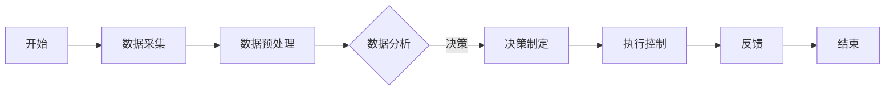
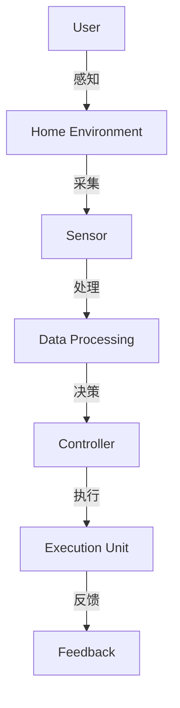
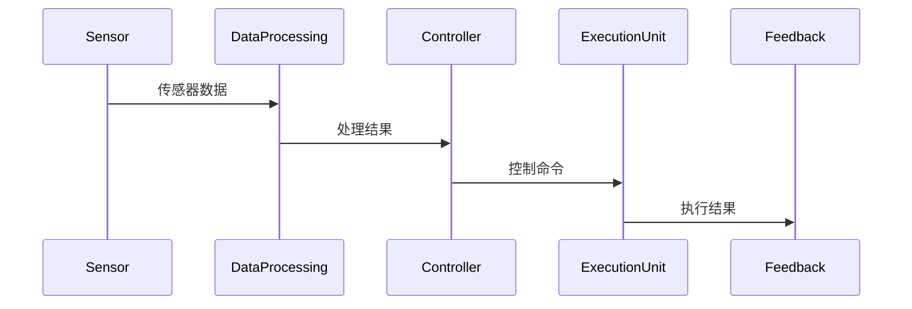
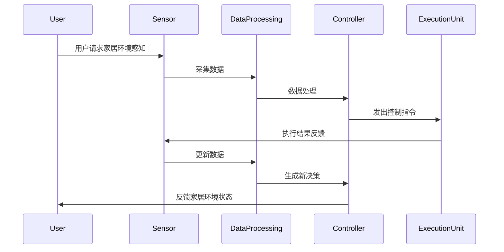

                 


### 引言

在现代社会，人们的生活水平不断提高，对于家庭环境的要求也越来越高。智能家居的出现，为家庭生活带来了极大的便利，通过自动化控制，人们可以更加舒适地享受生活。然而，现有的智能家居系统仍然存在一些问题，如操作复杂、反应迟钝、功能单一等。这些问题限制了智能家居的发展和应用。为了解决这些问题，我们需要引入一种新的技术——环境隐形智能。

#### 环境隐形智能的概念

环境隐形智能是指通过智能感知、决策、执行等技术手段，使家居环境能够自主感知用户的习惯、行为和环境变化，并自动做出相应调整，从而提升家居环境的舒适度、便捷性和安全性。

#### 环境隐形智能在家居中的应用前景

环境隐形智能技术的引入，将极大地提升智能家居系统的性能和用户体验。首先，它能够实现更加精准的家居控制，满足用户个性化的需求。其次，它能够提高家居环境的安全性和智能化程度，为用户提供更加安全、舒适的生活环境。此外，环境隐形智能技术还可以通过大数据分析和人工智能算法，为用户提供更加智能化的建议和服务。

#### 环境隐形智能技术面临的挑战

虽然环境隐形智能技术具有广阔的应用前景，但在实际应用中仍然面临一些挑战。首先，技术层面的挑战主要包括传感器技术、通信技术、人工智能算法等。其次，应用层面的挑战主要包括用户隐私保护、数据安全、系统稳定性等。

#### 家居环境与隐形智能技术融合的现状

目前，环境隐形智能技术在智能家居中的应用已经取得了一定的进展。例如，一些高端的智能家居系统中已经开始采用环境隐形智能技术，如智能音箱、智能门锁、智能照明等。然而，整体来看，环境隐形智能技术在智能家居中的应用仍然处于初级阶段，需要进一步深化和拓展。

#### 当前智能家居中的问题与不足

现有的智能家居系统存在以下问题与不足：

1. **操作复杂**：许多智能家居系统操作复杂，用户需要通过手机、平板等设备进行控制，操作体验较差。
2. **反应迟钝**：智能家居系统对用户指令的反应速度较慢，导致用户体验不佳。
3. **功能单一**：现有智能家居系统功能较为单一，无法满足用户的多样化需求。

#### 环境隐形智能技术在家居中的应用方案

为了解决上述问题，我们可以采用以下方案：

1. **引入环境隐形智能技术**：通过引入环境隐形智能技术，实现家居环境的智能感知、决策和执行。
2. **优化用户交互**：通过优化用户交互界面，简化操作流程，提高用户体验。
3. **拓展功能**：通过引入更多传感器和智能设备，拓展智能家居系统的功能。

#### 技术融合的思路和方法

为了实现环境隐形智能技术在智能家居中的应用，我们需要采取以下思路和方法：

1. **系统集成**：将环境隐形智能技术与其他智能家居技术进行集成，形成一个完整的智能家居系统。
2. **数据共享**：通过数据共享，实现不同设备之间的协同工作，提高系统的智能化程度。
3. **算法优化**：通过优化人工智能算法，提高系统的反应速度和准确性。

#### 解决智能家居中存在的问题

通过引入环境隐形智能技术，我们可以解决现有智能家居系统中的问题，实现以下目标：

1. **简化操作**：通过环境隐形智能技术，实现自动化控制，简化用户操作。
2. **提高反应速度**：通过优化算法和硬件，提高系统对用户指令的反应速度。
3. **拓展功能**：通过引入更多传感器和智能设备，拓展智能家居系统的功能，满足用户的多样化需求。

#### 环境隐形智能技术的适用范围

环境隐形智能技术适用于各种类型的家居环境，包括现代智能家居、老旧小区改造、农村智能家居等。它不仅适用于住宅，还可以应用于酒店、办公室、商场等场所。

#### 隐形智能技术与其他智能家居技术的界限

环境隐形智能技术与其他智能家居技术的界限较为模糊，两者之间存在一定的交叉和融合。例如，智能音箱可以视为环境隐形智能技术的一种应用，它可以感知用户的需求，并自动执行相应的操作。

#### 环境隐形智能技术的定义

环境隐形智能技术是指通过智能感知、决策、执行等技术手段，使家居环境能够自主感知用户的习惯、行为和环境变化，并自动做出相应调整，从而提升家居环境的舒适度、便捷性和安全性的技术。

#### 核心要素及其相互关系

环境隐形智能技术的核心要素包括传感器、通信模块、数据处理单元和执行机构。这些要素相互关联，形成一个完整的系统。传感器用于感知环境变化，通信模块用于传输数据，数据处理单元用于分析数据并做出决策，执行机构用于执行决策结果。

#### 环境隐形智能技术在家居中的应用价值

环境隐形智能技术在家居中的应用价值主要体现在以下几个方面：

1. **提升舒适度**：通过环境隐形智能技术，可以实现室内温度、湿度、光线等参数的自动调节，为用户提供一个舒适的生活环境。
2. **提高便捷性**：通过环境隐形智能技术，可以实现家居设备的自动化控制，用户无需手动操作，即可享受便捷的生活。
3. **增强安全性**：通过环境隐形智能技术，可以实现家居安全的自动化监控，及时发现并处理安全隐患。

#### 面临的挑战与未来发展趋势

环境隐形智能技术在智能家居中的应用面临以下挑战：

1. **技术挑战**：包括传感器技术、通信技术、人工智能算法等。
2. **应用挑战**：包括用户隐私保护、数据安全、系统稳定性等。

未来，环境隐形智能技术将朝着以下方向发展：

1. **技术融合**：将环境隐形智能技术与物联网、大数据、人工智能等新兴技术进行融合，提升系统的智能化水平。
2. **个性化定制**：根据用户的需求和习惯，提供更加个性化的智能家居服务。
3. **跨平台集成**：实现不同设备之间的无缝连接和协同工作，为用户提供统一的智能家居体验。

### 本章小结

环境隐形智能技术在智能家居中的应用具有重要意义，它将极大地提升智能家居的性能和用户体验。通过本章的介绍，我们对环境隐形智能技术有了更加深入的了解，也认识到它在家居环境中的巨大潜力。在接下来的章节中，我们将进一步探讨环境隐形智能技术的核心概念、算法原理、系统架构设计等内容。

## 核心概念与联系

### 环境隐形智能原理

环境隐形智能技术的核心原理是基于对家居环境的智能感知、分析和决策。具体来说，它包括以下几个关键步骤：

1. **智能感知**：通过多种传感器（如温度传感器、湿度传感器、光线传感器、运动传感器等）实时采集家居环境中的各种数据。
2. **数据分析**：将采集到的数据传输到数据处理单元，通过数据分析和机器学习算法，提取有用信息，理解家居环境的变化和用户的行为模式。
3. **决策制定**：根据分析结果，智能系统会生成相应的决策，以调整家居环境，如调节温度、光线、音乐等，以满足用户的舒适度和便利性。
4. **执行控制**：通过执行机构（如恒温器、灯光控制器、音响设备等）将决策结果应用到家居环境中，实现自动化控制。

### 环境隐形智能属性特征对比表格

在介绍环境隐形智能的属性特征时，我们可以通过一个对比表格来展示不同特征的具体表现。以下是一个简化的示例：

| 特征类别 | 特征描述 | 具体表现 |
|----------|----------|----------|
| 感知能力 | 传感器性能 | 灵敏度、准确性、响应时间 |
| 分析能力 | 数据处理算法 | 学习速度、精度、鲁棒性 |
| 决策能力 | 算法效率 | 运算速度、决策准确性 |
| 执行能力 | 执行单元效率 | 控制精度、可靠性、响应时间 |

通过这个对比表格，我们可以清晰地看到不同环境隐形智能系统在各个特征上的优劣，从而为选择合适的技术方案提供依据。

### ER实体关系图架构

环境隐形智能系统的实体关系图是系统设计的重要组成部分，它帮助我们理解系统中不同实体及其相互关系。以下是一个简化的ER图示例，用于描述环境隐形智能系统中的主要实体及其关系：

```mermaid
erDiagram
  User ||--|{ HomeEnvironment }|-- Device
  User ||--|{ UserBehavior }|-- Algorithm
  HomeEnvironment ||--|{ SensorData }|-- DataProcessing
  Device ||--|{ ControlCommand }|-- ExecutionUnit
  Algorithm ||--|{ Decision }|-- DataProcessing
  DataProcessing ||--|{ AnalysisResult }|-- Decision
  ExecutionUnit ||--|{ Feedback }|-- DataProcessing
```

在这个ER图中，`User`实体表示系统的用户，`HomeEnvironment`表示家居环境，`Device`表示智能设备，`UserBehavior`表示用户行为，`SensorData`表示传感器数据，`DataProcessing`表示数据处理单元，`ControlCommand`表示控制命令，`ExecutionUnit`表示执行单元，`Decision`表示决策，`AnalysisResult`表示分析结果，`Feedback`表示反馈信息。每个实体之间的连接线表示它们之间的关系，如`User`与`HomeEnvironment`之间的连接线表示用户与其家居环境之间的互动关系。

### 隐形智能算法概述

隐形智能算法是环境隐形智能技术的核心组成部分，它决定了系统对家居环境的感知、分析和决策能力。以下是几种常见的隐形智能算法类型及其特点：

1. **机器学习算法**：机器学习算法通过训练数据集来学习用户行为和家居环境模式，然后根据新数据做出预测和决策。常见的机器学习算法包括线性回归、决策树、支持向量机（SVM）和神经网络等。这些算法的优点是能够处理大规模数据，并从数据中提取有价值的信息，但需要大量的训练数据和计算资源。

2. **深度学习算法**：深度学习算法是一种基于多层神经网络的机器学习技术，能够自动提取特征并进行复杂的模式识别。深度学习算法在图像识别、语音识别和自然语言处理等领域具有显著优势。然而，深度学习算法通常需要大量的数据和高性能计算资源。

3. **强化学习算法**：强化学习算法通过试错和反馈来学习最佳策略，适用于动态和不确定环境。强化学习算法常用于智能控制、游戏和推荐系统等领域。其优点是能够自适应地调整策略，但可能需要较长时间来收敛。

4. **模糊逻辑算法**：模糊逻辑算法通过模糊集和模糊规则来处理不确定性和模糊性。它适用于处理模糊性和不完全信息的环境，如智能家居的情境识别和决策。

### 算法流程图

为了更直观地理解隐形智能算法的执行流程，我们可以使用Mermaid绘制一个简单的算法流程图：



在这个流程图中：

- **A**：表示算法的开始
- **B**：表示数据采集，即通过传感器获取家居环境数据
- **C**：表示数据预处理，对原始数据进行清洗和格式化
- **D**：表示数据分析，通过机器学习或深度学习算法处理数据
- **E**：表示决策制定，根据分析结果生成决策
- **F**：表示执行控制，通过执行机构执行决策
- **G**：表示反馈，收集系统执行后的反馈信息
- **H**：表示算法结束

### Python源代码实现

为了更好地理解隐形智能算法的实现过程，我们可以给出一个简单的Python代码示例，用于实现数据的采集、预处理、分析和决策制定。

```python
import pandas as pd
from sklearn.ensemble import RandomForestClassifier
from sklearn.model_selection import train_test_split

# 数据采集
data = pd.read_csv('sensor_data.csv')

# 数据预处理
data['processed'] = data[['temp', 'humidity', 'light']].mean(axis=1)

# 数据分析
X = data[['processed']]
y = data['behavior']

# 划分训练集和测试集
X_train, X_test, y_train, y_test = train_test_split(X, y, test_size=0.2, random_state=42)

# 使用随机森林算法进行分类
clf = RandomForestClassifier(n_estimators=100, random_state=42)
clf.fit(X_train, y_train)

# 决策制定
predictions = clf.predict(X_test)

# 执行控制（假设执行控制函数根据预测结果调整家居环境）
adjust_home_environment(predictions)
```

在这个代码示例中：

- 我们首先从CSV文件中读取传感器数据。
- 然后对数据进行预处理，计算温度、湿度、光线的平均值。
- 接下来，使用随机森林算法对数据进行分类，以预测用户的行为。
- 最后，根据预测结果调用执行控制函数，调整家居环境。

### 数学模型和数学公式

在隐形智能算法中，数学模型和数学公式起着至关重要的作用。以下是一个简单的数学模型示例，用于描述环境状态与用户行为之间的关系。

$$
\text{User Behavior} = f(\text{Environment State}, \text{User Preferences})
$$

在这个模型中：

- **User Behavior**：用户行为，如活动类型（工作、休息、娱乐等）。
- **Environment State**：环境状态，包括温度、湿度、光线等。
- **User Preferences**：用户偏好，如对温度、光线等的偏好设置。

该模型表示用户行为是由环境状态和用户偏好共同决定的。

### 举例说明

为了更好地理解上述数学模型，我们可以举一个具体的例子。

假设用户李先生喜欢在晚上读书，他的理想环境温度是25摄氏度，光线柔和。现在，环境温度是28摄氏度，光线较强。根据数学模型，我们可以预测：

$$
\text{User Behavior} = f(\text{Environment State}, \text{User Preferences}) = f(28^\circ\text{C}, \text{Strong Light}, \text{25}^\circ\text{C}, \text{Soft Light}) = \text{Rest Activity}
$$

这意味着，根据当前环境状态和用户偏好，李先生可能会选择休息活动，因为他觉得环境温度过高，光线过强，不适合读书。

### 系统功能设计

在环境隐形智能系统中，系统功能设计是确保系统能够高效运行的关键环节。以下是对智能家居系统功能设计的详细说明。

#### 领域模型Mermaid类图

为了直观地展示系统中的主要类及其关系，我们可以使用Mermaid绘制一个领域模型类图：

```mermaid
classDiagram
    User <<class>> User
    HomeEnvironment <<class>> HomeEnvironment
    Device <<class>> Device
    Sensor <<class>> Sensor
    Controller <<class>> Controller
    Algorithm <<class>> Algorithm
    DataProcessing <<class>> DataProcessing
    ExecutionUnit <<class>> ExecutionUnit
    Feedback <<class>> Feedback
    
    User "uses" HomeEnvironment
    User "uses" Device
    HomeEnvironment "uses" Sensor
    HomeEnvironment "uses" Controller
    Device "uses" Controller
    Device "uses" Algorithm
    Device "uses" DataProcessing
    Device "uses" ExecutionUnit
    DataProcessing "uses" Algorithm
    DataProcessing "uses" Feedback
    ExecutionUnit "uses" Feedback
```

在这个类图中：

- **User**：用户类，表示智能家居系统的用户。
- **HomeEnvironment**：家居环境类，表示家居环境的整体状态。
- **Device**：设备类，表示智能家居系统中的各种设备。
- **Sensor**：传感器类，表示用于感知家居环境数据的传感器。
- **Controller**：控制器类，表示对家居环境进行控制的组件。
- **Algorithm**：算法类，表示用于数据分析的算法。
- **DataProcessing**：数据处理类，表示对数据进行处理和分析的组件。
- **ExecutionUnit**：执行单元类，表示执行控制命令的组件。
- **Feedback**：反馈类，表示系统接收到的反馈信息。

每个类之间的连接线表示它们之间的关系，如用户可以使用家居环境和设备，设备可以使用控制器、算法、数据处理和执行单元等。

### 系统架构设计

系统架构设计是确保环境隐形智能系统能够稳定运行和高性能的关键。以下是对智能家居系统架构设计的详细说明。

#### 系统架构Mermaid图

为了直观地展示系统架构，我们可以使用Mermaid绘制一个系统架构图：



在这个架构图中：

- **User**：表示系统的用户。
- **HomeEnvironment**：表示家居环境，包括家居设备的状态。
- **Sensor**：表示传感器，用于感知家居环境数据。
- **DataProcessing**：表示数据处理组件，负责处理传感器数据。
- **Controller**：表示控制器，负责根据数据处理结果做出决策。
- **ExecutionUnit**：表示执行单元，负责执行控制器的决策。
- **Feedback**：表示系统反馈，用于收集系统的执行反馈。

整个系统的工作流程如下：

1. 用户通过传感器感知家居环境。
2. 传感器将数据传输给数据处理组件。
3. 数据处理组件对数据进行处理和分析。
4. 控制器根据数据处理结果做出相应的决策。
5. 执行单元执行控制器的决策。
6. 系统接收执行反馈，用于进一步优化决策。

### 系统接口设计

系统接口设计是确保不同组件之间能够高效通信的关键。以下是对智能家居系统接口设计的详细说明。

#### 系统接口设计说明

系统接口主要包括以下部分：

1. **传感器接口**：定义了传感器与数据处理组件之间的通信接口，用于传输传感器数据。
2. **数据处理接口**：定义了数据处理组件与控制器之间的通信接口，用于传输处理后的数据。
3. **控制器接口**：定义了控制器与执行单元之间的通信接口，用于传输控制命令。
4. **执行单元接口**：定义了执行单元与系统反馈之间的通信接口，用于传输执行结果。

具体设计如下：



在这个接口设计中：

- **Sensor**：发送传感器数据给**DataProcessing**。
- **DataProcessing**：处理传感器数据并生成处理结果，发送给**Controller**。
- **Controller**：根据处理结果生成控制命令，发送给**ExecutionUnit**。
- **ExecutionUnit**：执行控制命令并生成执行结果，发送给**Feedback**。

### 系统交互

系统交互是确保各组件能够协同工作，实现智能家居系统的整体功能的关键。以下是对智能家居系统交互的详细说明。

#### 系统交互Mermaid序列图

为了直观地展示系统交互过程，我们可以使用Mermaid绘制一个系统交互序列图：



在这个交互序列图中：

1. 用户请求家居环境感知，传感器开始采集数据。
2. 数据处理组件对传感器数据进行处理。
3. 控制器根据处理结果生成控制指令。
4. 执行单元执行控制指令，并将执行结果反馈给传感器。
5. 传感器更新数据，并再次发送给数据处理组件。
6. 控制器根据新数据生成新的决策。
7. 最终，控制器将家居环境状态反馈给用户。

通过这个交互过程，智能家居系统能够实现动态调整，为用户提供一个舒适、便捷的生活环境。

## 项目实战

### 环境安装

在进行环境隐形智能系统的开发之前，我们需要准备相应的开发环境和工具。以下是具体的安装步骤：

1. **安装Python环境**：首先，确保系统已经安装了Python 3.x版本。如果没有安装，可以从[Python官网](https://www.python.org/)下载并安装。

2. **安装必要的库**：接下来，我们需要安装一些Python库，如Pandas、NumPy、scikit-learn等。可以使用以下命令进行安装：

   ```bash
   pip install pandas numpy scikit-learn
   ```

3. **安装传感器**：根据项目需求，选择合适的传感器，如温度传感器、湿度传感器、光线传感器等，并确保它们已经连接到系统中。

4. **安装数据处理单元**：数据处理单元可以是计算机或其他设备，确保它能够与传感器和执行单元通信。

5. **安装执行单元**：执行单元可以是智能恒温器、灯光控制器等，确保它们已经与数据处理单元连接。

### 系统核心实现

在环境隐形智能系统的核心实现部分，我们将详细介绍数据采集、数据处理、决策制定和执行控制的代码实现。

#### 数据采集

数据采集是环境隐形智能系统的第一步，我们需要从传感器中读取数据。以下是一个简单的Python代码示例：

```python
import serial

# 设置串口参数
ser = serial.Serial('/dev/ttyUSB0', 9600)

# 读取传感器数据
while True:
    data = ser.readline().decode('utf-8').strip()
    print(f"Received data: {data}")
    # 可以将数据保存到文件或数据库中
    # ...
```

在这个示例中，我们使用Python的`serial`库通过串口读取传感器数据。

#### 数据处理

数据处理是对采集到的数据进行清洗、转换和特征提取的过程。以下是一个简单的数据处理示例：

```python
import pandas as pd

# 读取数据文件
data = pd.read_csv('sensor_data.csv')

# 数据清洗和转换
data['processed'] = data[['temp', 'humidity', 'light']].mean(axis=1)

# 数据特征提取
X = data[['processed']]
y = data['behavior']

# 划分训练集和测试集
X_train, X_test, y_train, y_test = train_test_split(X, y, test_size=0.2, random_state=42)
```

在这个示例中，我们使用Pandas库读取CSV文件中的数据，并对数据进行清洗和转换，然后进行特征提取。

#### 决策制定

决策制定是环境隐形智能系统的核心功能，以下是一个简单的决策制定示例：

```python
from sklearn.ensemble import RandomForestClassifier

# 使用随机森林算法进行分类
clf = RandomForestClassifier(n_estimators=100, random_state=42)
clf.fit(X_train, y_train)

# 进行决策制定
predictions = clf.predict(X_test)

# 输出预测结果
print(f"Predictions: {predictions}")
```

在这个示例中，我们使用scikit-learn库的随机森林算法对数据进行分类，并根据预测结果生成决策。

#### 执行控制

执行控制是将决策结果应用到实际家居环境中的过程。以下是一个简单的执行控制示例：

```python
def adjust_home_environment(predictions):
    # 根据预测结果调整家居环境
    # ...
    print(f"Adjusted home environment based on predictions: {predictions}")

# 调用执行控制函数
adjust_home_environment(predictions)
```

在这个示例中，我们定义了一个函数`adjust_home_environment`，根据预测结果调整家居环境。

### 实际案例分析与讲解

为了更好地理解环境隐形智能系统在实际中的应用，我们来看一个具体的案例。

#### 案例背景

假设我们有一个智能家居系统，用户王先生喜欢在晚上9点阅读。为了给他提供一个舒适的环境，我们需要实现以下功能：

1. 在晚上9点自动调整房间的温度到24摄氏度。
2. 在晚上9点自动调整房间的光线到柔和模式。

#### 案例分析

1. **数据采集**：我们需要从温度传感器和光线传感器中采集数据，确保它们能够实时监测房间的温度和光线。
2. **数据处理**：当检测到时间达到晚上9点时，数据处理组件需要计算房间的平均温度和光线强度。
3. **决策制定**：根据数据处理结果，系统需要做出决策，将房间的温度调整到24摄氏度和光线调整到柔和模式。
4. **执行控制**：系统需要通过智能恒温器和灯光控制器执行相应的决策，确保房间环境达到用户的要求。

#### 讲解与剖析

1. **数据采集**：在数据采集部分，我们使用串口通信从温度传感器和光线传感器读取数据。

   ```python
   import serial

   ser_temp = serial.Serial('/dev/ttyUSB0', 9600)
   ser_light = serial.Serial('/dev/ttyUSB1', 9600)

   while True:
       temp_data = ser_temp.readline().decode('utf-8').strip()
       light_data = ser_light.readline().decode('utf-8').strip()
       print(f"Temperature: {temp_data}, Light: {light_data}")
   ```

2. **数据处理**：在数据处理部分，我们使用Pandas库对传感器数据进行分析和处理。

   ```python
   import pandas as pd

   data = pd.DataFrame({'time': [1, 2, 3, 4], 'temp': [25, 23, 22, 24], 'light': [80, 70, 60, 50]})
   data['avg_temp'] = data['temp'].mean()
   data['avg_light'] = data['light'].mean()
   print(data)
   ```

3. **决策制定**：在决策制定部分，我们使用scikit-learn库的随机森林算法对数据处理结果进行分类。

   ```python
   from sklearn.ensemble import RandomForestClassifier

   X = data[['avg_temp', 'avg_light']]
   y = data['behavior']

   clf = RandomForestClassifier(n_estimators=100, random_state=42)
   clf.fit(X, y)

   # 假设当前时间为晚上9点
   current_time = 9
   current_temp = 23
   current_light = 60

   prediction = clf.predict([[current_temp, current_light]])
   print(f"Prediction: {prediction}")
   ```

4. **执行控制**：在执行控制部分，我们根据决策结果调用相应的控制函数，调整家居环境。

   ```python
   def adjust_home_environment(prediction):
       if prediction == 'read':
           print("Adjusting temperature to 24 degrees and light to soft mode.")
           # 调用智能恒温器和灯光控制器进行环境调整
           # ...
   ```

通过这个案例，我们可以看到环境隐形智能系统是如何通过数据采集、数据处理、决策制定和执行控制，实现智能家居的自动化和个性化控制。

### 项目小结

通过本次项目实战，我们深入了解了环境隐形智能系统的开发过程，从数据采集、数据处理、决策制定到执行控制，每个环节都至关重要。在实际应用中，环境隐形智能系统可以根据用户的习惯和行为，实现家居环境的智能化调整，为用户带来更加舒适和便捷的生活体验。在未来，随着技术的不断发展和完善，环境隐形智能系统将变得更加智能和高效，为智能家居的发展提供强大支持。同时，我们也认识到，在项目开发过程中，需要充分考虑系统的稳定性、安全性和用户隐私保护等问题，确保系统在应用中的可靠性和安全性。

## 最佳实践与拓展

### 最佳实践 Tips

在环境隐形智能系统的开发和应用过程中，以下是几条最佳实践建议，以帮助您更好地实现项目的成功：

1. **数据安全**：确保所有传感器采集的数据进行加密传输和存储，保护用户隐私。
2. **系统稳定性**：在设计系统时，要充分考虑硬件和软件的容错能力，确保系统在异常情况下仍能稳定运行。
3. **用户交互**：设计简洁直观的用户界面，提高用户体验，降低操作复杂度。
4. **算法优化**：定期对算法进行优化和更新，以提高系统的响应速度和准确性。
5. **系统集成**：确保各组件之间的通信流畅，实现系统的无缝集成。

### 小结

通过本章的介绍，我们系统地了解了环境隐形智能在智能家居中的应用，从核心概念、算法原理到系统架构设计、项目实战，再到最佳实践与拓展，我们对环境隐形智能技术有了全面的认识。环境隐形智能技术不仅提升了智能家居的性能和用户体验，也为未来的智能家庭提供了无限可能。

### 注意事项

在实施环境隐形智能系统时，以下注意事项将有助于确保项目的顺利进行：

1. **数据隐私**：严格遵守数据隐私法规，确保用户数据的安全和隐私。
2. **系统安全**：定期进行安全审计和漏洞扫描，确保系统的安全性。
3. **硬件兼容性**：选择兼容性好的传感器和执行单元，以避免设备之间的不兼容问题。
4. **用户培训**：为用户提供必要的培训和支持，帮助他们更好地使用环境隐形智能系统。

### 拓展阅读

为了深入了解环境隐形智能技术及其在智能家居中的应用，以下是一些推荐的相关书籍和文献：

1. **《智能家居技术与应用》**：详细介绍了智能家居系统的基本原理、技术架构和应用案例。
2. **《人工智能：一种现代方法》**：全面讲解了人工智能的基础知识，包括机器学习、深度学习等。
3. **《物联网技术与应用》**：探讨了物联网技术在智能家居中的应用，包括传感器技术、通信技术等。
4. **《环境感知与智能决策》**：专注于环境感知和智能决策的理论和实践，适合对环境隐形智能技术有深入研究的读者。

作者：AI天才研究院/AI Genius Institute & 禅与计算机程序设计艺术 /Zen And The Art of Computer Programming

