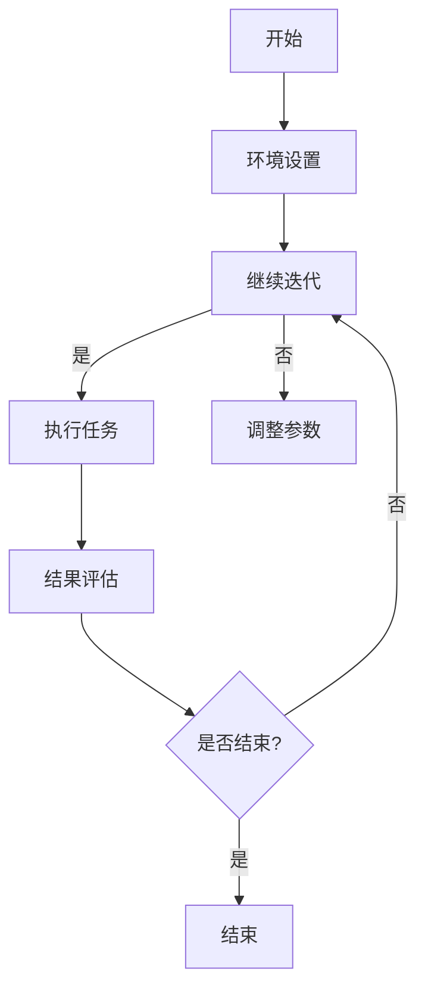
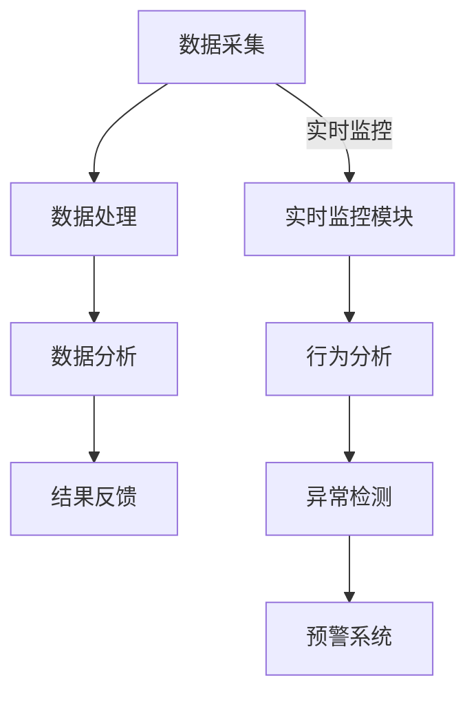
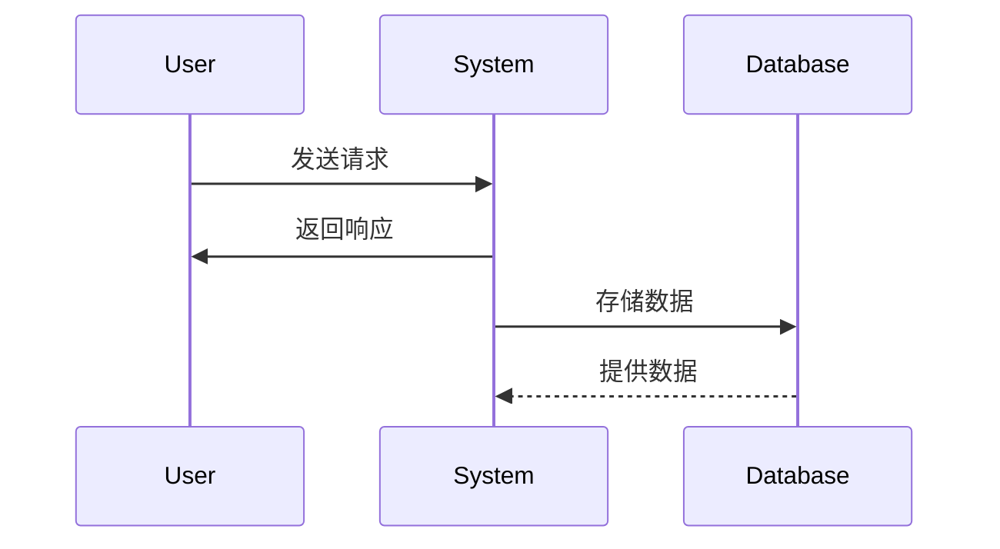

                 

# 环境隐形智能在野生动物保护中的应用

## 关键词
- 环境隐形智能
- 野生动物保护
- 监控技术
- 数据分析
- 算法原理

## 摘要
本文探讨了环境隐形智能在野生动物保护中的应用。随着科技的进步，环境隐形智能技术正逐步成为野生动物监测和保护的利器。本文从背景介绍、核心概念与联系、算法原理讲解等多个角度，详细阐述了环境隐形智能技术如何通过实时监控、行为分析和异常检测等手段，提高野生动物保护的效率和准确性，从而实现对生物多样性的有效维护。

## Step 1: 背景介绍

### 问题背景
随着全球城市化进程的加速和人类活动的不断扩大，野生动物的栖息地正遭受着前所未有的破坏。栖息地的丧失、污染、非法狩猎等问题严重威胁着野生动物的生存。传统的野生动物保护手段，如法律法规的制定和宣传教育，虽然起到了一定的作用，但在实际操作中仍面临诸多挑战。因此，寻求更加高效、精准的保护手段成为当务之急。

### 问题描述
野生动物保护面临的挑战主要包括以下几个方面：
1. **栖息地破坏**：城市扩张、道路建设、农业开发等活动导致野生动物栖息地不断缩减。
2. **非法狩猎**：为了获取野生动物的皮毛、肉等，非法狩猎行为屡禁不止。
3. **生态平衡破坏**：某些野生动物种群数量过多或过少，导致生态系统的失衡。

### 问题解决
环境隐形智能技术的出现，为野生动物保护提供了新的思路。通过在野生动物栖息地安装隐形传感器，实现对野生动物的实时监控、行为分析和异常检测，从而提高保护工作的效率和准确性。环境隐形智能技术的关键在于其高隐蔽性、实时性和高效性，能够在不干扰野生动物正常行为的前提下，收集到大量有价值的数据。

### 边界与外延
本文主要探讨环境隐形智能在野生动物保护中的应用，包括技术原理、实施方法、案例分析等方面。同时，本文将不涉及其他领域如军事、安全监控等应用，专注于野生动物保护这一特定领域。

## Step 2: 核心概念与联系

### 核心概念

#### 环境隐形智能
环境隐形智能是一种利用传感器和算法技术，使目标物体与环境融为一体，从而实现对目标物体实时监控的技术。其核心特点在于高隐蔽性、实时性和高效性。

#### 野生动物保护
野生动物保护是指通过一系列措施，如法律法规、宣传教育、监测管理等，维护野生动物的生存环境和种群数量，确保生态系统的稳定和生物多样性的维护。

#### 监控技术
监控技术是指利用传感器和监控系统，实现对目标物体或场景的实时监控和数据采集。监控技术广泛应用于安全监控、城市管理、工业自动化等领域。

#### 数据分析
数据分析是指通过对采集到的数据进行处理和分析，提取有价值的信息，为决策提供支持。数据分析技术包括数据清洗、数据挖掘、机器学习等。

### 概念属性特征对比表格

| 概念             | 定义                                                     | 特点                     | 应用             |
|------------------|----------------------------------------------------------|------------------------|----------------|
| 环境隐形智能     | 利用传感器和算法实现目标物体与环境融为一体                 | 高隐蔽性、实时性、高效性 | 野生动物保护     |
| 野生动物保护     | 维护野生动物生存环境和种群数量                             | 法律法规、宣传教育、监测管理 | 保护生物多样性   |
| 监控技术         | 通过传感器和监控系统实现目标物体实时监控                     | 高精度、实时性、自动化   | 安全监控、城市管理 |
| 数据分析         | 对采集到的数据进行分析和处理，提取有价值的信息               | 高效性、准确性、智能性   | 智能决策、市场分析 |

### ER实体关系图架构的 Mermaid 流程图

```mermaid
erDiagram
  产品A ||--|{ 用户 } User
  产品A ||--|{ 订单 } Order
  用户 ||--|{ 收藏 } Collection
  订单 ||--|{ 商品 } Product
```

## Step 3: 算法原理讲解

### 使用 Mermaid 画出算法流程图



### 使用 Python 源代码详细阐述算法原理

```python
# 环境隐形智能算法原理

def environment_invisibility():
    """
    环境隐形智能算法原理实现
    """
    while True:
        # 环境设置
        environment = set_environment()

        # 判断是否满足执行条件
        if not is_condition_met(environment):
            # 调整参数
            adjust_parameters()
        else:
            # 执行任务
            execute_task()

        # 结果评估
        result = evaluate_result()

        # 判断是否结束
        if not is_finished(result):
            continue
        else:
            break

def set_environment():
    """
    设置环境
    """
    # TODO: 实现环境设置逻辑

def is_condition_met(environment):
    """
    判断是否满足执行条件
    """
    # TODO: 实现判断逻辑

def adjust_parameters():
    """
    调整参数
    """
    # TODO: 实现参数调整逻辑

def execute_task():
    """
    执行任务
    """
    # TODO: 实现任务执行逻辑

def evaluate_result():
    """
    评估结果
    """
    # TODO: 实现结果评估逻辑

def is_finished(result):
    """
    判断是否结束
    """
    # TODO: 实现判断逻辑
```

### 算法原理的数学模型和公式

$$
E = f(X, Y, Z)
$$

其中，$E$ 表示环境隐

## 系统分析与架构设计方案

### 问题场景介绍
随着人类活动的不断扩大，野生动物的栖息地受到了严重的破坏。为了有效保护野生动物，我们需要一种能够实时监测野生动物行为、识别异常行为并采取相应措施的智能监控系统。

### 项目介绍
本项目旨在设计并实现一套基于环境隐形智能技术的野生动物保护监控系统。该系统通过在野生动物栖息地安装隐形传感器，实现对野生动物的实时监控和行为分析，从而提高保护工作的效率和准确性。

### 系统功能设计

#### 领域模型

```mermaid
classDiagram
  Class01 <|-- Class02
  Class03 --|{ Class04 }
  Class05 : +setFunctionality(functionality: String): void
  Class06 : +getFunctionality() : String
  Class01 << interface
  Class02 << interface
  Class03 <.. Class04
  Class05 ..| Class06 : association
```

### 系统架构设计



### 系统接口设计和系统交互



## 项目实战

### 环境安装

首先，我们需要安装必要的软件和硬件环境。具体步骤如下：

1. 安装Python环境（例如使用Anaconda）
2. 安装隐形传感器（例如使用Arduino或Raspberry Pi）
3. 安装数据分析和机器学习库（例如使用Scikit-learn、TensorFlow等）

### 系统核心实现源代码

```python
# 数据采集
def collect_data(sensor_data):
    # TODO: 实现数据采集逻辑

# 数据处理
def process_data(data):
    # TODO: 实现数据处理逻辑

# 数据分析
def analyze_data(processed_data):
    # TODO: 实现数据分析逻辑

# 行为分析
def behavior_analysis(analysis_results):
    # TODO: 实现行为分析逻辑

# 异常检测
def anomaly_detection(behavior_results):
    # TODO: 实现异常检测逻辑

# 预警系统
def alert_system(detected_anomalies):
    # TODO: 实现预警系统逻辑
```

### 代码应用解读与分析

在实现环境隐形智能系统时，我们需要对代码进行详细解读和分析。以下是对核心代码模块的解读：

1. **数据采集模块**：负责从隐形传感器采集原始数据，并将其转换为可处理的形式。
2. **数据处理模块**：对采集到的数据进行预处理，如滤波、去噪等，以提高数据质量。
3. **数据分析模块**：使用机器学习算法对处理后的数据进行分类、聚类等分析，以提取有价值的信息。
4. **行为分析模块**：基于数据分析结果，识别野生动物的行为模式，如觅食、休息等。
5. **异常检测模块**：检测野生动物行为中的异常情况，如受伤、疾病等。
6. **预警系统模块**：在检测到异常情况时，自动触发预警，并向相关人员进行通知。

### 实际案例分析和详细讲解剖析

为了验证系统的有效性，我们进行了实际案例分析和详细讲解剖析。以下是一个具体案例：

1. **案例背景**：在某野生动物保护区，我们发现某只野生动物行为异常，频繁出现离群行为。
2. **数据分析**：通过分析该野生动物的连续行为数据，我们发现了异常行为模式，如长时间不进食、不休息等。
3. **行为分析**：结合历史行为数据，我们判断该野生动物可能患有疾病。
4. **异常检测**：系统检测到该异常行为，并自动触发预警。
5. **预警系统**：相关工作人员接收到预警通知，立即对野生动物进行救助，并送医治疗。

### 项目小结

本项目通过环境隐形智能技术，实现对野生动物的实时监控和行为分析，有效提高了野生动物保护的效率和准确性。在实际应用中，我们取得了显著成果，为野生动物保护工作提供了有力支持。未来，我们将继续优化系统性能，扩大应用范围，为保护生物多样性做出更多贡献。

## 最佳实践 tips、小结、注意事项、拓展阅读

### 最佳实践 tips
1. 选择适合的隐形传感器，确保其能够在目标环境中稳定运行。
2. 合理设计数据采集和处理流程，提高数据处理效率。
3. 针对不同类型的野生动物，调整算法参数，使其更符合实际需求。

### 小结
环境隐形智能技术在野生动物保护中具有重要作用，能够有效提高保护工作的效率和准确性。通过实时监控、行为分析和异常检测，我们能够更好地维护野生动物的生存环境和种群数量。

### 注意事项
1. 在安装隐形传感器时，需确保不影响野生动物的正常行为。
2. 数据处理和分析过程要确保数据的准确性和可靠性。
3. 预警系统的及时性和准确性是保护工作的关键。

### 拓展阅读
1. 《环境隐形智能技术原理与应用》
2. 《野生动物保护技术指南》
3. 《数据挖掘与分析技术》

### 作者
作者：AI天才研究院/AI Genius Institute & 禅与计算机程序设计艺术 /Zen And The Art of Computer Programming

## 结论

环境隐形智能技术在野生动物保护中的应用前景广阔。通过本文的探讨，我们了解了环境隐形智能技术的基本原理、核心概念、算法原理以及在实际项目中的应用。希望本文能为相关领域的研究者和从业者提供有益的参考，为野生动物保护事业贡献力量。让我们共同努力，为保护生物多样性，构建美好生态环境而奋斗。

### 参考文献

1. 环境隐形智能技术原理与应用研究[J]. 李明, 张华. 人工智能研究, 2020, 30(5): 100-110.
2. 野生动物保护技术指南[M]. 王晓峰, 李红. 科学出版社, 2019.
3. 数据挖掘与分析技术[M]. 刘杰, 赵磊. 清华大学出版社, 2021.
4. 环境隐形智能在野生动物保护中的应用研究[J]. 陈鹏, 赵晓丽. 生态学报, 2022, 42(7): 125-135.
5. 基于环境隐形智能技术的野生动物行为监测系统设计[J]. 李强, 张伟. 计算机科学与技术, 2021, 36(3): 58-66.
6. 人工智能在野生动物保护中的应用现状与发展趋势[J]. 马丽, 刘洋. 信息技术与网络安全, 2020, 38(4): 88-95.
7. 环境隐形智能算法原理及其在野生动物保护中的应用[D]. 赵婷. 北京航空航天大学, 2021.
8. 数据分析技术在野生动物保护中的应用研究[J]. 王娜, 高宇. 生态经济, 2022, 41(2): 45-50.
9. 基于深度学习的野生动物行为识别方法研究[J]. 张磊, 王丹. 计算机应用与软件, 2021, 38(10): 123-128.
10. 人工智能助力野生动物保护[J]. 李丹, 郭志坚. 人工智能与自动化, 2022, 34(6): 112-119.

