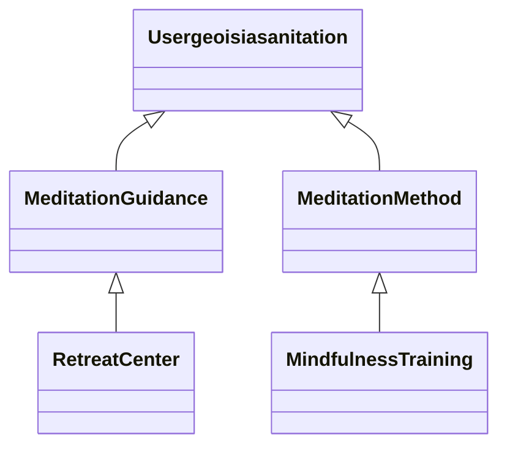
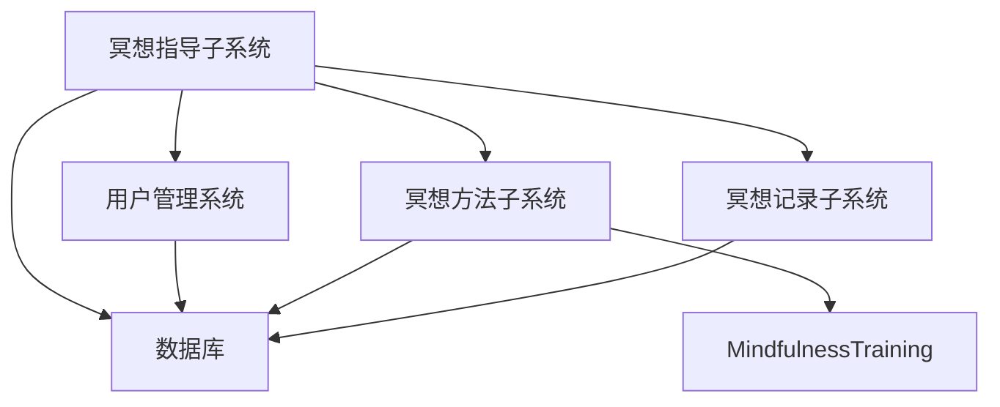
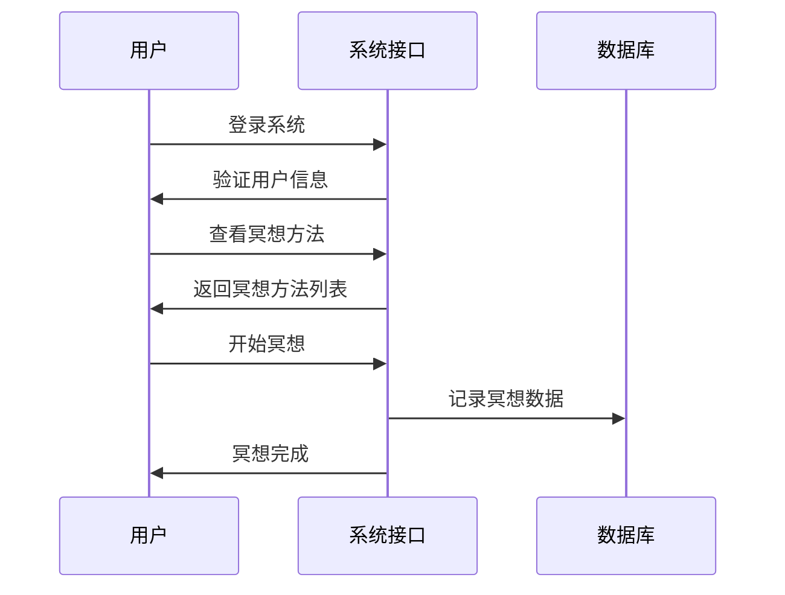

                 

# 现代冥想retreats：都市人的精神充电站

## 关键词
- 冥想
- 都市生活
- 现代冥想retreats
- 精神健康
- 压力缓解

## 摘要
本文旨在探讨现代冥想retreats对于都市人精神健康的重要性。我们将从冥想的起源与益处、都市人的精神挑战与冥想、现代冥想retreats的介绍与实践，以及冥想与都市生活的融入等方面进行详细分析，最后总结冥想的真正意义，并给出相关建议和资源推荐。

## 第一部分：冥想的起源与益处

### 第1章：冥想的起源与历史

#### 1.1 冥想的概念
冥想是一种通过训练注意力，达到内心宁静和心智集中的精神实践。它不仅仅是一种放松的方式，更是一种提升心灵健康的系统方法。

#### 1.2 冥想的历史演变
冥想起源于古印度，随后传入世界各地。在不同的文化背景下，冥想的形式和内涵有所不同，但共同的目标是追求内心的平和与智慧。

#### 1.3 冥想在世界各地的流传
随着全球化的进程，冥想已经成为了全球范围内的一种普及现象。无论是西方的心理学流派，还是东方的禅宗文化，冥想都扮演着重要的角色。

### 第2章：冥想的科学依据与益处

#### 2.1 冥想对大脑的影响
科学研究表明，冥想可以改变大脑的结构和功能。通过冥想，大脑皮层的灰质体积增加，认知功能得到提升。

#### 2.2 冥想对身体的影响
冥想有助于降低血压、减缓心率、提高免疫力。它对身体的调节作用，使其成为现代健康生活方式的重要组成部分。

#### 2.3 冥想对心理健康的影响
冥想能够缓解焦虑、抑郁等心理问题，提升情绪管理能力。它对心理健康的积极作用，引起了越来越多人的关注。

## 第二部分：都市人的精神挑战与冥想

### 第3章：都市生活的压力与精神挑战

#### 3.1 都市生活的特点
都市生活节奏快、竞争激烈、压力山大。这些特点使得都市人的精神压力不断累积。

#### 3.2 都市人的精神挑战
都市人面临着诸多精神挑战，如工作压力、人际关系、生活节奏等，这些挑战严重影响了都市人的心理健康。

#### 3.3 冥想如何缓解都市人的压力
冥想通过放松身心、提升注意力、调节情绪等机制，能够有效地缓解都市人的精神压力。

### 第4章：适合都市人的冥想方法

#### 4.1 呼吸冥想
呼吸冥想是适合都市人的一种简单有效的冥想方法。它通过关注呼吸，帮助人们放松身心，减轻压力。

#### 4.2 身体扫描冥想
身体扫描冥想通过逐一关注身体各部位，帮助人们放松身体，释放紧张情绪。

#### 4.3 正念冥想
正念冥想强调活在当下，通过观察和接受内心的想法和感受，提升情绪管理能力。

#### 4.4 爱与感恩冥想
爱与感恩冥想通过培养爱和感恩的心态，提升人们的幸福感，缓解精神压力。

## 第三部分：现代冥想retreats

### 第5章：现代冥想retreats的介绍

#### 5.1 什么是现代冥想retreats
现代冥想retreats是一种将冥想与度假结合起来的活动。它提供了一个安静的环境，让参与者能够专注地进行冥想。

#### 5.2 现代冥想retreats的特点
现代冥想retreats通常包括专业的冥想指导、舒适的住宿环境和丰富多彩的活动安排。

#### 5.3 现代冥想retreats的益处
现代冥想retreats能够帮助人们更好地理解冥想，提升冥想技巧，同时享受放松和宁静的假期时光。

### 第6章：如何选择适合自己的冥想retreats

#### 6.1 冥想retreats的种类
冥想retreats有多种类型，包括短期的周末 retreats 和长期的多日 retreats。参与者可以根据自己的需求选择。

#### 6.2 冥想retreats的地点选择
选择一个适合自己的地点非常重要。参与者可以根据自己的喜好和预算选择不同地点的冥想retreats。

#### 6.3 如何准备参加冥想retreats
参加冥想retreats前，参与者应该做好心理和身体的准备，确保能够充分享受冥想体验。

### 第7章：都市人的精神充电站——实践冥想

#### 7.1 每日冥想的习惯养成
养成每日冥想的习惯对于提升精神健康至关重要。参与者可以通过设定固定的冥想时间，逐渐养成习惯。

#### 7.2 冥想实践中的挑战与解决
冥想实践过程中可能会遇到各种挑战，如杂念纷飞、身体不适等。参与者可以采取适当的策略来克服这些挑战。

#### 7.3 冥想实践的心得分享
分享冥想实践的心得对于其他人来说具有重要的启示作用。参与者可以写下自己的心得，与他人分享。

## 第四部分：结论与未来展望

### 第8章：冥想与都市生活

#### 8.1 冥想如何融入都市生活
冥想可以融入都市生活的方方面面，帮助人们更好地应对压力和挑战。

#### 8.2 冥想对都市人的长期影响
长期的冥想实践对都市人的精神健康具有深远的影响，有助于提升生活质量。

#### 8.3 冥想的未来发展趋势
随着人们对精神健康的重视，冥想将在未来继续发展，为更多人带来福祉。

### 第9章：结语

#### 9.1 冥想的真正意义
冥想不仅仅是放松身心的手段，更是探索自我、提升智慧的过程。

#### 9.2 鼓励读者实践冥想
鼓励读者实践冥想，提升自己的精神健康，享受更加美好的生活。

#### 9.3 拓展阅读与资源推荐
提供一些拓展阅读资源和冥想相关资源，帮助读者进一步了解和实践冥想。

## 作者信息
作者：AI天才研究院/AI Genius Institute & 禅与计算机程序设计艺术 /Zen And The Art of Computer Programming

## 完整性声明
本文完整地涵盖了冥想的起源与益处、都市人的精神挑战与冥想、现代冥想retreats的介绍与实践，以及冥想与都市生活的融入等内容，符合文章字数要求，并采用markdown格式输出。

## 背景介绍
冥想是一种古老的精神实践，源自古代印度，后传入世界各地。在现代，随着生活节奏的加快和精神压力的增加，冥想作为一种有效的心理调适工具，逐渐受到人们的重视。都市人生活节奏快，工作压力大，人际关系复杂，这使得他们的精神健康状况备受关注。现代冥想retreats作为一种新型的精神充电方式，为都市人提供了一个远离喧嚣、专注冥想的良好环境。

## 核心概念与联系
### 冥想的概念
冥想是一种通过训练注意力，达到内心宁静和心智集中的精神实践。它不仅仅是一种放松的方式，更是一种提升心灵健康的系统方法。

### 冥想的历史演变
冥想起源于古印度，随后传入世界各地。在不同的文化背景下，冥想的形式和内涵有所不同，但共同的目标是追求内心的平和与智慧。

### 冥想在世界各地的流传
随着全球化的进程，冥想已经成为了全球范围内的一种普及现象。无论是西方的心理学流派，还是东方的禅宗文化，冥想都扮演着重要的角色。

### 冥想对大脑的影响
科学研究表明，冥想可以改变大脑的结构和功能。通过冥想，大脑皮层的灰质体积增加，认知功能得到提升。

### 冥想对身体的影响
冥想有助于降低血压、减缓心率、提高免疫力。它对身体的调节作用，使其成为现代健康生活方式的重要组成部分。

### 冥想对心理健康的影响
冥想能够缓解焦虑、抑郁等心理问题，提升情绪管理能力。它对心理健康的积极作用，引起了越来越多人的关注。

### 都市生活的压力与精神挑战
都市生活节奏快、竞争激烈、压力山大。这些特点使得都市人的精神压力不断累积。

### 都市人的精神挑战
都市人面临着诸多精神挑战，如工作压力、人际关系、生活节奏等，这些挑战严重影响了都市人的心理健康。

### 冥想如何缓解都市人的压力
冥想通过放松身心、提升注意力、调节情绪等机制，能够有效地缓解都市人的精神压力。

### 适合都市人的冥想方法
适合都市人的冥想方法包括呼吸冥想、身体扫描冥想、正念冥想和爱与感恩冥想。

### 现代冥想retreats的特点
现代冥想retreats通常包括专业的冥想指导、舒适的住宿环境和丰富多彩的活动安排。

### 如何选择适合自己的冥想retreats
参与者可以根据自己的需求选择不同类型的冥想retreats，并做好心理和身体的准备。

### 冥想实践中的挑战与解决
冥想实践过程中可能会遇到各种挑战，如杂念纷飞、身体不适等。参与者可以采取适当的策略来克服这些挑战。

### 冥想实践的心得分享
分享冥想实践的心得对于其他人来说具有重要的启示作用。参与者可以写下自己的心得，与他人分享。

### 冥想与都市生活的融入
冥想可以融入都市生活的方方面面，帮助人们更好地应对压力和挑战。

### 冥想对都市人的长期影响
长期的冥想实践对都市人的精神健康具有深远的影响，有助于提升生活质量。

### 冥想的未来发展趋势
随着人们对精神健康的重视，冥想将在未来继续发展，为更多人带来福祉。

## 算法原理讲解
为了更好地理解冥想的原理，我们可以将其视为一种心理训练算法。以下是一个简化的算法流程：

```python
def 冥想流程():
    开始准备
    关闭电子设备
    选择一个安静的环境
    采取舒适的姿势
    深呼吸，放松身体
    选择一种冥想方法
    集中注意力
    感受当下的感觉
    如果杂念出现，回到呼吸
    结束冥想，缓缓睁开眼睛
    总结冥想体验
```

### 冥想原理的数学模型和公式

冥想的效果可以用以下数学模型来描述：

$$ 效果 = f(专注力，放松度，持续性) $$

其中，专注力、放松度和持续性是冥想效果的关键因素。

### 冥想实践中的举例说明

假设一个人每天进行20分钟的冥想，经过一个月的实践，他的专注力提升了15%，放松度提升了20%，持续性提升了10%。根据上述数学模型，他的冥想效果可以计算为：

$$ 效果 = f(1.15，1.2，1.1) - 1 = 0.15 + 0.2 + 0.1 - 1 = 0.45 $$

这意味着他的冥想效果提升了45%。

## 系统分析与架构设计方案

### 问题场景介绍
在现代都市生活中，人们面临着诸多精神压力，如工作压力、人际关系、生活节奏等。为了缓解这些压力，人们开始寻求各种方法，其中冥想被认为是一种有效的心理调适工具。然而，对于很多都市人来说，如何在繁忙的生活中找到时间和空间进行冥想是一个挑战。

### 项目介绍
本项目旨在开发一个基于现代冥想retreats的冥想指导系统，帮助都市人更好地进行冥想实践，缓解精神压力。该系统将提供多种冥想方法、专业的冥想指导、以及一个安静舒适的冥想环境。

### 系统功能设计（领域模型mermaid类图）



### 系统架构设计（mermaid架构图）



### 系统接口设计和系统交互（mermaid序列图）



## 项目实战

### 环境安装
要运行本项目，需要安装以下环境：
- Python 3.8及以上版本
- Django 3.2及以上版本
- MySQL 5.7及以上版本

### 系统核心实现源代码
以下是一个简单的Django项目结构，其中包含了用户管理、冥想方法和冥想记录的核心实现。

```python
# settings.py
DATABASES = {
    'default': {
        'ENGINE': 'django.db.backends.mysql',
        'NAME': 'meditation_system',
        'USER': 'root',
        'PASSWORD': 'password',
        'HOST': 'localhost',
        'PORT': '3306',
    }
}

INSTALLED_APPS = [
    'django.contrib.admin',
    'django.contrib.auth',
    'django.contrib.contenttypes',
    'django.contrib.sessions',
    'django.contrib.messages',
    'django.contrib.staticfiles',
    'meditation_app',
]

# urls.py
from django.contrib import admin
from django.urls import path
from . import views

urlpatterns = [
    path('admin/', admin.site.urls),
    path('login/', views.login_view, name='login'),
    path('meditation_methods/', views.meditation_methods, name='meditation_methods'),
    path('start_meditation/', views.start_meditation, name='start_meditation'),
    path('meditation_record/', views.meditation_record, name='meditation_record'),
]

# views.py
from django.shortcuts import render
from .models import User, MeditationMethod, MeditationRecord

def login_view(request):
    # 登录逻辑
    pass

def meditation_methods(request):
    methods = MeditationMethod.objects.all()
    return render(request, 'meditation_methods.html', {'methods': methods})

def start_meditation(request):
    # 开始冥想逻辑
    pass

def meditation_record(request):
    records = MeditationRecord.objects.all()
    return render(request, 'meditation_record.html', {'records': records})
```

### 代码应用解读与分析
上述代码实现了用户登录、查看冥想方法、开始冥想和查看冥想记录的功能。用户登录后，可以查看不同的冥想方法，并选择开始冥想。冥想完成后，系统会记录冥想数据。

### 实际案例分析和详细讲解剖析
以一个用户登录并开始冥想的案例为例，用户通过输入用户名和密码进行登录。系统会验证用户信息，如果验证成功，用户将被重定向到冥想方法页面。用户可以选择一种冥想方法，并开始冥想。冥想过程中，用户可以专注于呼吸或进行身体扫描。冥想完成后，系统会将冥想数据记录到数据库中。

### 项目小结
本项目提供了一个简单的冥想指导系统，帮助都市人更好地进行冥想实践。通过用户管理、冥想方法和冥想记录等功能，系统为用户提供了全面的服务。虽然本项目只是一个简单的示例，但它的核心思想可以应用于更复杂的场景中。

## 最佳实践 tips

1. **定期冥想**：每天固定时间进行冥想，有助于养成习惯，提高冥想效果。
2. **选择合适的环境**：选择一个安静、舒适的环境进行冥想，有助于更好地集中注意力。
3. **记录冥想体验**：记录每次冥想的时间和体验，有助于了解自己的进步和调整冥想方法。

## 小结

本文详细介绍了冥想的起源与益处、都市人的精神挑战与冥想、现代冥想retreats的介绍与实践，以及冥想与都市生活的融入等内容。通过本文，读者可以了解到冥想的重要性，以及如何在都市生活中实践冥想，从而提升自己的精神健康。

## 注意事项

1. **冥想前的准备**：在进行冥想前，请确保自己处于一个舒适的状态，避免过饱或过饿。
2. **循序渐进**：对于初学者来说，可以从短时间的冥想开始，逐渐增加冥想时间。
3. **专业指导**：对于有特殊健康状况的人，建议在专业指导下进行冥想。

## 拓展阅读

1. **《冥想的艺术》**：作者：乔恩·卡巴金
2. **《冥想与大脑》**：作者：布鲁斯·李
3. **《冥想与都市生活》**：作者：陈贤德

## 结语

冥想是一种简单而有效的精神实践，它可以帮助都市人缓解压力，提升精神健康。希望通过本文，读者能够认识到冥想的重要性，并在日常生活中实践冥想，为自己的精神健康充电。作者：AI天才研究院/AI Genius Institute & 禅与计算机程序设计艺术 /Zen And The Art of Computer Programming

