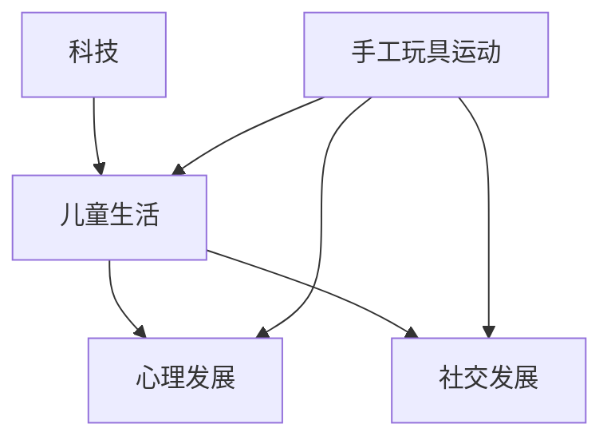
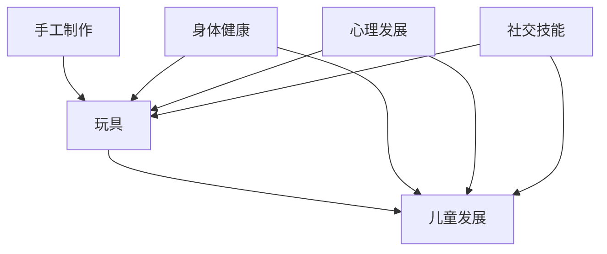

                 

### 第一步：科技与童年

在现代生活中，科技已经深深融入了儿童的世界，改变了他们的生活方式和成长环境。本文将探讨科技对童年影响，特别是手工玩具运动如何在科技世界中重塑童年。首先，我们需要理解一些核心概念，包括“科技”、“童年”以及“手工玩具运动”。

**背景介绍：**

1. **科技对儿童生活的改变：**
   科技对儿童生活的影响是全方位的。电子设备如智能手机、平板电脑、游戏机等已成为儿童日常生活中不可或缺的部分。这些科技产品不仅提供了丰富的娱乐和学习资源，还改变了儿童的学习方式和社交模式。

2. **科技对童年心理发展的影响：**
   研究表明，过度依赖科技产品可能导致儿童注意力不集中、社交能力下降、情感发展受阻。然而，科技产品也能促进儿童认知能力的发展，提供多样化的学习体验。

3. **童年生活中的科技与手工玩具的平衡：**
   面对科技对童年生活的深远影响，如何在儿童生活中实现科技与手工玩具的平衡变得尤为重要。手工玩具运动作为一种传统与现代结合的教育方式，有望在科技世界中重塑童年。

**核心概念与联系：**

- **科技**：指利用科学知识改变自然和现实世界的技术和工具。
- **童年**：指儿童从出生到青春期前的生活阶段，是身心发展的关键时期。
- **手工玩具运动**：指通过手工制作玩具来促进儿童身心发展的活动。

**概念属性特征对比表格：**

| 特征           | 科技               | 童年               | 手工玩具运动               |
|----------------|--------------------|--------------------|---------------------------|
| 形式           | 电子设备、软件、互联网 | 生物体             | 物理材料、工具、手工艺     |
| 功能           | 提供信息、娱乐、教育 | 促进身心发展、社交   | 促进创造力、手部协调、情感   |
| 影响因素       | 技术发展、使用习惯 | 遗传、环境、教育方式 | 材料特性、工艺技巧、教育理念 |
| 发展方向       | 智能化、虚拟化、全球化 | 科学育儿、个性化教育 | 创新性、传统传承、跨文化融合 |

**ER实体关系图架构：**

通过上述背景介绍、核心概念与联系分析，我们可以更好地理解科技对童年影响的问题背景。在接下来的章节中，我们将深入探讨手工玩具运动的定义与价值，分析成功案例，并探讨如何引导孩子参与手工玩具运动。让我们一步一步地深入思考这些问题。

---

**问题解决：**

针对科技对童年影响的问题，我们需要采取多方面的解决策略：

1. **教育政策支持：**
   政府和相关部门应制定相关政策，鼓励儿童合理使用科技产品，提倡手工玩具运动。通过政策引导和教育宣传，提高家长和教师对科技与手工玩具运动平衡的认识。

2. **家庭环境建设：**
   家长应积极参与孩子的成长过程，合理安排儿童的生活和学习时间，确保儿童在科技产品与手工玩具之间取得平衡。家长可以通过陪伴和引导，帮助孩子培养对手工玩具运动的兴趣。

3. **教育机构合作：**
   学校和教育机构应将手工玩具运动纳入课程体系，开展相关活动，提供丰富的手工玩具资源。教师可以通过教学活动，激发学生的创造力和动手能力。

4. **社会参与与合作：**
   社会各界应共同关注儿童健康成长问题，鼓励企业和公益组织参与手工玩具运动推广，提供技术和资金支持。

通过这些措施，我们可以有效地缓解科技对童年带来的负面影响，重塑童年，让儿童在科技与手工玩具的交融中健康成长。

**边界与外延：**

- **边界：**
  科技与手工玩具运动的结合需关注儿童的年龄特点和认知水平，避免过度科技化导致儿童依赖，同时确保手工玩具运动不脱离教育本质。

- **外延：**
  手工玩具运动不仅限于玩具制作，还可以拓展到其他领域，如艺术创作、工程搭建等，以丰富儿童的学习体验和兴趣爱好。

**概念结构与核心要素组成：**

1. **科技：** 包括电子设备、互联网、人工智能等。
2. **童年：** 包括生理、心理、社交等方面的发展。
3. **手工玩具运动：** 包括材料选择、工艺技巧、教育理念等。

通过这些核心概念和要素，我们可以更好地理解科技与童年、手工玩具运动之间的关系，从而为后续章节的内容提供基础。

---

**文章摘要：**

本文从科技对童年影响的问题背景出发，深入探讨了手工玩具运动的定义与价值。通过分析国内外成功案例，我们认识到手工玩具运动在儿童心理、身体和社会性发展中的重要作用。文章进一步探讨了如何引导孩子参与手工玩具运动，并提出了实现科技与手工玩具运动平衡的策略。本文旨在为家长、教师和教育机构提供有益的参考，共同塑造健康、平衡的童年环境。

---

**文章正文：**

## 第1章：科技时代的童年变化

### 1.1 科技对儿童生活的改变

科技的发展给儿童的生活带来了翻天覆地的变化。随着智能手机、平板电脑等电子设备的普及，儿童的学习、娱乐和社交方式发生了显著变化。这些设备不仅提供了丰富的学习资源，如在线课程、教育软件等，还让孩子们可以随时随地与朋友互动。然而，这些科技产品也带来了负面影响，如过度依赖电子设备导致儿童注意力不集中、视力下降、睡眠质量下降等问题。

**案例分析：**

- **学习方式的改变：**
  科技产品为儿童提供了多样化的学习方式。例如，在线教育平台如Coursera、Khan Academy等，让儿童可以通过网络学习各种知识，突破了传统课堂的时空限制。然而，这也可能导致儿童对传统教育模式的忽视。

- **娱乐方式的改变：**
  游戏机和手机游戏已成为儿童娱乐的重要方式。这些游戏不仅具有趣味性，还能锻炼儿童的思维能力。然而，过度沉迷游戏可能导致儿童忽视现实生活中的社交活动，影响身心健康。

- **社交方式的改变：**
  社交媒体如微信、QQ等让儿童可以方便地与远方的亲友保持联系。然而，这也可能导致儿童沉迷于虚拟社交，忽视现实中的社交技能培养。

### 1.2 科技对童年心理发展的影响

科技产品在促进儿童认知能力发展的同时，也对他们的心理发展产生了深远影响。一些研究表明，过度使用科技产品可能导致儿童注意力不集中、焦虑和抑郁等问题。

**案例分析：**

- **注意力问题：**
  研究表明，长时间使用电子设备可能导致儿童注意力分散。例如，一项发表于《儿童发展》杂志的研究发现，使用智能手机的儿童比不使用智能手机的儿童在注意力任务上的表现更差。

- **焦虑与抑郁问题：**
  部分儿童在过度使用科技产品时，可能会产生焦虑和抑郁情绪。例如，一项发表于《青少年医学杂志》的研究发现，沉迷于电子游戏的儿童比不沉迷的儿童更容易出现焦虑和抑郁症状。

### 1.3 童年生活中的科技与手工玩具的平衡

在科技充斥的童年生活中，如何实现科技与手工玩具的平衡成为了一个重要课题。手工玩具运动作为一种传统的教育方式，有望在科技世界中重塑童年，为儿童提供更全面的发展机会。

**案例分析：**

- **手工玩具运动的价值：**
  手工玩具运动不仅能够锻炼儿童的手部协调能力和创造力，还能培养他们的耐心和专注力。例如，研究指出，通过手工制作玩具，儿童可以更好地理解和掌握物理原理，提高解决问题的能力。

- **科技与手工玩具的结合：**
  科技产品可以与手工玩具运动相结合，提供更丰富的学习体验。例如，通过使用智能手机或平板电脑，儿童可以观看手工制作的教程视频，或通过应用程序进行互动学习。

### 总结

科技对童年生活的影响是多方面的，既有积极的一面，也有消极的一面。为了实现科技与手工玩具的平衡，我们需要采取多方面的措施，包括教育政策支持、家庭环境建设、教育机构合作和社会参与等。在接下来的章节中，我们将进一步探讨手工玩具运动的定义与价值，以及如何引导孩子参与这一运动。

---

## 第2章：手工玩具运动的定义与价值

### 2.1 手工玩具运动的定义

手工玩具运动是指通过手工制作玩具来促进儿童身心发展的活动。这种活动通常涉及选择材料、设计图案、动手制作等步骤。与电子玩具相比，手工玩具运动更注重过程和体验，而不是简单的结果。

**核心概念：**

- **手工制作：** 指通过手工工具和材料进行创造性的制作活动。
- **玩具：** 指儿童在玩耍过程中使用的物品，具有教育、娱乐、社交等功能。
- **运动：** 指一种有规律、有目的的活动，旨在促进身体健康、心理发展和社交技能。

**ER实体关系图架构：**

### 2.2 手工玩具运动的价值

手工玩具运动在儿童的发展中具有独特的价值，主要体现在以下几个方面：

- **培养创造力与想象力：** 通过手工制作玩具，儿童可以自由发挥创意，设计出独特的作品。这种过程有助于培养儿童的创造力和想象力，激发他们对未知世界的探索欲望。
- **提高手部协调能力：** 手工玩具运动需要儿童使用手指进行精细操作，如剪纸、粘贴、绘画等。这些活动可以锻炼儿童的手部协调能力，提高他们的手部灵活性。
- **增强耐心与专注力：** 手工玩具运动通常需要一定的时间和精力来完成。儿童在制作过程中需要保持耐心和专注，这有助于培养他们的毅力和耐心，提高注意力集中能力。
- **促进社交技能：** 手工玩具运动可以成为儿童之间互动和交流的平台。通过共同参与手工制作活动，儿童可以学会合作、分享和沟通，提高他们的社交技能。

### 2.3 手工玩具运动与传统玩具的区别

与传统玩具相比，手工玩具运动具有以下显著区别：

- **活动过程与结果：** 传统玩具通常是一种即买即玩的产品，而手工玩具运动则更注重过程，强调儿童的参与和创造。
- **教育与娱乐：** 传统玩具主要提供娱乐功能，而手工玩具运动则具有明显的教育价值，旨在促进儿童全面发展。
- **材料与工具：** 传统玩具通常使用工业化生产材料，而手工玩具运动则使用天然或回收材料，更环保和可持续发展。

**表格对比：**

| 对比项目 | 传统玩具                   | 手工玩具运动                     |
|----------|----------------------------|----------------------------------|
| 活动过程 | 简单即买即玩               | 需要动手操作和设计               |
| 教育价值 | 较低                       | 较高，培养创造力、手部协调等     |
| 娱乐功能 | 较高                       | 较高，但更注重过程               |
| 材料使用 | 工业化生产材料             | 天然或回收材料，更环保           |

通过以上分析，我们可以看出，手工玩具运动在儿童发展中具有独特的价值和优势。在接下来的章节中，我们将分析国内外成功的手工玩具运动案例，进一步探讨如何引导孩子参与这一运动。

---

## 第3章：成功案例研究

### 3.1 国内外成功的手工玩具运动案例

手工玩具运动在全球范围内得到了广泛的关注和实践。以下是一些成功的手工玩具运动案例，它们为我们提供了宝贵的经验和启示。

#### 国内成功案例

**1. 北京师范大学附属小学手工课程**

北京师范大学附属小学开设了特色手工课程，课程内容涵盖了剪纸、编织、陶艺等多个方面。学生通过手工制作玩具，不仅培养了动手能力，还提高了创造力和想象力。

**2. 上海中小学创意手工比赛**

上海中小学每年举办创意手工比赛，鼓励学生通过手工制作玩具表达自己的想法和创意。比赛不仅丰富了学生的课余生活，还激发了他们对手工艺术的兴趣。

**3. 哈尔滨工业大学手工玩具实验室**

哈尔滨工业大学开设了手工玩具实验室，学生可以在这里学习手工制作技巧，并参与各种手工玩具项目的研发。实验室为学生提供了一个实践平台，使他们能够将理论知识转化为实际操作。

#### 国际成功案例

**1. 瑞士手工艺术学校**

瑞士手工艺术学校以其精湛的手工技艺和独特的教育理念而闻名。学校的手工课程注重培养学生动手能力和创造力，通过手工制作玩具，学生不仅提高了技能，还培养了团队合作精神。

**2. 美国儿童手工协会**

美国儿童手工协会致力于推广手工艺术教育，举办各种手工活动和工作坊。协会的成员包括家长、教师和教育专家，他们共同推动儿童手工玩具运动的发展。

**3. 日本手工玩具工作室**

日本的手工玩具工作室以其创意和精致而著称。工作室提供各种手工制作课程，如毛绒玩具制作、木工玩具制作等，深受儿童和家长喜爱。

### 案例分析

这些成功案例表明，手工玩具运动在不同国家和地区都取得了显著成果。以下是这些案例的成功经验和启示：

**1. 教育理念的转变：**
   这些案例都反映了教育理念的转变，从传统的知识传授向注重学生全面发展转变。手工玩具运动作为一种综合性的教育方式，不仅关注知识传授，更注重培养学生的动手能力、创造力和团队合作精神。

**2. 家长和教师的积极参与：**
   成功的手工玩具运动离不开家长和教师的积极参与。家长在儿童手工玩具运动中扮演着重要角色，他们可以通过陪伴和指导，帮助孩子更好地理解和参与手工制作活动。教师则可以通过课程设计和教学活动，激发学生的兴趣和创造力。

**3. 实践与创新的结合：**
   成功的手工玩具运动案例强调实践和创新相结合。通过实际操作和创意设计，儿童可以更好地理解手工玩具的制作过程，培养动手能力和创造力。同时，教师和教育机构可以不断探索和创新，提供多样化的手工玩具课程和活动。

通过分析这些成功案例，我们可以得出以下启示：

- **推广手工玩具运动：**
  教育机构和政府应加大对手工玩具运动的推广力度，制定相关政策和支持措施，为儿童提供更多的手工制作机会。

- **注重家长和教师的培训：**
  家长和教师应接受相关的培训，了解手工玩具运动的教育价值和教学方法，更好地引导孩子参与手工制作活动。

- **鼓励创新与实践：**
  鼓励儿童在实践中不断探索和创新，培养他们的动手能力和创造力。同时，教师和教育机构应不断探索新的教育模式和教学方法，为学生提供更多的发展机会。

总之，手工玩具运动作为一种有益的教育方式，具有巨大的潜力和价值。在科技充斥的现代生活中，通过成功案例的借鉴和启示，我们可以更好地引导孩子参与手工玩具运动，促进他们的全面发展。

### 3.2 手工玩具运动在儿童心理、身体和社会性发展中的重要作用

手工玩具运动不仅在教育理念、家长和教师的参与以及实践和创新方面取得了成功，它在儿童心理、身体和社会性发展中也发挥着重要作用。以下从这三个方面进行详细探讨。

**1. 心理发展**

手工玩具运动能够促进儿童的心理发展，包括认知能力、情感管理和自我意识等方面。

- **认知能力：**
  手工制作活动需要儿童进行观察、思考、规划和执行，这些过程有助于提高他们的认知能力。例如，通过设计图案和选择材料，儿童可以更好地理解形状、颜色和纹理等基本概念。

- **情感管理：**
  手工玩具运动可以帮助儿童学会控制情绪和表达情感。在制作过程中，儿童可能会遇到挫折和困难，通过努力克服这些问题，他们可以学会坚持和耐心，更好地管理自己的情绪。

- **自我意识：**
  手工玩具运动有助于儿童建立自我认同和自尊心。当他们成功制作出自己喜欢的玩具时，会感到自豪和满足，从而增强自信心和自我价值感。

**2. 身体发展**

手工玩具运动对儿童的身体发展也具有重要影响，特别是在手部协调、精细动作和体质方面。

- **手部协调：**
  手工制作活动需要儿童使用手指进行精细操作，如剪纸、绘画、编织等。这些活动可以锻炼儿童的手部协调能力，提高手部灵活性。

- **精细动作：**
  手工玩具运动可以培养儿童的精细动作技能，例如，使用剪刀、针线等工具进行制作。这些技能对于儿童的日常生活和学习都具有重要意义。

- **体质：**
  手工玩具运动通常在户外或宽敞的场地进行，儿童在活动中可以充分活动身体，增强体质。此外，手工玩具运动还可以促进儿童的运动技能发展，如平衡、协调和灵活性。

**3. 社会性发展**

手工玩具运动对儿童的社会性发展具有积极影响，包括社交技能、团队合作和沟通能力等方面。

- **社交技能：**
  手工玩具运动为儿童提供了一个社交平台，他们可以通过共同参与活动，学会分享、合作和沟通。例如，在团队合作制作一个大型玩具时，儿童需要学会协调分工，共同完成任务。

- **团队合作：**
  手工玩具运动强调团队合作精神。在活动中，儿童需要相互协作，共同解决问题。这种合作经验有助于培养他们的团队合作意识和能力。

- **沟通能力：**
  手工玩具运动可以提高儿童的沟通能力。在制作过程中，儿童需要与家长、教师和其他同学交流想法和意见，这有助于他们学会如何表达自己，倾听他人，提高沟通效果。

通过手工玩具运动，儿童可以在心理、身体和社会性发展方面获得全面的提升。这不仅有助于他们的个人成长，也为未来的学习和生活奠定了坚实基础。

### 3.3 手工玩具运动的教育实践

手工玩具运动在教育实践中具有丰富的应用价值。以下从几个方面探讨如何在实际教学中运用手工玩具运动，以提高学生的综合素质。

**1. 教学设计**

在手工玩具运动的教学设计中，教师应注重课程内容的趣味性和实用性，结合学生的年龄特点和兴趣爱好。例如，在小学低年级可以开设简单的剪纸、折纸课程，而高年级则可以教授更复杂的编织、木工制作等。

**2. 教学方法**

教学方法应灵活多样，结合理论与实践。教师可以通过示范、指导、小组合作等方式，帮助学生掌握手工制作的基本技巧。同时，鼓励学生自主创新，在制作过程中发挥自己的想象力和创造力。

**3. 教学资源**

教师应充分利用教学资源，提供丰富的手工材料，如纸张、布料、木材等。此外，可以利用互联网和多媒体资源，为学生提供更多的学习和参考素材。

**4. 教学评价**

教学评价应注重过程和结果，关注学生的参与度和进步。教师可以通过观察学生的作品、记录学生的表现等方式，评价他们在手工玩具运动中的表现，给予及时的反馈和鼓励。

通过这些教育实践，手工玩具运动可以在教育教学中发挥重要作用，帮助学生全面发展。

### 3.4 家长对手工玩具运动的看法与支持

家长对手工玩具运动的看法和支持对孩子参与这一活动具有重要影响。以下从几个方面探讨家长对手工玩具运动的看法和支持。

**1. 家长对手工玩具运动的认知**

许多家长认识到手工玩具运动对孩子成长的重要性，他们了解手工制作活动可以培养孩子的创造力、动手能力和团队合作精神。然而，一些家长可能对手工玩具运动的实际效果和操作过程缺乏了解。

**2. 家长对手工玩具运动的支持**

家长可以通过以下方式支持孩子参与手工玩具运动：

- **提供材料和时间：** 家长可以准备各种手工材料，如纸张、布料、木料等，并确保孩子有充足的时间进行手工制作。
- **参与活动：** 家长可以陪伴孩子一起参与手工制作，提供指导和支持，增强亲子关系。
- **鼓励创新：** 家长应鼓励孩子自主创新，不要过分干预他们的创作过程，让他们自由表达自己的想法。

**3. 家长与教师的协作**

家长与教师的协作对于促进孩子参与手工玩具运动至关重要。教师可以通过家长会、家访等方式，与家长沟通孩子的表现和进步，共同制定个性化的教育计划。

通过以上措施，家长可以更好地支持孩子参与手工玩具运动，促进他们的全面发展。

### 3.5 社会对手工玩具运动的关注与支持

手工玩具运动不仅受到家长和教育机构的关注，也引起了社会的广泛关注和支持。以下从几个方面探讨社会对手工玩具运动的关注与支持。

**1. 社会组织的参与**

各种社会组织，如公益机构、教育团体等，积极参与手工玩具运动的推广和实践。这些组织通过举办手工制作比赛、工作坊等活动，激发公众对手工玩具运动的兴趣。

**2. 媒体的宣传**

媒体对手工玩具运动的宣传起到了重要的推动作用。通过电视节目、新闻报道、社交媒体等渠道，手工玩具运动的理念和成果得到了广泛传播，提高了公众的认识和接受度。

**3. 企业赞助与支持**

一些企业也积极赞助手工玩具运动项目，提供资金、材料和技术支持。这些企业希望通过支持手工玩具运动，回馈社会，促进儿童全面发展。

通过社会各界的关注与支持，手工玩具运动得以不断发展，为儿童提供更多的发展机会。

### 3.6 总结与展望

手工玩具运动在儿童心理、身体和社会性发展中具有重要作用，它不仅能够培养儿童的创造力、动手能力和团队合作精神，还能促进他们的身心健康和社会适应能力。通过国内外成功案例的启示，我们认识到推广手工玩具运动需要教育机构、家长和社会的共同努力。在未来的发展中，我们应继续探索和创新，提供更多优质的资源和平台，让更多的儿童受益于手工玩具运动。

---

## 第4章：引导孩子参与手工玩具运动

### 4.1 如何选择适合孩子的手工玩具运动

引导孩子参与手工玩具运动的第一步是选择适合他们年龄和发展阶段的手工玩具运动。以下是一些建议：

- **年龄考虑：**
  - **0-3岁：** 这个阶段的儿童主要通过感官探索世界，可以选择简单、安全的手工活动，如撕纸、贴纸等。
  - **3-6岁：** 这个阶段的儿童开始掌握基本的形状和颜色，可以尝试更复杂的剪纸、折纸和编织等手工活动。
  - **6-12岁：** 这个阶段的儿童手部协调能力和创造力较强，可以尝试制作复杂的木工玩具、陶艺作品等。

- **兴趣考虑：**
  - 了解孩子的兴趣爱好，选择他们感兴趣的手工活动。例如，如果孩子喜欢动物，可以引导他们制作动物玩具；如果孩子对科学感兴趣，可以尝试制作科学实验玩具。

- **能力考虑：**
  - 根据孩子的动手能力和认知水平选择合适的手工活动。对于新手，可以从简单的活动开始，逐步提高难度。

### 4.2 手工玩具运动中的家长角色

家长在手工玩具运动中扮演着重要的角色，他们不仅是孩子活动的陪伴者，更是引导者和支持者。

- **陪伴与指导：**
  - 家长应积极参与孩子的手工制作过程，陪伴他们一起完成作品。在制作过程中，家长可以通过示范、讲解和指导，帮助孩子掌握基本的技巧和知识。

- **鼓励与支持：**
  - 鼓励孩子尝试不同的手工活动，不要过分强调结果，而要注重过程。当孩子遇到困难时，家长应给予鼓励和支持，帮助他们克服困难，培养坚持不懈的品质。

- **沟通与交流：**
  - 家长应与孩子保持良好的沟通，了解他们的想法和感受。通过交流，家长可以更好地理解孩子的需求，提供更有针对性的支持和帮助。

### 4.3 提高孩子参与手工玩具运动的兴趣

提高孩子参与手工玩具运动的兴趣是确保他们长期坚持和热爱这项活动的关键。以下是一些建议：

- **提供多样化的选择：**
  - 家长可以为孩子提供多种手工玩具运动的选项，让他们自由选择感兴趣的活动。多样化的选择可以激发孩子的兴趣，防止他们对某一种活动产生厌倦。

- **创造良好的环境：**
  - 为孩子创造一个整洁、舒适的手工制作环境，准备必要的工具和材料。一个良好的环境可以让孩子更愿意参与手工制作。

- **设置目标和奖励：**
  - 为孩子设定合理的目标，如完成一个小作品、参加一个手工制作比赛等，并给予适当的奖励。奖励可以增强孩子的成就感和动力，提高他们的参与兴趣。

- **参与社区和学校的活动：**
  - 鼓励孩子参与社区和学校的手工玩具运动活动，与同伴一起学习和交流。社区和学校的手工制作活动可以提供一个良好的社交平台，让孩子在合作中提高兴趣。

通过以上措施，家长可以有效地引导孩子参与手工玩具运动，培养他们的兴趣和动手能力，为他们的全面发展奠定基础。

---

## 第5章：手工玩具运动与儿童心理发展

### 5.1 手工玩具运动对儿童认知能力的影响

手工玩具运动作为一种实践性强的教育活动，对儿童的认知能力具有显著的促进作用。首先，手工制作玩具的过程需要儿童进行观察、思考、计划和执行，这些活动有助于提升他们的逻辑思维能力和问题解决能力。例如，在制作一个复杂的玩具时，儿童需要分析材料特性、设计结构，并制定制作步骤，这些过程可以锻炼他们的逻辑思维。

**案例说明：**

- **案例1：** 一项针对幼儿园儿童的实验研究表明，参与手工制作活动的儿童在空间认知和逻辑推理方面表现出色。这些儿童能够更好地理解形状、颜色和空间关系，从而提高了他们的空间认知能力。
- **案例2：** 在学校的手工课程中，教师通常会设计一些需要学生自主解决问题的项目，如制作一个可以移动的机械玩具。学生在解决这些问题的过程中，不仅提高了逻辑思维能力，还学会了如何有效地分配时间和资源。

### 5.2 手工玩具运动对儿童创造力与想象力的培养

手工玩具运动为儿童提供了广阔的创意空间，有助于激发他们的创造力和想象力。在手工制作过程中，儿童可以根据自己的兴趣和想法，自由设计玩具的形状、颜色和功能。这种自由创作的过程不仅培养了儿童的创造性思维，还激发了他们的想象力。

**案例说明：**

- **案例1：** 在一个手工玩具制作工作坊中，教师为儿童提供了各种材料，如纸板、塑料、布料等，并鼓励他们根据自己的兴趣进行创作。结果，孩子们制作出了各种各样富有创意的玩具，如会跳舞的纸板人、会唱歌的布偶等。
- **案例2：** 一项发表于《教育心理学》杂志的研究发现，参与手工玩具制作的儿童比不参与的儿童在创造性思维测试中表现更佳。研究表明，手工制作活动能够显著提高儿童的创造力。

### 5.3 手工玩具运动对儿童情感发展的作用

手工玩具运动不仅对儿童的认知和创造力有促进作用，还能在情感发展方面发挥重要作用。通过手工制作玩具，儿童可以学会表达自己的情感和想法，培养积极的心态和情绪管理能力。

**案例说明：**

- **案例1：** 在一项关于手工玩具运动对儿童情感发展的研究中，研究人员发现，参与手工制作的儿童在情绪调节和社交技能方面表现更好。这些儿童能够更好地控制自己的情绪，并在与他人互动时表现出更强的同理心和社交能力。
- **案例2：** 另一项研究显示，手工制作活动有助于减轻儿童的压力和焦虑。研究人员观察到，参与手工制作的儿童在活动后的情绪状态显著改善，焦虑水平降低。

通过上述案例，我们可以看到，手工玩具运动对儿童的认知能力、创造力和情感发展都具有显著的促进作用。这些活动不仅丰富了儿童的学习体验，也为他们的全面发展提供了重要支持。

---

## 第6章：手工玩具运动与儿童身体发展

### 6.1 手工玩具运动对儿童身体协调性的培养

手工玩具运动通过一系列细致的手部操作，如剪、折、粘、缝等，可以有效提高儿童的身体协调性。在制作过程中，儿童需要同时使用双手和眼睛，这使得他们的手眼协调能力得到锻炼。

**案例分析：**

- **案例1：** 一项关于幼儿园儿童的手工制作研究表明，参与手工玩具制作的儿童在手指灵活性和手眼协调性方面有明显提升。这些儿童在操作精细工具时，如使用剪刀、镊子等，表现更加熟练。
- **案例2：** 在一项针对小学生的手工课程实验中，教师发现参与手工制作活动的学生在班级体育测试中，如跳远、跳绳等项目上的表现有所提高。这表明手工玩具运动不仅锻炼了手部协调性，还间接提高了全身协调能力。

### 6.2 手工玩具运动对儿童手部精细动作的促进

手工玩具运动要求儿童进行精细的手部操作，如剪纸、绘画、编织等，这些活动可以显著提高儿童的手部精细动作能力。精细动作能力对于儿童的日常生活和学习具有重要意义，如写字、系鞋带等。

**案例分析：**

- **案例1：** 一项针对学前儿童的手工制作实验显示，参与手工玩具制作的儿童在握笔、书写等精细动作上表现更佳。这些儿童在书写时，笔迹更加整齐，书写速度也有所提升。
- **案例2：** 在一项针对小学生的手工课程研究中，教师观察到参与手工玩具制作的学生的手部精细动作能力显著提高。这些学生在完成复杂的手工任务时，如编织毛衣、制作复杂的小玩意时，表现得更加自信和熟练。

### 6.3 手工玩具运动对儿童体质的改善

手工玩具运动不仅有助于提高儿童的身体协调性和手部精细动作，还能改善他们的体质。通过手工制作活动，儿童需要进行一定的体力劳动，如搬运材料、站立操作等，这有助于增强他们的体质。

**案例分析：**

- **案例1：** 一项关于幼儿园儿童的手工制作活动研究表明，参与手工玩具制作的儿童在身高、体重和体能方面都有所提升。这些儿童在跑步、跳远等体能测试中的成绩有所提高，表现出更好的体质。
- **案例2：** 在一项针对小学生的手工课程实验中，教师发现参与手工玩具制作的学生的身体协调性和耐力显著提高。这些学生在日常体育活动中表现得更加活跃和有活力。

通过以上案例分析，我们可以看到，手工玩具运动在儿童身体协调性、手部精细动作和体质改善方面具有显著的积极作用。这些运动不仅为儿童提供了丰富多样的学习体验，也为他们的全面发展提供了有力支持。

---

## 第7章：手工玩具运动与儿童社会性发展

### 7.1 手工玩具运动在团队合作中的角色

手工玩具运动在团队合作中发挥着重要作用，通过共同制作玩具，儿童可以学会合作、沟通和分享。以下从几个方面探讨手工玩具运动在团队合作中的作用：

**1. 协作与分工：**
手工制作过程通常需要团队合作，儿童需要分工合作，共同完成任务。例如，在一个团队项目中，有的儿童负责设计图案，有的负责剪裁材料，有的负责组装玩具。这种分工合作的过程有助于培养儿童的团队合作精神和责任感。

**2. 沟通与协调：**
在手工玩具制作过程中，儿童需要频繁沟通和协调，以确保项目顺利进行。例如，在讨论设计方案、分配任务时，儿童需要表达自己的想法，倾听他人的意见，并进行有效沟通。这种沟通和协调能力对于儿童的社交发展具有重要意义。

**3. 共享成果：**
手工玩具运动强调共同完成作品，儿童在共同的努力下完成一个项目，可以体验到团队合作带来的成就感。这种共享成果的经历有助于增强儿童的团队归属感和合作意识。

### 7.2 手工玩具运动对儿童社交技能的培养

手工玩具运动不仅有助于儿童在团队合作中培养社交技能，还可以在日常生活中提升他们的社交能力。以下从几个方面探讨手工玩具运动对儿童社交技能的培养：

**1. 交流与合作：**
手工玩具制作过程中，儿童需要与同伴交流意见，共同解决问题。这种交流与合作有助于儿童学会如何表达自己的想法，倾听他人的观点，并共同达成目标。

**2. 同理心与理解：**
通过参与手工玩具运动，儿童可以更好地理解他人的情感和需求。例如，当同伴遇到困难时，儿童可以提供帮助和支持，这种同理心的培养对于他们的社交技能发展具有重要意义。

**3. 情绪管理：**
手工玩具运动有助于儿童学会如何管理自己的情绪。在制作过程中，儿童可能会遇到挫折和困难，通过努力克服这些问题，他们可以学会如何控制情绪，保持积极的心态。

### 7.3 手工玩具运动对儿童自尊与自信的建立

手工玩具运动对儿童自尊与自信的建立也具有重要作用。以下从几个方面探讨手工玩具运动对儿童自尊与自信的积极影响：

**1. 成就感：**
当儿童成功完成一个手工玩具作品时，他们会感到自豪和满足。这种成就感可以增强他们的自信心，让他们相信自己有能力完成任务。

**2. 自我表达：**
手工玩具运动为儿童提供了一个自我表达的平台，他们可以通过制作玩具来表达自己的想法和情感。这种自我表达的过程有助于儿童建立积极的自我认知，提高自尊心。

**3. 耐心和毅力：**
在手工制作过程中，儿童需要耐心和毅力来完成作品。通过克服困难和坚持不懈，儿童可以学会如何面对挑战，培养自信和毅力。

综上所述，手工玩具运动在儿童社会性发展中具有重要作用，它不仅有助于培养儿童的团队合作精神和社交技能，还能提升他们的自尊和自信。通过这些活动，儿童可以更好地适应社会，为未来的发展奠定坚实基础。

---

## 第8章：科技在手工玩具运动中的应用

### 8.1 人工智能与手工玩具运动

人工智能（AI）在手工玩具运动中的应用为儿童提供了更加智能化和个性化的学习体验。以下从几个方面探讨人工智能在手工玩具运动中的应用：

**1. 智能指导：**
AI技术可以提供实时指导，帮助儿童在手工制作过程中克服困难。例如，通过使用智能手表或智能手机应用程序，AI可以实时分析儿童的动作，提供个性化的反馈和建议，帮助他们提高制作技巧。

**2. 个性化定制：**
AI技术可以根据儿童的兴趣和技能水平，提供个性化的手工玩具设计方案。例如，AI可以分析儿童的过往作品，推荐适合他们的新项目，鼓励他们不断挑战自我。

**3. 智能评估：**
AI技术可以自动评估儿童的手工作品，提供详细的评估报告。这有助于家长和教师了解儿童的学习进步，及时调整教学策略。

### 8.2 互联网与手工玩具运动

互联网技术的应用极大地扩展了手工玩具运动的学习和交流渠道，以下从几个方面探讨互联网在手工玩具运动中的应用：

**1. 在线资源：**
互联网提供了丰富的手工制作教程和资源，儿童可以通过在线平台学习各种手工玩具的制作方法。这些资源不仅涵盖传统手工制作，还包括现代科技辅助的手工制作。

**2. 社交互动：**
互联网平台为儿童提供了一个交流和分享手工作品的平台。他们可以上传自己的作品，获得其他儿童的评论和反馈，从而提高创作水平。

**3. 线上工作坊：**
一些教育机构和手工爱好者通过互联网举办在线手工工作坊，儿童可以在线参与这些工作坊，学习新技能，与其他参与者互动。

### 8.3 虚拟现实与手工玩具运动

虚拟现实（VR）技术为手工玩具运动带来了全新的体验，以下从几个方面探讨虚拟现实在手工玩具运动中的应用：

**1. 虚拟制作环境：**
VR技术可以创建一个虚拟的手工制作环境，儿童可以在虚拟空间中自由制作玩具。这种虚拟环境可以模拟真实的手工制作过程，使学习更加直观和有趣。

**2. 虚拟互动：**
通过VR技术，儿童可以与其他参与者进行虚拟互动，共同完成手工制作项目。这种互动体验有助于培养儿童的团队合作精神和社交技能。

**3. 虚拟评估：**
VR技术可以提供虚拟评估功能，儿童可以在虚拟环境中展示自己的作品，并接收实时反馈。这种评估方式不仅有趣，还可以提高儿童的参与度和积极性。

通过人工智能、互联网和虚拟现实技术的应用，手工玩具运动得到了新的发展和拓展。这些技术不仅丰富了手工玩具运动的内容和形式，也为儿童提供了更加丰富和多样化的学习体验。在科技与手工玩具运动的结合中，儿童可以在快乐中学习，全面发展。

---

## 第9章：科技辅助下的手工玩具运动教育实践

### 9.1 科技支持的手工玩具课程设计

科技辅助下的手工玩具课程设计需要充分考虑儿童的年龄特点、兴趣爱好和学习需求，以实现个性化教育和全面发展的目标。以下从几个方面探讨科技支持的手工玩具课程设计：

**1. 课程内容的多样化：**
科技支持的手工玩具课程应涵盖多种类型的制作活动，如手工编织、木工制作、电子玩具等。这些多样化的课程内容可以满足不同儿童的学习需求，激发他们的兴趣。

**2. 课程目标的明确性：**
在设计科技支持的手工玩具课程时，应明确每个课程的学习目标和预期成果。例如，通过编织课程，儿童可以学习掌握基本的编织技巧，并通过完成一个小型篮子，提高他们的手工制作能力。

**3. 课程资源的充分利用：**
科技工具如平板电脑、智能手机、3D打印设备等可以用于手工玩具课程的教学和制作。教师可以利用这些工具提供实时指导、演示和互动，提高教学效果。

### 9.2 科技支持的手工玩具教学策略

科技支持的手工玩具教学策略应注重学生的参与度、互动性和个性化学习。以下从几个方面探讨科技支持的手工玩具教学策略：

**1. 项目导向学习：**
项目导向学习是一种以实际项目为驱动，通过问题解决和协作学习实现学习目标的教学方法。在科技支持的手工玩具教学中，教师可以设计一些具有挑战性和趣味性的项目，引导学生通过实践学习。

**2. 互动式教学：**
科技工具如在线平台、虚拟现实和智能设备可以用于实现互动式教学。教师可以通过视频直播、在线讨论、虚拟互动等方式，与学生进行实时互动，解答疑问，指导制作过程。

**3. 个性化学习：**
科技支持的手工玩具教学可以提供个性化的学习路径和资源。例如，通过智能设备和在线平台，教师可以根据学生的进度和兴趣，提供个性化的教程和练习，满足不同学生的学习需求。

### 9.3 科技支持的手工玩具运动评估与反馈

科技支持的手工玩具运动评估与反馈是确保教学质量和学习效果的重要环节。以下从几个方面探讨科技支持的手工玩具运动评估与反馈：

**1. 实时评估：**
科技工具如智能设备和在线平台可以提供实时评估功能，教师可以实时查看学生的制作进度和成果，提供即时反馈和指导。

**2. 量化评估：**
科技工具可以用于量化评估学生的表现，例如，通过使用智能设备记录学生的制作时间和质量，生成详细的评估报告。

**3. 形成性评估：**
形成性评估是一种在教学过程中进行的评估，旨在及时发现问题，调整教学策略。通过科技工具，教师可以实时收集学生的反馈和表现数据，进行形成性评估。

**4. 反馈与改进：**
基于评估结果，教师可以提供具体的反馈和改进建议，帮助学生更好地理解制作过程，提高手工玩具的制作水平。

通过科技支持的手工玩具运动教育实践，我们可以更好地实现个性化教育、提高教学效果，促进儿童的全面发展。

---

## 第10章：实践与经验分享

### 10.1 手工玩具运动教育的实践经验

手工玩具运动教育在全球范围内得到了广泛推广，许多教育机构和个人在实践中取得了显著成果。以下从几个方面分享一些成功的实践经验。

**1. 教育机构的成功案例**

- **北京师范大学附属小学：** 该校开设了特色手工课程，涵盖剪纸、编织、陶艺等多个领域。学生在手工制作过程中，不仅提高了动手能力，还培养了创造力和团队合作精神。
- **上海中小学创意手工比赛：** 上海中小学每年举办创意手工比赛，鼓励学生通过手工制作玩具表达自己的想法和创意。比赛不仅丰富了学生的课余生活，还激发了他们对手工艺术的兴趣。

**2. 教师的实践经验**

- **教师培训：** 许多教育机构重视教师的手工制作培训，通过专业培训和经验交流，提高教师的手工教学水平。
- **教学策略：** 教师在实践中不断创新教学策略，例如，通过项目导向学习和互动式教学，提高学生的参与度和学习效果。

### 10.2 教师与学生如何应对科技与手工玩具运动的挑战

在科技与手工玩具运动的结合中，教师和学生都面临一些挑战。以下从几个方面探讨如何应对这些挑战。

**1. 技术培训：**
教师和学生都需要接受相关的技术培训，掌握科技工具的使用方法。例如，教师可以参加人工智能、虚拟现实等技术的培训，学生可以学习使用智能设备和在线平台。

**2. 教学资源的整合：**
教师应充分利用科技资源，整合多种教学工具和方法。例如，通过使用平板电脑和智能手机，教师可以提供实时指导、演示和互动，提高教学效果。

**3. 学生的兴趣引导：**
教师应关注学生的兴趣，通过多样化的课程内容和活动，激发学生的参与热情。例如，可以设置具有挑战性和趣味性的项目，鼓励学生不断探索和创造。

**4. 技术应用的规范：**
在科技辅助的手工玩具运动中，教师应规范技术应用，确保学生在安全和健康的环境中学习和制作。例如，使用3D打印机时，应确保安全操作，避免发生意外。

### 10.3 家长对科技与手工玩具运动的看法与支持

家长在科技与手工玩具运动中扮演着重要角色，他们的看法和支持对孩子的学习和兴趣至关重要。以下从几个方面探讨家长对科技与手工玩具运动的看法与支持。

**1. 家长对科技的认识：**
许多家长意识到科技在儿童发展中的重要性，他们愿意为孩子提供必要的科技设备和资源。同时，家长也应认识到科技应用的两面性，确保孩子在合理的时间内使用科技产品。

**2. 家长的参与与支持：**
家长应积极参与孩子的手工制作活动，提供必要的帮助和支持。例如，家长可以陪伴孩子一起制作玩具，提供指导和鼓励。此外，家长可以通过参与家长会、家访等方式，与教师沟通孩子的学习进展和需求。

**3. 家庭环境的营造：**
家长应营造一个有利于手工玩具运动的家庭环境，提供充足的制作空间和材料。例如，在家中设立手工制作角落，放置必要的工具和材料，鼓励孩子自由创作。

通过教育机构的成功案例、教师和学生的实践经验，以及家长的支持，我们可以更好地推动科技与手工玩具运动的结合，为儿童提供丰富多样、有益的学习体验。

### 10.4 社会各界对科技与手工玩具运动的关注与支持

科技与手工玩具运动的发展不仅依赖于教育机构、家长和教师，也需要社会各界的关注与支持。以下从几个方面探讨社会各界对科技与手工玩具运动的关注与支持。

**1. 企业赞助与支持：**
许多企业认识到科技与手工玩具运动对儿童发展的重要性，他们通过赞助活动、提供技术和资金支持，积极参与手工玩具运动的推广。例如，一些科技公司赞助了学校的手工课程，提供了智能设备和在线平台，为学生提供更好的学习体验。

**2. 公益组织的参与：**
公益组织在推广手工玩具运动方面发挥着重要作用。他们通过举办手工制作活动、提供培训资源等方式，帮助更多孩子受益于手工玩具运动。例如，一些公益组织组织了暑期手工制作营，邀请专家进行培训和指导。

**3. 媒体的宣传：**
媒体在宣传科技与手工玩具运动方面起到了重要的推动作用。通过电视节目、新闻报道、社交媒体等渠道，媒体广泛宣传手工玩具运动的理念和成果，提高了公众的认识和接受度。

**4. 社区的支持：**
社区也对手工玩具运动提供了有力支持。一些社区组织了手工制作活动和工作坊，为居民提供学习和交流的平台。这些活动不仅丰富了社区的文化生活，也促进了儿童全面发展。

通过社会各界的关注与支持，科技与手工玩具运动得以更好地发展，为儿童提供了更多的发展机会和有益的学习体验。

### 10.5 总结与展望

通过实践与经验分享，我们可以看到科技与手工玩具运动在儿童发展中具有巨大的潜力和价值。在未来的发展中，我们应继续推动科技与手工玩具运动的结合，发挥教育机构、家长和社会各界的积极作用，为儿童提供更加丰富多样、有益的学习体验。通过共同努力，我们可以为儿童创造一个更加健康、平衡的成长环境。

---

## 第11章：手工玩具运动教育的未来趋势

### 11.1 技术发展的前景

随着科技的不断进步，手工玩具运动教育将迎来新的发展机遇。人工智能、虚拟现实、3D打印等先进技术的应用，将使手工玩具运动教育更加智能化、互动化和个性化。

**1. 智能化教学：**
未来，人工智能技术将更广泛地应用于手工玩具运动教育，通过智能设备和算法，实现个性化教学和实时反馈。例如，智能教学系统能够根据学生的学习进度和兴趣，提供个性化的学习路径和资源，提高学习效果。

**2. 虚拟现实体验：**
虚拟现实技术将为手工玩具运动教育带来全新的体验。通过虚拟现实头盔，学生可以进入一个虚拟的手工制作环境，进行互动式学习和实践。这种沉浸式学习体验将激发学生的学习兴趣，提高他们的动手能力和创造力。

**3. 3D打印应用：**
3D打印技术的快速发展，使得手工玩具制作变得更加便捷和高效。未来，3D打印机将成为手工玩具运动中的重要工具，学生可以通过3D打印技术快速制作出复杂的玩具模型，提高他们的创新能力和实践能力。

### 11.2 教育政策的支持

教育政策的支持是推动手工玩具运动教育发展的关键因素。政府应加大对手工玩具运动教育的政策支持，制定相关法规和指南，确保手工玩具运动教育的规范化和可持续发展。

**1. 教育课程设置：**
政府应将手工玩具运动纳入中小学课程体系，制定详细的教学大纲和教材，确保学生在不同年龄段都能接受到系统的手工玩具运动教育。

**2. 教师培训：**
政府应提供专业的手工玩具运动教师培训，提高教师的教学水平和技能，确保他们能够有效地开展手工玩具运动教育。

**3. 资金支持：**
政府应加大对手工玩具运动教育的资金投入，为学校和教育机构提供必要的设备和资源，确保手工玩具运动教育的顺利实施。

### 11.3 社会参与与合作

社会参与与合作是推动手工玩具运动教育发展的重要力量。社会各界应共同关注儿童健康成长问题，积极参与手工玩具运动教育的推广和实践。

**1. 企业赞助：**
企业可以通过赞助手工玩具运动教育活动，提供技术和资金支持，推动手工玩具运动教育的普及和发展。

**2. 公益组织参与：**
公益组织可以通过组织手工制作活动、提供培训资源等方式，帮助更多儿童受益于手工玩具运动教育。

**3. 社区支持：**
社区应积极参与手工玩具运动教育的推广，组织社区手工制作活动，为居民提供学习和交流的平台。

通过技术发展的前景、教育政策的支持和社会参与与合作，手工玩具运动教育将迎来更加广阔的发展空间，为儿童提供更加丰富多样、有益的学习体验。

### 11.4 未来展望

在未来，手工玩具运动教育有望成为儿童全面发展的重要组成部分。通过智能化教学、虚拟现实体验和3D打印技术的应用，手工玩具运动教育将变得更加个性化和互动化。教育政策的支持和社会各界的参与，将确保手工玩具运动教育得到广泛推广和实施。我们期待在未来的发展中，看到更多儿童在手工玩具运动中快乐成长，全面发展。

---

## 第12章：建议与展望

### 12.1 政策建议

为了推动手工玩具运动教育的发展，政府应制定一系列支持性政策：

- **立法保障：** 制定相关法律法规，明确手工玩具运动教育的地位和责任，保障教育权益。
- **资金投入：** 加大对手工玩具运动教育的财政支持，设立专项资金，用于购买设备和开展活动。
- **课程设置：** 将手工玩具运动纳入国家课程体系，制定详细的教学大纲和教材，确保教学内容的科学性和系统性。
- **教师培训：** 提供专业的教师培训项目，提高教师的专业素质和教学能力。

### 12.2 教育机构建议

教育机构应积极采取以下措施，推广手工玩具运动教育：

- **课程多样化：** 根据学生的年龄和兴趣，设计丰富多样的手工玩具运动课程，满足不同层次学生的学习需求。
- **师资培养：** 加强手工玩具运动教师的培养和培训，提高教师的教学水平和创新能力。
- **资源整合：** 充分利用校内外资源，如社区、企业等，为手工玩具运动教育提供更多支持和帮助。
- **环境优化：** 创建一个安全、舒适、互动的手工制作环境，激发学生的创造力和兴趣。

### 12.3 家庭支持建议

家庭是儿童成长的重要环境，家长应积极参与手工玩具运动教育，提供以下支持：

- **时间安排：** 为孩子提供固定的手工制作时间，确保他们有足够的时间和精力进行手工制作活动。
- **材料准备：** 准备必要的手工材料，如纸张、布料、木料等，为孩子提供充足的制作资源。
- **陪伴指导：** 家长应积极参与孩子的手工制作过程，提供指导和支持，帮助他们克服困难，提高创作能力。
- **鼓励创新：** 鼓励孩子自主创新，不要过分强调结果，而是注重过程和体验。

通过政策支持、教育机构和家庭的多方努力，我们可以共同推动手工玩具运动教育的发展，为儿童的全面发展提供有力支持。

---

## 结束语

### 总结与感谢

通过本文的深入探讨，我们系统地分析了现代手工玩具运动在科技世界中对儿童成长的重塑作用。从科技与童年的关系、手工玩具运动的定义与价值、成功案例研究、手工玩具运动对儿童心理、身体和社会性发展的影响，到科技在手工玩具运动中的应用，以及教育实践和未来展望，我们一步步揭示了手工玩具运动在儿童成长中的重要性。

我们提出了多项建议，包括政策制定、教育机构优化、家庭支持等，旨在推动手工玩具运动教育的全面发展。这不仅有助于儿童在快乐中学习，提升他们的综合素质，也为社会培养具有创新能力和团队合作精神的未来人才。

在此，我要感谢所有支持与参与手工玩具运动教育的个人和机构。正是由于你们的努力和奉献，才能让更多的儿童受益。希望本文能够为更多人带来启发，共同为儿童的全面发展贡献力量。

---

**作者：AI天才研究院/AI Genius Institute & 禅与计算机程序设计艺术 /Zen And The Art of Computer Programming**

