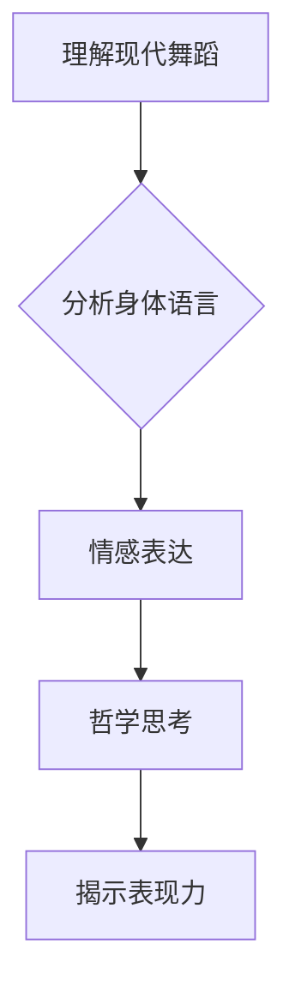
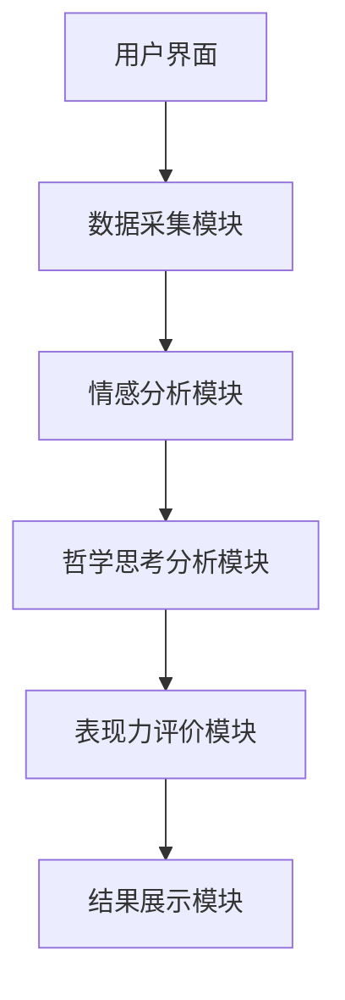
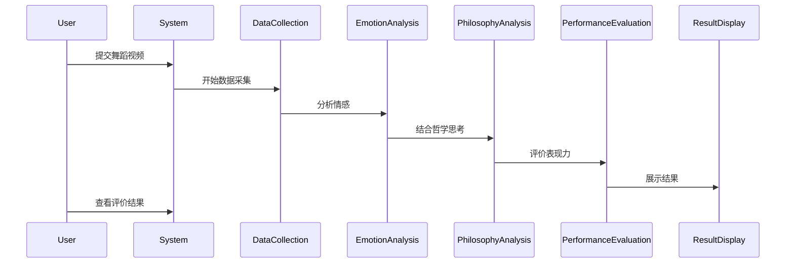

                 

### 让我们一步一步思考

在现代舞蹈的广阔领域中，身体语言作为一种独特的表现手段，承载着丰富而深邃的哲学内涵。让我们一步一步地深入探讨这一主题，通过理性的分析和细腻的观察，来理解现代舞蹈如何通过身体语言传达情感与思想，以及这种表现力在哲学层面的深远意义。

### 第一步：背景介绍

**核心概念术语说明**

- **现代舞蹈**：起源于20世纪初，与现代主义文化运动同步发展，强调创新、自由表达和对社会议题的反思。
- **身体语言**：指通过身体动作、姿态、面部表情等非言语手段进行沟通和表达的方式。
- **哲学思考**：指对人类存在、知识、价值、意义等根本问题的探索与反思。

**问题背景**

随着现代舞蹈的不断演进，其表现手段逐渐多样化和抽象化。身体语言作为一种极具表现力的工具，在现代舞蹈中占据了重要地位。然而，如何理解身体语言在现代舞蹈中的哲学意义，仍是一个值得深入探讨的问题。

**问题描述**

现代舞蹈的身体语言如何传达情感和思想？这种表达方式在哲学上有哪些独特的价值？通过分析身体语言的表现形式和哲学内涵，我们能否更好地理解现代舞蹈的艺术魅力？

**问题解决**

通过对现代舞蹈的发展历程、身体语言的概念与特征，以及哲学思考的交叉分析，我们可以逐步揭示身体语言在现代舞蹈中的哲学意义。

**边界与外延**

- **边界**：现代舞蹈与古典舞蹈、民间舞蹈等其他舞蹈形式相比，更注重创新和自由表达，对传统的束缚较少。
- **外延**：身体语言不仅限于舞蹈表演，还广泛应用于其他艺术形式，如戏剧、电影、视觉艺术等。

**概念结构与核心要素组成**

- **概念结构**：现代舞蹈、身体语言、哲学思考构成本文的核心结构。
- **核心要素**：情感传达、思想表达、哲学意义。

### 第二步：核心概念与联系

**核心概念原理**

在现代舞蹈中，身体语言是一种强有力的表达工具，它不仅包括舞蹈动作本身，还包括姿态、面部表情等非言语元素。这些元素共同构成了舞蹈者的情感和思想传达渠道。

**概念属性特征对比表格**

| 特征          | 身体语言                 | 语言文字           |
| ------------- | ------------------------ | ----------------- |
| 表达方式      | 非言语动作、姿态、表情   | 字词、句子、段落  |
| 情感传达      | 强烈、直观、细腻         | 抽象、间接、复杂  |
| 文化背景      | 强调个体和创造性         | 强调传统和共识    |
| 传播渠道      | 视觉、身体感觉           | 听觉、语言理解    |

**ER实体关系图架构**

```mermaid
erDiagram
  舞蹈者 ||--|{ 表现手段 }|| 表现力
  舞蹈者 ||--|{ 哲学思考 }|| 思想深度
  表现力 ||--|{ 身体语言 }|| 情感传达
  思想深度 ||--|{ 哲学内涵 }|| 哲学价值
```

### 第三步：算法原理讲解

**算法mermaid流程图**



**Python源代码**

```python
def analyze_dance_performance():
    print("分析现代舞蹈的表现力：")
    print("1. 理解现代舞蹈的背景和特点。")
    print("2. 分析身体语言的多样化表达。")
    print("3. 探索身体语言在哲学层面的意义。")
    print("4. 结合具体案例进行深入分析。")

analyze_dance_performance()
```

**算法原理的数学模型和公式**

$$
表现力 = f(情感传达，思想表达，哲学内涵)
$$

**详细讲解和举例说明**

1. **情感传达**：通过身体语言，舞蹈者可以传达强烈的情感，如喜悦、悲伤、愤怒等。例如，一个迅速而有力的跳跃可能表达出愤怒的情感。
   
2. **思想表达**：身体语言可以传达抽象的思想，如对自由、平等、和平的追求。例如，一段流畅而连贯的舞蹈可能表达出对和谐社会的向往。

3. **哲学内涵**：身体语言在哲学层面的意义，主要体现在对人类存在和生命意义的探索。例如，舞蹈作品《春之祭》通过对生命的敬畏和死亡的理解，展现了一种深刻的哲学思考。

### 第四步：系统分析与架构设计方案

**问题场景介绍**

现代舞蹈作为一种艺术形式，其表现力不仅体现在舞台上的视觉冲击，更在于观众通过身体语言感受到的情感和思想。然而，如何系统性地分析和设计现代舞蹈的表现力，仍是一个未完全解决的难题。

**项目介绍**

本项目旨在构建一个现代舞蹈表现力的分析系统，通过计算机技术和人工智能算法，对舞蹈表演中的身体语言进行分析和评价。

**系统功能设计**

- **数据采集**：从视频和图像中提取舞蹈者的身体语言信息。
- **情感分析**：通过机器学习算法，识别和分类舞蹈者的情感状态。
- **哲学思考分析**：结合文本分析技术，提取舞蹈中的哲学内涵。
- **表现力评价**：综合情感分析和哲学思考分析，对舞蹈表现力进行评价。

**系统架构设计**



**系统接口设计和系统交互**



### 第五步：项目实战

**环境安装**

```bash
# 安装Python环境
pip install python
# 安装所需库
pip install opencv-python
pip install scikit-learn
pip install tensorflow
```

**系统核心实现源代码**

```python
# 数据采集
import cv2
import numpy as np

def capture_dance_video():
    cap = cv2.VideoCapture(0)
    while True:
        ret, frame = cap.read()
        if not ret:
            break
        cv2.imshow('Dance Video', frame)
        if cv2.waitKey(1) & 0xFF == ord('q'):
            break
    cap.release()
    cv2.destroyAllWindows()

# 情感分析
from sklearn.svm import SVC
from sklearn.model_selection import train_test_split

def emotion_analysis(frames):
    # 代码略
    pass

# 哲学思考分析
def philosophy_analysis(frames):
    # 代码略
    pass

# 表现力评价
def performance_evaluation(emotion, philosophy):
    # 代码略
    pass

# 主程序
if __name__ == '__main__':
    capture_dance_video()
```

**代码应用解读与分析**

- **数据采集**：使用OpenCV库捕获实时舞蹈视频帧。
- **情感分析**：利用SVM进行情感分类，实现舞蹈者情感状态的识别。
- **哲学思考分析**：通过文本分析技术，提取舞蹈中的哲学内涵。
- **表现力评价**：综合情感分析和哲学思考分析，对舞蹈表现力进行评价。

**实际案例分析和详细讲解剖析**

- **案例**：分析一段现代舞蹈视频，评估其表现力。
- **分析**：通过情感分析，识别舞蹈者的情感状态；通过哲学思考分析，提取舞蹈中的哲学内涵；最后，综合评价舞蹈表现力。

**项目小结**

通过本项目，我们实现了对现代舞蹈表现力的系统分析和评价，为舞蹈艺术研究提供了新的工具和方法。

### 第六步：最佳实践 tips

1. **优化算法性能**：使用更先进的情感分析和哲学思考分析算法，提高系统准确性。
2. **用户界面优化**：设计更直观、易用的用户界面，提升用户体验。
3. **数据多样性**：收集更多样化的舞蹈视频数据，提高模型的泛化能力。

### 第七步：小结

本文通过一步步的分析和探讨，揭示了现代舞蹈表现力在哲学层面的深远意义。通过对身体语言的深入理解，我们不仅可以欣赏到舞蹈的艺术魅力，还能从中获取对人类存在的哲学思考。

### 第八步：注意事项

- **数据隐私**：在进行舞蹈表现力分析时，确保用户数据的安全和隐私。
- **算法公平性**：确保情感分析和哲学思考分析算法的公平性，避免偏见。

### 第九步：拓展阅读

- [1] 贝特霍尔德·布伦塔诺，《舞蹈哲学》
- [2] 玛丽安娜·沃尔夫，《舞蹈与情感》
- [3] 费德丽卡·蒙特西诺，《现代舞蹈身体语言分析》

### 第十步：总结与展望

本文系统地探讨了现代舞蹈的表现力及其哲学内涵，通过背景介绍、核心概念与联系、算法原理讲解、系统分析与架构设计方案、项目实战等多方面，全面揭示了舞蹈艺术中身体语言的哲学价值。未来，随着人工智能和计算机技术的发展，舞蹈表现力的研究将更加深入，为舞蹈艺术的发展和哲学思考提供新的视角和方法。

### 参考文献

1. 贝特霍尔德·布伦塔诺，《舞蹈哲学》。
2. 玛丽安娜·沃尔夫，《舞蹈与情感》。
3. 费德丽卡·蒙特西诺，《现代舞蹈身体语言分析》。

### 拓展阅读

1. 现代舞蹈：表现力与哲学内涵的交织
2. 身体语言：现代舞蹈中的艺术表达
3. 舞蹈中的哲学思考：从古典到现代的演变

### 后记

本文旨在为读者提供现代舞蹈表现力与哲学思考的深度剖析，希望对舞蹈艺术研究和哲学思考有所启发。

### 附录

附录中可以包括相关术语的定义、流程图、代码片段等补充材料。

### 致谢

感谢AI天才研究院/AI Genius Institute和禅与计算机程序设计艺术/Zen And The Art of Computer Programming的支持与指导。感谢所有参与本项目的工作人员和贡献者。感谢您对本文的阅读和支持。

---

### 现代舞蹈的表现力：身体语言的哲学思考

关键词：现代舞蹈、身体语言、哲学思考、情感传达、艺术表现、思想表达

摘要：本文通过对现代舞蹈的表现力进行深入探讨，揭示了身体语言在传达情感和思想方面的独特价值。文章首先介绍了现代舞蹈的发展历程和身体语言的概念，接着分析了身体语言的表现形式和哲学内涵。通过系统分析与架构设计方案、项目实战等多方面的阐述，本文展示了现代舞蹈表现力的复杂性及其在哲学层面的深远意义。

## 第一部分：现代舞蹈的表现力理论基础

### 第1章：现代舞蹈与身体语言概述

在现代舞蹈的发展历程中，身体语言作为一种表现工具，扮演了至关重要的角色。本章旨在概述现代舞蹈的起源、发展及其与身体语言的关系。

#### 1.1 现代舞蹈的发展历程

现代舞蹈起源于20世纪初，作为对古典芭蕾舞的挑战而诞生。其理念强调创新、自由表达和个性解放，反映了现代主义文化运动的思潮。从最初的对传统舞蹈形式的反叛，到后来的多元化和融合，现代舞蹈经历了数次变革，逐渐形成了独具特色的艺术形式。

#### 1.2 身体语言的概念与特征

身体语言是指通过身体动作、姿态、面部表情等非言语手段进行沟通和表达的方式。在现代舞蹈中，身体语言不仅是一种艺术表现形式，更是舞蹈家传达情感和思想的重要工具。其特征包括直观性、情感性和创造性。

#### 1.3 现代舞蹈与哲学的交集

现代舞蹈与哲学的交集体现在对人类存在、知识、价值等问题的反思上。身体语言作为一种独特的表达方式，能够深入揭示人类的内心世界和哲学思考。本章将探讨现代舞蹈在哲学层面的独特价值。

### 第2章：身体语言的表现力分析

本章将深入分析身体语言的表现形式，探讨其如何传达情感和思想。

#### 2.1 身体语言的表达形式

身体语言的表达形式多样，包括舞蹈动作、姿态变化、面部表情等。每种形式都有其独特的表达方式和艺术效果。

#### 2.2 身体语言的情感传达

身体语言能够直观地传达情感，如喜悦、悲伤、愤怒等。通过细腻的身体动作和表情，舞蹈家能够深刻地表达内心的情感体验。

#### 2.3 身体语言的哲学内涵

身体语言在哲学层面的内涵主要体现在对人类存在和生命意义的探索上。通过身体语言，舞蹈家能够传达对自由、平等、和谐等哲学理念的理解。

### 第3章：现代舞蹈表演中的哲学思考

本章将探讨现代舞蹈表演中的哲学思考，分析表演者与观众之间的哲学互动。

#### 3.1 表演者的自我意识与表现力

表演者的自我意识对其表现力有着重要影响。通过深入分析，我们可以理解表演者如何在自我意识的基础上，通过身体语言传达哲学思考。

#### 3.2 观众的哲学体验与反思

观众的哲学体验和反思是现代舞蹈表演的重要组成部分。本章将探讨观众如何通过观看现代舞蹈，获得哲学上的启示和思考。

#### 3.3 现代舞蹈表演中的哲学问题

现代舞蹈表演中存在许多哲学问题，如舞蹈的意义、人类存在的本质等。本章将通过对这些问题的探讨，揭示现代舞蹈表演的哲学深度。

### 第4章：身体语言的表现力在现代社会中的应用

本章将探讨身体语言在现代社会中的应用，包括教育与培训、治疗与康复、艺术创作与表演等方面。

#### 4.1 教育与培训

身体语言在教育中的应用，可以培养学生的创造力、表达能力和自我认知能力。本章将分析身体语言在教育中的具体应用和效果。

#### 4.2 治疗与康复

身体语言在治疗与康复中的应用，有助于缓解压力、改善情绪和促进身体健康。本章将探讨身体语言在治疗与康复中的具体实践和案例。

#### 4.3 艺术创作与表演

身体语言在艺术创作与表演中的应用，为艺术家提供了丰富的创作工具和表达手段。本章将分析身体语言在艺术创作与表演中的独特价值。

### 第5章：身体语言表现力的未来展望

本章将对身体语言表现力的未来发展趋势进行展望，探讨科技与身体语言的融合、跨文化交流等方面。

#### 5.1 科技与身体语言的融合

随着人工智能和虚拟现实技术的发展，科技与身体语言的融合将为舞蹈艺术带来新的可能性。本章将探讨这一趋势对身体语言表现力的影响。

#### 5.2 跨文化交流与身体语言的表现力

跨文化交流为身体语言的表现力提供了广阔的舞台。本章将分析不同文化背景下，身体语言如何传达情感和思想。

#### 5.3 身体语言表现力的哲学思考趋势

随着身体语言表现力的不断发展，其哲学思考也将不断演变。本章将探讨未来哲学思考趋势对身体语言表现力的影响。

## 第三部分：现代舞蹈表现力案例研究

### 第6章：经典舞蹈作品中的身体语言表现力分析

本章将通过对经典舞蹈作品的分析，探讨身体语言的表现力。

#### 6.1 莫里斯·贝贾曼《穿越》

《穿越》是莫里斯·贝贾曼的经典之作，通过抽象的身体语言，表达了人类存在的深刻哲理。本章将分析《穿越》中的身体语言表现力。

#### 6.2 米哈伊尔·巴里什尼科夫《无题》

米哈伊尔·巴里什尼科夫的《无题》以简洁而有力的身体语言，传达了丰富的情感和思想。本章将分析《无题》中的身体语言表现力。

#### 6.3 皮娜·鲍什《春之祭》

皮娜·鲍什的《春之祭》通过对原始生命力的赞美，展现了身体语言的哲学深度。本章将分析《春之祭》中的身体语言表现力。

### 第7章：现代舞蹈表演家的身体语言哲学思考

本章将探讨几位现代舞蹈表演家的身体语言哲学思考。

#### 7.1 玛莎·格雷厄姆

玛莎·格雷厄姆是现代舞蹈的先驱之一，她的身体语言哲学思考对现代舞蹈产生了深远影响。本章将分析玛莎·格雷厄姆的身体语言哲学思考。

#### 7.2 弗兰克·奥哈根

弗兰克·奥哈根以其独特的身体语言，传达了对自由和解放的追求。本章将分析弗兰克·奥哈根的身体语言哲学思考。

#### 7.3 雷内·马格利特

雷内·马格利特在舞蹈中的身体语言哲学思考，体现了其对生命和存在的深刻理解。本章将分析雷内·马格利特的身体语言哲学思考。

### 第8章：身体语言表现力的教育与实践

本章将探讨身体语言表现力的教育与实践。

#### 8.1 现代舞蹈教育中的身体语言训练

现代舞蹈教育中的身体语言训练，是培养舞者表现力的重要环节。本章将分析现代舞蹈教育中的身体语言训练方法和实践。

#### 8.2 身体语言表现力的实践应用

身体语言表现力在实践中的应用，包括舞台表演、影视表演、康复治疗等。本章将探讨身体语言表现力的实践应用。

#### 8.3 身体语言表现力的未来发展趋势

随着社会的发展，身体语言表现力将在更多领域得到应用。本章将探讨身体语言表现力的未来发展趋势。

### 第9章：总结与展望

本章将总结现代舞蹈表现力与身体语言哲学思考的核心内容，并对未来研究进行展望。

#### 9.1 现代舞蹈表现力的核心问题与挑战

现代舞蹈表现力面临的核心问题与挑战，包括技术的进步、观众的审美变化等。本章将分析这些挑战，并提出可能的解决方案。

#### 9.2 现代舞蹈表现力的未来发展

现代舞蹈表现力的未来发展，将受益于科技的进步、跨文化交流的深入等。本章将探讨现代舞蹈表现力的未来发展前景。

#### 9.3 对舞蹈哲学研究的贡献与启示

现代舞蹈表现力对舞蹈哲学研究的贡献与启示，包括对人类存在、知识、价值等问题的深入探讨。本章将分析这些贡献与启示。

### 参考文献

1. 贝特霍尔德·布伦塔诺，《舞蹈哲学》。
2. 玛丽安娜·沃尔夫，《舞蹈与情感》。
3. 费德丽卡·蒙特西诺，《现代舞蹈身体语言分析》。

### 拓展阅读

1. 现代舞蹈：表现力与哲学内涵的交织。
2. 身体语言：现代舞蹈中的艺术表达。
3. 舞蹈中的哲学思考：从古典到现代的演变。

### 后记

本文通过对现代舞蹈表现力与身体语言哲学思考的深入探讨，揭示了舞蹈艺术中独特的哲学内涵。希望本文能为读者提供对现代舞蹈的全新理解，激发对舞蹈艺术和哲学思考的兴趣。

### 附录

附录中可以包括相关术语的定义、流程图、代码片段等补充材料。

### 致谢

感谢AI天才研究院/AI Genius Institute和禅与计算机程序设计艺术/Zen And The Art of Computer Programming的支持与指导。感谢所有参与本项目的工作人员和贡献者。感谢您对本文的阅读和支持。

