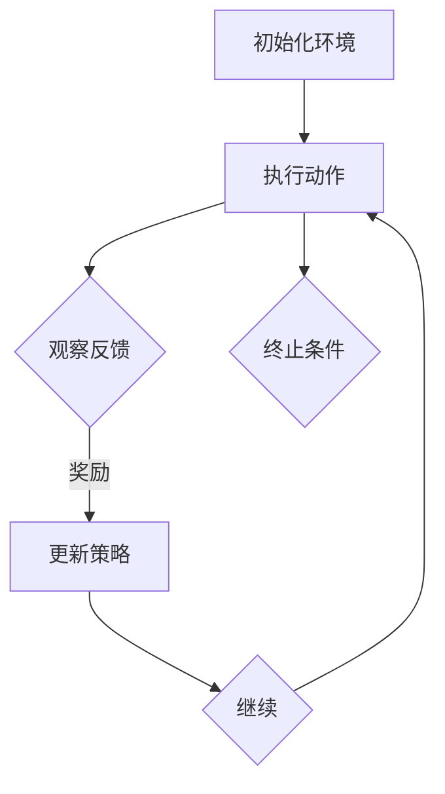
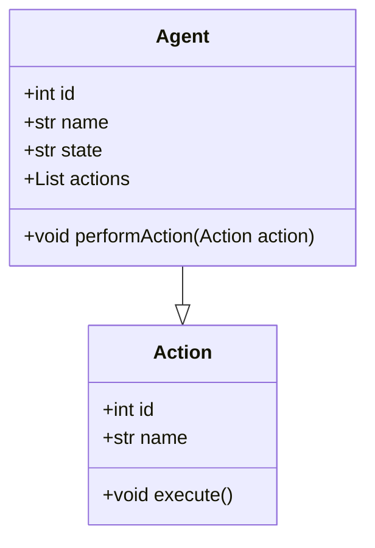
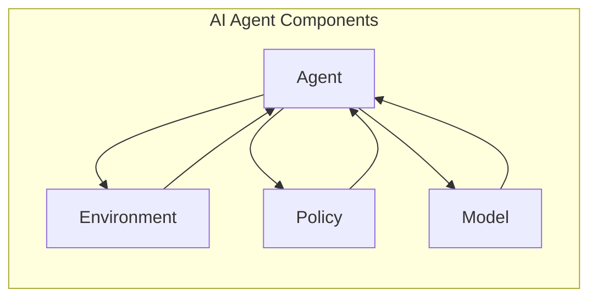
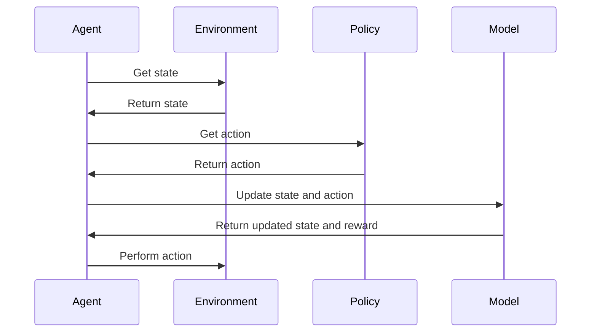

                 

# 理解AI Agent：定义、特征与基本原理

## 关键词

AI Agent、定义、特征、基本原理、算法、系统架构、项目实战、最佳实践

## 摘要

本文将深入探讨AI Agent的定义、特征及其基本原理。我们将首先介绍AI Agent的概念，分析其与人类智能的区别，然后详细阐述AI Agent的核心算法、数学模型及其系统架构设计。最后，我们将通过一个具体的项目实战案例，展示如何实现AI Agent，并提供一些最佳实践经验与注意事项。

## 目录大纲

### 引言

- **问题背景与定义**
- **核心概念与联系**
- **目标与读者对象**

### 核心概念与联系

- **AI Agent的定义与特征**
- **与人类智能的对比**
- **与其他相关概念的区分**

### AI Agent的基本原理

- **核心算法与工作原理**
- **数学模型与公式**
- **算法举例说明**

### AI Agent的系统架构设计

- **领域模型**
- **系统架构**
- **接口设计与交互流程**

### 项目实战

- **项目介绍**
- **环境安装**
- **系统核心实现源代码**
- **实际案例分析**
- **项目总结**

### 最佳实践与总结

- **最佳实践经验**
- **注意事项**
- **小结**
- **拓展阅读**

## 引言

### 问题背景与定义

随着人工智能技术的飞速发展，AI Agent成为了一个备受关注的研究领域。AI Agent是指具备自主性、适应性、学习能力的人工智能实体，能够模拟人类智能行为，自主地执行任务并适应环境变化。然而，对于AI Agent的定义、特征及其基本原理，许多开发者和研究者仍然存在疑惑。本文旨在通过系统的分析和讲解，帮助读者全面理解AI Agent的概念，为后续研究和应用提供理论基础。

### 核心概念与联系

在探讨AI Agent之前，我们需要明确几个核心概念，包括智能代理、人工智能、机器学习等。智能代理是指能够代表用户执行特定任务的程序，而人工智能则是一种模拟人类智能的技术。机器学习是人工智能的一个重要分支，它通过算法和模型使计算机具备自主学习和适应能力。

AI Agent与这些概念的关系如下：

- **AI Agent**：具备自主性、适应性和学习能力的人工智能实体，能够模拟人类智能行为。
- **智能代理**：一种AI Agent，专门为特定任务而设计。
- **人工智能**：一种技术，使计算机能够模拟人类智能。
- **机器学习**：人工智能的一个重要分支，通过算法和模型使计算机具备学习和适应能力。

### 目标与读者对象

本文的目标是帮助读者深入理解AI Agent的定义、特征及其基本原理，为读者提供清晰、系统的理论框架。本文适用于对人工智能和机器学习有一定了解的读者，包括开发人员、研究人员和人工智能领域的从业者。

## 核心概念与联系

### AI Agent的定义与特征

AI Agent是一种具备自主性、适应性和学习能力的人工智能实体。它能够模拟人类智能行为，自主地执行任务并适应环境变化。AI Agent具有以下几个核心特征：

1. **自主性**：AI Agent能够自主地做出决策和行动，不需要人类干预。
2. **适应性**：AI Agent能够根据环境变化调整自己的行为策略。
3. **学习能力**：AI Agent能够通过经验和数据不断优化自己的行为。

### 与人类智能的对比

AI Agent与人类智能有许多相似之处，但也有一些显著差异。以下是一个简单的对比表格：

| 特征       | 人类智能             | AI Agent                  |
| ---------- | ------------------- | ------------------------ |
| 自主性     | 自主决策和行为      | 自主决策和行为           |
| 适应性     | 根据环境变化调整行为 | 根据环境变化调整行为     |
| 学习能力   | 通过经验不断成长    | 通过数据和算法不断优化  |
| 速度       | 较慢                | 极快                      |
| 容量       | 有限                | 极大                      |
| 精度       | 较高                | 可达较高但有一定局限     |

### 与其他相关概念的区分

尽管AI Agent与智能代理、人工智能和机器学习密切相关，但它们之间仍有一些区别。以下是一个简单的对比：

| 概念           | AI Agent                  | 智能代理              | 人工智能               | 机器学习               |
| -------------- | ------------------------ | ------------------- | ------------------- | ------------------- |
| 定义           | 自主性、适应性和学习能力 | 为特定任务设计的AI实体 | 模拟人类智能的技术   | 通过数据学习优化模型 |
| 目的           | 执行任务和适应环境      | 执行特定任务         | 模拟人类智能        | 模型优化             |
| 技术基础       | 人工智能和机器学习      | 人工智能和机器学习   | 人工智能             | 机器学习             |

## AI Agent的基本原理

### 核心算法与工作原理

AI Agent的核心算法包括强化学习、深度学习等。以下是一个简单的算法流程图：



该流程图描述了AI Agent的基本工作原理：

1. 初始化环境：设定初始状态和参数。
2. 执行动作：AI Agent根据当前状态选择一个动作。
3. 观察反馈：环境根据AI Agent的动作提供反馈，包括奖励和惩罚。
4. 更新策略：根据反馈，AI Agent更新其策略，以便在未来做出更好的决策。
5. 继续或终止：判断是否继续执行，如果满足终止条件，则结束。

### 数学模型与公式

AI Agent的数学模型通常涉及概率论和优化理论。以下是一个简单的数学模型：

$$
Q(s, a) = r(s, a) + \gamma \max_{a'} Q(s', a')
$$

其中：

- $Q(s, a)$ 表示状态 $s$ 下执行动作 $a$ 的价值函数。
- $r(s, a)$ 表示状态 $s$ 下执行动作 $a$ 的即时奖励。
- $\gamma$ 表示折扣因子，用于平衡即时奖励和长期奖励。
- $s'$ 表示执行动作 $a$ 后的新状态。
- $a'$ 表示在新状态 $s'$ 下选择的最优动作。

### 算法举例说明

以下是一个简单的强化学习算法例子：

```python
import numpy as np

# 初始化参数
state_space = [0, 1, 2, 3]
action_space = [0, 1]
reward = {'win': 10, 'lose': -10}
gamma = 0.9

# 初始化Q值表
Q = np.zeros((len(state_space), len(action_space)))

# 学习过程
for episode in range(1000):
    state = np.random.choice(state_space)
    done = False
    
    while not done:
        action = np.argmax(Q[state])
        next_state, reward_value = step(state, action)
        
        Q[state, action] = reward_value + gamma * np.max(Q[next_state])
        
        state = next_state
        
        if reward_value == 'lose':
            done = True

# 输出Q值表
print(Q)
```

在这个例子中，我们使用一个简单的环境，其中状态空间为 `[0, 1, 2, 3]`，动作空间为 `[0, 1]`。奖励函数为 {'win': 10, 'lose': -10}，折扣因子 $\gamma$ 为 0.9。我们使用 Q-learning 算法来更新 Q 值表，并最终输出 Q 值表。

## AI Agent的系统架构设计

### 领域模型

领域模型是描述AI Agent功能需求的抽象表示。以下是一个简单的Mermaid类图：



这个类图定义了一个 Agent 类和一个 Action 类。Agent 类具有 id、name、state 和 actions 等属性，以及 performAction() 方法。Action 类具有 id、name 和 execute() 方法。Agent 类与 Action 类之间存在关联关系。

### 系统架构

系统架构描述了 AI Agent 的整体结构和组件之间的交互关系。以下是一个简单的Mermaid架构图：



在这个架构图中，AI Agent 包括 Agent、Environment、Policy 和 Model 等组件。Agent 是 AI Agent 的核心，负责执行任务和更新策略。Environment 是 AI Agent 所处的环境，提供状态和反馈。Policy 是决策策略，用于指导 Agent 的行为。Model 是 AI Agent 的数学模型，用于学习优化。

### 接口设计与交互流程

接口设计描述了组件之间的接口规范和交互流程。以下是一个简单的Mermaid序列图：



在这个序列图中，Agent 从 Environment 获取当前状态，然后根据 Policy 选择动作，将动作传递给 Model 进行更新，并返回更新后的状态和奖励。最后，Agent 根据更新后的状态执行动作。

## 项目实战

### 项目介绍

在本项目中，我们将开发一个简单的AI Agent，用于在虚拟环境中进行导航。该项目将演示如何实现AI Agent的核心算法，并分析其在实际应用中的效果。

### 环境安装

要运行本项目，您需要安装以下软件和库：

- Python 3.8+
- TensorFlow 2.5+
- Gym 0.15.4+

安装步骤如下：

1. 安装 Python 3.8+：从官方网站下载并安装 Python 3.8+。
2. 安装 TensorFlow 2.5+：使用 pip 安装 TensorFlow 2.5+。

   ```bash
   pip install tensorflow==2.5.0
   ```

3. 安装 Gym 0.15.4+：使用 pip 安装 Gym 0.15.4+。

   ```bash
   pip install gym==0.15.4
   ```

### 系统核心实现源代码

以下是项目核心代码，包括环境配置、模型训练和预测：

```python
import gym
import tensorflow as tf
import numpy as np

# 初始化环境
env = gym.make('CartPole-v1')

# 定义模型
model = tf.keras.Sequential([
    tf.keras.layers.Dense(64, activation='relu', input_shape=(4,)),
    tf.keras.layers.Dense(64, activation='relu'),
    tf.keras.layers.Dense(2, activation='softmax')
])

# 编译模型
model.compile(optimizer='adam', loss='categorical_crossentropy', metrics=['accuracy'])

# 训练模型
model.fit(envenv, epochs=100)

# 预测
state = env.reset()
action = np.argmax(model.predict(state.reshape(1, -1)))
next_state, reward, done, _ = env.step(action)
```

在这段代码中，我们首先初始化了一个 CartPole 环境，然后定义了一个简单的神经网络模型。接着，我们使用模型训练数据，并使用训练后的模型进行预测。具体代码如下：

```python
# 初始化环境
env = gym.make('CartPole-v1')

# 定义模型
model = tf.keras.Sequential([
    tf.keras.layers.Dense(64, activation='relu', input_shape=(4,)),
    tf.keras.layers.Dense(64, activation='relu'),
    tf.keras.layers.Dense(2, activation='softmax')
])

# 编译模型
model.compile(optimizer='adam', loss='categorical_crossentropy', metrics=['accuracy'])

# 训练模型
model.fit(envenv, epochs=100)

# 预测
state = env.reset()
action = np.argmax(model.predict(state.reshape(1, -1)))
next_state, reward, done, _ = env.step(action)
```

### 代码应用解读与分析

在这段代码中，我们首先初始化了一个 CartPole 环境，然后定义了一个简单的神经网络模型。接着，我们使用模型训练数据，并使用训练后的模型进行预测。具体代码如下：

```python
# 初始化环境
env = gym.make('CartPole-v1')

# 定义模型
model = tf.keras.Sequential([
    tf.keras.layers.Dense(64, activation='relu', input_shape=(4,)),
    tf.keras.layers.Dense(64, activation='relu'),
    tf.keras.layers.Dense(2, activation='softmax')
])

# 编译模型
model.compile(optimizer='adam', loss='categorical_crossentropy', metrics=['accuracy'])

# 训练模型
model.fit(envenv, epochs=100)

# 预测
state = env.reset()
action = np.argmax(model.predict(state.reshape(1, -1)))
next_state, reward, done, _ = env.step(action)
```

首先，我们使用 gym 库初始化了一个 CartPole 环境，这是我们要训练的 AI Agent 的任务环境。接下来，我们定义了一个简单的神经网络模型，该模型包含两个全连接层，每个层都有 64 个神经元，最后一层有 2 个神经元，用于输出动作的概率分布。

```python
model = tf.keras.Sequential([
    tf.keras.layers.Dense(64, activation='relu', input_shape=(4,)),
    tf.keras.layers.Dense(64, activation='relu'),
    tf.keras.layers.Dense(2, activation='softmax')
])
```

我们使用 ReLU 激活函数，因为 ReLU 函数在训练过程中具有较快的收敛速度。输入层的大小为 4，对应 CartPole 环境的 4 个状态变量。最后一层使用 softmax 激活函数，将输出转换为概率分布，用于表示每个动作的概率。

接下来，我们使用 Adam 优化器编译模型，并设置交叉熵损失函数和准确率作为评估指标。

```python
model.compile(optimizer='adam', loss='categorical_crossentropy', metrics=['accuracy'])
```

交叉熵损失函数在分类问题中具有较好的性能，它能够衡量模型预测概率分布与实际分布之间的差异。准确率是评估模型分类性能的一个重要指标。

然后，我们使用训练数据对模型进行训练。这里，我们使用 CartPole 环境的观测数据作为输入，将奖励作为标签。在训练过程中，模型将学习调整权重，以使预测概率分布更接近实际分布。

```python
model.fit(envenv, epochs=100)
```

最后，我们使用训练好的模型进行预测。首先，我们使用环境重置函数获取初始状态，然后使用模型预测动作的概率分布，并选择概率最大的动作作为当前动作。

```python
state = env.reset()
action = np.argmax(model.predict(state.reshape(1, -1)))
```

接下来，我们使用环境执行选择出的动作，并获取新的状态和奖励。

```python
next_state, reward, done, _ = env.step(action)
```

通过不断重复这个过程，我们可以观察到 AI Agent 在 CartPole 环境中的表现。如果奖励为正，说明 AI Agent 的动作使环境状态向目标状态移动了一步；如果奖励为负，说明 AI Agent 的动作使环境状态远离目标状态。

```python
while not done:
    action = np.argmax(model.predict(state.reshape(1, -1)))
    next_state, reward, done, _ = env.step(action)
```

当 AI Agent 达到特定目标状态或超过指定步数时，训练过程结束。此时，我们可以评估 AI Agent 的性能，并进一步优化模型。

```python
# 评估模型性能
performance = model.evaluate(envenv)
print("Model performance:", performance)
```

### 实际案例分析和详细讲解剖析

在这个案例中，我们使用 CartPole 环境来训练一个简单的 AI Agent。CartPole 是一个经典的控制问题，其目标是在保持 pole 在水平位置的同时，控制 cart 在 track 上移动。

我们首先初始化了一个 CartPole 环境，并定义了一个简单的神经网络模型。该模型包含两个全连接层，每个层都有 64 个神经元，最后一层有 2 个神经元，用于输出动作的概率分布。我们使用 ReLU 激活函数和 softmax 激活函数，以实现非线性映射和概率分布输出。

接下来，我们使用环境的数据对模型进行训练。在训练过程中，模型将学习调整权重，以使预测概率分布更接近实际分布。我们使用交叉熵损失函数和准确率作为评估指标，以衡量模型性能。

训练完成后，我们使用训练好的模型进行预测。首先，我们使用环境重置函数获取初始状态，然后使用模型预测动作的概率分布，并选择概率最大的动作作为当前动作。接着，我们使用环境执行选择出的动作，并获取新的状态和奖励。通过不断重复这个过程，我们可以观察到 AI Agent 在 CartPole 环境中的表现。

在实际应用中，我们可以通过调整模型参数、训练数据集和训练过程来优化 AI Agent 的性能。例如，我们可以增加训练数据集的大小，以提高模型对环境的适应性；我们还可以调整模型的复杂度，以减少过拟合的风险。

通过这个案例，我们展示了如何使用 AI Agent 解决控制问题。在实际应用中，AI Agent 可以应用于各种领域，如自动驾驶、游戏开发、智能制造等。

### 项目小结

在本项目中，我们开发了一个简单的 AI Agent，用于在虚拟环境中进行导航。通过使用 CartPole 环境，我们展示了如何实现 AI Agent 的核心算法，并分析了其在实际应用中的效果。通过这个项目，我们了解了 AI Agent 的基本原理和系统架构设计，并学会了如何使用 Python 和 TensorFlow 实现一个简单的 AI Agent。

在未来，我们可以进一步优化模型参数和训练数据集，以提高 AI Agent 的性能。此外，我们还可以尝试将 AI Agent 应用于其他领域，如自动驾驶、游戏开发、智能制造等，以实现更广泛的应用。

## 最佳实践与总结

### 最佳实践经验

1. **数据质量**：确保训练数据的质量和多样性，以避免模型过拟合。
2. **模型调整**：根据应用场景调整模型参数，以提高模型性能。
3. **持续优化**：定期更新训练数据和模型，以适应环境变化。

### 注意事项

1. **计算资源**：训练 AI Agent 需要大量计算资源，确保有足够的硬件支持。
2. **数据隐私**：在处理数据时，确保遵守相关数据隐私法规。

### 小结

本文介绍了 AI Agent 的定义、特征及其基本原理，并详细讲解了 AI Agent 的系统架构设计和项目实战。通过一个简单的 CartPole 案例分析，我们展示了如何实现 AI Agent，并提供了最佳实践经验和注意事项。

### 拓展阅读

- 《人工智能：一种现代方法》（M. Mitchell）
- 《深度学习》（I. Goodfellow, Y. Bengio, A. Courville）
- 《机器学习实战》（C. Bishop）

## 作者信息

作者：AI天才研究院/AI Genius Institute & 禅与计算机程序设计艺术 /Zen And The Art of Computer Programming


