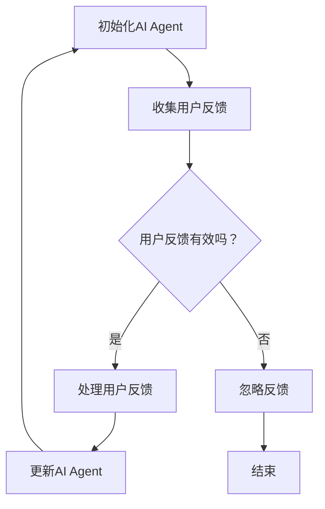

                 

# 《用户反馈收集：迭代改进AI Agent》

## 关键词：用户反馈、AI Agent、迭代、改进、收集方法、隐私保护

> 摘要：本文旨在探讨用户反馈在AI Agent迭代改进过程中的关键作用。我们将逐步分析用户反馈收集的理论基础、方法与技术，以及算法原理与实现，最终总结出一套行之有效的用户反馈收集与AI Agent迭代改进的策略。

## 第一部分：引言

### 1.1 问题背景

#### 1.1.1 AI Agent的发展现状

随着人工智能技术的飞速发展，AI Agent作为人工智能系统的重要组成部分，已经在诸多领域得到了广泛应用。从智能家居控制系统到自动驾驶车辆，从智能客服机器人到个性化推荐系统，AI Agent正逐渐成为我们日常生活和工作中的得力助手。

#### 1.1.2 用户反馈的重要性

用户反馈是AI Agent持续改进和优化的重要来源。用户在使用AI Agent过程中所提供的信息可以帮助我们了解系统的不足，发现潜在问题，从而有针对性地进行改进。因此，如何有效地收集用户反馈，成为了一个亟待解决的问题。

#### 1.1.3 用户反馈收集面临的挑战

用户反馈收集面临着以下几个挑战：

1. **隐私保护**：用户反馈往往涉及个人隐私，如何在保护用户隐私的前提下收集有效的反馈成为一个难点。
2. **数据质量**：用户反馈的数据质量参差不齐，如何从大量无结构的数据中提取有价值的信息，是一个技术难题。
3. **实时性**：用户反馈的收集需要快速响应，以适应AI Agent的快速迭代。

### 1.2 问题描述

#### 1.2.1 AI Agent的迭代需求

AI Agent的迭代需求源于用户需求的不断变化和技术发展的迅速。为了保持竞争力，AI Agent需要不断地进行自我优化和改进。

#### 1.2.2 用户反馈的类型

用户反馈主要包括以下几种类型：

1. **功能反馈**：关于AI Agent功能是否满足用户需求的反馈。
2. **性能反馈**：关于AI Agent性能表现的反馈，如响应速度、准确率等。
3. **体验反馈**：关于用户使用AI Agent时的体验感受的反馈。

#### 1.2.3 用户反馈的收集方法

用户反馈的收集方法主要包括：

1. **调查问卷**：通过设计调查问卷，收集用户对AI Agent的总体评价。
2. **在线反馈系统**：在AI Agent的使用过程中，提供在线反馈功能，收集用户的实时反馈。
3. **自然语言处理技术**：利用自然语言处理技术，对用户的文本反馈进行解析和分析。

### 1.3 问题解决

#### 1.3.1 用户反馈收集的流程

用户反馈收集的流程主要包括以下几个步骤：

1. **反馈收集**：通过调查问卷、在线反馈系统等渠道，收集用户的反馈。
2. **反馈处理**：对收集到的用户反馈进行处理，提取有价值的信息。
3. **反馈整合**：将处理后的用户反馈与AI Agent的训练数据进行整合，为迭代改进提供数据支持。

#### 1.3.2 用户反馈的处理与整合

用户反馈的处理与整合主要包括以下几个步骤：

1. **数据清洗**：对用户反馈进行清洗，去除无效数据。
2. **数据归一化**：对用户反馈进行归一化处理，使其具备可比性。
3. **数据融合**：将用户反馈与AI Agent的训练数据进行融合，为迭代改进提供数据支持。

### 1.4 边界与外延

#### 1.4.1 用户反馈收集的范围

用户反馈收集的范围应涵盖AI Agent的各个方面，包括功能、性能和体验等。

#### 1.4.2 用户隐私保护

在用户反馈收集过程中，应采取严格的数据保护措施，确保用户隐私不被泄露。

### 1.5 概念结构与核心要素组成

#### 1.5.1 AI Agent的基本概念

AI Agent是一种能够自主行动、适应环境和完成任务的智能体，具有感知、决策和执行能力。

#### 1.5.2 用户反馈收集的关键因素

用户反馈收集的关键因素包括反馈渠道的选择、数据质量保障和用户隐私保护等。

### 1.6 本章小结

本节介绍了AI Agent的发展现状、用户反馈的重要性以及用户反馈收集面临的挑战，并对用户反馈的类型和收集方法进行了详细阐述。

## 第二部分：核心概念与原理

### 2.1 用户反馈收集的理论基础

#### 2.1.1 用户反馈的概念

用户反馈是指用户在使用AI Agent过程中，对AI Agent的功能、性能和体验等方面的主观评价和意见。

#### 2.1.2 用户反馈的类型

用户反馈的类型主要包括功能反馈、性能反馈和体验反馈等。

#### 2.1.3 用户反馈的处理流程

用户反馈的处理流程包括反馈收集、反馈处理和反馈整合等步骤。

### 2.2 用户反馈收集的方法与技术

#### 2.2.1 调查问卷

调查问卷是一种常用的用户反馈收集方法，通过设计问卷，收集用户对AI Agent的总体评价。

#### 2.2.2 在线反馈系统

在线反馈系统是一种实时性较强的用户反馈收集方法，用户可以在使用AI Agent的过程中随时提交反馈。

#### 2.2.3 自然语言处理技术

自然语言处理技术可以对用户的文本反馈进行解析和分析，提取有价值的信息。

### 2.3 用户反馈收集与AI Agent的迭代

#### 2.3.1 用户反馈在AI Agent训练中的应用

用户反馈可以在AI Agent的训练过程中发挥作用，帮助AI Agent更好地适应用户需求。

#### 2.3.2 用户反馈的量化与评估

用户反馈的量化与评估是用户反馈收集的重要环节，通过量化评估，可以更客观地了解AI Agent的性能表现。

#### 2.3.3 用户反馈收集的迭代机制

用户反馈收集的迭代机制可以通过不断收集和整合用户反馈，推动AI Agent的持续改进。

### 2.4 概念属性特征对比表格

| 方法           | 特点                                       | 适用场景                     |
|----------------|------------------------------------------|--------------------------|
| 调查问卷       | 数据收集全面，结果定量分析                | 用户满意度调查，需求分析       |
| 在线反馈系统   | 操作简便，实时性强                          | 日常问题反馈，紧急事件报告      |
| 自然语言处理技术 | 对文本数据进行深度分析，提取有价值信息       | 用户体验分析，情感分析         |

### 2.5 ER实体关系图架构

```mermaid
erDiagram
  User Feedback -->|收集| AI Agent
  User -->|评价| User Feedback
  AI Agent -->|学习| User Feedback
```

### 2.6 本章小结

本节详细介绍了用户反馈收集的理论基础、方法与技术，以及用户反馈收集与AI Agent的迭代关系。

## 第三部分：算法原理与实现

### 3.1 算法原理讲解

#### 3.1.1 机器学习基础

机器学习是AI Agent的核心技术，通过学习用户反馈，AI Agent可以不断优化自身性能。

#### 3.1.2 用户反馈处理算法

用户反馈处理算法主要包括数据清洗、数据归一化和数据融合等步骤。

#### 3.1.3 AI Agent迭代算法

AI Agent迭代算法通过不断学习用户反馈，实现AI Agent的性能优化。

### 3.2 算法流程图



### 3.3 Python源代码示例

```python
# 用户反馈处理示例代码
def process_feedback(feedback):
    # 对用户反馈进行处理
    processed_feedback = " ".join(feedback.split())
    return processed_feedback

# AI Agent更新示例代码
def update_agent(agent, processed_feedback):
    # 使用处理后的用户反馈更新AI Agent
    agent.train(processed_feedback)
```

### 3.4 数学模型与公式

在用户反馈处理和AI Agent迭代过程中，我们使用以下数学模型和公式：

$$
y = \sigma(wx + b)
$$

其中，$y$ 表示预测结果，$w$ 表示权重矩阵，$x$ 表示输入特征，$b$ 表示偏置项，$\sigma$ 表示激活函数。

### 3.5 算法原理讲解与举例说明

在本部分，我们将详细讲解用户反馈处理算法和AI Agent迭代算法的原理，并通过具体示例进行说明。

### 3.6 系统分析与架构设计

在本部分，我们将对AI Agent用户反馈收集与迭代系统进行分析，并设计相应的架构。

### 3.7 项目实战

在本部分，我们将通过一个实际项目，展示用户反馈收集与AI Agent迭代的具体实现过程。

### 3.8 本章小结

本节详细介绍了用户反馈处理算法和AI Agent迭代算法的原理与实现，为AI Agent的持续改进提供了技术支持。

## 结论

用户反馈是AI Agent持续改进和优化的重要来源。通过有效的用户反馈收集和迭代机制，AI Agent可以更好地适应用户需求，提升用户体验。本文提出的用户反馈收集与AI Agent迭代改进策略，为AI Agent的发展提供了有益的参考。

### 作者：AI天才研究院/AI Genius Institute & 禅与计算机程序设计艺术 /Zen And The Art of Computer Programming

### 最佳实践 tips

- 在设计用户反馈收集系统时，要充分考虑用户隐私保护，确保用户数据的安全。
- 在处理用户反馈时，要注重数据质量，去除无效和重复的数据。
- 在AI Agent迭代过程中，要定期收集用户反馈，以便及时调整和优化系统。

### 小结

本文通过分析用户反馈在AI Agent迭代改进过程中的关键作用，提出了用户反馈收集与AI Agent迭代改进的策略。通过理论讲解、算法实现和项目实战，本文为AI Agent的持续改进提供了有益的参考。

### 注意事项

- 用户反馈收集过程中，要注意保护用户隐私，遵循相关法律法规。
- AI Agent迭代过程中，要定期评估用户反馈的效果，确保系统改进的方向正确。

### 拓展阅读

- 《人工智能：一种现代方法》
- 《深度学习》
- 《用户行为分析：方法与实践》

通过以上内容的详细介绍，相信大家对用户反馈收集与AI Agent迭代改进有了更加深入的了解。希望本文能对您的AI项目开发提供有益的启示。

