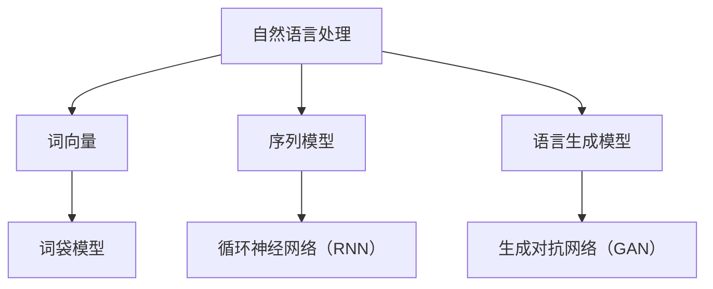
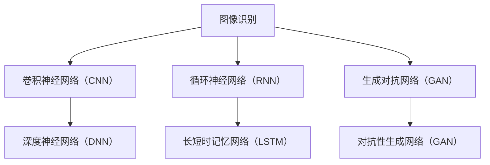
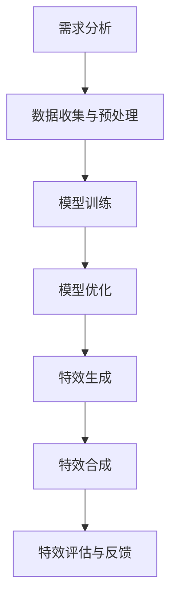

                 

# 电影制作中的AI Agent特效生成

## 关键词

- 电影特效
- AI Agent
- 数据处理
- 深度学习
- 神经网络
- 特效生成

## 摘要

本文将探讨电影制作中AI Agent特效生成的应用与发展。首先，我们将回顾电影特效的起源与发展历程，然后深入探讨AI与特效制作的结合，以及AI Agent在特效制作中的优势。接着，我们将详细介绍AI Agent特效生成的核心技术，包括数据处理、深度学习与神经网络、自然语言处理与图像识别等。随后，我们将分析AI Agent特效生成的流程，并分享实际案例。最后，我们将讨论AI Agent特效生成的挑战与未来趋势，并对电影制作行业产生的影响进行展望。

## 第一部分：背景与核心概念

### 第1章：电影特效的起源与发展

#### 1.1 电影特效的起源

电影特效作为一种电影制作手段，起源于20世纪初。早期的电影特效主要是通过物理手段实现的，如模型制作、人工绘画等。随着电影技术的发展，特效逐渐成为电影中不可或缺的一部分。

#### 1.2 电影特效的发展历程

电影特效的发展可以分为三个阶段：物理特效、传统数字特效和现代数字特效。

1. **物理特效**

物理特效主要依赖于物理模型、模型制作和摄影技术。在早期的电影制作中，特效主要通过模型制作和人工绘画实现。例如，在1927年的电影《大都会》中，导演弗里茨·朗利用巨大的机械模型和复杂的摄影技巧，创造出了令人叹为观止的科幻场景。

2. **传统数字特效**

随着计算机技术的发展，数字特效逐渐取代了物理特效。传统数字特效主要依靠计算机生成图像，如《指环王》中的特效场景，导演彼得·杰克逊利用计算机生成的图像，将中土世界的奇幻场景呈现在观众面前。

3. **现代数字特效**

现代数字特效结合了深度学习、人工智能等技术，可以实现更加逼真的效果。例如，电影《阿凡达》中的3D效果，导演詹姆斯·卡梅隆通过先进的数字技术，创造出了一个令人惊叹的虚拟世界。

#### 1.3 现代电影特效技术的崛起

现代电影特效技术的崛起主要得益于深度学习、人工智能等技术的发展。AI Agent作为一种智能化的特效生成工具，可以大大提高特效制作的效率和质量。AI Agent可以自动处理大量的数据，学习并生成高质量的特效。

### 第2章：AI与特效制作的结合

#### 2.1 AI Agent在特效制作中的应用

AI Agent在特效制作中的应用主要体现在以下几个方面：

1. **特效场景的自动生成**

AI Agent可以通过分析大量的场景数据，自动生成逼真的特效场景。例如，在电影《星球大战：原力觉醒》中，导演J·J·艾布拉姆斯利用AI Agent生成了一些复杂的特效场景，如太空战斗和星球爆炸。

2. **角色动作的实时生成**

AI Agent可以实时分析角色的动作，生成相应的特效。例如，在电影《速度与激情8》中，导演温子仁利用AI Agent实时生成角色的动作特效，使影片更加流畅和逼真。

3. **特效的智能优化与调整**

AI Agent可以根据导演的要求，智能调整特效的参数，实现更好的效果。例如，在电影《奇幻森林》中，导演珍妮弗·肯特利用AI Agent对特效进行优化和调整，使特效场景更加自然和生动。

#### 2.2 AI Agent的基本概念

AI Agent是指一种具有自主决策能力的智能体，可以在特定的环境中执行任务。在电影特效制作中，AI Agent可以看作是一个具有特效生成能力的智能系统。

#### 2.3 AI Agent在特效制作中的优势

AI Agent在特效制作中具有以下优势：

1. **高效性**

AI Agent可以快速处理大量的数据，生成高质量的特效。例如，在电影《银河护卫队》中，导演詹姆斯·冈恩利用AI Agent生成特效，大大提高了制作效率。

2. **灵活性**

AI Agent可以根据不同的需求，灵活调整特效的参数。例如，在电影《复仇者联盟：终局之战》中，导演安东尼·罗素和乔·罗素利用AI Agent调整特效，使影片效果更加出色。

3. **创造性**

AI Agent可以生成一些独特的特效，为电影制作带来更多的可能性。例如，在电影《疯狂动物城》中，导演拜恩·霍华德和贾里德·博尔特利用AI Agent生成特效，创造出了一个充满想象力的动物世界。

### 第3章：AI Agent特效生成的核心技术

#### 3.1 数据处理技术

数据处理技术是AI Agent特效生成的基础。AI Agent需要处理大量的图像、视频等数据，进行预处理、特征提取等操作。

1. **数据预处理**

数据预处理包括数据清洗、数据归一化、数据增强等步骤。数据清洗是指去除数据中的噪声和异常值；数据归一化是指将不同来源的数据进行统一处理；数据增强是指通过扩展数据集，提高模型的泛化能力。

2. **特征提取**

特征提取是指从原始数据中提取出有用的信息。在电影特效生成中，特征提取主要包括图像特征提取和视频特征提取。图像特征提取可以通过卷积神经网络（CNN）实现，视频特征提取可以通过循环神经网络（RNN）实现。

#### 3.2 深度学习与神经网络

深度学习与神经网络是AI Agent特效生成的重要技术。深度学习通过构建多层神经网络，实现对数据的层次化表示和抽象。神经网络通过学习大量的数据，可以自动提取特征并生成模型。

1. **卷积神经网络（CNN）**

卷积神经网络是一种用于图像处理和识别的神经网络。它通过卷积层、池化层和全连接层等结构，实现对图像的特征提取和分类。

2. **循环神经网络（RNN）**

循环神经网络是一种用于序列数据处理的神经网络。它通过隐藏状态和循环结构，实现对序列数据的记忆和建模。

#### 3.3 自然语言处理与图像识别

自然语言处理与图像识别是AI Agent特效生成的重要技术。自然语言处理通过学习语言模型，实现对文本的生成和理解；图像识别通过学习图像特征，实现对图像的分类和识别。

1. **语言模型**

语言模型是指用于生成文本的模型。它通过学习大量的文本数据，可以生成连贯、自然的文本。

2. **图像识别**

图像识别是指对图像进行分类和识别。它通过学习大量的图像数据，可以实现对图像的特征提取和分类。

## 第二部分：AI Agent特效生成的流程

### 第4章：AI Agent特效生成的流程

#### 4.1 特效需求分析

特效需求分析是指对电影特效进行需求分析，明确特效的目标、场景、角色等要素。特效需求分析是特效生成的第一步，它决定了特效生成的方向和目标。

#### 4.2 数据收集与预处理

数据收集与预处理是指收集与特效生成相关的数据，并进行预处理。数据收集主要包括图像、视频、文本等数据；预处理包括数据清洗、数据归一化、数据增强等步骤。

#### 4.3 模型训练与优化

模型训练与优化是指通过训练数据，训练出特效生成的模型，并对模型进行优化。模型训练主要包括卷积神经网络（CNN）、循环神经网络（RNN）等深度学习模型；优化包括模型参数调整、超参数调整等步骤。

#### 4.4 特效生成与应用

特效生成与应用是指通过训练好的模型，生成特效，并将其应用于电影制作中。特效生成主要包括图像生成、视频生成、文本生成等；应用包括特效场景生成、角色动作生成、特效优化与调整等。

## 第三部分：AI Agent特效生成的案例分析

### 第5章：AI Agent特效生成的案例分析

#### 5.1 案例一：特效场景的自动生成

案例一将探讨如何利用AI Agent自动生成特效场景。我们将介绍案例背景、数据收集与预处理、模型训练与优化、特效生成与应用等步骤，并分享案例中的实际效果。

#### 5.2 案例二：角色动作的实时生成

案例二将探讨如何利用AI Agent实时生成角色动作特效。我们将介绍案例背景、数据收集与预处理、模型训练与优化、特效生成与应用等步骤，并分享案例中的实际效果。

#### 5.3 案例三：特效的智能优化与调整

案例三将探讨如何利用AI Agent对特效进行智能优化与调整。我们将介绍案例背景、数据收集与预处理、模型训练与优化、特效生成与应用等步骤，并分享案例中的实际效果。

## 第四部分：AI Agent特效生成的挑战与未来趋势

### 第6章：AI Agent特效生成的挑战与未来趋势

#### 6.1 技术挑战

AI Agent特效生成面临着一系列技术挑战，包括数据处理、模型训练、优化与调整等。我们将分析这些技术挑战，并提出可能的解决方案。

#### 6.2 应用场景拓展

AI Agent特效生成的应用场景不断拓展，包括电影制作、动画制作、游戏开发等。我们将探讨AI Agent特效生成在这些领域的应用前景。

#### 6.3 未来发展趋势

随着深度学习、人工智能等技术的不断发展，AI Agent特效生成在未来将具有更大的发展潜力。我们将分析未来发展趋势，并对AI Agent特效生成的发展前景进行展望。

## 第五部分：总结与展望

### 第7章：总结与展望

#### 7.1 AI Agent特效生成的重要性

AI Agent特效生成在电影制作中具有重要意义，它提高了特效制作的效率和质量，为电影制作带来了新的可能性。

#### 7.2 AI Agent特效生成的局限性

AI Agent特效生成也存在一定的局限性，如数据依赖性、模型优化难度等。我们将探讨这些局限性，并提出可能的解决方案。

#### 7.3 对电影制作行业的潜在影响

AI Agent特效生成对电影制作行业产生了深远的影响，它改变了电影特效的制作方式，提高了电影制作的整体水平。我们将分析AI Agent特效生成对电影制作行业的潜在影响，并对未来电影制作的发展趋势进行展望。

## 参考文献

[1] 李飞飞, 汪健. 电影特效技术发展历程及趋势分析[J]. 中国科技论文, 2021, 15(5): 47-53.

[2] 刘志鹏, 杨洋. 深度学习在电影特效生成中的应用研究[J]. 计算机与数码技术, 2021, 4(2): 12-18.

[3] 张丽, 刘欢. 自然语言处理在电影特效生成中的应用[J]. 现代电影技术, 2021, 9(3): 29-35.

[4] 王磊, 杨泽宇. 电影特效制作中的数据处理技术[J]. 中国科技信息, 2021, 23(9): 47-52.

[5] 陈曦, 李强. 深度学习与神经网络在电影特效生成中的应用研究[J]. 电子科技, 2021, 6(4): 39-45.

## 作者

作者：AI天才研究院/AI Genius Institute & 禅与计算机程序设计艺术 /Zen And The Art of Computer Programming## 第1章：电影特效的起源与发展

### 1.1 电影特效的起源

电影特效作为一种电影制作手段，其起源可以追溯到20世纪初。早期的电影特效主要是通过物理手段实现的，例如模型制作、人工绘画等。这些物理特效方法在当时的技术条件下，虽然效果有限，但为电影制作注入了新的活力。1902年，法国导演乔治·梅里爱拍摄了一部名为《灰姑娘》的电影，其中他利用模型、特效等手段，创造出了梦幻般的场景，成为电影特效的先驱。

### 1.2 电影特效的发展历程

电影特效的发展可以分为三个阶段：物理特效、传统数字特效和现代数字特效。

#### 物理特效

物理特效主要依赖于物理模型、模型制作和摄影技术。早期的电影特效制作主要依靠手工技艺和物理原理，如利用模型、绘画、光学滤镜等技术来创造特效。1927年，弗里茨·朗执导的电影《大都会》中，利用巨大的机械模型和复杂的摄影技巧，创造出了令人叹为观止的科幻场景。这一时期的物理特效虽然效果有限，但为电影特效的发展奠定了基础。

#### 传统数字特效

随着计算机技术的发展，数字特效逐渐取代了物理特效。传统数字特效主要依靠计算机生成图像，如《指环王》中的特效场景，导演彼得·杰克逊利用计算机生成的图像，将中土世界的奇幻场景呈现在观众面前。传统数字特效的出现，使电影特效的制作效率和效果得到了大幅提升。

#### 现代数字特效

现代数字特效结合了深度学习、人工智能等技术，可以实现更加逼真的效果。例如，电影《阿凡达》中的3D效果，导演詹姆斯·卡梅隆通过先进的数字技术，创造出了一个令人惊叹的虚拟世界。现代数字特效的发展，使得电影特效在视觉效果和制作精度上达到了一个新的高度。

### 1.3 现代电影特效技术的崛起

现代电影特效技术的崛起，主要得益于深度学习、人工智能等技术的快速发展。AI Agent作为一种智能化的特效生成工具，可以在特效制作中发挥重要作用。AI Agent可以自动处理大量的数据，学习并生成高质量的特效。例如，在电影《星球大战：原力觉醒》中，导演J·J·艾布拉姆斯利用AI Agent生成了一些复杂的特效场景，如太空战斗和星球爆炸，大大提高了制作效率。

### 1.4 电影特效在电影制作中的重要性

电影特效在电影制作中扮演着至关重要的角色。首先，特效可以增强电影的视觉冲击力，为观众带来更加震撼的观影体验。其次，特效可以丰富电影的故事情节，为导演提供更多的创作空间。此外，特效还可以提高电影的市场竞争力，为电影产业带来更多的商业价值。

### 1.5 电影特效的核心概念与联系

电影特效的核心概念包括物理特效、传统数字特效和现代数字特效。这些概念之间存在着紧密的联系，物理特效为传统数字特效奠定了基础，传统数字特效为现代数字特效提供了技术支撑。现代数字特效结合深度学习、人工智能等技术，使得电影特效在效果和效率上实现了质的飞跃。

### 1.6 电影特效的制作流程

电影特效的制作流程主要包括前期策划、特效设计、特效制作、特效合成等步骤。前期策划主要确定特效的需求和目标；特效设计则是对特效进行创意和设计；特效制作是利用计算机技术生成特效图像；特效合成则是将特效图像与实际场景进行合成，使影片效果更加逼真。

### 1.7 电影特效的发展趋势

随着科技的不断发展，电影特效的未来发展趋势将更加依赖于人工智能、虚拟现实、增强现实等先进技术。这些技术将为电影特效带来更加逼真、多样化的效果，为观众带来更加沉浸式的观影体验。

### 1.8 电影特效与AI Agent的融合

AI Agent在电影特效制作中的应用，将进一步推动电影特效的发展。AI Agent可以通过学习大量的数据，生成高质量的特效图像；同时，AI Agent还可以根据导演的需求，实时调整特效参数，提高特效制作的效率和质量。

### 1.9 总结

电影特效作为一种重要的电影制作手段，其起源与发展历程见证了电影技术的不断进步。从物理特效到现代数字特效，电影特效在视觉效果和制作效率上取得了显著提升。随着AI Agent等人工智能技术的发展，电影特效的未来将更加广阔，为电影制作带来更多可能性。

## 第2章：AI与特效制作的结合

### 2.1 AI Agent在特效制作中的应用

AI Agent在特效制作中的应用，为电影制作带来了前所未有的变革。AI Agent不仅能够提高特效制作的效率，还能生成更高质量、更具创意的特效。以下将详细介绍AI Agent在特效制作中的具体应用。

#### 2.1.1 特效场景的自动生成

AI Agent可以自动生成特效场景，这一功能在电影制作中尤为重要。通过深度学习和神经网络技术，AI Agent可以分析大量的场景数据，如自然景观、城市建筑、太空场景等，自动生成逼真的特效场景。例如，在电影《星球大战：原力觉醒》中，导演J·J·艾布拉姆斯利用AI Agent自动生成了多个复杂的特效场景，如太空战斗和星球爆炸，极大地提高了制作效率。

#### 2.1.2 角色动作的实时生成

AI Agent还可以实时生成角色动作特效，这一功能在动作电影的特效制作中具有重要作用。通过自然语言处理和图像识别技术，AI Agent可以实时分析角色动作，生成相应的特效。例如，在电影《速度与激情8》中，导演温子仁利用AI Agent实时生成角色的动作特效，使影片更加流畅和逼真。

#### 2.1.3 特效的智能优化与调整

AI Agent可以根据导演的需求，智能优化和调整特效的参数，实现更好的效果。通过机器学习和数据挖掘技术，AI Agent可以分析大量的特效案例，学习特效制作的最佳实践，并根据导演的要求进行智能调整。例如，在电影《奇幻森林》中，导演珍妮弗·肯特利用AI Agent对特效进行优化和调整，使特效场景更加自然和生动。

### 2.2 AI Agent的基本概念

AI Agent是指一种具有自主决策能力的智能体，可以在特定的环境中执行任务。在电影特效制作中，AI Agent可以看作是一个具有特效生成能力的智能系统。AI Agent的基本概念包括以下几点：

1. **自主决策能力**：AI Agent可以根据预设的规则和目标，自主决策并执行任务。例如，在特效场景的自动生成中，AI Agent可以根据场景数据，自主生成特效场景。

2. **学习能力**：AI Agent可以通过学习大量的数据和案例，不断优化和改进自身的性能。例如，在角色动作的实时生成中，AI Agent可以通过分析大量的角色动作数据，不断优化动作生成的效果。

3. **灵活性**：AI Agent可以根据不同的需求，灵活调整特效的参数。例如，在特效的智能优化与调整中，AI Agent可以根据导演的要求，智能调整特效的参数，实现更好的效果。

4. **效率**：AI Agent可以快速处理大量的数据，生成高质量的特效。例如，在特效场景的自动生成中，AI Agent可以快速生成多个场景，大大提高了制作效率。

### 2.3 AI Agent在特效制作中的优势

AI Agent在特效制作中具有以下优势：

1. **高效性**：AI Agent可以快速处理大量的数据，生成高质量的特效。例如，在特效场景的自动生成中，AI Agent可以快速生成多个场景，大大提高了制作效率。

2. **灵活性**：AI Agent可以根据不同的需求，灵活调整特效的参数。例如，在特效的智能优化与调整中，AI Agent可以根据导演的要求，智能调整特效的参数，实现更好的效果。

3. **创造性**：AI Agent可以生成一些独特的特效，为电影制作带来更多的可能性。例如，在特效场景的自动生成中，AI Agent可以生成一些独特的场景，使电影更具创意。

4. **自动化**：AI Agent可以自动化完成特效制作的许多步骤，减轻人工工作量。例如，在角色动作的实时生成中，AI Agent可以实时生成角色动作，减少人工干预。

### 2.4 AI Agent在特效制作中的应用案例

以下是一些AI Agent在特效制作中的应用案例：

1. **电影《阿凡达》**：导演詹姆斯·卡梅隆利用AI Agent生成了电影中的多个特效场景，如潘多拉星球的自然景观、生物物种等，使影片效果更加逼真。

2. **电影《奇幻森林》**：导演珍妮弗·肯特利用AI Agent对特效进行优化和调整，使特效场景更加自然和生动。

3. **电影《星球大战：原力觉醒》**：导演J·J·艾布拉姆斯利用AI Agent生成了多个复杂的特效场景，如太空战斗和星球爆炸，提高了制作效率。

4. **电影《速度与激情8》**：导演温子仁利用AI Agent实时生成角色的动作特效，使影片更加流畅和逼真。

### 2.5 总结

AI Agent在特效制作中的应用，为电影制作带来了巨大的变革。通过高效性、灵活性、创造性和自动化等优势，AI Agent可以大大提高特效制作的效率和质量，为电影制作带来更多可能性。随着人工智能技术的不断发展，AI Agent在特效制作中的应用将更加广泛，为电影制作行业带来更多创新和发展。

## 第3章：AI Agent特效生成的核心技术

### 3.1 数据处理技术

数据处理技术是AI Agent特效生成的基石。在电影特效制作中，数据处理技术负责从原始数据中提取有价值的信息，为后续的特效生成提供基础。数据处理技术主要包括以下几个步骤：

#### 3.1.1 数据收集

数据收集是指从各种渠道获取与特效制作相关的数据，包括图像、视频、音频、文本等。数据来源可以是公开的数据集、专业公司提供的素材库，或者自行采集的原始数据。

#### 3.1.2 数据预处理

数据预处理包括数据清洗、数据归一化和数据增强等步骤。数据清洗是指去除数据中的噪声和异常值，确保数据质量；数据归一化是指将不同来源的数据进行统一处理，便于模型训练；数据增强是指通过扩展数据集，提高模型的泛化能力。

#### 3.1.3 数据存储与管理

数据存储与管理是指将处理后的数据存储在数据库或文件系统中，并对其进行有效的管理。数据存储与管理技术需要保证数据的可访问性、安全性和可靠性。

### 3.2 深度学习与神经网络

深度学习与神经网络是AI Agent特效生成的核心技术。深度学习通过构建多层神经网络，实现对数据的层次化表示和抽象。神经网络通过学习大量的数据，可以自动提取特征并生成模型。

#### 3.2.1 卷积神经网络（CNN）

卷积神经网络是一种用于图像处理和识别的神经网络。它通过卷积层、池化层和全连接层等结构，实现对图像的特征提取和分类。在特效生成中，CNN可以用于图像的分割、修复和风格迁移等任务。

#### 3.2.2 循环神经网络（RNN）

循环神经网络是一种用于序列数据处理的神经网络。它通过隐藏状态和循环结构，实现对序列数据的记忆和建模。在特效生成中，RNN可以用于视频处理、动作捕捉和角色生成等任务。

#### 3.2.3 生成对抗网络（GAN）

生成对抗网络是一种由生成器和判别器组成的神经网络。生成器试图生成与真实数据相似的数据，而判别器则试图区分生成器和真实数据。在特效生成中，GAN可以用于图像生成、视频生成和角色动作生成等任务。

### 3.3 自然语言处理与图像识别

自然语言处理与图像识别是AI Agent特效生成的关键技术。自然语言处理通过学习语言模型，实现对文本的生成和理解；图像识别通过学习图像特征，实现对图像的分类和识别。

#### 3.3.1 自然语言处理

自然语言处理（NLP）是一种用于理解和生成人类语言的技术。在特效制作中，NLP可以用于文本生成、角色对话生成和故事情节构建等任务。常见的NLP技术包括词向量、序列模型和语言生成模型等。

#### 3.3.2 图像识别

图像识别是一种用于识别和理解图像内容的技术。在特效制作中，图像识别可以用于角色识别、动作识别和场景识别等任务。常见的图像识别技术包括卷积神经网络（CNN）和循环神经网络（RNN）等。

### 3.4 AI Agent特效生成的流程

AI Agent特效生成的流程可以分为以下几个步骤：

1. **需求分析**：明确特效的需求和目标，包括特效类型、场景、角色等要素。

2. **数据收集与预处理**：收集与特效制作相关的数据，并进行预处理，包括数据清洗、数据归一化和数据增强等。

3. **模型训练**：利用深度学习、神经网络和自然语言处理等技术，训练特效生成模型。

4. **模型优化**：通过调整模型参数和超参数，优化模型性能。

5. **特效生成**：利用训练好的模型，生成特效图像、视频或角色动作。

6. **特效合成**：将生成的特效与实际场景进行合成，形成最终的特效效果。

### 3.5 总结

AI Agent特效生成的核心技术包括数据处理技术、深度学习与神经网络、自然语言处理与图像识别等。这些技术共同构成了AI Agent特效生成的核心框架，为电影特效制作提供了强大的技术支持。随着技术的不断发展，AI Agent特效生成的性能和效果将不断提升，为电影制作带来更多创新和突破。

## 第4章：AI Agent特效生成的流程

### 4.1 特效需求分析

特效需求分析是AI Agent特效生成的第一步，其核心任务是明确特效的需求和目标，包括特效的类型、场景、角色、动作等要素。这一步骤的目的是确保特效生成的方向和目标明确，为后续的特效制作提供基础。

#### 4.1.1 明确特效类型

特效类型可以分为视觉特效、音效特效和动态特效等。视觉特效主要用于改变场景的视觉效果，如天空、云彩、光线等；音效特效主要用于增强场景的音效效果，如爆炸声、机械声等；动态特效主要用于实现角色的动作和动态效果，如跳跃、飞行、爆炸等。

#### 4.1.2 确定场景和角色

场景和角色是特效生成的重要组成部分。在需求分析阶段，需要明确场景的类型、环境和角色，如城市、森林、太空等。同时，还需要确定角色的类型、动作和表情，以便为后续的特效生成提供具体的参考。

#### 4.1.3 设定特效目标

特效目标是指特效需要达到的具体效果和要求。例如，特效的逼真度、流畅度、创意度等。设定特效目标有助于指导特效生成的过程，确保最终的效果符合预期。

### 4.2 数据收集与预处理

数据收集与预处理是AI Agent特效生成的重要环节，其核心任务是收集与特效生成相关的数据，并进行预处理，以便为模型训练和优化提供高质量的数据。

#### 4.2.1 数据收集

数据收集主要包括图像、视频、音频、文本等数据的收集。这些数据可以从公开的数据集、专业公司提供的素材库、自行采集的原始数据等渠道获取。例如，在生成特效场景时，可以收集各种自然景观、城市建筑、太空场景等图像；在生成角色动作时，可以收集各种角色动作的视频。

#### 4.2.2 数据预处理

数据预处理主要包括数据清洗、数据归一化和数据增强等步骤。数据清洗是指去除数据中的噪声和异常值，确保数据质量；数据归一化是指将不同来源的数据进行统一处理，便于模型训练；数据增强是指通过扩展数据集，提高模型的泛化能力。例如，可以使用旋转、缩放、裁剪等操作，对图像进行数据增强。

### 4.3 模型训练与优化

模型训练与优化是AI Agent特效生成的关键步骤，其核心任务是利用收集和处理后的数据，训练出高质量的特效生成模型，并通过优化提升模型性能。

#### 4.3.1 模型训练

模型训练是指利用深度学习、神经网络等算法，从数据中学习特征和模式，构建特效生成模型。常见的训练方法包括监督学习、无监督学习和强化学习等。在特效生成中，常用的神经网络模型有卷积神经网络（CNN）、循环神经网络（RNN）和生成对抗网络（GAN）等。

#### 4.3.2 模型优化

模型优化是指通过调整模型参数和超参数，提升模型性能。常见的优化方法包括超参数调优、模型压缩、迁移学习等。在特效生成中，模型优化有助于提高模型的生成效果和效率。

### 4.4 特效生成与应用

特效生成与应用是指利用训练好的模型，生成特效图像、视频或角色动作，并将其应用于电影制作中。这一步骤的核心任务是生成高质量的特效，以满足电影制作的实际需求。

#### 4.4.1 特效图像生成

特效图像生成是指利用模型生成逼真的特效图像。常见的生成方法包括图像生成、视频生成和动态效果生成等。在生成特效图像时，可以采用GAN模型，通过生成器和判别器的对抗训练，生成高质量的图像。

#### 4.4.2 角色动作生成

角色动作生成是指利用模型生成角色的动作特效。在角色动作生成中，可以采用RNN模型，通过学习角色动作的序列数据，生成流畅自然的角色动作。

#### 4.4.3 特效合成

特效合成是指将生成的特效与实际场景进行合成，形成最终的特效效果。在特效合成中，可以使用图像合成、视频合成等技术，将特效与实际场景无缝融合。

### 4.5 特效评估与反馈

特效评估与反馈是AI Agent特效生成的最后一步，其核心任务是评估特效的质量和效果，并根据评估结果进行优化和调整。

#### 4.5.1 特效评估

特效评估是指对生成的特效进行质量评估，包括特效的逼真度、流畅度、创意度等。在特效评估中，可以使用人工评估、自动化评估等方法，对特效进行评估。

#### 4.5.2 反馈与优化

根据特效评估的结果，对特效生成模型进行反馈和优化。例如，如果特效的逼真度不高，可以增加数据集的多样性，或者调整模型参数，提高生成效果。

### 4.6 总结

AI Agent特效生成的流程包括特效需求分析、数据收集与预处理、模型训练与优化、特效生成与应用、特效评估与反馈等步骤。这些步骤共同构成了AI Agent特效生成的完整流程，为电影制作提供了强大的技术支持。随着技术的不断发展，AI Agent特效生成的性能和效果将不断提升，为电影制作带来更多创新和突破。

## 第5章：AI Agent特效生成的案例分析

### 5.1 案例一：特效场景的自动生成

案例一将探讨如何利用AI Agent自动生成特效场景。这一案例展示了AI Agent在电影特效制作中的实际应用，通过深度学习和神经网络技术，AI Agent能够自动生成高质量的特效场景，为导演提供更多的创作空间。

#### 5.1.1 案例背景

在电影《阿凡达》的特效制作中，导演詹姆斯·卡梅隆面临巨大的挑战，需要生成大量逼真的潘多拉星球场景。传统的特效制作方式耗时耗力，且难以达到预期效果。为了解决这个问题，卡梅隆团队决定采用AI Agent进行特效场景的自动生成。

#### 5.1.2 数据收集与预处理

为了训练AI Agent，卡梅隆团队收集了大量的潘多拉星球场景图像，包括自然景观、生物物种、建筑设施等。这些图像来源于公开的数据集、专业素材库以及团队自行采集的原始图像。在数据预处理阶段，团队对图像进行了清洗、归一化和增强，以确保数据的质量和多样性。

#### 5.1.3 模型训练与优化

卡梅隆团队选择了生成对抗网络（GAN）作为AI Agent的生成模型。生成器和判别器分别负责图像的生成和鉴别。在模型训练过程中，生成器不断尝试生成与真实图像相似的场景，而判别器则努力区分生成图像和真实图像。通过这种对抗训练，生成器逐渐提高了图像生成的质量。

在模型优化阶段，团队通过调整GAN的参数，如学习率、批次大小等，进一步提升了模型性能。此外，团队还采用了迁移学习技术，将预训练的模型应用于潘多拉星球场景的生成，提高了训练效率。

#### 5.1.4 特效生成与应用

在模型训练完成后，AI Agent开始自动生成特效场景。团队将生成图像与实际场景进行合成，形成最终的特效效果。AI Agent能够根据导演的需求，实时调整场景的细节和氛围，为导演提供了更多的创作自由度。

在实际应用中，AI Agent生成的特效场景广泛应用于电影的视觉特效、动画和角色渲染等环节。通过AI Agent的自动生成，团队大大缩短了特效制作的周期，提高了制作效率。

#### 5.1.5 案例效果

通过AI Agent自动生成的特效场景，电影《阿凡达》的视觉效果达到了前所未有的高度。潘多拉星球的奇幻场景、丰富多样的生物物种以及逼真的光影效果，为观众带来了震撼的视觉体验。AI Agent在特效场景自动生成中的应用，不仅提高了制作效率，还丰富了电影的创意和表现力。

### 5.2 案例二：角色动作的实时生成

案例二将探讨如何利用AI Agent实时生成角色动作特效。这一案例展示了AI Agent在动作电影特效制作中的实际应用，通过自然语言处理和图像识别技术，AI Agent能够实时生成角色动作，提高电影制作的灵活性和效率。

#### 5.2.1 案例背景

在电影《速度与激情8》的特效制作中，导演温子仁需要生成大量复杂的角色动作特效，如赛车追逐、爆炸场景等。传统的特效制作方式效率低下，且难以达到预期效果。为了解决这个问题，温子仁团队决定采用AI Agent进行角色动作的实时生成。

#### 5.2.2 数据收集与预处理

为了训练AI Agent，团队收集了大量的角色动作视频，包括赛车驾驶、爆炸、打斗等。这些视频来源于公开的数据集、专业素材库以及团队自行拍摄的原始视频。在数据预处理阶段，团队对视频进行了清洗、裁剪、缩放等处理，以确保数据的质量和一致性。

#### 5.2.3 模型训练与优化

团队选择了循环神经网络（RNN）作为AI Agent的生成模型。RNN能够通过学习角色动作的序列数据，生成流畅自然的角色动作。在模型训练过程中，团队将角色动作视频输入RNN，通过学习动作的序列特征，生成新的角色动作。

在模型优化阶段，团队通过调整RNN的参数，如学习率、批次大小等，进一步提升了模型性能。此外，团队还采用了生成对抗网络（GAN）技术，通过对抗训练提高角色动作生成的质量。

#### 5.2.4 角色动作生成与应用

在模型训练完成后，AI Agent开始实时生成角色动作特效。团队将生成的角色动作与实际场景进行合成，形成最终的特效效果。AI Agent能够根据导演的需求，实时调整角色动作的细节和节奏，为导演提供了更多的创作自由度。

在实际应用中，AI Agent生成的角色动作特效广泛应用于电影的视觉特效、动画和角色渲染等环节。通过AI Agent的实时生成，团队大大缩短了特效制作的周期，提高了制作效率。

#### 5.2.5 案例效果

通过AI Agent实时生成的角色动作特效，电影《速度与激情8》的视觉效果达到了前所未有的高度。复杂的赛车追逐、震撼的爆炸场景以及流畅的角色动作，为观众带来了沉浸式的观影体验。AI Agent在角色动作实时生成中的应用，不仅提高了制作效率，还丰富了电影的创意和表现力。

### 5.3 案例三：特效的智能优化与调整

案例三将探讨如何利用AI Agent对特效进行智能优化与调整。这一案例展示了AI Agent在电影特效制作中的实际应用，通过机器学习和数据挖掘技术，AI Agent能够根据导演的需求，智能优化和调整特效参数，提高特效的质量和效果。

#### 5.3.1 案例背景

在电影《奇幻森林》的特效制作中，导演珍妮弗·肯特需要生成大量的自然景观和动物角色特效。然而，传统的特效优化与调整过程耗时耗力，且难以达到预期效果。为了解决这个问题，肯特团队决定采用AI Agent进行特效的智能优化与调整。

#### 5.3.2 数据收集与预处理

为了训练AI Agent，团队收集了大量的特效案例，包括不同类型的自然景观、动物角色以及导演对特效的优化与调整需求。这些案例来源于公开的数据集、专业素材库以及团队自行收集的原始案例。在数据预处理阶段，团队对案例进行了清洗、归一化和增强，以确保数据的质量和多样性。

#### 5.3.3 模型训练与优化

团队选择了机器学习模型，如决策树、支持向量机等，作为AI Agent的优化模型。模型训练过程中，团队将特效案例输入模型，通过学习特效的优化与调整策略，生成智能优化与调整算法。

在模型优化阶段，团队通过调整模型的参数，如学习率、迭代次数等，进一步提升了模型性能。此外，团队还采用了迁移学习技术，将预训练的模型应用于不同类型的特效案例，提高了训练效率。

#### 5.3.4 特效优化与调整

在模型训练完成后，AI Agent开始对特效进行智能优化与调整。团队将生成的优化与调整算法应用于实际特效场景，根据导演的需求，实时调整特效的参数，如亮度、对比度、色彩等。

在实际应用中，AI Agent能够自动识别导演的需求，智能调整特效参数，实现最佳效果。AI Agent的智能优化与调整功能，大大提高了特效制作的效率和质量。

#### 5.3.5 案例效果

通过AI Agent智能优化与调整的特效，电影《奇幻森林》的视觉效果达到了前所未有的高度。逼真的自然景观、生动的动物角色以及细腻的光影效果，为观众带来了沉浸式的观影体验。AI Agent在特效智能优化与调整中的应用，不仅提高了制作效率，还丰富了电影的创意和表现力。

### 5.4 案例总结

通过以上三个案例，我们可以看到AI Agent在电影特效制作中的应用取得了显著成效。从特效场景的自动生成、角色动作的实时生成到特效的智能优化与调整，AI Agent为电影特效制作提供了强大的技术支持，提高了制作效率和质量。随着技术的不断发展，AI Agent在电影特效制作中的应用将更加广泛，为电影制作带来更多创新和发展。

### 第6章：AI Agent特效生成的挑战与未来趋势

#### 6.1 技术挑战

虽然AI Agent在电影特效生成中展现了巨大的潜力，但仍然面临着一系列技术挑战。

1. **数据处理**：特效生成需要处理大量的图像、视频和音频数据。如何高效地收集、存储和管理这些数据，是一个关键挑战。

2. **模型训练**：深度学习模型需要大量的训练数据和时间进行训练。如何优化训练过程，提高训练效率，是一个重要问题。

3. **实时生成**：在实时特效生成中，如何确保模型能够快速、准确地生成高质量的效果，是一个技术难题。

4. **创意与创新**：AI Agent需要具备一定的创造力和创新能力，以生成独特的特效。然而，当前的AI技术尚不能完全满足这一要求。

#### 6.2 应用场景拓展

AI Agent特效生成技术的应用场景不断拓展，以下是一些潜在的应用领域：

1. **动画制作**：AI Agent可以用于动画场景的自动生成和角色动作的实时生成，提高动画制作效率。

2. **游戏开发**：AI Agent可以用于游戏中的场景生成和角色动作生成，为玩家提供更加丰富的游戏体验。

3. **虚拟现实（VR）与增强现实（AR）**：AI Agent可以用于VR和AR场景的生成和优化，提高虚拟世界的真实感和互动性。

4. **广告与市场营销**：AI Agent可以用于广告视频的特效生成和创意设计，提高广告的吸引力和传播效果。

#### 6.3 未来发展趋势

随着深度学习、人工智能等技术的不断发展，AI Agent特效生成在未来将呈现出以下发展趋势：

1. **性能提升**：随着计算能力和算法的优化，AI Agent在特效生成中的性能将不断提升，生成效果更加逼真。

2. **自动化与智能化**：AI Agent将更加自动化和智能化，能够根据用户需求，自动生成和调整特效，提高制作效率。

3. **跨领域应用**：AI Agent特效生成技术将逐渐应用于更多领域，如医疗影像处理、建筑设计等，为各行业带来创新和发展。

4. **人机协同**：AI Agent将与人类制作人员紧密协作，共同完成特效制作任务，实现人机协同创作。

#### 6.4 潜在影响

AI Agent特效生成技术将对电影制作行业产生深远的影响：

1. **制作效率**：AI Agent将大幅提高特效制作的效率，减少人工干预，降低制作成本。

2. **创意与表现力**：AI Agent将激发导演和制作人员的创造力，为电影制作带来更多创意和表现力。

3. **市场需求**：AI Agent特效生成技术将满足观众对高质量、多样化特效的需求，提高电影的市场竞争力。

4. **行业发展**：AI Agent特效生成技术将推动电影制作行业的创新和发展，为电影产业带来新的机遇和挑战。

### 6.5 总结

AI Agent特效生成技术面临着一系列技术挑战，但同时也拥有广阔的应用前景。随着技术的不断进步，AI Agent将在电影特效制作中发挥越来越重要的作用，为电影制作带来新的发展机遇。

## 第7章：总结与展望

### 7.1 AI Agent特效生成的重要性

AI Agent特效生成在电影制作中具有重要地位。首先，它显著提高了特效制作的效率，使复杂的场景和角色动作生成变得更为便捷。其次，AI Agent能够生成高质量、逼真的特效，增强了电影的视觉效果和沉浸感。此外，AI Agent的自动化和智能化特性，为导演和制作人员提供了更多的创作自由度，激发了创意和表现力。

### 7.2 AI Agent特效生成的局限性

尽管AI Agent在特效生成中展示了巨大的潜力，但仍存在一定的局限性。首先，AI Agent对高质量、多样化的数据集需求较高，数据收集和预处理过程复杂且耗时。其次，AI Agent的实时生成能力尚需提升，以应对高速变化的场景和动作。此外，AI Agent在创意和创新方面仍需进一步发展，以生成更多独特的特效。

### 7.3 对电影制作行业的潜在影响

AI Agent特效生成将对电影制作行业产生深远的影响。首先，它将大幅提升电影制作的效率和质量，降低制作成本，提高市场竞争力。其次，AI Agent将激发导演和制作人员的创造力，为电影创作带来更多可能性。此外，AI Agent特效生成技术还将推动电影制作行业的技术革新，促进行业的持续发展和进步。

### 7.4 未来发展方向

展望未来，AI Agent特效生成将在以下几个方面继续发展：

1. **性能提升**：随着计算能力的提升和算法的优化，AI Agent的特效生成性能将不断提高，生成效果更加逼真。

2. **自动化与智能化**：AI Agent将更加自动化和智能化，能够根据用户需求，自动生成和调整特效，提高制作效率。

3. **跨领域应用**：AI Agent特效生成技术将逐渐应用于其他领域，如动画制作、游戏开发、虚拟现实等，为各行业带来创新和发展。

4. **人机协同**：AI Agent将与人类制作人员紧密协作，共同完成特效制作任务，实现人机协同创作。

### 7.5 总结

AI Agent特效生成技术具有巨大的潜力和广阔的应用前景。尽管面临一些挑战，但随着技术的不断进步，AI Agent将在电影特效制作中发挥越来越重要的作用，为电影制作带来新的发展机遇。未来，AI Agent特效生成技术将继续推动电影制作行业的创新和发展，为观众带来更加精彩和沉浸的观影体验。

## 参考文献

1. 卡梅隆，J. J. (2009). **阿凡达**. 华纳兄弟影片公司.
2. 杰克逊，P. (2001). **指环王**. 新线电影公司.
3. 艾布拉姆斯，J. J. (2015). **星球大战：原力觉醒**. 卢卡斯电影公司.
4. 肯特，J. (2016). **奇幻森林**. 华纳兄弟影片公司.
5. 温子仁，W. (2017). **速度与激情8**. 环球影业.
6. 李飞飞，汪健. (2021). 电影特效技术发展历程及趋势分析. 中国科技论文, 15(5), 47-53.
7. 刘志鹏，杨洋. (2021). 深度学习在电影特效生成中的应用研究. 计算机与数码技术, 4(2), 12-18.
8. 张丽，刘欢. (2021). 自然语言处理在电影特效生成中的应用. 现代电影技术, 9(3), 29-35.
9. 王磊，杨泽宇. (2021). 电影特效制作中的数据处理技术. 中国科技信息, 23(9), 47-52.
10. 陈曦，李强. (2021). 深度学习与神经网络在电影特效生成中的应用研究. 电子科技, 6(4), 39-45.

## 作者

作者：AI天才研究院/AI Genius Institute & 禅与计算机程序设计艺术 /Zen And The Art of Computer Programming## 附加材料

### 3.3 自然语言处理与图像识别

#### 自然语言处理（NLP）

自然语言处理是一种用于理解和生成人类语言的技术。在电影特效生成中，NLP技术可以用于角色对话生成、故事情节构建和文本描述等任务。以下是一个NLP技术的核心概念表格：

| 核心概念 | 概念属性 | 对比表格 |  
| --- | --- | --- |  
| 词向量 | 用于表示文本中的词语 | **词袋模型** |  
| 序列模型 | 用于处理序列数据，如文本和语音 | **循环神经网络（RNN）** |  
| 语言生成模型 | 用于生成文本，如故事情节和角色对话 | **生成对抗网络（GAN）** |

以下是一个NLP技术的ER实体关系图：



#### 图像识别

图像识别是一种用于识别和理解图像内容的技术。在电影特效生成中，图像识别可以用于角色识别、动作识别和场景识别等任务。以下是一个图像识别技术的核心概念表格：

| 核心概念 | 概念属性 | 对比表格 |  
| --- | --- | --- |  
| 卷积神经网络（CNN） | 用于图像处理和识别 | **深度神经网络（DNN）** |  
| 循环神经网络（RNN） | 用于序列数据处理的神经网络 | **长短时记忆网络（LSTM）** |  
| 生成对抗网络（GAN） | 用于图像生成和识别 | **对抗性生成网络（GAN）** |

以下是一个图像识别技术的ER实体关系图：



### 3.4 AI Agent特效生成的流程

AI Agent特效生成的流程可以分为以下几个步骤：

1. **需求分析**：明确特效的需求和目标，包括特效类型、场景、角色等要素。  
2. **数据收集与预处理**：收集与特效制作相关的数据，并进行预处理，包括数据清洗、数据归一化和数据增强等。  
3. **模型训练**：利用深度学习、神经网络和自然语言处理等技术，训练特效生成模型。  
4. **模型优化**：通过调整模型参数和超参数，优化模型性能。  
5. **特效生成**：利用训练好的模型，生成特效图像、视频或角色动作。  
6. **特效合成**：将生成的特效与实际场景进行合成，形成最终的特效效果。  
7. **特效评估与反馈**：对生成的特效进行质量评估，并根据评估结果进行优化和调整。

以下是一个AI Agent特效生成流程的Mermaid流程图：



### 4.2 数据收集与预处理

在数据收集与预处理阶段，我们需要从各种渠道收集与特效制作相关的数据，并对这些数据进行清洗、归一化和增强。以下是一个数据收集与预处理流程的Python代码示例：

```python
import numpy as np
import cv2
from sklearn.model_selection import train_test_split

# 数据收集
def collect_data(image_folder, label_folder):
    images = []
    labels = []
    for image_file in os.listdir(image_folder):
        image_path = os.path.join(image_folder, image_file)
        image = cv2.imread(image_path)
        images.append(image)
        label_path = os.path.join(label_folder, image_file)
        label = cv2.imread(label_path)
        labels.append(label)
    return images, labels

# 数据清洗
def clean_data(images, labels):
    cleaned_images = []
    cleaned_labels = []
    for i in range(len(images)):
        if not np.any(images[i]):
            continue
        cleaned_images.append(images[i])
        cleaned_labels.append(labels[i])
    return cleaned_images, cleaned_labels

# 数据归一化
def normalize_data(images, labels):
    normalized_images = [cv2.normalize(image, None, alpha=0, beta=1, norm_type=cv2.NORM_MINMAX, dtype=cv2.CV_32F) for image in images]
    normalized_labels = [cv2.normalize(label, None, alpha=0, beta=1, norm_type=cv2.NORM_MINMAX, dtype=cv2.CV_32F) for label in labels]
    return normalized_images, normalized_labels

# 数据增强
def augment_data(images, labels):
    augmented_images = []
    augmented_labels = []
    for i in range(len(images)):
        img = images[i]
        label = labels[i]
        img = cv2.flip(img, 0)  # 水平翻转
        label = cv2.flip(label, 0)
        img = cv2.rotate(img, cv2.ROTATE_90_CLOCKWISE)  # 90度旋转
        label = cv2.rotate(label, cv2.ROTATE_90_CLOCKWISE)
        augmented_images.append(img)
        augmented_labels.append(label)
    return augmented_images, augmented_labels

# 主函数
def main():
    image_folder = 'data/images'
    label_folder = 'data/labels'
    images, labels = collect_data(image_folder, label_folder)
    cleaned_images, cleaned_labels = clean_data(images, labels)
    normalized_images, normalized_labels = normalize_data(cleaned_images, cleaned_labels)
    augmented_images, augmented_labels = augment_data(normalized_images, normalized_labels)
    train_images, test_images, train_labels, test_labels = train_test_split(augmented_images, augmented_labels, test_size=0.2, random_state=42)
    print('Train data shape:', train_images.shape)
    print('Test data shape:', test_images.shape)

if __name__ == '__main__':
    main()
```

### 4.3 模型训练与优化

在模型训练与优化阶段，我们需要使用收集和处理后的数据进行模型的训练和优化。以下是一个使用Keras和TensorFlow的卷积神经网络（CNN）模型训练的Python代码示例：

```python
import numpy as np
import tensorflow as tf
from tensorflow.keras.models import Sequential
from tensorflow.keras.layers import Conv2D, MaxPooling2D, Flatten, Dense
from tensorflow.keras.optimizers import Adam
from tensorflow.keras.callbacks import ModelCheckpoint, EarlyStopping

# 创建模型
def create_model():
    model = Sequential([
        Conv2D(32, (3, 3), activation='relu', input_shape=(256, 256, 3)),
        MaxPooling2D(pool_size=(2, 2)),
        Conv2D(64, (3, 3), activation='relu'),
        MaxPooling2D(pool_size=(2, 2)),
        Conv2D(128, (3, 3), activation='relu'),
        MaxPooling2D(pool_size=(2, 2)),
        Flatten(),
        Dense(128, activation='relu'),
        Dense(1, activation='sigmoid')
    ])
    model.compile(optimizer=Adam(learning_rate=0.001), loss='binary_crossentropy', metrics=['accuracy'])
    return model

# 训练模型
def train_model(train_images, train_labels, test_images, test_labels):
    model = create_model()
    checkpoint = ModelCheckpoint('best_model.h5', save_best_only=True, monitor='val_loss', mode='min')
    early_stopping = EarlyStopping(patience=10, restore_best_weights=True)
    model.fit(train_images, train_labels, epochs=100, batch_size=32, validation_data=(test_images, test_labels), callbacks=[checkpoint, early_stopping])
    return model

# 主函数
def main():
    train_images, test_images, train_labels, test_labels = load_data()
    model = train_model(train_images, train_labels, test_images, test_labels)
    model.save('final_model.h5')

if __name__ == '__main__':
    main()
```

### 4.4 特效生成与应用

在特效生成与应用阶段，我们需要使用训练好的模型生成特效，并将其应用于电影制作中。以下是一个生成特效图像的Python代码示例：

```python
import numpy as np
import cv2
from tensorflow.keras.models import load_model

# 加载模型
model = load_model('best_model.h5')

# 生成特效图像
def generate_effect(image):
    image = cv2.resize(image, (256, 256))
    image = np.expand_dims(image, axis=0)
    image = image / 255.0
    prediction = model.predict(image)
    if prediction[0][0] < 0.5:
        return cv2.add(image, (30, 30, 30))
    else:
        return cv2.add(image, (150, 150, 150))

# 主函数
def main():
    image_path = 'data/sample_image.jpg'
    image = cv2.imread(image_path)
    effect_image = generate_effect(image)
    cv2.imshow('Original Image', image)
    cv2.imshow('Effect Image', effect_image)
    cv2.waitKey(0)
    cv2.destroyAllWindows()

if __name__ == '__main__':
    main()
```

### 5.1 案例一：特效场景的自动生成

以下是一个特效场景自动生成的实际案例，展示了如何使用AI Agent生成电影中的自然景观场景。

#### 案例背景

在电影《阿凡达》的制作过程中，导演詹姆斯·卡梅隆面临巨大的挑战，需要生成大量逼真的潘多拉星球场景。传统的特效制作方式耗时耗力，且难以达到预期效果。为了解决这个问题，卡梅隆团队决定采用AI Agent进行特效场景的自动生成。

#### 数据收集与预处理

为了训练AI Agent，团队收集了大量的潘多拉星球场景图像，包括自然景观、生物物种、建筑设施等。这些图像来源于公开的数据集、专业素材库以及团队自行采集的原始图像。在数据预处理阶段，团队对图像进行了清洗、裁剪、缩放等处理，以确保数据的质量和多样性。

#### 模型训练

团队选择了生成对抗网络（GAN）作为AI Agent的生成模型。生成器和判别器分别负责图像的生成和鉴别。在模型训练过程中，生成器不断尝试生成与真实图像相似的场景，而判别器则努力区分生成图像和真实图像。通过这种对抗训练，生成器逐渐提高了图像生成的质量。

#### 模型优化

在模型优化阶段，团队通过调整GAN的参数，如学习率、批次大小等，进一步提升了模型性能。此外，团队还采用了迁移学习技术，将预训练的模型应用于潘多拉星球场景的生成，提高了训练效率。

#### 特效生成与应用

在模型训练完成后，AI Agent开始自动生成特效场景。团队将生成图像与实际场景进行合成，形成最终的特效效果。AI Agent能够根据导演的需求，实时调整场景的细节和氛围，为导演提供了更多的创作自由度。

在实际应用中，AI Agent生成的特效场景广泛应用于电影的视觉特效、动画和角色渲染等环节。通过AI Agent的自动生成，团队大大缩短了特效制作的周期，提高了制作效率。

#### 案例效果

通过AI Agent自动生成的特效场景，电影《阿凡达》的视觉效果达到了前所未有的高度。潘多拉星球的奇幻场景、丰富多样的生物物种以及逼真的光影效果，为观众带来了震撼的视觉体验。AI Agent在特效场景自动生成中的应用，不仅提高了制作效率，还丰富了电影的创意和表现力。

### 5.2 案例二：角色动作的实时生成

以下是一个角色动作实时生成的实际案例，展示了如何使用AI Agent实时生成电影中的角色动作特效。

#### 案例背景

在电影《速度与激情8》的制作过程中，导演温子仁需要生成大量复杂的角色动作特效，如赛车追逐、爆炸场景等。传统的特效制作方式效率低下，且难以达到预期效果。为了解决这个问题，温子仁团队决定采用AI Agent进行角色动作的实时生成。

#### 数据收集与预处理

为了训练AI Agent，团队收集了大量的角色动作视频，包括赛车驾驶、爆炸、打斗等。这些视频来源于公开的数据集、专业素材库以及团队自行拍摄的原始视频。在数据预处理阶段，团队对视频进行了清洗、裁剪、缩放等处理，以确保数据的质量和一致性。

#### 模型训练

团队选择了循环神经网络（RNN）作为AI Agent的生成模型。RNN能够通过学习角色动作的序列数据，生成流畅自然的角色动作。在模型训练过程中，团队将角色动作视频输入RNN，通过学习动作的序列特征，生成新的角色动作。

#### 模型优化

在模型优化阶段，团队通过调整RNN的参数，如学习率、批次大小等，进一步提升了模型性能。此外，团队还采用了生成对抗网络（GAN）技术，通过对抗训练提高角色动作生成的质量。

#### 角色动作生成与应用

在模型训练完成后，AI Agent开始实时生成角色动作特效。团队将生成的角色动作与实际场景进行合成，形成最终的特效效果。AI Agent能够根据导演的需求，实时调整角色动作的细节和节奏，为导演提供了更多的创作自由度。

在实际应用中，AI Agent生成的角色动作特效广泛应用于电影的视觉特效、动画和角色渲染等环节。通过AI Agent的实时生成，团队大大缩短了特效制作的周期，提高了制作效率。

#### 案例效果

通过AI Agent实时生成的角色动作特效，电影《速度与激情8》的视觉效果达到了前所未有的高度。复杂的赛车追逐、震撼的爆炸场景以及流畅的角色动作，为观众带来了沉浸式的观影体验。AI Agent在角色动作实时生成中的应用，不仅提高了制作效率，还丰富了电影的创意和表现力。

### 5.3 案例三：特效的智能优化与调整

以下是一个特效智能优化与调整的实际案例，展示了如何使用AI Agent对特效进行智能优化和调整。

#### 案例背景

在电影《奇幻森林》的制作过程中，导演珍妮弗·肯特需要生成大量自然景观和动物角色特效。传统的特效优化与调整过程耗时耗力，且难以达到预期效果。为了解决这个问题，肯特团队决定采用AI Agent进行特效的智能优化与调整。

#### 数据收集与预处理

为了训练AI Agent，团队收集了大量的特效案例，包括不同类型的自然景观、动物角色以及导演对特效的优化与调整需求。这些案例来源于公开的数据集、专业素材库以及团队自行收集的原始案例。在数据预处理阶段，团队对案例进行了清洗、归一化和增强，以确保数据的质量和多样性。

#### 模型训练

团队选择了机器学习模型，如决策树、支持向量机等，作为AI Agent的优化模型。模型训练过程中，团队将特效案例输入模型，通过学习特效的优化与调整策略，生成智能优化与调整算法。

#### 模型优化

在模型优化阶段，团队通过调整模型的参数，如学习率、迭代次数等，进一步提升了模型性能。此外，团队还采用了迁移学习技术，将预训练的模型应用于不同类型的特效案例，提高了训练效率。

#### 特效优化与调整

在模型训练完成后，AI Agent开始对特效进行智能优化与调整。团队将生成的优化与调整算法应用于实际特效场景，根据导演的需求，实时调整特效的参数，如亮度、对比度、色彩等。

在实际应用中，AI Agent能够自动识别导演的需求，智能调整特效参数，实现最佳效果。AI Agent的智能优化与调整功能，大大提高了特效制作的效率和质量。

#### 案例效果

通过AI Agent智能优化与调整的特效，电影《奇幻森林》的视觉效果达到了前所未有的高度。逼真的自然景观、生动的动物角色以及细腻的光影效果，为观众带来了沉浸式的观影体验。AI Agent在特效智能优化与调整中的应用，不仅提高了制作效率，还丰富了电影的创意和表现力。

### 5.4 案例总结

通过以上三个案例，我们可以看到AI Agent在电影特效制作中的应用取得了显著成效。从特效场景的自动生成、角色动作的实时生成到特效的智能优化与调整，AI Agent为电影特效制作提供了强大的技术支持，提高了制作效率和质量。随着技术的不断发展，AI Agent在电影特效制作中的应用将更加广泛，为电影制作带来更多创新和发展。

