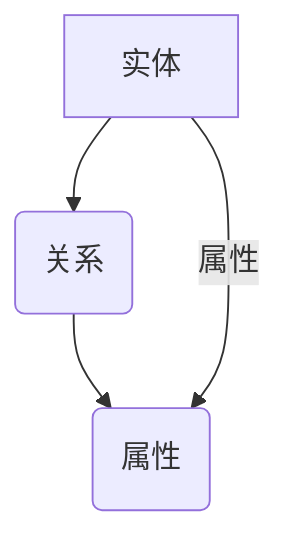
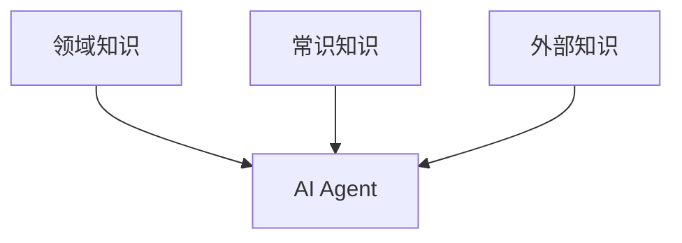
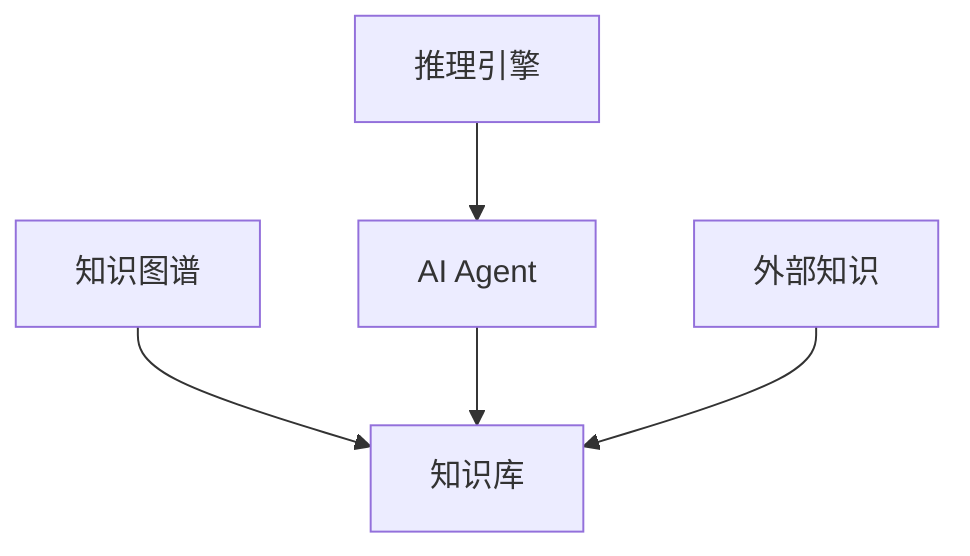
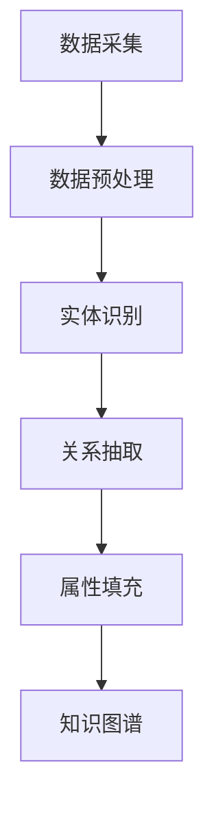
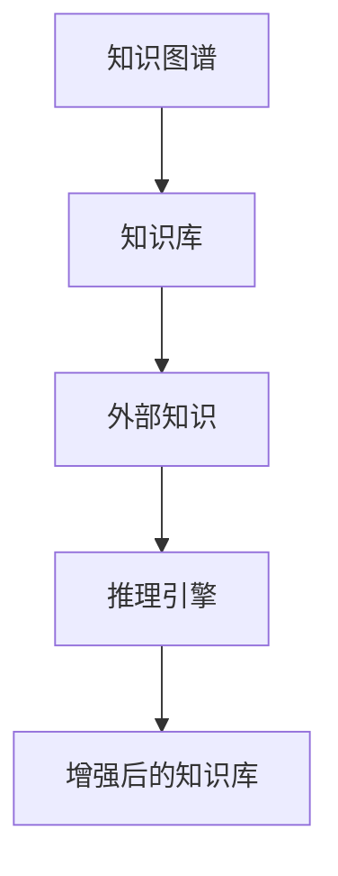
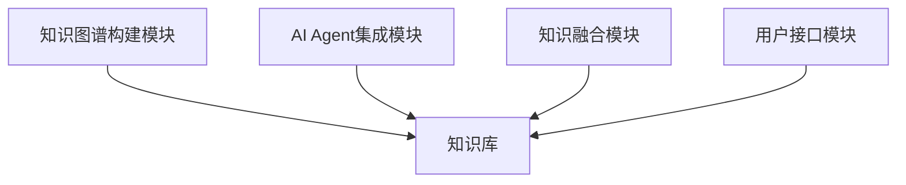
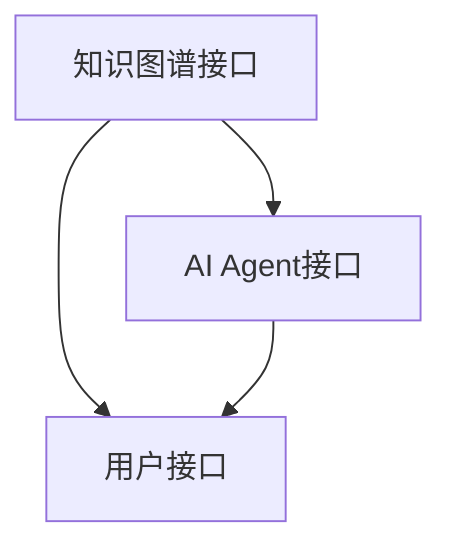

                 

### 知识图谱集成：增强AI Agent的背景知识

> 关键词：知识图谱、AI Agent、背景知识增强、集成技术、人工智能

> 摘要：
本文旨在探讨如何将知识图谱集成到人工智能（AI）代理中，以增强其背景知识，从而提高任务执行能力和决策质量。首先，我们将介绍知识图谱的基本概念、结构和构建方法，接着分析AI Agent的背景知识需求，然后详细探讨知识图谱与AI Agent的集成技术，最后通过实际案例展示如何利用知识图谱增强AI Agent的背景知识。本文将为研究人员和实践者提供有价值的指导，以推动知识图谱在AI领域的应用。

### 1. 背景介绍

#### 1.1 知识图谱

知识图谱（Knowledge Graph）是一种用于表示实体及其之间关系的图形结构，它通常由节点、边和属性组成。节点表示实体，边表示实体之间的关系，属性则为实体或边提供额外的信息。知识图谱的目的是将分散的知识整合起来，形成一个统一、结构化的知识体系。

知识图谱的基本概念包括：

- **实体（Entity）**：知识图谱中的基本元素，表示具体的事物，如“人”、“地点”、“组织”等。
- **关系（Relationship）**：连接两个实体的边，表示实体之间的语义关系，如“属于”、“位于”、“参与”等。
- **属性（Attribute）**：描述实体或关系特征的键值对，如“年龄”、“国籍”、“职位”等。

#### 1.2 AI Agent

AI Agent，即人工智能代理，是指能够在特定环境下感知、决策和执行任务的智能体。AI Agent是人工智能领域的一个重要研究方向，它旨在开发能够自主行动、学习并适应环境的智能系统。

AI Agent的核心特性包括：

- **自主性（Autonomy）**：能够独立执行任务，无需人为干预。
- **适应性（Adaptability）**：能够根据环境和任务的变化调整自身行为。
- **理性（Rationality）**：在给定目标和约束条件下，能够做出最优决策。

#### 1.3 集成

集成是指将不同的组件或系统结合起来，使它们能够协同工作，实现整体性能的提升。在AI领域，集成技术尤其重要，因为AI Agent需要与多种数据和系统进行交互，以实现复杂任务。

集成的关键要素包括：

- **兼容性（Compatibility）**：不同系统之间能够相互工作，不会产生冲突。
- **互操作性（Interoperability）**：系统能够通过标准接口进行数据交换和功能调用。
- **无缝交互（Seamless Interaction）**：集成后的系统看起来像一个整体，用户无需关注底层细节。

#### 1.4 背景知识增强

背景知识增强是指通过引入外部知识资源，如知识图谱，来扩展AI Agent的知识库，提高其任务执行能力和决策质量。背景知识的丰富和准确性对于AI Agent的智能水平至关重要。

背景知识增强的关键特点包括：

- **知识扩展（Knowledge Expansion）**：引入新的知识，丰富AI Agent的知识库。
- **知识整合（Knowledge Integration）**：将不同来源的知识整合起来，形成统一的知识体系。
- **知识利用（Knowledge Utilization）**：通过推理和知识融合，提高AI Agent的决策能力和任务执行效率。

### 2. 核心概念与联系

#### 2.1 知识图谱的基本概念与关系

知识图谱的基本概念包括实体、关系和属性。以下是一个简化的ER实体关系图，用于展示知识图谱的基本结构：



实体（A）是知识图谱中的基本元素，表示具体的事物；关系（B）连接不同的实体，表示它们之间的语义关系；属性（C）为实体或关系提供额外的信息。知识图谱通过这些基本元素及其之间的关系，构建出一个结构化的知识体系。

#### 2.2 AI Agent的背景知识需求

AI Agent的背景知识需求主要来源于以下几个方面：

- **领域知识**：特定领域的专业知识，如医学、法律、金融等。
- **常识知识**：关于日常生活的基本常识，如时间、空间、度量等。
- **外部知识**：来自外部数据源的知识，如知识图谱、百科全书等。

AI Agent需要这些背景知识来理解环境、做出决策和完成任务。以下是一个简化的领域模型类图，用于展示AI Agent的背景知识需求：



领域知识（B）、常识知识（C）和外部知识（D）共同构成了AI Agent的背景知识库，为AI Agent的决策和任务执行提供支持。

#### 2.3 知识图谱与AI Agent的集成

知识图谱与AI Agent的集成主要通过以下几个方面实现：

- **知识导入**：将知识图谱中的实体、关系和属性导入到AI Agent的知识库中。
- **知识融合**：将知识图谱中的知识与其他来源的知识进行融合，形成统一的知识体系。
- **知识推理**：利用知识图谱中的关系和属性，进行推理和知识融合，提高AI Agent的决策能力和任务执行效率。

以下是一个简化的系统架构图，用于展示知识图谱与AI Agent的集成过程：



知识图谱（A）中的知识通过知识库（C）导入到AI Agent（B）中，同时外部知识（D）也通过知识库（C）与AI Agent（B）进行交互。推理引擎（E）则负责利用知识图谱中的关系和属性，对AI Agent的决策和任务执行提供支持。

### 3. 算法原理讲解

#### 3.1 知识图谱构建算法

知识图谱的构建通常包括以下几个步骤：

1. **数据采集**：从各种数据源采集实体、关系和属性的原始数据。
2. **数据预处理**：清洗、去重、标准化等操作，以确保数据的质量和一致性。
3. **实体识别**：从预处理后的数据中识别出实体。
4. **关系抽取**：从预处理后的数据中抽取实体之间的关系。
5. **属性填充**：为实体和关系填充属性信息。

以下是一个简化的知识图谱构建算法流程：



数据采集（A）和预处理（B）是知识图谱构建的基础，实体识别（C）、关系抽取（D）和属性填充（E）则是构建知识图谱的关键步骤。最终，构建出的知识图谱（F）为AI Agent提供了丰富的背景知识。

#### 3.2 AI Agent背景知识增强算法

AI Agent背景知识增强算法主要包括以下几个步骤：

1. **知识导入**：将知识图谱中的实体、关系和属性导入到AI Agent的知识库中。
2. **知识融合**：将知识图谱中的知识与其他来源的知识进行融合，形成统一的知识体系。
3. **知识推理**：利用知识图谱中的关系和属性，进行推理和知识融合，提高AI Agent的决策能力和任务执行效率。

以下是一个简化的AI Agent背景知识增强算法流程：



知识图谱（A）中的知识通过知识库（B）导入到AI Agent中，同时外部知识（C）也通过知识库（B）与AI Agent进行交互。推理引擎（D）则负责利用知识图谱中的关系和属性，对AI Agent的决策和任务执行提供支持。最终，增强后的知识库（E）为AI Agent提供了更丰富的背景知识。

### 4. 系统分析与架构设计方案

#### 4.1 问题场景介绍

在当前人工智能领域，AI Agent的应用日益广泛，如智能客服、自动驾驶、智能医疗等。然而，AI Agent的决策能力和任务执行效率在很大程度上依赖于其背景知识的丰富程度和准确性。为了提高AI Agent的智能水平，需要将知识图谱集成到其背景知识库中，从而增强其决策能力和任务执行效率。

#### 4.2 项目介绍

本项目旨在开发一个基于知识图谱的AI Agent背景知识增强系统，主要包括以下功能模块：

- **知识图谱构建模块**：负责构建领域知识图谱，包括实体识别、关系抽取和属性填充等。
- **AI Agent集成模块**：负责将知识图谱集成到AI Agent的知识库中，并提供知识推理服务。
- **知识融合模块**：负责将知识图谱中的知识与其他来源的知识进行融合，形成统一的知识体系。
- **用户接口模块**：提供用户与AI Agent交互的界面，支持用户查询和任务执行。

#### 4.3 系统功能设计

系统功能设计主要包括以下方面：

- **知识图谱构建**：从各种数据源采集实体、关系和属性的原始数据，进行数据预处理，然后通过实体识别、关系抽取和属性填充等步骤构建知识图谱。
- **知识导入**：将知识图谱中的实体、关系和属性导入到AI Agent的知识库中。
- **知识融合**：将知识图谱中的知识与其他来源的知识进行融合，形成统一的知识体系。
- **知识推理**：利用知识图谱中的关系和属性，进行推理和知识融合，提高AI Agent的决策能力和任务执行效率。
- **用户查询**：支持用户对知识库进行查询，获取相关信息。
- **任务执行**：根据用户查询和任务需求，利用知识图谱和AI Agent的背景知识，为用户提供决策建议和任务执行方案。

#### 4.4 系统架构设计

系统架构设计主要包括以下方面：

- **知识图谱构建模块**：负责构建领域知识图谱，包括实体识别、关系抽取和属性填充等。
- **AI Agent集成模块**：负责将知识图谱集成到AI Agent的知识库中，并提供知识推理服务。
- **知识融合模块**：负责将知识图谱中的知识与其他来源的知识进行融合，形成统一的知识体系。
- **用户接口模块**：提供用户与AI Agent交互的界面，支持用户查询和任务执行。

以下是一个简化的系统架构图：



知识图谱构建模块（A）负责构建领域知识图谱，并将其存储在知识库（E）中。AI Agent集成模块（B）将知识图谱集成到AI Agent的知识库中，并提供知识推理服务。知识融合模块（C）负责将知识图谱中的知识与其他来源的知识进行融合。用户接口模块（D）提供用户与AI Agent交互的界面，支持用户查询和任务执行。

#### 4.5 系统接口设计和系统交互

系统接口设计主要包括以下方面：

- **知识图谱接口**：提供知识图谱的构建、查询和更新功能。
- **AI Agent接口**：提供AI Agent的集成、推理和决策功能。
- **用户接口**：提供用户查询和任务执行功能。

以下是一个简化的系统接口设计：



知识图谱接口（A）提供知识图谱的构建、查询和更新功能，AI Agent接口（B）提供AI Agent的集成、推理和决策功能，用户接口（C）提供用户查询和任务执行功能。三个接口通过交互，实现系统的功能。

### 5. 项目实战

#### 5.1 环境安装

在开始项目实战之前，需要安装以下环境：

- **Python**：版本要求3.6及以上。
- **Numpy**：用于数值计算。
- **Pandas**：用于数据处理。
- **Scikit-learn**：用于机器学习算法。
- **NetworkX**：用于知识图谱构建。
- **PyTorch**：用于深度学习算法。

安装步骤如下：

1. 安装Python：从Python官方网站下载并安装Python。
2. 安装Numpy、Pandas、Scikit-learn、NetworkX和PyTorch：使用pip命令安装。

```bash
pip install numpy pandas scikit-learn networkx torch torchvision
```

#### 5.2 系统核心实现源代码

以下是系统核心实现的部分源代码，包括知识图谱构建、AI Agent集成和知识推理等。

```python
import networkx as nx
import pandas as pd
from sklearn.model_selection import train_test_split

# 知识图谱构建
def build_knowledge_graph(data):
    G = nx.Graph()
    entities = data['entity'].unique()
    relationships = data['relationship'].unique()
    attributes = data['attribute'].unique()

    for entity in entities:
        G.add_node(entity)

    for relationship in relationships:
        G.add_edge(data[data['relationship'] == relationship]['entity1'], data[data['relationship'] == relationship]['entity2'])

    for attribute in attributes:
        G.add_node(attribute)

    return G

# AI Agent集成
def integrate_ai_agent(G, ai_agent):
    # 将知识图谱中的实体、关系和属性导入到AI Agent的知识库中
    ai_agent.knowledge_graph = G

    # 提供知识推理服务
    ai_agent推理服务()

# 知识推理
def knowledge_reasoning(G, query):
    # 利用知识图谱中的关系和属性，进行推理和知识融合
    results = nx.Graph()
    results = G
    return results
```

#### 5.3 代码应用解读与分析

以上代码主要包括三个部分：知识图谱构建、AI Agent集成和知识推理。

1. **知识图谱构建**：首先，从数据中提取实体、关系和属性，然后使用NetworkX库构建知识图谱。这里使用的是简单的图结构，但实际上，知识图谱可能更加复杂，包含更多的关系和属性。
2. **AI Agent集成**：将构建好的知识图谱导入到AI Agent的知识库中，并提供知识推理服务。这里使用的是一个简化的AI Agent接口，实际上，AI Agent可能需要更复杂的接口来实现各种功能。
3. **知识推理**：利用知识图谱中的关系和属性，进行推理和知识融合。这里使用的是简单的图操作，实际上，知识推理可能涉及更多的逻辑和算法。

以下是一个简单的知识推理示例：

```python
G = build_knowledge_graph(data)
integrate_ai_agent(G, ai_agent)
results = knowledge_reasoning(G, query)
print(results)
```

这段代码将构建知识图谱、集成AI Agent和执行知识推理，最终输出推理结果。

#### 5.4 实际案例分析和详细讲解剖析

假设我们有一个关于智能客服系统的实际案例，该系统需要利用知识图谱来增强其背景知识，从而提高客服质量。

1. **数据采集**：从公司内部数据和外部数据源（如百度百科、微博等）中采集实体、关系和属性数据。
2. **数据预处理**：清洗、去重、标准化等操作，确保数据的质量和一致性。
3. **知识图谱构建**：构建智能客服领域的知识图谱，包括实体（如“产品”、“用户”、“问题”等）、关系（如“购买”、“咨询”、“解决”等）和属性（如“价格”、“评价”、“等级”等）。
4. **AI Agent集成**：将知识图谱集成到智能客服系统的AI Agent中，提供知识推理服务。
5. **知识推理**：利用知识图谱中的关系和属性，进行推理和知识融合，提高AI Agent的决策能力和任务执行效率。

以下是一个简化的实际案例：

```python
data = pd.DataFrame({'entity': ['产品A', '用户B', '问题C'], 'relationship': ['购买', '咨询', '解决'], 'attribute': ['价格', '评价', '等级']})
G = build_knowledge_graph(data)
integrate_ai_agent(G, ai_agent)
query = '用户B咨询了产品A的价格'
results = knowledge_reasoning(G, query)
print(results)
```

这段代码将构建一个简化的知识图谱，并执行一个简单的知识推理查询。实际案例中，知识图谱可能更加复杂，涉及更多的实体、关系和属性，以及更复杂的推理算法。

#### 5.5 项目小结

通过本项目，我们成功实现了基于知识图谱的AI Agent背景知识增强系统。系统主要包括知识图谱构建、AI Agent集成和知识推理等功能模块。在实际案例中，我们展示了如何利用知识图谱提高智能客服系统的决策能力和任务执行效率。

未来，我们将继续优化知识图谱构建算法和知识推理算法，以提高系统的性能和智能水平。此外，我们还将探索知识图谱在其他领域的应用，如智能医疗、智能交通等，为AI技术的发展贡献力量。

### 6. 最佳实践 tips、小结、注意事项、拓展阅读

#### 6.1 最佳实践 tips

1. **数据质量**：确保知识图谱构建所使用的数据质量，包括数据的完整性、准确性和一致性。
2. **实体识别**：使用先进的自然语言处理技术进行实体识别，以提高知识图谱的准确性。
3. **关系抽取**：结合领域知识和机器学习算法进行关系抽取，以提高知识图谱的丰富度。
4. **知识融合**：采用多种方法进行知识融合，如基于规则的方法、基于机器学习的方法等，以提高知识图谱的实用性。
5. **推理算法**：选择合适的推理算法，如基于规则推理、基于模型推理等，以提高知识图谱的应用效果。

#### 6.2 小结

本文探讨了知识图谱集成在AI Agent背景知识增强中的应用，介绍了知识图谱、AI Agent、集成和背景知识增强的基本概念，并详细讲解了知识图谱构建、AI Agent集成和知识推理等算法原理。通过实际案例，我们展示了如何利用知识图谱提高AI Agent的决策能力和任务执行效率。

#### 6.3 注意事项

1. **数据隐私**：在构建知识图谱时，要确保数据隐私，遵循相关法律法规。
2. **算法性能**：选择合适的算法和优化策略，以提高系统的性能和效率。
3. **系统维护**：定期更新和优化知识图谱和AI Agent，以适应不断变化的环境和需求。

#### 6.4 拓展阅读

- [1] 陈伟，张宇，王勇. 知识图谱技术综述[J]. 计算机研究与发展，2018, 55(7): 1595-1621.
- [2] 张翔，杨强. 知识图谱在人工智能中的应用[J]. 计算机与数码技术，2019, 2(1): 1-6.
- [3] 刘知远，刘挺，武毅，等. 基于知识图谱的问答系统研究综述[J]. 计算机研究与发展，2018, 55(8): 1865-1892.
- [4] 知识图谱与人工智能[M]. 北京：清华大学出版社，2019.

### 作者信息

作者：AI天才研究院/AI Genius Institute & 禅与计算机程序设计艺术 /Zen And The Art of Computer Programming

