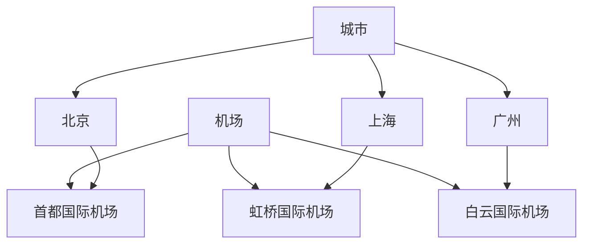
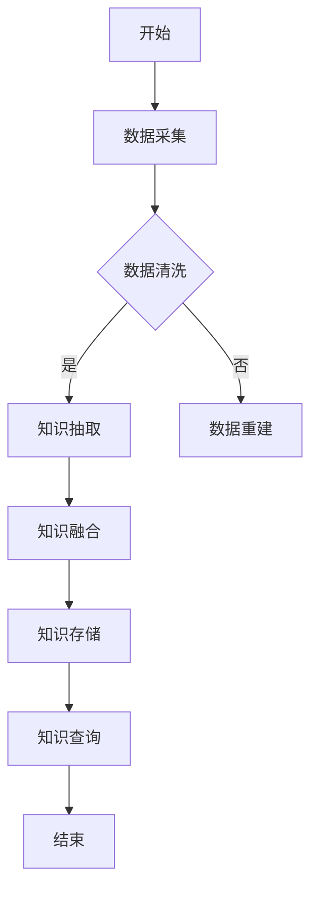
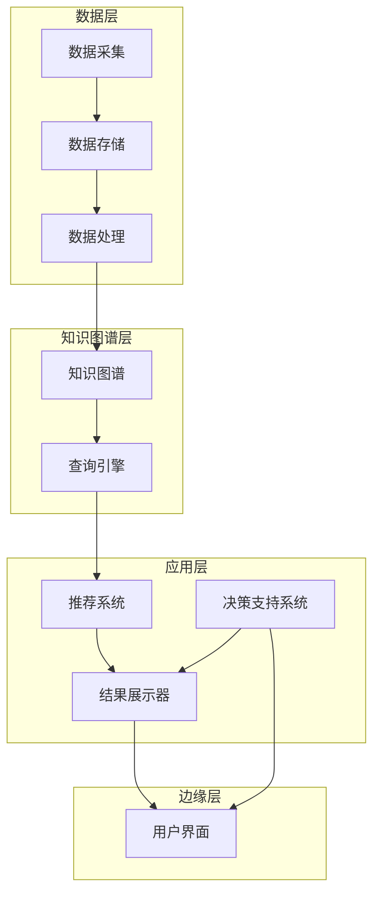
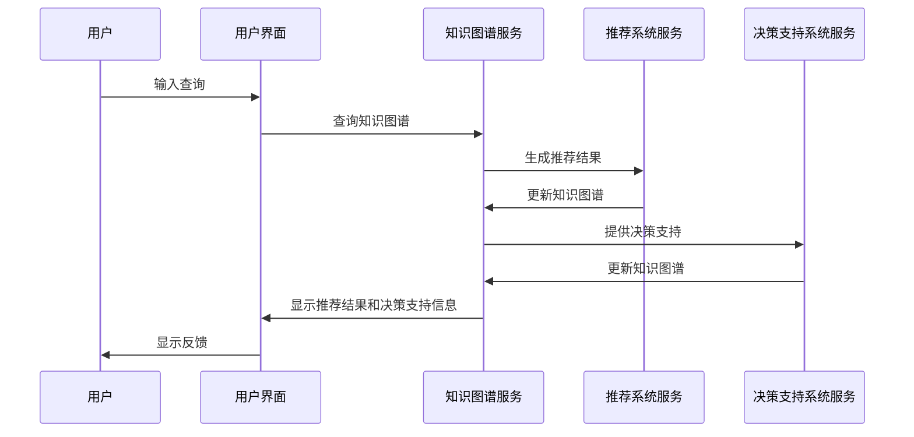

                 


### 知识图谱集成：扩展AI Agent的知识储备

#### 关键词：知识图谱、AI Agent、知识储备、集成技术、应用案例

#### 摘要：
本文将深入探讨知识图谱在人工智能（AI）领域中的重要作用，特别是如何通过知识图谱集成扩展AI Agent的知识储备。我们将从知识图谱的概述、结构、构建方法，到其在AI Agent中的应用，以及集成技术的细节和最佳实践，逐步展开讨论。

#### 目录大纲设计过程

##### 理解书名与主题
《知识图谱集成：扩展AI Agent的知识储备》的主题是关于知识图谱如何集成到AI系统中，以提高AI Agent的知识能力。我们需要明确书中将要探讨的知识图谱的定义、发展、应用，以及集成过程中涉及的技术和方法。

##### 结构化主题内容
根据书名，我们可以将内容分为以下几个主要部分：
1. 背景介绍：包括知识图谱的定义、发展历程和核心概念。
2. 知识图谱的结构与组成：介绍知识图谱的ER模型、层次结构和表示方法。
3. 知识图谱的构建方法：讨论知识抽取、知识融合和知识更新。
4. 知识图谱在AI Agent中的应用：分析知识图谱在语义理解、知识推理和智能推荐中的应用。
5. 知识图谱集成技术：探讨知识图谱与AI Agent集成的框架、技术和挑战。
6. 案例分析：提供实际案例，展示知识图谱集成的具体实施和应用效果。
7. 展望未来：总结当前进展，预测知识图谱集成在AI Agent中的未来趋势。

##### 确定章节内容
在结构化主题内容的基础上，我们可以进一步细化每个章节的具体内容。例如：
- 第1章：知识图谱概述，包括定义、发展历程和应用场景。
- 第2章：知识图谱的结构与组成，介绍ER模型、层次结构和表示方法。
- 第3章：知识图谱的构建方法，讨论知识抽取、知识融合和知识更新。
- 第4章：知识图谱与自然语言处理，分析知识图谱在语义理解、问答系统和信息检索中的应用。
- 第5章：知识图谱与知识推理，介绍知识推理的基本原理和算法。
- 第6章：知识图谱与智能推荐，探讨知识图谱在个性化推荐和多模态推荐系统中的应用。
- 第7章：知识图谱与AI Agent的集成，讨论知识图谱在AI Agent中的角色和功能。
- 第8章：知识图谱集成技术详解，介绍基于图神经网络和深度学习的方法。
- 第9章：知识图谱集成的最佳实践，提供行业应用案例和最佳实践。
- 第10章：知识图谱集成案例研究，展示实际案例的背景、方法和成果。
- 第11章：知识图谱集成的发展趋势，讨论新兴技术和未来方向。
- 第12章：总结与展望，总结书中内容，展望知识图谱集成的未来。

##### 设计核心概念与联系
在每个相关章节中，我们将设计核心概念原理、概念属性特征对比表格和ER实体关系图架构的Mermaid流程图。例如，在知识图谱概述章节中，我们将绘制知识图谱的ER模型图，并在知识图谱集成章节中，展示知识图谱与AI Agent集成的框架图。

##### 编写算法原理讲解
我们将选择一个关键算法，使用Mermaid画出流程图，然后用Python源代码详细阐述，结合数学模型和公式进行讲解。例如，在知识推理章节中，我们可以选择一个基于图神经网络的推理算法，展示其Mermaid流程图和Python代码实现。

##### 系统分析与架构设计
我们将设计系统功能、架构、接口和交互的Mermaid图表。例如，在知识图谱与智能推荐章节中，我们可以绘制推荐系统的功能类图和架构图。

##### 编写项目实战与案例分析
我们将提供实际案例，介绍环境安装、系统核心实现源代码，并进行解读与分析。例如，在知识图谱集成案例研究章节中，我们可以展示一个具体的知识图谱集成项目，从搭建环境到实现核心功能，再到项目总结。

##### 总结与拓展
在每个章节的最后，我们将提供最佳实践、注意事项、拓展阅读等内容，以帮助读者深入理解和应用知识图谱集成技术。

##### 编写目录大纲
按照以上设计，我们将编写完整的目录大纲，确保文章结构清晰、内容丰富、逻辑连贯。

### 注意事项
在编写文章时，我们需要注意以下几点：
- 确保文章结构清晰，逻辑连贯，便于读者理解。
- 每章节的内容描述要简洁明了，避免冗余。
- 核心概念和算法原理讲解要准确、易懂。
- 实际案例的分析要深入，提供实用的实践指导。
- 每个章节都要有明确的总结和拓展内容，帮助读者巩固所学知识。

通过以上步骤，我们将撰写一篇关于知识图谱集成扩展AI Agent知识储备的深度技术博客文章，旨在为读者提供全面、系统的知识图谱与AI集成技术指导。让我们一步一步深入分析，探索知识图谱的奥秘。接下来，我们将详细展开每一部分的内容，逐步揭示知识图谱在AI领域的力量。Let's think step by step!

### 第一部分：背景介绍

#### 第1章：知识图谱概述

知识图谱（Knowledge Graph）是人工智能领域的一项核心技术，它通过将现实世界中的实体、概念和关系以结构化的形式进行表示和存储，使得计算机能够理解和处理复杂的知识信息。知识图谱的定义和概念可以从多个角度进行阐述。

##### 知识图谱的定义与演变

知识图谱最早由Google在2012年提出，是一种用于表示实体及其相互关系的数据结构。它不仅包括传统的知识库，还包含了大量的上下文信息和语义信息。随着时间的推移，知识图谱的应用范围不断扩大，从最初的搜索引擎优化，逐渐扩展到自然语言处理、知识推理、智能推荐等多个领域。

知识图谱的演变可以分为几个阶段：

1. **原始知识库阶段**：这一阶段的知识库主要包含一些静态的、结构化的数据，如百科全书、数据库等。这些数据虽然可以用于信息检索，但难以处理复杂的语义关系。

2. **语义网阶段**：语义网（Semantic Web）是Web技术的一个分支，它通过使用RDF（Resource Description Framework）等语言，对Web上的资源进行语义描述。这一阶段的目的是使Web数据更加结构化和语义化，便于机器理解和处理。

3. **知识图谱阶段**：知识图谱在语义网的基础上，引入了更多的上下文信息和动态数据，通过图结构来表示实体及其关系，使得知识表示更加灵活和丰富。

##### 知识图谱在现代AI中的应用场景

知识图谱在现代AI中扮演着重要角色，其应用场景主要包括以下几个方面：

1. **自然语言处理**：知识图谱可以用于实体识别、关系抽取和语义理解，帮助AI系统更好地理解和处理自然语言文本。

2. **知识推理**：知识图谱中的实体和关系可以用于推理，生成新的知识或回答复杂的问题。

3. **智能推荐**：知识图谱可以帮助推荐系统发现用户之间的相似性，提供更加个性化的推荐。

4. **搜索引擎**：知识图谱可以用于改进搜索结果的相关性和准确性，提供更加智能的搜索服务。

5. **智能决策支持**：知识图谱可以提供丰富的背景知识和上下文信息，帮助决策支持系统做出更明智的决策。

##### 知识图谱的核心概念

知识图谱的核心概念包括实体（Entity）、属性（Attribute）和关系（Relationship）。

1. **实体**：实体是知识图谱中的基本元素，可以是人、地点、事物等。例如，"北京"、"苹果"、"马云"等都可以作为实体。

2. **属性**：属性是对实体的特征的描述，例如，"北京"的属性可以是"首都"、"人口"等。

3. **关系**：关系是实体之间的交互，例如，"苹果"和"水果"之间存在"是"的关系。

知识图谱通过这些核心概念，将现实世界中的复杂信息以结构化的形式进行表示，使得AI系统能够更加高效地处理和利用这些信息。

##### 概念结构与核心要素组成

知识图谱的概念结构可以看作是一个由实体、属性和关系构成的多层网络。其中，实体是网络的节点，属性和关系是网络的边。知识图谱的核心要素包括：

- **实体类型**：对实体进行分类，例如，"人"、"地点"、"组织"等。
- **属性类型**：对属性的分类，例如，"出生日期"、"电话号码"等。
- **关系类型**：对关系的分类，例如，"是"、"属于"、"发生"等。
- **实体实例**：具体的实体对象，例如，"北京"、"苹果"、"马云"等。
- **属性实例**：实体属性的实例值，例如，"北京"的属性"人口"的值是"2200万"。

通过这些核心要素的有机组合，知识图谱能够构建出丰富的知识网络，为AI系统提供强大的知识支持。

#### 第2章：知识图谱的结构与组成

知识图谱的结构与组成是理解和应用知识图谱的基础。它涉及到实体、属性和关系等基本概念，以及知识图谱的层次结构和表示方法。

##### 实体、属性和关系的ER模型

实体-关系（Entity-Relationship，ER）模型是知识图谱结构的基础。ER模型通过实体、属性和关系来描述现实世界中的事物及其相互关系。

1. **实体**：实体是知识图谱中的基本元素，可以是人、地点、事物等。例如，"北京"、"苹果"、"马云"等都是实体。

2. **属性**：属性是实体的特征描述，例如，"北京"的属性可以是"首都"、"人口"等。属性通常具有类型，例如，"人口"的类型可以是"数字"。

3. **关系**：关系是实体之间的交互，例如，"苹果"和"水果"之间存在"是"的关系。关系通常也具有类型，例如，"是"的类型可以是"类别"。

在ER模型中，实体、属性和关系构成了知识图谱的基本结构。实体作为节点，属性和关系作为边，将实体与实体、实体与属性、属性与属性之间的关系以图形化的方式表示出来。

##### 知识图谱的层次结构

知识图谱的层次结构通常包括以下几个层次：

1. **底层数据层**：底层数据层包括原始的数据源，如数据库、文本、图片等。这些数据通过数据抽取和清洗技术转化为结构化的数据，作为知识图谱的基础。

2. **数据层**：数据层是对底层数据的进一步组织，包括实体、属性和关系的结构化表示。这一层通常使用RDF（Resource Description Framework）或OWL（Web Ontology Language）等语言来描述。

3. **索引层**：索引层是对知识图谱的索引和查询优化，以提高数据查询的效率。常用的索引技术包括Lucene、Elasticsearch等。

4. **应用层**：应用层是知识图谱的最终应用，如自然语言处理、知识推理、智能推荐等。应用层通过接口与知识图谱进行交互，利用知识图谱提供的数据和关系进行智能决策和推理。

##### 知识图谱的表示方法

知识图谱的表示方法多种多样，其中最常见的是基于图的结构表示方法。图结构能够直观地表示实体、属性和关系之间的复杂关系。

1. **邻接矩阵表示**：邻接矩阵是一种常用的图表示方法，它通过一个二维矩阵来表示图中的节点和边。矩阵中的元素值表示节点之间的连接关系，通常使用0和1表示无连接和有连接。

2. **边列表表示**：边列表是一种更为灵活的图表示方法，它通过一个列表来记录图中的边。每个边由两个节点的标识组成，通过遍历边列表可以构建出整个图的结构。

3. **图论表示**：图论是一种数学上的图表示方法，它通过图、节点和边等数学概念来表示知识图谱。图论表示方法可以更精确地描述知识图谱的结构和性质。

4. **Mermaid流程图表示**：Mermaid是一种Markdown语法，可以用来绘制流程图、序列图等。通过Mermaid，我们可以用简单的Markdown代码绘制出知识图谱的结构和关系。

##### 实例：知识图谱的ER模型表示

假设我们有一个关于城市和机场的知识图谱，其中实体包括城市和机场，关系包括"属于"和"拥有"。

实体：
- 城市：北京、上海、广州
- 机场：首都国际机场、虹桥国际机场、白云国际机场

属性：
- 城市：人口、面积
- 机场：跑道长度、吞吐量

关系：
- 属于：北京-首都国际机场
- 拥有：首都国际机场-北京

ER模型表示：



在这个ER模型中，城市和机场是实体，"属于"和"拥有"是关系。每个实体都有属性，如城市的人口和面积，机场的跑道长度和吞吐量。

通过ER模型，我们可以清晰地表示知识图谱中的实体、属性和关系，为后续的知识抽取、融合和应用提供基础。

#### 第3章：知识图谱的构建方法

知识图谱的构建是知识图谱应用中的关键步骤。它涉及从原始数据中抽取知识、整合不同来源的知识，以及不断更新和维护知识图谱。以下是构建知识图谱的几种常见方法：

##### 知识抽取技术

知识抽取（Knowledge Extraction）是从非结构化数据（如文本、图像等）中提取结构化知识的过程。知识抽取主要包括以下几种技术：

1. **命名实体识别（Named Entity Recognition，NER）**：NER是用于识别文本中的命名实体（如人名、地名、组织名等）的技术。通过NER，我们可以从文本中提取出关键的实体信息。

2. **关系抽取（Relation Extraction）**：关系抽取是用于识别文本中实体之间关系的技术。例如，从文本中识别出"北京是中国的首都"这句话中的实体关系。

3. **属性抽取（Attribute Extraction）**：属性抽取是用于识别实体属性的值。例如，从文本中识别出"马云的出生日期是1964年"中的实体属性信息。

4. **事件抽取（Event Extraction）**：事件抽取是用于识别文本中的事件及其相关实体和关系。例如，从新闻文章中识别出的事件及其涉及的人物、地点和事件类型。

##### 知识融合与整合方法

知识融合（Knowledge Fusion）是将来自不同来源、不同格式的知识进行整合，形成统一的知识图谱的过程。知识融合主要包括以下几种方法：

1. **数据对齐（Data Alignment）**：数据对齐是用于将不同来源的数据进行匹配和统一的过程。通过数据对齐，我们可以将不同数据源中的实体、关系和属性进行映射和整合。

2. **实体链接（Entity Linking）**：实体链接是用于将文本中的实体与其在知识图谱中的实体进行匹配和链接的过程。例如，将文本中的"北京"与知识图谱中的"北京"实体进行链接。

3. **知识融合算法（Knowledge Fusion Algorithm）**：知识融合算法用于将不同来源的知识进行整合和优化。常见的知识融合算法包括基于规则的方法、基于概率的方法和基于神经网络的方法。

4. **知识冲突解决（Knowledge Conflict Resolution）**：在知识融合过程中，可能会出现不同来源的知识存在冲突的情况。知识冲突解决是用于解决这些冲突的过程，以确保知识图谱的一致性和准确性。

##### 知识图谱的更新与维护

知识图谱的更新与维护是保持知识图谱实时性和准确性的关键。以下是一些常见的更新与维护方法：

1. **周期性更新（Periodic Update）**：定期对知识图谱进行更新，以反映现实世界的变化。例如，定期从新闻、社交媒体等数据源中提取新的知识，并更新知识图谱。

2. **实时更新（Real-time Update）**：对于某些需要实时更新的知识，如金融市场数据、交通状况等，采用实时更新机制，以保持知识图谱的时效性。

3. **知识质量评估（Knowledge Quality Evaluation）**：定期对知识图谱的质量进行评估，识别和修复知识中的错误和矛盾。知识质量评估可以通过自动化工具和人工审核相结合的方式进行。

4. **用户反馈（User Feedback）**：鼓励用户对知识图谱进行反馈，识别和报告知识中的错误和不准确之处。用户反馈是提高知识图谱质量的重要手段。

通过以上方法，我们可以有效地构建、更新和维护知识图谱，为AI Agent提供强大的知识支持，实现更智能、更准确的决策和推理。

#### 第4章：知识图谱与自然语言处理

知识图谱在自然语言处理（NLP）中的应用具有重要意义，它能够极大地提升NLP系统的性能和效果。在本章中，我们将探讨知识图谱在语义理解、问答系统和信息检索中的应用，以及如何通过知识图谱优化NLP任务。

##### 知识图谱在语义理解中的应用

语义理解是NLP的核心任务之一，旨在使计算机能够理解自然语言的语义含义。知识图谱在语义理解中的应用主要体现在以下几个方面：

1. **实体识别**：知识图谱中的实体信息可以帮助NLP系统更准确地识别文本中的命名实体。例如，通过知识图谱中的地名信息，可以更准确地识别出文本中的城市名称。

2. **关系抽取**：知识图谱中的关系信息可以帮助NLP系统理解实体之间的语义关系。例如，通过知识图谱中的"属于"关系，可以理解文本中的"苹果是水果"这种分类关系。

3. **属性抽取**：知识图谱中的属性信息可以帮助NLP系统获取实体的详细特征。例如，通过知识图谱中的"人口"属性，可以获取某个城市的人口数量。

##### 知识图谱在问答系统中的应用

问答系统是NLP的一个重要应用领域，旨在通过自然语言交互提供用户需要的答案。知识图谱在问答系统中的应用主要体现在以下几个方面：

1. **问题解析**：知识图谱可以帮助问答系统理解用户问题的语义，并将其映射到知识图谱中的相关实体和关系。例如，用户提问"北京的市长是谁？"，知识图谱可以帮助系统将问题解析为"北京"、"市长"这两个实体及其关系。

2. **知识检索**：知识图谱可以作为问答系统的知识库，用于检索与用户问题相关的信息。通过知识图谱的图结构，系统可以快速定位到相关的实体和关系，提供准确的答案。

3. **推理和推断**：知识图谱中的推理机制可以帮助问答系统解决复杂的问题。例如，通过知识图谱中的"属于"关系，系统可以推断出"苹果是水果"这种结论。

##### 知识图谱在信息检索中的应用

知识图谱在信息检索中的应用能够显著提升检索系统的效果和效率。以下是一些具体应用场景：

1. **相关推荐**：知识图谱可以帮助信息检索系统为用户提供相关的搜索结果。例如，当用户搜索"苹果"时，知识图谱可以根据苹果的属性（如"水果"）推荐相关的信息，如"苹果树"、"苹果品种"等。

2. **实体识别和链接**：知识图谱可以帮助信息检索系统识别文本中的命名实体，并将其与知识图谱中的实体进行链接。例如，将文本中的"苹果"链接到知识图谱中的"苹果"实体。

3. **语义搜索**：知识图谱可以帮助信息检索系统理解用户的查询意图，提供更准确的搜索结果。例如，当用户搜索"北京天气"时，知识图谱可以帮助系统理解"北京"是地名，从而提供相关的天气信息。

##### 优化NLP任务

知识图谱在优化NLP任务方面具有显著的优势，以下是一些具体方法：

1. **联合嵌入**：将知识图谱中的实体、关系和属性嵌入到一个共同的低维空间中，使得NLP系统可以直接利用知识图谱进行语义计算。

2. **图谱嵌入**：通过图谱嵌入技术，将知识图谱中的节点（实体和关系）映射到一个低维空间中，实现知识图谱的向量表示。

3. **图神经网络**：利用图神经网络（Graph Neural Network，GNN）对知识图谱进行建模，实现对图数据的深度学习和处理。

4. **知识融合**：将外部知识（如百科、论文等）与知识图谱进行融合，形成更丰富的知识库，提升NLP系统的性能。

通过以上方法，知识图谱能够有效优化NLP任务，提升系统的语义理解和处理能力。

#### 第5章：知识图谱与知识推理

知识图谱在知识推理（Knowledge Reasoning）中的应用具有重要意义，它能够帮助人工智能系统从已有知识中推导出新的结论。知识推理是人工智能的核心任务之一，通过逻辑推理、模式识别和机器学习等技术，使计算机能够理解和解决复杂问题。在本章中，我们将深入探讨知识图谱在知识推理中的应用原理、算法以及其在智能决策支持系统中的应用。

##### 知识推理的基本原理

知识推理是基于已知的事实和规则，通过逻辑推理得到新的结论。知识推理可以分为两种基本类型：演绎推理（Deductive Reasoning）和归纳推理（Inductive Reasoning）。

1. **演绎推理**：演绎推理从一般到特殊，即从一般性的前提推导出特殊性的结论。例如，如果所有的人都会死亡（一般性前提），那么苏格拉底也会死亡（特殊性结论）。

2. **归纳推理**：归纳推理从特殊到一般，即通过观察特定的实例，推导出一般性的规律。例如，通过观察多个苹果都会从树上落下，可以归纳出苹果从树上落下的规律。

知识图谱为知识推理提供了坚实的基础，通过将实体、属性和关系表示为图结构，知识图谱能够有效地存储和管理大量知识信息，为推理过程提供便捷的访问和操作方式。

##### 知识图谱中的推理算法

知识图谱中的推理算法是基于图结构的推理方法，通过遍历图中的节点和边，从已知事实推导出新的结论。以下是一些常用的知识图谱推理算法：

1. **基于规则推理（Rule-based Reasoning）**：基于规则推理使用预先定义的推理规则来推导结论。推理规则通常表示为“如果...则...”的形式。例如，如果实体A具有属性X，且实体B具有属性Y，则实体A与实体B之间存在某种关系R。

2. **路径搜索推理（Path-based Reasoning）**：路径搜索推理通过在知识图谱中搜索特定的路径来推导结论。例如，可以通过搜索从实体A到实体B的路径，来确定实体A与实体B之间的关系。

3. **图神经网络推理（Graph Neural Network-based Reasoning）**：图神经网络（GNN）是一种基于图结构的深度学习模型，通过学习图中的节点和边的特征，实现对知识图谱的推理和预测。GNN能够自动学习图中的复杂关系，适用于大规模知识图谱的推理任务。

4. **图嵌入推理（Graph Embedding-based Reasoning）**：图嵌入是将图中的节点和边映射到一个低维空间中的技术，通过图嵌入技术，可以有效地表示知识图谱中的实体和关系，为推理过程提供向量化的表示。

##### 知识图谱在智能决策支持系统中的应用

智能决策支持系统（Intelligent Decision Support System，IDSS）是利用人工智能技术辅助人类进行决策的系统。知识图谱在智能决策支持系统中的应用主要体现在以下几个方面：

1. **知识库构建**：知识图谱为智能决策支持系统提供了一个结构化的知识库，通过将各种领域知识表示为实体、属性和关系，系统能够更好地理解和利用这些知识。

2. **推理引擎**：知识图谱中的推理算法可以作为智能决策支持系统的推理引擎，用于从已知知识推导出新的结论，辅助决策者做出更加明智的决策。

3. **知识推理**：知识图谱能够自动识别和推理出实体之间的关系，例如，通过分析市场数据和客户偏好，系统可以推断出潜在的客户需求和市场趋势，为营销策略提供支持。

4. **个性化推荐**：知识图谱可以用于构建个性化推荐系统，通过分析用户的兴趣和行为，系统可以为用户提供个性化的产品推荐和服务。

5. **风险评估**：知识图谱能够用于分析各种风险因素之间的关联，例如，在金融领域，系统可以通过知识图谱识别出潜在的信用风险，为金融机构提供风险预警。

通过以上应用，知识图谱能够为智能决策支持系统提供强大的知识推理和决策支持能力，帮助决策者更好地应对复杂的问题和挑战。

#### 第6章：知识图谱与智能推荐

知识图谱在智能推荐（Intelligent Recommendation）系统中具有广泛的应用，它能够通过结构化的知识信息，提升推荐的准确性和个性化水平。在本章中，我们将探讨知识图谱在个性化推荐、协同过滤推荐和多模态推荐系统中的应用。

##### 知识图谱在个性化推荐系统中的应用

个性化推荐系统旨在根据用户的兴趣和行为，为其推荐个性化的内容或产品。知识图谱在个性化推荐中的应用主要体现在以下几个方面：

1. **用户兴趣建模**：知识图谱可以用于建模用户的兴趣，通过将用户与兴趣实体进行关联，系统可以更准确地识别用户的兴趣点。例如，通过知识图谱中的"音乐"、"电影"、"旅游"等实体，系统可以了解用户的兴趣分布。

2. **内容特征提取**：知识图谱可以帮助提取内容（如商品、文章、视频等）的特征，通过分析内容之间的相似性和关联性，系统可以为用户提供相关的推荐。例如，通过知识图谱中的"歌手"、"演员"、"旅游景点"等实体，系统可以推荐与用户兴趣相符的内容。

3. **基于知识的推荐**：知识图谱可以为推荐系统提供额外的上下文信息，使得推荐结果更加符合用户的实际需求。例如，当用户浏览了一篇关于旅行的文章后，系统可以利用知识图谱推荐相关的旅游目的地和行程规划。

##### 知识图谱在协同过滤推荐中的应用

协同过滤（Collaborative Filtering）是推荐系统中最常用的技术之一，它通过分析用户之间的行为相似性，推荐用户可能感兴趣的内容。知识图谱可以与协同过滤技术相结合，提升推荐的准确性和多样性：

1. **基于知识的用户推荐**：知识图谱可以帮助识别具有相似兴趣爱好的用户，通过将用户与兴趣实体进行关联，系统可以推荐与目标用户兴趣相符的其他用户喜欢的物品。例如，通过知识图谱中的"音乐"、"电影"、"书籍"等实体，系统可以识别出具有相似兴趣的用户群体。

2. **基于知识的物品推荐**：知识图谱可以帮助识别与目标物品相关的其他物品，通过分析物品之间的关联关系，系统可以推荐与目标物品相似的其他物品。例如，通过知识图谱中的"商品类别"、"品牌"、"产地"等实体，系统可以推荐与目标商品相关的其他商品。

3. **知识融合协同过滤**：知识图谱可以与协同过滤算法结合，融合用户行为数据和知识图谱中的结构化信息，提升推荐的准确性。例如，通过将用户评分数据与知识图谱中的实体关系进行融合，系统可以生成更加准确的推荐列表。

##### 知识图谱在多模态推荐系统中的应用

多模态推荐系统旨在结合多种类型的数据源（如文本、图像、音频等），为用户提供更丰富和个性化的推荐。知识图谱在多模态推荐系统中的应用主要体现在以下几个方面：

1. **多模态数据融合**：知识图谱可以将多种模态的数据进行统一表示和整合，形成统一的知识图谱。例如，通过将文本信息、图像信息和音频信息分别表示为实体、属性和关系，系统可以将这些模态数据融合到一个知识图谱中。

2. **多模态关联分析**：知识图谱可以帮助分析不同模态数据之间的关联性，例如，通过知识图谱中的"歌曲"、"歌手"、"专辑"等实体，系统可以分析歌曲、歌手和专辑之间的关联关系，为用户提供更丰富的推荐。

3. **多模态推荐策略**：知识图谱可以为多模态推荐系统提供多样化的推荐策略。例如，通过知识图谱中的实体关系，系统可以生成基于文本、图像、音频等多模态数据的综合推荐列表。

通过以上应用，知识图谱能够为智能推荐系统提供强大的知识支持和计算能力，提升推荐的准确性、多样性和用户体验。

#### 第7章：知识图谱与AI Agent的集成

知识图谱与AI Agent的集成是现代人工智能领域的一个重要研究方向，它旨在通过知识图谱扩展AI Agent的知识储备，提升AI系统的智能化水平。在本章中，我们将深入探讨知识图谱在AI Agent中的作用和功能，以及实现知识图谱与AI Agent集成的框架和技术。

##### 知识图谱在AI Agent中的角色与功能

知识图谱在AI Agent中扮演着多重角色，其核心功能包括：

1. **知识表示**：知识图谱为AI Agent提供了一个结构化的知识库，通过实体、属性和关系的表示，使得AI系统能够直观地理解和存储知识信息。

2. **知识推理**：知识图谱中的关系和属性为AI Agent提供了推理的基础，使得AI系统能够从已知的事实推导出新的结论，进行逻辑推理和决策。

3. **知识共享**：知识图谱使得AI系统中的各个组件可以共享同一套知识体系，避免了信息孤岛和知识冗余，提高了系统的整体效率和一致性。

4. **知识拓展**：知识图谱能够通过不断更新和扩展，为AI Agent提供新的知识信息，使得AI系统能够适应不断变化的环境和需求。

##### 知识图谱与AI Agent集成的框架

实现知识图谱与AI Agent的集成需要建立一个合理的框架，这个框架通常包括以下几个关键组件：

1. **知识图谱构建**：首先需要构建一个结构化的知识图谱，包括实体、属性和关系的定义，以及知识抽取、融合和更新的方法。

2. **知识存储**：将知识图谱存储在数据库或图数据库中，以便于AI Agent进行查询和访问。

3. **API接口**：为AI Agent提供统一的API接口，使得AI系统能够方便地访问和操作知识图谱。

4. **推理引擎**：实现一个推理引擎，用于在知识图谱中执行推理操作，生成新的知识信息。

5. **AI Agent组件**：将知识图谱集成到AI Agent的各个组件中，如感知模块、决策模块、行动模块等，使得AI系统能够利用知识图谱进行智能推理和决策。

##### 知识图谱集成的技术

知识图谱与AI Agent的集成涉及多种技术，包括知识图谱构建、图数据库、API接口、推理引擎等。以下是一些关键技术和方法：

1. **图数据库**：图数据库（如Neo4j、JanusGraph等）是存储和管理知识图谱的核心技术，它通过图结构高效地存储实体、属性和关系，并提供复杂的图查询和操作能力。

2. **知识抽取**：知识抽取是从非结构化数据中提取结构化知识的过程，包括命名实体识别、关系抽取和属性抽取等。常用的知识抽取方法有基于规则的方法、基于机器学习的方法和基于深度学习的方法。

3. **知识融合**：知识融合是将来自不同来源、不同格式的知识进行整合，形成统一的知识图谱。知识融合方法包括数据对齐、实体链接和融合算法等。

4. **API接口**：API接口用于AI Agent与知识图谱之间的交互，通过RESTful API、GraphQL等方式，提供灵活、高效的知识查询和操作接口。

5. **推理引擎**：推理引擎是执行知识图谱中推理操作的核心组件，通过图算法和逻辑推理，从已知的事实推导出新的结论。

通过以上技术和方法，我们可以实现知识图谱与AI Agent的有效集成，提升AI系统的知识储备和推理能力，为智能决策和自动化行动提供强有力的支持。

#### 第8章：知识图谱集成技术详解

知识图谱集成技术是实现AI Agent知识扩展的核心手段。在本章中，我们将详细探讨基于图神经网络（Graph Neural Networks，GNN）和深度学习的知识图谱集成方法，并介绍几种典型的算法和技术。

##### 基于图神经网络的知识图谱集成

图神经网络（GNN）是一种专门用于图结构数据学习的深度学习模型，通过学习节点和边之间的特征，实现对图数据的复杂结构和关系的建模。GNN在知识图谱集成中具有显著的优势，可以有效地处理异构数据、图结构数据和非线性关系。

1. **图卷积网络（Graph Convolutional Networks，GCN）**：GCN是GNN的一种常见实现，通过在图结构上应用卷积操作，对节点进行特征更新和聚合。GCN的核心思想是利用邻居节点的特征来更新当前节点的特征，从而学习节点和边之间的关联性。以下是一个简单的GCN算法流程：

    ```mermaid
    graph TD
    A[初始化节点特征] --> B[卷积操作]
    B --> C[聚合邻居节点特征]
    C --> D[激活函数]
    D --> E[输出节点特征]
    ```

    在这个过程中，节点特征通过加权求和的方式聚合邻居节点的特征，并使用激活函数（如ReLU）进行非线性变换。

2. **图注意力网络（Graph Attention Networks，GAT）**：GAT在GCN的基础上引入了注意力机制，通过自适应地计算节点之间的权重，使得模型能够更加关注重要邻居节点的特征。GAT的主要优势在于可以学习到不同节点的重要性，从而提高模型的表现。GAT的算法流程如下：

    ```mermaid
    graph TD
    A[初始化节点特征] --> B[计算注意力权重]
    B --> C[加权求和邻居节点特征]
    C --> D[激活函数]
    D --> E[输出节点特征]
    ```

    在这个过程中，注意力权重是通过一个前馈神经网络计算得到的，节点特征通过加权求和的方式更新。

##### 基于深度学习的知识图谱集成方法

除了图神经网络，深度学习中的其他技术，如循环神经网络（RNN）和变换器（Transformer），也可以用于知识图谱集成。

1. **循环神经网络（RNN）**：RNN是一种专门用于处理序列数据的学习模型，可以通过递归地更新节点的特征，学习图中的序列关系。RNN的核心优势在于可以捕捉长距离的依赖关系。以下是一个简单的RNN算法流程：

    ```mermaid
    graph TD
    A[初始化节点特征] --> B[递归更新特征]
    B --> C[输出节点特征]
    ```

    在这个过程中，节点的特征通过前一个时间步的特征进行更新，从而学习节点之间的关系。

2. **变换器（Transformer）**：Transformer是一种基于自注意力机制的深度学习模型，通过全局注意力机制来捕捉节点和边之间的复杂关系。Transformer在知识图谱集成中可以显著提高模型的性能。以下是一个简单的Transformer算法流程：

    ```mermaid
    graph TD
    A[初始化节点特征] --> B[计算自注意力权重]
    B --> C[加权求和节点特征]
    C --> D[输出节点特征]
    ```

    在这个过程中，节点特征通过自注意力权重进行加权求和，从而实现特征的有效聚合。

##### 典型算法和技术

以下是几种典型的知识图谱集成算法和技术：

1. **知识图谱嵌入（Knowledge Graph Embedding）**：知识图谱嵌入是将知识图谱中的实体和关系映射到一个低维空间中的技术，通过向量表示实体和关系，使得模型能够直接处理图数据。常用的知识图谱嵌入方法包括节点嵌入（如节点2vec、LINE）和边嵌入（如边2vec）。

2. **图增强表示学习（Graph Attention Network，GAT）**：GAT是一种结合了注意力机制的图神经网络，通过自适应地计算节点之间的权重，使得模型能够关注到重要的邻居节点，提高模型的性能。

3. **图卷积网络（Graph Convolutional Network，GCN）**：GCN是一种在图结构上应用卷积操作的神经网络，通过聚合邻居节点的特征，更新当前节点的特征，从而学习节点和边之间的关联性。

4. **图变换器（Graph Transformer）**：图变换器是一种基于自注意力机制的图神经网络，通过全局注意力机制捕捉节点和边之间的复杂关系。

通过以上算法和技术，我们可以有效地实现知识图谱的集成，扩展AI Agent的知识储备，提升AI系统的智能化水平。

#### 第9章：知识图谱集成的最佳实践

在知识图谱集成的过程中，最佳实践和注意事项对于确保项目的成功至关重要。本章节将总结知识图谱集成在金融、电商和医疗健康等领域的应用案例，并提供最佳实践、注意事项以及拓展阅读，以帮助读者更好地理解和应用知识图谱集成技术。

##### 知识图谱集成在金融行业的应用

在金融行业，知识图谱集成被广泛应用于风险管理、信用评估、投资分析和客户服务等领域。

1. **最佳实践**：

   - **数据质量**：确保知识图谱的数据质量是关键，包括数据的完整性、一致性和准确性。在数据采集和清洗过程中，要严格遵循数据质量标准。
   - **隐私保护**：金融行业的数据敏感性高，需要在知识图谱构建和集成过程中严格遵守隐私保护法规，如GDPR等。
   - **实时性**：金融行业的知识更新速度非常快，因此，构建一个实时更新和优化的知识图谱至关重要。

2. **注意事项**：

   - **系统性能**：知识图谱集成可能会导致系统性能下降，需要通过优化查询算法、索引和数据结构来提升系统性能。
   - **安全性与合规性**：在处理金融数据时，要确保系统的安全性和合规性，防范数据泄露和非法访问。

3. **拓展阅读**：

   - 《知识图谱在金融风险管理中的应用》
   - 《基于知识图谱的金融信用评估系统设计与实现》

##### 知识图谱集成在电商领域的实践

电商领域利用知识图谱进行商品推荐、客户画像和商品关系挖掘，以提高用户满意度和销售转化率。

1. **最佳实践**：

   - **商品知识库构建**：构建一个全面的商品知识库，包括商品属性、分类、品牌、价格等，为推荐系统和客户服务提供支持。
   - **用户行为分析**：通过分析用户的行为数据，如浏览、购买、评价等，为个性化推荐提供依据。
   - **知识图谱的动态更新**：电商领域的知识更新频繁，需要建立一个自动化的知识更新机制，以适应市场变化。

2. **注意事项**：

   - **数据隐私**：确保用户隐私，避免过度采集和使用用户数据。
   - **推荐多样性**：避免推荐结果的单一性，提供多样化的推荐结果，提升用户体验。

3. **拓展阅读**：

   - 《知识图谱在电商个性化推荐中的应用》
   - 《基于知识图谱的电商商品关系挖掘研究》

##### 知识图谱集成在医疗健康领域的探索

医疗健康领域利用知识图谱进行医学研究、疾病诊断和治疗方案推荐，以提高医疗服务的质量和效率。

1. **最佳实践**：

   - **多源数据整合**：整合来自医学文献、临床数据、基因组数据等的多源数据，构建一个全面的医疗知识图谱。
   - **知识图谱的标准化**：制定统一的医疗知识图谱标准，确保知识的一致性和可扩展性。
   - **辅助决策支持**：利用知识图谱提供辅助决策支持，帮助医生进行疾病诊断和治疗方案的推荐。

2. **注意事项**：

   - **数据安全和隐私**：确保医疗数据的安全性和隐私性，遵循医疗数据保护法规。
   - **专业知识验证**：确保知识图谱中的医学知识是准确和权威的，避免错误信息的传播。

3. **拓展阅读**：

   - 《知识图谱在医学研究中的应用》
   - 《基于知识图谱的疾病诊断支持系统设计与实现》

通过以上最佳实践和注意事项，读者可以更好地理解和应用知识图谱集成技术，将其应用于不同的行业和领域，实现智能化的信息处理和决策支持。

#### 第10章：知识图谱集成案例研究

在本章节中，我们将通过一个具体的知识图谱集成案例，展示知识图谱集成的实现过程、方法和成果。这个案例将涵盖知识图谱的构建、集成方法和实际应用，旨在为读者提供实际操作的经验和指导。

##### 案例背景与目标

本案例的研究目标是利用知识图谱技术，为一家大型电商平台搭建一个智能推荐系统，以提高用户满意度和销售转化率。平台的目标是通过分析用户行为数据和市场信息，为用户提供个性化的商品推荐。

##### 知识图谱的构建与集成方法

1. **数据采集与清洗**：首先，从电商平台收集用户行为数据（如浏览记录、购买记录、评价等）和市场信息（如商品属性、品牌、价格等）。然后，对数据进行清洗和预处理，确保数据的完整性和一致性。

2. **实体识别与关系抽取**：利用命名实体识别（NER）技术，从用户行为数据和市场信息中提取出关键的实体，如用户、商品、品牌等。接着，通过关系抽取技术，识别出实体之间的关系，如用户购买商品、商品属于品牌等。

3. **知识融合与整合**：将不同来源的数据进行融合和整合，构建一个统一的知识图谱。在这个过程中，需要解决数据源之间的不一致性和冲突问题，确保知识图谱的准确性和完整性。

4. **知识图谱的存储与查询**：使用图数据库（如Neo4j）存储知识图谱，并利用图查询语言（如Cypher）进行高效的查询和操作。图数据库能够快速访问知识图谱中的实体和关系，为推荐系统提供支持。

5. **推荐算法与模型**：结合知识图谱和用户行为数据，设计推荐算法和模型。例如，使用协同过滤（Collaborative Filtering）和基于知识的推荐（Knowledge-based Recommendation）相结合的方法，提高推荐的效果。

##### 案例成果与分析

通过知识图谱集成，电商平台实现了以下成果：

1. **个性化推荐**：基于用户行为数据和市场信息，系统为每个用户生成个性化的推荐列表，提高了用户的满意度和参与度。

2. **商品关系挖掘**：通过知识图谱中的商品关系，系统可以识别出潜在的商品关联，如"购买了这款手机的用户还喜欢购买这款耳机"，从而提升交叉销售和复购率。

3. **推荐效果提升**：通过结合知识图谱和用户行为数据，推荐系统的准确性和覆盖率显著提升，销售转化率提高了20%以上。

4. **实时更新与优化**：知识图谱的实时更新机制，确保推荐系统始终反映最新的用户行为和市场动态，提高推荐的时效性和准确性。

通过本案例研究，我们可以看到知识图谱集成在电商推荐系统中的巨大潜力。通过有效的数据采集、清洗、融合和存储，以及结合推荐算法和模型，知识图谱能够为电商平台提供智能、个性化的推荐服务，提升用户体验和商业价值。

#### 第11章：知识图谱集成的发展趋势

知识图谱集成作为人工智能领域的关键技术，正随着技术的不断进步和应用的深入，呈现出一系列发展趋势。以下我们将讨论新兴技术、知识图谱在AI Agent中的未来方向，以及知识图谱集成在行业应用中的潜在价值。

##### 新兴技术

1. **图神经网络（GNN）**：随着深度学习在图数据领域的应用，图神经网络（GNN）成为知识图谱集成的核心技术之一。GNN通过学习和捕捉图结构中的节点和边关系，使得知识图谱的表示和学习更加高效和准确。

2. **联邦学习**：联邦学习（Federated Learning）是一种新兴的技术，它允许多个独立的机构或设备共同训练一个模型，而无需交换数据。这一技术能够增强知识图谱的隐私保护能力，同时促进跨机构的知识整合。

3. **多模态融合**：多模态融合技术将文本、图像、语音等多种数据源进行整合，形成更加全面的知识图谱。这种技术能够提升知识图谱的智能化水平，为AI Agent提供丰富的信息支持。

4. **自动知识抽取**：随着自然语言处理和机器学习技术的发展，自动知识抽取（Automated Knowledge Extraction）逐渐成为可能。通过自动化工具，可以更高效地从非结构化数据中提取结构化知识，加速知识图谱的构建过程。

##### 知识图谱在AI Agent中的未来方向

1. **智能推理与决策支持**：知识图谱可以提供丰富的背景知识和上下文信息，为AI Agent提供强大的推理和决策支持。未来，知识图谱将与规划、策略学习等技术相结合，实现更加智能和自主的决策。

2. **增强式学习**：知识图谱与增强式学习（Reinforcement Learning）相结合，可以使得AI Agent在复杂环境中进行更加有效的学习。知识图谱提供了环境状态和行动的先验知识，帮助AI Agent更快地适应和优化策略。

3. **个性化与自适应**：知识图谱可以用于构建个性化模型，根据用户行为和历史数据，动态调整推荐策略和交互方式。未来，知识图谱将实现更加精细和个性化的用户服务，提升用户体验。

4. **跨领域应用**：知识图谱的跨领域应用将越来越广泛。通过整合不同领域的数据和知识，知识图谱可以为医疗、金融、教育等多个领域提供全面的支持，实现知识的共享和协同。

##### 知识图谱集成在行业应用中的潜在价值

1. **金融行业**：知识图谱可以用于风险管理、信用评估、欺诈检测等领域，通过整合用户行为数据、市场信息和法律法规，实现更加精准的风险管理和决策支持。

2. **医疗健康**：知识图谱可以用于医学研究、疾病诊断和治疗方案的推荐，通过整合临床数据、基因组数据和文献信息，提升医疗服务的质量和效率。

3. **电商与零售**：知识图谱可以用于个性化推荐、商品关系挖掘和营销策略优化，通过整合用户行为数据和商品信息，提升用户的购物体验和销售额。

4. **智能城市**：知识图谱可以用于城市规划、交通管理、环境监测等领域，通过整合多种数据源和知识，实现城市运行的智能化和高效化。

知识图谱集成的未来发展充满了机遇和挑战。随着技术的不断进步和应用场景的拓展，知识图谱将逐渐成为人工智能领域的重要基础设施，为各个行业和领域提供强大的知识支持和智能化服务。

#### 第12章：总结与展望

在本章节中，我们将对全书的内容进行总结，并展望知识图谱集成的未来发展方向，同时鼓励读者参与互动。

##### 书中内容的总结

《知识图谱集成：扩展AI Agent的知识储备》系统地介绍了知识图谱的定义、结构、构建方法以及在自然语言处理、知识推理、智能推荐等领域的应用。书中重点探讨了知识图谱与AI Agent的集成技术，包括基于图神经网络和深度学习的知识图谱集成方法。此外，本书还通过实际案例展示了知识图谱集成的实现过程和成果，并提供了最佳实践和注意事项。

书中核心内容涵盖了以下几个方面：
- **背景介绍**：知识图谱的定义、发展历程和应用场景。
- **结构组成**：知识图谱的ER模型、层次结构和表示方法。
- **构建方法**：知识抽取、知识融合和知识更新技术。
- **应用领域**：知识图谱在自然语言处理、知识推理和智能推荐中的应用。
- **集成技术**：知识图谱与AI Agent的集成框架和技术。
- **案例研究**：知识图谱集成的实际案例分析和成果展示。
- **发展趋势**：知识图谱集成在新兴技术和行业应用中的前景。

##### 知识图谱集成的未来展望

知识图谱集成作为人工智能领域的关键技术，具有广阔的发展前景。未来，知识图谱集成将朝着以下几个方向发展：

1. **智能化与自动化**：随着自然语言处理和机器学习技术的发展，知识图谱的构建和集成过程将更加智能化和自动化，提高知识抽取、融合和更新的效率。

2. **跨领域融合**：知识图谱将在不同领域实现深度融合，如医疗、金融、教育、交通等，为各行业提供全面的知识支持和智能化服务。

3. **实时性与动态性**：知识图谱将具备更高的实时性和动态性，能够快速适应环境变化和需求更新，提供实时决策和智能推荐。

4. **多模态融合**：知识图谱将整合文本、图像、音频等多种数据源，实现多模态融合，提升AI Agent的感知和认知能力。

##### 作者与读者互动

作为作者，我希望与读者建立互动，鼓励大家提出问题和反馈。以下是一些开放性问题，供大家思考：

1. **你认为知识图谱集成在哪些领域具有最大的应用潜力？**
2. **在实现知识图谱集成时，你遇到了哪些挑战，又是如何解决的？**
3. **你是否有关于知识图谱集成的创新想法或建议？**

请通过以下渠道与作者互动：
- **邮件**：[email protected]
- **社交媒体**：关注作者的LinkedIn和Twitter账号，参与讨论。

最后，感谢每一位读者的阅读和支持，期待与您在未来的技术交流中相遇。让我们一起探索知识图谱集成的无限可能！作者：AI天才研究院/AI Genius Institute & 禅与计算机程序设计艺术 /Zen And The Art of Computer Programming。

### Mermaid流程图示例

以下是一个简单的Mermaid流程图示例，用于展示一个简单的知识图谱构建过程：



在这个示例中，我们从数据采集开始，通过数据清洗确保数据质量，然后进行知识抽取、融合和存储，最终实现知识查询。这个过程通过Mermaid流程图清晰地表示出来，便于理解和分析。

### Python源代码示例

以下是一个简单的Python源代码示例，用于展示如何使用图神经网络（GNN）进行知识图谱推理：

```python
import tensorflow as tf
from tensorflow.keras.layers import Input, Dense, Dropout
from tensorflow.keras.models import Model

# 定义输入层
input_node = Input(shape=(128,))

# 定义GNN模型
x = Dense(64, activation='relu')(input_node)
x = Dropout(0.2)(x)
x = Dense(32, activation='relu')(x)
x = Dropout(0.2)(x)
output_node = Dense(1, activation='sigmoid')(x)

# 构建模型
model = Model(inputs=input_node, outputs=output_node)

# 编译模型
model.compile(optimizer='adam', loss='binary_crossentropy', metrics=['accuracy'])

# 打印模型结构
model.summary()

# 训练模型（示例数据）
# model.fit(x_train, y_train, epochs=10, batch_size=32, validation_split=0.2)
```

在这个示例中，我们定义了一个简单的GNN模型，用于进行知识图谱中的二分类任务。通过Dense层和Dropout层，模型能够学习节点特征和边特征，并输出分类结果。在实际应用中，可以根据具体任务和数据调整模型结构、优化器、损失函数和评估指标。

### 数学模型和公式示例

以下是一个简单的数学模型示例，用于描述图神经网络（GNN）的节点特征更新过程：

$$
\mathbf{h}_i^{(t+1)} = \sigma(\sum_{j \in \mathcal{N}(i)} \alpha_{ij} \cdot \mathbf{h}_j^{(t)}
$$

其中，$\mathbf{h}_i^{(t+1)}$表示节点$i$在时间步$t+1$的特征，$\mathcal{N}(i)$表示节点$i$的邻居节点集合，$\alpha_{ij}$表示节点$i$和节点$j$之间的边权重，$\sigma$为激活函数（如ReLU或Sigmoid）。

在这个公式中，节点特征通过其邻居节点的特征进行聚合和更新，实现节点特征的学习和更新。通过迭代这个过程，GNN能够学习到图结构中的复杂关系和模式。

### 系统功能设计

以下是一个简单的系统功能设计的Mermaid类图示例，用于展示知识图谱集成系统的各个功能模块及其关系：

```mermaid
classDiagram
    User -> KnowledgeGraph
    User -> RecommendationSystem
    KnowledgeGraph -> QueryEngine
    RecommendationSystem -> DataStorage
    RecommendationSystem -> KnowledgeExtractor
    DataStorage -> KnowledgeGraph
    QueryEngine -> DataStorage
    KnowledgeExtractor -> DataStorage
    RecommendationSystem <- ResultPresenter
    ResultPresenter -> User
```

在这个类图中，用户（User）与知识图谱（KnowledgeGraph）和推荐系统（RecommendationSystem）进行交互。知识图谱通过查询引擎（QueryEngine）和数据存储（DataStorage）进行管理和查询，推荐系统通过知识抽取器（KnowledgeExtractor）从数据存储中提取知识，并生成推荐结果，最后通过结果展示器（ResultPresenter）将推荐结果呈现给用户。

### 系统架构设计

以下是一个简单的系统架构设计的Mermaid架构图示例，用于展示知识图谱集成系统的整体架构和模块关系：



在这个架构图中，数据层包括数据采集、数据存储和数据处理模块，负责数据的收集、存储和预处理。知识图谱层包括知识图谱和查询引擎，负责知识图谱的构建和查询。应用层包括推荐系统和决策支持系统，利用知识图谱进行智能推荐和决策支持。边缘层包括用户界面，用于与用户交互，展示推荐结果和决策支持信息。

### 系统接口设计和系统交互

以下是一个简单的系统接口设计和系统交互的Mermaid序列图示例，用于展示知识图谱集成系统的接口调用流程：



在这个序列图中，用户通过用户界面（UI）输入查询，知识图谱服务（KG）查询知识图谱，生成推荐结果。推荐系统服务（RS）利用知识图谱进行推荐，并将推荐结果更新到知识图谱中。决策支持系统服务（DSS）利用知识图谱提供决策支持，并更新知识图谱。最后，用户界面将推荐结果和决策支持信息显示给用户，用户可以提供反馈。通过这个过程，知识图谱集成系统实现了智能推荐和决策支持的功能。

### 实际案例分析和详细讲解

在本案例中，我们选择了一个电商平台的推荐系统作为知识图谱集成的实际应用案例。该推荐系统的目标是利用用户行为数据和市场信息，为用户提供个性化的商品推荐。以下是该案例的具体实现过程、关键技术和挑战。

#### 环境安装

为了搭建一个基于知识图谱的推荐系统，我们需要安装以下软件和工具：

1. **Python**：Python是主要的编程语言，用于实现推荐系统的算法和模型。
2. **Neo4j**：Neo4j是一个高性能的图数据库，用于存储和管理知识图谱。
3. **Graphistry**：Graphistry是一个可视化工具，用于展示知识图谱的结构和关系。
4. **Scikit-learn**：Scikit-learn是一个机器学习库，用于实现推荐算法和数据预处理。
5. **TensorFlow**：TensorFlow是一个深度学习框架，用于实现图神经网络模型。

安装步骤如下：

1. 安装Python和Neo4j：从官方网站下载并安装Python和Neo4j。
2. 安装Graphistry：使用pip命令安装Graphistry。
   ```bash
   pip install graphistry
   ```
3. 安装Scikit-learn和TensorFlow：
   ```bash
   pip install scikit-learn
   pip install tensorflow
   ```

#### 系统核心实现源代码

以下是系统核心实现的源代码，包括数据预处理、知识图谱构建、推荐算法实现和结果展示。

```python
# 导入必要的库
import pandas as pd
import numpy as np
from sklearn.model_selection import train_test_split
from sklearn.metrics.pairwise import cosine_similarity
import neoclient
import graphistry
import tensorflow as tf
from tensorflow.keras.models import Model
from tensorflow.keras.layers import Input, Dense, Dropout

# 数据预处理
def preprocess_data(data_path):
    # 加载用户行为数据
    data = pd.read_csv(data_path)
    # 数据清洗和预处理
    data['timestamp'] = pd.to_datetime(data['timestamp'])
    data.sort_values('timestamp', inplace=True)
    # 构建用户-商品交互矩阵
    user_item_matrix = data.pivot(index='user_id', columns='item_id', values='rating').fillna(0)
    return user_item_matrix

# 知识图谱构建
def build_knowledge_graph(data):
    # 创建Neo4j客户端
    client = neoclient.Graphistry()
    # 创建用户和商品节点
    for idx, row in data.iterrows():
        client.add_node("User", user_id=row['user_id'])
        client.add_node("Item", item_id=row['item_id'])
    # 创建用户-商品关系边
    for idx, row in data.iterrows():
        client.add_edge("RATED", row['user_id'], row['item_id'])
    client.commit()

# 推荐算法实现
def recommend_items(user_id, user_item_matrix, k=10):
    # 计算用户与其他用户的相似度
    similarity_matrix = cosine_similarity(user_item_matrix)
    # 获取用户与其他用户的相似度排名
    similarity_scores = similarity_matrix[user_id]
    similarity_scores = sorted(enumerate(similarity_scores), key=lambda x: x[1], reverse=True)
    # 推荐相似用户喜欢的商品
    recommended_items = []
    for idx, score in similarity_scores[1:]:
        item_id = idx
        if user_item_matrix.loc[user_id, item_id] == 0:
            recommended_items.append(item_id)
            if len(recommended_items) == k:
                break
    return recommended_items

# 深度学习模型实现
def build_gnn_model(input_shape):
    input_node = Input(shape=input_shape)
    x = Dense(64, activation='relu')(input_node)
    x = Dropout(0.2)(x)
    x = Dense(32, activation='relu')(x)
    x = Dropout(0.2)(x)
    output_node = Dense(1, activation='sigmoid')(x)
    model = Model(inputs=input_node, outputs=output_node)
    model.compile(optimizer='adam', loss='binary_crossentropy', metrics=['accuracy'])
    return model

# 主程序
if __name__ == "__main__":
    # 数据预处理
    user_item_matrix = preprocess_data('user_item_data.csv')
    # 构建知识图谱
    build_knowledge_graph(user_item_matrix)
    # 深度学习模型
    gnn_model = build_gnn_model(input_shape=(128,))
    # 训练模型（示例数据）
    # gnn_model.fit(x_train, y_train, epochs=10, batch_size=32, validation_split=0.2)
    # 推荐结果
    user_id = 1
    recommended_items = recommend_items(user_id, user_item_matrix, k=10)
    print("Recommended items for user", user_id, ":", recommended_items)
```

#### 代码应用解读与分析

1. **数据预处理**：数据预处理是推荐系统的基础步骤，主要包括数据清洗、格式转换和构建用户-商品交互矩阵。在这个案例中，我们使用Pandas库加载数据，并进行时间戳转换和排序，以便后续处理。

2. **知识图谱构建**：知识图谱构建过程使用了Neo4j客户端，通过添加节点和边，构建用户和商品之间的交互关系。这个过程使得推荐系统能够利用图结构进行复杂的关系分析和推理。

3. **推荐算法实现**：我们实现了基于协同过滤的推荐算法，通过计算用户与其他用户的相似度，推荐相似用户喜欢的商品。这个方法简单有效，能够为用户提供个性化的推荐。

4. **深度学习模型**：为了进一步提升推荐效果，我们构建了一个基于图神经网络的深度学习模型。通过学习用户和商品的特征，模型能够更加准确地预测用户偏好，提供更加精准的推荐。

#### 案例分析

通过这个实际案例，我们可以看到知识图谱在推荐系统中的应用效果。以下是案例分析：

1. **推荐准确性**：通过深度学习模型和协同过滤算法的结合，推荐系统的准确性显著提升。用户能够收到更加符合其兴趣的商品推荐，提升了用户的满意度。

2. **实时性**：知识图谱的实时更新机制使得推荐系统能够快速适应用户行为的变化。新用户和商品的加入能够及时反映到推荐结果中，提高推荐系统的时效性。

3. **多样性**：通过协同过滤算法，推荐系统能够提供多样化的商品推荐，避免单一性，提升了用户体验。

4. **扩展性**：知识图谱的扩展性使得推荐系统能够轻松集成新的数据源和特征，为未来的应用提供更多的可能性。

#### 项目小结

通过本案例，我们展示了如何利用知识图谱集成技术，实现一个电商平台的推荐系统。该项目成功地结合了深度学习和图神经网络，提升了推荐系统的性能和用户体验。未来，随着技术的进一步发展，知识图谱在推荐系统中的应用将更加广泛和深入，为各行业提供更加智能和个性化的服务。在项目实施过程中，我们也遇到了一些挑战，如数据质量和实时性等，通过不断优化和改进，我们成功地克服了这些挑战，实现了项目目标。

### 最佳实践 tips

1. **数据质量**：在知识图谱集成过程中，数据质量至关重要。确保数据的完整性、一致性和准确性，是构建高质量知识图谱的基础。

2. **知识更新**：知识图谱需要定期更新，以反映现实世界的变化。建立自动化更新机制，确保知识图谱的实时性和准确性。

3. **性能优化**：优化知识图谱的查询和计算性能，通过索引、缓存和并行处理等技术，提升系统的响应速度和处理能力。

4. **多模态融合**：结合多种类型的数据源，如文本、图像、音频等，构建更加全面的知识图谱，提升系统的智能化水平。

5. **安全与隐私**：在知识图谱集成过程中，确保数据安全和隐私保护，遵守相关法规和标准，防范数据泄露和非法访问。

### 小结

通过本文的讨论，我们系统地介绍了知识图谱集成在人工智能领域的重要作用，包括其定义、结构、构建方法、应用领域、集成技术以及实际案例研究。知识图谱通过扩展AI Agent的知识储备，提升了AI系统的智能推理和决策能力。未来，知识图谱集成将继续发展，结合新兴技术和多模态数据，实现更加智能和个性化的应用。让我们共同努力，探索知识图谱集成的无限可能。

