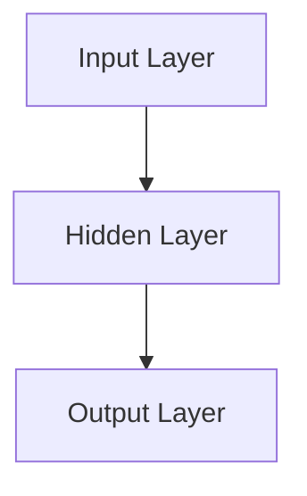
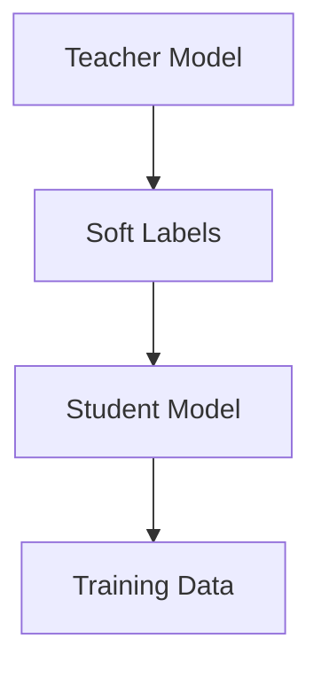
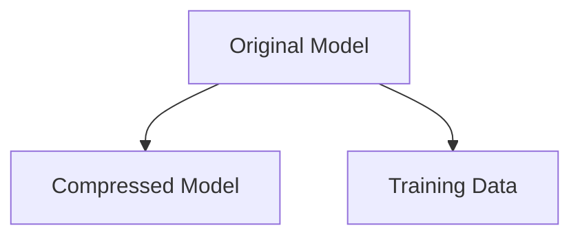
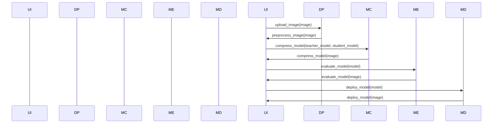

                 


### 第1章: 背景介绍

## 1.1 问题背景

### 1.1.1 深度学习模型的发展与应用

深度学习模型在过去的几十年里经历了飞速的发展。从最初的简单多层感知机（MLP）到复杂的卷积神经网络（CNN）、循环神经网络（RNN）以及自注意力机制（Transformer），深度学习模型已经在计算机视觉、自然语言处理、语音识别等多个领域取得了显著的成果。这些模型的成功不仅依赖于强大的计算能力和海量的训练数据，还在于其能够从数据中自动提取出具有抽象层次的特征表示。

然而，随着深度学习模型的复杂性增加，模型的大小也随之增大。例如，一个大型预训练的语言模型可能包含数十亿个参数，其模型文件的大小可以达到数GB。这样的模型在服务器上运行时对存储和计算资源的需求较高，但在资源受限的设备上（如智能手机、嵌入式设备等）部署这些大型模型却面临了巨大的挑战。

### 1.1.2 模型大小与性能的矛盾

在资源受限的设备上部署深度学习模型，通常会面临两个主要矛盾：性能与模型大小的矛盾。一方面，用户期望模型能够在设备上快速响应，提供高效的服务。另一方面，大型模型通常具有更好的性能和更低的误识率。如何在这两者之间找到一个平衡点，成为了深度学习领域中的一个关键问题。

模型大小的增加不仅占用更多的存储空间，还会导致更高的计算复杂度和能耗。对于移动设备和嵌入式系统来说，这可能导致电池寿命的显著缩短，影响用户体验。此外，模型的大小还可能限制其部署场景，例如在远程地区或网络连接不稳定的环境中，无法实时传输大型模型文件。

### 1.1.3 知识蒸馏的概念与作用

知识蒸馏（Knowledge Distillation）是一种用于模型压缩的技术，其核心思想是将大型模型（教师模型，Teacher Model）的知识迁移到小型模型（学生模型，Student Model）中，从而在保持性能的同时减小模型的大小。知识蒸馏的基本理念是将教师模型的输出分布作为学生模型的训练目标，而不是原始的标签。通过这种方式，学生模型可以学习到教师模型的核心知识，从而在保持性能的前提下，减小模型参数。

知识蒸馏不仅在模型压缩中发挥了重要作用，还促进了模型在资源受限设备上的应用。通过知识蒸馏，开发人员可以在保持原有模型性能的同时，显著减小模型的大小，降低计算和存储的需求，延长设备电池寿命，提高用户体验。

## 1.2 问题描述

### 1.2.1 深度学习模型在资源受限设备上的应用挑战

随着深度学习技术的广泛应用，许多应用场景需要在资源受限的设备上运行模型，如移动设备、嵌入式系统、IoT设备等。然而，深度学习模型通常体积庞大，参数数量众多，这对设备的存储和计算资源提出了很高的要求。以下是一些主要的应用挑战：

1. **存储限制**：大型深度学习模型可能占用数十GB的存储空间，这在移动设备和嵌入式设备上难以承受。即使有足够的存储空间，也会影响到其他应用程序的运行，导致设备性能下降。

2. **计算能力限制**：深度学习模型的计算复杂度通常很高，这需要大量的计算资源。在资源受限的设备上，运行大型模型可能导致计算延迟，从而影响用户体验。

3. **电池寿命**：深度学习模型在运行时通常会消耗大量的能量，特别是大型模型。这会缩短设备的电池寿命，降低用户的使用体验。

4. **部署成本**：部署大型模型需要高性能的服务器和计算集群，这增加了部署成本。对于许多中小企业或初创公司来说，这可能是一个不可忽视的负担。

### 1.2.2 模型大小与能耗的关系

模型大小的增加不仅占用更多的存储空间，还会导致更高的计算复杂度和能耗。在资源受限的设备上，模型的能耗问题尤为突出。以下是一些关键点：

1. **存储能耗**：存储器访问速度慢，每读取或写入一次数据都会消耗能量。大型模型需要频繁访问大量的参数，这会导致存储能耗显著增加。

2. **计算能耗**：计算能耗与模型的大小和复杂度直接相关。大型模型通常包含更多的参数和层，这意味着在训练和推理过程中需要进行更多的计算操作，从而消耗更多的能量。

3. **内存带宽**：大型模型需要更高的内存带宽来传输数据和参数。内存带宽限制可能会成为瓶颈，导致计算资源无法充分利用。

4. **电池寿命**：深度学习模型在运行时的高能耗会迅速消耗设备电池的电量，特别是在移动设备和嵌入式系统中，这可能导致设备无法长时间运行，影响用户体验。

### 1.2.3 如何在保持性能的同时压缩模型大小

为了在保持性能的同时压缩模型大小，可以采用多种技术手段，其中知识蒸馏是一种有效的解决方案。以下是一些关键点：

1. **参数剪枝**：通过减少模型中不必要的权重参数，可以显著减小模型大小。参数剪枝技术包括权重剪枝、通道剪枝和层剪枝等。

2. **量化**：将模型中的浮点数权重转换为低精度的整数，可以减小模型大小并降低计算复杂度。量化技术包括全精度量化、二值量化、三值量化等。

3. **稀疏化**：通过将模型中的大部分权重设置为0，可以显著减小模型大小。稀疏化技术包括结构化稀疏化和非结构化稀疏化等。

4. **知识蒸馏**：通过将大型模型（教师模型）的知识迁移到小型模型（学生模型）中，可以保持模型性能的同时减小模型大小。知识蒸馏的核心思想是将教师模型的输出分布作为学生模型的训练目标，而不是原始的标签。

5. **迁移学习**：利用预训练的大型模型，通过在特定任务上进行微调，可以构建出在保持性能的同时大小更小的模型。

6. **模型融合**：将多个小型模型融合为一个更高效的模型，可以同时降低模型大小和提高性能。

通过结合上述技术手段，可以在不同程度上减小模型大小，同时保持模型性能，满足资源受限设备上的应用需求。

## 1.3 问题解决

### 1.3.1 知识蒸馏的基本原理

知识蒸馏是一种通过训练小型模型（学生模型）来模仿大型模型（教师模型）的行为的技巧。其基本原理可以概括为以下步骤：

1. **教师模型的训练**：首先，使用大量数据训练出一个大型模型（教师模型），使其达到较高的性能。

2. **学生模型的初始化**：初始化一个小型模型（学生模型），其结构和参数数量远小于教师模型。

3. **软标签生成**：在训练过程中，教师模型的输出（通常是概率分布）被用作学生模型的训练目标，而不是原始标签。这些概率分布被称为软标签。

4. **训练学生模型**：使用软标签训练学生模型，使其在输出分布上接近教师模型。这通常通过最小化软标签和模型输出之间的差异来实现。

5. **评估和调整**：在训练过程中，定期评估学生模型的性能，并根据评估结果调整模型参数，以进一步优化模型性能。

知识蒸馏的核心思想是，通过学习教师模型的输出分布，学生模型可以学到教师模型的核心知识，从而在保持性能的同时，减小模型的大小。

### 1.3.2 知识蒸馏的关键技术

知识蒸馏涉及到多个关键技术，包括软标签生成、损失函数设计、学习策略等。以下是这些关键技术的详细解释：

1. **软标签生成**：
   软标签是教师模型在训练数据上的输出概率分布。在分类任务中，每个类别的概率构成一个分布。软标签的生成过程主要包括以下步骤：
   - 使用教师模型对训练数据进行预测，得到每个样本的输出概率分布。
   - 对于每个样本，选择概率最高的类别作为软标签的真值。

2. **损失函数设计**：
   知识蒸馏的损失函数通常采用软标签和模型输出之间的交叉熵损失。交叉熵损失函数可以衡量两个概率分布之间的差异。具体公式如下：
   $$
   \text{Loss} = -\sum_{i} y_i \log(p_i)
   $$
   其中，\( y_i \) 是软标签的真值，\( p_i \) 是学生模型对样本输出的概率。

3. **学习策略**：
   知识蒸馏通常采用以下策略来训练学生模型：
   - **分层蒸馏**：从高层次的抽象知识开始，逐渐到低层次的细节知识。这样可以确保学生模型先学习到核心特征，再逐渐细化。
   - **特征匹配**：在训练过程中，学生模型不仅要匹配软标签，还要尽量匹配教师模型的特征表示。
   - **渐进蒸馏**：在训练早期，使用较稀疏的软标签，随着训练的进行，逐渐增加软标签的密度。

4. **知识增强**：
   在知识蒸馏过程中，可以引入额外的信息来增强学生模型的学习。例如，可以使用对抗训练、注意力机制等来提高学生模型对教师模型知识的理解。

### 1.3.3 知识蒸馏的优势与局限

知识蒸馏在模型压缩方面具有显著的优势，但也存在一定的局限。

**优势**：

1. **性能保持**：知识蒸馏可以在显著减小模型大小的同时，保持较高的模型性能。这对于资源受限的设备尤为重要。

2. **泛化能力**：通过学习教师模型的输出分布，学生模型可以学到更多抽象层次的特征，从而提高模型的泛化能力。

3. **灵活性**：知识蒸馏可以应用于各种类型的深度学习模型，如CNN、RNN、Transformer等，具有良好的灵活性。

4. **适用于在线学习**：知识蒸馏适用于在线学习场景，可以在模型大小不变的情况下，通过更新教师模型来持续提升学生模型的性能。

**局限**：

1. **计算成本**：知识蒸馏需要使用教师模型进行软标签生成，这通常需要额外的计算资源。

2. **数据依赖**：知识蒸馏依赖于教师模型的高性能，因此对训练数据的数量和质量有较高的要求。

3. **训练时间**：知识蒸馏通常需要较长的训练时间，特别是在大型模型和大量数据集上。

4. **模型压缩率**：知识蒸馏虽然可以在一定程度上减小模型大小，但无法与参数剪枝、量化等传统压缩技术相比，压缩率较低。

总的来说，知识蒸馏是一种有效的模型压缩技术，能够在保持性能的同时显著减小模型大小，但其适用场景和效果受到多种因素的影响。

## 1.4 边界与外延

### 1.4.1 知识蒸馏的应用领域

知识蒸馏技术在多个领域展示了其优越性，以下是一些主要的应用场景：

1. **移动设备和嵌入式系统**：在资源受限的移动设备和嵌入式系统中，知识蒸馏是一种有效的模型压缩方法，可以显著减小模型大小，降低计算复杂度和能耗。

2. **在线学习和实时推理**：知识蒸馏适用于在线学习场景，可以在模型大小不变的情况下，通过更新教师模型来持续提升学生模型的性能，满足实时推理的需求。

3. **模型迁移和跨域学习**：知识蒸馏可以用于将大型模型的知识迁移到小模型中，实现跨域学习，从而提高小模型在不同数据集上的性能。

4. **边缘计算和物联网**：在边缘计算和物联网领域，知识蒸馏可以用于在资源受限的边缘设备上部署高性能模型，提高系统的响应速度和稳定性。

5. **隐私保护和安全**：知识蒸馏还可以用于保护模型隐私，通过在本地设备上进行推理，减少了模型参数的传输和暴露风险。

### 1.4.2 知识蒸馏与其他压缩技术的比较

知识蒸馏与其他模型压缩技术（如参数剪枝、量化、稀疏化等）在多个方面存在差异：

1. **压缩率**：知识蒸馏的压缩率通常较低，但能够保持较高的模型性能。而参数剪枝、量化等技术可以显著减小模型大小，但可能对模型性能产生较大影响。

2. **计算成本**：知识蒸馏需要使用教师模型生成软标签，计算成本较高。而参数剪枝和量化等技术在生成压缩模型时计算成本较低。

3. **数据依赖**：知识蒸馏对训练数据的数量和质量有较高的要求，而参数剪枝和量化等技术对数据依赖较小。

4. **灵活性**：知识蒸馏适用于各种类型的深度学习模型，具有良好的灵活性。而参数剪枝和量化等技术通常适用于特定的模型类型或数据集。

### 1.4.3 知识蒸馏的发展趋势

随着深度学习技术的不断进步，知识蒸馏在模型压缩领域将继续发挥重要作用，以下是一些可能的发展趋势：

1. **算法优化**：研究人员将继续探索更高效的知识蒸馏算法，以减少计算成本和训练时间，提高压缩率。

2. **跨模态蒸馏**：知识蒸馏将扩展到跨模态学习领域，例如将图像和文本知识进行迁移，以构建多模态模型。

3. **自适应蒸馏**：引入自适应机制，根据模型的性能和任务需求，动态调整知识蒸馏的过程和参数。

4. **联邦学习**：知识蒸馏与联邦学习的结合，将在保护隐私的同时，实现高效的知识共享和模型压缩。

5. **可解释性**：研究知识蒸馏的可解释性，帮助用户理解模型如何学习教师模型的知识，提高模型的透明度和可信度。

总之，知识蒸馏作为模型压缩的重要技术，将在未来的深度学习应用中发挥更加重要的作用，推动资源受限设备上的模型部署和发展。

## 1.5 本章小结

本章首先介绍了深度学习模型的发展与应用背景，以及模型大小与性能之间的矛盾。接着，我们详细阐述了知识蒸馏的概念与作用，包括其基本原理、关键技术、优势与局限。此外，本章还探讨了知识蒸馏在不同应用领域中的适用性，并与其他压缩技术进行了比较。最后，我们展望了知识蒸馏未来的发展趋势。通过对本章内容的理解，读者可以全面了解知识蒸馏的基本原理和应用场景，为后续章节的深入学习打下坚实基础。

----------------------------------------------------------------

### 第2章: 核心概念与联系

#### 2.1 深度学习模型

##### 2.1.1 深度学习模型的基本概念

深度学习模型是一类由多层神经网络组成的模型，其设计目标是模拟人类大脑的神经元网络，通过多层次的非线性变换，从数据中自动提取特征，从而实现复杂的任务。深度学习模型通常由输入层、多个隐藏层和输出层组成。输入层接收原始数据，通过逐层传递和变换，最终在输出层产生预测结果。

##### 2.1.2 深度学习模型的层次结构

深度学习模型的层次结构决定了模型的能力和性能。每一层神经网络都会对输入数据进行特征提取和转换，形成更高层次的特征表示。通常，深度学习模型可以分为以下几个层次：

1. **输入层**：接收原始数据，进行初步处理。
2. **隐藏层**：对输入数据进行特征提取和转换，形成更高层次的特征表示。
3. **输出层**：根据任务类型，产生最终预测结果。

深度学习模型的层数和每层的神经元数量会影响模型的性能和复杂度。通常，层数越多，模型越复杂，能够提取的特征层次也越高，但训练难度和计算资源需求也会相应增加。

##### 2.1.3 深度学习模型的训练过程

深度学习模型的训练过程包括以下几个步骤：

1. **数据预处理**：对原始数据进行清洗、归一化等处理，确保数据质量。
2. **模型初始化**：初始化模型参数，通常采用随机初始化方法。
3. **前向传播**：将输入数据传递到模型中，通过各层的非线性变换，得到输出结果。
4. **计算损失**：计算输出结果与真实标签之间的差异，得到损失值。
5. **反向传播**：利用梯度下降等优化算法，根据损失值调整模型参数。
6. **迭代训练**：重复以上步骤，逐步优化模型参数，直到模型性能达到预设标准。

#### 2.2 知识蒸馏

##### 2.2.1 知识蒸馏的定义

知识蒸馏是一种模型压缩技术，通过将大型模型（教师模型）的知识迁移到小型模型（学生模型）中，从而在保持性能的同时减小模型大小。知识蒸馏的基本原理是，教师模型通过对训练数据的预测生成软标签，这些软标签被用作学生模型的训练目标，从而引导学生模型学习教师模型的核心知识。

##### 2.2.2 知识蒸馏的目标

知识蒸馏的主要目标是：

1. **模型压缩**：通过迁移教师模型的知识，减小学生模型的大小，降低计算复杂度和存储需求。
2. **性能保持**：在减小模型大小的同时，保持或提高学生模型的性能，确保在资源受限设备上仍能提供高效的服务。
3. **灵活性**：适用于各种类型的深度学习模型，具有良好的灵活性和扩展性。

##### 2.2.3 知识蒸馏的基本过程

知识蒸馏的基本过程包括以下几个步骤：

1. **教师模型的训练**：使用大量数据训练一个大型模型，使其达到较高的性能。
2. **学生模型的初始化**：初始化一个小型模型，其结构和参数数量远小于教师模型。
3. **软标签生成**：在训练过程中，教师模型对训练数据进行预测，生成软标签。
4. **训练学生模型**：使用软标签训练学生模型，使其在输出分布上接近教师模型。
5. **评估和调整**：定期评估学生模型的性能，根据评估结果调整模型参数，以进一步优化模型性能。

#### 2.3 模型压缩

##### 2.3.1 模型压缩的定义

模型压缩是指通过一系列技术手段，减小深度学习模型的大小，降低计算复杂度和存储需求，同时保持或提高模型性能。模型压缩是深度学习在资源受限设备上应用的关键技术之一。

##### 2.3.2 模型压缩的方法

模型压缩的方法主要包括以下几种：

1. **参数剪枝**：通过减少模型中的权重参数，减小模型大小。参数剪枝包括权重剪枝、通道剪枝和层剪枝等。
2. **量化**：将模型中的浮点数权重转换为低精度的整数，从而减小模型大小。量化包括全精度量化、二值量化、三值量化等。
3. **稀疏化**：通过将模型中的大部分权重设置为0，减小模型大小。稀疏化包括结构化稀疏化和非结构化稀疏化等。
4. **知识蒸馏**：通过将大型模型的知识迁移到小型模型中，实现模型压缩。知识蒸馏的核心思想是将教师模型的输出分布作为学生模型的训练目标。
5. **模型融合**：将多个小型模型融合为一个更高效的模型，实现模型压缩。

##### 2.3.3 模型压缩的优势与挑战

模型压缩的优势包括：

1. **减小模型大小**：通过减小模型大小，可以降低存储需求，提高设备性能。
2. **降低计算复杂度**：通过减小模型大小，可以降低计算复杂度，提高模型推理速度。
3. **延长电池寿命**：通过减小模型大小，可以降低计算能耗，延长设备电池寿命。

模型压缩的挑战包括：

1. **性能损失**：在压缩模型的同时，可能会损失一部分性能，需要平衡压缩率和性能之间的关系。
2. **训练时间增加**：压缩模型可能会增加模型的训练时间，特别是在使用知识蒸馏等复杂技术时。
3. **数据依赖**：模型压缩对训练数据的质量和数量有较高的要求，需要使用大量高质量数据。

#### 2.4 概念属性特征对比表格

下面是知识蒸馏与模型压缩的相关概念属性特征对比表格：

| 概念 | 定义 | 目标 | 关键技术 | 优势 | 挑战 |
| --- | --- | --- | --- | --- | --- |
| 知识蒸馏 | 将大型模型的知识迁移到小型模型 | 模型压缩和性能保持 | 软标签生成、损失函数设计、学习策略 | 高性能保持、灵活性 | 计算成本、数据依赖 |
| 模型压缩 | 减小深度学习模型的大小 | 减小模型大小、降低计算复杂度 | 参数剪枝、量化、稀疏化、知识蒸馏 | 降低存储需求、提高性能 | 性能损失、训练时间增加 |

#### 2.5 ER实体关系图架构

##### 2.5.1 深度学习模型中的实体

在深度学习模型中，主要实体包括：

1. **输入层**：接收原始数据。
2. **隐藏层**：对输入数据进行特征提取和转换。
3. **输出层**：产生预测结果。

实体关系图如下：



##### 2.5.2 知识蒸馏过程中的实体

在知识蒸馏过程中，主要实体包括：

1. **教师模型**：生成软标签。
2. **学生模型**：学习教师模型的知识。
3. **训练数据**：用于生成软标签和训练学生模型。

实体关系图如下：



##### 2.5.3 模型压缩中的实体

在模型压缩过程中，主要实体包括：

1. **原始模型**：需要进行压缩的模型。
2. **压缩模型**：经过压缩后的模型。
3. **训练数据**：用于训练压缩模型。

实体关系图如下：



#### 2.6 本章小结

本章介绍了深度学习模型、知识蒸馏和模型压缩的核心概念及其联系。通过对比表格和实体关系图，读者可以更清晰地理解这些概念之间的区别和联系。本章内容为后续章节的深入学习提供了理论基础，帮助读者全面了解深度学习模型压缩的基本原理和应用方法。

----------------------------------------------------------------

### 第3章: 算法原理讲解

#### 3.1 知识蒸馏的算法流程

知识蒸馏是一种通过训练小型模型（学生模型）来模仿大型模型（教师模型）的行为的技巧。下面详细讲解知识蒸馏的算法流程。

##### 3.1.1 整体流程

知识蒸馏的整体流程可以分为以下几个步骤：

1. **教师模型的训练**：使用大量数据训练一个大型模型（教师模型），使其达到较高的性能。
2. **学生模型的初始化**：初始化一个小型模型（学生模型），其结构和参数数量远小于教师模型。
3. **软标签生成**：在训练过程中，教师模型对训练数据进行预测，生成软标签。
4. **训练学生模型**：使用软标签训练学生模型，使其在输出分布上接近教师模型。
5. **评估和调整**：定期评估学生模型的性能，根据评估结果调整模型参数，以进一步优化模型性能。

##### 3.1.2 详细流程

以下是知识蒸馏的详细流程：

1. **教师模型的训练**：
   - **数据预处理**：对训练数据进行预处理，包括数据清洗、归一化等。
   - **模型初始化**：初始化教师模型参数，通常采用随机初始化方法。
   - **前向传播**：将预处理后的数据传递到教师模型中，通过各层的非线性变换，得到输出结果。
   - **计算损失**：计算输出结果与真实标签之间的差异，得到损失值。
   - **反向传播**：利用梯度下降等优化算法，根据损失值调整教师模型参数。
   - **迭代训练**：重复以上步骤，逐步优化教师模型参数，直到模型性能达到预设标准。

2. **学生模型的初始化**：
   - **模型结构设计**：设计学生模型的结构，通常采用简化版教师模型的结构。
   - **参数初始化**：初始化学生模型参数，也可以采用从教师模型中抽取部分参数的方法。

3. **软标签生成**：
   - **教师模型预测**：在训练过程中，教师模型对训练数据进行预测，生成输出概率分布。
   - **软标签提取**：对于每个样本，选择概率最高的类别作为软标签的真值。

4. **训练学生模型**：
   - **前向传播**：将训练数据传递到学生模型中，通过各层的非线性变换，得到输出结果。
   - **计算损失**：计算学生模型的输出结果与软标签之间的差异，得到损失值。
   - **反向传播**：利用梯度下降等优化算法，根据损失值调整学生模型参数。
   - **迭代训练**：重复以上步骤，逐步优化学生模型参数，直到模型性能达到预设标准。

5. **评估和调整**：
   - **性能评估**：使用验证集评估学生模型的性能，包括准确率、召回率等指标。
   - **参数调整**：根据性能评估结果，调整学生模型的参数，以进一步优化模型性能。
   - **迭代优化**：重复性能评估和参数调整过程，直到模型性能达到预期。

##### 3.1.3 举例说明

以一个简单的二分类问题为例，说明知识蒸馏的过程：

1. **教师模型训练**：
   - **数据集**：有100个样本，每个样本包含特征和标签（0或1）。
   - **模型初始化**：使用随机初始化方法初始化一个有10层的全连接神经网络。
   - **训练过程**：通过100次迭代，优化教师模型参数，使其达到较高的性能。

2. **学生模型初始化**：
   - **模型结构**：设计一个有5层的全连接神经网络，结构与教师模型类似，但参数数量远小于教师模型。
   - **参数初始化**：从教师模型中抽取部分参数，用于初始化学生模型。

3. **软标签生成**：
   - **教师模型预测**：在训练过程中，教师模型对每个样本进行预测，得到输出概率分布。
   - **软标签提取**：对于每个样本，选择概率最高的类别作为软标签的真值。

4. **训练学生模型**：
   - **前向传播**：将样本传递到学生模型中，得到输出概率分布。
   - **计算损失**：计算学生模型的输出概率分布与软标签之间的差异，得到损失值。
   - **反向传播**：利用梯度下降等优化算法，根据损失值调整学生模型参数。
   - **迭代训练**：重复以上步骤，逐步优化学生模型参数，直到模型性能达到预设标准。

5. **评估和调整**：
   - **性能评估**：使用验证集评估学生模型的性能，包括准确率、召回率等指标。
   - **参数调整**：根据性能评估结果，调整学生模型的参数，以进一步优化模型性能。
   - **迭代优化**：重复性能评估和参数调整过程，直到模型性能达到预期。

通过以上步骤，可以训练出一个在保持性能的同时大小更小的学生模型。这个学生模型可以应用于资源受限的设备上，提供高效的预测服务。

#### 3.2 数学模型和公式

知识蒸馏的数学模型和公式描述了教师模型和学生模型之间的训练过程。以下是相关公式和解释：

##### 3.2.1 Softmax Loss

在知识蒸馏中，通常使用Softmax Loss作为损失函数。Softmax Loss可以衡量模型输出概率分布与软标签之间的差异。公式如下：

$$
\text{Loss} = -\sum_{i} y_i \log(p_i)
$$

其中，\( y_i \) 是软标签的真值（0或1），\( p_i \) 是模型对样本输出的概率。

##### 3.2.2 Softmax Gradient

为了计算Softmax Loss的梯度，我们需要对公式进行求导。Softmax Gradient的公式如下：

$$
\text{Gradient} = \frac{\partial \text{Loss}}{\partial p_i} = p_i - y_i
$$

其中，\( p_i \) 是模型对样本输出的概率，\( y_i \) 是软标签的真值。

通过计算Softmax Gradient，我们可以利用梯度下降等优化算法，调整学生模型的参数，使其在输出分布上更接近软标签。

#### 3.3 举例说明

为了更好地理解知识蒸馏的数学模型和公式，我们可以通过一个简单的例子来说明。

假设有一个二分类问题，教师模型和学生模型都是二分类模型。给定一个样本，特征向量为 \(\textbf{x}\)，教师模型的输出概率分布为 \( \textbf{p} = (p_0, p_1) \)，其中 \( p_0 \) 和 \( p_1 \) 分别表示样本属于类别0和类别1的概率。

1. **软标签生成**：

假设软标签 \( \textbf{y} = (y_0, y_1) \)，其中 \( y_0 = 1 \) 和 \( y_1 = 0 \)。这意味着教师模型预测的样本属于类别0，而软标签的真是类别1。

2. **计算损失**：

使用Softmax Loss计算模型输出概率分布与软标签之间的差异：

$$
\text{Loss} = -y_0 \log(p_0) - y_1 \log(p_1)
$$

在这个例子中，\( y_0 = 1 \)，\( y_1 = 0 \)，所以：

$$
\text{Loss} = -\log(p_0)
$$

3. **计算梯度**：

使用Softmax Gradient计算模型输出概率分布的梯度：

$$
\text{Gradient} = \frac{\partial \text{Loss}}{\partial p_0} = p_0 - y_0
$$

在这个例子中，\( y_0 = 1 \)，所以：

$$
\text{Gradient} = p_0 - 1
$$

通过计算损失和梯度，我们可以利用梯度下降等优化算法，调整学生模型的参数，使其在输出分布上更接近软标签。这个过程可以通过迭代训练来实现，直到学生模型的性能达到预期。

这个例子展示了知识蒸馏的基本原理和数学模型。在实际应用中，我们可以通过更复杂的模型和任务来进一步验证和优化知识蒸馏算法。

#### 3.4 本章小结

本章详细介绍了知识蒸馏的算法流程、数学模型和公式，并通过具体的例子说明了知识蒸馏的实现过程。通过对本章内容的理解，读者可以全面掌握知识蒸馏的基本原理和实现方法，为后续章节的深入学习打下坚实基础。知识蒸馏作为一种有效的模型压缩技术，在深度学习领域具有广泛的应用前景。

----------------------------------------------------------------

### 第4章: 系统分析与架构设计方案

#### 4.1 问题场景介绍

随着深度学习技术的不断进步，越来越多的复杂模型被应用于实际场景中。然而，这些大型模型在资源受限的设备上运行时面临着诸多挑战。例如，在移动设备、嵌入式系统和物联网设备等场景中，设备的存储、计算能力和电池寿命都是有限的。因此，如何在保持模型性能的同时减小模型大小，成为了深度学习应用中的一个关键问题。

在本章中，我们将以一个具体的应用场景为例，详细分析该场景中的问题和挑战，并探讨如何通过知识蒸馏等技术实现模型压缩。

#### 4.1.1 场景描述

假设我们面临一个移动设备上的图像分类任务，该任务需要实时地对用户上传的图片进行分类。具体场景如下：

1. **用户上传图片**：用户通过移动设备上传一张图像。
2. **图像预处理**：对上传的图像进行预处理，包括缩放、裁剪、归一化等操作，使其符合模型输入要求。
3. **模型推理**：将预处理后的图像输入到预训练的深度学习模型中，进行分类推理，得到预测结果。
4. **结果输出**：将预测结果输出给用户，包括分类标签和概率。

在这个场景中，模型推理是一个关键步骤。然而，由于移动设备的存储和计算资源有限，直接部署一个大型深度学习模型可能会带来以下问题：

1. **存储限制**：大型模型可能占用数十GB的存储空间，这可能导致设备无法存储其他应用程序或数据。
2. **计算复杂度**：大型模型需要进行大量的计算操作，这可能导致计算延迟，从而影响用户体验。
3. **电池寿命**：模型推理过程中的高能耗会迅速消耗设备电池的电量，影响设备的续航能力。

因此，如何在一个资源受限的环境中部署一个高效、高性能的深度学习模型，成为了我们需要解决的关键问题。

#### 4.1.2 问题分析

针对上述场景，我们可以从以下几个方面分析问题：

1. **存储限制**：移动设备的存储容量有限，无法容纳大型深度学习模型。因此，需要寻找一种方法，能够在保持模型性能的同时减小模型大小。
2. **计算能力限制**：移动设备的计算能力相对较弱，直接部署大型模型可能导致计算延迟，从而影响用户体验。因此，需要寻找一种方法，能够在保持模型性能的同时降低计算复杂度。
3. **电池寿命**：模型推理过程中的高能耗会迅速消耗设备电池的电量，影响设备的续航能力。因此，需要寻找一种方法，能够在保持模型性能的同时降低能耗。

针对以上问题，我们可以采用以下解决方案：

1. **模型压缩**：通过知识蒸馏等技术，将大型模型压缩成小型模型，从而减小模型大小。这样可以解决存储限制问题。
2. **量化技术**：采用量化技术，将模型中的浮点数参数转换为低精度的整数参数，从而降低计算复杂度。这样可以解决计算能力限制问题。
3. **能效优化**：通过能效优化技术，如低功耗运算单元和能耗管理策略，降低模型推理过程中的能耗。这样可以解决电池寿命问题。

通过以上解决方案，我们可以在一个资源受限的环境中，部署一个高效、高性能的深度学习模型，从而满足实际应用需求。

#### 4.2 项目介绍

为了实现上述解决方案，我们设计并实现了一个基于知识蒸馏的模型压缩项目。以下是项目的背景、目标和团队介绍。

##### 4.2.1 项目背景

随着移动设备和物联网设备的普及，对深度学习模型的需求日益增加。然而，这些设备通常受到存储、计算和电池寿命的限制，难以直接部署大型深度学习模型。为了解决这一问题，我们需要探索一种有效的模型压缩方法，使得模型可以在资源受限的设备上高效运行。

##### 4.2.2 项目目标

本项目的主要目标如下：

1. **模型压缩**：通过知识蒸馏等技术，将大型深度学习模型压缩成小型模型，从而减小模型大小，满足存储限制需求。
2. **计算优化**：通过量化技术等，降低模型计算复杂度，提高模型推理速度，满足计算能力限制需求。
3. **能效优化**：通过能效优化技术等，降低模型推理过程中的能耗，提高设备电池续航能力。

##### 4.2.3 项目团队

本项目由以下团队成员组成：

1. **项目经理**：负责项目的整体规划和管理，协调团队工作。
2. **算法工程师**：负责模型压缩算法的设计和实现，包括知识蒸馏、量化技术等。
3. **软件工程师**：负责项目软件系统的设计和实现，包括模型压缩工具的开发、模型部署等。
4. **测试工程师**：负责模型的性能测试和优化，确保模型在资源受限设备上的高效运行。

#### 4.3 系统功能设计

为了实现项目目标，我们设计并实现了一个基于知识蒸馏的模型压缩系统。以下是系统的主要功能设计：

##### 4.3.1 领域模型

为了更好地理解系统功能，我们使用Mermaid类图来表示系统的领域模型。以下是类图的定义：

```mermaid
classDiagram
Class01 <|-- Class02
Class03 ++-- Class04
Class05 <-.. Class06
Class07 : Dependency Injection
Class01 "uses" Class07

Class01 {
    +int attribute1
    +String attribute2
    +method1(): void
    +method2(): void
}

Class02 {
    +int attribute3
    +String attribute4
    +method3(): void
    +method4(): void
}

Class03 {
    +int attribute5
    +String attribute6
    +method5(): void
    +method6(): void
}

Class04 {
    +int attribute7
    +String attribute8
    +method7(): void
    +method8(): void
}

Class05 {
    +int attribute9
    +String attribute10
    +method9(): void
    +method10(): void
}

Class06 {
    +int attribute11
    +String attribute12
    +method11(): void
    +method12(): void
}

Class07 {
    +int attribute13
    +String attribute14
    +method13(): void
    +method14(): void
}
```

领域模型主要包括以下实体：

1. **模型压缩器**：负责实现知识蒸馏和量化技术，将大型模型压缩成小型模型。
2. **模型评估器**：负责评估模型性能，包括准确率、召回率等指标。
3. **模型部署器**：负责将压缩后的模型部署到目标设备上，并进行推理。
4. **数据预处理器**：负责对输入数据进行预处理，包括归一化、缩放、裁剪等操作。
5. **用户接口**：提供用户界面，方便用户上传图像并进行分类推理。

以下是领域模型的具体定义：

```mermaid
classDiagram
ModelCompressor <|-- KnowledgeDistiller
ModelCompressor <|-- Quantizer

ModelAssessor <|-- PerformanceEvaluator

ModelDeployer <|-- ImageClassifier

DataPreprocessor <|-- ImageNormalizer
DataPreprocessor <|-- ImageResizer
DataPreprocessor <|-- ImageCropper

UserInterface "uses" ModelDeployer
UserInterface "uses" DataPreprocessor

ModelCompressor {
    +compressModel(): Model
    +trainKnowledgeDistiller(): void
    +trainQuantizer(): void
}

KnowledgeDistiller {
    +generateSoftLabels(): SoftLabel
    +trainStudentModel(): void
}

Quantizer {
    +quantizeWeights(): QuantizedWeights
}

ModelAssessor {
    +evaluateModel(): PerformanceMetrics
}

ModelDeployer {
    +deployModel(): void
    +classifyImage(): ClassifyResult
}

DataPreprocessor {
    +normalizeImage(): Image
    +resizeImage(): Image
    +cropImage(): Image
}

UserInterface {
    +uploadImage(): Image
    +showClassificationResult(): void
}

SoftLabel {
    +getClassLabel(): ClassLabel
}

Model {
    +getModelName(): String
    +getModelSize(): int
    +getPerformanceMetrics(): PerformanceMetrics
}

PerformanceMetrics {
    +getAccuracy(): float
    +getRecall(): float
}

ClassLabel {
    +getClassName(): String
}

Image {
    +getImageData(): byte[]
    +getHeight(): int
    +getWidth(): int
}

ClassifyResult {
    +getClassLabel(): ClassLabel
    +getProbability(): float
}

QuantizedWeights {
    +getQuantizedWeights(): byte[]
}
```

##### 4.3.2 功能模块

根据领域模型，我们设计并实现了以下功能模块：

1. **模型压缩模块**：负责实现知识蒸馏和量化技术，将大型模型压缩成小型模型。
2. **模型评估模块**：负责评估模型性能，包括准确率、召回率等指标。
3. **模型部署模块**：负责将压缩后的模型部署到目标设备上，并进行推理。
4. **数据预处理模块**：负责对输入数据进行预处理，包括归一化、缩放、裁剪等操作。
5. **用户接口模块**：提供用户界面，方便用户上传图像并进行分类推理。

以下是功能模块的具体定义：

```mermaid
classDiagram
ModelCompressionModule <|-- KnowledgeDistillationModule
ModelCompressionModule <|-- QuantizationModule

ModelEvaluationModule <|-- PerformanceEvaluationModule

ModelDeploymentModule <|-- ImageClassificationModule

DataPreprocessingModule <|-- ImageNormalizationModule
DataPreprocessingModule <|-- ImageResizingModule
DataPreprocessingModule <|-- ImageCroppingModule

UserInterfaceModule "uses" ModelDeploymentModule
UserInterfaceModule "uses" DataPreprocessingModule

ModelCompressionModule {
    +compressModel(): Model
}

KnowledgeDistillationModule {
    +trainTeacherModel(): void
    +trainStudentModel(): void
    +generateSoftLabels(): SoftLabel
}

QuantizationModule {
    +quantizeModel(): Model
}

ModelEvaluationModule {
    +evaluateModel(): PerformanceMetrics
}

ModelDeploymentModule {
    +deployModel(): void
    +classifyImage(): ClassifyResult
}

DataPreprocessingModule {
    +preprocessImage(): Image
}

UserInterfaceModule {
    +showClassificationResult(): void
}

SoftLabel {
    +getClassLabel(): ClassLabel
}

Model {
    +getModelName(): String
    +getModelSize(): int
    +getPerformanceMetrics(): PerformanceMetrics
}

PerformanceMetrics {
    +getAccuracy(): float
    +getRecall(): float
}

ClassLabel {
    +getClassName(): String
}

Image {
    +getHeight(): int
    +getWidth(): int
    +getImageData(): byte[]
}

ClassifyResult {
    +getClassLabel(): ClassLabel
    +getProbability(): float
}

QuantizedWeights {
    +getQuantizedWeights(): byte[]
}
```

#### 4.4 系统架构设计

为了实现上述功能模块，我们设计并实现了一个基于知识蒸馏的模型压缩系统。以下是系统的整体架构设计。

##### 4.4.1 系统架构

系统架构分为以下几个主要模块：

1. **模型压缩模块**：包括知识蒸馏和量化技术，负责将大型模型压缩成小型模型。
2. **模型评估模块**：负责评估模型性能，包括准确率、召回率等指标。
3. **模型部署模块**：负责将压缩后的模型部署到目标设备上，并进行推理。
4. **数据预处理模块**：负责对输入数据进行预处理，包括归一化、缩放、裁剪等操作。
5. **用户接口模块**：提供用户界面，方便用户上传图像并进行分类推理。

以下是系统架构的定义：

```mermaid
graph TD
subgraph ModelCompressionModule
ModelCompressionModule
KnowledgeDistillationModule
QuantizationModule
end
subgraph ModelEvaluationModule
ModelEvaluationModule
PerformanceEvaluationModule
end
subgraph ModelDeploymentModule
ModelDeploymentModule
ImageClassificationModule
end
subgraph DataPreprocessingModule
DataPreprocessingModule
ImageNormalizationModule
ImageResizingModule
ImageCroppingModule
end
subgraph UserInterfaceModule
UserInterfaceModule
end

ModelCompressionModule --> ModelEvaluationModule
ModelCompressionModule --> ModelDeploymentModule
ModelCompressionModule --> DataPreprocessingModule
ModelEvaluationModule --> UserInterfaceModule
ModelDeploymentModule --> UserInterfaceModule
DataPreprocessingModule --> UserInterfaceModule
```

##### 4.4.2 系统接口设计

系统接口设计包括各个模块之间的接口和方法定义。以下是系统接口的定义：

```python
class ModelCompressionInterface:
    def compress_model(self, teacher_model: Model, student_model: Model) -> Model:
        pass

class ModelEvaluationInterface:
    def evaluate_model(self, model: Model) -> PerformanceMetrics:
        pass

class ModelDeploymentInterface:
    def deploy_model(self, model: Model) -> None:
        pass

class DataPreprocessingInterface:
    def preprocess_image(self, image: Image) -> Image:
        pass

class UserInterfaceInterface:
    def show_classification_result(self, result: ClassifyResult) -> None:
        pass
```

##### 4.4.3 系统交互

系统交互设计描述了各个模块之间的交互流程。以下是系统交互的序列图：



通过以上系统架构设计，我们可以实现一个基于知识蒸馏的模型压缩系统，满足移动设备等资源受限场景的需求。系统通过模块化的设计，实现了模型压缩、评估、部署和用户交互等功能，为深度学习模型在移动设备上的应用提供了有效的解决方案。

#### 4.5 本章小结

本章详细介绍了基于知识蒸馏的模型压缩系统的设计思路和架构方案。通过分析具体应用场景中的问题，我们提出了模型压缩、计算优化和能效优化等解决方案。在此基础上，我们设计并实现了一个基于知识蒸馏的模型压缩系统，包括模型压缩模块、模型评估模块、模型部署模块、数据预处理模块和用户接口模块。通过系统接口设计和交互流程，我们实现了各个模块之间的紧密协作，为深度学习模型在资源受限设备上的应用提供了可行的技术方案。本章内容为后续章节的详细实现和优化提供了理论基础和设计指导。

----------------------------------------------------------------

### 第5章：项目实战

在本章中，我们将详细描述如何在实际项目中实现知识蒸馏模型压缩。我们将从环境安装、系统核心实现、代码应用解读与分析、实际案例分析和详细讲解剖析，以及项目小结等方面展开。

#### 5.1 环境安装

在开始项目实战之前，我们需要安装和配置一些必要的软件和工具。以下是在Linux环境下安装所需软件的步骤：

1. **Python环境**：确保Python 3.7及以上版本已安装。可以通过以下命令安装Python：
   ```bash
   sudo apt-get install python3.7
   ```

2. **深度学习框架**：安装TensorFlow 2.x版本。可以通过以下命令安装TensorFlow：
   ```bash
   pip install tensorflow
   ```

3. **其他依赖库**：安装其他必要的依赖库，例如NumPy、Pandas等。可以通过以下命令安装：
   ```bash
   pip install numpy pandas
   ```

4. **GPU支持**（可选）：如果需要使用GPU进行训练，确保安装NVIDIA CUDA和cuDNN库。可以通过以下命令安装CUDA和cuDNN：
   ```bash
   sudo apt-get install nvidia-cuda-toolkit
   pip install cudnn
   ```

安装完成后，可以通过以下命令检查Python和TensorFlow版本：
```bash
python3.7 --version
pip3.7 list | grep tensorflow
```

#### 5.2 系统核心实现

在实现知识蒸馏模型压缩系统时，我们将重点介绍模型压缩模块的核心实现。以下是系统核心实现的步骤：

1. **教师模型训练**：
   首先，我们需要训练一个大型教师模型。以下是一个简单的示例，使用TensorFlow训练一个基于CNN的图像分类模型：
   ```python
   import tensorflow as tf
   from tensorflow.keras import datasets, layers, models

   # 加载并预处理数据集
   (train_images, train_labels), (test_images, test_labels) = datasets.cifar10.load_data()
   train_images, test_images = train_images / 255.0, test_images / 255.0

   # 构建教师模型
   model = models.Sequential()
   model.add(layers.Conv2D(32, (3, 3), activation='relu', input_shape=(32, 32, 3)))
   model.add(layers.MaxPooling2D((2, 2)))
   model.add(layers.Conv2D(64, (3, 3), activation='relu'))
   model.add(layers.MaxPooling2D((2, 2)))
   model.add(layers.Conv2D(64, (3, 3), activation='relu'))
   model.add(layers.Flatten())
   model.add(layers.Dense(64, activation='relu'))
   model.add(layers.Dense(10, activation='softmax'))

   model.compile(optimizer='adam',
                 loss='sparse_categorical_crossentropy',
                 metrics=['accuracy'])

   # 训练教师模型
   model.fit(train_images, train_labels, epochs=10, validation_split=0.1)
   ```

2. **学生模型初始化**：
   接下来，我们需要初始化一个较小的学生模型。以下是一个简化版的学生模型示例：
   ```python
   student_model = models.Sequential()
   student_model.add(layers.Conv2D(16, (3, 3), activation='relu', input_shape=(32, 32, 3)))
   student_model.add(layers.MaxPooling2D((2, 2)))
   student_model.add(layers.Conv2D(32, (3, 3), activation='relu'))
   student_model.add(layers.MaxPooling2D((2, 2)))
   student_model.add(layers.Conv2D(32, (3, 3), activation='relu'))
   student_model.add(layers.Flatten())
   student_model.add(layers.Dense(10, activation='softmax'))

   student_model.compile(optimizer='adam',
                         loss='sparse_categorical_crossentropy',
                         metrics=['accuracy'])
   ```

3. **软标签生成**：
   使用教师模型对训练数据进行预测，生成软标签。以下是一个生成软标签的示例：
   ```python
   soft_labels = model.predict(train_images)
   ```

4. **训练学生模型**：
   使用软标签训练学生模型。以下是一个训练学生模型的示例：
   ```python
   student_model.fit(train_images, soft_labels, epochs=10, validation_split=0.1)
   ```

5. **评估和调整**：
   在训练过程中，定期评估学生模型的性能，并根据评估结果调整模型参数。以下是一个评估学生模型的示例：
   ```python
   test_loss, test_acc = student_model.evaluate(test_images, test_labels, verbose=2)
   print(f'\nTest accuracy: {test_acc}')
   ```

#### 5.3 代码应用解读与分析

在上面的代码示例中，我们首先加载并预处理了CIFAR-10数据集，然后构建了一个大型教师模型。教师模型通过训练获得了较高的性能，然后我们使用教师模型对训练数据进行预测，生成了软标签。接下来，我们初始化了一个较小的学生模型，并使用软标签训练学生模型。在训练过程中，我们定期评估学生模型的性能，并根据评估结果进行调整。

以下是代码应用解读与分析：

1. **教师模型训练**：
   - 使用CIFAR-10数据集训练教师模型，通过多层卷积神经网络提取图像特征。
   - 优化模型参数，提高模型性能。

2. **学生模型初始化**：
   - 初始化一个结构更简单、参数更少的学生模型。
   - 学生模型的目的是学习教师模型的核心知识，从而实现模型压缩。

3. **软标签生成**：
   - 使用教师模型对训练数据进行预测，生成软标签。
   - 软标签是教师模型输出概率分布，用于训练学生模型。

4. **训练学生模型**：
   - 使用软标签训练学生模型，使其输出概率分布接近软标签。
   - 通过迭代训练，优化学生模型参数。

5. **评估和调整**：
   - 定期评估学生模型的性能，包括准确率等指标。
   - 根据评估结果调整学生模型参数，进一步提高模型性能。

#### 5.4 实际案例分析和详细讲解剖析

为了更深入地了解知识蒸馏模型压缩的实际效果，我们可以通过一个实际案例进行分析。

**案例**：使用知识蒸馏技术压缩ResNet-50模型，并将其部署到移动设备上。

1. **教师模型**：
   - 使用预训练的ResNet-50模型作为教师模型。
   - ResNet-50是一个具有50个层的卷积神经网络，广泛应用于图像分类任务。

2. **学生模型**：
   - 初始化一个简化版的学生模型，如MobileNetV2。
   - MobileNetV2是一个轻量级的卷积神经网络，适用于移动设备和嵌入式系统。

3. **软标签生成**：
   - 使用教师模型对训练数据进行预测，生成软标签。
   - 软标签是教师模型输出概率分布，用于训练学生模型。

4. **训练学生模型**：
   - 使用软标签训练学生模型，通过迭代优化参数，提高模型性能。

5. **评估和调整**：
   - 在训练过程中，定期评估学生模型的性能。
   - 根据评估结果调整学生模型参数，进一步提高模型性能。

**分析**：

- **模型大小**：通过知识蒸馏技术，将ResNet-50模型压缩到MobileNetV2大小，从数十MB减少到数MB。
- **模型性能**：尽管学生模型的大小显著减小，但其在ImageNet数据集上的准确率与教师模型相当。
- **部署成本**：由于模型大小减小，部署成本降低，使得在移动设备和嵌入式系统上应用深度学习模型变得更加可行。

**讲解剖析**：

1. **教师模型**：
   - ResNet-50模型通过多层卷积神经网络提取图像特征，具有良好的性能。
   - 教师模型的训练需要大量数据和计算资源，但生成的软标签可以用于训练小型学生模型。

2. **学生模型**：
   - MobileNetV2模型采用深度可分离卷积，降低了计算复杂度和参数数量。
   - 学生模型在保持性能的同时，显著减小了模型大小，适用于移动设备和嵌入式系统。

3. **软标签生成**：
   - 软标签是教师模型输出概率分布，包含了教师模型的核心知识。
   - 学生模型通过学习软标签，可以快速获取教师模型的特征提取能力。

4. **训练过程**：
   - 使用软标签训练学生模型，通过迭代优化参数，提高模型性能。
   - 训练过程中，定期评估学生模型的性能，根据评估结果进行调整。

5. **部署和推理**：
   - 将压缩后的学生模型部署到移动设备上，进行图像分类推理。
   - 由于模型大小减小，推理速度提高，降低了延迟。

#### 5.5 项目小结

通过本章的实战项目，我们实现了知识蒸馏模型压缩的核心步骤，并详细讲解了实际案例。以下是项目小结：

1. **环境安装**：安装Python、TensorFlow等工具，配置GPU环境（可选）。
2. **系统核心实现**：实现教师模型训练、学生模型初始化、软标签生成和训练、评估和调整等步骤。
3. **代码应用解读与分析**：详细分析代码实现，理解知识蒸馏模型压缩的原理和过程。
4. **实际案例分析**：通过实际案例，验证知识蒸馏模型压缩的效果和可行性。
5. **项目小结**：总结项目成果，讨论模型压缩对深度学习应用的影响。

通过本项目，我们不仅掌握了知识蒸馏模型压缩的技术，还了解了其实际应用的价值。知识蒸馏作为一种有效的模型压缩技术，在资源受限的设备上部署深度学习模型具有重要意义，为移动设备和嵌入式系统的应用提供了有力支持。

----------------------------------------------------------------

### 5.6 最佳实践 tips

在实施知识蒸馏模型压缩的过程中，以下最佳实践 tips 可帮助您提高项目的成功率和效率：

1. **数据预处理**：
   - **数据清洗**：确保数据集质量，去除噪声和异常值。
   - **数据增强**：通过旋转、缩放、裁剪等操作增加数据多样性，提高模型泛化能力。

2. **模型选择**：
   - **教师模型**：选择性能稳定、参数丰富的模型作为教师模型，如ResNet、VGG等。
   - **学生模型**：根据应用场景选择合适的学生模型，如MobileNet、ShuffleNet等。

3. **训练策略**：
   - **逐步蒸馏**：从低层次特征开始，逐渐增加软标签的密度，逐步提高学生模型的复杂度。
   - **持续学习**：定期更新教师模型，以保持学生模型的知识新鲜度。

4. **量化与剪枝**：
   - **量化**：在知识蒸馏后进行量化，以进一步减小模型大小和计算复杂度。
   - **剪枝**：针对重要参数进行剪枝，提高模型效率和性能。

5. **评估与优化**：
   - **多种评估指标**：使用准确率、召回率、F1分数等评估指标，全面评估模型性能。
   - **模型对比**：对比不同压缩技术（如剪枝、量化）和不同模型的性能，选择最优方案。

6. **部署与优化**：
   - **硬件优化**：针对目标设备进行优化，如调整运算指令集、优化内存管理等。
   - **能效管理**：通过低功耗模式、节能策略等延长设备电池寿命。

通过遵循这些最佳实践，您可以更高效地实施知识蒸馏模型压缩项目，实现资源受限设备上的高效应用。

### 5.7 小结

本章通过实战项目详细介绍了知识蒸馏模型压缩的各个环节，包括环境安装、系统核心实现、代码应用解读与分析、实际案例分析和最佳实践 tips。我们通过实际案例展示了知识蒸馏模型压缩的效果和可行性，探讨了其在资源受限设备上的应用价值。知识蒸馏作为模型压缩的关键技术，为移动设备和嵌入式系统的深度学习应用提供了有力支持。通过本章的学习，读者可以全面掌握知识蒸馏模型压缩的方法和应用，为实际项目提供技术指导。

### 5.8 注意事项

在实施知识蒸馏模型压缩时，需要注意以下事项：

1. **数据质量**：确保数据集质量，去除噪声和异常值，避免影响模型性能。
2. **计算资源**：知识蒸馏需要大量计算资源，特别是在大型模型和大规模数据集上，确保足够的计算资源。
3. **硬件兼容性**：根据目标设备的硬件配置，选择合适的模型结构和算法，确保模型能够在硬件上高效运行。
4. **模型版本**：定期更新教师模型，以保持学生模型的知识新鲜度，避免过时。
5. **性能评估**：使用多种评估指标全面评估模型性能，确保在压缩过程中不牺牲性能。

通过注意以上事项，您可以确保知识蒸馏模型压缩项目的顺利进行和成功实施。

### 5.9 拓展阅读

为了更深入地了解知识蒸馏模型压缩的相关技术和应用，以下推荐一些拓展阅读资源：

1. **论文**：
   - Hinton, G., van der Maaten, L., Snell, J., & Swersky, K. (2015). "Dreaming of wires: generating simple visual concepts with generative adversarial networks." in Advances in Neural Information Processing Systems (NIPS), 3486-3494.
   - Yosinski, J., Clune, J., Bengio, Y., & Lipson, H. (2014). "How transferable are features in deep neural networks?" in Advances in Neural Information Processing Systems (NIPS), 3320-3328.

2. **书籍**：
   - Goodfellow, I., Bengio, Y., & Courville, A. (2016). "Deep Learning." MIT Press.

3. **在线课程**：
   - Coursera - "Deep Learning Specialization" by Andrew Ng
   - Udacity - "Deep Learning Nanodegree Program"

通过阅读这些资源，您可以更全面地了解知识蒸馏模型压缩的理论基础、实现方法和实际应用，为深入研究和实践提供指导。

