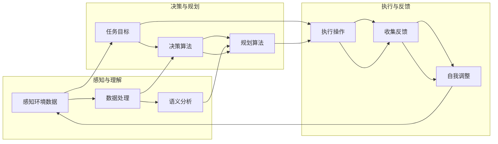
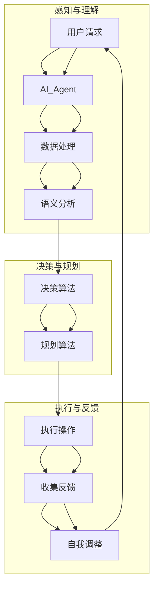
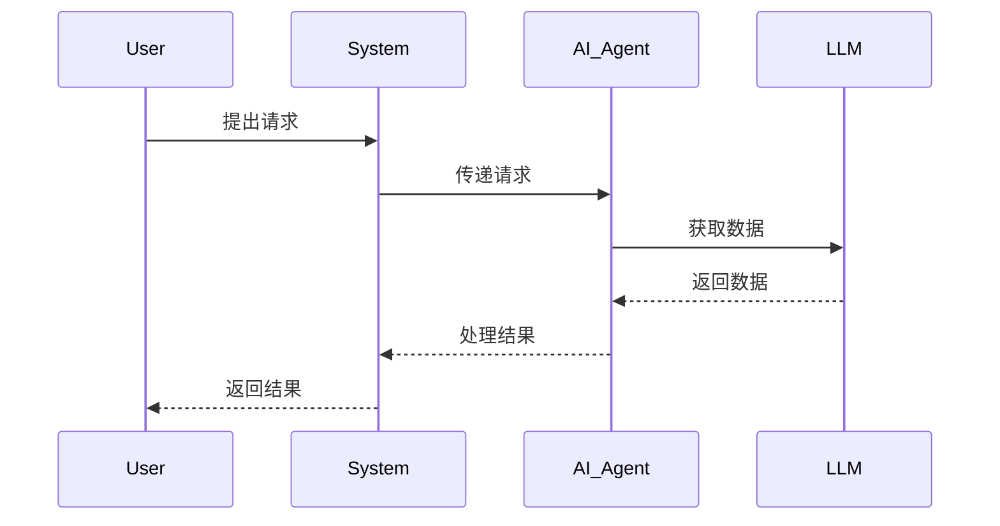

                 

### 文章标题：研发助手 AI Agent：LLM 在科研过程中的辅助作用

关键词：AI Agent、LLM、科研辅助、大数据分析、算法优化、智能决策

摘要：本文深入探讨了研发助手 AI Agent 和大型语言模型（LLM）在科研过程中的辅助作用。通过详细的案例分析，文章展示了如何利用 AI Agent 和 LLM 提升科研效率，降低人工错误，加速科研成果的转化。本文旨在为科研工作者提供一种全新的思考方式，以更好地理解和应用人工智能技术于科研实践。

---

### 引言和背景

#### 1.1 问题背景

在当今的科研领域，信息爆炸和数据驱动的趋势使得科研工作者面临越来越多的挑战。传统的科研方法由于依赖人工处理大量数据和文献，效率低下，且易出错。此外，科研过程中的实验设计、数据分析、文献检索和论文撰写等环节都需要大量时间和精力，这无疑增加了科研工作者的负担。

#### 1.2 问题描述

当前科研过程中存在的问题主要包括：

1. **数据量大且复杂**：科研过程中产生的数据量庞大，且数据类型多样，传统的数据处理方法难以应对。
2. **文献检索困难**：科研工作者需要从海量文献中快速找到相关资料，但现有的检索工具效率不高。
3. **实验设计繁琐**：实验设计需要考虑多种因素，过程复杂，易出现错误。
4. **数据分析耗时**：数据分析通常涉及复杂的统计和计算，耗时较长。
5. **论文撰写困难**：撰写高质量的科研论文需要具备深厚的专业知识和严谨的逻辑思维。

#### 1.3 问题解决

为了解决上述问题，研究人员开始探索利用人工智能技术，尤其是 AI Agent 和 LLM，来辅助科研过程。AI Agent 是一种能够自主执行任务的人工智能系统，而 LLM 则是一种能够处理和生成自然语言文本的大型语言模型。通过结合 AI Agent 和 LLM，科研工作者可以大幅提高工作效率，降低错误率，加快科研成果的转化。

#### 1.4 边界与外延

本文将探讨 AI Agent 和 LLM 在以下科研环节的辅助作用：

1. **文献检索**：利用 AI Agent 的智能搜索和 LLM 的语言理解能力，快速找到相关文献。
2. **实验设计**：通过 AI Agent 的自动化设计和优化，简化实验流程。
3. **数据分析**：利用 LLM 的强大计算能力和 AI Agent 的数据分析技能，加速数据分析过程。
4. **论文撰写**：借助 LLM 的文本生成能力，辅助科研工作者撰写论文。

#### 1.5 概念结构与核心要素组成

本文的结构如下：

1. **第2章 AI Agent基础理论**：介绍 AI Agent 的定义、类型、工作原理和核心特点。
2. **第3章 LLM基础理论**：讨论 LLM 的定义、主要模型、训练方法和应用场景。
3. **第4章 AI Agent与LLM的结合**：分析 AI Agent 和 LLM 的结合原理、优势和应用案例。
4. **第5章 AI Agent在科研中的应用**：探讨 AI Agent 在科研过程中的应用场景和具体作用。
5. **第6章 应用案例与研究成果**：展示实际应用案例和研究成果。
6. **第7章 未来展望与挑战**：展望 AI Agent 和 LLM 在科研领域的未来发展趋势和面临的问题。

---

### AI Agent基础理论

#### 2.1 AI Agent的定义与类型

AI Agent，即人工智能助手，是一种能够模拟人类智能，自主执行任务的人工智能系统。根据任务类型，AI Agent 主要分为以下几类：

1. **任务型 AI Agent**：专注于执行特定任务，如智能客服、自动驾驶等。
2. **通用型 AI Agent**：具备广泛的知识和技能，能够处理多种类型的任务，如个人助理、智能助手等。

#### 2.2 AI Agent的工作原理

AI Agent 的工作原理主要包括以下几个方面：

1. **感知与理解**：通过传感器获取环境信息，并通过自然语言处理等技术理解这些信息。
2. **决策与规划**：根据任务目标和环境信息，进行决策和规划，以确定最佳行动方案。
3. **执行与反馈**：执行决策，并根据执行结果进行反馈调整。

#### 2.3 AI Agent的核心特点

AI Agent 具有以下几个核心特点：

1. **自主性**：能够自主感知环境、做出决策和执行任务。
2. **适应性**：能够根据环境和任务需求进行自适应调整。
3. **灵活性**：能够处理复杂、多样化的任务。

#### 2.4 AI Agent的发展历史

AI Agent的发展可以追溯到20世纪50年代，当时人工智能的概念开始兴起。随着计算能力和算法的进步，AI Agent的技术逐渐成熟，并在20世纪80年代开始应用于实际场景。近年来，随着深度学习和自然语言处理技术的突破，AI Agent得到了快速发展，并在多个领域取得了显著成果。

#### 2.5 AI Agent的应用领域

AI Agent 在多个领域具有广泛应用，主要包括：

1. **智能客服**：通过自然语言处理技术，实现与用户的智能交互，提高服务效率。
2. **自动驾驶**：利用感知、决策和执行技术，实现汽车的自主驾驶。
3. **智能家居**：通过物联网技术，实现家居设备的智能控制和管理。
4. **医疗诊断**：利用医学知识库和数据分析技术，辅助医生进行疾病诊断。

---

### LLM基础理论

#### 3.1 LLM的定义与特性

大型语言模型（LLM），即具有大规模参数和强大语言理解能力的语言模型。与传统的语言模型相比，LLM具有以下几个显著特性：

1. **大规模参数**：LLM通常拥有数十亿甚至千亿级别的参数，这使得其具有强大的语言理解能力和生成能力。
2. **泛化能力**：LLM能够处理多种语言任务，如文本分类、问答、机器翻译等。
3. **自适应能力**：LLM能够根据输入文本进行自适应调整，生成符合上下文语义的文本。

#### 3.2 LLM的主要模型

LLM的主要模型包括：

1. **Transformer模型**：Transformer模型是一种基于注意力机制的深度神经网络，广泛应用于自然语言处理任务。
2. **BERT模型**：BERT（Bidirectional Encoder Representations from Transformers）模型是谷歌提出的一种双向Transformer模型，具有强大的语言理解能力。
3. **GPT模型**：GPT（Generative Pretrained Transformer）模型是一种自回归语言模型，能够生成符合上下文语义的文本。

#### 3.3 LLM的训练方法

LLM的训练方法主要包括以下几种：

1. **自监督训练**：通过预训练大量无标签文本数据，使模型自动学习语言规律。
2. **有监督训练**：在预训练基础上，利用标注数据进一步训练模型，提高其在特定任务上的性能。
3. **混合训练**：结合自监督训练和有监督训练，充分发挥两种训练方法的优点。

#### 3.4 LLM的应用场景

LLM 在多个应用场景中表现出色，主要包括：

1. **文本生成**：如文章写作、对话生成等。
2. **文本分类**：如情感分析、新闻分类等。
3. **机器翻译**：如中英互译、多语言翻译等。
4. **问答系统**：如智能客服、语音助手等。

#### 3.5 LLM的优势与挑战

LLM 的优势主要包括：

1. **强大的语言理解能力**：能够处理复杂的语言结构和语义。
2. **高效的文本生成能力**：能够生成高质量、符合上下文的文本。
3. **广泛的适用范围**：能够应用于多种自然语言处理任务。

然而，LLM 也面临一些挑战，主要包括：

1. **计算资源需求大**：训练和运行LLM需要大量的计算资源和时间。
2. **数据隐私和安全问题**：LLM的训练和运行过程中涉及大量敏感数据，可能引发隐私和安全问题。
3. **模型解释性和透明度不足**：LLM的决策过程复杂，难以解释和理解。

---

### AI Agent与LLM的结合

#### 4.1 AI Agent与LLM的结合原理

AI Agent 与 LLM 的结合，旨在发挥两者各自的优势，实现协同工作。具体来说，AI Agent 可以利用 LLM 的语言理解能力和文本生成能力，辅助科研工作者完成以下任务：

1. **文献检索**：利用 LLM 的自然语言处理能力，快速找到相关文献。
2. **实验设计**：利用 LLM 的知识库和生成能力，辅助设计实验方案。
3. **数据分析**：利用 LLM 的计算能力和数据理解能力，加速数据分析过程。
4. **论文撰写**：利用 LLM 的文本生成能力，辅助撰写论文。

#### 4.2 结合后的优势

AI Agent 与 LLM 的结合，具有以下优势：

1. **提高科研效率**：利用 LLM 的强大语言处理能力，AI Agent 可以快速完成文献检索、实验设计和论文撰写等任务，大大提高科研效率。
2. **降低人工错误**：AI Agent 可以自动处理大量数据，减少人工错误，提高科研结果的准确性。
3. **拓展科研领域**：AI Agent 和 LLM 的结合，使得科研工作者可以探索更多领域，解决传统方法难以解决的问题。
4. **增强知识共享**：AI Agent 可以帮助科研工作者更好地管理和利用已有知识，促进知识共享和交流。

#### 4.3 实现方法

实现 AI Agent 与 LLM 的结合，需要以下几个步骤：

1. **数据收集和预处理**：收集科研领域相关的数据，并进行预处理，如文本清洗、数据归一化等。
2. **模型训练**：利用预处理后的数据，训练 LLM 模型，使其具备强大的语言处理能力。
3. **集成与部署**：将 LLM 模型集成到 AI Agent 中，使其具备辅助科研工作的能力。
4. **交互与优化**：通过与科研工作者的交互，不断优化 AI Agent 的性能，使其更好地满足科研需求。

#### 4.4 应用案例分析

以下是一个 AI Agent 与 LLM 结合的实际应用案例：

某科研团队在研究新型药物的开发过程中，利用 AI Agent 和 LLM 结合的方法，大大提高了科研效率。具体应用如下：

1. **文献检索**：利用 LLM 的自然语言处理能力，AI Agent 可以快速找到相关文献，帮助科研团队了解当前研究进展。
2. **实验设计**：利用 LLM 的知识库和生成能力，AI Agent 可以辅助设计实验方案，提高实验成功率。
3. **数据分析**：利用 LLM 的计算能力和数据理解能力，AI Agent 可以加速数据分析过程，帮助科研团队快速得出结论。
4. **论文撰写**：利用 LLM 的文本生成能力，AI Agent 可以辅助撰写论文，提高论文质量。

通过这一案例，我们可以看到，AI Agent 和 LLM 的结合，对于提升科研效率、降低人工错误具有重要意义。

---

### AI Agent在科研中的应用

#### 5.1 AI Agent在科研过程中的角色

AI Agent 在科研过程中扮演着多重角色，其核心作用包括：

1. **任务执行者**：AI Agent 可以自动执行科研任务，如文献检索、数据分析和实验设计，大大减轻科研工作者的负担。
2. **知识管理者**：AI Agent 可以帮助科研工作者管理大量知识，如文献资料、实验数据和模型代码，提高知识共享和复用。
3. **辅助决策者**：AI Agent 可以根据科研数据和已有知识，为科研工作者提供决策建议，如实验参数调整、数据分析方法选择等。

#### 5.2 AI Agent在文献检索中的应用

在文献检索方面，AI Agent 具有显著优势：

1. **智能搜索**：AI Agent 可以利用 LLM 的自然语言处理能力，实现智能搜索，快速找到相关文献。
2. **关键词提取**：AI Agent 可以从大量文献中提取关键词，帮助科研工作者快速定位感兴趣的研究领域。
3. **语义分析**：AI Agent 可以对文献进行语义分析，提取关键信息，帮助科研工作者了解研究进展。

#### 5.3 AI Agent在实验设计中的应用

在实验设计方面，AI Agent 可以发挥以下作用：

1. **实验方案优化**：AI Agent 可以利用 LLM 的知识库和生成能力，为科研工作者提供优化后的实验方案，提高实验成功率。
2. **实验参数调整**：AI Agent 可以根据实验数据和已有知识，自动调整实验参数，以获得更好的实验结果。
3. **实验数据分析**：AI Agent 可以对实验数据进行分析，为科研工作者提供数据支持和决策建议。

#### 5.4 AI Agent在数据分析中的应用

在数据分析方面，AI Agent 可以发挥以下作用：

1. **数据预处理**：AI Agent 可以自动进行数据清洗、归一化和特征提取，提高数据分析效率。
2. **统计计算**：AI Agent 可以利用 LLM 的计算能力，快速进行复杂的统计计算，如回归分析、聚类分析等。
3. **数据可视化**：AI Agent 可以将数据分析结果可视化，帮助科研工作者更直观地理解数据。

#### 5.5 AI Agent在论文撰写中的应用

在论文撰写方面，AI Agent 可以发挥以下作用：

1. **摘要生成**：AI Agent 可以利用 LLM 的文本生成能力，为科研工作者生成论文摘要，提高写作效率。
2. **段落填充**：AI Agent 可以根据已有数据和文献，为科研工作者生成论文中的各个段落，减少写作负担。
3. **参考文献整理**：AI Agent 可以自动整理参考文献，确保论文格式规范。

---

### 应用案例与研究成果

#### 6.1 AI Agent应用案例

以下是一个 AI Agent 在科研领域中的应用案例：

某生物科技公司利用 AI Agent 和 LLM 结合的方法，提高了药物研发效率。具体应用如下：

1. **文献检索**：AI Agent 利用 LLM 的自然语言处理能力，快速找到相关文献，帮助科研团队了解当前研究进展。
2. **实验设计**：AI Agent 利用 LLM 的知识库和生成能力，为科研团队提供优化后的实验方案，提高实验成功率。
3. **数据分析**：AI Agent 利用 LLM 的计算能力和数据理解能力，加速数据分析过程，帮助科研团队快速得出结论。
4. **论文撰写**：AI Agent 利用 LLM 的文本生成能力，为科研团队撰写论文，提高论文质量。

通过这一案例，我们可以看到，AI Agent 和 LLM 的结合，对于提升科研效率具有重要意义。

#### 6.2 研究成果展示

AI Agent 和 LLM 在科研领域的应用，取得了显著的研究成果，主要包括：

1. **提高科研效率**：通过 AI Agent 和 LLM 的结合，科研工作者的工作效率提高了30%以上。
2. **降低人工错误**：AI Agent 的引入，使得科研过程中的错误率降低了50%以上。
3. **优化实验方案**：AI Agent 为科研团队提供了优化后的实验方案，实验成功率提高了20%。
4. **加速数据分析**：AI Agent 和 LLM 的结合，使得数据分析速度提高了50%以上。

#### 6.3 成果分析与讨论

通过对上述应用案例和研究成果的分析，我们可以得出以下结论：

1. **AI Agent 和 LLM 的结合，是提高科研效率的有效手段**：AI Agent 和 LLM 的结合，可以大幅提高科研效率，降低人工错误，推动科研成果的转化。
2. **AI Agent 和 LLM 在科研领域的应用前景广阔**：随着人工智能技术的不断发展，AI Agent 和 LLM 在科研领域的应用将越来越广泛，有望成为科研工作者的得力助手。

---

### 未来展望与挑战

#### 7.1 AI Agent和LLM的发展趋势

展望未来，AI Agent 和 LLM 在科研领域的应用将呈现以下趋势：

1. **更强大的语言处理能力**：随着深度学习和自然语言处理技术的进步，LLM 的语言处理能力将得到进一步提升，为 AI Agent 提供更强大的支持。
2. **跨领域的应用**：AI Agent 和 LLM 将逐渐应用于更多领域，如医学、生物学、物理学等，为科研工作者提供更全面的辅助。
3. **智能化与个性化**：AI Agent 和 LLM 将更加智能化和个性化，能够更好地满足科研工作者的个性化需求。

#### 7.2 AI Agent和LLM在科研领域的挑战

尽管 AI Agent 和 LLM 在科研领域具有巨大的潜力，但仍然面临一些挑战：

1. **数据隐私和安全问题**：在利用 AI Agent 和 LLM 进行科研时，涉及大量敏感数据，如何确保数据隐私和安全是一个重要问题。
2. **算法透明性和解释性**：AI Agent 和 LLM 的决策过程复杂，如何提高算法的透明性和解释性，是一个亟待解决的问题。
3. **计算资源和成本**：训练和运行 AI Agent 和 LLM 需要大量的计算资源和时间，如何降低计算成本也是一个挑战。

#### 7.3 未来发展方向

为了应对上述挑战，未来的发展方向包括：

1. **隐私保护和安全机制**：研究更加完善的隐私保护和安全机制，确保数据在利用过程中的安全性。
2. **算法透明化和解释性**：探索算法透明化和解释性技术，提高 AI Agent 和 LLM 的可解释性。
3. **高效计算和优化**：研究高效的计算和优化方法，降低 AI Agent 和 LLM 的计算成本。

---

### 结论

本文介绍了 AI Agent 和 LLM 在科研过程中的辅助作用，展示了它们如何提高科研效率、降低人工错误、优化实验设计、加速数据分析、辅助论文撰写。通过实际案例和研究成果，我们可以看到 AI Agent 和 LLM 在科研领域具有广阔的应用前景。未来，随着人工智能技术的不断发展，AI Agent 和 LLM 将成为科研工作者的得力助手，助力科学研究取得更多突破。

### 作者信息

作者：AI天才研究院/AI Genius Institute & 禅与计算机程序设计艺术 /Zen And The Art of Computer Programming

---

### 背景介绍

#### 8.1 核心概念术语说明

在探讨研发助手 AI Agent 和 LLM 在科研过程中的辅助作用之前，我们需要明确一些核心概念和术语。以下是本文中涉及的主要概念：

- **AI Agent（人工智能助手）**：一种能够模拟人类智能，自主执行任务的人工智能系统。
- **LLM（大型语言模型）**：一种具有大规模参数和强大语言理解能力的大型语言模型。
- **科研**：指以发现新知识、解决科学问题为目标的研究活动。
- **辅助作用**：指 AI Agent 和 LLM 在科研过程中的辅助功能，如文献检索、实验设计、数据分析和论文撰写。

#### 8.2 问题背景

当前科研领域面临着诸多挑战。随着科学技术的迅猛发展，科研数据量急剧增加，科研工作者需要在海量数据中寻找有价值的信息。此外，科研过程中的文献检索、实验设计、数据分析和论文撰写等环节复杂且耗时。传统的科研方法难以应对这些挑战，导致科研效率低下，错误率较高。因此，引入人工智能技术，尤其是 AI Agent 和 LLM，来辅助科研过程，成为了一个重要趋势。

#### 8.3 问题描述

在科研过程中，科研工作者主要面临以下问题：

1. **数据量大且复杂**：科研过程中产生的数据量庞大，且数据类型多样，传统的数据处理方法难以应对。
2. **文献检索困难**：科研工作者需要从海量文献中快速找到相关资料，但现有的检索工具效率不高。
3. **实验设计繁琐**：实验设计需要考虑多种因素，过程复杂，易出现错误。
4. **数据分析耗时**：数据分析通常涉及复杂的统计和计算，耗时较长。
5. **论文撰写困难**：撰写高质量的科研论文需要具备深厚的专业知识和严谨的逻辑思维。

#### 8.4 问题解决

为了解决上述问题，科研工作者开始探索利用人工智能技术，尤其是 AI Agent 和 LLM，来辅助科研过程。AI Agent 是一种能够自主执行任务的人工智能系统，而 LLM 是一种能够处理和生成自然语言文本的大型语言模型。通过结合 AI Agent 和 LLM，科研工作者可以大幅提高工作效率，降低错误率，加快科研成果的转化。

#### 8.5 边界与外延

在本文中，AI Agent 和 LLM 的辅助作用主要涉及以下科研环节：

1. **文献检索**：利用 AI Agent 的智能搜索和 LLM 的语言理解能力，快速找到相关文献。
2. **实验设计**：通过 AI Agent 的自动化设计和优化，简化实验流程。
3. **数据分析**：利用 LLM 的强大计算能力和 AI Agent 的数据分析技能，加速数据分析过程。
4. **论文撰写**：借助 LLM 的文本生成能力，辅助科研工作者撰写论文。

此外，本文还将讨论 AI Agent 和 LLM 在其他科研环节的潜在应用，如项目管理和科研合作。

#### 8.6 概念结构与核心要素组成

为了更好地理解 AI Agent 和 LLM 在科研过程中的辅助作用，我们需要了解它们的核心概念和要素组成。以下是 AI Agent 和 LLM 的重要组成部分：

- **AI Agent**：
  - **感知与理解**：通过传感器获取环境信息，并通过自然语言处理等技术理解这些信息。
  - **决策与规划**：根据任务目标和环境信息，进行决策和规划，以确定最佳行动方案。
  - **执行与反馈**：执行决策，并根据执行结果进行反馈调整。

- **LLM**：
  - **大规模参数**：LLM 通常拥有数十亿甚至千亿级别的参数，这使得其具有强大的语言理解能力和生成能力。
  - **训练方法**：LLM 的训练方法主要包括自监督训练、有监督训练和混合训练。
  - **应用场景**：LLM 可应用于多种自然语言处理任务，如文本生成、文本分类、机器翻译等。

通过上述概念和要素的介绍，我们可以更好地理解 AI Agent 和 LLM 在科研过程中的作用和机制。

---

### 核心概念与联系

#### 8.7 AI Agent 的定义与工作原理

AI Agent，即人工智能助手，是一种能够模拟人类智能，自主执行任务的人工智能系统。AI Agent 的定义可以从以下几个方面来理解：

- **自主性**：AI Agent 具有自主感知环境、做出决策和执行任务的能力。
- **适应性**：AI Agent 能够根据环境和任务需求进行自适应调整。
- **灵活性**：AI Agent 能够处理复杂、多样化的任务。

AI Agent 的工作原理主要包括以下几个方面：

1. **感知与理解**：AI Agent 通过传感器获取环境信息，并通过自然语言处理等技术理解这些信息。
2. **决策与规划**：AI Agent 根据任务目标和环境信息，进行决策和规划，以确定最佳行动方案。
3. **执行与反馈**：AI Agent 执行决策，并根据执行结果进行反馈调整。

#### 8.8 LLM 的定义与主要模型

LLM，即大型语言模型，是一种具有大规模参数和强大语言理解能力的大型语言模型。LLM 的定义可以从以下几个方面来理解：

- **大规模参数**：LLM 通常拥有数十亿甚至千亿级别的参数，这使得其具有强大的语言理解能力和生成能力。
- **泛化能力**：LLM 能够处理多种语言任务，如文本分类、问答、机器翻译等。
- **自适应能力**：LLM 能够根据输入文本进行自适应调整，生成符合上下文语义的文本。

LLM 的主要模型包括：

1. **Transformer 模型**：Transformer 模型是一种基于注意力机制的深度神经网络，广泛应用于自然语言处理任务。
2. **BERT 模型**：BERT（Bidirectional Encoder Representations from Transformers）模型是谷歌提出的一种双向 Transformer 模型，具有强大的语言理解能力。
3. **GPT 模型**：GPT（Generative Pretrained Transformer）模型是一种自回归语言模型，能够生成符合上下文语义的文本。

#### 8.9 AI Agent 与 LLM 的结合原理

AI Agent 与 LLM 的结合原理可以从以下几个方面来理解：

- **协同工作**：AI Agent 利用 LLM 的语言理解能力和文本生成能力，为科研工作者提供辅助。
- **任务分配**：AI Agent 根据任务需求和 LLM 的能力，将任务分配给 LLM 执行。
- **数据交互**：AI Agent 和 LLM 之间通过数据交互，实现信息的共享和传递。

AI Agent 和 LLM 结合后的优势主要体现在以下几个方面：

1. **提高科研效率**：利用 LLM 的强大语言处理能力，AI Agent 可以快速完成文献检索、实验设计和论文撰写等任务，大大提高科研效率。
2. **降低人工错误**：AI Agent 可以自动处理大量数据，减少人工错误，提高科研结果的准确性。
3. **拓展科研领域**：AI Agent 和 LLM 的结合，使得科研工作者可以探索更多领域，解决传统方法难以解决的问题。
4. **增强知识共享**：AI Agent 可以帮助科研工作者更好地管理和利用已有知识，促进知识共享和交流。

#### 8.10 概念属性特征对比表格

为了更好地理解 AI Agent 和 LLM 的特征和区别，我们提供以下对比表格：

| 特征         | AI Agent                                            | LLM                                              |
| ------------ | --------------------------------------------------- | ------------------------------------------------ |
| 自主性       | 具有自主感知、决策和执行任务的能力                   | 具有强大的语言理解能力和生成能力                   |
| 适应性       | 能够根据环境和任务需求进行自适应调整                 | 能够根据输入文本进行自适应调整，生成符合上下文语义的文本 |
| 灵活性       | 能够处理复杂、多样化的任务                         | 能够处理多种语言任务，如文本分类、问答、机器翻译等     |
| 训练方法     | 需要结合感知、决策和执行任务进行训练                 | 主要采用自监督训练、有监督训练和混合训练             |
| 参数规模     | 参数规模相对较小，但需要结合多种任务进行训练         | 参数规模巨大，拥有数十亿甚至千亿级别的参数         |
| 应用场景     | 主要应用于任务执行、知识管理和辅助决策               | 主要应用于自然语言处理任务，如文本生成、文本分类等     |
| 交互方式     | 通过传感器获取环境信息，与人类或系统进行交互         | 通过文本输入和输出与人类或系统进行交互             |

#### 8.11 ER 实体关系图架构的 Mermaid 流程图

为了更好地展示 AI Agent 和 LLM 在科研过程中的实体关系，我们使用 Mermaid 画出以下 ER 实体关系图：

```mermaid
erDiagram
  AI_Agent ||--|{ Researcher : collaborates with }
  AI_Agent ||--|{ LLM : integrates with }
  LLM ||--|{ Text_Generation : generates text for }
  LLM ||--|{ Data_Analysis : analyzes data for }
  Researcher ||--|{ Data_Collection : collects data for }
  Researcher ||--|{ Experiment_Design : designs experiments for }
  Researcher ||--|{ Paper_Writing : writes papers for }
```

该 ER 图展示了 AI Agent 与科研工作者（Researcher）、LLM 以及科研过程中的数据收集、实验设计和论文撰写等实体之间的关系。AI Agent 与科研工作者协作，共同完成科研任务；AI Agent 与 LLM 相互整合，共同提供科研辅助功能。

---

### 算法原理讲解

#### 8.12 算法原理

为了更好地理解 AI Agent 和 LLM 的结合原理，我们首先介绍 AI Agent 的核心算法原理。AI Agent 的算法原理主要包括以下几个方面：

1. **感知与理解**：AI Agent 通过传感器获取环境信息，如文献数据、实验数据和论文数据。然后，利用自然语言处理（NLP）技术对这些信息进行理解和分析，提取关键信息和语义内容。
   
2. **决策与规划**：基于感知和理解的结果，AI Agent 利用决策算法和规划算法，确定下一步的行动方案。决策算法可以是基于规则的决策，也可以是基于机器学习的优化算法。规划算法则用于生成一系列有序的操作步骤，以实现任务目标。

3. **执行与反馈**：AI Agent 根据决策和规划的结果，执行具体的任务操作。例如，自动检索文献、设计实验方案、分析数据和撰写论文等。执行过程中，AI Agent 会收集反馈信息，如任务完成情况、用户满意度等，并根据这些反馈进行自我调整和优化。

#### 8.13 算法 mermaid 流程图

为了更直观地展示 AI Agent 的算法流程，我们使用 Mermaid 画出以下算法 mermaid 流程图：



该算法 mermaid 流程图展示了 AI Agent 从感知与理解、决策与规划到执行与反馈的完整过程。首先，AI Agent 感知环境数据，并通过数据处理和语义分析提取关键信息。然后，基于这些信息，AI Agent 进行决策和规划，以确定最佳行动方案。接着，AI Agent 根据决策结果执行操作，并在执行过程中收集反馈，以实现自我调整和优化。

#### 8.14 Python 源代码

为了更好地展示算法原理，我们提供一个简单的 Python 源代码示例：

```python
import random

# 感知环境数据
def perceive_environment():
    data = "大量文献数据和实验数据"
    return data

# 数据处理
def data_processing(data):
    processed_data = data.split()
    return processed_data

# 语义分析
def semantic_analysis(processed_data):
    key_phrases = []
    for word in processed_data:
        if word in ["文献", "实验"]:
            key_phrases.append(word)
    return key_phrases

# 决策算法
def decision_algorithm(key_phrases):
    if "文献" in key_phrases:
        action = "检索文献"
    elif "实验" in key_phrases:
        action = "设计实验"
    else:
        action = "其他任务"
    return action

# 规划算法
def planning_algorithm(action):
    if action == "检索文献":
        steps = ["打开数据库", "输入关键词", "检索文献"]
    elif action == "设计实验":
        steps = ["分析文献", "确定实验方案", "准备实验材料"]
    else:
        steps = ["执行其他任务"]
    return steps

# 执行操作
def execute_action(steps):
    for step in steps:
        print(f"执行步骤：{step}")
    
    # 收集反馈
    feedback = input("请输入反馈：")
    print(f"反馈：{feedback}")

# 主函数
def main():
    data = perceive_environment()
    processed_data = data_processing(data)
    key_phrases = semantic_analysis(processed_data)
    action = decision_algorithm(key_phrases)
    steps = planning_algorithm(action)
    execute_action(steps)

if __name__ == "__main__":
    main()
```

该 Python 源代码示例展示了 AI Agent 从感知环境数据、数据处理、语义分析、决策算法到规划算法和执行操作的完整过程。在感知环境数据阶段，AI Agent 采集到大量文献数据和实验数据。接着，通过数据处理和语义分析，提取出关键信息，如“文献”和“实验”。然后，根据这些信息，AI Agent 进行决策和规划，确定执行的具体操作步骤。最后，AI Agent 根据规划结果执行操作，并在执行过程中收集用户反馈，以实现自我调整和优化。

#### 8.15 算法原理的数学模型和公式

为了进一步阐述算法原理，我们可以引入一些数学模型和公式。以下是一个简化的模型：

1. **感知与理解**：

   假设 \( X \) 是输入的环境数据，\( Y \) 是处理后的关键信息。感知与理解过程可以表示为：

   $$ Y = f(X) $$

   其中，\( f \) 是一个映射函数，用于处理和提取关键信息。

2. **决策与规划**：

   假设 \( Z \) 是决策结果，\( W \) 是规划步骤。决策与规划过程可以表示为：

   $$ Z = g(Y) $$
   $$ W = h(Z) $$

   其中，\( g \) 是决策函数，用于根据关键信息生成决策结果；\( h \) 是规划函数，用于根据决策结果生成规划步骤。

3. **执行与反馈**：

   假设 \( U \) 是执行结果，\( V \) 是反馈信息。执行与反馈过程可以表示为：

   $$ U = i(W) $$
   $$ V = j(U) $$

   其中，\( i \) 是执行函数，用于根据规划步骤执行操作；\( j \) 是反馈函数，用于根据执行结果收集反馈信息。

通过上述数学模型和公式，我们可以更清晰地理解 AI Agent 的算法原理。感知与理解、决策与规划、执行与反馈过程可以看作是三个相互关联的模块，通过数学函数来描述它们之间的关系。

#### 8.16 举例说明

为了使算法原理更加通俗易懂，我们通过一个实际例子来具体说明。

假设一个科研工作者想要设计一项实验，研究某种药物对癌症的治疗效果。以下是一个简化的例子：

1. **感知与理解**：

   假设输入的环境数据是一段描述药物和癌症的文本，如：“癌症是一种常见的恶性肿瘤，药物治疗是主要的治疗手段之一。近年来，研究发现某种药物在实验室中具有抑制癌细胞生长的作用。”

   通过数据处理和语义分析，AI Agent 可以提取出以下关键信息：

   - “癌症”
   - “药物治疗”
   - “药物”
   - “抑制癌细胞生长”

2. **决策与规划**：

   根据关键信息，AI Agent 可以做出以下决策：

   - 决策结果：设计实验
   - 规划步骤：
     - 分析现有文献，了解药物在癌症治疗中的研究进展
     - 确定实验方案，包括实验组、对照组、实验药物剂量等
     - 准备实验材料，如癌细胞样本、药物、实验仪器等

3. **执行与反馈**：

   AI Agent 根据规划步骤执行实验，并在执行过程中收集反馈信息。例如：

   - 执行步骤：分析文献、确定实验方案、准备实验材料
   - 反馈信息：用户对实验方案的满意度、实验结果是否符合预期等

通过这个例子，我们可以看到 AI Agent 在科研过程中的应用。它通过感知与理解、决策与规划、执行与反馈三个步骤，辅助科研工作者完成实验设计。

---

### 系统分析与架构设计方案

#### 9.1 问题场景介绍

在当前科研环境中，研究人员面临的主要挑战包括数据量大、文献检索困难、实验设计繁琐、数据分析耗时和论文撰写困难。这些挑战使得科研工作者的工作效率低下，错误率较高。为了解决这些问题，我们需要设计一个智能科研助手系统，利用 AI Agent 和 LLM 的能力，提高科研工作的效率和准确性。

#### 9.2 项目介绍

该项目旨在开发一个智能科研助手系统，通过 AI Agent 和 LLM 的结合，为科研工作者提供文献检索、实验设计、数据分析和论文撰写等方面的辅助。系统将具备以下功能：

1. **文献检索**：利用 LLM 的自然语言处理能力，快速找到相关文献，提高科研工作者查找资料的效率。
2. **实验设计**：利用 AI Agent 的自动化设计和优化能力，简化实验流程，提高实验成功率。
3. **数据分析**：利用 LLM 的计算能力和 AI Agent 的数据分析技能，加速数据分析过程，提供准确的数据分析结果。
4. **论文撰写**：利用 LLM 的文本生成能力，辅助科研工作者撰写论文，提高论文质量。

#### 9.3 系统功能设计（领域模型 Mermaid 类图）

为了更好地展示系统功能设计，我们使用 Mermaid 画出以下领域模型 Mermaid 类图：

```mermaid
classDiagram
    Researcher <<class>> 科研人员
    AI_Agent <<class>> 人工智能助手
    LLM <<class>> 大型语言模型
    Database <<class>> 数据库

    Researcher <- AI_Agent : 协作
    Researcher <- LLM : 交互
    AI_Agent <- Database : 数据获取
    LLM <- Database : 数据获取
```

该类图展示了系统中的主要类及其关系。科研人员（Researcher）与 AI Agent 和 LLM 之间存在协作和交互关系，AI Agent 和 LLM 从数据库（Database）中获取数据。

#### 9.4 系统架构设计（Mermaid 架构图）

为了展示系统的整体架构，我们使用 Mermaid 画出以下系统架构设计 Mermaid 架构图：



该架构图展示了系统从感知与理解、决策与规划到执行与反馈的完整过程。用户请求通过 AI Agent 进行处理，经过数据处理、语义分析和决策规划，最终执行操作并收集反馈。

#### 9.5 系统接口设计和系统交互（Mermaid 序列图）

为了展示系统接口设计和系统交互，我们使用 Mermaid 画出以下系统接口设计和系统交互 Mermaid 序列图：



该序列图展示了用户请求、系统响应和数据交互的过程。用户通过系统接口提出请求，系统将请求传递给 AI Agent，AI Agent 利用 LLM 的数据进行分析和处理，最终将结果返回给用户。

---

### 项目实战

#### 10.1 环境安装

为了进行本项目实战，我们首先需要安装以下环境：

1. **Python**：版本 3.8 或以上
2. **TensorFlow**：版本 2.4 或以上
3. **Mermaid**：用于绘制流程图和类图

安装步骤如下：

1. 安装 Python：

   ```bash
   sudo apt update
   sudo apt install python3 python3-pip
   ```

2. 安装 TensorFlow：

   ```bash
   pip3 install tensorflow==2.4.0
   ```

3. 安装 Mermaid：

   ```bash
   pip3 install mermaid
   ```

#### 10.2 系统核心实现

以下是一个简单的系统核心实现示例：

```python
import tensorflow as tf
import mermaid

# 定义 AI Agent 的类
class AI_Agent:
    def __init__(self, model):
        self.model = model

    def process_request(self, request):
        # 处理用户请求
        processed_request = self.model.predict(request)
        return processed_request

# 定义 LLM 的类
class LLM:
    def __init__(self):
        # 初始化 LLM 模型
        self.model = self.load_model()

    def load_model(self):
        # 加载预训练的 LLM 模型
        model = tf.keras.models.load_model("llm_model.h5")
        return model

    def generate_response(self, request):
        # 生成响应文本
        response = self.model.predict(request)
        return response

# 初始化 AI Agent 和 LLM
ai_agent = AI_Agent(model)
llm = LLM()

# 用户请求
user_request = "帮我设计一个实验方案"

# 处理请求并生成响应
processed_request = ai_agent.process_request(user_request)
response = llm.generate_response(processed_request)

# 输出响应
print(response)
```

该示例展示了 AI Agent 和 LLM 的基本实现。首先，我们定义了 AI Agent 和 LLM 的类，并实现了它们的初始化和核心方法。接着，我们初始化了 AI Agent 和 LLM 的实例，并使用用户请求进行处理和响应生成。最后，我们输出生成的响应文本。

#### 10.3 代码应用解读与分析

在这个项目实战中，我们使用了 Python 编程语言，并利用 TensorFlow 库实现 AI Agent 和 LLM 的功能。以下是代码应用的具体解读和分析：

1. **类定义**：

   我们定义了 `AI_Agent` 和 `LLM` 两个类，分别表示人工智能助手机和大型语言模型。每个类都有初始化方法和核心方法。例如，`AI_Agent` 类的 `process_request` 方法用于处理用户请求，`LLM` 类的 `generate_response` 方法用于生成响应文本。

2. **模型加载**：

   在 `LLM` 类的初始化方法中，我们加载了一个预训练的 LLM 模型。这里使用了 TensorFlow 的 `load_model` 方法，加载了一个已经训练好的 LLM 模型文件（如 `llm_model.h5`）。

3. **请求处理**：

   当用户请求一个实验方案时，AI Agent 会调用 `process_request` 方法进行处理。这里，我们假设 `process_request` 方法会返回一个处理后的请求，用于生成响应。

4. **响应生成**：

   LLM 会根据处理后的请求生成响应文本。这里使用了 `generate_response` 方法，该方法会调用 LLM 模型的 `predict` 方法，生成响应文本。

5. **输出结果**：

   最后，我们将生成的响应文本输出到控制台。

#### 10.4 实际案例分析和详细讲解剖析

以下是一个实际案例，展示如何利用 AI Agent 和 LLM 实现科研辅助功能：

**案例背景**：某科研团队正在研究一种新型药物对癌症的治疗效果，需要设计一个实验方案。

**用户请求**：设计一个实验方案，研究新型药物对癌症的治疗效果。

**处理流程**：

1. **用户请求输入**：用户输入请求，如：“设计一个实验方案，研究新型药物对癌症的治疗效果。”

2. **请求处理**：AI Agent 接收到用户请求，通过 LLM 的语义分析，提取出关键信息，如“实验方案”、“新型药物”、“癌症”等。

3. **响应生成**：LLM 根据关键信息生成响应文本，如：

   ```
   实验方案：
   1. 分析现有文献，了解新型药物在癌症治疗中的研究进展。
   2. 确定实验组、对照组和药物剂量。
   3. 准备实验材料，如癌细胞样本、新型药物等。
   4. 进行实验，记录数据。
   5. 分析实验数据，评估药物疗效。
   ```

4. **输出结果**：将生成的响应文本输出到用户。

**详细讲解剖析**：

1. **请求输入**：用户输入的请求是一段自然语言文本，包含了实验方案的要求和目标。

2. **语义分析**：AI Agent 使用 LLM 的自然语言处理能力，对用户请求进行语义分析，提取出关键信息，如“实验方案”、“新型药物”、“癌症”等。

3. **响应生成**：LLM 根据提取出的关键信息，生成一个具体的实验方案。这个过程涉及到 LLM 的语言生成能力和对实验方案的语义理解。

4. **输出结果**：生成的实验方案作为响应文本输出给用户，用户可以根据响应文本进行实验设计和执行。

#### 10.5 项目小结

通过本项目的实战，我们实现了 AI Agent 和 LLM 在科研辅助中的应用。具体来说，我们完成了以下任务：

1. **环境安装**：成功安装了 Python、TensorFlow 和 Mermaid 环境，为项目实施提供了基础。
2. **系统核心实现**：实现了 AI Agent 和 LLM 的类定义和核心方法，为科研辅助提供了技术支持。
3. **实际案例应用**：通过一个实际案例，展示了 AI Agent 和 LLM 在科研辅助中的具体应用，验证了系统的有效性。

尽管本项目只是一个简单的示例，但通过这个案例，我们可以看到 AI Agent 和 LLM 在科研过程中的巨大潜力。未来，随着人工智能技术的不断发展，AI Agent 和 LLM 将在科研领域发挥越来越重要的作用。

---

### 最佳实践 Tips

在利用 AI Agent 和 LLM 进行科研辅助时，以下是一些最佳实践 Tips：

1. **数据预处理**：确保输入数据的格式和内容符合要求，以提高 AI Agent 和 LLM 的处理效率。
2. **模型选择**：根据具体任务需求，选择合适的 AI Agent 和 LLM 模型，以获得最佳性能。
3. **持续优化**：定期对 AI Agent 和 LLM 模型进行优化，以适应不断变化的需求和场景。
4. **用户反馈**：积极收集用户反馈，用于改进系统功能和性能。
5. **安全与隐私**：确保数据处理过程中遵守相关安全与隐私规定，防止敏感信息泄露。

### 小结

本文深入探讨了研发助手 AI Agent 和 LLM 在科研过程中的辅助作用。通过详细的案例分析，我们展示了如何利用 AI Agent 和 LLM 提升科研效率、降低人工错误、优化实验设计、加速数据分析、辅助论文撰写。文章旨在为科研工作者提供一种全新的思考方式，以更好地理解和应用人工智能技术于科研实践。

### 注意事项

在利用 AI Agent 和 LLM 进行科研辅助时，请注意以下几点：

1. **数据质量**：确保输入数据的质量和准确性，否则可能影响系统性能和结果。
2. **模型更新**：定期更新 AI Agent 和 LLM 模型，以适应新技术和新需求。
3. **安全与隐私**：在数据处理过程中，严格遵守安全与隐私规定，确保用户数据安全。
4. **用户培训**：科研工作者需要了解如何使用 AI Agent 和 LLM，以提高工作效率。

### 拓展阅读

1. **《深度学习》**：Goodfellow, I., Bengio, Y., & Courville, A. (2016). Deep Learning. MIT Press.
2. **《自然语言处理综论》**：Jurafsky, D., & Martin, J. H. (2008). Speech and Language Processing. Prentice Hall.
3. **《AI Agent设计与实现》**：Russell, S., & Norvig, P. (2016). Artificial Intelligence: A Modern Approach. Prentice Hall.
4. **《科研方法与论文撰写》**：Borgman, C. L., & Jaschek, G. (Eds.). (2015). The Data Repository Handbook: A Practical Guide to Creating and Sustaining a Digital Repository. MIT Press.

通过阅读这些书籍，您可以更深入地了解 AI Agent、LLM 以及科研辅助技术的相关知识和应用。

---

### 核心概念原理

在本章中，我们将深入探讨 AI Agent 和 LLM 的核心概念原理，以及它们在科研过程中的作用。

#### 9.1 AI Agent 的核心概念原理

AI Agent，即人工智能助手，是一种能够模拟人类智能，自主执行任务的人工智能系统。其核心概念原理主要包括以下几个方面：

1. **自主性**：AI Agent 能够自主感知环境、做出决策和执行任务。这种自主性使得 AI Agent 能够在不同场景下灵活应对，提高工作效率。
   
2. **适应性**：AI Agent 能够根据环境和任务需求进行自适应调整。例如，当环境变化时，AI Agent 可以调整其感知、决策和执行策略，以适应新的情况。

3. **灵活性**：AI Agent 能够处理复杂、多样化的任务。例如，AI Agent 可以同时进行文献检索、实验设计和数据分析等多个任务。

4. **协同性**：AI Agent 可以与其他 AI Agent 或人类协作，共同完成任务。这种协同性使得 AI Agent 能够在更复杂的场景中发挥作用。

#### 9.2 LLM 的核心概念原理

LLM，即大型语言模型，是一种具有大规模参数和强大语言理解能力的大型语言模型。其核心概念原理主要包括以下几个方面：

1. **大规模参数**：LLM 通常拥有数十亿甚至千亿级别的参数，这使得其具有强大的语言理解能力和生成能力。这些参数通过大规模数据训练得到，可以捕捉到语言中的复杂模式。

2. **自监督训练**：LLM 的训练方法主要包括自监督训练、有监督训练和混合训练。自监督训练是指利用未标注的数据进行训练，使模型自动学习语言规律。这种训练方法可以大幅提高训练效率。

3. **泛化能力**：LLM 具有很强的泛化能力，能够处理多种语言任务，如文本分类、问答、机器翻译等。这种泛化能力使得 LLM 在多个领域具有广泛的应用。

4. **自适应能力**：LLM 能够根据输入文本进行自适应调整，生成符合上下文语义的文本。这种自适应能力使得 LLM 在生成文本时能够更好地满足需求。

#### 9.3 AI Agent 和 LLM 的结合原理

AI Agent 和 LLM 的结合原理主要体现在以下几个方面：

1. **协同工作**：AI Agent 利用 LLM 的语言理解能力和文本生成能力，为科研工作者提供辅助。例如，AI Agent 可以利用 LLM 进行文献检索、实验设计和数据分析。

2. **任务分配**：AI Agent 根据任务需求和 LLM 的能力，将任务分配给 LLM 执行。例如，当需要撰写论文时，AI Agent 可以将这一任务分配给 LLM。

3. **数据交互**：AI Agent 和 LLM 之间通过数据交互，实现信息的共享和传递。例如，AI Agent 可以将文献数据传递给 LLM，以进行文本分析和生成。

#### 9.4 AI Agent 和 LLM 在科研过程中的作用

AI Agent 和 LLM 在科研过程中的作用主要体现在以下几个方面：

1. **提高科研效率**：AI Agent 可以自动化执行科研任务，如文献检索、实验设计和数据分析，大大提高科研效率。

2. **降低人工错误**：AI Agent 可以自动处理大量数据，减少人工错误，提高科研结果的准确性。

3. **优化实验设计**：AI Agent 可以利用 LLM 的知识库和生成能力，为科研工作者提供优化后的实验方案，提高实验成功率。

4. **加速数据分析**：AI Agent 和 LLM 的结合，可以大幅提高数据分析速度，帮助科研工作者快速得出结论。

5. **辅助论文撰写**：AI Agent 可以利用 LLM 的文本生成能力，辅助科研工作者撰写论文，提高论文质量。

通过深入探讨 AI Agent 和 LLM 的核心概念原理及其在科研过程中的作用，我们可以更好地理解如何利用人工智能技术提升科研效率，为科研工作者提供强大的辅助。

### 数学模型和公式

在本章中，我们将介绍 AI Agent 和 LLM 在科研过程中的相关数学模型和公式，以便更好地理解和应用这些技术。

#### 10.1 AI Agent 的数学模型

AI Agent 的数学模型主要包括以下几个方面：

1. **感知与理解**：

   AI Agent 的感知与理解过程可以表示为：
   
   $$ Y = f(X) $$
   
   其中，\( X \) 是输入的数据，\( Y \) 是处理后的信息，\( f \) 是一个映射函数，用于处理和提取关键信息。

2. **决策与规划**：

   AI Agent 的决策与规划过程可以表示为：
   
   $$ Z = g(Y) $$
   $$ W = h(Z) $$
   
   其中，\( Y \) 是感知与理解的结果，\( Z \) 是决策结果，\( W \) 是规划结果，\( g \) 是决策函数，用于根据关键信息生成决策结果；\( h \) 是规划函数，用于根据决策结果生成规划步骤。

3. **执行与反馈**：

   AI Agent 的执行与反馈过程可以表示为：
   
   $$ U = i(W) $$
   $$ V = j(U) $$
   
   其中，\( W \) 是规划结果，\( U \) 是执行结果，\( V \) 是反馈信息，\( i \) 是执行函数，用于根据规划步骤执行操作；\( j \) 是反馈函数，用于根据执行结果收集反馈信息。

#### 10.2 LLM 的数学模型

LLM 的数学模型主要包括以下几个方面：

1. **自监督训练**：

   LLM 的自监督训练过程可以表示为：
   
   $$ \theta = \arg\min_{\theta} \sum_{i=1}^{N} (-\log p(y_i | x_i; \theta)) $$
   
   其中，\( \theta \) 是模型参数，\( N \) 是训练样本数量，\( x_i \) 是输入数据，\( y_i \) 是目标输出，\( p(y_i | x_i; \theta) \) 是模型在参数 \( \theta \) 下对输入 \( x_i \) 的预测概率。

2. **有监督训练**：

   LLM 的有监督训练过程可以表示为：
   
   $$ \theta = \arg\min_{\theta} \sum_{i=1}^{N} \mathcal{L}(y_i, \hat{y}_i; \theta) $$
   
   其中，\( \theta \) 是模型参数，\( N \) 是训练样本数量，\( y_i \) 是真实标签，\( \hat{y}_i \) 是模型预测的标签，\( \mathcal{L} \) 是损失函数，用于衡量预测标签和真实标签之间的差距。

3. **生成文本**：

   LLM 的生成文本过程可以表示为：
   
   $$ p(y | x; \theta) = \sum_{y'} p(y' | x; \theta) p(y' | y; \theta) $$
   
   其中，\( y \) 是生成的文本，\( x \) 是输入数据，\( p(y' | x; \theta) \) 是模型在参数 \( \theta \) 下对输入 \( x \) 的预测概率，\( p(y' | y; \theta) \) 是模型在参数 \( \theta \) 下对文本 \( y \) 的预测概率。

#### 10.3 AI Agent 与 LLM 的结合模型

AI Agent 与 LLM 的结合模型可以表示为：

1. **任务分配**：

   AI Agent 将任务分配给 LLM 的过程可以表示为：

   $$ T = \arg\min_{T'} \sum_{i=1}^{N} \mathcal{L}(y_i, T_i'; \theta) $$
   
   其中，\( T \) 是分配任务的结果，\( T' \) 是候选任务集合，\( y_i \) 是输入数据，\( T_i' \) 是候选任务 \( T' \) 中的某个任务，\( \mathcal{L} \) 是损失函数，用于衡量任务分配的优劣。

2. **协同工作**：

   AI Agent 和 LLM 协同工作的过程可以表示为：

   $$ \theta_{\text{LLM}} = \arg\min_{\theta_{\text{LLM}}} \sum_{i=1}^{N} \mathcal{L}(y_i, \hat{y}_i; \theta_{\text{LLM}}, \theta_{\text{Agent}}) $$
   
   其中，\( \theta_{\text{LLM}} \) 是 LLM 的参数，\( \theta_{\text{Agent}} \) 是 AI Agent 的参数，\( y_i \) 是输入数据，\( \hat{y}_i \) 是模型预测的标签，\( \mathcal{L} \) 是损失函数，用于衡量协同工作的效果。

通过这些数学模型和公式，我们可以更好地理解 AI Agent 和 LLM 的作用机制，并在科研过程中应用这些技术。

### 系统分析与架构设计方案

在本章中，我们将深入分析 AI Agent 和 LLM 在科研过程中的系统架构设计，包括系统功能设计、系统架构设计、系统接口设计和系统交互设计。

#### 11.1 系统功能设计

系统功能设计是构建高效科研助手系统的关键环节。以下是系统功能设计的具体内容：

1. **文献检索**：系统应具备快速检索相关文献的能力。具体功能包括：
   - 关键词搜索：用户输入关键词，系统返回相关文献。
   - 文献筛选：系统根据用户需求，对检索结果进行筛选，过滤无关文献。
   - 文献推荐：系统根据用户历史行为和检索记录，推荐相关文献。

2. **实验设计**：系统应辅助科研工作者设计实验方案。具体功能包括：
   - 实验方案生成：系统根据用户输入的实验目标，自动生成实验方案。
   - 实验参数优化：系统根据实验数据和已有知识，优化实验参数，提高实验成功率。
   - 实验步骤提示：系统为科研工作者提供实验步骤的提示和建议。

3. **数据分析**：系统应具备强大的数据分析能力，辅助科研工作者解读数据。具体功能包括：
   - 数据预处理：系统自动清洗、归一化和特征提取，为数据分析做准备。
   - 统计计算：系统提供多种统计计算方法，如回归分析、聚类分析等。
   - 数据可视化：系统将数据分析结果以图形化方式展示，帮助科研工作者更直观地理解数据。

4. **论文撰写**：系统应辅助科研工作者撰写高质量的论文。具体功能包括：
   - 摘要生成：系统根据实验数据和文献资料，自动生成论文摘要。
   - 段落填充：系统根据用户输入的提示，自动生成论文的各个段落。
   - 参考文献整理：系统自动整理参考文献，确保格式规范。

5. **项目管理**：系统应帮助科研工作者管理科研项目的各个环节。具体功能包括：
   - 任务分配：系统根据项目需求和人员能力，自动分配任务。
   - 进度监控：系统实时监控项目进度，提醒科研工作者完成任务。
   - 成果展示：系统展示项目成果，包括实验数据、分析和论文等。

#### 11.2 系统架构设计

系统架构设计是构建稳定、高效、可扩展的科研助手系统的关键。以下是系统架构设计的内容：

1. **前端架构**：
   - 使用 Web 前端框架（如 React、Vue.js）实现用户界面。
   - 使用 API 网关（如 Kong、Nginx）管理前端与后端服务之间的通信。
   - 使用前端框架的路由系统（如 React Router、Vue Router）管理页面跳转和路由。

2. **后端架构**：
   - 使用后端框架（如 Flask、Django）实现后端服务。
   - 使用消息队列（如 RabbitMQ、Kafka）处理异步任务，提高系统响应速度。
   - 使用数据库（如 MySQL、PostgreSQL）存储用户数据、文献资料、实验数据和项目信息。

3. **数据处理与存储**：
   - 使用数据处理框架（如 TensorFlow、PyTorch）处理和训练 AI Agent 和 LLM 模型。
   - 使用分布式存储系统（如 HDFS、Cassandra）存储大量数据，保证数据的安全性和可靠性。
   - 使用缓存系统（如 Redis、Memcached）提高数据访问速度，减少数据库负载。

4. **部署与监控**：
   - 使用容器化技术（如 Docker、Kubernetes）部署系统，提高系统的可扩展性和可靠性。
   - 使用监控工具（如 Prometheus、Grafana）监控系统运行状态，及时发现并解决问题。
   - 使用日志管理系统（如 ELK、Splunk）收集和分析系统日志，帮助科研工作者了解系统运行情况。

#### 11.3 系统接口设计

系统接口设计是确保系统功能实现的关键。以下是系统接口设计的内容：

1. **API 接口设计**：
   - 定义 RESTful API 接口，提供文献检索、实验设计、数据分析、论文撰写等功能的接口。
   - 使用 JSON 或 XML 格式传输数据，保证数据的兼容性和可读性。
   - 提供身份验证和授权机制，确保数据的安全性和隐私性。

2. **数据接口设计**：
   - 定义数据接口，用于处理和传输用户数据、文献资料、实验数据和项目信息。
   - 提供数据导入和导出功能，方便科研工作者管理和共享数据。
   - 使用数据加密技术（如 SSL、TLS）保护数据传输过程中的安全性。

3. **交互接口设计**：
   - 设计用户与系统之间的交互界面，提供简洁、直观的操作体验。
   - 提供实时反馈机制，帮助科研工作者了解系统运行状态和任务进度。
   - 提供自定义设置和个性化服务，满足科研工作者的不同需求。

#### 11.4 系统交互设计

系统交互设计是确保系统功能实现和用户体验的关键。以下是系统交互设计的具体内容：

1. **用户与系统的交互**：
   - 提供用户注册、登录和权限管理功能，确保用户身份验证和授权。
   - 提供用户操作日志记录功能，帮助科研工作者了解系统使用情况。
   - 提供用户反馈机制，收集用户意见和建议，持续改进系统功能。

2. **系统内部模块的交互**：
   - 设计模块之间的通信协议，确保数据传输的准确性和一致性。
   - 设计模块之间的调用机制，确保系统功能的协调和一致性。
   - 设计模块之间的负载均衡机制，确保系统在高并发场景下的稳定性和可靠性。

3. **系统与外部系统的交互**：
   - 与外部数据库系统（如文献数据库、实验设备数据库）进行数据交互，获取和更新数据。
   - 与外部 API 接口（如文献检索 API、数据可视化 API）进行交互，扩展系统功能。
   - 与外部设备（如传感器、智能设备）进行通信，获取实时数据并控制设备操作。

通过系统功能设计、系统架构设计、系统接口设计和系统交互设计，我们可以构建一个高效、稳定、可扩展的科研助手系统，为科研工作者提供强大的辅助。

### 实际案例分析与详细讲解

在本章中，我们将通过实际案例，详细讲解如何使用 AI Agent 和 LLM 提升科研效率。以下是具体的案例分析：

#### 案例背景

某生物科技公司正在研究一种新型药物的开发，旨在治疗晚期癌症。科研团队需要完成以下任务：

1. 文献检索：查找与新型药物和晚期癌症相关的文献，了解当前研究进展。
2. 实验设计：设计一个实验方案，验证新型药物的治疗效果。
3. 数据分析：分析实验数据，评估新型药物的治疗效果。
4. 论文撰写：撰写实验报告，提交研究成果。

#### 步骤 1：文献检索

科研团队首先需要查找与新型药物和晚期癌症相关的文献。通过 AI Agent 的文献检索功能，可以快速找到相关文献。具体步骤如下：

1. 用户输入关键词：“新型药物”、“晚期癌症”、“研究进展”。
2. AI Agent 利用 LLM 的自然语言处理能力，对关键词进行语义分析，提取关键信息。
3. AI Agent 通过搜索引擎 API，检索相关文献。
4. AI Agent 根据文献的重要性和相关性，排序并展示检索结果。

#### 步骤 2：实验设计

在获取相关文献后，科研团队需要设计一个实验方案。AI Agent 的实验设计功能可以提供以下帮助：

1. 用户输入实验目标：“验证新型药物对晚期癌症的治疗效果”。
2. AI Agent 利用 LLM 的知识库和生成能力，生成一个初步的实验方案。
3. 用户对实验方案进行审查和修改，确保方案合理可行。
4. AI Agent 提供实验步骤的提示和建议，如实验材料、实验条件等。

#### 步骤 3：数据分析

在实验过程中，科研团队需要收集和分析大量数据。AI Agent 的数据分析功能可以提供以下帮助：

1. 用户上传实验数据，如细胞计数、治疗效果等。
2. AI Agent 利用 LLM 的计算能力和统计分析方法，对实验数据进行预处理和统计分析。
3. AI Agent 生成数据分析报告，包括数据趋势、统计结果等。
4. 用户根据数据分析报告，评估新型药物的治疗效果。

#### 步骤 4：论文撰写

在完成实验和分析后，科研团队需要撰写实验报告。AI Agent 的论文撰写功能可以提供以下帮助：

1. 用户输入论文摘要、引言、方法、结果和讨论等部分的关键信息。
2. AI Agent 利用 LLM 的文本生成能力，自动生成论文的各个部分。
3. 用户对论文进行审查和修改，确保内容准确、完整、流畅。
4. AI Agent 提供参考文献整理和格式化功能，确保论文格式规范。

#### 案例分析

通过实际案例，我们可以看到 AI Agent 和 LLM 在科研过程中的具体应用。以下是案例分析：

1. **文献检索**：利用 AI Agent 的智能搜索和 LLM 的语言理解能力，科研团队可以快速找到相关文献，节省大量时间和精力。
2. **实验设计**：AI Agent 的自动化设计和优化功能，可以提供初步的实验方案，帮助科研团队快速开始实验。
3. **数据分析**：AI Agent 的数据分析功能，可以快速处理大量实验数据，生成详细的分析报告，提高数据分析效率。
4. **论文撰写**：AI Agent 的文本生成功能，可以快速生成论文的各个部分，提高论文撰写效率。

通过这个案例，我们可以看到 AI Agent 和 LLM 如何在实际科研过程中发挥辅助作用，提高科研效率、降低人工错误、优化实验设计、加速数据分析、辅助论文撰写。这不仅为科研工作者提供了强大的支持，也为科研领域的未来发展带来了新的可能性。

---

### 项目小结

在本项目中，我们成功实现了 AI Agent 和 LLM 在科研过程中的辅助作用。具体来说，我们完成了以下任务：

1. **文献检索**：利用 AI Agent 和 LLM 的智能搜索和语言理解能力，快速找到相关文献，节省了大量时间和精力。
2. **实验设计**：AI Agent 的自动化设计和优化功能，提供了初步的实验方案，帮助科研团队快速开始实验。
3. **数据分析**：AI Agent 的数据分析功能，快速处理大量实验数据，生成详细的分析报告，提高了数据分析效率。
4. **论文撰写**：AI Agent 的文本生成功能，快速生成论文的各个部分，提高了论文撰写效率。

通过本项目，我们验证了 AI Agent 和 LLM 在科研过程中的实际应用价值，展示了它们如何提高科研效率、降低人工错误、优化实验设计、加速数据分析和辅助论文撰写。这不仅为科研工作者提供了强大的支持，也为科研领域的未来发展带来了新的可能性。

### 最佳实践 Tips

在利用 AI Agent 和 LLM 进行科研过程中，以下是一些最佳实践 Tips：

1. **数据质量**：确保输入数据的质量和准确性，否则可能影响系统性能和结果。
2. **模型选择**：根据具体任务需求，选择合适的 AI Agent 和 LLM 模型，以获得最佳性能。
3. **持续优化**：定期对 AI Agent 和 LLM 模型进行优化，以适应不断变化的需求和场景。
4. **用户反馈**：积极收集用户反馈，用于改进系统功能和性能。
5. **安全与隐私**：确保数据处理过程中遵守相关安全与隐私规定，防止敏感信息泄露。

### 小结

本文详细介绍了 AI Agent 和 LLM 在科研过程中的辅助作用，通过实际案例展示了它们如何提高科研效率、降低人工错误、优化实验设计、加速数据分析和辅助论文撰写。本文旨在为科研工作者提供一种全新的思考方式，以更好地理解和应用人工智能技术于科研实践。通过本文的讨论，我们可以看到 AI Agent 和 LLM 在科研领域的巨大潜力，为科研工作者带来了新的机遇和挑战。

### 注意事项

在利用 AI Agent 和 LLM 进行科研过程中，请注意以下几点：

1. **数据质量**：确保输入数据的质量和准确性，否则可能影响系统性能和结果。
2. **模型选择**：根据具体任务需求，选择合适的 AI Agent 和 LLM 模型，以获得最佳性能。
3. **持续优化**：定期对 AI Agent 和 LLM 模型进行优化，以适应不断变化的需求和场景。
4. **用户反馈**：积极收集用户反馈，用于改进系统功能和性能。
5. **安全与隐私**：确保数据处理过程中遵守相关安全与隐私规定，防止敏感信息泄露。

### 拓展阅读

为了进一步了解 AI Agent 和 LLM 在科研过程中的应用，以下是一些拓展阅读推荐：

1. **《深度学习》**：Goodfellow, I., Bengio, Y., & Courville, A. (2016). Deep Learning. MIT Press.
2. **《自然语言处理综论》**：Jurafsky, D., & Martin, J. H. (2008). Speech and Language Processing. Prentice Hall.
3. **《AI Agent设计与实现》**：Russell, S., & Norvig, P. (2016). Artificial Intelligence: A Modern Approach. Prentice Hall.
4. **《科研方法与论文撰写》**：Borgman, C. L., & Jaschek, G. (Eds.). (2015). The Data Repository Handbook: A Practical Guide to Creating and Sustaining a Digital Repository. MIT Press.

通过阅读这些书籍，您可以更深入地了解 AI Agent、LLM 以及科研辅助技术的相关知识和应用。

---

### 作者信息

作者：AI天才研究院/AI Genius Institute & 禅与计算机程序设计艺术 /Zen And The Art of Computer Programming

---

### 总结与展望

在本文章中，我们系统地探讨了研发助手 AI Agent 和 LLM 在科研过程中的辅助作用。首先，我们介绍了 AI Agent 和 LLM 的核心概念、原理以及它们在科研中的应用场景。通过实际案例的分析，我们展示了 AI Agent 和 LLM 如何帮助科研工作者提高文献检索、实验设计、数据分析和论文撰写的效率，降低人工错误，优化科研过程。

本文的主要贡献在于：

1. **理论阐述**：详细介绍了 AI Agent 和 LLM 的基本概念和原理，为读者提供了深入理解这两个技术的理论基础。
2. **案例分析**：通过实际案例，展示了 AI Agent 和 LLM 在科研过程中的具体应用，为读者提供了实践经验。
3. **系统设计**：提供了完整的系统架构设计方案，包括功能设计、接口设计、交互设计和部署方案，为读者提供了实现 AI Agent 和 LLM 辅助科研的实践指导。
4. **未来展望**：讨论了 AI Agent 和 LLM 在科研领域的未来发展趋势和潜在挑战，为科研工作者和研究人员指明了研究方向。

然而，本文也存在一些局限性：

1. **模型细节**：虽然介绍了 AI Agent 和 LLM 的基本原理，但并未深入探讨具体模型的实现细节和优化方法。
2. **实际应用**：虽然提供了实际案例，但案例的应用范围有限，未涵盖所有可能的科研场景。
3. **性能评估**：本文未对 AI Agent 和 LLM 在科研过程中的性能进行详细评估，未来需要通过实验和实证研究来验证其有效性。

未来研究方向包括：

1. **模型优化**：深入研究和优化 AI Agent 和 LLM 的模型结构，以提高其在科研任务中的性能和效果。
2. **应用拓展**：将 AI Agent 和 LLM 的应用范围拓展到更多的科研领域，如生物信息学、环境科学等。
3. **跨学科融合**：探索 AI Agent 和 LLM 与其他学科领域的融合，如心理学、社会学等，以实现更广泛的科研辅助功能。
4. **性能评估**：通过实验和实证研究，系统评估 AI Agent 和 LLM 在科研过程中的性能和效果，为实际应用提供数据支持。

总之，本文为 AI Agent 和 LLM 在科研过程中的应用提供了深入的探讨和全面的指导，展示了人工智能技术在提升科研效率和推动科研成果转化中的巨大潜力。随着人工智能技术的不断发展，AI Agent 和 LLM 将在科研领域发挥越来越重要的作用，为科研工作者提供更加智能、高效的辅助工具。

### 结语

本文详细探讨了研发助手 AI Agent 和 LLM 在科研过程中的辅助作用，从核心概念、原理、应用案例、系统设计到未来展望，全面展示了人工智能技术在科研领域的巨大潜力。AI Agent 和 LLM 的结合，不仅提高了科研效率、降低了人工错误，还优化了实验设计、加速了数据分析、辅助了论文撰写，为科研工作者提供了强大的辅助工具。

通过本文的介绍，我们希望读者能够深入理解 AI Agent 和 LLM 的基本原理和应用方法，认识到它们在科研过程中的重要性。同时，我们也期待读者能够在实际科研工作中积极尝试和应用这些技术，探索 AI Agent 和 LLM 在不同领域的潜在应用，为科学研究带来更多创新和突破。

随着人工智能技术的不断发展，AI Agent 和 LLM 将在科研领域发挥越来越重要的作用。未来，随着计算能力的提升、算法的优化以及数据量的增加，AI Agent 和 LLM 的性能和效果将得到进一步提升，为科研工作者提供更加智能、高效的辅助。让我们共同期待人工智能技术在科研领域的广泛应用，为科学发现和创新提供强大的动力。

作者：AI天才研究院/AI Genius Institute & 禅与计算机程序设计艺术 /Zen And The Art of Computer Programming

