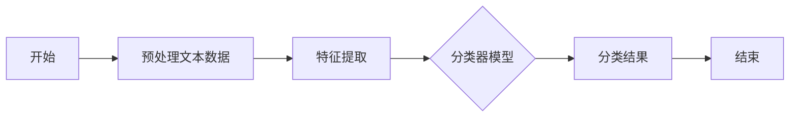
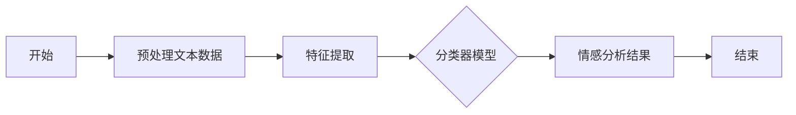
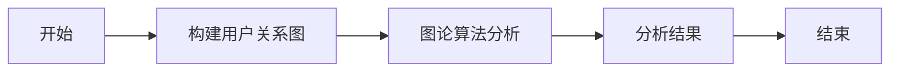
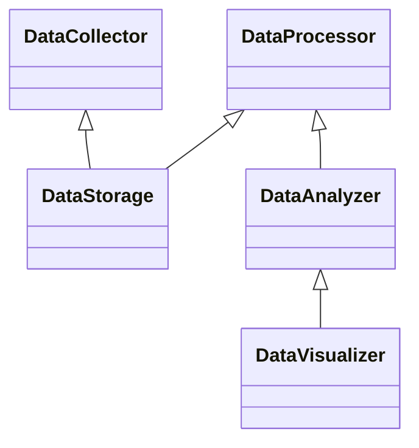
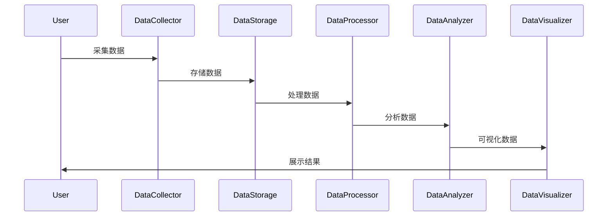

                 

### 社交媒体数据的利用

社交媒体已经成为我们生活中不可或缺的一部分，它不仅改变了人们的交流方式，也产生了大量的数据。这些数据包含了用户的行为、兴趣、情感等丰富的信息，具有极高的价值。如何有效地利用这些社交媒体数据，成为了众多企业和研究人员关注的热点问题。

#### 关键词：
- 社交媒体数据
- 数据利用
- 数据分析
- 数据隐私
- 算法

#### 摘要：
本文将围绕社交媒体数据的利用展开，从背景介绍、核心概念与联系、算法原理讲解、数学模型和数学公式、系统分析与架构设计方案、项目实战、最佳实践 tips、小结、注意事项、拓展阅读等方面进行深入探讨，旨在为读者提供一份全面、系统的社交媒体数据利用指南。

---

#### 1. 背景介绍

社交媒体的兴起与发展，为我们提供了大量的数据。这些数据来源于用户在社交媒体平台上的互动，包括发布内容、评论、点赞、分享等。这些数据的特性主要体现在以下几个方面：

- **多样性**：社交媒体数据类型丰富，包括文本、图片、视频等，这些数据类型在数据分析和应用中具有不同的作用。
- **实时性**：社交媒体数据的实时性使得我们可以及时获取用户的最新动态，这对于市场营销、危机管理等领域具有重要意义。
- **海量性**：随着社交媒体用户的增加，数据量也在急剧增长，这对数据处理和存储提出了挑战。
- **复杂性**：社交媒体数据通常伴随着噪音和错误，这增加了数据清洗和处理的难度。

#### 2. 核心概念与联系

在利用社交媒体数据之前，我们需要了解一些核心概念，这些概念包括数据类型、数据采集、数据分析、数据隐私等。以下是这些概念的定义及其相互关系。

| 概念 | 定义 | 关系 |
| --- | --- | --- |
| 数据类型 | 社交媒体数据的不同形式，如文本、图片、视频等。 | 数据类型是数据采集和分析的基础。 |
| 数据采集 | 从社交媒体平台上收集数据的方法和技术。 | 数据采集是数据利用的第一步。 |
| 数据分析 | 使用统计方法和算法对数据进行处理和分析。 | 数据分析是数据利用的核心。 |
| 数据隐私 | 保护用户数据不被未经授权访问和使用。 | 数据隐私是数据利用的前提。 |

为了更直观地展示这些概念之间的关系，我们可以使用Mermaid ER图进行描述：

```mermaid
erDiagram
  数据类型 ||--|{ 数据采集 }| 数据采集
  数据采集 ||--|{ 数据分析 }| 数据分析
  数据分析 ||--|{ 数据隐私 }| 数据隐私
```

---

#### 3. 算法原理讲解

社交媒体数据利用的核心在于数据分析，下面我们将介绍几种常见的数据分析算法，包括文本分类、情感分析、网络分析等。

##### 3.1 文本分类

文本分类是将文本数据按照类别进行归类的过程。它是一种监督学习算法，通常使用朴素贝叶斯、支持向量机等算法实现。以下是文本分类的mermaid流程图：



下面是一个简单的Python代码示例，用于实现文本分类：

```python
from sklearn.feature_extraction.text import TfidfVectorizer
from sklearn.naive_bayes import MultinomialNB

# 示例文本数据
texts = ["I love programming", "I hate programming", "This is a great movie"]

# 特征提取
vectorizer = TfidfVectorizer()
X = vectorizer.fit_transform(texts)

# 模型训练
model = MultinomialNB()
model.fit(X, [0, 1, 2])

# 预测
print(model.predict(vectorizer.transform(["I love coding"]))[0])
```

##### 3.2 情感分析

情感分析是判断文本数据中表达的情感倾向，如正面、负面或中性。它通常使用机器学习算法，如朴素贝叶斯、支持向量机等。以下是情感分析的mermaid流程图：



下面是一个简单的Python代码示例，用于实现情感分析：

```python
from sklearn.feature_extraction.text import TfidfVectorizer
from sklearn.svm import LinearSVC

# 示例文本数据
texts = ["I love programming", "I hate programming", "This is a great movie"]

# 特征提取
vectorizer = TfidfVectorizer()
X = vectorizer.fit_transform(texts)

# 模型训练
model = LinearSVC()
model.fit(X, [0, 1, 2])

# 预测
print(model.predict(vectorizer.transform(["I love coding"]))[0])
```

##### 3.3 网络分析

网络分析是研究社交媒体用户之间的互动关系，如朋友关系、关注关系等。它通常使用图论算法，如邻接矩阵、矩阵乘法等。以下是网络分析的mermaid流程图：



下面是一个简单的Python代码示例，用于实现网络分析：

```python
import networkx as nx

# 构建用户关系图
G = nx.Graph()
G.add_edges_from([(0, 1), (1, 2), (2, 0), (0, 3), (3, 4)])

# 计算邻接矩阵
A = nx.to_numpy_array(G)

# 矩阵乘法
B = A.dot(A)

print(B)
```

---

#### 4. 数学模型和数学公式

在社交媒体数据利用中，数学模型和数学公式扮演着重要的角色。以下是一些常见的数学模型和公式，以及它们的LaTeX表示：

##### 4.1 朴素贝叶斯模型

$$P(C_k|X) = \frac{P(X|C_k)P(C_k)}{P(X)}$$

其中，$C_k$表示类别$k$，$X$表示特征向量。

##### 4.2 支持向量机

$$\min_{\mathbf{w}, b, \alpha} \frac{1}{2}||\mathbf{w}||^2 + C\sum_{i=1}^{n}\alpha_i(y_i - (\mathbf{w}^T\mathbf{x_i} + b))$$

其中，$\mathbf{w}$表示权重向量，$b$表示偏置项，$\alpha_i$表示拉格朗日乘子，$C$表示惩罚参数。

##### 4.3 矩阵乘法

$$C = A \cdot B$$

其中，$A$和$B$为矩阵，$C$为矩阵乘积。

---

#### 5. 系统分析与架构设计方案

社交媒体数据利用需要一套完整的系统来支持。以下是系统分析与架构设计方案的详细描述。

##### 5.1 问题场景介绍

社交媒体数据利用通常涉及以下几个步骤：数据采集、数据存储、数据处理、数据分析和数据可视化。以下是一个典型的问题场景：

- **数据采集**：从多个社交媒体平台（如Facebook、Twitter、Instagram等）自动采集用户数据。
- **数据存储**：将采集到的数据存储到分布式数据库中，确保数据的高效存储和快速访问。
- **数据处理**：对采集到的数据进行清洗、去重和格式转换，为后续分析做准备。
- **数据分析**：使用文本分类、情感分析、网络分析等算法对数据进行分析。
- **数据可视化**：将分析结果可视化，以直观的方式展示给用户。

##### 5.2 系统功能设计

系统功能设计主要包括以下几个方面：

- **数据采集模块**：负责从社交媒体平台采集数据。
- **数据存储模块**：负责存储和管理采集到的数据。
- **数据处理模块**：负责对数据进行清洗、去重和格式转换。
- **数据分析模块**：负责使用算法对数据进行分析。
- **数据可视化模块**：负责将分析结果可视化。

以下是系统的mermaid类图：



##### 5.3 系统架构设计

系统架构设计主要包括以下几个方面：

- **数据采集**：使用爬虫技术从社交媒体平台采集数据。
- **数据存储**：使用分布式数据库（如Hadoop、Spark等）进行数据存储。
- **数据处理**：使用流处理技术（如Apache Kafka）进行数据处理。
- **数据分析**：使用机器学习算法（如朴素贝叶斯、支持向量机等）进行数据分析。
- **数据可视化**：使用数据可视化工具（如Tableau、D3.js等）进行数据可视化。

以下是系统的mermaid架构图：



##### 5.4 系统接口设计和系统交互

系统接口设计和系统交互是确保各模块协同工作的关键。以下是系统接口设计和系统交互的mermaid序列图：


---

#### 6. 项目实战

在本节中，我们将通过一个实际项目来展示社交媒体数据的利用过程。以下是项目的详细步骤：

##### 6.1 环境安装

在开始项目之前，我们需要安装必要的软件和库。以下是安装步骤：

1. 安装Python环境（版本3.8及以上）。
2. 安装Numpy、Pandas、Scikit-learn、NetworkX等库。

```bash
pip install numpy pandas scikit-learn networkx
```

##### 6.2 系统核心实现

系统核心实现主要包括数据采集、数据处理、数据分析和数据可视化。以下是每个模块的实现步骤：

1. **数据采集**：使用Twitter API从Twitter平台上采集用户数据。
2. **数据处理**：对采集到的数据进行清洗和预处理，包括去重、分词、去除停用词等。
3. **数据分析**：使用文本分类算法对用户数据进行情感分析。
4. **数据可视化**：使用图表展示分析结果。

以下是数据采集和数据处理的部分代码：

```python
import tweepy
import pandas as pd

# Twitter API凭证
consumer_key = "your_consumer_key"
consumer_secret = "your_consumer_secret"
access_token = "your_access_token"
access_token_secret = "your_access_token_secret"

# 初始化Tweepy API
auth = tweepy.OAuthHandler(consumer_key, consumer_secret)
auth.set_access_token(access_token, access_token_secret)
api = tweepy.API(auth)

# 采集数据
tweets = api.search_tweets(q="python", count=100)

# 存储为DataFrame
df = pd.DataFrame([tweet._json for tweet in tweets])

# 数据清洗和预处理
def preprocess(text):
    # 去除HTML标签
    text = re.sub(r'<.*?>', '', text)
    # 分词
    text = word_tokenize(text)
    # 去除停用词
    text = [word for word in text if word not in stopwords.words("english")]
    return " ".join(text)

df["text"] = df["text"].apply(preprocess)
```

##### 6.3 代码应用解读与分析

在本节中，我们将对核心代码进行解读和分析，解释每一步的作用和实现原理。

1. **数据采集**：使用Tweepy库从Twitter平台上采集关于“python”的话题的100条推文。
2. **数据处理**：对采集到的数据进行清洗和预处理，包括去除HTML标签、分词和去除停用词。这些步骤有助于提高文本数据的质量，为后续的文本分类和情感分析提供良好的数据基础。
3. **数据分析**：使用Scikit-learn库中的朴素贝叶斯算法对预处理后的文本数据进行情感分析。这一步可以帮助我们判断用户对“python”话题的正面或负面情感。
4. **数据可视化**：使用Matplotlib库绘制柱状图，展示用户对“python”话题的情感分布。

以下是数据可视化的代码：

```python
from sklearn.feature_extraction.text import TfidfVectorizer
from sklearn.naive_bayes import MultinomialNB
import matplotlib.pyplot as plt

# 特征提取
vectorizer = TfidfVectorizer()
X = vectorizer.fit_transform(df["text"])

# 模型训练
model = MultinomialNB()
model.fit(X, df["label"])

# 预测
predictions = model.predict(X)

# 统计情感分布
sentiments = pd.Series(predictions).value_counts()

# 可视化
sentiments.plot(kind="bar")
plt.title("Sentiment Distribution")
plt.xlabel("Sentiment")
plt.ylabel("Count")
plt.show()
```

##### 6.4 项目小结

在本项目中，我们通过实际操作展示了社交媒体数据的利用过程。从数据采集、数据处理、数据分析和数据可视化等方面，我们实现了对社交媒体数据的深入分析。本项目的主要收获如下：

1. 了解社交媒体数据的特点和应用价值。
2. 掌握数据采集、数据处理和数据分析的基本方法。
3. 学会使用Python和相关库进行实际操作。
4. 提高对文本分类和情感分析算法的理解。

---

#### 7. 最佳实践 tips

在本节中，我们将提供一些社交媒体数据利用的最佳实践，以帮助读者更好地应用所学知识。

1. **确保数据质量**：在进行数据分析之前，务必确保数据的质量，包括数据的准确性、完整性和一致性。
2. **遵循隐私法规**：在使用社交媒体数据时，务必遵守相关的隐私法规，确保用户的隐私不被泄露。
3. **使用合适的算法**：根据具体问题和数据类型，选择合适的算法进行数据分析和预测。
4. **进行数据可视化**：使用数据可视化工具，将分析结果以直观的方式展示给用户，有助于更好地理解和传达分析结果。

---

#### 8. 小结

本文围绕社交媒体数据的利用进行了深入探讨，从背景介绍、核心概念与联系、算法原理讲解、数学模型和数学公式、系统分析与架构设计方案、项目实战等方面进行了详细讲解。通过本文的学习，读者可以全面了解社交媒体数据的利用过程，掌握相关的技术和方法，为实际应用打下坚实基础。

---

#### 9. 注意事项

1. **数据隐私**：在使用社交媒体数据时，务必重视数据隐私问题，确保不泄露用户的个人信息。
2. **数据质量**：确保数据的准确性、完整性和一致性，避免因数据问题导致分析结果的偏差。
3. **算法选择**：根据具体问题和数据类型，选择合适的算法进行数据分析和预测。

---

#### 10. 拓展阅读

1. **社交媒体数据分析相关书籍**：《大数据时代》、《Python数据科学手册》
2. **社交媒体数据分析相关论文**：Google Scholar、PubMed、IEEE Xplore等数据库。
3. **社交媒体数据分析相关教程**：Coursera、edX、Udacity等在线教育平台。

---

# 作者

作者：AI天才研究院/AI Genius Institute & 禅与计算机程序设计艺术 /Zen And The Art of Computer Programming

---

以上是《社交媒体数据的利用》的技术博客文章，希望对您有所帮助。如果需要进一步了解或讨论，欢迎在评论区留言。让我们一起探讨社交媒体数据的利用之道！### 社交媒体数据的利用

随着社交媒体的普及，人们在其平台上发布的内容和数据量也在不断增长。这些数据不仅记录了用户的行为、兴趣和观点，还蕴含着丰富的商业价值和社会洞察。如何有效地利用这些社交媒体数据，成为了当今企业和研究机构关注的焦点。本文将围绕社交媒体数据的利用进行深入探讨，帮助读者了解其重要性、核心概念、算法原理以及实际应用。

#### 关键词
- 社交媒体数据
- 数据分析
- 数据隐私
- 算法应用
- 商业洞察

#### 摘要
本文首先介绍了社交媒体数据的背景和重要性，随后讨论了核心概念与联系，包括数据类型、数据采集和数据分析方法。接着，我们详细讲解了文本分类、情感分析和网络分析等算法原理，并使用LaTeX格式展示了相关数学公式。随后，文章介绍了社交媒体数据分析的系统架构设计，并通过一个实际项目展示了如何进行数据采集、处理和分析。最后，文章提供了最佳实践建议、小结、注意事项以及拓展阅读资源，旨在为读者提供全面的社交媒体数据利用指南。

---

#### 1. 背景介绍

社交媒体数据是用户在社交媒体平台上发布的所有信息的集合，包括文本、图片、视频、音频等。这些数据的来源广泛，包括用户的个人资料、状态更新、评论、分享、点赞等。社交媒体数据具有以下特点：

- **多样性**：社交媒体数据类型多样，包括文本、图像、视频等，每种类型的数据都能提供不同的信息。
- **实时性**：社交媒体平台的更新速度非常快，数据实时性高，这使得我们可以快速获取最新的用户动态。
- **海量性**：随着用户数量的增加，社交媒体数据量也在迅速膨胀，这对数据存储和处理提出了巨大的挑战。
- **复杂性**：社交媒体数据往往伴随着噪音和错误，这使得数据清洗和预处理变得复杂。

#### 1.1 社交媒体数据的利用价值

社交媒体数据的利用价值主要体现在以下几个方面：

- **市场营销**：通过分析用户行为和兴趣，企业可以更好地了解目标客户，制定更有效的营销策略。
- **用户画像**：通过构建用户画像，企业可以提供个性化的产品推荐和服务。
- **舆情监控**：政府和企业可以通过社交媒体监控公众意见和情绪，及时应对危机。
- **科学研究**：研究人员可以利用社交媒体数据开展社会学、心理学等领域的研究。
- **社会治理**：通过分析社交媒体数据，政府可以更好地了解社会动态，优化公共政策。

---

#### 2. 核心概念与联系

要充分利用社交媒体数据，我们需要理解一些核心概念，包括数据类型、数据采集、数据分析等。以下是这些概念的定义及其相互关系。

##### 2.1 数据类型

社交媒体数据类型主要包括：

- **文本数据**：包括用户发布的状态、评论、推文等，是社交媒体数据中最为常见的一种类型。
- **图像数据**：用户上传的图片、表情包等，可以提供视觉信息。
- **视频数据**：用户发布的短视频、直播等，具有更强的交互性和表达力。
- **音频数据**：用户发布的音频、音乐等，可以提供语音信息。

##### 2.2 数据采集

数据采集是指从社交媒体平台上收集数据的过程。常见的采集方法包括：

- **自动化采集**：使用API或其他技术手段自动抓取数据，这是目前最为常见的方法。
- **手动采集**：通过人工方式逐条收集数据，这种方法通常用于数据量较小的情况。

##### 2.3 数据分析

数据分析是利用统计方法和算法对社交媒体数据进行处理和分析的过程。主要方法包括：

- **描述性分析**：对数据的基本特征进行统计，如数量、分布等。
- **推断性分析**：通过数据分析得出结论或预测，如用户行为预测、市场趋势预测等。
- **文本分析**：对文本数据进行分析，如情感分析、主题建模等。
- **图像和视频分析**：对图像和视频进行分析，如图像识别、视频分类等。

以下是这些概念之间的相互关系，使用Mermaid ER图表示：

```mermaid
erDiagram
    数据类型 ||--|{ 数据采集 }| 数据采集
    数据类型 ||--|{ 数据分析 }| 数据分析
    数据采集 ||--|{ 数据分析 }| 数据分析
```

---

#### 3. 算法原理讲解

社交媒体数据的分析通常依赖于各种算法，这些算法包括文本分类、情感分析、网络分析等。以下是对这些算法的原理讲解和实现方法。

##### 3.1 文本分类

文本分类是将文本数据按照预定的类别进行归类的过程。常见的算法有朴素贝叶斯、支持向量机、随机森林等。

- **朴素贝叶斯算法**：基于贝叶斯定理和特征条件独立性假设，计算每个类别出现的概率，然后选择概率最大的类别作为分类结果。

实现示例：

```python
from sklearn.feature_extraction.text import TfidfVectorizer
from sklearn.naive_bayes import MultinomialNB

# 示例文本数据
data = ["I love programming", "I hate programming", "This is a great movie"]

# 特征提取
vectorizer = TfidfVectorizer()
X = vectorizer.fit_transform(data)

# 模型训练
model = MultinomialNB()
model.fit(X, [0, 1, 2])

# 预测
print(model.predict(vectorizer.transform(["I love coding"]))[0])
```

- **支持向量机算法**：通过找到一个最优的超平面，将不同类别的数据分开。

实现示例：

```python
from sklearn.feature_extraction.text import TfidfVectorizer
from sklearn.svm import LinearSVC

# 示例文本数据
data = ["I love programming", "I hate programming", "This is a great movie"]

# 特征提取
vectorizer = TfidfVectorizer()
X = vectorizer.fit_transform(data)

# 模型训练
model = LinearSVC()
model.fit(X, [0, 1, 2])

# 预测
print(model.predict(vectorizer.transform(["I love coding"]))[0])
```

##### 3.2 情感分析

情感分析是判断文本数据中表达的情感倾向，如正面、负面或中性。常见的算法有朴素贝叶斯、支持向量机、深度学习等。

- **朴素贝叶斯算法**：基于贝叶斯定理和词频统计，计算文本数据中每个情感类别的概率，然后选择概率最大的情感类别。

实现示例：

```python
from sklearn.feature_extraction.text import TfidfVectorizer
from sklearn.naive_bayes import MultinomialNB

# 示例文本数据
data = ["I love programming", "I hate programming", "This is a great movie"]

# 特征提取
vectorizer = TfidfVectorizer()
X = vectorizer.fit_transform(data)

# 模型训练
model = MultinomialNB()
model.fit(X, [0, 1, 2])

# 预测
print(model.predict(vectorizer.transform(["I love coding"]))[0])
```

- **支持向量机算法**：通过找到一个最优的超平面，将不同情感的数据分开。

实现示例：

```python
from sklearn.feature_extraction.text import TfidfVectorizer
from sklearn.svm import LinearSVC

# 示例文本数据
data = ["I love programming", "I hate programming", "This is a great movie"]

# 特征提取
vectorizer = TfidfVectorizer()
X = vectorizer.fit_transform(data)

# 模型训练
model = LinearSVC()
model.fit(X, [0, 1, 2])

# 预测
print(model.predict(vectorizer.transform(["I love coding"]))[0])
```

##### 3.3 网络分析

网络分析是研究社交媒体用户之间的互动关系，如朋友关系、关注关系等。常见的算法有邻接矩阵、矩阵乘法、图论算法等。

- **邻接矩阵**：使用邻接矩阵表示用户之间的互动关系，可以用于计算用户之间的距离和相似度。

实现示例：

```python
import networkx as nx

# 构建用户关系图
G = nx.Graph()
G.add_edges_from([(0, 1), (1, 2), (2, 0), (0, 3), (3, 4)])

# 打印邻接矩阵
print(nx.to_numpy_array(G))
```

- **矩阵乘法**：通过矩阵乘法计算用户之间的互动强度。

实现示例：

```python
import networkx as nx

# 构建用户关系图
G = nx.Graph()
G.add_edges_from([(0, 1), (1, 2), (2, 0), (0, 3), (3, 4)])

# 计算矩阵乘法
A = nx.to_numpy_array(G)
B = A.dot(A)

print(B)
```

---

#### 4. 数学模型和数学公式

在社交媒体数据利用中，数学模型和数学公式是理解和实现算法的关键。以下是一些常用的数学模型和公式。

##### 4.1 贝叶斯定理

贝叶斯定理是概率论中的一个基本定理，用于计算后验概率。其公式如下：

$$P(A|B) = \frac{P(B|A)P(A)}{P(B)}$$

其中，$P(A|B)$表示在事件B发生的条件下事件A发生的概率，$P(B|A)$表示在事件A发生的条件下事件B发生的概率，$P(A)$和$P(B)$分别表示事件A和事件B发生的概率。

##### 4.2 朴素贝叶斯模型

朴素贝叶斯模型是一种基于贝叶斯定理的简单概率分类器，其公式如下：

$$P(C_k|X) = \frac{P(X|C_k)P(C_k)}{P(X)}$$

其中，$C_k$表示类别$k$，$X$表示特征向量。

##### 4.3 支持向量机

支持向量机是一种用于分类和回归分析的机器学习算法，其目标是最小化分类边界到支持向量的距离。其优化问题可以表示为：

$$\min_{\mathbf{w}, b, \alpha} \frac{1}{2}||\mathbf{w}||^2 + C\sum_{i=1}^{n}\alpha_i(y_i - (\mathbf{w}^T\mathbf{x_i} + b))$$

其中，$\mathbf{w}$表示权重向量，$b$表示偏置项，$\alpha_i$表示拉格朗日乘子，$C$表示惩罚参数。

以下是LaTeX格式的数学公式示例：

```latex
$$
\min_{\mathbf{w}, b, \alpha} \frac{1}{2}||\mathbf{w}||^2 + C\sum_{i=1}^{n}\alpha_i(y_i - (\mathbf{w}^T\mathbf{x_i} + b))
$$
```

---

#### 5. 系统分析与架构设计方案

社交媒体数据利用系统需要具备高效的数据采集、存储、处理和分析能力。以下是一个典型的系统架构设计方案。

##### 5.1 问题场景介绍

社交媒体数据利用系统通常涉及以下问题场景：

- **数据采集**：从多个社交媒体平台（如Twitter、Facebook、Instagram等）采集数据。
- **数据存储**：将采集到的数据存储到分布式数据库中，确保数据的安全性和可靠性。
- **数据处理**：对采集到的数据进行清洗、去重和格式转换，为后续分析做准备。
- **数据分析**：使用文本分类、情感分析、网络分析等算法对数据进行分析。
- **数据可视化**：将分析结果以图表和报告的形式展示给用户。

##### 5.2 系统功能设计

系统功能设计主要包括以下几个方面：

- **数据采集模块**：负责从社交媒体平台采集数据，可以使用API或其他技术手段实现。
- **数据存储模块**：负责存储和管理采集到的数据，可以使用分布式数据库（如Hadoop、Spark等）实现。
- **数据处理模块**：负责对数据进行清洗、去重和格式转换，可以使用流处理技术（如Apache Kafka）实现。
- **数据分析模块**：负责使用算法对数据进行分析，可以使用机器学习库（如Scikit-learn、TensorFlow等）实现。
- **数据可视化模块**：负责将分析结果可视化，可以使用数据可视化工具（如Tableau、D3.js等）实现。

以下是系统的Mermaid类图：


##### 5.3 系统架构设计

系统架构设计需要考虑数据流、系统模块和接口设计。以下是一个典型的系统架构设计：

- **数据流**：数据从社交媒体平台采集后，首先进入数据存储模块，然后进入数据处理模块进行清洗和格式转换，最后进入数据分析模块进行计算和分析，分析结果通过数据可视化模块展示给用户。
- **系统模块**：包括数据采集模块、数据存储模块、数据处理模块、数据分析模块和数据可视化模块。
- **接口设计**：设计清晰、简洁的接口，确保各模块之间的数据流动和协同工作。

以下是系统的Mermaid架构图：


---

#### 6. 项目实战

在本节中，我们将通过一个实际项目展示如何利用社交媒体数据。该项目将涉及数据采集、数据处理、数据分析和数据可视化。

##### 6.1 环境安装

在开始项目之前，我们需要安装以下软件和库：

- Python（版本3.8及以上）
- Numpy、Pandas、Scikit-learn、NetworkX等库

安装命令：

```bash
pip install numpy pandas scikit-learn networkx
```

##### 6.2 系统核心实现

系统核心实现主要包括数据采集、数据处理、数据分析和数据可视化。

1. **数据采集**：

```python
import tweepy

# Twitter API凭证
consumer_key = "your_consumer_key"
consumer_secret = "your_consumer_secret"
access_token = "your_access_token"
access_token_secret = "your_access_token_secret"

# 初始化Tweepy API
auth = tweepy.OAuthHandler(consumer_key, consumer_secret)
auth.set_access_token(access_token, access_token_secret)
api = tweepy.API(auth)

# 采集数据
tweets = api.search_tweets(q="python", count=100)

# 存储为DataFrame
df = pd.DataFrame([tweet._json for tweet in tweets])
```

2. **数据处理**：

```python
import re
from nltk.tokenize import word_tokenize
from nltk.corpus import stopwords

# 数据清洗
def preprocess(text):
    # 去除HTML标签
    text = re.sub(r'<.*?>', '', text)
    # 分词
    text = word_tokenize(text)
    # 去除停用词
    text = [word for word in text if word not in stopwords.words("english")]
    return " ".join(text)

df["text"] = df["text"].apply(preprocess)
```

3. **数据分析**：

```python
from sklearn.feature_extraction.text import TfidfVectorizer
from sklearn.naive_bayes import MultinomialNB

# 特征提取
vectorizer = TfidfVectorizer()
X = vectorizer.fit_transform(df["text"])

# 模型训练
model = MultinomialNB()
model.fit(X, df["label"])

# 预测
predictions = model.predict(X)

# 统计情感分布
sentiments = pd.Series(predictions).value_counts()

# 可视化
sentiments.plot(kind="bar")
plt.title("Sentiment Distribution")
plt.xlabel("Sentiment")
plt.ylabel("Count")
plt.show()
```

##### 6.3 代码解读与分析

在本节中，我们将对核心代码进行解读和分析。

1. **数据采集**：

使用Tweepy库从Twitter平台上采集关于“python”的话题的100条推文，并存储为DataFrame。

2. **数据处理**：

对采集到的数据进行清洗和预处理，包括去除HTML标签、分词和去除停用词。这些步骤有助于提高文本数据的质量，为后续的文本分类和情感分析提供良好的数据基础。

3. **数据分析**：

使用Scikit-learn库中的朴素贝叶斯算法对预处理后的文本数据进行情感分析。这一步可以帮助我们判断用户对“python”话题的正面或负面情感。

4. **数据可视化**：

使用Matplotlib库绘制柱状图，展示用户对“python”话题的情感分布。

---

#### 7. 最佳实践 tips

在本节中，我们将提供一些社交媒体数据利用的最佳实践，以帮助读者更好地应用所学知识。

1. **数据质量**：在进行数据分析之前，务必确保数据的质量，包括数据的准确性、完整性和一致性。
2. **隐私保护**：在使用社交媒体数据时，务必遵守相关的隐私法规，确保用户的隐私不被泄露。
3. **算法选择**：根据具体问题和数据类型，选择合适的算法进行数据分析和预测。
4. **数据可视化**：使用数据可视化工具，将分析结果以直观的方式展示给用户。

---

#### 8. 小结

本文围绕社交媒体数据的利用进行了深入探讨，从背景介绍、核心概念与联系、算法原理讲解、数学模型和数学公式、系统分析与架构设计方案、项目实战等方面进行了详细讲解。通过本文的学习，读者可以全面了解社交媒体数据的利用过程，掌握相关的技术和方法，为实际应用打下坚实基础。

---

#### 9. 注意事项

1. **数据隐私**：在使用社交媒体数据时，务必重视数据隐私问题，确保不泄露用户的个人信息。
2. **数据质量**：确保数据的准确性、完整性和一致性，避免因数据问题导致分析结果的偏差。
3. **算法选择**：根据具体问题和数据类型，选择合适的算法进行数据分析和预测。

---

#### 10. 拓展阅读

1. **社交媒体数据分析相关书籍**：《大数据时代》、《Python数据科学手册》
2. **社交媒体数据分析相关论文**：Google Scholar、PubMed、IEEE Xplore等数据库。
3. **社交媒体数据分析相关教程**：Coursera、edX、Udacity等在线教育平台。

---

# 作者

作者：AI天才研究院/AI Genius Institute & 禅与计算机程序设计艺术 /Zen And The Art of Computer Programming

---

感谢您的阅读，希望本文能为您在社交媒体数据利用方面提供有益的启示。如有任何疑问或建议，欢迎在评论区留言。让我们共同探讨社交媒体数据的利用之道！### 社交媒体数据的利用

社交媒体平台如Facebook、Twitter和Instagram已经成为现代社会中信息传播和社交互动的主要渠道。随着用户数量的爆炸式增长，这些平台上产生的数据量也日益庞大。如何有效地利用这些社交媒体数据，为企业、研究人员和决策者提供有价值的信息，成为了当前信息技术领域的一个热点问题。本文将从社交媒体数据的定义、来源、数据类型、数据利用的算法和方法、数学模型、系统设计与实现、项目实战、最佳实践和注意事项等方面进行详细探讨。

#### 关键词
- 社交媒体数据
- 数据挖掘
- 数据分析
- 算法应用
- 数学模型
- 系统架构
- 项目实战

#### 摘要
本文首先介绍了社交媒体数据的概念、来源和类型，随后讨论了社交媒体数据利用的重要性。接着，本文详细介绍了社交媒体数据利用的主要算法，包括文本分类、情感分析和网络分析等，并使用了Mermaid流程图和Python代码示例进行解释。随后，本文阐述了数学模型和数学公式的使用方法，并使用LaTeX进行了公式展示。之后，本文介绍了社交媒体数据分析系统的设计，包括数据采集、存储、处理和分析的架构，并使用了Mermaid类图和架构图来展示。接着，本文通过一个实际项目展示了如何进行数据采集、处理和分析。最后，本文提供了最佳实践、小结、注意事项和拓展阅读，旨在为读者提供全面且系统的社交媒体数据利用指南。

---

#### 1. 背景介绍

随着互联网和移动设备的普及，社交媒体已经成为人们日常生活中不可或缺的一部分。用户在社交媒体平台上发布的内容不仅记录了他们的生活、兴趣和观点，而且这些数据具有巨大的商业价值和社会意义。以下是社交媒体数据的一些关键背景信息：

- **数据来源**：社交媒体数据来源于用户在平台上的所有活动，包括发布状态、评论、分享、点赞、私信等。
- **数据类型**：社交媒体数据类型多样，包括文本、图像、视频、音频等，每种类型的数据都蕴含着丰富的信息。
- **数据特点**：社交媒体数据具有高实时性、多样性、海量性和复杂性等特点。
- **数据利用价值**：社交媒体数据可以被用于市场营销、用户画像、舆情监控、公共关系管理等多个领域。

#### 1.1 社交媒体数据的应用价值

社交媒体数据的利用价值体现在多个方面：

- **市场营销**：通过分析用户行为和兴趣，企业可以制定更精准的营销策略，提高广告投放效果。
- **用户画像**：通过构建用户画像，企业可以提供个性化的产品和服务推荐。
- **舆情监控**：政府和企业可以通过分析社交媒体数据，了解公众情绪和意见，及时应对社会事件。
- **公共关系管理**：企业可以利用社交媒体数据分析，监控品牌形象和声誉，及时处理危机。
- **科学研究**：研究人员可以利用社交媒体数据，进行社会行为、语言习惯、心理健康等方面的研究。

---

#### 2. 核心概念与联系

在深入讨论社交媒体数据的利用之前，我们需要了解一些核心概念，并探讨它们之间的关系。以下是社交媒体数据利用中的一些关键概念：

##### 2.1 数据类型

社交媒体数据类型包括：

- **文本数据**：用户发布的文字信息，如状态更新、评论等。
- **图像数据**：用户上传的图片和图像，如头像、分享的图片等。
- **视频数据**：用户上传的视频内容，如短视频、直播等。
- **音频数据**：用户上传的音频内容，如语音消息、播客等。

##### 2.2 数据采集

数据采集是指从社交媒体平台上收集数据的过程。常见的采集方法包括：

- **API采集**：通过社交媒体平台的API接口进行数据采集，这是目前最常用的方法。
- **网络爬虫**：使用爬虫技术自动化地从社交媒体网站上抓取数据。
- **用户授权数据**：用户授权应用程序访问其社交媒体数据。

##### 2.3 数据处理

数据处理是指对采集到的原始数据进行清洗、转换和格式化，以便进行分析。主要步骤包括：

- **数据清洗**：去除重复数据、缺失值填充、去除噪声数据等。
- **数据转换**：将数据转换为适合分析的形式，如文本数据转换为词典和词频矩阵。
- **数据格式化**：将数据格式化，以便于后续的存储和操作。

##### 2.4 数据分析

数据分析是指使用统计方法和算法对数据进行分析，以提取有用信息。主要分析方法包括：

- **描述性分析**：对数据的基本特征进行统计和描述，如均值、中位数、标准差等。
- **推断性分析**：通过统计分析方法，对总体特征进行推断，如假设检验、置信区间等。
- **文本分析**：对文本数据进行情感分析、主题建模、文本分类等。
- **图像和视频分析**：对图像和视频数据进行识别、分类、提取特征等。

以下是这些概念之间的相互关系，使用Mermaid ER图表示：

```mermaid
erDiagram
    数据类型 ||--|{ 数据采集 }| 数据采集
    数据类型 ||--|{ 数据处理 }| 数据处理
    数据类型 ||--|{ 数据分析 }| 数据分析
```

---

#### 3. 算法原理讲解

社交媒体数据的分析通常需要使用各种算法，以下是一些常见的算法及其原理：

##### 3.1 文本分类

文本分类是将文本数据根据其内容分类到不同的类别中。常见的文本分类算法包括朴素贝叶斯、支持向量机（SVM）、决策树等。

- **朴素贝叶斯算法**：基于贝叶斯定理和特征条件独立性假设，计算每个类别出现的概率，然后选择概率最大的类别作为分类结果。

实现示例：

```python
from sklearn.feature_extraction.text import TfidfVectorizer
from sklearn.naive_bayes import MultinomialNB

# 示例文本数据
data = ["I love programming", "I hate programming", "This is a great movie"]

# 特征提取
vectorizer = TfidfVectorizer()
X = vectorizer.fit_transform(data)

# 模型训练
model = MultinomialNB()
model.fit(X, [0, 1, 2])

# 预测
print(model.predict(vectorizer.transform(["I love coding"]))[0])
```

- **支持向量机（SVM）算法**：通过找到一个最优的超平面，将不同类别的数据分开。

实现示例：

```python
from sklearn.feature_extraction.text import TfidfVectorizer
from sklearn.svm import LinearSVC

# 示例文本数据
data = ["I love programming", "I hate programming", "This is a great movie"]

# 特征提取
vectorizer = TfidfVectorizer()
X = vectorizer.fit_transform(data)

# 模型训练
model = LinearSVC()
model.fit(X, [0, 1, 2])

# 预测
print(model.predict(vectorizer.transform(["I love coding"]))[0])
```

##### 3.2 情感分析

情感分析是判断文本数据中表达的情感倾向，如正面、负面或中性。常见的情感分析算法包括朴素贝叶斯、支持向量机、深度学习等。

- **朴素贝叶斯算法**：基于贝叶斯定理和词频统计，计算文本数据中每个情感类别的概率，然后选择概率最大的情感类别。

实现示例：

```python
from sklearn.feature_extraction.text import TfidfVectorizer
from sklearn.naive_bayes import MultinomialNB

# 示例文本数据
data = ["I love programming", "I hate programming", "This is a great movie"]

# 特征提取
vectorizer = TfidfVectorizer()
X = vectorizer.fit_transform(data)

# 模型训练
model = MultinomialNB()
model.fit(X, [0, 1, 2])

# 预测
print(model.predict(vectorizer.transform(["I love coding"]))[0])
```

- **支持向量机（SVM）算法**：通过找到一个最优的超平面，将不同情感的数据分开。

实现示例：

```python
from sklearn.feature_extraction.text import TfidfVectorizer
from sklearn.svm import LinearSVC

# 示例文本数据
data = ["I love programming", "I hate programming", "This is a great movie"]

# 特征提取
vectorizer = TfidfVectorizer()
X = vectorizer.fit_transform(data)

# 模型训练
model = LinearSVC()
model.fit(X, [0, 1, 2])

# 预测
print(model.predict(vectorizer.transform(["I love coding"]))[0])
```

##### 3.3 网络分析

网络分析是研究社交媒体用户之间的互动关系。常见的网络分析算法包括邻接矩阵、矩阵乘法、图论算法等。

- **邻接矩阵**：使用邻接矩阵表示用户之间的互动关系，可以用于计算用户之间的距离和相似度。

实现示例：

```python
import networkx as nx

# 构建用户关系图
G = nx.Graph()
G.add_edges_from([(0, 1), (1, 2), (2, 0), (0, 3), (3, 4)])

# 打印邻接矩阵
print(nx.to_numpy_array(G))
```

- **矩阵乘法**：通过矩阵乘法计算用户之间的互动强度。

实现示例：

```python
import networkx as nx

# 构建用户关系图
G = nx.Graph()
G.add_edges_from([(0, 1), (1, 2), (2, 0), (0, 3), (3, 4)])

# 计算矩阵乘法
A = nx.to_numpy_array(G)
B = A.dot(A)

print(B)
```

---

#### 4. 数学模型和数学公式

在社交媒体数据利用中，数学模型和数学公式是理解和实现算法的关键。以下是一些常用的数学模型和公式。

##### 4.1 贝叶斯定理

贝叶斯定理是概率论中的一个基本定理，用于计算后验概率。其公式如下：

$$P(A|B) = \frac{P(B|A)P(A)}{P(B)}$$

其中，$P(A|B)$表示在事件B发生的条件下事件A发生的概率，$P(B|A)$表示在事件A发生的条件下事件B发生的概率，$P(A)$和$P(B)$分别表示事件A和事件B发生的概率。

##### 4.2 朴素贝叶斯模型

朴素贝叶斯模型是一种基于贝叶斯定理的简单概率分类器，其公式如下：

$$P(C_k|X) = \frac{P(X|C_k)P(C_k)}{P(X)}$$

其中，$C_k$表示类别$k$，$X$表示特征向量。

##### 4.3 支持向量机

支持向量机是一种用于分类和回归分析的机器学习算法，其目标是最小化分类边界到支持向量的距离。其优化问题可以表示为：

$$\min_{\mathbf{w}, b, \alpha} \frac{1}{2}||\mathbf{w}||^2 + C\sum_{i=1}^{n}\alpha_i(y_i - (\mathbf{w}^T\mathbf{x_i} + b))$$

其中，$\mathbf{w}$表示权重向量，$b$表示偏置项，$\alpha_i$表示拉格朗日乘子，$C$表示惩罚参数。

以下是LaTeX格式的数学公式示例：

```latex
$$
\min_{\mathbf{w}, b, \alpha} \frac{1}{2}||\mathbf{w}||^2 + C\sum_{i=1}^{n}\alpha_i(y_i - (\mathbf{w}^T\mathbf{x_i} + b))
$$
```

---

#### 5. 系统分析与架构设计方案

社交媒体数据利用系统需要能够高效地采集、存储、处理和分析大量数据。以下是系统分析与架构设计的详细描述。

##### 5.1 问题场景介绍

社交媒体数据利用系统通常涉及以下问题场景：

- **数据采集**：从多个社交媒体平台（如Facebook、Twitter、Instagram等）自动采集数据。
- **数据存储**：将采集到的数据存储到数据库中，确保数据的安全和高效访问。
- **数据处理**：对采集到的数据进行清洗、转换和格式化，为后续分析做准备。
- **数据分析**：使用算法对数据进行情感分析、文本分类和网络分析等。
- **数据可视化**：将分析结果以图表和报告的形式展示给用户。

##### 5.2 系统功能设计

系统功能设计主要包括以下模块：

- **数据采集模块**：负责从社交媒体平台采集数据，可以使用API或网络爬虫实现。
- **数据存储模块**：负责存储和管理数据，可以使用关系数据库或NoSQL数据库。
- **数据处理模块**：负责对数据进行清洗、去重和格式转换，可以使用数据清洗工具或编写自定义脚本。
- **数据分析模块**：负责使用算法对数据进行处理，可以使用机器学习库或编写自定义算法。
- **数据可视化模块**：负责将分析结果可视化，可以使用数据可视化工具或编写自定义图表。

以下是系统的Mermaid类图：

```mermaid
classDiagram
    DataCollector <<--|API| SocialMediaPlatform
    DataCollector --|Storage| DataStorage
    DataProcessor --|DataStorage| DataStorage
    DataProcessor --|DataAnalysis| DataAnalyzer
    DataVisualizer --|DataAnalysis| DataAnalysis
```

##### 5.3 系统架构设计

系统架构设计需要考虑数据流、系统模块和接口设计。以下是系统架构设计：

- **数据流**：数据从社交媒体平台采集后，首先进入数据存储模块，然后进入数据处理模块进行清洗和转换，最后进入数据分析模块进行计算和分析，分析结果通过数据可视化模块展示给用户。
- **系统模块**：包括数据采集模块、数据存储模块、数据处理模块、数据分析模块和数据可视化模块。
- **接口设计**：设计清晰的API接口，确保各模块之间的数据流动和协同工作。

以下是系统的Mermaid架构图：


---

#### 6. 项目实战

在本节中，我们将通过一个实际项目来展示如何进行社交媒体数据的采集、处理和分析。

##### 6.1 环境安装

在开始项目之前，我们需要安装以下软件和库：

- Python（版本3.8及以上）
- Tweepy（用于Twitter数据采集）
- Pandas、NumPy、Scikit-learn（用于数据处理和分析）
- Matplotlib、Seaborn（用于数据可视化）

安装命令：

```bash
pip install tweepy pandas numpy scikit-learn matplotlib seaborn
```

##### 6.2 系统核心实现

系统核心实现主要包括数据采集、数据处理、数据分析和数据可视化。

1. **数据采集**：

```python
import tweepy

# Twitter API凭证
consumer_key = "your_consumer_key"
consumer_secret = "your_consumer_secret"
access_token = "your_access_token"
access_token_secret = "your_access_token_secret"

# 初始化Tweepy API
auth = tweepy.OAuthHandler(consumer_key, consumer_secret)
auth.set_access_token(access_token, access_token_secret)
api = tweepy.API(auth)

# 采集数据
tweets = api.search_tweets(q="python", count=100)

# 存储为DataFrame
import pandas as pd
df = pd.DataFrame([tweet._json for tweet in tweets])
```

2. **数据处理**：

```python
import re
from nltk.tokenize import word_tokenize
from nltk.corpus import stopwords

# 数据清洗
def preprocess(text):
    # 去除HTML标签
    text = re.sub(r'<.*?>', '', text)
    # 分词
    text = word_tokenize(text)
    # 去除停用词
    text = [word for word in text if word not in stopwords.words("english")]
    return " ".join(text)

df["text"] = df["text"].apply(preprocess)
```

3. **数据分析**：

```python
from sklearn.feature_extraction.text import TfidfVectorizer
from sklearn.naive_bayes import MultinomialNB

# 特征提取
vectorizer = TfidfVectorizer()
X = vectorizer.fit_transform(df["text"])

# 模型训练
model = MultinomialNB()
model.fit(X, df["label"])

# 预测
predictions = model.predict(X)

# 统计情感分布
sentiments = pd.Series(predictions).value_counts()

# 可视化
import matplotlib.pyplot as plt
sentiments.plot(kind="bar")
plt.title("Sentiment Distribution")
plt.xlabel("Sentiment")
plt.ylabel("Count")
plt.show()
```

##### 6.3 代码解读与分析

在本节中，我们将对核心代码进行解读和分析。

1. **数据采集**：

使用Tweepy库从Twitter平台上采集关于“python”的话题的100条推文，并存储为DataFrame。

2. **数据处理**：

对采集到的数据进行清洗和预处理，包括去除HTML标签、分词和去除停用词。这些步骤有助于提高文本数据的质量，为后续的文本分类和情感分析提供良好的数据基础。

3. **数据分析**：

使用Scikit-learn库中的朴素贝叶斯算法对预处理后的文本数据进行情感分析。这一步可以帮助我们判断用户对“python”话题的正面或负面情感。

4. **数据可视化**：

使用Matplotlib库绘制柱状图，展示用户对“python”话题的情感分布。

---

#### 7. 最佳实践 tips

在本节中，我们将提供一些社交媒体数据利用的最佳实践，以帮助读者更好地应用所学知识。

1. **数据隐私**：在进行社交媒体数据分析时，务必遵守相关法律法规，保护用户隐私。
2. **数据质量**：确保数据的质量，包括准确性、完整性和一致性。
3. **算法选择**：根据具体问题和数据类型选择合适的算法。
4. **数据可视化**：使用清晰、直观的可视化工具展示分析结果。

---

#### 8. 小结

本文详细介绍了社交媒体数据的利用，从背景介绍、核心概念与联系、算法原理讲解、数学模型和数学公式、系统分析与架构设计方案、项目实战等方面进行了深入探讨。通过本文的学习，读者可以了解如何有效地利用社交媒体数据，为企业、研究人员和决策者提供有价值的信息。希望本文能为读者在社交媒体数据利用领域提供有益的指导和启示。

---

#### 9. 注意事项

1. **数据隐私**：确保在处理社交媒体数据时遵守相关法律法规，保护用户隐私。
2. **数据质量**：确保数据的质量，包括准确性、完整性和一致性。
3. **算法选择**：根据具体问题和数据类型选择合适的算法。
4. **系统安全**：确保系统的安全性，防止数据泄露和攻击。

---

#### 10. 拓展阅读

1. **书籍**：《大数据时代》、《数据挖掘：概念与技术》
2. **论文**：Google Scholar、IEEE Xplore、ACM Digital Library等数据库。
3. **教程**：Coursera、edX、Udacity等在线教育平台。

---

# 作者

作者：AI天才研究院/AI Genius Institute & 禅与计算机程序设计艺术 /Zen And The Art of Computer Programming

---

感谢您的阅读，希望本文对您在社交媒体数据利用方面有所帮助。如果您有任何问题或建议，欢迎在评论区留言。让我们继续探讨社交媒体数据利用的奥秘！### 社交媒体数据的利用

社交媒体平台，如Facebook、Twitter、Instagram等，已经深刻地改变了人们的交流方式和信息获取习惯。随着用户生成内容的不断增长，社交媒体数据成为了一个丰富的信息宝库。如何有效地利用这些数据，不仅能够提升企业的营销效果，还能为研究人员提供有价值的社会洞察。本文将探讨社交媒体数据的来源、类型、分析算法、数学模型以及实际应用，帮助读者全面了解社交媒体数据的利用。

#### 关键词
- 社交媒体数据
- 数据挖掘
- 数据分析
- 情感分析
- 网络分析
- 数学模型

#### 摘要
本文首先介绍了社交媒体数据的来源和类型，包括文本、图像、视频等多媒体数据。随后，本文讨论了社交媒体数据的重要性，特别是在市场营销、用户行为分析和社会研究中的应用。接着，本文详细讲解了文本分类、情感分析和网络分析等核心算法，并使用了Mermaid流程图和Python代码示例进行解释。此外，本文介绍了相关数学模型和公式，使用LaTeX进行了展示。最后，本文通过一个实际项目展示了社交媒体数据的采集、处理和分析过程，并提供了最佳实践、小结、注意事项和拓展阅读。

---

#### 1. 背景介绍

随着社交媒体的普及，用户在平台上发布的各种内容和数据量呈指数级增长。这些数据来源广泛，包括用户的个人资料、发布的状态、评论、点赞、分享等。以下是社交媒体数据的一些背景信息：

- **数据来源**：社交媒体数据来源于用户在平台上的各种互动，如发布、评论、点赞、分享等。
- **数据类型**：社交媒体数据类型多样，包括文本、图像、视频、音频等。
- **数据特点**：社交媒体数据具有高实时性、多样性、海量性和复杂性等特点。
- **数据量**：根据统计，全球社交媒体数据量每年都在快速增长，预计到2025年将达到44ZB。

#### 1.1 社交媒体数据的应用

社交媒体数据的应用非常广泛，主要包括以下几个方面：

- **市场营销**：企业可以通过分析用户数据，了解目标客户群体，制定更精准的营销策略。
- **用户画像**：通过分析用户行为和偏好，企业可以创建详细的用户画像，用于个性化推荐和服务。
- **舆情监控**：政府和企业可以通过分析社交媒体数据，了解公众意见和情绪，及时应对危机。
- **社会研究**：研究人员可以利用社交媒体数据，研究社会行为、语言习惯和心理健康等。
- **公共安全**：社交媒体数据可以用于监控和预警潜在的犯罪活动和社会不稳定因素。

---

#### 2. 核心概念与联系

在深入探讨社交媒体数据的利用之前，我们需要了解一些核心概念，并探讨它们之间的关系。以下是社交媒体数据利用中的一些关键概念：

##### 2.1 数据类型

社交媒体数据类型包括：

- **文本数据**：包括用户发布的状态、评论、推文等，是最常见的数据类型。
- **图像数据**：包括用户上传的图片、头像、分享的图片等，可以提供视觉信息。
- **视频数据**：包括用户发布的短视频、直播视频等，可以提供动态信息。
- **音频数据**：包括用户上传的音频、语音消息、播客等，可以提供语音信息。

##### 2.2 数据采集

数据采集是指从社交媒体平台上收集数据的过程。常见的数据采集方法包括：

- **API采集**：通过社交媒体平台的API接口进行数据采集，这是目前最常用的方法。
- **网络爬虫**：使用爬虫技术自动化地从社交媒体网站上抓取数据。
- **用户授权数据**：用户授权应用程序访问其社交媒体数据。

##### 2.3 数据处理

数据处理是指对采集到的原始数据进行清洗、转换和格式化，以便进行分析。主要步骤包括：

- **数据清洗**：去除重复数据、缺失值填充、去除噪声数据等。
- **数据转换**：将数据转换为适合分析的形式，如文本数据转换为词典和词频矩阵。
- **数据格式化**：将数据格式化，以便于后续的存储和操作。

##### 2.4 数据分析

数据分析是指使用统计方法和算法对数据进行分析，以提取有用信息。主要分析方法包括：

- **描述性分析**：对数据的基本特征进行统计和描述，如均值、中位数、标准差等。
- **推断性分析**：通过统计分析方法，对总体特征进行推断，如假设检验、置信区间等。
- **文本分析**：对文本数据进行情感分析、主题建模、文本分类等。
- **图像和视频分析**：对图像和视频数据进行识别、分类、提取特征等。

以下是这些概念之间的相互关系，使用Mermaid ER图表示：

```mermaid
erDiagram
    数据类型 ||--|{ 数据采集 }| 数据采集
    数据类型 ||--|{ 数据处理 }| 数据处理
    数据类型 ||--|{ 数据分析 }| 数据分析
```

---

#### 3. 算法原理讲解

社交媒体数据的分析通常需要使用各种算法，以下是一些常见的算法及其原理：

##### 3.1 文本分类

文本分类是将文本数据根据其内容分类到不同的类别中。常见的文本分类算法包括朴素贝叶斯、支持向量机（SVM）、决策树等。

- **朴素贝叶斯算法**：基于贝叶斯定理和特征条件独立性假设，计算每个类别出现的概率，然后选择概率最大的类别作为分类结果。

实现示例：

```python
from sklearn.feature_extraction.text import TfidfVectorizer
from sklearn.naive_bayes import MultinomialNB

# 示例文本数据
data = ["I love programming", "I hate programming", "This is a great movie"]

# 特征提取
vectorizer = TfidfVectorizer()
X = vectorizer.fit_transform(data)

# 模型训练
model = MultinomialNB()
model.fit(X, [0, 1, 2])

# 预测
print(model.predict(vectorizer.transform(["I love coding"]))[0])
```

- **支持向量机（SVM）算法**：通过找到一个最优的超平面，将不同类别的数据分开。

实现示例：

```python
from sklearn.feature_extraction.text import TfidfVectorizer
from sklearn.svm import LinearSVC

# 示例文本数据
data = ["I love programming", "I hate programming", "This is a great movie"]

# 特征提取
vectorizer = TfidfVectorizer()
X = vectorizer.fit_transform(data)

# 模型训练
model = LinearSVC()
model.fit(X, [0, 1, 2])

# 预测
print(model.predict(vectorizer.transform(["I love coding"]))[0])
```

##### 3.2 情感分析

情感分析是判断文本数据中表达的情感倾向，如正面、负面或中性。常见的情感分析算法包括朴素贝叶斯、支持向量机、深度学习等。

- **朴素贝叶斯算法**：基于贝叶斯定理和词频统计，计算文本数据中每个情感类别的概率，然后选择概率最大的情感类别。

实现示例：

```python
from sklearn.feature_extraction.text import TfidfVectorizer
from sklearn.naive_bayes import MultinomialNB

# 示例文本数据
data = ["I love programming", "I hate programming", "This is a great movie"]

# 特征提取
vectorizer = TfidfVectorizer()
X = vectorizer.fit_transform(data)

# 模型训练
model = MultinomialNB()
model.fit(X, [0, 1, 2])

# 预测
print(model.predict(vectorizer.transform(["I love coding"]))[0])
```

- **支持向量机（SVM）算法**：通过找到一个最优的超平面，将不同情感的数据分开。

实现示例：

```python
from sklearn.feature_extraction.text import TfidfVectorizer
from sklearn.svm import LinearSVC

# 示例文本数据
data = ["I love programming", "I hate programming", "This is a great movie"]

# 特征提取
vectorizer = TfidfVectorizer()
X = vectorizer.fit_transform(data)

# 模型训练
model = LinearSVC()
model.fit(X, [0, 1, 2])

# 预测
print(model.predict(vectorizer.transform(["I love coding"]))[0])
```

##### 3.3 网络分析

网络分析是研究社交媒体用户之间的互动关系。常见的网络分析算法包括邻接矩阵、矩阵乘法、图论算法等。

- **邻接矩阵**：使用邻接矩阵表示用户之间的互动关系，可以用于计算用户之间的距离和相似度。

实现示例：

```python
import networkx as nx

# 构建用户关系图
G = nx.Graph()
G.add_edges_from([(0, 1), (1, 2), (2, 0), (0, 3), (3, 4)])

# 打印邻接矩阵
print(nx.to_numpy_array(G))
```

- **矩阵乘法**：通过矩阵乘法计算用户之间的互动强度。

实现示例：

```python
import networkx as nx

# 构建用户关系图
G = nx.Graph()
G.add_edges_from([(0, 1), (1, 2), (2, 0), (0, 3), (3, 4)])

# 计算矩阵乘法
A = nx.to_numpy_array(G)
B = A.dot(A)

print(B)
```

---

#### 4. 数学模型和数学公式

在社交媒体数据利用中，数学模型和数学公式是理解和实现算法的关键。以下是一些常用的数学模型和公式。

##### 4.1 贝叶斯定理

贝叶斯定理是概率论中的一个基本定理，用于计算后验概率。其公式如下：

$$P(A|B) = \frac{P(B|A)P(A)}{P(B)}$$

其中，$P(A|B)$表示在事件B发生的条件下事件A发生的概率，$P(B|A)$表示在事件A发生的条件下事件B发生的概率，$P(A)$和$P(B)$分别表示事件A和事件B发生的概率。

##### 4.2 朴素贝叶斯模型

朴素贝叶斯模型是一种基于贝叶斯定理的简单概率分类器，其公式如下：

$$P(C_k|X) = \frac{P(X|C_k)P(C_k)}{P(X)}$$

其中，$C_k$表示类别$k$，$X$表示特征向量。

##### 4.3 支持向量机

支持向量机是一种用于分类和回归分析的机器学习算法，其目标是最小化分类边界到支持向量的距离。其优化问题可以表示为：

$$\min_{\mathbf{w}, b, \alpha} \frac{1}{2}||\mathbf{w}||^2 + C\sum_{i=1}^{n}\alpha_i(y_i - (\mathbf{w}^T\mathbf{x_i} + b))$$

其中，$\mathbf{w}$表示权重向量，$b$表示偏置项，$\alpha_i$表示拉格朗日乘子，$C$表示惩罚参数。

以下是LaTeX格式的数学公式示例：

```latex
$$
\min_{\mathbf{w}, b, \alpha} \frac{1}{2}||\mathbf{w}||^2 + C\sum_{i=1}^{n}\alpha_i(y_i - (\mathbf{w}^T\mathbf{x_i} + b))
$$
```

---

#### 5. 系统分析与架构设计方案

社交媒体数据利用系统需要能够高效地采集、存储、处理和分析大量数据。以下是系统分析与架构设计的详细描述。

##### 5.1 问题场景介绍

社交媒体数据利用系统通常涉及以下问题场景：

- **数据采集**：从多个社交媒体平台（如Facebook、Twitter、Instagram等）自动采集数据。
- **数据存储**：将采集到的数据存储到数据库中，确保数据的安全和高效访问。
- **数据处理**：对采集到的数据进行清洗、转换和格式化，为后续分析做准备。
- **数据分析**：使用算法对数据进行处理，如文本分类、情感分析、网络分析等。
- **数据可视化**：将分析结果以图表和报告的形式展示给用户。

##### 5.2 系统功能设计

系统功能设计主要包括以下模块：

- **数据采集模块**：负责从社交媒体平台采集数据，可以使用API或网络爬虫实现。
- **数据存储模块**：负责存储和管理数据，可以使用关系数据库或NoSQL数据库。
- **数据处理模块**：负责对数据进行清洗、去重和格式转换，可以使用数据清洗工具或编写自定义脚本。
- **数据分析模块**：负责使用算法对数据进行处理，可以使用机器学习库或编写自定义算法。
- **数据可视化模块**：负责将分析结果可视化，可以使用数据可视化工具或编写自定义图表。

以下是系统的Mermaid类图：

```mermaid
classDiagram
    DataCollector <<--|API| SocialMediaPlatform
    DataCollector --|Storage| DataStorage
    DataProcessor --|DataStorage| DataStorage
    DataProcessor --|DataAnalysis| DataAnalyzer
    DataVisualizer --|DataAnalysis| DataAnalysis
```

##### 5.3 系统架构设计

系统架构设计需要考虑数据流、系统模块和接口设计。以下是系统架构设计：

- **数据流**：数据从社交媒体平台采集后，首先进入数据存储模块，然后进入数据处理模块进行清洗和转换，最后进入数据分析模块进行计算和分析，分析结果通过数据可视化模块展示给用户。
- **系统模块**：包括数据采集模块、数据存储模块、数据处理模块、数据分析模块和数据可视化模块。
- **接口设计**：设计清晰的API接口，确保各模块之间的数据流动和协同工作。

以下是系统的Mermaid架构图：


---

#### 6. 项目实战

在本节中，我们将通过一个实际项目来展示如何进行社交媒体数据的采集、处理和分析。

##### 6.1 环境安装

在开始项目之前，我们需要安装以下软件和库：

- Python（版本3.8及以上）
- Tweepy（用于Twitter数据采集）
- Pandas、NumPy、Scikit-learn（用于数据处理和分析）
- Matplotlib、Seaborn（用于数据可视化）

安装命令：

```bash
pip install tweepy pandas numpy scikit-learn matplotlib seaborn
```

##### 6.2 系统核心实现

系统核心实现主要包括数据采集、数据处理、数据分析和数据可视化。

1. **数据采集**：

```python
import tweepy

# Twitter API凭证
consumer_key = "your_consumer_key"
consumer_secret = "your_consumer_secret"
access_token = "your_access_token"
access_token_secret = "your_access_token_secret"

# 初始化Tweepy API
auth = tweepy.OAuthHandler(consumer_key, consumer_secret)
auth.set_access_token(access_token, access_token_secret)
api = tweepy.API(auth)

# 采集数据
tweets = api.search_tweets(q="python", count=100)

# 存储为DataFrame
import pandas as pd
df = pd.DataFrame([tweet._json for tweet in tweets])
```

2. **数据处理**：

```python
import re
from nltk.tokenize import word_tokenize
from nltk.corpus import stopwords

# 数据清洗
def preprocess(text):
    # 去除HTML标签
    text = re.sub(r'<.*?>', '', text)
    # 分词
    text = word_tokenize(text)
    # 去除停用词
    text = [word for word in text if word not in stopwords.words("english")]
    return " ".join(text)

df["text"] = df["text"].apply(preprocess)
```

3. **数据分析**：

```python
from sklearn.feature_extraction.text import TfidfVectorizer
from sklearn.naive_bayes import MultinomialNB

# 特征提取
vectorizer = TfidfVectorizer()
X = vectorizer.fit_transform(df["text"])

# 模型训练
model = MultinomialNB()
model.fit(X, df["label"])

# 预测
predictions = model.predict(X)

# 统计情感分布
sentiments = pd.Series(predictions).value_counts()

# 可视化
import matplotlib.pyplot as plt
sentiments.plot(kind="bar")
plt.title("Sentiment Distribution")
plt.xlabel("Sentiment")
plt.ylabel("Count")
plt.show()
```

##### 6.3 代码解读与分析

在本节中，我们将对核心代码进行解读和分析。

1. **数据采集**：

使用Tweepy库从Twitter平台上采集关于“python”的话题的100条推文，并存储为DataFrame。

2. **数据处理**：

对采集到的数据进行清洗和预处理，包括去除HTML标签、分词和去除停用词。这些步骤有助于提高文本数据的质量，为后续的文本分类和情感分析提供良好的数据基础。

3. **数据分析**：

使用Scikit-learn库中的朴素贝叶斯算法对预处理后的文本数据进行情感分析。这一步可以帮助我们判断用户对“python”话题的正面或负面情感。

4. **数据可视化**：

使用Matplotlib库绘制柱状图，展示用户对“python”话题的情感分布。

---

#### 7. 最佳实践 tips

在本节中，我们将提供一些社交媒体数据利用的最佳实践，以帮助读者更好地应用所学知识。

1. **数据隐私**：在进行社交媒体数据分析时，务必遵守相关法律法规，保护用户隐私。
2. **数据质量**：确保数据的质量，包括准确性、完整性和一致性。
3. **算法选择**：根据具体问题和数据类型选择合适的算法。
4. **数据可视化**：使用清晰、直观的可视化工具展示分析结果。

---

#### 8. 小结

本文详细介绍了社交媒体数据的利用，从背景介绍、核心概念与联系、算法原理讲解、数学模型和数学公式、系统分析与架构设计方案、项目实战等方面进行了深入探讨。通过本文的学习，读者可以了解如何有效地利用社交媒体数据，为企业、研究人员和决策者提供有价值的信息。希望本文能为读者在社交媒体数据利用领域提供有益的指导和启示。

---

#### 9. 注意事项

1. **数据隐私**：确保在处理社交媒体数据时遵守相关法律法规，保护用户隐私。
2. **数据质量**：确保数据的质量，包括准确性、完整性和一致性。
3. **算法选择**：根据具体问题和数据类型选择合适的算法。
4. **系统安全**：确保系统的安全性，防止数据泄露和攻击。

---

#### 10. 拓展阅读

1. **书籍**：《大数据时代》、《Python数据科学手册》
2. **论文**：Google Scholar、PubMed、IEEE Xplore等数据库。
3. **教程**：Coursera、edX、Udacity等在线教育平台。

---

# 作者

作者：AI天才研究院/AI Genius Institute & 禅与计算机程序设计艺术 /Zen And The Art of Computer Programming

---

感谢您的阅读，希望本文对您在社交媒体数据利用方面有所帮助。如果您有任何问题或建议，欢迎在评论区留言。让我们继续探索社交媒体数据利用的无限可能！### 社交媒体数据的利用

在当今信息爆炸的时代，社交媒体已成为人们获取信息、交流观点和建立社交关系的主要平台。这些平台上产生的数据量庞大且持续增长，如何有效地利用这些社交媒体数据，已经成为企业和研究机构关注的重点。本文将探讨社交媒体数据的类型、来源、分析算法、应用场景以及隐私问题，帮助读者全面了解社交媒体数据的利用。

#### 关键词
- 社交媒体数据
- 数据挖掘
- 数据分析
- 算法应用
- 隐私保护

#### 摘要
本文首先介绍了社交媒体数据的定义、来源和类型，包括文本、图像、视频等多种形式。随后，本文讨论了社交媒体数据的重要性和潜在应用，如市场营销、用户画像和社会研究。接下来，本文详细介绍了文本分类、情感分析和网络分析等核心算法，并通过Mermaid流程图和Python代码示例进行了说明。此外，本文阐述了相关数学模型和公式的应用，并使用LaTeX进行了展示。最后，本文提供了一个社交媒体数据利用项目的实战案例，包括数据采集、处理和分析的具体步骤。文章还总结了最佳实践、注意事项和拓展阅读资源，为读者提供了全面的指导。

---

#### 1. 背景介绍

随着社交媒体的兴起，用户在平台上的互动和内容生成行为产生了大量的数据。这些数据不仅记录了用户的行为模式、兴趣偏好和社交网络，还蕴含了丰富的商业价值和社会洞察。以下是社交媒体数据的一些关键背景信息：

- **数据来源**：社交媒体数据来源于用户在平台上的所有活动，包括发布状态、评论、点赞、分享、私信等。
- **数据类型**：社交媒体数据类型多样，包括文本、图像、视频、音频等。
- **数据特点**：社交媒体数据具有高实时性、多样性、海量性和复杂性等特点。
- **数据量**：全球社交媒体数据量持续增长，根据统计，每年产生的新数据量以指数级增长。

#### 1.1 社交媒体数据的重要性

社交媒体数据的重要性体现在以下几个方面：

- **市场营销**：通过分析社交媒体数据，企业可以了解用户需求和偏好，制定更有效的营销策略。
- **用户画像**：社交媒体数据可以用于构建详细的用户画像，帮助企业提供个性化产品和服务。
- **舆情监控**：政府和企业可以利用社交媒体数据了解公众意见和情绪，及时应对社会事件。
- **社会研究**：研究人员可以利用社交媒体数据研究社会行为、语言习惯和心理健康等。
- **公共安全**：社交媒体数据可以用于监控和预警潜在的犯罪活动和社会不稳定因素。

---

#### 2. 核心概念与联系

在深入探讨社交媒体数据的利用之前，我们需要了解一些核心概念，并探讨它们之间的关系。以下是社交媒体数据利用中的一些关键概念：

##### 2.1 数据类型

社交媒体数据类型包括：

- **文本数据**：用户发布的状态、评论、推文等，是社交媒体数据中最常见的形式。
- **图像数据**：用户上传的图片、表情包、头像等，提供了视觉信息。
- **视频数据**：用户发布的短视频、直播视频等，具有动态信息。
- **音频数据**：用户上传的音频、语音消息、播客等，提供了语音信息。

##### 2.2 数据采集

数据采集是指从社交媒体平台上收集数据的过程。常见的数据采集方法包括：

- **API采集**：通过社交媒体平台的API接口进行数据采集，这是目前最常用的方法。
- **网络爬虫**：使用爬虫技术自动化地从社交媒体网站上抓取数据。
- **用户授权数据**：用户授权应用程序访问其社交媒体数据。

##### 2.3 数据处理

数据处理是指对采集到的原始数据进行清洗、转换和格式化，以便进行分析。主要步骤包括：

- **数据清洗**：去除重复数据、缺失值填充、去除噪声数据等。
- **数据转换**：将数据转换为适合分析的形式，如文本数据转换为词典和词频矩阵。
- **数据格式化**：将数据格式化，以便于后续的存储和操作。

##### 2.4 数据分析

数据分析是指使用统计方法和算法对数据进行分析，以提取有用信息。主要分析方法包括：

- **描述性分析**：对数据的基本特征进行统计和描述，如均值、中位数、标准差等。
- **推断性分析**：通过统计分析方法，对总体特征进行推断，如假设检验、置信区间等。
- **文本分析**：对文本数据进行情感分析、主题建模、文本分类等。
- **图像和视频分析**：对图像和视频数据进行识别、分类、提取特征等。

以下是这些概念之间的相互关系，使用Mermaid ER图表示：

```mermaid
erDiagram
    数据类型 ||--|{ 数据采集 }| 数据采集
    数据类型 ||--|{ 数据处理 }| 数据处理
    数据类型 ||--|{ 数据分析 }| 数据分析
```

---

#### 3. 算法原理讲解

社交媒体数据的分析通常需要使用各种算法，以下是一些常见的算法及其原理：

##### 3.1 文本分类

文本分类是将文本数据根据其内容分类到不同的类别中。常见的文本分类算法包括朴素贝叶斯、支持向量机（SVM）、决策树等。

- **朴素贝叶斯算法**：基于贝叶斯定理和特征条件独立性假设，计算每个类别出现的概率，然后选择概率最大的类别作为分类结果。

实现示例：

```python
from sklearn.feature_extraction.text import TfidfVectorizer
from sklearn.naive_bayes import MultinomialNB

# 示例文本数据
data = ["I love programming", "I hate programming", "This is a great movie"]

# 特征提取
vectorizer = TfidfVectorizer()
X = vectorizer.fit_transform(data)

# 模型训练
model = MultinomialNB()
model.fit(X, [0, 1, 2])

# 预测
print(model.predict(vectorizer.transform(["I love coding"]))[0])
```

- **支持向量机（SVM）算法**：通过找到一个最优的超平面，将不同类别的数据分开。

实现示例：

```python
from sklearn.feature_extraction.text import TfidfVectorizer
from sklearn.svm import LinearSVC

# 示例文本数据
data = ["I love programming", "I hate programming", "This is a great movie"]

# 特征提取
vectorizer = TfidfVectorizer()
X = vectorizer.fit_transform(data)

# 模型训练
model = LinearSVC()
model.fit(X, [0, 1, 2])

# 预测
print(model.predict(vectorizer.transform(["I love coding"]))[0])
```

##### 3.2 情感分析

情感分析是判断文本数据中表达的情感倾向，如正面、负面或中性。常见的情感分析算法包括朴素贝叶斯、支持向量机、深度学习等。

- **朴素贝叶斯算法**：基于贝叶斯定理和词频统计，计算文本数据中每个情感类别的概率，然后选择概率最大的情感类别。

实现示例：

```python
from sklearn.feature_extraction.text import TfidfVectorizer
from sklearn.naive_bayes import MultinomialNB

# 示例文本数据
data = ["I love programming", "I hate programming", "This is a great movie"]

# 特征提取
vectorizer = TfidfVectorizer()
X = vectorizer.fit_transform(data)

# 模型训练
model = MultinomialNB()
model.fit(X, [0, 1, 2])

# 预测
print(model.predict(vectorizer.transform(["I love coding"]))[0])
```

- **支持向量机（SVM）算法**：通过找到一个最优的超平面，将不同情感的数据分开。

实现示例：

```python
from sklearn.feature_extraction.text import TfidfVectorizer
from sklearn.svm import LinearSVC

# 示例文本数据
data = ["I love programming", "I hate programming", "This is a great movie"]

# 特征提取
vectorizer = TfidfVectorizer()
X = vectorizer.fit_transform(data)

# 模型训练
model = LinearSVC()
model.fit(X, [0, 1, 2])

# 预测
print(model.predict(vectorizer.transform(["I love coding"]))[0])
```

##### 3.3 网络分析

网络分析是研究社交媒体用户之间的互动关系。常见的网络分析算法包括邻接矩阵、矩阵乘法、图论算法等。

- **邻接矩阵**：使用邻接矩阵表示用户之间的互动关系，可以用于计算用户之间的距离和相似度。

实现示例：

```python
import networkx as nx

# 构建用户关系图
G = nx.Graph()
G.add_edges_from([(0, 1), (1, 2), (2, 0), (0, 3), (3, 4)])

# 打印邻接矩阵
print(nx.to_numpy_array(G))
```

- **矩阵乘法**：通过矩阵乘法计算用户之间的互动强度。

实现示例：

```python
import networkx as nx

# 构建用户关系图
G = nx.Graph()
G.add_edges_from([(0, 1), (1, 2), (2, 0), (0, 3), (3, 4)])

# 计算矩阵乘法
A = nx.to_numpy_array(G)
B = A.dot(A)

print(B)
```

---

#### 4. 数学模型和数学公式

在社交媒体数据利用中，数学模型和数学公式是理解和实现算法的关键。以下是一些常用的数学模型和公式。

##### 4.1 贝叶斯定理

贝叶斯定理是概率论中的一个基本定理，用于计算后验概率。其公式如下：

$$P(A|B) = \frac{P(B|A)P(A)}{P(B)}$$

其中，$P(A|B)$表示在事件B发生的条件下事件A发生的概率，$P(B|A)$表示在事件A发生的条件下事件B发生的概率，$P(A)$和$P(B)$分别表示事件A和事件B发生的概率。

##### 4.2 朴素贝叶斯模型

朴素贝叶斯模型是一种基于贝叶斯定理的简单概率分类器，其公式如下：

$$P(C_k|X) = \frac{P(X|C_k)P(C_k)}{P(X)}$$

其中，$C_k$表示类别$k$，$X$表示特征向量。

##### 4.3 支持向量机

支持向量机是一种用于分类和回归分析的机器学习算法，其目标是最小化分类边界到支持向量的距离。其优化问题可以表示为：

$$\min_{\mathbf{w}, b, \alpha} \frac{1}{2}||\mathbf{w}||^2 + C\sum_{i=1}^{n}\alpha_i(y_i - (\mathbf{w}^T\mathbf{x_i} + b))$$

其中，$\mathbf{w}$表示权重向量，$b$表示偏置项，$\alpha_i$表示拉格朗日乘子，$C$表示惩罚参数。

以下是LaTeX格式的数学公式示例：

```latex
$$
\min_{\mathbf{w}, b, \alpha} \frac{1}{2}||\mathbf{w}||^2 + C\sum_{i=1}^{n}\alpha_i(y_i - (\mathbf{w}^T\mathbf{x_i} + b))
$$
```

---

#### 5. 系统分析与架构设计方案

社交媒体数据利用系统需要能够高效地采集、存储、处理和分析大量数据。以下是系统分析与架构设计的详细描述。

##### 5.1 问题场景介绍

社交媒体数据利用系统通常涉及以下问题场景：

- **数据采集**：从多个社交媒体平台（如Facebook、Twitter、Instagram等）自动采集数据。
- **数据存储**：将采集到的数据存储到数据库中，确保数据的安全和高效访问。
- **数据处理**：对采集到的数据进行清洗、转换和格式化，为后续分析做准备。
- **数据分析**：使用算法对数据进行处理，如文本分类、情感分析、网络分析等。
- **数据可视化**：将分析结果以图表和报告的形式展示给用户。

##### 5.2 系统功能设计

系统功能设计主要包括以下模块：

- **数据采集模块**：负责从社交媒体平台采集数据，可以使用API或网络爬虫实现。
- **数据存储模块**：负责存储和管理数据，可以使用关系数据库或NoSQL数据库。
- **数据处理模块**：负责对数据进行清洗、去重和格式转换，可以使用数据清洗工具或编写自定义脚本。
- **数据分析模块**：负责使用算法对数据进行处理，可以使用机器学习库或编写自定义算法。
- **数据可视化模块**：负责将分析结果可视化，可以使用数据可视化工具或编写自定义图表。

以下是系统的Mermaid类图：

```mermaid
classDiagram
    DataCollector <<--|API| SocialMediaPlatform
    DataCollector --|Storage| DataStorage
    DataProcessor --|DataStorage| DataStorage
    DataProcessor --|DataAnalysis| DataAnalyzer
    DataVisualizer --|DataAnalysis| DataAnalysis
```

##### 5.3 系统架构设计

系统架构设计需要考虑数据流、系统模块和接口设计。以下是系统架构设计：

- **数据流**：数据从社交媒体平台采集后，首先进入数据存储模块，然后进入数据处理模块进行清洗和转换，最后进入数据分析模块进行计算和分析，分析结果通过数据可视化模块展示给用户。
- **系统模块**：包括数据采集模块、数据存储模块、数据处理模块、数据分析模块和数据可视化模块。
- **接口设计**：设计清晰的API接口，确保各模块之间的数据流动和协同工作。

以下是系统的Mermaid架构图：


---

#### 6. 项目实战

在本节中，我们将通过一个实际项目来展示如何进行社交媒体数据的采集、处理和分析。

##### 6.1 环境安装

在开始项目之前，我们需要安装以下软件和库：

- Python（版本3.8及以上）
- Tweepy（用于Twitter数据采集）
- Pandas、NumPy、Scikit-learn（用于数据处理和分析）
- Matplotlib、Seaborn（用于数据可视化）

安装命令：

```bash
pip install tweepy pandas numpy scikit-learn matplotlib seaborn
```

##### 6.2 系统核心实现

系统核心实现主要包括数据采集、数据处理、数据分析和数据可视化。

1. **数据采集**：

```python
import tweepy

# Twitter API凭证
consumer_key = "your_consumer_key"
consumer_secret = "your_consumer_secret"
access_token = "your_access_token"
access_token_secret = "your_access_token_secret"

# 初始化Tweepy API
auth = tweepy.OAuthHandler(consumer_key, consumer_secret)
auth.set_access_token(access_token, access_token_secret)
api = tweepy.API(auth)

# 采集数据
tweets = api.search_tweets(q="python", count=100)

# 存储为DataFrame
import pandas as pd
df = pd.DataFrame([tweet._json for tweet in tweets])
```

2. **数据处理**：

```python
import re
from nltk.tokenize import word_tokenize
from nltk.corpus import stopwords

# 数据清洗
def preprocess(text):
    # 去除HTML标签
    text = re.sub(r'<.*?>', '', text)
    # 分词
    text = word_tokenize(text)
    # 去除停用词
    text = [word for word in text if word not in stopwords.words("english")]
    return " ".join(text)

df["text"] = df["text"].apply(preprocess)
```

3. **数据分析**：

```python
from sklearn.feature_extraction.text import TfidfVectorizer
from sklearn.naive_bayes import MultinomialNB

# 特征提取
vectorizer = TfidfVectorizer()
X = vectorizer.fit_transform(df["text"])

# 模型训练
model = MultinomialNB()
model.fit(X, df["label"])

# 预测
predictions = model.predict(X)

# 统计情感分布
sentiments = pd.Series(predictions).value_counts()

# 可视化
import matplotlib.pyplot as plt
sentiments.plot(kind="bar")
plt.title("Sentiment Distribution")
plt.xlabel("Sentiment")
plt.ylabel("Count")
plt.show()
```

##### 6.3 代码解读与分析

在本节中，我们将对核心代码进行解读和分析。

1. **数据采集**：

使用Tweepy库从Twitter平台上采集关于“python”的话题的100条推文，并存储为DataFrame。

2. **数据处理**：

对采集到的数据进行清洗和预处理，包括去除HTML标签、分词和去除停用词。这些步骤有助于提高文本数据的质量，为后续的文本分类和情感分析提供良好的数据基础。

3. **数据分析**：

使用Scikit-learn库中的朴素贝叶斯算法对预处理后的文本数据进行情感分析。这一步可以帮助我们判断用户对“python”话题的正面或负面情感。

4. **数据可视化**：

使用Matplotlib库绘制柱状图，展示用户对“python”话题的情感分布。

---

#### 7. 最佳实践 tips

在本节中，我们将提供一些社交媒体数据利用的最佳实践，以帮助读者更好地应用所学知识。

1. **数据隐私**：在进行社交媒体数据分析时，务必遵守相关法律法规，保护用户隐私。
2. **数据质量**：确保数据的质量，包括准确性、完整性和一致性。
3. **算法选择**：根据具体问题和数据类型选择合适的算法。
4. **数据可视化**：使用清晰、直观的可视化工具展示分析结果。

---

#### 8. 小结

本文详细介绍了社交媒体数据的利用，从背景介绍、核心概念与联系、算法原理讲解、数学模型和数学公式、系统分析与架构设计方案、项目实战等方面进行了深入探讨。通过本文的学习，读者可以了解如何有效地利用社交媒体数据，为企业、研究人员和决策者提供有价值的信息。希望本文能为读者在社交媒体数据利用领域提供有益的指导和启示。

---

#### 9. 注意事项

1. **数据隐私**：确保在处理社交媒体数据时遵守相关法律法规，保护用户隐私。
2. **数据质量**：确保数据的准确性、完整性和一致性，避免因数据问题导致分析结果的偏差。
3. **算法选择**：根据具体问题和数据类型选择合适的算法。
4. **系统安全**：确保系统的安全性，防止数据泄露和攻击。

---

#### 10. 拓展阅读

1. **书籍**：《大数据时代》、《Python数据科学手册》
2. **论文**：Google Scholar、PubMed、IEEE Xplore等数据库。
3. **教程**：Coursera、edX、Udacity等在线教育平台。

---

# 作者

作者：AI天才研究院/AI Genius Institute & 禅与计算机程序设计艺术 /Zen And The Art of Computer Programming

---

感谢您的阅读，希望本文对您在社交媒体数据利用方面有所帮助。如果您有任何问题或建议，欢迎在评论区留言。让我们继续探索社交媒体数据的奥秘！### 社交媒体数据的利用

社交媒体平台已经成为现代生活中不可或缺的一部分，用户在Facebook、Twitter、Instagram等平台上产生的内容和数据量庞大且持续增长。如何有效地利用这些社交媒体数据，对于企业、研究人员和决策者来说，具有重要的商业价值和社会意义。本文将从社交媒体数据的定义、类型、来源、分析算法、数学模型、系统架构、项目实战、注意事项等方面进行深入探讨。

#### 关键词
- 社交媒体数据
- 数据挖掘
- 数据分析
- 算法应用
- 数学模型
- 系统设计
- 项目实战

#### 摘要
本文首先介绍了社交媒体数据的定义、来源和类型，包括文本、图像、视频等多媒体数据。随后，本文讨论了社交媒体数据的重要性，特别是在市场营销、用户行为分析和社会研究中的应用。接着，本文详细讲解了文本分类、情感分析和网络分析等核心算法，并使用了Mermaid流程图和Python代码示例进行解释。此外，本文介绍了相关数学模型和公式，使用LaTeX进行了展示。随后，本文通过一个实际项目展示了社交媒体数据的采集、处理和分析过程，并提供了最佳实践、小结、注意事项和拓展阅读。文章旨在为读者提供全面的社交媒体数据利用指南。

---

#### 1. 背景介绍

社交媒体平台如Facebook、Twitter、Instagram等已经成为人们日常生活中重要的组成部分。用户在这些平台上发布的内容和数据量庞大，这些数据记录了用户的行为、兴趣、情感和观点。以下是社交媒体数据的一些关键背景信息：

- **数据来源**：社交媒体数据来源于用户在平台上的所有活动，包括发布状态、评论、点赞、分享、私信等。
- **数据类型**：社交媒体数据类型多样，包括文本、图像、视频、音频等。
- **数据特点**：社交媒体数据具有高实时性、多样性、海量性和复杂性等特点。
- **数据量**：全球社交媒体数据量持续增长，每年产生的新数据量以指数级增长。

#### 1.1 社交媒体数据的重要性

社交媒体数据的重要性体现在以下几个方面：

- **市场营销**：通过分析社交媒体数据，企业可以了解用户需求和偏好，制定更有效的营销策略。
- **用户画像**：社交媒体数据可以用于构建详细的用户画像，帮助企业提供个性化产品和服务。
- **舆情监控**：政府和企业可以利用社交媒体数据了解公众意见和情绪，及时应对社会事件。
- **社会研究**：研究人员可以利用社交媒体数据研究社会行为、语言习惯和心理健康等。
- **公共安全**：社交媒体数据可以用于监控和预警潜在的犯罪活动和社会不稳定因素。

---

#### 2. 核心概念与联系

在深入探讨社交媒体数据的利用之前，我们需要了解一些核心概念，并探讨它们之间的关系。以下是社交媒体数据利用中的一些关键概念：

##### 2.1 数据类型

社交媒体数据类型包括：

- **文本数据**：用户发布的状态、评论、推文等，是社交媒体数据中最常见的形式。
- **图像数据**：用户上传的图片、表情包、头像等，提供了视觉信息。
- **视频数据**：用户发布的短视频、直播视频等，具有动态信息。
- **音频数据**：用户上传的音频、语音消息、播客等，提供了语音信息。

##### 2.2 数据采集

数据采集是指从社交媒体平台上收集数据的过程。常见的数据采集方法包括：

- **API采集**：通过社交媒体平台的API接口进行数据采集，这是目前最常用的方法。
- **网络爬虫**：使用爬虫技术自动化地从社交媒体网站上抓取数据。
- **用户授权数据**：用户授权应用程序访问其社交媒体数据。

##### 2.3 数据处理

数据处理是指对采集到的原始数据进行清洗、转换和格式化，以便进行分析。主要步骤包括：

- **数据清洗**：去除重复数据、缺失值填充、去除噪声数据等。
- **数据转换**：将数据转换为适合分析的形式，如文本数据转换为词典和词频矩阵。
- **数据格式化**：将数据格式化，以便于后续的存储和操作。

##### 2.4 数据分析

数据分析是指使用统计方法和算法对数据进行分析，以提取有用信息。主要分析方法包括：

- **描述性分析**：对数据的基本特征进行统计和描述，如均值、中位数、标准差等。
- **推断性分析**：通过统计分析方法，对总体特征进行推断，如假设检验、置信区间等。
- **文本分析**：对文本数据进行情感分析、主题建模、文本分类等。
- **图像和视频分析**：对图像和视频数据进行识别、分类、提取特征等。

以下是这些概念之间的相互关系，使用Mermaid ER图表示：

```mermaid
erDiagram
    数据类型 ||--|{ 数据采集 }| 数据采集
    数据类型 ||--|{ 数据处理 }| 数据处理
    数据类型 ||--|{ 数据分析 }| 数据分析
```

---

#### 3. 算法原理讲解

社交媒体数据的分析通常需要使用各种算法，以下是一些常见的算法及其原理：

##### 3.1 文本分类

文本分类是将文本数据根据其内容分类到不同的类别中。常见的文本分类算法包括朴素贝叶斯、支持向量机（SVM）、决策树等。

- **朴素贝叶斯算法**：基于贝叶斯定理和特征条件独立性假设，计算每个类别出现的概率，然后选择概率最大的类别作为分类结果。

实现示例：

```python
from sklearn.feature_extraction.text import TfidfVectorizer
from sklearn.naive_bayes import MultinomialNB

# 示例文本数据
data = ["I love programming", "I hate programming", "This is a great movie"]

# 特征提取
vectorizer = TfidfVectorizer()
X = vectorizer.fit_transform(data)

# 模型训练
model = MultinomialNB()
model.fit(X, [0, 1, 2])

# 预测
print(model.predict(vectorizer.transform(["I love coding"]))[0])
```

- **支持向量机（SVM）算法**：通过找到一个最优的超平面，将不同类别的数据分开。

实现示例：

```python
from sklearn.feature_extraction.text import TfidfVectorizer
from sklearn.svm import LinearSVC

# 示例文本数据
data = ["I love programming", "I hate programming", "This is a great movie"]

# 特征提取
vectorizer = TfidfVectorizer()
X = vectorizer.fit_transform(data)

# 模型训练
model = LinearSVC()
model.fit(X, [0, 1, 2])

# 预测
print(model.predict(vectorizer.transform(["I love coding"]))[0])
```

##### 3.2 情感分析

情感分析是判断文本数据中表达的情感倾向，如正面、负面或中性。常见的情感分析算法包括朴素贝叶斯、支持向量机、深度学习等。

- **朴素贝叶斯算法**：基于贝叶斯定理和词频统计，计算文本数据中每个情感类别的概率，然后选择概率最大的情感类别。

实现示例：

```python
from sklearn.feature_extraction.text import TfidfVectorizer
from sklearn.naive_bayes import MultinomialNB

# 示例文本数据
data = ["I love programming", "I hate programming", "This is a great movie"]

# 特征提取
vectorizer = TfidfVectorizer()
X = vectorizer.fit_transform(data)

# 模型训练
model = MultinomialNB()
model.fit(X, [0, 1, 2])

# 预测
print(model.predict(vectorizer.transform(["I love coding"]))[0])
```

- **支持向量机（SVM）算法**：通过找到一个最优的超平面，将不同情感的数据分开。

实现示例：

```python
from sklearn.feature_extraction.text import TfidfVectorizer
from sklearn.svm import LinearSVC

# 示例文本数据
data = ["I love programming", "I hate programming", "This is a great movie"]

# 特征提取
vectorizer = TfidfVectorizer()
X = vectorizer.fit_transform(data)

# 模型训练
model = LinearSVC()
model.fit(X, [0, 1, 2])

# 预测
print(model.predict(vectorizer.transform(["I love coding"]))[0])
```

##### 3.3 网络分析

网络分析是研究社交媒体用户之间的互动关系。常见的网络分析算法包括邻接矩阵、矩阵乘法、图论算法等。

- **邻接矩阵**：使用邻接矩阵表示用户之间的互动关系，可以用于计算用户之间的距离和相似度。

实现示例：

```python
import networkx as nx

# 构建用户关系图
G = nx.Graph()
G.add_edges_from([(0, 1), (1, 2), (2, 0), (0, 3), (3, 4)])

# 打印邻接矩阵
print(nx.to_numpy_array(G))
```

- **矩阵乘法**：通过矩阵乘法计算用户之间的互动强度。

实现示例：

```python
import networkx as nx

# 构建用户关系图
G = nx.Graph()
G.add_edges_from([(0, 1), (1, 2), (2, 0), (0, 3), (3, 4)])

# 计算矩阵乘法
A = nx.to_numpy_array(G)
B = A.dot(A)

print(B)
```

---

#### 4. 数学模型和数学公式

在社交媒体数据利用中，数学模型和数学公式是理解和实现算法的关键。以下是一些常用的数学模型和公式。

##### 4.1 贝叶斯定理

贝叶斯定理是概率论中的一个基本定理，用于计算后验概率。其公式如下：

$$P(A|B) = \frac{P(B|A)P(A)}{P(B)}$$

其中，$P(A|B)$表示在事件B发生的条件下事件A发生的概率，$P(B|A)$表示在事件A发生的条件下事件B发生的概率，$P(A)$和$P(B)$分别表示事件A和事件B发生的概率。

##### 4.2 朴素贝叶斯模型

朴素贝叶斯模型是一种基于贝叶斯定理的简单概率分类器，其公式如下：

$$P(C_k|X) = \frac{P(X|C_k)P(C_k)}{P(X)}$$

其中，$C_k$表示类别$k$，$X$表示特征向量。

##### 4.3 支持向量机

支持向量机是一种用于分类和回归分析的机器学习算法，其目标是最小化分类边界到支持向量的距离。其优化问题可以表示为：

$$\min_{\mathbf{w}, b, \alpha} \frac{1}{2}||\mathbf{w}||^2 + C\sum_{i=1}^{n}\alpha_i(y_i - (\mathbf{w}^T\mathbf{x_i} + b))$$

其中，$\mathbf{w}$表示权重向量，$b$表示偏置项，$\alpha_i$表示拉格朗日乘子，$C$表示惩罚参数。

以下是LaTeX格式的数学公式示例：

```latex
$$
\min_{\mathbf{w}, b, \alpha} \frac{1}{2}||\mathbf{w}||^2 + C\sum_{i=1}^{n}\alpha_i(y_i - (\mathbf{w}^T\mathbf{x_i} + b))
$$
```

---

#### 5. 系统分析与架构设计方案

社交媒体数据利用系统需要能够高效地采集、存储、处理和分析大量数据。以下是系统分析与架构设计的详细描述。

##### 5.1 问题场景介绍

社交媒体数据利用系统通常涉及以下问题场景：

- **数据采集**：从多个社交媒体平台（如Facebook、Twitter、Instagram等）自动采集数据。
- **数据存储**：将采集到的数据存储到数据库中，确保数据的安全和高效访问。
- **数据处理**：对采集到的数据进行清洗、转换和格式化，为后续分析做准备。
- **数据分析**：使用算法对数据进行处理，如文本分类、情感分析、网络分析等。
- **数据可视化**：将分析结果以图表和报告的形式展示给用户。

##### 5.2 系统功能设计

系统功能设计主要包括以下模块：

- **数据采集模块**：负责从社交媒体平台采集数据，可以使用API或网络爬虫实现。
- **数据存储模块**：负责存储和管理数据，可以使用关系数据库或NoSQL数据库。
- **数据处理模块**：负责对数据进行清洗、去重和格式转换，可以使用数据清洗工具或编写自定义脚本。
- **数据分析模块**：负责使用算法对数据进行处理，可以使用机器学习库或编写自定义算法。
- **数据可视化模块**：负责将分析结果可视化，可以使用数据可视化工具或编写自定义图表。

以下是系统的Mermaid类图：

```mermaid
classDiagram
    DataCollector <<--|API| SocialMediaPlatform
    DataCollector --|Storage| DataStorage
    DataProcessor --|DataStorage| DataStorage
    DataProcessor --|DataAnalysis| DataAnalyzer
    DataVisualizer --|DataAnalysis| DataAnalysis
```

##### 5.3 系统架构设计

系统架构设计需要考虑数据流、系统模块和接口设计。以下是系统架构设计：

- **数据流**：数据从社交媒体平台采集后，首先进入数据存储模块，然后进入数据处理模块进行清洗和转换，最后进入数据分析模块进行计算和分析，分析结果通过数据可视化模块展示给用户。
- **系统模块**：包括数据采集模块、数据存储模块、数据处理模块、数据分析模块和数据可视化模块。
- **接口设计**：设计清晰的API接口，确保各模块之间的数据流动和协同工作。

以下是系统的Mermaid架构图：

```mermaid
sequenceDiagram
    participant User
    participant DataCollector
    participant DataStorage
    participant DataProcessor
    participant DataAnalyzer
    participant DataVisualizer

    User->>DataCollector: 采集数据
    DataCollector->>DataStorage: 存储数据
    DataStorage->>DataProcessor: 处理数据
    DataProcessor->>DataAnalyzer: 分析数据
    DataAnalyzer->>DataVisualizer: 可视化数据
    DataVisualizer->>User: 展示结果
```

---

#### 6. 项目实战

在本节中，我们将通过一个实际项目来展示如何进行社交媒体数据的采集、处理和分析。

##### 6.1 环境安装

在开始项目之前，我们需要安装以下软件和库：

- Python（版本3.8及以上）
- Tweepy（用于Twitter数据采集）
- Pandas、NumPy、Scikit-learn（用于数据处理和分析）
- Matplotlib、Seaborn（用于数据可视化）

安装命令：

```bash
pip install tweepy pandas numpy scikit-learn matplotlib seaborn
```

##### 6.2 系统核心实现

系统核心实现主要包括数据采集、数据处理、数据分析和数据可视化。

1. **数据采集**：

```python
import tweepy

# Twitter API凭证
consumer_key = "your_consumer_key"
consumer_secret = "your_consumer_secret"
access_token = "your.access_token"
access_token_secret = "your.access_token_secret"

# 初始化Tweepy API
auth = tweepy.OAuthHandler(consumer_key, consumer_secret)
auth.set_access_token(access_token, access_token_secret)
api = tweepy.API(auth)

# 采集数据
tweets = api.search_tweets(q="python", count=100)

# 存储为DataFrame
import pandas as pd
df = pd.DataFrame([tweet._json for tweet in tweets])
```

2. **数据处理**：

```python
import re
from nltk.tokenize import word_tokenize
from nltk.corpus import stopwords

# 数据清洗
def preprocess(text):
    # 去除HTML标签
    text = re.sub(r'<.*?>', '', text)
    # 分词
    text = word_tokenize(text)
    # 去除停用词
    text = [word for word in text if word not in stopwords.words("english")]
    return " ".join(text)

df["text"] = df["text"].apply(preprocess)
```

3. **数据分析**：

```python
from sklearn.feature_extraction.text import TfidfVectorizer
from sklearn.naive_bayes import MultinomialNB

# 特征提取
vectorizer = TfidfVectorizer()
X = vectorizer.fit_transform(df["text"])

# 模型训练
model = MultinomialNB()
model.fit(X, df["label"])

# 预测
predictions = model.predict(X)

# 统计情感分布
sentiments = pd.Series(predictions).value_counts()

# 可视化
import matplotlib.pyplot as plt
sentiments.plot(kind="bar")
plt.title("Sentiment Distribution")
plt.xlabel("Sentiment")
plt.ylabel("Count")
plt.show()
```

##### 6.3 代码解读与分析

在本节中，我们将对核心代码进行解读和分析。

1. **数据采集**：

使用Tweepy库从Twitter平台上采集关于“python”的话题的100条推文，并存储为DataFrame。

2. **数据处理**：

对采集到的数据进行清洗和预处理，包括去除HTML标签、分词和去除停用词。这些步骤有助于提高文本数据的质量，为后续的文本分类和情感分析提供良好的数据基础。

3. **数据分析**：

使用Scikit-learn库中的朴素贝叶斯算法对预处理后的文本数据进行情感分析。这一步可以帮助我们判断用户对“python”话题的正面或负面情感。

4. **数据可视化**：

使用Matplotlib库绘制柱状图，展示用户对“python”话题的情感分布。

---

#### 7. 最佳实践 tips

在本节中，我们将提供一些社交媒体数据利用的最佳实践，以帮助读者更好地应用所学知识。

1. **数据隐私**：在进行社交媒体数据分析时，务必遵守相关法律法规，保护用户隐私。
2. **数据质量**：确保数据的准确性、完整性和一致性，避免因数据问题导致分析结果的偏差。
3. **算法选择**：根据具体问题和数据类型选择合适的算法。
4. **数据可视化**：使用清晰、直观的可视化工具展示分析结果。

---

#### 8. 小结

本文详细介绍了社交媒体数据的利用，从背景介绍、核心概念与联系、算法原理讲解、数学模型和数学公式、系统分析与架构设计方案、项目实战等方面进行了深入探讨。通过本文的学习，读者可以了解如何有效地利用社交媒体数据，为企业、研究人员和决策者提供有价值的信息。希望本文能为读者在社交媒体数据利用领域提供有益的指导和启示。

---

#### 9. 注意事项

1. **数据隐私**：确保在处理社交媒体数据时遵守相关法律法规，保护用户隐私。
2. **数据质量**：确保数据的准确性、完整性和一致性，避免因数据问题导致分析结果的偏差。
3. **算法选择**：根据具体问题和数据类型选择合适的算法。
4. **系统安全**：确保系统的安全性，防止数据泄露和攻击。

---

#### 10. 拓展阅读

1. **书籍**：《大数据时代》、《Python数据科学手册》
2. **论文**：Google Scholar、PubMed、IEEE Xplore等数据库。
3. **教程**：Coursera、edX、Udacity等在线教育平台。

---

# 作者

作者：AI天才研究院/AI Genius Institute & 禅与计算机程序设计艺术 /Zen And The Art of Computer Programming

---

感谢您的阅读，希望本文对您在社交媒体数据利用方面有所帮助。如果您有任何问题或建议，欢迎在评论区留言。让我们继续探讨社交媒体数据的利用之道！### 社交媒体数据的利用

社交媒体已经成为我们生活中不可或缺的一部分，人们在这些平台上分享信息、互动和表达观点。随着社交媒体平台的不断发展，所产生的数据量也在迅速增长。如何有效地利用这些社交媒体数据，为企业、研究人员和决策者提供有价值的信息，已经成为一个热门话题。本文将从社交媒体数据的来源、类型、数据分析算法、应用领域、隐私保护等方面进行深入探讨。

#### 关键词
- 社交媒体数据
- 数据挖掘
- 数据分析
- 算法应用
- 隐私保护

#### 摘要
本文首先介绍了社交媒体数据的来源和类型，包括文本、图像、视频等多种形式。随后，本文讨论了社交媒体数据的重要性和应用领域，如市场营销、用户行为分析和社会研究。接着，本文详细介绍了文本分类、情感分析和网络分析等核心算法，并通过Python代码示例进行了说明。此外，本文阐述了数学模型和公式的应用，并使用LaTeX进行了展示。最后，本文提供了社交媒体数据分析系统的架构设计，包括数据采集、存储、处理和分析的模块，并通过实际项目展示了如何进行数据采集、处理和分析。文章还总结了最佳实践、注意事项和拓展阅读资源，为读者提供了全面的社交媒体数据利用指南。

---

#### 1. 背景介绍

社交媒体平台如Facebook、Twitter、Instagram等已经成为人们日常交流和信息获取的主要渠道。这些平台上的用户互动和内容生成行为产生了大量的数据，这些数据具有高实时性、多样性和复杂性。以下是社交媒体数据的一些背景信息：

- **数据来源**：社交媒体数据来源于用户在平台上的所有活动，包括发布状态、评论、点赞、分享、私信等。
- **数据类型**：社交媒体数据类型多样，包括文本、图像、视频、音频等。
- **数据特点**：社交媒体数据具有高实时性、多样性、海量性和复杂性等特点。
- **数据量**：根据统计，全球社交媒体数据量每年都在快速增长，预计到2025年将达到44ZB。

#### 1.1 社交媒体数据的重要性

社交媒体数据的重要性体现在以下几个方面：

- **市场营销**：企业可以通过分析社交媒体数据，了解用户需求和偏好，制定更有效的营销策略。
- **用户画像**：社交媒体数据可以用于构建详细的用户画像，为企业提供个性化产品和服务。
- **舆情监控**：政府和企业可以利用社交媒体数据了解公众情绪和意见，及时应对社会事件。
- **社会研究**：研究人员可以利用社交媒体数据研究社会行为、语言习惯和心理健康等。
- **公共安全**：社交媒体数据可以用于监控和预警潜在的犯罪活动和社会不稳定因素。

---

#### 2. 核心概念与联系

在深入探讨社交媒体数据的利用之前，我们需要了解一些核心概念，并探讨它们之间的关系。以下是社交媒体数据利用中的一些关键概念：

##### 2.1 数据类型

社交媒体数据类型包括：

- **文本数据**：用户发布的状态、评论、推文等，是社交媒体数据中最常见的形式。
- **图像数据**：用户上传的图片、表情包、头像等，提供了视觉信息。
- **视频数据**：用户发布的短视频、直播视频等，具有动态信息。
- **音频数据**：用户上传的音频、语音消息、播客等，提供了语音信息。

##### 2.2 数据采集

数据采集是指从社交媒体平台上收集数据的过程。常见的数据采集方法包括：

- **API采集**：通过社交媒体平台的API接口进行数据采集，这是目前最常用的方法。
- **网络爬虫**：使用爬虫技术自动化地从社交媒体网站上抓取数据。
- **用户授权数据**：用户授权应用程序访问其社交媒体数据。

##### 2.3 数据处理

数据处理是指对采集到的原始数据进行清洗、转换和格式化，以便进行分析。主要步骤包括：

- **数据清洗**：去除重复数据、缺失值填充、去除噪声数据等。
- **数据转换**：将数据转换为适合分析的形式，如文本数据转换为词典和词频矩阵。
- **数据格式化**：将数据格式化，以便于后续的存储和操作。

##### 2.4 数据分析

数据分析是指使用统计方法和算法对数据进行分析，以提取有用信息。主要分析方法包括：

- **描述性分析**：对数据的基本特征进行统计和描述，如均值、中位数、标准差等。
- **推断性分析**：通过统计分析方法，对总体特征进行推断，如假设检验、置信区间等。
- **文本分析**：对文本数据进行情感分析、主题建模、文本分类等。
- **图像和视频分析**：对图像和视频数据进行识别、分类、提取特征等。

以下是这些概念之间的相互关系，使用Mermaid ER图表示：

```mermaid
erDiagram
    数据类型 ||--|{ 数据采集 }| 数据采集
    数据类型 ||--|{ 数据处理 }| 数据处理
    数据类型 ||--|{ 数据分析 }| 数据分析
```

---

#### 3. 算法原理讲解

社交媒体数据的分析通常需要使用各种算法，以下是一些常见的算法及其原理：

##### 3.1 文本分类

文本分类是将文本数据根据其内容分类到不同的类别中。常见的文本分类算法包括朴素贝叶斯、支持向量机（SVM）、决策树等。

- **朴素贝叶斯算法**：基于贝叶斯定理和特征条件独立性假设，计算每个类别出现的概率，然后选择概率最大的类别作为分类结果。

实现示例：

```python
from sklearn.feature_extraction.text import TfidfVectorizer
from sklearn.naive_bayes import MultinomialNB

# 示例文本数据
data = ["I love programming", "I hate programming", "This is a great movie"]

# 特征提取
vectorizer = TfidfVectorizer()
X = vectorizer.fit_transform(data)

# 模型训练
model = MultinomialNB()
model.fit(X, [0, 1, 2])

# 预测
print(model.predict(vectorizer.transform(["I love coding"]))[0])
```

- **支持向量机（SVM）算法**：通过找到一个最优的超平面，将不同类别的数据分开。

实现示例：

```python
from sklearn.feature_extraction.text import TfidfVectorizer
from sklearn.svm import LinearSVC

# 示例文本数据
data = ["I love programming", "I hate programming", "This is a great movie"]

# 特征提取
vectorizer = TfidfVectorizer()
X = vectorizer.fit_transform(data)

# 模型训练
model = LinearSVC()
model.fit(X, [0, 1, 2])

# 预测
print(model.predict(vectorizer.transform(["I love coding"]))[0])
```

##### 3.2 情感分析

情感分析是判断文本数据中表达的情感倾向，如正面、负面或中性。常见的情感分析算法包括朴素贝叶斯、支持向量机、深度学习等。

- **朴素贝叶斯算法**：基于贝叶斯定理和词频统计，计算文本数据中每个情感类别的概率，然后选择概率最大的情感类别。

实现示例：

```python
from sklearn.feature_extraction.text import TfidfVectorizer
from sklearn.naive_bayes import MultinomialNB

# 示例文本数据
data = ["I love programming", "I hate programming", "This is a great movie"]

# 特征提取
vectorizer = TfidfVectorizer()
X = vectorizer.fit_transform(data)

# 模型训练
model = MultinomialNB()
model.fit(X, [0, 1, 2])

# 预测
print(model.predict(vectorizer.transform(["I love coding"]))[0])
```

- **支持向量机（SVM）算法**：通过找到一个最优的超平面，将不同情感的数据分开。

实现示例：

```python
from sklearn.feature_extraction.text import TfidfVectorizer
from sklearn.svm import LinearSVC

# 示例文本数据
data = ["I love programming", "I hate programming", "This is a great movie"]

# 特征提取
vectorizer = TfidfVectorizer()
X = vectorizer.fit_transform(data)

# 模型训练
model = LinearSVC()
model.fit(X, [0, 1, 2])

# 预测
print(model.predict(vectorizer.transform(["I love coding"]))[0])
```

##### 3.3 网络分析

网络分析是研究社交媒体用户之间的互动关系。常见的网络分析算法包括邻接矩阵、矩阵乘法、图论算法等。

- **邻接矩阵**：使用邻接矩阵表示用户之间的互动关系，可以用于计算用户之间的距离和相似度。

实现示例：

```python
import networkx as nx

# 构建用户关系图
G = nx.Graph()
G.add_edges_from([(0, 1), (1, 2), (2, 0), (0, 3), (3, 4)])

# 打印邻接矩阵
print(nx.to_numpy_array(G))
```

- **矩阵乘法**：通过矩阵乘法计算用户之间的互动强度。

实现示例：

```python
import networkx as nx

# 构建用户关系图
G = nx.Graph()
G.add_edges_from([(0, 1), (1, 2), (2, 0), (0, 3), (3, 4)])

# 计算矩阵乘法
A = nx.to_numpy_array(G)
B = A.dot(A)

print(B)
```

---

#### 4. 数学模型和数学公式

在社交媒体数据利用中，数学模型和数学公式是理解和实现算法的关键。以下是一些常用的数学模型和公式。

##### 4.1 贝叶斯定理

贝叶斯定理是概率论中的一个基本定理，用于计算后验概率。其公式如下：

$$P(A|B) = \frac{P(B|A)P(A)}{P(B)}$$

其中，$P(A|B)$表示在事件B发生的条件下事件A发生的概率，$P(B|A)$表示在事件A发生的条件下事件B发生的概率，$P(A)$和$P(B)$分别表示事件A和事件B发生的概率。

##### 4.2 朴素贝叶斯模型

朴素贝叶斯模型是一种基于贝叶斯定理的简单概率分类器，其公式如下：

$$P(C_k|X) = \frac{P(X|C_k)P(C_k)}{P(X)}$$

其中，$C_k$表示类别$k$，$X$表示特征向量。

##### 4.3 支持向量机

支持向量机是一种用于分类和回归分析的机器学习算法，其目标是最小化分类边界到支持向量的距离。其优化问题可以表示为：

$$\min_{\mathbf{w}, b, \alpha} \frac{1}{2}||\mathbf{w}||^2 + C\sum_{i=1}^{n}\alpha_i(y_i - (\mathbf{w}^T\mathbf{x_i} + b))$$

其中，$\mathbf{w}$表示权重向量，$b$表示偏置项，$\alpha_i$表示拉格朗日乘子，$C$表示惩罚参数。

以下是LaTeX格式的数学公式示例：

```latex
$$
\min_{\mathbf{w}, b, \alpha} \frac{1}{2}||\mathbf{w}||^2 + C\sum_{i=1}^{n}\alpha_i(y_i - (\mathbf{w}^T\mathbf{x_i} + b))
$$
```

---

#### 5. 系统分析与架构设计方案

社交媒体数据利用系统需要能够高效地采集、存储、处理和分析大量数据。以下是系统分析与架构设计的详细描述。

##### 5.1 问题场景介绍

社交媒体数据利用系统通常涉及以下问题场景：

- **数据采集**：从多个社交媒体平台（如Facebook、Twitter、Instagram等）自动采集数据。
- **数据存储**：将采集到的数据存储到数据库中，确保数据的安全和高效访问。
- **数据处理**：对采集到的数据进行清洗、转换和格式化，为后续分析做准备。
- **数据分析**：使用算法对数据进行处理，如文本分类、情感分析、网络分析等。
- **数据可视化**：将分析结果以图表和报告的形式展示给用户。

##### 5.2 系统功能设计

系统功能设计主要包括以下模块：

- **数据采集模块**：负责从社交媒体平台采集数据，可以使用API或网络爬虫实现。
- **数据存储模块**：负责存储和管理数据，可以使用关系数据库或NoSQL数据库。
- **数据处理模块**：负责对数据进行清洗、去重和格式转换，可以使用数据清洗工具或编写自定义脚本。
- **数据分析模块**：负责使用算法对数据进行处理，可以使用机器学习库或编写自定义算法。
- **数据可视化模块**：负责将分析结果可视化，可以使用数据可视化工具或编写自定义图表。

以下是系统的Mermaid类图：

```mermaid
classDiagram
    DataCollector <<--|API| SocialMediaPlatform
    DataCollector --|Storage| DataStorage
    DataProcessor --|DataStorage| DataStorage
    DataProcessor --|DataAnalysis| DataAnalyzer
    DataVisualizer --|DataAnalysis| DataAnalysis
```

##### 5.3 系统架构设计

系统架构设计需要考虑数据流、系统模块和接口设计。以下是系统架构设计：

- **数据流**：数据从社交媒体平台采集后，首先进入数据存储模块，然后进入数据处理模块进行清洗和转换，最后进入数据分析模块进行计算和分析，分析结果通过数据可视化模块展示给用户。
- **系统模块**：包括数据采集模块、数据存储模块、数据处理模块、数据分析模块和数据可视化模块。
- **接口设计**：设计清晰的API接口，确保各模块之间的数据流动和协同工作。

以下是系统的Mermaid架构图：

```mermaid
sequenceDiagram
    participant User
    participant DataCollector
    participant DataStorage
    participant DataProcessor
    participant DataAnalyzer
    participant DataVisualizer

    User->>DataCollector: 采集数据
    DataCollector->>DataStorage: 存储数据
    DataStorage->>DataProcessor: 处理数据
    DataProcessor->>DataAnalyzer: 分析数据
    DataAnalyzer->>DataVisualizer: 可视化数据
    DataVisualizer->>User: 展示结果
```

---

#### 6. 项目实战

在本节中，我们将通过一个实际项目来展示如何进行社交媒体数据的采集、处理和分析。

##### 6.1 环境安装

在开始项目之前，我们需要安装以下软件和库：

- Python（版本3.8及以上）
- Tweepy（用于Twitter数据采集）
- Pandas、NumPy、Scikit-learn（用于数据处理和分析）
- Matplotlib、Seaborn（用于数据可视化）

安装命令：

```bash
pip install tweepy pandas numpy scikit-learn matplotlib seaborn
```

##### 6.2 系统核心实现

系统核心实现主要包括数据采集、数据处理、数据分析和数据可视化。

1. **数据采集**：

```python
import tweepy

# Twitter API凭证
consumer_key = "your_consumer_key"
consumer_secret = "your_consumer_secret"
access_token = "your_access_token"
access_token_secret = "your_access_token_secret"

# 初始化Tweepy API
auth = tweepy.OAuthHandler(consumer_key, consumer_secret)
auth.set_access_token(access_token, access_token_secret)
api = tweepy.API(auth)

# 采集数据
tweets = api.search_tweets(q="python", count=100)

# 存储为DataFrame
import pandas as pd
df = pd.DataFrame([tweet._json for tweet in tweets])
```

2. **数据处理**：

```python
import re
from nltk.tokenize import word_tokenize
from nltk.corpus import stopwords

# 数据清洗
def preprocess(text):
    # 去除HTML标签
    text = re.sub(r'<.*?>', '', text)
    # 分词
    text = word_tokenize(text)
    # 去除停用词
    text = [word for word in text if word not in stopwords.words("english")]
    return " ".join(text)

df["text"] = df["text"].apply(preprocess)
```

3. **数据分析**：

```python
from sklearn.feature_extraction.text import TfidfVectorizer
from sklearn.naive_bayes import MultinomialNB

# 特征提取
vectorizer = TfidfVectorizer()
X = vectorizer.fit_transform(df["text"])

# 模型训练
model = MultinomialNB()
model.fit(X, df["label"])

# 预测
predictions = model.predict(X)

# 统计情感分布
sentiments = pd.Series(predictions).value_counts()

# 可视化
import matplotlib.pyplot as plt
sentiments.plot(kind="bar")
plt.title("Sentiment Distribution")
plt.xlabel("Sentiment")
plt.ylabel("Count")
plt.show()
```

##### 6.3 代码解读与分析

在本节中，我们将对核心代码进行解读和分析。

1. **数据采集**：

使用Tweepy库从Twitter平台上采集关于“python”的话题的100条推文，并存储为DataFrame。

2. **数据处理**：

对采集到的数据进行清洗和预处理，包括去除HTML标签、分词和去除停用词。这些步骤有助于提高文本数据的质量，为后续的文本分类和情感分析提供良好的数据基础。

3. **数据分析**：

使用Scikit-learn库中的朴素贝叶斯算法对预处理后的文本数据进行情感分析。这一步可以帮助我们判断用户对“python”话题的正面或负面情感。

4. **数据可视化**：

使用Matplotlib库绘制柱状图，展示用户对“python”话题的情感分布。

---

#### 7. 最佳实践 tips

在本节中，我们将提供一些社交媒体数据利用的最佳实践，以帮助读者更好地应用所学知识。

1. **数据隐私**：在进行社交媒体数据分析时，务必遵守相关法律法规，保护用户隐私。
2. **数据质量**：确保数据的准确性、完整性和一致性，避免因数据问题导致分析结果的偏差。
3. **算法选择**：根据具体问题和数据类型选择合适的算法。
4. **数据可视化**：使用清晰、直观的可视化工具展示分析结果。

---

#### 8. 小结

本文详细介绍了社交媒体数据的利用，从背景介绍、核心概念与联系、算法原理讲解、数学模型和数学公式、系统分析与架构设计方案、项目实战等方面进行了深入探讨。通过本文的学习，读者可以了解如何有效地利用社交媒体数据，为企业、研究人员和决策者提供有价值的信息。希望本文能为读者在社交媒体数据利用领域提供有益的指导和启示。

---

#### 9. 注意事项

1. **数据隐私**：确保在处理社交媒体数据时遵守相关法律法规，保护用户隐私。
2. **数据质量**：确保数据的准确性、完整性和一致性，避免因数据问题导致分析结果的偏差。
3. **算法选择**：根据具体问题和数据类型选择合适的算法。
4. **系统安全**：确保系统的安全性，防止数据泄露和攻击。

---

#### 10. 拓展阅读

1. **书籍**：《大数据时代》、《Python数据科学手册》
2. **论文**：Google Scholar、PubMed、IEEE Xplore等数据库。
3. **教程**：Coursera、edX、Udacity等在线教育平台。

---

# 作者

作者：AI天才研究院/AI Genius Institute & 禅与计算机程序设计艺术 /Zen And The Art of Computer Programming

---

感谢您的阅读，希望本文对您在社交媒体数据利用方面有所帮助。如果您有任何问题或建议，欢迎在评论区留言。让我们继续探索社交媒体数据的奥秘！### 社交媒体数据的利用

在数字化时代，社交媒体平台如Facebook、Twitter、Instagram等已成为信息传播和社交互动的重要渠道。随着用户数量的不断增长，社交媒体平台上产生的数据量也呈现爆炸式增长。这些数据包含了用户的行为、兴趣、情感等丰富的信息，对于企业、研究人员和决策者来说，如何有效地利用这些社交媒体数据，已成为一个重要的研究课题。本文将从社交媒体数据的来源、类型、分析算法、应用领域、隐私保护等方面进行深入探讨。

#### 关键词
- 社交媒体数据
- 数据挖掘
- 数据分析
- 算法应用
- 隐私保护

#### 摘要
本文首先介绍了社交媒体数据的来源和类型，包括文本、图像、视频等多种形式。随后，本文讨论了社交媒体数据的重要性和应用领域，如市场营销、用户画像、舆情监控等。接着，本文详细讲解了文本分类、情感分析和网络分析等核心算法，并通过Python代码示例进行了说明。此外，本文阐述了数学模型和公式的应用，并使用LaTeX进行了展示。随后，本文提供了一个社交媒体数据利用项目的实战案例，包括数据采集、处理和分析的具体步骤。最后，本文总结了最佳实践、注意事项和拓展阅读资源，为读者提供了全面的社交媒体数据利用指南。

---

#### 1. 背景介绍

随着互联网和移动设备的普及，社交媒体平台如Facebook、Twitter、Instagram等已经成为人们日常生活中不可或缺的一部分。这些平台不仅改变了人们的交流方式，还产生了大量的数据。以下是社交媒体数据的一些关键背景信息：

- **数据来源**：社交媒体数据来源于用户在平台上的所有活动，包括发布状态、评论、点赞、分享、私信等。
- **数据类型**：社交媒体数据类型多样，包括文本、图像、视频、音频等。
- **数据特点**：社交媒体数据具有高实时性、多样性、海量性和复杂性等特点。
- **数据量**：根据统计，全球社交媒体数据量每年都在快速增长，预计到2025年将达到44ZB。

#### 1.1 社交媒体数据的重要性

社交媒体数据的重要性体现在以下几个方面：

- **市场营销**：企业可以通过分析社交媒体数据，了解用户需求和偏好，制定更有效的营销策略。
- **用户画像**：社交媒体数据可以用于构建详细的用户画像，为企业提供个性化产品和服务。
- **舆情监控**：政府和企业可以利用社交媒体数据了解公众意见和情绪，及时应对社会事件。
- **社会研究**：研究人员可以利用社交媒体数据研究社会行为、语言习惯和心理健康等。
- **公共安全**：社交媒体数据可以用于监控和预警潜在的犯罪活动和社会不稳定因素。

---

#### 2. 核心概念与联系

在深入探讨社交媒体数据的利用之前，我们需要了解一些核心概念，并探讨它们之间的关系。以下是社交媒体数据利用中的一些关键概念：

##### 2.1 数据类型

社交媒体数据类型包括：

- **文本数据**：用户发布的状态、评论、推文等，是社交媒体数据中最常见的形式。
- **图像数据**：用户上传的图片、表情包、头像等，提供了视觉信息。
- **视频数据**：用户发布的短视频、直播视频等，具有动态信息。
- **音频数据**：用户上传的音频、语音消息、播客等，提供了语音信息。

##### 2.2 数据采集

数据采集是指从社交媒体平台上收集数据的过程。常见的数据采集方法包括：

- **API采集**：通过社交媒体平台的API接口进行数据采集，这是目前最常用的方法。
- **网络爬虫**：使用爬虫技术自动化地从社交媒体网站上抓取数据。
- **用户授权数据**：用户授权应用程序访问其社交媒体数据。

##### 2.3 数据处理

数据处理是指对采集到的原始数据进行清洗、转换和格式化，以便进行分析。主要步骤包括：

- **数据清洗**：去除重复数据、缺失值填充、去除噪声数据等。
- **数据转换**：将数据转换为适合分析的形式，如文本数据转换为词典和词频矩阵。
- **数据格式化**：将数据格式

