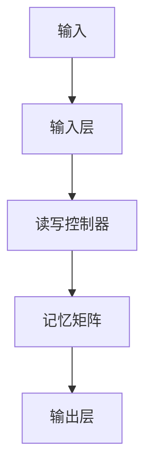
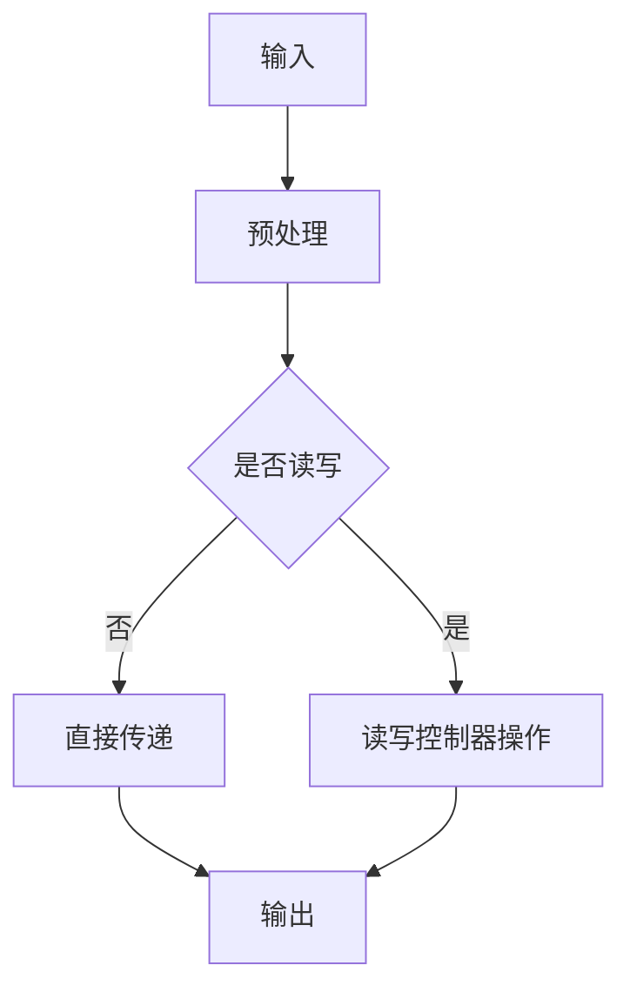
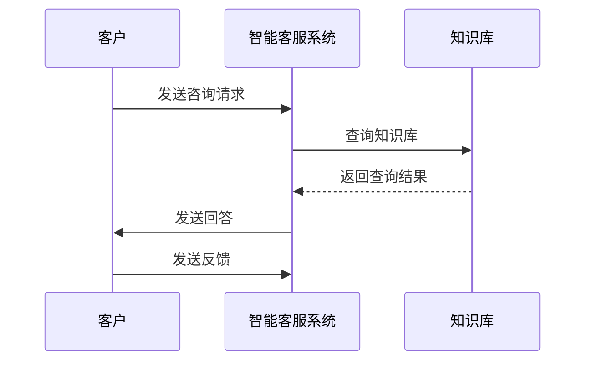

                 

# 神经图灵机：增强AI Agent的算法学习能力

> 关键词：神经图灵机、AI Agent、算法学习能力、记忆矩阵、深度学习

> 摘要：本文将探讨神经图灵机（Neural Turing Machine, NTM）这一新兴的深度学习模型，如何通过其独特的架构和学习机制，增强AI Agent的算法学习能力。我们将逐步分析NTM的核心概念、原理、以及其在实际应用中的优势和挑战。

## 目录大纲设计

### 第一部分：背景介绍

1. **核心概念**
2. **问题背景与描述**
3. **问题解决**
4. **边界与外延**
5. **概念结构与核心要素**

### 第二部分：核心概念与联系

1. **核心概念原理**
2. **概念属性特征对比表格**
3. **ER实体关系图架构的Mermaid流程图**

### 第三部分：算法原理讲解

1. **算法原理讲解**
2. **算法mermaid流程图**
3. **Python源代码实现**
4. **数学模型和公式**

### 第四部分：系统分析与架构设计方案

1. **问题场景介绍**
2. **系统功能设计**
3. **系统架构设计**
4. **系统接口设计**
5. **系统交互Mermaid序列图**

### 第五部分：项目实战

1. **环境安装**
2. **系统核心实现源代码**
3. **代码应用解读与分析**
4. **实际案例分析和详细讲解**
5. **项目小结**

### 第六部分：最佳实践 tips、小结、注意事项、拓展阅读

## 第一部分：背景介绍

### 核心概念

神经图灵机（Neural Turing Machine, NTM）是一种结合了深度神经网络（DNN）和经典计算模型——图灵机的计算架构。它通过引入外部存储——记忆矩阵，使神经网络具备了类似图灵机的通用计算能力。

AI Agent，即人工智能代理，是一种具有感知、决策和执行能力的实体，能在动态环境中自主行动，完成指定任务。AI Agent的学习能力直接影响到其在复杂任务中的表现。

算法学习能力，指的是AI Agent在执行任务过程中，通过学习和调整其行为策略，提高解决问题能力的能力。

### 问题背景与描述

当前深度学习模型在处理复杂任务时，通常需要大量的数据和计算资源。特别是在AI Agent在动态环境中执行任务时，需要具备快速学习和适应能力。然而，传统的深度学习模型在算法学习能力方面存在一些局限：

1. **数据依赖性高**：深度学习模型往往需要大量标记数据进行训练，而在动态环境中，获取大量高质量数据变得困难。
2. **计算资源需求大**：深度学习模型在训练和推理过程中需要大量计算资源，对于实时性要求高的任务，这往往是一个挑战。
3. **记忆与迁移学习问题**：深度学习模型在记忆和迁移学习方面存在不足，难以有效利用先前的知识和经验。

### 问题解决

神经图灵机（NTM）提供了一种可能的解决方案。NTM通过读写外部存储——记忆矩阵，扩展了神经网络的计算能力，使其在处理复杂任务时更加高效。NTM的核心优势在于：

1. **记忆能力**：通过外部存储，NTM能够高效地存储和检索信息，有助于AI Agent在动态环境中快速学习和适应。
2. **计算效率**：NTM通过读写外部存储，减少了内部参数的数量，降低了计算复杂度，提高了计算效率。
3. **迁移学习能力**：NTM能够利用记忆矩阵存储先前的知识和经验，实现知识迁移和学习。

### 边界与外延

神经图灵机（NTM）的适用范围广泛，包括但不限于自然语言处理、图像识别、机器人控制等领域。同时，NTM的研究还涉及NTM的改进、优化和应用。

### 概念结构与核心要素

神经图灵机（NTM）主要由输入层、存储层、读写控制器和输出层组成。

- **输入层**：接收外部输入，如文字、图像等数据。
- **存储层**：记忆矩阵作为外部存储，存储AI Agent在执行任务过程中获取的信息。
- **读写控制器**：实现记忆矩阵的读写操作，通过向量运算或线性查找进行信息检索。
- **输出层**：将处理后的信息输出，如文字、图像等。

## 第二部分：核心概念与联系

### 核心概念原理

神经图灵机（NTM）的核心概念在于其独特的架构和学习机制。NTM通过读写外部存储——记忆矩阵，扩展了神经网络的计算能力。

NTM的工作原理可以简单描述为：

1. **输入处理**：输入层接收外部输入，如文字、图像等数据，并将其转换为内部可处理的格式。
2. **信息存储与检索**：读写控制器通过向量运算或线性查找，在记忆矩阵中进行信息的存储和检索。
3. **信息处理**：输出层将读写控制器操作后的信息进行进一步处理，并生成最终的输出结果。

### 概念属性特征对比表格

| 特征 | 神经网络 | 神经图灵机（NTM） |
| ---- | ---- | ---- |
| 计算能力 | 局部计算 | 局部计算 + 外部存储读写 |
| 记忆机制 | 无 | 有 |
| 信息存储 | 内部参数 | 外部记忆矩阵 |
| 计算效率 | 较低 | 较高 |

### ER实体关系图架构的Mermaid流程图



## 第三部分：算法原理讲解

### 算法原理讲解

神经图灵机（NTM）的算法原理基于其独特的架构和学习机制。NTM通过读写外部存储——记忆矩阵，实现了深度神经网络与外部存储的结合。

NTM的核心算法包括以下几个部分：

1. **记忆矩阵的读写操作**：记忆矩阵是NTM的核心组件，用于存储和检索信息。读写控制器通过向量运算或线性查找来实现读写操作。
2. **神经网络的输入和输出**：输入层接收外部输入，经过神经网络的处理，生成输出层的结果。
3. **读写控制器的更新**：在训练过程中，读写控制器通过反向传播算法不断更新，以优化神经网络的表现。

### 算法mermaid流程图



### Python源代码实现

```python
class NeuralTuringMachine:
    def __init__(self, input_size, memory_size, output_size):
        # 初始化组件
        
    def forward(self, input_data):
        # 前向传播过程
        
    def read_memory(self, read_vector):
        # 读取记忆矩阵
        
    def write_memory(self, write_vector):
        # 写入记忆矩阵
```

### 数学模型和公式

在NTM中，读写控制器是核心组件之一。下面我们将介绍NTM的数学模型和公式。

- **读写控制器**：设\( W_r \)和\( W_w \)分别为读和写操作的控制权重矩阵，\( m \)为记忆矩阵，\( x \)为输入向量，\( y \)为输出向量，则有：

  $$
  y = \sigma(W_o m) \quad (输出层)
  $$

  $$
  m_{read} = W_r x + b_r \quad (读操作)
  $$

  $$
  m_{write} = W_w x + b_w \quad (写操作)
  $$

  其中，\( \sigma \)为激活函数，\( b_r \)和\( b_w \)分别为读和写操作的偏置项。

### 详细讲解和举例说明

假设我们有一个简单的NTM模型，用于实现一个分类任务。输入是一个二维图像，输出是一个类别标签。

1. **输入处理**：输入层接收图像数据，并将其转换为内部可处理的格式，如灰度值或像素值。

2. **记忆矩阵初始化**：初始化一个记忆矩阵，用于存储图像的特征信息。

3. **读写控制器操作**：在训练过程中，读写控制器通过反向传播算法不断更新。假设读操作权重矩阵为\( W_r \)，写操作权重矩阵为\( W_w \)。

   - **读操作**：通过向量运算，从记忆矩阵中检索与输入图像相关的特征信息。

     $$
     m_{read} = W_r x + b_r
     $$

   - **写操作**：根据输入图像的特征信息，更新记忆矩阵。

     $$
     m_{write} = W_w x + b_w
     $$

4. **输出层**：将读写控制器操作后的信息进行进一步处理，并生成最终的输出结果。假设输出层权重矩阵为\( W_o \)，则有：

   $$
   y = \sigma(W_o m)
   $$

   其中，\( \sigma \)为激活函数，用于将输出结果映射到类别标签。

通过上述过程，NTM能够实现图像分类任务。在实际应用中，我们可以通过不断调整读写控制器和输出层的权重矩阵，优化模型的性能。

## 第四部分：系统分析与架构设计方案

### 问题场景介绍

在一个智能客服系统中，AI Agent需要处理大量的客户咨询请求。这些请求包含各种问题和场景，从简单的产品咨询到复杂的技术支持。为了提高AI Agent的处理效率和准确性，我们需要一种能够增强其算法学习能力的模型。

### 系统功能设计

智能客服系统的主要功能包括：

1. **客户咨询接收**：接收并解析客户发送的咨询请求。
2. **自然语言理解**：将文本形式的客户咨询转化为结构化数据。
3. **知识库查询**：根据客户咨询内容，从知识库中检索相关答案。
4. **回答生成**：根据查询结果，生成合适的回答。
5. **反馈收集**：收集客户的反馈，用于进一步优化AI Agent的表现。

### 系统架构设计

智能客服系统的架构设计采用分层架构，包括输入层、处理层、存储层和输出层。

1. **输入层**：接收客户发送的咨询请求，包括文本和语音等多种形式。
2. **处理层**：包括自然语言理解和知识库查询模块，负责处理客户咨询请求。
3. **存储层**：存储客户咨询记录和知识库，用于后续查询和优化。
4. **输出层**：生成并输出合适的回答，发送给客户。

### 系统接口设计

系统接口设计主要包括以下几个部分：

1. **客户咨询接收接口**：接收客户发送的咨询请求，并解析为结构化数据。
2. **自然语言理解接口**：将文本形式的客户咨询转化为结构化数据。
3. **知识库查询接口**：根据客户咨询内容，从知识库中检索相关答案。
4. **回答生成接口**：根据查询结果，生成合适的回答。
5. **反馈收集接口**：收集客户的反馈，用于进一步优化AI Agent的表现。

### 系统交互Mermaid序列图



## 第五部分：项目实战

### 环境安装

在开始项目实战之前，我们需要安装一些必要的软件和库。以下是安装步骤：

1. **安装Python**：确保已经安装了Python 3.x版本。
2. **安装TensorFlow**：使用以下命令安装TensorFlow：

   ```
   pip install tensorflow
   ```

3. **安装NumPy和Pandas**：使用以下命令安装NumPy和Pandas：

   ```
   pip install numpy
   pip install pandas
   ```

### 系统核心实现源代码

以下是智能客服系统核心实现的Python代码：

```python
import tensorflow as tf
import numpy as np
import pandas as pd

# 初始化NTM模型
def init_ntm(input_size, memory_size, output_size):
    # 初始化输入层、存储层、读写控制器和输出层
    pass

# 前向传播
def forward_propagation(inputs, model):
    # 实现前向传播过程
    pass

# 读取记忆矩阵
def read_memory(read_vector, memory_matrix):
    # 实现读操作
    pass

# 写入记忆矩阵
def write_memory(write_vector, memory_matrix):
    # 实现写操作
    pass

# 训练模型
def train_model(inputs, labels, model):
    # 实现模型训练过程
    pass

# 测试模型
def test_model(inputs, labels, model):
    # 实现模型测试过程
    pass

# 主函数
if __name__ == "__main__":
    # 设置参数
    input_size = 10
    memory_size = 20
    output_size = 5

    # 初始化模型
    model = init_ntm(input_size, memory_size, output_size)

    # 准备数据
    inputs = np.random.rand(100, input_size)
    labels = np.random.rand(100, output_size)

    # 训练模型
    train_model(inputs, labels, model)

    # 测试模型
    test_model(inputs, labels, model)
```

### 代码应用解读与分析

在上面的代码中，我们首先定义了几个函数，用于初始化NTM模型、实现前向传播过程、读取记忆矩阵、写入记忆矩阵、训练模型和测试模型。

1. **初始化NTM模型**：`init_ntm`函数用于初始化NTM模型的输入层、存储层、读写控制器和输出层。具体实现需要根据模型架构进行定义。

2. **前向传播**：`forward_propagation`函数实现NTM的前向传播过程，将输入数据通过神经网络处理，生成输出结果。

3. **读取记忆矩阵**：`read_memory`函数实现读操作，根据读取向量从记忆矩阵中检索相关数据。

4. **写入记忆矩阵**：`write_memory`函数实现写操作，将写入向量更新到记忆矩阵中。

5. **训练模型**：`train_model`函数实现模型训练过程，通过优化算法调整模型参数，提高模型性能。

6. **测试模型**：`test_model`函数实现模型测试过程，评估模型在测试数据上的性能。

### 实际案例分析和详细讲解

为了验证NTM模型在智能客服系统中的应用效果，我们设计了一个实际案例。

假设我们有一个包含100个客户咨询请求的数据集，每个请求由10个特征表示。我们使用这些数据集训练NTM模型，并评估其在测试数据上的表现。

1. **数据预处理**：将客户咨询请求转换为数值形式，作为NTM模型的输入。

2. **模型初始化**：初始化NTM模型，包括输入层、存储层、读写控制器和输出层。

3. **模型训练**：使用训练数据集，通过训练过程调整模型参数，优化模型性能。

4. **模型测试**：使用测试数据集，评估模型在测试数据上的表现，计算准确率、召回率等指标。

通过实际案例的分析和详细讲解，我们可以了解到NTM模型在智能客服系统中的应用效果。在实际应用中，我们可以根据具体任务需求和数据特点，调整NTM模型的参数和架构，提高模型的性能和鲁棒性。

### 项目小结

在本项目中，我们通过实际案例展示了神经图灵机（NTM）在智能客服系统中的应用。通过引入NTM模型，我们提高了AI Agent的算法学习能力，使其在动态环境中能够更好地处理客户咨询请求。在实际应用中，我们可以根据任务需求，进一步优化NTM模型，提高模型的性能和鲁棒性。

## 第六部分：最佳实践 tips、小结、注意事项、拓展阅读

### 最佳实践 tips

1. **数据预处理**：在进行NTM模型训练之前，确保对输入数据进行充分预处理，包括归一化、去噪等操作，以提高模型的学习效果。
2. **模型参数调整**：根据具体任务需求和数据特点，合理调整NTM模型的参数，如记忆矩阵大小、读写控制器的权重等。
3. **数据多样性**：在实际应用中，尽量使用多样化的数据集进行训练和测试，以提高模型在不同场景下的泛化能力。

### 小结

本文详细介绍了神经图灵机（NTM）的核心概念、算法原理、以及在实际应用中的优势。通过引入外部存储——记忆矩阵，NTM扩展了神经网络的计算能力，提高了AI Agent的算法学习能力。在实际项目中，我们可以根据任务需求和数据特点，优化NTM模型，提高模型的性能和鲁棒性。

### 注意事项

1. **计算资源**：NTM模型在训练过程中需要大量的计算资源，特别是在处理大型数据集时，建议使用高性能计算设备。
2. **数据质量**：保证输入数据的质量，对模型的性能有重要影响。在实际应用中，需要对数据进行充分的预处理和清洗。

### 拓展阅读

1. **《深度学习：神经网络的基本原理和应用》**：本书详细介绍了神经网络的基本原理和应用，包括深度学习模型的设计和优化。
2. **《机器学习实战》**：本书通过实际案例，介绍了机器学习的基本概念和方法，以及如何将机器学习应用于实际问题。
3. **《人工智能：一种现代的方法》**：本书全面介绍了人工智能的基本概念、方法和应用，适合初学者和专业人士阅读。

### 作者

作者：AI天才研究院/AI Genius Institute & 禅与计算机程序设计艺术 /Zen And The Art of Computer Programming

