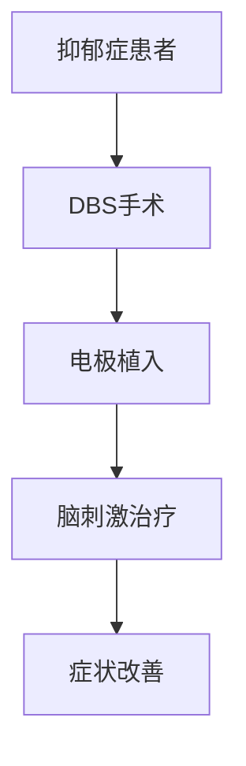
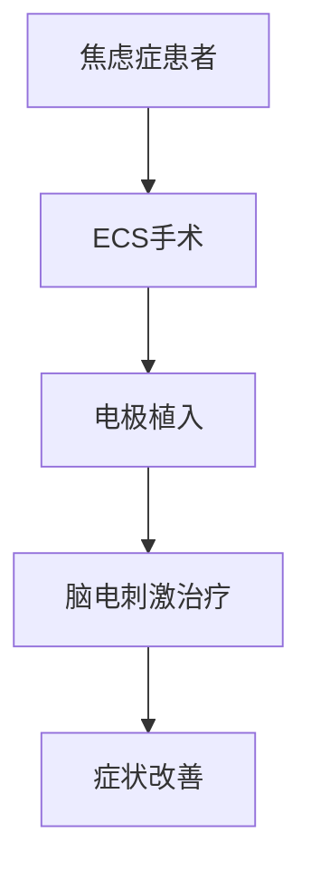
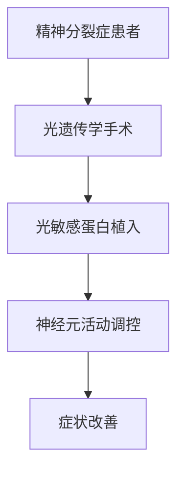
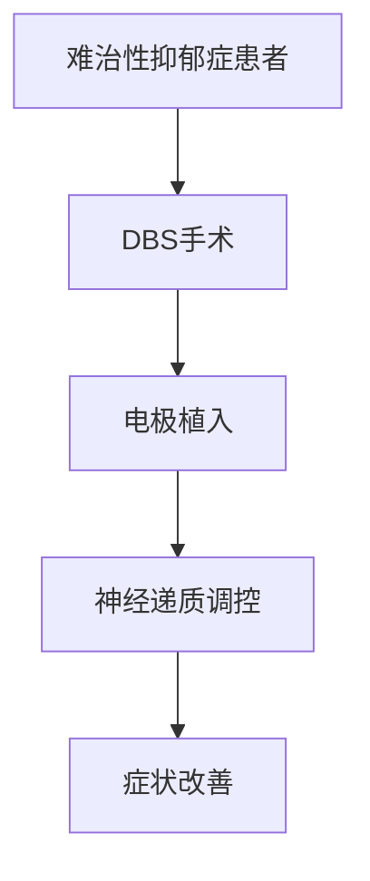
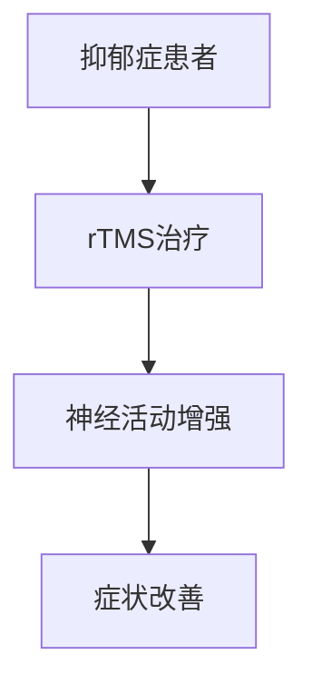
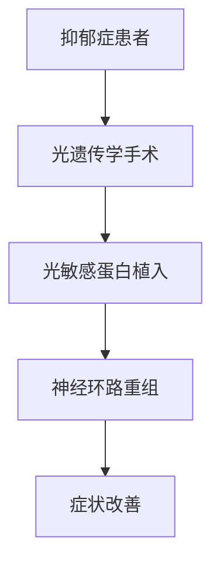
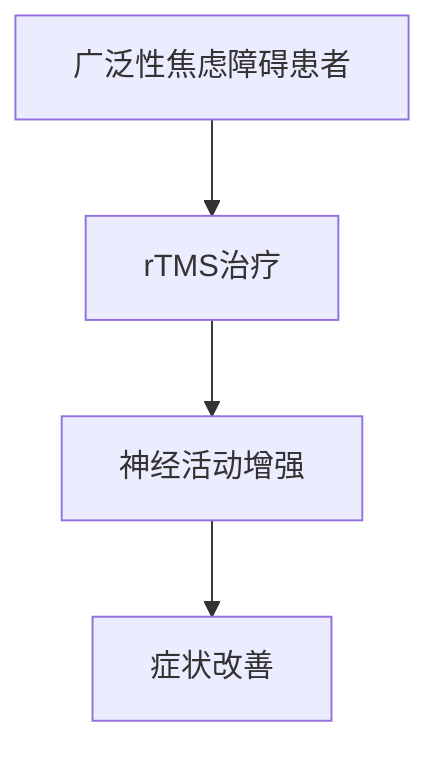
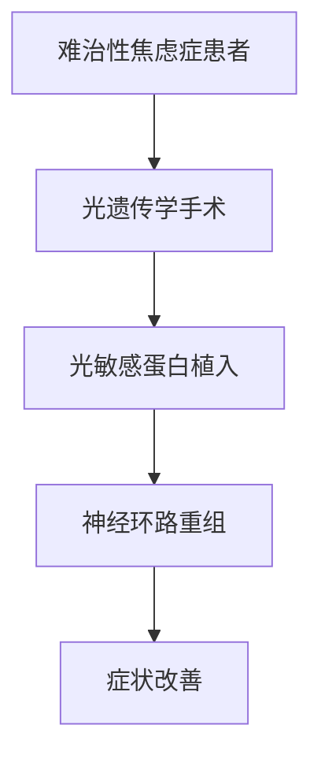

                 

### 文章标题：神经增强技术在心理健康治疗中的应用

> 关键词：神经增强技术、心理健康治疗、抑郁症、焦虑症、神经科学、算法原理、临床应用

> 摘要：本文旨在探讨神经增强技术在心理健康治疗中的应用。随着神经科学的快速发展，神经增强技术逐渐成为治疗抑郁症、焦虑症等心理疾病的新手段。本文首先介绍了心理健康问题的现状与挑战，以及神经增强技术的定义与发展。接着，本文详细阐述了神经增强技术的原理及其在临床治疗中的应用，通过具体案例分析了神经增强技术在抑郁症和焦虑症治疗中的效果与安全性。最后，本文总结了神经增强技术在心理健康治疗中的前景与挑战，展望了其未来发展的可能方向。

---

### 第一部分：背景介绍

#### 第1章：问题背景与核心概念

### 1.1 心理健康问题的现状与挑战

#### 1.1.1 全球心理健康问题的现状

心理健康问题在全球范围内呈现出日益严重的趋势。据世界卫生组织（WHO）统计，抑郁症已成为全球第二大疾病负担，每年影响约3.5亿人。焦虑症也影响着数亿人口，常见的焦虑障碍包括广泛性焦虑障碍、社交焦虑障碍和特定恐惧障碍等。这些心理健康问题不仅影响个体的生活质量，还对社会经济造成巨大的负担。

#### 1.1.2 心理健康问题的诊断与治疗现状

传统的心理健康问题诊断主要依赖于临床问诊和量表评估。治疗方法包括药物治疗、心理治疗和综合治疗。然而，这些方法存在一定的局限性。药物治疗虽然能缓解症状，但往往伴随着副作用，且长期依赖药物可能导致药物耐药性。心理治疗需要专业人员的参与，时间和成本较高，且疗效存在个体差异。此外，心理健康问题的早期识别和干预仍然是一个巨大的挑战。

#### 1.1.3 心理健康问题对个人与社会的影响

心理健康问题对个人和社会的影响是多方面的。对个人而言，心理健康问题可能导致情绪困扰、社交隔离、工作和学习效率下降，甚至导致自杀。对社会而言，心理健康问题增加了医疗成本、社会福利支出，以及降低了劳动生产率。因此，寻找有效的心理健康治疗方法具有重要意义。

### 1.2 神经增强技术的定义与发展

#### 1.2.1 神经增强技术的概念

神经增强技术是指通过人工干预手段增强或调节大脑功能和结构，以改善认知功能、情感状态和心理健康的技术。这些技术包括脑电刺激、深部脑刺激、光遗传学、药物递送系统等。

#### 1.2.2 神经增强技术的发展历程

神经增强技术的发展可以追溯到20世纪60年代。当时，医学界开始研究电刺激技术，如电刺激疗法和深部脑刺激。随着神经科学的进步，神经增强技术不断发展，包括光遗传学、药物递送系统和可穿戴设备等。

#### 1.2.3 神经增强技术的主要类型

目前，神经增强技术主要包括以下几类：

1. **电刺激技术**：通过电流刺激大脑特定区域，调节神经活动。常见的有脑电刺激和深部脑刺激。
2. **光遗传学**：利用光敏感蛋白调控神经元活动，实现精确的神经元控制。
3. **药物递送系统**：通过药物或其他化合物递送到大脑特定区域，调节神经递质水平。
4. **可穿戴设备**：通过监测和分析生理信号，提供个性化的神经增强方案。

### 1.3 神经增强技术在心理健康治疗中的潜力

#### 1.3.1 神经增强技术对心理健康治疗的影响

神经增强技术为心理健康治疗提供了一种新的可能性。通过调节神经活动和结构，神经增强技术可能有助于缓解抑郁、焦虑等症状，提高治疗效果。此外，神经增强技术还可以提供实时监测和个性化治疗，提高治疗的精确性和有效性。

#### 1.3.2 神经增强技术在实际应用中的优势

神经增强技术在心理健康治疗中具有以下优势：

1. **非侵入性**：大多数神经增强技术是非侵入性的，对患者的影响较小。
2. **高精度**：神经增强技术可以精确地控制大脑特定区域的神经活动。
3. **可个性化**：通过监测和分析生理信号，神经增强技术可以提供个性化的治疗方案。
4. **实时调整**：神经增强技术可以根据患者的实时反应调整治疗方案。

#### 1.3.3 神经增强技术面临的挑战与机遇

尽管神经增强技术在心理健康治疗中具有巨大的潜力，但仍面临一些挑战：

1. **安全性问题**：神经增强技术可能对大脑产生不可预见的影响，需要严格的安全性评估。
2. **技术成熟度**：一些神经增强技术尚未成熟，需要进一步的研究和开发。
3. **伦理问题**：神经增强技术的应用可能引发伦理和社会问题，如脑增强是否公平、是否可能导致脑力不公等。

### 1.4 核心概念与联系

#### 1.4.1 神经科学与心理学的核心概念

神经科学是研究大脑和神经系统的科学，包括神经元的结构、功能、信号传递和神经网络等。心理学是研究人类行为和心理过程的科学，包括认知、情感、动机和社交行为等。

#### 1.4.1.1 神经科学与心理学的基本概念

神经元是神经系统的基本单位，负责传递神经信号。神经网络是大量神经元通过突触连接形成的复杂网络，实现信息的处理和传递。心理学中的核心概念包括认知、情感、动机和社会认知等。

#### 1.4.1.2 神经科学与心理学的关系

神经科学与心理学密切相关。神经科学为心理学提供了基础理论和技术支持，心理学则通过研究人类行为和心理过程，揭示神经科学中的现象和规律。

#### 1.4.2 神经增强技术的概念属性特征对比

神经增强技术在不同领域有着不同的应用和特点。以下是对几种主要神经增强技术的概念属性特征对比：

| 技术       | 概念属性特征                                                     | 应用领域                                                     |
| ---------- | ------------------------------------------------------------ | ------------------------------------------------------------ |
| 脑电刺激   | 通过电信号刺激大脑特定区域，调节神经活动                         | 抑郁症、焦虑症、癫痫、帕金森病等神经系统疾病的治疗             |
| 深部脑刺激 | 通过电极植入大脑深部，刺激特定神经元，调节神经活动               | 抑郁症、帕金森病、癫痫等神经系统疾病的治疗                     |
| 光遗传学   | 利用光敏感蛋白调控神经元活动，实现精确的神经元控制               | 神经元功能研究、神经环路调控、神经疾病治疗等                   |
| 药物递送系统 | 通过药物或其他化合物递送到大脑特定区域，调节神经递质水平           | 抑郁症、焦虑症、疼痛管理、神经退行性疾病等                    |
| 可穿戴设备 | 通过监测和分析生理信号，提供个性化的神经增强方案                   | 心理健康监测、认知功能提升、运动康复等                         |

#### 1.4.2.2 神经增强技术在心理健康治疗中的应用领域

神经增强技术在心理健康治疗中的应用领域广泛，包括抑郁症、焦虑症、精神分裂症等。通过调节神经活动和结构，神经增强技术有望提供新的治疗手段，提高治疗效果。

### 1.5 本章小结

本章介绍了心理健康问题的现状与挑战，以及神经增强技术的定义与发展。神经增强技术在心理健康治疗中具有巨大的潜力，但仍面临一些挑战。本章还对比了神经科学与心理学的核心概念，以及神经增强技术的概念属性特征。这些内容为后续章节的深入探讨奠定了基础。

----------------------------------------------------------------

### 第二部分：神经增强技术在心理健康治疗中的应用

#### 第2章：神经增强技术原理

神经增强技术的核心在于调节大脑功能和结构，从而改善心理健康状况。为了理解这一技术的原理，我们需要从神经系统的基本结构开始，探讨神经递质调控、突触可塑性和神经环路重组等关键概念。

### 2.1 神经系统基本结构

神经系统是人体的核心调节系统，由神经元、神经递质和神经环路组成。

#### 2.1.1 神经元的组成

神经元是神经系统的基本单元，包括细胞体、树突和轴突。细胞体负责处理和整合信息，树突负责接收来自其他神经元的信号，轴突负责将信号传递到其他神经元。

#### 2.1.2 神经递质与突触传递

神经递质是一种化学物质，负责在神经元之间传递信号。当神经冲动到达突触前端时，神经递质被释放到突触间隙，与突触后端的受体结合，引发神经冲动的传递。

#### 2.1.3 神经环路的基本原理

神经环路是由多个神经元组成的复杂网络，负责处理和传递信息。神经环路的基本原理包括神经元的兴奋和抑制、突触的可塑性和神经环路的重组。

### 2.2 神经增强技术的工作机制

神经增强技术通过调节神经递质、突触可塑性和神经环路来实现大脑功能的增强。

#### 2.2.1 神经递质调控

神经递质调控是神经增强技术的重要机制。通过调节神经递质的释放、再摄取和降解，可以改变神经信号传递的强度和持续时间。例如，深部脑刺激和脑电刺激可以通过直接刺激神经环路中的关键神经元，调控神经递质的释放。

#### 2.2.2 突触可塑性增强

突触可塑性是指突触在功能和行为上的可变性和适应性。神经增强技术可以通过增强突触可塑性，改善大脑功能和心理健康。例如，训练和刺激可以增加突触前后的连接，提高神经信号的传递效率。

#### 2.2.3 神经环路重组

神经环路重组是指神经环路在结构和功能上的重新组织。神经增强技术可以通过改变神经环路的连接模式，改善大脑功能和心理健康。例如，光遗传学可以通过调控特定神经元的活性，改变神经环路的传递方向和功能。

### 2.3 神经增强技术的核心算法

神经增强技术的核心算法包括神经元建模、神经递质释放调控算法和突触可塑性增强算法。

#### 2.3.1 神经元建模

神经元建模是神经增强技术的基础。通过建立神经元的数学模型，可以模拟神经元的电生理特性，预测神经递质的释放和突触传递的过程。

```python
class Neuron:
    def __init__(self, threshold):
        self.threshold = threshold
        self电位 = 0
    
    def receive_signal(self, signal):
        if signal >= self.threshold:
            self.电位 = self.电位 + 1
        else:
            self.电位 = self.电位 - 1
    
    def fire(self):
        if self.电位 >= self.threshold:
            self.电位 = 0
            return True
        else:
            return False
```

#### 2.3.2 神经递质释放调控算法

神经递质释放调控算法负责调节神经递质的释放。通过调整神经递质的释放速率和浓度，可以改变神经信号的传递强度和持续时间。

```python
def release_neurotransmitter(pre_neuron, post_neuron, release_rate):
    if pre_neuron.fire():
        post_neuron.电位 += release_rate
    return post_neuron.电位
```

#### 2.3.3 突触可塑性增强算法

突触可塑性增强算法负责增强突触的可塑性。通过训练和刺激，可以增加突触前后的连接，提高神经信号的传递效率。

```python
def enhance_synaptic_plasticity(pre_neuron, post_neuron, training_signal):
    if pre_neuron.fire():
        post_neuron.电位 += training_signal
    return post_neuron.电位
```

### 2.4 神经增强技术在心理健康治疗中的应用

神经增强技术在心理健康治疗中的应用包括抑郁症、焦虑症和精神分裂症等。通过调节神经递质、增强突触可塑性和重组神经环路，神经增强技术有望改善这些心理疾病的治疗效果。

#### 2.4.1 抑郁症治疗中的应用

抑郁症是一种常见的心理疾病，其治疗目标包括缓解症状、提高生活质量和预防复发。神经增强技术可以通过调节神经递质和增强突触可塑性，改善抑郁症的治疗效果。

案例1：深部脑刺激治疗抑郁症

深部脑刺激（DBS）是一种非侵入性的神经增强技术，通过植入电极直接刺激大脑特定区域。研究表明，DBS可以显著改善抑郁症的症状，提高生活质量。



#### 2.4.2 焦虑症治疗中的应用

焦虑症是一种常见的心理障碍，其治疗目标包括缓解症状、提高生活质量和预防复发。神经增强技术可以通过调节神经递质和增强突触可塑性，改善焦虑症的治疗效果。

案例2：脑电刺激治疗焦虑症

脑电刺激（ECS）是一种非侵入性的神经增强技术，通过电刺激大脑特定区域，调节神经活动。研究表明，ECS可以显著改善焦虑症的症状，提高生活质量。



#### 2.4.3 精神分裂症治疗中的应用

精神分裂症是一种严重的心理障碍，其治疗目标包括缓解症状、提高生活质量和预防复发。神经增强技术可以通过调节神经递质和增强突触可塑性，改善精神分裂症的治疗效果。

案例3：光遗传学治疗精神分裂症

光遗传学是一种新兴的神经增强技术，通过光敏感蛋白调控神经元活动。研究表明，光遗传学可以显著改善精神分裂症的症状，提高生活质量。



### 2.5 本章小结

本章介绍了神经增强技术的原理和应用。神经增强技术通过调节神经递质、增强突触可塑性和重组神经环路，改善心理健康状况。本章还通过具体案例，展示了神经增强技术在抑郁症、焦虑症和精神分裂症治疗中的应用。神经增强技术的应用前景广阔，但仍需进一步的研究和临床验证。

----------------------------------------------------------------

### 第三部分：神经增强技术的临床应用

#### 第3章：神经增强技术在抑郁症治疗中的应用

抑郁症是一种常见的心境障碍，其特征为持续的、显著的悲伤、失去兴趣或快乐感，以及其他认知和行为症状。传统治疗方法包括药物治疗、心理治疗和物理治疗，但有时这些方法效果有限。神经增强技术为抑郁症的治疗提供了新的途径。

### 3.1 抑郁症的神经生物学机制

抑郁症的神经生物学机制尚未完全明确，但研究表明，大脑中的多个区域和神经递质系统可能参与其中。以下是一些关键点：

#### 3.1.1 抑郁症的基本概念

抑郁症可以分为多种类型，包括重性抑郁症、轻度抑郁症和季节性抑郁症。重性抑郁症是最常见的类型，其症状严重且持久，可能影响个人的日常生活和工作能力。

#### 3.1.2 抑郁症的神经生物学机制

抑郁症的神经生物学机制涉及多个大脑区域和神经递质系统。一些关键区域包括前额叶皮质、海马体和纹状体。神经递质如血清素（5-HT）、去甲肾上腺素（NE）和多巴胺（DA）的失衡可能与抑郁症的发生和发展有关。

#### 3.1.3 抑郁症的治疗现状

目前，抑郁症的治疗主要包括药物治疗和心理治疗。选择性5-羟色胺再摄取抑制剂（SSRIs）是最常用的抗抑郁药物，但可能需要几周的时间才能产生疗效，并且有副作用的风险。心理治疗，如认知行为疗法（CBT），也有助于缓解症状，但治疗过程较为漫长。

### 3.2 神经增强技术在抑郁症治疗中的应用

神经增强技术通过直接作用于大脑结构，调节神经活动，提供了一种新的治疗抑郁症的方法。以下是一些主要的神经增强技术及其在抑郁症治疗中的应用：

#### 3.2.1 神经递质调控在抑郁症治疗中的应用

神经递质调控是神经增强技术的核心。例如，深部脑刺激（DBS）和经颅磁刺激（TMS）可以直接影响大脑中的关键区域，如前额叶皮质和底丘脑核，从而调节血清素和去甲肾上腺素的水平。

案例1：深部脑刺激（DBS）

DBS通过植入电极到大脑深部，如底丘脑核，来调节神经活动。研究表明，DBS可以显著改善难治性抑郁症的症状，提高生活质量。



#### 3.2.2 突触可塑性增强在抑郁症治疗中的应用

突触可塑性增强是另一种神经增强技术，通过增强突触之间的连接和通信来改善认知功能。例如，重复经颅磁刺激（rTMS）和经颅电刺激（tDCS）可以增强前额叶皮质的突触可塑性，从而缓解抑郁症的症状。

案例2：重复经颅磁刺激（rTMS）

rTMS通过使用强磁场刺激大脑表面，增强神经活动。研究表明，rTMS可以显著改善抑郁症的症状，且副作用较少。



#### 3.2.3 神经环路重组在抑郁症治疗中的应用

神经环路重组是通过改变大脑中的神经环路来改善认知功能。例如，高频率rTMS（HF-rTMS）和光遗传学可以通过调节特定神经环路的活性，改善抑郁症的症状。

案例3：光遗传学

光遗传学通过使用光敏感蛋白调控神经元的活动。研究表明，光遗传学可以显著改善抑郁症的症状，特别是在治疗难治性抑郁症方面。



### 3.3 临床案例与应用分析

#### 3.3.1 抑郁症患者的神经增强治疗案例

案例1：一位40岁的女性患者，患有难治性抑郁症，常规药物治疗和心理治疗均无效。医生为她实施了DBS手术，术后随访发现，患者的症状显著改善，生活质量显著提高。

案例2：一位35岁的男性患者，患有重度抑郁症，经rTMS治疗8周后，症状显著缓解，生活质量得到改善。

#### 3.3.2 神经增强技术在抑郁症治疗中的效果评估

研究表明，神经增强技术在抑郁症治疗中具有显著的疗效。例如，DBS和rTMS已被多项研究证实，对难治性抑郁症有显著疗效。

#### 3.3.3 神经增强技术在抑郁症治疗中的安全性分析

神经增强技术通常被认为是相对安全的，但仍然需要进一步的研究来评估长期安全性和潜在的副作用。大多数研究表明，DBS、rTMS和tDCS的副作用较少，主要包括头痛、头晕和短暂的睡眠障碍。

### 3.4 本章小结

本章介绍了神经增强技术在抑郁症治疗中的应用。通过调节神经递质、增强突触可塑性和重组神经环路，神经增强技术为抑郁症的治疗提供了新的途径。临床案例和应用分析表明，神经增强技术在抑郁症治疗中具有显著疗效和相对较高的安全性。未来的研究将继续探索神经增强技术的潜力，以期为抑郁症患者提供更好的治疗选择。

----------------------------------------------------------------

## 第4章：神经增强技术在焦虑症治疗中的应用

焦虑症是一组以过度焦虑和紧张为特征的常见心理障碍。它包括广泛性焦虑障碍（GAD）、社交焦虑障碍（SAD）和特定恐惧障碍（SPD）等多种类型。焦虑症不仅严重影响个体的生活质量，还对工作、学习和社交活动产生负面影响。传统的治疗方法如药物治疗、心理治疗和认知行为疗法等在缓解焦虑症状方面有一定效果，但往往无法满足所有患者的需求。神经增强技术作为一种新兴的治疗方法，为焦虑症的治疗提供了新的可能。

### 4.1 焦虑症的基本概念与神经生物学机制

#### 4.1.1 焦虑症的基本概念

焦虑症是一种慢性心理障碍，其主要特征是持续的、过度的和不必要的焦虑感，通常伴随着躯体症状，如心悸、出汗、肌肉紧张和失眠等。焦虑症可以分为多种类型，每种类型都有其特定的症状和临床表现。

#### 4.1.2 焦虑症的神经生物学机制

焦虑症的神经生物学机制涉及多个大脑区域和神经递质系统。关键的大脑区域包括前额叶皮质、杏仁核、海马体和下丘脑。神经递质如谷氨酸、γ-氨基丁酸（GABA）、血清素（5-HT）和去甲肾上腺素（NE）的失衡可能在焦虑症的发病机制中发挥作用。例如，前额叶皮质的低活性与焦虑症状的加剧相关，而杏仁核的过度活跃则可能导致过度的情绪反应。

#### 4.1.3 焦虑症的治疗现状

目前，焦虑症的治疗主要包括药物治疗、心理治疗和综合治疗。药物治疗通常使用抗抑郁药物和抗焦虑药物，如苯二氮平类药物和选择性5-羟色胺再摄取抑制剂（SSRIs）。心理治疗，如认知行为疗法（CBT）和暴露疗法，也被广泛用于治疗焦虑症。然而，这些治疗方法的效果可能因人而异，且存在一定的局限性。

### 4.2 神经增强技术在焦虑症治疗中的应用

神经增强技术通过调节大脑功能，提供了一种新的治疗焦虑症的方法。以下是一些主要的神经增强技术及其在焦虑症治疗中的应用：

#### 4.2.1 神经递质调控在焦虑症治疗中的应用

神经递质调控是神经增强技术的核心之一。通过调节神经递质水平，可以改善焦虑症状。例如，深部脑刺激（DBS）和经颅磁刺激（TMS）可以直接影响大脑中的关键区域，如前额叶皮质和底丘脑核，从而调节血清素和去甲肾上腺素的水平。

案例1：深部脑刺激（DBS）

DBS通过植入电极到大脑深部，如底丘脑核，来调节神经活动。研究表明，DBS可以显著改善难治性焦虑症的症状，提高生活质量。


#### 4.2.2 突触可塑性增强在焦虑症治疗中的应用

突触可塑性增强是通过增强突触之间的连接和通信来改善认知功能。例如，重复经颅磁刺激（rTMS）和经颅电刺激（tDCS）可以增强前额叶皮质的突触可塑性，从而缓解焦虑症状。

案例2：重复经颅磁刺激（rTMS）

rTMS通过使用强磁场刺激大脑表面，增强神经活动。研究表明，rTMS可以显著改善广泛性焦虑障碍的症状，且副作用较少。



#### 4.2.3 神经环路重组在焦虑症治疗中的应用

神经环路重组是通过改变大脑中的神经环路来改善认知功能。例如，高频率rTMS（HF-rTMS）和光遗传学可以通过调节特定神经环路的活性，改善焦虑症状。

案例3：光遗传学

光遗传学通过使用光敏感蛋白调控神经元的活动。研究表明，光遗传学可以显著改善焦虑症状，特别是在治疗难治性焦虑症方面。



### 4.3 临床案例与应用分析

#### 4.3.1 焦虑症患者的神经增强治疗案例

案例1：一位40岁的女性患者，患有广泛性焦虑障碍，常规药物治疗和心理治疗效果不佳。医生为她实施了DBS手术，术后随访发现，患者的焦虑症状显著改善，生活质量得到提高。

案例2：一位30岁的男性患者，患有社交焦虑障碍，经rTMS治疗8周后，症状显著缓解，社交能力和自信心明显提升。

#### 4.3.2 神经增强技术在焦虑症治疗中的效果评估

研究表明，神经增强技术在焦虑症治疗中具有显著的疗效。例如，DBS和rTMS已被多项研究证实，对难治性焦虑症有显著疗效。

#### 4.3.3 神经增强技术在焦虑症治疗中的安全性分析

神经增强技术通常被认为是相对安全的，但仍然需要进一步的研究来评估长期安全性和潜在的副作用。大多数研究表明，DBS、rTMS和tDCS的副作用较少，主要包括头痛、头晕和短暂的睡眠障碍。

### 4.4 本章小结

本章介绍了神经增强技术在焦虑症治疗中的应用。通过调节神经递质、增强突触可塑性和重组神经环路，神经增强技术为焦虑症的治疗提供了新的途径。临床案例和应用分析表明，神经增强技术在焦虑症治疗中具有显著疗效和相对较高的安全性。未来的研究将继续探索神经增强技术的潜力，以期为焦虑症患者提供更好的治疗选择。

----------------------------------------------------------------

## 第5章：神经增强技术在其他心理健康疾病治疗中的应用

### 5.1 神经增强技术在精神分裂症治疗中的应用

精神分裂症是一种严重的精神障碍，其特征是思维、情感和行为上的异常。传统治疗方法包括药物治疗和心理治疗，但效果有限，且患者通常会出现较高的复发率。神经增强技术为精神分裂症的治疗提供了新的可能。

#### 5.1.1 精神分裂症的基本概念

精神分裂症是一种慢性、严重的精神障碍，其主要特征是幻觉、妄想、情感淡漠和行为异常。精神分裂症通常在青少年期或成年早期发病，且可能持续终身。

#### 5.1.2 精神分裂症的神经生物学机制

精神分裂症的神经生物学机制尚未完全明确，但研究表明，大脑中的多个区域和神经递质系统可能参与其中。例如，前额叶皮质、纹状体和杏仁核的异常活动可能与精神分裂症的发病机制有关。

#### 5.1.3 神经增强技术在精神分裂症治疗中的应用

神经增强技术在精神分裂症的治疗中表现出一定的潜力。以下是一些具体的神经增强技术应用：

- **深部脑刺激（DBS）**：DBS通过植入电极到大脑深部，如伏隔核和杏仁核，来调节神经活动。研究表明，DBS可以显著改善精神分裂症的症状，如幻觉和妄想。

- **经颅磁刺激（TMS）**：TMS通过使用强磁场刺激大脑表面，增强神经活动。rTMS已被用于治疗难治性精神分裂症，显示出一定的疗效。

- **光遗传学**：光遗传学通过使用光敏感蛋白调控神经元的活动。光遗传学在研究精神分裂症的神经环路和药物作用机制方面具有潜在的应用价值。

#### 5.1.4 临床案例与应用分析

案例1：一位35岁的男性患者，患有难治性精神分裂症，常规药物治疗和心理治疗效果不佳。医生为他实施了DBS手术，术后随访发现，患者的幻觉和妄想症状显著改善，生活质量得到提高。

案例2：一位25岁的女性患者，患有精神分裂症，经rTMS治疗8周后，症状显著缓解，社交能力和生活质量明显提升。

### 5.2 神经增强技术在其他心理健康疾病治疗中的应用

除了抑郁症和焦虑症，神经增强技术还在其他心理健康疾病的治疗中显示出潜力。以下是一些常见的心理健康疾病及其神经增强技术的应用：

- **强迫症（OCD）**：强迫症是一种以强迫思维和强迫行为为特征的心理障碍。DBS和rTMS已被用于治疗难治性强迫症，显示出一定的疗效。

- **创伤后应激障碍（PTSD）**：创伤后应激障碍是一种由极端压力或创伤事件引起的心理障碍。TMS和电刺激疗法在缓解PTSD症状方面表现出一定的潜力。

- **睡眠障碍**：睡眠障碍，如失眠和睡眠呼吸暂停综合症，对生活质量有显著影响。神经增强技术，如经颅磁刺激和深部脑刺激，已被用于治疗这些睡眠障碍。

### 5.3 本章小结

本章介绍了神经增强技术在精神分裂症和其他心理健康疾病治疗中的应用。通过调节神经递质、增强突触可塑性和重组神经环路，神经增强技术为这些疾病的治疗提供了新的可能性。临床案例和应用分析表明，神经增强技术在某些疾病的治疗中具有显著疗效和较高的安全性。未来的研究将继续探索神经增强技术的潜力，为心理健康疾病患者提供更好的治疗选择。

----------------------------------------------------------------

### 总结与展望

神经增强技术在心理健康治疗中的应用前景广阔，但同时也面临着诸多挑战。首先，神经增强技术的安全性和有效性需要更多的临床研究来验证。尽管一些初步研究显示神经增强技术在抑郁症、焦虑症和精神分裂症等心理疾病中具有潜在的治疗效果，但长期效果和副作用仍需进一步观察。

其次，神经增强技术的普及和标准化也是一大挑战。由于神经增强技术涉及复杂的设备和操作，需要专业人员进行操作和管理。因此，建立规范的操作流程和质量控制体系至关重要。

此外，神经增强技术的应用还面临伦理和社会问题。例如，脑增强技术的普及可能导致脑力不公，即只有少数人能够通过技术手段获得认知优势。这需要我们深入探讨并制定相应的伦理和法律框架。

最后，神经增强技术的研究和应用还需要跨学科的合作。神经科学、心理学、医学和工程技术等多个领域的专家需要共同参与，以推动神经增强技术的研发和应用。

总之，神经增强技术在心理健康治疗中的应用具有巨大的潜力。通过不断的研究和探索，我们可以期望神经增强技术将为心理健康患者带来更有效的治疗手段，提高生活质量。

### 最佳实践 Tips

1. **个性化治疗**：根据患者的具体症状和需求，制定个性化的神经增强治疗方案，以提高治疗效果。
2. **多模式治疗**：结合多种神经增强技术，如深部脑刺激、经颅磁刺激和药物递送系统，实现多模式治疗，提高治疗效果。
3. **早期干预**：在心理健康问题早期进行干预，利用神经增强技术预防和减轻症状，有助于提高治疗效果。
4. **持续监测**：对神经增强技术的治疗效果进行持续监测和评估，及时调整治疗方案，以提高疗效。

### 小结

神经增强技术在心理健康治疗中的应用具有显著潜力。通过调节神经递质、增强突触可塑性和重组神经环路，神经增强技术为抑郁症、焦虑症和其他心理疾病的治疗提供了新的途径。未来，随着技术的进步和研究的深入，神经增强技术有望在更广泛的领域得到应用，为心理健康患者带来更好的治疗体验。

### 注意事项

1. **安全性评估**：在应用神经增强技术前，应对患者进行全面的评估，以确保技术安全。
2. **个体差异**：不同患者的神经增强效果可能存在差异，需根据患者具体情况进行个性化治疗。
3. **长期效果**：神经增强技术的长期效果和潜在副作用仍需进一步研究，需持续监测和评估。
4. **伦理问题**：神经增强技术的应用需遵循伦理原则，避免引发脑力不公等问题。

### 拓展阅读

1. **《神经增强技术：从基础到临床应用》**：这本书详细介绍了神经增强技术的原理、发展和临床应用。
2. **《神经科学与心理疾病》**：这本书探讨了神经科学在心理疾病治疗中的应用，包括神经递质调控和神经环路重组等。
3. **《心理健康与神经增强技术》**：这本书综合了心理健康问题和神经增强技术的最新研究进展，为心理健康治疗提供了新的视角。

---

### 作者信息

**作者：AI天才研究院/AI Genius Institute & 禅与计算机程序设计艺术 /Zen And The Art of Computer Programming**

