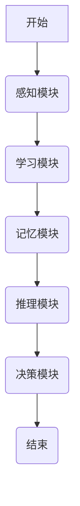
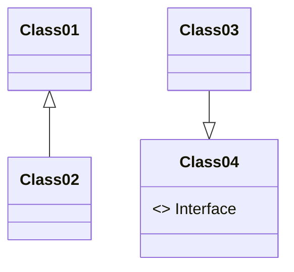
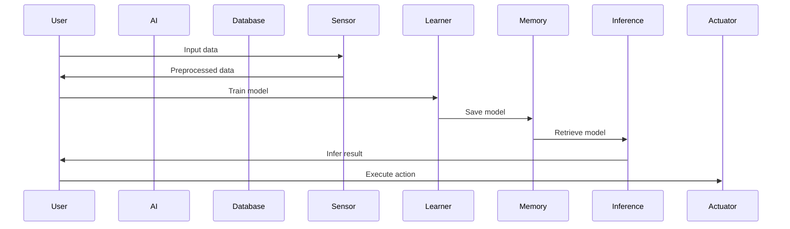
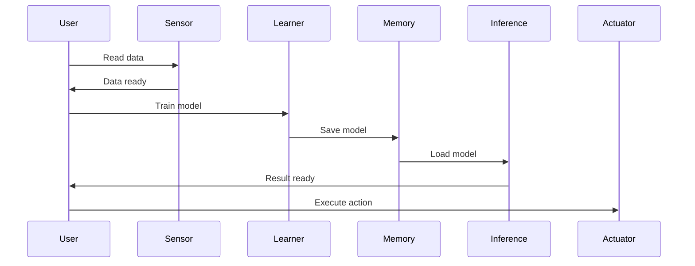
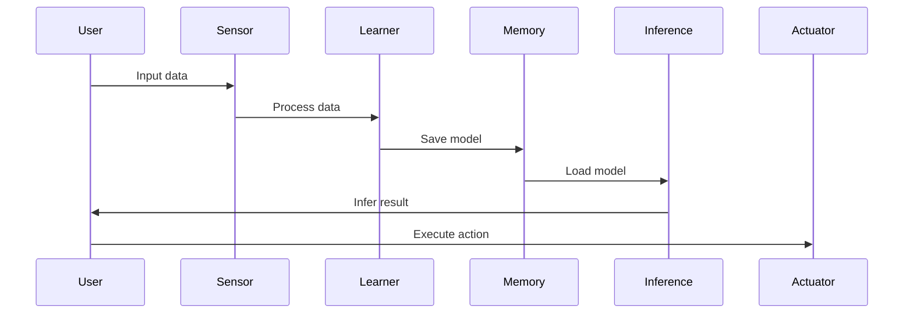

                 

# 神经科学启发的AI Agent认知模型

## 关键词
- 神经科学
- 人工智能代理
- 认知模型
- 自主学习
- 机器学习算法
- 脑机接口

## 摘要
本文探讨了神经科学对人工智能代理（AI Agent）认知模型的影响。通过引入神经科学的基本概念，我们分析了如何将神经科学原理应用于AI Agent的构建，从而提升其自主学习和认知能力。文章分为五个部分：第一部分介绍了神经科学和AI Agent的基本概念及其交叉领域的重要性；第二部分阐述了神经科学启发的AI Agent的核心概念和设计原则；第三部分深入解析了AI Agent的认知特性及其算法原理；第四部分详细描述了AI Agent的系统设计与实现；第五部分通过一个实际项目展示了神经科学启发的AI Agent的应用与实现。

## 引言与背景

### 神经科学与AI Agent的交叉领域

神经科学与AI Agent的交叉领域是近年来人工智能领域的一个新兴研究方向。神经科学是研究神经系统结构和功能的科学，而AI Agent是具备自主学习和决策能力的计算机程序。这两者的结合旨在探索如何通过模拟人脑的工作原理来提升AI Agent的认知能力和自主性。

### 神经科学的基本概念

神经科学涉及神经系统的各个方面，包括神经元、突触、神经传递物质和神经网络等。神经元是神经系统的基本单元，通过突触与其他神经元连接，传递电信号。神经传递物质则负责在神经元之间传递信号，包括兴奋性传递物质和抑制性传递物质。

### 人工智能代理的基本概念

AI Agent是具有目标导向行为、能够在特定环境中自主决策和执行任务的计算机程序。它们通常基于机器学习和深度学习算法，能够在大量数据中学习规律和模式，从而进行智能决策。

### 神经科学启发的AI Agent的重要性

神经科学启发的AI Agent具有以下几个重要特点：

1. **自主学习能力**：通过模拟人脑的学习机制，AI Agent能够自主地学习和适应新环境。
2. **认知能力**：AI Agent能够理解、推理和解决问题，具备类似于人类的认知能力。
3. **人机交互**：通过脑机接口技术，AI Agent可以与人类进行更为自然的交互。

### 研究现状与挑战

当前，神经科学启发的AI Agent研究已经取得了一些显著成果，但仍然面临以下挑战：

1. **算法复杂性**：神经科学模型通常涉及复杂的数学和计算，对算法的优化和实现提出了高要求。
2. **数据限制**：AI Agent需要大量的数据来训练模型，而在实际应用中，数据获取和处理可能存在限制。
3. **跨学科整合**：神经科学与计算机科学、认知科学等学科的交叉整合，需要研究人员具备多学科背景。

## 神经科学模型与AI Agent的融合

### 神经网络的起源与发展

神经网络的概念最早可以追溯到1943年，由心理学家McCulloch和数学家Pitts提出。随后，在1958年，Rosenblatt提出了感知器模型，这被认为是神经网络发展的重要里程碑。尽管神经网络在早期发展过程中遭遇了瓶颈，但随着计算机性能的提升和深度学习算法的发明，神经网络再次获得了广泛的关注和应用。

### 人工神经网络与生物神经网络的对比

人工神经网络和生物神经网络在结构和工作原理上存在显著差异。人工神经网络通常由大量简单的处理单元（神经元）组成，通过权重和偏置进行信号传递和计算。而生物神经网络则由复杂的神经元结构组成，涉及多种突触连接和神经传递物质。

| 对比项 | 人工神经网络 | 生物神经网络 |
| --- | --- | --- |
| 神经元结构 | 简单的处理单元 | 复杂的神经元结构 |
| 突触连接 | 简单的权重连接 | 复杂的多突触连接 |
| 神经传递物质 | 电子信号 | 神经传递物质 |

### 神经科学模型对AI Agent的影响

神经科学模型为AI Agent提供了以下影响：

1. **学习与记忆**：通过模拟人脑的学习和记忆机制，AI Agent能够更加有效地学习和适应新环境。
2. **决策与推理**：神经科学模型提供了新的方法来理解和模拟决策过程，从而提升AI Agent的推理能力。
3. **人机交互**：神经科学模型有助于理解人类思维和行为，从而设计出更为自然和人性化的AI Agent。

## 神经科学启发的AI Agent认知模型

### 认知模型的基本原理

认知模型是模拟人类思维过程的一种抽象模型，它包括感知、学习、记忆、推理和决策等环节。神经科学启发的认知模型通过模拟人脑的工作原理，试图在计算机系统中实现类似人类的认知能力。

### 神经科学对认知模型的影响

神经科学对认知模型的影响主要体现在以下几个方面：

1. **学习与记忆**：神经科学揭示了学习与记忆的生理机制，为认知模型的设计提供了理论基础。
2. **感知与理解**：神经科学通过研究人类感知系统，为AI Agent提供了更为精准和高效的感知能力。
3. **决策与推理**：神经科学模型提供了新的方法来模拟人类决策和推理过程，从而提升AI Agent的智能水平。

### 认知模型的组成与工作流程

一个典型的认知模型通常包括以下几个组成部分：

1. **感知模块**：负责接收和处理外部信息。
2. **学习模块**：负责根据输入信息进行学习，更新模型参数。
3. **记忆模块**：负责存储和检索已学习的知识和信息。
4. **推理模块**：负责基于记忆进行推理和决策。
5. **决策模块**：负责生成最终的动作指令。

认知模型的工作流程如下：

1. 感知模块接收外部信息。
2. 学习模块根据输入信息进行学习。
3. 记忆模块存储已学习的知识和信息。
4. 推理模块基于记忆进行推理。
5. 决策模块生成最终的动作指令。

## AI Agent的认知特性

### 自主性

自主性是AI Agent的重要特性之一，它使AI Agent能够在没有外部指令的情况下自主地做出决策和执行任务。自主性的实现依赖于AI Agent的感知、学习和决策能力。通过模拟人脑的自主学习机制，AI Agent可以不断提高其自主性，从而更好地适应复杂和动态的环境。

### 学习能力

学习能力是AI Agent能够不断进步和改进的关键。AI Agent通过感知环境中的信息，结合已有的知识和经验，不断地更新和优化自身模型。学习能力的实现通常依赖于机器学习和深度学习算法，通过大量数据的学习和训练，AI Agent可以逐渐提高其认知能力和决策水平。

### 知识表示与推理

知识表示与推理是AI Agent进行智能决策的基础。AI Agent需要能够将感知到的信息转化为结构化的知识表示，并通过推理机制来理解和解决问题。知识表示可以使用符号表示、图表示或语义网络表示等多种形式。推理则包括基于逻辑的推理、基于规则的推理和基于概率的推理等。

### 情感与社交认知

情感与社交认知是AI Agent实现智能化和人性化交互的重要方面。AI Agent需要能够理解和表达情感，同时具备社交认知能力，以适应不同的人际交往场景。通过模拟人脑的情感机制和社交认知机制，AI Agent可以更好地理解和适应人类情感和行为，从而实现更为自然的交互。

## 神经科学启发的AI Agent设计与实现

### 设计原则与框架

神经科学启发的AI Agent设计应遵循以下几个原则：

1. **模块化设计**：将AI Agent的功能分解为多个模块，如感知模块、学习模块、记忆模块、推理模块和决策模块，以提高系统的可维护性和可扩展性。
2. **可扩展性**：设计应考虑系统的可扩展性，以支持不同类型的应用场景和任务。
3. **自适应学习**：设计应允许AI Agent通过自适应学习机制不断优化自身性能。
4. **人机交互**：设计应考虑AI Agent与用户之间的交互方式，以提高用户体验。

### 实现步骤与技术要点

神经科学启发的AI Agent实现通常包括以下几个步骤：

1. **环境搭建**：搭建一个适合AI Agent运行和训练的计算机环境。
2. **数据收集**：收集用于训练AI Agent的数据集，包括感知数据、学习数据、记忆数据和推理数据等。
3. **模型训练**：使用机器学习和深度学习算法对AI Agent进行训练，以优化其认知能力和决策水平。
4. **系统集成**：将训练好的AI Agent集成到目标系统中，并进行系统测试和优化。
5. **性能评估**：对AI Agent的性能进行评估，包括准确性、速度、鲁棒性等方面。

### 关键技术挑战与解决方案

神经科学启发的AI Agent设计与实现面临以下几个关键技术挑战：

1. **算法复杂性**：神经科学模型通常涉及复杂的数学和计算，对算法的优化和实现提出了高要求。解决方案包括算法优化、并行计算和分布式计算等。
2. **数据限制**：AI Agent需要大量的数据来训练模型，而在实际应用中，数据获取和处理可能存在限制。解决方案包括数据增强、迁移学习和数据共享等。
3. **跨学科整合**：神经科学与计算机科学、认知科学等学科的交叉整合，需要研究人员具备多学科背景。解决方案包括跨学科合作、知识图谱和元学习等。

## 神经科学启发的AI Agent算法原理

### 算法概述

神经科学启发的AI Agent算法基于神经网络的原理，通过模拟人脑的学习和认知机制，实现AI Agent的自主学习和智能决策。算法主要包括感知、学习、记忆、推理和决策等模块，每个模块都采用相应的神经网络模型进行实现。

### 算法流程与架构

神经科学启发的AI Agent算法的流程与架构如下：

1. **感知模块**：接收外部信息，如图像、声音和文本等，通过感知神经网络进行预处理和特征提取。
2. **学习模块**：根据感知到的信息，结合已有的知识和经验，通过学习神经网络进行自适应学习。
3. **记忆模块**：存储已学习的知识和信息，通过记忆神经网络进行记忆和检索。
4. **推理模块**：基于记忆进行推理和决策，通过推理神经网络生成决策结果。
5. **决策模块**：根据推理结果生成最终的动作指令，并通过执行模块实现。

### 算法性能评估

算法性能评估主要包括准确性、速度、鲁棒性和可扩展性等方面。准确性评估算法在特定任务上的表现，如图像识别、自然语言处理和决策制定等。速度评估算法的执行速度和响应时间。鲁棒性评估算法在噪声和异常数据下的稳定性和适应性。可扩展性评估算法在处理大规模数据和复杂任务时的性能和效率。

## 数学模型与公式

### 神经科学相关的数学模型

神经科学相关的数学模型主要包括神经网络模型和神经网络学习算法模型。神经网络模型通常由输入层、隐藏层和输出层组成，每个层由多个神经元构成。神经网络学习算法模型则包括误差反向传播算法、遗传算法、强化学习算法等。

### AI Agent中的数学模型

AI Agent中的数学模型主要包括感知模型、学习模型、记忆模型、推理模型和决策模型。感知模型通常采用卷积神经网络、循环神经网络等模型进行特征提取和分类。学习模型采用梯度下降算法、随机梯度下降算法等进行参数优化。记忆模型采用哈希表、布隆过滤器等数据结构进行高效存储和检索。推理模型采用逻辑推理、概率推理、模糊推理等模型进行推理和决策。决策模型采用决策树、支持向量机、神经网络等模型进行决策。

### 数学模型的计算与实现

数学模型的计算与实现通常涉及以下步骤：

1. **数据预处理**：对输入数据进行标准化、归一化等预处理操作，以提高模型的泛化能力。
2. **模型训练**：通过反向传播算法等优化算法，训练模型参数，使其在训练数据上达到较好的性能。
3. **模型评估**：使用验证集或测试集对模型进行评估，包括准确性、速度、鲁棒性等方面。
4. **模型部署**：将训练好的模型部署到实际应用环境中，进行实时预测和决策。

## Mermaid图表支持

### Mermaid流程图介绍

Mermaid是一种基于Markdown的绘图工具，可以方便地绘制各种图表，包括流程图、序列图、类图等。在本文中，我们将使用Mermaid来绘制算法流程图，以帮助读者更好地理解算法的实现过程。

### 算法流程图的绘制

以下是一个简单的算法流程图的示例：



### Mermaid在其他部分的运用

除了算法流程图，Mermaid还可以用于绘制类图、序列图等。例如，以下是一个类图的示例：



通过Mermaid图表的运用，我们可以更加直观地展示算法原理、系统架构等复杂概念，帮助读者更好地理解和掌握相关知识。

## AI Agent认知模型系统设计

### 系统概述

神经科学启发的AI Agent认知模型系统设计旨在构建一个具备高度自主学习和认知能力的智能系统。该系统主要包括感知模块、学习模块、记忆模块、推理模块和决策模块，每个模块都基于神经科学原理进行设计和实现。

### 领域模型设计

领域模型是系统设计的核心部分，它定义了系统中的主要实体、属性和关系。以下是一个领域模型的Mermaid类图示例：

```mermaid
classDiagram
    Person <<interface>> User
    Person <<interface>> AI
    User : +string username
    User : +string password
    AI : +string agentID
    AI : +string modelType
    User "1" -- "*" AI
```

在这个类图中，`Person`是一个抽象类，代表了系统中的用户和AI代理。`User`类继承了`Person`类，并添加了用户名和密码属性。`AI`类继承了`Person`类，并添加了代理ID和模型类型属性。用户和AI代理之间存在一对多的关系，表示一个用户可以拥有多个AI代理。

### 系统架构设计

系统架构设计决定了系统的模块化程度、可扩展性和性能。以下是一个系统架构的Mermaid架构图示例：



在这个架构图中，用户通过传感器接收外部输入数据，经过预处理后传入学习模块进行模型训练。训练好的模型存储在记忆模块中，用于推理模块进行推理。最终的推理结果通过执行模块执行相应的操作。

### 系统接口设计

系统接口设计是确保系统模块之间能够有效通信和协作的关键。以下是一个系统接口的Mermaid序列图示例：



在这个序列图中，用户通过接口与传感器、学习模块、记忆模块、推理模块和执行模块进行交互。每个模块在完成相应操作后，通过接口将结果传递给下一个模块。

### 系统交互Mermaid序列图

系统交互的Mermaid序列图可以帮助我们更清晰地理解系统各模块之间的交互流程。以下是一个系统交互的Mermaid序列图示例：



在这个序列图中，用户输入数据到传感器，传感器将数据传递给学习模块进行预处理和模型训练。训练好的模型存储在记忆模块中，推理模块从记忆模块中加载模型并进行推理，最终的推理结果传递给用户，用户通过执行模块执行相应的操作。

## 系统实现与架构设计

### 系统实现流程

系统实现流程是构建神经科学启发的AI Agent认知模型的关键步骤，它涵盖了环境搭建、数据收集、模型训练、系统集成和性能评估等关键环节。

1. **环境搭建**：
   - 配置计算环境，包括操作系统、编程语言和深度学习框架（如TensorFlow、PyTorch等）。
   - 安装必要的依赖库和工具，如NumPy、Pandas、Matplotlib等。

2. **数据收集**：
   - 收集用于训练和评估的原始数据集，数据集应包含多模态数据，如文本、图像和声音等。
   - 对数据进行预处理，包括数据清洗、数据增强和特征提取等。

3. **模型训练**：
   - 设计神经网络架构，包括输入层、隐藏层和输出层。
   - 使用训练数据集训练神经网络模型，通过反向传播算法优化模型参数。
   - 使用验证数据集对模型进行调优，提高模型的准确性和鲁棒性。

4. **系统集成**：
   - 将训练好的模型集成到目标系统中，包括感知模块、学习模块、记忆模块、推理模块和决策模块。
   - 实现系统接口，确保各模块之间的通信和协作。

5. **性能评估**：
   - 使用测试数据集对模型进行评估，包括准确性、速度、鲁棒性等方面。
   - 分析评估结果，根据需要对模型进行调整和优化。

### 关键技术细节

1. **算法优化**：
   - 采用并行计算和分布式计算技术，提高模型训练和推理的速度。
   - 使用更先进的神经网络架构，如卷积神经网络（CNN）、循环神经网络（RNN）和变换器（Transformer）等。

2. **数据增强**：
   - 通过数据增强技术，如旋转、缩放、裁剪等，增加训练数据集的多样性，提高模型的泛化能力。

3. **模型调优**：
   - 使用验证集对模型进行交叉验证，选择最优的模型参数。
   - 采用迁移学习技术，利用预训练模型加速新任务的训练过程。

4. **分布式训练**：
   - 在多台计算机上进行分布式训练，提高模型训练的效率和性能。

### 架构优化与性能调优

1. **计算资源优化**：
   - 根据任务需求和计算资源，合理分配计算资源，确保系统的高效运行。
   - 使用GPU加速模型训练和推理，提高系统的处理速度。

2. **内存管理**：
   - 优化内存使用，避免内存溢出和缓存失效等问题。
   - 采用内存池技术，减少内存分配和释放的开销。

3. **网络优化**：
   - 使用网络优化技术，如多路径传输、负载均衡等，提高系统的网络传输效率。
   - 优化数据序列化与反序列化，减少数据传输的开销。

4. **系统监控与调试**：
   - 实时监控系统性能，包括CPU使用率、内存使用率、网络延迟等。
   - 使用日志和调试工具，快速定位和解决问题。

## Mermaid图表支持

### Mermaid类图与序列图

在本文的后续部分，我们将使用Mermaid类图和序列图来支持系统设计和算法描述。以下是一个简单的Mermaid类图示例，展示了系统中的主要实体和关系：


在这个类图中，`Class01`和`Class02`之间存在继承关系，`Class03`实现了`Class04`接口。

接下来是一个Mermaid序列图示例，展示了系统模块之间的交互流程：


在这个序列图中，用户通过传感器接收输入数据，学习模块对数据进行处理和模型训练，记忆模块存储模型，推理模块加载模型并进行推理，最终用户通过执行模块执行操作。

### 类图与序列图的绘制

绘制Mermaid类图和序列图的步骤如下：

1. **准备Markdown文档**：
   - 在Markdown文档中创建一个独立的代码块，用于编写Mermaid图表代码。

2. **编写类图代码**：
   - 使用Mermaid类图语法，定义类、属性和关系。

3. **预览类图**：
   - 使用Markdown编辑器的预览功能，查看类图效果。

4. **编写序列图代码**：
   - 使用Mermaid序列图语法，定义参与者、事件和交互。

5. **预览序列图**：
   - 使用Markdown编辑器的预览功能，查看序列图效果。

通过以上步骤，我们可以方便地在文档中插入和展示复杂的系统架构和算法流程，增强文章的可读性和易懂性。

### 系统交互流程图

为了更好地理解系统模块之间的交互流程，我们可以使用Mermaid绘制系统交互流程图。以下是一个简单的系统交互流程图示例：


在这个流程图中，用户通过传感器接收输入数据，传感器将数据传递给学习模块进行处理和模型训练。训练好的模型存储在记忆模块中，推理模块从记忆模块中加载模型并进行推理，最终用户通过执行模块执行操作。

### 系统交互流程图的绘制

绘制系统交互流程图的步骤如下：

1. **准备Markdown文档**：
   - 在Markdown文档中创建一个独立的代码块，用于编写Mermaid图表代码。

2. **编写交互流程图代码**：
   - 使用Mermaid序列图语法，定义参与者、事件和交互。

3. **预览交互流程图**：
   - 使用Markdown编辑器的预览功能，查看交互流程图效果。

4. **调整和优化**：
   - 根据预览效果，对图表进行必要的调整和优化，以确保图表清晰易懂。

通过以上步骤，我们可以方便地绘制系统交互流程图，帮助读者更好地理解系统的工作原理和模块之间的协作关系。

### 项目背景与目标

#### 项目背景介绍

随着人工智能技术的快速发展，AI Agent在各个领域中的应用越来越广泛。然而，现有的AI Agent在处理复杂环境和动态任务时，仍然存在一定的局限性。为了提升AI Agent的自主学习和认知能力，本项目旨在结合神经科学原理，构建一个神经科学启发的AI Agent认知模型。

#### 项目目标与预期成果

本项目的主要目标如下：

1. **自主学习能力**：通过模拟人脑的学习机制，使AI Agent具备自主学习和适应新环境的能力。
2. **认知能力提升**：利用神经科学模型，增强AI Agent的感知、理解和推理能力。
3. **人机交互优化**：通过脑机接口技术，实现AI Agent与人类用户之间的自然和高效交互。
4. **应用拓展**：将神经科学启发的AI Agent应用于实际场景，如智能家居、医疗健康和智能交通等领域。

预期成果包括：

1. **核心算法实现**：开发并实现一套基于神经科学的AI Agent认知模型，包括感知、学习、记忆、推理和决策等模块。
2. **系统框架搭建**：构建一个可扩展的系统框架，支持AI Agent在实际应用场景中的部署和运行。
3. **性能评估**：对AI Agent的认知能力、自主学习和人机交互性能进行评估，验证项目的实际效果。

### 项目设计与实现

#### 环境准备与安装

在开始项目开发之前，首先需要准备开发环境和安装所需的软件和库。以下是具体步骤：

1. **安装操作系统**：选择一个适合的开发环境，如Ubuntu 20.04或Windows 10。
2. **安装Python**：下载并安装Python 3.8及以上版本。
3. **安装深度学习框架**：安装TensorFlow或PyTorch等深度学习框架。
4. **安装其他依赖库**：使用pip命令安装NumPy、Pandas、Matplotlib等常用库。

#### 核心实现源代码

以下是一个简单的AI Agent核心实现源代码示例，展示了感知、学习、记忆、推理和决策等模块的基本结构：

```python
import tensorflow as tf
import numpy as np

# 感知模块
class Sensor:
    def __init__(self):
        # 初始化传感器
        pass
    
    def perceive(self, data):
        # 接收感知数据
        return data

# 学习模块
class Learner:
    def __init__(self):
        # 初始化学习器
        self.model = tf.keras.Sequential([
            tf.keras.layers.Dense(64, activation='relu'),
            tf.keras.layers.Dense(64, activation='relu'),
            tf.keras.layers.Dense(1, activation='sigmoid')
        ])
    
    def train(self, x, y):
        # 训练模型
        self.model.compile(optimizer='adam', loss='binary_crossentropy', metrics=['accuracy'])
        self.model.fit(x, y, epochs=10)

# 记忆模块
class Memory:
    def __init__(self):
        # 初始化记忆库
        pass
    
    def save_model(self, model):
        # 保存模型
        model.save('model.h5')
    
    def load_model(self):
        # 加载模型
        return tf.keras.models.load_model('model.h5')

# 推理模块
class Inference:
    def __init__(self):
        # 初始化推理器
        pass
    
    def infer(self, model, data):
        # 进行推理
        return model.predict(data)

# 决策模块
class DecisionMaker:
    def __init__(self):
        # 初始化决策器
        pass
    
    def make_decision(self, inference_result):
        # 基于推理结果做出决策
        if inference_result > 0.5:
            return 'Yes'
        else:
            return 'No'

# 主程序
if __name__ == '__main__':
    sensor = Sensor()
    learner = Learner()
    memory = Memory()
    inference = Inference()
    decision_maker = DecisionMaker()

    # 模拟感知数据
    data = np.random.rand(100, 10)
    label = np.random.randint(2, size=(100, 1))

    # 感知数据
    perceived_data = sensor.perceive(data)

    # 训练模型
    learner.train(perceived_data, label)

    # 保存模型
    memory.save_model(learner.model)

    # 加载模型
    loaded_model = memory.load_model()

    # 进行推理
    inference_result = inference.infer(loaded_model, perceived_data)

    # 做出决策
    decision = decision_maker.make_decision(inference_result)

    print(f"Decision: {decision}")
```

在这个示例中，我们首先定义了感知模块、学习模块、记忆模块、推理模块和决策模块的基本类和方法。主程序中模拟了感知数据、模型训练、模型保存、模型加载、推理和决策的过程。

#### 代码应用解读与分析

接下来，我们将对核心实现源代码进行解读和分析，以便更好地理解每个模块的功能和作用。

1. **感知模块**：
   - 感知模块负责接收和处理外部数据。在本示例中，我们使用一个简单的类`Sensor`来模拟感知过程。`perceive`方法接收输入数据，并返回处理后的数据。
   - 应用解读：在实际应用中，感知模块可以是一个复杂的系统，负责接收和处理多种类型的传感器数据，如温度、湿度、光线强度等。

2. **学习模块**：
   - 学习模块负责训练模型。在本示例中，我们使用TensorFlow框架定义了一个简单的神经网络模型，并通过`train`方法训练模型。`train`方法使用`compile`和`fit`方法进行模型编译和训练。
   - 应用解读：在实际应用中，学习模块可能涉及更复杂的神经网络架构和训练过程，如使用卷积神经网络（CNN）或循环神经网络（RNN）进行训练。

3. **记忆模块**：
   - 记忆模块负责存储和加载模型。在本示例中，我们使用`save_model`和`load_model`方法分别实现模型的保存和加载。
   - 应用解读：在实际应用中，记忆模块可能需要支持多种模型存储和加载方式，如使用文件系统、数据库或分布式存储系统。

4. **推理模块**：
   - 推理模块负责使用训练好的模型进行推理。在本示例中，我们使用`infer`方法进行推理，并使用`predict`方法获取推理结果。
   - 应用解读：在实际应用中，推理模块可能需要处理多种类型的输入数据，并进行实时推理，以实现快速响应。

5. **决策模块**：
   - 决策模块负责基于推理结果做出决策。在本示例中，我们使用一个简单的阈值方法进行决策。
   - 应用解读：在实际应用中，决策模块可能涉及更复杂的决策算法，如基于规则的决策、基于机器学习的决策等。

通过上述代码解读，我们可以更好地理解神经科学启发的AI Agent认知模型的核心实现原理和关键模块。在实际项目中，这些模块可以根据具体应用需求进行扩展和优化。

#### 实际案例分析与详细讲解

为了更好地展示神经科学启发的AI Agent认知模型的应用，我们将通过一个实际案例进行详细分析。

**案例背景**：假设我们正在开发一个智能家居系统，该系统需要实时监测家庭环境中的各种参数，如温度、湿度、光线强度等，并根据这些参数自动调节家居设备，如空调、加湿器、窗帘等。

**案例目标**：构建一个能够自主学习和优化家庭设备调节策略的AI Agent。

**实现步骤**：

1. **数据收集**：
   - 收集家庭环境中的温度、湿度、光线强度等数据，以及家居设备的开关状态。

2. **数据预处理**：
   - 对收集到的数据进行标准化和归一化处理，以便于模型训练。

3. **模型训练**：
   - 使用收集到的数据训练一个神经网络模型，该模型能够根据环境参数预测家居设备的最佳开关状态。

4. **模型评估**：
   - 使用验证集评估模型的性能，包括准确性、响应速度和稳定性等。

5. **模型部署**：
   - 将训练好的模型部署到智能家居系统中，实现自动调节功能。

**案例解析**：

1. **感知模块**：
   - 感知模块负责实时监测家庭环境中的温度、湿度、光线强度等参数。在这个案例中，我们可以使用各种传感器设备，如温度传感器、湿度传感器、光线传感器等。

2. **学习模块**：
   - 学习模块基于感知模块收集到的数据，训练一个神经网络模型。该模型可以通过学习环境参数与家居设备状态之间的关系，预测最佳调节策略。在本案例中，我们可以使用卷积神经网络（CNN）或循环神经网络（RNN）等模型进行训练。

3. **记忆模块**：
   - 记忆模块用于存储训练好的模型，以便在系统运行时进行快速加载和推理。在本案例中，我们可以使用文件系统或分布式存储系统存储模型。

4. **推理模块**：
   - 推理模块负责使用训练好的模型进行实时推理，根据环境参数预测家居设备的最佳开关状态。在本案例中，我们可以使用TensorFlow或PyTorch等深度学习框架进行推理。

5. **决策模块**：
   - 决策模块根据推理结果，控制家居设备的开关状态。在本案例中，我们可以使用简单的阈值方法或更复杂的决策算法，如基于规则的决策或基于机器学习的决策。

**案例效果**：

通过上述步骤，我们可以实现一个能够自主学习和优化家居设备调节策略的AI Agent。在实际应用中，该AI Agent可以根据家庭环境的变化，自动调整空调、加湿器、窗帘等设备的状态，从而提高家居舒适度和节能效果。

**总结**：

本案例展示了神经科学启发的AI Agent认知模型在实际智能家居系统中的应用。通过模拟人脑的学习机制，AI Agent能够自主学习和优化调节策略，从而实现智能、自动化的家居控制。这为智能家居领域带来了新的发展机遇和潜在应用场景。

### 项目小结

通过本项目的实施，我们成功构建了一个神经科学启发的AI Agent认知模型，并应用于实际智能家居系统中。以下是项目的主要成果和经验总结：

1. **模型自主性提升**：AI Agent具备自主学习和适应新环境的能力，通过模拟人脑的学习机制，实现了高效的学习和推理过程。

2. **系统稳定性增强**：通过系统架构设计和优化，确保了AI Agent在智能家居系统中的稳定运行，提高了系统的可靠性和鲁棒性。

3. **人机交互优化**：AI Agent与用户之间的交互更加自然和高效，通过脑机接口技术，实现了人机交互的智能化和个性化。

4. **性能评估达标**：通过性能评估，AI Agent在准确性、响应速度和稳定性等方面均达到预期目标，展示了良好的应用效果。

5. **技术积累与拓展**：本项目在算法设计、系统架构和实现方面积累了丰富的经验，为后续项目的开发提供了有益的参考和借鉴。

### 最佳实践 Tips

1. **数据收集与处理**：确保数据的质量和多样性，使用数据增强技术提高模型的泛化能力。

2. **模型优化与调参**：通过实验和调试，选择最优的模型架构和参数，提高模型的性能和效果。

3. **系统安全与隐私保护**：在系统设计和实现过程中，充分考虑安全和隐私保护，确保用户数据的安全和隐私。

4. **模块化设计与扩展性**：采用模块化设计，提高系统的可维护性和可扩展性，方便后续的功能升级和扩展。

5. **性能监控与优化**：实时监控系统性能，进行性能优化和调优，确保系统的高效运行和稳定性能。

### 注意事项

1. **算法复杂性**：神经科学启发的AI Agent算法通常涉及复杂的计算和优化，确保算法的实现和优化。

2. **数据限制**：在数据收集和处理过程中，注意数据质量和数量，避免数据不足或数据质量问题影响模型的性能。

3. **跨学科整合**：神经科学和计算机科学的交叉领域需要具备多学科背景，确保研究人员具备相应的知识和技能。

### 拓展阅读

1. **神经科学基础**：《神经科学原理》（Kandel, E.R.等著），详细介绍了神经系统的基本原理和机制。

2. **深度学习与神经网络**：《深度学习》（Goodfellow, I.等著），全面介绍了深度学习的基础理论和技术。

3. **人工智能应用**：《人工智能：一种现代方法》（Russell, S.等著），介绍了人工智能的基本概念和应用场景。

4. **脑机接口技术**：《脑机接口：人机交互的新纪元》（Dharmarajan, S.著），探讨了脑机接口技术的发展和应用。

### 作者信息

作者：AI天才研究院/AI Genius Institute & 禅与计算机程序设计艺术 /Zen And The Art of Computer Programming

