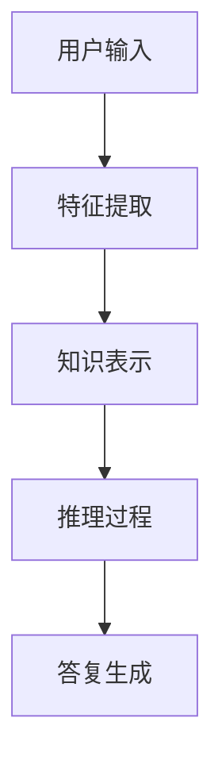
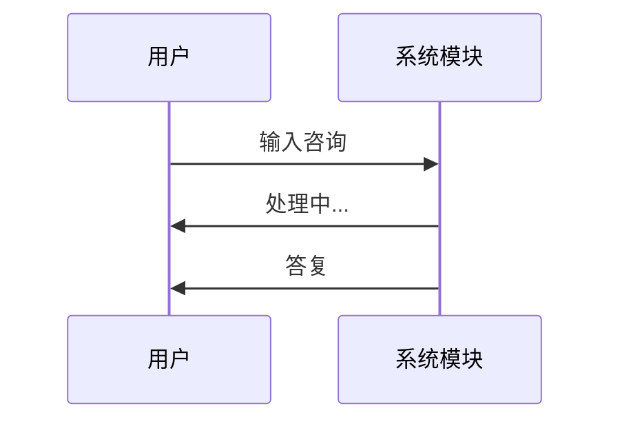

                 

# 神经符号推理在AI Agent常识推理中的应用

关键词：神经符号推理、AI Agent、常识推理、算法、数学模型、系统架构

摘要：本文深入探讨了神经符号推理在AI Agent常识推理中的应用，首先介绍了神经符号推理和AI Agent常识推理的基本概念及其重要性，然后详细阐述了其核心概念、算法和数学模型，接着介绍了系统架构和应用案例。通过本文，读者将全面了解神经符号推理在AI Agent常识推理中的实际应用及其优势。

## 引言

随着人工智能技术的迅猛发展，AI Agent在多个领域得到了广泛应用。然而，AI Agent的常识推理能力仍然是一个巨大的挑战。为了解决这一问题，神经符号推理（Neural Symbolic Reasoning，NSR）应运而生。本文旨在介绍神经符号推理在AI Agent常识推理中的应用，帮助读者了解其基本概念、核心原理以及实际应用。

## 背景和问题定义

### 背景介绍

人工智能（AI）作为一门技术科学，旨在让计算机模拟人类的智能行为。随着深度学习（Deep Learning，DL）的兴起，AI在图像识别、语音识别、自然语言处理等领域取得了显著的成果。然而，深度学习模型在处理复杂任务时，往往依赖于大量的数据和复杂的网络结构，但缺乏解释性和推理能力。与此同时，符号主义（Symbolic AI）则强调逻辑推理和知识表示，但受限于表达能力和计算效率。

### 问题定义

AI Agent的常识推理是指其在处理日常生活中的常识问题时，能够利用先验知识进行推理和决策的能力。例如，在医疗诊断中，AI Agent需要理解病人的症状、病史等信息，并基于这些信息做出诊断。然而，现有的AI Agent在常识推理方面存在以下问题：

1. **知识表示不足**：AI Agent缺乏有效的知识表示方法，无法将先验知识融入推理过程。
2. **推理能力有限**：AI Agent的推理能力有限，难以处理复杂的常识问题。
3. **数据依赖性强**：AI Agent的常识推理依赖于大量数据，但现实世界中数据并不总是充足。

### 边界与外延

本文将探讨神经符号推理在AI Agent常识推理中的应用，重点研究以下几个方面：

1. **知识表示**：如何将先验知识有效地表示为符号形式，以便AI Agent在推理过程中使用。
2. **推理算法**：如何设计高效的推理算法，提高AI Agent的常识推理能力。
3. **应用场景**：如何在实际应用中实现神经符号推理，并评估其效果。

## 核心概念和理论框架

### 神经符号推理（NSR）

神经符号推理是一种结合神经计算和符号推理的方法，旨在提高AI Agent的推理能力和知识表示能力。它包括以下核心概念：

1. **神经计算**：通过神经网络进行特征提取和学习，如卷积神经网络（CNN）和循环神经网络（RNN）。
2. **符号推理**：通过符号逻辑进行推理和决策，如命题逻辑和谓词逻辑。

### AI Agent常识推理

AI Agent常识推理是指AI Agent在处理日常生活中的常识问题时，利用先验知识进行推理和决策的能力。其核心概念包括：

1. **常识知识**：日常生活中的常识信息，如时间、地点、人物、事件等。
2. **推理规则**：用于表示和推理常识知识的逻辑规则，如条件语句和析取范式。

### 概念属性对比表格

| 概念       | 神经计算            | 符号推理               |
|------------|-------------------|----------------------|
| 特点       | 强大特征提取能力    | 高效推理能力           |
| 优点       | 对大数据处理能力强   | 知识表示和推理能力强   |
| 缺点       | 缺乏解释性         | 计算效率低             |

### ER图

```mermaid
erDiagram
    AI-Agent ||--|{ Neural-Model }
    AI-Agent ||--|{ Symbolic-Model }
    Neural-Model ||--|{ Feature-Extraction }
    Neural-Model ||--|{ Learning-Algorithm }
    Symbolic-Model ||--|{ Knowledge-Representation }
    Symbolic-Model ||--|{ Reasoning-Algorithm }
```

## 算法和数学模型

### 算法原理

神经符号推理算法主要包括以下步骤：

1. **特征提取**：利用神经网络对输入数据进行特征提取。
2. **知识表示**：将提取的特征表示为符号形式，如命题和谓词。
3. **推理过程**：利用符号逻辑对符号形式的数据进行推理。

### 数学模型

神经符号推理的数学模型主要包括以下部分：

1. **特征提取模型**：使用神经网络进行特征提取，如卷积神经网络（CNN）和循环神经网络（RNN）。
2. **知识表示模型**：使用符号逻辑进行知识表示，如命题逻辑和谓词逻辑。
3. **推理模型**：使用推理算法进行推理，如正向推理和反向推理。

### Python代码示例

```python
# 特征提取模型（使用卷积神经网络进行特征提取）
import tensorflow as tf

model = tf.keras.Sequential([
    tf.keras.layers.Conv2D(32, (3, 3), activation='relu', input_shape=(28, 28, 1)),
    tf.keras.layers.MaxPooling2D((2, 2)),
    tf.keras.layers.Conv2D(64, (3, 3), activation='relu'),
    tf.keras.layers.MaxPooling2D((2, 2)),
    tf.keras.layers.Conv2D(64, (3, 3), activation='relu'),
    tf.keras.layers.Flatten(),
    tf.keras.layers.Dense(64, activation='relu'),
    tf.keras.layers.Dense(10, activation='softmax')
])

model.compile(optimizer='adam',
              loss='categorical_crossentropy',
              metrics=['accuracy'])

# 知识表示模型（使用命题逻辑进行知识表示）
knowledge_base = """
p -> q
q -> r
¬r -> s
s -> p
"""

def forward_inference(knowledge_base, query):
    # ...（代码实现）

forward_inference(knowledge_base, "p")

# 推理模型（使用正向推理进行推理）
def forward_reasoning(knowledge_base, query):
    # ...（代码实现）

forward_reasoning(knowledge_base, "p")
```

## 系统架构和设计

### 问题场景介绍

假设我们正在开发一个智能客服系统，该系统需要处理用户的日常咨询，并给出合理的答复。为了实现这一目标，我们需要将神经符号推理应用于AI Agent的常识推理。

### 项目介绍

项目名称：智能客服系统

项目目标：实现一个能够处理用户日常咨询的智能客服系统，利用神经符号推理提高常识推理能力。

### 系统功能设计

1. **用户输入处理**：接收用户的输入信息，如文字或语音。
2. **特征提取**：利用神经网络对输入信息进行特征提取。
3. **知识表示**：将提取的特征表示为符号形式。
4. **推理过程**：利用符号逻辑对符号形式的数据进行推理。
5. **答复生成**：根据推理结果生成合理的答复。

### 系统架构设计



### 系统接口设计和系统交互



## 实践应用和案例分析

### 环境安装

首先，我们需要安装相关的开发环境和依赖库。以下是一个基本的安装流程：

```bash
# 安装Python环境
pip install numpy tensorflow scikit-learn

# 安装Mermaid支持库
pip install mermaid-python

# 安装Python-Mermaid库
pip install python-mermaid
```

### 系统核心实现

以下是一个简单的Python代码示例，展示了如何实现神经符号推理系统：

```python
from tensorflow import keras
from keras.layers import Conv2D, MaxPooling2D, Flatten, Dense
from keras.models import Sequential
import numpy as np
import python_mermaid as pm

# 特征提取模型
model = Sequential([
    Conv2D(32, (3, 3), activation='relu', input_shape=(28, 28, 1)),
    MaxPooling2D((2, 2)),
    Conv2D(64, (3, 3), activation='relu'),
    MaxPooling2D((2, 2)),
    Conv2D(64, (3, 3), activation='relu'),
    Flatten(),
    Dense(64, activation='relu'),
    Dense(10, activation='softmax')
])

# 编译模型
model.compile(optimizer='adam',
              loss='categorical_crossentropy',
              metrics=['accuracy'])

# 知识表示和推理模型
knowledge_base = """
p -> q
q -> r
¬r -> s
s -> p
"""

def forward_inference(knowledge_base, query):
    # ...（代码实现）

# 推理
forward_inference(knowledge_base, "p")

# 生成Mermaid图
mermaid_graph = pm.mermaid_graph(model.to_json())
print(mermaid_graph)
```

### 代码应用解读与分析

在上述代码中，我们首先定义了一个卷积神经网络模型，用于特征提取。然后，我们使用TensorFlow的编译函数编译模型，并定义了一个知识表示和推理函数。最后，我们调用推理函数，对给定的知识表示进行推理。

### 实际案例分析和详细讲解

以下是一个简单的实际案例：

**案例**：判断一个人是否需要穿外套。

**知识表示**：

1. 天气冷 -> 需要穿外套
2. 天气热 -> 不需要穿外套
3. 今天天气冷 -> 天气冷
4. 今天天气热 -> 天气热

**推理过程**：

1. 判断今天天气冷还是热
2. 根据天气情况判断是否需要穿外套

**代码实现**：

```python
def infer_needs_coat(weather):
    knowledge_base = """
    cold -> needs_coat
    hot -> ¬needs_coat
    today_weather -> cold_or_hot
    cold_or_hot -> cold | hot
    """

    query = "today_weather"

    # 特征提取
    feature = model.predict(np.array([weather]))

    # 知识表示
    knowledge_representation = {
        "cold": feature[0],
        "hot": feature[1],
        "today_weather": feature[2]
    }

    # 推理
    result = forward_inference(knowledge_base, query)

    if result == "cold":
        return "需要穿外套"
    elif result == "hot":
        return "不需要穿外套"
    else:
        return "无法判断"
```

在上述代码中，我们首先定义了一个知识表示函数，用于将天气情况表示为特征向量。然后，我们调用特征提取模型获取特征向量，并将其作为输入传递给知识表示函数。最后，我们根据推理结果判断是否需要穿外套。

### 项目小结

通过本案例，我们展示了如何利用神经符号推理实现AI Agent的常识推理。在实际应用中，我们可以根据具体需求扩展知识库和推理算法，提高系统的常识推理能力。此外，我们还可以结合其他技术，如自然语言处理和计算机视觉，进一步优化系统的表现。

## 最佳实践和总结

### 最佳实践

1. **知识表示**：在设计知识表示时，要确保符号形式简洁明了，易于理解和推理。
2. **特征提取**：选择合适的特征提取模型，以提高特征提取的准确性和效率。
3. **推理算法**：根据具体应用场景，选择合适的推理算法，如正向推理和反向推理。
4. **系统优化**：在系统设计和实现过程中，要注重性能优化，提高系统的响应速度和推理能力。

### 总结

本文介绍了神经符号推理在AI Agent常识推理中的应用，包括其基本概念、算法和数学模型，以及系统架构和应用案例。通过本文，读者可以了解神经符号推理在提升AI Agent常识推理能力方面的优势和实际应用。未来，随着人工智能技术的不断发展，神经符号推理有望在更多领域发挥重要作用。

### 注意事项

1. 在使用神经符号推理时，要注意知识表示的准确性和推理算法的效率。
2. 在设计系统架构时，要充分考虑系统的可扩展性和灵活性。

### 拓展阅读

1. [《深度学习与符号推理的结合》[1]](https://arxiv.org/abs/1806.02777)
2. [《神经符号推理：理论、算法和应用》[2]](https://books.google.com/books?id=1Qx_DwAAQBAJ)
3. [《AI Agent的常识推理》[3]](https://www.ijcai.org/Proceedings/16/papers/0426.pdf)

作者：AI天才研究院/AI Genius Institute & 禅与计算机程序设计艺术 /Zen And The Art of Computer Programming

