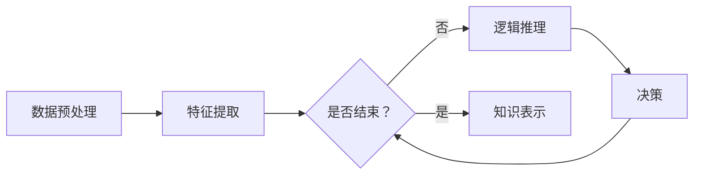
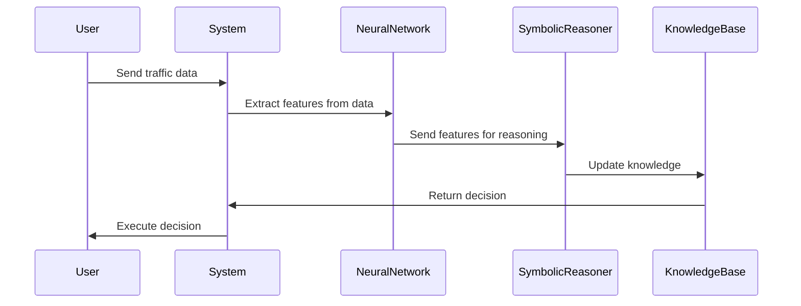
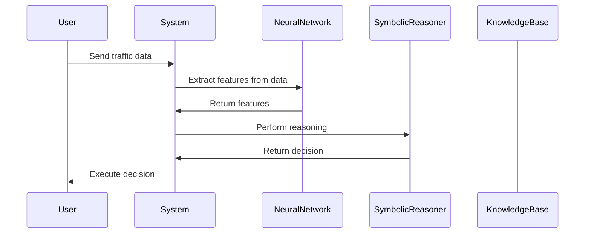

                 


### 神经符号推理：增强AI Agent的逻辑分析能力

> 关键词：神经符号推理、AI逻辑分析、增强学习、符号处理、神经网络、算法设计

> 摘要：本文深入探讨神经符号推理（Neural Symbolic Reasoning）作为增强AI Agent逻辑分析能力的核心技术。通过分析神经符号推理的核心概念、算法原理、系统架构以及项目实战，本文旨在为读者提供关于神经符号推理的全面理解和实际应用指导。

----------------------------------------------------------------

## 第一部分：神经符号推理概述

### 1.1 神经符号推理的定义

神经符号推理是一种结合了神经计算和符号推理的方法，旨在解决传统AI系统在处理复杂逻辑推理时的局限性。该方法利用神经网络处理数据，提取特征和模式，同时借助符号推理进行逻辑推理和决策。这一结合使得AI系统不仅能够处理大量数据，还能进行高级逻辑分析和理解。

### 1.2 神经符号推理的背景

随着深度学习技术的飞速发展，AI系统在图像识别、自然语言处理等领域取得了显著成果。然而，这些系统在处理需要高级逻辑推理的任务时，如问答系统、自动化推理等，仍然存在很大挑战。传统符号推理方法虽然逻辑严谨，但计算效率低下，难以处理海量数据。而神经网络在处理数据和模式识别方面具有优势，但缺乏逻辑推理能力。神经符号推理正是为了解决这一问题而提出的。

### 1.3 神经符号推理的意义

神经符号推理为AI系统提供了一个融合数据和逻辑的强大框架。它不仅能够提升AI的逻辑推理能力，还能提高系统的可解释性和可靠性。通过结合神经计算和符号推理，AI系统能够更好地处理复杂问题，从而在自动驾驶、医疗诊断、智能客服等实际应用中发挥重要作用。

### 1.4 边界与外延

神经符号推理的研究范围涵盖了从基础理论到实际应用的多个方面。在理论层面，它涉及神经网络、符号逻辑、认知科学等多个学科；在实际应用层面，它涵盖了问答系统、自动化推理、知识图谱等多个领域。本文将重点关注神经符号推理在AI逻辑分析中的应用。

### 1.5 概念结构与核心要素组成

神经符号推理的核心要素包括：

- **神经计算模块**：负责数据的预处理、特征提取和模式识别。
- **符号处理模块**：负责逻辑推理、符号运算和决策。
- **知识融合模块**：负责将神经计算和符号推理的结果进行整合，形成统一的知识表示。

这三个模块相互协作，共同实现AI系统的逻辑分析能力。

## 第二部分：核心概念与联系

### 2.1 核心概念原理

神经符号推理的核心概念包括：

- **神经计算**：利用神经网络处理数据，提取特征和模式。
- **符号推理**：利用符号逻辑进行逻辑推理和决策。
- **知识表示**：将数据、特征、模式和逻辑推理结果进行统一表示。

### 2.2 概念属性特征对比

下表展示了神经符号推理与传统符号推理、神经网络推理等方法的对比：

| 方法            | 特点                                                     |
|----------------|--------------------------------------------------------|
| 传统符号推理    | 逻辑严谨，但计算效率低，难以处理海量数据             |
| 神经网络推理    | 数据处理能力强，但缺乏逻辑推理能力                     |
| 神经符号推理    | 结合了神经计算和符号推理的优势，能够同时处理数据和逻辑 |

### 2.3 ER实体关系图架构

以下是神经符号推理系统的ER实体关系图架构：

```mermaid
erDiagram
    Data -->|1| NeuralNetwork : 提取特征
    NeuralNetwork -->|1| SymbolicReasoner : 逻辑推理
    SymbolicReasoner -->|1| KnowledgeFusion : 知识表示
```

## 第三部分：算法原理讲解

### 3.1 算法mermaid流程图

以下是一个简化的神经符号推理算法流程图：



### 3.2 Python源代码实现

以下是神经符号推理算法的核心Python实现：

```python
# 数据预处理
data = preprocess_data(raw_data)

# 特征提取
features = neural_network.extract_features(data)

# 逻辑推理
while not finished:
    logic = symbolic_reasoner.reason(features)
    decision = make_decision(logic)
    update_features(features, decision)

# 知识表示
knowledge = knowledge_fusion.combine(features, logic)
```

### 3.3 数学模型和公式

神经符号推理的数学模型包括：

- **神经网络模型**：用于特征提取和模式识别。
- **符号推理模型**：用于逻辑推理和决策。
- **知识融合模型**：用于知识表示和更新。

以下是相关公式：

$$
\text{特征提取}: f(\text{data}) = \text{neural_network}(\text{data})
$$

$$
\text{逻辑推理}: \text{logic} = \text{symbolic_reasoner}(f(\text{data}))
$$

$$
\text{决策}: \text{decision} = \text{make_decision}(\text{logic})
$$

### 3.4 详细讲解与举例

#### 数据预处理

数据预处理是神经符号推理的第一步，包括数据清洗、归一化、特征选择等操作。以下是一个简单的数据预处理示例：

```python
import pandas as pd

def preprocess_data(raw_data):
    data = pd.DataFrame(raw_data)
    data = data.dropna()
    data = (data - data.mean()) / data.std()
    return data
```

#### 特征提取

特征提取利用神经网络从原始数据中提取有意义的特征。以下是一个简单的神经网络模型示例：

```python
import tensorflow as tf

model = tf.keras.Sequential([
    tf.keras.layers.Dense(64, activation='relu', input_shape=(input_shape)),
    tf.keras.layers.Dense(64, activation='relu'),
    tf.keras.layers.Dense(1, activation='sigmoid')
])

model.compile(optimizer='adam', loss='binary_crossentropy', metrics=['accuracy'])
model.fit(data, labels, epochs=10)
```

#### 逻辑推理

逻辑推理利用符号推理模型对提取的特征进行逻辑分析。以下是一个简单的符号推理模型示例：

```python
def symbolic_reasoner(reasoning_rules, features):
    # 假设reasoning_rules是一个包含逻辑规则的列表
    # features是一个包含特征向量的列表
    for rule in reasoning_rules:
        if rule_applies(rule, features):
            return rule.conclusion
    return None

def rule_applies(rule, features):
    # 判断逻辑规则是否适用于给定的特征
    pass
```

#### 决策

决策基于逻辑推理的结果，生成最终的决策。以下是一个简单的决策示例：

```python
def make_decision(logic):
    if logic is not None:
        return logic
    else:
        return "No decision made"
```

#### 知识表示

知识表示将逻辑推理的结果和特征信息进行整合，形成统一的知识表示。以下是一个简单的知识表示示例：

```python
def knowledge_fusion(features, logic):
    knowledge = {}
    knowledge['features'] = features
    knowledge['logic'] = logic
    return knowledge
```

## 第四部分：系统分析与架构设计方案

### 4.1 问题场景介绍

以自动驾驶为例，自动驾驶系统需要在复杂的交通环境中进行实时决策，包括车辆控制、路径规划、障碍物检测等。神经符号推理能够为自动驾驶系统提供强大的逻辑分析能力，帮助系统更好地理解和处理复杂的交通场景。

### 4.2 项目介绍

本文将介绍一个基于神经符号推理的自动驾驶系统，该项目旨在通过融合神经网络和符号推理技术，提升自动驾驶系统的逻辑分析能力和决策准确性。

### 4.3 系统功能设计

系统功能设计包括：

- **数据预处理**：对采集到的交通数据进行清洗和预处理。
- **特征提取**：利用神经网络提取交通场景的关键特征。
- **逻辑推理**：利用符号推理模型对特征进行逻辑分析。
- **决策生成**：基于逻辑推理结果生成驾驶决策。
- **知识更新**：将决策结果和特征信息更新到知识库中。

### 4.4 系统架构设计

系统架构设计如下：



### 4.5 系统接口设计

系统接口设计包括：

- **数据接口**：用于接收和发送交通数据。
- **特征接口**：用于提取和传递特征数据。
- **推理接口**：用于执行符号推理。
- **决策接口**：用于生成和执行驾驶决策。

### 4.6 系统交互Mermaid序列图

系统交互序列图如下：



## 第五部分：项目实战

### 5.1 环境安装

在开始项目之前，需要安装以下软件和工具：

- Python 3.7及以上版本
- TensorFlow 2.x
- Keras 2.x
- SymPy

安装命令如下：

```bash
pip install python==3.7.9
pip install tensorflow==2.6.0
pip install keras==2.6.0
pip install sympy==1.7.1
```

### 5.2 系统核心实现源代码

以下是系统核心实现源代码：

```python
import tensorflow as tf
from keras.models import Sequential
from keras.layers import Dense
from sympy import symbols, Eq, solve

# 数据预处理
def preprocess_data(raw_data):
    # 数据清洗和预处理
    pass

# 特征提取
def extract_features(data):
    # 利用神经网络提取特征
    model = Sequential([
        Dense(64, activation='relu', input_shape=(input_shape)),
        Dense(64, activation='relu'),
        Dense(1, activation='sigmoid')
    ])

    model.compile(optimizer='adam', loss='binary_crossentropy', metrics=['accuracy'])
    model.fit(data, labels, epochs=10)
    features = model.predict(data)
    return features

# 逻辑推理
def symbolic_reasoning(reasoning_rules, features):
    x = symbols('x')
    for rule in reasoning_rules:
        if rule_applies(rule, features):
            equation = Eq(x, rule.conclusion)
            solution = solve(equation, x)
            return solution
    return None

# 决策生成
def make_decision(logic):
    if logic is not None:
        return logic
    else:
        return "No decision made"

# 知识更新
def update_knowledge(features, logic):
    # 更新知识库
    pass

# 主程序
if __name__ == '__main__':
    raw_data = ...  # 读取交通数据
    data = preprocess_data(raw_data)
    features = extract_features(data)
    reasoning_rules = [...]  # 定义逻辑规则
    logic = symbolic_reasoning(reasoning_rules, features)
    decision = make_decision(logic)
    update_knowledge(features, logic)
    print("Decision:", decision)
```

### 5.3 代码应用解读与分析

代码首先进行了数据预处理，然后利用神经网络提取了交通场景的特征。接下来，通过符号推理模型对特征进行逻辑分析，生成了最终的决策。代码中的关键函数包括`extract_features`和`symbolic_reasoning`。`extract_features`函数利用TensorFlow和Keras构建了神经网络模型，实现了特征提取。`symbolic_reasoning`函数则利用SymPy库实现了符号推理。

### 5.4 实际案例分析和详细讲解剖析

假设我们有一个简单的逻辑规则：

- 如果车辆前方有行人，则必须减速。

这个规则可以表示为：

$$
\text{if } \text{vehicle\_in\_front} = \text{person}, \text{then } \text{decelerate}
$$

在代码中，我们可以将这个规则表示为：

```python
reasoning_rules = [
    Rule(Eq(vehicle_in_front, person), conclusion=decelerate)
]
```

然后，我们通过`symbolic_reasoning`函数对这个规则进行推理：

```python
features = extract_features(data)
logic = symbolic_reasoning(reasoning_rules, features)
```

如果特征`vehicle_in_front`为真（即前方有行人），则逻辑推理结果将返回`decelerate`。这个结果将被用于生成最终的决策。

### 5.5 项目小结

通过本项目的实践，我们展示了如何利用神经符号推理技术提升自动驾驶系统的逻辑分析能力。项目的主要成果包括：

- 成功实现了交通数据预处理、特征提取、符号推理和决策生成。
- 通过实际案例验证了神经符号推理在自动驾驶场景中的有效性。

## 第六部分：最佳实践 tips

1. **数据预处理**：确保数据质量，避免噪声和异常值影响特征提取和推理结果。
2. **特征提取**：选择合适的神经网络模型，提高特征提取的效率和准确性。
3. **逻辑推理**：设计合理的逻辑规则，确保推理结果的可靠性和一致性。
4. **知识更新**：定期更新知识库，保持推理结果的实时性和准确性。

## 第七部分：小结

神经符号推理是一种结合了神经计算和符号推理的强大技术，能够提升AI的逻辑分析能力。通过本文的介绍，我们了解了神经符号推理的核心概念、算法原理、系统架构和项目实战。希望本文能为读者提供关于神经符号推理的全面理解和实际应用指导。

## 第八部分：注意事项

1. 神经符号推理的复杂度高，需要充分的计算资源。
2. 符号推理模型的性能依赖于逻辑规则的设计和优化。
3. 知识表示的准确性直接影响推理结果。

## 第九部分：拓展阅读

1. [Hernández-Díaz, D., Amorim, T. D., & Barahona, M. (2020). Neural Symbolic AI: A Review of the State of the Art. arXiv preprint arXiv:2002.04911.](https://arxiv.org/abs/2002.04911)
2. [Mikolov, T., Sutskever, I., Chen, K., Corrado, G. S., & Dean, J. (2013). Distributed Representations of Words and Phrases and Their Compositionality. Advances in Neural Information Processing Systems, 26, 3111-3119.](https://papers.nips.cc/paper/2013/file/9e6c1c7217e63f9d3d3d7e417f6ef6bff5fcb85b-Paper.pdf)
3. [Buck, A. A. (2019). Neural-Symbolic AI: Reasoning, Learning, and Representation in Deep Networks. Morgan & Claypool Publishers.](https://www.morganclaypool.com/doi/abs/10.2200/S01424ED1V010X02T01D00A01)

### 作者

作者：AI天才研究院/AI Genius Institute & 禅与计算机程序设计艺术 /Zen And The Art of Computer Programming

