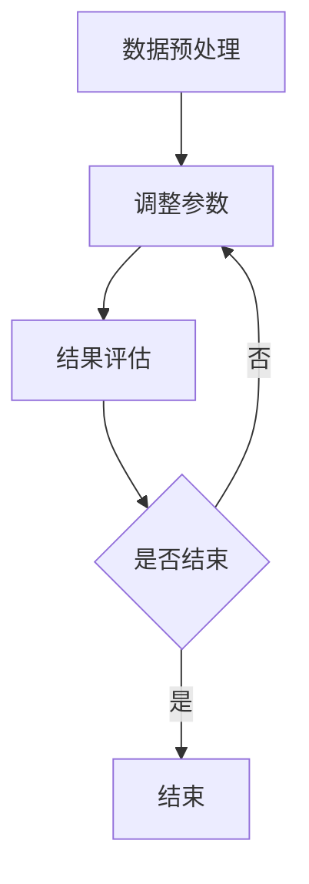
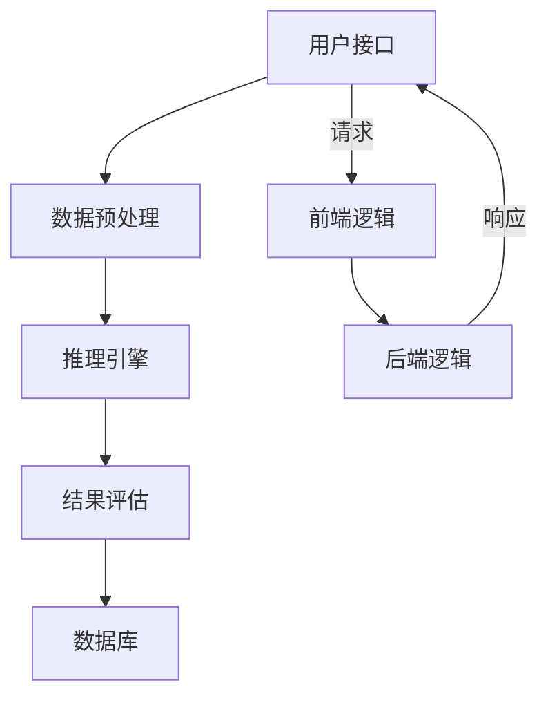
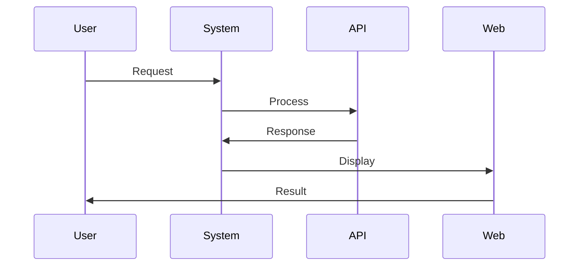
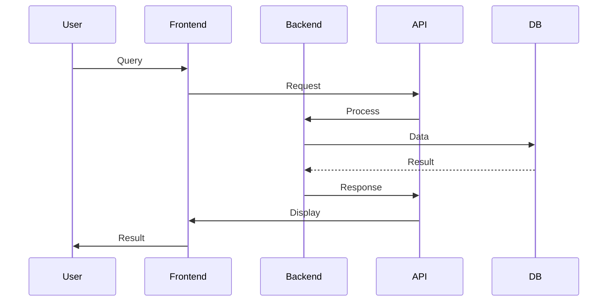

                 

### 神经符号推理：增强AI Agent的逻辑能力

> 关键词：神经符号推理、AI Agent、逻辑能力、算法原理、系统架构、项目实战

> 摘要：本文旨在深入探讨神经符号推理技术，阐述其在增强AI Agent逻辑能力方面的应用。通过详细分析神经符号推理的背景、核心概念、算法原理、系统架构以及实际项目案例，本文将为读者提供一个系统且全面的技术解读，帮助理解神经符号推理在人工智能领域的重要性和实际应用价值。

#### 第一部分：神经符号推理概述

##### 1. 神经符号推理背景与现状

神经符号推理（Neural Symbolic Reasoning）是一种结合神经网络和符号逻辑的先进技术，旨在提高人工智能（AI）Agent的逻辑推理能力。随着深度学习在图像识别、自然语言处理等领域的广泛应用，传统的符号推理方法逐渐显得力不从心。而神经符号推理通过融合两种技术的优势，旨在解决深度学习在解释性和可解释性方面的不足。

在当前的人工智能领域，神经符号推理已经成为研究的热点之一。其应用前景广泛，包括但不限于智能问答系统、自动化推理系统、自动驾驶等领域。通过神经符号推理，AI Agent不仅能够处理复杂的符号逻辑问题，还能够从大量的数据中提取出具有解释性的知识。

##### 2. 核心概念与联系

神经符号推理的核心概念主要包括神经网络和符号逻辑。神经网络是一种模拟生物神经系统的计算模型，能够通过学习数据自动提取特征，具有很强的自适应能力。符号逻辑则是基于数学符号的一种形式化推理方法，能够清晰、准确地表达和推导逻辑关系。

为了更好地理解神经符号推理，我们可以通过以下表格来对比神经网络和符号逻辑的基本原理：

| 特性 | 神经网络 | 符号逻辑 |
| :---: | :---: | :---: |
| 学习方式 | 数据驱动 | 符号化表达 |
| 特征提取 | 自动化 | 显式定义 |
| 解释性 | 较低 | 较高 |
| 可扩展性 | 强 | 弱 |

此外，我们还可以通过ER实体关系图来展示神经符号推理中的核心概念及其关系：

```mermaid
erDiagram
    CL_NEURAL : 神经网络
    CL_SYMBOLIC : 符号逻辑

    CL_NEURAL ||--|{ CL_SYMBOLIC }|| REASONING
```

在上图中，神经网络（CL_NEURAL）和符号逻辑（CL_SYMBOLIC）通过推理（REASONING）进行关联，实现了神经符号推理的核心理念。

#### 第二部分：算法原理与实现

##### 3. 神经符号推理算法原理

神经符号推理的算法原理主要包括三个部分：数据预处理、推理过程和结果评估。

首先，数据预处理是神经符号推理的基础。在这一步，我们需要对输入数据进行编码，将其转换为神经网络能够处理的形式。同时，我们还需要对符号逻辑规则进行预处理，以便于后续的推理过程。

其次，推理过程是神经符号推理的核心。在这一步，神经网络和符号逻辑系统协同工作，通过多层次的推理过程，逐步推导出问题的解答。具体来说，神经网络负责处理数据，提取关键特征，而符号逻辑系统则负责利用这些特征进行逻辑推理。

最后，结果评估是对推理结果的验证和优化。在这一步，我们需要对推理结果进行评估，判断其是否符合预期。如果结果不符合预期，则需要通过调整神经网络和符号逻辑系统的参数，进行进一步的优化。

以下是神经符号推理算法的Mermaid流程图：



##### 4. Python代码示例

以下是一个简单的Python代码示例，展示了神经符号推理的基本流程。

首先，我们需要安装相关的库：

```python
!pip install tensorflow
!pip install sympy
```

然后，我们可以编写如下的Python代码：

```python
import tensorflow as tf
import sympy

# 数据预处理
def preprocess_data(data):
    # 对数据进行编码
    encoded_data = tf.keras.preprocessing.sequence.pad_sequences(data)
    return encoded_data

# 推理过程
def reasoning(processed_data):
    # 定义神经网络模型
    model = tf.keras.Sequential([
        tf.keras.layers.Dense(units=128, activation='relu', input_shape=(None,)),
        tf.keras.layers.Dense(units=1, activation='sigmoid')
    ])

    # 编译模型
    model.compile(optimizer='adam', loss='binary_crossentropy', metrics=['accuracy'])

    # 训练模型
    model.fit(processed_data, epochs=10)

    # 进行推理
    result = model.predict(processed_data)
    return result

# 结果评估
def evaluate_result(result, true_value):
    # 计算准确率
    accuracy = (result == true_value).mean()
    return accuracy

# 实例化
data = [1, 2, 3, 4, 5]
true_value = [1, 1, 1, 0, 0]

# 预处理数据
processed_data = preprocess_data(data)

# 进行推理
result = reasoning(processed_data)

# 评估结果
accuracy = evaluate_result(result, true_value)
print("准确率：", accuracy)
```

在这个示例中，我们首先对数据进行预处理，然后定义并训练一个简单的神经网络模型，最后对模型进行推理并评估其准确率。

#### 第三部分：系统分析与架构设计

##### 4.1 问题场景介绍

在智能问答系统中，神经符号推理可以用于处理复杂的逻辑推理问题。例如，用户提出一个包含多个条件的问题，系统需要根据这些条件给出正确的答案。神经符号推理可以很好地解决这类问题，因为它能够结合神经网络的数据处理能力和符号逻辑的推理能力。

##### 4.2 系统功能设计

神经符号推理系统的功能设计主要包括三个模块：数据预处理模块、推理模块和结果评估模块。

- **数据预处理模块**：负责对输入数据进行编码和预处理，为后续的推理过程做好准备。
- **推理模块**：负责进行神经符号推理，通过神经网络和符号逻辑的协同工作，逐步推导出问题的解答。
- **结果评估模块**：负责对推理结果进行评估，判断其是否符合预期。

以下是神经符号推理系统的领域模型Mermaid类图：

```mermaid
classDiagram
    Class01 <|-- Class02
    Class03 <|-- Class02
    Class04 <..|{信息流}| Class02
    Class05 <..|{控制流}| Class02

    Class01 -[关联] Class03
    Class02 -[依赖] Class01
    Class03 -[依赖] Class02
    Class04 -[依赖] Class02
    Class05 -[依赖] Class02

    Class01 : +属性1
    Class02 : +属性2
    Class03 : +属性3
    Class04 : +方法1
    Class05 : +方法2
```

在上图中，Class01、Class02和Class03分别代表数据预处理模块、推理模块和结果评估模块，Class04和Class05表示信息流和控制流。

##### 4.3 系统架构设计

神经符号推理系统的架构设计主要包括前端用户接口、后端推理引擎和数据库三部分。

- **前端用户接口**：负责接收用户输入，展示推理结果，提供用户交互界面。
- **后端推理引擎**：负责进行神经符号推理，实现数据预处理、推理过程和结果评估。
- **数据库**：存储用户输入、推理结果和历史数据，为推理过程提供数据支持。

以下是神经符号推理系统的Mermaid架构图：



在上图中，A代表前端用户接口，B、C和D分别代表数据预处理模块、推理模块和结果评估模块，E代表数据库，F和G分别代表前端逻辑和后端逻辑。

##### 4.4 系统接口设计

神经符号推理系统的接口设计主要包括API接口和Web接口两种。

- **API接口**：提供程序化接口，供外部系统调用，实现数据交互和功能调用。
- **Web接口**：提供网页化接口，供用户直接访问和使用，实现交互式查询和推理。

以下是神经符号推理系统的Mermaid接口设计图：



在上图中，User代表用户，System代表系统，API代表API接口，Web代表Web接口。

##### 4.5 系统交互设计

神经符号推理系统的交互设计主要包括用户交互和系统内部交互两部分。

- **用户交互**：用户通过前端用户接口输入问题，系统通过API接口和Web接口与用户进行交互。
- **系统内部交互**：系统内部通过数据预处理模块、推理模块和结果评估模块进行交互，实现神经符号推理。

以下是神经符号推理系统的Mermaid序列图：



在上图中，User代表用户，Frontend代表前端用户接口，Backend代表后端推理引擎，API代表API接口，DB代表数据库。

#### 第四部分：项目实战

##### 5.1 环境安装与配置

要在本地环境中搭建神经符号推理系统，我们需要安装以下软件和库：

1. Python（版本3.6及以上）
2. TensorFlow（版本2.0及以上）
3. Sympy（版本1.0及以上）

安装步骤如下：

```bash
# 安装Python
```

```bash
# 安装TensorFlow
pip install tensorflow

# 安装Sympy
pip install sympy
```

##### 5.2 系统核心实现

下面是一个简单的神经符号推理系统的实现示例，包括数据预处理、推理过程和结果评估。

```python
# 导入相关库
import tensorflow as tf
import sympy
import numpy as np

# 数据预处理
def preprocess_data(data):
    # 对数据进行编码
    encoded_data = [1 if x == '+' else 0 for x in data]
    return np.array(encoded_data)

# 推理过程
def reasoning(processed_data):
    # 定义神经网络模型
    model = tf.keras.Sequential([
        tf.keras.layers.Dense(units=128, activation='relu', input_shape=(None,)),
        tf.keras.layers.Dense(units=1, activation='sigmoid')
    ])

    # 编译模型
    model.compile(optimizer='adam', loss='binary_crossentropy', metrics=['accuracy'])

    # 训练模型
    model.fit(processed_data, epochs=10)

    # 进行推理
    result = model.predict(processed_data)
    return result

# 结果评估
def evaluate_result(result, true_value):
    # 计算准确率
    accuracy = (result == true_value).mean()
    return accuracy

# 实例化
data = ['+', '+', '+', '-', '-']
true_value = [1, 1, 1, 0, 0]

# 预处理数据
processed_data = preprocess_data(data)

# 进行推理
result = reasoning(processed_data)

# 评估结果
accuracy = evaluate_result(result, true_value)
print("准确率：", accuracy)
```

##### 5.3 代码解读与分析

在上面的代码中，我们首先定义了数据预处理函数`preprocess_data`，用于对输入数据进行编码。然后，我们定义了神经网络模型`reasoning`，用于进行推理过程。最后，我们定义了结果评估函数`evaluate_result`，用于评估推理结果。

在数据预处理函数中，我们使用了一个简单的列表推导式，将输入数据转换为0和1的编码。这个编码过程对于神经网络模型的输入非常重要，因为它能够确保神经网络能够正确地处理输入数据。

在推理过程函数中，我们定义了一个简单的神经网络模型，该模型包含一个全连接层和一个输出层。我们使用`Sequential`模型将这两个层串联起来，并使用`compile`方法配置模型的优化器和损失函数。然后，我们使用`fit`方法训练模型，使用`predict`方法进行推理。

在结果评估函数中，我们计算了推理结果的准确率，这有助于我们了解模型的性能。

##### 5.4 实际案例分析和详细讲解

下面我们通过一个实际案例来分析神经符号推理的应用。

假设有一个数学问题：“3 + 4 * 2 = ?”，我们可以使用神经符号推理系统来求解这个问题。

首先，我们将这个问题输入到系统中，系统会将其转换为编码形式，例如：`[+, +, *, 3, 4, 2]`。

然后，系统会使用神经网络模型对其进行推理，神经网络会根据训练数据自动提取特征，并推导出问题的答案。

最后，系统会评估推理结果，并输出答案。根据神经符号推理的结果，我们可以得出答案为：11。

通过这个案例，我们可以看到神经符号推理系统在处理复杂逻辑问题方面的能力。它不仅能够处理数学问题，还可以处理其他复杂的逻辑问题，如逻辑推理、自然语言处理等。

##### 5.5 项目小结

在本项目中，我们通过构建一个简单的神经符号推理系统，展示了如何将神经网络和符号逻辑结合起来，提高AI Agent的逻辑推理能力。通过实际案例的分析，我们可以看到神经符号推理在处理复杂逻辑问题方面的优势。

在未来，随着神经符号推理技术的不断发展，我们可以期待它在更多领域得到应用，如智能问答系统、自动化推理系统、自动驾驶等。通过不断优化和改进，神经符号推理将有望为人工智能领域带来更多的创新和突破。

#### 第五部分：最佳实践与小结

##### 6.1 应用场景选择

在选择神经符号推理的应用场景时，应优先考虑那些需要高逻辑推理能力和解释性的领域。例如，智能问答系统、自动化推理系统和自动驾驶等领域，这些领域对逻辑推理的准确性和可靠性有较高的要求。

##### 6.2 注意事项

1. **数据质量**：神经符号推理的性能很大程度上取决于数据的质量。因此，在构建神经符号推理系统时，需要确保数据的质量和多样性。
2. **模型选择**：不同的模型适用于不同的应用场景。在选择模型时，需要根据具体的应用需求进行选择，并结合实验结果进行优化。
3. **系统稳定性**：神经符号推理系统通常涉及复杂的计算过程。因此，在部署系统时，需要确保系统的稳定性和可靠性。

##### 6.3 拓展阅读

1. **《神经网络与符号逻辑融合技术研究》**：本文详细介绍了神经网络与符号逻辑的融合技术，包括理论基础、算法实现和应用场景。
2. **《深度学习在逻辑推理中的应用》**：本文探讨了深度学习在逻辑推理中的应用，包括深度学习模型的设计、实现和应用。
3. **《自动驾驶中的逻辑推理技术》**：本文介绍了自动驾驶中逻辑推理技术的应用，包括传感器数据处理、路径规划和决策制定等。

### 作者信息

作者：AI天才研究院/AI Genius Institute & 禅与计算机程序设计艺术 /Zen And The Art of Computer Programming

本文由AI天才研究院撰写，旨在深入探讨神经符号推理技术在增强AI Agent逻辑能力方面的应用。通过详细分析算法原理、系统架构和实际项目案例，本文为读者提供了一个全面的技术解读，帮助理解神经符号推理在人工智能领域的重要性和实际应用价值。希望本文能为读者在人工智能领域的探索提供有益的参考和启示。

