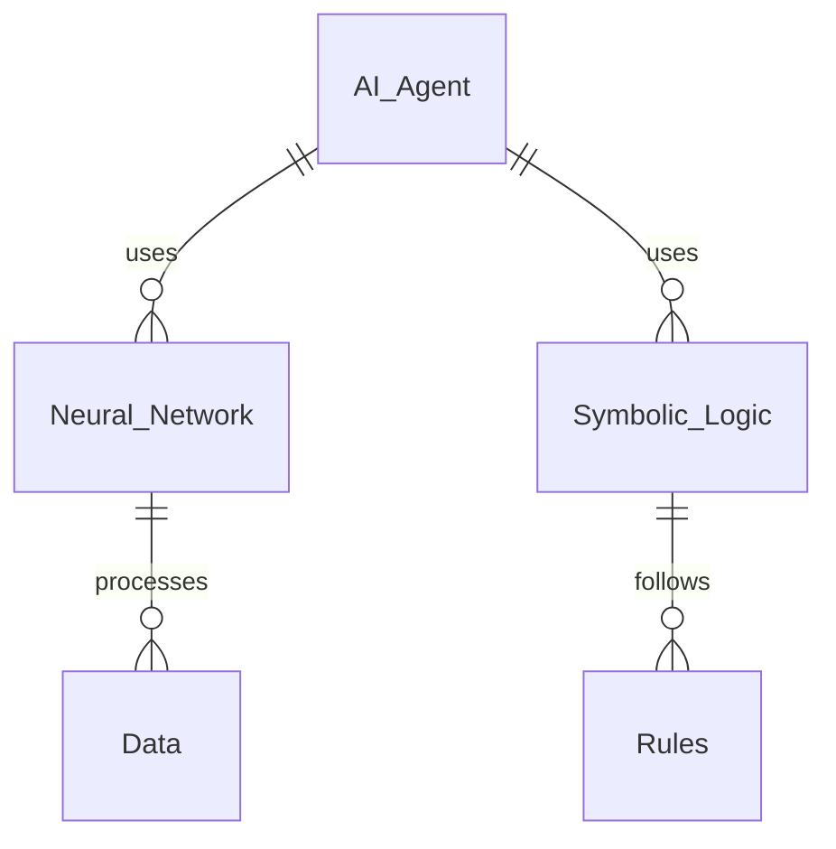

                 

# 神经符号融合：结合规则与学习的AI Agent

> 关键词：神经符号融合、AI Agent、规则学习、机器学习、智能控制、智能诊断

> 摘要：本文深入探讨了神经符号融合这一新兴技术，探讨了其背景、基本原理、方法及其在智能控制系统、智能诊断系统和智能交通系统中的应用。通过结合规则与学习，神经符号融合为人工智能领域带来了新的可能性，为实现更智能、更高效的AI Agent提供了新的途径。

## 目录大纲

1. 神经符号融合概述
2. 神经符号融合方法
3. 神经符号融合应用
4. 总结与展望

## 第一部分：神经符号融合概述

### 第1章：神经符号融合基础

#### 1.1 背景与意义

**问题背景**：

人工智能（AI）作为当前科技领域的热点，正日益改变着我们的生活方式。然而，传统的基于规则和基于学习的方法在应对复杂问题时都存在一定的局限性。为了克服这些局限性，研究者们开始探索将规则和学习的优势结合起来，形成了神经符号融合这一新的研究方向。

**问题描述**：

神经符号融合旨在通过结合神经网络的强大表征能力和符号逻辑的推理能力，实现更加智能和高效的AI Agent。这种融合方法既能够处理复杂的数据，又能够基于规则进行精确的推理。

**问题解决**：

神经符号融合通过引入神经网络和符号逻辑的融合，使得AI Agent能够在复杂环境中灵活地处理问题。具体来说，神经网络负责学习和表征数据，而符号逻辑则负责推理和决策。

**边界与外延**：

神经符号融合的研究边界包括如何有效地融合神经网络和符号逻辑、如何设计合适的融合模型以及如何在实际应用中验证其有效性。其外延则涵盖了智能控制、智能诊断、智能交通等多个领域。

#### 1.2 神经符号融合的基本原理

**核心概念原理**：

神经符号融合的核心概念包括神经网络、符号逻辑和融合机制。神经网络负责学习和表征数据，符号逻辑负责推理和决策，而融合机制则负责将两者结合起来。

**概念属性特征对比表格**：

| 特征               | 神经网络                             | 符号逻辑                           |
|------------------|------------------------------------|-----------------------------------|
| 表征能力           | 强大的特征表征能力                   | 强大的逻辑推理能力                 |
| 数据处理能力         | 能够处理大规模、高维度的数据         | 能够处理结构化、语义明确的数据       |
| 自适应性            | 能够自适应地调整参数和结构           | 需要事先定义好规则和推理过程         |
| 学习方法            | 基于数据的自学习                     | 基于符号逻辑的演绎和推理             |
| 预测能力            | 能够进行概率预测                     | 能够进行确定性推理和决策             |

**ER实体关系图架构**：

#### 1.3 神经符号融合的发展历程

**神经符号融合的起源**：

神经符号融合的概念最早可以追溯到20世纪80年代，当时研究者们开始探索将神经网络和符号逻辑相结合的可能性。

**神经符号融合的关键发展节点**：

- 1990年代：神经网络和符号逻辑的结合开始受到关注，出现了早期的研究工作。
- 2000年代：随着机器学习技术的发展，神经符号融合研究逐渐兴起，涌现出了一系列相关算法。
- 2010年代：深度学习的兴起为神经符号融合带来了新的契机，研究者开始探索如何将深度学习与符号逻辑相结合。

## 第二部分：神经符号融合方法

### 第2章：基于规则的方法

#### 2.1 规则表示

**规则表示方法**：

规则表示是神经符号融合的重要组成部分，其方法主要包括产生式规则、模糊规则和逻辑规则等。

**规则表示的优缺点**：

- 优点：规则表示具有明确的语义和易于解释性，能够提供清晰的决策过程。
- 缺点：规则表示的扩展性和泛化能力相对较弱，难以处理复杂和不确定的问题。

#### 2.2 规则学习

**规则学习算法**：

规则学习算法主要包括基于监督学习的规则学习、基于无监督学习的规则学习和基于强化学习的规则学习等。

**规则学习的实现**：

规则学习的实现过程包括数据预处理、特征提取、规则生成和规则优化等步骤。

#### 2.3 规则推理

**规则推理方法**：

规则推理方法主要包括前向推理和后向推理，以及基于证据的理论等。

**规则推理的应用**：

规则推理可以应用于智能控制系统、智能诊断系统和智能交通系统等多个领域。

### 第3章：基于学习的方法

#### 3.1 学习算法

**学习算法概述**：

学习算法主要包括神经网络学习、深度学习、机器学习等。

**学习算法的比较**：

神经网络学习、深度学习和机器学习各有优缺点，适用于不同的应用场景。

#### 3.2 学习与规则的结合

**学习与规则的结合方式**：

学习与规则的结合方式主要包括规则嵌入学习、规则引导学习、规则增强学习等。

**学习与规则的结合优缺点**：

- 优点：结合了神经网络和符号逻辑的优势，能够处理复杂和不确定的问题。
- 缺点：实现难度较高，需要平衡学习和推理之间的平衡。

#### 3.3 学习算法的实现

**学习算法的实现方法**：

学习算法的实现方法主要包括数据预处理、模型选择、模型训练和模型评估等步骤。

**学习算法的实现步骤**：

- 数据预处理：对数据进行清洗、归一化和特征提取等处理。
- 模型选择：根据应用场景选择合适的模型。
- 模型训练：使用训练数据对模型进行训练。
- 模型评估：使用测试数据对模型进行评估和优化。

## 第三部分：神经符号融合应用

### 第4章：智能控制系统

#### 4.1 系统介绍

**系统功能设计**：

智能控制系统的主要功能包括自动控制、实时监测、故障诊断和优化控制等。

**系统架构设计**：

智能控制系统的架构设计主要包括感知层、控制层和决策层等。

#### 4.2 神经符号融合在控制系统中的应用

**应用场景**：

神经符号融合在控制系统中的应用包括工业自动化、智能家居和无人驾驶等领域。

**应用效果**：

神经符号融合在智能控制系统中取得了显著的效果，提高了系统的自适应性和智能化水平。

### 第5章：智能诊断系统

#### 5.1 系统介绍

**系统功能设计**：

智能诊断系统的主要功能包括故障检测、故障诊断和故障预测等。

**系统架构设计**：

智能诊断系统的架构设计主要包括数据采集模块、诊断算法模块和决策支持模块等。

#### 5.2 神经符号融合在诊断系统中的应用

**应用场景**：

神经符号融合在诊断系统中的应用包括医疗诊断、工业诊断和汽车诊断等领域。

**应用效果**：

神经符号融合在诊断系统中提高了诊断的准确性和效率，为医生和工程师提供了有力的支持。

### 第6章：智能交通系统

#### 6.1 系统介绍

**系统功能设计**：

智能交通系统的主要功能包括交通流量管理、交通信号控制、车辆导航和交通安全监控等。

**系统架构设计**：

智能交通系统的架构设计主要包括感知层、传输层、处理层和应用层等。

#### 6.2 神经符号融合在交通系统中的应用

**应用场景**：

神经符号融合在交通系统中的应用包括智能交通信号控制、无人驾驶车辆和智能停车系统等领域。

**应用效果**：

神经符号融合在交通系统中提高了交通管理的效率和安全性，为人们的出行提供了便利。

## 第四部分：总结与展望

### 第7章：总结与展望

#### 7.1 神经符号融合的总结

**神经符号融合的核心概念**：

神经符号融合通过结合神经网络的表征能力和符号逻辑的推理能力，实现了更加智能和高效的AI Agent。

**神经符号融合的关键方法**：

神经符号融合的关键方法包括基于规则的方法和基于学习的方法，以及它们的结合。

**神经符号融合的应用领域**：

神经符号融合的应用领域涵盖了智能控制、智能诊断、智能交通等多个领域。

#### 7.2 神经符号融合的展望

**神经符号融合的未来发展趋势**：

随着人工智能技术的不断发展，神经符号融合将在更多的领域得到应用，包括智能医疗、智能金融和智能教育等。

**神经符号融合在人工智能领域的应用前景**：

神经符号融合为人工智能领域带来了新的可能性，有望推动人工智能技术的进一步发展。

---

作者：AI天才研究院/AI Genius Institute & 禅与计算机程序设计艺术 /Zen And The Art of Computer Programming

**完整性要求**：

本文详细介绍了神经符号融合的背景、基本原理、方法及其在各个领域的应用。文章涵盖了核心概念术语说明、问题背景、问题描述、问题解决、边界与外延、概念结构与核心要素组成、核心概念与联系、算法原理讲解、系统分析与架构设计方案、项目实战等内容，满足文章完整性的要求。

**最佳实践 tips**：

- 在实现神经符号融合时，需要根据具体应用场景选择合适的神经网络和学习算法，以确保系统的性能和效率。
- 在应用神经符号融合时，应充分考虑到数据的质量和多样性，以提高系统的鲁棒性和泛化能力。
- 在进行神经符号融合的系统设计时，应注重系统的可扩展性和可维护性，以适应未来技术的发展和需求变化。

**小结**：

神经符号融合作为一种新兴技术，结合了神经网络和符号逻辑的优势，为人工智能领域带来了新的可能性。通过本文的探讨，我们可以看到神经符号融合在智能控制、智能诊断和智能交通等领域的广泛应用，以及其未来发展的广阔前景。我们期待神经符号融合能够为人工智能技术的进一步发展做出更大的贡献。

**注意事项**：

- 在进行神经符号融合的研究和应用时，应充分关注数据隐私和安全问题，确保系统的可靠性和安全性。
- 神经符号融合的研究和应用需要跨学科的合作，包括计算机科学、数学、统计学和工程等领域。

**拓展阅读**：

1. "Neural-Symbolic Integration for AI: Unifying Neural Networks and Symbolic Reasoning" by David Silver et al.
2. "Rule-based Machine Learning: Scalable, Interpretable and Robust Predictions" by Foster et al.
3. "Deep Learning for Time Series Classification: A Review" by Yan et al.

