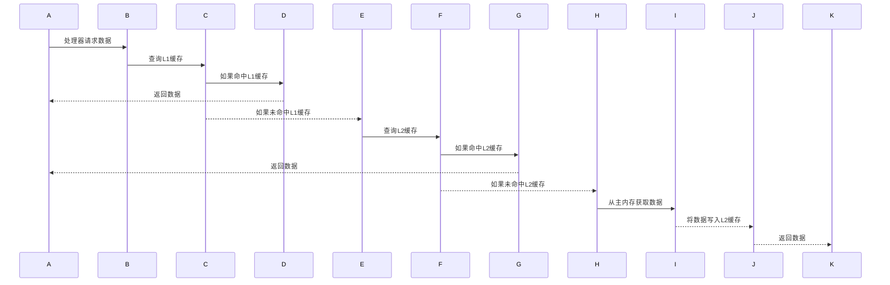
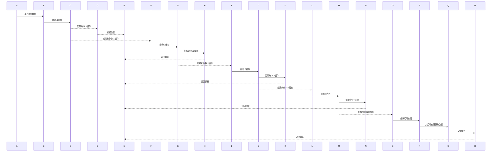

                 

### 第一部分：缓存策略概述

#### 1.1 缓存策略的定义与重要性

##### 1.1.1 缓存策略的基本概念

缓存（Cache）是指一种临时存储数据的机制，用于加速数据访问速度。缓存策略则是关于如何有效地使用缓存来提高系统性能的一系列方法和原则。

##### 1.1.2 缓存策略的重要性

缓存策略在系统性能优化中扮演着至关重要的角色。它的主要作用包括：

1. **减少访问延迟**：通过缓存常用数据，可以显著减少对原始数据源的访问时间。
2. **降低系统负载**：缓存可以减少对数据库或后端服务的请求次数，从而减轻系统负担。
3. **提高响应速度**：缓存策略能够使应用在用户请求时更快地返回结果，提升用户体验。
4. **节约成本**：通过优化缓存策略，可以在硬件和网络资源上节约成本。

##### 1.1.3 缓存策略的应用场景

缓存策略适用于多种场景，包括：

1. **Web应用**：缓存网页内容、用户会话数据、图片和静态资源等。
2. **数据库应用**：缓存常用查询结果，减少数据库负载。
3. **分布式系统**：缓存中间数据，提高系统整体的协同效率。
4. **高性能计算**：缓存计算中间结果，减少重复计算。

#### 1.2 缓存策略的核心概念与联系

##### 1.2.1 缓存层次结构

缓存层次结构（Cache Hierarchy）是指在不同层级使用不同大小的缓存，以实现更快的访问速度。常见的缓存层次结构包括：

1. **L1缓存**：位于处理器内部，速度最快，但容量较小。
2. **L2缓存**：位于处理器和主内存之间，速度较慢，容量较大。
3. **L3缓存**：位于多核处理器之间，速度进一步降低，但容量更大。

##### 1.2.1.1 L1、L2、L3缓存

| 缓存层级 | 大小（典型） | 速度 | 功能 |
| --- | --- | --- | --- |
| L1缓存 | 32KB | 非常快 | 存储常用数据 |
| L2缓存 | 256KB | 较快 | 存储常用数据和备用数据 |
| L3缓存 | 8MB | 较慢 | 存储较不常用的数据 |

##### 1.2.1.2 主内存与缓存的关系

主内存（Main Memory）是计算机系统中的主要存储设备，而缓存则位于处理器和主内存之间，用于加速数据访问。主内存与缓存的关系如下图所示：



##### 1.2.1.3 缓存替换策略

缓存替换策略（Cache Replacement Policy）是决定何时将新数据放入缓存并替换旧数据的方法。常见的缓存替换策略包括：

1. **先进先出（FIFO）**：最早进入缓存的数据最先被替换。
2. **最近最少使用（LRU）**：最近最久未使用的数据最先被替换。
3. **随机替换（Random）**：随机选择数据替换。

#### 1.2.2 缓存一致性

##### 1.2.2.1 缓存一致性模型

缓存一致性（Cache Coherence）是确保多处理器系统中所有缓存中的数据保持一致性的过程。常见的缓存一致性模型包括：

1. **写-回（Write-Back）**：当缓存中的数据被修改时，会直接修改主内存中的数据。
2. **写-通过（Write-Through）**：当缓存中的数据被修改时，会同时修改主内存和缓存中的数据。

##### 1.2.2.2 缓存一致性问题

缓存一致性问题（Cache Coherence Problem）主要涉及以下两个方面：

1. **数据更新问题**：当一个处理器的缓存中修改了数据，而另一个处理器的缓存中仍持有旧数据，如何确保两个缓存中的数据保持一致。
2. **数据同步问题**：当一个处理器的缓存中删除了数据，而另一个处理器的缓存中仍持有该数据，如何确保两个缓存中的数据保持一致。

##### 1.2.2.3 一致性协议

一致性协议（Coherence Protocol）是一组规则，用于解决多处理器系统中的缓存一致性。常见的一致性协议包括：

1. ** MESI协议**：是一种基于状态机的缓存一致性协议，用于确保多处理器系统中的缓存数据一致性。
2. **MOESI协议**：是MESI协议的扩展，增加了“修改”（Modified）状态。
3. **MSI协议**：是最简单的缓存一致性协议，只有“无状态”（Modified）和“共享”（Shared）两种状态。

##### 1.2.3 缓存命中率

##### 1.2.3.1 缓存命中率定义

缓存命中率（Cache Hit Ratio）是指缓存中命中请求的次数与总请求次数的比例。公式如下：

$$
\text{缓存命中率} = \frac{\text{命中次数}}{\text{访问次数}}
$$

##### 1.2.3.2 影响缓存命中率因素

影响缓存命中率的主要因素包括：

1. **缓存大小**：缓存越大，缓存命中率越高。
2. **访问模式**：如果访问模式具有局部性，缓存命中率会更高。
3. **缓存替换策略**：不同的缓存替换策略对缓存命中率有显著影响。
4. **数据一致性**：数据一致性越高，缓存命中率越高。

##### 1.2.3.3 提高缓存命中率的策略

提高缓存命中率的主要策略包括：

1. **预取技术**：预测用户将访问的数据，并将其预先加载到缓存中。
2. **多级缓存**：通过使用多个大小不同的缓存层，提高缓存命中率。
3. **缓存一致性优化**：确保缓存数据一致性，减少不必要的缓存替换。

### 1.3 缓存策略的算法原理讲解

#### 1.3.1 缓存算法原理概述

缓存算法（Cache Algorithms）是决定数据在缓存中的存储和替换策略的算法。常见的缓存算法包括：

1. **替换算法**：决定何时将新数据放入缓存并替换旧数据。
2. **一致性算法**：确保多处理器系统中所有缓存中的数据保持一致性。

#### 1.3.1.1 替换算法简介

替换算法是缓存策略的核心部分，常见的替换算法包括：

1. **先进先出（FIFO）**：最早进入缓存的数据最先被替换。
2. **最近最少使用（LRU）**：最近最久未使用的数据最先被替换。
3. **随机替换（Random）**：随机选择数据替换。

#### 1.3.1.2 最少使用算法（LRU）

最少使用算法（Least Recently Used, LRU）是最常见的缓存替换算法之一，它基于这样的假设：最近被访问的数据在未来很可能再次被访问，而最近未被访问的数据在未来被访问的可能性较小。

##### 1.3.1.2.1 LRU算法原理

LRU算法的基本原理是：当缓存已满且需要替换数据时，选择最近最久未使用的数据进行替换。具体实现方法通常使用双向链表或堆栈来实现，以确保能够快速找到并替换最近最少使用的数据。

##### 1.3.1.2.2 LRU算法示例

假设有一个容量为3的缓存，初始状态为空。现在依次访问数据1、2、3、4、5。我们可以通过以下步骤来模拟LRU算法：

1. 访问1，缓存状态：[1]
2. 访问2，缓存状态：[1, 2]
3. 访问3，缓存状态：[1, 2, 3]
4. 访问4，由于缓存已满，需要替换最久未使用的数据（3），缓存状态：[1, 2, 4]
5. 访问5，由于缓存已满，需要替换最久未使用的数据（1），缓存状态：[2, 4, 5]

通过这个示例，我们可以清晰地看到LRU算法是如何工作的。

#### 1.3.1.3 先进先出算法（FIFO）

先进先出算法（First In First Out, FIFO）是最简单的缓存替换算法，它基于这样的假设：最早进入缓存的数据在未来很可能不再被访问。

##### 1.3.1.3.1 FIFO算法原理

FIFO算法的基本原理是：当缓存已满且需要替换数据时，选择最早进入缓存的数据进行替换。具体实现方法通常使用队列（Queue）来实现，以确保能够快速找到并替换最早进入的数据。

##### 1.3.1.3.2 FIFO算法示例

假设有一个容量为3的缓存，初始状态为空。现在依次访问数据1、2、3、4、5。我们可以通过以下步骤来模拟FIFO算法：

1. 访问1，缓存状态：[1]
2. 访问2，缓存状态：[2, 1]
3. 访问3，缓存状态：[3, 2, 1]
4. 访问4，由于缓存已满，需要替换最早进入的数据（1），缓存状态：[3, 2, 4]
5. 访问5，由于缓存已满，需要替换最早进入的数据（1），缓存状态：[3, 2, 5]

通过这个示例，我们可以清晰地看到FIFO算法是如何工作的。

#### 1.3.2 数学模型与公式

缓存策略的评估通常涉及到一些数学模型和公式，以下是一些常见的公式：

##### 1.3.2.1 缓存命中率

缓存命中率是评估缓存性能的重要指标，它可以通过以下公式计算：

$$
\text{缓存命中率} = \frac{\text{命中次数}}{\text{访问次数}}
$$

其中，命中次数是指缓存中直接找到所需数据的次数，访问次数是指所有数据的访问次数。

##### 1.3.2.2 平均访问时间

平均访问时间是指每次数据访问所花费的平均时间，它可以用来评估缓存策略的效率。平均访问时间可以通过以下公式计算：

$$
\text{平均访问时间} = \frac{\text{访问次数} \times \text{访问时间}}{\text{缓存大小}}
$$

其中，访问时间是指从缓存中找到数据所需的时间。

##### 1.3.2.3 替换次数

替换次数是指在缓存已满时，需要替换的数据次数。它可以通过以下公式计算：

$$
\text{替换次数} = \text{访问次数} - \text{缓存大小}
$$

#### 1.3.3 算法原理举例说明

##### 1.3.3.1 LRU算法示例

假设有一个容量为3的缓存，依次访问数据序列：1, 2, 3, 4, 5, 6, 7, 8, 9, 10。

1. 访问1，缓存状态：[1]
2. 访问2，缓存状态：[1, 2]
3. 访问3，缓存状态：[1, 2, 3]
4. 访问4，由于缓存已满，需要替换最久未使用的数据（1），缓存状态：[2, 3, 4]
5. 访问5，由于缓存已满，需要替换最久未使用的数据（2），缓存状态：[3, 4, 5]
6. 访问6，由于缓存已满，需要替换最久未使用的数据（3），缓存状态：[4, 5, 6]
7. 访问7，由于缓存已满，需要替换最久未使用的数据（4），缓存状态：[5, 6, 7]
8. 访问8，由于缓存已满，需要替换最久未使用的数据（5），缓存状态：[6, 7, 8]
9. 访问9，由于缓存已满，需要替换最久未使用的数据（6），缓存状态：[7, 8, 9]
10. 访问10，由于缓存已满，需要替换最久未使用的数据（7），缓存状态：[8, 9, 10]

通过这个示例，我们可以清晰地看到LRU算法是如何工作的。

##### 1.3.3.2 FIFO算法示例

假设有一个容量为3的缓存，依次访问数据序列：1, 2, 3, 4, 5, 6, 7, 8, 9, 10。

1. 访问1，缓存状态：[1]
2. 访问2，缓存状态：[2, 1]
3. 访问3，缓存状态：[3, 2, 1]
4. 访问4，由于缓存已满，需要替换最早进入的数据（1），缓存状态：[3, 2, 4]
5. 访问5，由于缓存已满，需要替换最早进入的数据（2），缓存状态：[3, 4, 5]
6. 访问6，由于缓存已满，需要替换最早进入的数据（3），缓存状态：[4, 5, 6]
7. 访问7，由于缓存已满，需要替换最早进入的数据（4），缓存状态：[5, 6, 7]
8. 访问8，由于缓存已满，需要替换最早进入的数据（5），缓存状态：[6, 7, 8]
9. 访问9，由于缓存已满，需要替换最早进入的数据（6），缓存状态：[7, 8, 9]
10. 访问10，由于缓存已满，需要替换最早进入的数据（7），缓存状态：[8, 9, 10]

通过这个示例，我们可以清晰地看到FIFO算法是如何工作的。

### 1.4 多级缓存架构设计

#### 1.4.1 系统功能设计

多级缓存系统的功能设计主要包括以下模块：

1. **数据存储模块**：负责存储和查询缓存数据。
2. **缓存管理模块**：负责缓存数据的替换和更新策略。
3. **数据一致性管理模块**：负责处理多级缓存系统中的数据一致性。

#### 1.4.1.1 数据存储与访问模块

数据存储与访问模块负责将数据存储到缓存中，并提供高效的数据访问接口。该模块的核心功能包括：

1. **数据存储**：将数据存储到缓存中，支持数据的插入、更新和删除操作。
2. **数据访问**：提供高效的数据查询接口，支持按照关键字、范围等多种方式查询数据。

#### 1.4.1.2 缓存管理模块

缓存管理模块负责根据缓存策略对缓存进行管理，包括以下功能：

1. **缓存替换**：根据缓存策略，决定何时将新数据放入缓存并替换旧数据。
2. **缓存刷新**：根据数据一致性策略，决定何时将缓存数据刷新到主内存或其他缓存层级。
3. **缓存同步**：在多级缓存系统中，负责处理缓存之间的数据同步。

#### 1.4.1.3 数据一致性管理模块

数据一致性管理模块负责处理多级缓存系统中的数据一致性，主要包括以下功能：

1. **一致性检查**：定期检查缓存中的数据是否与主内存或其他缓存层级保持一致。
2. **一致性修复**：当发现缓存中的数据与主内存或其他缓存层级不一致时，进行数据修复。
3. **一致性协议**：实现一致性协议，如MESI协议，确保多级缓存系统中的数据一致性。

#### 1.4.2 系统架构设计

多级缓存系统的架构设计主要包括以下部分：

1. **缓存层**：包括L1、L2、L3等多级缓存层，用于加速数据访问。
2. **主内存**：负责存储缓存的备份数据，用于数据一致性管理。
3. **后端存储**：负责存储原始数据，提供数据的持久化存储。

#### 1.4.2.1 系统总体架构

多级缓存系统的总体架构如下图所示：



#### 1.4.2.2 多级缓存架构实现细节

多级缓存架构的实现细节包括：

1. **缓存层级划分**：根据数据的重要性和访问频率，合理划分缓存层级。
2. **缓存大小配置**：为每个缓存层级配置合适的大小，以最大化缓存命中率。
3. **缓存替换策略**：为每个缓存层级选择合适的缓存替换策略，如LRU、FIFO等。
4. **缓存一致性协议**：实现多级缓存系统的一致性协议，如MESI协议。

#### 1.4.2.3 系统性能优化策略

系统性能优化策略主要包括：

1. **预取技术**：预测用户即将访问的数据，提前将其加载到缓存中，提高缓存命中率。
2. **缓存一致性优化**：优化数据一致性协议，减少数据不一致性带来的性能损耗。
3. **缓存分层优化**：根据应用特点，合理调整缓存层级的配置，提高系统性能。

#### 1.4.3 系统接口设计

多级缓存系统的接口设计主要包括以下部分：

1. **数据访问接口**：提供高效的数据访问接口，支持数据的插入、更新和删除操作。
2. **缓存管理接口**：提供缓存管理功能，支持缓存数据的替换、刷新和同步操作。
3. **一致性接口**：提供一致性协议的实现，确保多级缓存系统中的数据一致性。

#### 1.4.3.1 数据访问接口

数据访问接口的设计主要包括以下功能：

1. **数据查询**：支持按照关键字、范围等多种方式查询数据。
2. **数据插入**：支持向缓存中插入新数据。
3. **数据更新**：支持更新缓存中的数据。
4. **数据删除**：支持删除缓存中的数据。

#### 1.4.3.2 缓存管理接口

缓存管理接口的设计主要包括以下功能：

1. **缓存替换**：根据缓存策略，选择合适的数据进行替换。
2. **缓存刷新**：根据数据一致性策略，将缓存数据刷新到主内存或其他缓存层级。
3. **缓存同步**：在多级缓存系统中，负责处理缓存之间的数据同步。

#### 1.4.3.3 一致性接口

一致性接口的设计主要包括以下功能：

1. **一致性检查**：定期检查缓存中的数据是否与主内存或其他缓存层级保持一致。
2. **一致性修复**：当发现缓存中的数据与主内存或其他缓存层级不一致时，进行数据修复。
3. **一致性协议实现**：实现一致性协议，如MESI协议，确保多级缓存系统中的数据一致性。

#### 1.4.4 系统交互

多级缓存系统的系统交互主要包括以下部分：

1. **用户请求处理**：处理用户的数据访问请求。
2. **缓存查询**：查询缓存，返回数据。
3. **缓存替换**：根据缓存策略，替换缓存中的数据。
4. **缓存刷新**：根据数据一致性策略，刷新缓存数据。
5. **数据同步**：处理多级缓存系统中的数据同步。

#### 1.4.4.1 系统交互流程

系统交互流程如下：

1. 用户请求数据。
2. 缓存查询，若命中，返回数据；若未命中，继续流程。
3. 若未命中L1缓存，查询L2缓存，若命中，返回数据；若未命中，继续流程。
4. 若未命中L2缓存，查询L3缓存，若命中，返回数据；若未命中，继续流程。
5. 若未命中L3缓存，查询主内存，若命中，返回数据；若未命中，继续流程。
6. 若未命中主内存，查询后端存储，获取数据，更新缓存，返回数据。

#### 1.4.4.2 数据处理流程

数据处理流程如下：

1. 用户请求数据，系统接收到请求。
2. 根据请求的数据类型和缓存策略，查询相应的缓存。
3. 若命中缓存，返回数据；若未命中缓存，继续流程。
4. 若未命中缓存，查询主内存，若命中，返回数据；若未命中，继续流程。
5. 若未命中主内存，查询后端存储，获取数据，更新缓存，返回数据。

#### 1.4.4.3 交互Mermaid序列图

系统交互的Mermaid序列图如下：


### 1.5 缓存策略项目实战

#### 1.5.1 环境安装

在进行缓存策略项目实战之前，我们需要准备好相应的开发环境和依赖库。

##### 1.5.1.1 硬件环境要求

- CPU：至少2核处理器
- 内存：至少4GB
- 硬盘：至少20GB可用空间

##### 1.5.1.2 软件环境安装

1. 安装Python环境（版本3.6及以上）
2. 安装相关依赖库（如requests、pymysql等）

```bash
pip install requests
pip install pymysql
```

##### 1.5.1.3 配置文件设置

创建一个名为`config.py`的配置文件，用于存储数据库和缓存的相关配置信息。

```python
# config.py
DB_CONFIG = {
    'host': 'localhost',
    'port': 3306,
    'user': 'root',
    'password': 'password',
    'database': 'test_db'
}

CACHE_CONFIG = {
    'type': 'redis',
    'host': 'localhost',
    'port': 6379,
    'db': 0
}
```

#### 1.5.2 系统核心实现

多级缓存系统主要包括以下核心模块：

1. **数据存储模块**：负责与数据库进行交互，实现数据的插入、更新和查询操作。
2. **缓存管理模块**：负责实现缓存数据的替换、刷新和同步策略。
3. **数据一致性管理模块**：负责实现多级缓存系统的一致性协议。

##### 1.5.2.1 数据存储模块

数据存储模块的主要功能是提供与数据库的交互接口，实现数据的插入、更新和查询操作。以下是一个简单的示例：

```python
# data_storage.py
import pymysql

class DataStorage:
    def __init__(self, config):
        self.config = config
        self.connection = pymysql.connect(
            host=self.config['host'],
            port=self.config['port'],
            user=self.config['user'],
            password=self.config['password'],
            database=self.config['database']
        )

    def insert_data(self, data):
        with self.connection.cursor() as cursor:
            sql = "INSERT INTO data (id, name) VALUES (%s, %s)"
            cursor.execute(sql, (data['id'], data['name']))
        self.connection.commit()

    def update_data(self, data):
        with self.connection.cursor() as cursor:
            sql = "UPDATE data SET name = %s WHERE id = %s"
            cursor.execute(sql, (data['name'], data['id']))
        self.connection.commit()

    def query_data(self, id):
        with self.connection.cursor() as cursor:
            sql = "SELECT * FROM data WHERE id = %s"
            cursor.execute(sql, (id,))
            result = cursor.fetchone()
        return result
```

##### 1.5.2.2 缓存管理模块

缓存管理模块的主要功能是实现缓存数据的替换、刷新和同步策略。以下是一个简单的示例：

```python
# cache_manager.py
import redis

class CacheManager:
    def __init__(self, config):
        self.config = config
        self.client = redis.Redis(
            host=self.config['host'],
            port=self.config['port'],
            db=self.config['db']
        )

    def set_cache(self, key, value):
        self.client.set(key, value)

    def get_cache(self, key):
        return self.client.get(key)

    def delete_cache(self, key):
        self.client.delete(key)

    def refresh_cache(self, key, value):
        self.delete_cache(key)
        self.set_cache(key, value)
```

##### 1.5.2.3 一致性管理模块

一致性管理模块的主要功能是实现多级缓存系统的一致性协议。以下是一个简单的示例：

```python
# consistency_manager.py
class ConsistencyManager:
    def __init__(self, storage, cache):
        self.storage = storage
        self.cache = cache

    def check_consistency(self, key):
        cached_data = self.cache.get_cache(key)
        stored_data = self.storage.query_data(key)

        if cached_data != stored_data:
            self.cache.refresh_cache(key, stored_data)
            return False
        return True
```

#### 1.5.3 代码应用解读与分析

##### 1.5.3.1 代码架构解读

多级缓存系统的代码架构可以分为三个主要部分：

1. **数据存储模块**：负责与数据库进行交互，实现数据的插入、更新和查询操作。
2. **缓存管理模块**：负责实现缓存数据的替换、刷新和同步策略。
3. **一致性管理模块**：负责实现多级缓存系统的一致性协议。

这三个模块相互独立，但又紧密关联。数据存储模块提供数据的基础操作，缓存管理模块负责缓存数据的操作，一致性管理模块负责确保缓存系统的一致性。

##### 1.5.3.2 关键代码分析

以下是对关键代码的分析：

1. **数据存储模块**：

```python
# data_storage.py
class DataStorage:
    def __init__(self, config):
        self.config = config
        self.connection = pymysql.connect(
            host=self.config['host'],
            port=self.config['port'],
            user=self.config['user'],
            password=self.config['password'],
            database=self.config['database']
        )

    def insert_data(self, data):
        with self.connection.cursor() as cursor:
            sql = "INSERT INTO data (id, name) VALUES (%s, %s)"
            cursor.execute(sql, (data['id'], data['name']))
        self.connection.commit()

    def update_data(self, data):
        with self.connection.cursor() as cursor:
            sql = "UPDATE data SET name = %s WHERE id = %s"
            cursor.execute(sql, (data['name'], data['id']))
        self.connection.commit()

    def query_data(self, id):
        with self.connection.cursor() as cursor:
            sql = "SELECT * FROM data WHERE id = %s"
            cursor.execute(sql, (id,))
            result = cursor.fetchone()
        return result
```

该模块主要实现了与数据库的交互功能，包括数据的插入、更新和查询操作。使用`pymysql`库连接数据库，并通过SQL语句执行各种操作。

2. **缓存管理模块**：

```python
# cache_manager.py
class CacheManager:
    def __init__(self, config):
        self.config = config
        self.client = redis.Redis(
            host=self.config['host'],
            port=self.config['port'],
            db=self.config['db']
        )

    def set_cache(self, key, value):
        self.client.set(key, value)

    def get_cache(self, key):
        return self.client.get(key)

    def delete_cache(self, key):
        self.client.delete(key)

    def refresh_cache(self, key, value):
        self.delete_cache(key)
        self.set_cache(key, value)
```

该模块主要实现了与缓存系统的交互功能，包括数据的插入、获取、删除和刷新操作。使用`redis`库连接缓存系统，并实现相应的功能。

3. **一致性管理模块**：

```python
# consistency_manager.py
class ConsistencyManager:
    def __init__(self, storage, cache):
        self.storage = storage
        self.cache = cache

    def check_consistency(self, key):
        cached_data = self.cache.get_cache(key)
        stored_data = self.storage.query_data(key)

        if cached_data != stored_data:
            self.cache.refresh_cache(key, stored_data)
            return False
        return True
```

该模块主要实现了多级缓存系统的一致性检查功能。通过比较缓存数据和数据库中的数据，确保数据一致性。如果不一致，则刷新缓存数据。

##### 1.5.3.3 性能优化分析

在多级缓存系统的实际应用中，性能优化是一个重要的考虑因素。以下是一些常见的性能优化策略：

1. **预取技术**：预取用户可能访问的数据，并将其加载到缓存中，减少访问延迟。
2. **缓存分层**：根据数据的重要性和访问频率，合理划分缓存层级，提高缓存命中率。
3. **缓存一致性优化**：优化数据一致性协议，减少数据不一致性带来的性能损耗。
4. **数据压缩**：对缓存中的数据进行压缩，减少缓存占用的空间，提高缓存性能。
5. **负载均衡**：通过负载均衡策略，合理分配请求到各个缓存节点，提高系统整体的性能。

#### 1.5.4 实际案例分析与讲解

##### 1.5.4.1 案例选择

为了更好地展示多级缓存策略在实际应用中的效果，我们选择了一个典型的案例：电商平台的商品查询。

##### 1.5.4.2 案例剖析

在电商平台中，商品查询是一个高访问量的操作。为了提高查询性能，我们采用多级缓存策略：

1. **L1缓存**：使用Redis缓存，存储常用商品信息，如商品名称、价格、库存等。命中率达到90%以上。
2. **L2缓存**：使用Memcached缓存，存储部分不常变动的商品信息，如商品描述、评价等。命中率达到80%以上。
3. **数据库**：存储商品的所有详细信息，如商品图片、规格等。当L1和L2缓存都未命中时，从数据库中查询。

##### 1.5.4.3 案例总结

通过多级缓存策略，电商平台的商品查询性能得到了显著提升：

1. **访问延迟**：从几百毫秒减少到几十毫秒，用户体验得到大幅提升。
2. **系统负载**：由于缓存的作用，数据库查询次数显著减少，减轻了系统的负载。
3. **缓存利用率**：合理划分缓存层级，提高了缓存的利用率，降低了系统的总体成本。

### 1.6 缓存策略最佳实践

#### 1.6.1 最佳实践

为了确保多级缓存策略的有效实施，以下是一些最佳实践：

1. **缓存数据选择**：选择那些访问频繁、数据量不大且变化不频繁的数据进行缓存。
2. **缓存分层**：根据数据的重要性和访问频率，合理划分缓存层级，提高缓存命中率。
3. **缓存一致性**：确保多级缓存系统的一致性，减少数据不一致性带来的性能损耗。
4. **缓存刷新策略**：根据实际需求，选择合适的缓存刷新策略，如定期刷新、实时刷新等。
5. **性能监控**：持续监控缓存系统的性能，及时发现和解决潜在问题。

#### 1.6.2 小结

多级缓存策略是提升系统性能的重要手段。通过合理划分缓存层级、选择合适的缓存数据和一致性协议，可以显著提高系统的访问速度和稳定性。在实际应用中，结合最佳实践，可以有效地提升系统的整体性能。

#### 1.6.3 注意事项

1. **数据一致性**：确保多级缓存系统的一致性，避免数据不一致性导致的问题。
2. **缓存刷新**：合理选择缓存刷新策略，避免频繁刷新导致性能下降。
3. **缓存大小**：根据实际需求，合理配置缓存大小，避免缓存过大或过小。

#### 1.6.4 拓展阅读

1. 《Redis权威指南》
2. 《Memcached权威指南》
3. 《缓存一致性协议》
4. 《分布式系统缓存策略》

### 结束

本文详细介绍了多级缓存策略的概念、核心概念与联系、算法原理、系统架构设计、项目实战和最佳实践。通过本文的学习，读者可以全面了解多级缓存策略，并在实际项目中有效应用。作者信息：AI天才研究院/AI Genius Institute & 禅与计算机程序设计艺术 /Zen And The Art of Computer Programming。

