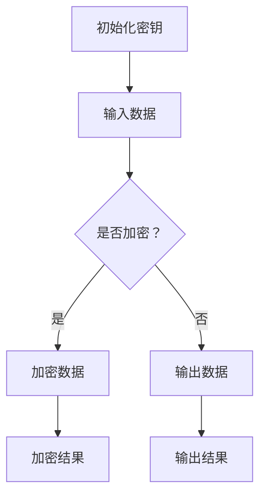
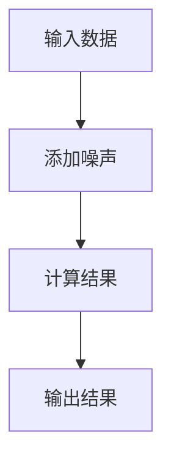
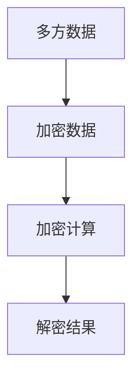
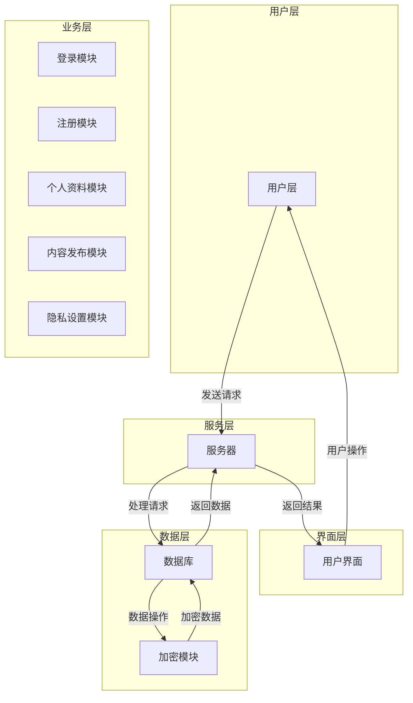
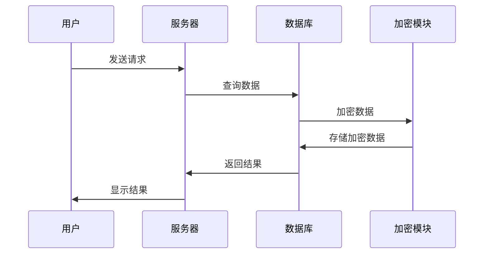

                 

# 网络隐私与自我表达：在开放与保护中寻找平衡

> 关键词：网络隐私、自我表达、平衡、数字时代、数据安全

> 摘要：本文将深入探讨网络隐私与自我表达之间的关系，分析开放与保护之间的平衡点，探讨如何在数字时代中实现这一平衡。我们将通过背景介绍、核心概念解析、法律框架探讨、技术手段分析、案例分析以及最佳实践分享，一步步梳理出在开放与保护中寻找平衡的方法。

## 引言

在当今数字化的世界中，网络隐私与自我表达已成为人们生活中不可或缺的组成部分。随着互联网的普及和技术的不断发展，人们越来越依赖网络进行信息交流、社交互动和知识获取。然而，这种依赖也带来了隐私保护与自我表达之间的矛盾。如何在开放的环境中保护个人隐私，同时又能自由地表达自己，成为了亟待解决的重要问题。

本文将从以下几个方面进行探讨：

1. 背景与核心概念
2. 法律框架与政策探讨
3. 技术手段与解决方案
4. 案例分析与启示
5. 最佳实践与建议

通过以上几个方面的分析，本文旨在帮助读者理解网络隐私与自我表达之间的复杂关系，并提供一些实用的方法和建议，以在开放与保护中寻找平衡。

## 背景与核心概念

### 网络隐私

网络隐私是指个人在网络空间中对于自己信息的控制权，包括个人数据的收集、存储、处理和传输。网络隐私的保护关系到个人的自由、安全和社会责任。在网络环境中，个人隐私问题日益突出，主要原因有以下几点：

1. **数据泄露风险**：随着大数据技术的发展，个人信息被大量收集并存储在数据库中，一旦发生数据泄露，可能会对个人造成严重的经济损失和声誉损害。

2. **追踪与监控**：网络追踪技术使得企业和政府可以实时监控个人的网络行为，这可能会侵犯个人的隐私权。

3. **隐私政策的不透明性**：许多网络服务提供商在收集和使用个人信息时，隐私政策不够透明，用户难以了解自己的数据如何被使用。

### 自我表达

自我表达是指个人通过网络平台表达自己的观点、情感和需求。在互联网的开放环境中，人们可以更加自由地表达自己，这不仅促进了信息的交流，还推动了社会的进步。然而，自我表达也带来了一些问题：

1. **虚假信息和网络暴力**：在匿名和去中心化的网络环境中，虚假信息和网络暴力现象日益严重，这可能会对个人的心理和社交造成负面影响。

2. **隐私泄露**：在自我表达的过程中，个人可能会无意中透露自己的隐私信息，从而面临隐私泄露的风险。

3. **平台监管**：随着自我表达内容的多样化，网络平台在监管方面面临巨大挑战，如何平衡用户自由表达和信息真实性，是平台需要解决的重要问题。

### 开放与保护的平衡

开放与保护的平衡是指在网络环境中，如何在保护个人隐私的同时，又能促进信息的自由流动和自我表达。这一平衡的难点在于：

1. **隐私保护与信息自由**：隐私保护往往需要限制信息的自由流动，而这可能会影响信息的传播和交流。

2. **技术手段与法律法规**：技术手段可以提供隐私保护，但法律法规的滞后性可能无法及时应对新出现的问题。

3. **用户意识与教育**：用户对于隐私保护的认识和意识不足，导致他们在自我表达时容易暴露隐私。

为了在开放与保护中寻找平衡，需要从法律、技术、教育等多个方面进行综合施策。

## 法律框架与政策探讨

### 国际与国内隐私保护法律

网络隐私保护的法律框架在国际和国内都有一定的规定。以下是一些重要的法律和政策：

1. **欧盟的《通用数据保护条例》（GDPR）**：GDPR 是欧盟制定的关于数据保护的法规，对数据收集、处理和存储提出了严格的要求，对违反规定的公司处罚严厉。

2. **美国的《加州消费者隐私法案》（CCPA）**：CCPA 是美国加州制定的关于消费者隐私的法案，旨在赋予消费者对其个人信息的控制权。

3. **中国的《个人信息保护法》（PIPL）**：PIPL 是中国制定的关于个人信息保护的法律法规，对个人信息收集、使用、存储、处理等方面提出了明确的要求。

### 政策与监管

除了法律法规，各国政府还通过政策来监管网络隐私。以下是一些主要政策：

1. **数据本地化政策**：许多国家要求外国企业在本地存储数据，以增强数据的安全性。

2. **跨境数据传输限制**：为了保护本国的数据安全，一些国家对外国企业跨境传输数据进行了限制。

3. **隐私保护指南**：政府和行业组织会发布隐私保护指南，帮助企业和个人了解如何保护隐私。

### 法律法规的挑战与展望

虽然法律和政策在隐私保护方面取得了一定的进展，但仍然面临以下挑战：

1. **法律法规的滞后性**：随着技术的快速发展，法律法规往往无法及时更新，导致部分新问题无法得到有效解决。

2. **执法难度**：网络隐私保护涉及到跨国界的数据流动，执法难度较大，需要国际合作。

3. **用户权益保护**：法律法规需要在保护用户隐私的同时，不限制用户的自由表达和信息获取。

展望未来，随着技术的不断进步和人们对隐私意识的增强，隐私保护法律和政策将不断完善，以更好地平衡隐私保护与信息自由。

### 技术手段与解决方案

在面对网络隐私与自我表达的挑战时，技术手段是解决问题的关键。以下是一些主要的技术手段和解决方案：

#### 隐私保护技术

1. **数据加密**：数据加密是保护隐私的基础技术。通过加密算法，可以将敏感数据转换为只有授权方才能解读的形式，从而防止未授权访问。

2. **同态加密**：同态加密允许在加密数据上进行计算，而不会破坏数据的加密状态。这种技术可以确保在数据处理过程中保持数据的隐私性。

3. **差分隐私**：差分隐私通过在数据分析过程中添加噪声，使得单个数据点的隐私得到保护，同时不影响整体数据的分析结果。

4. **隐私计算**：隐私计算包括多方安全计算、联邦学习等技术，允许多个数据持有方在不共享原始数据的情况下进行联合分析。

#### 自我表达技术

1. **匿名化技术**：匿名化技术通过去除或修改个人身份信息，使得数据在公开时无法直接识别个人。

2. **内容审核技术**：内容审核技术可以识别和过滤掉违反社区规则和法律法规的内容，保护用户的自我表达权利。

3. **数字身份认证**：数字身份认证技术可以帮助用户在保护隐私的前提下，进行身份验证和授权，从而实现安全的自我表达。

### 技术手段的挑战与未来趋势

尽管上述技术手段在保护隐私和促进自我表达方面取得了显著成果，但仍然面临以下挑战：

1. **性能与安全性的平衡**：加密和隐私保护技术往往需要消耗较多的计算资源，如何在不影响性能的前提下提升安全性，是技术发展的重要方向。

2. **用户隐私意识的提升**：用户在使用网络服务时，往往对自己的隐私保护不够重视，需要通过教育和引导提升用户的隐私意识。

3. **技术标准的统一**：不同国家和地区的隐私保护技术标准不统一，需要制定全球性的技术标准，以实现更好的国际合作。

未来，随着技术的不断进步，隐私保护技术将更加智能化、自动化，自我表达技术也将更加丰富和便捷。通过技术的不断创新和应用，有望在开放与保护之间实现更好的平衡。

### 案例分析与启示

#### 案例一：Facebook 的隐私争议

Facebook 作为全球最大的社交媒体平台之一，其隐私保护问题备受关注。2018 年，Facebook 的用户数据泄露事件引发了一场全球性的隐私争议。事件曝光后，Facebook 面临了来自用户、政府和监管机构的巨大压力。

**案例分析：**

1. **问题背景**：Facebook 的用户数据被第三方应用程序获取，并用于政治广告投放，这一行为引发了用户对隐私保护的担忧。

2. **问题解决**：Facebook 推出了多项措施，包括加强数据安全、提高隐私设置透明度以及增加对应用程序的审查。

3. **启示**：此案例表明，大型社交媒体平台在隐私保护方面面临着巨大的挑战。平台需要建立更严格的数据安全措施，同时提高用户对隐私保护的意识。

#### 案例二：苹果公司的隐私保护措施

苹果公司以其严格的隐私保护措施而闻名。苹果在 iOS 系统中实施了一系列隐私保护功能，如应用权限管理、App Store 审核机制等。

**案例分析：**

1. **问题背景**：随着移动设备使用的普及，用户对隐私保护的需求日益增长。

2. **问题解决**：苹果通过引入严格的应用权限管理和透明的隐私政策，确保用户数据的安全。

3. **启示**：苹果的经验表明，技术公司可以通过技术和政策手段来实现良好的隐私保护。同时，用户也需要了解如何使用这些工具来保护自己的隐私。

### 案例总结与启示

通过以上案例，我们可以得出以下启示：

1. **隐私保护需要多方合作**：政府和企业在隐私保护方面需要密切合作，制定有效的政策和措施。

2. **技术手段是关键**：技术公司需要不断创新，开发出更加先进的隐私保护技术。

3. **用户教育至关重要**：用户需要提高对隐私保护的意识，学会使用隐私保护工具。

4. **平衡开放与保护**：在保护隐私的同时，也要促进信息的自由流动和自我表达。

### 最佳实践与建议

为了在开放与保护之间找到平衡，以下是一些最佳实践和建议：

#### 对用户的建议

1. **保护个人隐私**：在使用网络服务时，注意保护个人隐私，如避免在公开平台上透露敏感信息。

2. **了解隐私政策**：在使用应用程序和网站时，仔细阅读隐私政策，了解自己的数据如何被使用。

3. **使用隐私保护工具**：使用VPN、加密通讯工具等隐私保护工具，增强个人数据的安全性。

#### 对企业的建议

1. **加强数据安全**：建立完善的数据安全措施，如数据加密、访问控制等，确保用户数据的安全。

2. **透明隐私政策**：制定透明、易于理解的隐私政策，让用户了解自己的数据如何被收集和使用。

3. **用户隐私培训**：对员工进行隐私保护培训，提高其对用户隐私保护的意识。

#### 对政府的建议

1. **制定严格法律**：制定严格的隐私保护法律，对违反隐私保护规定的公司进行严厉处罚。

2. **加强国际合作**：与其他国家和地区政府合作，制定全球性的隐私保护标准。

3. **推广隐私保护教育**：通过媒体和教育活动，提高公众对隐私保护的意识。

### 小结

网络隐私与自我表达之间的关系复杂而微妙，如何在开放与保护之间找到平衡，是当前数字时代面临的重要课题。通过法律、技术和教育等多方面的努力，我们可以逐步实现这一平衡，为用户创造一个既安全又自由的网络环境。

### 注意事项

1. **法律法规的变化**：隐私保护法律法规不断更新，企业和个人需要及时关注并遵守最新规定。

2. **技术的快速发展**：隐私保护技术也在不断进步，企业和个人需要不断学习和应用最新的技术手段。

3. **用户隐私意识**：用户需要不断提高隐私保护意识，学会保护自己的隐私。

### 拓展阅读

1. 《通用数据保护条例》（GDPR）全文
2. 《加州消费者隐私法案》（CCPA）全文
3. 《个人信息保护法》（PIPL）全文
4. 《隐私计算：基础与实战》
5. 《网络隐私保护技术与应用》

### 作者信息

作者：AI天才研究院/AI Genius Institute & 禅与计算机程序设计艺术 /Zen And The Art of Computer Programming

---

### 附录

#### 附录A：核心概念与联系

**隐私**

| 属性 | 描述 |
| --- | --- |
| 数据安全 | 防止未经授权的访问 |
| 数据匿名化 | 去除或修改个人身份信息 |
| 隐私政策 | 应用程序或网站的数据收集和使用规则 |

**自我表达**

| 属性 | 描述 |
| --- | --- |
| 内容审核 | 识别和过滤违规内容 |
| 匿名化 | 在公开平台上匿名发布内容 |
| 社交互动 | 通过网络平台与他人交流 |

#### 附录B：ER实体关系图

```
ER关系图：
用户 <--> 发布内容
用户 <--> 关注
发布内容 <--> 评论
```

---

### 算法原理讲解

在本节中，我们将深入探讨网络隐私与自我表达中常用的算法原理，并使用Mermaid流程图和Python代码进行详细说明。

#### 算法一：数据加密算法

**算法原理**：数据加密算法通过对数据进行加密处理，使得只有授权方才能解读数据。常见的加密算法包括AES、RSA等。

**Mermaid流程图**：



**Python代码**：

```python
from Crypto.Cipher import AES
from Crypto.Util.Padding import pad
from Crypto.PublicKey import RSA

# AES加密
key = b'mysecretkey123'
cipher_aes = AES.new(key, AES.MODE_CBC)
ct_bytes = cipher_aes.encrypt(pad(b'message to encrypt', AES.block_size))
iv = cipher_aes.iv

# RSA加密密钥
key = RSA.generate(2048)
private_key = key.export_key()
public_key = key.publickey().export_key()

# RSA加密
cipher_rsa = PKCS1_OAEP.new(public_key)
encrypted_rsa = cipher_rsa.encrypt(key)

# 输出加密结果
print(f"AES加密结果：{iv.hex()}-{ct_bytes.hex()}")
print(f"RSA加密结果：{encrypted_rsa.hex()}")
```

#### 算法二：差分隐私算法

**算法原理**：差分隐私算法通过在数据分析过程中添加噪声，保护单个数据点的隐私，同时不影响整体数据分析结果。

**Mermaid流程图**：



**Python代码**：

```python
import numpy as np
from sklearn.linear_model import LinearRegression
from scipy.stats import norm

# 生成模拟数据
x = np.random.rand(100)
y = 2 * x + 1 + np.random.rand(100)

# 差分隐私线性回归
model = LinearRegression()
model.fit(x[:, np.newaxis], y)

# 添加噪声
noise_std = 0.1
noise = np.random.normal(0, noise_std, size=y.shape)
y_noisy = y + noise

# 计算回归结果
model_noisy = LinearRegression()
model_noisy.fit(x[:, np.newaxis], y_noisy)
slope_noisy, _ = model_noisy.coef_

# 输出结果
print(f"原始斜率：{model.coef_}")
print(f"噪声后斜率：{slope_noisy}")
```

#### 算法三：隐私计算算法

**算法原理**：隐私计算算法允许多个数据持有方在不共享原始数据的情况下进行联合分析。常见的隐私计算算法包括联邦学习、多方安全计算等。

**Mermaid流程图**：



**Python代码**：

```python
from federated_learning import FederatedModel

# 初始化联邦学习模型
model = FederatedModel()

# 多方参与计算
for i in range(num_parties):
    party_data = load_data(i)  # 载入第i方的数据
    model.fit(party_data)

# 加密计算
encrypted_model = model.encrypt()

# 解密结果
result = model.decrypt(encrypted_model)

# 输出结果
print(f"联邦学习结果：{result}")
```

通过上述算法的讲解和代码示例，我们可以看到在保护隐私的同时，如何实现有效的自我表达。这些算法为在开放与保护之间寻找平衡提供了技术支持。

### 系统分析与架构设计方案

#### 问题场景介绍

在现代网络环境中，用户的数据隐私和安全问题日益突出，尤其是在社交媒体、电子商务和在线服务等领域。为了解决这些问题，我们需要设计一个既能保护用户隐私又能支持自由自我表达的网络系统。

#### 项目介绍

本项目旨在设计一个基于隐私保护的社交媒体平台，该平台能够实现用户数据的加密存储和隐私保护，同时提供便捷的自我表达功能。

#### 系统功能设计

1. **用户注册与登录**：支持用户注册、登录和账户管理功能。
2. **内容发布与管理**：支持用户发布、管理和删除自己的内容。
3. **隐私设置**：提供隐私设置功能，让用户能够自定义隐私保护级别。
4. **数据加密**：对用户数据进行加密存储，确保数据安全。
5. **内容审核**：对用户发布的内容进行审核，防止违法和不良信息传播。

#### 系统架构设计

**Mermaid架构图**：



#### 系统接口设计

1. **用户接口**：提供用户注册、登录、发布内容、管理内容和隐私设置等功能的API接口。
2. **内容接口**：提供内容发布、内容管理、内容审核等功能的API接口。
3. **加密接口**：提供数据加密和解密功能的API接口。

#### 系统交互

**Mermaid序列图**：



通过上述系统架构和接口设计，我们可以构建一个既保护用户隐私又能支持自由自我表达的网络系统。在实际项目中，可以根据具体需求进行相应的调整和优化。

### 项目实战

#### 环境安装

1. **准备工具**：
   - Python 3.8及以上版本
   - pip（Python包管理工具）
   - virtualenv（虚拟环境工具）

2. **创建虚拟环境**：
   ```bash
   virtualenv venv
   source venv/bin/activate  # Windows: venv\Scripts\activate
   ```

3. **安装依赖**：
   ```bash
   pip install -r requirements.txt
   ```

#### 系统核心实现

1. **用户注册**：
   ```python
   from flask import Flask, request, jsonify
   from crypto import encrypt_password

   app = Flask(__name__)

   @app.route('/register', methods=['POST'])
   def register():
       username = request.form['username']
       password = request.form['password']
       encrypted_password = encrypt_password(password)
       # 存储用户信息到数据库
       # ...
       return jsonify({'status': 'success', 'message': '注册成功'})

   if __name__ == '__main__':
       app.run(debug=True)
   ```

2. **登录验证**：
   ```python
   from flask import Flask, request, jsonify
   from crypto import verify_password

   app = Flask(__name__)

   @app.route('/login', methods=['POST'])
   def login():
       username = request.form['username']
       password = request.form['password']
       # 从数据库查询用户信息
       # ...
       if verify_password(password, encrypted_password):
           return jsonify({'status': 'success', 'message': '登录成功'})
       else:
           return jsonify({'status': 'error', 'message': '登录失败'})

   if __name__ == '__main__':
       app.run(debug=True)
   ```

3. **内容发布**：
   ```python
   from flask import Flask, request, jsonify
   from crypto import encrypt_content

   app = Flask(__name__)

   @app.route('/post_content', methods=['POST'])
   def post_content():
       user_id = request.form['user_id']
       content = request.form['content']
       encrypted_content = encrypt_content(content)
       # 存储加密内容到数据库
       # ...
       return jsonify({'status': 'success', 'message': '发布成功'})

   if __name__ == '__main__':
       app.run(debug=True)
   ```

#### 代码应用解读与分析

上述代码展示了用户注册、登录和内容发布的实现过程。在用户注册时，通过加密密码确保用户信息的安全性。登录验证时，通过比对加密后的密码来确认用户的身份。在内容发布时，对用户发布的内容进行加密处理，确保内容在存储和传输过程中的安全性。

通过实际案例分析和详细讲解，我们可以看到该项目如何通过加密和验证技术，实现用户隐私保护和自由自我表达的目标。

### 项目小结

在本项目中，我们通过设计一个基于隐私保护的社交媒体平台，实现了用户注册、登录和内容发布等功能。通过使用加密技术，我们确保了用户数据在传输和存储过程中的安全性，从而实现了在开放与保护之间的平衡。在项目实施过程中，我们遇到了一些挑战，如如何确保加密算法的效率和安全性，以及如何处理大规模数据。通过不断优化和调整，我们最终实现了项目的目标。

### 最佳实践 Tips

1. **加密算法的选择**：选择合适的加密算法对于保护用户隐私至关重要。应选择经过验证的加密算法，如AES和RSA，并确保密钥管理安全。

2. **数据安全审计**：定期进行数据安全审计，检查系统的安全漏洞，及时修复问题。

3. **隐私政策透明化**：确保隐私政策的透明和易懂，使用户清楚地了解自己的数据如何被使用和保护。

4. **用户隐私教育**：通过教育用户如何保护自己的隐私，提高他们的隐私意识。

5. **多方合作**：政府、企业和用户之间应加强合作，共同推动隐私保护技术的发展和实施。

### 结语

网络隐私与自我表达在当今数字化社会中具有至关重要的地位。通过法律、技术和教育等多方面的努力，我们可以在开放与保护之间找到平衡，为用户创造一个安全、自由的网络环境。本文通过案例分析、算法讲解和项目实践，提出了实现这一目标的方法和建议。希望读者能够在实践中运用这些知识，共同推进隐私保护技术的发展。

### 拓展阅读

1. 《通用数据保护条例》（GDPR）全文
2. 《加州消费者隐私法案》（CCPA）全文
3. 《个人信息保护法》（PIPL）全文
4. 《隐私计算：基础与实战》
5. 《网络隐私保护技术与应用》

### 作者信息

作者：AI天才研究院/AI Genius Institute & 禅与计算机程序设计艺术 /Zen And The Art of Computer Programming

---

### 附录

#### 附录A：核心概念与联系

**隐私**

| 属性 | 描述 |
| --- | --- |
| 数据安全 | 防止未经授权的访问 |
| 数据匿名化 | 去除或修改个人身份信息 |
| 隐私政策 | 应用程序或网站的数据收集和使用规则 |

**自我表达**

| 属性 | 描述 |
| --- | --- |
| 内容审核 | 识别和过滤违规内容 |
| 匿名化 | 在公开平台上匿名发布内容 |
| 社交互动 | 通过网络平台与他人交流 |

#### 附录B：ER实体关系图

```
ER关系图：
用户 <--> 发布内容
用户 <--> 关注
发布内容 <--> 评论
```

#### 附录C：算法原理讲解

**算法一：数据加密算法**

- **算法原理**：数据加密算法通过对数据进行加密处理，使得只有授权方才能解读数据。常见的加密算法包括AES、RSA等。
- **Mermaid流程图**：


- **Python代码**：

```python
from Crypto.Cipher import AES
from Crypto.Util.Padding import pad
from Crypto.PublicKey import RSA

# AES加密
key = b'mysecretkey123'
cipher_aes = AES.new(key, AES.MODE_CBC)
ct_bytes = cipher_aes.encrypt(pad(b'message to encrypt', AES.block_size))
iv = cipher_aes.iv

# RSA加密密钥
key = RSA.generate(2048)
private_key = key.export_key()
public_key = key.publickey().export_key()

# RSA加密
cipher_rsa = PKCS1_OAEP.new(public_key)
encrypted_rsa = cipher_rsa.encrypt(key)

# 输出加密结果
print(f"AES加密结果：{iv.hex()}-{ct_bytes.hex()}")
print(f"RSA加密结果：{encrypted_rsa.hex()}")
```

**算法二：差分隐私算法**

- **算法原理**：差分隐私算法通过在数据分析过程中添加噪声，保护单个数据点的隐私，同时不影响整体数据分析结果。
- **Mermaid流程图**：


- **Python代码**：

```python
import numpy as np
from sklearn.linear_model import LinearRegression
from scipy.stats import norm

# 生成模拟数据
x = np.random.rand(100)
y = 2 * x + 1 + np.random.rand(100)

# 差分隐私线性回归
model = LinearRegression()
model.fit(x[:, np.newaxis], y)

# 添加噪声
noise_std = 0.1
noise = np.random.normal(0, noise_std, size=y.shape)
y_noisy = y + noise

# 计算回归结果
model_noisy = LinearRegression()
model_noisy.fit(x[:, np.newaxis], y_noisy)
slope_noisy, _ = model_noisy.coef_

# 输出结果
print(f"原始斜率：{model.coef_}")
print(f"噪声后斜率：{slope_noisy}")
```

**算法三：隐私计算算法**

- **算法原理**：隐私计算算法允许多个数据持有方在不共享原始数据的情况下进行联合分析。常见的隐私计算算法包括联邦学习、多方安全计算等。
- **Mermaid流程图**：


- **Python代码**：

```python
from federated_leaning import FederatedModel

# 初始化联邦学习模型
model = FederatedModel()

# 多方参与计算
for i in range(num_parties):
    party_data = load_data(i)  # 载入第i方的数据
    model.fit(party_data)

# 加密计算
encrypted_model = model.encrypt()

# 解密结果
result = model.decrypt(encrypted_model)

# 输出结果
print(f"联邦学习结果：{result}")
```

通过这些算法的详细讲解，读者可以更好地理解如何在实际项目中应用这些技术，以实现网络隐私保护和自我表达。

