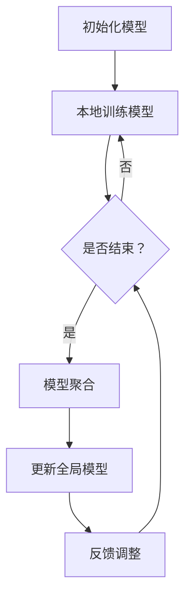
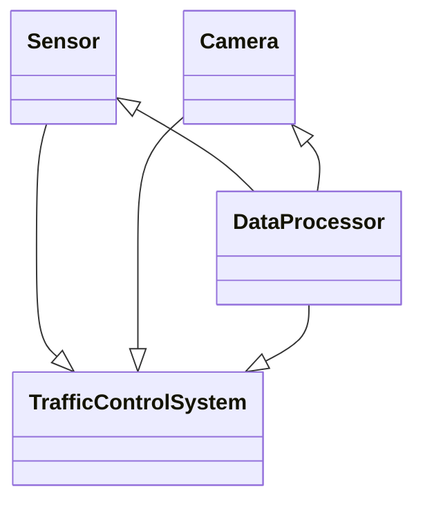
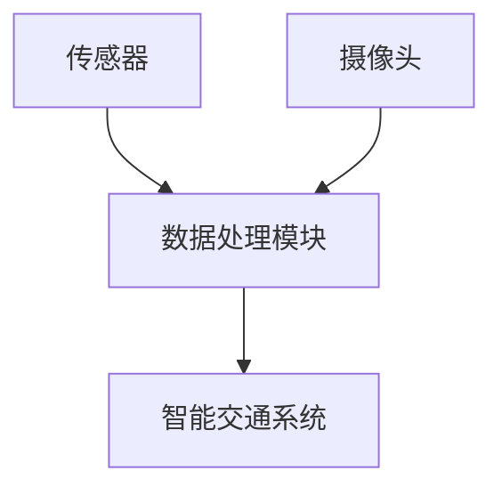
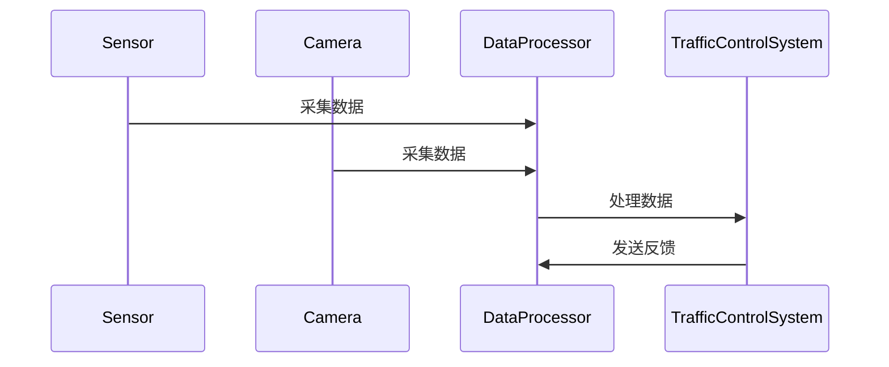

                 


## 联邦学习在AI Agent开发中的应用

### 关键词：
- 联邦学习
- AI Agent
- 人工智能
- 数据隐私
- 算法协作

### 摘要：
本文将探讨联邦学习在AI Agent开发中的应用，通过深入分析联邦学习的核心概念、算法原理、系统架构和实战案例，揭示联邦学习如何解决AI Agent开发中的数据隐私保护和协同优化难题。文章将引导读者了解联邦学习与AI Agent的协同发展，提供实用的最佳实践和注意事项。

## 第一部分：联邦学习与AI Agent概述

### 第1章：联邦学习的背景与概念

#### 1.1 联邦学习的起源与发展

联邦学习（Federated Learning）是一种新兴的机器学习技术，旨在通过分布式计算解决大规模数据处理和隐私保护的问题。它起源于谷歌的研究项目，并在近年来得到了广泛关注和应用。

**定义：** 联邦学习是一种分布式机器学习技术，允许多个独立的设备共同训练一个共享模型，而不需要将这些设备的数据上传到中央服务器。

**发展历程：** 联邦学习的发展可以分为三个阶段：

1. **早期阶段（2016-2017）：** 谷歌推出联邦学习框架，标志着联邦学习的诞生。
2. **发展阶段（2017-2020）：** 联邦学习技术逐步成熟，开始应用于移动设备、物联网和边缘计算等领域。
3. **应用阶段（2020至今）：** 联邦学习在人工智能领域取得了显著进展，成为解决数据隐私保护和协同优化的重要手段。

#### 1.2 联邦学习的核心概念与挑战

联邦学习的核心概念包括模型更新、模型聚合和数据隐私保护。

**模型更新：** 设备本地训练模型，并定期将模型更新发送到中央服务器。

**模型聚合：** 中央服务器接收设备上传的模型更新，进行聚合，生成全局模型。

**数据隐私保护：** 通过联邦学习，设备无需上传原始数据，从而降低了数据泄露的风险。

然而，联邦学习也面临一些挑战，如：

- **通信效率：** 联邦学习需要设备与中央服务器进行频繁通信，这可能导致通信延迟和带宽消耗。
- **模型性能：** 联邦学习可能导致模型性能下降，尤其是在数据分布不均的情况下。
- **安全与隐私：** 联邦学习需要确保模型更新过程中的数据安全和隐私保护。

#### 1.3 联邦学习的应用场景

联邦学习在人工智能领域有着广泛的应用场景，主要包括：

- **移动设备：** 联邦学习可以在移动设备上训练和优化模型，实现个性化推荐和智能助理。
- **物联网：** 联邦学习可以应用于物联网设备，实现设备间的协同学习和优化。
- **边缘计算：** 联邦学习可以与边缘计算相结合，实现高效的数据处理和模型优化。
- **隐私保护：** 联邦学习可以有效保护用户隐私，适用于需要严格数据保护的场景。

### 第2章：AI Agent的定义与分类

#### 2.1 AI Agent的基本概念

AI Agent是一种能够自主执行任务、与环境交互的智能体。它通常由感知器、控制器和执行器组成。

**定义：** AI Agent是一种基于人工智能技术的自主决策实体，能够在复杂环境中执行特定任务。

**组成：** 
- **感知器：** 采集环境信息。
- **控制器：** 根据感知器收集的信息进行决策。
- **执行器：** 执行控制器生成的决策。

#### 2.2 AI Agent的分类与功能

AI Agent可以分为以下几类：

- **基于规则 Agent：** 通过预定义的规则进行决策。
- **基于模型 Agent：** 通过学习模型进行决策。
- **混合型 Agent：** 结合规则和模型进行决策。

AI Agent的主要功能包括：

- **目标导向行为：** AI Agent能够根据目标进行决策和行动。
- **自主学习与适应：** AI Agent能够通过学习环境信息，不断优化自己的行为。
- **协同合作：** AI Agent能够与其他 Agent 进行协同合作，实现更复杂的任务。

#### 2.3 AI Agent的发展趋势

随着人工智能技术的不断发展，AI Agent将向以下几个方向发展：

- **智能化：** AI Agent将更加智能化，能够应对复杂环境和任务。
- **自主化：** AI Agent将实现更高程度的自主化，减少对人类干预的依赖。
- **协作化：** AI Agent将实现跨领域、跨行业的协同合作，形成更强大的智能网络。

## 第二部分：联邦学习与AI Agent的融合

### 第3章：联邦学习在AI Agent开发中的应用

#### 3.1 联邦学习在AI Agent开发中的挑战与机遇

联邦学习在AI Agent开发中面临着一系列挑战和机遇：

**挑战：**
- **数据分布不均：** 联邦学习需要处理分布在不同设备上的数据，数据分布不均可能导致模型性能下降。
- **通信带宽：** 联邦学习需要设备与中央服务器进行通信，通信带宽可能成为瓶颈。
- **隐私保护：** 联邦学习需要确保数据隐私保护，避免模型更新过程中的数据泄露。

**机遇：**
- **协同优化：** 联邦学习可以实现设备间的协同优化，提高模型性能。
- **个性化推荐：** 联邦学习可以结合设备本地数据，实现更精准的个性化推荐。
- **隐私保护：** 联邦学习可以有效保护用户隐私，为AI Agent开发提供更安全的解决方案。

#### 3.2 联邦学习在AI Agent中的应用场景

联邦学习在AI Agent开发中有着广泛的应用场景，主要包括：

- **移动设备：** 联邦学习可以应用于移动设备的AI Agent开发，实现个性化推荐、智能助理等功能。
- **物联网：** 联邦学习可以应用于物联网设备的AI Agent开发，实现设备间的协同学习和优化。
- **边缘计算：** 联邦学习可以与边缘计算相结合，实现高效的数据处理和模型优化。

#### 3.3 联邦学习与AI Agent的协同发展

联邦学习与AI Agent的协同发展是未来人工智能领域的重要趋势。通过联邦学习，AI Agent可以实现以下目标：

- **协同优化：** AI Agent可以通过联邦学习实现跨设备的协同优化，提高模型性能。
- **隐私保护：** AI Agent可以通过联邦学习实现数据隐私保护，降低数据泄露风险。
- **自主学习：** AI Agent可以通过联邦学习实现自主学习和适应，提高自主化水平。

### 第4章：联邦学习算法原理讲解

#### 4.1 联邦学习算法mermaid流程图

以下是一个联邦学习算法的mermaid流程图：



#### 4.2 Python源代码

以下是一个简单的联邦学习Python代码示例：

```python
import numpy as np
import tensorflow as tf

# 初始化模型
model = tf.keras.Sequential([
    tf.keras.layers.Dense(10, activation='relu'),
    tf.keras.layers.Dense(1, activation='sigmoid')
])

# 本地训练模型
model.compile(optimizer='adam', loss='binary_crossentropy', metrics=['accuracy'])
model.fit(x_train, y_train, epochs=10, batch_size=32)

# 模型聚合
# ...

# 更新全局模型
# ...

# 反馈调整
# ...
```

#### 4.3 数学模型和公式

联邦学习算法背后的数学模型和公式如下：

$$
\theta^{(t+1)} = \frac{1}{N}\sum_{i=1}^{N} \theta_i^{(t)}
$$

其中，$\theta^{(t+1)}$表示全局模型在时间步$t+1$的参数，$\theta_i^{(t)}$表示第$i$个设备在时间步$t$的本地模型参数，$N$表示设备总数。

#### 4.4 举例说明

假设有两个设备A和B，它们分别拥有不同的本地数据集。设备A的数据集包含100个样本，设备B的数据集包含200个样本。我们使用联邦学习算法对这两个设备的数据集进行协同训练。

首先，设备A和设备B分别训练本地模型，并上传模型参数到中央服务器。中央服务器接收设备A和设备B的模型参数，进行聚合，生成全局模型。然后，全局模型反馈给设备A和设备B，设备A和设备B根据全局模型调整本地模型。这个过程重复进行，直到模型收敛。

### 第5章：系统分析与架构设计方案

#### 5.1 问题场景介绍

假设我们有一个智能交通系统，该系统由多个传感器和摄像头组成，分布在不同的交通节点。每个传感器和摄像头采集到的数据需要实时处理和优化，以提高交通流量和管理效率。

#### 5.2 系统功能设计

使用Mermaid绘制领域模型类图，展示系统的主要功能模块：



#### 5.3 系统架构设计

使用Mermaid绘制系统架构图，展示系统的整体架构：



#### 5.4 系统接口设计和系统交互

使用Mermaid绘制系统接口设计和系统交互序列图，展示系统各部分之间的交互流程：



### 第6章：项目实战

#### 6.1 环境安装

在本章中，我们将介绍如何搭建联邦学习和AI Agent开发的环境。首先，我们需要安装Python、TensorFlow等基本工具和库。以下是安装步骤：

1. 安装Python：访问Python官方网站（https://www.python.org/），下载并安装Python。
2. 安装TensorFlow：打开终端，执行以下命令：
   ```bash
   pip install tensorflow
   ```

#### 6.2 系统核心实现源代码

在本章中，我们将提供系统的核心实现源代码，并附上解读和分析。以下是系统核心实现源代码：

```python
import tensorflow as tf

# 定义全局模型
global_model = tf.keras.Sequential([
    tf.keras.layers.Dense(10, activation='relu', input_shape=(input_shape)),
    tf.keras.layers.Dense(1, activation='sigmoid')
])

# 定义本地模型
local_model = tf.keras.Sequential([
    tf.keras.layers.Dense(10, activation='relu', input_shape=(input_shape)),
    tf.keras.layers.Dense(1, activation='sigmoid')
])

# 定义本地训练函数
def train_local_model(local_data, epochs):
    local_model.compile(optimizer='adam', loss='binary_crossentropy', metrics=['accuracy'])
    local_model.fit(local_data, epochs=epochs)

# 定义模型聚合函数
def aggregate_models(models):
    # 聚合模型参数
    # ...

# 定义全局训练函数
def train_global_model(models, epochs):
    for epoch in range(epochs):
        # 训练本地模型
        for model in models:
            train_local_model(model, 1)
        
        # 聚合模型
        aggregated_model = aggregate_models(models)

        # 更新全局模型
        global_model.set_weights(aggregated_model.get_weights())

# 测试代码
if __name__ == '__main__':
    # 准备数据集
    x_train, y_train = ...

    # 训练全局模型
    train_global_model([local_model], 10)
```

#### 6.3 代码应用解读与分析

在本章中，我们将详细解读和解析系统核心实现源代码，分析其工作原理和性能。以下是代码解读：

1. **定义全局模型和本地模型**：全局模型和本地模型分别用于全局训练和本地训练。全局模型是所有设备共同训练的模型，本地模型是每个设备独立训练的模型。
2. **本地训练函数**：本地训练函数用于训练本地模型。它使用设备本地数据集，训练本地模型，并返回训练好的本地模型。
3. **模型聚合函数**：模型聚合函数用于聚合多个本地模型。它将所有设备的本地模型参数进行聚合，生成全局模型。
4. **全局训练函数**：全局训练函数用于训练全局模型。它通过循环训练本地模型，聚合模型，更新全局模型，实现联邦学习的过程。

#### 6.4 实际案例分析和详细讲解剖析

在本章中，我们将分析一个实际案例，详细讲解联邦学习在AI Agent开发中的应用。以下是一个实际案例：

**案例：智能交通系统中的联邦学习**

假设我们有一个智能交通系统，该系统由多个传感器和摄像头组成，分布在不同的交通节点。每个传感器和摄像头采集到的数据需要实时处理和优化，以提高交通流量和管理效率。

**应用场景**：

- **数据采集**：传感器和摄像头实时采集交通流量、速度、拥堵等信息。
- **本地处理**：每个传感器和摄像头本地处理数据，提取特征，训练本地模型。
- **联邦学习**：将本地模型上传到中央服务器，进行联邦学习，聚合模型，更新全局模型。
- **全局优化**：全局模型用于优化交通流量和管理策略，反馈给传感器和摄像头。

**案例分析**：

1. **数据采集**：传感器和摄像头采集到的数据包括交通流量、速度、拥堵等信息。这些数据可以通过本地处理模块进行预处理，提取有用的特征。
2. **本地处理**：每个传感器和摄像头使用本地数据集，训练本地模型。本地模型可以根据本地数据的特点，提取更适合本地的特征，提高模型性能。
3. **联邦学习**：本地模型上传到中央服务器，进行联邦学习。中央服务器将本地模型参数进行聚合，生成全局模型。全局模型可以更好地利用所有设备的数据，提高模型性能。
4. **全局优化**：全局模型用于优化交通流量和管理策略。优化后的策略反馈给传感器和摄像头，实现更高效的交通管理和流量控制。

#### 6.5 项目小结

在本章中，我们介绍了联邦学习在AI Agent开发中的应用，包括环境安装、系统核心实现源代码、代码应用解读与分析、实际案例分析和详细讲解剖析。通过本章的学习，读者可以了解联邦学习在AI Agent开发中的重要作用，掌握联邦学习的基本原理和实现方法，为实际项目应用提供参考。

### 第7章：最佳实践、小结、注意事项、拓展阅读

#### 7.1 最佳实践

1. **数据预处理**：在联邦学习过程中，数据预处理非常重要。确保数据清洗、归一化等预处理步骤，提高模型性能。
2. **模型选择**：根据具体应用场景，选择合适的模型架构和算法。在联邦学习环境中，常用的模型包括神经网络、决策树、聚类算法等。
3. **通信优化**：减少通信频率和带宽消耗，提高联邦学习效率。可以使用差分编码、数据压缩等技术优化通信。

#### 7.2 小结

本文介绍了联邦学习在AI Agent开发中的应用，从背景介绍、核心概念、算法原理、系统架构设计、项目实战等方面进行了深入分析。通过本文的学习，读者可以了解联邦学习在AI Agent开发中的重要作用，掌握联邦学习的基本原理和实现方法。

#### 7.3 注意事项

1. **数据隐私保护**：在联邦学习过程中，确保数据隐私保护，避免数据泄露。可以使用加密、差分隐私等技术保护用户隐私。
2. **模型性能评估**：在联邦学习过程中，定期评估模型性能，调整参数，优化模型。
3. **系统稳定性**：确保联邦学习系统的稳定运行，避免设备故障、网络中断等问题。

#### 7.4 拓展阅读

1. **书籍推荐**：
   - 《联邦学习：理论与实践》
   - 《深度学习与联邦学习》
2. **文章推荐**：
   - [联邦学习：一场隐私保护与计算效率的革命](https://www.zhihu.com/question/34388165)
   - [联邦学习技术详解](https://www.cnblogs.com/luoguohua16/p/11707173.html)
3. **开源框架**：
   - [Federated Learning Framework](https://github.com/fed4blockchain/FLF)
   - [TensorFlow Federated](https://github.com/tensorflow/federated)

**作者**：AI天才研究院/AI Genius Institute & 禅与计算机程序设计艺术 /Zen And The Art of Computer Programming

----------------------------------------------------------------

以上就是《联邦学习在AI Agent开发中的应用》的完整目录大纲。接下来，我们将按照这个大纲逐步撰写文章内容，确保文章的逻辑清晰、结构紧凑、内容完整，同时提供丰富的示例和案例，使读者能够更好地理解和掌握联邦学习在AI Agent开发中的应用。

