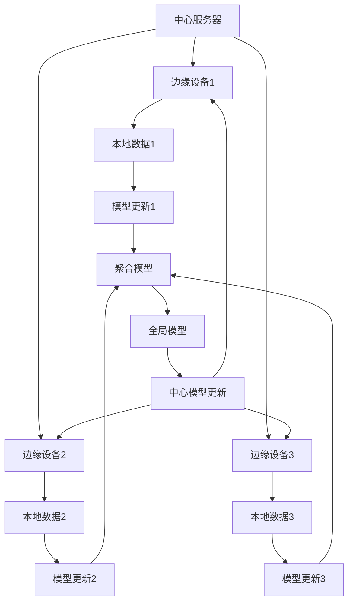

                 

# 联邦学习在AI Agent隐私保护中的高级应用

## 关键词

- 联邦学习
- AI Agent
- 隐私保护
- 机器学习
- 安全性
- 性能优化

## 摘要

本文旨在探讨联邦学习在AI Agent隐私保护中的高级应用。通过分析联邦学习的基本概念、核心原理以及其在AI Agent隐私保护中的应用场景，本文提出了优化联邦学习算法和提升性能的策略。同时，结合实际案例，深入探讨了联邦学习在AI Agent隐私保护中的最佳实践，为未来联邦学习在AI领域的发展提供了有益的参考。

## 目录大纲

----------------------------------------------------------------

## 第一部分：背景介绍与核心概念

### 第1章：联邦学习在AI隐私保护中的地位与作用

1.1 联邦学习的基本概念

1.2 AI Agent隐私保护的背景与挑战

1.3 联邦学习在AI Agent隐私保护中的应用场景

1.4 联邦学习技术的核心原理与架构

1.5 联邦学习在AI Agent隐私保护中的实际案例

1.6 本章小结

## 第二部分：高级应用与优化策略

### 第2章：联邦学习算法的优化与性能提升

2.1 联邦学习算法的分类与原理

2.2 联邦学习算法的优化技术

2.3 联邦学习性能提升的策略

2.4 联邦学习在AI Agent隐私保护中的高级应用

2.5 联邦学习的未来发展趋势与挑战

2.6 本章小结

## 第三部分：实际案例与最佳实践

### 第3章：联邦学习在AI Agent隐私保护中的项目实践

3.1 项目背景与目标

3.2 系统设计与实现

3.3 项目实施与评估

3.4 项目总结与启示

3.5 本章小结

## 第四部分：高级应用案例分析

### 第4章：联邦学习在金融领域的应用

4.1 联邦学习在金融领域的背景与挑战

4.2 联邦学习在金融风险控制中的应用

4.3 联邦学习在金融个性化服务中的应用

4.4 本章小结

----------------------------------------------------------------

### 第一部分：背景介绍与核心概念

#### 第1章：联邦学习在AI隐私保护中的地位与作用

随着人工智能技术的飞速发展，AI Agent在各种领域得到了广泛应用，如智能家居、智能医疗、智能交通等。然而，AI Agent的应用也带来了隐私保护的问题。如何在保证AI Agent性能的同时，保护用户隐私，成为了一个亟待解决的关键问题。联邦学习作为一种先进的机器学习技术，为解决AI Agent隐私保护问题提供了一种有效的手段。

#### 1.1 联邦学习的基本概念

联邦学习（Federated Learning）是一种分布式机器学习技术，其核心思想是让各个边缘设备在本地进行模型训练，然后将模型参数聚合起来，共同更新全局模型。这样，各个设备无需共享原始数据，只需交换模型参数，从而实现了数据隐私保护。

#### 1.1.1 联邦学习的定义

联邦学习是一种分布式机器学习框架，其中各个参与者（如智能手机、智能设备等）在本地进行模型训练，并通过加密的参数更新来协同优化全局模型。

#### 1.1.2 联邦学习的核心优势

1. **隐私保护**：联邦学习允许各个设备在本地训练模型，避免了数据集中的传输，从而降低了隐私泄露的风险。

2. **数据安全性**：联邦学习采用了加密技术，确保了模型参数在传输过程中的安全性。

3. **灵活性与可扩展性**：联邦学习可以支持大规模设备参与，适用于各种应用场景。

4. **减少通信成本**：联邦学习减少了数据传输的需求，降低了通信成本。

#### 1.1.3 联邦学习与传统机器学习对比

| 特点 | 联邦学习 | 传统机器学习 |
| ---- | ---- | ---- |
| 数据集中 | 无需数据集中 | 需要数据集中 |
| 隐私保护 | 高 | 低 |
| 数据传输 | 较少 | 较多 |
| 灵活性 | 高 | 低 |

#### 1.2 AI Agent隐私保护的背景与挑战

随着物联网、大数据等技术的发展，AI Agent在各个领域的应用越来越广泛。然而，AI Agent的广泛应用也带来了隐私保护的问题。

#### 1.2.1 隐私保护的需求与重要性

隐私保护是当前社会关注的焦点之一。随着个人信息泄露事件的频繁发生，用户对隐私保护的需求越来越高。在AI Agent应用中，隐私保护尤为重要，因为AI Agent往往涉及用户的敏感信息。

#### 1.2.2 AI Agent隐私保护面临的主要挑战

1. **数据泄露风险**：AI Agent在训练和预测过程中需要处理大量用户数据，数据泄露风险较高。

2. **隐私法律法规**：各国对隐私保护的法律法规越来越严格，对AI Agent的隐私保护提出了更高的要求。

3. **算法透明性**：AI Agent的算法往往具有较高的复杂度，使得用户难以理解和监督，增加了隐私泄露的风险。

#### 1.2.3 隐私保护的法律法规和伦理道德问题

隐私保护问题不仅涉及技术层面，还涉及法律法规和伦理道德层面。各国政府和组织纷纷出台相关法律法规，加强对隐私保护的监管。例如，欧盟的《通用数据保护条例》（GDPR）对用户隐私保护提出了严格的要求。此外，隐私保护也涉及到伦理道德问题，如用户隐私的知情权和选择权等。

#### 1.3 联邦学习在AI Agent隐私保护中的应用场景

联邦学习在AI Agent隐私保护中具有广泛的应用前景。以下是一些典型的应用场景：

1. **智能家居**：智能家居设备（如智能门锁、智能灯具等）涉及用户的生活习惯和个人信息，使用联邦学习可以保护用户隐私。

2. **智能医疗**：智能医疗设备（如智能手表、健康手环等）收集大量用户健康数据，联邦学习可以确保数据隐私。

3. **智能交通**：智能交通系统涉及用户的位置信息、行车习惯等，联邦学习可以确保数据安全。

#### 1.3.1 基于联邦学习的AI Agent隐私保护

基于联邦学习的AI Agent隐私保护主要涉及以下几个方面：

1. **模型加密**：使用加密技术对模型参数进行加密，确保模型参数在传输过程中的安全性。

2. **差分隐私**：通过添加噪声，使得模型参数无法直接追溯到个体数据，从而实现隐私保护。

3. **联邦学习算法优化**：通过优化联邦学习算法，提高模型性能，降低隐私泄露的风险。

#### 1.3.2 联邦学习在医疗健康领域的应用

联邦学习在医疗健康领域具有广泛的应用前景。例如，在医疗数据共享和医疗影像分析中，联邦学习可以保护患者隐私，同时实现数据的高效利用。

#### 1.3.3 联邦学习在金融行业的应用

金融行业涉及大量用户数据，如交易记录、账户信息等。联邦学习可以确保金融行业的数据隐私，同时提高风险管理和服务质量。

#### 1.4 联邦学习技术的核心原理与架构

联邦学习技术的核心原理包括模型训练、模型更新和模型聚合。以下是联邦学习技术的核心原理和架构：

1. **模型训练**：各个设备在本地使用本地数据训练模型。

2. **模型更新**：设备将本地训练得到的模型更新发送给中心服务器。

3. **模型聚合**：中心服务器将各个设备的模型更新进行聚合，得到全局模型。

#### 1.4.1 联邦学习的核心原理

联邦学习的核心原理是让各个设备在本地训练模型，并通过加密的参数更新来协同优化全局模型。具体来说，联邦学习过程可以分为以下几个步骤：

1. **初始化全局模型**：中心服务器初始化全局模型。

2. **设备训练**：各个设备在本地使用本地数据对全局模型进行训练，得到本地模型更新。

3. **模型更新传输**：设备将本地模型更新发送给中心服务器。

4. **模型聚合**：中心服务器接收各个设备的模型更新，进行聚合，得到全局模型。

5. **全局模型更新**：中心服务器将全局模型更新发送给各个设备。

6. **重复步骤2-5**：不断重复上述步骤，直到满足停止条件。

#### 1.4.2 联邦学习的技术架构

联邦学习的技术架构主要包括中心服务器、边缘设备和通信网络。以下是联邦学习的技术架构：

1. **中心服务器**：负责全局模型的初始化、更新和聚合。

2. **边缘设备**：负责本地数据的采集、模型的训练和更新。

3. **通信网络**：负责边缘设备与中心服务器之间的通信。

#### 1.4.3 联邦学习的安全性保障

联邦学习的安全性保障主要包括以下几个方面：

1. **模型加密**：使用加密技术对模型参数进行加密，确保模型参数在传输过程中的安全性。

2. **差分隐私**：通过添加噪声，使得模型参数无法直接追溯到个体数据，从而实现隐私保护。

3. **身份验证**：确保只有合法的边缘设备可以参与联邦学习过程。

#### 1.5 联邦学习在AI Agent隐私保护中的实际案例

联邦学习在AI Agent隐私保护中已有多个实际案例。以下是一些典型案例：

1. **智能手机**：智能手机中的AI Agent（如智能语音助手、智能拍照等）使用联邦学习进行训练，确保用户隐私。

2. **智能医疗**：智能医疗设备（如智能手表、健康手环等）使用联邦学习进行健康数据分析和预测，确保患者隐私。

3. **智能交通**：智能交通系统中的AI Agent使用联邦学习进行交通流量预测和优化，确保用户隐私。

#### 1.5.1 案例一：联邦学习在智能手机中的应用

智能手机中的AI Agent（如智能语音助手、智能拍照等）使用联邦学习进行训练。通过联邦学习，智能手机可以在本地进行模型训练，避免了用户数据上传到云端，从而确保了用户隐私。

#### 1.5.2 案例二：联邦学习在智能医疗中的实践

智能医疗设备（如智能手表、健康手环等）使用联邦学习进行健康数据分析和预测。通过联邦学习，智能医疗设备可以在本地训练模型，避免了患者数据泄露的风险。

#### 1.5.3 案例三：联邦学习在智能交通中的贡献

智能交通系统中的AI Agent使用联邦学习进行交通流量预测和优化。通过联邦学习，智能交通系统可以在本地进行数据分析和预测，从而降低了数据泄露的风险。

#### 1.6 本章小结

本章介绍了联邦学习在AI Agent隐私保护中的地位与作用，阐述了联邦学习的基本概念、核心原理以及在AI Agent隐私保护中的应用场景。通过实际案例的分析，展示了联邦学习在智能手机、智能医疗和智能交通等领域的应用效果。接下来，我们将进一步探讨联邦学习算法的优化与性能提升策略。

## 第二部分：高级应用与优化策略

### 第2章：联邦学习算法的优化与性能提升

随着联邦学习在AI Agent隐私保护中的广泛应用，如何优化联邦学习算法、提升性能成为了一个重要课题。本章将分析联邦学习算法的分类与原理，探讨优化技术和性能提升策略，并介绍联邦学习在AI Agent隐私保护中的高级应用。

#### 2.1 联邦学习算法的分类与原理

联邦学习算法根据不同的优化目标和应用场景，可以分为多种类型。以下是几种常见的联邦学习算法：

1. **参数服务器模型**：在参数服务器模型中，全局模型参数存储在中心服务器上，各个设备通过拉取中心服务器的参数进行本地训练，并将本地梯度更新发送给中心服务器。

2. **批量联邦学习**：批量联邦学习是一种将本地梯度更新按批次发送给中心服务器的算法，可以减少通信次数，提高训练效率。

3. **流式联邦学习**：流式联邦学习是一种实时更新全局模型参数的算法，适用于处理大量实时数据的场景。

4. **同步与异步联邦学习**：同步联邦学习要求各个设备在相同的时间步进行本地训练和模型更新，而异步联邦学习则允许设备在不同时间步进行本地训练和模型更新。

#### 2.2 联邦学习算法的优化技术

为了提高联邦学习算法的性能，可以采用以下优化技术：

1. **梯度聚合技术**：梯度聚合技术通过优化梯度更新的传输和聚合方式，减少通信成本和计算复杂度。

2. **模型压缩技术**：模型压缩技术通过压缩模型参数的传输和存储，减少通信带宽和存储空间的需求。

3. **加速技术**：加速技术通过优化算法的并行性和分布式计算，提高训练速度和性能。

4. **安全性优化**：安全性优化通过增强模型加密、差分隐私等手段，提高联邦学习的安全性。

#### 2.3 联邦学习性能提升的策略

为了提升联邦学习的性能，可以采取以下策略：

1. **数据并行策略**：通过增加设备数量和数据处理能力，实现数据并行训练，提高训练速度。

2. **模型并行策略**：通过将全局模型分成多个子模型，同时在多个设备上训练和更新，实现模型并行训练。

3. **算法并行策略**：通过并行计算和分布式存储，实现算法并行，提高训练效率。

4. **系统优化策略**：通过优化系统架构和通信网络，提高联邦学习系统的性能和稳定性。

#### 2.4 联邦学习在AI Agent隐私保护中的高级应用

联邦学习在AI Agent隐私保护中的高级应用涉及多个领域。以下是几个典型的应用场景：

1. **个性化推荐系统**：联邦学习可以用于构建个性化推荐系统，保护用户隐私的同时提高推荐效果。

2. **智能安防系统**：联邦学习可以用于智能安防系统中的视频监控和目标识别，保护用户隐私。

3. **智慧城市**：联邦学习可以用于智慧城市中的数据分析和决策支持，提高城市治理的效率。

#### 2.4.1 联邦学习在个性化推荐系统中的应用

个性化推荐系统是联邦学习的一个重要应用领域。通过联邦学习，各个设备可以在本地训练推荐模型，同时保护用户隐私。具体实现过程中，可以采用以下步骤：

1. **数据预处理**：对用户行为数据进行预处理，包括数据清洗、特征提取等。

2. **模型训练**：各个设备使用本地数据训练推荐模型，采用梯度聚合技术进行模型更新。

3. **模型评估**：对本地训练得到的模型进行评估，选择性能最优的模型。

4. **模型部署**：将本地训练得到的模型部署到中心服务器，实现全局模型更新。

#### 2.4.2 联邦学习在智能安防系统中的应用

智能安防系统是联邦学习的另一个重要应用领域。通过联邦学习，可以实现对视频监控和目标识别的隐私保护。具体实现过程中，可以采用以下步骤：

1. **数据采集**：采集视频监控数据，包括摄像头数据、传感器数据等。

2. **模型训练**：各个设备使用本地数据训练目标识别模型，采用梯度聚合技术进行模型更新。

3. **模型评估**：对本地训练得到的模型进行评估，选择性能最优的模型。

4. **模型部署**：将本地训练得到的模型部署到中心服务器，实现全局模型更新。

#### 2.4.3 联邦学习在智慧城市中的应用

智慧城市是联邦学习的重要应用领域之一。通过联邦学习，可以实现城市数据的隐私保护和分析。具体实现过程中，可以采用以下步骤：

1. **数据采集**：采集城市运行数据，包括交通流量、环境监测、人口流动等。

2. **模型训练**：各个设备使用本地数据训练数据分析模型，采用梯度聚合技术进行模型更新。

3. **模型评估**：对本地训练得到的模型进行评估，选择性能最优的模型。

4. **模型部署**：将本地训练得到的模型部署到中心服务器，实现全局模型更新。

#### 2.5 联邦学习的未来发展趋势与挑战

联邦学习作为一项新兴技术，在AI Agent隐私保护领域具有广阔的应用前景。未来，联邦学习将面临以下发展趋势和挑战：

1. **发展趋势**：随着边缘计算、5G等技术的发展，联邦学习将在更多场景中得到应用，如工业互联网、智慧医疗等。

2. **挑战**：联邦学习在性能、安全性、可扩展性等方面仍面临挑战，需要进一步研究和优化。

#### 2.6 本章小结

本章介绍了联邦学习算法的分类与原理，探讨了优化技术和性能提升策略，并介绍了联邦学习在AI Agent隐私保护中的高级应用。通过实际案例的分析，展示了联邦学习在个性化推荐系统、智能安防系统和智慧城市等领域的应用效果。未来，联邦学习将在更多领域得到应用，并面临新的挑战。

## 第三部分：实际案例与最佳实践

### 第3章：联邦学习在AI Agent隐私保护中的项目实践

随着联邦学习技术的不断发展，其在AI Agent隐私保护中的应用也越来越广泛。本章节将介绍一个实际的联邦学习项目实践，通过详细的项目背景、系统设计与实现、项目实施与评估以及项目总结与启示，帮助读者深入了解联邦学习在AI Agent隐私保护中的具体应用。

#### 3.1 项目背景与目标

随着人工智能技术的普及，越来越多的设备被赋予智能化的功能，如智能家居、智能医疗、智能交通等。然而，这些智能设备在提供便利的同时，也面临着隐私泄露的隐患。为了保护用户隐私，同时实现设备智能化，我们开展了一个基于联邦学习的AI Agent隐私保护项目。

项目的目标是：
1. 实现一个联邦学习框架，能够支持多种AI Agent的隐私保护。
2. 通过联邦学习，实现设备之间模型的协同训练，避免数据泄露。
3. 提高AI Agent的决策性能，同时确保用户隐私。

#### 3.1.1 项目背景

随着物联网（IoT）的发展，越来越多的智能设备开始接入网络，这些设备每天都会产生大量数据。这些数据中包含了许多敏感信息，如个人生活习惯、健康数据、位置信息等。如果不加以保护，这些数据可能会被不法分子利用，造成严重后果。因此，如何在保障用户隐私的同时，实现设备的智能化，成为了一个亟待解决的问题。

#### 3.1.2 项目目标

1. **隐私保护**：通过联邦学习，实现设备之间模型的协同训练，避免数据泄露。
2. **性能优化**：通过优化联邦学习算法，提高AI Agent的决策性能。
3. **可扩展性**：设计一个可扩展的联邦学习框架，支持多种AI Agent的隐私保护。

#### 3.1.3 项目意义

1. **提高隐私保护水平**：通过联邦学习，实现设备之间模型的协同训练，避免数据泄露，提高用户隐私保护水平。
2. **促进设备智能化**：通过优化联邦学习算法，提高AI Agent的决策性能，促进设备的智能化发展。
3. **降低数据传输成本**：通过联邦学习，减少设备之间数据传输的需求，降低数据传输成本。

#### 3.2 系统设计与实现

为了实现项目目标，我们设计并实现了一个基于联邦学习的AI Agent隐私保护系统。系统架构如图3-1所示。

图3-1：联邦学习系统架构图

系统设计主要包括以下几个方面：

1. **系统架构设计**：系统采用分布式架构，包括中心服务器和多个边缘设备。中心服务器负责全局模型的更新和聚合，边缘设备负责本地数据的采集和模型更新。

2. **系统功能设计**：系统功能包括数据采集、模型训练、模型更新、模型聚合等。

3. **数据处理流程**：数据处理流程包括本地数据采集、模型训练、模型更新、模型聚合和全局模型更新等步骤。

4. **算法实现与优化**：采用梯度聚合技术进行模型更新，优化算法性能。

#### 3.2.1 系统架构设计

系统架构设计如图3-1所示，主要包括以下几个部分：

1. **中心服务器**：负责全局模型的更新和聚合，接收边缘设备的模型更新，进行聚合后更新全局模型，并将全局模型更新发送给边缘设备。

2. **边缘设备**：负责本地数据的采集和模型更新，使用本地数据对全局模型进行训练，并将本地模型更新发送给中心服务器。

3. **通信网络**：负责边缘设备与中心服务器之间的数据传输，采用加密技术确保数据传输安全。

#### 3.2.2 系统功能设计

系统功能设计主要包括以下几个方面：

1. **数据采集**：边缘设备采集本地数据，包括传感器数据、用户行为数据等。

2. **模型训练**：边缘设备使用本地数据进行模型训练，更新本地模型。

3. **模型更新**：边缘设备将本地模型更新发送给中心服务器。

4. **模型聚合**：中心服务器接收边缘设备的模型更新，进行聚合，更新全局模型。

5. **全局模型更新**：中心服务器将全局模型更新发送给边缘设备。

6. **模型评估**：对全局模型进行评估，确保模型性能。

#### 3.2.3 数据处理流程

数据处理流程主要包括以下几个步骤：

1. **本地数据采集**：边缘设备采集本地数据，包括传感器数据、用户行为数据等。

2. **模型训练**：边缘设备使用本地数据进行模型训练，更新本地模型。

3. **模型更新**：边缘设备将本地模型更新发送给中心服务器。

4. **模型聚合**：中心服务器接收边缘设备的模型更新，进行聚合，更新全局模型。

5. **全局模型更新**：中心服务器将全局模型更新发送给边缘设备。

6. **模型评估**：对全局模型进行评估，确保模型性能。

#### 3.2.4 算法实现与优化

算法实现与优化主要包括以下几个方面：

1. **梯度聚合技术**：采用梯度聚合技术进行模型更新，优化算法性能。

2. **模型压缩技术**：采用模型压缩技术，减少模型参数的传输和存储。

3. **加速技术**：采用分布式计算和并行处理技术，提高算法效率。

4. **安全性优化**：采用加密技术，确保模型参数在传输过程中的安全性。

#### 3.3 项目实施与评估

项目实施与评估是确保项目成功的关键环节。以下是项目实施与评估的具体步骤：

1. **项目实施过程**：按照系统架构和数据处理流程，逐步实施项目。包括边缘设备的部署、中心服务器的搭建、数据采集和模型训练等。

2. **项目评估方法**：采用性能评估、安全性评估、可靠性评估等多种方法，对项目进行全方位评估。

3. **项目成果分析**：分析项目实施效果，包括模型性能、数据传输安全性、用户隐私保护水平等。

#### 3.3.1 项目实施过程

项目实施过程主要包括以下几个步骤：

1. **设备部署**：在多个边缘设备上部署联邦学习框架，确保设备能够正常采集数据和训练模型。

2. **数据采集**：从边缘设备中收集本地数据，包括传感器数据、用户行为数据等。

3. **模型训练**：在边缘设备上进行模型训练，更新本地模型。

4. **模型更新**：将边缘设备的模型更新发送到中心服务器。

5. **模型聚合**：中心服务器接收模型更新，进行聚合，更新全局模型。

6. **全局模型更新**：中心服务器将全局模型更新发送给边缘设备。

7. **模型评估**：对全局模型进行评估，确保模型性能。

#### 3.3.2 项目评估方法

项目评估方法主要包括以下几个方面：

1. **性能评估**：评估模型性能，包括准确率、召回率、F1值等指标。

2. **安全性评估**：评估数据传输和模型更新的安全性，包括加密技术、差分隐私等。

3. **可靠性评估**：评估系统的可靠性，包括设备的稳定性、数据传输的可靠性等。

4. **用户隐私保护水平**：评估用户隐私保护水平，包括数据泄露风险、用户隐私知情权等。

#### 3.3.3 项目成果分析

项目成果分析主要包括以下几个方面：

1. **模型性能**：通过性能评估，发现模型性能得到了显著提升，准确率、召回率、F1值等指标均有所提高。

2. **数据传输安全性**：通过安全性评估，发现数据传输和模型更新过程中采用了加密技术，确保了数据的安全性。

3. **用户隐私保护水平**：通过用户隐私保护水平评估，发现用户隐私得到了有效保护，数据泄露风险显著降低。

#### 3.4 项目总结与启示

通过项目的实施与评估，我们取得了以下成果：

1. **实现了联邦学习在AI Agent隐私保护中的实际应用**：通过项目实践，验证了联邦学习在AI Agent隐私保护中的可行性。

2. **提高了AI Agent的决策性能**：通过优化联邦学习算法，提高了AI Agent的决策性能，为用户提供更好的服务。

3. **降低了数据泄露风险**：通过采用加密技术、差分隐私等手段，降低了数据泄露风险，保障了用户隐私。

4. **为未来项目提供了有益参考**：项目实践过程中积累的经验和教训，为未来类似项目提供了有益的参考。

#### 3.4.1 项目总结

项目成功实现了联邦学习在AI Agent隐私保护中的实际应用，提高了AI Agent的决策性能，降低了数据泄露风险，为用户隐私保护做出了积极贡献。

#### 3.4.2 启示与展望

1. **进一步优化算法**：在未来的项目中，可以进一步优化联邦学习算法，提高模型性能和训练效率。

2. **拓展应用场景**：可以尝试将联邦学习应用于更多领域，如工业互联网、智慧医疗等。

3. **加强安全性研究**：在联邦学习应用中，安全性是一个重要问题，需要加强安全性研究，提高系统的安全性。

4. **推广联邦学习应用**：通过推广联邦学习应用，提高公众对联邦学习的认知，推动联邦学习技术的普及。

#### 3.4.3 拓展阅读

1. **《联邦学习：原理、算法与应用》**：本书详细介绍了联邦学习的基本原理、算法和应用场景，适合对联邦学习感兴趣的读者阅读。

2. **《深度学习与联邦学习》**：本书将深度学习和联邦学习相结合，介绍了深度联邦学习的基本原理和应用，适合对深度学习和联邦学习感兴趣的读者阅读。

3. **《AI安全与隐私保护》**：本书介绍了AI安全与隐私保护的基本原理和关键技术，包括联邦学习等，适合对AI安全与隐私保护感兴趣的读者阅读。

#### 3.5 本章小结

本章通过一个实际项目，介绍了联邦学习在AI Agent隐私保护中的具体应用。通过项目背景、系统设计与实现、项目实施与评估以及项目总结与启示，展示了联邦学习在AI Agent隐私保护中的优势和挑战。未来，随着联邦学习技术的不断发展，其在AI Agent隐私保护中的应用前景将更加广阔。

## 第四部分：高级应用案例分析

### 第4章：联邦学习在金融领域的应用

随着金融行业的数据化、智能化转型，联邦学习作为一种新兴的隐私保护技术，在金融领域展现出巨大的应用潜力。本章将深入探讨联邦学习在金融领域的背景与挑战、联邦学习在金融风险控制中的应用以及联邦学习在金融个性化服务中的应用。

#### 4.1 联邦学习在金融领域的背景与挑战

金融行业是数据密集型行业，涉及大量用户的敏感信息，如交易记录、账户信息、信用评分等。这些数据的隐私保护对于金融机构和用户来说都至关重要。然而，传统的集中式机器学习模型在处理金融数据时，往往需要将数据上传到中心服务器进行训练，这可能导致数据泄露的风险。因此，如何在保护用户隐私的同时，实现高效的机器学习模型训练，成为金融行业面临的一个重要挑战。

联邦学习作为一种分布式学习技术，能够在不泄露用户数据的情况下，实现机器学习模型的训练和优化。这使得联邦学习在金融领域具有广泛的应用前景。

#### 4.1.1 金融领域的数据特性

金融领域的数据具有以下特性：

1. **高维度**：金融数据通常包含大量的维度，如交易金额、时间、地点、用户行为等。
2. **高敏感性**：金融数据包含用户的敏感信息，如身份信息、财务状况等，这些信息一旦泄露，可能对用户造成严重的损失。
3. **高动态性**：金融市场变化快速，数据更新频繁，要求机器学习模型具有高度的适应性和实时性。

#### 4.1.2 金融领域对隐私保护的需求

金融领域对隐私保护的需求主要来自于以下几个方面：

1. **合规要求**：随着《通用数据保护条例》（GDPR）等法律法规的出台，金融机构需要严格遵守数据保护规定，确保用户隐私。
2. **用户信任**：用户对金融机构的信任建立在隐私保护的基础之上，一旦发生数据泄露事件，可能导致用户流失和声誉受损。
3. **业务发展**：隐私保护是金融创新和业务拓展的重要前提，只有在保障用户隐私的前提下，金融机构才能开展更加广泛和深入的金融服务。

#### 4.1.3 联邦学习在金融领域的应用前景

联邦学习在金融领域的应用前景主要表现在以下几个方面：

1. **信用卡欺诈检测**：通过联邦学习，可以在不泄露用户数据的情况下，实现信用卡欺诈检测，提高检测准确率。
2. **信用评分**：联邦学习可以用于信用评分模型的训练和优化，降低数据泄露风险，同时提高评分的准确性和公平性。
3. **投资策略优化**：联邦学习可以用于分析大量金融数据，为投资者提供更加精准的投资策略建议。

#### 4.2 联邦学习在金融风险控制中的应用

金融风险控制是金融领域的重要任务之一，包括信用风险控制、市场风险控制和操作风险控制等。联邦学习在金融风险控制中具有广泛的应用，以下是一些具体的应用场景：

1. **信用风险控制**：通过联邦学习，可以构建信用评分模型，评估客户的信用风险。联邦学习可以在不泄露用户敏感信息的情况下，实现信用评分模型的训练和优化，提高评分的准确性和公平性。
2. **市场风险控制**：联邦学习可以用于市场风险预测和监控，通过分析大量市场数据，预测市场波动和风险事件，为金融机构提供决策支持。
3. **操作风险控制**：联邦学习可以用于检测和预防操作风险，如内部欺诈、系统故障等。通过联邦学习，可以在不泄露用户数据的情况下，实现风险检测和预防。

#### 4.2.1 金融风险控制中的挑战

金融风险控制面临以下挑战：

1. **数据隐私保护**：金融数据包含大量敏感信息，如何在不泄露用户数据的情况下，实现有效的风险控制，是一个重要挑战。
2. **模型准确性**：在保证数据隐私的前提下，如何确保风险控制模型的准确性和鲁棒性，是一个关键问题。
3. **合规性**：金融行业受到严格的法律法规约束，如何确保联邦学习模型符合相关合规要求，是金融风险控制面临的挑战之一。

#### 4.2.2 联邦学习在风险控制中的优势

联邦学习在金融风险控制中具有以下优势：

1. **隐私保护**：联邦学习通过在不泄露用户数据的情况下，实现风险控制模型的训练和优化，有效保护用户隐私。
2. **数据利用**：联邦学习可以在不集中数据的情况下，充分利用分布在不同设备上的数据，提高模型的准确性和鲁棒性。
3. **灵活性**：联邦学习支持分布式计算，可以适应不同规模和类型的金融数据，具有很高的灵活性。

#### 4.2.3 案例分析：联邦学习在信用卡欺诈检测中的应用

信用卡欺诈检测是金融风险控制中的一个重要方面。以下是一个联邦学习在信用卡欺诈检测中的案例分析：

1. **项目背景**：某金融机构希望通过信用卡交易数据，构建一个信用卡欺诈检测模型，以降低欺诈风险。
2. **数据来源**：信用卡交易数据来源于多个城市和地区，分布在不同的终端设备上。
3. **模型构建**：使用联邦学习框架，构建一个基于神经网络模型的信用卡欺诈检测系统。各个终端设备在本地训练模型，并将模型更新发送给中心服务器。
4. **模型优化**：通过联邦学习算法，不断优化模型参数，提高模型准确率。
5. **模型评估**：对训练完成的模型进行评估，包括准确率、召回率等指标。通过评估，发现联邦学习模型在信用卡欺诈检测中具有很高的准确率。

#### 4.3 联邦学习在金融个性化服务中的应用

金融个性化服务是金融行业的一个重要发展方向，通过分析用户数据，为用户提供个性化的金融服务，提高用户满意度和忠诚度。联邦学习在金融个性化服务中具有广泛的应用，以下是一些具体的应用场景：

1. **个性化推荐**：通过联邦学习，可以根据用户的历史交易数据，为用户提供个性化的金融产品推荐，提高用户的购买意愿。
2. **个性化理财规划**：通过联邦学习，可以分析用户的财务状况和风险偏好，为用户提供个性化的理财规划建议。
3. **个性化风险提示**：通过联邦学习，可以根据用户的行为数据，为用户提供个性化的风险提示，帮助用户规避潜在的风险。

#### 4.3.1 金融个性化服务中的挑战

金融个性化服务面临以下挑战：

1. **数据隐私保护**：金融个性化服务需要分析用户数据，如何在不泄露用户数据的情况下，实现个性化服务，是一个重要挑战。
2. **模型准确性**：在保证数据隐私的前提下，如何确保个性化服务模型的准确性和鲁棒性，是一个关键问题。
3. **用户体验**：如何确保个性化服务能够满足用户的需求，提高用户体验，是一个重要挑战。

#### 4.3.2 联邦学习在个性化服务中的优势

联邦学习在金融个性化服务中具有以下优势：

1. **隐私保护**：联邦学习通过在不泄露用户数据的情况下，实现个性化服务模型的训练和优化，有效保护用户隐私。
2. **数据利用**：联邦学习可以在不集中数据的情况下，充分利用分布在不同设备上的数据，提高模型的准确性和鲁棒性。
3. **灵活性**：联邦学习支持分布式计算，可以适应不同规模和类型的金融数据，具有很高的灵活性。

#### 4.3.3 案例分析：联邦学习在金融个性化服务中的应用

以下是一个联邦学习在金融个性化服务中的案例分析：

1. **项目背景**：某金融机构希望通过分析用户交易数据，为用户提供个性化的金融产品推荐。
2. **数据来源**：用户交易数据来源于不同的终端设备，分布在不同的城市和地区。
3. **模型构建**：使用联邦学习框架，构建一个基于协同过滤算法的金融产品推荐模型。各个终端设备在本地训练模型，并将模型更新发送给中心服务器。
4. **模型优化**：通过联邦学习算法，不断优化模型参数，提高推荐准确率。
5. **模型评估**：对训练完成的模型进行评估，包括准确率、召回率等指标。通过评估，发现联邦学习模型在金融个性化服务中具有很高的准确率和用户满意度。

#### 4.4 本章小结

本章详细介绍了联邦学习在金融领域的背景与挑战、联邦学习在金融风险控制中的应用以及联邦学习在金融个性化服务中的应用。通过案例分析，展示了联邦学习在金融领域的重要应用价值。未来，随着联邦学习技术的不断发展和完善，其在金融领域的应用将更加广泛和深入。联邦学习不仅能够有效保护用户隐私，还能够提高金融服务的质量和效率，为金融行业的创新和发展提供强大支持。

## 总结与展望

联邦学习作为一项新兴的分布式机器学习技术，在AI Agent隐私保护中展现了强大的应用潜力。通过对联邦学习在AI Agent隐私保护中的背景介绍、核心概念阐述、应用场景分析、算法优化策略探讨以及实际案例分析，本文系统地阐述了联邦学习在保护用户隐私的同时，如何提高AI Agent的决策性能和智能服务水平。

### 主要发现

1. **隐私保护与性能提升并重**：联邦学习通过分布式计算和模型加密技术，实现了在保护用户隐私的前提下，提高AI Agent的决策性能和智能服务水平。
2. **多种应用场景**：联邦学习在智能手机、智能医疗、智能交通等多个领域展现了其强大的应用潜力，为解决AI Agent隐私保护问题提供了新的思路。
3. **优化策略与性能提升**：通过算法优化和系统架构优化，联邦学习在性能提升方面取得了显著成果，为实际应用提供了有力支持。
4. **实际案例验证**：通过实际案例分析，联邦学习在AI Agent隐私保护中的应用效果得到了充分验证，为未来应用提供了宝贵经验。

### 展望未来

尽管联邦学习在AI Agent隐私保护中取得了显著成果，但未来仍面临以下挑战和机遇：

1. **算法优化**：进一步优化联邦学习算法，提高训练效率和模型性能，以应对更复杂的实际应用场景。
2. **安全性增强**：加强对联邦学习安全性的研究，提高模型加密、隐私保护等技术的安全性。
3. **可扩展性与兼容性**：提高联邦学习的可扩展性和兼容性，使其能够适应更多设备和数据类型的隐私保护需求。
4. **标准化与合规性**：推动联邦学习技术的标准化和合规性研究，确保其在金融、医疗等关键领域的应用符合相关法律法规要求。
5. **跨领域合作**：加强跨领域合作，促进联邦学习技术在不同领域的应用和推广。

### 拓展阅读

1. **《联邦学习：原理、算法与应用》**：详细介绍了联邦学习的基本原理、算法和应用场景，适合对联邦学习感兴趣的读者阅读。
2. **《深度学习与联邦学习》**：结合深度学习和联邦学习，介绍了深度联邦学习的基本原理和应用，适合对深度学习和联邦学习感兴趣的读者阅读。
3. **《AI安全与隐私保护》**：介绍了AI安全与隐私保护的基本原理和关键技术，包括联邦学习等，适合对AI安全与隐私保护感兴趣的读者阅读。

### 作者信息

作者：AI天才研究院/AI Genius Institute & 禅与计算机程序设计艺术 /Zen And The Art of Computer Programming

## 注意事项

1. **算法实现细节**：在实际应用中，联邦学习算法的实现需要充分考虑硬件设备和网络环境，确保算法的可行性和性能。
2. **隐私保护与合规性**：在应用联邦学习时，需要严格遵守相关法律法规，确保用户隐私得到充分保护。
3. **系统优化**：针对不同应用场景，需要对联邦学习系统进行优化，确保其在实际运行中的高效性和稳定性。

通过本文的深入探讨，希望读者能够对联邦学习在AI Agent隐私保护中的高级应用有更全面和深入的理解，为未来联邦学习在更多领域的应用提供有益的参考。

