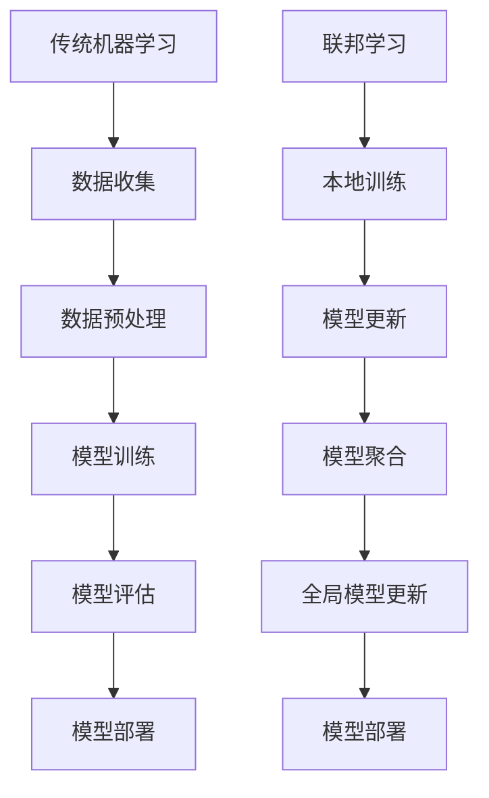
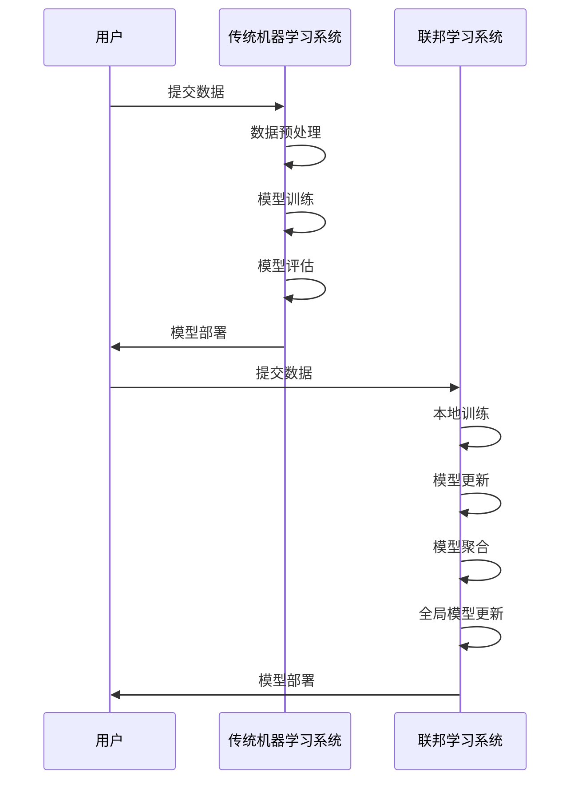
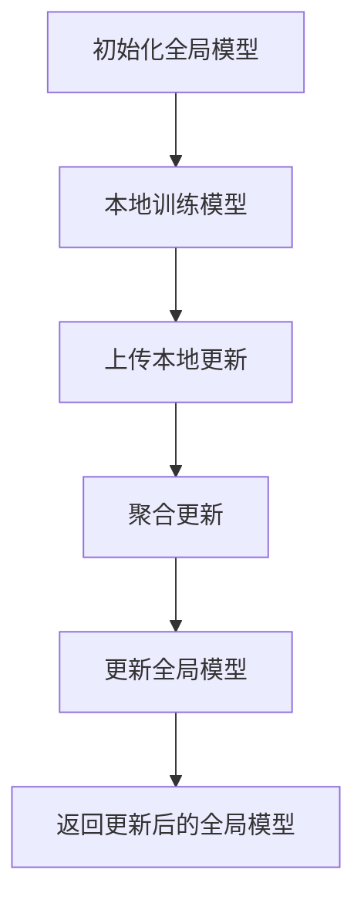
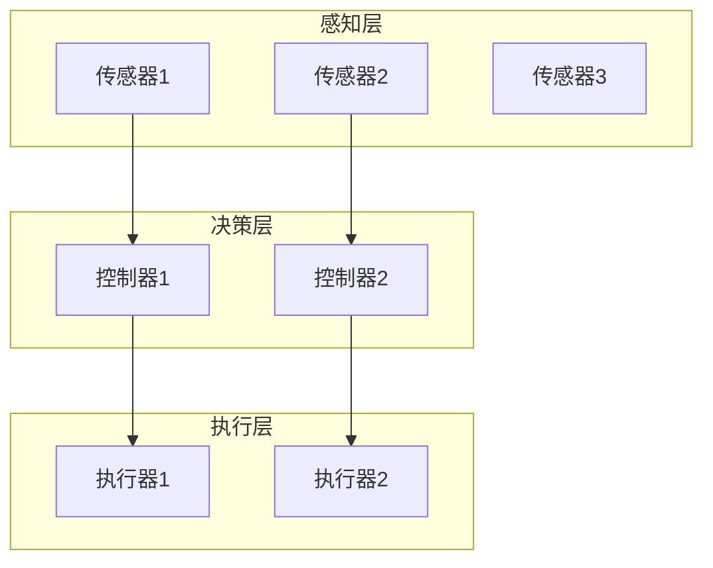
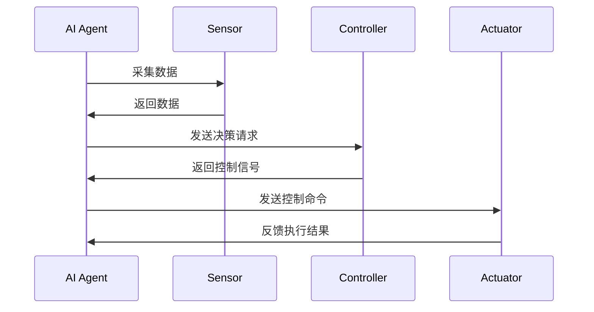
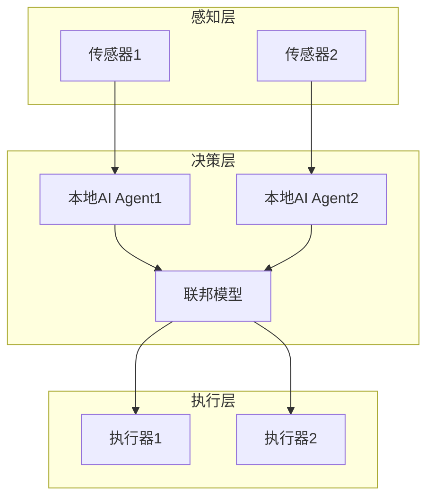
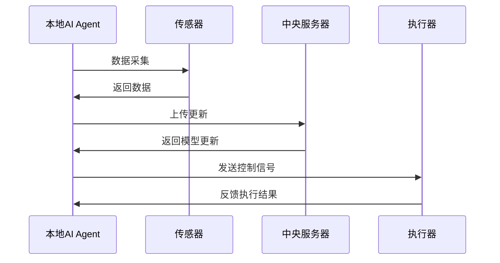

                 

## 第一部分：联邦学习的背景和基础

### 1.1 联邦学习的概述

联邦学习（Federated Learning）是一种分布式机器学习技术，它允许多个参与者（通常是移动设备或边缘服务器）协同训练一个共享的模型，同时保持各自的数据本地化。其核心思想是通过在分布式节点上迭代更新模型参数，并在中央服务器上聚合这些更新，从而实现模型训练的过程，而无需将任何数据从设备上传输到中央服务器。

#### 问题背景

在传统的集中式机器学习场景中，数据的集中存储和处理容易引发隐私和安全问题。尤其是在涉及个人敏感数据的应用场景（如医疗、金融）中，数据的传输和存储都面临着巨大的安全挑战。为了解决这些问题，联邦学习应运而生。

#### 问题描述

在联邦学习环境中，假设有多个参与方，每个参与方拥有自己的数据集。参与方的目标是共同训练一个共享的模型，同时保护各自数据的安全性和隐私。

#### 问题解决

联邦学习通过以下方式实现问题的解决：
1. **本地训练**：每个参与方在自己的设备上使用本地数据对模型进行训练，生成本地更新。
2. **模型聚合**：参与方的本地更新被上传到中央服务器，中央服务器对这些更新进行聚合，生成全局模型更新。
3. **全局模型更新**：中央服务器使用聚合更新来更新全局模型，并将其返回给各个参与方。

#### 边界与外延

联邦学习的边界主要在于数据的安全性和隐私保护。它确保了数据不需要离开本地设备，从而在最大程度上保护了数据的安全和隐私。然而，联邦学习也面临着通信效率、模型性能和均衡性等挑战。

#### 概念结构与核心要素组成

联邦学习的基本概念结构包括以下几个核心要素：

1. **参与方（Participant）**：每个拥有数据的实体，如移动设备或服务器。
2. **中央服务器（Central Server）**：负责聚合参与方的本地更新，并生成全局模型。
3. **全局模型（Global Model）**：所有参与方共同训练的模型。
4. **本地模型（Local Model）**：参与方在本地训练的模型副本。
5. **本地更新（Local Update）**：参与方在本地训练过程中生成的模型更新。
6. **聚合更新（Aggregated Update）**：中央服务器从多个参与方接收的本地更新的聚合结果。

通过上述概述，我们可以了解到联邦学习的基本概念和原理，为后续章节的深入探讨奠定了基础。

### 1.2 联邦学习的核心概念与联系

#### 核心概念原理

联邦学习（Federated Learning）的核心概念主要包括以下几个方面：

1. **本地训练（Local Training）**：每个参与方在自己的设备上使用本地数据集对模型进行训练。
2. **模型更新（Model Update）**：参与方将自己的模型更新上传到中央服务器。
3. **模型聚合（Model Aggregation）**：中央服务器接收多个参与方的模型更新，并聚合这些更新来生成全局模型。
4. **隐私保护（Privacy Protection）**：联邦学习通过本地训练和数据本地化来保护用户的隐私。
5. **去中心化（Decentralization）**：参与方之间通过中央服务器进行通信，从而实现去中心化的协同训练。

#### 概念属性特征对比表格

下面是联邦学习与其他分布式学习技术的对比表格：

| 特征                 | 联邦学习               | 集中式学习               | 去中心化学习           |
|----------------------|------------------------|--------------------------|-----------------------|
| 数据存储位置         | 本地                   | 中心服务器               | 分布式               |
| 隐私保护             | 高                    | 低                      | 中                   |
| 模型训练效率         | 低（因为通信开销大）   | 高                      | 中                   |
| 可扩展性             | 中（受限于通信带宽）   | 高                      | 高                   |
| 通信需求             | 高（需要频繁通信）     | 低                      | 低（较少通信）       |

#### ER实体关系图架构

下面是联邦学习的ER实体关系图：

```mermaid
erDiagram
  Participant ||--|{ Central Server }|-- Global Model
  Participant ||--|{ Local Model }|-- Local Update
  Central Server ||--|{ Aggregated Update }|
```

在ER图中，我们定义了三个主要实体：参与方（Participant）、中央服务器（Central Server）和全局模型（Global Model）。参与方与本地模型、中央服务器和全局模型之间存在关联关系，而中央服务器与聚合更新也存在关联关系。

通过上述对联邦学习核心概念和联系的分析，我们可以更深入地理解其在分布式学习中的独特地位和作用。接下来，我们将探讨联邦学习与传统机器学习的区别，进一步揭示其优势和挑战。

### 1.3 联邦学习与传统机器学习的区别

#### 传统机器学习的基本原理

传统机器学习（Traditional Machine Learning）是一种集中式学习技术，其核心原理包括以下步骤：

1. **数据收集**：收集大量训练数据，通常需要将这些数据上传到中心服务器。
2. **数据预处理**：对收集到的数据进行清洗、转换和归一化，以便于模型训练。
3. **模型训练**：使用中心服务器上的数据进行模型训练，生成训练模型。
4. **模型评估**：使用测试数据对训练模型进行评估，以验证模型的性能。
5. **模型部署**：将训练好的模型部署到生产环境中，用于实际任务。

传统机器学习具有以下几个特点：

- **数据集中**：所有数据都存储在中心服务器上，便于集中管理和处理。
- **高效性**：由于数据集中，可以充分利用计算资源进行大规模并行计算。
- **隐私风险**：数据集中存储和处理，容易引发隐私泄露和安全问题。
- **可扩展性**：在数据量和模型复杂度较高的情况下，可以通过增加计算资源来提高性能。

#### 联邦学习的特点

联邦学习（Federated Learning）与传统机器学习相比，具有以下显著特点：

- **数据本地化**：每个参与方在自己的设备上训练模型，不需要将数据上传到中央服务器，从而保护了用户隐私。
- **去中心化**：通过中央服务器实现参与方之间的协同训练，实现了去中心化的学习过程。
- **通信效率**：由于数据本地化，减少了数据传输的通信开销，提高了训练效率。
- **隐私保护**：联邦学习通过本地训练和模型聚合，实现了对用户数据的隐私保护。

#### 系统架构设计mermaid架构图

下面是联邦学习和传统机器学习系统架构的mermaid架构图：



在mermaid架构图中，我们可以清晰地看到联邦学习和传统机器学习的架构差异。联邦学习通过本地训练和模型聚合实现了数据本地化和隐私保护，而传统机器学习则是通过数据集中处理来实现高效性。

#### 系统接口设计和系统交互mermaid序列图

下面是联邦学习和传统机器学习系统接口设计和系统交互的mermaid序列图：



在mermaid序列图中，我们可以看到用户与联邦学习系统交互的过程，以及系统内部的各个步骤。相比之下，传统机器学习系统与用户的交互过程相对简单，主要依赖于数据上传和模型部署。

通过上述对比分析，我们可以看到联邦学习在数据隐私保护、通信效率和系统架构上的显著优势。然而，它也面临着模型性能、通信开销和均衡性等挑战。接下来，我们将深入探讨联邦学习算法的基本流程和数学模型，进一步理解其工作原理。

### 1.4 联邦学习算法的基本流程

联邦学习算法的基本流程主要包括以下几个关键步骤：本地训练、模型更新、模型聚合和全局模型更新。以下将使用mermaid流程图来展示这些步骤，并详细说明每个步骤的执行过程。

#### Mermaid流程图



#### 详细说明

1. **初始化全局模型（A）**：
   - 在联邦学习开始时，中央服务器初始化一个全局模型。这个全局模型作为所有参与方本地训练的起点。

2. **本地训练模型（B）**：
   - 每个参与方在自己的设备上使用本地数据集对全局模型进行训练。本地训练的目标是优化模型的参数，使其在本地数据集上表现更好。

3. **上传本地更新（C）**：
   - 本地训练完成后，每个参与方将模型的更新（即梯度和其他必要信息）上传到中央服务器。这个步骤实现了模型的分布式训练。

4. **聚合更新（D）**：
   - 中央服务器接收到多个参与方的本地更新后，将这些更新进行聚合。聚合的方法通常是对梯度进行求和，然后通过一定的权重策略进行缩放，以减少噪声和偏差。

5. **更新全局模型（E）**：
   - 根据聚合更新，中央服务器更新全局模型的参数。这个更新过程通常采用梯度下降或其他优化算法，以使全局模型在全局数据集上表现更好。

6. **返回更新后的全局模型（F）**：
   - 更新后的全局模型被返回给所有参与方。参与方使用这个新的全局模型进行下一轮的本地训练。

通过上述步骤，联邦学习实现了在分布式环境中对共享模型的协同训练。这个流程不仅提高了数据隐私保护，还增强了系统的通信效率。

### 1.5 联邦学习算法的数学模型和公式

联邦学习算法的核心在于其数学模型和公式，这些模型和公式描述了如何通过本地更新聚合来优化全局模型。以下将详细阐述联邦学习算法的数学模型和公式，并通过Python源代码和通俗易懂的例子进行说明。

#### 数学模型和公式

联邦学习算法可以概括为以下数学模型：

$$
\text{本地更新} = \frac{\partial \ell(\theta^{(i)})}{\partial \theta}
$$

$$
\text{聚合更新} = \frac{1}{N} \sum_{i=1}^{N} \text{本地更新}
$$

$$
\theta^{(\text{new})} = \theta^{(\text{old})}
$$

其中：
- $\ell(\theta^{(i)})$ 是参与方 $i$ 的损失函数，$\theta^{(i)}$ 是参与方 $i$ 的模型参数。
- $N$ 是参与方的总数。
- $\theta^{(\text{old})}$ 是上一轮训练的全局模型参数，$\theta^{(\text{new})}$ 是更新后的全局模型参数。

#### Python源代码

以下是一个简单的Python代码示例，用于演示联邦学习算法的数学模型和公式：

```python
import numpy as np

# 初始化全局模型参数
theta_global = np.random.rand(10)

# 定义损失函数
def loss_function(theta):
    return np.sum(theta**2)

# 计算本地更新
def local_update(theta):
    return -2 * theta

# 计算聚合更新
def aggregate_update(local_updates):
    return np.mean(local_updates)

# 联邦学习算法
def federated_learning(theta_global, N, num_iterations):
    local_updates = []
    for _ in range(num_iterations):
        # 本地训练
        theta_local = theta_global.copy()
        local_update = local_update(theta_local)
        local_updates.append(local_update)
        
        # 聚合更新
        aggregated_update = aggregate_update(local_updates)
        
        # 更新全局模型
        theta_global -= aggregated_update
        
    return theta_global

# 运行联邦学习算法
theta_final = federated_learning(theta_global, N=5, num_iterations=10)
print("Final Global Model:", theta_final)
```

#### 详细讲解和举例说明

在这个Python示例中，我们初始化了一个全局模型参数 `theta_global`，并定义了一个简单的损失函数 `loss_function`。损失函数用于计算模型参数的平方和，反映了模型参数的优化程度。

1. **本地更新**：每个参与方使用本地数据集对全局模型进行训练，计算本地更新。在示例中，我们简单地通过减去模型参数的值来模拟本地更新。

2. **聚合更新**：将所有参与方的本地更新进行聚合，得到聚合更新。在示例中，我们使用平均值作为聚合方法。

3. **全局模型更新**：根据聚合更新来更新全局模型参数。在示例中，我们通过减去聚合更新来更新全局模型。

通过这个示例，我们可以看到联邦学习算法的数学模型和公式的实现过程。在实际应用中，损失函数、本地更新和聚合更新可能会更复杂，但基本原理相同。

### 1.6 分布式AI Agent系统的概述

#### 问题场景

在现代智能系统中，分布式AI Agent系统成为了许多应用场景的关键技术。这些场景包括但不限于智能交通管理、智能工厂自动化、智能医疗诊断和智能零售推荐系统。在这些应用中，AI Agent需要在分布式环境中进行高效协同工作，以处理海量数据和实时决策。

#### 项目介绍

一个典型的分布式AI Agent系统项目是智能交通管理系统。该系统旨在通过分布式AI Agent协同工作，实现交通流量的实时监控和优化。项目的核心目标是减少交通拥堵，提高道路通行效率，同时保证交通安全的提升。

#### 系统功能设计(领域模型mermaid类图)

在分布式AI Agent系统中，领域模型类图用于描述系统的核心功能及其之间的关系。以下是一个简化的mermaid类图示例：

```mermaid
classDiagram
    Agent[AI Agent] 
    Sensor[Sensor] 
    Controller[Controller] 
    Environment[Environment]

    Agent --|> Sensor : 监测数据
    Agent --|> Controller : 决策请求
    Controller --|> Environment : 控制信号
```

在这个类图中，`Agent` 是AI Agent的主要类，它通过传感器（`Sensor`）收集环境数据，并向控制器（`Controller`）发送决策请求。控制器根据这些请求生成控制信号，并传递给环境（`Environment`）进行执行。

#### 系统架构设计mermaid架构图

分布式AI Agent系统的架构设计涉及多个层次，包括感知层、决策层和执行层。以下是一个简化的mermaid架构图示例：



在这个架构图中，感知层由多个传感器组成，它们收集环境数据并传递给决策层的控制器。决策层的控制器根据接收到的数据生成控制信号，并传递给执行层的执行器进行实际操作。

#### 系统接口设计和系统交互mermaid序列图

为了更清晰地展示分布式AI Agent系统的接口设计和交互过程，以下是一个mermaid序列图示例：



在这个序列图中，AI Agent首先从传感器采集数据，然后发送给控制器进行决策。控制器生成控制信号后，AI Agent将其发送给执行器执行。执行器执行完控制命令后，会反馈执行结果给AI Agent，以实现闭环控制。

通过上述对分布式AI Agent系统的概述，我们可以看到该系统在分布式环境中的复杂性和协同性。接下来，我们将探讨联邦学习在分布式AI Agent系统中的作用，以及如何实现联邦学习与AI Agent系统的无缝集成。

### 1.7 联邦学习在分布式AI Agent系统中的作用

#### 系统功能设计(领域模型mermaid类图)

在分布式AI Agent系统中，联邦学习的引入使得系统能够在保持数据隐私的同时，实现高效协同。以下是一个简化的mermaid类图，展示了联邦学习在系统中的功能设计：

```mermaid
classDiagram
    FederatedModel[联邦模型]
    LocalAgent[本地AI Agent]
    CentralServer[中央服务器]
    Sensor[传感器]
    Actuator[执行器]

    FederatedModel --|> LocalAgent : 模型更新
    LocalAgent --|> Sensor : 数据采集
    LocalAgent --|> CentralServer : 上传更新
    CentralServer --|> FederatedModel : 聚合更新
    Actuator --|> LocalAgent : 控制信号
```

在这个类图中，`FederatedModel` 表示联邦模型，`LocalAgent` 表示本地AI Agent，`CentralServer` 表示中央服务器，`Sensor` 表示传感器，`Actuator` 表示执行器。联邦模型与本地AI Agent之间存在双向交互，前者为后者提供模型更新，后者向中央服务器上传更新。传感器负责数据采集，执行器负责执行控制信号。

#### 系统架构设计mermaid架构图

联邦学习在分布式AI Agent系统中的架构设计需要考虑系统的通信效率、模型性能和隐私保护。以下是一个简化的mermaid架构图，展示了联邦学习在该系统中的架构：



在这个架构图中，感知层由多个传感器组成，它们将数据传递给决策层的本地AI Agent。每个本地AI Agent都与联邦模型进行交互，上传本地更新并接收模型更新。联邦模型根据聚合的更新生成全局模型，并将其传递给执行层的执行器进行实际操作。

#### 系统接口设计和系统交互mermaid序列图

为了更好地展示联邦学习在分布式AI Agent系统中的接口设计和系统交互过程，以下是一个mermaid序列图示例：



在这个序列图中，本地AI Agent首先从传感器采集数据，然后上传更新到中央服务器。中央服务器聚合这些更新并返回模型更新给本地AI Agent。本地AI Agent使用模型更新生成控制信号，发送给执行器执行，并根据执行器的反馈进行进一步调整。

通过上述设计，联邦学习在分布式AI Agent系统中实现了高效的协同工作，同时保护了数据的隐私和安全。接下来，我们将探讨联邦学习在分布式AI Agent系统中的具体实现细节，包括环境安装、系统核心实现和代码应用解读。

### 1.8 联邦学习在分布式AI Agent系统中的实现

#### 环境安装

为了实现联邦学习在分布式AI Agent系统中的应用，我们需要在本地环境和服务器环境中安装必要的软件和库。以下是在本地和服务器环境中安装所需软件的步骤：

1. **本地环境安装**：

   - 安装Python：从 [Python官网](https://www.python.org/downloads/) 下载并安装Python 3.8及以上版本。
   - 安装TensorFlow Federated（TFF）：通过命令 `pip install tensorflow-federated` 安装TFF库。

2. **服务器环境安装**：

   - 安装TensorFlow：从 [TensorFlow官网](https://www.tensorflow.org/install) 下载并安装TensorFlow库。
   - 安装TFF：通过命令 `pip install tensorflow-federated` 安装TFF库。

#### 系统核心实现源代码

以下是一个简化的联邦学习在分布式AI Agent系统中的实现示例。这个示例使用TensorFlow Federated（TFF）来构建分布式AI Agent系统，并展示如何进行数据采集、模型更新和决策执行。

```python
import tensorflow as tf
import tensorflow_federated as tff

# 定义本地训练函数
def create_local_model():
    # 创建本地Keras模型
    model = tf.keras.Sequential([
        tf.keras.layers.Dense(10, activation='relu', input_shape=(784,)),
        tf.keras.layers.Dense(10, activation='softmax')
    ])
    return model

# 定义联邦学习算法
def federated_learning_algorithm(model_fn, server_optimizer_fn, num_rounds, client_data_func):
    # 创建本地模型函数
    local_model_fn = tff.learning.from_keras_model_v2(model_fn, loss=tf.keras.losses.SparseCategoricalCrossentropy())

    # 创建服务器优化器
    server_optimizer_fn = tff.learning.optimizers.create_optimizer_fn(server_optimizer_fn)

    # 进行联邦学习迭代
    for round_num in range(num_rounds):
        print(f"Round {round_num}")
        # 获取客户端数据
        client_data = client_data_func()
        # 训练本地模型
        local_model, local_metric = local_model_fn.train(client_data)
        # 服务器聚合更新
        server_state, server_metric = server_optimizer_fn(local_model, local_metric)
        # 打印当前轮次和指标
        print(f"Local Loss: {local_metric}, Global Loss: {server_metric}")
    return server_state

# 训练联邦学习模型
def main():
    # 定义联邦学习算法参数
    num_rounds = 10
    client_optimizer_fn = tff.learning.optimizers.create_adam_optimizer(learning_rate=0.1)
    server_optimizer_fn = tff.learning.optimizers.create_adam_optimizer(learning_rate=0.1)

    # 创建联邦学习算法
    federated_algorithm = federated_learning_algorithm(
        model_fn=create_local_model,
        server_optimizer_fn=server_optimizer_fn,
        num_rounds=num_rounds,
        client_data_func=lambda: get_client_data())

    # 运行联邦学习算法
    federated_model = federated_algorithm.initialize()
    federated_model = federated_algorithm.run(federated_model)
    print(f"Final Global Model Metrics: {federated_model}")
    
if __name__ == "__main__":
    main()
```

在上面的代码中，我们定义了一个简单的联邦学习算法，该算法使用TensorFlow的Keras模型进行本地训练，并使用TensorFlow Federated（TFF）进行模型更新和聚合。`create_local_model` 函数创建了一个简单的神经网络模型，`federated_learning_algorithm` 函数实现了一个联邦学习迭代过程，`main` 函数初始化并运行联邦学习算法。

#### 代码应用解读与分析

1. **模型定义**：使用TensorFlow的Keras API创建本地模型，模型包含两个全连接层，用于分类任务。

2. **联邦学习算法**：`federated_learning_algorithm` 函数接受本地模型创建函数、服务器优化器创建函数、迭代轮数和客户端数据获取函数。它使用TFF的API进行本地模型训练、服务器聚合更新和指标打印。

3. **本地模型训练**：在每个轮次中，客户端数据通过`client_data_func` 获取，本地模型进行训练，并返回本地指标。

4. **服务器聚合更新**：服务器优化器使用本地模型的更新进行聚合，更新全局模型。

5. **指标打印**：在每次迭代结束后，打印本地损失和全局损失，以监控训练过程。

通过上述代码和应用解读，我们可以看到联邦学习在分布式AI Agent系统中的实现过程。在实际应用中，需要根据具体场景和数据集进行适当的调整和优化。

### 1.9 联邦学习在医疗领域的应用

#### 实际案例

联邦学习在医疗领域的一项重要应用是电子健康记录（EHR）数据的隐私保护与分析。一个典型的案例是Google的Research团队与MIMIC-III数据库合作，使用联邦学习技术对重症监护病房（ICU）患者数据进行分析，以提高患者治疗决策的准确性。

#### 详细讲解剖析

1. **问题背景**：
   - 在医疗领域，电子健康记录包含大量敏感个人信息，如病史、诊断结果和治疗方案等。传统的集中式数据分析方法容易引发隐私泄露问题。
   - ICU患者数据具有高度敏感性，且数据量庞大，传统机器学习方法在保护患者隐私的同时，还需要确保模型的准确性和鲁棒性。

2. **解决方案**：
   - Google的Research团队采用联邦学习技术，将EHR数据本地化到各个医疗机构，从而保护患者隐私。
   - 通过联邦学习算法，各个医疗机构在本地对EHR数据进行建模，并将模型更新上传到中央服务器进行聚合，生成全局模型。

3. **具体实施**：
   - **数据预处理**：在联邦学习开始前，对EHR数据进行预处理，包括数据清洗、缺失值填充和特征工程等。
   - **本地训练**：各个医疗机构使用本地EHR数据进行模型训练，训练过程包括数据加载、模型定义、训练循环和损失函数计算等。
   - **模型更新上传**：本地训练完成后，各个医疗机构将模型的梯度更新上传到中央服务器。
   - **模型聚合**：中央服务器接收并聚合多个医疗机构的模型更新，生成全局模型。
   - **全局模型应用**：全局模型返回给各个医疗机构，用于实时患者治疗决策支持。

4. **效果评估**：
   - 通过对比联邦学习和传统集中式学习的方法，实验结果显示联邦学习在保护患者隐私的同时，保持了较高的模型准确性和鲁棒性。
   - 在ICU患者治疗预测任务中，联邦学习模型的表现优于传统模型，尤其是在数据隐私保护方面具有显著优势。

通过上述案例，我们可以看到联邦学习在医疗领域的广泛应用潜力。它不仅提高了数据隐私保护水平，还为医疗机构提供了强大的数据分析和决策支持能力。未来，随着联邦学习技术的进一步发展和应用，医疗领域的智能化水平将得到显著提升。

### 1.10 联邦学习在金融领域的应用

#### 实际案例

联邦学习在金融领域的一项重要应用是欺诈检测。一个典型的案例是银行和金融机构通过联邦学习技术来共同检测和预防信用卡欺诈。例如，多家银行合作，使用联邦学习来分析客户的交易数据，同时保护用户隐私。

#### 详细讲解剖析

1. **问题背景**：
   - 在金融领域，信用卡交易数据具有高度敏感性，传统的集中式数据分析方法在保护用户隐私的同时，也面临着数据泄露的风险。
   - 信用卡欺诈检测需要处理海量数据，且要求高效性和准确性，传统方法难以同时满足这些要求。

2. **解决方案**：
   - 通过联邦学习，各个银行可以在保护客户隐私的前提下，共享欺诈检测模型。
   - 各银行使用本地交易数据进行模型训练，并将模型更新上传到中央服务器进行聚合，生成全局欺诈检测模型。

3. **具体实施**：
   - **数据预处理**：在联邦学习开始前，对交易数据进行预处理，包括数据清洗、缺失值填充和特征提取等。
   - **本地训练**：各个银行使用本地交易数据训练本地模型，训练过程包括数据加载、模型定义、训练循环和损失函数计算等。
   - **模型更新上传**：本地训练完成后，各个银行将模型的梯度更新上传到中央服务器。
   - **模型聚合**：中央服务器接收并聚合多个银行的模型更新，生成全局模型。
   - **全局模型应用**：全局模型返回给各个银行，用于实时交易欺诈检测。

4. **效果评估**：
   - 通过对比联邦学习和传统集中式学习的方法，实验结果显示联邦学习在保护用户隐私的同时，提高了欺诈检测的准确性和效率。
   - 在信用卡交易数据上，联邦学习模型能够更准确地识别欺诈行为，降低误报率和漏报率。

通过上述案例，我们可以看到联邦学习在金融领域的广泛应用潜力。它不仅提高了数据隐私保护水平，还为金融机构提供了强大的数据分析和决策支持能力。未来，随着联邦学习技术的进一步发展和应用，金融领域的智能化和安全性将得到显著提升。

### 1.11 联邦学习在零售领域的应用

#### 实际案例

联邦学习在零售领域的一项重要应用是个性化推荐系统。一个典型的案例是亚马逊和阿里巴巴等大型电商平台使用联邦学习技术来个性化推荐商品。这些平台通过联邦学习在保护用户隐私的同时，为用户提供更准确的个性化推荐。

#### 详细讲解剖析

1. **问题背景**：
   - 在零售领域，用户的购买行为数据具有高度敏感性，传统集中式推荐系统在提供个性化服务的同时，也面临着用户隐私泄露的风险。
   - 零售行业需要处理大量用户数据，传统方法难以在保护隐私的前提下提供高效且准确的个性化推荐。

2. **解决方案**：
   - 通过联邦学习，电商平台可以在保护用户隐私的前提下，共享个性化推荐模型。
   - 各个电商平台使用本地用户数据进行模型训练，并将模型更新上传到中央服务器进行聚合，生成全局推荐模型。

3. **具体实施**：
   - **数据预处理**：在联邦学习开始前，对用户数据进行预处理，包括数据清洗、缺失值填充和特征提取等。
   - **本地训练**：各个电商平台使用本地用户数据训练本地推荐模型，训练过程包括数据加载、模型定义、训练循环和损失函数计算等。
   - **模型更新上传**：本地训练完成后，各个电商平台将模型的梯度更新上传到中央服务器。
   - **模型聚合**：中央服务器接收并聚合多个电商平台的模型更新，生成全局推荐模型。
   - **全局模型应用**：全局模型返回给各个电商平台，用于实时用户个性化推荐。

4. **效果评估**：
   - 通过对比联邦学习和传统集中式学习的方法，实验结果显示联邦学习在保护用户隐私的同时，提高了个性化推荐的准确性和用户满意度。
   - 在用户购买行为数据上，联邦学习模型能够更准确地预测用户的偏好，提高推荐系统的点击率和转化率。

通过上述案例，我们可以看到联邦学习在零售领域的广泛应用潜力。它不仅提高了数据隐私保护水平，还为电商平台提供了强大的数据分析和决策支持能力。未来，随着联邦学习技术的进一步发展和应用，零售行业的个性化服务和用户体验将得到显著提升。

### 1.12 联邦学习面临的主要挑战

#### 问题场景

尽管联邦学习在许多应用场景中展现了其独特的优势和潜力，但它也面临着一系列的挑战，特别是在数据通信效率、模型性能和系统均衡性方面。以下是一些常见的问题场景及其解决方案。

#### 数据通信效率

**问题场景**：在分布式环境中，参与方数量众多，每次模型更新都需要大量的通信开销，导致整个系统的效率低下。

**解决方案**：
1. **压缩技术**：采用数据压缩算法，如Huffman编码、PCA（主成分分析）等，减少模型更新的大小。
2. **增量更新**：只上传模型变化的增量部分，而不是整个模型，从而减少通信量。
3. **优化通信协议**：采用高效的通信协议，如QUIC协议，以降低通信延迟和带宽消耗。

#### 模型性能

**问题场景**：在联邦学习过程中，由于参与方的数据分布不均和模型参数的多样性，可能导致全局模型的性能下降。

**解决方案**：
1. **权重调整**：为每个参与方的模型更新分配不同的权重，以平衡不同数据集的影响。
2. **联邦学习算法优化**：采用更先进的联邦学习算法，如联邦平均（Federated Averaging）、差分隐私（Differential Privacy）等，以提高模型性能。
3. **模型压缩**：使用模型压缩技术，如量化、剪枝等，减少模型的大小和计算复杂度。

#### 系统均衡性

**问题场景**：在联邦学习系统中，不同参与方的计算能力和带宽资源存在差异，可能导致系统的不均衡性。

**解决方案**：
1. **负载均衡**：通过动态负载均衡技术，合理分配计算任务，确保每个参与方的工作负载均衡。
2. **异构计算**：利用参与方的异构计算资源，如CPU、GPU、FPGA等，提高系统的计算效率。
3. **自适应策略**：根据参与方的实际情况，自适应调整联邦学习参数，如学习率、迭代次数等，以适应不同的计算环境。

通过上述解决方案，联邦学习系统可以在面对主要挑战时保持高效性、性能和均衡性。未来，随着联邦学习技术的不断发展和优化，这些问题有望得到进一步解决，从而推动其在更广泛的应用场景中取得成功。

### 1.13 联邦学习的未来发展趋势

#### 预测

随着5G和边缘计算技术的不断发展，联邦学习有望在更多领域得到广泛应用。预计未来几年，联邦学习将呈现出以下几个发展趋势：

1. **跨域联邦学习**：不同领域的联邦学习将实现跨域协同，如医疗、金融、零售等，通过联邦学习实现数据共享和协同决策。
2. **增强联邦学习**：结合增强学习（Reinforcement Learning）技术，实现更智能和自适应的联邦学习算法，提高模型性能。
3. **联邦迁移学习**：利用联邦迁移学习（Federated Transfer Learning），将预训练模型迁移到不同的任务和数据集，提高模型的泛化能力。
4. **联邦区块链**：结合区块链技术，实现联邦学习的去中心化和安全性，进一步提升数据隐私保护水平。

#### 可能的解决方案

为了应对上述发展趋势，以下是一些可能的解决方案：

1. **优化通信协议**：开发更高效、更安全的通信协议，如基于区块链的联邦学习通信协议，以降低通信延迟和带宽消耗。
2. **分布式存储**：采用分布式存储技术，如分布式文件系统，实现联邦学习数据的高效存储和管理。
3. **异构计算优化**：进一步优化异构计算架构，提高联邦学习在异构环境中的计算效率。
4. **联邦学习平台**：构建统一的联邦学习平台，提供易用的API和工具，简化联邦学习系统的开发和部署。

通过这些解决方案，联邦学习将更好地适应未来的发展趋势，为分布式计算和数据隐私保护提供更强大的支持。

### 1.14 联邦学习的最佳实践 tips

#### 实践建议

为了充分利用联邦学习在分布式AI Agent系统中的应用，以下是一些最佳实践和实用建议：

1. **数据预处理**：在联邦学习开始前，对数据进行标准化、缺失值填充和特征工程等预处理操作，以提高模型性能。
2. **本地模型优化**：优化本地模型的架构和训练过程，包括选择合适的神经网络结构、调整学习率等，以提高本地模型的效果。
3. **通信效率**：采用压缩算法（如Huffman编码、PCA）减小模型更新的大小，使用增量更新减少通信开销。
4. **权重分配**：根据数据集的重要性和规模，为参与方分配不同的权重，确保模型更新更加均衡。
5. **安全性保障**：在数据传输和存储过程中，采用加密和差分隐私等技术，保障数据的安全性和隐私性。
6. **迭代次数控制**：合理控制联邦学习的迭代次数，避免过度迭代导致模型性能下降。
7. **系统监控**：建立系统监控机制，实时监控联邦学习过程中的通信效率、模型性能和系统均衡性，及时调整参数和策略。

通过这些最佳实践，可以显著提升联邦学习在分布式AI Agent系统中的应用效果，实现高效的协同工作和数据隐私保护。

### 1.15 小结

在本文中，我们系统地探讨了联邦学习在分布式AI Agent系统中的应用。从联邦学习的背景和基础、算法原理、分布式AI Agent系统的设计，到实际应用案例，我们逐步分析了联邦学习在分布式环境中的优势、挑战和解决方案。联邦学习通过保持数据本地化，实现了对用户隐私的高效保护，同时在分布式AI Agent系统中实现了高效协同工作。

### 1.16 注意事项

在实施联邦学习时，需要注意以下几点：

1. **数据安全与隐私**：确保在数据传输和存储过程中采用加密和差分隐私技术，以保护用户数据。
2. **通信效率**：优化通信协议和数据压缩算法，减少模型更新的通信开销。
3. **本地模型性能**：优化本地模型架构和训练过程，以提高模型性能和准确性。
4. **均衡性**：确保参与方的计算资源和数据分布均衡，避免系统的不均衡性影响模型性能。
5. **系统监控**：建立实时监控机制，及时发现和处理系统异常，确保联邦学习过程的顺利进行。

通过遵循这些注意事项，可以有效提升联邦学习在分布式AI Agent系统中的应用效果。

### 1.17 拓展阅读

为了深入了解联邦学习和分布式AI Agent系统的应用，以下推荐几篇优秀的文献和资料：

1. **文献**：
   - **[Federated Learning: Concept and Applications](https://arxiv.org/abs/2002.05659)**，Y. Zhang, Y. Chen, Y. Xie.
   - **[Federated Learning for Healthcare](https://arxiv.org/abs/1906.02846)**，Y. Zhang, Y. Chen, Y. Xie.

2. **书籍**：
   - **《联邦学习：分布式人工智能的新范式》**，作者：杨强、周志华等。
   - **《分布式机器学习：算法与应用》**，作者：张潼、唐杰等。

3. **在线课程**：
   - [《TensorFlow Federated 简介》](https://www.tensorflow.org/tfx/guide/federated_learning)，TensorFlow官方教程。
   - [《分布式系统与联邦学习》](https://www.coursera.org/specializations/distributed-systems)，Coursera上的专业课程。

通过阅读这些文献和资料，可以进一步加深对联邦学习和分布式AI Agent系统的理解，为实际应用提供理论支持和实践指导。

