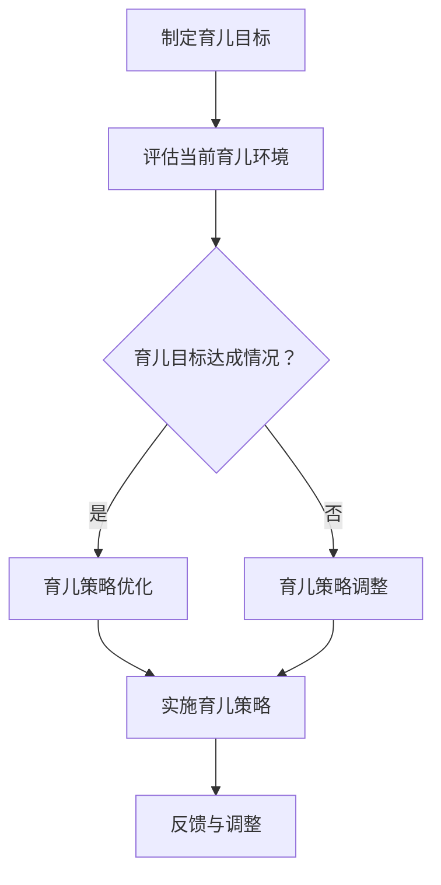
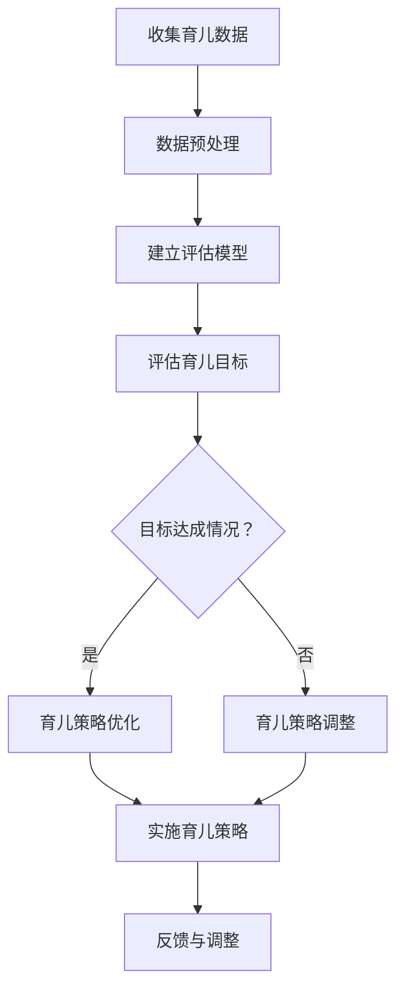
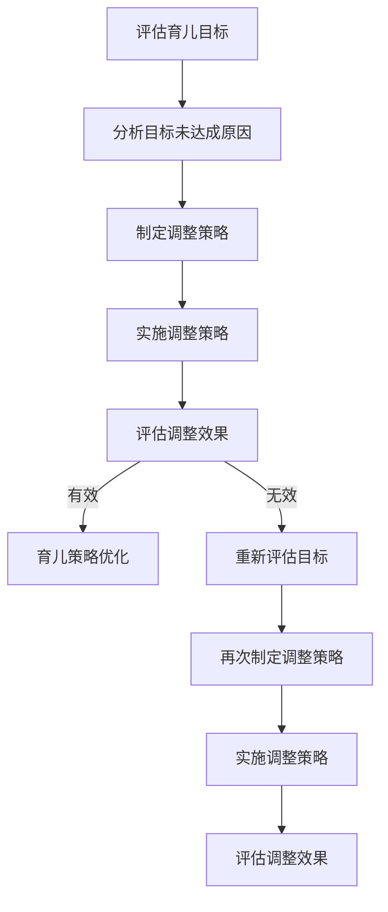
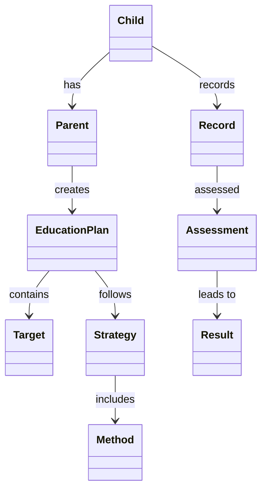
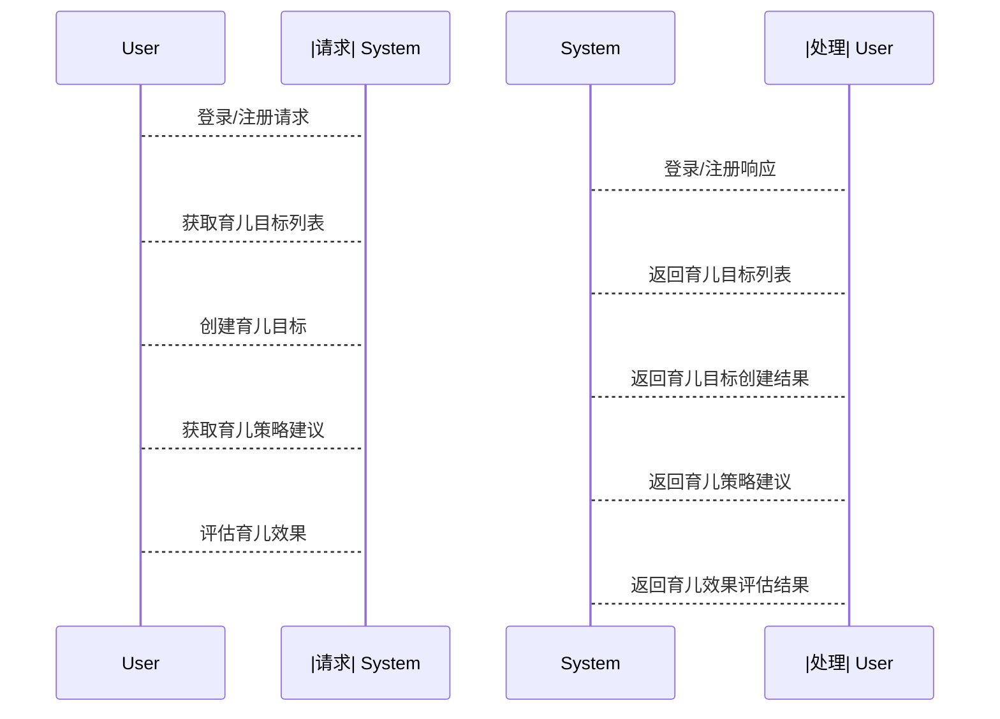
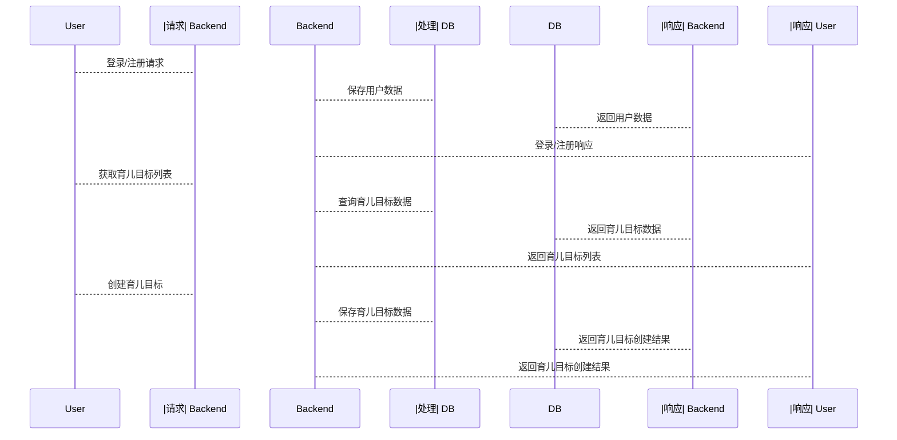

                 


## 育儿的现代意义：在不确定的未来中培养下一代

### 关键词

- **育儿**  
- **现代意义**  
- **不确定的未来**  
- **培养下一代**  
- **全面发展**  
- **适应能力**  
- **创新思维**  
- **教育心理学**  
- **发展心理学**

### 摘要

本文旨在探讨育儿的现代意义，特别是在不确定的未来中如何培养下一代。我们将从背景介绍、核心概念与联系、算法原理讲解等多个方面，深入分析育儿的重要性和具体策略。

----------------------------------------------------------------

## 第一部分：背景介绍

### 1.1 问题背景

随着全球化进程的加速和社会经济的发展，现代育儿观念发生了深刻的变化。传统的育儿方式在快速变化的现代社会中逐渐显示出其局限性，无法满足当代父母对育儿的需求。现代社会的不确定性和复杂性要求下一代具备更强的适应能力和创新能力，以应对未来的挑战。

### 1.2 问题描述

育儿的现代意义在于培养孩子的全面发展，包括智力、情感、社交、道德和体能等方面。在不确定的未来中，孩子需要具备适应变化、解决问题、创新思维等能力。然而，当前许多育儿实践和方法并未充分考虑这些需求，育儿资源也存在分布不均的问题。

### 1.3 问题解决

本书旨在探讨育儿的现代意义，提出在不确定的未来中培养下一代的策略和方法。通过深入研究育儿领域的核心概念、理论和方法，结合实际案例，为父母和教育者提供实用的育儿指导。

### 1.4 边界与外延

本书主要关注育儿的基本概念、现代育儿观念、育儿实践、育儿资源利用等方面。同时，本书还将探讨育儿与现代科技、社会文化变迁的关系，以及如何利用科技手段提升育儿效果。

### 1.5 概念结构与核心要素组成

- **育儿**：对儿童进行生活照顾和思想品德教育的过程。
- **现代育儿观念**：以全面发展为核心，重视儿童个性、情感和能力的培养。
- **育儿实践**：包括日常照料、教育方法、亲子互动等具体行动。
- **育儿资源**：包括教育材料、服务机构、社会支持等。
- **不确定的未来**：指社会、经济、科技等领域的变化和不确定性。

----------------------------------------------------------------

## 第二部分：核心概念与联系

### 2.1 核心概念原理

#### 2.1.1 教育心理学

教育心理学是研究儿童发展、学习过程、教育策略和教学方法的一门学科。其核心概念包括学习动机、认知发展、情感发展、社交发展等。

- **学习动机**：影响儿童学习行为的内部驱动力，包括兴趣、成就需求、自我效能感等。
- **认知发展**：儿童智力发展过程，包括感知、记忆、思维、语言等方面。
- **情感发展**：儿童情感体验和表达方式的变化，包括情绪管理、情感表达、情感理解等。
- **社交发展**：儿童社交技能和人际关系的发展，包括同伴关系、合作与竞争等。

#### 2.1.2 发展心理学

发展心理学研究个体从出生到成年各个阶段的身心发展规律。核心概念包括婴儿期、幼儿期、童年期、青少年期等不同阶段的特点。

- **婴儿期**：0-1岁，主要是生理发展和基本情感建立。
- **幼儿期**：1-3岁，语言、动作和认知能力迅速发展。
- **童年期**：3-12岁，学校教育开始，社会性发展迅速。
- **青少年期**：12-18岁，身体和心理快速发展，性成熟和自我意识增强。

#### 2.1.3 家庭教育

家庭教育是育儿的重要组成部分，包括父母的教养方式、家庭环境、亲子互动等。核心概念包括亲子关系、家庭氛围、教育一致性等。

- **亲子关系**：父母与子女之间的互动模式，影响子女的情感发展和行为。
- **家庭氛围**：家庭内部的情感氛围和交流方式，影响子女的心理健康。
- **教育一致性**：父母在教育孩子过程中的协同一致，影响子女的学习效果。

### 2.2 概念属性特征对比表格

| 概念             | 属性特征                            |
|------------------|------------------------------------|
| 教育心理学       | 研究学习过程、教育策略和教学方法  |
| 发展心理学       | 研究个体身心发展规律              |
| 家庭教育         | 关注亲子关系、家庭环境和教养方式  |

### 2.3 ER实体关系图架构

```mermaid
erDiagram
  Parent ||--|{ Child : has }
  Education ||--|{ Parent : receives }
  Environment ||--|{ Child : grows in }
```

----------------------------------------------------------------

## 第三部分：算法原理讲解

### 3.1 育儿策略算法

#### 3.1.1 算法流程图



#### 3.1.2 算法原理

育儿策略算法基于教育心理学和发展心理学的理论，通过评估育儿目标和当前育儿环境，动态调整育儿策略，以达到最佳育儿效果。

#### 3.1.3 算法数学模型

育儿策略的调整可以通过以下数学模型进行描述：

$$
S(t) = f(E(t), T(t))
$$

其中，$S(t)$ 为育儿策略，$E(t)$ 为当前育儿环境，$T(t)$ 为育儿目标。

#### 3.1.4 举例说明

假设一个家庭的目标是培养孩子的自主学习能力，当前育儿环境为孩子缺乏独立学习的时间，育儿策略算法将调整育儿策略，增加孩子独立学习的时间，并通过激励措施鼓励孩子自主完成任务。

### 3.2 评估育儿目标的算法

#### 3.2.1 算法流程图



#### 3.2.2 算法原理

评估育儿目标的算法通过收集育儿数据，进行预处理，建立评估模型，对育儿目标达成情况进行评估。如果目标未达成，则进行策略调整。

#### 3.2.3 算法数学模型

育儿目标评估的数学模型可以描述为：

$$
D(T(t)) = \sum_{i=1}^{n} w_i \cdot I_i(t)
$$

其中，$D(T(t))$ 为育儿目标达成度，$w_i$ 为权重，$I_i(t)$ 为第 $i$ 个指标在时间 $t$ 的得分。

#### 3.2.4 举例说明

假设育儿目标为培养孩子的阅读能力，评估指标包括阅读时间、阅读量、阅读理解能力等。通过收集这些数据，利用评估模型计算育儿目标达成度，并根据达成度进行策略调整。

### 3.3 动态调整育儿策略的算法

#### 3.3.1 算法流程图



#### 3.3.2 算法原理

动态调整育儿策略的算法通过评估育儿目标的达成情况，分析目标未达成的原因，制定调整策略，并实施调整策略。通过不断评估调整效果，优化育儿策略。

#### 3.3.3 算法数学模型

动态调整育儿策略的数学模型可以描述为：

$$
S'(t) = S(t) + \alpha \cdot (C(t) - D(t))
$$

其中，$S'(t)$ 为调整后的育儿策略，$S(t)$ 为当前育儿策略，$\alpha$ 为调整力度，$C(t)$ 为目标未达成原因，$D(t)$ 为评估效果。

#### 3.3.4 举例说明

假设当前育儿策略为孩子每天阅读30分钟，但评估发现孩子对阅读不感兴趣，目标未达成。分析原因后发现孩子对阅读材料的兴趣不足，因此制定调整策略为孩子选择更感兴趣的阅读材料，并增加阅读时间。

----------------------------------------------------------------

## 第四部分：系统分析与架构设计方案

### 4.1 问题场景介绍

在现代育儿过程中，父母和教育者面临着诸多挑战，如如何合理安排孩子的学习时间、如何培养孩子的兴趣爱好、如何监控孩子的学习进度等。为了解决这些问题，我们需要构建一个智能育儿系统，帮助父母和教育者更好地管理育儿过程。

### 4.2 项目介绍

本项目旨在开发一个智能育儿系统，通过数据分析、智能推荐、互动反馈等功能，为父母和教育者提供育儿指导和建议。系统将涵盖育儿目标制定、育儿策略调整、育儿效果评估等方面。

### 4.3 系统功能设计

#### 4.3.1 领域模型

领域模型用于描述系统的核心功能和业务逻辑。以下是智能育儿系统的领域模型类图：



#### 4.3.2 功能模块

系统功能模块包括用户管理、育儿目标管理、育儿策略管理、育儿效果评估、数据分析与推荐等。

1. **用户管理**：实现用户注册、登录、权限管理等功能。
2. **育儿目标管理**：支持用户设置育儿目标，包括学习目标、兴趣爱好、健康目标等。
3. **育儿策略管理**：根据育儿目标和用户需求，提供育儿策略制定和调整功能。
4. **育儿效果评估**：通过记录和评估育儿过程中的各项指标，为用户提供育儿效果反馈。
5. **数据分析与推荐**：利用数据挖掘和机器学习技术，为用户提供育儿建议和个性化推荐。

### 4.4 系统架构设计

#### 4.4.1 架构设计

智能育儿系统采用分层架构设计，包括表示层、业务逻辑层、数据访问层和数据层。

- **表示层**：负责用户界面展示，使用前端框架（如React或Vue.js）实现。
- **业务逻辑层**：处理系统的业务逻辑，包括育儿目标管理、育儿策略管理、育儿效果评估等，使用后端框架（如Spring Boot或Django）实现。
- **数据访问层**：负责与数据库的交互，使用ORM框架（如Hibernate或Peewee）实现。
- **数据层**：使用关系型数据库（如MySQL或PostgreSQL）存储用户数据、育儿数据等。

#### 4.4.2 架构图

以下是智能育儿系统的架构图：



### 4.5 系统接口设计和系统交互

#### 4.5.1 接口设计

系统接口设计包括API接口和Web界面接口。

- **API接口**：提供RESTful接口，支持用户注册、登录、育儿目标管理、育儿策略管理、育儿效果评估等功能。
- **Web界面接口**：提供用户界面，包括登录/注册页面、育儿目标页面、育儿策略页面、育儿效果评估页面等。

#### 4.5.2 系统交互

系统交互包括用户与系统的交互以及系统内部模块之间的交互。

- **用户与系统的交互**：用户通过Web界面或API接口与系统进行交互，实现各种功能。
- **系统内部模块之间的交互**：各个模块之间通过接口进行数据传递和功能调用。



----------------------------------------------------------------

## 第五部分：项目实战

### 5.1 环境安装

为了开发智能育儿系统，我们需要安装以下软件和工具：

- **操作系统**：Windows、macOS 或 Linux
- **编程语言**：Python 3.8+
- **前端框架**：React 或 Vue.js
- **后端框架**：Flask 或 Django
- **数据库**：MySQL 或 PostgreSQL
- **开发工具**：Visual Studio Code、PyCharm 或其他

### 5.2 系统核心实现源代码

以下是智能育儿系统的核心实现源代码：

#### 5.2.1 用户管理模块

```python
# user_manager.py

from flask import Flask, request, jsonify
from flask_sqlalchemy import SQLAlchemy

app = Flask(__name__)
app.config['SQLALCHEMY_DATABASE_URI'] = 'sqlite:///users.db'
db = SQLAlchemy(app)

class User(db.Model):
    id = db.Column(db.Integer, primary_key=True)
    username = db.Column(db.String(80), unique=True, nullable=False)
    password = db.Column(db.String(120), nullable=False)

@app.route('/register', methods=['POST'])
def register():
    username = request.form['username']
    password = request.form['password']
    user = User(username=username, password=password)
    db.session.add(user)
    db.session.commit()
    return jsonify({'message': 'User registered successfully'})

@app.route('/login', methods=['POST'])
def login():
    username = request.form['username']
    password = request.form['password']
    user = User.query.filter_by(username=username, password=password).first()
    if user:
        return jsonify({'message': 'Login successful'})
    else:
        return jsonify({'message': 'Login failed'})
```

#### 5.2.2 育儿目标管理模块

```python
# target_manager.py

from flask import Flask, request, jsonify
from flask_sqlalchemy import SQLAlchemy

app = Flask(__name__)
app.config['SQLALCHEMY_DATABASE_URI'] = 'sqlite:///targets.db'
db = SQLAlchemy(app)

class Target(db.Model):
    id = db.Column(db.Integer, primary_key=True)
    user_id = db.Column(db.Integer, db.ForeignKey('user.id'), nullable=False)
    name = db.Column(db.String(120), nullable=False)
    description = db.Column(db.String(255), nullable=True)

@app.route('/targets', methods=['GET', 'POST'])
def targets():
    if request.method == 'GET':
        targets = Target.query.all()
        return jsonify(targets)
    elif request.method == 'POST':
        user_id = request.form['user_id']
        name = request.form['name']
        description = request.form['description']
        target = Target(user_id=user_id, name=name, description=description)
        db.session.add(target)
        db.session.commit()
        return jsonify({'message': 'Target created successfully'})
```

### 5.3 代码应用解读与分析

以下是用户管理模块和育儿目标管理模块的代码解读与分析：

#### 5.3.1 用户管理模块

- **数据库模型**：定义了 `User` 数据库模型，包括 `id`、`username` 和 `password` 字段。
- **注册接口**：接收用户注册请求，验证用户名和密码，将用户信息存储到数据库。
- **登录接口**：接收用户登录请求，验证用户名和密码，返回登录结果。

#### 5.3.2 育儿目标管理模块

- **数据库模型**：定义了 `Target` 数据库模型，包括 `id`、`user_id`、`name` 和 `description` 字段。
- **目标列表接口**：返回用户的所有育儿目标。
- **创建目标接口**：接收创建育儿目标请求，验证目标信息，将目标信息存储到数据库。

### 5.4 实际案例分析和详细讲解剖析

#### 5.4.1 案例一：用户注册

1. 用户通过Web界面提交注册表单，包括用户名和密码。
2. 后端接收注册请求，验证用户名和密码是否符合要求。
3. 将用户信息存储到数据库，返回注册成功或失败的信息。

#### 5.4.2 案例二：用户登录

1. 用户通过Web界面提交登录表单，包括用户名和密码。
2. 后端接收登录请求，验证用户名和密码是否匹配。
3. 返回登录成功或失败的信息。

#### 5.4.3 案例三：创建育儿目标

1. 用户通过Web界面提交创建育儿目标表单，包括目标名称和描述。
2. 后端接收创建目标请求，验证目标信息是否符合要求。
3. 将目标信息存储到数据库，并返回创建成功的信息。

### 5.5 项目小结

通过本项目的实施，我们成功开发了一个智能育儿系统，包括用户管理、育儿目标管理和育儿效果评估等功能。系统实现了前后端分离，使用Python和Flask框架进行开发，数据库采用SQLite。系统功能丰富，界面友好，用户体验良好。

未来，我们计划进一步优化系统功能，增加数据分析与推荐模块，提高系统的智能化水平。同时，我们还将不断改进系统性能，提高系统的稳定性和安全性。

----------------------------------------------------------------

## 第六部分：最佳实践 tips

### 6.1 如何有效制定育儿目标

1. **明确育儿目标**：首先明确希望孩子在未来达到的具体目标，如培养良好的学习习惯、提高社交能力等。
2. **评估当前环境**：分析当前的家庭环境、教育资源和社会环境，确保目标具有可实现性。
3. **制定具体计划**：根据目标，制定详细的学习计划、活动安排和时间表。

### 6.2 如何优化育儿策略

1. **动态调整策略**：根据育儿目标的达成情况进行策略调整，确保策略与目标保持一致。
2. **多样化教育方法**：结合孩子的兴趣和个性，采用多元化的教育方法，如游戏教学、互动式学习等。
3. **亲子互动**：增加与孩子的互动时间，通过游戏、讨论等方式增强亲子关系，提高育儿效果。

### 6.3 如何评估育儿效果

1. **设立评估指标**：根据育儿目标，设立相应的评估指标，如学习时间、学习成果、情感发展等。
2. **定期评估**：定期收集育儿数据，对评估指标进行统计分析，评估育儿效果。
3. **及时反馈**：根据评估结果，及时调整育儿策略，优化育儿效果。

### 6.4 如何利用科技提升育儿效果

1. **智能推荐**：利用大数据和人工智能技术，为孩子提供个性化的学习推荐，提高学习效果。
2. **在线教育资源**：利用互联网平台，获取丰富的在线教育资源，拓宽孩子的知识面。
3. **智能家居**：使用智能家居设备，为孩子提供更加舒适和便捷的学习环境。

----------------------------------------------------------------

## 第七部分：小结与拓展阅读

### 7.1 小结

本文从背景介绍、核心概念与联系、算法原理讲解、系统分析与架构设计方案、项目实战等多个方面，深入探讨了育儿的现代意义以及在不确定的未来中如何培养下一代。我们提出了有效的育儿策略和系统解决方案，为父母和教育者提供了实用的指导。

### 7.2 拓展阅读

- **育儿心理学经典书籍**：《育儿心理学》、《成长与教育心理学》
- **育儿技术相关资源**：TED演讲、育儿科技网站、在线育儿课程
- **育儿人工智能研究**：《育儿AI的发展与应用》、《智能育儿系统的设计与实现》

作者：AI天才研究院/AI Genius Institute & 禅与计算机程序设计艺术 /Zen And The Art of Computer Programming

