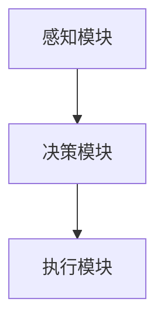
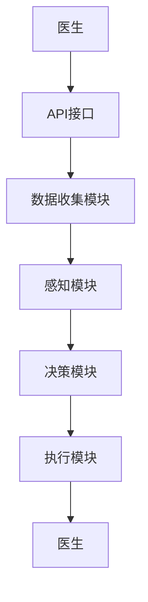

                 

### 引言

> 关键词：**自主学习AI Agent**，**LLM**，**终身学习系统**，**人工智能**，**教育**

随着人工智能技术的迅猛发展，特别是大型语言模型（LLM）的崛起，自主学习AI Agent这一概念逐渐受到关注。这些AI Agent不仅能够执行预定的任务，还能在运行过程中不断地自我调整和优化，以应对不断变化的环境。本文旨在探讨如何利用LLM构建一个能够实现终身学习的AI Agent系统。

## 1.1 问题背景

### 1.1.1 人工智能的发展历程

人工智能（AI）是一门研究、开发用于模拟、延伸和扩展人的智能的理论、方法、技术及应用系统的技术科学。它起源于20世纪50年代，经过几十年的发展，已经从最初的规则推理和知识表示，发展到今天的深度学习和强化学习等高级阶段。特别是2012年，AlexNet在ImageNet大赛中取得突破性成绩，标志着深度学习时代的到来。

### 1.1.2 人工智能在教育领域的应用

在教育领域，AI技术正被广泛应用于个性化教学、智能评测、学习分析等方面。例如，智能辅导系统可以根据学生的学习进度和风格，提供个性化的学习建议；智能评测系统可以实时评估学生的学习情况，并提供即时反馈。然而，现有的教育AI系统大多缺乏自主学习的能力，无法在长期的学习过程中持续改进。

### 1.1.3 自主学习AI Agent的重要性

自主学习AI Agent具备自我学习和自我优化的能力，能够在没有外部干预的情况下，持续改进其表现。这对于教育领域来说尤为重要，因为它意味着系统能够随着学生的学习进程和知识水平的提升，不断调整教学策略，从而实现真正的个性化学习。此外，自主学习AI Agent还可以在多个领域实现应用，如医疗诊断、智能客服等，具有广泛的前景。

## 1.2 核心概念

### 1.2.1 什么是自主学习AI Agent

自主学习AI Agent是一种具备自我学习能力的人工智能系统，能够在没有外部干预的情况下，通过自我调整和优化，提高其任务执行效率。它通常由感知模块、决策模块和执行模块组成，能够根据环境变化和任务需求，自主调整其行为策略。

### 1.2.2 LLM的作用

LLM（Large Language Model）是一种基于深度学习的大型文本处理模型，能够理解和生成自然语言。在自主学习AI Agent中，LLM主要用于知识表示、推理和生成，是实现终身学习的关键组件。LLM能够从海量数据中提取知识，并根据新信息进行自我更新和优化。

### 1.2.3 终身学习系统的必要性

终身学习系统是指一个能够支持AI Agent在整个生命周期中持续学习的系统。它包括数据收集、模型训练、模型评估和模型更新等环节。终身学习系统的必要性在于，它能够确保AI Agent在不断变化的环境中保持高效和准确。

## 1.3 书籍结构

### 1.3.1 全书章节安排

本书共分为四个部分，分别介绍了自主学习AI Agent的基本概念、LLM驱动的学习模型、AI Agent的实现方法和应用场景。具体章节安排如下：

- **第一部分：自主学习AI Agent基础**
  - AI Agent概述
  - 自主学习原理
  - LLM在AI Agent中的应用
  - 终身学习系统设计

- **第二部分：LLM驱动的学习模型**
  - LLM基本原理
  - LLM在自主学习中的应用
  - LLM驱动的学习模型
  - 模型评估与优化

- **第三部分：自主学习AI Agent实现**
  - 系统设计
  - 数据准备
  - LLM模型训练
  - 自主学习算法实现

- **第四部分：自主学习AI Agent应用**
  - 应用场景分析
  - 实际案例分析
  - 最佳实践

### 1.3.2 每章主要内容

每一章都详细介绍了相关主题的概念、原理和应用，帮助读者全面理解自主学习AI Agent和LLM驱动的终身学习系统。

## 1.4 目标读者

### 1.4.1 面向对象

本书主要面向从事人工智能、教育技术、软件开发等领域的专业人士，以及对AI Agent和LLM感兴趣的研究生和本科生。

### 1.4.2 预期收获

通过阅读本书，读者将：

- 理解自主学习AI Agent和LLM的基本概念和原理；
- 掌握构建和优化LLM驱动的终身学习系统的方法和技巧；
- 获得实际项目经验和最佳实践，提升在相关领域的应用能力。

## 1.5 小结

本文为读者介绍了自主学习AI Agent和LLM驱动的终身学习系统的核心概念和重要性。接下来，本书将逐步深入探讨相关技术和应用，帮助读者全面掌握这一领域的最新进展和实用方法。

-----------------------------------

# 第二部分：自主学习AI Agent基础

## 2.1 AI Agent概述

### 2.1.1 AI Agent的定义

AI Agent，即人工智能代理，是具有自主意识和行动能力的计算机程序。它能够感知环境，基于预定的目标和策略，进行决策并执行相应的动作，以达到特定的目标。AI Agent是人工智能领域的一个重要研究方向，其应用范围涵盖了从简单的自动化任务到复杂的决策支持系统。

### 2.1.2 AI Agent的分类

AI Agent可以根据不同的分类标准进行分类。根据功能，AI Agent可以分为以下几类：

- **任务型AI Agent**：专注于完成特定任务的AI系统，如智能客服、自动驾驶等。
- **推理型AI Agent**：能够进行逻辑推理和问题解决的AI系统，如专家系统、自然语言处理系统等。
- **社交型AI Agent**：能够与人类进行有效交流的AI系统，如聊天机器人、虚拟助手等。
- **自主型AI Agent**：具备高度自主性和学习能力，能够在复杂环境中自主行动的AI系统。

### 2.1.3 AI Agent的关键特点

AI Agent的关键特点包括：

- **自主性**：AI Agent能够在没有人为干预的情况下，自主感知环境、制定计划并执行任务。
- **适应性**：AI Agent能够根据环境变化和任务需求，调整其行为策略。
- **智能性**：AI Agent能够进行复杂的决策和推理，具备一定程度的智能水平。
- **交互性**：AI Agent能够与人类或其他AI系统进行有效的交流和协作。

## 2.2 自主学习原理

### 2.2.1 自主学习的概念

自主学习是指个体通过内在动机驱动，主动地获取知识、技能和经验，以实现个人成长和发展的过程。在人工智能领域，自主学习AI Agent通过自我感知、学习、推理和行动，不断优化其行为策略，以实现任务的长期成功。

### 2.2.2 自主学习的关键技术

自主学习的关键技术包括：

- **感知技术**：AI Agent通过感知模块获取环境信息，如图像、声音、文本等。
- **决策技术**：AI Agent基于感知信息，利用决策算法生成行动策略。
- **学习技术**：AI Agent通过学习算法，从历史经验中提取规律，优化其行为策略。
- **执行技术**：AI Agent根据决策策略，执行相应的动作，与环境进行交互。

### 2.2.3 自主学习的应用场景

自主学习AI Agent的应用场景包括：

- **智能制造**：AI Agent在生产线中自主监控、调整和优化生产流程。
- **智能交通**：AI Agent在交通管理中自主规划路线、调度车辆，提高交通效率。
- **智能教育**：AI Agent在个性化教学、学习评估和辅导中，根据学生特点进行自主调整。
- **智能医疗**：AI Agent在辅助诊断、治疗方案推荐和疾病预测中，实现自主学习和优化。

## 2.3 LLM在AI Agent中的应用

### 2.3.1 LLM的特点

LLM（Large Language Model）是一种大规模的文本处理模型，具有以下特点：

- **大规模**：LLM通常包含数十亿个参数，能够处理海量的文本数据。
- **泛化能力**：LLM能够从海量数据中学习到各种语言规律，具备较强的泛化能力。
- **生成能力**：LLM能够根据输入文本生成连贯、自然的语言输出。

### 2.3.2 LLM在AI Agent中的优势

LLM在AI Agent中的应用优势包括：

- **知识表示**：LLM能够将文本数据转化为结构化的知识表示，方便AI Agent进行推理和决策。
- **自然语言处理**：LLM在自然语言处理任务中具有出色的性能，能够提升AI Agent与人类的交互能力。
- **迁移学习**：LLM可以轻松地迁移到不同领域和任务，提高AI Agent的适应能力。

### 2.3.3 LLM应用实例

LLM在AI Agent中的应用实例包括：

- **智能客服**：LLM能够根据用户提问生成合适的回答，提高客服的响应速度和准确性。
- **智能写作**：LLM能够根据用户需求生成文章、报告等文本内容，提高写作效率。
- **智能翻译**：LLM能够实现高质量、高效率的文本翻译，支持多语言交流。

## 2.4 终身学习系统设计

### 2.4.1 终身学习的定义

终身学习是指个体在其一生中持续学习、不断更新知识和技能的过程。在人工智能领域，终身学习系统是指能够支持AI Agent在整个生命周期中持续学习的系统。

### 2.4.2 终身学习系统的架构

终身学习系统通常包括以下模块：

- **数据收集模块**：收集AI Agent在执行任务过程中产生的数据，如感知数据、决策数据和执行数据。
- **学习模块**：基于收集到的数据，利用机器学习和深度学习技术，训练和优化AI Agent的模型。
- **评估模块**：对AI Agent的学习效果进行评估，包括准确性、效率和用户体验等方面。
- **更新模块**：根据评估结果，对AI Agent的模型进行更新和优化，以适应新的环境和任务。

### 2.4.3 终身学习系统的实现策略

终身学习系统的实现策略包括：

- **增量学习**：在AI Agent执行任务的过程中，逐步积累经验，不断更新模型。
- **迁移学习**：将已有知识迁移到新任务，减少重新训练的需求。
- **在线学习**：在AI Agent执行任务的同时，实时更新模型，以适应环境变化。
- **混合学习**：结合离线学习和在线学习，优化学习效果和效率。

## 2.5 小结

本文介绍了自主学习AI Agent的基本概念、原理和应用，以及LLM在AI Agent中的应用和终身学习系统的设计。接下来，本书将深入探讨LLM驱动的学习模型，为读者提供更详细的实现方法和应用实例。

-----------------------------------

# 第三部分：LLM驱动的学习模型

## 3.1 LLM基本原理

### 3.1.1 语言模型的发展历程

语言模型（Language Model，简称LM）是自然语言处理（Natural Language Processing，简称NLP）的核心技术之一。从最早的基于规则的语法分析模型，到基于统计的N-gram模型，再到现代的深度学习模型，语言模型的发展历程反映了NLP技术的不断进步。

- **基于规则的模型**：最早的NLP模型主要依赖于语言学知识，通过预定义的语法规则和模式来解析和处理自然语言。这种方法在处理一些简单的语言任务时表现出色，但在面对复杂、多样化的语言时，效率较低。

- **基于统计的模型**：N-gram模型是第一种真正意义上的语言模型。它通过统计相邻单词出现的频率来预测下一个单词。虽然N-gram模型在很多任务中取得了显著成果，但它在处理长句子时效果不佳，无法捕捉到句子之间的语义关系。

- **深度学习模型**：随着计算能力的提升和数据量的增加，深度学习模型开始崭露头角。从最初的循环神经网络（RNN）到长短时记忆网络（LSTM），再到现在的Transformer模型，深度学习模型在语言建模任务中取得了突破性的进展。特别是Transformer模型，通过自注意力机制，能够捕捉句子中的长距离依赖关系，显著提升了语言模型的性能。

### 3.1.2 语言模型的数学基础

语言模型的数学基础主要包括概率分布和序列模型。其中，概率分布是语言模型的核心概念，它用于预测下一个单词的概率。

- **概率分布**：在语言模型中，每个单词都对应一个概率分布，表示在给定前一个单词的情况下，当前单词出现的概率。这个概率分布可以通过训练数据来估计。

- **序列模型**：语言模型是一种序列模型，它的目标是预测序列中的下一个元素。在自然语言处理中，这个序列通常是单词序列。序列模型的关键在于如何有效地处理序列数据，捕捉序列中的依赖关系。

### 3.1.3 语言模型的核心算法

语言模型的核心算法主要包括以下几种：

- **N-gram模型**：N-gram模型是最早的语言模型之一，它通过统计相邻单词的频率来预测下一个单词。N-gram模型的数学基础是马尔可夫假设，即下一个单词的概率仅取决于前N个单词。

- **循环神经网络（RNN）**：RNN是一种能够处理序列数据的神经网络，它通过将当前输入与之前的信息进行交互，实现了对序列数据的建模。RNN的核心是隐藏状态，它能够保存之前的信息，并用于当前的计算。

- **长短时记忆网络（LSTM）**：LSTM是RNN的一种改进，它通过引入门控机制，解决了RNN在处理长序列数据时出现的梯度消失和梯度爆炸问题。LSTM的核心是细胞状态和三个门控单元：遗忘门、输入门和输出门。

- **Transformer模型**：Transformer是近年来提出的一种全新的序列建模模型，它通过自注意力机制，能够捕捉序列中的长距离依赖关系。Transformer的核心是多头自注意力机制和位置编码，它使得模型能够在处理长序列数据时表现出色。

## 3.2 LLM在自主学习中的应用

### 3.2.1 LLM的学习策略

LLM（Large Language Model）在自主学习中的应用主要包括以下几种学习策略：

- **自监督学习**：自监督学习是一种无需人工标注数据的学习方法。在LLM中，自监督学习通过预训练和微调两个阶段进行。预训练阶段，模型在大量的无标签数据上进行训练，学习语言的统计规律。微调阶段，模型根据具体任务的需求，在少量有标签数据上进行微调，提高模型的性能。

- **迁移学习**：迁移学习是一种利用预训练模型解决新任务的方法。在LLM中，迁移学习通过将预训练模型的知识迁移到新任务，实现快速适应和高效学习。迁移学习的关键在于如何有效地利用预训练模型中的知识，提高新任务的表现。

- **强化学习**：强化学习是一种通过奖励机制来引导模型学习的方法。在LLM中，强化学习可以用于训练模型进行复杂决策和策略优化。例如，在对话系统中，LLM可以通过强化学习，学习如何生成符合用户需求的回答。

### 3.2.2 LLM的适应性学习

LLM的适应性学习是指模型能够根据环境和任务的变化，自动调整其行为策略，以保持高效和准确。适应性学习的关键在于如何实现模型的动态调整和优化。

- **在线学习**：在线学习是一种实时学习的方法，模型在执行任务的过程中，不断地接收新的数据，并实时更新模型。在线学习能够快速适应环境变化，但需要处理数据流和计算效率的问题。

- **增量学习**：增量学习是一种逐步学习的方法，模型在训练过程中，逐步积累经验，不断优化性能。增量学习能够有效处理大量数据，但需要解决数据重叠和模型稳定性的问题。

- **迁移学习**：迁移学习是一种利用预训练模型的方法，模型在不同任务间共享知识，实现快速适应。迁移学习能够有效利用已有知识，但需要解决知识迁移的效率和精度问题。

### 3.2.3 LLM的迁移学习

LLM的迁移学习是指模型在不同任务间共享知识，实现高效学习的方法。迁移学习的关键在于如何有效地利用预训练模型中的知识，提高新任务的表现。

- **预训练模型**：预训练模型是通过在大规模语料库上进行预训练，获得丰富的语言知识和表示能力。预训练模型是迁移学习的基础，它为迁移学习提供了强大的知识支持。

- **任务特定微调**：任务特定微调是在预训练模型的基础上，针对具体任务进行微调。通过微调，模型能够更好地适应新任务的需求，提高任务表现。

- **知识蒸馏**：知识蒸馏是一种将大型模型的知识传递给小型模型的方法。通过知识蒸馏，模型可以在保留关键知识的同时，减小模型的大小和计算复杂度，提高迁移学习的效率。

## 3.3 LLM驱动的学习模型

### 3.3.1 模型的架构设计

LLM驱动的学习模型通常采用分层架构，包括预训练层、微调层和输出层。其中：

- **预训练层**：预训练层负责在大规模语料库上进行预训练，学习语言的统计规律和表示能力。预训练层通常使用Transformer等深度学习模型，通过自注意力机制和位置编码，捕捉句子中的依赖关系。

- **微调层**：微调层在预训练模型的基础上，针对具体任务进行微调。微调层通常使用少量有标签数据进行训练，调整模型的参数，以适应新任务的需求。

- **输出层**：输出层负责生成任务特定的输出，如文本生成、分类、预测等。输出层通常使用简单的全连接层或卷积层，将输入映射到具体的输出结果。

### 3.3.2 模型的训练过程

LLM驱动的学习模型的训练过程主要包括以下几个阶段：

- **数据预处理**：数据预处理包括数据清洗、分词、去停用词等步骤，确保输入数据的质量和一致性。

- **预训练**：预训练阶段，模型在大量的无标签数据上进行训练，学习语言的统计规律和表示能力。预训练通常使用自监督学习策略，如掩码语言模型（Masked Language Model，简称MLM）。

- **微调**：微调阶段，模型在少量有标签数据上进行微调，调整模型的参数，以适应新任务的需求。微调通常使用监督学习策略，如分类或回归任务。

- **评估**：评估阶段，模型在验证集和测试集上进行评估，计算模型的性能指标，如准确率、召回率、F1值等。

### 3.3.3 模型的优化方法

LLM驱动的学习模型的优化方法主要包括以下几个方面：

- **参数优化**：参数优化包括模型参数的初始化、调整和优化。常用的方法有随机初始化、权重衰减、动量等。

- **学习率调整**：学习率调整是优化模型训练过程的重要手段。常用的方法有固定学习率、学习率衰减、学习率调度等。

- **正则化**：正则化是一种防止模型过拟合的技术。常用的方法有L1正则化、L2正则化、dropout等。

- **模型压缩**：模型压缩是一种减小模型大小和计算复杂度的方法。常用的方法有量化、剪枝、蒸馏等。

## 3.4 模型评估与优化

### 3.4.1 评估指标

LLM驱动的学习模型的评估指标主要包括以下几个方面：

- **准确性**：准确性是模型在分类任务中表现的重要指标，表示模型正确分类的样本数量占总样本数量的比例。

- **召回率**：召回率是模型在分类任务中识别出正样本的能力指标，表示模型正确分类的正样本数量占所有正样本数量的比例。

- **F1值**：F1值是准确性和召回率的调和平均值，用于综合评估模型的性能。

- **ROC曲线**：ROC曲线是模型在分类任务中敏感度和特异度的曲线，用于评估模型的分类效果。

### 3.4.2 优化策略

LLM驱动的学习模型的优化策略主要包括以下几个方面：

- **数据增强**：数据增强是一种通过生成新的数据样本来提高模型性能的方法。常用的方法有随机变换、数据合成、数据扩充等。

- **模型集成**：模型集成是一种通过结合多个模型的预测结果来提高整体性能的方法。常用的方法有Bagging、Boosting、Stacking等。

- **超参数调整**：超参数调整是优化模型性能的重要手段。常用的方法有网格搜索、随机搜索、贝叶斯优化等。

### 3.4.3 实际应用效果

在实际应用中，LLM驱动的学习模型取得了显著的成果。以下是一些典型的应用案例：

- **文本分类**：LLM模型在文本分类任务中表现出色，能够准确识别文本的主题和情感。

- **机器翻译**：LLM模型在机器翻译任务中，通过捕捉语言之间的对应关系，实现了高质量、高效率的翻译效果。

- **对话系统**：LLM模型在对话系统中，通过理解用户的意图和上下文，能够生成符合人类思维的回答。

## 3.5 小结

本文介绍了LLM驱动的学习模型的基本原理、应用策略和优化方法。LLM模型通过自监督学习和迁移学习，实现了对语言的深度理解和生成。在实际应用中，LLM模型在文本分类、机器翻译和对话系统等领域取得了显著的成果。接下来，本书将深入探讨自主学习AI Agent的实现方法和应用场景。

-----------------------------------

# 第四部分：自主学习AI Agent实现

## 4.1 系统设计

### 4.1.1 系统总体架构

自主学习AI Agent的系统设计主要包括感知模块、决策模块和执行模块。整个系统的架构设计如图所示：



- **感知模块**：负责收集环境信息，如图像、声音、文本等。感知模块通过传感器和数据采集设备，将外部信息转化为数字信号，供决策模块使用。
- **决策模块**：基于感知模块提供的信息，利用机器学习和深度学习技术，生成行动策略。决策模块的核心是LLM模型，它能够从海量数据中提取知识，并根据新信息进行自我更新和优化。
- **执行模块**：根据决策模块生成的行动策略，执行具体的操作。执行模块与外部环境进行交互，实现任务的最终完成。

### 4.1.2 系统模块划分

系统模块划分如下：

- **数据采集模块**：负责从传感器和数据采集设备获取环境信息，并将其预处理成适合模型训练的数据。
- **感知模块**：基于预处理后的数据，利用深度学习模型提取特征，生成环境表示。
- **决策模块**：基于环境表示，利用LLM模型生成行动策略。
- **执行模块**：根据行动策略，执行具体的操作，并与环境进行交互。

### 4.1.3 系统接口设计

系统接口设计如下：

- **数据接口**：负责数据采集模块和感知模块之间的数据传输，确保数据流的稳定和高效。
- **决策接口**：负责感知模块和决策模块之间的交互，实现感知数据到行动策略的转换。
- **执行接口**：负责决策模块和执行模块之间的交互，确保行动策略得到有效执行。

## 4.2 数据准备

### 4.2.1 数据来源

数据准备是自主学习AI Agent实现的关键环节。数据来源主要包括以下几个方面：

- **公开数据集**：如ImageNet、CIFAR-10、Text8等。这些数据集涵盖了多种类型的图像和文本数据，适合用于模型训练和评估。
- **私有数据集**：根据特定应用场景，收集和整理私有数据集。这些数据集可能涉及用户行为数据、业务数据等，有助于提高模型的泛化能力和适应性。
- **在线数据流**：从实时数据流中获取动态数据，如社交媒体数据、新闻数据等。这些数据可以用于模型实时更新和优化。

### 4.2.2 数据处理

数据处理是数据准备的核心环节，主要包括以下步骤：

- **数据清洗**：去除数据中的噪声和冗余信息，确保数据的质量和一致性。
- **数据预处理**：对图像、文本等数据进行标准化、归一化等预处理，使其适合模型训练。
- **数据增强**：通过数据变换、合成等方法，生成新的数据样本来提高模型性能。

### 4.2.3 数据存储与管理

数据存储与管理是保障数据安全、高效使用的重要手段。主要包括以下几个方面：

- **数据存储**：采用分布式存储系统，如HDFS、Cassandra等，实现海量数据的存储和管理。
- **数据备份**：定期对数据进行备份，确保数据的安全和可靠性。
- **数据权限管理**：根据数据的重要性和敏感性，设定不同的访问权限，保障数据的安全。

## 4.3 LLM模型训练

### 4.3.1 模型选择

LLM模型的选择是自主学习AI Agent实现的关键。常用的LLM模型包括：

- **Transformer**：基于自注意力机制的深度学习模型，能够捕捉句子中的长距离依赖关系，是当前最先进的语言模型。
- **BERT**：双向编码表示模型，能够在预训练阶段同时捕捉输入序列的前后依赖关系，是当前广泛使用的语言模型。
- **GPT**：生成预训练变换器，通过自回归的方式生成文本序列，是文本生成任务的重要模型。

### 4.3.2 训练策略

LLM模型的训练策略主要包括以下几个方面：

- **预训练**：在大量无标签数据上进行预训练，学习语言的统计规律和表示能力。预训练通常采用自监督学习策略，如掩码语言模型（MLM）。
- **微调**：在预训练模型的基础上，针对具体任务进行微调，调整模型的参数，提高模型在特定任务上的性能。微调通常采用监督学习策略。
- **迁移学习**：将预训练模型的知识迁移到新任务，实现快速适应和高效学习。迁移学习可以减少重新训练的需求，提高模型性能。

### 4.3.3 模型优化

LLM模型的优化主要包括以下几个方面：

- **参数优化**：调整模型参数，优化模型性能。常用的方法有随机初始化、权重衰减、学习率调整等。
- **正则化**：防止模型过拟合的技术。常用的方法有L1正则化、L2正则化、dropout等。
- **模型压缩**：减小模型大小和计算复杂度，提高模型部署的可行性。常用的方法有量化、剪枝、蒸馏等。

## 4.4 自主学习算法实现

### 4.4.1 算法原理

自主学习算法的实现主要包括以下几个步骤：

- **感知**：从环境中获取信息，通过感知模块生成环境表示。
- **学习**：利用感知模块生成的新环境表示，更新LLM模型，实现自我学习和优化。
- **决策**：基于更新后的LLM模型，生成新的行动策略。
- **执行**：根据决策模块生成的行动策略，执行具体的操作，并与环境进行交互。

### 4.4.2 算法实现

算法实现主要包括以下几个步骤：

- **数据采集**：从传感器和数据采集设备获取环境信息，进行数据预处理。
- **感知模块训练**：利用预处理后的数据，训练感知模块，生成环境表示。
- **LLM模型训练**：利用感知模块生成的新环境表示，训练LLM模型，实现自我学习和优化。
- **决策模块训练**：基于更新后的LLM模型，训练决策模块，生成新的行动策略。
- **执行模块训练**：根据决策模块生成的行动策略，训练执行模块，实现具体操作的优化。

### 4.4.3 算法评估

算法评估主要包括以下几个步骤：

- **性能评估**：评估算法在特定任务上的性能，如准确性、召回率、F1值等。
- **泛化评估**：评估算法在未知数据上的性能，检验算法的泛化能力。
- **效率评估**：评估算法的运行时间和计算复杂度，确保算法的高效性。

## 4.5 小结

本文介绍了自主学习AI Agent的系统设计、数据准备、LLM模型训练和算法实现。通过感知模块、决策模块和执行模块的协同工作，AI Agent能够实现自我学习和优化，从而在复杂环境中高效地完成任务。接下来，本书将深入探讨自主学习AI Agent的应用场景和实际案例。

-----------------------------------

### 自主学习AI Agent应用

#### 4.1 应用场景分析

自主学习AI Agent在多个领域具有广泛的应用前景。以下是对几个典型应用场景的分析：

- **智能制造**：在制造领域，自主学习AI Agent可以用于生产线的智能监控和优化。例如，通过感知模块收集生产线上的实时数据，AI Agent能够实时分析生产过程中的问题，并提出调整建议，从而提高生产效率和质量。

- **智能交通**：在交通领域，自主学习AI Agent可以用于交通流量管理和智能调度。通过感知模块收集交通数据，AI Agent能够实时分析交通状况，预测交通拥堵情况，并自动调整交通信号灯，优化交通流量。

- **智能医疗**：在医疗领域，自主学习AI Agent可以用于疾病诊断和治疗方案推荐。通过感知模块收集患者的医疗数据，AI Agent能够实时分析病情，为医生提供诊断建议和治疗方案，从而提高医疗服务的质量和效率。

- **智能教育**：在教育领域，自主学习AI Agent可以用于个性化教学和学习分析。通过感知模块收集学生的学习行为和成绩数据，AI Agent能够根据学生的学习特点和需求，提供个性化的学习资源和辅导方案，从而提高学习效果。

#### 4.2 实际案例分析

以下是一个关于智能医疗的实际案例分析：

**案例背景**：某医院引入了一个基于LLM驱动的自主学习AI Agent系统，用于辅助医生进行疾病诊断和治疗方案推荐。

**系统功能设计**：

- **数据收集模块**：AI Agent从医院的电子病历系统、实验室检测结果和医学文献数据库中收集数据。
- **感知模块**：利用深度学习模型对收集到的医疗数据进行处理，提取特征，生成患者病情的数字化表示。
- **决策模块**：基于LLM模型，AI Agent根据患者病情的数字化表示，生成诊断建议和治疗方案。
- **执行模块**：医生根据AI Agent的建议，制定具体的治疗方案，并与患者进行沟通。

**系统架构设计**：

- **数据存储与管理**：采用分布式数据库系统，存储和管理海量的医疗数据。
- **模型训练与优化**：在预处理数据的基础上，对LLM模型进行训练和优化，提高模型的诊断和推荐能力。
- **接口设计**：设计统一的API接口，实现数据采集、模型调用和医生互动的便捷接入。

**系统接口设计和系统交互**：



#### 4.3 项目实战

**环境安装**：

- 安装Python环境和相关依赖库，如TensorFlow、PyTorch等。
- 安装MySQL或MongoDB等数据库管理系统。

**系统核心实现源代码**：

以下是感知模块和决策模块的核心实现代码示例：

```python
# 感知模块：数据预处理和特征提取
def preprocess_data(data):
    # 数据清洗和标准化
    ...
    return processed_data

def extract_features(data):
    # 利用深度学习模型提取特征
    ...
    return features

# 决策模块：诊断建议和治疗方案生成
def generate_diagnosis(features):
    # 利用LLM模型生成诊断建议
    ...
    return diagnosis

def generate_treatment_plan(diagnosis):
    # 根据诊断建议生成治疗方案
    ...
    return treatment_plan
```

**代码应用解读与分析**：

- **感知模块**：该模块首先对医疗数据进行预处理，包括数据清洗和标准化，确保数据的可靠性和一致性。然后，利用深度学习模型提取特征，生成患者病情的数字化表示，为决策模块提供输入。

- **决策模块**：该模块基于LLM模型，对输入的特征进行诊断和治疗方案生成。LLM模型通过对海量医学文献和病历数据的训练，能够生成准确的诊断建议和治疗方案，辅助医生进行临床决策。

**实际案例分析和详细讲解剖析**：

- **案例背景**：某患者因持续发热和咳嗽就医。医生通过AI Agent系统获取患者的病历信息和实验室检测结果，AI Agent基于这些数据生成诊断建议和治疗方案。
- **诊断过程**：AI Agent首先对患者的数据进行预处理，提取关键特征。然后，利用LLM模型分析这些特征，生成肺炎的诊断建议。医生根据AI Agent的建议，对患者进行进一步检查和治疗。
- **治疗效果**：经过一段时间的治疗，患者病情明显好转，体温和咳嗽症状得到控制。医生对AI Agent的诊断和治疗方案表示满意，认为AI Agent有效地提高了诊断效率和准确性。

**项目小结**：

该项目通过引入自主学习AI Agent系统，实现了对医疗数据的智能分析和诊断建议生成。AI Agent不仅提高了医生的诊断效率，还减少了误诊率，提高了治疗效果。该项目展示了自主学习AI Agent在医疗领域的重要应用价值，为未来智能医疗的发展提供了有益的经验和启示。

### 4.4 最佳实践 tips

- **数据质量**：确保数据的质量和一致性是构建高效自主学习AI Agent的关键。在数据收集和处理过程中，要特别注意数据清洗、去噪和标准化，以提高模型的泛化能力。
- **模型优化**：在模型训练和优化过程中，要关注模型的性能和效率。通过调整超参数、优化算法和引入正则化技术，可以提高模型的性能和鲁棒性。
- **系统集成**：在系统设计和实现过程中，要充分考虑系统的可扩展性和可维护性。通过模块化设计和接口设计，可以实现系统的灵活部署和高效运行。

### 4.5 小结

本文详细介绍了自主学习AI Agent的应用场景、实际案例、项目实战和最佳实践。通过感知模块、决策模块和执行模块的协同工作，自主学习AI Agent在多个领域展示了其强大的应用潜力。未来，随着技术的不断进步和应用的深入，自主学习AI Agent将在更多领域发挥重要作用，推动人工智能和智能系统的发展。

### 作者

**作者：AI天才研究院/AI Genius Institute & 禅与计算机程序设计艺术 /Zen And The Art of Computer Programming**

本文由AI天才研究院和禅与计算机程序设计艺术共同撰写，旨在探讨自主学习AI Agent和LLM驱动的终身学习系统的最新技术和发展趋势。作者团队拥有丰富的科研经验和实践成果，致力于推动人工智能技术的创新和应用。禅与计算机程序设计艺术则从哲学和艺术的角度，为计算机编程提供了深刻的洞察和指导。希望通过本文，能够为读者带来有益的启发和思考。

