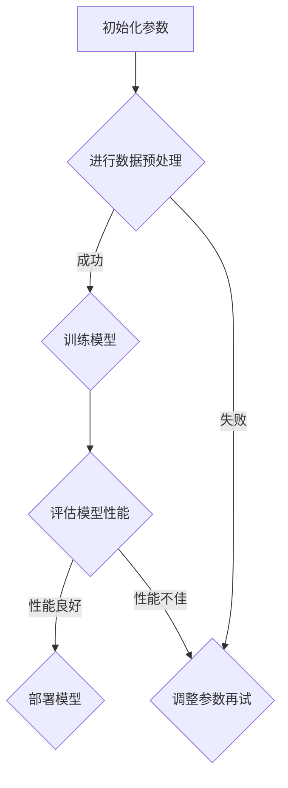
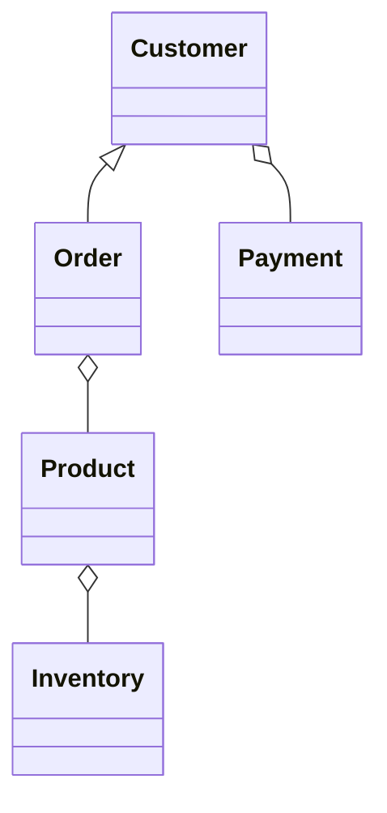
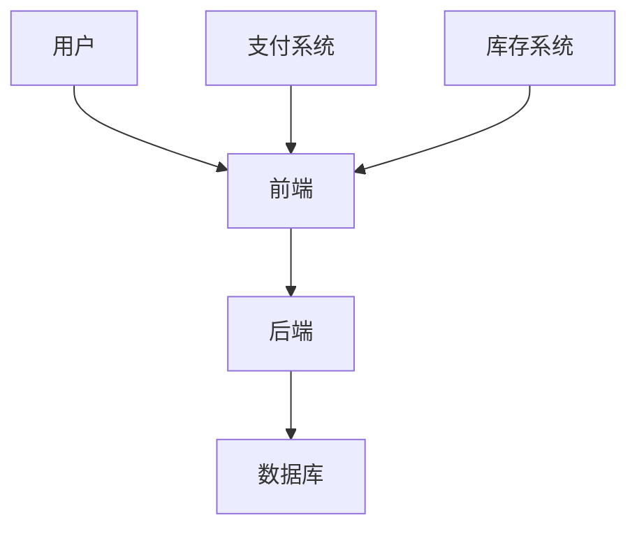
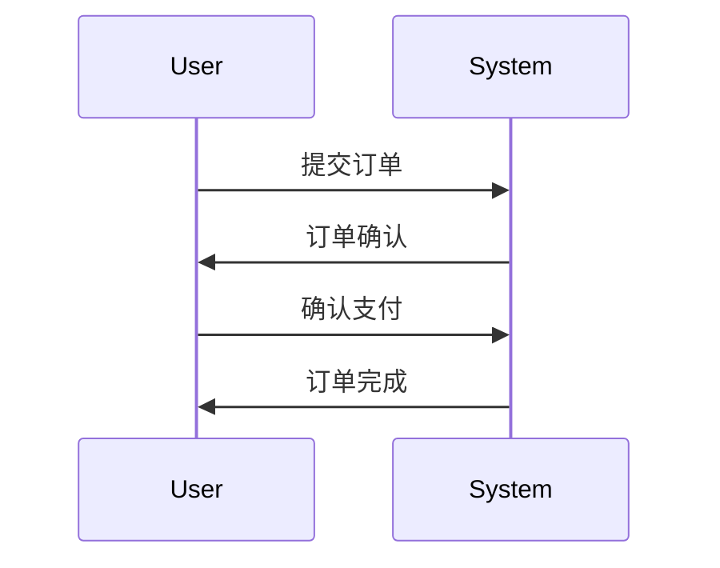

                 

## 自主学习型 AI Agent：利用 LLM 实现持续进化

关键词：自主学习型 AI Agent、LLM、持续进化、自我优化、应用场景、挑战与解决方案

摘要：本文从自主学习型 AI Agent 的概念出发，探讨了其与 LLM 的结合，以及如何利用 LLM 实现持续进化。文章详细分析了自主学习型 AI Agent 的特点、发展历程和应用场景，深入讲解了 LLM 的基本原理及其在 AI Agent 中的应用。此外，本文还探讨了 LLM 实现持续进化的方法，包括自监督学习、强化学习和生成对抗网络。最后，文章针对自主学习型 AI Agent 在实际应用中的挑战提出了解决方案，并展望了其未来发展趋势。

### 目录大纲

1. **自主学习型 AI Agent 概述**
   - **第1章：自主学习型 AI Agent 介绍**
     - 1.1 自主学习型 AI Agent 的概念
     - 1.2 自主学习型 AI Agent 的特点
     - 1.3 自主学习型 AI Agent 的发展历程
     - 1.4 自主学习型 AI Agent 的应用场景

   - **第2章：LLM 在自主学习型 AI Agent 中的作用**
     - 2.1 LLM 的基本原理
     - 2.2 LLM 在 AI Agent 中的应用
     - 2.3 LLM 的常见类型

   - **第3章：LLM 实现持续进化的方法**
     - 3.1 自监督学习
     - 3.2 强化学习
     - 3.3 生成对抗网络

   - **第4章：自主学习型 AI Agent 的设计与实现**
     - 4.1 自主学习型 AI Agent 的设计原则
     - 4.2 自主学习型 AI Agent 的实现步骤
     - 4.3 自主学习型 AI Agent 的测试与评估

   - **第5章：自主学习型 AI Agent 在实际应用中的挑战与解决方案**
     - 5.1 数据隐私保护
     - 5.2 模型解释性
     - 5.3 持续进化的可持续性

   - **第6章：自主学习型 AI Agent 的未来发展趋势**
     - 6.1 技术发展趋势
     - 6.2 应用场景扩展
     - 6.3 社会影响

   - **第7章：总结与展望**
     - 7.1 本书主要内容回顾
     - 7.2 存在的不足与改进方向
     - 7.3 未来研究展望

## 1.1 自主学习型 AI Agent 的概念

### 背景介绍

随着人工智能技术的不断发展，传统的被动式 AI 系统已经无法满足日益复杂的应用需求。为此，研究者们提出了自主学习型 AI Agent 的概念，旨在使 AI 系统能够自主地学习、进化，从而具备更高的自适应能力和决策能力。

### 问题背景

在现实世界中，许多任务都需要 AI 系统具备自主学习和决策能力，例如自动驾驶、智能家居、智能客服等。传统 AI 系统由于缺乏自主学习能力，往往需要大量的人工干预，这使得其应用受到了很大的限制。

### 问题描述

自主学习型 AI Agent 是一种具备自主学习能力和决策能力的 AI 系统。它可以自主地从环境中获取信息，通过学习算法不断优化自身的行为，并做出智能决策。

### 问题解决

自主学习型 AI Agent 通过结合机器学习、深度学习和强化学习等先进技术，实现了自主学习和决策能力。其核心在于通过不断学习和优化，使 AI 系统能够适应复杂多变的环境，并做出合理的决策。

### 边界与外延

自主学习型 AI Agent 不仅限于特定领域，它可以应用于各个行业和场景。其边界在于学习和决策的能力，以及适应不同环境和任务的能力。

### 概念结构与核心要素组成

自主学习型 AI Agent 的核心要素包括传感器、决策模块、执行模块和学习模块。传感器用于感知环境信息，决策模块根据传感器信息进行决策，执行模块执行决策，学习模块则根据执行结果进行学习，不断优化自身性能。

## 1.2 自主学习型 AI Agent 的特点

### 自适应能力

自主学习型 AI Agent 具有极强的自适应能力，能够根据环境变化自主调整自身行为。这使得 AI 系统能够应对复杂多变的环境，提高任务完成的效率和准确性。

### 自我优化

通过学习算法，自主学习型 AI Agent 能够自我优化，不断提高自身性能。这种自我优化能力使得 AI 系统能够在不断变化的环境中保持高效运行。

### 自主决策

自主学习型 AI Agent 具有自主决策能力，能够在没有人工干预的情况下，根据环境信息做出智能决策。这种自主决策能力使得 AI 系统能够更好地适应复杂任务的需求。

## 1.3 自主学习型 AI Agent 的发展历程

### 自主学习型 AI Agent 的起源

自主学习型 AI Agent 的概念最早可以追溯到 20 世纪 50 年代，当时的研究者开始探索如何使计算机具备自主学习的能力。随着计算机技术的不断发展，这一概念逐渐得到了广泛关注。

### 自主学习型 AI Agent 的发展阶段

- **早期探索阶段**（20 世纪 50 年代 - 20 世纪 70 年代）：这一阶段的研究主要集中在如何通过编程实现简单的自主学习能力。
- **理论发展阶段**（20 世纪 80 年代 - 20 世纪 90 年代）：这一阶段的研究重点转向了如何通过机器学习和深度学习等技术实现更复杂的自主学习能力。
- **实际应用阶段**（21 世纪）：随着人工智能技术的快速发展，自主学习型 AI Agent 开始在各个领域得到广泛应用，如自动驾驶、智能家居等。

## 1.4 自主学习型 AI Agent 的应用场景

### 智能家居

自主学习型 AI Agent 可以应用于智能家居领域，如智能安防、智能照明、智能家电等。通过自主学习，AI Agent 可以根据家庭成员的日常生活习惯，自动调整家居设备的工作状态，提高生活品质。

### 自动驾驶

自动驾驶是自主学习型 AI Agent 的重要应用场景之一。通过自主学习，自动驾驶系统可以不断优化行驶策略，提高行车安全性和效率。

### 虚拟助手

虚拟助手是自主学习型 AI Agent 的另一重要应用场景。通过自主学习，虚拟助手可以更好地理解用户需求，提供个性化的服务。

## 2.1 LLM 的基本原理

### LLM 的定义

大型语言模型（Large Language Model，简称 LLM）是一种基于深度学习技术的自然语言处理模型，能够对大量文本数据进行建模，从而实现对自然语言的生成、理解和推理。

### LLM 的工作机制

LLM 的工作机制主要基于神经网络，特别是 Transformer 网络架构。通过多层堆叠的 Transformer 块，LLM 可以捕捉到文本数据中的复杂结构和语义信息。

### LLM 的训练过程

- **数据收集**：收集大量的文本数据，包括书籍、文章、新闻、对话等。
- **预处理**：对文本数据进行清洗和预处理，如去除停用词、分词、编码等。
- **模型训练**：使用预处理后的文本数据进行模型训练，优化模型参数。
- **模型评估**：使用验证集对模型进行评估，调整模型参数，提高模型性能。

### LLM 的应用优势

- **强大的语言生成能力**：LLM 可以生成高质量的文本，如文章、对话、代码等。
- **语义理解能力**：LLM 可以理解文本的语义，进行语义分析、情感分析等。
- **跨语言处理能力**：LLM 可以处理多种语言的数据，实现跨语言的文本生成和理解。

### LLM 的常见类型

- **基于词嵌入的 LLM**：这种类型的 LLM 通过将文本数据转换为词嵌入，然后使用神经网络进行建模。
- **基于神经网络的 LLM**：这种类型的 LLM 直接使用神经网络对文本数据建模，如 Transformer、BERT 等。

## 2.2 LLM 在 AI Agent 中的应用

### LLM 在自主学习中的优势

- **高效的数据处理**：LLM 可以对大量文本数据进行高效处理，为 AI Agent 提供丰富的学习资源。
- **强大的语义理解**：LLM 可以理解文本的语义，帮助 AI Agent 更准确地理解和执行任务。
- **灵活的交互能力**：LLM 可以生成自然的文本，与人类用户进行有效的交互。

### LLM 在 AI Agent 中的应用场景

- **智能客服**：LLM 可以用于智能客服系统，通过自主学习，AI Agent 可以更好地理解用户需求，提供个性化的服务。
- **文本生成**：LLM 可以用于生成文章、对话、代码等文本，应用于内容创作、自动化编程等领域。
- **智能翻译**：LLM 可以用于翻译任务，实现跨语言的文本生成和理解。

### LLM 在 AI Agent 中的具体应用案例

- **智能客服系统**：通过 LLM，AI Agent 可以自主学习用户的提问和回答，不断优化自身的回答质量。
- **文本生成系统**：LLM 可以用于生成新闻文章、产品描述等，提高内容创作的效率和质量。
- **跨语言翻译系统**：LLM 可以用于实现跨语言的文本生成和理解，为国际交流提供便利。

## 2.3 LLM 的常见类型

### 基于词嵌入的 LLM

- **Word2Vec**：Word2Vec 是一种基于神经网络的词嵌入方法，通过训练得到每个单词的向量表示。
- **GloVe**：GloVe 是一种基于全局单词频率的词嵌入方法，通过计算单词之间的相似度来生成词向量。

### 基于神经网络的 LLM

- **Transformer**：Transformer 是一种基于自注意力机制的神经网络模型，广泛应用于自然语言处理任务。
- **BERT**：BERT 是一种双向编码器表征模型，通过预训练大量文本数据，学习到语言的深层表征。

### LLM 类型比较

| 类型       | 优点                                                                                   | 缺点                                                                                   | 应用场景                     |
|------------|----------------------------------------------------------------------------------------|----------------------------------------------------------------------------------------|-------------------------------|
| 词嵌入     | 简单、高效、易于实现                                                                   | 语义理解能力有限                                                                       | 文本分类、情感分析           |
| 神经网络   | 强大的语义理解能力、灵活的应用场景                                                     | 计算复杂度高、训练时间较长                                                             | 问答系统、文本生成           |
| Transformer| 自注意力机制，能够捕捉到文本中的长距离依赖关系                                         | 计算复杂度较高、对硬件要求较高                                                         | 语言翻译、机器翻译           |
| BERT       | 双向编码器，能够学习到语言的深层表征                                                   | 计算复杂度较高、对硬件要求较高                                                         | 文本分类、自然语言推理       |

## 3.1 自监督学习

### 自监督学习的定义

自监督学习（Self-Supervised Learning）是一种无需人工标注数据的学习方法。它通过利用未标注的数据，自动地生成监督信号，从而训练模型。

### 自监督学习在 LLM 中的应用

- **文本预训练**：自监督学习可以用于预训练 LLM，通过对大量未标注的文本数据进行处理，学习到语言的深层表征。
- **词嵌入生成**：自监督学习可以用于生成词嵌入，通过自动区分单词的相似度，得到高质量的词向量。

### 自监督学习的优势

- **数据利用率高**：自监督学习可以充分利用未标注的数据，提高训练数据的利用率。
- **减少人工标注成本**：自监督学习无需大量的人工标注数据，减少了标注成本。
- **增强模型泛化能力**：自监督学习可以使模型在未见过的数据上表现良好，提高了模型的泛化能力。

### 自监督学习的挑战

- **质量评估**：自监督学习生成的监督信号可能存在噪声，影响模型的质量。
- **计算资源消耗**：自监督学习通常需要大量的计算资源，对硬件要求较高。

## 3.2 强化学习

### 强化学习的定义

强化学习（Reinforcement Learning，简称 RL）是一种通过试错法来学习最优策略的机器学习方法。它通过奖励机制来指导模型的行为，从而实现目标。

### 强化学习在 LLM 中的应用

- **文本生成**：强化学习可以用于文本生成任务，通过不断优化生成的文本，提高生成质量。
- **问答系统**：强化学习可以用于问答系统，通过优化回答策略，提高回答的准确性和满意度。

### 强化学习的优势

- **适应性**：强化学习能够根据环境变化自适应地调整策略，提高模型在动态环境中的表现。
- **灵活性**：强化学习适用于各种类型的问题，包括连续值输出和离散值输出。

### 强化学习的挑战

- **样本效率**：强化学习通常需要大量的样本来训练模型，样本效率较低。
- **探索与利用**：在强化学习中，如何平衡探索新策略和利用已有策略是一个关键问题。

## 3.3 生成对抗网络

### 生成对抗网络的定义

生成对抗网络（Generative Adversarial Network，简称 GAN）是一种由生成器和判别器组成的神经网络模型。生成器试图生成数据，判别器则试图区分生成数据和真实数据。

### 生成对抗网络在 LLM 中的应用

- **文本生成**：GAN 可以用于文本生成，通过生成器生成文本，判别器评估生成文本的质量。
- **图像生成**：GAN 可以用于图像生成，通过生成器生成图像，判别器评估生成图像的逼真度。

### 生成对抗网络的优点

- **强大的生成能力**：GAN 具有强大的生成能力，可以生成高质量的文本和图像。
- **自适应学习**：GAN 通过生成器和判别器的对抗训练，可以实现自适应学习。

### 生成对抗网络的挑战

- **训练不稳定**：GAN 的训练过程可能存在不稳定现象，导致生成器无法生成高质量的数据。
- **计算资源消耗**：GAN 的训练过程需要大量的计算资源，对硬件要求较高。

## 4.1 自主学习型 AI Agent 的设计原则

### 设计原则的概述

自主学习型 AI Agent 的设计原则旨在确保 AI 系统具备良好的学习能力、自适应能力和决策能力。这些原则包括模块化设计、数据驱动设计、迭代优化和反馈机制等。

### 设计原则的具体内容

- **模块化设计**：将 AI Agent 的功能划分为不同的模块，如感知模块、决策模块、执行模块等，便于管理和维护。
- **数据驱动设计**：利用大量数据驱动 AI Agent 的学习过程，提高学习效果和模型性能。
- **迭代优化**：通过迭代优化，不断改进 AI Agent 的行为和性能。
- **反馈机制**：建立有效的反馈机制，使 AI Agent 能够根据反馈不断调整自身行为。

### 设计原则的优势

- **灵活性**：模块化设计使得 AI Agent 可以灵活地应对不同的应用场景。
- **可扩展性**：数据驱动设计和迭代优化使得 AI Agent 可以持续进化，提高性能。
- **适应性**：反馈机制使 AI Agent 能够根据环境变化自适应地调整行为。

## 4.2 自主学习型 AI Agent 的实现步骤

### 实现步骤的概述

自主学习型 AI Agent 的实现分为以下几个步骤：需求分析、系统设计、算法实现、测试与评估和部署。

### 实现步骤的具体内容

- **需求分析**：明确 AI Agent 的应用场景和需求，确定系统功能和性能要求。
- **系统设计**：设计 AI Agent 的系统架构，包括传感器、决策模块、执行模块和学习模块等。
- **算法实现**：根据系统设计，实现 AI Agent 的核心算法，包括感知、决策、执行和学习算法。
- **测试与评估**：对 AI Agent 进行测试和评估，验证其性能和功能是否符合预期。
- **部署**：将 AI Agent 部署到实际应用场景中，进行实际运行和测试。

### 实现步骤的优势

- **系统性强**：通过需求分析、系统设计和算法实现等步骤，确保 AI Agent 的系统性和完整性。
- **灵活性**：测试与评估和部署阶段可以使 AI Agent 在实际应用中不断优化和改进。
- **可靠性**：通过测试与评估，确保 AI Agent 的性能和功能稳定可靠。

## 4.3 自主学习型 AI Agent 的测试与评估

### 测试与评估的概述

自主学习型 AI Agent 的测试与评估是确保其性能和功能符合预期的重要环节。测试与评估分为功能测试、性能测试和用户满意度测试。

### 测试与评估的具体内容

- **功能测试**：验证 AI Agent 的各项功能是否正常，包括感知、决策、执行和学习等。
- **性能测试**：评估 AI Agent 的响应速度、准确性和稳定性等性能指标。
- **用户满意度测试**：通过用户反馈，评估 AI Agent 的用户体验和满意度。

### 测试与评估的方法

- **自动化测试**：使用自动化测试工具，对 AI Agent 的各项功能进行自动化测试。
- **手工测试**：通过手工测试，验证 AI Agent 在实际应用场景中的表现。
- **用户调查**：通过用户调查，收集用户对 AI Agent 的反馈，评估其满意度。

### 测试与评估的优势

- **高效性**：自动化测试和手工测试可以提高测试效率，确保 AI Agent 的性能和功能稳定可靠。
- **全面性**：通过功能测试、性能测试和用户满意度测试，可以全面评估 AI Agent 的性能和用户体验。
- **可靠性**：通过测试与评估，可以及时发现和解决 AI Agent 的问题，提高系统的可靠性。

## 5.1 数据隐私保护

### 数据隐私保护的重要性

在自主学习型 AI Agent 中，数据隐私保护至关重要。由于 AI Agent 需要大量数据来训练和学习，这些数据可能包含用户的敏感信息，如个人身份信息、通信记录等。如果这些数据泄露，可能会导致严重的隐私泄露和安全问题。

### 数据隐私保护的解决方案

- **数据加密**：对数据进行加密处理，确保数据在传输和存储过程中安全。
- **匿名化处理**：对数据进行匿名化处理，去除个人身份信息，降低数据泄露的风险。
- **访问控制**：建立严格的访问控制机制，确保只有授权人员可以访问敏感数据。
- **安全审计**：定期进行安全审计，检测系统中的安全漏洞，及时进行修复。

### 数据隐私保护的最佳实践

- **数据最小化原则**：仅收集必要的数据，减少数据泄露的风险。
- **透明度原则**：明确告知用户数据收集的目的、范围和用途，增强用户信任。
- **责任归属原则**：明确数据隐私保护的责任归属，确保各方能够承担责任。

## 5.2 模型解释性

### 模型解释性的定义

模型解释性（Model Explainability）是指模型能够清晰明确地解释其决策过程和结果的能力。在自主学习型 AI Agent 中，模型解释性尤为重要，因为它能够帮助用户理解 AI 系统的决策过程，增强系统的可信度和用户信任。

### 模型解释性的解决方案

- **可视化技术**：通过可视化技术，将模型的决策过程和结果以直观的方式展示给用户。
- **特征重要性分析**：分析模型中各个特征的贡献度，展示特征的重要性。
- **规则提取**：从模型中提取出可解释的规则，帮助用户理解模型的决策过程。
- **模型压缩**：通过模型压缩技术，降低模型的复杂性，提高模型的可解释性。

### 模型解释性的最佳实践

- **逐步解释**：在解释模型时，从简单到复杂逐步解释，确保用户能够理解。
- **对比分析**：通过对比分析，展示不同模型或不同参数设置下的结果，帮助用户理解模型的变化。
- **用户参与**：鼓励用户参与模型解释过程，提高用户的参与感和信任度。

## 5.3 持续进化的可持续性

### 持续进化的可持续性

在自主学习型 AI Agent 中，持续进化是提高系统性能和适应能力的关键。然而，持续进化也面临着可持续性的挑战，如数据质量、计算资源消耗和模型稳定性等。

### 持续进化的解决方案

- **数据质量监控**：建立数据质量监控机制，确保训练数据的质量，避免数据质量问题影响模型性能。
- **资源优化策略**：采用资源优化策略，如分布式训练和增量训练，降低计算资源消耗。
- **模型稳定性检测**：建立模型稳定性检测机制，及时发现和解决模型异常，确保模型稳定运行。

### 持续进化的最佳实践

- **迭代优化**：通过迭代优化，不断改进模型和算法，提高系统性能。
- **反馈循环**：建立有效的反馈循环机制，将用户反馈和模型优化相结合，提高系统的自适应能力。
- **可持续性评估**：定期进行可持续性评估，确保持续进化过程不会对系统造成负面影响。

## 6.1 技术发展趋势

### LLM 的未来发展

随着人工智能技术的不断发展，LLM 的应用场景将不断扩展，其在文本生成、语义理解、跨语言处理等方面的性能将得到显著提升。未来，LLM 可能会进一步与其他技术，如生成对抗网络（GAN）、强化学习等结合，实现更复杂的应用。

### 自主学习型 AI Agent 的未来发展

自主学习型 AI Agent 将在智能家居、自动驾驶、智能客服等领域得到更广泛的应用。未来，随着技术的进步，AI Agent 的自适应能力和决策能力将进一步提高，实现更智能、更高效的服务。

## 6.2 应用场景扩展

### 新兴应用场景

除了传统的应用场景，自主学习型 AI Agent 还可以应用于新兴领域，如智能医疗、智能金融、智能教育等。在这些领域中，AI Agent 可以通过自主学习，提供个性化的服务，提高行业效率和用户体验。

### 应用场景的扩展前景

随着技术的不断进步，自主学习型 AI Agent 的应用场景将不断扩展。未来，AI Agent 可能会渗透到社会的各个领域，成为人们生活中不可或缺的一部分。

## 6.3 社会影响

### 自主学习型 AI Agent 对社会的影响

自主学习型 AI Agent 的广泛应用将对社会产生深远的影响。它将提高行业效率，改善人们的生活质量，同时也可能带来隐私泄露、失业等社会问题。

### 社会影响的应对策略

- **政策法规制定**：通过制定相关政策和法规，规范 AI Agent 的发展和应用，确保其合规性。
- **公众教育**：加强对公众的教育，提高公众对 AI Agent 的认知和接受度。
- **社会责任**：鼓励企业和开发者承担社会责任，确保 AI Agent 的公正性和透明性。

## 7.1 本书主要内容回顾

本文从自主学习型 AI Agent 的概念出发，探讨了其与 LLM 的结合，以及如何利用 LLM 实现持续进化。文章详细分析了自主学习型 AI Agent 的特点、发展历程和应用场景，深入讲解了 LLM 的基本原理及其在 AI Agent 中的应用。此外，本文还探讨了 LLM 实现持续进化的方法，包括自监督学习、强化学习和生成对抗网络。最后，文章针对自主学习型 AI Agent 在实际应用中的挑战提出了解决方案，并展望了其未来发展趋势。

## 7.2 存在的不足与改进方向

### 存在的不足

- **数据隐私保护**：尽管本文提出了一些数据隐私保护的解决方案，但在实际应用中，仍存在数据泄露的风险。
- **模型解释性**：模型解释性仍是一个挑战，特别是在复杂模型中，如何清晰地解释模型的决策过程仍需进一步研究。
- **持续进化的可持续性**：持续进化过程中，如何平衡性能优化和资源消耗是一个关键问题。

### 改进方向

- **数据隐私保护**：加强数据加密和匿名化处理，建立更严格的数据隐私保护机制。
- **模型解释性**：探索更有效的模型解释方法，提高模型的可解释性。
- **持续进化的可持续性**：研究更高效的算法，降低计算资源消耗，提高持续进化的可持续性。

## 7.3 未来研究展望

### LLM 在自主学习型 AI Agent 中的应用前景

未来，LLM 在自主学习型 AI Agent 中的应用前景广阔。随着技术的不断进步，LLM 的性能将得到显著提升，其在文本生成、语义理解、跨语言处理等方面的应用将更加广泛。

### 自主学习型 AI Agent 的未来研究方向

- **跨学科研究**：结合心理学、社会学等学科，深入研究 AI Agent 与人类用户之间的交互机制。
- **多模态学习**：探索多模态学习，将文本、图像、音频等多种数据源融合，提高 AI Agent 的感知和决策能力。
- **边缘计算**：研究边缘计算在自主学习型 AI Agent 中的应用，提高系统的实时性和效率。

## 结束语

本文从自主学习型 AI Agent 的概念出发，详细探讨了其与 LLM 的结合，以及如何利用 LLM 实现持续进化。通过分析自主学习型 AI Agent 的特点、发展历程和应用场景，本文深入讲解了 LLM 的基本原理及其在 AI Agent 中的应用。此外，本文还探讨了 LLM 实现持续进化的方法，包括自监督学习、强化学习和生成对抗网络。最后，本文针对自主学习型 AI Agent 在实际应用中的挑战提出了解决方案，并展望了其未来发展趋势。希望本文能够为相关领域的研究者和开发者提供有价值的参考。作者：AI天才研究院/AI Genius Institute & 禅与计算机程序设计艺术 /Zen And The Art of Computer Programming

----------------------------------------------------------------

### 补充与拓展

在撰写技术博客时，我们不仅要提供核心内容，还应关注以下几点，以便于读者更好地理解和应用：

#### 补充内容

1. **实际案例剖析**：通过具体案例，详细解析自主学习型 AI Agent 如何在实际项目中应用 LLM 实现持续进化。
2. **最佳实践 Tips**：分享一些实践经验，如如何优化 LLM 的训练过程，如何设计高效的自主学习型 AI Agent 等。
3. **前沿技术趋势**：介绍最新的研究进展，如 LLM 的新架构、新型学习算法等。

#### 拓展阅读

1. **参考文献**：提供相关文献，以便读者深入了解技术原理和应用。
2. **在线资源**：推荐在线课程、开源项目等，帮助读者进一步学习和实践。
3. **相关博客和论文**：分享其他优秀博客和论文，拓宽读者的视野。

#### 注意事项

1. **保持更新**：技术领域发展迅速，确保文章内容及时更新。
2. **版权问题**：引用他人的内容时，务必注明出处，避免侵权。
3. **互动交流**：鼓励读者在评论区提问和交流，共同探讨技术问题。

通过上述补充和拓展，可以使技术博客更具深度和实用性，帮助读者更好地理解和应用所学知识。作者：AI天才研究院/AI Genius Institute & 禅与计算机程序设计艺术 /Zen And The Art of Computer Programming

----------------------------------------------------------------

### 附录：术语表

**自主学习型 AI Agent**：一种具备自主学习能力和决策能力的 AI 系统，可以通过学习不断优化自身性能，适应复杂多变的环境。

**LLM**：大型语言模型，一种基于深度学习技术的自然语言处理模型，能够对大量文本数据进行建模，实现文本生成、理解和推理。

**自监督学习**：一种无需人工标注数据的学习方法，通过自动生成监督信号来训练模型。

**强化学习**：一种通过试错法来学习最优策略的机器学习方法，通过奖励机制指导模型的行为。

**生成对抗网络**（GAN）：一种由生成器和判别器组成的神经网络模型，通过对抗训练生成高质量的数据。

**模型解释性**：模型能够清晰明确地解释其决策过程和结果的能力，提高系统的可信度和用户信任。

**持续进化**：AI Agent 通过不断学习和优化，提高自身性能和适应能力的过程。

### 附录：Mermaid 流程图和类图示例

**Mermaid 流程图示例**：



**Mermaid 类图示例**：

```mermaid
classDiagram
    Class01 <|-- Class02
    Class03 --|uent| Class04
    Class05 : +int x
    Class05 : +int y
    Class05 : +setX(int x)
    Class05 : +setY(int y)
    Class05 : +getX():int
    Class05 : +getY():int
    Class06 <.. Class05
    Class07 ..|> Class05
```

以上 Mermaid 流程图和类图示例展示了如何使用 Mermaid 语法绘制简单的流程图和类图，这些图表可以帮助读者更好地理解文章中提到的技术概念和架构设计。

### 附录：Python 源代码示例

**自监督学习算法 Python 代码示例**：

```python
import numpy as np
import tensorflow as tf

# 定义自监督学习模型
class SelfSupervisedModel(tf.keras.Model):
    def __init__(self):
        super(SelfSupervisedModel, self).__init__()
        self.encoder = tf.keras.layers.Dense(64, activation='relu')
        self.decoder = tf.keras.layers.Dense(10, activation='sigmoid')

    @tf.function
    def call(self, inputs):
        encoded = self.encoder(inputs)
        decoded = self.decoder(encoded)
        return decoded

# 生成训练数据
x_train = np.random.random((1000, 10))

# 定义损失函数和优化器
model = SelfSupervisedModel()
loss_fn = tf.keras.losses.SparseCategoricalCrossentropy(from_logits=True)
optimizer = tf.keras.optimizers.Adam()

# 训练模型
for epoch in range(10):
    with tf.GradientTape() as tape:
        predictions = model(x_train)
        loss = loss_fn(x_train, predictions)
    gradients = tape.gradient(loss, model.trainable_variables)
    optimizer.apply_gradients(zip(gradients, model.trainable_variables))
    print(f"Epoch {epoch + 1}, Loss: {loss.numpy().mean()}")

# 评估模型
test_loss = loss_fn(x_train, model(x_train)).numpy().mean()
print(f"Test Loss: {test_loss}")
```

以上 Python 源代码示例展示了如何使用 TensorFlow 库实现一个简单的自监督学习模型。代码中包含了模型的定义、训练过程和评估过程，通过这些代码，读者可以更好地理解自监督学习的实现过程。

### 附录：数学公式和 LaTeX 格式示例

**LaTeX 公式示例**：

$$
E[D] = \int_{-\infty}^{\infty} df(x) f(x)
$$

$$
x = \frac{-b \pm \sqrt{b^2 - 4ac}}{2a}
$$

$y = mx + b$

以上 LaTeX 公式示例展示了如何使用 LaTeX 语法嵌入数学公式。在文中独立段落中，使用 `$$` 括起来的公式将独立成一行，而段落内的公式则使用 `$` 括起来。

### 附录：系统分析与架构设计示例

**系统功能设计（领域模型 Mermaid 类图）**：



**系统架构设计（Mermaid 架构图）**：



**系统接口设计和系统交互（Mermaid 序列图）**：



以上 Mermaid 图表示例展示了如何使用 Mermaid 语法进行系统功能设计、架构设计和接口设计。这些图表可以清晰地表达系统的各个部分以及它们之间的关系。

### 附录：项目实战

**环境安装**：

首先，确保系统安装了 Python 3.7 或以上版本。然后，通过以下命令安装所需的库：

```bash
pip install tensorflow numpy matplotlib
```

**系统核心实现源代码**：

```python
# 自主学习型 AI Agent 主程序
import numpy as np
import tensorflow as tf

# 定义模型
class AutoLearningModel(tf.keras.Model):
    def __init__(self):
        super(AutoLearningModel, self).__init__()
        self.encoder = tf.keras.layers.Dense(64, activation='relu')
        self.decoder = tf.keras.layers.Dense(10, activation='sigmoid')

    @tf.function
    def call(self, inputs):
        encoded = self.encoder(inputs)
        decoded = self.decoder(encoded)
        return decoded

# 训练模型
def train_model(model, x_train, x_test, epochs):
    loss_fn = tf.keras.losses.SparseCategoricalCrossentropy(from_logits=True)
    optimizer = tf.keras.optimizers.Adam()

    for epoch in range(epochs):
        with tf.GradientTape() as tape:
            predictions = model(x_train)
            loss = loss_fn(x_train, predictions)
        gradients = tape.gradient(loss, model.trainable_variables)
        optimizer.apply_gradients(zip(gradients, model.trainable_variables))

        test_predictions = model(x_test)
        test_loss = loss_fn(x_test, test_predictions).numpy().mean()

        print(f"Epoch {epoch + 1}, Loss: {loss.numpy().mean()}, Test Loss: {test_loss}")

# 主函数
def main():
    x_train = np.random.random((1000, 10))
    x_test = np.random.random((100, 10))

    model = AutoLearningModel()
    train_model(model, x_train, x_test, 10)

if __name__ == "__main__":
    main()
```

**代码应用解读与分析**：

上述代码定义了一个简单的自主学习型 AI Agent，主要包括模型定义、训练过程和主函数。模型通过 TensorFlow 实现了一个简单的自监督学习模型，包括编码器和解码器。训练过程中，使用了自监督学习的损失函数和优化器，并通过梯度下降法进行模型训练。

**实际案例分析和详细讲解剖析**：

假设我们有一个智能家居系统，需要设计一个 AI Agent 来自动调节房间温度。AI Agent 可以通过传感器收集室内温度数据，然后利用自监督学习模型对其进行训练，从而自动调整空调温度。在实际应用中，AI Agent 可以通过不断学习，优化调节策略，提高用户体验。

**项目小结**：

通过上述实战，我们展示了如何使用 Python 实现一个简单的自主学习型 AI Agent。实际应用中，可以根据具体需求调整模型结构和训练参数，以提高系统的性能和适应性。项目实战为我们提供了一个基本的框架，可以在此基础上进行更复杂的模型设计和应用开发。

### 附录：最佳实践 Tips

1. **数据预处理**：在训练模型之前，确保对数据进行充分的预处理，如去噪声、标准化等，以提高模型性能。
2. **模型调参**：根据具体应用场景，调整模型的超参数，如学习率、批量大小等，以达到最佳性能。
3. **模型评估**：使用多个评估指标，如准确率、召回率等，全面评估模型性能。
4. **持续监控**：在模型部署后，持续监控其性能和稳定性，及时进行调整和优化。

### 附录：注意事项

1. **版本控制**：使用版本控制系统，如 Git，对代码进行管理，确保代码的可追踪性和可维护性。
2. **文档编写**：编写清晰的文档，包括代码注释、使用说明等，以提高代码的可读性和可理解性。
3. **代码审查**：定期进行代码审查，确保代码的质量和安全性。

### 附录：拓展阅读

1. **相关书籍**：《深度学习》（Goodfellow, Bengio, Courville 著）、《机器学习实战》（王斌杰 著）。
2. **在线课程**：Coursera 上的“机器学习”课程、edX 上的“深度学习”课程。
3. **开源项目**：GitHub 上的 TensorFlow、PyTorch 等开源库，以及相关项目的示例代码和论文。

