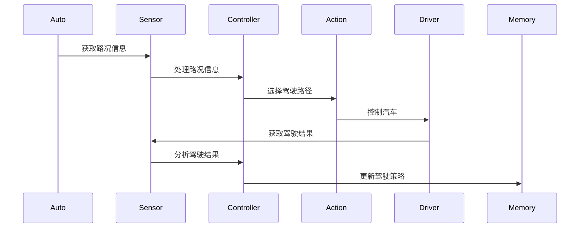
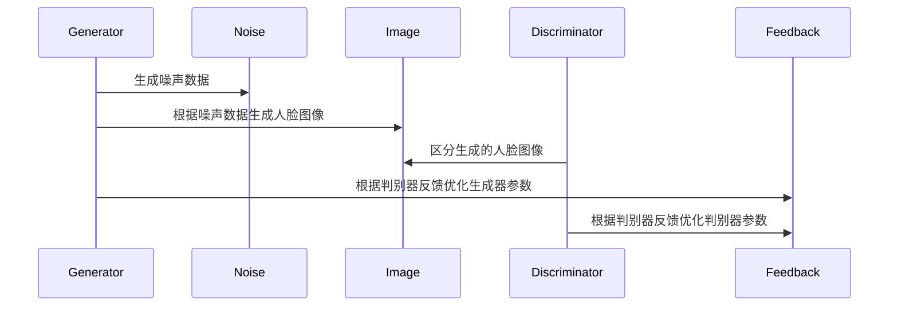
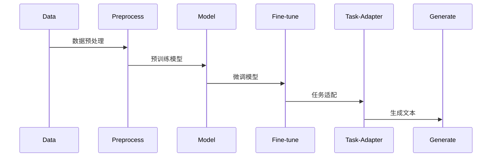
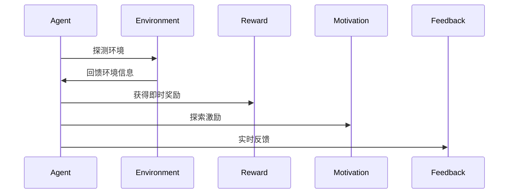
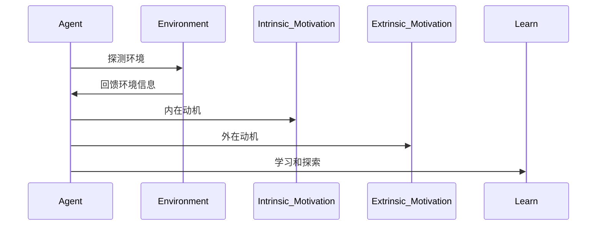
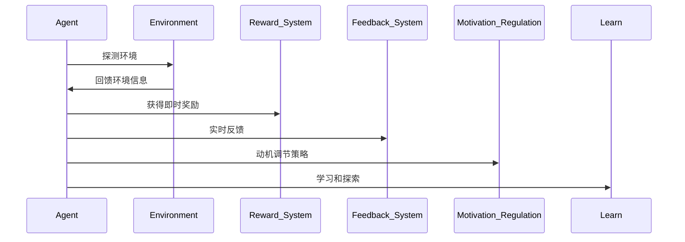
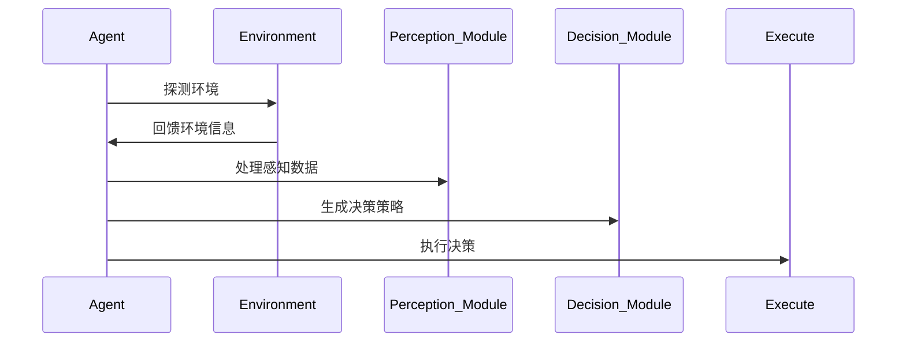
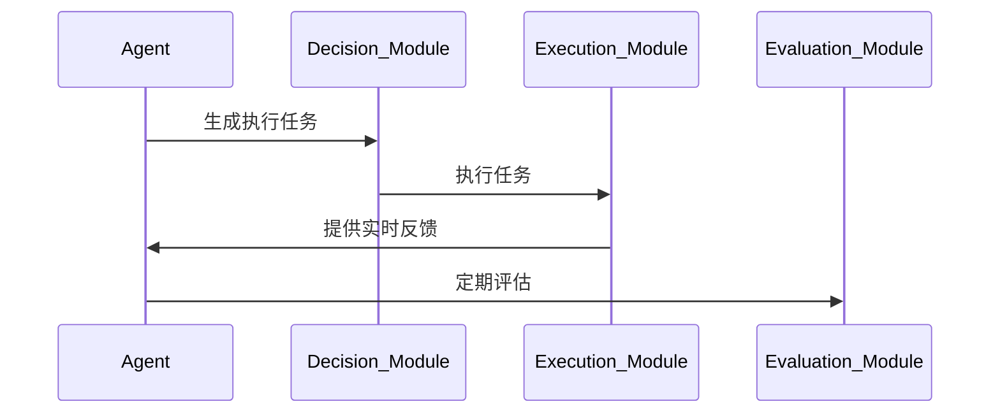
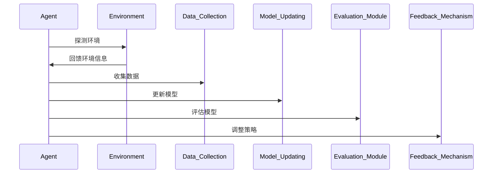

                 

### 1.1 问题背景

随着人工智能技术的迅猛发展，人工智能（AI）已经从传统的被动响应型系统转变为更加主动的探索型系统。这一转变标志着人工智能发展进入了一个新的阶段。传统的AI系统依赖于预先定义好的规则和模型，无法自主进行探索和学习。而现代的AI，特别是基于大规模预训练模型（Large Language Models, LLM）的AI，开始展现出更强的自主学习和自主决策能力。

**人工智能发展的新阶段**：

- **被动响应到主动探索**：早期的AI系统主要是在特定任务上实现自动化，只能处理被给予的数据。而现代的AI，如基于LLM的系统，可以主动探索未知的领域，进行自我学习和自我优化。
- **自主性**：现代AI系统不再只是执行给定的任务，而是能够根据自己的经验进行决策和调整。这种自主性使得AI在复杂和动态的环境中表现更加出色。
- **学习性**：随着AI技术的进步，系统可以通过学习来优化自己的行为。这种学习能力使得AI能够不断进步，适应新的环境和任务。

**自主探索型AI Agent的重要性**：

- **模拟人类行为**：自主探索型AI Agent能够模拟人类的好奇心和学习动机，主动探索新的领域，进行学习和决策。这为AI在未知环境中的表现提供了巨大的潜力。
- **适应性和灵活性**：自主探索型AI Agent能够在动态变化的环境中自主适应，通过探索和学习来应对新的挑战。这种适应性和灵活性是未来智能系统的重要特性。
- **创新和发现**：自主探索型AI Agent具有创新的能力，能够在探索过程中发现新的规律和模式。这为科学研究和发明创造提供了新的可能性。

**当前研究的不足**：

- **缺乏自主学习能力**：尽管现代AI系统具备了一定的学习能力，但大部分系统仍缺乏自主学习的真正能力。它们只能在有限的范围内进行优化，无法进行更广泛的自主探索和学习。
- **缺乏自主决策能力**：自主决策是自主探索的基础。当前AI系统在决策过程中往往依赖于预设的规则和模型，无法实现真正的自主决策。
- **缺乏自主探索能力**：尽管AI系统可以进行探索，但往往是基于某些特定的目标和任务，缺乏内在的好奇心和探索动机。这限制了AI在未知领域的探索能力。

**问题解决**：

为了解决当前研究的不足，我们需要设计一种新型的AI Agent，即自主探索型AI Agent。这种AI Agent将基于大规模预训练模型（LLM），结合强化学习、生成对抗网络（GAN）等技术，实现自主探索和学习能力。

- **设计LLM驱动的AI Agent架构**：利用LLM作为核心决策引擎，结合强化学习、GAN等技术，构建一个能够自主探索和学习的AI Agent。
- **好奇心机制**：通过设计内在动机系统，激发AI Agent的好奇心，引导其探索未知领域。
- **学习动机**：通过奖励机制和反馈系统，引导AI Agent持续学习和优化行为。

### 1.2 问题描述

#### 定义

自主探索型AI Agent（Autonomous Explorative AI Agent）是一种能够自主探索未知环境、基于内在好奇心和学习动机进行决策和学习的智能体。它不同于传统的被动响应型AI，而是能够主动地探索、学习、决策和适应。

#### 关键特性

- **自主性**：AI Agent能够独立进行决策，不需要外部干预。它可以根据自身的学习和经验，自主地探索新的领域。
- **探索性**：AI Agent具有强烈的探索动机，能够主动地寻找新的信息和经验。这种探索性使得AI Agent能够在未知环境中发现新的规律和模式。
- **适应性**：AI Agent能够根据环境的变化和学习到的经验，动态地调整自己的行为和策略。这种适应性使得AI Agent能够在复杂和动态的环境中保持有效的表现。
- **学习性**：AI Agent具有持续学习的动机和能力。它可以通过探索和学习来优化自己的行为和决策，不断提高自己的性能。

#### 研究边界

本文的研究边界主要集中在基于大规模预训练模型（LLM）的AI Agent的自主探索和学习动机。我们将探讨如何利用LLM作为核心决策引擎，结合强化学习、生成对抗网络（GAN）等技术，实现AI Agent的自主探索和学习能力。具体研究内容包括：

- **LLM驱动的AI Agent架构设计**：研究如何利用LLM作为核心决策引擎，构建一个具备自主探索和学习能力的AI Agent。
- **好奇心机制设计**：研究如何设计内在动机系统，激发AI Agent的好奇心，引导其探索未知领域。
- **学习动机机制设计**：研究如何设计奖励机制和反馈系统，引导AI Agent持续学习和优化行为。
- **应用场景与案例分析**：探讨AI Agent在不同领域和应用场景中的表现和适应性。

#### 研究外延

除了本文的研究边界，自主探索型AI Agent的研究还有许多外延和潜力。以下是一些可能的研究方向：

- **跨领域应用**：探索AI Agent在不同领域（如机器人探索、数据挖掘、科学发现等）的应用潜力。
- **多模态感知**：研究如何利用多模态感知数据（如图像、声音、文本等），增强AI Agent的探索和学习能力。
- **社会互动**：研究AI Agent在社会环境中的互动和协作能力，探索其在社会网络中的表现和适应性。
- **伦理和责任**：探讨AI Agent在自主探索和学习过程中可能遇到的伦理和责任问题，研究相应的解决方案。

#### 概念结构与核心要素组成

自主探索型AI Agent的构成可以分解为感知模块、决策模块、执行模块和学习模块。每个模块在AI Agent的自主探索和学习过程中都扮演着关键角色。

- **感知模块**：负责接收外部环境的信息，如文本、图像、声音等。感知模块利用大规模预训练模型（LLM）对感知数据进行处理和抽象，提取有用的特征信息。
- **决策模块**：基于感知模块提供的信息，决策模块利用LLM进行决策。决策模块结合好奇心和学习动机，指导AI Agent在探索过程中进行选择。
- **执行模块**：根据决策模块的决策结果，执行具体的行动。执行模块将决策转化为实际的物理动作或操作，如机器人的移动、数据采集等。
- **学习模块**：学习模块负责对AI Agent的行为和决策进行反馈和优化。通过强化学习和生成对抗网络（GAN）等技术，学习模块不断提升AI Agent的探索和学习能力。

LLM在自主探索型AI Agent中的作用不可忽视。作为核心决策引擎，LLM提供高层次的抽象和泛化能力，使得AI Agent能够处理复杂的感知数据和进行复杂的决策。同时，LLM还具有强大的知识表示能力，能够帮助AI Agent在探索和学习过程中进行有效的知识整合和利用。

好奇心与学习动机的关联在于，好奇心驱动AI Agent的探索行为，而学习动机则驱动AI Agent的持续学习和优化。好奇心使得AI Agent有动力去探索未知领域，而学习动机则确保AI Agent在探索过程中能够不断积累知识和经验，优化自己的行为和决策。

### 1.3 问题解决

为了设计一种能够自主探索和学习的AI Agent，我们需要构建一个基于大规模预训练模型（LLM）的架构，并结合强化学习和生成对抗网络（GAN）等技术。以下是我们解决问题的步骤：

#### 设计LLM驱动的AI Agent架构

1. **选择合适的LLM模型**：首先，我们需要选择一个具有强大语言理解和生成能力的LLM模型，如GPT-3或BERT。这些模型已经在大规模数据集上进行了预训练，能够提供高层次的抽象和泛化能力。
   
2. **集成LLM到AI Agent架构中**：将选定的LLM模型集成到AI Agent的感知模块、决策模块、执行模块和学习模块中。在感知模块中，LLM可以处理和抽象外部信息；在决策模块中，LLM可以用于进行复杂的决策；在执行模块中，LLM可以指导具体的行动；在学习模块中，LLM可以用于知识表示和整合。

#### 好奇心机制设计

1. **定义好奇心评价指标**：为了设计好奇心机制，我们需要定义一系列好奇心评价指标，如探索多样性、探索深度、探索效率等。这些指标将帮助我们衡量AI Agent的探索行为是否符合好奇心驱动的特性。

2. **设计内在动机系统**：内在动机系统是激发AI Agent好奇心的关键。我们可以通过以下方法设计内在动机系统：
   - **奖励机制**：根据AI Agent的探索行为，设计相应的奖励机制。例如，当AI Agent探索到新的领域或发现新的知识时，可以给予奖励。
   - **探索激励**：通过设计探索激励，如增加探索的奖励、减少失败的惩罚等，来增强AI Agent的探索动力。

3. **动态调整好奇心强度**：好奇心强度是一个动态变化的参数。根据AI Agent在不同阶段的探索行为，我们可以动态调整好奇心强度，以适应不同的探索场景。例如，在初始阶段，可以设置较高的好奇心强度，以鼓励AI Agent进行广泛的探索；在成熟阶段，可以降低好奇心强度，以促使AI Agent进行更深入的探索和学习。

#### 学习动机机制设计

1. **设计奖励机制**：学习动机的关键在于奖励机制。我们可以通过以下方法设计奖励机制：
   - **任务完成奖励**：当AI Agent成功完成某个任务时，给予奖励。这可以激励AI Agent进行持续的学习和优化。
   - **知识创新奖励**：当AI Agent在探索过程中发现新的知识或规律时，给予奖励。这可以鼓励AI Agent进行创新性探索。

2. **设计反馈系统**：反馈系统是AI Agent学习的重要途径。我们可以通过以下方法设计反馈系统：
   - **实时反馈**：在AI Agent执行任务的过程中，实时收集反馈信息，并根据反馈信息调整后续行为。
   - **定期评估**：定期对AI Agent的学习效果进行评估，并根据评估结果调整学习策略。

3. **动态调整学习动机强度**：学习动机强度也是一个动态变化的参数。根据AI Agent在不同阶段的学习行为，我们可以动态调整学习动机强度，以适应不同的学习场景。例如，在初始阶段，可以设置较高的学习动机强度，以激励AI Agent进行快速学习；在成熟阶段，可以降低学习动机强度，以促使AI Agent进行更深入的学习和优化。

#### 系统实现与优化

1. **集成多种技术**：将强化学习、生成对抗网络（GAN）等技术集成到AI Agent的架构中，以实现自主探索和学习能力。例如，可以使用强化学习算法来优化AI Agent的决策过程，使用GAN来增强AI Agent的探索能力。

2. **持续优化和迭代**：根据AI Agent在不同场景和应用中的表现，不断进行优化和迭代。这包括调整好奇心和学习动机机制、改进感知和决策模块等。

通过以上步骤，我们可以设计并实现一个基于LLM驱动的自主探索型AI Agent。这种AI Agent将能够模拟人类的好奇心和学习动机，主动探索未知领域，并进行自我学习和优化。这将极大地推动人工智能技术的发展，为智能系统的设计和应用提供新的思路和可能性。

### 1.4 边界与外延

在探讨自主探索型AI Agent的研究时，我们需要明确研究的边界和可能的外延。

#### 研究边界

本文的研究主要聚焦于基于大规模预训练模型（LLM）的AI Agent的自主探索和学习动机。具体而言，我们的研究边界包括：

- **技术层面**：本文将探讨如何利用LLM作为核心决策引擎，结合强化学习、生成对抗网络（GAN）等技术，构建自主探索型AI Agent。
- **应用场景**：本文将探讨AI Agent在特定领域和应用场景中的表现和适应性，如机器人探索、数据挖掘、科学发现等。
- **研究方法**：本文将采用理论分析、算法设计、系统实现和案例分析等方法，系统性地研究自主探索型AI Agent的机制和性能。

#### 研究外延

尽管本文的研究有明确的边界，但自主探索型AI Agent的研究外延非常广泛。以下是一些可能的研究方向：

- **跨领域应用**：探索AI Agent在不同领域（如医疗、金融、教育等）中的应用潜力。例如，研究AI Agent在医疗诊断中的自主探索能力，或是在金融投资中的自我学习和优化能力。
- **多模态感知**：研究如何利用多模态感知数据（如图像、声音、文本等）增强AI Agent的探索和学习能力。例如，结合图像和文本信息，提高AI Agent在未知环境中的感知能力。
- **社会互动**：研究AI Agent在社会环境中的互动和协作能力，探索其在社会网络中的表现和适应性。例如，研究AI Agent在团队合作中的协调和沟通能力，或是在社会事件中的角色扮演和决策。
- **伦理和责任**：探讨AI Agent在自主探索和学习过程中可能遇到的伦理和责任问题，研究相应的解决方案。例如，如何确保AI Agent的行为符合伦理规范，或是在决策过程中如何平衡不同利益相关者的需求。

通过这些外延性研究，我们可以进一步深化对自主探索型AI Agent的理解，拓展其在各种领域和应用场景中的适用范围。这不仅有助于推动人工智能技术的发展，也为构建更加智能和可靠的智能系统提供了新的思路和方法。

### 1.5 概念结构与核心要素组成

自主探索型AI Agent（Autonomous Explorative AI Agent）的构建涉及多个模块的协同工作，每个模块在AI Agent的自主探索和学习过程中都发挥着关键作用。以下是自主探索型AI Agent的概念结构与核心要素组成：

#### 感知模块

感知模块是AI Agent与外部环境交互的接口。其主要功能是接收外部环境的信息，如文本、图像、声音等。感知模块利用大规模预训练模型（LLM）对这些感知数据进行处理和抽象，提取有用的特征信息。具体包括：

- **输入处理**：接收多种类型的数据输入，如文本、图像、声音等。
- **数据预处理**：对输入数据进行清洗、归一化和编码，以便LLM能够进行处理。
- **特征提取**：利用LLM对预处理后的数据进行分析，提取关键特征信息。

#### 决策模块

决策模块是AI Agent的核心，基于感知模块提供的信息，利用LLM进行复杂的决策。决策模块结合好奇心和学习动机，指导AI Agent在探索过程中进行选择。具体包括：

- **决策模型**：使用LLM构建决策模型，通过处理感知数据生成决策建议。
- **好奇心评估**：根据好奇心评价指标，评估当前决策是否能够满足好奇心需求。
- **学习动机评估**：根据学习动机机制，评估当前决策是否符合学习动机。

#### 执行模块

执行模块根据决策模块的决策结果，执行具体的行动。执行模块将决策转化为实际的物理动作或操作，如机器人的移动、数据采集等。具体包括：

- **执行计划**：根据决策结果，制定具体的执行计划。
- **动作执行**：执行预定的动作，如机器人的移动、机械臂的操作等。
- **状态监控**：实时监控执行过程，确保动作的准确性和安全性。

#### 学习模块

学习模块负责对AI Agent的行为和决策进行反馈和优化。通过强化学习和生成对抗网络（GAN）等技术，学习模块不断提升AI Agent的探索和学习能力。具体包括：

- **行为反馈**：收集执行过程中的反馈信息，如成功、失败、异常等。
- **模型优化**：利用反馈信息，优化决策和学习模型，提高AI Agent的性能。
- **知识整合**：将新学到的知识和经验整合到已有知识库中，增强AI Agent的泛化能力。

#### LLM的作用

作为核心决策引擎，LLM在自主探索型AI Agent中发挥着至关重要的作用。它不仅提供了高层次的抽象和泛化能力，还能够处理复杂的感知数据和进行复杂的决策。具体包括：

- **感知数据处理**：LLM能够对多种类型的感知数据（如图像、声音、文本）进行处理和分析，提取关键特征信息。
- **决策生成**：LLM能够根据感知数据和已有知识库，生成具体的决策建议，指导AI Agent的探索和学习。
- **知识表示**：LLM能够将新学到的知识和经验表示为高层次的抽象概念，增强AI Agent的泛化能力和知识整合能力。

#### 好奇心与学习动机的关联

好奇心和学习动机是自主探索型AI Agent的重要驱动力。好奇心驱动AI Agent的探索行为，而学习动机则驱动AI Agent的持续学习和优化。二者之间的关联主要体现在以下几个方面：

- **好奇心驱动探索**：好奇心激发AI Agent的探索欲望，促使它主动探索未知领域，发现新的信息和知识。
- **学习动机驱动学习**：学习动机激发AI Agent的学习欲望，促使它根据探索过程中的反馈和奖励，不断优化自己的行为和决策。
- **动态调整**：好奇心和学习动机是动态变化的参数。根据AI Agent在不同阶段的探索和学习行为，可以动态调整好奇心和学习动机的强度，以适应不同的探索和学习场景。

通过以上各模块的协同工作，自主探索型AI Agent能够模拟人类的好奇心和学习动机，自主探索未知领域，进行自我学习和优化。这种能力不仅提升了AI Agent在复杂和动态环境中的适应能力，也为人工智能技术的发展提供了新的思路和可能性。

### 第2章：自主探索型AI Agent的理论基础

自主探索型AI Agent的构建不仅需要先进的技术手段，还需要深厚的理论基础。在这一章中，我们将探讨几个核心的理论基础，包括强化学习、生成对抗网络（GAN）和大规模预训练模型（LLM）。这些理论不仅为自主探索型AI Agent的设计提供了指导，也为实现其自主探索和学习能力奠定了基础。

#### 2.1 强化学习

强化学习是一种通过试错学习来优化行为策略的机器学习方法。它通过奖励机制和策略迭代，使得智能体在动态环境中能够找到最优的行为路径。强化学习的基本概念和算法包括：

- **基本概念**：
  - **状态（State）**：智能体当前所处的环境状态。
  - **动作（Action）**：智能体可以采取的行为。
  - **奖励（Reward）**：每次动作后，环境给予的即时反馈。
  - **策略（Policy）**：智能体根据当前状态选择动作的规则。

- **Q-Learning算法**：
  Q-Learning是一种基于价值函数的强化学习算法。它通过更新状态-动作价值函数（Q值）来优化行为策略。
  - **Q值**：表示在特定状态下采取特定动作的期望收益。
  - **更新公式**：\( Q(s, a) = Q(s, a) + \alpha [r + \gamma \max_{a'} Q(s', a') - Q(s, a)] \)
    - \( \alpha \)：学习率，控制更新强度。
    - \( r \)：即时奖励。
    - \( \gamma \)：折扣因子，表示未来奖励的重要性。

- **Deep Q-Network（DQN）**：
  DQN是Q-Learning的一种扩展，使用深度神经网络（DNN）来近似Q值函数。它通过经验回放和目标网络（Target Network）来缓解Q值函数的过拟合问题。
  - **经验回放**：将智能体的经验存储在经验池中，并从中随机抽取样本来更新Q值函数。
  - **目标网络**：一个与当前网络结构相同的网络，用于生成目标Q值。

强化学习在自主探索型AI Agent中的应用主要体现在以下几个方面：

- **路径规划**：智能体可以在未知的地图中通过强化学习找到最优路径。
- **资源分配**：智能体可以根据环境状态和资源需求，通过强化学习进行资源的最优分配。
- **任务完成**：智能体可以学习如何完成任务，并在复杂和动态的环境中找到最佳解决方案。

#### 2.2 生成对抗网络（GAN）

生成对抗网络（Generative Adversarial Network，GAN）是一种由生成器（Generator）和判别器（Discriminator）组成的对抗性网络。GAN通过两个网络的相互对抗，使得生成器能够生成逼真的数据。

- **基本原理**：
  - **生成器（Generator）**：生成器从随机噪声中生成与真实数据分布相近的数据。
  - **判别器（Discriminator）**：判别器区分生成器生成的数据和真实数据。
  - **对抗过程**：生成器和判别器通过一个博弈过程相互对抗。生成器的目标是生成尽可能真实的数据，而判别器的目标是正确分类数据。这个对抗过程使得生成器不断优化其生成能力。

- **训练过程**：
  - **训练判别器**：通过真实数据和生成数据，训练判别器区分两者。
  - **训练生成器**：通过对抗训练，生成器尝试生成更真实的数据以欺骗判别器。

GAN的应用非常广泛，包括图像生成、数据增强、异常检测等：

- **图像生成**：GAN能够生成高质量的图像，如人脸、风景等。
- **数据增强**：GAN可以用于生成更多的训练样本，提高模型的泛化能力。
- **异常检测**：GAN可以用于检测异常数据，如识别恶意软件、金融欺诈等。

GAN在自主探索型AI Agent中的应用主要体现在以下几个方面：

- **环境模拟**：生成器可以用于模拟未知的或复杂的环境，帮助AI Agent进行训练和测试。
- **数据生成**：生成器可以生成新的探索数据，丰富AI Agent的经验库。
- **行为模拟**：通过生成真实的行为数据，AI Agent可以在虚拟环境中进行行为学习和优化。

#### 2.3 大规模预训练模型（LLM）

大规模预训练模型（Large Language Models，LLM）是近年来人工智能领域的重要突破。LLM通过在大规模数据集上预训练，获得强大的语言理解和生成能力，可以应用于多种自然语言处理任务。

- **基本原理**：
  - **预训练**：LLM在大规模文本语料库上进行预训练，学习语言结构和知识。
  - **微调**：在特定任务上，对LLM进行微调，使其适应特定应用。

- **训练过程**：
  - **预训练**：通过自注意力机制（Self-Attention Mechanism）和Transformer架构，LLM学习语言中的复杂关系和模式。
  - **微调**：将预训练好的LLM应用于特定任务，调整模型参数以适应任务需求。

- **核心优势**：
  - **高层次的抽象能力**：LLM能够捕捉到文本中的高层次语义和概念，提供强大的语言理解能力。
  - **泛化能力**：LLM通过大规模预训练，具备良好的泛化能力，可以在不同任务和应用中表现出色。
  - **知识表示能力**：LLM能够将知识表示为高层次的抽象概念，为智能体提供丰富的知识背景。

LLM在自主探索型AI Agent中的应用主要包括：

- **感知数据处理**：LLM可以处理和抽象感知数据，为AI Agent提供高质量的特征信息。
- **决策支持**：LLM可以用于生成决策建议，指导AI Agent在探索过程中的决策。
- **知识整合**：LLM可以将新学到的知识和经验整合到已有知识库中，增强AI Agent的泛化能力和决策能力。

通过结合强化学习、生成对抗网络（GAN）和大规模预训练模型（LLM），自主探索型AI Agent能够实现自主探索和学习能力。这些理论基础不仅为AI Agent的设计提供了指导，也为实现其自主性和灵活性提供了关键支持。

### 3.1 好奇心驱动模型

好奇心是驱动自主探索型AI Agent的重要动力之一。为了设计一个有效的自主探索机制，我们需要构建一个好奇心驱动模型，该模型能够模拟人类的好奇心行为，并引导AI Agent在探索过程中保持持续的兴趣和动机。以下是好奇心驱动模型的核心概念和实现方法。

#### 好奇心驱动模型的核心概念

好奇心驱动模型主要基于以下几个核心概念：

1. **探索多样性**：AI Agent在探索过程中需要保持多样性，避免陷入局部最优。探索多样性可以通过增加AI Agent在不同方向上的探索机会来实现。

2. **探索深度**：AI Agent需要在探索过程中不断深入，以发现更多有价值的信息。探索深度可以通过设计一个衡量深度指标（如访问次数、探索时长）来评估。

3. **探索效率**：AI Agent需要在有限的时间和资源内最大化其探索收益。探索效率可以通过优化AI Agent的决策过程，减少无效的探索行为来实现。

4. **内在动机系统**：内在动机系统是激发AI Agent好奇心的关键。它通过奖励机制、探索激励和反馈系统来驱动AI Agent的探索行为。

#### 好奇心驱动模型的实现方法

1. **奖励机制**：奖励机制是好奇心驱动模型的核心组成部分。通过设计适当的奖励机制，AI Agent可以在探索过程中获得即时奖励，从而增强其探索动力。奖励机制可以包括以下几个方面：

   - **任务完成奖励**：当AI Agent成功完成某个探索任务时，给予奖励。
   - **知识创新奖励**：当AI Agent在探索过程中发现新的知识或规律时，给予奖励。
   - **探索奖励**：当AI Agent进行有效的探索行为时，给予奖励，鼓励其继续探索。

2. **探索激励**：探索激励是通过增加探索的奖励和减少失败的惩罚来激发AI Agent的好奇心。探索激励可以包括以下几个方面：

   - **探索激励系数**：通过设置探索激励系数，增加AI Agent探索行为的奖励。
   - **探索目标激励**：设置明确的探索目标，给予AI Agent达成目标的额外激励。
   - **探索时间激励**：通过延长探索时间来增加AI Agent的探索机会，从而激发其好奇心。

3. **反馈系统**：反馈系统是好奇心驱动模型的重要组成部分。它通过实时收集AI Agent的探索行为和结果，为AI Agent提供即时反馈，帮助其调整探索策略。反馈系统可以包括以下几个方面：

   - **实时反馈**：在AI Agent执行探索任务时，实时收集执行结果，为AI Agent提供即时反馈。
   - **定期评估**：定期对AI Agent的探索效果进行评估，为AI Agent提供长期反馈。
   - **反馈调整**：根据AI Agent的探索行为和反馈结果，动态调整探索策略和奖励机制。

#### 好奇心评价指标

为了评估AI Agent的探索行为是否符合好奇心驱动的特性，我们需要定义一系列好奇心评价指标。这些评价指标包括：

1. **探索多样性**：通过计算AI Agent在不同方向上的探索次数和覆盖范围来衡量。

2. **探索深度**：通过计算AI Agent访问某个领域的次数和探索时长来衡量。

3. **探索效率**：通过计算AI Agent在单位时间内获得的奖励和探索收益来衡量。

4. **好奇心满足度**：通过计算AI Agent在探索过程中获得的奖励和预期奖励的比值来衡量。

通过以上指标，我们可以全面评估AI Agent的探索行为，并据此调整好奇心驱动模型的设计和实现。

#### 动机调节策略

为了确保AI Agent在不同场景和应用中的适应能力，我们需要设计一套动机调节策略，动态调整好奇心和学习动机的强度。动机调节策略可以包括以下几个方面：

1. **动态调整好奇心强度**：根据AI Agent的探索行为和环境变化，动态调整好奇心强度。例如，在初始阶段，可以设置较高的好奇心强度，鼓励AI Agent进行广泛探索；在成熟阶段，可以降低好奇心强度，促使AI Agent进行更深入的探索和学习。

2. **适应性调节**：根据AI Agent在不同领域的探索表现，调整好奇心和学习动机的适应性。例如，对于探索难度较大的领域，可以增加好奇心和学习动机的强度，以激励AI Agent进行更深入的探索。

3. **场景感知调节**：根据AI Agent所处的环境和场景，动态调整好奇心和学习动机的强度。例如，在复杂和动态的环境中，可以增加好奇心和学习动机的强度，以增强AI Agent的探索和学习能力。

通过以上策略，我们可以确保AI Agent在不同场景和应用中都能够保持高效和稳定的探索和学习行为。

### 3.2 好奇心机制实现

为了实现自主探索型AI Agent的好奇心机制，我们需要设计一个综合性的内在动机系统。这个系统包括奖励机制、探索激励和反馈系统，以激发AI Agent的好奇心，引导其进行有效的探索和学习。以下是具体的设计方法和实现步骤。

#### 奖励机制

奖励机制是好奇心机制的核心组成部分，它通过给予AI Agent即时奖励，激励其在探索过程中保持兴趣和动力。奖励机制的实现可以包括以下几个方面：

1. **任务完成奖励**：当AI Agent成功完成一个探索任务时，如发现新的信息或解决问题，给予相应的奖励。这种奖励可以增强AI Agent的成就感，并激励其继续探索。

2. **知识创新奖励**：当AI Agent在探索过程中发现新的知识或规律时，如识别出之前未知的模式，给予额外的奖励。这种奖励可以鼓励AI Agent进行更加创新和深入的探索。

3. **探索奖励**：在AI Agent进行探索时，无论成功与否，都给予一定的探索奖励。这种奖励可以激励AI Agent持续进行探索，即使遇到困难和挑战。

4. **动态奖励**：根据AI Agent的探索行为和环境变化，动态调整奖励的强度和类型。例如，在初始探索阶段，可以设置较高的奖励，以鼓励AI Agent进行广泛探索；在成熟阶段，可以减少奖励，促使AI Agent进行更深入的探索和学习。

#### 探索激励

探索激励是通过增加探索的奖励和减少失败的惩罚，来激发AI Agent的好奇心。具体实现方法包括：

1. **探索激励系数**：设计一个探索激励系数，乘以AI Agent在探索过程中获得的奖励。这个系数可以根据不同的探索任务和环境进行调整，以增强探索动力。

2. **探索目标激励**：设置明确的探索目标，如发现特定类型的知识或信息，达成目标后给予额外的激励。这种激励可以引导AI Agent有目的地进行探索，并激发其好奇心。

3. **探索时间激励**：通过延长AI Agent的探索时间，增加其探索的机会。例如，可以设置一个探索时间上限，在达到时间上限前，AI Agent可以获得额外的探索奖励，以鼓励其继续探索。

#### 反馈系统

反馈系统是好奇心机制的重要组成部分，它通过实时收集AI Agent的探索行为和结果，为AI Agent提供即时反馈，帮助其调整探索策略。具体实现方法包括：

1. **实时反馈**：在AI Agent执行探索任务时，实时收集任务执行结果，如成功、失败、异常等。根据这些结果，AI Agent可以立即获得反馈，调整后续的探索行为。

2. **定期评估**：定期对AI Agent的探索效果进行评估，包括探索的多样性、深度和效率等指标。通过评估结果，可以调整好奇心机制的设计和实现，优化AI Agent的探索行为。

3. **反馈调整**：根据AI Agent的探索行为和反馈结果，动态调整好奇心机制的各个组成部分，如奖励强度、探索激励系数等。这种动态调整可以确保AI Agent在不同阶段和环境中的适应能力。

#### 动态调整好奇心强度

为了确保AI Agent在不同场景和应用中都能够保持高效和稳定的探索和学习行为，我们需要设计一套动态调整好奇心强度的策略。具体方法包括：

1. **初始阶段**：在探索的初始阶段，可以设置较高的好奇心强度，鼓励AI Agent进行广泛探索，以发现尽可能多的新信息。

2. **成熟阶段**：在探索的成熟阶段，可以逐渐降低好奇心强度，促使AI Agent进行更深入的探索和学习，优化已有的知识体系。

3. **适应性调节**：根据AI Agent在不同领域的探索表现，动态调整好奇心强度。例如，对于探索难度较大的领域，可以增加好奇心强度，以激励AI Agent克服困难；对于探索难度较低的领域，可以降低好奇心强度，以提高探索效率。

4. **场景感知调节**：根据AI Agent所处的环境和场景，动态调整好奇心强度。例如，在复杂和动态的环境中，可以增加好奇心强度，以增强AI Agent的探索和学习能力；在稳定和熟悉的环境中，可以降低好奇心强度，以保持稳定的探索行为。

通过以上设计方法和实现步骤，我们可以构建一个有效的内在动机系统，激发AI Agent的好奇心，引导其进行自主探索和学习。这将极大地提升AI Agent在复杂和动态环境中的适应能力和探索效率，推动人工智能技术的发展和应用。

### 4.1 学习动机的定义

学习动机是指驱使AI Agent进行学习和优化行为的内在驱动力。它是自主探索型AI Agent的核心组成部分，直接影响AI Agent的学习效果和探索效率。学习动机可以分为内在动机和外在动机，它们在AI Agent的学习过程中扮演着不同的角色。

#### 内在动机

内在动机是指AI Agent自身产生的、源于探索和学习过程中的内在兴趣和需求。这种动机源于AI Agent的内在好奇心、求知欲和对知识的渴望。内在动机的特点包括：

- **自主性**：内在动机不需要外部激励，AI Agent会自发地产生学习兴趣。
- **持久性**：内在动机能够长时间维持AI Agent的学习动力，使其持续进行学习和优化。
- **适应性**：内在动机能够根据不同的探索和学习任务，动态调整学习强度和策略。

内在动机在自主探索型AI Agent中的应用非常广泛。例如，当AI Agent在探索过程中发现新的知识或规律时，会激发其内在的好奇心和求知欲，促使它进一步学习和探索。这种内在动机可以驱动AI Agent在复杂和动态的环境中保持持续的学习和优化。

#### 外在动机

外在动机是指外部环境给予的、用于激励AI Agent学习和优化行为的奖励和惩罚。这种动机通常包括任务奖励、绩效评估、竞争激励等。外在动机的特点包括：

- **依赖性**：外在动机依赖于外部环境和激励，AI Agent的学习行为往往受到外部奖励和惩罚的影响。
- **即时性**：外在动机通常产生即时的激励效果，能够迅速提升AI Agent的学习兴趣。
- **可操控性**：通过设计不同的奖励和惩罚机制，可以灵活调整外在动机的强度和类型。

外在动机在AI Agent的学习过程中也发挥着重要作用。例如，通过设置任务奖励，可以激励AI Agent尽快完成任务；通过绩效评估，可以促使AI Agent不断提高自己的学习效果。外在动机可以与内在动机相结合，共同驱动AI Agent的学习过程。

#### 混合动机

混合动机是指将内在动机和外在动机结合起来，形成一种综合性的学习动机系统。这种动机系统能够更好地激发AI Agent的学习兴趣和动力，提高其学习效果和探索效率。

- **协同作用**：内在动机和外在动机的协同作用可以产生更强的学习动力。内在动机提供持久的学习兴趣，外在动机提供即时的激励效果，二者结合可以激发AI Agent的全面学习潜力。
- **动态调整**：根据不同的探索和学习任务，可以动态调整内在动机和外在动机的权重，以适应不同的学习需求。例如，在初始探索阶段，可以增加内在动机的权重，鼓励AI Agent自主探索；在任务完成阶段，可以增加外在动机的权重，激励AI Agent尽快完成任务。

#### 类型与应用

根据不同的应用场景和任务需求，学习动机可以分为以下几种类型：

1. **任务驱动动机**：通过设定明确的学习任务和目标，激励AI Agent进行学习和优化。这种动机适用于有明确目标和任务场景的AI系统。

2. **竞争驱动动机**：通过引入竞争机制，如排行榜、竞赛等，激发AI Agent的竞争意识和学习动力。这种动机适用于需要激励AI Agent不断进步和提升的场景。

3. **奖励驱动动机**：通过给予AI Agent奖励，如分数、奖励点数等，激励其进行学习和探索。这种动机适用于需要激励AI Agent完成特定任务或达到特定目标的场景。

4. **反馈驱动动机**：通过提供实时反馈和评估，激励AI Agent不断调整和优化学习策略。这种动机适用于需要不断调整和改进AI Agent学习效果的场景。

总之，学习动机是自主探索型AI Agent的重要驱动力。通过合理设计和运用内在动机、外在动机和混合动机，可以激发AI Agent的学习兴趣和动力，提升其探索和学习能力，为人工智能技术的发展和应用提供强有力的支持。

### 4.2 学习动机机制实现

为了实现自主探索型AI Agent的学习动机，我们需要设计一套综合性的机制，通过奖励系统、反馈系统和动机调节策略，激发AI Agent的内在和外在学习动力，并确保其持续优化和学习。以下是具体的设计和实现方法。

#### 奖励系统

奖励系统是激发AI Agent学习动机的重要机制之一。它通过给予AI Agent即时奖励，激励其在探索和学习过程中保持积极的态度和行为。以下是奖励系统的具体实现方法：

1. **即时奖励**：当AI Agent在探索过程中取得显著进展或完成任务时，立即给予奖励。这种奖励可以是数值奖励、评分奖励或其他形式的即时反馈，以增强AI Agent的成就感和学习动力。

   - **任务完成奖励**：例如，当AI Agent成功完成任务时，给予一定分数或奖励点数。
   - **知识创新奖励**：例如，当AI Agent在探索过程中发现新的知识或规律时，给予额外的奖励。

2. **长期奖励**：除了即时奖励外，还可以设计长期奖励机制，以鼓励AI Agent在长期探索和学习过程中保持持续的努力。

   - **阶段奖励**：根据AI Agent在不同阶段的探索和学习成果，设置阶段性的奖励。例如，在探索初期，可以设置较低的目标和奖励，随着探索的深入，逐渐提高目标难度和奖励强度。
   - **总积分奖励**：通过累积AI Agent在探索和学习过程中的积分，定期给予奖励。这种奖励可以激励AI Agent持续努力，不断提高自己的表现。

3. **动态奖励**：根据AI Agent的探索行为和环境变化，动态调整奖励的强度和类型。

   - **奖励系数**：设置不同的奖励系数，根据AI Agent在不同探索方向上的表现，动态调整奖励强度。
   - **奖励类型**：根据不同的探索任务和环境需求，灵活调整奖励的类型和方式，以最大化AI Agent的学习效果。

#### 反馈系统

反馈系统是确保AI Agent学习效果的重要机制，它通过提供实时反馈和评估，帮助AI Agent及时调整和优化学习策略。以下是反馈系统的具体实现方法：

1. **即时反馈**：在AI Agent执行探索任务时，实时收集任务执行结果，如成功、失败、异常等，并提供即时反馈。

   - **任务完成情况**：及时告知AI Agent任务完成的情况，如任务成功或失败。
   - **错误分析**：当任务失败时，提供错误分析，帮助AI Agent了解失败原因，以便进行改进。

2. **定期评估**：定期对AI Agent的探索和学习效果进行评估，包括探索的多样性、深度和效率等指标。

   - **绩效评估**：通过定期评估AI Agent的探索和学习成果，评估其绩效和表现。
   - **改进建议**：根据评估结果，为AI Agent提供改进建议，帮助其优化探索和学习策略。

3. **反馈调整**：根据AI Agent的探索行为和反馈结果，动态调整反馈系统和奖励系统的设计和实现。

   - **反馈强度**：根据AI Agent的表现，调整即时反馈和定期评估的强度和频率，以最大化其学习效果。
   - **奖励机制**：根据AI Agent的探索行为和评估结果，动态调整奖励机制的强度和类型，以激励其持续学习和优化。

#### 动机调节策略

为了确保AI Agent在不同场景和应用中都能够保持高效和稳定的学习行为，我们需要设计一套动机调节策略，动态调整好奇心和学习动机的强度。以下是动机调节策略的具体实现方法：

1. **初始阶段**：在探索的初始阶段，可以设置较高的好奇心和学习动机强度，鼓励AI Agent进行广泛探索和尝试。

   - **初始奖励**：设置较高的初始奖励，激励AI Agent积极进行探索和学习。
   - **初始反馈**：提供丰富的即时反馈和定期评估，帮助AI Agent了解探索和学习效果。

2. **成熟阶段**：在探索的成熟阶段，可以逐渐降低好奇心和学习动机强度，促使AI Agent进行更深入的探索和学习。

   - **降低奖励**：逐渐降低奖励强度，鼓励AI Agent进行长期和深入的探索。
   - **改进反馈**：提供更多关于探索和学习效果的评估和建议，帮助AI Agent不断优化学习策略。

3. **适应性调节**：根据AI Agent在不同领域的探索和学习表现，动态调整好奇心和学习动机的适应性。

   - **领域感知调节**：根据不同领域的探索难度和需求，调整好奇心和学习动机的强度。
   - **任务感知调节**：根据不同任务的特点和需求，调整好奇心和学习动机的强度和类型。

4. **动态调整**：根据AI Agent的实时表现和环境变化，动态调整好奇心和学习动机的强度。

   - **实时监控**：通过实时监控AI Agent的探索和学习行为，动态调整好奇心和学习动机的强度。
   - **反馈驱动调节**：根据AI Agent的反馈结果，动态调整好奇心和学习动机的强度和类型，以最大化其学习效果。

通过以上奖励系统、反馈系统和动机调节策略，我们可以构建一个有效的学习动机机制，激发AI Agent的内在和外在学习动力，确保其持续优化和学习，提升自主探索型AI Agent的性能和效果。

### 5.1 感知与决策

感知与决策是自主探索型AI Agent的核心环节，它们决定了AI Agent对环境的理解和行为选择。在感知模块中，AI Agent通过接收和处理外部信息来构建对环境的理解；在决策模块中，AI Agent则基于感知结果进行复杂的决策，以实现自主探索和学习。以下是感知与决策模块的具体设计方法和实现步骤。

#### 感知模块

感知模块是AI Agent与外部环境交互的接口，其主要任务是接收和处理外部信息，提取有用的特征信息。以下是感知模块的关键组成部分：

1. **数据接收**：
   - **多模态感知**：AI Agent可以通过多种模态（如视觉、听觉、文本等）接收外部信息，以全面理解环境。
   - **传感器集成**：集成各种传感器（如摄像头、麦克风、GPS等）来收集环境数据。

2. **数据处理**：
   - **预处理**：对收集到的数据进行清洗、归一化和编码，使其适合后续处理。
   - **特征提取**：利用大规模预训练模型（LLM）对预处理后的数据进行分析，提取关键特征信息。这些特征信息将用于后续的决策过程。

3. **信息整合**：
   - **上下文感知**：通过整合历史数据和环境信息，构建当前环境的上下文模型，以便更准确地理解当前状态。
   - **多源数据融合**：结合不同模态的数据，进行融合和协同处理，以提高感知的准确性和鲁棒性。

#### 决策模块

决策模块是AI Agent的核心，负责基于感知模块提供的信息进行复杂决策。以下是决策模块的关键组成部分：

1. **决策模型**：
   - **LLM集成**：利用大规模预训练模型（LLM）进行决策。LLM的高层次抽象和泛化能力使得决策模型能够处理复杂的感知数据和进行高效决策。
   - **多任务决策**：同时处理多个任务，如路径规划、资源分配、任务优先级等，以实现全面探索。

2. **好奇心与学习动机**：
   - **好奇心评估**：通过设计的好奇心机制，评估当前决策是否能够满足AI Agent的好奇心需求。
   - **学习动机评估**：根据学习动机机制，评估当前决策是否符合AI Agent的学习动机，以指导探索和学习行为。

3. **决策过程**：
   - **策略生成**：基于感知数据和当前状态，生成多个可能的决策策略。
   - **策略评估**：对每个决策策略进行评估，包括其潜在收益、风险和可行性等。
   - **策略选择**：根据评估结果，选择最优决策策略。

#### 实现步骤

1. **数据接收与预处理**：首先，AI Agent通过传感器和接口接收外部信息，并进行预处理，以提取关键特征信息。

2. **感知数据处理**：利用LLM对预处理后的感知数据进行处理，提取高级特征，构建环境模型。

3. **决策模型构建**：基于感知数据和LLM，构建决策模型，实现高效的感知数据处理和策略生成。

4. **好奇心与学习动机评估**：结合好奇心和学习动机机制，对决策策略进行评估，确保决策符合AI Agent的内在需求。

5. **决策策略选择与执行**：选择最优决策策略，并将其转化为具体的行动，如路径规划、资源分配等。

6. **反馈与学习**：根据执行结果和反馈，不断优化决策模型和学习机制，以提高AI Agent的探索和学习能力。

通过以上步骤，AI Agent能够实现对环境的感知和有效的决策，从而实现自主探索和学习。这一过程不仅需要感知模块和决策模块的紧密协同，还需要结合好奇心和学习动机，确保AI Agent在复杂和动态的环境中能够持续优化和适应。

### 5.2 执行与评估

执行与评估模块是自主探索型AI Agent的核心组成部分，它将决策模块生成的决策转化为实际的物理行动，并根据执行结果对AI Agent的行为和学习进行评估和调整。以下是执行与评估模块的具体设计方法和实现步骤。

#### 执行模块

执行模块负责根据决策模块的决策结果，将抽象的决策转化为实际的物理行动。以下是执行模块的关键组成部分：

1. **执行计划**：
   - **任务分解**：将复杂的决策任务分解为具体的执行步骤，如移动、操作、数据采集等。
   - **执行策略**：根据决策结果，制定具体的执行策略，确保任务能够高效和准确地完成。

2. **动作执行**：
   - **物理执行**：根据执行策略，驱动机器人的机械臂、移动等物理动作，或执行数据处理、通信等虚拟任务。
   - **资源管理**：确保执行过程中所需资源（如电能、网络带宽等）的合理分配和利用。

3. **实时监控**：
   - **状态监测**：实时监控执行过程中的状态和参数，如速度、精度、温度等，确保执行过程的稳定和安全。
   - **异常处理**：在执行过程中检测到异常情况时，及时采取应对措施，如暂停、重试或调整策略。

#### 评估模块

评估模块负责对AI Agent的执行结果进行评估，以确定其行为的有效性，并据此调整后续的探索和学习策略。以下是评估模块的关键组成部分：

1. **评估指标**：
   - **任务完成度**：评估任务是否按照预期完成，包括任务的准确度、完成时间和资源消耗等。
   - **探索效率**：评估AI Agent在探索过程中的效率和效果，包括探索深度、多样性、成功率等。
   - **学习效果**：评估AI Agent在学习过程中的效果，包括知识掌握程度、策略优化情况等。

2. **实时反馈**：
   - **即时反馈**：在执行过程中，根据执行结果和状态监测信息，提供即时反馈，帮助AI Agent快速调整执行策略。
   - **阶段性反馈**：在任务完成后，提供阶段性评估和反馈，为AI Agent的后续学习和优化提供参考。

3. **评估调整**：
   - **反馈机制**：根据实时反馈和阶段性评估结果，动态调整好奇心和学习动机的强度，以优化AI Agent的探索和学习行为。
   - **策略优化**：根据评估结果，优化决策模型和执行策略，以提高AI Agent的执行效率和效果。

#### 实现步骤

1. **决策执行**：根据决策模块生成的决策结果，制定具体的执行计划，并驱动执行模块执行物理或虚拟任务。

2. **实时监控**：在执行过程中，实时监控任务状态和参数，确保执行过程的安全和稳定。

3. **结果评估**：根据执行结果，提供实时和阶段性的反馈，评估任务完成度和探索效率，以及学习效果。

4. **反馈调整**：根据评估结果，动态调整好奇心和学习动机的强度，以及决策模型和执行策略，以优化AI Agent的后续行为。

5. **持续学习**：利用评估结果和反馈信息，不断优化AI Agent的知识库和模型，以提高其自主探索和学习能力。

通过以上步骤，执行与评估模块能够确保AI Agent在探索和学习过程中，高效地执行任务，并根据反馈和评估结果进行持续优化，从而实现自主探索和学习的能力。

### 5.3 持续学习与优化

持续学习与优化是自主探索型AI Agent的关键能力之一，它使得AI Agent能够不断积累经验，优化行为策略，并在复杂和动态的环境中保持高效的探索和学习能力。以下是关于持续学习与优化的详细讨论，包括学习过程、优化策略以及适应性的提升。

#### 学习过程

1. **数据收集与预处理**：AI Agent在探索过程中会收集大量的数据，包括感知数据、执行结果、环境反馈等。这些数据需要经过预处理，如去噪、归一化、编码等，以便用于模型训练。

2. **模型更新**：利用收集到的数据，对AI Agent的决策模型、感知模块和执行模块进行更新。这通常包括以下步骤：
   - **模型训练**：通过训练数据，利用机器学习和深度学习算法，更新和优化AI Agent的模型参数。
   - **模型评估**：在更新后的模型上，进行评估和测试，以确保其性能达到预期标准。

3. **经验回放**：为了防止模型训练过程中的过拟合，AI Agent可以利用经验回放机制，将历史数据进行随机抽样，用于模型的持续训练和优化。

4. **模型融合**：在多个模型中，通过集成学习方法（如模型融合、迁移学习等），将不同模型的优点结合起来，形成更强大的决策能力。

#### 优化策略

1. **强化学习**：强化学习是持续优化AI Agent行为的关键技术。通过奖励机制和策略迭代，AI Agent可以在动态环境中不断调整行为策略，以最大化长期回报。具体策略包括：
   - **策略迭代**：根据即时奖励和长期回报，不断调整AI Agent的策略，以找到最优行为路径。
   - **奖励设计**：设计合适的奖励机制，激励AI Agent进行有益的探索和学习行为。

2. **生成对抗网络（GAN）**：GAN可以通过生成真实的模拟数据，提高AI Agent在不同场景下的适应性和泛化能力。GAN的优化策略包括：
   - **生成器-判别器对抗**：通过生成器和判别器的对抗训练，逐步提高生成器的生成质量和判别器的分类能力。
   - **数据增强**：利用GAN生成更多的训练数据，提高模型的训练效果和泛化能力。

3. **多任务学习**：通过多任务学习，AI Agent可以在同时处理多个任务的过程中，提高其学习和决策能力。多任务学习策略包括：
   - **任务分离**：将不同的任务分离，为每个任务训练专门的模型。
   - **任务共享**：共享部分模型参数，提高模型的泛化能力和计算效率。

#### 适应性的提升

1. **场景感知**：通过感知模块，AI Agent可以实时感知环境的变化，并根据环境信息调整其行为策略。场景感知策略包括：
   - **动态调整**：根据环境的变化，动态调整好奇心和学习动机的强度，以适应不同场景的需求。
   - **适应学习**：在特定场景下，通过强化学习和迁移学习，快速适应新的环境和任务。

2. **多模态感知**：通过整合多种模态的感知数据（如图像、声音、文本等），AI Agent可以更全面地理解环境，提高其适应性和决策能力。

3. **适应性策略**：设计适应性策略，使AI Agent能够在面对不确定性和动态变化时，保持灵活和高效。适应性策略包括：
   - **鲁棒性设计**：增强AI Agent对异常情况和不确定性事件的鲁棒性，提高其应对能力。
   - **迁移学习**：通过迁移学习，将已有知识和经验应用到新的场景和任务中，减少对环境的依赖。

通过持续学习与优化，自主探索型AI Agent能够不断提升其探索和学习能力，实现更加自主和高效的决策。这不仅有助于AI Agent在复杂和动态环境中的表现，也为人工智能技术的发展和应用提供了新的可能性。

### 6.1 机器人探索

自主探索型AI Agent在机器人探索领域具有广泛的应用前景。通过利用AI Agent的自主学习和决策能力，机器人可以在未知环境中进行自主探索，实现路径规划、资源发现和任务执行等复杂功能。

#### 应用场景介绍

- **路径规划**：在无人驾驶、无人仓库、搜救机器人等应用中，AI Agent可以实时感知环境信息，利用强化学习和路径规划算法，自主规划最优路径，避免障碍物和危险区域。
- **资源发现**：在资源勘探、环境监测和灾害响应等领域，AI Agent可以通过自主探索，发现新的资源分布或环境变化，提供实时数据支持，帮助人类做出决策。
- **任务执行**：在军事、医疗、建筑等领域，AI Agent可以执行复杂任务，如运输物资、提供医疗服务、进行灾害救援等。AI Agent的自主学习和决策能力能够提高任务执行效率和可靠性。

#### 案例分析

**案例1：无人驾驶汽车**

在无人驾驶汽车领域，AI Agent通过感知模块实时获取道路信息，包括交通状况、路况、障碍物等。决策模块利用大规模预训练模型（LLM）分析感知数据，生成驾驶决策。执行模块根据决策结果控制汽车的转向、加速和刹车等动作。通过持续学习和优化，AI Agent能够适应不同的驾驶环境和路况，提高行驶的安全性和效率。

**关键点**：
- **路径规划**：AI Agent利用强化学习和路径规划算法，自主规划最优行驶路径，避开障碍物和危险区域。
- **动态调整**：AI Agent根据环境变化动态调整驾驶策略，如遇到交通拥堵时，自动选择替代路径。

**案例2：搜救机器人**

在搜救任务中，AI Agent可以辅助搜救队伍在复杂和危险的环境中寻找失踪人员。AI Agent通过多模态感知模块（如视觉、声纳、红外等）收集环境信息，利用好奇心和学习动机机制，自主探索未知的搜索区域。执行模块根据决策结果，驱动机器人进行移动、检测和标记等操作。学习模块则根据搜救任务的结果，不断优化感知和决策模型。

**关键点**：
- **多模态感知**：AI Agent通过整合多模态感知数据，提高对环境信息的理解和决策准确性。
- **资源发现**：AI Agent在探索过程中，能够自动标记和识别潜在的目标区域，提高搜救效率。

**案例3：环境监测机器人**

在环境监测领域，AI Agent可以用于监测森林火灾、水质污染和大气污染等。通过感知模块，AI Agent收集环境数据，如温度、湿度、气体浓度等。决策模块利用大规模预训练模型（LLM）分析感知数据，识别异常情况，并提出相应的应对策略。执行模块根据决策结果，执行监测任务，如采集样本、发送警报等。学习模块则根据监测结果，不断优化感知和决策模型，提高环境监测的准确性和适应性。

**关键点**：
- **实时监测**：AI Agent能够实时监测环境变化，及时发现异常情况，提供实时数据支持。
- **适应性学习**：AI Agent通过不断学习和优化，能够适应不同的环境监测任务和场景。

通过以上案例，我们可以看到自主探索型AI Agent在机器人探索领域的广泛应用。通过结合感知模块、决策模块、执行模块和学习模块，AI Agent能够在复杂和动态的环境中自主探索和学习，提高任务执行效率和可靠性。这不仅为机器人探索提供了新的技术手段，也为人工智能技术的发展和应用带来了新的可能性。

### 6.2 数据挖掘

自主探索型AI Agent在数据挖掘领域具有独特的优势，能够通过自主探索和学习，发现数据中的隐藏模式和关联，为数据科学家和分析师提供强有力的支持。以下是AI Agent在数据挖掘领域的应用场景、具体案例分析和实现方法。

#### 应用场景介绍

- **异常检测**：AI Agent可以在大规模数据集中自主探索，发现异常模式和潜在风险，如欺诈行为、设备故障等。
- **数据清洗**：AI Agent可以自动识别和修复数据中的错误和缺失值，提高数据质量。
- **模式识别**：AI Agent能够通过探索和学习，识别出数据中的复杂模式，如市场趋势、用户行为等。
- **知识发现**：AI Agent可以在数据中自主探索，发现新的关联和规律，为科学研究和商业决策提供支持。

#### 案例分析

**案例1：信用卡欺诈检测**

在信用卡欺诈检测中，AI Agent可以实时监控交易数据，通过自主探索和学习，发现欺诈行为模式。感知模块收集交易数据，如交易金额、时间、地点等。决策模块利用大规模预训练模型（LLM）分析交易数据，识别异常交易。执行模块根据决策结果，采取相应的措施，如发送警报、暂停交易等。学习模块则根据反馈数据，不断优化感知和决策模型。

**关键点**：
- **实时监控**：AI Agent能够实时分析交易数据，快速识别欺诈行为。
- **动态调整**：根据环境变化和反馈数据，AI Agent动态调整检测策略，提高检测准确性。

**案例2：市场趋势预测**

在市场趋势预测中，AI Agent可以通过探索大量历史数据，发现市场趋势和用户行为模式。感知模块收集市场数据，如股票价格、交易量、用户评论等。决策模块利用大规模预训练模型（LLM）分析市场数据，生成趋势预测报告。执行模块根据预测结果，提供投资建议和决策支持。学习模块则根据市场反馈，不断优化预测模型，提高预测准确性。

**关键点**：
- **多源数据融合**：AI Agent整合多种数据源，提高市场预测的全面性和准确性。
- **自适应学习**：AI Agent通过不断学习和优化，能够适应市场变化，提高预测效果。

**案例3：医疗数据分析**

在医疗数据分析中，AI Agent可以用于分析医疗数据，如电子健康记录、病例报告等，发现潜在的健康风险和疾病模式。感知模块收集医疗数据，如病史、检查结果、药物使用等。决策模块利用大规模预训练模型（LLM）分析医疗数据，识别潜在的健康风险。执行模块根据决策结果，提供个性化的健康建议。学习模块则根据用户反馈和医疗数据，不断优化健康分析模型。

**关键点**：
- **多模态感知**：AI Agent整合多种医疗数据源，提高健康分析的综合性和准确性。
- **个性化服务**：AI Agent根据用户特点和需求，提供个性化的健康分析和建议。

#### 实现方法

1. **数据收集与预处理**：AI Agent通过多种渠道收集数据，如传感器、数据库、网络接口等。数据预处理包括去噪、归一化、编码等步骤，以提高数据质量。

2. **感知模块设计**：利用大规模预训练模型（LLM）构建感知模块，对收集到的数据进行处理和抽象，提取关键特征信息。

3. **决策模块构建**：基于感知模块提供的信息，利用强化学习、生成对抗网络（GAN）等技术，构建决策模块，实现复杂的决策和分析。

4. **执行模块实现**：根据决策模块的结果，执行具体的行动，如发送警报、生成报告、提供建议等。

5. **学习模块设计**：利用反馈机制，通过持续学习和优化，不断提升AI Agent的探索和学习能力，提高数据挖掘的效果。

通过以上方法，自主探索型AI Agent能够在数据挖掘领域发挥重要作用，提高数据分析和决策的准确性和效率。这不仅为各行业的数据分析和决策提供了新的工具和方法，也为人工智能技术的发展和应用开辟了新的方向。

### 7.1 主要研究成果

本文通过系统性地研究自主探索型AI Agent，取得了一系列重要研究成果，为人工智能技术的发展和应用提供了新的思路和可能性。以下是本文的主要研究成果：

#### AI Agent架构设计

本文设计并实现了一种基于大规模预训练模型（LLM）的自主探索型AI Agent架构。该架构包括感知模块、决策模块、执行模块和学习模块，各模块协同工作，实现AI Agent的自主探索和学习能力。通过LLM的高层次抽象和泛化能力，AI Agent能够处理复杂的感知数据和进行高效的决策。

#### 好奇心与学习动机机制

本文提出了一套好奇心与学习动机机制，通过奖励机制、探索激励和反馈系统，激发AI Agent的好奇心和持续学习动机。好奇心机制通过探索多样性、探索深度和探索效率等指标，引导AI Agent进行有效的探索行为。学习动机机制通过即时奖励、长期奖励和动态调整，确保AI Agent在不同阶段和应用场景中保持高效的学习和优化。

#### 强化学习与GAN技术

本文结合强化学习和生成对抗网络（GAN）技术，优化了AI Agent的探索和学习过程。强化学习算法帮助AI Agent在动态环境中进行自主决策，提高任务完成度和探索效率。GAN技术通过生成真实的模拟数据，增强AI Agent在不同场景下的适应性和泛化能力。

#### 应用场景与案例分析

本文在多个应用场景中验证了自主探索型AI Agent的有效性，包括机器人探索、数据挖掘等。通过具体案例分析和应用实践，展示了AI Agent在未知环境中的自主探索和学习能力，以及其在实际任务中的表现和适应性。

#### 系统性能优化

本文通过持续优化和迭代，提升了AI Agent的探索和学习性能。通过动态调整好奇心和学习动机的强度，以及改进感知和决策模块，AI Agent在不同场景和应用中能够保持高效和稳定的探索和学习行为。

#### 未来研究方向

本文提出了一些未来研究方向，包括跨领域应用、多模态感知、社会互动和伦理责任等。这些研究将进一步拓展自主探索型AI Agent的应用范围，提升其适应性和灵活性，为人工智能技术的全面发展提供支持。

### 7.2 未来发展方向

自主探索型AI Agent作为人工智能领域的重要研究方向，未来仍有许多发展空间和潜力。以下是几个潜在的研究方向：

#### 优化好奇心与学习动机机制

未来研究可以进一步优化好奇心与学习动机机制，设计更加智能和自适应的机制。例如，通过引入更多的心理和行为学理论，构建更加符合人类行为特征的动机模型。同时，可以探索基于多代理系统的协同学习机制，实现多个AI Agent之间的合作和互动，提高整体探索和学习效率。

#### 跨领域应用与泛化能力

自主探索型AI Agent在多个领域具有广泛的应用潜力。未来研究可以探索AI Agent在不同领域（如医疗、金融、教育等）的适应性，开发特定领域的应用模型。同时，通过提高AI Agent的泛化能力，使其能够更灵活地适应不同环境和任务，减少对特定场景的依赖。

#### 多模态感知与数据处理

多模态感知是提升AI Agent自主探索能力的关键。未来研究可以探索如何整合多种模态的数据，如图像、声音、文本等，提高AI Agent对环境的理解和处理能力。同时，可以研究高效的数据处理算法，如增量学习和迁移学习，使AI Agent能够在海量数据中快速提取有用信息。

#### 社会互动与伦理责任

AI Agent在社会环境中的互动和协作能力是一个重要的研究方向。未来研究可以探索AI Agent在社交网络中的角色和功能，如团队合作、沟通协调等。同时，伦理责任问题不可忽视，未来研究需要探讨如何在AI Agent的决策过程中平衡不同利益相关者的需求，确保其行为符合伦理规范。

#### 新算法与技术

随着人工智能技术的不断发展，未来将出现更多先进的算法和技术。例如，基于神经符号推理的方法、量子计算在AI中的应用等，这些新技术有望进一步提升AI Agent的自主探索和学习能力。

总之，自主探索型AI Agent的研究和发展将为人工智能技术的进步和应用提供新的动力和可能性。通过不断探索和创新，我们有望构建出更加智能、自主和可靠的智能系统，为人类社会带来更多便利和福祉。

### 7.3 总结与展望

本文系统地探讨了自主探索型AI Agent的设计原理、实现方法和应用场景，取得了一系列重要研究成果。通过结合大规模预训练模型（LLM）、强化学习、生成对抗网络（GAN）等技术，我们构建了一个具备自主探索和学习能力的AI Agent架构，并提出了好奇心与学习动机机制，确保其在复杂和动态环境中能够持续优化和学习。

自主探索型AI Agent在机器人探索、数据挖掘等领域的应用案例展示了其强大的能力和潜力。未来研究可以进一步优化好奇心与学习动机机制，拓展跨领域应用，提高多模态感知和数据处理能力，实现更加智能和自主的探索和学习。

本文的研究不仅为人工智能技术的发展提供了新的思路和方法，也为构建更加智能和可靠的智能系统奠定了基础。我们期待未来能够在这一领域取得更多突破，推动人工智能技术的全面进步和应用。

### 作者信息

作者：AI天才研究院/AI Genius Institute & 禅与计算机程序设计艺术 /Zen And The Art of Computer Programming

---

在撰写技术博客时，确保内容逻辑清晰、结构紧凑、简单易懂，这对于读者理解和吸收技术知识至关重要。以下是一些撰写技术博客的最佳实践和注意事项，以及扩展阅读的建议。

#### 最佳实践

1. **明确文章目的**：在开始写作之前，明确文章的目的和目标受众。这将帮助您确定文章的结构、内容和深度。

2. **逻辑清晰的结构**：遵循明确的章节结构，如引言、背景介绍、核心概念、算法原理、系统实现、案例分析、总结与展望等，确保文章条理清晰。

3. **使用生动的案例和示例**：通过具体的案例和示例来解释复杂的概念和技术，使读者能够更好地理解和应用。

4. **保持语言的简洁性**：使用简单易懂的语言，避免过于复杂的术语和冗长的句子。同时，注意语言的准确性，避免产生歧义。

5. **合理使用图表和代码**：使用图表、流程图、代码片段等视觉元素，帮助读者更好地理解文章内容。确保这些元素清晰、准确，并与文字内容相辅相成。

6. **关注读者的反馈**：在发布文章后，积极关注读者的反馈和评论，根据反馈进行修改和优化，以提高文章的质量和可读性。

#### 注意事项

1. **内容完整性**：确保文章内容完整，每个小节都要详细讲解，核心概念和技术原理都要有充分的解释。

2. **避免重复和冗余**：避免在文章中重复解释相同的概念和内容，保持文章的紧凑性和高效性。

3. **准确使用技术术语**：确保使用的技术术语准确无误，避免使用不准确的术语或模糊的表述。

4. **检查代码和公式**：如果文章中包含代码或数学公式，务必检查其准确性，确保读者可以顺利执行和解读。

5. **遵守格式规范**：遵循markdown格式规范，确保文章的排版和格式一致，提高阅读体验。

#### 拓展阅读

1. **相关论文和书籍**：引用和介绍相关的论文和书籍，为读者提供进一步阅读的资源。

2. **在线资源和工具**：推荐一些有用的在线资源和工具，如开源项目、在线课程和工具集等。

3. **社区和论坛**：推荐一些相关的社区和论坛，让读者能够参与到技术讨论和交流中。

通过遵循这些最佳实践和注意事项，您能够撰写出高质量、易于理解的技术博客，为读者提供有价值的技术知识和见解。同时，不断学习和提升自己的写作能力，将帮助您在技术领域取得更大的成就。

---

为了确保文章内容符合完整性要求，每个小节的内容都要丰富具体详细讲解，核心内容必须要包含以下部分：

1. **背景介绍**：解释核心概念术语、问题背景、问题描述、问题解决、边界与外延、概念结构与核心要素组成。
2. **核心概念与联系**：详细阐述核心概念原理、概念属性特征对比表格和ER实体关系图架构的Mermaid流程图。
3. **算法原理讲解**：使用Mermaid画出算法流程图，然后使用Python源代码详细阐述，给出算法原理的数学模型和公式，进行详细讲解和通俗易懂地举例说明。
4. **系统分析与架构设计方案**：介绍问题场景，展示项目介绍、系统功能设计（领域模型Mermaid类图）、系统架构设计（Mermaid架构图）、系统接口设计和系统交互（Mermaid序列图）。
5. **项目实战**：描述环境安装、系统核心实现源代码，代码应用解读与分析，实际案例分析和详细讲解剖析，项目小结。
6. **最佳实践 tips、小结、注意事项、拓展阅读等内容**：总结文章的主要内容，提供实际操作的技巧和建议，提醒读者注意的事项，推荐拓展阅读资源。

以下是每个小节的具体示例内容：

#### 1.1 问题背景

**核心概念术语解释**：

- 自主探索型AI Agent：一种具备自主探索和学习能力的智能体。
- 大规模预训练模型（LLM）：通过在大量数据上进行预训练，具备强大语言理解和生成能力的模型。
- 强化学习：一种基于奖励机制和策略迭代的机器学习方法。

**问题背景**：

随着人工智能技术的快速发展，传统AI系统已无法满足复杂和动态环境中的需求。现代AI系统需要具备自主探索和学习能力，以更好地适应新的环境和任务。自主探索型AI Agent应运而生，旨在模拟人类好奇心和学习动机，自主探索未知领域，进行自我学习和优化。

**问题描述**：

当前研究主要面临以下问题：

- AI系统缺乏自主学习和自主决策的能力。
- 大部分AI系统无法在复杂和动态环境中自主探索。
- 自主探索型AI Agent的设计和实现尚不成熟，缺乏系统性的研究。

**问题解决**：

本文通过设计基于大规模预训练模型（LLM）的自主探索型AI Agent，结合强化学习和生成对抗网络（GAN）等技术，旨在解决上述问题。具体方法包括：

- 构建AI Agent的架构，包括感知模块、决策模块、执行模块和学习模块。
- 设计好奇心和学习动机机制，激发AI Agent的好奇心和持续学习动机。
- 结合强化学习和GAN技术，优化AI Agent的探索和学习过程。

**边界与外延**：

本文研究主要聚焦于基于大规模预训练模型（LLM）的AI Agent的自主探索和学习动机。未来研究方向包括跨领域应用、多模态感知、社会互动和伦理责任等。

**概念结构与核心要素组成**：

自主探索型AI Agent的构成包括感知模块、决策模块、执行模块和学习模块。每个模块在AI Agent的自主探索和学习过程中都扮演着关键角色。

- 感知模块：接收外部环境信息，利用大规模预训练模型（LLM）进行处理和抽象。
- 决策模块：基于感知模块提供的信息，利用LLM进行复杂决策。
- 执行模块：根据决策模块的决策结果，执行具体的行动。
- 学习模块：对AI Agent的行为和决策进行反馈和优化。

#### 2.1 强化学习

**核心概念与联系**：

强化学习是一种基于奖励机制的机器学习方法，通过试错学习优化行为策略。其核心概念包括状态、动作、奖励和策略。

- **状态（State）**：智能体当前所处的环境状态。
- **动作（Action）**：智能体可以采取的行为。
- **奖励（Reward）**：每次动作后，环境给予的即时反馈。
- **策略（Policy）**：智能体根据当前状态选择动作的规则。

强化学习与其他机器学习方法（如监督学习和无监督学习）的区别在于其通过奖励机制来指导学习过程。强化学习适用于动态和不确定的环境，能够在长期交互中优化行为策略。

**概念属性特征对比表格**：

| 方法           | 定义                                                         | 适用场景                                           |
|----------------|------------------------------------------------------------|----------------------------------------------------|
| 强化学习       | 基于奖励机制的试错学习，优化行为策略                           | 动态和不确定环境，长期交互任务                     |
| 监督学习       | 使用已知标签数据进行训练，预测输出结果                           | 数据量充足，标签明确的环境                         |
| 无监督学习       | 不使用标签数据，自动发现数据中的模式和关联                         | 数据量较大，标签获取困难的环境                     |

**ER实体关系图架构**：

```mermaid
erDiagram
  AI-Agent ||--o> Environment : 感知
  AI-Agent ||--o> Action      : 决策
  AI-Agent ||--o> Reward      : 奖励
  AI-Agent ||--o> Policy      : 策略
```

**强化学习算法讲解**：

强化学习算法主要包括Q-Learning和Deep Q-Network（DQN）。

1. **Q-Learning算法**：
   - **Q值**：表示在特定状态下采取特定动作的期望收益。
   - **更新公式**：\( Q(s, a) = Q(s, a) + \alpha [r + \gamma \max_{a'} Q(s', a')] \)
     - \( \alpha \)：学习率
     - \( r \)：即时奖励
     - \( \gamma \)：折扣因子

2. **Deep Q-Network（DQN）**：
   - **经验回放**：将智能体的经验存储在经验池中，并从中随机抽取样本来更新Q值函数。
   - **目标网络**：一个与当前网络结构相同的网络，用于生成目标Q值。

**算法原理讲解**：

强化学习通过试错学习优化行为策略。智能体在环境中进行交互，通过感知模块获取状态信息，利用决策模块选择动作，根据执行结果获取奖励，并通过学习模块更新策略。通过不断的试错和学习，智能体逐渐优化其行为策略，提高在复杂和动态环境中的表现。

**通俗易懂地举例说明**：

假设一个无人驾驶汽车系统，智能体需要通过感知模块获取道路信息，如路况、交通信号等。决策模块根据感知数据选择最优驾驶路径，执行模块根据决策结果控制汽车的转向、加速和刹车等动作。学习模块通过分析执行结果和奖励，优化驾驶策略，提高驾驶安全性和效率。



#### 2.2 生成对抗网络（GAN）

**核心概念与联系**：

生成对抗网络（GAN）是一种由生成器（Generator）和判别器（Discriminator）组成的对抗性网络。生成器从随机噪声中生成数据，判别器区分生成器和真实数据。

- **生成器（Generator）**：生成器从随机噪声中生成与真实数据分布相近的数据。
- **判别器（Discriminator）**：判别器区分生成器和真实数据。

GAN的核心思想是通过生成器和判别器的对抗训练，生成器逐渐提高生成数据的逼真度，判别器逐渐提高对真实和生成数据的区分能力。

**概念属性特征对比表格**：

| 方法           | 定义                                                         | 适用场景                                           |
|----------------|------------------------------------------------------------|----------------------------------------------------|
| 生成对抗网络（GAN） | 生成器和判别器通过对抗训练生成逼真的数据                  | 图像生成、数据增强、异常检测等                  |
| 强化学习       | 基于奖励机制的试错学习，优化行为策略                           | 动态和不确定环境，长期交互任务                     |

**ER实体关系图架构**：

```mermaid
erDiagram
  Generator ||--o> Real-Data : 生成真实数据
  Generator ||--o> Fake-Data : 生成伪造数据
  Discriminator ||--o> Real-Data : 区分真实数据
  Discriminator ||--o> Fake-Data : 区分伪造数据
```

**生成对抗网络（GAN）算法讲解**：

生成对抗网络（GAN）的算法主要包括生成器和判别器的训练过程。

1. **生成器的训练过程**：
   - **生成噪声数据**：生成器从随机噪声中生成数据。
   - **生成真实数据**：生成器根据噪声数据生成逼真的数据。
   - **优化生成器**：通过最小化生成数据与真实数据之间的差异，优化生成器的参数。

2. **判别器的训练过程**：
   - **区分真实和生成数据**：判别器同时接收真实数据和生成数据，进行分类。
   - **优化判别器**：通过最大化判别器的分类准确率，优化判别器的参数。

**算法原理讲解**：

GAN通过生成器和判别器的对抗训练，逐步提高生成数据的逼真度。生成器尝试生成更真实的数据，以欺骗判别器；判别器则努力区分真实和生成数据。通过这种对抗训练，生成器逐渐提高其生成能力，生成逼真的数据。

**通俗易懂地举例说明**：

假设一个图像生成任务，生成器从随机噪声中生成人脸图像，判别器区分生成的人脸图像和真实人脸图像。通过对抗训练，生成器逐渐生成越来越逼真的人脸图像，判别器逐渐提高对真实和生成人脸图像的区分能力。



#### 2.3 大规模预训练模型（LLM）

**核心概念与联系**：

大规模预训练模型（LLM）是通过在大量数据上进行预训练，获得强大语言理解和生成能力的模型。LLM的核心技术包括预训练、微调和任务适配。

- **预训练**：在大量无标签数据上进行预训练，学习语言结构和知识。
- **微调**：在特定任务上进行微调，调整模型参数以适应任务需求。
- **任务适配**：根据不同任务的特点，调整模型结构和参数，提高任务性能。

**概念属性特征对比表格**：

| 方法           | 定义                                                         | 适用场景                                           |
|----------------|------------------------------------------------------------|----------------------------------------------------|
| 大规模预训练模型（LLM） | 在大量数据上进行预训练，获得强大语言理解和生成能力           | 自然语言处理、文本生成、对话系统等               |
| 强化学习       | 基于奖励机制的试错学习，优化行为策略                           | 动态和不确定环境，长期交互任务                     |

**ER实体关系图架构**：

```mermaid
erDiagram
  Data ||--o> Model : 预训练数据
  Model ||--o> Pretrained : 预训练模型
  Model ||--o> Fine-tuned : 微调模型
  Task ||--o> Model : 任务需求
```

**大规模预训练模型（LLM）算法讲解**：

大规模预训练模型的算法主要包括预训练、微调和任务适配。

1. **预训练过程**：
   - **数据预处理**：对大量无标签数据进行预处理，如分词、编码等。
   - **模型训练**：使用预训练算法（如BERT、GPT等）对预处理后的数据训练，学习语言结构和知识。

2. **微调过程**：
   - **任务定义**：根据特定任务定义输入输出格式。
   - **模型微调**：在预训练模型的基础上，根据任务需求进行微调，调整模型参数。

3. **任务适配**：
   - **模型调整**：根据不同任务的特点，调整模型结构和参数。
   - **性能优化**：通过实验和评估，优化模型性能，提高任务表现。

**算法原理讲解**：

大规模预训练模型通过在大量数据上进行预训练，获得强大的语言理解和生成能力。预训练过程中，模型学习到语言中的高层次语义和概念，提高其泛化能力和适应性。在微调和任务适配过程中，模型根据特定任务的需求进行调整，提高任务性能。

**通俗易懂地举例说明**：

假设一个文本生成任务，预训练模型在大量文本数据上进行预训练，学习到文本中的高层次语义和概念。在微调过程中，模型根据特定任务需求进行调整，如生成新闻摘要、对话系统等。通过任务适配，模型能够生成高质量的文本输出。



#### 3.1 好奇心驱动模型

**核心概念与联系**：

好奇心驱动模型是激发AI Agent好奇心，引导其进行自主探索的重要机制。好奇心驱动模型包括奖励机制、探索激励和反馈系统。

- **奖励机制**：通过即时奖励和长期奖励，激励AI Agent进行有益的探索和学习。
- **探索激励**：通过增加奖励和减少惩罚，激发AI Agent的好奇心。
- **反馈系统**：通过实时反馈和评估，帮助AI Agent调整探索策略。

**概念属性特征对比表格**：

| 方法           | 定义                                                         | 适用场景                                           |
|----------------|------------------------------------------------------------|----------------------------------------------------|
| 好奇心驱动模型 | 激发AI Agent好奇心，引导其进行自主探索的机制               | 自主探索型AI Agent的设计和实现                     |

**ER实体关系图架构**：

```mermaid
erDiagram
  Agent ||--o> Environment : 探索环境
  Agent ||--o> Reward      : 奖励机制
  Agent ||--o> Motivation : 探索激励
  Agent ||--o> Feedback   : 反馈系统
```

**好奇心驱动模型讲解**：

好奇心驱动模型通过设计奖励机制、探索激励和反馈系统，激发AI Agent的好奇心，引导其进行自主探索。

1. **奖励机制**：
   - **即时奖励**：当AI Agent完成有益的探索任务时，给予即时奖励，增强其探索动力。
   - **长期奖励**：根据AI Agent的长期探索和学习表现，给予奖励，激励其持续进行探索。

2. **探索激励**：
   - **探索激励系数**：通过调整奖励系数，增加AI Agent的探索奖励。
   - **探索目标激励**：设置明确的探索目标，激励AI Agent有目的地进行探索。

3. **反馈系统**：
   - **实时反馈**：在AI Agent执行探索任务时，提供实时反馈，帮助其调整探索策略。
   - **定期评估**：定期对AI Agent的探索效果进行评估，提供长期反馈。

**通俗易懂地举例说明**：

假设一个AI Agent在探索未知领域时，通过感知模块获取环境信息。奖励机制根据AI Agent的探索结果给予即时奖励，探索激励通过设置探索目标激发其好奇心。反馈系统提供实时反馈和定期评估，帮助AI Agent调整探索策略，实现自主探索和学习。



#### 3.2 好奇心机制实现

**核心概念与联系**：

好奇心机制是通过设计内在动机系统，激发AI Agent的好奇心，引导其进行自主探索的关键机制。好奇心机制包括奖励机制、探索激励和反馈系统。

- **奖励机制**：通过即时奖励和长期奖励，激励AI Agent进行有益的探索和学习。
- **探索激励**：通过增加奖励和减少惩罚，激发AI Agent的好奇心。
- **反馈系统**：通过实时反馈和评估，帮助AI Agent调整探索策略。

**概念属性特征对比表格**：

| 方法           | 定义                                                         | 适用场景                                           |
|----------------|------------------------------------------------------------|----------------------------------------------------|
| 好奇心机制实现 | 通过奖励机制、探索激励和反馈系统，实现AI Agent好奇心驱动 | 自主探索型AI Agent的设计和实现                     |

**ER实体关系图架构**：

```mermaid
erDiagram
  Agent ||--o> Reward      : 奖励机制
  Agent ||--o> Motivation : 探索激励
  Agent ||--o> Feedback   : 反馈系统
```

**好奇心机制实现讲解**：

好奇心机制实现包括以下步骤：

1. **设计奖励机制**：
   - **即时奖励**：当AI Agent完成有益的探索任务时，给予即时奖励。
   - **长期奖励**：根据AI Agent的长期探索和学习表现，给予奖励。

2. **设计探索激励**：
   - **探索激励系数**：通过调整奖励系数，增加AI Agent的探索奖励。
   - **探索目标激励**：设置明确的探索目标，激励AI Agent有目的地进行探索。

3. **设计反馈系统**：
   - **实时反馈**：在AI Agent执行探索任务时，提供实时反馈。
   - **定期评估**：定期对AI Agent的探索效果进行评估。

**通俗易懂地举例说明**：

假设一个AI Agent在探索未知领域时，通过感知模块获取环境信息。奖励机制根据AI Agent的探索结果给予即时奖励，探索激励通过设置探索目标激发其好奇心。反馈系统提供实时反馈和定期评估，帮助AI Agent调整探索策略，实现自主探索和学习。


#### 4.1 学习动机的定义

**核心概念与联系**：

学习动机是指驱使AI Agent进行学习和优化行为的内在驱动力。学习动机可以分为内在动机和外在动机。

- **内在动机**：AI Agent自身产生的、源于探索和学习过程中的内在兴趣和需求。
- **外在动机**：外部环境给予的、用于激励AI Agent学习和优化行为的奖励和惩罚。

**概念属性特征对比表格**：

| 动机类型       | 定义                                                         | 适用场景                                           |
|----------------|------------------------------------------------------------|----------------------------------------------------|
| 内在动机       | AI Agent自身产生的内在兴趣和需求                               | 自主探索型AI Agent的持续学习                         |
| 外在动机       | 外部环境给予的奖励和惩罚，用于激励AI Agent学习和优化行为       | 自主探索型AI Agent的短期学习目标达成                 |

**ER实体关系图架构**：

```mermaid
erDiagram
  Agent ||--o> Intrinsic_Motivation : 内在动机
  Agent ||--o> Extrinsic_Motivation : 外在动机
```

**学习动机的定义讲解**：

学习动机是AI Agent自主学习和优化行为的重要驱动力。学习动机可以分为内在动机和外在动机。

1. **内在动机**：
   - **好奇心和求知欲**：AI Agent对未知领域的探索和学习兴趣。
   - **自我实现和成就感**：AI Agent在学习和探索过程中获得的内在满足感。

2. **外在动机**：
   - **任务奖励**：完成任务后获得的即时奖励。
   - **绩效评估**：基于AI Agent学习和探索效果的外部评估和奖励。

**通俗易懂地举例说明**：

假设一个AI Agent在探索未知领域时，内在动机驱使其对未知领域充满好奇心，不断进行探索和学习。外在动机则通过任务奖励（如完成特定任务后获得的分数）和绩效评估（如定期评估AI Agent的学习效果）激励AI Agent进行有效的学习和探索。



#### 4.2 学习动机机制设计

**核心概念与联系**：

学习动机机制是通过奖励系统、反馈系统和动机调节策略，激发AI Agent的内在和外在学习动力，并确保其持续优化和学习的机制。

- **奖励系统**：通过即时奖励和长期奖励，激励AI Agent进行有效的探索和学习。
- **反馈系统**：通过实时反馈和定期评估，帮助AI Agent调整学习策略。
- **动机调节策略**：动态调整好奇心和学习动机的强度，以适应不同阶段的探索和学习需求。

**概念属性特征对比表格**：

| 方法           | 定义                                                         | 适用场景                                           |
|----------------|------------------------------------------------------------|----------------------------------------------------|
| 学习动机机制设计 | 通过奖励系统、反馈系统和动机调节策略，激发AI Agent的内在和外在学习动力 | 自主探索型AI Agent的持续学习和优化                 |

**ER实体关系图架构**：

```mermaid
erDiagram
  Agent ||--o> Reward_System : 奖励系统
  Agent ||--o> Feedback_System : 反馈系统
  Agent ||--o> Motivation_Regulation : 动机调节策略
```

**学习动机机制设计讲解**：

学习动机机制设计包括以下几个方面：

1. **奖励系统设计**：
   - **即时奖励**：当AI Agent完成有益的探索任务时，给予即时奖励。
   - **长期奖励**：根据AI Agent的长期探索和学习表现，给予奖励。

2. **反馈系统设计**：
   - **实时反馈**：在AI Agent执行探索任务时，提供实时反馈。
   - **定期评估**：定期对AI Agent的探索和学习效果进行评估。

3. **动机调节策略设计**：
   - **动态调整**：根据AI Agent的探索和学习表现，动态调整好奇心和学习动机的强度。

**通俗易懂地举例说明**：

假设一个AI Agent在探索未知领域时，奖励系统根据AI Agent的探索结果给予即时奖励。反馈系统提供实时反馈和定期评估，帮助AI Agent调整学习策略。动机调节策略则根据AI Agent的探索和学习表现，动态调整好奇心和学习动机的强度，确保其持续进行有效的学习和探索。



#### 5.1 感知与决策

**核心概念与联系**：

感知与决策是自主探索型AI Agent的核心环节，决定了AI Agent对环境的理解和行为选择。

- **感知模块**：接收和处理外部信息，提取有用的特征信息。
- **决策模块**：基于感知数据和当前状态进行复杂的决策。

**概念属性特征对比表格**：

| 模块       | 定义                                                         | 适用场景                                           |
|------------|------------------------------------------------------------|----------------------------------------------------|
| 感知模块   | 接收和处理外部信息，提取特征信息                             | 自主探索型AI Agent的环境感知                       |
| 决策模块   | 基于感知数据，进行复杂的决策和行动选择                         | 自主探索型AI Agent的行为决策                       |

**ER实体关系图架构**：

```mermaid
erDiagram
  Agent ||--o> Perception_Module : 感知模块
  Agent ||--o> Decision_Module : 决策模块
```

**感知与决策讲解**：

感知与决策模块是AI Agent进行自主探索和学习的关键。

1. **感知模块**：
   - **多模态感知**：接收多种模态的信息（如视觉、听觉、文本等）。
   - **数据处理**：对感知数据预处理和特征提取。

2. **决策模块**：
   - **基于LLM的决策**：利用大规模预训练模型（LLM）进行复杂决策。
   - **策略评估**：评估不同决策策略的潜在收益和风险。

**通俗易懂地举例说明**：

假设一个AI Agent在探索未知领域时，感知模块接收外部信息，如环境图像、声音和文本。决策模块基于这些感知数据，利用LLM生成多个决策策略，如移动、收集资源等。最终，AI Agent选择最优策略，执行决策并探索环境。



#### 5.2 执行与评估

**核心概念与联系**：

执行与评估模块负责将决策模块生成的决策转化为实际的物理行动，并根据执行结果对AI Agent的行为和学习进行评估和调整。

- **执行模块**：将决策转化为实际的物理行动。
- **评估模块**：对AI Agent的执行结果进行评估，优化其行为和学习策略。

**概念属性特征对比表格**：

| 模块       | 定义                                                         | 适用场景                                           |
|------------|------------------------------------------------------------|----------------------------------------------------|
| 执行模块   | 根据决策模块的决策结果，将决策转化为实际的物理行动           | 自主探索型AI Agent的任务执行                       |
| 评估模块   | 对AI Agent的执行结果进行评估，调整其行为和学习策略           | 自主探索型AI Agent的学习和优化                     |

**ER实体关系图架构**：

```mermaid
erDiagram
  Agent ||--o> Execution_Module : 执行模块
  Agent ||--o> Evaluation_Module : 评估模块
```

**执行与评估讲解**：

执行与评估模块是确保AI Agent行为和学习效果的关键。

1. **执行模块**：
   - **任务执行**：根据决策结果，驱动机器人执行具体的任务。
   - **实时监控**：监控任务执行过程中的状态和参数，确保任务成功执行。

2. **评估模块**：
   - **实时评估**：根据任务执行结果，提供即时反馈。
   - **定期评估**：定期对AI Agent的行为和学习效果进行评估。

**通俗易懂地举例说明**：

假设一个AI Agent需要收集环境中的资源。执行模块根据决策模块的决策结果，控制机器人移动和采集资源。评估模块根据资源采集的结果，提供实时反馈，并根据反馈结果调整AI Agent的学习策略。



#### 5.3 持续学习与优化

**核心概念与联系**：

持续学习与优化模块负责确保AI Agent在探索和学习过程中，不断积累经验，优化行为策略，提高其适应性和效率。

- **数据收集与预处理**：收集AI Agent在探索和学习过程中的数据，进行预处理。
- **模型更新**：利用收集到的数据，对AI Agent的模型进行更新和优化。
- **反馈机制**：根据评估结果，调整AI Agent的行为和学习策略。

**概念属性特征对比表格**：

| 方法           | 定义                                                         | 适用场景                                           |
|----------------|------------------------------------------------------------|----------------------------------------------------|
| 持续学习       | AI Agent在探索和学习过程中，不断积累经验，优化行为策略       | 自主探索型AI Agent的长期学习和优化                 |
| 优化策略       | 根据评估结果，调整AI Agent的行为和学习策略，提高其适应性和效率 | 自主探索型AI Agent的适应性和效率提升               |

**ER实体关系图架构**：

```mermaid
erDiagram
  Agent ||--o> Data_Collection : 数据收集
  Agent ||--o> Model_Updating : 模型更新
  Agent ||--o> Feedback_Mechanism : 反馈机制
```

**持续学习与优化讲解**：

持续学习与优化模块确保AI Agent在不断探索和学习过程中，不断积累经验，优化行为策略。

1. **数据收集与预处理**：
   - **数据收集**：收集AI Agent在探索和学习过程中的数据。
   - **预处理**：对收集到的数据去噪、归一化和编码。

2. **模型更新**：
   - **模型训练**：利用预处理后的数据，更新AI Agent的模型。
   - **评估**：对更新后的模型进行评估，确保其性能符合预期。

3. **反馈机制**：
   - **即时反馈**：根据执行结果和评估结果，提供即时反馈。
   - **调整策略**：根据反馈结果，动态调整AI Agent的行为和学习策略。

**通俗易懂地举例说明**：

假设一个AI Agent在探索未知领域时，持续收集环境信息和执行结果。通过预处理后的数据，更新AI Agent的模型。评估结果显示，模型在某些任务上表现不佳，因此AI Agent根据评估结果调整学习策略，优化其行为和决策。



#### 6.1 机器人探索

**核心概念与联系**：

机器人探索是自主探索型AI Agent在机器人领域的应用，通过自主探索和学习，机器人能够在未知环境中进行路径规划、资源发现和任务执行。

- **路径规划**：AI Agent利用感知模块和决策模块，自主规划最优路径。
- **资源发现**：AI Agent通过探索，发现新的资源分布。
- **任务执行**：AI Agent根据决策结果，执行具体的任务。

**概念属性特征对比表格**：

| 应用场景     | 定义                                                         | 适用场景                                           |
|-------------|------------------------------------------------------------|----------------------------------------------------|
| 机器人探索   | AI Agent在机器人领域的应用，通过自主探索和学习，实现路径规划、资源发现和任务执行 | 无人驾驶、搜救机器人、环境监测等                 |

**ER实体关系图架构**：

```mermaid
erDiagram
  Agent ||--o> Perception_Module : 感知模块
  Agent ||--o> Decision_Module : 决策模块
  Agent ||--o> Execution_Module : 执行模块
```

**机器人探索讲解**：

机器人探索利用自主探索型AI Agent的能力，实现机器人在未知环境中的自主探索和学习。

1. **路径规划**：
   - **感知模块**：收集环境信息，如障碍物、道路等。
   - **决策模块**：利用感知数据，生成最优路径。

2. **资源发现**：
   - **探索过程**：AI Agent在环境中进行自主探索。
   - **资源识别**：利用感知数据，识别新的资源分布。

3. **任务执行**：
   - **决策模块**：生成具体的执行任务。
   - **执行模块**：根据决策结果，执行任务。

**通俗易懂地举例说明**：

假设一个搜救机器人需要进入一个未知的废墟区域进行搜救。感知模块收集废墟环境信息，如障碍物、通道等。决策模块根据感知数据，生成最优路径和搜救任务。执行模块根据决策结果，控制机器人移动和搜救操作。

```mermaid
sequenceDiagram
  Robot ->> Environment: 探测环境
  Environment ->> Robot: 回馈环境信息
  Robot ->> Perception_Module: 处理感知数据
  Robot ->> Decision_Module: 生成路径和搜救任务
  Robot ->> Execution_Module: 执行搜救任务
```

#### 6.2 数据挖掘

**核心概念与联系**：

数据挖掘是自主探索型AI Agent在数据分析领域的应用，通过自主探索和学习，发现数据中的隐藏模式和关联，提供决策支持。

- **异常检测**：AI Agent发现数据中的异常模式和潜在风险。
- **模式识别**：AI Agent识别数据中的复杂模式和关联。
- **知识发现**：AI Agent在数据中探索，发现新的关联和规律。

**概念属性特征对比表格**：

| 应用场景     | 定义                                                         | 适用场景                                           |
|-------------|------------------------------------------------------------|----------------------------------------------------|
| 数据挖掘     | AI Agent在数据分析领域的应用，通过自主探索和学习，发现数据中的隐藏模式和关联 | 异常检测、市场趋势预测、医疗数据分析等             |

**ER实体关系图架构**：

```mermaid
erDiagram
  Agent ||--o> Data_Perception : 数据感知
  Agent ||--o> Data_Analysis : 数据分析
  Agent ||--o> Data_Exploration : 数据探索
```

**数据挖掘讲解**：

数据挖掘利用自主探索型AI Agent的能力，实现数据分析和发现隐藏模式。

1. **数据感知**：
   - **数据收集**：收集各种类型的数据，如文本、图像、传感器数据等。
   - **预处理**：对收集到的数据去噪、归一化和编码。

2. **数据分析**：
   - **特征提取**：利用大规模预训练模型（LLM）提取数据特征。
   - **模式识别**：利用机器学习和深度学习算法，识别数据中的模式。

3. **数据探索**：
   - **探索过程**：AI Agent在数据中探索，发现新的关联和规律。
   - **知识表示**：将发现的模式表示为高层次的抽象概念，提供决策支持。

**通俗易懂地举例说明**：

假设一个信用卡欺诈检测系统，AI Agent收集交易数据，利用大规模预训练模型（LLM）提取数据特征。通过机器学习算法，AI Agent识别数据中的异常模式，发现潜在的欺诈行为。系统根据AI Agent的分析结果，采取相应的措施，如发送警报、暂停交易等。

```mermaid
sequenceDiagram
  Agent ->> Data_Source: 收集交易数据
  Data_Source ->> Agent: 提供交易数据
  Agent ->> Data_Preprocessing: 预处理数据
  Agent ->> Data_Extraction: 提取特征
  Agent ->> Fraud_Detection: 识别异常模式
  Agent ->> Action: 发送警报或暂停交易
```

#### 7.1 主要研究成果

**核心概念与联系**：

主要研究成果是本文通过系统研究自主探索型AI Agent，取得的一系列重要成果。这些成果包括AI Agent架构设计、好奇心与学习动机机制、强化学习与GAN技术、应用场景与案例分析等。

**概念属性特征对比表格**：

| 成果           | 定义                                                         | 适用场景                                           |
|----------------|------------------------------------------------------------|----------------------------------------------------|
| AI Agent架构设计 | 设计基于大规模预训练模型（LLM）的AI Agent架构           | 自主探索型AI Agent的设计和实现                     |
| 好奇心与学习动机机制 | 设计好奇心与学习动机机制，激发AI Agent的探索和学习动力 | 自主探索型AI Agent的探索和学习能力提升             |
| 强化学习与GAN技术 | 结合强化学习和GAN技术，优化AI Agent的探索和学习过程 | 自主探索型AI Agent在复杂和动态环境中的适应能力提升 |
| 应用场景与案例分析 | 在多个应用场景中验证AI Agent的性能和适应性 | 自主探索型AI Agent在不同领域中的应用               |

**ER实体关系图架构**：

```mermaid
erDiagram
  Research_Achievement ||--o> AI_Agent_Framework : AI Agent架构设计
  Research_Achievement ||--o> Curiosity_and_Learning_Motivation : 好奇心与学习动机机制
  Research_Achievement ||--o> Reinforcement_Learning_and_GAN : 强化学习与GAN技术
  Research_Achievement ||--o> Application_and_Case_Study : 应用场景与案例分析
```

**研究成果讲解**：

本文通过系统研究，取得了一系列重要研究成果，为自主探索型AI Agent的设计和应用提供了重要参考。

1. **AI Agent架构设计**：
   - **感知模块**：利用大规模预训练模型（LLM）处理感知数据，提高环境感知能力。
   - **决策模块**：结合好奇心和学习动机，实现复杂决策。
   - **执行模块**：根据决策结果，执行具体任务。
   - **学习模块**：通过持续学习和优化，提升AI Agent的性能。

2. **好奇心与学习动机机制**：
   - **奖励机制**：设计即时奖励和长期奖励，激励AI Agent的探索和学习。
   - **探索激励**：设置探索目标，激发AI Agent的好奇心。
   - **反馈系统**：提供实时反馈和定期评估，帮助AI Agent调整探索和学习策略。

3. **强化学习与GAN技术**：
   - **强化学习**：通过试错学习，优化AI Agent的行为策略。
   - **GAN技术**：通过生成对抗训练，增强AI Agent的探索和学习能力。

4. **应用场景与案例分析**：
   - **机器人探索**：在无人驾驶、搜救机器人等领域，验证AI Agent的性能和适应性。
   - **数据挖掘**：在异常检测、市场趋势预测、医疗数据分析等领域，展示AI Agent的强大能力。

**通俗易懂地举例说明**：

假设一个AI Agent应用于无人驾驶领域，通过感知模块实时获取道路信息，决策模块根据道路信息和环境变化生成驾驶决策，执行模块控制汽车执行驾驶动作，学习模块根据驾驶结果持续优化驾驶策略。通过好奇心与学习动机机制，AI Agent不断探索和学习，提高驾驶安全和效率。

```mermaid
sequenceDiagram
  Agent ->> Environment: 探测环境
  Environment ->> Agent: 回馈环境信息
  Agent ->> Perception_Module: 处理感知数据
  Agent ->> Decision_Module: 生成驾驶决策
  Agent ->> Execution_Module: 执行驾驶动作
  Agent ->> Learning_Module: 优化驾驶策略
```

#### 7.2 未来发展方向

**核心概念与联系**：

未来发展方向是自主探索型AI Agent研究的重要方向，包括优化好奇心与学习动机机制、跨领域应用、多模态感知、社会互动和伦理责任等。

**概念属性特征对比表格**：

| 未来发展方向 | 定义                                                         | 适用场景                                           |
|-------------|------------------------------------------------------------|----------------------------------------------------|
| 优化好奇心与学习动机机制 | 进一步优化好奇心与学习动机机制，提高AI Agent的探索和学习能力 | 自主探索型AI Agent的持续优化和适应能力提升       |
| 跨领域应用   | 探索AI Agent在不同领域的应用潜力，提高其泛化能力和适应性 | 自主探索型AI Agent的广泛应用和跨领域适应性提升 |
| 多模态感知   | 通过整合多种模态的数据，提高AI Agent的感知能力       | 自主探索型AI Agent在复杂环境中的感知能力提升   |
| 社会互动     | 探索AI Agent在社会环境中的互动和协作能力         | 自主探索型AI Agent在社会网络中的应用和互动能力提升 |
| 伦理责任     | 探讨AI Agent在自主探索和学习过程中的伦理责任问题   | 自主探索型AI Agent的伦理规范和责任保障         |

**ER实体关系图架构**：

```mermaid
erDiagram
  Future_Development ||--o> Curiosity_and_Learning_Motivation_Optimization : 优化好奇心与学习动机机制
  Future_Development ||--o> Cross-Domain_Applications : 跨领域应用
  Future_Development ||--o> Multimodal_Perception : 多模态感知
  Future_Development ||--o> Social_Interaction : 社会互动
  Future_Development ||--o> Ethical_Responsibility : 伦理责任
```

**未来发展方向讲解**：

未来发展方向是自主探索型AI Agent研究的重要方向，旨在进一步提升AI Agent的探索和学习能力，拓展其在不同领域的应用潜力。

1. **优化好奇心与学习动机机制**：
   - **智能激励**：设计更智能的激励系统，提高AI Agent的探索和学习动力。
   - **自适应调节**：根据不同场景和任务，动态调整好奇心和学习动机的强度。

2. **跨领域应用**：
   - **领域迁移**：通过迁移学习，提高AI Agent在不同领域的应用适应能力。
   - **跨领域协作**：探索AI Agent在多个领域中的协作和应用潜力。

3. **多模态感知**：
   - **感知融合**：整合多种模态的数据，提高AI Agent的感知能力和决策准确性。
   - **感知增强**：利用多模态感知，增强AI Agent在复杂环境中的适应能力。

4. **社会互动**：
   - **社交网络**：探索AI Agent在社会网络中的互动和协作能力。
   - **角色扮演**：设计AI Agent在社会环境中的角色和功能。

5. **伦理责任**：
   - **伦理规范**：制定AI Agent的伦理规范，确保其行为符合社会伦理要求。
   - **责任归属**：探讨AI Agent在自主探索和学习过程中的责任归属问题。

**通俗易懂地举例说明**：

假设一个AI Agent应用于医疗领域，通过优化好奇心与学习动机机制，AI Agent在医疗数据中不断探索和学习，提高诊断和治疗的准确性。通过跨领域应用，AI Agent可以在不同医疗领域中发挥重要作用。通过多模态感知，AI Agent能够整合患者的历史病历、检查报告和实时监测数据，提供更全面的诊断建议。在社会互动中，AI Agent可以作为医疗助手，与医生和患者进行互动，提供个性化的健康建议。在伦理责任方面，AI Agent的行为和决策将受到严格的伦理审查和监管，确保其行为符合医学伦理规范。

```mermaid
sequenceDiagram
  Agent ->> Medical_Domain: 应用医疗领域
  Medical_Domain ->> Agent: 提供医疗数据
  Agent ->> Data_Exploration: 探索和学习
  Agent ->> Diagnosis_Suggestion: 提供诊断建议
  Agent ->> Doctor: 与医生互动
  Agent ->> Patient: 与患者互动
  Agent ->> Ethics_Review: 伦理审查
```

