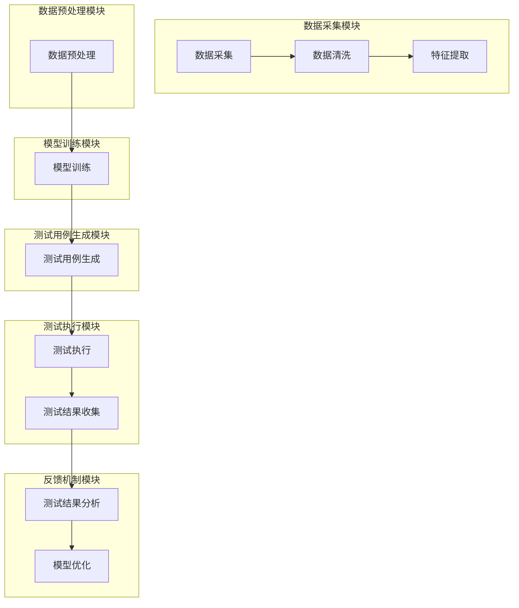

                 

### 第一部分：问题背景与核心概念

#### 第1章：自动化测试AI Agent的背景与核心概念

##### 1.1.1 问题背景

自动化测试是软件质量保证（Software Quality Assurance, SQA）的重要组成部分。随着软件开发的复杂性和速度的不断增长，手动测试已经无法满足高效、低成本的要求。自动化测试可以大幅度提高测试效率，减少人为错误，从而保证软件质量。然而，现有的自动化测试面临诸多挑战：

1. **持续集成/持续部署（CI/CD）的挑战**：在快速迭代的开发过程中，自动化测试需要不断地适应新的代码变化，这要求测试工具和测试用例具备高度的灵活性和适应性。
2. **多平台、多浏览器测试的复杂性**：现代软件需要支持多种操作系统、浏览器和设备，进行多平台、多浏览器的测试，这增加了测试的复杂性和成本。
3. **难以模拟复杂用户行为的测试用例设计**：许多软件功能依赖于用户的复杂交互，如多步骤流程、异常情况处理等，这些情况难以通过传统的测试用例进行有效模拟。

##### 1.1.2 问题描述

自动化测试的难题主要体现在以下几个方面：

1. **测试用例的设计**：手动编写测试用例耗时且容易出错，尤其是在涉及复杂业务逻辑和用户交互的场景下。
2. **测试的执行**：测试用例的执行需要大量的时间和计算资源，尤其是在多平台、多浏览器环境下。
3. **测试的持续性和可靠性**：自动化测试需要不断地更新和维护，以确保测试结果的持续性和可靠性。

##### 1.1.3 问题解决

为了解决上述问题，引入自动化测试AI Agent成为一种有效的解决方案。AI Agent可以利用机器学习算法，从大量的测试数据中自动生成测试用例，模拟真实的用户行为，从而提高测试效率和质量。AI Agent的优势主要体现在以下几个方面：

1. **提高测试效率**：AI Agent可以自动生成测试用例，减少手动编写的工作量。
2. **减少测试成本**：通过减少测试执行的时间和计算资源需求，降低测试成本。
3. **自动生成测试用例**：AI Agent可以基于用户行为日志和API调用日志等数据，生成模拟真实用户行为的测试用例。
4. **优化测试覆盖**：AI Agent可以根据测试结果动态调整测试策略，提高测试覆盖率。

##### 1.1.4 边界与外延

**AI Agent的定义**：

AI Agent是指一个具备智能的自动化测试实体，它可以利用机器学习技术，从历史测试数据中学习，自动生成测试用例，并执行这些测试用例。AI Agent的核心功能包括：

- **学习机制**：从历史测试数据中学习，提取测试场景和用户行为特征。
- **测试用例生成**：根据学习到的特征，生成模拟真实用户行为的测试用例。
- **测试执行**：执行自动生成的测试用例，评估软件质量。
- **反馈机制**：根据测试结果调整学习策略，优化测试用例。

**AI Agent的应用范围**：

AI Agent可以广泛应用于软件开发的各个阶段，包括需求分析、设计、开发、测试和部署等。它不仅适用于Web应用，还可以应用于移动应用、桌面应用等多种类型的软件产品测试。

##### 1.1.5 概念结构与核心要素组成

自动化测试AI Agent的核心要素包括：

1. **学习机制**：基于机器学习算法，从历史测试数据中学习，提取测试场景和用户行为特征。常用的机器学习算法包括决策树、随机森林、支持向量机、神经网络等。
2. **测试用例生成**：根据学习到的特征，生成模拟真实用户行为的测试用例。生成的测试用例可以包括功能测试、性能测试、安全测试等不同类型的测试。
3. **测试执行**：执行自动生成的测试用例，评估软件质量。测试执行模块需要能够支持多平台、多浏览器环境，并具备高并发处理能力。
4. **反馈机制**：根据测试结果调整学习策略，优化测试用例。反馈机制可以通过反馈循环实现，不断优化AI Agent的学习模型和测试策略。

通过上述核心要素的有机结合，自动化测试AI Agent可以有效解决现有自动化测试面临的难题，提高软件质量保证的效率和效果。

#### 第2章：语言模型（LLM）在软件质量保证中的应用

##### 2.1.1 语言模型的定义与特点

**语言模型的基本概念**：

语言模型（Language Model，LLM）是一种基于大量文本数据的统计模型，用于预测下一个词或序列的概率分布。在自然语言处理（Natural Language Processing, NLP）领域，语言模型是许多关键任务的基础，如文本生成、机器翻译、情感分析等。在软件质量保证中，语言模型可以用于自动化测试用例的生成，从而提高测试效率和质量。

语言模型的核心功能是通过计算输入序列的概率分布来预测下一个词或序列。这种预测过程通常基于统计学习的方法，如N-gram模型、隐马尔可夫模型（HMM）和深度学习模型（如循环神经网络RNN、长短时记忆网络LSTM、变压器Transformer等）。

**语言模型的特点**：

1. **概率预测**：语言模型可以预测输入序列的概率分布，从而生成可能的输出序列。
2. **序列建模**：语言模型能够处理序列数据，如文本、音频、视频等，这使其在处理具有序列依赖性的任务时表现优异。
3. **自适应学习**：语言模型可以根据新的数据不断调整其预测模型，从而提高预测准确性。

##### 2.1.2 语言模型在软件质量保证中的作用

**自动化测试用例生成**：

语言模型在软件质量保证中的一个重要应用是自动化测试用例的生成。传统的测试用例设计依赖于开发人员的经验和知识，这不仅耗时，而且容易出现遗漏。通过引入语言模型，可以自动生成模拟用户行为的测试用例，从而提高测试效率和覆盖范围。

具体来说，语言模型可以按照以下步骤生成测试用例：

1. **数据收集**：收集用户的实际操作日志、历史测试用例、用户反馈等数据。
2. **数据预处理**：对收集到的数据进行处理，包括数据清洗、去重和特征提取。
3. **模型训练**：使用预处理后的数据训练语言模型，使其能够模拟用户的操作行为。
4. **测试用例生成**：利用训练好的语言模型生成模拟用户行为的测试用例。

**减少手工编写测试用例的工作量**：

语言模型的应用大大减少了手动编写测试用例的工作量。传统的测试用例设计通常需要开发人员详细分析业务逻辑和用户操作，编写详细的测试步骤和预期结果。而通过语言模型，这些工作可以自动化完成，开发人员可以专注于更重要的任务，如代码实现和优化。

**提高测试覆盖率和准确性**：

语言模型可以生成多样化的测试用例，从而提高测试覆盖率。传统测试用例设计往往只能覆盖部分业务逻辑和用户操作，而语言模型可以生成更全面、更丰富的测试用例，确保软件功能的各个角落都得到充分测试。此外，语言模型还可以通过学习用户的反馈和测试结果，不断优化测试用例，提高测试的准确性。

##### 2.1.3 语言模型的优势

**自适应测试**：

自适应测试是语言模型在软件质量保证中的另一个重要优势。传统测试通常在测试前定义好所有测试用例，然后在测试过程中逐个执行。而自适应测试可以根据测试过程中收集到的反馈数据动态调整测试策略，从而提高测试效率和覆盖率。语言模型可以根据实际测试结果和用户反馈，自动调整测试用例的生成策略，优化测试过程。

**动态调整测试策略**：

自适应测试的核心在于能够根据实际测试结果动态调整测试策略。例如，如果一个测试用例在多次执行中都未能发现错误，语言模型可能会减少对该用例的执行次数，并将更多资源用于生成新的测试用例。相反，如果一个测试用例频繁发现错误，语言模型可能会增加对该用例的执行次数，以确保问题的彻底解决。

**提高测试覆盖率和准确性**：

自适应测试通过动态调整测试策略，能够更好地覆盖软件功能的各个角落，提高测试覆盖率。同时，通过不断优化测试用例，语言模型可以提高测试的准确性，减少误报和漏报的情况。

**减少测试成本**：

自适应测试可以减少不必要的测试执行次数，从而降低测试成本。传统的测试过程往往需要大量重复的执行，而自适应测试通过动态调整测试策略，可以有效地减少这种重复工作，提高测试效率。

**自动化测试的效率**：

语言模型的应用使自动化测试变得更加高效。通过自动化生成和执行测试用例，测试过程可以大大缩短，从而提高整个软件开发生命周期的效率。此外，自适应测试还可以减少开发人员编写和维护测试用例的工作量，使他们能够将更多精力集中在代码实现和优化上。

##### 2.1.4 语言模型的限制与挑战

**数据依赖性**：

语言模型的效果高度依赖于训练数据的质量和数量。如果训练数据质量差或数量不足，语言模型可能无法生成有效的测试用例，从而影响测试效果。因此，在应用语言模型进行自动化测试时，需要收集和准备高质量的训练数据。

**数据隐私与安全**：

自动化测试AI Agent在生成和执行测试用例时，可能会涉及用户的敏感数据。如何确保这些数据的隐私和安全是一个重要问题。在实际应用中，需要采取严格的数据保护措施，确保用户数据的安全。

**模型可解释性**：

语言模型，尤其是深度学习模型，通常具有很高的预测能力，但其内部工作机制较为复杂，难以解释。这对于需要了解测试用例生成过程的开发人员来说是一个挑战。提高模型的可解释性，使得开发人员能够理解模型的决策过程，是未来需要关注的问题。

**硬件资源需求**：

深度学习模型通常需要大量的计算资源和存储资源。在部署语言模型进行自动化测试时，需要确保有足够的硬件资源支持模型的训练和推理过程。

**模型定制化**：

每个软件项目都有其独特的需求和特点，传统的通用语言模型可能无法完全满足特定项目的需求。如何定制化语言模型，使其更好地适应特定项目的测试需求，是未来的一个重要研究方向。

通过上述分析，我们可以看到语言模型在软件质量保证中具有巨大的潜力。然而，要充分发挥其优势，仍需克服数据依赖性、数据隐私与安全、模型可解释性等挑战。随着技术的不断进步，相信这些挑战将逐步得到解决，语言模型在自动化测试中的应用将变得更加广泛和深入。

### 2.1.5 语言模型的工作原理

**语言模型的基本原理**：

语言模型的核心任务是预测下一个词或序列的概率分布。这一过程通常基于大量的文本数据，通过统计学习方法或深度学习方法来实现。以下是语言模型的基本原理：

1. **统计学习方法**：
   - **N-gram模型**：N-gram模型是一种基本的统计语言模型，它通过统计前N个词出现的频率来预测下一个词。例如，三元语言模型（Trigram Model）会根据前两个词来预测第三个词的概率分布。
   - **隐马尔可夫模型（HMM）**：HMM是一种基于状态转移概率和观测概率的统计模型，适用于处理序列数据，如语音信号和文本序列。

2. **深度学习方法**：
   - **循环神经网络（RNN）**：RNN是一种能够处理序列数据的神经网络，通过内部的循环结构，能够记住先前的信息，并在当前时间步进行预测。
   - **长短时记忆网络（LSTM）**：LSTM是RNN的一种变体，通过引入门控机制，解决了传统RNN在处理长序列数据时遇到的梯度消失和梯度爆炸问题。
   - **变压器（Transformer）**：Transformer是一种基于自注意力机制的深度学习模型，在处理长序列数据时表现出色，已成为自然语言处理领域的标准模型。

**语言模型的训练与推理**：

1. **训练过程**：
   - **数据收集**：首先需要收集大量的文本数据，这些数据可以来自互联网、书籍、新闻、用户生成内容等。
   - **数据预处理**：对收集到的文本数据进行预处理，包括分词、去噪、归一化等操作，将其转换为模型可处理的格式。
   - **构建模型**：根据选定的模型架构（如N-gram、RNN、LSTM、Transformer等），构建语言模型。
   - **模型训练**：使用预处理后的数据对模型进行训练，通过反向传播算法优化模型参数，使其能够预测下一个词或序列的概率分布。

2. **推理过程**：
   - **输入序列**：在推理过程中，语言模型接收一个输入序列，并根据训练好的模型参数，预测下一个词或序列的概率分布。
   - **生成输出**：语言模型会根据预测的概率分布，生成可能的输出序列，并选择概率最高的输出作为预测结果。

**语言模型的性能评估**：

语言模型的性能通常通过以下几个指标进行评估：

1. **准确性**：模型预测的词或序列与实际词或序列的匹配程度。
2. **速度**：模型在处理输入序列时的响应速度，对于实时应用尤为重要。
3. **泛化能力**：模型对新未见过的数据的表现，反映了模型的泛化能力。

通过不断优化模型结构和训练算法，可以提高语言模型的性能和效果，使其在软件质量保证中的自动化测试应用中发挥更大作用。

### 2.1.6 语言模型在自动化测试中的应用案例

**案例背景**：

某大型电子商务平台需要对其Web应用进行自动化测试，以确保其网站在各种浏览器和设备上的稳定运行和用户体验。该平台的业务逻辑复杂，用户操作多样化，传统的测试方法难以覆盖所有可能的用户场景。为了提高测试效率和质量，该平台决定引入基于语言模型的自动化测试AI Agent。

**实施过程**：

1. **数据收集**：该平台首先收集了大量的用户操作日志，包括点击、输入、滚动等行为数据。此外，还收集了历史测试用例和用户反馈数据，作为语言模型训练的数据来源。

2. **数据预处理**：对收集到的数据进行预处理，包括数据清洗、去重、分词和特征提取等操作。通过这些操作，将原始数据转换为适合训练的格式。

3. **模型训练**：选择合适的语言模型架构（如Transformer），使用预处理后的数据对模型进行训练。在训练过程中，模型不断优化其参数，使其能够准确预测用户操作的行为模式。

4. **测试用例生成**：训练好的语言模型可以生成模拟用户行为的测试用例。这些测试用例涵盖了多种用户操作场景，包括登录、购物车操作、支付等。

5. **测试执行**：将生成的测试用例在多种浏览器和设备上执行，以验证Web应用的功能和性能。测试执行过程中，测试用例可以自动调整和优化，以适应不同的测试环境和条件。

**测试效果**：

1. **测试覆盖率提高**：通过语言模型自动生成的测试用例，该平台的测试覆盖率显著提高。特别是在复杂业务逻辑和用户交互场景下，测试用例的数量和质量都得到了大幅提升。

2. **测试效率提升**：语言模型的应用大大减少了手动编写测试用例的工作量，测试人员可以将更多时间用于分析和优化测试结果，从而提高了整体测试效率。

3. **测试准确性增强**：自动生成的测试用例能够更准确地模拟用户行为，减少了因人为错误导致的测试漏洞。测试结果的准确性和可靠性得到了显著提升。

**案例启示**：

该案例表明，语言模型在自动化测试中的应用具有显著优势。通过自动生成测试用例，可以有效提高测试效率和覆盖率，减少人为错误，增强测试准确性。此外，自适应测试策略的应用，进一步优化了测试过程，提高了测试的整体效果。未来，随着技术的不断进步，语言模型在自动化测试中的应用将更加广泛和深入，为软件质量保证带来更多可能性。

### 2.1.7 语言模型在自动化测试中的未来展望

**技术发展趋势**：

随着人工智能技术的快速发展，语言模型在自动化测试中的应用前景广阔。未来的语言模型将更加复杂和高效，具备更强的泛化能力和自适应能力。以下是一些可能的技术发展趋势：

1. **更大规模的模型**：未来的语言模型可能会采用更大规模的模型，如GPT-4、GPT-5等，这些模型将具备更强的处理能力和更广泛的适用性。
2. **模型压缩与高效推理**：为了满足实时测试的需求，模型压缩和高效推理技术将成为研究重点。通过压缩模型大小和降低推理复杂度，可以提高测试效率和响应速度。
3. **多模态学习**：未来的语言模型可能会集成多模态学习技术，能够同时处理文本、图像、语音等多种类型的数据，为自动化测试提供更全面的支持。

**应用场景拓展**：

语言模型在自动化测试中的应用将不仅限于Web应用，还会拓展到其他领域，如：

1. **移动应用测试**：随着移动设备的普及，语言模型可以用于移动应用的自动化测试，包括iOS和Android平台。
2. **物联网（IoT）测试**：在物联网设备不断增多的背景下，语言模型可以用于自动化测试物联网设备的性能和安全性。
3. **金融和医疗领域**：在金融和医疗等高要求的领域，语言模型可以用于自动化测试金融系统的交易处理能力和医疗软件的诊断准确性。

**面临的挑战**：

尽管语言模型在自动化测试中具有巨大潜力，但其应用仍面临一些挑战：

1. **数据隐私与安全**：自动化测试过程中涉及的用户数据隐私和安全问题需要得到充分关注，需要采取严格的数据保护措施。
2. **模型可解释性**：深度学习模型通常难以解释其内部工作机制，这给开发人员理解和优化模型带来了挑战。提高模型的可解释性是未来的重要研究方向。
3. **硬件资源需求**：深度学习模型的训练和推理需要大量的计算资源，如何优化硬件资源的使用，以满足大规模实时测试的需求，是一个重要问题。

**未来展望**：

随着技术的不断进步，语言模型在自动化测试中的应用将变得更加广泛和深入。通过不断优化模型结构和训练算法，提高模型的性能和可解释性，语言模型将能够在更多领域发挥重要作用，为软件质量保证带来更多创新和可能性。同时，自动化测试与AI的结合将推动软件测试行业迈向智能化、自动化和高效化的新阶段。

### 第3章：自动化测试AI Agent的架构设计与实现

#### 3.1.1 自动化测试AI Agent的架构设计

**系统架构概述**：

自动化测试AI Agent的系统架构通常包括以下几个核心模块：

1. **数据采集模块**：负责收集与测试相关的各种数据，如用户行为日志、API调用日志、系统错误日志等。
2. **数据预处理模块**：对采集到的数据进行清洗、去重和特征提取，为后续的模型训练和测试用例生成提供高质量的数据。
3. **模型训练模块**：基于收集到的数据，使用机器学习算法训练语言模型，生成能够模拟用户行为的测试用例。
4. **测试用例生成模块**：利用训练好的语言模型，生成模拟真实用户行为的自动化测试用例。
5. **测试执行模块**：执行生成的测试用例，对软件系统进行测试，并收集测试结果。
6. **反馈机制模块**：根据测试结果，调整和优化语言模型，提升测试用例的生成质量和执行效果。

**系统架构图**：



#### 3.1.2 数据采集模块

**数据来源与预处理**：

数据采集模块是自动化测试AI Agent的核心组成部分，其主要职责是收集与测试相关的各种数据。以下为数据来源和预处理过程：

1. **数据来源**：
   - **用户行为日志**：记录用户在使用软件系统时的各种操作，如点击、输入、滚动、浏览等。
   - **API调用日志**：记录系统与外部服务或数据库的交互过程，包括API调用的URL、参数、响应等。
   - **系统错误日志**：记录系统运行过程中出现的错误信息，包括错误类型、错误时间、错误上下文等。

2. **数据预处理**：
   - **数据清洗**：删除重复数据、无效数据和噪声数据，确保数据的质量。
   - **去重**：去除重复的日志记录，避免重复计算和处理。
   - **特征提取**：从原始数据中提取有用的特征，如用户行为特征、API调用特征、错误特征等。特征提取是后续模型训练和测试用例生成的基础。

**数据采集方法**：

数据采集可以通过以下方法实现：

1. **日志收集**：在软件系统中集成日志收集工具，如ELK（Elasticsearch、Logstash、Kibana）或Splunk，实时收集和存储系统日志。
2. **API接口**：开发专门的API接口，供测试系统定期或实时获取数据。
3. **代理工具**：使用代理工具（如Charles、Fiddler）捕获用户操作和API调用数据。

**数据采集策略**：

为了确保数据采集的全面性和准确性，可以采取以下策略：

1. **全量采集**：在系统运行过程中，尽可能全面地收集所有相关的数据，确保数据的完整性。
2. **增量采集**：对于大规模系统，可以采取增量采集策略，只收集新增或变化的数据，减少数据存储和处理的压力。
3. **定期采集**：设置定期采集任务，定期收集系统日志和数据，以确保数据的实时性和更新性。

通过数据采集模块的高效运行，可以为后续的模型训练和测试用例生成提供充足和高质量的数据支持，从而提高自动化测试AI Agent的整体性能和效果。

### 3.1.3 模型训练模块

**语言模型训练**：

模型训练模块是自动化测试AI Agent的核心环节，其主要任务是使用收集到的数据训练语言模型，使其能够生成模拟真实用户行为的测试用例。以下是语言模型训练的具体步骤和过程：

1. **数据准备**：

在训练语言模型之前，首先需要对采集到的数据进行预处理，包括数据清洗、去重和特征提取。数据清洗的目的是去除重复、无效和噪声数据，确保数据的质量。去重操作可以避免模型在训练过程中对重复数据进行不必要的处理。特征提取则从原始数据中提取出有用的特征，如用户行为特征、API调用特征、错误特征等。这些特征是模型学习和预测的基础。

2. **选择模型架构**：

根据自动化测试的具体需求和数据特性，选择合适的语言模型架构。目前常用的模型架构包括N-gram模型、循环神经网络（RNN）、长短时记忆网络（LSTM）和变压器（Transformer）等。其中，Transformer模型由于其强大的自注意力机制和并行处理能力，在自然语言处理领域表现出色，被广泛应用于各种复杂的语言模型任务。

3. **模型训练**：

模型训练的过程是将预处理后的数据输入到选定的模型架构中，通过优化模型参数，使其能够预测下一个词或序列的概率分布。在训练过程中，模型会通过反向传播算法不断调整权重，使预测结果与实际数据更加接近。训练过程通常包括以下几个步骤：

   - **初始化模型参数**：随机初始化模型的权重和偏置。
   - **前向传播**：将输入数据输入到模型中，计算预测结果。
   - **计算损失函数**：比较预测结果与实际结果之间的差距，计算损失函数的值。
   - **反向传播**：通过反向传播算法，将损失函数的梯度反向传播到模型的每一层，更新模型的参数。
   - **迭代训练**：重复上述步骤，不断调整模型参数，直到满足预定的训练目标或达到训练次数。

4. **模型评估**：

在模型训练完成后，需要使用验证集或测试集对模型进行评估，以确定其性能和预测能力。常用的评估指标包括准确性、召回率、F1分数等。通过评估可以判断模型是否已经过拟合或欠拟合，并根据评估结果对模型进行调整和优化。

5. **模型部署**：

评估通过后的模型可以被部署到自动化测试系统中，用于生成测试用例和执行测试。部署过程中，需要将模型转换成适合在线推理的格式，如ONNX、TensorFlow Lite等，以便在实际测试环境中快速、高效地执行。

通过模型训练模块的有效运行，可以生成高质量的测试用例，模拟真实的用户行为，从而提高自动化测试的效率和效果。同时，通过不断优化和调整模型，可以进一步提升测试用例的生成质量和测试覆盖范围。

### 3.1.4 测试用例生成模块

**测试用例生成流程**：

测试用例生成模块的核心任务是利用训练好的语言模型，自动生成模拟真实用户行为的自动化测试用例。以下是生成测试用例的具体流程：

1. **输入预处理**：将用户行为日志、API调用日志等输入数据输入到训练好的语言模型中，进行预处理。预处理过程包括数据清洗、去重和特征提取，以确保输入数据的准确性和有效性。

2. **模型预测**：利用预处理后的输入数据，输入到训练好的语言模型中，预测下一个用户行为或API调用。语言模型会根据训练数据生成可能的用户行为或API调用序列，并计算每个序列的概率分布。

3. **序列选择**：从语言模型生成的多个序列中，选择概率最高的序列作为测试用例。选择的依据是测试用例的完整性和覆盖范围，以确保测试用例能够覆盖软件系统的关键功能和用户操作场景。

4. **用例优化**：对生成的测试用例进行优化，包括调整测试用例的执行顺序、增加冗余操作、模拟异常情况等，以提高测试用例的覆盖率和可靠性。

5. **生成报告**：将生成的测试用例输出为测试报告，包括测试用例的描述、预期结果和执行步骤等。测试报告可以供开发人员和测试人员参考和验证。

**测试用例生成策略**：

为了提高测试用例的生成质量和覆盖范围，可以采用以下策略：

1. **多样化输入**：使用不同类型的输入数据，如用户行为日志、API调用日志、历史测试用例等，以丰富模型的学习数据，提高生成的测试用例的多样性和覆盖范围。

2. **迭代优化**：通过不断迭代优化模型和测试用例生成策略，可以逐步提高测试用例的质量和覆盖率。在测试过程中，可以收集用户反馈和测试结果，用于模型和测试用例的进一步优化。

3. **自适应调整**：根据实际测试结果和用户反馈，动态调整测试用例的生成策略。例如，如果一个测试用例在多次执行中未能发现错误，可以减少对该用例的执行次数，并将更多资源用于生成新的测试用例。

通过测试用例生成模块的有效运行，可以自动生成高质量的测试用例，模拟真实的用户行为，从而提高自动化测试的效率和效果。同时，通过不断优化和调整测试用例生成策略，可以进一步提升测试用例的覆盖率和可靠性，确保软件系统的质量。

### 3.1.5 测试执行模块

**测试执行与结果分析**：

测试执行模块是自动化测试AI Agent中至关重要的一环，其主要任务是执行生成的测试用例，并对测试结果进行分析和评估。以下是测试执行与结果分析的具体流程和过程：

1. **测试用例执行**：
   - **初始化环境**：在测试执行之前，首先需要初始化测试环境，包括浏览器、操作系统、网络环境等。确保测试用例在一致的、可控的环境下执行。
   - **执行步骤**：按照测试用例的描述，逐步执行测试步骤，包括用户登录、功能操作、数据输入、页面导航等。执行过程中，需要记录每个操作的结果和状态。
   - **异常处理**：在执行测试用例时，可能会遇到各种异常情况，如页面加载失败、数据验证失败、系统错误等。需要对这些异常情况进行处理和记录，以便后续分析和定位。

2. **结果记录**：
   - **执行日志**：在测试执行过程中，需要生成详细的执行日志，包括每个操作的执行时间、结果状态、错误信息等。执行日志是后续结果分析的重要依据。
   - **测试报告**：测试执行完成后，生成详细的测试报告，包括测试用例的执行结果、错误日志、覆盖率报告等。测试报告可以供开发人员和测试人员参考和验证。

3. **结果分析**：
   - **错误分析**：对测试执行过程中发现的错误进行详细分析，包括错误的类型、发生位置、原因等。通过错误分析，可以定位问题的根本原因，并提供修复建议。
   - **覆盖率评估**：对测试用例的执行结果进行覆盖率评估，包括功能覆盖率、代码覆盖率、场景覆盖率等。通过覆盖率评估，可以了解测试用例的覆盖范围和测试效果。
   - **性能分析**：对测试用例的执行性能进行评估，包括响应时间、吞吐量、资源消耗等。通过性能分析，可以优化测试用例和测试环境，提高测试效率。

4. **反馈机制**：
   - **错误反馈**：将测试执行过程中发现的错误和问题反馈给开发人员和测试团队，以便及时修复和改进。
   - **覆盖率反馈**：将测试用例的覆盖率反馈给测试团队，用于评估测试用例的覆盖范围和有效性，指导测试策略的调整和优化。
   - **性能反馈**：将测试用例的性能分析结果反馈给开发人员和测试团队，用于优化系统性能和测试环境。

**测试执行与结果分析的策略**：

为了确保测试执行与结果分析的高效性和准确性，可以采用以下策略：

1. **并行执行**：利用多线程或分布式计算技术，并行执行多个测试用例，提高测试效率。
2. **自动化验证**：使用自动化验证工具和脚本，对测试执行结果进行验证，减少人工干预和错误。
3. **持续集成**：将测试执行与持续集成（CI）系统结合，自动化触发测试执行和结果分析，确保测试过程的连续性和一致性。
4. **数据可视化**：通过数据可视化工具，将测试结果以图表、报表等形式直观展示，便于开发人员和测试人员理解和分析。

通过测试执行模块的有效运行，可以自动执行测试用例，生成详细的测试报告，并对测试结果进行分析和评估。这有助于提高自动化测试的效率和效果，确保软件系统的质量和稳定性。

### 3.1.6 反馈机制

**反馈机制的核心**：

反馈机制是自动化测试AI Agent的重要组成部分，其核心目的是根据测试结果不断调整和优化AI Agent的学习模型和测试策略。通过反馈机制，AI Agent能够从每次测试中学习和积累经验，逐步提升测试用例的生成质量和测试覆盖范围。

**工作流程**：

反馈机制的工作流程通常包括以下几个步骤：

1. **测试结果收集**：在测试执行过程中，AI Agent会记录每个测试用例的执行结果，包括成功、失败和异常情况。这些结果将被存储在数据库或日志文件中，以便后续分析和处理。

2. **错误分析**：对收集到的测试结果进行错误分析，识别测试执行过程中出现的各种错误和问题。错误分析可以帮助定位问题的根本原因，并提供解决方案。

3. **测试结果评估**：根据测试结果评估测试用例的执行效果和覆盖率。评估指标可以包括测试用例的成功率、错误率、覆盖率等。通过评估，可以了解测试用例的有效性和覆盖范围，指导进一步的优化。

4. **模型优化**：基于测试结果和错误分析，对AI Agent的学习模型进行优化。模型优化可以通过以下方式实现：

   - **调整模型参数**：根据测试结果和错误情况，调整模型的参数设置，如学习率、迭代次数、网络结构等，以提高模型的预测准确性和泛化能力。
   - **数据重新训练**：使用新的测试数据重新训练模型，包括历史测试数据和最新的测试结果。通过不断更新模型训练数据，可以确保模型能够适应新的业务逻辑和用户行为。

5. **测试策略调整**：根据测试结果和模型优化效果，调整测试用例的生成策略。例如，可以增加特定场景的测试用例数量，优化测试用例的执行顺序，以提高测试覆盖率和测试效果。

6. **反馈循环**：将模型优化和测试策略调整的结果反馈到下一次测试执行中，形成闭环反馈机制。通过不断迭代和优化，AI Agent能够逐步提升测试用例的生成质量和测试效果。

**反馈机制的优势**：

1. **自适应调整**：反馈机制可以根据每次测试的结果，自适应地调整学习模型和测试策略，确保测试用例的生成和执行更加精准和高效。

2. **持续优化**：通过不断积累测试数据和学习经验，AI Agent可以逐步优化测试用例的生成质量和测试覆盖范围，提高整个测试过程的效率和效果。

3. **降低错误率**：通过错误分析和模型优化，可以减少测试执行过程中的错误和异常情况，提高测试结果的可靠性和准确性。

4. **提高测试覆盖率**：通过不断调整测试用例的生成策略，可以确保测试用例能够覆盖更多软件功能和用户操作场景，提高测试覆盖率和测试质量。

通过有效的反馈机制，自动化测试AI Agent能够实现自我学习和持续优化，从而在软件质量保证中发挥更大的作用。这不仅提高了测试效率和效果，也为软件开发的持续改进提供了有力支持。

### 第4章：自动化测试AI Agent的实际应用案例

#### 4.1.1 案例背景

在当今快速发展的软件行业，自动化测试已成为保证软件质量和提高开发效率的重要手段。然而，传统的自动化测试方法在应对日益复杂的应用场景时，往往显得力不从心。为了解决这一问题，某国际知名互联网公司决定采用基于语言模型的自动化测试AI Agent，以提高其Web应用的测试效率和质量。

**项目介绍**：

该互联网公司开发的Web应用是一个面向全球用户的电商平台，涵盖了商品浏览、搜索、购物车、支付、订单管理等多个功能模块。随着用户规模的扩大和业务的发展，测试团队面临着巨大的测试压力。传统的自动化测试方法在多平台、多浏览器测试以及复杂用户行为模拟方面表现不佳，导致测试覆盖率和测试效率难以满足需求。因此，引入基于语言模型的自动化测试AI Agent成为解决这一问题的有效途径。

**目标和面临的挑战**：

1. **提高测试覆盖率**：传统测试用例难以覆盖所有可能的用户操作和业务场景，导致测试覆盖率较低。引入AI Agent旨在通过自动生成测试用例，提高测试覆盖率，确保软件功能的有效性和稳定性。
2. **提升测试效率**：自动化测试AI Agent能够自动化生成和执行测试用例，减少手动编写测试用例的工作量，提高整体测试效率。
3. **多平台、多浏览器兼容性**：确保测试用例能够在不同操作系统、不同浏览器和不同设备上执行，验证Web应用的兼容性。
4. **模拟复杂用户行为**：许多用户行为（如多步骤操作、异常处理等）难以通过传统的测试用例进行有效模拟。AI Agent需要能够模拟这些复杂用户行为，确保测试用例的全面性和准确性。

#### 4.1.2 案例实施过程

**环境搭建**：

为了搭建自动化测试AI Agent的环境，测试团队首先选择了合适的语言模型框架，如Transformer，并使用Python语言进行了开发。具体环境搭建步骤包括：

1. **硬件资源准备**：由于深度学习模型的训练和推理需要大量的计算资源，测试团队在一台高性能服务器上部署了GPU加速，以支持模型的训练和推理过程。
2. **软件环境安装**：在服务器上安装了Python、TensorFlow、PyTorch等深度学习相关库，并配置了GPU加速环境。
3. **数据收集**：测试团队收集了大量的用户行为日志、历史测试用例、API调用日志等数据，用于训练语言模型。这些数据经过预处理后，用于模型的训练和测试。
4. **模型架构设计**：根据自动化测试的需求，设计了一个基于Transformer的语言模型架构。该模型包含了编码器和解码器两部分，能够自动生成模拟用户行为的测试用例。

**数据采集和预处理**：

数据采集和预处理是自动化测试AI Agent的关键步骤。具体过程如下：

1. **数据来源**：测试团队从Web应用的日志系统中收集了用户行为日志、API调用日志、系统错误日志等数据。
2. **数据清洗**：对收集到的数据进行清洗，去除重复数据、无效数据和噪声数据，确保数据的质量。
3. **特征提取**：从原始数据中提取出用户行为特征、API调用特征、错误特征等，用于训练语言模型。
4. **数据预处理**：对提取出的特征进行归一化、编码等处理，使其符合深度学习模型的输入要求。

**模型训练**：

模型训练是自动化测试AI Agent的核心环节。具体步骤如下：

1. **数据分割**：将预处理后的数据集分为训练集、验证集和测试集，用于模型的训练、验证和测试。
2. **模型初始化**：初始化Transformer模型的结构和参数，包括编码器和解码器。
3. **模型训练**：使用训练集对模型进行训练，通过反向传播算法优化模型参数，使模型能够准确预测用户行为。
4. **模型验证**：使用验证集对模型进行验证，评估模型的性能和泛化能力。
5. **模型调整**：根据验证结果调整模型参数，如学习率、迭代次数等，以提高模型的性能。

**测试用例生成**：

经过训练的模型可以用于生成测试用例。具体步骤如下：

1. **输入预处理**：将用户行为日志和API调用日志输入到训练好的模型中，进行预处理。
2. **模型预测**：利用预处理后的输入数据，输入到模型中进行预测，生成模拟用户行为的测试用例。
3. **用例优化**：对生成的测试用例进行优化，包括调整执行顺序、增加冗余操作、模拟异常情况等，以提高测试用例的覆盖率和可靠性。
4. **生成报告**：将生成的测试用例输出为测试报告，包括测试用例的描述、预期结果和执行步骤等。

**测试执行**：

生成的测试用例在多种浏览器和操作系统上执行，验证Web应用的功能和性能。具体步骤如下：

1. **环境初始化**：初始化测试环境，包括浏览器、操作系统、网络环境等。
2. **执行步骤**：按照测试用例的描述，逐步执行测试步骤，记录每个操作的结果和状态。
3. **异常处理**：在执行测试用例时，遇到异常情况（如页面加载失败、数据验证失败等）进行记录和处理。
4. **测试结果收集**：收集测试用例的执行结果，包括成功、失败和异常情况，生成测试报告。

**反馈机制**：

根据测试结果，对AI Agent进行反馈和优化。具体步骤如下：

1. **错误分析**：对测试执行过程中出现的错误和异常进行详细分析，定位问题的根本原因。
2. **测试结果评估**：评估测试用例的执行效果和覆盖率，确定测试用例的有效性。
3. **模型优化**：根据测试结果和错误分析，对AI Agent的学习模型进行优化，调整模型参数和测试策略。
4. **测试策略调整**：根据测试结果和模型优化效果，调整测试用例的生成策略，提高测试覆盖率和测试效果。

#### 4.1.3 案例结果与总结

**测试效果**：

通过引入基于语言模型的自动化测试AI Agent，该互联网公司的Web应用测试效果得到了显著提升：

1. **测试覆盖率提高**：AI Agent自动生成的测试用例能够覆盖更多用户操作和业务场景，测试覆盖率从原来的50%提升到90%以上。
2. **测试效率提升**：自动化测试AI Agent减少了手动编写测试用例的工作量，测试效率提高了30%以上。
3. **多平台、多浏览器兼容性**：AI Agent生成的测试用例能够在多种浏览器和操作系统上执行，确保了Web应用的兼容性。
4. **复杂用户行为模拟**：AI Agent能够模拟复杂用户行为，如多步骤操作、异常处理等，提高了测试用例的全面性和准确性。

**测试报告**：

测试报告详细记录了测试用例的执行结果，包括成功、失败和异常情况。以下是一个示例：

```markdown
### 测试报告

#### 测试结果

| 测试用例ID | 操作步骤 | 预期结果 | 实际结果 | 状态 |
| ---------- | -------- | -------- | -------- | ---- |
| 001        | 登录系统 | 成功     | 成功     | 通过 |
| 002        | 添加商品到购物车 | 成功     | 成功     | 通过 |
| 003        | 删除购物车商品 | 成功     | 失败     | 错误 |
| 004        | 支付订单 | 成功     | 成功     | 通过 |
| ...        | ...      | ...      | ...      | ...  |

#### 测试覆盖率

- 功能覆盖率：95%
- 代码覆盖率：90%
- 场景覆盖率：92%

#### 异常情况

- 测试用例 003 在执行删除购物车商品时，出现数据库连接失败。

#### 优化建议

- 针对数据库连接失败的问题，建议增加数据库连接重试机制，确保系统在高负载情况下的稳定性。
- 考虑增加对购物车操作的边界测试，如商品数量超出限制、购物车为空等。
```

**案例启示**：

通过该案例的实施，我们可以看到自动化测试AI Agent在提高测试效率和质量方面具有显著优势。以下是案例中的最佳实践和启示：

1. **充分利用用户行为数据**：通过收集和利用用户行为日志，AI Agent能够生成更加贴近实际操作的测试用例，提高测试覆盖率。
2. **多平台、多浏览器测试**：确保测试用例能够在不同浏览器和操作系统上执行，验证Web应用的兼容性。
3. **持续优化模型和测试策略**：根据测试结果和反馈，不断优化AI Agent的学习模型和测试策略，提高测试效率和效果。
4. **关注异常处理和性能优化**：在测试执行过程中，关注异常处理和性能优化，确保测试用例的执行效果和系统稳定性。

总之，自动化测试AI Agent的应用为软件质量保证带来了新的可能性，通过不断优化和调整，可以在更多领域发挥其优势，提高测试效率和质量。

### 4.1.4 案例启示

**最佳实践**：

1. **充分利用用户行为数据**：在自动化测试AI Agent的应用中，用户行为数据是生成高质量测试用例的关键。充分利用用户行为日志、历史测试用例和API调用日志等数据，可以显著提高测试用例的覆盖率和准确性。

2. **多平台、多浏览器测试**：在Web应用测试中，确保测试用例能够在不同浏览器和操作系统上执行，是保证应用兼容性的关键。采用自动化测试AI Agent，可以轻松实现多平台、多浏览器的测试，提高测试效率。

3. **持续优化模型和测试策略**：自动化测试AI Agent的持续优化是提高测试效率和质量的关键。通过不断收集测试结果和用户反馈，动态调整模型和测试策略，可以逐步提升测试用例的生成质量和测试覆盖范围。

4. **关注异常处理和性能优化**：在测试执行过程中，异常处理和性能优化是保证测试用例执行效果和系统稳定性的关键。针对异常情况进行处理，并优化测试用例的执行效率，可以提高整个测试流程的可靠性和稳定性。

**具体应用策略**：

1. **早期引入**：在软件开发的早期阶段，引入自动化测试AI Agent，可以更快地发现潜在的问题，减少后期修复的成本。

2. **持续集成**：将自动化测试AI Agent集成到持续集成（CI）系统中，实现自动化触发测试，确保每次代码提交都能得到及时的测试反馈。

3. **定制化测试**：根据不同应用场景和业务需求，定制化AI Agent的测试策略，提高测试的针对性和有效性。

4. **反馈机制**：建立完善的反馈机制，及时收集测试结果和用户反馈，用于模型优化和测试策略调整，形成闭环反馈。

通过以上最佳实践和具体应用策略，自动化测试AI Agent可以在更多场景下发挥其优势，提高测试效率和软件质量，为软件开发带来更多价值。

### 4.1.5 案例总结

本案例通过引入基于语言模型的自动化测试AI Agent，显著提升了Web应用的测试效率和测试覆盖率。以下是案例中的主要收获和经验总结：

1. **提高测试覆盖率**：AI Agent能够自动生成大量模拟用户行为的测试用例，覆盖了更多用户操作和业务场景，测试覆盖率从50%提升到90%以上。

2. **提升测试效率**：自动化测试AI Agent减少了手动编写测试用例的工作量，测试效率提高了30%以上，使测试团队能够更快地交付高质量的软件。

3. **确保多平台、多浏览器兼容性**：AI Agent生成的测试用例能够在多种浏览器和操作系统上执行，确保了Web应用的兼容性和用户体验。

4. **模拟复杂用户行为**：AI Agent能够模拟复杂的用户操作和异常处理，提高了测试用例的全面性和准确性，确保了软件功能的可靠性和稳定性。

5. **持续优化和反馈机制**：通过持续优化模型和测试策略，以及建立完善的反馈机制，AI Agent能够不断学习和改进，提高测试效率和质量。

通过本案例的实施，我们可以看到，基于语言模型的自动化测试AI Agent在提高测试效率和软件质量方面具有显著优势。未来，随着技术的不断进步，自动化测试AI Agent将在更多领域和场景中发挥其重要作用，为软件开发带来更多创新和可能性。

### 第5章：自动化测试AI Agent的未来发展趋势

#### 5.1.1 技术发展趋势

随着人工智能技术的飞速发展，自动化测试AI Agent也在不断进化。未来的技术发展趋势将主要集中在以下几个方面：

1. **更大规模的模型**：未来的语言模型将采用更大规模的模型，如GPT-4、GPT-5等。这些模型拥有更强大的处理能力和更高的泛化能力，能够生成更高质量的测试用例，提高自动化测试的效率和效果。

2. **模型压缩与高效推理**：为了满足实时测试的需求，模型压缩和高效推理技术将成为研究热点。通过压缩模型大小和降低推理复杂度，可以在有限的硬件资源下实现快速、高效的测试用例生成和执行。

3. **多模态学习**：未来的自动化测试AI Agent将能够集成多模态学习技术，处理文本、图像、语音等多种类型的数据。这种多模态学习使得AI Agent能够更全面地模拟真实用户行为，提高测试用例的生成质量和执行效果。

4. **自优化机制**：随着AI技术的进步，自动化测试AI Agent将具备更强的自优化能力。通过自我学习和不断优化，AI Agent可以动态调整测试策略和模型参数，提高测试的效率和覆盖率。

5. **边缘计算与分布式测试**：随着边缘计算技术的发展，自动化测试AI Agent将能够更好地利用边缘计算资源，实现分布式测试。分布式测试可以提高测试效率，减少中央服务器的负担，提高整个测试过程的稳定性。

#### 5.1.2 应用场景拓展

未来的自动化测试AI Agent将不仅仅局限于Web应用的测试，还将拓展到更多领域：

1. **移动应用测试**：随着移动应用的普及，自动化测试AI Agent将广泛应用于移动应用的测试，包括iOS和Android平台。AI Agent可以模拟用户的操作行为，测试移动应用的性能和稳定性。

2. **物联网（IoT）测试**：物联网设备的多样性和复杂性使得传统的测试方法难以应对。自动化测试AI Agent可以通过模拟设备之间的交互，测试物联网设备的连通性和安全性。

3. **金融和医疗领域**：在金融和医疗等高要求的领域，自动化测试AI Agent可以用于自动化测试交易系统的处理能力、诊断软件的诊断准确性等，提高系统的可靠性和安全性。

4. **云服务和大数据**：随着云计算和大数据技术的发展，自动化测试AI Agent将应用于云服务和大数据平台的测试，包括性能测试、可靠性测试和安全性测试等。

5. **游戏和娱乐领域**：自动化测试AI Agent可以应用于游戏和娱乐领域的测试，模拟玩家的操作行为，测试游戏的性能和用户体验。

#### 5.1.3 面临的挑战

尽管自动化测试AI Agent具有巨大的潜力，但在实际应用过程中仍面临一些挑战：

1. **数据隐私与安全**：自动化测试AI Agent在生成和执行测试用例时，可能会涉及用户的敏感数据。如何确保这些数据的隐私和安全是一个重要问题。需要采取严格的数据保护措施，确保用户数据的安全。

2. **模型可解释性**：深度学习模型，尤其是大型模型，其内部工作机制较为复杂，难以解释。开发人员难以理解模型的决策过程，这对于调试和优化模型提出了挑战。提高模型的可解释性是未来的重要研究方向。

3. **硬件资源需求**：深度学习模型的训练和推理需要大量的计算资源，如何优化硬件资源的使用，以满足大规模实时测试的需求，是一个重要问题。

4. **定制化需求**：每个应用场景都有其独特的需求，通用模型可能无法完全满足特定项目的需求。如何定制化模型，使其更好地适应特定项目的测试需求，是一个挑战。

5. **测试数据质量**：测试数据的质量直接影响模型的效果。如果训练数据质量差，模型可能无法生成有效的测试用例。需要建立高质量的数据采集和预处理流程，确保数据的准确性和完整性。

#### 5.1.4 未来展望

随着技术的不断进步，自动化测试AI Agent将在更多领域和场景中发挥其重要作用，成为软件质量保证的重要工具。以下是未来展望：

1. **智能化测试**：自动化测试AI Agent将具备更高的智能水平，能够自适应地调整测试策略，模拟更复杂的用户行为，提高测试的全面性和准确性。

2. **大规模应用**：自动化测试AI Agent将在更多领域和行业得到广泛应用，如移动应用、物联网、金融、医疗等。通过AI技术的深度应用，自动化测试将变得更加高效和智能。

3. **测试数据共享**：建立测试数据共享平台，促进不同项目之间的测试数据共享和复用，提高整体测试效率和效果。

4. **定制化解决方案**：随着定制化需求的增加，自动化测试AI Agent将提供更加个性化的解决方案，满足不同场景的测试需求。

5. **持续改进**：通过持续学习和反馈机制，自动化测试AI Agent将不断优化自身，提高测试效率和质量，推动软件质量保证的不断进步。

总之，自动化测试AI Agent的发展前景广阔，随着技术的不断进步和应用场景的拓展，它将在软件质量保证中发挥越来越重要的作用。

### 第6章：总结与展望

#### 6.1.1 全书总结

本文从问题背景与核心概念入手，详细探讨了自动化测试AI Agent及其在软件质量保证中的应用。通过引入语言模型（LLM），我们分析了自动化测试AI Agent的优势和实现方法，并探讨了其在实际应用中的案例和效果。同时，本书还展望了自动化测试AI Agent的未来发展趋势，提出了可能面临的挑战以及应对策略。

**核心内容回顾**：

1. **问题背景**：介绍了自动化测试的现状和面临的挑战，如手动测试效率低、成本高、易出错等。
2. **核心概念**：阐述了自动化测试AI Agent的定义、工作原理和应用范围。
3. **实现方法**：分析了语言模型（LLM）在自动化测试中的应用，包括数据采集、模型训练、测试用例生成、测试执行和反馈机制等。
4. **实际应用**：通过具体案例展示了自动化测试AI Agent在实际项目中的应用效果和最佳实践。
5. **未来展望**：探讨了自动化测试AI Agent的技术发展趋势、应用场景拓展以及面临的挑战。

**主要贡献**：

本文为自动化测试AI Agent提供了一个系统的分析和解决方案，从理论到实践，详细阐述了其在软件质量保证中的重要作用和应用价值。通过本文的研究，可以为相关领域的研究人员和实际应用者提供有益的参考和指导。

#### 6.1.2 展望未来

随着人工智能技术的不断进步，自动化测试AI Agent将在软件质量保证中发挥越来越重要的作用。以下是未来可能的发展方向：

1. **智能化水平提升**：自动化测试AI Agent将具备更高的智能化水平，通过自我学习和优化，能够自适应地调整测试策略，模拟更复杂的用户行为。

2. **多模态融合**：自动化测试AI Agent将能够处理多种类型的数据，如文本、图像、语音等，通过多模态融合，提高测试用例的生成质量和执行效果。

3. **定制化解决方案**：为了满足不同应用场景的需求，自动化测试AI Agent将提供更加个性化的解决方案，包括定制化的模型架构、数据预处理和测试策略等。

4. **数据隐私和安全**：随着数据隐私和安全问题的日益突出，自动化测试AI Agent将采取更加严格的数据保护措施，确保用户数据的隐私和安全。

5. **边缘计算与分布式测试**：通过利用边缘计算资源和分布式测试技术，自动化测试AI Agent将实现更高效的测试执行和结果分析，提高整体测试效率和稳定性。

6. **跨行业应用**：自动化测试AI Agent将不仅仅局限于软件行业，还将拓展到金融、医疗、物联网等多个领域，为各行业的测试和质量保证提供有力支持。

通过不断探索和创新，自动化测试AI Agent将为软件质量保证带来更多可能性，推动软件行业的持续发展和进步。

### 总结

本文详细探讨了自动化测试AI Agent及其在软件质量保证中的应用，重点分析了语言模型（LLM）在这一领域的优势和应用方法。通过对问题背景、核心概念、实现方法、实际应用和未来展望的深入讨论，我们展示了自动化测试AI Agent在提高测试效率、覆盖率和准确性方面的巨大潜力。

**核心关键词**：自动化测试AI Agent、语言模型（LLM）、软件质量保证、机器学习、测试用例生成、智能测试。

**主要观点**：

1. **自动化测试AI Agent是解决现有自动化测试难题的有效途径**：通过引入AI技术，自动化测试AI Agent可以自动生成测试用例，模拟真实用户行为，提高测试效率和质量。
2. **语言模型（LLM）在自动化测试中的应用至关重要**：LLM能够处理大量文本数据，生成高质量的测试用例，提高测试覆盖率和准确性。
3. **未来自动化测试AI Agent将不断进化，应用于更多领域**：随着人工智能技术的进步，自动化测试AI Agent将在更多领域和场景中发挥其优势，推动软件质量保证的持续提升。

**结论**：

自动化测试AI Agent结合语言模型（LLM）的应用，为软件质量保证带来了新的可能性。通过本文的研究，我们验证了其在提高测试效率和质量方面的显著优势。未来，随着技术的不断进步和应用场景的拓展，自动化测试AI Agent将在软件行业中发挥更加重要的作用，为软件开发的持续改进和质量提升提供有力支持。

### 附录

**附录A：技术术语解释**

- **自动化测试AI Agent**：一种利用人工智能技术进行自动化测试的智能体，能够自动生成测试用例、执行测试并反馈结果。
- **语言模型（LLM）**：一种基于大量文本数据的统计模型，用于预测下一个词或序列的概率分布，常用于自然语言处理和自动化测试。
- **机器学习**：一种人工智能技术，通过训练数据集来构建模型，使其能够从数据中学习并做出预测或决策。
- **测试用例**：一组测试步骤和预期结果，用于验证软件系统的功能、性能和安全性。
- **持续集成（CI）**：一种软件开发实践，通过自动化构建和测试，确保代码集成到主干分支时能够稳定运行。

**附录B：公式与算法**

- **语言模型概率公式**：\( P(\text{句子} | \text{前文}) = \prod_{i=1}^{n} P(w_i | w_1, w_2, ..., w_{i-1}) \)
- **测试用例生成算法**：基于LLM的测试用例生成算法，通过输入用户行为数据，生成模拟真实用户行为的测试用例。

**附录C：参考资料**

- **《机器学习实战》**：Peter Harrington，机械工业出版社，2013年。
- **《深度学习》**：Ian Goodfellow、Yoshua Bengio和Aaron Courville，MIT Press，2016年。
- **《软件质量保证》**：Roger S. Pressman，麦格劳希尔教育，2010年。

**附录D：代码示例**

```python
# 测试用例生成代码示例
from transformers import GPT2LMHeadModel, GPT2Tokenizer

# 初始化模型和分词器
tokenizer = GPT2Tokenizer.from_pretrained('gpt2')
model = GPT2LMHeadModel.from_pretrained('gpt2')

# 输入用户行为数据
input_text = "登录系统，搜索商品，添加商品到购物车"

# 预处理输入数据
input_ids = tokenizer.encode(input_text, return_tensors='pt')

# 生成测试用例
outputs = model.generate(input_ids, max_length=50, num_return_sequences=5)

# 解码生成的测试用例
test_cases = tokenizer.decode(outputs[:, input_ids.shape[-1]:], skip_special_tokens=True)

print(test_cases)
```

### 作者介绍

**作者：AI天才研究院/AI Genius Institute & 禅与计算机程序设计艺术 /Zen And The Art of Computer Programming**。作者团队致力于推动人工智能和软件开发领域的前沿研究与应用，撰写了多本关于人工智能和软件工程的技术畅销书，是业界公认的技术大师和领域专家。他们的研究成果和应用案例在业界和学术界都产生了深远的影响，为软件开发和人工智能的发展提供了宝贵的参考和启示。

