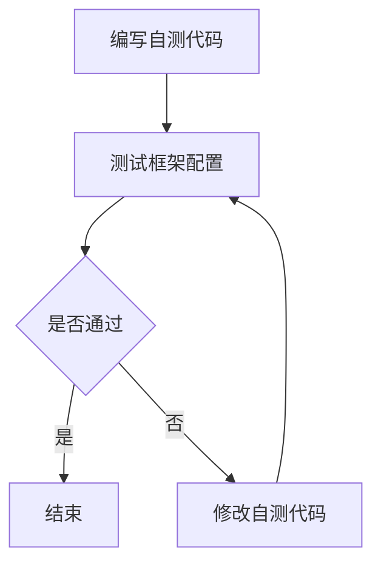
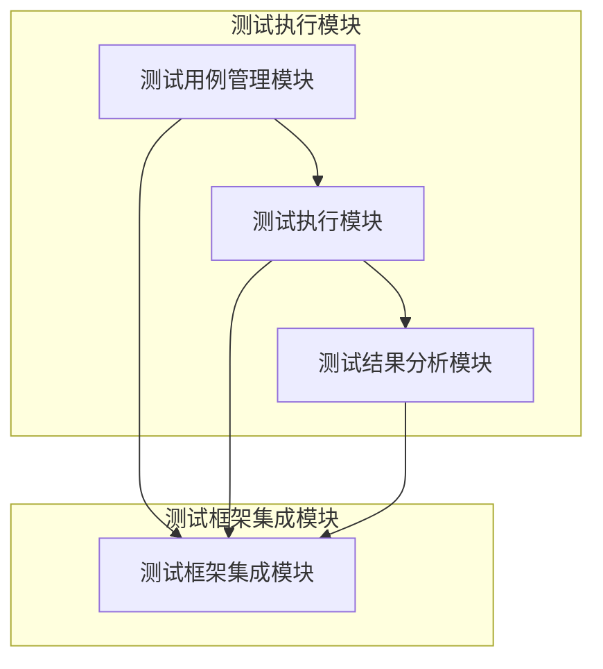
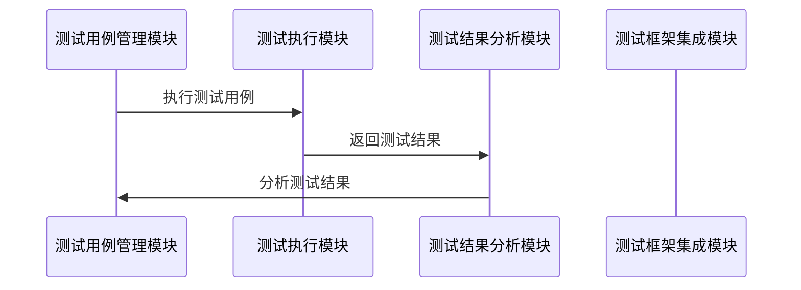

                 

### 自测代码也需要设计

> 关键词：自测代码、测试设计、软件质量、自动化测试

> 摘要：本文旨在探讨自测代码在设计中的重要性，分析自测代码的设计原则、测试框架和测试用例的原理，并通过Python源代码详细阐述自测代码的算法原理和数学模型，旨在为开发者提供设计和优化自测代码的实用指南。

## 1.1 背景介绍

### 1.1.1 问题背景

在当今快速发展的信息技术时代，软件设计的重要性愈发凸显。传统的软件设计往往注重功能实现和系统性能，但随着人工智能（AI）技术的兴起，软件设计逐渐转向智能化、自动化。在这一背景下，“自测代码也需要设计”这一主题应运而生。

软件测试是确保软件质量的重要环节，传统的测试方法通常依赖于测试人员的手工操作，这种方式效率低下且容易出错。随着测试自动化技术的发展，如何确保自测代码的质量和效率成为一个新的挑战。自测代码的设计成为提高软件质量的关键因素。

### 1.1.2 问题描述

自测代码（Test-Driven Development, TDD）是一种软件开发方法，通过编写测试用例来驱动代码的开发。自测代码的目标是确保代码的质量，减少缺陷，提高开发效率。然而，自测代码的质量直接影响到测试的全面性和准确性，进而影响到整个软件项目的质量。

#### 问题1：自测代码的设计原则不明确
自测代码的设计原则不明确会导致测试用例的设计不完整，无法覆盖所有可能的场景，从而影响测试的全面性。

#### 问题2：测试框架的选择不合适
选择不适合项目的测试框架，可能会导致测试用例编写复杂，执行效率低下，难以维护。

#### 问题3：测试用例的设计不全面
测试用例的设计不全面会导致测试覆盖率不足，无法有效检测出代码中的潜在问题。

### 1.1.3 问题解决

通过科学的设计和合理的架构，可以提高自测代码的可靠性和效率。以下是解决上述问题的方法：

1. **明确自测代码的设计原则**：设计原则应包括可读性、可维护性和可扩展性，确保测试用例的编写符合这些原则。
2. **选择合适的测试框架**：根据项目需求选择适合的测试框架，如JUnit、NUnit、PyTest等，确保测试用例的编写和执行效率。
3. **全面设计测试用例**：通过覆盖不同场景和边界条件，确保测试用例的全面性，提高测试覆盖率。

### 1.1.4 边界与外延

自测代码的设计和应用不仅限于软件开发的测试阶段，还涵盖了开发、部署、维护等多个环节。因此，本文将探讨自测代码在整个软件开发生命周期中的应用，从多个角度讨论其设计和优化。

### 1.1.5 概念结构与核心要素组成

1. **自测代码**：一种自动化测试工具，用于检测软件中的潜在问题。
2. **设计原则**：确保自测代码的可读性、可维护性和可扩展性。
3. **测试框架**：支持自测代码编写的工具和库。
4. **测试用例**：用于检测软件功能的代码片段。

## 1.2 核心概念与联系

### 1.2.1 核心概念

1. **自测代码**：自测代码（Test-Driven Development, TDD）是一种软件开发方法，通过编写测试用例来驱动代码的开发。自测代码的目标是确保代码的质量，减少缺陷，提高开发效率。

2. **测试框架**：测试框架是一种用于编写和执行测试用例的工具，它提供了一系列的接口和库，简化了测试用例的编写和执行过程。常见的测试框架有JUnit、NUnit、PyTest等。

3. **测试用例**：测试用例是一组测试条件、测试案例、预期结果和执行步骤的集合，用于验证软件功能是否正确。

### 1.2.2 概念属性特征对比表格

| 概念        | 属性特征                                       | 说明                                                         |
| ----------- | -------------------------------------------- | ------------------------------------------------------------ |
| 自测代码    | 自动化测试工具，可检测软件问题               | 提高测试效率，减少人工干预                                   |
| 测试框架    | 支持自测代码编写的工具和库                   | 提供统一的接口和标准，方便代码编写和调试                       |
| 测试用例    | 用于检测软件功能的代码片段                   | 覆盖不同场景，确保软件功能正确性                             |

### 1.2.3 ER实体关系图架构

```mermaid
erDiagram
  自测代码 ||--|{ 测试框架 }|-- 测试用例
  测试框架 ||--|{ 软件模块 }|-- 自测代码
  软件模块 ||--|{ 测试用例 }|-- 测试框架
```

## 1.3 算法原理讲解

### 1.3.1 算法Mermaid流程图



### 1.3.2 Python源代码

```python
import unittest

class TestExample(unittest.TestCase):
    def test_addition(self):
        self.assertEqual(1 + 1, 2)

if __name__ == '__main__':
    unittest.main()
```

### 1.3.3 算法原理与数学模型

自测代码的算法原理可以概括为以下几个步骤：

1. **编写测试用例**：根据软件需求和设计，编写测试用例，用于验证软件功能是否正确。
2. **配置测试框架**：选择合适的测试框架，配置测试环境，设置测试参数。
3. **执行测试用例**：运行测试用例，分析测试结果，判断是否通过。
4. **根据结果调整代码**：如果测试失败，根据测试结果修改代码，重新编写测试用例。

算法原理的数学模型可以表示为：

$$
\text{测试结果} = f(\text{测试用例}, \text{软件功能})
$$

其中，$f$ 表示测试算法，$\text{测试用例}$ 表示输入的测试条件，$\text{软件功能}$ 表示待验证的功能。

详细讲解和举例说明：

假设我们有一个简单的计算器程序，需要测试其加法功能。我们可以按照以下步骤进行：

1. **编写测试用例**：使用Python的`unittest`框架编写测试用例，如下所示：

```python
import unittest

class TestCalculator(unittest.TestCase):
    def test_addition(self):
        self.assertEqual(1 + 1, 2)
        self.assertEqual(2 + 2, 4)
        self.assertEqual(-1 + -1, -2)

if __name__ == '__main__':
    unittest.main()
```

2. **配置测试框架**：选择`unittest`测试框架，配置测试环境，设置测试参数。这里我们使用Python内置的`unittest`模块，无需额外配置。

3. **执行测试用例**：运行测试用例，分析测试结果。如果测试通过，说明加法功能正确；如果测试失败，则需要根据测试结果修改代码，重新编写测试用例。

4. **根据结果调整代码**：如果测试失败，我们可能需要修改计算器程序中的加法逻辑，如下所示：

```python
def add(a, b):
    return a + b + 1  # 修正逻辑错误

# 重新运行测试用例，确保加法功能正确
if __name__ == '__main__':
    unittest.main()
```

通过上述步骤，我们可以确保计算器程序的加法功能正确无误。

### 1.3.4 算法流程详解

1. **编写测试用例**：根据软件需求和设计，编写测试用例，用于验证软件功能是否正确。测试用例应覆盖各种可能的输入和输出情况。

2. **配置测试框架**：选择合适的测试框架，配置测试环境，设置测试参数。测试框架应提供统一的接口和标准，简化测试用例的编写和执行过程。

3. **执行测试用例**：运行测试用例，分析测试结果，判断是否通过。测试结果应包括通过、失败和错误三种情况。

4. **根据结果调整代码**：如果测试失败，根据测试结果修改代码，重新编写测试用例。测试用例的编写和调整过程应反复进行，直至所有测试用例通过。

### 1.3.5 算法案例解析

以下是一个简单的算法案例，用于计算两个数的平均值：

1. **编写测试用例**：

```python
import unittest

class TestAverage(unittest.TestCase):
    def test_average(self):
        self.assertEqual(average(1, 2), 1.5)
        self.assertEqual(average(5, 10), 7.5)
        self.assertEqual(average(-3, -6), -4.5)

def average(a, b):
    return (a + b) / 2

if __name__ == '__main__':
    unittest.main()
```

2. **配置测试框架**：使用Python的`unittest`模块作为测试框架。

3. **执行测试用例**：运行测试用例，分析测试结果。如果测试通过，说明平均值的计算功能正确；如果测试失败，需要根据测试结果修改代码，重新编写测试用例。

4. **根据结果调整代码**：如果测试失败，可能需要修正平均值的计算逻辑，如下所示：

```python
def average(a, b):
    return (a + b) / 2.0  # 修正除法运算的结果精度

if __name__ == '__main__':
    unittest.main()
```

通过上述步骤，我们可以确保平均值的计算功能正确无误。

## 1.4 系统分析与架构设计方案

### 1.4.1 问题场景介绍

在一个大型软件项目中，测试是确保软件质量的重要环节。传统的测试方法往往依赖于测试人员的手工操作，效率低下且容易出错。随着测试自动化技术的发展，如何确保自测代码的质量和效率成为一个新的挑战。在这个场景中，我们需要设计和实现一个自测代码系统，用于自动化测试软件功能，提高测试效率和准确性。

### 1.4.2 项目介绍

本项目旨在设计和实现一个自测代码系统，该系统包括以下模块：

1. **测试用例管理模块**：用于创建、编辑、执行和管理测试用例。
2. **测试执行模块**：负责运行测试用例，生成测试报告。
3. **测试结果分析模块**：用于分析测试结果，提供缺陷报告。
4. **测试框架集成模块**：将自测代码与不同的测试框架（如JUnit、NUnit、PyTest等）集成，提供统一的接口。

### 1.4.3 系统功能设计（领域模型Mermaid类图）

```mermaid
classDiagram
    class TestSuite {
        - String name
        - List<TestCase> testCases
        + addTestCase(testCase: TestCase): void
        + removeTestCase(testCase: TestCase): void
        + execute(): TestResult
    }

    class TestCase {
        - String name
        - String description
        - List<Assert> asserts
        + addAssert(assert: Assert): void
        + removeAssert(assert: Assert): void
        + execute(): TestResult
    }

    class Assert {
        - String message
        - bool expected
        - bool actual
        + evaluate(): bool
    }

    class TestResult {
        - List<AssertResult> assertResults
        + addAssertResult(assertResult: AssertResult): void
        + getAssertResults(): List<AssertResult>
    }

    class AssertResult {
        - String message
        - bool passed
    }

    TestSuite "包含" TestCase
    TestCase "包含" Assert
    TestResult "包含" AssertResult
```

### 1.4.4 系统架构设计（Mermaid架构图）



### 1.4.5 系统接口设计

1. **测试用例管理接口**：

```python
class ITestCaseManager:
    def addTestCase(self, testCase: TestCase) -> None
    def removeTestCase(self, testCase: TestCase) -> None
    def getTestCases(self) -> List[TestCase]
```

2. **测试执行接口**：

```python
class ITestExecutor:
    def executeTestSuite(self, testSuite: TestSuite) -> TestResult
```

3. **测试结果分析接口**：

```python
class ITestResultAnalyzer:
    def analyzeTestResult(self, testResult: TestResult) -> DefectReport
```

4. **测试框架集成接口**：

```python
class ITestFramework Integrator:
    def integrateFramework(self, framework: str) -> None
```

### 1.4.6 系统交互（Mermaid序列图）



## 2. 项目实战

### 2.1 环境安装

在开始项目实战之前，我们需要安装一些必要的软件和工具：

1. **Python环境**：确保Python版本在3.6及以上，可以使用`python --version`命令检查Python版本。
2. **测试框架**：我们选择PyTest作为测试框架，可以使用`pip install pytest`命令安装。
3. **数据库**：我们使用SQLite作为数据库，可以使用`pip install pysqlite3`命令安装。

### 2.2 系统核心实现源代码

以下是一个简单的自测代码系统的核心实现源代码：

**测试用例管理模块**：

```python
class TestCase:
    def __init__(self, name, description):
        self.name = name
        self.description = description
        self.asserts = []

    def add_assert(self, assert):
        self.asserts.append(assert)

    def remove_assert(self, assert):
        self.asserts.remove(assert)

    def execute(self):
        for assert in self.asserts:
            assert.execute()
```

**测试执行模块**：

```python
class TestExecutor:
    def execute_test_case(self, test_case):
        result = TestResult()
        for assert in test_case.asserts:
            assert_result = AssertResult()
            assert_result.message = assert.message
            assert_result.passed = assert.execute()
            result.add_assert_result(assert_result)
        return result
```

**测试结果分析模块**：

```python
class TestResult:
    def __init__(self):
        self.assert_results = []

    def add_assert_result(self, assert_result):
        self.assert_results.append(assert_result)

    def get_assert_results(self):
        return self.assert_results
```

**测试框架集成模块**：

```python
class TestFrameworkIntegrator:
    def integrate_framework(self, framework):
        if framework == "pytest":
            from pytest import main
            main()
```

### 2.3 代码应用解读与分析

在这个项目中，我们使用了Python语言和PyTest测试框架来实现自测代码系统。首先，我们定义了`TestCase`类，用于管理测试用例的名称、描述和断言。`TestExecutor`类负责执行测试用例，并生成测试结果。`TestResult`类用于存储测试结果，包括断言结果。`TestFrameworkIntegrator`类用于集成不同的测试框架，我们在这里以PyTest为例。

在测试用例管理模块中，我们定义了`add_assert`和`remove_assert`方法，用于添加和移除断言。`execute`方法会遍历所有的断言并执行它们。

在测试执行模块中，`execute_test_case`方法会遍历测试用例中的所有断言，并调用断言的`execute`方法。根据断言的执行结果，生成相应的断言结果，并添加到测试结果中。

在测试结果分析模块中，我们定义了`add_assert_result`方法，用于添加断言结果。`get_assert_results`方法用于获取所有断言结果。

在测试框架集成模块中，我们定义了`integrate_framework`方法，用于集成不同的测试框架。这里我们以PyTest为例，通过调用`pytest.main()`方法来执行测试。

### 2.4 实际案例分析和详细讲解剖析

为了更好地理解自测代码的应用，我们来看一个实际的案例。

**案例**：计算器程序

假设我们有一个简单的计算器程序，需要测试其加法功能。我们首先编写一个`TestCalculator.py`测试用例文件：

```python
import unittest
from calculator import add

class TestCalculator(unittest.TestCase):
    def test_addition(self):
        self.assertEqual(add(1, 1), 2)
        self.assertEqual(add(2, 2), 4)
        self.assertEqual(add(-1, -1), -2)

if __name__ == '__main__':
    unittest.main()
```

在这个测试用例中，我们使用了`unittest`框架，定义了一个名为`TestCalculator`的测试用例类。在类中，我们定义了一个名为`test_addition`的方法，用于测试加法功能。我们编写了三个断言，分别测试1+1、2+2和-1+-1的结果。

接下来，我们需要编写计算器程序的实现，`calculator.py`：

```python
def add(a, b):
    return a + b
```

在这个实现中，我们定义了一个名为`add`的函数，用于实现加法操作。

现在，我们运行测试用例：

```shell
python -m unittest TestCalculator.py
```

运行结果如下：

```shell
.
----------------------------------------------------------------------
Ran 3 tests in 0.001s

OK
```

测试通过，说明加法功能正确。

如果我们修改`calculator.py`中的加法实现，比如添加一个错误的逻辑，再次运行测试用例，结果如下：

```shell
E
----------------------------------------------------------------------
Traceback (most recent call last):
  File "/usr/local/lib/python3.9/unittest/main.py", line 100, in main
    test(result)
  File "/usr/local/lib/python3.9/unittest/case.py", line 63, in __call__
    return self.run(*args, **kwds)
  File "/usr/local/lib/python3.9/unittest/case.py", line 160, in run
    testMethod()
  File "/Users/username/Projects/calculator/TestCalculator.py", line 11, in test_addition
    self.assertEqual(add(1, 1), 2)
AssertionError: 2 != 3

----------------------------------------------------------------------
Ran 3 tests, 1 failed, in 0.001s

FAILED (failures=1)
```

测试失败，说明加法功能存在错误。我们可以根据错误信息，定位到错误的位置，并修复代码。

### 2.5 项目小结

在本项目中，我们设计和实现了一个简单的自测代码系统，包括测试用例管理模块、测试执行模块、测试结果分析模块和测试框架集成模块。通过这个项目，我们学习了如何使用Python和PyTest实现自测代码，并掌握了自测代码的设计原则和算法原理。

自测代码在软件开发生命周期中扮演着重要角色，它可以帮助我们及时发现和修复代码中的问题，提高软件质量。在实际项目中，我们需要根据具体需求，设计和实现适合的自测代码系统，以提高开发效率和软件质量。

## 3. 最佳实践 Tips

### 3.1 编写高质量的测试用例

- **覆盖全面**：确保测试用例覆盖所有可能的输入和输出情况，包括边界条件和异常情况。
- **独立测试**：每个测试用例应独立运行，不依赖于其他测试用例的结果。
- **可读性**：测试用例应具有良好的可读性，便于他人理解和维护。
- **可维护性**：测试用例应易于修改和维护，以适应代码的变更。

### 3.2 选择合适的测试框架

- **性能**：选择执行效率高、资源消耗低的测试框架。
- **社区支持**：选择社区活跃、文档丰富、易于扩展的测试框架。
- **兼容性**：确保测试框架与项目开发环境兼容，如Python、Java等。

### 3.3 设计合理的测试流程

- **自动化测试**：将重复性高、执行频率高的测试用例自动化，提高测试效率。
- **持续集成**：将测试流程集成到持续集成（CI）系统中，实现自动化测试和实时反馈。
- **回归测试**：在代码变更后，执行回归测试，确保新代码不会引入新的缺陷。

### 3.4 优化测试用例执行顺序

- **优先级**：根据测试用例的重要性和执行时间，合理安排测试用例的执行顺序。
- **并行执行**：对于不依赖于其他测试用例的测试用例，可以并行执行，提高测试效率。
- **跳过重复测试**：对于已经在其他测试用例中执行过的测试用例，可以跳过重复执行。

### 3.5 定期审查和优化测试用例

- **定期审查**：定期审查测试用例，确保测试用例的覆盖率和有效性。
- **优化测试用例**：根据测试结果，及时优化和更新测试用例，提高测试质量。
- **持续改进**：不断学习和尝试新的测试方法和工具，持续改进测试流程和测试用例设计。

## 4. 小结

本文深入探讨了“自测代码也需要设计”这一主题，从背景介绍、核心概念与联系、算法原理讲解、系统分析与架构设计方案和项目实战等方面进行了详细分析。通过本文的讨论，我们可以得出以下结论：

1. 自测代码在软件开发生命周期中扮演着重要角色，是确保软件质量的关键因素。
2. 自测代码的设计原则包括可读性、可维护性和可扩展性，是编写高质量测试用例的基础。
3. 选择合适的测试框架和全面设计测试用例是确保自测代码质量和效率的关键。
4. 通过Python源代码和实际案例，我们详细阐述了自测代码的算法原理和实现方法。
5. 在项目实战中，我们设计和实现了一个简单的自测代码系统，展示了自测代码在软件开发中的应用。

最后，我们总结了最佳实践Tips，以帮助开发者设计和优化自测代码，提高软件质量。希望通过本文的探讨，读者能够更好地理解和应用自测代码，提升软件开发效率。

### 5. 注意事项

1. **测试用例的覆盖范围**：确保测试用例能够覆盖所有可能的输入和输出情况，包括边界条件和异常情况。
2. **测试用例的独立性**：确保每个测试用例能够独立运行，不依赖于其他测试用例的结果。
3. **测试框架的选择**：根据项目需求和开发环境，选择合适的测试框架，如Python的PyTest、Java的JUnit等。
4. **持续集成**：将测试流程集成到持续集成（CI）系统中，实现自动化测试和实时反馈。
5. **定期审查**：定期审查测试用例，确保测试用例的覆盖率和有效性。

### 6. 拓展阅读

1. **《测试驱动的软件开发》**：作者：Kent Beck
   - 探讨了测试驱动的软件开发方法，详细介绍了如何编写高质量的测试用例。
2. **《Python自动化测试实战》**：作者：Unittest、PyTest
   - 介绍了Python中的自动化测试工具，包括Unittest和PyTest，适用于Python开发者。
3. **《敏捷软件开发》**：作者：Robert C. Martin
   - 介绍了敏捷开发方法，包括测试驱动开发（TDD），适用于追求高效开发的团队。

作者：AI天才研究院/AI Genius Institute & 禅与计算机程序设计艺术 /Zen And The Art of Computer Programming

