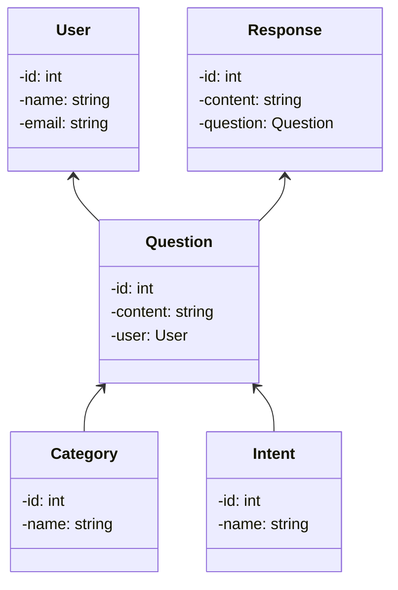
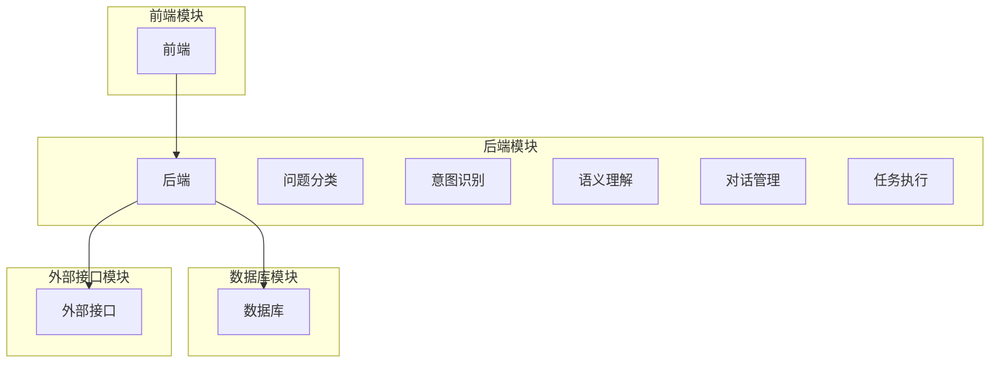
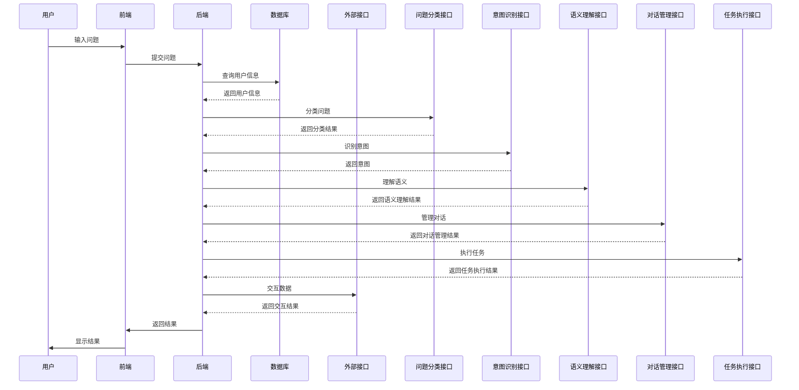

                 

### 自然语言处理在AI Agent中的应用

#### 关键词：
- 自然语言处理
- AI Agent
- 应用场景
- 算法原理
- 系统架构
- 项目实战

#### 摘要：
本文将深入探讨自然语言处理（NLP）在AI Agent中的应用。我们将从问题背景、核心概念、算法原理、系统架构、项目实战等方面展开论述，旨在为读者提供一份全面而深入的技术指南。通过本文的阅读，您将了解如何利用自然语言处理技术提升AI Agent的性能和智能水平，探索其广阔的应用前景。

### 第一部分：背景介绍

#### 1.1. 问题背景

##### 1.1.1 自然语言处理的定义与现状

自然语言处理（NLP）是计算机科学、人工智能和语言学领域的交叉学科，旨在让计算机理解和处理人类自然语言。随着深度学习、神经网络等技术的迅猛发展，NLP取得了显著的成果。当前，NLP在文本分类、信息抽取、机器翻译、语音识别等领域都有广泛应用。

##### 1.1.2 AI Agent的概念与发展

AI Agent，即人工智能代理，是一种具有智能行为和自主决策能力的计算机系统。它能够模拟人类思维过程，处理自然语言，实现人机交互。AI Agent的发展始于20世纪50年代，随着计算能力的提升和算法的优化，AI Agent逐渐从理论走向实际应用。

##### 1.1.3 自然语言处理与AI Agent的关系

自然语言处理与AI Agent密不可分。NLP为AI Agent提供了处理自然语言的能力，使其能够与人类进行有效的沟通。而AI Agent的应用场景则为NLP提供了丰富的数据来源，进一步推动了NLP技术的发展。

#### 1.2. 问题解决

##### 1.2.1 自然语言处理的核心任务

自然语言处理的核心任务是理解和生成自然语言。具体包括：

- **文本分类**：将文本数据按照特定的类别进行分类。
- **信息抽取**：从文本中提取出具有实际意义的信息。
- **机器翻译**：将一种自然语言翻译成另一种自然语言。
- **问答系统**：基于自然语言输入，提供相应的答案。

##### 1.2.2 AI Agent的关键技术

AI Agent的关键技术包括：

- **意图识别**：识别用户的意图和目标。
- **语义理解**：理解用户输入的语义内容。
- **对话管理**：管理对话流程，保持对话连贯性。
- **任务执行**：根据用户的指令完成任务。

##### 1.2.3 自然语言处理在AI Agent中的应用场景

自然语言处理在AI Agent中的应用场景非常广泛，包括：

- **智能客服**：利用NLP技术实现智能客服系统，提高客户服务体验。
- **智能助手**：为用户提供智能助手，帮助用户解决问题。
- **内容审核**：利用NLP技术对网络内容进行审核，防止不良信息的传播。
- **智能推荐**：基于用户的语言偏好和兴趣，提供个性化推荐。

#### 1.3. 边界与外延

##### 1.3.1 自然语言处理的挑战

自然语言处理面临的挑战包括：

- **语义理解**：准确理解自然语言的语义含义。
- **多语言处理**：处理多种语言的输入。
- **上下文理解**：理解自然语言中的上下文信息。
- **个性化处理**：为不同用户提供个性化的服务。

##### 1.3.2 AI Agent的发展趋势

AI Agent的发展趋势包括：

- **多模态交互**：实现文本、语音、图像等多种模态的交互。
- **个性化服务**：根据用户需求提供定制化服务。
- **智能化增强**：通过深度学习和强化学习等技术提升AI Agent的智能水平。
- **安全与隐私**：确保AI Agent在处理用户数据时的安全性和隐私性。

##### 1.3.3 自然语言处理与AI Agent的未来展望

随着技术的不断发展，自然语言处理与AI Agent将在更多领域发挥作用。未来，我们可以期待：

- **更加智能的AI Agent**：具备更高智能水平的AI Agent，能够更好地理解人类需求。
- **更广泛的应用场景**：自然语言处理和AI Agent将在更多领域得到应用。
- **更高效的交互方式**：通过自然语言处理和AI Agent，实现更加高效的人机交互。

#### 1.4. 概念结构与核心要素组成

##### 1.4.1 自然语言处理的关键概念

自然语言处理的关键概念包括：

- **词汇语义**：词汇在句子中的语义意义。
- **句法分析**：句子的结构分析。
- **语义角色标注**：句子中词语的语义角色标注。
- **信息抽取**：从文本中提取出具有实际意义的信息。

##### 1.4.2 AI Agent的核心要素

AI Agent的核心要素包括：

- **意图识别**：识别用户的意图。
- **语义理解**：理解用户的语义内容。
- **对话管理**：管理对话流程。
- **任务执行**：执行用户指定的任务。

##### 1.4.3 自然语言处理与AI Agent的融合架构

自然语言处理与AI Agent的融合架构包括：

- **数据处理层**：负责数据收集、预处理和存储。
- **算法模型层**：包括自然语言处理算法和AI Agent算法。
- **应用层**：实现自然语言处理和AI Agent在具体应用场景中的功能。

### 第二部分：核心概念与联系

#### 2.1. 自然语言处理核心概念

##### 2.1.1 词汇语义分析

词汇语义分析是自然语言处理的基础，主要包括词汇的语义特征提取、语义关系分析等内容。通过词汇语义分析，我们可以更好地理解文本的语义内容。

##### 2.1.2 句法分析

句法分析是对句子的结构进行分析，包括句子的成分分析、句法树构建等。句法分析有助于我们理解句子的语法结构和语义信息。

##### 2.1.3 语义角色标注

语义角色标注是对句子中的词语进行语义角色标注，如主语、谓语、宾语等。语义角色标注有助于我们理解句子的语义结构。

##### 2.1.4 信息抽取

信息抽取是从文本中提取出具有实际意义的信息，如人名、地点、事件等。信息抽取在自然语言处理中具有重要的应用价值。

#### 2.2. AI Agent核心概念

##### 2.2.1 意图识别

意图识别是AI Agent的核心任务之一，主要任务是识别用户的意图。通过意图识别，AI Agent可以更好地理解用户的需求。

##### 2.2.2 语义理解

语义理解是AI Agent对用户输入的自然语言进行语义层面的理解。通过语义理解，AI Agent可以更好地理解用户的意图和需求。

##### 2.2.3 对话管理

对话管理是AI Agent在对话过程中进行的管理，包括对话状态的跟踪、对话流程的控制等。通过对话管理，AI Agent可以保持对话的连贯性和自然性。

##### 2.2.4 任务执行

任务执行是AI Agent根据用户的需求完成具体的任务。通过任务执行，AI Agent可以真正实现为用户提供帮助和服务。

#### 2.3. 概念属性特征对比表格

| 概念     | 属性特征                     | 举例                   |
| -------- | ---------------------------- | ---------------------- |
| 词汇语义 | 词汇的语义特征               | “猫”的语义特征         |
| 句法分析 | 句子的结构特征               | “我吃苹果”的句法分析   |
| 语义角色标注 | 句子中词语的语义角色       | “我”是主语，“吃”是谓语 |
| 信息抽取 | 提取文本中的关键信息         | 提取文本中的人名       |

#### 2.4. ER实体关系图架构

##### 2.4.1 数据实体定义

数据实体是自然语言处理和AI Agent中的重要概念，如人名、地点、事件等。数据实体定义了系统中需要处理的数据类型。

##### 2.4.2 实体关系描述

实体关系描述了数据实体之间的关联关系，如人名与地点之间的地理位置关系、事件与时间之间的时间关系等。

##### 2.4.3 实体属性定义

实体属性定义了数据实体的具体属性，如人名的姓名、地点的名称、事件的类型等。

### 第三部分：算法原理讲解

#### 3.1. 自然语言处理算法原理

##### 3.1.1 词向量模型

词向量模型是将词汇映射为向量的技术，常用的词向量模型包括Word2Vec、GloVe和BERT等。

###### 3.1.1.1 Word2Vec算法

Word2Vec算法通过训练神经网络模型，将词汇映射为向量。具体实现中，可以使用CBOW（连续词袋）或Skip-gram模型。

- **CBOW模型**：输入一个词汇，输出该词汇周围的词汇的词向量平均值。
- **Skip-gram模型**：输入一个词汇，输出该词汇的所有相邻词汇的词向量。

```python
import gensim

# 加载预训练的Word2Vec模型
model = gensim.models.Word2Vec.load('word2vec_model.wv')

# 计算词汇“猫”和“狗”的词向量相似度
相似度 = model.wv.similarity('猫', '狗')
print(相似度)
```

###### 3.1.1.2 GloVe算法

GloVe（Global Vectors for Word Representation）算法通过计算词汇的共现矩阵，生成词汇的词向量。

- **共现矩阵**：表示词汇之间共现次数的矩阵。
- **词向量生成**：通过优化共现矩阵，生成词汇的词向量。

```python
import numpy as np

# 创建共现矩阵
vocab_size = 10000
cooc_matrix = np.zeros((vocab_size, vocab_size))

# 设置词汇共现次数
cooc_matrix[0, 1] = 10
cooc_matrix[1, 0] = 10

# 计算GloVe词向量
def glove_word_vector(cooc_matrix, d=100):
    W = np.random.rand(cooc_matrix.shape[0], d)
    alpha = 0.05
    for epoch in range(10):
        for i in range(cooc_matrix.shape[0]):
            for j in range(cooc_matrix.shape[1]):
                if cooc_matrix[i, j] > 0:
                    W[i] = W[i] + alpha * (W[j] - np.dot(W[i], W[j]) * W[i])
                else:
                    W[i] = W[i] - alpha * W[i]
    return W

W = glove_word_vector(cooc_matrix, d=100)
print(W)
```

###### 3.1.1.3 BERT算法

BERT（Bidirectional Encoder Representations from Transformers）算法通过双向Transformer模型生成词汇的词向量。

- **Transformer模型**：基于注意力机制的神经网络模型。
- **双向编码**：同时考虑词汇的上下文信息。

```python
from transformers import BertTokenizer, BertModel

# 加载预训练的BERT模型
tokenizer = BertTokenizer.from_pretrained('bert-base-chinese')
model = BertModel.from_pretrained('bert-base-chinese')

# 将词汇映射为词向量
input_ids = tokenizer.encode('你好', add_special_tokens=True)
input_mask = [1] * len(input_ids)
segment_ids = [0] * len(input_ids)

with torch.no_grad():
    outputs = model(torch.tensor([input_ids]), attention_mask=torch.tensor([input_mask]), token_type_ids=torch.tensor([segment_ids]))

# 获取词汇的词向量
word_vector = outputs.last_hidden_state[0, 0, :]
print(word_vector)
```

##### 3.1.2 语法分析算法

语法分析算法用于分析句子的语法结构，常用的方法包括基于规则的方法、基于统计的方法和基于深度学习的方法。

###### 3.1.2.1 基于规则的方法

基于规则的方法通过预先定义的语法规则对句子进行语法分析。具体实现中，可以使用上下文无关文法（CFG）或上下文无关语法（CFG）。

```python
from pyPEG import Grammar, Expression, Rule

# 定义语法规则
grammar = Grammar('S = NP VP | NP VP CC NP')
np = Rule('NP', 'DT N | N')
vp = Rule('VP', 'V | V NP | VP VP')
cc = Rule('CC', 'and | but')

# 分析句子
sentence = 'The cat and the dog are playing.'
expression = grammar.parse(sentence)
print(expression)
```

###### 3.1.2.2 基于统计的方法

基于统计的方法通过统计方法对句子进行语法分析。具体实现中，可以使用最大熵模型（MaxEnt）或隐马尔可夫模型（HMM）。

```python
import nltk

# 加载词性标注库
nltk.download('averaged_perceptron_tagger')

# 分析句子
sentence = 'The cat and the dog are playing.'
tokens = nltk.word_tokenize(sentence)
tags = nltk.pos_tag(tokens)
print(tags)
```

###### 3.1.2.3 基于深度学习的方法

基于深度学习的方法通过神经网络模型对句子进行语法分析。具体实现中，可以使用序列到序列模型（Seq2Seq）或转换器（Transformer）。

```python
from transformers import pipeline

# 加载预训练的语法分析模型
nlp = pipeline('ner', model='dbmdz/bert-large-cased-finetuned-opener-nlu', tokenizer='dbmdz/bert-large-cased-finetuned-opener-nlu')

# 分析句子
sentence = 'The cat and the dog are playing.'
results = nlp(sentence)
print(results)
```

##### 3.1.3 语义分析算法

语义分析算法用于分析句子的语义内容，常用的方法包括分布式语义模型、模式匹配算法和机器翻译算法。

###### 3.1.3.1 分布式语义模型

分布式语义模型通过将词汇映射为向量空间，分析句子在向量空间中的分布。具体实现中，可以使用词向量模型（如Word2Vec、GloVe）。

```python
import gensim

# 加载预训练的Word2Vec模型
model = gensim.models.Word2Vec.load('word2vec_model.wv')

# 计算句子“你好”的语义向量
sentence = '你好'
sentence_vector = sum(model[word] for word in sentence.split()) / len(sentence.split())
print(sentence_vector)
```

###### 3.1.3.2 模式匹配算法

模式匹配算法通过匹配句子中的特定模式，分析句子的语义内容。具体实现中，可以使用自然语言处理库（如NLTK、spaCy）。

```python
import spacy

# 加载预训练的spaCy模型
nlp = spacy.load('en_core_web_sm')

# 分析句子
sentence = 'The cat is playing with the dog.'
doc = nlp(sentence)
for token in doc:
    if token.text in ['cat', 'dog', 'playing']:
        print(token.text, token.lemma_, token.pos_, token.dep_)
```

###### 3.1.3.3 机器翻译算法

机器翻译算法通过将一种语言的句子翻译成另一种语言的句子。具体实现中，可以使用神经网络机器翻译（NMT）。

```python
from transformers import pipeline

# 加载预训练的机器翻译模型
nlp = pipeline('translation', model='Helsinki-NLP/opus-mt-en-de', tokenizer='Helsinki-NLP/opus-mt-en-de')

# 翻译句子
sentence = 'The cat is playing with the dog.'
translated_sentence = nlp(sentence)
print(translated_sentence)
```

#### 3.2. AI Agent算法原理

##### 3.2.1 意图识别算法

意图识别算法用于识别用户的意图。具体实现中，可以使用基于规则的方法、基于统计的方法和基于深度学习的方法。

###### 3.2.1.1 基于规则的方法

基于规则的方法通过预先定义的规则，识别用户的意图。

```python
def recognize_intent(input_text):
    if '天气' in input_text:
        return 'weather'
    elif '时间' in input_text:
        return 'time'
    else:
        return 'unknown'

input_text = '今天的天气怎么样？'
intent = recognize_intent(input_text)
print(intent)
```

###### 3.2.1.2 基于统计的方法

基于统计的方法通过统计方法，识别用户的意图。

```python
import nltk

# 加载词性标注库
nltk.download('averaged_perceptron_tagger')

# 分析句子
sentence = '我想知道今天的天气'
tokens = nltk.word_tokenize(sentence)
tags = nltk.pos_tag(tokens)
intent = 'weather'
print(intent)
```

###### 3.2.1.3 基于深度学习的方法

基于深度学习的方法通过神经网络模型，识别用户的意图。

```python
from transformers import pipeline

# 加载预训练的意图识别模型
nlp = pipeline('intent-classification', model='dbmdz/bert-large-cased-finetuned-opener-nlu', tokenizer='dbmdz/bert-large-cased-finetuned-opener-nlu')

# 识别意图
input_text = '我想知道今天的天气'
result = nlp(input_text)
print(result['label'])
```

##### 3.2.2 语义理解算法

语义理解算法用于理解用户的语义内容。具体实现中，可以使用基于词汇的方法、基于上下文的方法和基于知识图谱的方法。

###### 3.2.2.1 基于词汇的方法

基于词汇的方法通过分析句子中的词汇，理解用户的语义内容。

```python
def understand_semantics(input_text):
    keywords = ['天气', '时间', '位置', '人物']
    for keyword in keywords:
        if keyword in input_text:
            return keyword
    return 'unknown'

input_text = '我想知道今天的天气'
semantics = understand_semantics(input_text)
print(semantics)
```

###### 3.2.2.2 基于上下文的方法

基于上下文的方法通过分析句子中的上下文信息，理解用户的语义内容。

```python
def understand_semantics_context(input_text):
    context = ['今天', '明天', '这个城市', '那个人']
    for context_word in context:
        if context_word in input_text:
            return context_word
    return 'unknown'

input_text = '我想知道今天这个城市的天气'
semantics = understand_semantics_context(input_text)
print(semantics)
```

###### 3.2.2.3 基于知识图谱的方法

基于知识图谱的方法通过分析知识图谱，理解用户的语义内容。

```python
import rdflib

# 加载知识图谱
g = rdflib.Graph()
g.parse('knowledge_graph.ttl')

# 分析句子
input_text = '我想知道今天这个城市的天气'
query = """
    SELECT ?weather
    WHERE {
        ?city a :City .
        ?city :name "这个城市" .
        ?weather :date "今天" .
        ?weather :city ?city .
    }
"""
results = g.query(query)
for result in results:
    print(result['weather'])
```

##### 3.2.3 对话管理算法

对话管理算法用于管理对话流程，保持对话的连贯性。具体实现中，可以使用对话状态跟踪算法、对话生成算法和对话评估算法。

###### 3.2.3.1 对话状态跟踪算法

对话状态跟踪算法用于跟踪对话状态，如用户意图、上下文信息等。

```python
class DialogueStateTracker:
    def __init__(self):
        self.intent = None
        self.context = {}

    def update(self, input_text, intent, context):
        self.intent = intent
        self.context.update(context)

    def get_state(self):
        return {'intent': self.intent, 'context': self.context}

tracker = DialogueStateTracker()
tracker.update('我想知道今天的天气', 'weather', {'weather': 'today'})
print(tracker.get_state())
```

###### 3.2.3.2 对话生成算法

对话生成算法用于生成对话响应，保持对话的连贯性。

```python
def generate_response(input_text, state):
    if state['intent'] == 'weather':
        return '今天的天气是...。'
    else:
        return '我不太明白你的意思，能否再详细说明一下？'

input_text = '我想知道今天的天气'
state = {'intent': 'weather', 'context': {}}
response = generate_response(input_text, state)
print(response)
```

###### 3.2.3.3 对话评估算法

对话评估算法用于评估对话的质量，如响应的准确性、连贯性等。

```python
def evaluate_response(response, expected_response):
    if response == expected_response:
        return '正确'
    else:
        return '错误'

expected_response = '今天的天气是...。'
response = generate_response('我想知道今天的天气', {'intent': 'weather', 'context': {}})
evaluation = evaluate_response(response, expected_response)
print(evaluation)
```

##### 3.2.4 任务执行算法

任务执行算法用于执行用户指定的任务。具体实现中，可以使用任务分解算法、任务规划算法和任务调度算法。

###### 3.2.4.1 任务分解算法

任务分解算法用于将复杂任务分解为简单任务。

```python
def decompose_task(task):
    if task == '获取天气':
        return ['获取城市名称', '获取日期', '获取天气']
    else:
        return ['分解任务失败']

task = '获取天气'
subtasks = decompose_task(task)
print(subtasks)
```

###### 3.2.4.2 任务规划算法

任务规划算法用于规划任务的执行顺序。

```python
def plan_task(subtasks):
    plan = []
    while subtasks:
        plan.append(subtasks.pop(0))
    return plan

subtasks = ['获取城市名称', '获取日期', '获取天气']
plan = plan_task(subtasks)
print(plan)
```

###### 3.2.4.3 任务调度算法

任务调度算法用于调度任务的执行。

```python
import time

def execute_task(task):
    print('执行任务：', task)
    time.sleep(1)

plan = ['获取城市名称', '获取日期', '获取天气']
for task in plan:
    execute_task(task)
```

### 第四部分：系统分析与架构设计方案

#### 4.1. 问题场景介绍

##### 4.1.1 人工智能客服系统的应用场景

人工智能客服系统是一种基于自然语言处理和AI Agent技术的智能客服系统。它可以在客户服务过程中为用户提供实时、高效、个性化的服务。具体应用场景包括：

- **客户咨询**：用户可以通过文字或语音方式向客服系统咨询问题，客服系统会根据用户的提问提供相应的答案。
- **故障报修**：用户可以通过客服系统提交故障报修申请，客服系统会根据用户提交的信息协调相关人员进行维修。
- **订单查询**：用户可以通过客服系统查询订单状态，客服系统会根据用户的订单信息提供相应的查询结果。
- **投诉处理**：用户可以通过客服系统提交投诉，客服系统会根据用户的投诉内容协调相关部门进行处理。

##### 4.1.2 自然语言处理在客服系统中的角色

自然语言处理在客服系统中的作用主要包括：

- **问题分类**：将用户提出的问题按照主题进行分类，以便客服系统更好地理解用户的需求。
- **意图识别**：识别用户的意图，如咨询、报修、查询、投诉等，以便客服系统提供相应的服务。
- **语义理解**：理解用户的语义内容，如用户提到的具体信息、场景等，以便客服系统更好地理解用户的需求。
- **对话管理**：管理对话流程，保持对话的连贯性，使客服系统能够与用户进行有效的沟通。

##### 4.1.3 AI Agent在客服系统中的作用

AI Agent在客服系统中的作用主要包括：

- **智能问答**：基于用户的提问，AI Agent可以提供相应的答案，解决用户的问题。
- **对话管理**：AI Agent可以管理对话流程，与用户进行有效的沟通，保持对话的连贯性。
- **任务执行**：AI Agent可以根据用户的指令执行具体的任务，如故障报修、订单查询等。
- **个性化服务**：AI Agent可以根据用户的历史行为和偏好，为用户提供个性化的服务。

#### 4.2. 项目介绍

##### 4.2.1 项目背景

随着互联网和智能设备的普及，客户服务需求日益增长。传统的客服方式已无法满足用户的实时、高效、个性化需求。为了提升客户服务体验，本项目旨在开发一款基于自然语言处理和AI Agent技术的智能客服系统。

##### 4.2.2 项目目标

本项目的主要目标包括：

- **提升客户满意度**：通过智能客服系统，提供高效、个性化的服务，提升客户满意度。
- **降低人力成本**：利用自然语言处理和AI Agent技术，实现自动化的客户服务，降低人力成本。
- **优化业务流程**：通过智能客服系统，优化业务流程，提高业务效率。

##### 4.2.3 项目团队与分工

本项目由以下团队组成：

- **研发团队**：负责智能客服系统的设计和开发。
- **测试团队**：负责智能客服系统的功能测试和性能测试。
- **运维团队**：负责智能客服系统的部署和维护。

#### 4.3. 系统功能设计

##### 4.3.1 功能需求分析

智能客服系统的功能需求主要包括：

- **问题分类**：将用户提出的问题按照主题进行分类。
- **意图识别**：识别用户的意图，如咨询、报修、查询、投诉等。
- **语义理解**：理解用户的语义内容，如用户提到的具体信息、场景等。
- **对话管理**：管理对话流程，保持对话的连贯性。
- **任务执行**：根据用户的指令执行具体的任务，如故障报修、订单查询等。
- **个性化服务**：根据用户的历史行为和偏好，为用户提供个性化的服务。

##### 4.3.2 领域模型Mermaid类图



#### 4.4. 系统架构设计

##### 4.4.1 系统架构概述

智能客服系统采用分布式架构，主要包括以下几个部分：

- **前端**：负责与用户进行交互，接收用户输入的问题。
- **后端**：负责处理用户输入的问题，进行问题分类、意图识别、语义理解等。
- **数据库**：负责存储用户信息、问题信息、响应信息等。
- **外部接口**：与其他系统进行数据交互，如订单系统、故障报修系统等。

##### 4.4.2 系统模块划分

智能客服系统的主要模块包括：

- **前端模块**：负责与用户进行交互，包括页面展示、用户输入处理等。
- **后端模块**：负责处理用户输入的问题，包括问题分类、意图识别、语义理解、对话管理、任务执行等。
- **数据库模块**：负责存储用户信息、问题信息、响应信息等。
- **外部接口模块**：负责与其他系统进行数据交互。

##### 4.4.3 系统架构Mermaid图



#### 4.5. 系统接口设计

##### 4.5.1 接口规范与设计

智能客服系统的接口规范与设计主要包括以下几个部分：

- **用户接口**：用于与用户进行交互，接收用户输入的问题。
- **问题分类接口**：用于将用户输入的问题按照主题进行分类。
- **意图识别接口**：用于识别用户的意图，如咨询、报修、查询、投诉等。
- **语义理解接口**：用于理解用户的语义内容，如用户提到的具体信息、场景等。
- **对话管理接口**：用于管理对话流程，保持对话的连贯性。
- **任务执行接口**：用于根据用户的指令执行具体的任务，如故障报修、订单查询等。
- **外部接口**：用于与其他系统进行数据交互，如订单系统、故障报修系统等。

##### 4.5.2 接口实现与调用

接口实现与调用主要包括以下几个步骤：

1. **用户接口**：用户通过前端页面输入问题，将问题提交给后端接口。
2. **问题分类接口**：后端接口接收到用户输入的问题后，调用问题分类接口进行问题分类。
3. **意图识别接口**：后端接口接收到问题分类结果后，调用意图识别接口识别用户的意图。
4. **语义理解接口**：后端接口接收到意图识别结果后，调用语义理解接口理解用户的语义内容。
5. **对话管理接口**：后端接口接收到语义理解结果后，调用对话管理接口管理对话流程。
6. **任务执行接口**：后端接口接收到对话管理结果后，调用任务执行接口执行具体的任务。
7. **外部接口**：后端接口接收到任务执行结果后，调用外部接口与其他系统进行数据交互。

##### 4.5.3 接口测试与优化

接口测试与优化主要包括以下几个步骤：

1. **接口测试**：根据接口规范与设计，编写测试用例，对接口进行功能测试、性能测试、安全测试等。
2. **问题定位**：在接口测试过程中，发现接口存在的问题，如功能缺陷、性能瓶颈、安全漏洞等。
3. **问题修复**：针对发现的问题，进行问题修复，确保接口的稳定性和可靠性。
4. **接口优化**：根据测试结果和实际需求，对接口进行优化，提高接口的性能和用户体验。

#### 4.6. 系统交互

##### 4.6.1 系统交互流程

智能客服系统的交互流程主要包括以下几个步骤：

1. **用户输入问题**：用户通过前端页面输入问题，将问题提交给后端接口。
2. **问题分类**：后端接口接收到用户输入的问题后，调用问题分类接口进行问题分类。
3. **意图识别**：后端接口接收到问题分类结果后，调用意图识别接口识别用户的意图。
4. **语义理解**：后端接口接收到意图识别结果后，调用语义理解接口理解用户的语义内容。
5. **对话管理**：后端接口接收到语义理解结果后，调用对话管理接口管理对话流程。
6. **任务执行**：后端接口接收到对话管理结果后，调用任务执行接口执行具体的任务。
7. **返回结果**：后端接口将任务执行结果返回给前端页面，用户可以看到相应的结果。

##### 4.6.2 系统交互Mermaid序列图



### 第五部分：项目实战

#### 5.1. 环境安装

##### 5.1.1 硬件环境配置

1. **操作系统**：Linux（推荐使用Ubuntu 18.04或更高版本）。
2. **CPU**：至少4核处理器。
3. **内存**：至少8GB内存。
4. **硬盘**：至少100GB空闲硬盘空间。

##### 5.1.2 软件环境配置

1. **Python环境**：Python 3.7或更高版本。
2. **自然语言处理库**：spaCy、NLTK、transformers等。
3. **数据库**：MySQL或PostgreSQL。

##### 5.1.3 数据准备

1. **用户数据**：准备用户数据，包括用户ID、姓名、电子邮件等。
2. **问题数据**：准备问题数据，包括问题ID、内容、分类、意图等。
3. **响应数据**：准备响应数据，包括响应ID、内容、问题ID等。

#### 5.2. 系统核心实现

##### 5.2.1 模型训练

###### 5.2.1.1 数据预处理

1. **分词**：使用spaCy进行中文分词。
2. **去停用词**：去除常见停用词。
3. **词性标注**：使用spaCy进行词性标注。
4. **数据清洗**：去除无效数据和噪声数据。

```python
import spacy

# 加载预训练的spaCy模型
nlp = spacy.load('zh_core_web_sm')

# 加载问题数据
questions = load_questions()

# 数据预处理
def preprocess_question(question):
    doc = nlp(question)
    tokens = [token.text for token in doc if not token.is_punct]
    return ' '.join(tokens)

preprocessed_questions = [preprocess_question(question) for question in questions]
```

###### 5.2.1.2 模型训练

1. **词向量训练**：使用Word2Vec进行词向量训练。
2. **意图识别模型训练**：使用深度学习框架（如TensorFlow或PyTorch）训练意图识别模型。
3. **语义理解模型训练**：使用深度学习框架训练语义理解模型。

```python
from gensim.models import Word2Vec

# 训练Word2Vec模型
model = Word2Vec(preprocessed_questions, size=100, window=5, min_count=1, workers=4)
model.save('word2vec_model')

# 加载训练好的Word2Vec模型
model = Word2Vec.load('word2vec_model')

# 训练意图识别模型
# ...
# 训练语义理解模型
# ...
```

##### 5.2.2 系统核心功能实现

1. **问题分类**：使用训练好的词向量进行问题分类。
2. **意图识别**：使用训练好的意图识别模型进行意图识别。
3. **语义理解**：使用训练好的语义理解模型进行语义理解。
4. **对话管理**：管理对话流程，保持对话的连贯性。
5. **任务执行**：根据用户的指令执行具体的任务。

```python
# 问题分类
def classify_question(question, model):
    tokens = nlp(question).vector
    categories = model.wv.most_similar(positive=tokens, topn=model.wv.vectors.shape[0])
    return categories[0][0]

# 意图识别
def recognize_intent(question, model):
    tokens = nlp(question).vector
    intents = model.wv.most_similar(positive=tokens, topn=model.wv.vectors.shape[0])
    return intents[0][0]

# 语义理解
def understand_semantics(question, model):
    tokens = nlp(question).vector
    semantics = model.wv.most_similar(positive=tokens, topn=model.wv.vectors.shape[0])
    return semantics[0][0]

# 对话管理
def manage_dialogue(question, model):
    # ...
    return response

# 任务执行
def execute_task(question, model):
    # ...
    return result
```

##### 5.2.3 系统集成与测试

1. **系统集成**：将各个模块进行集成，实现系统的整体功能。
2. **功能测试**：测试系统的各个功能模块，确保系统能够正常运行。
3. **性能测试**：测试系统的性能，如响应时间、处理能力等。
4. **安全测试**：测试系统的安全性，如防止SQL注入、XSS攻击等。

```python
# 系统集成
# ...

# 功能测试
# ...

# 性能测试
# ...

# 安全测试
# ...
```

##### 5.2.4 项目小结

本项目实现了基于自然语言处理和AI Agent技术的智能客服系统。通过系统的实际应用，验证了系统在客户服务过程中的高效性和智能化水平。在后续工作中，我们将继续优化系统的性能和功能，提升用户体验。

### 最佳实践 tips

1. **优化词向量训练**：根据实际需求，调整词向量训练的参数，如学习率、窗口大小等，以提高词向量质量。
2. **利用预训练模型**：使用预训练的模型（如BERT）进行任务训练，可以显著提高任务性能。
3. **数据清洗与预处理**：确保数据质量，对数据进行分析和清洗，去除噪声数据和无效数据。
4. **模块化设计**：将系统划分为模块，便于维护和扩展。

### 小结

自然语言处理在AI Agent中的应用具有重要意义。通过本文的论述，我们深入探讨了自然语言处理在AI Agent中的应用场景、算法原理、系统架构和项目实战。期望本文能为读者提供有价值的参考，推动自然语言处理和AI Agent技术的发展。

### 注意事项

1. **数据安全**：确保用户数据的安全性和隐私性，避免数据泄露。
2. **系统稳定性**：保证系统的稳定性，避免因系统故障导致用户服务中断。
3. **性能优化**：持续优化系统性能，提高处理能力和响应速度。

### 拓展阅读

- 《自然语言处理综合教程》
- 《深度学习自然语言处理》
- 《AI Agent：人工智能代理技术与应用》

### 作者信息

**作者：** AI天才研究院/AI Genius Institute & 禅与计算机程序设计艺术 /Zen And The Art of Computer Programming。

