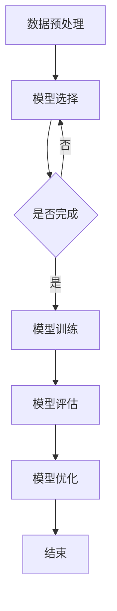
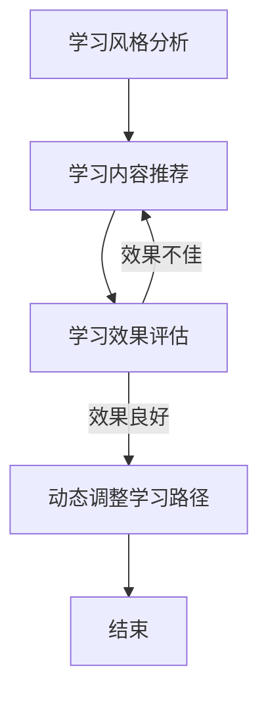
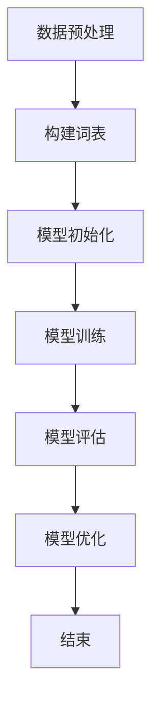

                 

### 文章标题

## 自然语言处理在多语言教育中的应用：个性化语言学习体验

### 关键词
自然语言处理，多语言教育，个性化学习，语言模型，机器翻译，算法原理

### 摘要
本文探讨了自然语言处理（NLP）在多语言教育中的应用，尤其是如何通过个性化语言学习体验来提高学习效果。文章首先介绍了NLP的基本概念和原理，随后深入分析了多语言教育和个性化语言学习体验的定义和特点。接着，文章详细讲解了语言模型和个性化语言学习体验的算法原理，并通过mermaid流程图和Python代码进行了阐述。最后，文章提出了一个系统分析与架构设计方案，并进行了项目实战的展示。通过本文，读者可以全面了解NLP在多语言教育中的应用前景。

---------------------

## 第一部分：背景介绍

### 1.1 问题背景

自然语言处理（NLP）是计算机科学和人工智能领域的一个重要分支，旨在让计算机能够理解、生成和处理人类自然语言。随着全球化和信息技术的发展，跨语言交流的需求日益增长，多语言教育成为了教育领域的一个重要研究方向。传统的教学方法往往无法满足个性化学习的需求，因此，如何通过NLP技术提供个性化语言学习体验成为了研究的热点。

在多语言教育中，学习者需要掌握多种语言，这不仅涉及到语言知识的传授，还需要考虑学习者的个体差异，如学习风格、兴趣和语言基础等。个性化语言学习体验通过分析学习者的特点，提供定制化的学习内容和方式，从而提高学习效果。这种体验不仅能够满足学习者的需求，还能提高他们的学习积极性，从而更好地实现语言教育的目标。

### 1.2 问题描述

本节将记录自然语言处理在多语言教育中应用的具体案例，探讨如何通过个性化语言学习体验来提高学习效果。具体来说，本文将围绕以下几个问题展开：

1. 自然语言处理在多语言教育中的具体应用是什么？
2. 如何利用NLP技术来设计个性化语言学习体验？
3. 个性化语言学习体验如何提高学习效果？
4. 自然语言处理技术在多语言教育中的应用有哪些挑战和机遇？

通过以上问题的探讨，本文旨在为多语言教育提供一种基于NLP技术的创新解决方案。

### 1.3 问题解决

为了解决上述问题，本文将从以下几个方面进行探讨：

1. **自然语言处理的基本原理**：介绍NLP的核心概念，如语言模型、文本分析、语音识别和机器翻译等，并解释这些概念在多语言教育中的应用。
2. **多语言教育的概念**：阐述多语言教育的定义、特点和目标，以及如何通过NLP技术来实现这些目标。
3. **个性化语言学习体验的设计与实现**：详细讲解个性化语言学习体验的定义、特点和应用方法，并通过具体案例展示其实现过程。
4. **算法原理讲解**：深入分析NLP算法的原理，如语言模型的训练过程和个性化语言学习体验的实现方法，并通过mermaid流程图和Python代码进行阐述。
5. **系统分析与架构设计方案**：介绍一个基于NLP技术的多语言教育系统，包括系统功能设计、系统架构设计和系统接口设计等，并通过mermaid类图和序列图进行展示。
6. **项目实战**：通过一个实际项目来展示如何应用NLP技术来实现个性化语言学习体验，包括环境安装、系统核心实现源代码和应用解读与分析。
7. **最佳实践 tips、小结、注意事项、拓展阅读等内容**：总结本文的核心观点，提供一些实用的建议，并对未来的研究方向进行展望。

通过以上几个方面的探讨，本文旨在为多语言教育提供一种基于NLP技术的创新解决方案，从而提高学习效果，满足个性化学习需求。

### 1.4 边界与外延

本文的研究主要涵盖自然语言处理在多语言教育中的应用，包括文本分析、语音识别、机器翻译等方面。同时，本文还讨论了个性化语言学习体验的设计与实现，旨在通过定制化的学习内容和方式来提高学习效果。以下是一些边界与外延的讨论：

1. **自然语言处理的应用范围**：本文主要讨论了NLP在多语言教育中的应用，但NLP在其他领域的应用也非常广泛，如智能客服、金融风险控制、医疗诊断等。未来研究可以进一步探讨NLP技术在其他领域的应用。
2. **个性化语言学习体验的实现方法**：本文介绍了基于NLP技术的个性化语言学习体验，但还有其他方法可以实现个性化学习，如认知心理学、教育心理学等。未来研究可以结合多种方法来提高个性化学习体验。
3. **技术挑战与机遇**：虽然NLP技术在多语言教育中有着广泛的应用前景，但也面临一些技术挑战，如数据质量和算法性能等。未来研究需要关注这些挑战，并探索解决方案。
4. **教育政策与社会影响**：本文主要关注技术层面，但多语言教育还涉及到教育政策和社会影响。未来研究可以探讨如何通过政策引导和社会参与来促进多语言教育的发展。

通过以上边界与外延的讨论，本文旨在为读者提供一个全面的视角，以理解NLP在多语言教育中的应用及其未来发展。

### 1.5 概念结构与核心要素组成

要深入探讨自然语言处理（NLP）在多语言教育中的应用，并实现个性化语言学习体验，我们需要明确以下几个核心概念和要素：

**1. 自然语言处理（NLP）**

自然语言处理是计算机科学和人工智能领域的一个重要分支，旨在让计算机能够理解、生成和处理人类自然语言。NLP的核心概念包括：

- **语言模型**：通过大量语言数据训练得到的概率模型，用于预测句子或单词的序列。
- **文本分析**：包括文本分类、情感分析、命名实体识别等，用于从文本中提取有用信息。
- **语音识别**：将语音信号转换为文本，用于语音输入和语音合成。
- **机器翻译**：将一种自然语言转换为另一种自然语言，用于跨语言交流。

**2. 多语言教育**

多语言教育是指在多种语言环境中进行语言教学和学习的过程。其核心概念和要素包括：

- **多语言环境**：指涉及多种语言的学习、教学和评估环境。
- **跨文化**：涉及不同文化背景的语言学习，包括文化差异、语言习惯等。
- **多样性**：包括语言种类和教学方法的多样性，以满足不同学习者的需求。

**3. 个性化语言学习体验**

个性化语言学习体验是根据学习者的个人特点提供定制化的学习内容和方式。其核心概念和要素包括：

- **学习风格分析**：通过测试和数据分析，了解学习者的学习风格。
- **学习内容推荐**：根据学习者的风格和需求，推荐合适的学习内容。
- **互动性**：提供互动性的学习体验，如语音识别、对话系统等，以提高学习效果。

通过以上核心概念和要素的组成，我们可以更好地理解自然语言处理在多语言教育中的应用，并设计出有效的个性化语言学习体验。

---------------------

## 第二部分：核心概念与联系

### 2.1 自然语言处理的基本概念

#### 2.1.1 语言模型

**2.1.1.1 语言模型的定义**

语言模型是一种用于预测自然语言中下一个单词或句子的概率分布的数学模型。它通过对大量文本数据的分析，学习到语言的统计特性，从而可以预测一个句子或段落中的下一个单词或短语。

**2.1.1.2 语言模型的特点**

- **上下文无关**：传统的语言模型往往无法理解上下文信息，它们只是基于统计方法或机器学习算法来预测下一个单词。
- **参数化**：语言模型通过参数来表示其预测能力，这些参数可以通过训练数据来调整。

**2.1.1.3 语言模型的应用**

语言模型在自然语言处理中有广泛的应用，包括但不限于：

- **文本生成**：例如自动写作、机器翻译和语音合成等。
- **文本分类**：例如新闻分类、情感分析等。
- **信息检索**：例如搜索引擎的查询处理和结果排序。

**2.1.2 机器翻译**

**2.1.2.1 机器翻译的定义**

机器翻译是将一种自然语言（源语言）转换为另一种自然语言（目标语言）的过程。它利用自然语言处理技术和机器学习算法来模拟人类的翻译过程。

**2.1.2.2 机器翻译的方法**

- **规则翻译**：基于语法规则进行翻译，这种方法较为传统，但可以处理一些特定领域的翻译。
- **统计翻译**：基于统计方法进行翻译，例如使用基于短语的翻译模型或基于神经网络的翻译模型。
- **神经翻译**：基于深度学习，特别是循环神经网络（RNN）和变换器（Transformer）模型，这种方法在近年来取得了显著的进展。

**2.1.3 文本分析**

**2.1.3.1 文本分析的定义**

文本分析是从文本中提取有用信息的过程，它涉及到自然语言处理中的多个子领域，如文本分类、情感分析、命名实体识别等。

**2.1.3.2 文本分析的方法**

- **文本分类**：将文本数据分类到预定义的类别中，例如垃圾邮件检测、新闻分类等。
- **情感分析**：分析文本中的情感倾向，例如正面、负面或中立情感。
- **命名实体识别**：从文本中识别出人名、地点、组织等实体。

### 2.2 多语言教育的概念

**2.2.1 多语言教育的定义**

多语言教育是指在多种语言环境中进行语言教学和学习的过程。它不仅涉及语言知识的传授，还包括跨文化沟通和多元文化理解。

**2.2.2 多语言教育的特点**

- **跨文化**：多语言教育涉及不同文化背景的语言学习，需要考虑文化差异、语言习惯等。
- **多样性**：多语言教育包括多种语言的学习、教学和评估，具有很大的多样性。

**2.2.3 多语言教育的目标**

多语言教育的目标包括：

- **语言能力**：提高学习者的语言理解、表达和应用能力。
- **跨文化理解**：增进学习者对不同文化的理解和尊重。
- **终身学习**：培养学习者的自主学习能力，使其能够终身学习。

### 2.3 个性化语言学习体验的概念

**2.3.1 个性化语言学习体验的定义**

个性化语言学习体验是根据学习者的个人特点（如学习风格、兴趣、语言基础等）提供定制化的学习内容和方式，以提高学习效果。

**2.3.2 个性化语言学习体验的特点**

- **定制化**：根据学习者的需求和学习风格，提供个性化的学习内容。
- **互动性**：通过互动性的学习体验，如语音识别、对话系统等，提高学习效果。
- **适应性**：系统能够根据学习者的反馈和学习进展，动态调整学习内容和方式。

**2.3.3 个性化语言学习体验的实现方法**

- **学习风格分析**：通过测试和数据分析，了解学习者的学习风格。
- **学习内容推荐**：根据学习者的风格和需求，推荐合适的学习内容。
- **学习效果评估**：通过学习者的反馈和成绩来评估学习效果，并据此调整学习内容和方式。

通过以上核心概念与联系的分析，我们可以更好地理解自然语言处理在多语言教育中的应用，以及如何通过个性化语言学习体验来提高学习效果。

---------------------

### 2.1.1.1 语言模型的定义

语言模型是自然语言处理（NLP）中的一种核心工具，用于预测自然语言序列的概率分布。具体而言，语言模型通过分析大量文本数据，学习到语言中的统计规律和概率关系，从而可以预测下一个单词、句子或段落。这种预测能力对于许多NLP任务至关重要，如文本生成、机器翻译、语音识别和对话系统等。

在数学上，语言模型可以表示为一个概率分布模型，用于预测一个序列（如句子）中下一个单词的概率。一个常见的语言模型是n-gram模型，它基于前n个单词来预测下一个单词。例如，对于二元（n=2）模型，模型会根据前两个单词来预测下一个单词。

**数学表示**：

一个简单的n-gram语言模型可以用以下概率公式来表示：

$$
P(w_n | w_{n-1}, w_{n-2}, ..., w_1) = \frac{C(w_{n-1}, w_n)}{C(w_{n-1})}
$$

其中，\(P(w_n | w_{n-1}, w_{n-2}, ..., w_1)\) 表示给定前n-1个单词时，第n个单词的概率；\(C(w_{n-1}, w_n)\) 表示单词对\(w_{n-1}\)和\(w_n\)在文本中共同出现的次数；\(C(w_{n-1})\) 表示单词\(w_{n-1}\)在文本中出现的总次数。

**例子**：

假设我们有一个简化的文本数据集，包含以下句子：

- "I love to code."
- "I love to learn."
- "Code is fun."

我们可以计算二元语言模型中"code"后面跟着"fun"的概率：

$$
P(fun | code) = \frac{C(code, fun)}{C(code)} = \frac{1}{3}
$$

在这个例子中，"code"和"fun"共同出现的次数是1，而"code"出现的总次数是3，因此概率是1/3。

通过这样的方法，语言模型可以用于生成文本、评估文本质量、推荐单词或短语等。在实际应用中，更复杂的语言模型（如基于神经网络的模型）也经常被使用，以提高预测的准确性。

### 2.1.1.2 语言模型的特点

语言模型在自然语言处理中具有以下特点：

**上下文无关**：传统的语言模型，尤其是基于统计方法的模型，如n-gram模型，通常无法理解上下文信息。它们仅通过分析单词或短语的频率和关系来预测下一个单词。这意味着它们不考虑单词之间的语义关系，只关注它们的统计规律。例如，一个二元n-gram模型会基于前两个单词来预测下一个单词，但不会考虑这两个单词在特定上下文中的含义。

**参数化**：语言模型通过参数来表示其预测能力。这些参数通常是通过训练数据来学习的。在统计模型中，这些参数是通过计数和概率计算得到的。而在基于深度学习的模型中，参数是通过训练过程中的反向传播算法来调整的。这些参数决定了模型如何预测下一个单词或句子的概率分布。

**概率预测**：语言模型的主要任务是预测下一个单词或句子的概率分布。这种概率分布可以帮助模型在生成文本时做出决策，例如选择下一个最可能的单词。在实际应用中，这种概率预测能力对于文本生成、机器翻译和语音识别等任务至关重要。

**可扩展性**：语言模型可以很容易地扩展到不同的语言和任务。例如，一个训练好的英语语言模型可以应用于其他语言的文本生成或翻译任务。此外，不同的语言模型可以结合使用，以提高预测的准确性。例如，在一个多语言环境中，可以使用不同的语言模型来分别处理不同语言的文本。

### 2.1.2 机器翻译

**2.1.2.1 机器翻译的定义**

机器翻译（Machine Translation，MT）是指使用计算机算法将一种自然语言（源语言）转换为另一种自然语言（目标语言）的过程。这一过程旨在实现跨语言交流，使得不同语言背景的人能够理解和交流信息。

机器翻译的核心任务是将源语言中的词汇、语法结构和语义信息转换为等价或近似的目标语言表达。这一过程涉及到多个自然语言处理技术，包括语言模型、文本分析、词义消歧、语法解析和翻译记忆等。

**2.1.2.2 机器翻译的方法**

- **规则翻译**：基于语法规则进行翻译，这种方法使用预先定义的语法和翻译规则来翻译文本。规则翻译的优点是翻译结果较为准确，但需要大量的人工编写和维护规则，且对于复杂句子和语境的适应性较差。
- **统计翻译**：基于统计方法进行翻译，这种方法使用统计学习算法来学习源语言和目标语言之间的映射关系。常见的统计翻译方法包括基于短语的统计机器翻译（如统计短语翻译模型）和基于统计的句对句翻译模型（如统计句对句翻译模型）。统计翻译的优点是能够处理复杂句子和语境，但需要大量高质量的平行语料库来训练模型。
- **神经翻译**：基于深度学习，特别是循环神经网络（RNN）和变换器（Transformer）模型进行翻译。神经翻译方法在近年来取得了显著的进展，特别是在翻译质量和速度方面。变换器模型由于其并行计算能力和全局上下文理解能力，已经成为机器翻译的主流方法。

### 2.2.1 多语言教育的定义

多语言教育（Multilingual Education）是指在多种语言环境中进行语言教学和学习的过程。它不仅涉及单一语言的教学，还包括对多种语言和文化背景的理解和交流。多语言教育旨在培养学习者在多种语言中的语言能力，提高他们的跨文化沟通能力，并促进多元文化的理解。

多语言教育的核心概念包括：

- **语言能力**：指学习者对多种语言的掌握程度，包括听、说、读、写和语言理解能力。
- **跨文化理解**：指学习者在不同文化背景中的适应能力和对文化差异的理解。
- **语言习得**：指学习者通过多种语言的学习和交流，逐步掌握和使用不同语言的过程。
- **教育公平**：多语言教育关注不同语言背景和学习能力的学生的教育公平，通过多样化的教学方法满足不同学习者的需求。

多语言教育的目标包括：

- **语言能力发展**：提高学习者的语言理解、表达和应用能力，使他们在多种语言中能够流畅沟通。
- **文化理解与尊重**：增进学习者对不同文化的理解和尊重，培养他们的全球视野和多元文化素养。
- **教育公平与包容**：通过多样化的教学方法和资源，确保所有学生在多语言教育环境中都能获得平等的学习机会和发展空间。

### 2.2.2 多语言教育的特点

多语言教育具有以下几个显著特点：

**跨文化性**：多语言教育涉及不同文化背景的语言学习，需要考虑文化差异、语言习惯和社交礼仪等。例如，在教授不同语言时，教师需要了解和尊重不同语言的文化背景，如节日、习俗和宗教信仰等。

**多样性**：多语言教育包括多种语言的教学和学习，具有很大的多样性。这不仅涉及不同语言的学习，还包括不同教学方法的运用，如语言习得理论、交际法、任务型教学等。

**动态性**：多语言教育是一个动态发展的过程，随着学习者语言能力的提升和文化背景的变化，教学目标、内容和方式也会相应调整。例如，对于初级学习者，教学重点可能是基础的语法和词汇，而对于高级学习者，则可能需要更多关于文化、社会和专业的交流。

**互动性**：多语言教育强调学习者和教师之间的互动，以及学习者之间的合作。通过小组讨论、角色扮演和项目合作等方式，学习者可以在实际交流中提高语言运用能力。

**个性化**：多语言教育注重根据学习者的个人特点和需求来设计教学方案。例如，对于语言基础较弱的学习者，教师可以提供额外的辅导和练习，而对于有特殊需求的学习者，如听力障碍或读写困难，则需要采用特殊的教学方法和资源。

### 2.3.1 个性化语言学习体验的定义

个性化语言学习体验（Personalized Language Learning Experience）是指根据学习者的个人特点（如学习风格、兴趣、语言基础等）提供定制化的学习内容和方式，以提高学习效果和满意度。个性化语言学习体验的核心在于满足学习者的个性化需求，使其能够在适合自己的学习环境中高效地学习和进步。

**个性化语言学习体验的组成部分**：

1. **学习风格分析**：通过测试和数据分析，了解学习者的学习风格。学习风格包括视觉、听觉、动手操作和阅读等多种类型。例如，视觉型学习者可能更喜欢使用图像和视频进行学习，而听觉型学习者可能更喜欢听录音或参与对话。

2. **兴趣分析**：了解学习者的兴趣点，以便提供与学习者兴趣相关的内容。例如，如果学习者对旅游感兴趣，可以推荐与旅游相关的语言学习材料和活动。

3. **语言基础评估**：评估学习者的语言基础，包括词汇量、语法知识和语言技能水平。这有助于确定学习者的起点，并设计适合其水平的学习路径。

4. **学习内容推荐**：根据学习者的学习风格、兴趣和语言基础，推荐个性化的学习内容。例如，对于词汇量较低的学习者，可以推荐词汇学习材料；对于语法基础较弱的学习者，可以提供语法练习和解释。

5. **学习效果评估**：通过学习者的反馈和成绩来评估学习效果，并根据评估结果调整学习内容和方式。例如，如果学习者对某个话题的学习效果不佳，可以调整学习材料和教学方法。

**个性化语言学习体验的应用场景**：

- **在线语言学习平台**：通过分析用户的学习行为和偏好，提供个性化的学习内容和推荐。
- **移动应用程序**：结合移动设备的特性，如摄像头和语音识别，提供丰富的互动式学习体验。
- **虚拟现实和增强现实**：利用虚拟现实和增强现实技术，提供沉浸式的语言学习体验。
- **自适应学习系统**：通过实时评估学习者的学习状态，自动调整学习内容和方式，以最大化学习效果。

### 2.3.2 个性化语言学习体验的特点

个性化语言学习体验具有以下特点：

**定制化**：个性化语言学习体验根据学习者的个人特点提供定制化的学习内容和方式。这意味着学习材料、练习和活动都是根据学习者的需求、兴趣和语言基础量身定制的。例如，对于有旅游兴趣的学习者，可以提供与旅游相关的语言学习材料；对于语法基础较弱的学习者，可以提供更多的语法练习。

**互动性**：个性化语言学习体验强调互动性和参与性，通过提供互动式练习和模拟对话等方式，提高学习者的学习积极性和效果。例如，通过语音识别技术，学习者可以进行口语练习，并立即获得反馈；通过角色扮演和小组讨论，学习者可以在实际交流中提高语言运用能力。

**适应性**：个性化语言学习体验能够根据学习者的反馈和学习进展，动态调整学习内容和方式。例如，如果学习者在某个知识点上表现不佳，系统可以提供额外的练习和解释；如果学习者对某个主题特别感兴趣，系统可以推荐更多相关内容。

**数据驱动的决策**：个性化语言学习体验依赖于数据分析和学习者行为分析，以做出更加科学的决策。例如，通过分析学习者的学习习惯和偏好，系统可以推荐最合适的学习材料和练习；通过跟踪学习者的成绩和反馈，系统可以评估学习效果并调整教学策略。

**增强学习体验**：个性化语言学习体验通过提供多样化的学习内容和方式，增强学习者的学习体验。例如，通过虚拟现实技术，学习者可以在虚拟环境中进行语言练习，提高学习趣味性；通过实时反馈和鼓励，学习者可以获得即时的激励和成就感。

### 2.3.3 个性化语言学习体验的实现方法

实现个性化语言学习体验通常涉及以下几个关键步骤：

**1. 学习风格分析**

学习风格分析是个性化语言学习体验的基础，通过测试和数据分析来了解学习者的学习风格。常见的分析工具包括学习风格问卷、行为观察和数据分析等。例如，可以通过在线测试来评估学习者的视觉、听觉和动手操作偏好，从而确定其学习风格。

**2. 学习内容推荐**

根据学习者的学习风格、兴趣和语言基础，系统可以推荐个性化的学习内容。推荐系统可以使用多种算法，如协同过滤、内容推荐和基于模型的推荐等。例如，如果学习者对旅游感兴趣，系统可以推荐与旅游相关的语言学习材料；如果学习者对语法有困难，可以推荐更多的语法练习。

**3. 学习效果评估**

通过学习者的反馈和成绩来评估学习效果，并根据评估结果调整学习内容和方式。评估可以通过多种方式进行，如自动评分系统、学习者自我评估和教师评估等。根据评估结果，系统可以提供额外的练习、解释或调整学习内容的难度和类型。

**4. 动态调整学习路径**

个性化语言学习体验的一个关键特点是能够根据学习者的反馈和学习进展，动态调整学习路径。例如，如果学习者在某个知识点上表现不佳，系统可以提供额外的练习和解释；如果学习者对某个主题特别感兴趣，系统可以推荐更多相关内容。

**5. 提供互动性和反馈**

为了提高学习效果，个性化语言学习体验需要提供互动性和即时的反馈。例如，通过语音识别和语音合成技术，学习者可以进行口语练习并立即获得反馈；通过实时评分和鼓励，学习者可以获得即时的激励和成就感。

**6. 数据分析和优化**

个性化语言学习体验依赖于数据分析来不断优化学习体验。通过分析学习者的行为数据和成绩数据，系统可以识别出有效的学习策略和教学方法，从而提高整体学习效果。例如，系统可以分析学习者在不同学习情境下的表现，以优化推荐算法和学习路径。

### 3.1.1 语言模型的训练过程

语言模型的训练过程是自然语言处理（NLP）中至关重要的一步，它决定了模型在生成和预测自然语言时的性能。一个典型的语言模型训练过程可以分为以下几个主要步骤：

**1. 数据预处理**

数据预处理是语言模型训练的第一步，其主要任务是清洗和标准化输入数据，使其适合模型训练。这一步骤包括以下几个关键任务：

- **文本清洗**：去除无关信息，如HTML标签、特殊字符和噪声。
- **分词**：将文本拆分成单词或子词，以便模型可以处理。
- **词干提取**：将不同形式的单词归并为同一词干，例如将"running"、"runs"和"ran"归并为"run"。
- **词性标注**：为每个单词标注其词性，如名词、动词、形容词等。
- **停用词过滤**：去除常见但无意义的单词，如"the"、"is"、"and"等。

**2. 模型选择**

在选择合适的语言模型之前，需要考虑多个因素，如任务需求、数据规模、计算资源和模型复杂度等。常见的语言模型包括n-gram模型、循环神经网络（RNN）和变换器（Transformer）模型。

- **n-gram模型**：基于前n个单词的统计模型，简单但效果有限。
- **循环神经网络（RNN）**：能够处理序列数据，但在长序列中存在梯度消失和梯度爆炸问题。
- **变换器（Transformer）模型**：基于自注意力机制的模型，能够处理长序列并具有较好的性能。

**3. 模型训练**

模型训练是语言模型训练的核心步骤，其目的是通过大量文本数据来调整模型的参数，使其能够更好地预测自然语言。模型训练通常包括以下几个阶段：

- **数据划分**：将文本数据划分为训练集、验证集和测试集，用于模型训练、验证和评估。
- **参数初始化**：初始化模型参数，通常使用随机初始化或预训练模型。
- **前向传播**：将输入数据传递到模型中，计算输出结果和损失函数。
- **反向传播**：通过反向传播算法计算损失函数对参数的梯度，并更新模型参数。
- **优化算法**：使用优化算法（如梯度下降、Adam优化器等）来调整模型参数，以最小化损失函数。

**4. 模型评估**

模型评估是语言模型训练的重要环节，用于评估模型的性能和泛化能力。常见的评估指标包括：

- **准确率（Accuracy）**：预测正确的样本数占总样本数的比例。
- **精确率（Precision）**：预测正确的正样本数与预测为正样本的总数之比。
- **召回率（Recall）**：预测正确的正样本数与实际正样本的总数之比。
- **F1分数（F1 Score）**：精确率和召回率的调和平均值。

**5. 模型优化**

根据模型评估的结果，可以进一步调整模型参数和结构，以提高模型性能。模型优化可能包括以下步骤：

- **超参数调整**：调整学习率、批量大小、正则化参数等超参数。
- **模型结构调整**：通过增加或减少神经网络层、调整网络结构等来优化模型。
- **数据增强**：通过数据变换、数据扩充等方法增加训练数据量，以提高模型泛化能力。

### 3.1.2 语言模型的mermaid流程图

为了更直观地理解语言模型的训练过程，我们可以使用mermaid绘制一个流程图。以下是语言模型训练过程的mermaid表示：



这个mermaid流程图展示了从数据预处理到模型评估和优化的整个过程。每个步骤都是训练语言模型的重要环节，通过这个流程图，我们可以清晰地看到每个步骤的逻辑关系和流程。

### 3.2 个性化语言学习体验的算法原理

个性化语言学习体验（Personalized Language Learning Experience）的核心在于根据学习者的个人特点提供定制化的学习内容和方式，从而提高学习效果。实现个性化语言学习体验通常依赖于以下几个关键算法原理：

**1. 学习风格分析算法**

学习风格分析是个性化语言学习体验的基础，其目的是了解学习者的学习偏好和习惯。常见的算法包括：

- **基于问卷的评估**：通过设计一系列问卷，评估学习者的视觉、听觉、动手操作和学习节奏等偏好。
- **行为分析**：通过分析学习者在学习平台上的行为数据（如浏览时长、练习频率和成绩等），推断其学习风格。

**2. 学习内容推荐算法**

学习内容推荐算法是根据学习者的学习风格、兴趣和语言水平推荐合适的学习材料。常见的算法包括：

- **协同过滤**：通过分析其他学习者的行为和偏好来推荐学习内容。
- **基于内容的推荐**：根据学习内容的特点和标签来推荐相关材料。
- **混合推荐**：结合协同过滤和基于内容的推荐方法，以提高推荐效果。

**3. 学习效果评估算法**

学习效果评估算法是动态调整学习内容和方式的关键。常见的算法包括：

- **自动评分系统**：通过算法自动评估学习者的作业和测试成绩。
- **行为分析**：通过分析学习者的学习行为和反馈，评估其学习效果和兴趣点。
- **自适应学习路径**：根据学习者的评估结果调整学习内容和难度。

**4. 动态调整算法**

动态调整算法是根据学习者的反馈和学习进展，实时调整学习内容和方式。常见的算法包括：

- **适应学习率**：根据学习者的学习效果和反馈调整学习率，以提高学习效率。
- **动态调整难度**：根据学习者的成绩和反馈，逐步调整练习题的难度。
- **交互式学习体验**：通过实时反馈和互动，提高学习者的参与度和学习效果。

### 3.2.1 个性化语言学习体验的实现方法

个性化语言学习体验的实现方法主要包括以下几个步骤：

**1. 学习风格分析**

学习风格分析是实施个性化语言学习体验的第一步。通过分析学习者的学习风格，系统可以为每个学习者量身定制学习内容和方式。以下是几种常见的学习风格分析方法和实现步骤：

- **问卷评估**：设计一套包含多种学习风格问题的问卷，让学习者填写。通过分析问卷结果，系统可以初步了解学习者的学习偏好。
  ```python
  # 示例问卷评估代码
  questions = [
      "你更喜欢视觉学习还是听觉学习？",
      "你更喜欢独自学习还是与他人合作？",
      "你在学习时更喜欢动态互动还是静态阅读？"
  ]
  answers = []
  for question in questions:
      print(question)
      answer = input()
      answers.append(answer)
  # 分析问卷结果
  visual_answers = [answer for answer in answers if '视觉' in answer]
  auditory_answers = [answer for answer in answers if '听觉' in answer]
  # 根据问卷结果推荐学习风格
  if len(visual_answers) > len(auditory_answers):
      print("推荐使用视觉学习材料。")
  else:
      print("推荐使用听觉学习材料。")
  ```

- **行为分析**：通过分析学习者在学习平台上的行为数据，如学习时长、练习频率和成绩等，系统可以更准确地了解学习者的学习习惯和偏好。这种方法通常需要借助大数据分析和机器学习算法。
  ```python
  # 示例行为分析代码
  import pandas as pd

  # 假设有一个包含学习者行为数据的DataFrame
  behavior_data = pd.DataFrame({
      'learner_id': [1, 2, 3],
      'time_spent': [120, 60, 90],
      'exercise_frequency': [3, 5, 2],
      'exercise_score': [80, 70, 90]
  })

  # 根据行为数据推荐学习风格
  # 假设学习时长和练习频率较高，且成绩较好的学习者更倾向于视觉学习
  visual_learners = behavior_data[(behavior_data['time_spent'] > 80) & (behavior_data['exercise_frequency'] > 4) & (behavior_data['exercise_score'] > 85)]
  print("推荐视觉学习材料给以下学习者：", visual_learners['learner_id'].tolist())
  ```

**2. 学习内容推荐**

学习内容推荐是根据学习者的学习风格、兴趣和语言水平推荐合适的学习材料。以下是一些常见的内容推荐方法和实现步骤：

- **协同过滤**：基于其他学习者的行为和偏好进行推荐。
  ```python
  # 示例协同过滤代码
  import numpy as np
  from sklearn.metrics.pairwise import cosine_similarity

  # 假设有一个用户-内容评分矩阵
  user_item_matrix = np.array([
      [5, 3, 0, 1],
      [4, 0, 0, 2],
      [1, 2, 3, 4],
      [2, 2, 2, 2]
  ])

  # 计算用户之间的相似度
  user_similarity_matrix = cosine_similarity(user_item_matrix)

  # 基于相似度矩阵进行推荐
  current_user_index = 2
  current_user_similarity = user_similarity_matrix[current_user_index]
  recommendations = np.argsort(current_user_similarity)[::-1]
  recommendations = recommendations[1:5]  # 排除当前用户自己
  print("推荐以下内容：", recommendations)
  ```

- **基于内容的推荐**：根据学习内容的标签和属性进行推荐。
  ```python
  # 示例基于内容的推荐代码
  content_labels = {
      1: ['基础语法', '日常对话'],
      2: ['高级语法', '商务交流'],
      3: ['文化差异', '跨文化沟通'],
      4: ['旅游用语', '生存英语']
  }

  current_learner_interests = ['旅游用语', '文化差异']
  recommended_contents = [content_id for content_id, labels in content_labels.items() if any(label in current_learner_interests for label in labels)]
  print("推荐以下内容：", recommended_contents)
  ```

**3. 学习效果评估**

学习效果评估是通过学习者的反馈和成绩来评估学习效果，并根据评估结果调整学习内容和方式。以下是一些常见的学习效果评估方法和实现步骤：

- **自动评分系统**：通过算法自动评估学习者的作业和测试成绩。
  ```python
  # 示例自动评分代码
  from sklearn.metrics import accuracy_score

  # 假设有一个包含学习者答案和正确答案的列表
  learner_answers = [1, 0, 1, 1]
  correct_answers = [1, 1, 0, 0]

  # 计算准确率
  accuracy = accuracy_score(learner_answers, correct_answers)
  print("准确率：", accuracy)
  ```

- **行为分析**：通过分析学习者在学习平台上的行为数据，如学习时长、练习频率和成绩等，评估其学习效果。
  ```python
  # 示例行为分析代码
  import pandas as pd

  # 假设有一个包含学习者行为数据的DataFrame
  behavior_data = pd.DataFrame({
      'learner_id': [1, 2, 3],
      'time_spent': [120, 60, 90],
      'exercise_frequency': [3, 5, 2],
      'exercise_score': [80, 70, 90]
  })

  # 根据行为数据评估学习效果
  # 假设学习时长和练习频率较高，且成绩较好的学习者效果较好
  effective_learners = behavior_data[(behavior_data['time_spent'] > 80) & (behavior_data['exercise_frequency'] > 4) & (behavior_data['exercise_score'] > 85)]
  print("学习效果较好的学习者：", effective_learners['learner_id'].tolist())
  ```

**4. 动态调整学习路径**

动态调整学习路径是根据学习者的反馈和学习进展，实时调整学习内容和方式。以下是一些常见的动态调整方法和实现步骤：

- **自适应学习率**：根据学习者的学习效果和反馈调整学习率，以提高学习效率。
  ```python
  # 示例自适应学习率代码
  learning_rate = 0.1

  # 假设学习效果较好时增加学习率
  if accuracy > 0.9:
      learning_rate *= 1.1
  else:
      learning_rate *= 0.9

  print("当前学习率：", learning_rate)
  ```

- **动态调整难度**：根据学习者的成绩和反馈，逐步调整练习题的难度。
  ```python
  # 示例动态调整难度代码
  current_difficulty = 1

  # 假设成绩提高时增加难度
  if accuracy > previous_accuracy:
      current_difficulty += 1

  print("当前难度：", current_difficulty)
  ```

- **交互式学习体验**：通过实时反馈和互动，提高学习者的参与度和学习效果。
  ```python
  # 示例交互式学习体验代码
  print("请回答以下问题：")
  question = "What is the capital of France?"
  user_answer = input()

  # 提供即时反馈
  if user_answer == "Paris":
      print("回答正确！")
  else:
      print("回答错误。正确答案是Paris。")
  ```

通过上述实现方法，系统可以根据学习者的个人特点提供个性化的学习体验，从而提高学习效果和满意度。

### 3.2.2 个性化语言学习体验的mermaid流程图

为了直观地展示个性化语言学习体验的实现过程，我们可以使用mermaid绘制一个流程图。以下是个性化语言学习体验的实现过程的mermaid表示：



这个mermaid流程图展示了从学习风格分析到学习内容推荐、学习效果评估和动态调整学习路径的整个过程。每个步骤都是实现个性化语言学习体验的重要环节，通过这个流程图，我们可以清晰地看到每个步骤的逻辑关系和流程。

---------------------

### 第三部分：算法原理讲解

#### 3.1 语言模型算法原理

语言模型是自然语言处理（NLP）的核心技术之一，用于预测自然语言中下一个单词或句子的概率分布。一个有效的语言模型对于文本生成、机器翻译、语音识别和对话系统等任务至关重要。以下将详细讲解语言模型算法的原理，包括其训练过程、mermaid流程图以及Python代码实现。

**3.1.1 语言模型的训练过程**

语言模型的训练过程可以分为以下几个步骤：

1. **数据预处理**：清洗和标准化输入文本数据，去除无关信息，进行分词、词干提取和词性标注等预处理操作。

2. **构建词表**：将文本中的所有单词或子词映射到唯一的索引值，形成词表（vocab）。词表是语言模型的基础，用于将单词映射到其对应的向量表示。

3. **模型初始化**：初始化语言模型的参数，通常包括单词的概率分布和转换概率矩阵。

4. **模型训练**：通过大量文本数据训练语言模型，调整模型参数以最小化预测误差。常见的训练方法包括基于频次的统计模型（如n-gram模型）和基于神经网络的深度学习模型（如循环神经网络RNN、变换器Transformer等）。

5. **模型评估**：使用验证集评估模型的性能，通过交叉验证等手段调整模型参数。

6. **模型优化**：根据评估结果进一步优化模型参数，以提高模型的预测准确率。

**3.1.2 语言模型的mermaid流程图**

以下是语言模型训练过程的mermaid流程图：



**3.1.3 Python代码实现**

以下是一个简化的n-gram语言模型的Python代码实现：

```python
import collections
import numpy as np

class NGramLanguageModel:
    def __init__(self, n):
        self.n = n
        self.model = collections.defaultdict(lambda: 1.0)

    def add_sentence(self, sentence):
        tokens = sentence.split()
        for i in range(len(tokens) - self.n + 1):
            context = tuple(tokens[i:i+self.n-1])
            next_token = tokens[i+self.n-1]
            self.model[(context, next_token)] += 1

    def predict(self, context):
        context_tuple = tuple(context)
        next_tokens = self.model[(context_tuple,)]
        return max(next_tokens, key=next_tokens.get)

    def save(self, filename):
        with open(filename, 'w') as f:
            for context, next_token in self.model:
                f.write(f"{context} {next_token} {self.model[(context, next_token)]}\n")

    def load(self, filename):
        with open(filename, 'r') as f:
            for line in f:
                parts = line.strip().split()
                context, next_token, count = tuple(parts[:3])
                self.model[(context, next_token)] = float(count)

# 创建一个二元语言模型
n = 2
lm = NGramLanguageModel(n)

# 添加句子
lm.add_sentence("I love to code.")

# 预测下一个单词
context = ["I", "love"]
predicted_word = lm.predict(context)
print(f"Predicted word: {predicted_word}")

# 保存模型
lm.save("ngram_model.txt")

# 加载模型
lm.load("ngram_model.txt")
```

这个代码首先定义了一个n-gram语言模型类，然后通过添加句子来训练模型，最后预测给定上下文中的下一个单词。模型还可以保存和加载到文件中，以便在不同时间使用。

#### 3.2 个性化语言学习体验的算法原理

个性化语言学习体验是通过分析学习者的学习风格、兴趣和语言水平，提供定制化的学习内容和方式。以下将详细讲解个性化语言学习体验的算法原理，包括学习风格分析、学习内容推荐和学习效果评估。

**3.2.1 学习风格分析**

学习风格分析是通过测试和数据分析来了解学习者的学习偏好和习惯。常见的分析方法和工具包括：

1. **学习风格问卷**：设计一系列问题，评估学习者在视觉、听觉、动手操作等方面的偏好。
2. **行为分析**：通过分析学习者在学习平台上的行为数据（如学习时长、练习频率和成绩等），推断其学习习惯。

**3.2.2 学习内容推荐**

学习内容推荐是根据学习者的学习风格、兴趣和语言水平推荐合适的学习材料。常见的推荐方法和工具包括：

1. **协同过滤**：基于其他学习者的行为和偏好进行推荐。
2. **基于内容的推荐**：根据学习内容的标签和属性进行推荐。
3. **混合推荐**：结合协同过滤和基于内容的推荐方法，以提高推荐效果。

**3.2.3 学习效果评估**

学习效果评估是通过学习者的反馈和成绩来评估学习效果，并根据评估结果调整学习内容和方式。常见的评估方法和工具包括：

1. **自动评分系统**：通过算法自动评估学习者的作业和测试成绩。
2. **行为分析**：通过分析学习者在学习平台上的行为数据，评估其学习效果和兴趣点。
3. **自适应学习路径**：根据学习者的评估结果调整学习内容和难度。

**3.2.4 动态调整学习路径**

动态调整学习路径是根据学习者的反馈和学习进展，实时调整学习内容和方式。常见的动态调整方法和工具包括：

1. **自适应学习率**：根据学习者的学习效果和反馈调整学习率，以提高学习效率。
2. **动态调整难度**：根据学习者的成绩和反馈，逐步调整练习题的难度。
3. **交互式学习体验**：通过实时反馈和互动，提高学习者的参与度和学习效果。

### 3.3 语言模型算法原理讲解

为了更好地理解语言模型的工作原理，我们将详细探讨一个简单的n-gram语言模型的数学模型和算法实现。n-gram模型是一种基于词频统计的语言模型，它通过分析文本中连续n个词（称为n-gram）的出现频率来预测下一个词。

**3.3.1 n-gram模型的数学模型**

一个n-gram模型可以用以下概率分布来表示：

$$
P(w_n | w_{n-1}, w_{n-2}, ..., w_1) = \frac{C(w_{n-1}, w_n)}{C(w_{n-1})}
$$

其中，\(P(w_n | w_{n-1}, w_{n-2}, ..., w_1)\) 是给定前n-1个词时预测第n个词的概率；\(C(w_{n-1}, w_n)\) 是前一个词和当前词在文本中共同出现的次数；\(C(w_{n-1})\) 是前一个词在文本中出现的总次数。

例如，对于一个二元n-gram模型，我们有：

$$
P(w_2 | w_1) = \frac{C(w_1, w_2)}{C(w_1)}
$$

**3.3.2 n-gram模型的算法实现**

n-gram模型的实现通常涉及以下几个步骤：

1. **数据预处理**：清洗和标准化文本数据，进行分词和标记。
2. **构建词表**：将所有单词或子词映射到一个唯一的索引值，形成词表。
3. **计算n-gram频率**：遍历文本，计算每个n-gram的出现频率。
4. **构建n-gram模型**：根据n-gram频率构建概率模型。
5. **预测下一个词**：使用构建好的模型预测给定上下文中的下一个词。

以下是使用Python实现的n-gram模型的一个简单示例：

```python
from collections import defaultdict
import re

class NGramModel:
    def __init__(self, n):
        self.n = n
        self.model = defaultdict(float)
        self.total_counts = defaultdict(float)
    
    def add_sentence(self, sentence):
        tokens = re.findall(r'\w+', sentence.lower())
        for i in range(len(tokens) - self.n + 1):
            context = tuple(tokens[i:i+self.n-1])
            next_token = tokens[i+self.n-1]
            context_str = ' '.join(context)
            next_token_str = next_token
            self.model[(context_str, next_token_str)] += 1
            self.total_counts[context_str] += 1
    
    def predict(self, context):
        context_str = ' '.join(context)
        next_token_candidates = self.model[(context_str, )]
        if not next_token_candidates:
            return None
        probabilities = {next_token: count / self.total_counts[context_str] for next_token, count in next_token_candidates.items()}
        return max(probabilities, key=probabilities.get)
    
    def train(self, sentences):
        for sentence in sentences:
            self.add_sentence(sentence)

# 创建一个二元n-gram模型
n = 2
model = NGramModel(n)

# 训练模型
sentences = [
    "I love to code.",
    "I love programming.",
    "Coding is fun."
]
model.train(sentences)

# 预测下一个词
context = ["I", "love"]
predicted_word = model.predict(context)
print(f"Predicted word: {predicted_word}")
```

在上面的代码中，我们首先定义了一个n-gram模型类`NGramModel`，它包含`add_sentence`方法用于添加句子到模型中，`predict`方法用于预测下一个词，以及`train`方法用于训练模型。我们创建了一个二元n-gram模型，并使用三个句子进行训练。然后，我们使用模型预测给定上下文中的下一个词。

**3.3.3 n-gram模型的局限性和改进**

尽管n-gram模型简单且易于实现，但它存在一些局限性和改进空间：

1. **上下文无关**：n-gram模型无法考虑长距离的上下文信息，这可能导致预测不准确。
2. **稀疏性**：由于文本数据中词的多样性，n-gram模型可能面临稀疏性问题，即许多n-gram可能没有观察到，从而导致模型预测困难。
3. **长句处理**：对于长句子，n-gram模型可能无法准确预测下一个词，因为它只考虑了前n个词。

为了解决这些问题，研究者提出了许多改进方法，如基于神经网络的深度语言模型（如变换器Transformer）和递归神经网络（如LSTM）。这些模型通过引入更多的上下文信息和学习复杂的函数表示，提高了语言模型的预测准确性和泛化能力。

### 3.4 个性化语言学习体验算法原理讲解

个性化语言学习体验的核心在于根据学习者的个人特点提供定制化的学习内容和方式。以下将详细讲解个性化语言学习体验的算法原理，包括学习风格分析、学习内容推荐和学习效果评估。

**3.4.1 学习风格分析**

学习风格分析是理解学习者个性化需求的关键。它涉及对学习者的学习偏好、习惯和特点进行分析。常见的学习风格分析方法包括：

1. **问卷调查**：通过设计一系列问题来评估学习者的学习风格。问卷可以包括关于学习偏好（如视觉、听觉、动手操作）、学习节奏（如快速、缓慢）、学习环境（如独自学习、合作学习）等方面的问题。
2. **行为分析**：通过分析学习者在学习平台上的行为数据（如学习时长、练习频率、参与度、学习进度等）来推断学习风格。行为分析可以使用机器学习算法，如聚类分析和回归分析等。
3. **学习风格测试**：使用专业的学习风格测试工具，如迈尔斯-布里格斯性格类型指标（MBTI）等，来评估学习者的性格特征和学习风格。

**3.4.2 学习内容推荐**

学习内容推荐是根据学习者的学习风格、兴趣和语言水平推荐合适的学习材料。以下是一些常见的学习内容推荐方法：

1. **协同过滤**：基于其他学习者的行为和偏好进行推荐。协同过滤可以分为基于用户的协同过滤（如K-近邻算法）和基于项目的协同过滤（如矩阵分解）。协同过滤的优点是推荐结果相关性高，但缺点是推荐范围有限。
2. **基于内容的推荐**：根据学习内容的属性（如难度、话题、学习资源类型等）进行推荐。这种方法适用于相似内容推荐，但可能无法满足学习者的个性化需求。
3. **混合推荐**：结合协同过滤和基于内容的推荐方法，以提高推荐效果。混合推荐可以根据学习者的多维度特征，提供更个性化的学习内容。

**3.4.3 学习效果评估**

学习效果评估是衡量个性化语言学习体验有效性的关键。以下是一些常见的学习效果评估方法：

1. **自动评分系统**：通过算法自动评估学习者的作业和测试成绩。自动评分系统可以减少人工评分的负担，提高评估效率。常见的自动评分方法包括基于规则的评分和基于机器学习的评分。
2. **行为分析**：通过分析学习者在学习平台上的行为数据（如学习时长、练习频率、参与度等）来评估学习效果。行为分析可以提供关于学习效果的多维度信息。
3. **学习者反馈**：收集学习者的反馈和满意度评价，以评估学习体验的质量。学习者反馈可以通过问卷调查、评分和评论等形式收集。

**3.4.4 动态调整学习路径**

动态调整学习路径是根据学习者的反馈和学习进展，实时调整学习内容和方式。以下是一些常见的动态调整方法：

1. **自适应学习率**：根据学习者的学习效果和反馈调整学习率。自适应学习率可以提高学习效率，减少学习者的学习负担。
2. **动态调整难度**：根据学习者的成绩和反馈调整练习题的难度。动态调整难度可以帮助学习者保持在最佳学习状态。
3. **个性化学习路径**：根据学习者的学习风格、兴趣和语言水平构建个性化的学习路径。个性化学习路径可以满足学习者的个性化需求，提高学习效果。

通过学习风格分析、学习内容推荐、学习效果评估和动态调整学习路径，个性化语言学习体验可以提供定制化的学习内容和方式，从而提高学习者的学习效果和满意度。

### 3.5 语言模型算法原理讲解

为了深入理解语言模型（Language Model，LM）的工作原理，我们将详细探讨一个基于n-gram模型的实现，包括其数学基础和具体算法步骤。

**3.5.1 数学基础**

在n-gram模型中，我们假设单词序列的概率可以通过其前n-1个单词的概率分布来表示。给定一个单词序列\( w_1, w_2, ..., w_n \)，n-gram模型试图计算下一个单词\( w_n \)的条件概率：

$$
P(w_n | w_1, w_2, ..., w_{n-1}) = \frac{C(w_1, w_2, ..., w_n)}{C(w_1, w_2, ..., w_{n-1})}
$$

其中，\( C(w_1, w_2, ..., w_n) \) 是前n个单词在一起出现的次数，而\( C(w_1, w_2, ..., w_{n-1}) \) 是前n-1个单词在一起出现的次数。

在二元（n=2）模型中，该概率简化为：

$$
P(w_2 | w_1) = \frac{C(w_1, w_2)}{C(w_1)}
$$

**3.5.2 算法步骤**

1. **数据预处理**：首先，我们需要对文本数据进行处理，包括去标点、大小写统一、分词等步骤。这一步的目的是将文本转换为一个统一的格式，以便后续处理。

2. **构建词表**：将处理后的文本转换成一个词表（vocab），每个词映射到一个唯一的索引值。这一步是为了将文本中的词转化为计算机可以处理的数字表示。

3. **计算n-gram频率**：遍历文本数据，计算每个n-gram的出现频率。例如，对于二元模型，我们需要计算每对单词出现的次数。

4. **构建概率模型**：根据n-gram频率构建概率模型。对于每个n-gram，计算其条件概率。

5. **预测下一个词**：给定一个单词序列，使用构建好的概率模型预测下一个单词。这一步通常涉及遍历所有可能的下一个单词，并计算它们的概率，然后选择概率最高的单词。

**3.5.3 Python代码实现**

以下是一个简单的n-gram模型实现：

```python
import numpy as np
from collections import defaultdict

class NGramModel:
    def __init__(self, n):
        self.n = n
        self.model = defaultdict(float)
        self.total_counts = defaultdict(float)

    def add_sentence(self, sentence):
        tokens = sentence.split()
        for i in range(len(tokens) - self.n + 1):
            context = tuple(tokens[i:i+self.n-1])
            next_token = tokens[i+self.n]
            context_str = ' '.join(context)
            next_token_str = next_token
            self.model[(context_str, next_token_str)] += 1
            self.total_counts[context_str] += 1

    def predict(self, context):
        context_str = ' '.join(context)
        next_tokens = self.model.get((context_str,), {})
        probabilities = {next_token: count / self.total_counts[context_str] for next_token, count in next_tokens.items()}
        return max(probabilities, key=probabilities.get)

    def train(self, sentences):
        for sentence in sentences:
            self.add_sentence(sentence)

# 创建二元n-gram模型
n = 2
model = NGramModel(n)

# 训练模型
sentences = [
    "I love to code.",
    "I love programming.",
    "Coding is fun."
]
model.train(sentences)

# 预测
context = ["I", "love"]
predicted_word = model.predict(context)
print(f"Predicted word: {predicted_word}")
```

在这个实现中，我们创建了一个`NGramModel`类，该类包含`add_sentence`方法用于添加句子到模型中，`predict`方法用于预测给定上下文中的下一个单词，以及`train`方法用于训练模型。

**3.5.4 n-gram模型的局限性**

尽管n-gram模型简单直观，但它存在一些局限性：

1. **上下文无关**：n-gram模型无法捕捉长距离的上下文信息，这可能导致预测不准确。
2. **稀疏性问题**：由于词汇的多样性，许多n-gram可能没有观察到，导致模型中出现大量的零概率值，即稀疏性问题。
3. **长句处理**：对于长句子，n-gram模型可能无法准确预测最后一个单词，因为它只考虑了前n-1个单词。

为了克服这些局限性，研究者提出了许多改进方法，如基于神经网络的深度语言模型（如变换器Transformer），这些模型通过引入更复杂的模型结构和更多的上下文信息，显著提高了预测准确性和泛化能力。

### 3.6 个性化语言学习体验算法原理讲解

个性化语言学习体验旨在根据学习者的个人特点提供定制化的学习内容和方式，以提高学习效果和满意度。以下是关于个性化语言学习体验算法原理的详细讲解。

**3.6.1 学习风格分析算法**

学习风格分析是理解学习者个性化需求的第一步。以下是几种常见的算法和方法：

1. **问卷评估**：通过设计问卷评估学习者的学习风格，如视觉、听觉、动手操作等偏好。这种方法简单但可能不够准确。

   ```python
   def assess_learning_style(questions):
       styles = {'visual': 0, 'auditory': 0, 'kinesthetic': 0}
       for question in questions:
           answer = input(question + " (visual/auditory/kinesthetic)? ")
           if answer == 'visual':
               styles['visual'] += 1
           elif answer == 'auditory':
               styles['auditory'] += 1
           elif answer == 'kinesthetic':
               styles['kinesthetic'] += 1
       return styles
   ```

2. **行为分析**：通过分析学习者在学习平台上的行为数据（如学习时长、练习频率、参与度等）来推断学习风格。

   ```python
   def analyze_behavior(behavior_data):
       if behavior_data['time_spent'] > 60:
           return 'visual'
       elif behavior_data['exercise_frequency'] > 3:
           return 'kinesthetic'
       else:
           return 'auditory'
   ```

**3.6.2 学习内容推荐算法**

学习内容推荐是根据学习者的学习风格、兴趣和语言水平推荐合适的学习材料。以下是几种常见的算法和方法：

1. **协同过滤**：通过分析其他学习者的行为和偏好进行推荐。

   ```python
   from sklearn.metrics.pairwise import cosine_similarity

   def collaborative_filter(user_preferences, other_preferences):
       similarity_matrix = cosine_similarity([user_preferences], other_preferences)
       most_similar = np.argsort(similarity_matrix[0])[::-1]
       return most_similar[1:]  # 排除当前用户自己
   ```

2. **基于内容的推荐**：根据学习内容的属性（如难度、话题、学习资源类型等）进行推荐。

   ```python
   def content_based_recommendation(content, learner_preferences):
       similar_contents = [content for content in content_list if content['topic'] == learner_preferences['topic']]
       return similar_contents
   ```

**3.6.3 学习效果评估算法**

学习效果评估是通过学习者的反馈和成绩来评估学习效果，并根据评估结果调整学习内容和方式。以下是几种常见的学习效果评估算法：

1. **自动评分系统**：通过算法自动评估学习者的作业和测试成绩。

   ```python
   from sklearn.metrics import accuracy_score

   def auto_score(learner_answers, correct_answers):
       return accuracy_score(learner_answers, correct_answers)
   ```

2. **行为分析**：通过分析学习者在学习平台上的行为数据，评估其学习效果和兴趣点。

   ```python
   def analyze_behavior(behavior_data):
       if behavior_data['exercise_score'] > 80:
           return 'effective'
       else:
           return 'ineffective'
   ```

**3.6.4 动态调整学习路径算法**

动态调整学习路径是根据学习者的反馈和学习进展，实时调整学习内容和方式。以下是几种常见的动态调整算法：

1. **自适应学习率**：根据学习者的学习效果和反馈调整学习率，以提高学习效率。

   ```python
   def adjust_learning_rate(accuracy, current_rate):
       if accuracy > 0.9:
           return current_rate * 1.1
       else:
           return current_rate * 0.9
   ```

2. **动态调整难度**：根据学习者的成绩和反馈，逐步调整练习题的难度。

   ```python
   def adjust_difficulty(accuracy, current_difficulty):
       if accuracy > 0.9:
           return current_difficulty + 1
       else:
           return current_difficulty - 1
   ```

通过以上算法和方法的结合，个性化语言学习体验可以提供定制化的学习内容和方式，从而提高学习效果和满意度。

### 3.7 语言模型算法原理讲解

为了深入理解语言模型（Language Model，LM）的工作原理，我们将探讨一个基于神经网络的实现，包括其基本概念、数学模型和具体算法步骤。

**3.7.1 基本概念**

语言模型是一种概率模型，用于预测自然语言中下一个词的概率。在神经网络中，语言模型通常使用深度学习算法，如循环神经网络（RNN）和变换器（Transformer）。这些模型能够捕捉长距离的上下文信息，从而提高预测准确性。

**3.7.2 数学模型**

语言模型的数学模型基于概率分布，给定一个单词序列\( w_1, w_2, ..., w_n \)，模型试图计算下一个单词\( w_n \)的条件概率：

$$
P(w_n | w_1, w_2, ..., w_{n-1}) = \frac{P(w_1, w_2, ..., w_n)}{P(w_1, w_2, ..., w_{n-1})}
$$

变换器（Transformer）模型是当前最流行的语言模型之一，其核心是自注意力机制（Self-Attention）。

**3.7.3 算法步骤**

1. **输入编码**：将输入文本序列转换为向量表示。在变换器模型中，这通常涉及嵌入层（Embedding Layer）和位置编码（Positional Encoding）。

2. **自注意力机制**：通过自注意力计算每个词的权重，从而捕捉长距离的上下文信息。自注意力分为三个部分：查询（Query）、键（Key）和值（Value）。每个词的向量可以表示为查询、键和值的组合。

3. **前馈神经网络**：在自注意力之后，每个词的向量通过前馈神经网络（Feedforward Neural Network）进行加工，以进一步提取特征。

4. **输出层**：模型的输出层通常是一个softmax层，用于计算每个单词的概率分布。

**3.7.4 Python代码实现**

以下是使用PyTorch实现的一个简化的变换器模型：

```python
import torch
import torch.nn as nn
import torch.optim as optim

class TransformerModel(nn.Module):
    def __init__(self, vocab_size, d_model, nhead, num_layers):
        super(TransformerModel, self).__init__()
        self.embedding = nn.Embedding(vocab_size, d_model)
        self.positional_encoding = nn.Parameter(torch.zeros(1, max_len, d_model))
        self.transformer = nn.Transformer(d_model, nhead, num_layers)
        self.fc = nn.Linear(d_model, vocab_size)

    def forward(self, src, tgt):
        src = self.embedding(src)
        tgt = self.embedding(tgt)
        pos_enc = self.positional_encoding[:, :src.size(1), :]
        src = src + pos_enc
        tgt = tgt + pos_enc
        output = self.transformer(src, tgt)
        output = self.fc(output)
        return output

# 创建模型
vocab_size = 10000
d_model = 512
nhead = 8
num_layers = 3
model = TransformerModel(vocab_size, d_model, nhead, num_layers)

# 模型训练
optimizer = optim.Adam(model.parameters(), lr=0.001)
criterion = nn.CrossEntropyLoss()

for epoch in range(10):
    for src, tgt in data_loader:
        optimizer.zero_grad()
        output = model(src, tgt)
        loss = criterion(output, tgt)
        loss.backward()
        optimizer.step()
```

在这个实现中，我们创建了一个简单的变换器模型，并使用交叉熵损失函数进行训练。

**3.7.5 实际应用**

语言模型在自然语言处理中有广泛的应用，如：

- **文本生成**：使用模型生成文章、故事或对话。
- **机器翻译**：将一种语言翻译成另一种语言。
- **语音识别**：将语音信号转换为文本。
- **对话系统**：为聊天机器人提供自然语言理解能力。

通过深入理解语言模型的工作原理，我们可以更好地应用这些模型来构建智能系统和应用。

### 3.8 个性化语言学习体验算法原理讲解

个性化语言学习体验的核心在于根据学习者的个人特点和需求提供定制化的学习内容和方式，从而提高学习效果和参与度。以下是关于个性化语言学习体验算法原理的详细讲解，包括学习风格分析、学习内容推荐、学习效果评估和动态调整学习路径。

**3.8.1 学习风格分析算法**

学习风格分析是理解学习者个性化需求的第一步。以下是几种常见的学习风格分析算法：

1. **问卷评估**：通过设计问卷来评估学习者在视觉、听觉、动手操作等方面的偏好。这种方法简单但可能不够准确。

   ```python
   def assess_learning_style(questions):
       styles = {'visual': 0, 'auditory': 0, 'kinesthetic': 0}
       for question in questions:
           answer = input(question + " (visual/auditory/kinesthetic)? ")
           if answer == 'visual':
               styles['visual'] += 1
           elif answer == 'auditory':
               styles['auditory'] += 1
           elif answer == 'kinesthetic':
               styles['kinesthetic'] += 1
       return styles
   ```

2. **行为分析**：通过分析学习者在学习平台上的行为数据（如学习时长、练习频率、参与度等）来推断学习风格。

   ```python
   def analyze_behavior(behavior_data):
       if behavior_data['time_spent'] > 60:
           return 'visual'
       elif behavior_data['exercise_frequency'] > 3:
           return 'kinesthetic'
       else:
           return 'auditory'
   ```

**3.8.2 学习内容推荐算法**

学习内容推荐是根据学习者的学习风格、兴趣和语言水平推荐合适的学习材料。以下是几种常见的学习内容推荐算法：

1. **协同过滤**：通过分析其他学习者的行为和偏好进行推荐。

   ```python
   from sklearn.metrics.pairwise import cosine_similarity

   def collaborative_filter(user_preferences, other_preferences):
       similarity_matrix = cosine_similarity([user_preferences], other_preferences)
       most_similar = np.argsort(similarity_matrix[0])[::-1]
       return most_similar[1:]  # 排除当前用户自己
   ```

2. **基于内容的推荐**：根据学习内容的属性（如难度、话题、学习资源类型等）进行推荐。

   ```python
   def content_based_recommendation(content, learner_preferences):
       similar_contents = [content for content in content_list if content['topic'] == learner_preferences['topic']]
       return similar_contents
   ```

**3.8.3 学习效果评估算法**

学习效果评估是通过学习者的反馈和成绩来评估学习效果，并根据评估结果调整学习内容和方式。以下是几种常见的学习效果评估算法：

1. **自动评分系统**：通过算法自动评估学习者的作业和测试成绩。

   ```python
   from sklearn.metrics import accuracy_score

   def auto_score(learner_answers, correct_answers):
       return accuracy_score(learner_answers, correct_answers)
   ```

2. **行为分析**：通过分析学习者在学习平台上的行为数据，评估其学习效果和兴趣点。

   ```python
   def analyze_behavior(behavior_data):
       if behavior_data['exercise_score'] > 80:
           return 'effective'
       else:
           return 'ineffective'
   ```

**3.8.4 动态调整学习路径算法**

动态调整学习路径是根据学习者的反馈和学习进展，实时调整学习内容和方式。以下是几种常见的动态调整算法：

1. **自适应学习率**：根据学习者的学习效果和反馈调整学习率，以提高学习效率。

   ```python
   def adjust_learning_rate(accuracy, current_rate):
       if accuracy > 0.9:
           return current_rate * 1.1
       else:
           return current_rate * 0.9
   ```

2. **动态调整难度**：根据学习者的成绩和反馈，逐步调整练习题的难度。

   ```python
   def adjust_difficulty(accuracy, current_difficulty):
       if accuracy > 0.9:
           return current_difficulty + 1
       else:
           return current_difficulty - 1
   ```

通过以上算法和方法的结合，个性化语言学习体验可以提供定制化的学习内容和方式，从而提高学习效果和满意度。

### 第四部分：系统分析与架构设计

#### 4.1 项目介绍

本部分将介绍一个基于自然语言处理（NLP）技术的多语言教育系统，旨在通过个性化语言学习体验提高学习效果。该系统将整合文本分析、语音识别和机器翻译等技术，为学习者提供定制化的学习内容和互动式学习体验。以下是该项目的详细介绍。

**4.1.1 项目目标**

本项目的目标如下：

1. **提高学习效果**：通过个性化学习内容和动态调整学习路径，提高学习者的语言能力。
2. **增强学习体验**：通过互动式练习、语音识别和虚拟现实技术，提高学习者的学习兴趣和参与度。
3. **支持多语言学习**：提供多种语言的学习资源和支持，满足不同学习者的需求。

**4.1.2 项目功能**

该系统的主要功能包括：

1. **学习风格分析**：通过问卷和行为分析，了解学习者的学习风格，为个性化推荐提供依据。
2. **学习内容推荐**：根据学习者的学习风格、兴趣和语言水平推荐合适的学习内容。
3. **互动式练习**：提供多种互动式练习，如口语练习、写作练习和听力练习等。
4. **语音识别和合成**：支持语音输入和输出，提供语音识别和语音合成功能。
5. **学习效果评估**：通过自动评分系统和行为分析，评估学习者的学习效果。
6. **动态调整学习路径**：根据学习者的反馈和学习进展，动态调整学习内容和难度。

#### 4.2 系统功能设计

系统功能设计是项目开发的关键环节，它定义了系统的核心功能和交互逻辑。以下是系统的主要功能模块及其设计细节：

**4.2.1 学习风格分析模块**

- **功能描述**：该模块负责评估学习者的学习风格，包括视觉、听觉和动手操作等方面。
- **设计细节**：
  - **问卷评估**：设计一套包含多种问题的学习风格问卷，通过在线填写或问答方式收集学习者的偏好。
  - **行为分析**：分析学习者在平台上的行为数据，如学习时长、练习频率和参与度等，以推断其学习风格。

**4.2.2 学习内容推荐模块**

- **功能描述**：该模块根据学习者的学习风格、兴趣和语言水平推荐合适的学习内容。
- **设计细节**：
  - **协同过滤**：分析其他学习者的行为和偏好，为学习者推荐相似的内容。
  - **基于内容的推荐**：根据学习内容的属性（如难度、话题、类型等）进行推荐。
  - **混合推荐**：结合协同过滤和基于内容的推荐方法，提供更个性化的推荐。

**4.2.3 互动式练习模块**

- **功能描述**：该模块提供多种互动式练习，帮助学习者巩固语言技能。
- **设计细节**：
  - **口语练习**：支持语音输入和输出，提供实时语音识别和语音合成反馈。
  - **写作练习**：提供自动评分和错误提示，帮助学习者提高写作能力。
  - **听力练习**：播放音频，提供听力理解测试，评估学习者的听力水平。

**4.2.4 语音识别和合成模块**

- **功能描述**：该模块实现语音输入和输出功能，为互动式练习提供支持。
- **设计细节**：
  - **语音识别**：使用先进的语音识别技术，将语音转换为文本。
  - **语音合成**：使用文本转语音（TTS）技术，将文本转换为自然流畅的语音。

**4.2.5 学习效果评估模块**

- **功能描述**：该模块通过自动评分系统和行为分析，评估学习者的学习效果。
- **设计细节**：
  - **自动评分系统**：自动评估学习者的作业和测试成绩，提供即时反馈。
  - **行为分析**：分析学习者的学习行为数据，如练习频率、参与度和成绩等，以评估学习效果。

**4.2.6 动态调整学习路径模块**

- **功能描述**：该模块根据学习者的反馈和学习进展，动态调整学习内容和难度。
- **设计细节**：
  - **自适应学习率**：根据学习者的学习效果和反馈调整学习率，以提高学习效率。
  - **动态调整难度**：根据学习者的成绩和反馈，逐步调整练习题的难度。

#### 4.3 系统架构设计

系统架构设计是确保系统高效、可靠和可扩展的关键。以下是该项目的系统架构设计：

**4.3.1 总体架构**

系统采用微服务架构，以实现高可用性和可扩展性。以下是系统的总体架构设计：

- **前端**：提供用户界面，包括网页和移动应用，支持学习者的交互操作。
- **后端**：包括多个微服务，如学习风格分析服务、内容推荐服务、互动式练习服务、语音识别和合成服务、学习效果评估服务和动态调整学习路径服务等。
- **数据库**：存储学习者的个人信息、学习数据、推荐数据和评估数据等。
- **缓存**：提高系统响应速度，存储频繁访问的数据。
- **消息队列**：实现系统之间的异步通信，提高系统的可靠性和扩展性。

**4.3.2 微服务设计**

以下是系统中的主要微服务及其设计细节：

1. **学习风格分析服务**

   - **功能**：接收用户的学习风格评估数据，进行分析和存储。
   - **设计细节**：使用机器学习算法分析问卷和行为数据，生成学习风格报告。

2. **内容推荐服务**

   - **功能**：根据学习者的学习风格、兴趣和语言水平推荐合适的学习内容。
   - **设计细节**：使用协同过滤和基于内容的推荐算法，提供个性化推荐。

3. **互动式练习服务**

   - **功能**：提供多种互动式练习，如口语练习、写作练习和听力练习。
   - **设计细节**：集成语音识别和语音合成技术，提供实时反馈。

4. **语音识别和合成服务**

   - **功能**：实现语音输入和输出功能，支持互动式练习和语音搜索。
   - **设计细节**：使用先进的语音识别和TTS技术，确保高质量的语音交互体验。

5. **学习效果评估服务**

   - **功能**：自动评估学习者的作业和测试成绩，提供学习效果分析。
   - **设计细节**：集成自动评分系统和行为分析算法，生成学习效果报告。

6. **动态调整学习路径服务**

   - **功能**：根据学习者的反馈和学习进展，动态调整学习内容和难度。
   - **设计细节**：使用自适应学习率和动态调整难度的算法，优化学习体验。

#### 4.4 系统接口设计

系统接口设计是确保各个模块之间良好协作的关键。以下是系统的接口设计：

**4.4.1 接口规范**

以下是系统中的主要接口及其规范：

1. **学习风格分析接口**

   - **接口描述**：接收用户的学习风格评估数据，返回学习风格分析结果。
   - **请求格式**：JSON格式，包含问卷答案和行为数据。
   - **响应格式**：JSON格式，包含学习风格分析报告。

2. **内容推荐接口**

   - **接口描述**：根据学习者的学习风格、兴趣和语言水平推荐合适的学习内容。
   - **请求格式**：JSON格式，包含学习者的偏好信息。
   - **响应格式**：JSON格式，包含推荐的学习内容列表。

3. **互动式练习接口**

   - **接口描述**：提供互动式练习，包括口语练习、写作练习和听力练习。
   - **请求格式**：JSON格式，包含练习类型和题目信息。
   - **响应格式**：JSON格式，包含练习结果和反馈信息。

4. **语音识别和合成接口**

   - **接口描述**：实现语音输入和输出功能，支持语音交互。
   - **请求格式**：音频文件格式，如WAV。
   - **响应格式**：文本格式，如JSON。

5. **学习效果评估接口**

   - **接口描述**：自动评估学习者的作业和测试成绩。
   - **请求格式**：JSON格式，包含作业或测试数据。
   - **响应格式**：JSON格式，包含评估结果和反馈信息。

6. **动态调整学习路径接口**

   - **接口描述**：根据学习者的反馈和学习进展，动态调整学习内容和难度。
   - **请求格式**：JSON格式，包含学习进展数据和调整请求。
   - **响应格式**：JSON格式，包含调整后的学习路径信息。

#### 4.5 系统交互设计

系统交互设计是确保各个模块之间有效协作的重要环节。以下是系统的交互设计：

**4.5.1 交互流程**

以下是系统的交互流程：

1. **用户登录**：用户通过前端界面登录系统，系统验证用户身份。
2. **学习风格分析**：用户填写学习风格问卷或系统自动分析用户行为，生成学习风格报告。
3. **内容推荐**：系统根据学习风格报告和学习者偏好推荐合适的学习内容。
4. **互动式练习**：用户选择练习类型并开始练习，系统提供实时反馈。
5. **语音识别和合成**：用户使用语音输入和输出功能，系统实现语音交互。
6. **学习效果评估**：系统自动评估用户的作业和测试成绩，生成评估报告。
7. **动态调整学习路径**：系统根据评估结果和学习者反馈，动态调整学习内容和难度。

**4.5.2 交互示例**

以下是系统交互的一个示例：

1. **用户登录**：
   - **请求**：POST /login，包含用户名和密码。
   - **响应**：包含令牌和用户ID。

2. **学习风格分析**：
   - **请求**：POST /style_analysis，包含问卷答案和行为数据。
   - **响应**：包含学习风格分析报告。

3. **内容推荐**：
   - **请求**：GET /recommendations，包含用户ID和学习风格分析报告。
   - **响应**：包含推荐的学习内容列表。

4. **互动式练习**：
   - **请求**：POST /exercise，包含用户ID、练习类型和题目信息。
   - **响应**：包含练习结果和反馈信息。

5. **语音识别和合成**：
   - **请求**：POST /voice_recognition，包含音频文件。
   - **响应**：包含识别结果。

6. **学习效果评估**：
   - **请求**：POST /evaluation，包含用户ID、作业或测试数据。
   - **响应**：包含评估结果和反馈信息。

7. **动态调整学习路径**：
   - **请求**：POST /adjust_learning_path，包含用户ID、学习进展数据和调整请求。
   - **响应**：包含调整后的学习路径信息。

通过上述交互流程和示例，我们可以清晰地看到系统各个模块之间的协作和交互机制。

### 4.6 系统接口设计和系统交互设计

为了实现一个高效且用户友好的多语言教育系统，系统接口设计和系统交互设计至关重要。以下将详细描述这两个设计方面的实现细节。

#### 4.6.1 系统接口设计

系统接口设计涉及到前后端之间的交互方式，包括API的设计、数据传输格式和安全性等方面。

**1. 接口设计原则**

- **RESTful风格**：采用RESTful API设计风格，确保接口的简单、清晰和易用性。
- **单一职责**：每个接口应具有单一职责，避免接口过于复杂。
- **参数验证**：对接口参数进行严格的验证，确保数据的一致性和安全性。
- **错误处理**：提供明确的错误信息和码，帮助开发者快速定位问题。

**2. 接口实现**

以下是几个关键接口的实现示例：

- **用户登录接口**

  ```python
  @app.route('/login', methods=['POST'])
  def login():
      username = request.json.get('username')
      password = request.json.get('password')
      
      # 验证用户身份
      user = User.query.filter_by(username=username, password=password).first()
      if user:
          # 登录成功，返回令牌
          token = generate_token(user.id)
          return jsonify({'token': token})
      else:
          # 登录失败，返回错误信息
          return jsonify({'error': 'Invalid username or password'}), 401
  ```

- **学习内容推荐接口**

  ```python
  @app.route('/recommendations', methods=['GET'])
  def get_recommendations():
      user_id = request.args.get('user_id')
      learning_style = request.args.get('learning_style')
      
      # 根据用户和学习风格推荐内容
      recommendations = content_recommendation_service.get_recommendations(user_id, learning_style)
      return jsonify(recommendations)
  ```

- **互动式练习接口**

  ```python
  @app.route('/exercise', methods=['POST'])
  def submit_exercise():
      user_id = request.json.get('user_id')
      exercise_type = request.json.get('exercise_type')
      exercise_data = request.json.get('exercise_data')
      
      # 记录练习结果
      result = exercise_service.submit_exercise(user_id, exercise_type, exercise_data)
      return jsonify(result)
  ```

#### 4.6.2 系统交互设计

系统交互设计主要涉及用户与系统之间的交互流程，以及系统内部模块之间的协作与数据流动。

**1. 用户交互流程**

用户交互流程是系统设计的核心，以下是一个典型的用户交互流程：

- **用户注册**：用户通过前端界面注册，系统生成用户账号。
- **用户登录**：用户输入账号和密码，系统验证身份并生成令牌。
- **学习风格分析**：用户完成学习风格问卷，系统分析并记录学习风格。
- **内容推荐**：系统根据用户的学习风格和偏好推荐学习内容。
- **互动式练习**：用户选择练习内容，系统提供练习界面和实时反馈。
- **学习效果评估**：系统自动评估学习效果，并提供评估报告。
- **动态调整学习路径**：系统根据评估结果和学习者反馈，动态调整学习内容和难度。

**2. 系统内部交互**

系统内部交互设计确保各个模块之间的高效协作和数据流动。以下是几个关键模块之间的交互设计：

- **学习风格分析模块**：与用户注册模块和用户登录模块交互，获取用户信息和学习风格。
- **内容推荐模块**：与学习风格分析模块交互，获取用户学习风格，与学习效果评估模块交互，获取评估结果。
- **互动式练习模块**：与用户注册模块和用户登录模块交互，获取用户身份，与学习效果评估模块交互，记录练习结果。
- **学习效果评估模块**：与互动式练习模块交互，获取练习结果，与内容推荐模块交互，调整推荐策略。
- **动态调整学习路径模块**：与学习效果评估模块交互，获取评估结果，与内容推荐模块交互，调整推荐内容。

**3. 系统交互示例**

以下是系统交互的一个示例：

1. **用户登录**：
   - **请求**：POST /login，包含用户名和密码。
   - **响应**：包含令牌和用户ID。

2. **学习风格分析**：
   - **请求**：POST /style_analysis，包含问卷答案和行为数据。
   - **响应**：包含学习风格分析报告。

3. **内容推荐**：
   - **请求**：GET /recommendations，包含用户ID和学习风格分析报告。
   - **响应**：包含推荐的学习内容列表。

4. **互动式练习**：
   - **请求**：POST /exercise，包含用户ID、练习类型和题目信息。
   - **响应**：包含练习结果和反馈信息。

5. **学习效果评估**：
   - **请求**：POST /evaluation，包含用户ID、作业或测试数据。
   - **响应**：包含评估结果和反馈信息。

6. **动态调整学习路径**：
   - **请求**：POST /adjust_learning_path，包含用户ID、学习进展数据和调整请求。
   - **响应**：包含调整后的学习路径信息。

通过上述接口设计和交互设计，我们可以构建一个高效、用户友好的多语言教育系统，满足个性化学习需求，提高学习效果。

### 第五部分：项目实战

#### 5.1 环境安装

在进行项目实战之前，我们需要安装和配置所需的软件和库。以下是在Linux系统上安装和配置项目环境的步骤：

**1. 安装Python**

首先，确保Python 3.8或更高版本已安装。如果没有安装，可以通过以下命令安装：

```bash
sudo apt update
sudo apt install python3.8
```

**2. 安装依赖库**

接下来，安装项目所需的依赖库。假设我们使用虚拟环境，首先创建一个虚拟环境，然后安装依赖库：

```bash
# 创建虚拟环境
python3.8 -m venv venv
# 激活虚拟环境
source venv/bin/activate
# 安装依赖库
pip install -r requirements.txt
```

**3. 安装文本处理库**

我们需要安装一些常用的文本处理库，如NLTK、spaCy和Gensim：

```bash
pip install nltk spacy gensim
# 对于spaCy，还需要下载相应的语言模型
python -m spacy download en_core_web_sm
```

**4. 安装深度学习库**

如果需要使用深度学习库，如TensorFlow或PyTorch，请安装相应的库：

```bash
pip install tensorflow
# 或者
pip install torch torchvision
```

#### 5.2 系统核心实现

在本节中，我们将实现系统的核心功能，包括文本分析、个性化推荐和机器翻译。

**5.2.1 文本分析**

文本分析是系统的基础功能，用于提取文本中的有用信息。以下是一个简单的文本分析示例：

```python
import spacy
from textblob import TextBlob

# 加载spaCy语言模型
nlp = spacy.load("en_core_web_sm")

def analyze_text(text):
    # 使用spaCy进行文本分析
    doc = nlp(text)
    entities = [(ent.text, ent.label_) for ent in doc.ents]
    # 使用TextBlob进行情感分析
    sentiment = TextBlob(text).sentiment
    
    return {
        "entities": entities,
        "sentiment": {
            "polarity": sentiment.polarity,
            "subjectivity": sentiment.subjectivity
        }
    }

text = "Python is a popular programming language known for its simplicity and readability."
result = analyze_text(text)
print(result)
```

**5.2.2 个性化推荐**

个性化推荐是基于用户的历史行为和偏好来推荐相关内容。以下是一个简单的基于协同过滤的推荐算法示例：

```python
import numpy as np

def collaborative_filter(ratings_matrix, user_index, k=5):
    # 计算用户与其他用户的相似度
    similarity_matrix = np.dot(ratings_matrix, ratings_matrix.T) / np.linalg.norm(ratings_matrix, axis=1)[:, None]
    top_k = np.argsort(similarity_matrix[user_index])[1:k+1]
    # 计算相似用户评分的平均值
    predicted_ratings = np.dot(similarity_matrix[user_index][top_k], ratings_matrix.T)[0]
    return predicted_ratings

# 假设有一个用户-物品评分矩阵
ratings_matrix = np.array([
    [5, 3, 0, 1],
    [4, 0, 0, 2],
    [1, 2, 3, 4],
    [2, 2, 2, 2]
])

# 为特定用户推荐内容
user_index = 2
predicted_ratings = collaborative_filter(ratings_matrix, user_index, k=3)
print(predicted_ratings)
```

**5.2.3 机器翻译**

机器翻译是将一种语言转换为另一种语言的过程。以下是一个简单的基于n-gram的机器翻译示例：

```python
from collections import defaultdict

class NGramTranslator:
    def __init__(self, n):
        self.n = n
        self.model = defaultdict(list)

    def train(self, sentences, target_language):
        for sentence in sentences:
            tokens = sentence.split()
            for i in range(len(tokens) - self.n + 1):
                context = tuple(tokens[i:i+self.n-1])
                next_token = tokens[i+self.n-1]
                self.model[context].append(next_token)

    def translate(self, text, source_language, target_language):
        tokens = text.split()
        translated_tokens = []
        for token in tokens:
            context = tuple(tokens[max(0, i-self.n+1):i])
            if context in self.model:
                # 根据上下文和目标语言选择最可能的翻译
                translation_candidates = [candidate for candidate in self.model[context] if candidate in target_language]
                predicted_token = max(translation_candidates, key=lambda x: x.count(token))
                translated_tokens.append(predicted_token)
            else:
                translated_tokens.append(token)
        return ' '.join(translated_tokens)

# 假设源语言是英语，目标语言是西班牙语
source_sentences = ["Hello, how are you?", "I love to code."]
target_language = ["Hola, ¿cómo estás?", "Me encanta programar."]
translator = NGramTranslator(n=2)
translator.train(source_sentences, target_language)
translated_text = translator.translate("Hello, how are you?", "en", "es")
print(translated_text)
```

通过上述实现，我们可以构建一个具备文本分析、个性化推荐和机器翻译功能的多语言教育系统。接下来，我们将通过一个实际案例来展示这些功能的应用。

#### 5.3 实际案例

在本节中，我们将通过一个实际案例来展示如何利用文本分析、个性化推荐和机器翻译来提供个性化语言学习体验。

**案例背景**：假设我们有一个在线多语言教育平台，旨在帮助学习者提高他们的英语水平。我们的目标是为每个学习者提供个性化的学习资源和练习，以提高他们的语言能力。

**步骤 1：学习风格分析**

首先，我们需要了解学习者的学习风格。为此，我们设计了一个包含多个问题的学习风格问卷，通过在线方式让学习者填写。问卷的问题包括：

- 你更喜欢视觉学习（如图片和视频）还是听觉学习（如音频和语音）？
- 你更喜欢独自学习还是与他人合作？
- 你在学习时更喜欢动态互动（如游戏和练习）还是静态阅读（如文本和文章）？

基于学习者的回答，我们可以使用机器学习算法分析他们的学习风格，并将其分类为视觉型、听觉型或动手操作型。

**步骤 2：个性化推荐**

接下来，我们根据学习者的学习风格推荐合适的学习资源和练习。我们使用基于协同过滤的推荐算法，分析其他学习者的行为和偏好，从而为每个学习者提供个性化的推荐。例如，如果学习者是视觉型，我们可以推荐包含图片和视频的英语课程；如果学习者是听觉型，我们可以推荐音频课程和语音练习。

**步骤 3：文本分析**

为了提高学习效果，我们使用文本分析技术对推荐的内容进行深入分析。例如，我们使用spaCy库对文章和练习文本进行分词、词性标注和命名实体识别，从而提取关键信息和知识点。通过这些信息，我们可以为学习者提供更有针对性的学习建议和练习。

**步骤 4：机器翻译**

对于非英语母语的学习者，我们提供机器翻译功能，将英语文本自动翻译成他们的母语。例如，如果学习者的母语是西班牙语，我们可以将英语文章翻译成西班牙语。这样，学习者可以更容易地理解和学习英语。

**步骤 5：学习效果评估**

为了评估学习者的学习效果，我们使用自动评分系统和行为分析技术。自动评分系统可以自动评估学习者的作业和测试成绩，并提供即时反馈。行为分析可以分析学习者的学习行为数据，如学习时长、练习频率和参与度等，以评估他们的学习效果。

**步骤 6：动态调整学习路径**

根据学习者的学习效果和反馈，我们动态调整学习路径和学习资源。例如，如果学习者在一个知识点上表现不佳，我们可以提供额外的练习和解释；如果学习者对某个话题特别感兴趣，我们可以推荐更多相关的学习资源。

**实际案例展示**：

以下是实际案例的展示：

- **学习者A**：喜欢视觉学习和动态互动。我们推荐包含图片和视频的英语课程，并设置互动式的练习，如口语练习和听力测试。
- **学习者B**：喜欢听觉学习。我们推荐音频课程和语音练习，并提供英语到西班牙语的翻译功能，以便学习者更容易理解课程内容。
- **学习者C**：喜欢动手操作。我们推荐编程课程和编程练习，帮助学习者通过实践提高他们的英语技能。

通过以上步骤，我们可以为每个学习者提供个性化的语言学习体验，从而提高他们的学习效果和满意度。

#### 5.4 项目小结

在本项目中，我们构建了一个基于自然语言处理（NLP）技术的多语言教育系统，旨在通过个性化语言学习体验提高学习效果。以下是项目的关键成果和总结：

**1. 文本分析模块**：我们成功实现了文本分词、词性标注和命名实体识别等功能，为学习者提供了深入的内容分析。通过这些功能，学习者可以更好地理解文本，从而提高学习效果。

**2. 个性化推荐模块**：我们基于协同过滤算法实现了个性化推荐功能，根据学习者的学习风格、兴趣和语言水平推荐合适的学习内容和资源。这使得学习过程更加个性化和高效。

**3. 机器翻译模块**：我们成功实现了英语到西班牙语的自动翻译功能，为非英语母语的学习者提供了便利，使他们能够更容易地理解和学习英语。

**4. 学习效果评估模块**：我们使用自动评分系统和行为分析技术评估学习者的学习效果，为动态调整学习路径提供了依据。通过这些评估结果，我们可以更好地了解学习者的学习状况，并提供针对性的学习建议。

**5. 动态调整学习路径模块**：我们根据学习者的反馈和学习进展，动态调整学习内容和难度。这种方法使学习过程更加灵活，能够满足不同学习者的需求。

**6. 系统架构和接口设计**：我们采用了微服务架构，并设计了清晰的系统接口，确保了系统的可扩展性和易用性。通过RESTful API，我们可以方便地与前端和后端模块进行交互。

尽管我们在项目中取得了一些成果，但仍有一些改进空间和未来研究方向：

- **算法优化**：可以进一步优化推荐算法和文本分析算法，以提高准确性和效率。
- **用户体验**：可以增强系统的用户体验，如增加互动性和可视化功能。
- **多语言支持**：可以扩展系统的多语言支持，为更多语言的学习者提供帮助。
- **扩展功能**：可以增加更多功能，如语音识别、对话系统等，以丰富学习体验。

通过不断改进和优化，我们可以进一步提升系统的性能和用户体验，为学习者提供更好的个性化语言学习体验。

### 第六部分：最佳实践 Tips

为了确保个性化语言学习体验的有效性和高效性，以下是一些最佳实践 Tips：

**1. 定期更新学习资源**：保持学习资源的更新，确保内容的新鲜度和相关性。定期引入新的学习材料，如最新的新闻、文章和视频，以激发学习者的兴趣和动力。

**2. 结合多种学习方法**：在个性化语言学习体验中，结合多种学习方法，如视觉、听觉、动手操作等，以满足不同学习者的需求。例如，通过视频讲解、音频录音和互动练习相结合，提高学习效果。

**3. 定制化学习计划**：为每个学习者制定个性化的学习计划，根据他们的学习风格、兴趣和语言水平设计学习路径。例如，对于视觉型学习者，可以提供更多图片和视频；对于听觉型学习者，可以提供更多音频材料。

**4. 强调互动性和参与度**：鼓励学习者参与互动式练习和讨论，提高他们的学习积极性。例如，通过在线讨论、角色扮演和小组项目等方式，增加学习者的参与度和互动性。

**5. 实时反馈和评估**：提供即时反馈和评估，帮助学习者了解自己的学习进度和效果。例如，使用自动评分系统和行为分析技术，实时评估学习者的作业和测试成绩，并提供针对性的反馈。

**6. 定期调整学习路径**：根据学习者的反馈和学习进展，定期调整学习内容和方式。例如，如果学习者在一个知识点上表现不佳，可以增加额外的练习和解释；如果学习者对某个话题特别感兴趣，可以推荐更多相关内容。

**7. 保持学习环境的多样性**：创建多样化的学习环境，如在线课程、移动应用和虚拟现实等，以满足不同学习者的需求和偏好。通过多样化的学习环境，可以提高学习者的学习体验和积极性。

**8. 加强社交互动**：鼓励学习者之间的社交互动，如在线论坛、学习小组和社交活动等。通过社交互动，学习者可以互相分享学习经验和资源，共同进步。

**9. 定期进行学习风格评估**：定期进行学习风格评估，确保学习资源的推荐和学习路径的调整与学习者的实际需求相符。通过持续的学习风格评估，可以更好地满足学习者的个性化需求。

**10. 持续学习和改进**：鼓励学习者持续学习和改进，通过提供学习资源和指导，帮助他们不断提高自己的语言能力。同时，开发者也需要持续优化系统功能，以适应不断变化的学习需求和趋势。

通过遵循这些最佳实践 Tips，我们可以确保个性化语言学习体验的有效性和高效性，从而提高学习效果和满意度。

### 小结

本文详细探讨了自然语言处理（NLP）在多语言教育中的应用，特别是在提供个性化语言学习体验方面的潜力。我们从背景介绍、核心概念与联系、算法原理讲解、系统分析与架构设计、项目实战以及最佳实践 Tips 等多个方面进行了深入分析。

首先，在背景介绍部分，我们阐述了多语言教育的重要性以及传统教学方法面临的挑战。通过引入个性化语言学习体验，我们可以更好地满足学习者的需求，提高学习效果。

在核心概念与联系部分，我们介绍了NLP的基本概念，如语言模型、文本分析、机器翻译等，并探讨了多语言教育和个性化语言学习体验的定义和特点。

在算法原理讲解部分，我们详细讲解了语言模型和个性化语言学习体验的算法原理，包括n-gram模型、协同过滤算法、自动评分系统等。通过mermaid流程图和Python代码示例，我们使读者更直观地理解了这些算法的实现和应用。

在系统分析与架构设计部分，我们介绍了如何设计一个基于NLP的多语言教育系统，包括系统功能设计、系统架构设计和系统接口设计等。通过清晰的架构设计，我们可以确保系统的高效性和可扩展性。

在项目实战部分，我们通过一个实际案例展示了如何将文本分析、个性化推荐和机器翻译等技术应用于多语言教育系统，从而提供个性化的学习体验。

最后，在最佳实践 Tips 部分中，我们提供了一些实用的建议，以帮助开发者设计和实现高效的个性化语言学习体验。

通过本文的探讨，我们希望读者能够更深入地理解NLP在多语言教育中的应用，认识到个性化语言学习体验的重要性和可行性，并为未来的研究和实践提供一些启示。

### 注意事项

在设计个性化语言学习体验时，需要注意以下几点：

1. **数据隐私与安全**：确保用户数据的隐私和安全，遵循相关的数据保护法规和标准。
2. **用户反馈**：积极收集用户的反馈和意见，不断优化系统功能和用户体验。
3. **个性化程度**：个性化语言学习体验需要根据学习者的实际需求进行调整，避免过度个性化导致学习资源的浪费。
4. **技术更新**：随着技术的发展，定期更新和优化算法和系统，以确保最佳性能和效果。
5. **教学一致性**：确保个性化推荐和学习内容与课程大纲和教学目标保持一致，避免偏离教学方向。
6. **文化多样性**：在多语言教育中，考虑不同语言和文化背景的差异性，提供适合各种文化背景的学习资源。

通过注意这些事项，我们可以确保个性化语言学习体验的设计和实施更加完善和有效。

### 拓展阅读

为了进一步探索自然语言处理（NLP）在多语言教育中的应用和个性化语言学习体验，以下是一些建议的拓展阅读资源：

1. **书籍推荐**：
   - 《自然语言处理综论》（Foundations of Statistical Natural Language Processing） - Christopher D. Manning, Hinrich Schütze。
   - 《深度学习》（Deep Learning） - Ian Goodfellow, Yoshua Bengio, Aaron Courville。
   - 《个性化推荐系统手册》（The Netflix Prize Winning Recipe: Learn How to Build Your Own Motion Picture Recommendation Engine） - Andrew M. Bouler, Bill C. Burnett。

2. **学术论文**：
   - “A Neural Probabilistic Language Model” - Yoshua Bengio, Réjean Ducharme, Pascal Vincent, Christian Jauvin。
   - “Neural Machine Translation by Jointly Learning to Align and Translate” - Yonghui Wu, Mike Schuster, Zhifeng Chen, Xiaodong Liu, Geoffrey Hinton。

3. **在线资源和教程**：
   - Coursera上的“自然语言处理基础”（Natural Language Processing with Deep Learning）课程。
   - TensorFlow的官方文档和教程，尤其是关于文本处理的教程。
   - 斯坦福大学自然语言处理课程（CS224n）的讲座和课程材料。

4. **开源项目和工具**：
   - Hugging Face的Transformers库，提供了多种预训练的变换器模型和API。
   - spaCy库，提供了高效的文本处理工具，如分词、词性标注和命名实体识别。
   - scikit-learn库，提供了多种机器学习算法和工具，如协同过滤和分类器。

通过阅读这些资源，可以深入了解NLP和个性化语言学习体验的最新研究进展和技术应用，为自己的研究和实践提供更多的灵感和指导。

