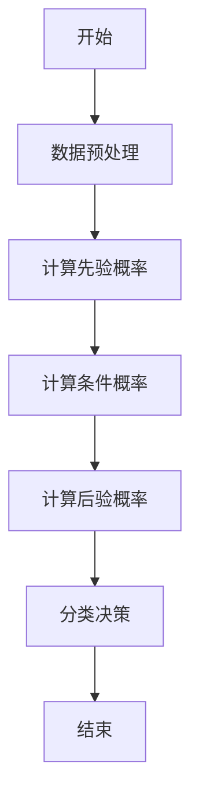

                 


### 第1章：自然语言处理简介

#### 1.1 背景与概述

自然语言处理（Natural Language Processing，NLP）是人工智能（Artificial Intelligence，AI）的一个重要分支，主要研究如何使计算机能够理解、生成和处理人类自然语言。随着互联网的快速发展，人类产生的文本数据量呈爆炸式增长，如何有效地从这些海量文本数据中提取有价值的信息成为了一个重要的课题。情感分析作为NLP的一个重要应用领域，旨在理解和识别文本中的情感倾向，对用户的情绪和需求进行深入挖掘。

情感分析不仅可以帮助企业更好地理解用户反馈，提升产品和服务质量，还可以为政府、媒体等机构提供舆情监测和分析支持。随着深度学习等先进技术的不断发展，情感分析的方法和模型也在不断更新和优化，使其在多个行业领域得到广泛应用。

#### 1.2 情感分析的核心概念

情感、情绪和需求是情感分析中的核心概念，它们之间有着紧密的联系和区别。

- **情感（Emotion）**：情感是人们对特定事件或对象的反应，通常伴随着主观体验和生理反应。情感可以是愉悦的，也可以是悲伤的、愤怒的或恐惧的。

- **情绪（Mood）**：情绪是一种较为持久、较为微弱的情感状态，它通常不会因特定事件而改变，而是持续地影响人的情绪和行为。

- **需求（Need）**：需求是指人们对特定产品或服务的内在需求或欲望，它是驱动人们进行购买决策和行为的重要因素。

在情感分析中，我们通常将情感和情绪作为主要研究对象，因为它们能够直接反映用户的情绪状态和态度。而需求则更多地体现在用户的行为数据和购买记录中。

#### 1.3 情感分类与标注方法

情感分类是情感分析中最基本的任务之一，它将文本中的情感倾向分为正面、负面或中性三个类别。目前，常见的情感分类方法包括基于规则的方法、机器学习方法和深度学习方法。

- **基于规则的方法**：这种方法通过手工编写规则来识别文本中的情感，例如使用关键词匹配、词性标注和语法分析等技术。这种方法简单直观，但规则库的建立和维护成本较高。

- **机器学习方法**：机器学习方法通过学习大量的标注数据来建立情感分类模型。常见的方法包括朴素贝叶斯分类器、支持向量机（SVM）、决策树和随机森林等。这些方法在处理复杂情感时具有一定的局限性。

- **深度学习方法**：深度学习方法通过神经网络模型来学习文本中的情感特征，如卷积神经网络（CNN）、循环神经网络（RNN）和长短时记忆网络（LSTM）等。这些方法具有强大的特征提取能力，能够处理复杂多变的情感。

在标注方法方面，常见的有手动标注、半监督标注和自动标注等。

- **手动标注**：手动标注是指由人类专家对文本进行标注，这种方法准确度高，但耗时耗力。

- **半监督标注**：半监督标注是指利用少量标注数据来训练模型，然后使用模型对大量未标注数据进行预测，并根据预测结果进行二次标注。

- **自动标注**：自动标注是指通过算法自动对文本进行标注，这种方法速度快，但准确性相对较低。

#### 1.4 情感分析的挑战与机遇

情感分析在技术层面面临着诸多挑战，如情感表达的多样性和复杂性、情感的跨领域迁移性、情感的上下文依赖性等。同时，数据获取、标注质量和算法优化等也影响着情感分析的效果。

然而，随着人工智能技术的不断发展，情感分析也面临着广阔的应用前景。例如，在社交媒体监测、企业客户服务、电子商务推荐等领域，情感分析技术已经展现出巨大的应用价值。

#### 1.5 本章小结

本章介绍了自然语言处理和情感分析的基本概念、核心任务以及面临的挑战和机遇。下一章我们将深入探讨情感分析的数学模型和算法原理，为读者提供一个全面的技术解析。

### 第2章：情感分析的数学模型与算法原理

#### 2.1 数学模型介绍

情感分析中的数学模型主要用于描述情感极性分类和情感强度分析的过程。这两种模型各有其独特的数学基础。

**1. 情感极性分类的数学模型**

情感极性分类的目标是判断文本中的情感倾向是正面、负面还是中性。一个常见的模型是基于逻辑回归（Logistic Regression）的二元分类模型。

逻辑回归模型的数学公式为：

$$
P(y=1|x) = \frac{1}{1 + e^{-(\beta_0 + \beta_1x_1 + \beta_2x_2 + ... + \beta_nx_n})}
$$

其中，\(P(y=1|x)\) 表示在特征向量 \(x\) 下，情感为正面的概率；\(\beta_0\)、\(\beta_1\)、\(\beta_2\)、...、\(\beta_n\) 是模型的参数。

**2. 情感强度分析的数学模型**

情感强度分析的目标是判断文本中的情感倾向的强度。一个常见的模型是基于支持向量机（Support Vector Machine，SVM）的多类分类模型。

支持向量机的核心思想是找到一个最佳的超平面，使得不同类别的数据点在超平面的两侧分布最为均匀。其数学公式为：

$$
\max_{\beta, \beta^T, \xi} \ \frac{1}{2} \sum_{i=1}^{n} \xi_i - C \sum_{i=1}^{n} \xi_i \\
s.t. \ y_i(\beta^T x_i + \beta_0) \geq 1 - \xi_i
$$

其中，\(\xi_i\) 是松弛变量，\(C\) 是惩罚参数。

#### 2.2 算法原理讲解

**1. 支持向量机（SVM）**

支持向量机是一种强大的分类算法，它在解决情感极性分类问题时表现出色。其基本思想是找到一个最优的超平面，将不同类别的数据点分隔开来。

**算法流程：**

- 数据预处理：将输入文本转换为向量表示，例如使用词袋模型（Bag of Words，BOW）或词嵌入（Word Embedding）技术。
- 求解最优超平面：通过求解上述优化问题，找到最优的权重向量 \(\beta\) 和偏置项 \(\beta_0\)。
- 分类决策：对于新的文本数据，计算其与超平面的距离，根据距离判断其类别。

**Python代码示例：**

```python
from sklearn.svm import SVC
from sklearn.model_selection import train_test_split

# 示例数据
X = [[0, 0], [1, 1], [1, 0], [0, 1]]
y = [0, 1, 1, 0]

# 划分训练集和测试集
X_train, X_test, y_train, y_test = train_test_split(X, y, test_size=0.2, random_state=42)

# 训练模型
clf = SVC(kernel='linear')
clf.fit(X_train, y_train)

# 预测结果
print(clf.predict(X_test))
```

**2. 朴素贝叶斯分类器**

朴素贝叶斯分类器是一种基于贝叶斯定理的简单分类算法，它在处理情感强度分析问题时具有一定的效果。

**算法流程：**

- 数据预处理：将输入文本转换为向量表示。
- 计算先验概率：根据训练数据计算各类别的先验概率。
- 计算条件概率：对于每个特征，计算其在各类别下的条件概率。
- 计算后验概率：利用贝叶斯定理计算各类别的后验概率。
- 分类决策：选择后验概率最大的类别作为预测结果。

**Python代码示例：**

```python
from sklearn.naive_bayes import GaussianNB
from sklearn.model_selection import train_test_split

# 示例数据
X = [[0, 0], [1, 1], [1, 0], [0, 1]]
y = [0, 1, 1, 0]

# 划分训练集和测试集
X_train, X_test, y_train, y_test = train_test_split(X, y, test_size=0.2, random_state=42)

# 训练模型
clf = GaussianNB()
clf.fit(X_train, y_train)

# 预测结果
print(clf.predict(X_test))
```

**3. 决策树与随机森林**

决策树是一种基于树形结构进行分类的算法，它通过一系列判断来划分数据，并最终得到分类结果。随机森林（Random Forest）是基于决策树构建的集成学习方法，通过训练多个决策树并投票得出最终结果。

**算法流程：**

- 数据预处理：将输入文本转换为向量表示。
- 构建决策树：根据特征和标签构建决策树。
- 预测分类：对于新的文本数据，从根节点开始进行判断，直到达到叶子节点，叶子节点的标签即为预测结果。

**Python代码示例：**

```python
from sklearn.tree import DecisionTreeClassifier
from sklearn.ensemble import RandomForestClassifier
from sklearn.model_selection import train_test_split

# 示例数据
X = [[0, 0], [1, 1], [1, 0], [0, 1]]
y = [0, 1, 1, 0]

# 划分训练集和测试集
X_train, X_test, y_train, y_test = train_test_split(X, y, test_size=0.2, random_state=42)

# 训练模型
clf = DecisionTreeClassifier()
clf.fit(X_train, y_train)

# 预测结果
print(clf.predict(X_test))

# 训练随机森林模型
clf = RandomForestClassifier(n_estimators=100)
clf.fit(X_train, y_train)

# 预测结果
print(clf.predict(X_test))
```

#### 2.3 Mermaid流程图演示

下面是一个关于朴素贝叶斯分类器的Mermaid流程图示例：



#### 2.4 算法应用举例

**1. 数据收集与预处理**

假设我们已经收集到一组用户评论数据，包括正面、负面和中性的评论。首先，我们需要对数据进行预处理，将文本转换为数字化的向量表示。

```python
from sklearn.feature_extraction.text import CountVectorizer

# 示例数据
comments = [
    "这个产品非常好用。",
    "这个服务太差劲了。",
    "我没有特别的感受。",
    "产品很不错，但服务有待提高。"
]

# 数据预处理
vectorizer = CountVectorizer()
X = vectorizer.fit_transform(comments)
print(X.toarray())
```

**2. 模型训练与评估**

接下来，我们可以使用不同的算法对预处理后的数据进行训练，并评估模型的性能。

```python
from sklearn.model_selection import train_test_split
from sklearn.metrics import accuracy_score

# 划分训练集和测试集
X_train, X_test, y_train, y_test = train_test_split(X, y, test_size=0.2, random_state=42)

# 训练模型
clf = GaussianNB()
clf.fit(X_train, y_train)

# 预测测试集
y_pred = clf.predict(X_test)

# 评估模型性能
print("Accuracy:", accuracy_score(y_test, y_pred))
```

**3. 实际案例剖析**

假设我们要对某电商平台的用户评论进行情感分析，以帮助商家了解用户对其产品的看法。通过收集用户的评论数据，我们可以使用上述算法对评论进行分类，并根据分类结果提供改进建议。

```python
# 加载实际数据
X, y = load_data()

# 数据预处理
vectorizer = CountVectorizer()
X_processed = vectorizer.fit_transform(X)

# 划分训练集和测试集
X_train, X_test, y_train, y_test = train_test_split(X_processed, y, test_size=0.2, random_state=42)

# 训练模型
clf = GaussianNB()
clf.fit(X_train, y_train)

# 预测测试集
y_pred = clf.predict(X_test)

# 分析结果
positive_comments = X_test[y_pred == 1]
negative_comments = X_test[y_pred == -1]
neutral_comments = X_test[y_pred == 0]

# 提供建议
if len(positive_comments) > len(negative_comments):
    print("用户对产品总体评价较好，可适当提高价格以增加利润。")
else:
    print("用户对产品评价较差，需要针对负面评论进行改进。")
```

#### 2.5 本章小结

本章介绍了情感分析的数学模型和算法原理，包括情感极性分类和情感强度分析的核心模型。通过Python代码示例，我们详细讲解了支持向量机、朴素贝叶斯分类器和决策树等算法的实现过程。下一章我们将探讨情感分析在不同应用场景中的实际应用，以帮助读者更好地理解情感分析的价值和挑战。

