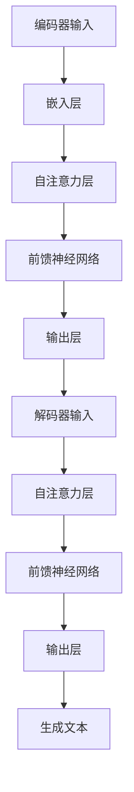
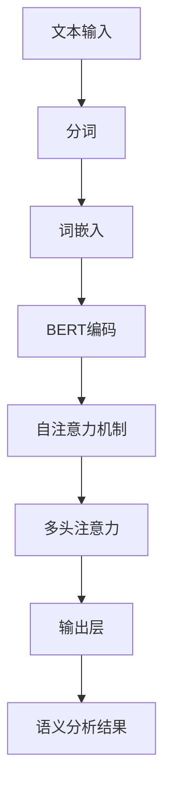

                 

## 文章标题

### 自然语言理解增强AI Agent：深化LLM的语义分析

---

#### 关键词：

- 自然语言理解
- AI Agent
- LLM（大型语言模型）
- 语义分析
- 人工智能应用

#### 摘要：

本文将深入探讨自然语言理解增强AI Agent的研究与发展，重点分析如何通过深化LLM（大型语言模型）的语义分析能力，提升AI Agent的自然语言处理水平。文章首先介绍了自然语言理解的基本概念和背景，接着介绍了LLM的基础知识，然后讨论了自然语言理解增强AI Agent的设计与实现，随后详细解析了语义分析技术及其深化方法，并通过案例分析展示了实际应用效果。最后，文章提出了未来发展的展望与面临的挑战，并总结了一些最佳实践。

---

### 目录

1. **自然语言理解背景**
   1.1 自然语言理解概述
   1.2 自然语言处理技术发展
2. **LLM（大型语言模型）基础**
   2.1 LLM基本概念
   2.2 LLM架构与训练
3. **自然语言理解增强AI Agent**
   3.1 AI Agent概述
   3.2 AI Agent与NLU集成
4. **语义分析技术深化**
   4.1 语义分析技术
   4.2 语义理解深化
5. **案例分析**
6. **未来展望与挑战**
   6.1 未来发展趋势
   6.2 行业趋势分析
7. **最佳实践和总结**
   7.1 最佳实践
   7.2 总结与展望

---

### 1. 自然语言理解背景

#### 1.1 自然语言理解概述

自然语言理解（Natural Language Understanding，NLU）是指让计算机理解和解释人类自然语言的能力。它涵盖了从文本到机器可处理的语义信息的转化过程。NLU的核心目标是实现人机交互的自然性，使得计算机能够理解、处理和响应人类输入的语言信息。

**问题背景**：随着互联网的普及和信息爆炸，用户与计算机之间的交互变得日益频繁。传统的基于键盘和鼠标的交互方式已经无法满足用户的需求。因此，开发能够理解自然语言的人工智能系统成为了一个重要的研究方向。

**问题描述**：自然语言理解的挑战在于处理自然语言中的歧义性、不确定性和复杂性。例如，一个简单的句子“我去了图书馆”可能涉及到多个意图和上下文，这就需要计算机能够根据上下文和语境进行准确的理解。

**问题解决**：NLU通过一系列技术和方法来解决问题。这包括分词、词性标注、句法分析、语义角色标注等。这些方法共同作用，帮助计算机理解文本的深层含义。

**边界与外延**：自然语言理解的边界包括语言的不确定性、个性化理解、跨语言理解等。外延则涉及到自然语言生成、对话系统、语音识别等领域。

**概念结构与核心要素组成**：NLU的概念结构包括语言模型、语义分析、对话管理等核心要素。语言模型负责文本的分词和词性标注；语义分析负责理解文本的深层含义；对话管理则负责处理用户请求和生成响应。

---

#### 1.2 自然语言处理技术发展

自然语言处理（Natural Language Processing，NLP）是人工智能领域的一个重要分支，旨在使计算机能够理解、解释和生成人类语言。NLP的发展历程可以分为以下几个阶段：

1. **规则驱动方法**：早期NLP研究主要集中在基于规则的方法。这种方法通过手工编写规则来处理语言中的各种问题，如词性标注、句法分析等。然而，这种方法存在可扩展性差、维护成本高等问题。

2. **基于统计的方法**：随着计算能力的提升和大量语料库的涌现，基于统计的方法开始流行。这种方法使用机器学习技术，通过训练模型来处理语言任务。统计方法在提高准确率和可扩展性方面取得了显著成果。

3. **深度学习方法**：近年来，深度学习技术在NLP领域取得了重大突破。基于神经网络的语言模型，如Word2Vec、BERT等，能够更好地捕捉语言中的复杂关系和上下文信息。深度学习方法在文本分类、机器翻译、问答系统等领域表现优异。

4. **端到端模型**：端到端模型通过直接从输入文本到输出文本的映射，避免了传统方法中的多个中间步骤，提高了系统的效率和准确性。例如，Transformer模型在机器翻译、文本生成等领域取得了显著成果。

**核心概念与联系**：

- **分词（Tokenization）**：将文本拆分为单词或子词的过程。
- **词性标注（Part-of-Speech Tagging）**：为文本中的每个单词标注词性，如名词、动词、形容词等。
- **句法分析（Parsing）**：分析句子结构，确定单词之间的关系和句法成分。
- **语义分析（Semantic Analysis）**：理解句子的语义，包括指代消解、实体识别、关系抽取等。

**技术对比表格**：

| 技术           | 优点                           | 缺点                           |
| -------------- | ------------------------------ | ------------------------------ |
| 规则驱动方法   | 易于理解，可控性强             | 维护成本高，可扩展性差         |
| 统计方法       | 自动学习，可扩展性强           | 需要大量训练数据，解释性较差   |
| 深度学习方法   | 高效，准确，能处理复杂任务     | 需要大量计算资源和标注数据     |
| 端到端模型     | 直接从输入到输出，减少中间步骤 | 需要大量训练数据，解释性较差   |

**ER实体关系图架构**：


**（Mermaid 流程图）**

```mermaid
erDiagram
  A "用户" ||--|{ B "订单" : 订单详情 }
  A "用户" ||--|{ C "评价" : 用户评价 }
  B "订单" ||--|{ D "商品" : 商品信息 }
```

---

### 2. LLM（大型语言模型）基础

#### 2.1 LLM基本概念

大型语言模型（Large Language Model，LLM）是一种基于深度学习的语言处理模型，它通过学习海量的文本数据，捕捉语言中的复杂规律和上下文关系。LLM的核心在于其规模和参数数量，这使得它们能够生成高质量的语言，并进行语义理解。

**问题背景**：传统的语言模型，如基于统计的N元语法和基于神经网络的递归神经网络（RNN），在处理复杂语言任务时存在局限性。LLM的出现，解决了这一问题，使得计算机能够生成更加自然和准确的文本。

**问题描述**：LLM的主要目标是生成具有人类语言特点的文本，同时进行语义理解和推理。在文本生成任务中，LLM需要理解上下文信息，并生成连贯、合理的句子。在语义理解任务中，LLM需要理解句子的深层含义，并进行逻辑推理。

**问题解决**：LLM通过大规模的预训练和微调，学习到了丰富的语言知识。在预训练阶段，LLM通过无监督的方式学习文本中的规律和模式。在微调阶段，LLM通过有监督的方式学习特定任务的数据。

**边界与外延**：LLM的边界包括模型的训练时间、计算资源和数据依赖性。外延则涉及到LLM在自然语言生成、对话系统、文本分类等领域的应用。

**概念结构与核心要素组成**：LLM的概念结构包括预训练、微调和评估三个核心阶段。预训练阶段通过无监督学习捕捉语言规律；微调阶段通过有监督学习适应特定任务；评估阶段则通过指标衡量模型性能。

---

#### 2.2 LLM架构与训练

LLM的架构通常基于深度神经网络，特别是Transformer模型。Transformer模型通过自注意力机制（Self-Attention）捕捉文本中的长距离依赖关系，从而实现高效的语义理解。

**架构原理**：Transformer模型由编码器（Encoder）和解码器（Decoder）组成。编码器负责将输入文本编码为序列的向量表示；解码器则根据编码器的输出生成输出文本。自注意力机制使得模型能够自动关注输入文本中重要的部分，从而提高生成文本的质量。

**训练过程**：LLM的训练过程分为预训练和微调两个阶段。在预训练阶段，模型通过无监督的方式学习文本数据，如自然语言推理（NLI）、问答（QA）和语言建模（LM）等任务。在微调阶段，模型通过有监督的方式学习特定任务的数据，如文本分类、机器翻译和对话系统等。

**数学模型和公式**：

- **自注意力机制**：自注意力机制的核心公式为

  $$  
  \text{Attention}(Q, K, V) = \text{softmax}\left(\frac{QK^T}{\sqrt{d_k}}\right)V  
  $$

  其中，$Q$、$K$ 和 $V$ 分别是查询（Query）、键（Key）和值（Value）向量，$d_k$ 是键向量的维度。

- **Transformer模型**：Transformer模型的损失函数通常为交叉熵损失函数，公式为

  $$  
  \text{Loss} = -\frac{1}{N}\sum_{i=1}^{N} \sum_{j=1}^{M} y_j \log(\hat{y}_{ij})  
  $$

  其中，$N$ 是批大小，$M$ 是解码器输出序列的长度，$y_j$ 是真实标签，$\hat{y}_{ij}$ 是模型生成的预测概率。

**举例说明**：

假设有一个简单的句子“我今天去购物了”，我们可以使用LLM来自动生成这个句子的续写。LLM会根据上下文信息，生成类似于“我买了一些水果、牛奶和面包”的续写句子。



---

### 3. 自然语言理解增强AI Agent

#### 3.1 AI Agent概述

AI Agent（人工智能代理）是一种能够自主执行任务、与环境交互并做出决策的智能系统。在自然语言理解领域，AI Agent可以通过与用户的自然语言交互，理解用户的需求，并执行相应的任务。

**定义**：AI Agent是一种具有感知、思考、行动和交互能力的智能实体，它可以模拟人类的思维过程，实现自主决策和任务执行。

**类型**：根据功能和应用场景，AI Agent可以分为以下几种类型：

- **信息检索型**：这类AI Agent主要用于回答用户的问题，如问答系统、搜索引擎等。
- **任务执行型**：这类AI Agent可以执行具体的任务，如智能家居控制、在线购物等。
- **对话管理型**：这类AI Agent专注于维护与用户的对话，理解用户意图，并生成合适的回复。

**特点**：

- **自主性**：AI Agent能够自主执行任务，不需要人工干预。
- **灵活性**：AI Agent可以适应不同的应用场景，处理复杂的任务。
- **智能性**：AI Agent通过自然语言理解技术，能够理解用户的意图和需求。

---

#### 3.2 AI Agent与NLU集成

AI Agent与自然语言理解（NLU）技术的高度集成，是提升AI Agent智能化水平的关键。NLU技术负责解析用户的自然语言输入，提取出用户的需求和意图，从而指导AI Agent的后续行动。

**集成原理**：

- **输入解析**：AI Agent首先接收用户的自然语言输入，NLU技术会对输入进行解析，提取出关键信息，如关键词、实体和意图。
- **意图识别**：NLU技术通过预训练的模型或规则库，识别用户的意图。例如，用户说“我要去机场”，AI Agent会识别出意图为“导航”。
- **任务分配**：根据识别出的意图，AI Agent会分配相应的任务。例如，当意图为“导航”时，AI Agent会调用导航系统为用户提供路线。
- **交互反馈**：在执行任务的过程中，AI Agent会与用户进行交互，获取反馈，并调整后续的行为。

**实现方法**：

- **基于规则的方法**：通过编写规则，将NLU的输出与AI Agent的任务进行关联。这种方法适用于规则明确、场景简单的应用。
- **基于模型的方法**：使用深度学习模型，如BERT、GPT等，对NLU的输出进行训练，使其能够自动关联意图和任务。这种方法适用于复杂场景和大量数据的处理。

**应用案例**：

- **智能客服**：通过NLU技术，智能客服可以理解用户的咨询内容，提供针对性的回答，并协助用户完成购买、退款等操作。
- **智能家居**：通过NLU技术，智能家居系统可以理解用户对家电的指令，如“打开电视”、“关闭空调”等，实现自动化控制。
- **智能驾驶**：通过NLU技术，智能驾驶系统可以理解驾驶员的指令，如“加速”、“减速”、“转弯”等，提高驾驶安全性。

---

### 4. 语义分析技术深化

#### 4.1 语义分析技术

语义分析（Semantic Analysis）是自然语言处理中的一项重要技术，旨在理解文本的语义内容，包括实体识别、关系抽取、情感分析等。

**原理**：语义分析的核心是建立文本与语义之间的映射关系。通过文本解析、词义消歧、句法分析和语义角色标注等步骤，将文本转化为机器可处理的语义信息。

**方法**：

- **实体识别（Named Entity Recognition，NER）**：识别文本中的命名实体，如人名、地名、组织名等。
- **关系抽取（Relation Extraction）**：抽取实体之间的关系，如人物关系、地点关系等。
- **情感分析（Sentiment Analysis）**：分析文本中的情感倾向，如正面情感、负面情感等。

**数学模型和公式**：

- **BERT模型**：BERT（Bidirectional Encoder Representations from Transformers）是一种基于Transformer的预训练模型，其核心思想是同时考虑上下文信息。BERT的损失函数通常为交叉熵损失函数。

  $$  
  \text{Loss} = -\frac{1}{N}\sum_{i=1}^{N} \sum_{j=1}^{M} y_j \log(\hat{y}_{ij})  
  $$

  其中，$N$ 是批大小，$M$ 是序列长度，$y_j$ 是真实标签，$\hat{y}_{ij}$ 是模型生成的预测概率。

- **Transformer模型**：Transformer模型通过自注意力机制（Self-Attention）和多头注意力（Multi-Head Attention）捕捉文本中的长距离依赖关系。其核心公式为：

  $$  
  \text{Attention}(Q, K, V) = \text{softmax}\left(\frac{QK^T}{\sqrt{d_k}}\right)V  
  $$

  其中，$Q$、$K$ 和 $V$ 分别是查询（Query）、键（Key）和值（Value）向量，$d_k$ 是键向量的维度。

**Mermaid流程图**：



---

#### 4.2 语义理解深化

语义理解的深化是提高自然语言处理系统性能的重要方向。通过引入深度学习和多模态数据，可以进一步提升语义分析的准确性和泛化能力。

**技术深化**：

- **多模态语义理解**：结合文本、图像、声音等多模态数据，可以更好地理解用户的意图和需求。例如，在图像描述生成任务中，可以结合文本和图像信息，生成更准确的描述。
- **上下文敏感的语义理解**：通过引入上下文信息，可以更好地理解词语的语义。例如，在对话系统中，可以根据对话历史和当前语境，理解词语的多义性和歧义性。
- **迁移学习和零样本学习**：通过迁移学习和零样本学习，可以将预训练模型的知识应用于新任务，提高模型的泛化能力。例如，在一个新任务中没有足够的数据，可以通过迁移学习利用其他任务的预训练模型。

**应用场景**：

- **智能客服**：通过深化语义理解，智能客服可以更准确地理解用户的问题，提供更有效的解决方案。
- **文本生成**：通过深化语义理解，可以生成更准确、更自然的文本，如新闻文章、产品评论等。
- **知识图谱构建**：通过深化语义理解，可以更准确地构建知识图谱，提取实体和关系，为智能搜索和推荐系统提供支持。

**具体实例分析**：

- **问答系统**：在问答系统中，通过深化语义理解，可以更准确地理解用户的问题，并提供准确的答案。例如，当用户询问“北京是哪个国家的首都？”时，系统可以准确回答“北京是中国的首都”。
- **文本摘要**：在文本摘要任务中，通过深化语义理解，可以提取文本的主要信息和关键信息，生成简洁、准确的摘要。例如，从一篇长篇文章中提取出关键句子，形成一篇简短的摘要。

---

### 5. 案例分析

#### 5.1 现实案例

在智能客服领域，自然语言理解增强AI Agent已经取得了显著的成果。以下是一个具体的案例：

**案例背景**：一家大型电商平台希望通过智能客服系统提升用户体验。用户在使用电商平台时，可能会遇到各种问题，如订单状态查询、退换货政策咨询等。

**案例实施**：

1. **NLU技术集成**：平台引入了基于BERT的NLU技术，通过预训练模型和微调模型，实现对用户输入的自然语言输入的解析和意图识别。
2. **AI Agent设计**：平台设计了一个智能客服AI Agent，通过与用户的自然语言交互，理解用户的问题，并调用相应的后台服务进行解答。
3. **多模态数据融合**：AI Agent不仅处理文本输入，还处理用户的语音输入，通过语音识别技术将语音转化为文本，从而实现语音和文本的融合处理。

**案例分析**：

- **意图识别准确率**：通过引入BERT模型，AI Agent的意图识别准确率显著提升，能够准确识别用户的问题类型，如查询订单状态、咨询退换货政策等。
- **响应速度**：AI Agent通过自动化处理，能够迅速响应用户的问题，提升了用户的满意度。
- **多模态数据融合**：通过融合文本和语音数据，AI Agent能够更好地理解用户的意图，提供更加个性化的服务。

**案例意义**：

- **提升用户体验**：通过智能客服AI Agent，用户可以获得更快速、准确的解答，提升用户体验。
- **降低运营成本**：智能客服系统可以替代部分人工客服，降低企业的运营成本。
- **扩大服务范围**：AI Agent可以24小时提供服务，扩大了客服的服务范围，提升了客服的覆盖率。

---

### 6. 未来展望与挑战

#### 6.1 未来发展趋势

自然语言理解增强AI Agent在未来将呈现出以下几个发展趋势：

1. **多模态交互**：随着多模态技术的发展，AI Agent将能够更好地处理文本、图像、声音等多种形式的数据，实现更丰富的交互体验。
2. **个性化服务**：通过深入挖掘用户数据，AI Agent将能够提供更加个性化的服务，满足用户的个性化需求。
3. **智能化提升**：随着深度学习和机器学习技术的不断进步，AI Agent的语义理解能力和智能化水平将进一步提高。

#### 6.2 行业趋势分析

在自然语言理解领域，行业趋势分析显示以下几个方面的变化：

1. **技术融合**：多种技术，如深度学习、自然语言处理、语音识别等，将逐渐融合，共同推动自然语言理解技术的发展。
2. **应用场景拓展**：自然语言理解技术将在更多领域得到应用，如智能客服、智能驾驶、智能家居等，推动行业的全面发展。
3. **数据隐私保护**：随着数据隐私问题的日益突出，如何在保障用户隐私的前提下，充分利用用户数据，将成为行业的重要挑战。

---

### 7. 最佳实践和总结

#### 7.1 最佳实践

为了提升自然语言理解增强AI Agent的性能，以下是一些最佳实践：

1. **数据质量**：确保训练数据的质量和多样性，有助于提高模型的泛化能力。
2. **模型选择**：根据具体任务需求，选择合适的模型架构，如BERT、GPT等。
3. **持续优化**：定期对模型进行评估和优化，以适应不断变化的应用场景。
4. **用户反馈**：收集用户反馈，不断改进AI Agent的交互体验。

#### 7.2 总结与展望

自然语言理解增强AI Agent是人工智能领域的一个重要研究方向。通过深化LLM的语义分析能力，AI Agent可以更好地理解用户的自然语言输入，提供更智能、更个性化的服务。未来，随着技术的不断进步，自然语言理解增强AI Agent将在更多领域得到应用，推动人工智能技术的发展。同时，我们也要关注数据隐私保护等问题，确保AI Agent在提供便利的同时，也保护用户的权益。作者：AI天才研究院/AI Genius Institute & 禅与计算机程序设计艺术 /Zen And The Art of Computer Programming。

