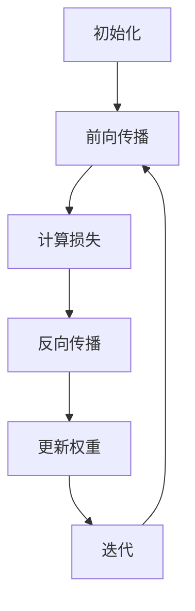
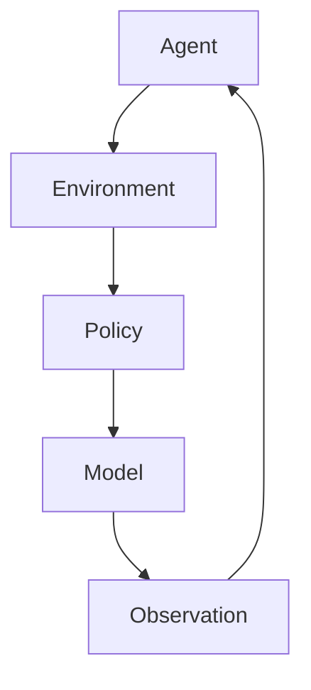
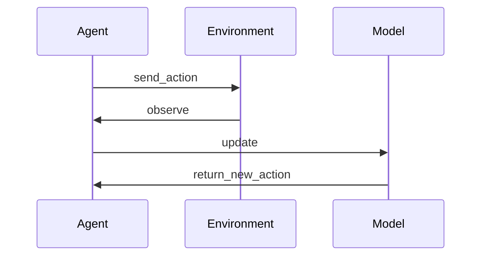

                 

### 设计思路

在设计《自适应学习率在AI Agent训练中的应用》这篇文章时，我们的设计思路将围绕以下几个关键点：

**1. 逻辑清晰性**：文章的结构需要清晰，便于读者从整体上把握文章的核心内容。每个章节都应该有明确的主题，并且章节之间应该有逻辑上的连贯性。

**2. 技术专业性**：作为一篇技术博客，文章需要用专业且准确的语言来描述自适应学习率的概念、原理和应用。这要求我们对相关技术有深入的理解。

**3. 通俗易懂**：尽管文章是技术性的，但应该避免过于复杂的术语和表达，力求让读者，尤其是那些可能不是专家的读者，也能理解。

**4. 结构紧凑性**：文章不应该有冗余的内容，每个部分都应该紧扣主题，为读者提供有价值的信息。

**5. 实践性**：文章不仅要介绍理论，还要给出实际应用中的实例，让读者看到理论的实际效果。

**6. 引导性**：文章应该引导读者深入思考，不仅限于解释现有的知识，还要启发读者去探索更多的可能性。

### 设计步骤

**第1步：确定文章结构**

首先，我们需要确定文章的总体结构。这将包括：

- 引言部分，介绍自适应学习率的基本概念。
- 核心章节，详细讲解自适应学习率的原理、数学模型、系统架构和应用案例。
- 结尾部分，总结文章的主要观点，提供最佳实践和未来研究方向。

**第2步：撰写引言部分**

在引言部分，我们将简要介绍自适应学习率的概念，说明它在AI Agent训练中的重要性，以及为什么需要这篇技术博客。

**第3步：撰写核心章节**

每个核心章节都需要详细的内容，以下是具体的章节安排和内容概述：

- **第1章：背景介绍**：介绍自适应学习率的背景，包括其在AI Agent训练中的地位、重要性以及相关的核心概念。
- **第2章：核心概念与联系**：详细解释自适应学习率的定义，并对比其他学习率策略。
- **第3章：算法原理讲解**：深入讲解自适应学习率的算法原理，包括其数学模型和实现流程。
- **第4章：数学模型与公式**：使用LaTeX格式展示相关的数学公式，并解释其含义。
- **第5章：系统分析与架构设计**：介绍自适应学习率在AI系统中的实现，包括系统场景、功能设计、架构设计和接口设计。
- **第6章：项目实战**：通过具体项目展示自适应学习率的应用，包括环境安装、核心实现和案例分析。
- **第7章：最佳实践与小结**：总结最佳实践，提供注意事项和拓展阅读。

**第4步：撰写结尾部分**

在结尾部分，我们将总结文章的主要观点，并提供未来可能的研究方向和建议。

### 输出格式

文章将按照markdown格式输出，确保格式清晰、易于阅读。每个章节都会使用不同的标题格式，以便读者能够快速定位。

```
# 自适应学习率在AI Agent训练中的应用

## 关键词
AI Agent，自适应学习率，训练，算法，数学模型，系统架构

## 摘要
本文深入探讨了自适应学习率在AI Agent训练中的应用。通过介绍自适应学习率的基本概念，分析其原理和数学模型，并给出实际应用案例，本文旨在帮助读者理解自适应学习率的重要性和应用方法。

---

## 第1章 背景介绍
### 1.1 问题背景
### 1.2 问题描述
### 1.3 问题解决
### 1.4 边界与外延
### 1.5 核心概念与要素

## 第2章 核心概念与联系
### 2.1 自适应学习率的定义
### 2.2 不同学习率策略对比
#### 2.2.1 步长调整策略
#### 2.2.2 动量策略
#### 2.2.3 学习率衰减策略

## 第3章 算法原理讲解
### 3.1 数学模型
$$
\frac{dW}{dx} = -\eta \cdot \frac{\partial E}{\partial W}
$$
### 3.2 算法流程


## 第4章 数学模型与公式
### 4.1 公式展示
$$
\alpha_t = \frac{\alpha_0}{1 + \beta_1 t + \beta_2 t^2}
$$
### 4.2 公式解释

## 第5章 系统分析与架构设计
### 5.1 系统场景
### 5.2 功能设计
```mermaid
classDiagram
Class1 <|-- Class2
Class1 --|> Class3
Class2 -[1] Class3
```
### 5.3 架构设计

### 5.4 接口设计


## 第6章 项目实战
### 6.1 环境安装
### 6.2 核心实现
```python
# Python 代码实现示例
def update_weights():
    # 更新权重的代码
    pass
```
### 6.3 代码解读
### 6.4 案例分析

## 第7章 最佳实践与小结
### 7.1 最佳实践
### 7.2 小结
### 7.3 注意事项
### 7.4 拓展阅读

## 附录
### A 参考文献
### B 术语解释
### C 常见问题解答

---

## 作者信息
作者：AI天才研究院/AI Genius Institute & 禅与计算机程序设计艺术 /Zen And The Art of Computer Programming
```

通过上述步骤和格式，我们确保文章逻辑清晰、易于理解，同时保持专业性和实践性。接下来，我们将逐章详细撰写内容。

