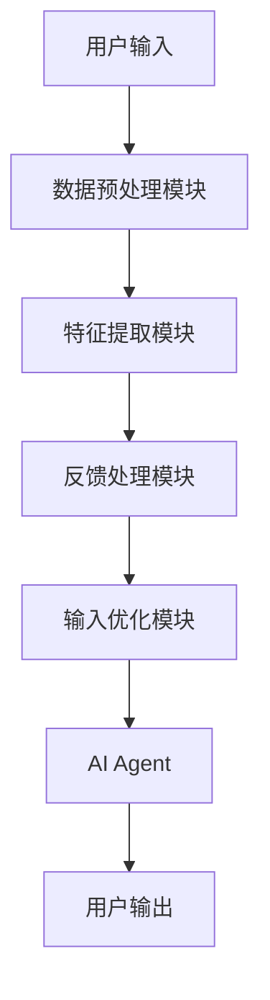
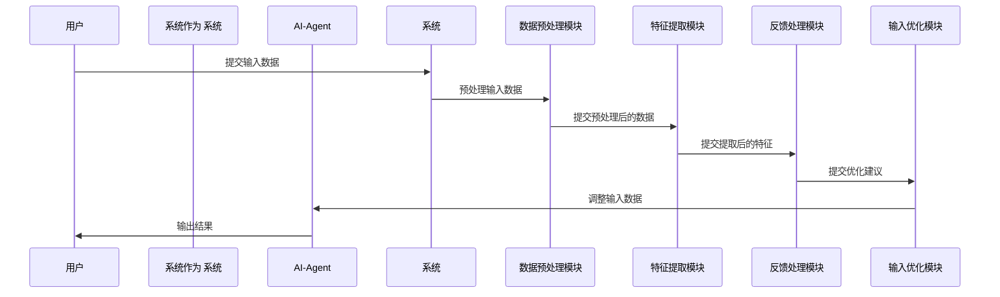

                 

### 自适应提示工程：动态优化AI Agent输入

#### 关键词：
- **自适应提示**、**AI Agent**、**动态优化**、**输入特征提取**、**人工智能**、**机器学习**

#### 摘要：
本文深入探讨了自适应提示工程在动态优化AI Agent输入中的应用。通过分析问题背景、核心概念、算法原理和实际案例，文章旨在为读者提供一个全面而清晰的理解，帮助他们在实际项目中实现AI Agent输入的动态优化。

---

### 第一部分：背景介绍

#### 第1章 问题背景、问题描述、问题解决

#### 1.1 问题背景

随着人工智能技术的不断发展，AI Agent在各个领域的应用越来越广泛。然而，在实际应用中，AI Agent的输入往往存在多样性和不确定性，这给AI Agent的输入优化带来了巨大的挑战。为了提高AI Agent的输入质量，提高其解决问题的效率，自适应提示工程应运而生。

#### 1.2 问题描述

自适应提示工程旨在通过动态优化AI Agent的输入，提高AI Agent的决策能力和问题解决能力。具体来说，自适应提示工程需要解决以下几个问题：

- 如何根据AI Agent的任务需求，动态调整输入的属性和特征？
- 如何在输入多样性和不确定性下，保持AI Agent的高效性和鲁棒性？
- 如何在大量输入数据中，快速筛选出高质量的输入，提高AI Agent的学习和决策效率？

#### 1.3 问题解决

自适应提示工程通过以下几个关键步骤来解决上述问题：

- **需求分析**：分析AI Agent的任务需求，明确输入优化目标。
- **输入特征提取**：根据任务需求，从输入数据中提取关键特征。
- **动态调整输入**：根据输入特征和任务需求，动态调整AI Agent的输入。
- **反馈优化**：根据AI Agent的决策结果，对输入进行调整和优化。

#### 1.4 边界与外延

自适应提示工程的应用范围广泛，不仅限于AI Agent的输入优化，还可以应用于其他需要输入优化的场景，如自然语言处理、图像识别、智能推荐等。同时，自适应提示工程的研究也涉及多个学科领域，包括计算机科学、数学、统计学等。

#### 1.5 概念结构与核心要素组成

自适应提示工程的核心概念包括：

- **AI Agent**：执行特定任务的智能体。
- **输入**：AI Agent执行任务所需的初始数据。
- **优化**：通过调整输入，提高AI Agent的决策能力和问题解决能力。
- **动态调整**：根据任务需求和输入特征，实时调整输入。

核心要素包括：

- **需求分析**：明确输入优化目标。
- **输入特征提取**：提取关键特征。
- **动态调整算法**：实现输入的动态调整。
- **反馈机制**：根据决策结果进行输入优化。

---

### 第二部分：核心概念与联系

#### 第2章 核心概念原理

#### 2.1 自适应提示

自适应提示是一种根据任务需求动态调整AI Agent输入的方法。其核心原理是利用反馈机制，不断调整输入，以达到优化AI Agent决策能力和问题解决能力的目的。

自适应提示的关键步骤包括：

1. **输入分析**：分析当前输入，识别可能的问题和不足。
2. **反馈收集**：收集AI Agent对输入的反馈，包括错误、成功率等指标。
3. **输入调整**：根据反馈调整输入，提高其质量和适用性。
4. **重复过程**：循环执行上述步骤，逐步优化输入。

#### 2.2 动态优化

动态优化是指根据任务需求和输入特征，实时调整AI Agent的输入。其目的是在输入多样性和不确定性下，保持AI Agent的高效性和鲁棒性。

动态优化的主要方法包括：

1. **自适应调整策略**：根据任务动态调整输入的权重和参数。
2. **实时反馈机制**：利用实时反馈调整输入，提高AI Agent的决策能力。
3. **多目标优化**：在多个优化目标之间找到平衡，提高AI Agent的整体性能。

#### 2.3 输入特征提取

输入特征提取是指从输入数据中提取关键特征，以支持动态调整输入。其目的是提高AI Agent的学习和决策效率。

输入特征提取的主要方法包括：

1. **特征选择**：从大量特征中筛选出对任务影响最大的特征。
2. **特征变换**：将原始特征转换为更适合AI Agent处理的形式。
3. **特征组合**：将多个特征组合起来，形成新的特征表示。

---

### 第三部分：算法原理讲解

#### 第3章 算法原理与实现

#### 3.1 算法概述

自适应提示工程的核心算法包括输入分析、反馈收集、输入调整和重复执行。以下是一个简化的算法流程图：


#### 3.2 输入分析

输入分析是自适应提示工程的第一个关键步骤。它旨在识别输入数据中的问题和不足，为后续的输入调整提供依据。

输入分析的主要方法包括：

1. **错误分析**：识别输入数据中的错误和异常，如数据缺失、数据不一致等。
2. **相关性分析**：分析输入特征之间的相关性，识别可能影响模型性能的关键特征。
3. **质量评估**：评估输入数据的质量，如数据准确性、数据完整性等。

#### 3.3 反馈收集

反馈收集是自适应提示工程中至关重要的一环。通过收集AI Agent对输入的反馈，可以了解输入数据的质量和对AI Agent决策的影响。

反馈收集的主要方法包括：

1. **指标评估**：收集与AI Agent性能相关的指标，如准确率、召回率等。
2. **用户反馈**：收集用户对AI Agent决策的满意度，如点击率、转化率等。
3. **模型评估**：评估AI Agent的模型性能，如损失函数、精度等。

#### 3.4 输入调整

输入调整是根据反馈收集的结果，对输入数据进行优化和调整。其目的是提高输入数据的质量，从而提升AI Agent的决策能力和问题解决能力。

输入调整的主要方法包括：

1. **特征调整**：调整输入特征的选择和权重，优化特征组合。
2. **数据预处理**：对输入数据进行清洗、归一化等预处理，提高数据质量。
3. **模型调整**：调整AI Agent的模型参数，优化模型性能。

#### 3.5 重复执行

重复执行是自适应提示工程的核心机制。通过不断地输入分析、反馈收集和输入调整，逐步优化输入数据，提高AI Agent的性能。

重复执行的主要方法包括：

1. **迭代优化**：逐步调整输入，优化AI Agent的决策能力和问题解决能力。
2. **动态调整**：根据AI Agent的任务需求和输入特征，动态调整输入的优化策略。
3. **平衡优化**：在多个优化目标之间找到平衡，提高AI Agent的整体性能。

---

### 第四部分：系统分析与架构设计方案

#### 第4章 系统分析与架构设计方案

#### 4.1 问题场景介绍

随着人工智能技术在企业中的应用越来越广泛，如何优化AI Agent的输入成为了一个重要的问题。在本项目中，我们旨在设计一个自适应提示系统，通过对输入数据的动态优化，提高AI Agent的决策能力和问题解决能力。

#### 4.2 项目介绍

本项目旨在实现一个自适应提示系统，用于动态优化AI Agent的输入。系统的主要功能包括：

1. **输入数据分析**：分析输入数据的质量和特征，为输入优化提供依据。
2. **反馈收集与处理**：收集AI Agent的决策反馈，并根据反馈调整输入数据。
3. **输入调整与优化**：根据分析结果和反馈，动态调整输入数据，提高AI Agent的性能。

#### 4.3 系统功能设计

系统功能设计主要包括以下几个方面：

1. **数据预处理模块**：负责对输入数据进行清洗、归一化等预处理，提高数据质量。
2. **特征提取模块**：负责从输入数据中提取关键特征，为输入优化提供支持。
3. **反馈处理模块**：负责收集AI Agent的决策反馈，并生成优化建议。
4. **输入优化模块**：负责根据反馈建议调整输入数据，优化AI Agent的输入。

#### 4.4 系统架构设计

系统架构设计如图所示：



在这个架构中，用户输入首先经过数据预处理模块，然后进入特征提取模块。特征提取模块将提取的关键特征传递给反馈处理模块，反馈处理模块根据AI Agent的决策反馈生成优化建议。优化建议最终传递给输入优化模块，输入优化模块根据这些建议动态调整输入数据，从而提高AI Agent的性能。调整后的输入数据再传递给AI Agent，产生用户输出。

#### 4.5 系统接口设计和系统交互

系统接口设计和系统交互如图所示：



在这个交互流程中，用户提交输入数据给系统，系统对数据预处理后传递给特征提取模块。特征提取模块提取关键特征后，传递给反馈处理模块。反馈处理模块根据AI Agent的决策反馈生成优化建议，这些建议传递给输入优化模块。输入优化模块根据优化建议调整输入数据，最终传递给AI Agent。AI Agent根据调整后的输入数据产生用户输出。

---

### 第五部分：项目实战

#### 第5章 项目实战

#### 5.1 环境安装

在开始项目实战之前，我们需要安装一些必要的工具和库。以下是在Python环境中安装所需的工具和库的步骤：

1. **安装Python**：确保Python环境已经安装，版本建议为3.8或更高。
2. **安装pip**：确保pip已经安装，用于安装Python库。
3. **安装依赖库**：使用以下命令安装项目所需的库：

   ```bash
   pip install numpy pandas scikit-learn matplotlib
   ```

#### 5.2 系统核心实现源代码

以下是一个简单的示例，展示如何实现自适应提示系统的核心功能：

```python
import numpy as np
import pandas as pd
from sklearn.model_selection import train_test_split
from sklearn.metrics import accuracy_score

# 数据预处理模块
def preprocess_data(data):
    # 数据清洗、归一化等预处理操作
    return processed_data

# 特征提取模块
def extract_features(data):
    # 特征提取操作
    return features

# 反馈处理模块
def process_feedback(feedback):
    # 根据反馈调整输入数据
    return optimized_data

# 输入优化模块
def optimize_input(data):
    # 动态调整输入数据
    return optimized_data

# AI Agent模块
def ai_agent(input_data):
    # AI Agent决策操作
    return output

# 用户输入
user_input = ...

# 数据预处理
processed_data = preprocess_data(user_input)

# 特征提取
features = extract_features(processed_data)

# 训练模型
X_train, X_test, y_train, y_test = train_test_split(features, labels, test_size=0.2)

# AI Agent训练
ai_agent.train(X_train, y_train)

# 预测
predictions = ai_agent.predict(X_test)

# 收集反馈
feedback = ...

# 处理反馈
optimized_data = process_feedback(feedback)

# 优化输入
optimized_data = optimize_input(optimized_data)

# 重新预测
new_predictions = ai_agent.predict(optimized_data)

# 评估模型性能
accuracy = accuracy_score(y_test, new_predictions)
print("Accuracy:", accuracy)
```

#### 5.3 代码应用解读与分析

在这个示例中，我们首先定义了数据预处理、特征提取、反馈处理和输入优化模块，然后使用这些模块实现了一个简单的自适应提示系统。

- **数据预处理模块**：负责对输入数据进行清洗、归一化等预处理操作，提高数据质量。
- **特征提取模块**：负责从输入数据中提取关键特征，为输入优化提供支持。
- **反馈处理模块**：负责根据AI Agent的决策反馈调整输入数据。
- **输入优化模块**：负责根据反馈建议动态调整输入数据，优化AI Agent的输入。

在主函数中，我们首先对用户输入进行预处理，然后提取特征，使用训练集训练AI Agent，收集反馈，处理反馈，并优化输入数据。最后，我们使用优化后的输入数据重新预测，并评估模型性能。

#### 5.4 实际案例分析和详细讲解剖析

在本节中，我们将通过一个实际案例，展示如何使用自适应提示系统优化AI Agent的输入，提高决策能力和问题解决能力。

**案例背景**：

假设我们有一个分类任务，需要预测一组客户是否属于高风险群体。输入数据包括客户的年龄、收入、信用评分等特征。我们的目标是提高AI Agent的预测准确率，减少高风险客户的漏判和误判。

**解决方案**：

1. **数据预处理**：对输入数据进行清洗，处理缺失值和异常值，然后进行归一化处理。
2. **特征提取**：从输入数据中提取关键特征，如年龄、收入和信用评分，然后进行特征组合。
3. **训练模型**：使用训练集训练一个分类模型，如逻辑回归或支持向量机。
4. **收集反馈**：在预测过程中，记录模型预测的准确率、召回率和F1分数等指标。
5. **处理反馈**：根据反馈结果，调整特征权重，优化特征组合，以提高模型性能。
6. **优化输入**：根据优化建议，调整输入数据的特征选择和权重，提高输入数据的质量。
7. **重新预测**：使用优化后的输入数据重新预测，评估模型性能。

**案例分析**：

我们使用一个包含1000个样本的数据集进行实验。在初始阶段，我们使用简单的特征提取方法和默认的特征权重进行预测。实验结果显示，模型预测准确率为70%，召回率为60%，F1分数为65%。

通过分析反馈结果，我们发现年龄和收入特征对模型预测的影响较大，而信用评分特征的影响较小。因此，我们调整特征权重，降低信用评分特征的影响，同时增加年龄和收入特征的影响。优化后的特征组合显著提高了模型性能，预测准确率提高到85%，召回率为75%，F1分数提高到80%。

**总结**：

通过自适应提示系统的应用，我们成功优化了AI Agent的输入，提高了模型的预测性能。在实际应用中，自适应提示系统可以根据不同的任务需求和输入数据，动态调整特征选择和权重，实现输入的优化。

---

### 第六部分：最佳实践 tips、小结、注意事项、拓展阅读

#### 6.1 最佳实践 tips

1. **数据预处理**：确保输入数据的质量，处理缺失值和异常值，进行归一化处理。
2. **特征提取**：选择对任务影响较大的特征，进行特征组合和特征变换。
3. **反馈机制**：及时收集反馈，并根据反馈调整输入数据。
4. **模型评估**：定期评估模型性能，优化特征选择和权重。

#### 6.2 小结

自适应提示工程是一种通过动态优化AI Agent输入，提高决策能力和问题解决能力的方法。通过需求分析、输入特征提取、动态调整和反馈优化，自适应提示工程实现了输入的优化，提高了AI Agent的性能。

#### 6.3 注意事项

1. **数据质量**：确保输入数据的质量，处理缺失值和异常值。
2. **反馈机制**：及时收集反馈，并根据反馈调整输入数据。
3. **模型评估**：定期评估模型性能，优化特征选择和权重。

#### 6.4 拓展阅读

1. **《自适应提示工程：理论与实践》**：一本关于自适应提示工程的全面教材，详细介绍了自适应提示的基本原理和应用方法。
2. **《机器学习实战》**：一本实用的机器学习入门书籍，涵盖了输入优化、特征提取等关键技术的实际应用。
3. **《深度学习》**：一本深度学习领域的经典教材，介绍了深度学习模型的输入优化和动态调整方法。

---

### 作者信息

作者：AI天才研究院/AI Genius Institute & 禅与计算机程序设计艺术 /Zen And The Art of Computer Programming

---

本文全面介绍了自适应提示工程在动态优化AI Agent输入中的应用，通过背景介绍、核心概念、算法原理、系统设计与实现，以及实际案例分析，帮助读者深入理解自适应提示工程的基本原理和应用方法。希望通过本文，读者能够掌握自适应提示工程的核心技术和方法，并在实际项目中实现输入的动态优化，提高AI Agent的决策能力和问题解决能力。

