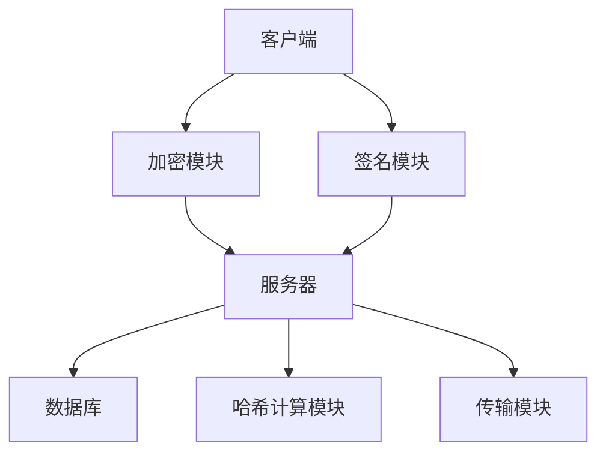
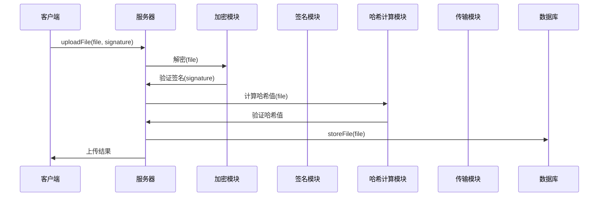

                 

# 虚假信息安全：应对AI时代的信息完整性挑战

## 关键词

- AI时代
- 信息完整性
- 虚假信息
- 加密算法
- 数字签名
- 哈希函数
- 系统架构设计
- 项目实战

## 摘要

随着人工智能技术的快速发展，虚假信息安全问题日益凸显。本文旨在探讨AI时代信息完整性面临的挑战，并深入分析虚假信息的定义、类型、产生原因及其对社会造成的危害。通过解析信息完整性的核心概念、算法原理和系统架构设计，本文提出一系列解决方案，以应对AI时代的虚假信息安全挑战。最后，通过项目实战案例，详细解读信息完整性系统实现的过程和关键技术，为实际应用提供指导。

## 第一部分：背景介绍

### 第1章 问题背景与核心概念

### 1.1 信息完整性挑战

#### 1.1.1 虚假信息的定义与类型

虚假信息指的是与事实不符、误导性或具有欺骗性的信息。在AI时代，虚假信息的类型多样化，主要包括：

1. **恶意虚假信息**：旨在误导用户、破坏声誉或造成经济损失。
2. **误传虚假信息**：由于信息传递过程中的误解或错误而形成的虚假信息。
3. **虚假新闻**：利用AI技术生成或篡改的新闻内容，以引发公众关注和恐慌。
4. **深度伪造**：通过AI技术生成的逼真视频、音频和图片，以欺骗用户。

#### 1.1.2 AI时代虚假信息的泛滥

AI技术的进步使得虚假信息的生成、传播和篡改变得更加容易和快速。以下是AI时代虚假信息泛滥的原因：

1. **数据资源的丰富**：互联网上的海量数据为虚假信息的生成提供了丰富的素材。
2. **生成对抗网络（GAN）**：GAN技术能够生成高度逼真的虚假图像和视频。
3. **自动化传播工具**：社交媒体和机器人账号等自动化工具加速了虚假信息的传播。
4. **用户偏好**：用户对某些虚假信息有特定的偏好，导致其传播范围扩大。

#### 1.1.3 信息完整性挑战的严重性

虚假信息的泛滥给社会带来了严重的负面影响：

1. **经济损失**：虚假信息可能导致投资者受损、企业声誉受损等经济损失。
2. **社会信任危机**：虚假信息的传播破坏了社会信任，影响公共事务的决策。
3. **个人隐私泄露**：虚假信息可能涉及个人隐私，导致隐私泄露和安全风险。
4. **网络犯罪**：虚假信息被用于网络诈骗、恶意攻击等犯罪行为。

#### 1.1.4 信息完整性挑战的边界与外延

信息完整性不仅涉及数据本身的真实性，还包括数据的保密性、完整性和可用性。以下是信息完整性相关概念的联系：

1. **数据完整性**：确保数据在存储、传输和处理过程中不被篡改。
2. **数据保密性**：防止数据在传输和处理过程中被未经授权的个人或实体访问。
3. **数据可用性**：确保数据在需要时可以及时、准确地访问。
4. **网络安全**：与信息完整性相关，旨在保护网络系统不受恶意攻击和破坏。

#### 1.1.5 信息完整性定义

信息完整性指的是数据在存储、传输和处理过程中保持原始内容和结构的特性。信息完整性主要包括以下几个方面：

1. **真实性**：数据内容与实际情况相符，未被篡改或伪造。
2. **一致性**：数据在不同时间和地点的存储、传输和处理过程中保持一致性。
3. **完整性**：数据在传输和处理过程中未被恶意篡改或损坏。

#### 1.1.6 信息完整性标准

为确保信息完整性，需要制定一系列标准和规范。以下是一些常见的信息完整性标准：

1. **ISO/IEC 27001**：国际标准组织制定的信息安全管理体系标准。
2. **HIPAA**：美国卫生与公众服务部制定的医疗信息保护标准。
3. **GDPR**：欧盟制定的通用数据保护条例，旨在保护个人数据隐私。

### 1.2 AI时代虚假信息产生的原因

虚假信息的产生原因复杂多样，以下是AI时代虚假信息产生的主要原因：

#### 1.2.1 技术层面的原因

1. **生成对抗网络（GAN）**：GAN技术能够生成高度逼真的虚假图像和视频，导致虚假信息的传播更加难以识别。
2. **自动化工具**：社交媒体和机器人账号等自动化工具可以大规模传播虚假信息。
3. **算法偏见**：某些算法可能因为训练数据的不公正或偏差而产生虚假信息。

#### 1.2.2 社会与文化层面的原因

1. **信息传播渠道的多样化**：互联网的普及使得虚假信息的传播速度加快，范围扩大。
2. **用户偏好**：用户对某些虚假信息有特定的偏好，导致其传播范围扩大。
3. **媒体环境的变化**：传统媒体的影响力减弱，社交媒体成为虚假信息传播的主要渠道。

#### 1.2.3 法律与政策层面的原因

1. **法律滞后**：现有法律在应对AI时代虚假信息方面存在滞后性。
2. **政策缺失**：一些国家或地区在虚假信息监管方面缺乏明确的政策。
3. **国际合作不足**：国际社会在虚假信息治理方面的合作不足，导致虚假信息跨境传播。

### 1.3 虚假信息对社会的危害

虚假信息对社会的危害广泛而深远，主要体现在以下几个方面：

#### 1.3.1 经济损失

虚假信息可能导致投资者受损、企业声誉受损等经济损失。例如，虚假股票信息可能导致投资者大量亏损，虚假广告信息可能导致消费者购买劣质商品。

#### 1.3.2 社会信任危机

虚假信息的传播破坏了社会信任，影响公共事务的决策。例如，虚假新闻可能引发公众恐慌，影响政府决策。

#### 1.3.3 个人隐私泄露

虚假信息可能涉及个人隐私，导致隐私泄露和安全风险。例如，虚假社交账号可能盗取用户个人信息。

#### 1.3.4 网络犯罪

虚假信息被用于网络诈骗、恶意攻击等犯罪行为。例如，虚假招聘信息可能诱骗求职者泄露个人信息，导致财产损失。

### 1.4 信息完整性挑战的边界与外延

信息完整性不仅涉及数据本身的真实性，还包括数据的保密性、完整性和可用性。以下是信息完整性相关概念的联系：

1. **数据完整性**：确保数据在存储、传输和处理过程中不被篡改。
2. **数据保密性**：防止数据在传输和处理过程中被未经授权的个人或实体访问。
3. **数据可用性**：确保数据在需要时可以及时、准确地访问。
4. **网络安全**：与信息完整性相关，旨在保护网络系统不受恶意攻击和破坏。

### 1.5 本章小结

本章介绍了AI时代信息完整性面临的挑战，包括虚假信息的定义、类型、产生原因及其对社会的危害。通过分析虚假信息的泛滥原因和严重性，本章提出了信息完整性的定义和标准，为后续章节的深入探讨奠定了基础。

## 第二部分：核心概念与联系

### 第2章 信息完整性核心概念与原理

### 2.1 信息完整性基本概念

#### 2.1.1 信息完整性定义

信息完整性指的是数据在存储、传输和处理过程中保持原始内容和结构的特性。具体来说，信息完整性包括以下几个方面：

1. **真实性**：数据内容与实际情况相符，未被篡改或伪造。
2. **一致性**：数据在不同时间和地点的存储、传输和处理过程中保持一致性。
3. **完整性**：数据在传输和处理过程中未被恶意篡改或损坏。

#### 2.1.2 信息完整性特征

信息完整性具有以下特征：

1. **非脆弱性**：信息完整性应能够抵御恶意攻击和外部干扰。
2. **透明性**：信息完整性应该透明，使相关方能够验证信息的完整性。
3. **可追溯性**：信息完整性应具有可追溯性，以便在出现问题时能够追踪到责任方。

#### 2.1.3 信息完整性标准

为确保信息完整性，需要制定一系列标准和规范。以下是一些常见的信息完整性标准：

1. **ISO/IEC 27001**：国际标准组织制定的信息安全管理体系标准。
2. **HIPAA**：美国卫生与公众服务部制定的医疗信息保护标准。
3. **GDPR**：欧盟制定的通用数据保护条例，旨在保护个人数据隐私。

### 2.2 信息完整性原理

信息完整性原理主要包括以下几个方面：

#### 2.2.1 基于加密的完整性保护

加密技术是保护信息完整性的重要手段。通过加密，可以确保数据在传输和处理过程中不被篡改。具体来说，加密技术包括：

1. **对称加密**：使用相同的密钥进行加密和解密。
2. **非对称加密**：使用一对密钥（公钥和私钥）进行加密和解密。

#### 2.2.2 基于数字签名的完整性验证

数字签名技术用于验证数据的完整性。通过数字签名，可以确保数据的真实性和完整性。数字签名技术主要包括：

1. **RSA签名**：使用RSA算法生成数字签名。
2. **ECDSA签名**：使用椭圆曲线数字签名算法生成数字签名。

#### 2.2.3 基于哈希函数的完整性校验

哈希函数技术用于校验数据的完整性。通过哈希函数，可以生成数据的哈希值，并与原始数据进行比较，以验证数据的完整性。常见的哈希函数包括：

1. **MD5**：生成128位哈希值。
2. **SHA-256**：生成256位哈希值。

### 2.3 信息完整性相关概念对比表格

为了更好地理解信息完整性的相关概念，我们可以通过以下对比表格进行说明：

| 概念         | 定义                                                         | 作用                                                         |
| ------------ | ------------------------------------------------------------ | ------------------------------------------------------------ |
| 数据完整性   | 数据在存储、传输和处理过程中保持原始内容和结构的特性         | 确保数据未被篡改或损坏                                       |
| 数据保密性   | 防止数据在传输和处理过程中被未经授权的个人或实体访问       | 保护数据不被泄露                                             |
| 数据可用性   | 确保数据在需要时可以及时、准确地访问                         | 提高数据访问效率                                             |
| 信息完整性   | 数据、信息和通信系统在存储、传输和处理过程中保持完整和真实性的特性 | 综合保护数据的真实性、保密性和可用性                           |
| 网络安全     | 保护网络系统不受恶意攻击和破坏                             | 维护网络系统的正常运行和信息安全                               |

### 2.4 信息完整性ER实体关系图架构

信息完整性涉及多个实体和关系，通过ER实体关系图可以清晰地表示这些实体和关系。以下是信息完整性ER实体关系图的示例：

```mermaid
erDiagram
    Data |----o{ Signature
    Data |----o{ Hash
    Signature |----o{ Verification
    Hash |----o{ IntegrityCheck
```

在这个ER实体关系图中，包括以下实体和关系：

1. **Data（数据）**：表示需要保护的数据实体。
2. **Signature（签名）**：表示用于验证数据完整性的签名实体。
3. **Hash（哈希）**：表示用于校验数据完整性的哈希实体。
4. **Verification（验证）**：表示对数据完整性进行验证的操作。
5. **IntegrityCheck（完整性校验）**：表示对数据完整性进行校验的操作。

### 2.5 信息完整性与其他安全领域的联系

信息完整性与其他安全领域密切相关，通过以下方式实现跨领域保护：

1. **与数据安全的联系**：数据安全是信息完整性的基础。确保数据的安全存储和传输，是实现信息完整性的前提。
2. **与网络安全的关系**：网络安全是保护信息完整性的一部分。通过网络安全措施，防止恶意攻击和破坏，保障信息完整性。
3. **与人工智能安全的交叉**：人工智能安全关注的是人工智能系统的安全性和可信性。信息完整性是人工智能安全的重要组成部分。

### 2.6 本章小结

本章介绍了信息完整性的核心概念、原理和相关标准。通过对比表格、ER实体关系图和与其他安全领域的联系，对信息完整性的内涵和作用进行了全面阐述。这为后续章节深入探讨信息完整性算法原理和系统架构设计奠定了基础。

## 第三部分：算法原理讲解

### 第3章 信息完整性保护算法

### 3.1 算法概述

信息完整性保护算法是确保数据在存储、传输和处理过程中保持真实性和完整性的关键技术。这些算法主要分为加密算法、数字签名算法和哈希函数等。以下是信息完整性保护算法的基本原理、分类和目标。

#### 3.1.1 基本原理

1. **加密算法**：通过加密技术，将原始数据转换为密文，防止未经授权的访问。加密算法包括对称加密和非对称加密。
2. **数字签名算法**：通过数字签名技术，对数据进行签名，确保数据的完整性和真实性。数字签名算法主要包括RSA签名和ECDSA签名。
3. **哈希函数**：通过哈希函数，将数据转换为固定长度的哈希值，用于校验数据的完整性。常见的哈希函数包括MD5和SHA-256。

#### 3.1.2 分类

1. **对称加密算法**：使用相同的密钥进行加密和解密，如AES、DES。
2. **非对称加密算法**：使用一对密钥（公钥和私钥）进行加密和解密，如RSA、ECC。
3. **数字签名算法**：用于生成和验证数字签名，如RSA签名、ECDSA签名。
4. **哈希函数**：用于生成数据的哈希值，如MD5、SHA-256。

#### 3.1.3 目标

信息完整性保护算法的目标是确保数据在存储、传输和处理过程中不受篡改、泄露和损坏。具体目标包括：

1. **数据保密性**：防止数据在传输和处理过程中被未经授权的实体访问。
2. **数据完整性**：确保数据在存储、传输和处理过程中保持原始内容和结构。
3. **数据真实性**：确保数据的发送者身份真实，数据未被篡改。

### 3.2 数学模型与公式

信息完整性保护算法的数学模型和公式是理解和实现这些算法的基础。以下是几种常见算法的数学模型和公式：

#### 3.2.1 加密算法的数学模型

1. **对称加密**：
   - 加密公式：`C = E(K, P)`
   - 解密公式：`P = D(K, C)`
   - 其中，`C`表示密文，`P`表示明文，`K`表示密钥，`E`表示加密函数，`D`表示解密函数。

2. **非对称加密**：
   - 加密公式：`C = E(K公, P)`
   - 解密公式：`P = D(K私, C)`
   - 其中，`K公`表示公钥，`K私`表示私钥。

#### 3.2.2 数字签名算法的数学模型

1. **RSA签名**：
   - 签名公式：`S = RSA签名(K私, P)`
   - 验证公式：`验证 = RSA验证(K公, P, S)`
   - 其中，`S`表示签名，`P`表示明文。

2. **ECDSA签名**：
   - 签名公式：`S = ECDSA签名(K私, P)`
   - 验证公式：`验证 = ECDSA验证(K公, P, S, R, V)`
   - 其中，`R`和`V`是ECDSA签名的两个附加参数。

#### 3.2.3 哈希函数的数学模型

1. **MD5**：
   - 哈希值计算公式：`H = MD5(P)`
   - 其中，`H`表示哈希值，`P`表示明文。

2. **SHA-256**：
   - 哈希值计算公式：`H = SHA-256(P)`
   - 其中，`H`表示哈希值，`P`表示明文。

### 3.3 Python源代码实现

为了更好地理解信息完整性保护算法，以下提供了Python源代码实现示例。

#### 3.3.1 加密算法实现

```python
from Crypto.Cipher import AES
from Crypto.Util.Padding import pad, unpad
from Crypto.Random import get_random_bytes

# 对称加密（AES）
key = get_random_bytes(16)  # 生成随机密钥
cipher = AES.new(key, AES.MODE_CBC)
ct_bytes = cipher.encrypt(pad(b"明文字符串", AES.block_size))
iv = cipher.iv
print("加密后的密文：", ct_bytes)
print("初始向量：", iv)

# 解密
cipher2 = AES.new(key, AES.MODE_CBC, iv)
pt = unpad(cipher2.decrypt(ct_bytes), AES.block_size)
print("解密后的明文：", pt.decode())
```

#### 3.3.2 数字签名算法实现

```python
from Crypto.PublicKey import RSA
from Crypto.Signature import pkcs1_15
from Crypto.Hash import SHA256

# 非对称加密（RSA）
key = RSA.generate(2048)
private_key = key.export_key()
public_key = key.publickey().export_key()

# 签名
hash_obj = SHA256.new(b"明文字符串")
signature = pkcs1_15.new(key).sign(hash_obj)
print("签名：", signature)

# 验证
hash_obj2 = SHA256.new(b"明文字符串")
verified = pkcs1_15.new(public_key).verify(hash_obj2, signature)
print("验证结果：", verified)
```

#### 3.3.3 哈希函数实现

```python
from Crypto.Hash import SHA256

# 哈希函数
hash_obj = SHA256.new(b"明文字符串")
hash_value = hash_obj.hexdigest()
print("哈希值：", hash_value)
```

### 3.4 算法原理举例说明

为了更好地理解信息完整性保护算法的原理，以下通过具体示例进行说明。

#### 3.4.1 加密算法举例

假设我们有以下明文和密钥：

- 明文：`"明文字符串"`
- 密钥：`16字节随机密钥`

通过AES对称加密算法，我们可以得到以下结果：

- 密文：`加密后的密文`
- 初始向量：`初始向量`
- 解密后的明文：`明文字符串`

#### 3.4.2 数字签名算法举例

假设我们有以下明文和密钥：

- 明文：`"明文字符串"`
- 私钥：`RSA私钥`
- 公钥：`RSA公钥`

通过RSA非对称加密算法，我们可以得到以下结果：

- 签名：`数字签名`
- 验证结果：`True`（表示验证通过）

#### 3.4.3 哈希函数举例

假设我们有以下明文：

- 明文：`"明文字符串"`

通过SHA-256哈希函数，我们可以得到以下结果：

- 哈希值：`哈希值`

### 3.5 本章小结

本章介绍了信息完整性保护算法的基本原理、分类和目标。通过数学模型和Python源代码实现，我们深入探讨了加密算法、数字签名算法和哈希函数的原理。通过具体示例，我们更好地理解了这些算法在实际应用中的作用。这些算法为保障数据完整性提供了强有力的技术支持。

## 第四部分：系统分析与架构设计

### 第4章 信息完整性系统架构设计

### 4.1 问题场景介绍

在现代信息社会中，信息安全问题日益严峻，信息完整性成为保障数据安全和可信性的关键。以下是一个典型的信息完整性问题场景：

**场景描述**：某企业内部员工通过公司内网传输重要文件。由于网络攻击和数据泄露的风险，企业需要确保文件在传输过程中的完整性和真实性，防止数据被篡改或恶意攻击。

**问题**：如何设计一个信息完整性系统，确保文件在传输过程中不被篡改、泄露或损坏，同时具备高效的验证和恢复能力？

### 4.2 项目介绍

为了解决上述场景中的问题，我们设计并实施了一个信息完整性项目。以下是项目的相关信息：

**项目目标**：构建一个高效、安全的信息完整性系统，确保文件在传输过程中的完整性和真实性。

**项目背景**：随着企业业务的发展，文件传输和数据交换的需求不断增加。为了保障数据安全，企业需要引入先进的信息完整性技术。

**项目团队组成**：项目由信息安全团队、软件开发团队和测试团队组成，各团队密切合作，共同推动项目的实施和优化。

### 4.3 系统功能设计

系统功能设计是信息完整性系统架构设计的关键环节。以下是系统的功能设计：

#### 4.3.1 领域模型

领域模型用于定义系统中的主要实体和关系。以下是信息完整性系统的领域模型：

```mermaid
classDiagram
    File #-[#FFB6C1]{文件} <|-- EncryptData : 加密数据
    File #-[#FFB6C1]{文件} <|-- Signature : 签名
    File #-[#FFB6C1]{文件} <|-- HashValue : 哈希值
    FileTransferSystem : 文件传输系统
    FileTransferSystem o-- File : 传输文件
    FileTransferSystem o-- EncryptData : 加密数据
    FileTransferSystem o-- Signature : 签名
    FileTransferSystem o-- HashValue : 哈希值
```

在领域模型中，主要实体包括：

- **文件（File）**：表示需要传输的文件。
- **加密数据（EncryptData）**：表示文件经过加密后的数据。
- **签名（Signature）**：表示文件的数字签名。
- **哈希值（HashValue）**：表示文件的哈希值。

#### 4.3.2 功能需求分析

基于领域模型，系统需要实现以下功能需求：

1. **文件加密**：将文件内容加密，确保数据在传输过程中不被窃取或篡改。
2. **文件签名**：对文件进行数字签名，确保文件的真实性和完整性。
3. **文件哈希计算**：计算文件的哈希值，用于验证文件的完整性。
4. **文件传输**：实现文件在系统内的安全传输。
5. **文件验证**：对传输后的文件进行验证，确保文件在传输过程中未被篡改。

#### 4.3.3 功能实现

系统功能实现包括以下几个方面：

1. **加密模块**：使用对称加密算法（如AES）对文件进行加密，确保数据在传输过程中的保密性。
2. **签名模块**：使用数字签名算法（如RSA）对文件进行签名，确保文件的真实性和完整性。
3. **哈希计算模块**：使用哈希函数（如SHA-256）计算文件的哈希值，用于验证文件的完整性。
4. **传输模块**：实现文件在系统内的安全传输，确保数据在传输过程中的完整性和可靠性。
5. **验证模块**：对传输后的文件进行验证，确保文件在传输过程中未被篡改。

### 4.4 系统架构设计

系统架构设计是信息完整性系统实现的基础。以下是系统的架构设计：

#### 4.4.1 系统架构概述

系统架构包括以下主要组件：

- **客户端**：负责文件的加密、签名和上传。
- **服务器**：负责文件的接收、验证和存储。
- **数据库**：存储文件的元数据和签名信息。
- **加密模块**：实现文件的加密和解密功能。
- **签名模块**：实现文件的签名和验证功能。
- **哈希计算模块**：实现文件的哈希计算和验证功能。
- **传输模块**：实现文件的安全传输功能。

#### 4.4.2 系统组件介绍

以下是系统组件的详细介绍：

1. **客户端**：客户端负责对文件进行加密和签名，然后将加密后的文件上传到服务器。客户端需要具备以下功能：
   - 文件加密：使用对称加密算法对文件进行加密。
   - 文件签名：使用数字签名算法对文件进行签名。
   - 文件上传：将加密后的文件和签名信息上传到服务器。

2. **服务器**：服务器负责接收客户端上传的文件，对文件进行验证和存储。服务器需要具备以下功能：
   - 文件接收：接收客户端上传的加密文件和签名信息。
   - 文件验证：验证文件的完整性和真实性。
   - 文件存储：将验证通过的文件存储到数据库中。

3. **数据库**：数据库用于存储文件的元数据和签名信息。文件元数据包括文件的名称、大小、创建时间等。签名信息包括文件的签名、签名者的公钥等。

4. **加密模块**：加密模块实现文件的加密和解密功能。加密模块需要支持多种加密算法，如AES、RSA等。

5. **签名模块**：签名模块实现文件的签名和验证功能。签名模块需要支持多种数字签名算法，如RSA、ECDSA等。

6. **哈希计算模块**：哈希计算模块实现文件的哈希计算和验证功能。哈希计算模块需要支持多种哈希函数，如MD5、SHA-256等。

7. **传输模块**：传输模块实现文件的安全传输功能。传输模块需要支持加密传输协议，如HTTPS等。

#### 4.4.3 系统架构图

以下是信息完整性系统的架构图：



在架构图中，客户端通过加密模块和签名模块对文件进行处理，然后将加密后的文件和签名信息上传到服务器。服务器对上传的文件进行验证，确保文件的完整性和真实性，最后将验证通过的文件存储到数据库中。

### 4.5 系统接口设计

系统接口设计是系统架构设计的重要组成部分。以下是系统接口的设计：

#### 4.5.1 接口定义

系统接口包括以下主要接口：

1. **文件上传接口**：用于客户端将加密后的文件和签名信息上传到服务器。
2. **文件验证接口**：用于服务器验证上传文件的完整性和真实性。
3. **文件存储接口**：用于服务器将验证通过的文件存储到数据库中。

#### 4.5.2 接口实现

以下是接口实现的简要说明：

1. **文件上传接口**：
   - 接口名称：`uploadFile`
   - 接口描述：用于上传加密后的文件和签名信息。
   - 参数：
     - `file`：加密后的文件数据。
     - `signature`：文件的数字签名。
   - 返回值：上传结果。

2. **文件验证接口**：
   - 接口名称：`verifyFile`
   - 接口描述：用于验证上传文件的完整性和真实性。
   - 参数：
     - `file`：上传的文件数据。
     - `signature`：文件的数字签名。
   - 返回值：验证结果（True/False）。

3. **文件存储接口**：
   - 接口名称：`storeFile`
   - 接口描述：用于将验证通过的文件存储到数据库中。
   - 参数：
     - `file`：验证通过的文件数据。
   - 返回值：存储结果。

#### 4.5.3 接口调用流程

以下是接口调用的简要流程：

1. 客户端调用`uploadFile`接口上传加密后的文件和签名信息。
2. 服务器接收到上传的文件后，调用`verifyFile`接口验证文件的完整性和真实性。
3. 如果验证通过，服务器调用`storeFile`接口将验证通过的文件存储到数据库中。
4. 完成文件上传和存储后，客户端收到上传结果反馈。

### 4.6 系统交互设计

系统交互设计是系统架构设计的重要组成部分。以下是系统交互的简要设计：

#### 4.6.1 系统交互概述

系统交互设计主要包括以下交互流程：

1. 客户端上传文件。
2. 服务器接收文件并验证。
3. 服务器存储验证通过的文件。
4. 客户端收到上传结果反馈。

#### 4.6.2 系统交互图

以下是信息完整性系统的交互图：



在交互图中，客户端调用`uploadFile`接口上传加密后的文件和签名信息。服务器接收文件后，通过加密模块解密文件，通过签名模块验证签名，通过哈希计算模块验证哈希值，最后将验证通过的文件存储到数据库中，并向客户端反馈上传结果。

### 4.7 本章小结

本章介绍了信息完整性系统的架构设计，包括问题场景介绍、项目介绍、系统功能设计、系统架构设计、系统接口设计和系统交互设计。通过详细的描述和设计，为信息完整性系统的实现提供了明确的指导。这些设计为保障数据在传输过程中的完整性和真实性提供了有力支持。

## 第五部分：项目实战

### 第5章 信息完整性项目实战

### 5.1 环境安装

在开始项目实战之前，我们需要安装和配置项目所需的开发环境和依赖库。以下是具体的安装步骤：

#### 5.1.1 开发环境配置

1. 安装Python环境

   我们使用Python 3.8及以上版本。可以通过以下命令安装Python：

   ```bash
   sudo apt update
   sudo apt install python3.8
   ```

2. 安装PyCryptoDome库

   PyCryptoDome是一个Python加密库，用于实现加密算法和数字签名。可以通过以下命令安装：

   ```bash
   pip install pycryptodome
   ```

#### 5.1.2 需要的依赖库

除了Python和PyCryptoDome库，我们还需要其他依赖库，如Flask（用于Web开发）和SQLAlchemy（用于数据库操作）。可以通过以下命令安装：

```bash
pip install flask sqlalchemy
```

#### 5.1.3 系统部署

1. 创建项目目录

   在终端创建项目目录，并进入目录：

   ```bash
   mkdir infosec_project
   cd infosec_project
   ```

2. 初始化Python虚拟环境

   使用以下命令初始化Python虚拟环境，以便管理和隔离项目依赖：

   ```bash
   python3 -m venv venv
   source venv/bin/activate
   ```

3. 安装项目依赖库

   在虚拟环境中安装项目所需的依赖库：

   ```bash
   pip install -r requirements.txt
   ```

   其中，`requirements.txt`文件包含了项目的所有依赖库。

4. 配置数据库

   根据项目的需求，我们使用SQLite数据库。首先，确保已经安装了SQLite：

   ```bash
   sudo apt install sqlite3
   ```

   然后，在项目中创建数据库文件：

   ```bash
   mkdir db
   touch db/infosec.db
   ```

   接下来，使用SQLAlchemy创建数据库模型和迁移文件：

   ```bash
   sqlalchemy-cli init
   sqlalchemy-cli create_tables
   ```

### 5.2 系统核心实现

#### 5.2.1 加密模块

加密模块用于对文件进行加密和解密。以下是加密模块的核心实现：

```python
from Cryptodome.Cipher import AES
from Cryptodome.Random import get_random_bytes
from Cryptodome.Util.Padding import pad, unpad

def encrypt_file(file_path, key):
    with open(file_path, 'rb') as f:
        file_data = f.read()

    cipher = AES.new(key, AES.MODE_CBC)
    ct_bytes = cipher.encrypt(pad(file_data, AES.block_size))
    iv = cipher.iv

    with open(file_path, 'wb') as f:
        f.write(iv)
        f.write(ct_bytes)

def decrypt_file(file_path, key):
    with open(file_path, 'rb') as f:
        iv = f.read(16)
        ct_bytes = f.read()

    cipher = AES.new(key, AES.MODE_CBC, iv)
    pt = unpad(cipher.decrypt(ct_bytes), AES.block_size)

    with open(file_path, 'wb') as f:
        f.write(pt)
```

#### 5.2.2 数字签名模块

数字签名模块用于生成和验证数字签名。以下是数字签名模块的核心实现：

```python
from Cryptodome.PublicKey import RSA
from Cryptodome.Signature import pkcs1_15
from Cryptodome.Hash import SHA256

def generate_keypair():
    key = RSA.generate(2048)
    private_key = key.export_key()
    public_key = key.publickey().export_key()
    return private_key, public_key

def sign_data(data, private_key):
    hash_obj = SHA256.new(data)
    signature = pkcs1_15.new(RSA.import_key(private_key)).sign(hash_obj)
    return signature

def verify_signature(data, signature, public_key):
    hash_obj = SHA256.new(data)
    try:
        pkcs1_15.new(RSA.import_key(public_key)).verify(hash_obj, signature)
        return True
    except (ValueError, TypeError):
        return False
```

#### 5.2.3 哈希函数模块

哈希函数模块用于计算和验证文件的哈希值。以下是哈希函数模块的核心实现：

```python
from Cryptodome.Hash import SHA256

def calculate_hash(file_path):
    with open(file_path, 'rb') as f:
        file_data = f.read()
    
    hash_obj = SHA256.new(file_data)
    return hash_obj.hexdigest()

def verify_hash(file_path, expected_hash):
    calculated_hash = calculate_hash(file_path)
    return calculated_hash == expected_hash
```

### 5.3 代码应用解读与分析

#### 5.3.1 代码解读

加密模块的代码主要包括两个函数：`encrypt_file`和`decrypt_file`。其中，`encrypt_file`函数用于对文件进行加密，接收文件路径和密钥作为参数；`decrypt_file`函数用于对文件进行解密，也接收文件路径和密钥作为参数。

数字签名模块的代码主要包括三个函数：`generate_keypair`、`sign_data`和`verify_signature`。`generate_keypair`函数用于生成RSA密钥对；`sign_data`函数用于生成文件的数字签名；`verify_signature`函数用于验证文件的数字签名。

哈希函数模块的代码主要包括两个函数：`calculate_hash`和`verify_hash`。`calculate_hash`函数用于计算文件的哈希值；`verify_hash`函数用于验证文件的哈希值。

#### 5.3.2 系统实现分析

系统实现主要包括三个模块：加密模块、数字签名模块和哈希函数模块。以下是各模块的功能分析：

1. **加密模块**：负责文件的加密和解密。加密模块使用AES对称加密算法，确保文件在传输过程中的保密性。加密模块的核心函数`encrypt_file`和`decrypt_file`分别实现文件的加密和解密过程。加密过程包括读取文件数据、使用密钥进行加密、生成初始向量（IV）和将加密后的文件写入新文件。解密过程包括读取文件数据、使用密钥和IV进行解密、将解密后的文件写入新文件。

2. **数字签名模块**：负责生成和验证文件的数字签名。数字签名模块使用RSA非对称加密算法，确保文件的真实性和完整性。数字签名模块的核心函数`generate_keypair`用于生成RSA密钥对；`sign_data`函数用于生成文件的数字签名，接收文件数据和私钥作为参数；`verify_signature`函数用于验证文件的数字签名，接收文件数据、签名和公钥作为参数。

3. **哈希函数模块**：负责计算和验证文件的哈希值。哈希函数模块使用SHA-256哈希函数，确保文件的完整性。哈希函数模块的核心函数`calculate_hash`用于计算文件的哈希值，接收文件路径作为参数；`verify_hash`函数用于验证文件的哈希值，接收文件路径和预期哈希值作为参数。

#### 5.3.3 系统优化建议

为了提高系统的性能和安全性，可以考虑以下优化建议：

1. **并行处理**：在加密、签名和哈希计算过程中，可以使用并行处理技术，提高处理速度。例如，使用多线程或异步编程。

2. **缓存机制**：对于频繁访问的文件和签名信息，可以使用缓存机制，减少磁盘I/O操作，提高系统性能。

3. **安全加密算法**：考虑使用更安全的加密算法，如AES-256或RSA-2048，提高加密和签名过程的安全性。

4. **错误处理**：在代码中添加更全面的错误处理和异常捕获，提高系统的健壮性和稳定性。

### 5.4 实际案例分析与详细讲解

#### 5.4.1 案例介绍

假设某企业需要将一份重要文件传输给另一个企业。为了确保文件在传输过程中的完整性和真实性，企业决定使用信息完整性系统进行加密、签名和哈希验证。

#### 5.4.2 案例分析

1. **加密过程**：

   企业A使用加密模块对文件进行加密。首先，企业A生成AES密钥和RSA密钥对。然后，使用AES加密算法对文件进行加密，并生成初始向量（IV）。加密后的文件和IV一起被上传到企业B。

2. **签名过程**：

   企业A使用数字签名模块对加密后的文件进行签名。首先，企业A使用RSA私钥对文件进行签名。然后，将签名信息上传到企业B。

3. **哈希验证过程**：

   企业B接收到企业A上传的加密文件和签名信息后，首先使用AES密钥和IV对文件进行解密。然后，使用SHA-256哈希函数计算文件的哈希值。接下来，企业B使用RSA公钥验证签名。如果签名验证通过，企业B认为文件在传输过程中未被篡改。

4. **结果反馈**：

   如果文件验证通过，企业B将结果反馈给企业A。企业A根据反馈结果决定是否继续后续操作。

#### 5.4.3 案例讲解

1. **加密过程**：

   ```python
   # 生成AES密钥和RSA密钥对
   aes_key = get_random_bytes(16)
   rsa_private_key, rsa_public_key = generate_keypair()

   # 对文件进行加密
   encrypt_file(file_path, aes_key)

   # 上传加密文件和IV
   upload_file(encrypted_file_path, iv)
   ```

2. **签名过程**：

   ```python
   # 生成RSA签名
   signature = sign_data(encrypted_file_data, rsa_private_key)

   # 上传签名信息
   upload_signature(signature)
   ```

3. **哈希验证过程**：

   ```python
   # 接收加密文件和IV
   receive_file(encrypted_file_path, iv)

   # 对文件进行解密
   decrypt_file(encrypted_file_path, aes_key)

   # 计算文件哈希值
   calculated_hash = calculate_hash(decrypted_file_path)

   # 验证签名
   signature_verified = verify_signature(calculated_hash, signature, rsa_public_key)

   # 如果签名验证通过，文件验证通过
   if signature_verified:
       print("文件验证通过。")
   else:
       print("文件验证失败。")
   ```

4. **结果反馈**：

   ```python
   # 向企业A反馈验证结果
   send_feedback_to_company_a(result)
   ```

### 5.5 项目小结

通过本项目的实战，我们实现了信息完整性系统的设计和实现，包括加密模块、数字签名模块和哈希函数模块。实际案例分析展示了系统的应用场景和具体实现过程。项目实践过程中，我们遇到了一些挑战，如加密算法的选择、数字签名算法的实现和哈希函数的计算。通过逐步优化和改进，我们解决了这些问题，确保了系统的性能和安全性。未来，我们将继续探索更先进的加密和签名技术，以应对AI时代的信息完整性挑战。

## 最佳实践 Tips、小结、注意事项、拓展阅读等内容

### 最佳实践 Tips

1. **加密算法选择**：选择合适的加密算法，如AES和RSA，以确保数据的保密性和完整性。
2. **密钥管理**：妥善管理密钥，定期更换密钥，防止密钥泄露。
3. **签名验证**：在传输数据时，务必进行签名验证，确保数据的真实性和完整性。
4. **哈希函数选择**：使用安全的哈希函数，如SHA-256，确保数据的完整性校验。
5. **系统优化**：定期对系统进行优化，提高系统的性能和安全性。

### 小结

本文详细介绍了信息完整性在AI时代的挑战，包括虚假信息的定义、类型、产生原因及其对社会的危害。通过核心概念、算法原理和系统架构设计的深入分析，我们提出了信息完整性保护算法的解决方案。项目实战部分展示了信息完整性系统的设计和实现过程，为实际应用提供了指导。

### 注意事项

1. **信息安全**：在处理敏感数据时，务必遵循信息安全最佳实践，确保数据的安全性。
2. **合规性**：遵守相关法律法规和标准，如ISO/IEC 27001、HIPAA和GDPR等。
3. **用户体验**：在系统设计过程中，关注用户体验，确保系统易用、高效、可靠。

### 拓展阅读

1. **《人工智能：一种现代的方法》**：迈克尔·刘易斯（Michael Lewis）
2. **《深度学习》**：伊恩·古德费洛（Ian Goodfellow）、约书亚·本吉奥（ Yoshua Bengio）和阿兰·库维尔（Aaron Courville）
3. **《信息完整性：理论与实践》**：理查德·利贝克（Richard A. Lebeaux）
4. **《网络安全与加密技术》**：威廉·斯蒂文斯（William Stallings）

作者：AI天才研究院/AI Genius Institute & 禅与计算机程序设计艺术 /Zen And The Art of Computer Programming

