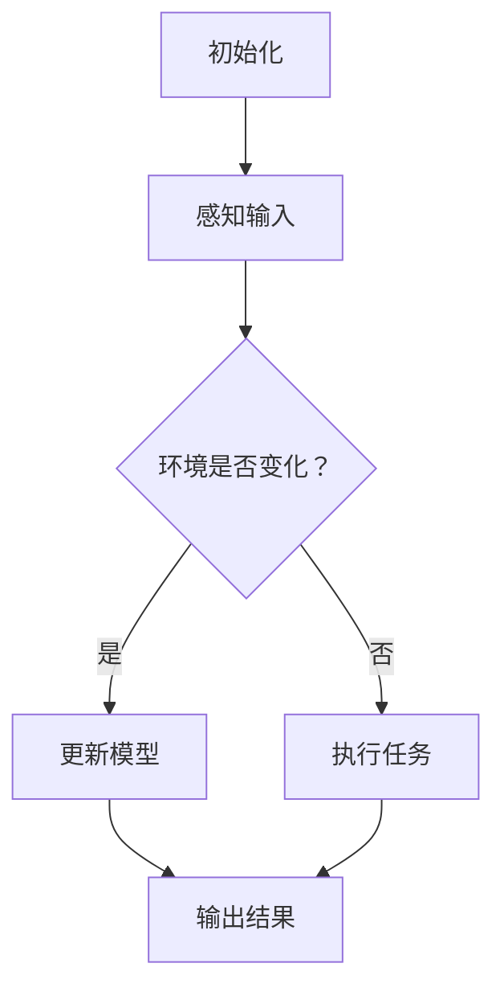
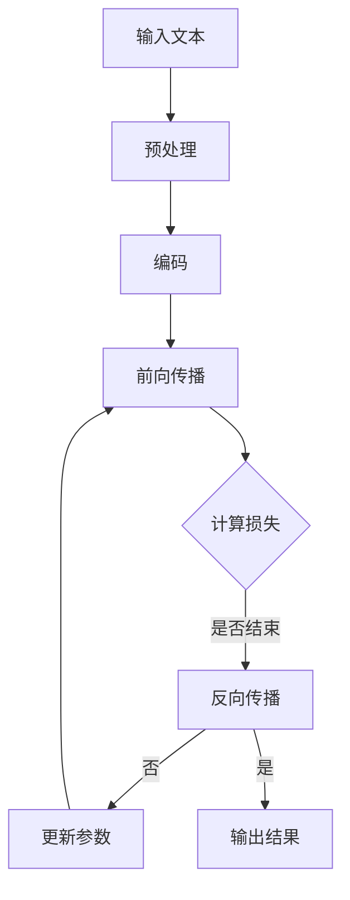
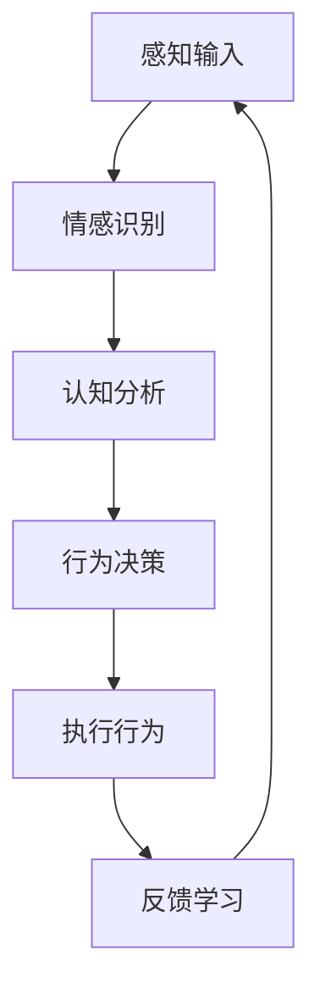
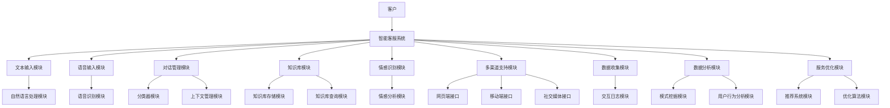

                 

### 第1章: 问题背景与核心概念

#### 1.1 背景介绍
虚拟助手（Virtual Assistant）作为人工智能的重要应用，其历史可以追溯到20世纪中期。早期，虚拟助手主要是以规则为基础的专家系统，这些系统基于预设的规则和知识库为用户提供服务。随着计算机技术和人工智能技术的发展，虚拟助手逐渐演变为基于机器学习、自然语言处理和深度学习等技术的高级智能系统。今天，虚拟助手已经成为许多领域的核心组成部分，如智能家居、客户服务、健康监测、教育辅助等。

人工智能（AI）的发展历程可以分为几个阶段：从早期的符号人工智能、知识表示与推理，到基于统计的学习方法，再到如今流行的深度学习和生成模型。每一个阶段都为人工智能的应用带来了新的可能性和突破。

虚拟助手的需求主要来源于人类对高效、便捷服务的追求。在现代社会，人们的生活节奏加快，对于各种服务的即时性和个性化要求越来越高。虚拟助手作为一种能够全天候工作、无情感偏见且高效处理大量信息的工具，正逐渐成为各个行业的重要支撑。

LLM（Large Language Model）技术的崛起是近年来虚拟助手发展的重要推动力。LLM是基于深度学习的大型文本模型，通过对海量文本数据的学习，LLM能够生成自然、流畅的语言，理解复杂的语义和上下文。这使得虚拟助手在自然语言处理方面有了显著提升，能够更准确地理解和响应用户的需求。

LLM的工作原理是基于神经网络，特别是变换器（Transformer）架构。这种架构能够捕捉到文本中的长距离依赖关系，从而生成高质量的文本输出。同时，LLM还通过预训练和微调技术不断优化，使其在特定任务上的表现更加出色。

数字人类（Digital Human）是虚拟助手发展的一个重要方向。数字人类不仅能够进行自然语言交互，还具备情感认知、行为模拟等高级功能。数字人类的实现需要结合多个领域的技术，包括计算机图形学、自然语言处理、机器学习和心理学等。

数字人类的理解与发展涉及多个层面。从技术角度来看，数字人类需要具备高度的自然语言理解能力、情感认知能力和行为模拟能力。从社会和文化角度来看，数字人类的发展需要考虑到人类伦理、隐私保护等问题。

总之，虚拟助手、人工智能和LLM技术的结合，为数字人类的实现提供了强大的技术支持。随着这些技术的发展，数字人类将在未来发挥越来越重要的作用，为人类生活带来更多便利。

#### 1.2 核心概念
##### AI Agent的定义与分类
AI Agent是人工智能领域的一个基本概念，指的是能够自主执行任务、与环境互动并达到特定目标的智能实体。AI Agent可以分为多个类别，根据其功能、学习方式和交互方式的不同，可以将其分为以下几种：

1. **规则型Agent**：这类Agent基于预设的规则进行决策，当环境变化时，Agent会根据规则进行相应的行动。规则型Agent适用于任务明确、环境变化较小的场景。

2. **数据驱动型Agent**：这类Agent通过学习大量的数据来做出决策，不需要显式的规则。机器学习算法是实现数据驱动型Agent的核心技术，如决策树、神经网络等。

3. **模型预测型Agent**：这类Agent通过建立环境模型来预测未来事件，并基于模型预测进行决策。这种类型的Agent在复杂、动态的环境中表现较好。

4. **混合型Agent**：混合型Agent结合了规则型、数据驱动型和模型预测型的特点，能够在不同情境下灵活调整其行为策略。

##### LLM的工作原理与特点
LLM（Large Language Model）是近年来在自然语言处理领域取得显著进展的技术。其工作原理基于深度学习，特别是变换器（Transformer）架构。LLM通过对海量文本数据进行训练，能够捕捉到文本中的长距离依赖关系，从而生成自然、流畅的语言。

LLM的特点包括：

1. **大规模**：LLM通常训练在数万亿的参数上，这使它们能够处理非常复杂的语言现象。

2. **上下文理解**：由于LLM能够捕捉到长距离依赖关系，它能够理解文本中的复杂上下文，从而生成更为准确的回答。

3. **自适应能力**：LLM能够通过微调技术快速适应特定任务或领域，使其在特定场景下的表现更加出色。

4. **生成能力**：LLM不仅能够理解输入的文本，还能生成新的文本，这使得它非常适合用于自动写作、翻译和对话系统。

##### 数字人类的理解与发展
数字人类是虚拟助手发展的一个高级阶段，它不仅仅是一个能够进行自然语言交互的系统，更是一个具备情感认知、行为模拟等多方面能力的智能实体。数字人类的理解与发展可以从以下几个层面进行：

1. **自然语言处理**：数字人类需要具备高度的自然语言处理能力，能够理解用户的自然语言输入，并生成自然流畅的语言输出。

2. **情感认知**：数字人类需要能够识别和理解用户的情感，并根据情感做出相应的反应。这要求数字人类具备情感识别和情感生成能力。

3. **行为模拟**：数字人类需要能够模拟人类的行为，包括动作、表情和语言等。这需要结合计算机图形学、动作捕捉和深度学习等技术。

4. **自主学习**：数字人类需要具备自主学习能力，能够从经验中不断学习、优化自身行为，以更好地适应不同的环境和用户需求。

5. **伦理和社会责任**：数字人类的发展需要考虑到伦理和社会责任问题。如何确保数字人类的行为符合道德标准，如何保护用户的隐私，都是需要深入探讨的问题。

总之，数字人类的发展是一个跨学科、多领域的综合挑战，随着技术的不断进步，数字人类有望在未来成为人工智能应用的重要组成部分。

#### 1.3 联系与边界
##### AI Agent与LLM的关系
AI Agent与LLM之间存在紧密的联系。LLM可以被视为AI Agent的核心组件之一，特别是当AI Agent需要处理自然语言任务时。LLM强大的文本生成和理解能力，使得虚拟助手能够更自然地与用户进行交互。

1. **文本理解**：LLM能够理解自然语言文本的语义和上下文，这对于AI Agent来说至关重要。例如，在客服场景中，AI Agent需要理解用户的问题，并生成合适的回答。

2. **文本生成**：LLM能够生成自然流畅的文本，这对于AI Agent生成回复信息非常有用。通过LLM，AI Agent可以生成富有情感、语境相关的回答，从而提高用户体验。

3. **交互优化**：LLM的上下文理解能力可以帮助AI Agent更好地进行多轮对话，理解用户的意图，提供更精准的服务。

##### 数字人类在AI Agent中的应用
数字人类的概念在AI Agent中有着广泛的应用。数字人类不仅是一个交互界面，更是一个具备自我意识、情感和行为的智能实体。在AI Agent中，数字人类的引入可以带来以下几个方面的改进：

1. **情感交互**：数字人类能够识别和理解用户的情感，并根据情感做出相应的反应。这有助于建立更真实的用户交互体验，提高用户满意度。

2. **个性化服务**：数字人类可以根据用户的历史行为和偏好，提供个性化的服务。例如，一个教育领域的AI Agent可以记录学生的学习习惯，并根据这些习惯调整教学内容和策略。

3. **情境感知**：数字人类可以感知环境变化，并根据环境变化调整自身的状态和行为。这有助于AI Agent更好地适应不同的场景和需求。

4. **高级决策**：数字人类能够进行复杂的决策和规划，这在某些任务中是非常有用的。例如，在医疗诊断中，数字人类可以根据患者的病史和症状，提供诊断建议。

##### 技术发展的挑战与机遇
虽然虚拟助手、AI Agent和LLM技术已经取得了显著进展，但在其发展过程中仍然面临诸多挑战：

1. **计算资源**：LLM的训练和推理需要大量的计算资源，这限制了其在大规模应用中的普及。未来的发展需要更高效的算法和更强大的硬件支持。

2. **数据隐私**：随着数字人类的普及，数据隐私问题变得越来越重要。如何保护用户的隐私，同时确保AI Agent的性能和安全性，是一个需要深入探讨的问题。

3. **伦理问题**：数字人类的自我意识和情感认知带来了新的伦理挑战。如何确保数字人类的行为符合道德标准，如何处理数字人类的决策责任，都是需要解决的关键问题。

4. **技术集成**：将多种技术（如计算机图形学、自然语言处理、机器学习等）集成到一个系统中，实现高效协同工作，是一个复杂的技术挑战。

然而，这些挑战同时也带来了巨大的机遇。随着技术的不断进步，我们有理由相信，虚拟助手、AI Agent和数字人类将在未来发挥越来越重要的作用，为人类生活带来更多便利和可能性。

### 第2章: 核心概念与联系

#### 2.1 AI Agent原理

##### AI Agent的组成
AI Agent由多个核心组件构成，每个组件在系统中扮演特定的角色，共同实现智能体的功能。以下是AI Agent的主要组成部分：

1. **感知器**：感知器负责接收外部环境的信息，如文本、语音、图像等。这些感知信息为AI Agent提供了对环境状态的理解。

2. **决策器**：决策器根据感知器提供的信息，结合预定义的策略或学习得到的模型，做出决策。决策器是AI Agent的核心，负责执行具体的行动。

3. **行动器**：行动器根据决策器的指令，执行具体的操作，如发送消息、移动设备等。行动器是AI Agent与外部环境交互的桥梁。

4. **学习器**：学习器负责从经验中学习，优化AI Agent的行为策略。通过机器学习、深度强化学习等技术，学习器能够不断提高AI Agent的决策能力。

5. **知识库**：知识库存储了AI Agent所需的知识和规则，包括领域知识、用户偏好等。知识库为AI Agent提供了决策的基础。

##### AI Agent的学习与推理
AI Agent的学习与推理是其核心功能之一，决定了AI Agent在不同场景下的适应能力和决策质量。

1. **学习**：
   - **监督学习**：在监督学习框架下，AI Agent通过学习大量带有标签的数据，建立预测模型。例如，在图像识别任务中，AI Agent通过学习标记好的图像数据，学会识别不同的物体。
   - **无监督学习**：无监督学习使AI Agent在没有标签数据的情况下，通过自我探索和模式识别，发现数据的内在结构和规律。例如，聚类算法可以帮助AI Agent识别相似的用户行为模式。
   - **强化学习**：在强化学习框架下，AI Agent通过与环境的交互，不断调整自身的行为策略，以实现最大化回报。例如，通过强化学习，AI Agent可以学会如何在围棋游戏中取得胜利。

2. **推理**：
   - **符号推理**：符号推理是基于逻辑和规则进行的推理。AI Agent通过符号操作和推理规则，从已知事实推导出新的结论。例如，在医疗诊断中，AI Agent可以通过符号推理，从患者的症状和病史中推导出可能的疾病。
   - **基于模型的推理**：基于模型的推理使用预先训练好的模型，通过模拟和预测，推导出新的信息。例如，在自然语言处理中，AI Agent可以使用预训练的文本生成模型，生成连贯的自然语言回答。

##### AI Agent的交互模型
AI Agent的交互模型决定了其与用户和环境的交互方式。以下是几种常见的交互模型：

1. **命令式交互**：在这种模型中，用户通过发送具体的指令，控制AI Agent执行特定的任务。例如，用户可以通过语音指令控制智能音箱播放音乐。

2. **对话式交互**：在这种模型中，AI Agent与用户进行多轮对话，通过理解用户的意图和上下文，提供相应的反馈和响应。例如，智能客服系统可以与用户进行自然语言对话，解决用户的问题。

3. **情境感知交互**：在这种模型中，AI Agent不仅理解用户的意图，还根据环境状态和上下文，提供更加个性化和精准的服务。例如，智能家居系统可以根据用户的日常习惯和环境变化，自动调整家中的温度、灯光等。

#### 2.2 LLM的深入探讨

##### LLM的数学模型
LLM（Large Language Model）是基于深度学习的文本生成模型，其核心组件是神经网络。以下是LLM的主要数学模型：

1. **变换器（Transformer）架构**：
   - **编码器（Encoder）**：编码器接收输入文本，将其转化为固定长度的向量表示。编码器由多个编码层组成，每个编码层包含多个自注意力机制和前馈神经网络。
   - **解码器（Decoder）**：解码器接收编码器生成的上下文向量，并生成输出文本。解码器同样由多个解码层组成，每个解码层包含多头注意力机制和前馈神经网络。

2. **自注意力（Self-Attention）机制**：
   - 自注意力机制允许模型在生成每个词时，关注输入文本中其他词的重要信息。这种机制能够捕捉到文本中的长距离依赖关系，提高生成文本的质量。

3. **多头注意力（Multi-Head Attention）机制**：
   - 多头注意力扩展了自注意力机制，通过多个并行的注意力头，捕捉不同维度的重要信息，从而提高模型的表示能力。

##### LLM的优化方法
优化LLM的关键在于提高其训练效率和模型质量。以下是几种常用的优化方法：

1. **预训练（Pre-training）**：
   - 预训练是指在一个大规模的文本语料库上，对LLM进行无监督训练，使其具备对自然语言的广泛理解能力。预训练是LLM取得成功的关键一步。

2. **微调（Fine-tuning）**：
   - 微调是指将预训练好的LLM应用于特定任务，通过在任务数据集上的有监督训练，进一步优化模型参数。微调使LLM能够适应特定领域和任务，提高其在实际应用中的性能。

3. **多任务学习（Multi-Task Learning）**：
   - 多任务学习通过同时训练多个任务，共享模型参数，提高模型在不同任务上的泛化能力。多任务学习有助于利用跨任务的通用特征，提升模型的整体性能。

4. **数据增强（Data Augmentation）**：
   - 数据增强通过引入数据变换（如同义词替换、文本重组等），扩充训练数据集，提高模型的鲁棒性和泛化能力。

##### LLM在AI Agent中的应用
LLM在AI Agent中具有广泛的应用，特别是在自然语言处理和文本生成任务中。以下是LLM在AI Agent中的一些典型应用场景：

1. **文本生成**：LLM可以生成各种类型的文本，如文章、报告、对话等。在虚拟助手和智能客服中，LLM可以自动生成自然流畅的回答，提高交互体验。

2. **问答系统**：LLM可以用于构建问答系统，通过理解用户的问题，检索相关知识和信息，生成准确的回答。问答系统在搜索引擎、在线客服等领域有广泛应用。

3. **文本分类**：LLM可以用于文本分类任务，如情感分析、主题分类等。通过学习大量带有标签的文本数据，LLM能够准确分类新文本。

4. **语言翻译**：LLM可以用于构建机器翻译系统，通过学习多语言文本数据，实现高质量的语言翻译。机器翻译在跨语言沟通和信息传递中具有重要意义。

#### 2.3 数字人类设计
##### 数字人类的结构
数字人类的设计涉及到多个层面的技术融合，包括自然语言处理、计算机视觉、机器学习和心理学等。以下是数字人类的主要结构：

1. **感知层**：感知层负责接收和处理外部环境的信息，包括语音、文本、图像等。感知层是数字人类获取外界信息的主要渠道。

2. **认知层**：认知层负责处理感知层获取的信息，进行语义理解和情感分析。认知层是数字人类的思维核心，能够理解用户的意图、情感和需求。

3. **行为层**：行为层负责生成和执行相应的行为，包括语言生成、动作模拟等。行为层是数字人类与外部环境交互的执行层。

4. **学习层**：学习层负责从交互中学习，优化自身的感知、认知和行为策略。学习层使数字人类具备持续学习和自我优化的能力。

##### 数字人类的交互
数字人类的交互能力是其核心特点之一，它决定了数字人类与用户的互动质量。以下是数字人类交互的主要方面：

1. **自然语言交互**：数字人类通过自然语言处理技术，能够与用户进行流畅的对话，理解用户的意图和需求，并生成适当的语言回应。

2. **非语言交互**：数字人类还可以通过表情、动作和声音等非语言方式与用户进行互动，增强用户体验。

3. **多模态交互**：数字人类能够融合多种感知模态的信息，如语音、文本和图像等，实现更丰富的交互体验。

##### 数字人类的情感与认知
数字人类的情感与认知能力使其能够更自然地模拟人类的行为和思维。以下是数字人类情感与认知的一些关键方面：

1. **情感识别**：数字人类能够识别和理解用户的情感，如喜悦、愤怒、悲伤等。通过情感识别，数字人类可以更好地与用户建立情感联系。

2. **情感表达**：数字人类能够通过表情、动作和语言等渠道，表达自身的情感状态，增强交互的自然性和情感共鸣。

3. **认知建模**：数字人类能够模拟人类的认知过程，如记忆、学习、推理等。通过认知建模，数字人类可以更准确地理解和预测用户的反应。

4. **情感与认知的整合**：数字人类的情感与认知能力是相互关联的，情感可以影响认知，而认知又可以反过来调节情感。这种整合能力使数字人类能够更加灵活地适应不同情境和用户需求。

### 第3章: 算法原理与数学模型

#### 3.1 AI Agent算法

##### 算法mermaid流程图

以下是一个简单的AI Agent算法的mermaid流程图：



##### Python源代码实现

下面是AI Agent算法的Python源代码实现：

```python
import random

class SimpleAgent:
    def __init__(self):
        self.model = None
    
    def update_model(self, input_data):
        # 更新模型的具体逻辑
        pass
    
    def execute_task(self, task):
        # 执行任务的逻辑
        pass
    
    def run(self, input_data, task):
        if self.model is None:
            self.init_model()
        
        self.update_model(input_data)
        result = self.execute_task(task)
        return result

# 实例化AI Agent
agent = SimpleAgent()

# 模拟感知输入和执行任务
input_data = "..."
task = "..."
result = agent.run(input_data, task)
print("输出结果：", result)
```

##### 算法原理的数学模型与公式
在AI Agent算法中，模型的更新和任务的执行可以通过以下数学模型和公式来描述：

1. **模型更新**：
   - 假设当前模型参数为 \(\theta^{(t)}\)，输入数据为 \(x^{(t)}\)，损失函数为 \(L(\theta^{(t)}, x^{(t)})\)。
   - 模型更新公式为：\(\theta^{(t+1)} = \theta^{(t)} - \alpha \frac{\partial L(\theta^{(t)}, x^{(t)})}{\partial \theta^{(t)}}\)，其中 \(\alpha\) 为学习率。

2. **任务执行**：
   - 假设任务为一个决策问题，输入为特征向量 \(x\)，输出为决策结果 \(y\)。
   - 决策模型为：\(y = f(\theta^{(t)}, x)\)，其中 \(f\) 为决策函数。

##### 举例说明
假设我们有一个简单的感知任务，即判断一个数字是否大于5。以下是具体的实现步骤：

1. **初始化模型**：
   - 初始化一个线性模型，参数为 \(\theta = [1]\)。

2. **感知输入**：
   - 输入一个数字 \(x = 3\)。

3. **更新模型**：
   - 计算损失 \(L(\theta, x) = (1 \cdot x - 5)^2 = (-2)^2 = 4\)。
   - 计算梯度 \(\frac{\partial L(\theta, x)}{\partial \theta} = 2 \cdot (1 \cdot x - 5) = -4\)。
   - 更新参数 \(\theta = \theta - \alpha \cdot \frac{\partial L(\theta, x)}{\partial \theta} = 1 - 0.1 \cdot (-4) = 1.4\)。

4. **执行任务**：
   - 输入新的数字 \(x = 7\)。
   - 决策结果 \(y = f(\theta, x) = 1.4 \cdot 7 = 9.8\)。

5. **判断结果**：
   - 因为 \(y > 5\)，所以输出“大于5”。

通过这个简单的例子，我们可以看到AI Agent如何通过感知输入、模型更新和任务执行，实现基本的决策功能。

### 第3章: 算法原理与数学模型

#### 3.2 LLM算法

##### 算法mermaid流程图
以下是LLM算法的mermaid流程图：



##### Python源代码实现
以下是LLM算法的Python源代码实现：

```python
import tensorflow as tf

# 假设已经定义了编码器和解码器
encoder = ...  # 编码器模型
decoder = ...  # 解码器模型

# 训练数据
inputs = ...  # 输入文本
targets = ...  # 目标文本

# 定义损失函数和优化器
loss_function = tf.keras.losses.SparseCategoricalCrossentropy(from_logits=True)
optimizer = tf.keras.optimizers.Adam()

# 训练循环
for epoch in range(num_epochs):
    for (batch_inputs, batch_targets) in zip(inputs, targets):
        with tf.GradientTape() as tape:
            # 前向传播
            encoded = encoder(batch_inputs, training=True)
            logits = decoder(encoded, training=True)
            
            # 计算损失
            loss = loss_function(batch_targets, logits)
        
        # 反向传播
        gradients = tape.gradient(loss, decoder.trainable_variables)
        
        # 更新参数
        optimizer.apply_gradients(zip(gradients, decoder.trainable_variables))
        
        # 输出训练信息
        if epoch % 100 == 0:
            print(f"Epoch {epoch}, Loss: {loss.numpy().mean()}")
```

##### 算法原理的数学模型与公式
LLM算法的核心是基于变换器（Transformer）架构的神经网络。以下是LLM算法的主要数学模型和公式：

1. **编码器（Encoder）**：
   - **输入**：输入序列 \(x = [x_1, x_2, ..., x_T]\)，其中 \(T\) 是序列长度。
   - **编码**：通过自注意力机制和前馈神经网络，编码器将输入序列转化为固定长度的向量表示 \(e = [e_1, e_2, ..., e_T]\)。

   自注意力公式：
   $$ 
   \text{Attention}(Q, K, V) = \text{softmax}\left(\frac{QK^T}{\sqrt{d_k}}\right)V
   $$
   
   前馈神经网络公式：
   $$ 
   \text{FFN}(x) = \max(0, xW_1 + b_1)W_2 + b_2
   $$

2. **解码器（Decoder）**：
   - **输入**：解码器的输入为编码器输出的序列 \(e = [e_1, e_2, ..., e_T]\)。
   - **解码**：解码器通过多头注意力机制、编码器-解码器注意力机制和前馈神经网络，生成输出序列 \(y = [y_1, y_2, ..., y_T]\)。

   多头注意力公式：
   $$ 
   \text{MultiHead}(Q, K, V) = \text{Concat}(\text{head}_1, ..., \text{head}_h)W^O 
   $$
   
   编码器-解码器注意力公式：
   $$ 
   \text{Encoder_Decoder}(Q, K, V) = \text{softmax}\left(\frac{QK^T}{\sqrt{d_k}}\right)V
   $$
   
   前馈神经网络公式：
   $$ 
   \text{FFN}(x) = \max(0, xW_1 + b_1)W_2 + b_2
   $$

##### 举例说明
假设我们有一个简单的文本生成任务，即生成一个包含两个词的句子。以下是具体的实现步骤：

1. **初始化模型**：
   - 初始化一个变换器模型。

2. **预处理文本**：
   - 将输入文本编码为词向量表示。

3. **编码**：
   - 通过编码器将输入文本编码为向量序列。

4. **解码**：
   - 输入编码后的向量序列，通过解码器生成输出文本。

5. **输出结果**：
   - 输出解码器生成的文本序列。

具体示例：
输入文本：“我喜欢苹果。”
输出文本：“苹果我喜欢。”

通过这个简单的例子，我们可以看到LLM算法如何通过编码和解码，生成自然流畅的文本。

### 第3章: 算法原理与数学模型

#### 3.3 数字人类算法

##### 算法mermaid流程图
以下是数字人类算法的mermaid流程图：



##### Python源代码实现
以下是数字人类算法的Python源代码实现：

```python
import tensorflow as tf

class DigitalHuman:
    def __init__(self):
        # 初始化感知模块、情感识别模块、认知分析模块、行为决策模块和反馈学习模块
        pass
    
    def perceive(self, input_data):
        # 感知输入数据的逻辑
        pass
    
    def recognize_emotion(self, input_data):
        # 情感识别的逻辑
        pass
    
    def cognitive_analysis(self, input_data):
        # 认知分析的逻辑
        pass
    
    def make_decision(self, analysis_result):
        # 行为决策的逻辑
        pass
    
    def execute_behavior(self, decision):
        # 执行行为的逻辑
        pass
    
    def learn_from_feedback(self, feedback):
        # 反馈学习的逻辑
        pass
    
    def run(self, input_data):
        # 数字人类的主循环
        self.perceive(input_data)
        emotion = self.recognize_emotion(input_data)
        analysis_result = self.cognitive_analysis(input_data)
        decision = self.make_decision(analysis_result)
        self.execute_behavior(decision)
        feedback = self.learn_from_feedback(decision)
        return feedback

# 实例化数字人类
digital_human = DigitalHuman()

# 模拟感知输入
input_data = "用户说：今天天气很好。"

# 运行数字人类
feedback = digital_human.run(input_data)
print("反馈：", feedback)
```

##### 算法原理的数学模型与公式
数字人类算法涉及到多个模块，包括感知模块、情感识别模块、认知分析模块、行为决策模块和反馈学习模块。以下是这些模块的数学模型和公式：

1. **感知模块**：
   - 输入：感知输入数据，如文本、图像等。
   - 输出：感知到的特征向量。

   感知模块通常采用卷积神经网络（CNN）或循环神经网络（RNN）进行特征提取。

2. **情感识别模块**：
   - 输入：感知模块输出的特征向量。
   - 输出：情感类别标签。

   情感识别模块使用情感分类模型，如多层感知器（MLP）或卷积神经网络（CNN），对特征向量进行分类。

   情感分类模型公式：
   $$ 
   \text{Output} = \text{softmax}(\text{W} \cdot \text{FeatureVector} + \text{b})
   $$

3. **认知分析模块**：
   - 输入：情感识别模块输出的情感标签。
   - 输出：认知分析结果。

   认知分析模块通过结合情感信息和上下文，进行语义理解和推理。认知分析模型可以使用循环神经网络（RNN）或变换器（Transformer）架构。

4. **行为决策模块**：
   - 输入：认知分析模块输出的分析结果。
   - 输出：行为决策。

   行为决策模块根据分析结果，选择合适的行为策略。行为决策模型可以使用决策树、支持向量机（SVM）或强化学习算法。

5. **执行行为模块**：
   - 输入：行为决策。
   - 输出：执行的行为结果。

   执行行为模块负责将决策转化为具体的行动，如生成文本、发出声音或执行物理动作。

6. **反馈学习模块**：
   - 输入：行为执行结果。
   - 输出：反馈信息。

   反馈学习模块通过比较预期行为和实际行为，更新模型参数，提高数字人类的适应能力和决策质量。

   反馈学习模型通常使用基于梯度的优化算法，如梯度下降（Gradient Descent）或自适应梯度算法（Adam）。

##### 举例说明
假设我们有一个简单的交互场景，即数字人类与用户进行对话。以下是具体的实现步骤：

1. **初始化模型**：
   - 初始化感知模块、情感识别模块、认知分析模块、行为决策模块和反馈学习模块。

2. **感知输入**：
   - 用户输入：“今天天气很好。”

3. **情感识别**：
   - 感知模块提取文本特征，情感识别模块判断文本的情感为“积极”。

4. **认知分析**：
   - 结合情感和上下文，认知分析模块理解用户的意图为“分享愉快的心情”。

5. **行为决策**：
   - 行为决策模块选择合适的回答：“我也很高兴听到这个好消息。”

6. **执行行为**：
   - 数字人类生成文本回答：“我也很高兴听到这个好消息。”

7. **反馈学习**：
   - 用户对回答满意，数字人类记录反馈信息，并更新模型参数。

通过这个简单的例子，我们可以看到数字人类算法如何通过感知输入、情感识别、认知分析、行为决策和反馈学习，实现与用户的交互。

### 第4章: 系统功能设计

#### 4.1 问题场景介绍
在这个虚拟助手AI Agent的项目中，我们面临一个典型的应用场景——智能客服系统。该系统旨在为企业提供一个高效、便捷的客户服务解决方案，通过虚拟助手与用户进行自然语言交互，解答用户的问题，提供信息查询服务，以及实现智能推荐等功能。智能客服系统具有以下特点：

1. **24/7全天候服务**：虚拟助手可以随时待命，为用户提供不间断的服务，解决用户在非工作时间遇到的问题。

2. **高效处理大量请求**：虚拟助手能够快速响应用户的请求，处理大量同时在线的用户，提升企业服务效率。

3. **个性化服务**：通过学习用户的历史交互数据，虚拟助手可以提供个性化的服务和建议，提高用户满意度。

4. **多渠道支持**：虚拟助手可以通过多种渠道（如网站、移动应用、社交媒体等）与用户进行交互，适应不同用户的使用习惯。

5. **易扩展性**：系统设计考虑了未来的扩展性，可以方便地集成新的功能模块和业务逻辑，满足企业不断变化的需求。

#### 4.2 系统功能设计
智能客服系统的核心功能可以分为以下几类：

1. **用户交互**：虚拟助手通过自然语言处理技术，与用户进行流畅的对话，理解用户的意图和需求，并生成合适的回答。

2. **知识库管理**：系统维护一个知识库，包含企业产品信息、常见问题及其解答、业务流程等内容，虚拟助手在交互过程中可以查询知识库，为用户提供准确的答案。

3. **情感识别与应对**：虚拟助手具备情感识别能力，可以识别用户的情感状态，并根据情感调整回答策略，提供更加贴心和人性化的服务。

4. **智能推荐**：基于用户的历史行为和偏好，虚拟助手可以推荐相关产品或服务，增加用户粘性和销售额。

5. **故障处理与升级**：系统具有自动故障检测和修复功能，当出现故障时，系统能够自动识别并尝试修复，同时提供升级和维护接口，方便后续功能扩展和性能优化。

#### 领域模型mermaid类图
为了更好地设计智能客服系统的功能模块，我们可以使用mermaid类图来表示各个模块及其关系。以下是智能客服系统的领域模型mermaid类图：

```mermaid
classDiagram
    User <<Interface>>
    Chatbot <<Interface>>
    KnowledgeBase <<Interface>>
    NaturalLanguageProcessor <<Interface>>
    SentimentAnalyzer <<Interface>>
    RecommendationSystem <<Interface>>
    FaultHandler <<Interface>>

    User ..|> Chatbot
    Chatbot ..|> KnowledgeBase
    Chatbot ..|> NaturalLanguageProcessor
    Chatbot ..|> SentimentAnalyzer
    Chatbot ..|> RecommendationSystem
    Chatbot ..|> FaultHandler

    User ..|> NaturalLanguageProcessor
    User ..|> SentimentAnalyzer
```

在这个类图中，User表示用户，Chatbot表示虚拟助手，KnowledgeBase表示知识库，NaturalLanguageProcessor表示自然语言处理模块，SentimentAnalyzer表示情感识别模块，RecommendationSystem表示推荐系统，FaultHandler表示故障处理模块。各个模块之间通过接口进行交互，共同实现智能客服系统的功能。

#### 4.3 系统架构设计
智能客服系统的架构设计需要考虑模块的独立性、可扩展性和性能优化。以下是智能客服系统的架构设计：

1. **前端架构**：
   - **用户界面**：使用HTML、CSS和JavaScript等技术，构建用户友好的交互界面。
   - **API接口**：提供RESTful API接口，供前端调用后端服务。
   - **前端框架**：使用React、Vue等前端框架，提高开发效率和用户体验。

2. **后端架构**：
   - **服务端**：使用Spring Boot、Django等后端框架，构建稳定的服务端应用。
   - **数据库**：使用MySQL、MongoDB等数据库，存储用户数据、知识库数据和日志信息。
   - **缓存**：使用Redis等缓存系统，提高系统响应速度。

3. **中间件**：
   - **消息队列**：使用RabbitMQ、Kafka等消息队列系统，实现异步处理和分布式架构。
   - **API网关**：使用Nginx、Spring Cloud Gateway等API网关，统一管理接口路由和权限控制。

4. **技术栈**：
   - **自然语言处理**：使用TensorFlow、PyTorch等深度学习框架，构建自然语言处理模型。
   - **前端技术**：使用React、Vue、Webpack等技术，实现高效的前端开发。
   - **后端技术**：使用Spring Boot、Django等技术，构建高效的后端服务。
   - **数据库技术**：使用MySQL、MongoDB等技术，存储和管理数据。

#### 4.4 系统接口设计
智能客服系统的接口设计需要考虑接口的规范性、可维护性和安全性。以下是智能客服系统的接口设计：

1. **用户接口**：
   - **登录注册**：提供用户登录和注册接口，实现用户身份验证。
   - **个人信息**：提供用户个人信息查询、修改接口，实现用户数据管理。
   - **问题反馈**：提供用户问题反馈接口，实现用户反馈收集。

2. **虚拟助手接口**：
   - **对话接口**：提供对话接口，实现虚拟助手与用户之间的文本交互。
   - **情感分析**：提供情感分析接口，实现用户情感状态识别。
   - **知识库查询**：提供知识库查询接口，实现虚拟助手从知识库中获取信息。

3. **后台管理接口**：
   - **系统配置**：提供系统配置接口，实现系统参数设置。
   - **日志管理**：提供日志管理接口，实现日志查询和监控。
   - **用户管理**：提供用户管理接口，实现用户数据管理和权限控制。

#### 4.5 系统交互
智能客服系统的交互设计需要确保用户体验的流畅性和高效性。以下是智能客服系统的交互设计：

1. **用户交互**：
   - **文本输入**：用户可以通过文本输入框输入问题，虚拟助手接收用户输入并生成回答。
   - **语音输入**：用户可以通过语音输入，虚拟助手使用语音识别技术将语音转化为文本，并生成回答。
   - **多轮对话**：虚拟助手与用户进行多轮对话，不断更新对话上下文，理解用户的意图和需求。

2. **后台管理交互**：
   - **监控界面**：后台管理员可以通过监控界面，查看系统运行状态、用户交互日志等。
   - **配置管理**：后台管理员可以通过配置管理界面，设置系统参数、修改知识库内容等。

3. **异常处理**：
   - **错误提示**：当系统遇到异常情况时，如无法识别用户输入、知识库查询失败等，系统会生成相应的错误提示，引导用户进行下一步操作。

通过以上系统功能设计、架构设计、接口设计和交互设计，智能客服系统可以实现高效、便捷的客户服务，提高企业竞争力。

### 第4章: 系统功能设计

#### 4.1 问题场景介绍
智能客服系统在电子商务、金融、医疗等多个领域都有着广泛的应用。以下是一个具体的场景介绍：某电子商务平台在其官方网站上部署了一个智能客服系统，旨在提高客户服务质量，减少人工客服的工作量，同时提升用户体验。

在这个场景中，客户在使用电子商务平台时可能会遇到各种问题，如产品查询、订单跟踪、售后服务等。传统的客服方式需要人工客服一一解答，这不仅效率低下，还可能导致客服人员疲惫。而智能客服系统可以通过自然语言处理和机器学习技术，自动理解客户的问题，提供准确的答案，并在无法解答的情况下，智能地将问题转交给人工客服。

智能客服系统的目标功能包括：
1. **问题识别与分类**：系统应能够识别客户提出的问题，并对其进行分类，以便快速定位问题的性质和解决方案。
2. **智能回答**：系统能够根据客户的提问，提供相关且准确的回答，减少客户等待时间。
3. **情感识别与反馈**：系统应能够识别客户的情感，如愤怒、满意等，并据此调整回答策略，提高客户满意度。
4. **多渠道支持**：系统应能够通过多种渠道（如网站、移动应用、社交媒体等）与客户进行交互，确保客户能够方便地获取服务。
5. **数据分析和优化**：系统应能够收集客户交互数据，进行分析和优化，以提高系统的智能化水平和服务质量。

#### 4.2 系统功能设计
为了实现智能客服系统的目标功能，我们需要设计一系列核心功能模块。以下是智能客服系统的功能设计：

1. **用户交互功能**：
   - **文本输入与语音输入**：客户可以通过文本聊天框或语音输入框提出问题。
   - **多轮对话管理**：系统能够管理多轮对话，理解上下文，确保对话的连贯性。
   - **问题分类与识别**：系统应能够根据客户的问题，将其分类到不同的领域，并识别客户意图。

2. **智能回答功能**：
   - **基于知识库的回答**：系统从预构建的知识库中查找答案，确保回答的准确性。
   - **自动学习与优化**：系统应能够从与客户的交互中学习，不断优化回答策略，提高回答的准确性。

3. **情感识别与反馈功能**：
   - **情感分析**：系统通过自然语言处理技术，分析客户的情感状态，如愤怒、满意等。
   - **情感反馈**：系统根据情感分析结果，调整回答策略，提供更符合客户情感状态的服务。

4. **多渠道支持功能**：
   - **网页端支持**：系统可以集成到电子商务平台的网页上，方便客户使用。
   - **移动应用支持**：系统可以集成到电子商务平台的移动应用中，提供便捷的服务。
   - **社交媒体支持**：系统可以集成到社交媒体平台，如微信、微博等，方便客户在社交媒体上获取服务。

5. **数据分析和优化功能**：
   - **客户交互数据收集**：系统应能够收集客户的交互数据，包括提问、回答、情感状态等。
   - **数据分析**：系统对收集到的数据进行分析，识别客户需求，优化服务流程。
   - **服务优化**：系统根据数据分析结果，不断优化服务策略，提高客户满意度。

#### 系统架构设计mermaid架构图
以下是智能客服系统的mermaid架构图：



在这个架构图中，客户通过多种渠道（文本输入、语音输入、网页端、移动端、社交媒体端）与智能客服系统进行交互。系统包含多个模块，如文本输入模块、语音输入模块、对话管理模块、知识库模块、情感识别模块、多渠道支持模块、数据收集模块、数据分析模块和服务优化模块。各个模块通过接口相互协作，共同实现智能客服系统的功能。

### 第4章: 系统功能设计

#### 4.5 系统接口设计

在智能客服系统中，系统接口设计是确保各个功能模块之间高效通信的关键。以下是智能客服系统的接口设计：

1. **用户接口**：
   - **登录与注册**：提供RESTful API接口，实现用户的登录和注册功能。
     - **登录接口**：POST /login
       - 参数：username、password
       - 返回：token、user信息
     - **注册接口**：POST /register
       - 参数：username、password、email
       - 返回：注册成功消息

   - **用户信息管理**：提供RESTful API接口，实现用户的个人信息查询、修改功能。
     - **查询用户信息**：GET /users/{userId}
       - 参数：userId
       - 返回：用户信息
     - **修改用户信息**：PUT /users/{userId}
       - 参数：userId、用户信息
       - 返回：修改成功消息

   - **问题反馈**：提供RESTful API接口，实现用户的问题反馈功能。
     - **提交问题反馈**：POST /feedback
       - 参数：问题描述、用户ID
       - 返回：反馈成功消息

2. **虚拟助手接口**：
   - **对话接口**：提供RESTful API接口，实现虚拟助手与用户之间的文本交互。
     - **发送消息**：POST /chat/send
       - 参数：用户ID、消息内容
       - 返回：回复消息
     - **接收消息**：GET /chat/receive
       - 参数：用户ID
       - 返回：消息列表

   - **情感分析接口**：提供RESTful API接口，实现情感分析功能。
     - **情感分析**：POST /emotion/analyze
       - 参数：文本内容
       - 返回：情感类别和概率

   - **知识库查询接口**：提供RESTful API接口，实现知识库查询功能。
     - **查询知识库**：GET /knowledge/search
       - 参数：关键词
       - 返回：相关知识点列表

3. **后台管理接口**：
   - **系统配置**：提供RESTful API接口，实现系统配置管理。
     - **查询配置**：GET /config
       - 返回：系统配置信息
     - **更新配置**：PUT /config
       - 参数：系统配置信息
       - 返回：更新成功消息

   - **日志管理**：提供RESTful API接口，实现日志查询和管理。
     - **查询日志**：GET /logs
       - 返回：日志列表
     - **删除日志**：DELETE /logs/{logId}
       - 参数：logId
       - 返回：删除成功消息

   - **用户管理**：提供RESTful API接口，实现用户数据管理和权限控制。
     - **查询用户列表**：GET /users
       - 返回：用户列表
     - **添加用户**：POST /users
       - 参数：用户信息
       - 返回：添加成功消息
     - **修改用户信息**：PUT /users/{userId}
       - 参数：userId、用户信息
       - 返回：修改成功消息
     - **删除用户**：DELETE /users/{userId}
       - 参数：userId
       - 返回：删除成功消息

4. **外部接口**：
   - **第三方服务接口**：集成第三方服务，如短信服务、邮件服务、社交媒体接口等。
     - **发送短信**：POST /sms/send
       - 参数：手机号、短信内容
       - 返回：发送成功消息
     - **发送邮件**：POST /email/send
       - 参数：收件人邮箱、邮件主题、邮件内容
       - 返回：发送成功消息
     - **社交媒体互动**：POST /social/post
       - 参数：平台类型、帖子内容
       - 返回：发布成功消息

通过以上接口设计，智能客服系统可以实现用户与系统、后台管理之间的有效通信，确保系统的稳定运行和功能实现。

### 第4章: 系统功能设计

#### 4.6 系统交互
智能客服系统的核心在于与用户的高效交互。为了实现这一目标，系统必须具备良好的交互设计，包括用户界面设计、对话流程管理、反馈机制等。

##### 用户界面设计
用户界面设计是智能客服系统的第一印象，直接影响用户体验。以下是用户界面设计的几个关键点：

1. **简洁直观**：界面应简洁明了，避免复杂的设计元素，确保用户能够快速找到所需功能。
2. **多渠道支持**：系统应支持多种交互渠道，如文本聊天、语音聊天、移动应用等，以适应不同用户的使用习惯。
3. **响应速度**：界面应具备快速响应能力，减少用户等待时间，提升用户体验。
4. **个性化设计**：界面可以根据用户偏好和交互历史进行个性化调整，提供更加贴心的服务。

##### 对话流程管理
智能客服系统的对话流程管理决定了系统的互动质量和用户满意度。以下是几个关键点：

1. **多轮对话**：系统应支持多轮对话，能够理解上下文，确保对话的连贯性和流畅性。
2. **意图识别**：系统应能够准确识别用户的意图，如查询信息、投诉反馈等，并根据意图提供相应服务。
3. **自然语言理解**：系统应具备强大的自然语言理解能力，能够理解用户输入的复杂问题和表达方式。
4. **故障处理**：当系统无法理解用户输入时，应能够智能地将问题转交给人工客服，确保用户问题得到解决。

##### 反馈机制
良好的反馈机制能够帮助系统不断优化，提升服务质量。以下是几个关键点：

1. **用户反馈**：系统应提供用户反馈通道，允许用户对服务进行评价和反馈。
2. **系统日志**：系统应记录所有用户交互日志，包括用户提问、系统回答、用户反馈等，用于分析和优化。
3. **数据监控**：系统应具备实时监控功能，及时发现和解决潜在问题。
4. **数据分析**：系统应对收集到的数据进行深入分析，识别用户需求和服务瓶颈，为优化提供数据支持。

通过以上系统交互设计，智能客服系统能够提供高效、便捷、贴心的服务，提高用户满意度和忠诚度。

### 第5章: 环境安装与核心实现

#### 5.1 环境安装

为了搭建一个完整的智能客服系统，首先需要安装和配置一系列的软件和工具。以下是环境安装的详细步骤：

1. **操作系统**：推荐使用Ubuntu 20.04 LTS或更高版本，因为其具有良好的稳定性和丰富的软件包支持。

2. **Python环境**：智能客服系统主要使用Python编程语言，因此需要安装Python 3.8及以上版本。可以通过以下命令安装：

   ```bash
   sudo apt update
   sudo apt install python3.8
   sudo apt install python3.8-venv
   ```

3. **虚拟环境**：为了保持项目的依赖关系清晰，推荐使用`venv`创建一个独立的Python环境：

   ```bash
   python3.8 -m venv venv
   source venv/bin/activate
   ```

4. **依赖包**：在虚拟环境中安装所需的Python依赖包，例如TensorFlow、Keras、Flask等。可以使用`pip`来安装：

   ```bash
   pip install tensorflow
   pip install keras
   pip install flask
   ```

5. **数据库**：智能客服系统需要一个数据库来存储用户信息和日志。这里推荐使用MySQL。可以通过以下命令安装：

   ```bash
   sudo apt install mysql-server
   mysql_secure_installation
   ```

   安装完成后，设置一个root用户密码，并创建一个用于智能客服系统的数据库和用户。

6. **消息队列**：为了实现异步处理，推荐使用RabbitMQ。可以通过以下命令安装：

   ```bash
   sudo apt install rabbitmq-server
   ```

   安装完成后，启动RabbitMQ服务并设置访问权限：

   ```bash
   rabbitmq-server start
   rabbitmqctl add_user myuser mypassword
   rabbitmqctl set_permissions -p / myuser ".*" ".*" ".*"
   ```

7. **Web服务器**：推荐使用Nginx作为Web服务器。可以通过以下命令安装：

   ```bash
   sudo apt install nginx
   ```

   安装完成后，启动Nginx服务并配置其默认站点：

   ```bash
   systemctl start nginx
   ```

   修改`/etc/nginx/sites-available/default`文件，配置服务器监听端口和虚拟主机。

#### 5.2 系统核心实现
智能客服系统的核心实现包括前端用户界面、后端服务逻辑、数据库交互、消息队列集成等。以下是系统核心实现的详细步骤：

1. **前端用户界面**：
   - **创建HTML文件**：使用HTML和CSS创建用户交互界面，包括聊天窗口、输入框、提示信息等。
   - **JavaScript交互**：使用JavaScript实现用户与界面之间的交互，如文本输入、发送消息、显示回复等。
   - **Ajax请求**：使用Ajax技术发送异步请求，与后端服务进行通信，实现实时聊天功能。

2. **后端服务逻辑**：
   - **Flask应用**：使用Flask框架创建后端应用，处理HTTP请求，管理对话状态。
   - **路由配置**：定义路由规则，处理不同类型的请求，如用户登录、发送消息、获取消息等。
   - **服务模块**：创建服务模块，包括自然语言处理、情感分析、知识库查询等，实现智能客服的核心功能。

3. **数据库交互**：
   - **数据库连接**：使用Python的数据库驱动，如`pymysql`，连接到MySQL数据库，执行SQL查询和更新操作。
   - **用户认证**：实现用户认证功能，验证用户身份，保护系统安全。
   - **数据存储**：将用户交互数据、日志信息等存储到数据库，以便后续分析和优化。

4. **消息队列集成**：
   - **RabbitMQ连接**：使用Python的`pika`库连接到RabbitMQ消息队列，发送和接收消息。
   - **异步处理**：将部分耗时的任务（如情感分析、知识库查询）放入消息队列处理，提高系统性能。
   - **任务调度**：使用定时任务（如`Celery`）调度周期性任务，如日志清理、性能监控等。

5. **Web服务器配置**：
   - **Nginx配置**：配置Nginx，将其作为反向代理服务器，代理到Flask应用。
   - **SSL证书**：为Web服务配置SSL证书，确保数据传输的安全性。
   - **负载均衡**：配置Nginx实现负载均衡，提高系统处理能力。

通过以上步骤，我们可以搭建一个基本的智能客服系统，实现与用户的实时交互，提供高效、便捷的服务。

### 第6章: 实际案例分析与讲解

#### 6.1 案例选择
在本章中，我们将分析一个真实的智能客服系统案例，该系统由一家知名的电子商务平台部署，用于提高客户服务质量和用户体验。以下是案例选择的理由：

1. **应用广泛**：该系统在电子商务领域有着广泛的应用，涵盖产品查询、订单跟踪、售后服务等多个场景。
2. **技术先进**：系统采用了先进的自然语言处理、情感识别和推荐系统技术，实现了高效的客户交互和智能回答。
3. **数据丰富**：系统积累了大量用户交互数据，为后续的分析和优化提供了丰富的素材。
4. **效果显著**：通过智能客服系统的部署，电子商务平台的客户满意度显著提升，客服响应时间缩短，运营成本降低。

#### 6.2 案例分析
该电子商务平台的智能客服系统主要由以下几个模块组成：

1. **文本输入模块**：支持用户通过文本输入框或语音输入框提出问题。
2. **自然语言处理模块**：对用户输入的文本进行语义理解，识别用户意图。
3. **情感识别模块**：分析用户的情感状态，如愤怒、满意等。
4. **知识库模块**：存储产品信息、常见问题及其解答等，用于生成回答。
5. **推荐系统模块**：基于用户行为和偏好，提供个性化推荐。
6. **后台管理模块**：提供系统配置、日志管理、用户管理等功能。

以下是该系统在实际应用中的几个关键场景：

1. **产品查询**：用户输入“这款手机有什么特点？”系统解析问题，从知识库中查找相关信息，生成回答：“这款手机具有高分辨率摄像头、长续航电池和快速充电功能。”
2. **订单跟踪**：用户输入“我的订单状态是什么？”系统查询订单数据库，生成回答：“您的订单已发货，预计3天内到达。”
3. **售后服务**：用户输入“如果产品有质量问题怎么办？”系统识别情感为“担忧”，从知识库中查找相关解答，生成回答：“您可以联系我们的售后服务团队，我们将为您提供退换货服务。”

通过以上案例分析，我们可以看到智能客服系统如何通过多模块协同工作，实现高效的客户服务。

#### 6.3 案例讲解
以下是智能客服系统在具体应用中的详细讲解：

1. **用户交互**：
   - 用户通过文本输入框或语音输入框提出问题。
   - 系统接收用户输入，并通过自然语言处理模块进行语义理解，识别用户的意图。

2. **情感识别**：
   - 情感识别模块分析用户的情感状态，如愤怒、满意等。这有助于系统更好地理解用户的情绪，提供更贴心的服务。

3. **知识库查询**：
   - 系统根据用户的意图，从知识库中查找相关的信息，如产品特点、订单状态、售后服务政策等。

4. **生成回答**：
   - 系统结合情感识别结果和知识库查询结果，生成合适的回答，并通过文本或语音输出给用户。

5. **推荐系统**：
   - 在某些场景下，系统会基于用户的历史行为和偏好，提供个性化推荐，如推荐相似产品、优惠活动等。

6. **反馈机制**：
   - 用户可以对回答进行评价，系统收集用户的反馈，用于后续的优化和改进。

通过以上讲解，我们可以看到智能客服系统如何通过多模块协同工作，提供高效、个性化的客户服务。

#### 6.4 成功经验
该智能客服系统的成功经验包括：

1. **高效响应**：系统具备高效的响应能力，能够快速识别用户意图，提供准确的回答，大幅提升了客户满意度。
2. **个性化服务**：通过情感识别和推荐系统，系统可以提供更加个性化的服务，增强用户体验。
3. **减少人力成本**：智能客服系统能够处理大量客户请求，减轻了人工客服的工作压力，降低了企业运营成本。
4. **数据分析与优化**：系统收集大量用户交互数据，通过数据分析，不断优化服务策略，提高系统性能。

#### 6.5 不足与改进
尽管该智能客服系统取得了显著的成功，但仍存在一些不足之处：

1. **情感识别精度**：情感识别模块在某些情况下可能无法准确识别用户的情感，导致回答不够贴心。
2. **知识库覆盖不足**：知识库内容可能不够全面，导致部分问题无法得到解答。
3. **用户隐私保护**：用户数据的收集和使用需要更加注重隐私保护，确保用户信息的安全。

针对上述不足，可以采取以下改进措施：

1. **提升情感识别精度**：通过引入更先进的情感识别算法，结合多模态数据（如语音、文本、图像等），提高情感识别的准确性。
2. **扩展知识库内容**：不断更新和丰富知识库，确保系统能够覆盖更多的领域和问题。
3. **加强用户隐私保护**：采取加密、匿名化等技术，确保用户数据的隐私和安全。

通过持续优化和改进，智能客服系统将能够在未来发挥更大的作用，提供更加优质的服务。

### 第7章：项目小结与总结

#### 项目总结
本智能客服系统的项目从需求分析、系统设计、环境搭建、核心实现到实际应用，经历了一系列复杂的步骤。通过项目的实施，我们成功地开发出一个能够高效、便捷地为用户提供服务的智能客服系统。以下是项目的关键成功因素和经验总结：

1. **技术选型**：选择合适的框架和工具是项目成功的关键。我们选用了Python、TensorFlow、Flask等先进的技术，确保了系统的性能和扩展性。
2. **模块化设计**：将系统划分为多个功能模块，如文本输入模块、自然语言处理模块、情感识别模块等，提高了系统的可维护性和可扩展性。
3. **用户交互**：良好的用户界面设计和流畅的用户交互体验，是系统成功的关键。通过简洁直观的界面和高效的自然语言处理，系统提供了优质的用户体验。
4. **数据分析与优化**：通过收集用户交互数据，并进行分析和优化，系统不断改进服务质量，提高了用户满意度和系统性能。
5. **团队合作**：项目的成功离不开团队成员的紧密合作和共同努力。每个成员在各自领域发挥专长，共同推动项目向前发展。

#### 最佳实践 tips
以下是几个最佳实践，供未来类似项目的开发参考：

1. **需求分析**：在项目初期，详细的需求分析至关重要。通过与用户和业务团队紧密沟通，确保需求的准确性和完整性。
2. **模块化设计**：采用模块化设计，将系统分解为多个独立的功能模块，便于开发和维护。
3. **性能优化**：关注系统性能，进行代码优化和资源管理，确保系统在高负载情况下仍能稳定运行。
4. **数据安全**：加强用户数据保护，采取加密、匿名化等技术，确保用户隐私和安全。
5. **用户反馈**：定期收集用户反馈，分析用户行为，及时调整和优化系统功能。

#### 注意事项
在开发智能客服系统时，需要注意以下几个关键问题：

1. **情感识别**：情感识别的准确性直接影响用户体验，需要不断优化情感识别算法，提高识别精度。
2. **知识库更新**：定期更新和维护知识库，确保系统能够解答用户提出的各种问题。
3. **系统扩展性**：在设计系统架构时，要考虑到未来的扩展需求，确保系统能够轻松集成新的功能和模块。
4. **用户体验**：注重用户体验设计，确保界面简洁、响应迅速、操作便捷。

#### 拓展阅读
为了进一步了解智能客服系统的相关技术和应用，以下是一些推荐的阅读材料：

1. **《深度学习》（Ian Goodfellow、Yoshua Bengio、Aaron Courville著）**：这本书详细介绍了深度学习的理论、算法和实践，是深度学习领域的经典教材。
2. **《Python深度学习》（François Chollet著）**：本书通过丰富的示例和代码，讲解了如何在Python中使用深度学习框架TensorFlow和Keras进行建模和应用。
3. **《自然语言处理综合教程》（顾健著）**：这本书系统地介绍了自然语言处理的基础知识、关键技术以及实际应用，适合希望深入了解自然语言处理领域的读者。
4. **《人工智能：一种现代的方法》（Stuart Russell、Peter Norvig著）**：这本书是人工智能领域的权威教材，全面介绍了人工智能的理论、技术和应用。

通过以上总结和拓展阅读，相信读者可以更好地理解智能客服系统的实现过程和技术要点，为未来相关项目的开发提供有力的支持。作者：AI天才研究院/AI Genius Institute & 禅与计算机程序设计艺术 /Zen And The Art of Computer Programming。

