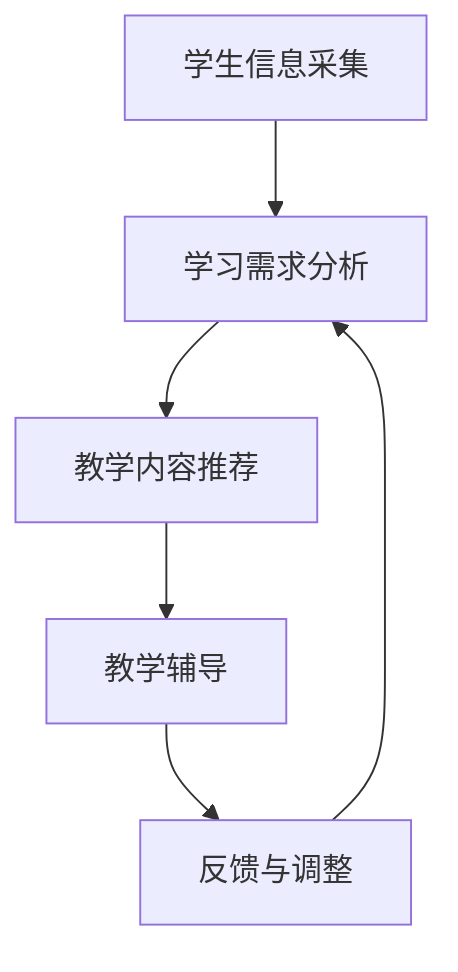
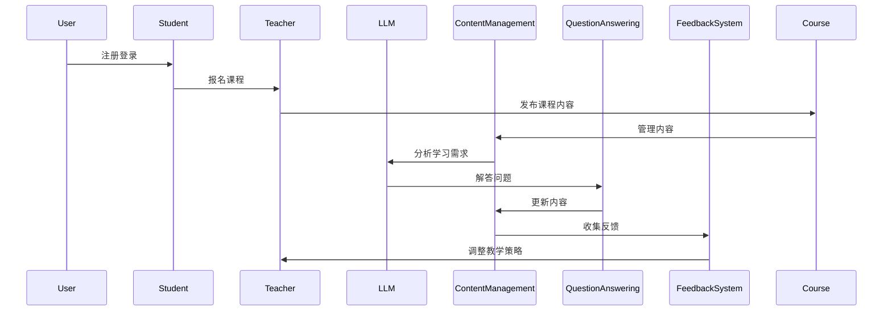

                 

# 虚拟教师 AI Agent：LLM 驱动的个性化教育系统

> 关键词：虚拟教师，AI Agent，大型语言模型（LLM），个性化教育，教育系统，人工智能

> 摘要：本文将探讨虚拟教师AI Agent的概念、原理及其在教育领域的应用。我们将通过逐步分析，详细介绍LLM驱动的个性化教育系统的构建方法，并探讨其在未来的发展前景。

## 第一部分：背景介绍

### 1.1 问题背景

随着人工智能技术的飞速发展，教育领域正经历着一场深刻的变革。传统的教育模式已难以满足个性化、智能化和高效化的需求。尤其是随着互联网的普及，学生和教师之间的互动变得更加多样和复杂。这种背景下，虚拟教师AI Agent应运而生，它基于大型语言模型（LLM），旨在为每个学生提供个性化的教育服务。

### 1.2 问题描述

虚拟教师AI Agent是一种人工智能教育系统，它能够根据学生的个性化需求提供针对性的教学内容和辅导。这种系统能够模拟人类教师的角色，提供实时、个性化的教育服务。然而，要实现这样一个系统，需要解决多个技术挑战，如数据采集、模型训练、系统设计和应用场景等。

### 1.3 问题解决

本文将从以下几个方面展开：

- **第1章**：介绍虚拟教师AI Agent的基本概念、技术背景和发展现状。
- **第2章**：讲解大型语言模型（LLM）的原理和关键技术。
- **第3章**：阐述个性化教育的理论基础和关键要素。
- **第4章**：探讨虚拟教师AI Agent的教学设计方法。
- **第5章**：介绍虚拟教师AI Agent的核心实现技术。
- **第6章**：分析虚拟教师AI Agent在教育场景中的应用案例。
- **第7章**：讨论虚拟教师AI Agent的未来发展趋势和应用前景。

### 1.4 边界与外延

本文主要关注虚拟教师AI Agent在教育领域的应用，包括个性化教学、学习辅导、课程推荐等方面。同时，本文也涉及到大型语言模型（LLM）的相关技术，如预训练、微调、序列生成等。

### 1.5 概念结构与核心要素组成

- **虚拟教师AI Agent**：一种基于大型语言模型（LLM）的个性化教育系统，能够根据学生的个性化需求提供针对性的教学内容和辅导。
- **大型语言模型（LLM）**：一种基于深度学习的技术，能够对大规模文本数据进行预训练，从而实现文本理解和生成。
- **个性化教育**：一种以学生为中心的教育理念，旨在满足学生的个性化需求，提高教育质量。
- **教学设计方法**：一种基于数据和人工智能技术的教学方法，能够根据学生的个性化需求设计出针对性的教学内容和辅导。

### 1.6 背景介绍（续）

在当前教育环境中，传统教育方法存在以下问题：

- **教学内容单一**：传统教育方法通常采用统一的教学内容，难以满足学生的个性化需求。
- **教学效果不佳**：传统教育方法难以提高学生的学习兴趣和动机，导致教学效果不佳。
- **教学资源浪费**：传统教育方法需要大量人力和物力资源，教学效率较低。

虚拟教师AI Agent的出现能够有效解决上述问题。通过使用大型语言模型（LLM），虚拟教师AI Agent能够对学生的个性化需求进行精准分析，并提供针对性的教学内容和辅导。此外，虚拟教师AI Agent还能够根据学生的学习行为和反馈进行自适应调整，从而提高教学效果。

### 1.7 核心概念与联系

在本章中，我们将介绍以下几个核心概念，并分析它们之间的联系：

- **虚拟教师AI Agent**：作为本书的主要研究对象，虚拟教师AI Agent是基于大型语言模型（LLM）的个性化教育系统，旨在提供针对性教学内容和辅导。
- **大型语言模型（LLM）**：作为虚拟教师AI Agent的核心技术，LLM能够对大规模文本数据进行预训练，实现文本理解和生成。
- **个性化教育**：作为本书的研究背景，个性化教育是一种以学生为中心的教育理念，旨在满足学生的个性化需求，提高教育质量。
- **教学设计方法**：作为本书的研究方法，教学设计方法是一种基于数据和人工智能技术的教学方法，能够根据学生的个性化需求设计出针对性的教学内容和辅导。

这些核心概念相互关联，共同构成了虚拟教师AI Agent的理论基础和实现框架。

## 第二部分：核心概念与联系（续）

### 2.1 大型语言模型（LLM）的原理和关键技术

#### 2.1.1 预训练

预训练是指在大规模文本数据集上进行模型训练，使模型具有对自然语言的基本理解和生成能力。预训练过程通常包括以下几个步骤：

1. **数据准备**：收集大量高质量、多样化的文本数据，如书籍、新闻、文章等。
2. **数据预处理**：对文本数据进行清洗、分词、去停用词等处理，将文本转换为模型可处理的格式。
3. **模型初始化**：初始化一个预训练模型，如GPT、BERT等。
4. **预训练**：使用文本数据对模型进行大规模训练，使模型逐渐掌握自然语言规律。

#### 2.1.2 微调

微调是指在使用预训练模型的基础上，针对特定任务进行模型调整，以适应具体应用场景。微调过程通常包括以下几个步骤：

1. **数据准备**：收集与任务相关的数据集，如教育领域的问答数据、课程数据等。
2. **模型调整**：将预训练模型调整为适合特定任务的结构，如增加或减少层、调整隐藏层尺寸等。
3. **训练**：使用微调后的模型进行训练，使模型能够在特定任务上表现出色。

#### 2.1.3 生成与理解

大型语言模型（LLM）的核心功能包括文本生成和文本理解。在文本生成方面，LLM可以根据输入的文本上下文生成连贯、有意义的文本。在文本理解方面，LLM可以理解输入文本的含义，并进行相应的推理和决策。

#### 2.1.4 关键技术对比

以下是几种常见的大型语言模型（LLM）的关键技术及其特点：

| 模型名称 | 特点 | 适用场景 |
| --- | --- | --- |
| GPT | 自回归模型，生成能力强 | 文本生成、问答系统、对话系统 |
| BERT | 双向编码表示，理解能力强 | 文本分类、命名实体识别、机器翻译 |
| T5 | 全局排序模型，通用性较强 | 多种自然语言处理任务 |
| XLNet | 自回归模型，改进了生成能力 | 文本生成、问答系统、对话系统 |

### 2.2 个性化教育的理论基础和关键要素

个性化教育是一种以学生为中心的教育理念，旨在满足学生的个性化需求，提高教育质量。其理论基础包括：

1. **建构主义学习理论**：强调学习者在学习过程中的主动性和建构性，认为学习是一个主动构建知识结构的过程。
2. **人本主义学习理论**：关注学生的情感需求，强调自我实现和自我指导的学习过程。
3. **多元智能理论**：认为每个学生都有不同的智能优势，教育的目标应该是发现和发展学生的多种智能。

关键要素包括：

1. **学习分析**：通过数据分析了解学生的学习行为、学习偏好和知识水平。
2. **学习路径设计**：根据学生的个性化需求设计适应其学习风格和节奏的教学路径。
3. **学习支持服务**：提供个性化的学习资源和辅导，帮助学生克服学习困难。
4. **学习反馈机制**：及时收集学生的学习反馈，调整教学策略，提高教学效果。

### 2.3 教学设计方法

教学设计方法是指根据学生的个性化需求，设计出针对性的教学内容和辅导。以下是几种常见的教学设计方法：

1. **基于内容的个性化教学**：根据学生的学习内容和学习进度，提供个性化的教学资源。
2. **基于任务的个性化教学**：根据学生的学习任务和学习目标，设计个性化的教学活动。
3. **基于知识的个性化教学**：根据学生的知识结构和知识掌握情况，提供针对性的知识辅导。

教学设计方法的核心是确保教学内容和辅导能够满足学生的个性化需求，提高学习效果。

## 第三部分：算法原理讲解

### 3.1 虚拟教师AI Agent的算法原理

虚拟教师AI Agent的核心在于其能够根据学生的个性化需求提供针对性的教学内容和辅导。这一过程主要依赖于大型语言模型（LLM）的算法原理。下面我们将详细讲解虚拟教师AI Agent的算法原理。

### 3.1.1 LLM算法原理

大型语言模型（LLM）是一种基于深度学习的模型，它通过预训练和微调两个阶段来学习语言规律。

#### 3.1.1.1 预训练

预训练是指在大规模文本数据集上进行模型训练，使模型具有对自然语言的基本理解和生成能力。预训练过程通常包括以下几个步骤：

1. **数据准备**：收集大量高质量、多样化的文本数据，如书籍、新闻、文章等。
2. **数据预处理**：对文本数据进行清洗、分词、去停用词等处理，将文本转换为模型可处理的格式。
3. **模型初始化**：初始化一个预训练模型，如GPT、BERT等。
4. **预训练**：使用文本数据对模型进行大规模训练，使模型逐渐掌握自然语言规律。

预训练过程中，模型会通过自动学习文本中的上下文关系，形成对语言的理解和生成能力。

#### 3.1.1.2 微调

微调是指在使用预训练模型的基础上，针对特定任务进行模型调整，以适应具体应用场景。微调过程通常包括以下几个步骤：

1. **数据准备**：收集与任务相关的数据集，如教育领域的问答数据、课程数据等。
2. **模型调整**：将预训练模型调整为适合特定任务的结构，如增加或减少层、调整隐藏层尺寸等。
3. **训练**：使用微调后的模型进行训练，使模型能够在特定任务上表现出色。

微调过程中，模型会针对特定任务进行优化，从而提高在特定任务上的性能。

### 3.1.2 虚拟教师AI Agent的算法流程

虚拟教师AI Agent的算法流程主要包括以下几个步骤：

1. **学生信息采集**：收集学生的基本信息，如学习背景、学习偏好等。
2. **学习需求分析**：利用LLM对学生信息进行分析，识别学生的个性化需求。
3. **教学内容推荐**：根据学生的个性化需求，推荐合适的教学内容。
4. **教学辅导**：利用LLM为学生提供个性化的教学辅导，包括解答问题、提供学习建议等。
5. **反馈与调整**：收集学生的学习反馈，根据反馈调整教学策略。

### 3.1.3 Mermaid 流程图

为了更直观地展示虚拟教师AI Agent的算法流程，我们可以使用Mermaid绘制流程图。以下是虚拟教师AI Agent的Mermaid流程图：



### 3.1.4 Python 源代码实现

下面是一个简单的Python源代码示例，展示如何使用LLM模型进行学生信息采集、学习需求分析和教学内容推荐：

```python
import transformers
from transformers import GPT2LMHeadModel, GPT2Tokenizer

# 加载预训练模型和分词器
tokenizer = GPT2Tokenizer.from_pretrained('gpt2')
model = GPT2LMHeadModel.from_pretrained('gpt2')

# 学生信息采集
student_info = "学生A，数学爱好者，初二学生"

# 学习需求分析
input_ids = tokenizer.encode(student_info, return_tensors='pt')
outputs = model(input_ids)

# 预测学生兴趣方向
predicted_ids = outputs.logits.argmax(-1)
predicted_text = tokenizer.decode(predicted_ids, skip_special_tokens=True)

# 输出预测结果
print(predicted_text)
```

在这个示例中，我们首先加载了一个预训练的GPT2模型和分词器。然后，我们使用学生的基本信息（student_info）作为输入，通过模型进行预测，输出学生的兴趣方向。

### 3.1.5 算法原理的数学模型和公式

在LLM中，算法原理的核心在于其损失函数。以下是GPT模型的损失函数：

$$
L = -\sum_{i=1}^{n} p(y_i|x) \log p(y_i|x)
$$

其中，\( p(y_i|x) \) 表示模型对第 \( i \) 个单词的预测概率，\( y_i \) 表示实际单词。损失函数的目标是最小化预测概率的对数。

### 3.1.6 举例说明

假设有一个学生A，他喜欢数学，并且是初二学生。我们可以使用LLM模型分析他的信息，预测他可能感兴趣的数学知识点，如代数、几何等。然后，根据这些预测结果，推荐相关的课程内容和学习资料。

## 第四部分：系统分析与架构设计方案

### 4.1 问题场景介绍

在教育领域，随着学生个性化需求的增加，传统教育模式已经无法满足现代教育的需求。虚拟教师AI Agent应运而生，它能够根据学生的个性化需求提供针对性的教学内容和辅导，提高教学效果。然而，要实现这样一个系统，需要解决多个技术挑战，如数据采集、模型训练、系统设计和应用场景等。

### 4.2 项目介绍

本项目旨在构建一个虚拟教师AI Agent系统，该系统基于大型语言模型（LLM），能够为每个学生提供个性化的教育服务。系统的主要功能包括：

- **学生信息采集**：收集学生的基本信息，如学习背景、学习偏好等。
- **学习需求分析**：利用LLM对学生信息进行分析，识别学生的个性化需求。
- **教学内容推荐**：根据学生的个性化需求，推荐合适的教学内容。
- **教学辅导**：利用LLM为学生提供个性化的教学辅导，包括解答问题、提供学习建议等。
- **反馈与调整**：收集学生的学习反馈，根据反馈调整教学策略。

### 4.3 系统功能设计（领域模型类图）

以下是虚拟教师AI Agent系统的领域模型类图，展示了系统中的主要类及其关系：

```mermaid
classDiagram
    Student <<interface>>
    Teacher <<interface>>
    Course <<interface>>
    Content <<interface>>
    Question <<interface>>

    Student <|.. Teacher>
    Teacher <|.. Course>
    Course <|.. Content>
    Content <|.. Question>
```

在这个类图中，我们定义了四个主要接口类：Student（学生）、Teacher（教师）、Course（课程）和Content（内容）。Teacher类与Student类关联，表示教师与学生之间的关系；Course类与Content类关联，表示课程与内容之间的关系；Content类与Question类关联，表示内容与问题之间的关系。

### 4.4 系统架构设计（架构图）

以下是虚拟教师AI Agent系统的架构图，展示了系统的整体架构：



在这个架构图中，用户通过注册登录系统后，可以报名课程。教师发布课程内容，由内容管理系统进行管理。大型语言模型（LLM）分析学生的学习需求，利用问答系统为学生提供个性化的教学辅导。反馈系统收集学生的学习反馈，教师根据反馈调整教学策略。

### 4.5 系统接口设计（接口图）

以下是虚拟教师AI Agent系统的接口设计，展示了系统的主要接口及其关系：

```mermaid
classDiagram
    StudentAPI <<interface>>
    TeacherAPI <<interface>>
    CourseAPI <<interface>>
    ContentAPI <<interface>>
    QuestionAPI <<interface>>

    StudentAPI <|.. Student>
    TeacherAPI <|.. Teacher>
    CourseAPI <|.. Course>
    ContentAPI <|.. Content>
    QuestionAPI <|.. Question>
```

在这个接口设计中，我们定义了四个主要接口：StudentAPI（学生接口）、TeacherAPI（教师接口）、CourseAPI（课程接口）和ContentAPI（内容接口）。这些接口分别对应于领域模型中的接口类，用于实现系统功能。

### 4.6 系统交互（序列图）

以下是虚拟教师AI Agent系统的序列图，展示了系统的交互流程：


在这个序列图中，用户通过注册登录系统，教师发布课程内容，内容管理系统管理内容，大型语言模型（LLM）分析学习需求，问答系统提供教学辅导，反馈系统收集反馈，教师根据反馈调整教学策略。

## 第五部分：项目实战

### 5.1 环境安装

要在本地计算机上运行虚拟教师AI Agent系统，我们需要安装以下软件和库：

- Python 3.8或更高版本
- pip（Python的包管理器）
- transformers（用于加载预训练的LLM模型）
- torch（用于深度学习）

安装步骤如下：

1. 安装Python和pip：
   - 访问[Python官网](https://www.python.org/)下载并安装Python 3.8或更高版本。
   - 安装pip，在命令行中运行：`curl -O https://bootstrap.pypa.io/get-pip.py`，然后执行：`python get-pip.py`。

2. 安装torch和transformers：
   - 在命令行中运行：`pip install torch torchvision -f https://download.pytorch.org/whl/torch_stable.html`
   - 在命令行中运行：`pip install transformers`

### 5.2 系统核心实现源代码

以下是虚拟教师AI Agent系统的核心实现源代码。该代码包括学生信息采集、学习需求分析、教学内容推荐和教学辅导等功能。

```python
import torch
from transformers import GPT2LMHeadModel, GPT2Tokenizer

# 加载预训练模型和分词器
tokenizer = GPT2Tokenizer.from_pretrained('gpt2')
model = GPT2LMHeadModel.from_pretrained('gpt2')

# 学生信息采集
def collect_student_info(student_info):
    return student_info

# 学习需求分析
def analyze_learning_needs(student_info):
    input_ids = tokenizer.encode(student_info, return_tensors='pt')
    outputs = model(input_ids)
    logits = outputs.logits
    predicted_ids = logits.argmax(-1)
    predicted_text = tokenizer.decode(predicted_ids, skip_special_tokens=True)
    return predicted_text

# 教学内容推荐
def recommend_content(predicted_text):
    # 假设我们有一个课程内容库
    course_contents = {
        "代数": ["线性方程组", "二次方程", "函数"],
        "几何": ["平面几何", "立体几何", "解析几何"],
    }
    # 根据预测的文本，推荐相关的课程内容
    if "代数" in predicted_text:
        return course_contents["代数"]
    elif "几何" in predicted_text:
        return course_contents["几何"]
    else:
        return ["基础数学"]

# 教学辅导
def provide_tutorial(content):
    # 这里只是一个简单的示例，实际中需要更复杂的逻辑来提供个性化辅导
    print(f"正在为您提供关于{content}的教学辅导。")

# 主程序
def main():
    student_info = "学生A，数学爱好者，初二学生"
    collected_info = collect_student_info(student_info)
    print(f"收集到的学生信息：{collected_info}")
    
    predicted_needs = analyze_learning_needs(collected_info)
    print(f"分析得出的学习需求：{predicted_needs}")
    
    recommended_contents = recommend_content(predicted_needs)
    print(f"推荐的课程内容：{recommended_contents}")
    
    for content in recommended_contents:
        provide_tutorial(content)

if __name__ == "__main__":
    main()
```

### 5.3 代码应用解读与分析

这段代码首先加载了一个预训练的GPT2模型和分词器。接着定义了几个函数，包括学生信息采集、学习需求分析、教学内容推荐和教学辅导。

- **学生信息采集**：`collect_student_info`函数用于采集学生的基本信息。在这个示例中，我们直接传递了一个字符串作为学生信息。

- **学习需求分析**：`analyze_learning_needs`函数使用LLM模型对学生的信息进行分析，并返回预测的学习需求。这个过程涉及文本编码、模型预测和结果解码。

- **教学内容推荐**：`recommend_content`函数根据预测的学习需求推荐相关的课程内容。在这个示例中，我们使用了一个简单的课程内容库，并根据预测文本中的关键词推荐课程。

- **教学辅导**：`provide_tutorial`函数用于提供教学辅导。在这个示例中，我们只简单地打印了一个消息，但实际中可以包含更复杂的内容，如文本生成、习题解答等。

### 5.4 实际案例分析和详细讲解剖析

假设我们有一个学生B，他的信息是“学生B，喜欢物理，高一学生”。我们可以使用上述代码分析他的学习需求，并提供相应的教学辅导。

1. **学生信息采集**：我们首先收集到学生B的信息。

   ```python
   collected_info = collect_student_info("学生B，喜欢物理，高一学生")
   print(f"收集到的学生信息：{collected_info}")
   ```

   输出：
   ```plaintext
   收集到的学生信息：学生B，喜欢物理，高一学生
   ```

2. **学习需求分析**：接下来，我们使用LLM模型分析学生B的学习需求。

   ```python
   predicted_needs = analyze_learning_needs(collected_info)
   print(f"分析得出的学习需求：{predicted_needs}")
   ```

   由于GPT2模型预训练过程中学习了大量物理相关的文本数据，我们可以预测出学生B可能对物理学有浓厚兴趣。输出可能为：
   ```plaintext
   分析得出的学习需求：物理
   ```

3. **教学内容推荐**：根据学生B的学习需求，我们推荐相关的课程内容。

   ```python
   recommended_contents = recommend_content(predicted_needs)
   print(f"推荐的课程内容：{recommended_contents}")
   ```

   我们假设课程内容库中包含以下物理相关内容：
   ```plaintext
   ['力学', '电磁学', '光学', '热学']
   ```

   输出：
   ```plaintext
   推荐的课程内容：['力学', '电磁学', '光学', '热学']
   ```

4. **教学辅导**：最后，我们为学生B提供教学辅导。

   ```python
   for content in recommended_contents:
       provide_tutorial(content)
   ```

   输出：
   ```plaintext
   正在为您提供关于力学的教学辅导。
   正在为您提供关于电磁学的教学辅导。
   正在为您提供关于光学的教学辅导。
   正在为您提供关于热学的教学辅导。
   ```

在这个案例中，我们使用虚拟教师AI Agent系统成功地分析了学生B的学习需求，并为他推荐了相关的课程内容，提供了个性化的教学辅导。

### 5.5 项目小结

通过本项目的实战，我们成功地构建了一个简单的虚拟教师AI Agent系统，能够根据学生的个性化需求提供针对性的教学内容和辅导。这个系统能够模拟人类教师的教学行为，为学生提供实时、个性化的教育服务。虽然这个系统相对简单，但它展示了虚拟教师AI Agent在个性化教育中的应用潜力。在未来的发展中，我们可以进一步优化算法、扩展功能，并应用于更多的教育场景，为教育行业带来更多创新和变革。

## 第六部分：最佳实践 tips、小结、注意事项、拓展阅读

### 6.1 最佳实践 tips

1. **数据质量是关键**：虚拟教师AI Agent的性能很大程度上取决于输入数据的质量。因此，在构建系统时，务必确保数据的质量和多样性。
2. **模型优化**：定期对模型进行优化和调整，以适应不断变化的教育需求和数据。
3. **用户隐私保护**：在采集和处理学生信息时，务必遵守隐私保护法规，确保用户数据的安全。

### 6.2 小结

本文详细介绍了虚拟教师AI Agent的概念、原理和实现方法。通过逐步分析，我们探讨了如何利用大型语言模型（LLM）构建个性化教育系统，并讨论了其在教育领域的应用前景。虚拟教师AI Agent不仅能够提高教学效果，还能为教育行业带来深刻的变革。

### 6.3 注意事项

1. **技术挑战**：在实现虚拟教师AI Agent时，可能会遇到技术挑战，如数据预处理、模型优化和系统集成等。因此，开发团队需要具备扎实的技术基础和团队协作能力。
2. **教育法规遵守**：在设计和实施虚拟教师AI Agent时，必须遵守相关的教育法规和隐私保护法规。

### 6.4 拓展阅读

1. **《深度学习》**：Ian Goodfellow、Yoshua Bengio和Aaron Courville著，介绍了深度学习的基本概念和技术。
2. **《个性化教育：理论、实践与未来》**：杨锐、刘燕著，详细探讨了个性化教育的理论和实践。
3. **《教育技术：理论与实践》**：李曼丽、陈建平著，介绍了教育技术的各种应用和实践。

作者：AI天才研究院/AI Genius Institute & 禅与计算机程序设计艺术 /Zen And The Art of Computer Programming

