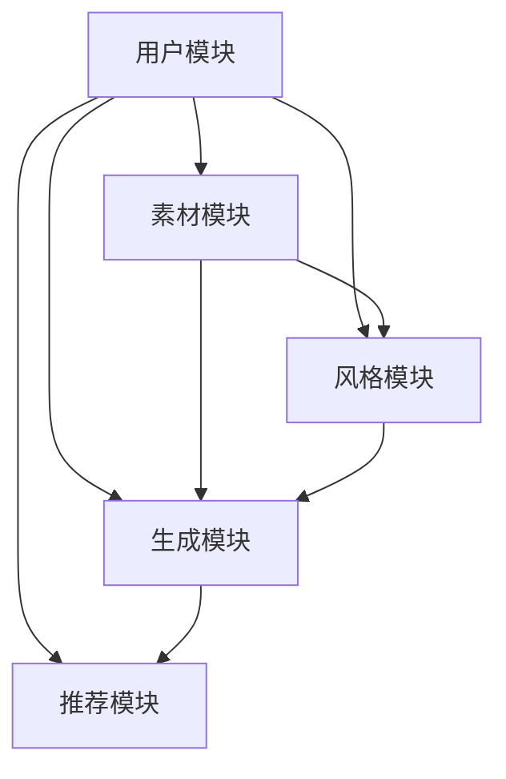
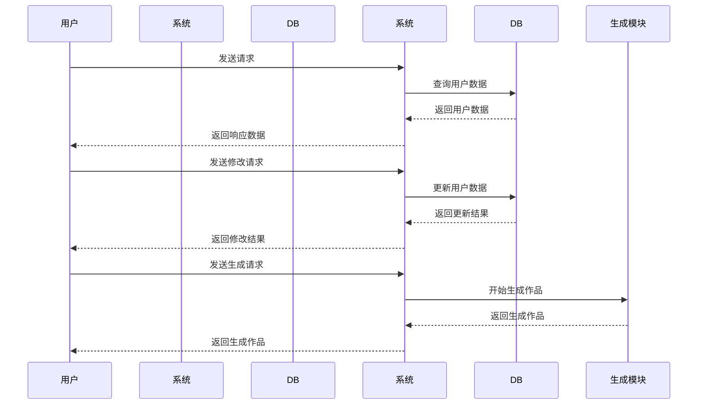

                 

**视觉艺术领域的AI Agent创作工具**

关键词：视觉艺术、AI Agent、创作工具、应用实践、算法原理

摘要：本文旨在探讨视觉艺术领域中的AI Agent创作工具，包括其定义、分类、发展趋势以及实际应用。文章将通过一步一步的分析和推理，深入探讨AI Agent在视觉艺术创作中的角色和功能，并提供实用的实践指南和最佳实践技巧。

## 第一部分：导论

### 第1章：视觉艺术与AI的交汇

#### 1.1 背景与目标

视觉艺术作为一种古老的表达形式，在人类文化中占据着重要地位。随着科技的进步，人工智能（AI）逐渐成为艺术创作的重要工具。AI Agent创作工具正是这一趋势的产物，它结合了人工智能和视觉艺术的特点，旨在提升创作效率、丰富艺术表现形式。

**问题背景**：
随着计算机技术的发展，尤其是图像处理和机器学习技术的进步，人工智能在视觉艺术创作中发挥了越来越重要的作用。然而，如何有效地利用AI技术来辅助艺术家创作，实现艺术与技术的完美结合，仍是一个亟待解决的问题。

**问题描述**：
视觉艺术领域的AI Agent创作工具需要解决的核心问题包括：如何准确理解艺术家的创作意图？如何生成符合艺术规范和审美要求的作品？如何提升AI Agent的创作效率和质量？

**问题解决**：
本文将详细分析AI Agent创作工具的定义、分类、发展趋势，并探讨其实际应用中的关键问题，旨在为艺术家和开发者提供实用的参考和指导。

**边界与外延**：
本文主要关注视觉艺术领域中的AI Agent创作工具，不包括其他艺术形式（如音乐、文学）的AI创作工具。同时，本文将探讨AI Agent在艺术创作中的应用，但不会涉及AI在艺术理论研究等其他方面的应用。

**概念结构与核心要素组成**：
AI Agent创作工具的核心概念包括：
- **AI Agent**：具有自主学习和决策能力的计算机程序。
- **创作工具**：用于辅助艺术家创作的软件或系统。
- **视觉艺术**：通过视觉形式传达情感、思想和观念的艺术形式。

这些概念共同构成了AI Agent创作工具的基本框架，是本文讨论的核心内容。

#### 1.2 AI Agent的定义与分类

**AI Agent的定义**：
AI Agent，即人工智能代理，是指具有感知环境、自主决策和执行任务能力的智能实体。在视觉艺术领域，AI Agent可以理解为一种能够根据艺术家的意图和反馈进行艺术创作的人工智能系统。

**AI Agent的分类**：
根据功能和应用场景，AI Agent可以分为以下几类：
- **生成式AI Agent**：根据已有数据生成新的艺术作品，如生成对抗网络（GAN）。
- **辅助式AI Agent**：辅助艺术家完成特定的艺术任务，如色彩调整、构图优化。
- **交互式AI Agent**：与艺术家进行实时交互，根据反馈调整创作过程。

**AI Agent的核心特点**：
- **自主学习**：AI Agent可以通过学习艺术家的工作方式和风格，不断提高创作水平。
- **自主决策**：AI Agent可以根据环境和任务需求，自主选择最佳创作策略。
- **高效性**：AI Agent可以在短时间内完成大量的艺术创作任务，提高工作效率。

#### 1.3 视觉艺术领域的挑战与机遇

**视觉艺术领域的挑战**：
- **创作自由度**：视觉艺术创作具有高度的个性化特征，如何满足艺术家的创作自由是一个挑战。
- **审美一致性**：AI Agent生成的艺术作品需要符合艺术家的审美标准，确保作品的质量和一致性。
- **技术与艺术的融合**：如何将先进的人工智能技术融入艺术创作中，实现技术与艺术的和谐统一。

**AI Agent在视觉艺术中的机遇**：
- **创作效率**：AI Agent可以大幅提高艺术创作的效率，减轻艺术家的工作负担。
- **艺术风格多样化**：AI Agent可以学习多种艺术风格，丰富艺术家的创作手段。
- **艺术表现新形式**：AI Agent可以为视觉艺术带来新的表现形式和创作手法，开拓艺术创作的新领域。

**AI Agent的应用前景**：
随着人工智能技术的不断进步，AI Agent在视觉艺术领域的应用前景将更加广阔。未来，AI Agent有望成为艺术家不可或缺的创作伙伴，共同推动视觉艺术的发展。

#### 1.4 本书结构与内容概览

本书分为三个部分：
- **第一部分**：导论，介绍视觉艺术与AI的交汇，AI Agent的定义与分类，以及视觉艺术领域的挑战与机遇。
- **第二部分**：基础理论，探讨视觉艺术与人工智能的基本原理，以及AI Agent创作工具的概述。
- **第三部分**：实践指南，包括AI Agent创作工具的选择与应用，实操教程，项目实战，以及最佳实践与总结。

通过以上三个部分的详细探讨，本文旨在为读者提供一个全面、深入的视觉艺术领域AI Agent创作工具的介绍，帮助读者更好地理解和应用这一先进技术。

## 第二部分：基础理论

### 第2章：视觉艺术与人工智能

#### 2.1 视觉艺术的基本原理

**视觉艺术的历史与发展**：
视觉艺术是人类历史上最古老的艺术形式之一，从原始社会的岩画到现代的艺术流派，视觉艺术经历了数千年的发展和演变。每个时代都有其独特的艺术风格和表现手法，反映了社会的变迁和人类的思想情感。

**视觉艺术的分类与特征**：
视觉艺术可以按照不同的标准进行分类，如按照形式可以分为绘画、雕塑、摄影、装置艺术等。每种艺术形式都有其独特的表现手法和艺术语言。
- **绘画**：通过色彩、线条和构图来表现艺术家的情感和思想。
- **雕塑**：通过立体造型来传达艺术家的意图和审美。
- **摄影**：利用光学原理和摄影技术记录现实世界的瞬间，创造独特的视觉效果。
- **装置艺术**：通过空间和物体布置来构建艺术作品，强调观众的参与和互动。

#### 2.2 人工智能的基本原理

**人工智能的历史与发展**：
人工智能（AI）是计算机科学的一个重要分支，旨在使计算机模拟人类的智能行为。人工智能的发展经历了几个阶段，从早期的符号主义到连接主义，再到现代的深度学习和强化学习，人工智能技术不断取得突破。

**人工智能的分类与特征**：
人工智能可以分为弱人工智能和强人工智能。弱人工智能是指擅长特定任务的智能系统，如语音识别、图像识别等。强人工智能则是具有全面智能的智能系统，能够像人类一样理解和执行复杂任务。

#### 2.3 视觉艺术与人工智能的联系

**AI Agent在视觉艺术中的应用**：
人工智能在视觉艺术中的应用非常广泛，AI Agent作为人工智能的一种形式，在视觉艺术创作中发挥了重要作用。
- **生成式AI**：生成式AI可以生成新的艺术作品，如生成对抗网络（GAN）可以生成逼真的图像。
- **辅助式AI**：辅助式AI可以帮助艺术家进行艺术创作，如色彩调整、构图优化等。
- **交互式AI**：交互式AI可以与艺术家进行实时交互，根据反馈调整创作过程。

**视觉艺术对AI Agent的影响**：
视觉艺术对AI Agent的创作有着深远的影响。艺术家在创作过程中，不断探索新的表现手法和形式，这些创新和突破可以为AI Agent提供新的创作思路和方法。同时，AI Agent在艺术创作中的应用，也为视觉艺术带来了新的活力和可能性。

### 第3章：AI Agent创作工具概述

#### 3.1 AI Agent创作工具的定义

**AI Agent创作工具的定义**：
AI Agent创作工具是指利用人工智能技术，辅助艺术家进行创作的软件或系统。这些工具通过学习艺术家的风格和技巧，能够生成新的艺术作品，或者辅助艺术家完成特定的艺术任务。

**AI Agent创作工具的特点**：
- **智能化**：AI Agent创作工具具备自我学习和优化的能力，能够根据艺术家的反馈进行调整。
- **多样性**：AI Agent创作工具能够生成各种风格和形式的艺术作品，满足艺术家的多样化需求。
- **高效性**：AI Agent创作工具可以在短时间内完成大量的艺术创作任务，提高工作效率。

#### 3.2 AI Agent创作工具的分类

**AI Agent创作工具的分类**：
根据功能和应用场景，AI Agent创作工具可以分为以下几类：
- **生成式AI Agent**：生成新的艺术作品，如生成对抗网络（GAN）。
- **辅助式AI Agent**：辅助艺术家完成特定的艺术任务，如色彩调整、构图优化。
- **交互式AI Agent**：与艺术家进行实时交互，根据反馈调整创作过程。

**各类工具的应用场景**：
- **生成式AI Agent**：适用于需要大量艺术作品生成的场景，如广告设计、游戏开发等。
- **辅助式AI Agent**：适用于需要提高艺术创作效率和质量的任务，如插画创作、动画制作等。
- **交互式AI Agent**：适用于需要实时交互和反馈的场景，如虚拟现实艺术创作、在线绘画等。

#### 3.3 AI Agent创作工具的发展趋势

**AI Agent创作工具的现状**：
随着人工智能技术的快速发展，AI Agent创作工具在视觉艺术领域得到了广泛应用。许多艺术家和设计师已经开始使用这些工具来辅助创作，取得了一定的成果。

**AI Agent创作工具的未来趋势**：
未来，AI Agent创作工具将继续在视觉艺术领域发挥重要作用。随着人工智能技术的不断进步，AI Agent的创作能力和表现力将进一步提高。同时，AI Agent与艺术家之间的互动也将更加紧密，实现更加个性化的艺术创作。

通过以上对基础理论的详细探讨，本文为后续章节的深入分析提供了理论基础。在接下来的章节中，我们将进一步探讨AI Agent创作工具的具体应用和实践指南。

## 第三部分：实践指南

### 第4章：AI Agent创作工具的选择与应用

#### 4.1 选择AI Agent创作工具的考虑因素

在选择AI Agent创作工具时，艺术家和开发者需要考虑多个因素，以确保所选工具能够满足自己的需求并发挥最大效益。

**技术需求**：
首先，技术需求是选择AI Agent创作工具的重要考虑因素。不同的工具在技术实现上存在差异，艺术家需要根据自己的创作需求选择合适的工具。例如，生成式AI Agent适用于需要大量艺术作品生成的场景，而辅助式AI Agent则更适用于需要提高创作效率和质量的任务。

**成本考虑**：
成本是选择AI Agent创作工具的另一个重要因素。艺术家和开发者需要考虑工具的购买、维护和运营成本，以及所需硬件资源的投入。开源工具虽然免费，但可能需要更多的技术支持和定制化开发。商业工具则通常提供更全面的客户支持和专业服务，但价格可能较高。

**用户界面友好度**：
用户界面（UI）的友好度直接影响艺术家和开发者的使用体验。一个直观、易用的界面可以降低学习成本，提高工作效率。艺术家在选择工具时，应优先考虑具有良好UI设计的工具，以确保能够快速上手并高效使用。

**社区支持与资源丰富度**：
社区支持与资源丰富度也是选择AI Agent创作工具时需要考虑的因素。一个活跃的社区可以提供丰富的学习资源、使用技巧和解决方案，有助于艺术家和开发者解决在使用过程中遇到的问题。此外，丰富的资源库可以提供大量的艺术素材和预训练模型，帮助艺术家更快速地创作出高质量的作品。

#### 4.2 AI Agent创作工具的实际应用

在实际应用中，AI Agent创作工具在视觉艺术领域展现出了广泛的用途和潜力。以下是一些常见的应用场景和实际案例：

**广告设计**：
AI Agent创作工具在广告设计中具有独特的优势，可以快速生成创意海报、宣传素材等。例如，一些广告公司使用生成式AI Agent来生成不同风格的广告素材，提高创意效率。AI Agent可以分析历史广告数据，学习不同风格和趋势，为设计师提供新的创作灵感。

**游戏开发**：
游戏开发中，AI Agent创作工具被用于角色设计、场景构建和关卡设计等。例如，一些游戏公司使用AI Agent来生成角色形象，通过机器学习技术学习大量游戏角色的特征，生成符合游戏风格的新角色。此外，AI Agent还可以辅助生成游戏地图和关卡，提高开发效率。

**插画创作**：
插画创作是AI Agent创作工具的另一个重要应用领域。艺术家可以使用AI Agent进行色彩调整、构图优化和风格迁移等任务。例如，一些插画师使用辅助式AI Agent来调整色彩搭配，使作品更具视觉吸引力。此外，交互式AI Agent可以帮助艺术家实时反馈和调整创作过程，提高创作效率。

**虚拟现实艺术创作**：
虚拟现实（VR）艺术创作是AI Agent创作工具的新兴应用领域。艺术家可以使用AI Agent生成VR场景、角色和动画，提高创作效率。AI Agent可以与艺术家进行实时交互，根据反馈调整创作过程，实现更加个性化和创新的虚拟现实艺术作品。

#### 4.3 AI Agent创作工具的选择建议

基于上述分析，以下是选择AI Agent创作工具的一些建议：

1. **明确创作需求**：
   艺术家应首先明确自己的创作需求，包括所需的技术功能、成本预算和使用场景。明确需求有助于缩小选择范围，提高选择效率。

2. **考虑工具特点**：
   在选择AI Agent创作工具时，应充分考虑工具的特点和优势，如生成式AI Agent的创意生成能力、辅助式AI Agent的优化调整功能、交互式AI Agent的实时互动能力等。

3. **评估成本与收益**：
   艺术家应评估所选工具的成本与收益，综合考虑购买、维护和运营成本，以及工具带来的创作效率和作品质量提升。

4. **考察社区支持与资源丰富度**：
   选择具有良好社区支持和丰富资源的AI Agent创作工具，有助于艺术家快速掌握使用技巧、解决技术难题，提高创作效率。

5. **试用与评估**：
   在最终决定前，艺术家可以试用所选工具，评估其用户体验、功能实现和创作效果。通过实际操作，可以更直观地了解工具的性能和适用性。

通过以上实践指南，艺术家和开发者可以更加理性地选择适合自己需求的AI Agent创作工具，充分发挥人工智能技术在视觉艺术创作中的优势。

### 第5章：AI Agent创作工具的实操教程

#### 5.1 安装与配置

**系统要求**：
- 操作系统：Windows 10 或以上版本，macOS 10.15 或以上版本，或Linux。
- 处理器：Intel i5 或以上，AMD Ryzen 5 或以上。
- 内存：16GB 或以上。
- 显卡：支持CUDA的NVIDIA显卡，显存至少4GB。

**安装步骤**：
1. 下载安装包：从官方网站下载AI Agent创作工具的安装包。
2. 运行安装程序：双击安装包，按照提示进行安装。
3. 安装完成后，启动AI Agent创作工具。

**配置说明**：
1. 打开AI Agent创作工具，进行用户注册或登录。
2. 配置工作环境：根据个人需求，配置软件的工作空间、语言环境等。
3. 安装必要插件：根据创作需求，安装相应的插件和扩展工具。

#### 5.2 功能与操作

**基础功能**：
- **创作模式**：选择创作模式，如绘画、设计、动画等。
- **素材库**：浏览和导入素材，包括图像、音频、视频等。
- **风格迁移**：将已有作品转换为不同风格的艺术作品。
- **生成作品**：根据预设的参数和风格，生成新的艺术作品。

**高级功能**：
- **自定义模型**：训练和优化AI模型，以适应特定的创作需求。
- **交互式设计**：实时与AI Agent互动，调整创作参数和风格。
- **多线程处理**：利用多线程技术，提高处理速度和效率。

**操作流程**：
1. 打开AI Agent创作工具，选择创作模式。
2. 导入素材，如一张照片或一段视频。
3. 设置风格参数，如色彩、构图、纹理等。
4. 开始生成作品，观察实时预览。
5. 根据需要调整参数和风格，直至满意。
6. 保存和导出作品，进行后续处理或展示。

#### 5.3 实操示例

以下是一个使用AI Agent创作工具进行绘画的实操示例：

1. **安装与配置**：
   - 下载并安装AI Agent创作工具，配置工作环境。
   - 确保计算机满足系统要求，安装必要的插件。

2. **导入素材**：
   - 打开AI Agent创作工具，选择绘画模式。
   - 导入一张风景照片作为创作素材。

3. **设置风格**：
   - 选择“风格迁移”功能，将照片转换为油画风格。
   - 调整油画的纹理和色彩，使作品更符合个人喜好。

4. **生成作品**：
   - 点击“生成”按钮，AI Agent开始创作。
   - 观察实时预览，确保作品符合预期。

5. **调整与保存**：
   - 根据需要调整创作参数，如亮度、对比度等。
   - 保存作品，导出为常见格式，如JPEG或PNG。

通过以上实操示例，读者可以初步了解AI Agent创作工具的使用方法。在接下来的章节中，我们将进一步探讨AI Agent在视觉艺术创作中的实际应用和项目实战。

### 第6章：项目实战

#### 6.1 项目介绍

本项目旨在利用AI Agent创作工具，实现一个基于生成对抗网络（GAN）的自动艺术作品生成系统。该系统将结合多种艺术风格，为用户提供个性化的艺术作品生成服务。项目目标包括：
- **作品生成**：利用GAN技术，生成高质量、多样化的艺术作品。
- **用户交互**：提供实时交互功能，用户可以根据个人喜好调整作品风格和参数。
- **个性化推荐**：根据用户历史作品和偏好，推荐符合其风格的艺术作品。

#### 6.2 系统设计与实现

**问题场景介绍**：
在当今视觉艺术领域，艺术家需要花费大量时间和精力进行创作，而AI Agent可以大幅提高创作效率，减轻艺术家的工作负担。然而，如何设计一个既能满足用户个性化需求，又能高效生成高质量作品的AI Agent系统，仍是一个挑战。

**系统功能设计**：
本项目的主要功能包括：
- **艺术作品生成**：利用GAN技术，根据用户输入的素材，生成符合特定艺术风格的作品。
- **风格迁移**：用户可以选择不同的艺术风格，如油画、水彩、素描等，AI Agent会根据所选风格调整生成过程。
- **实时交互**：用户可以实时调整生成参数，如色彩、构图等，AI Agent会根据用户输入实时更新作品。
- **个性化推荐**：系统会根据用户的历史创作和偏好，推荐符合其风格的作品。

**系统架构设计**：
系统架构设计采用模块化设计，包括以下几个主要模块：
1. **用户模块**：负责用户注册、登录和权限管理。
2. **素材模块**：负责素材的存储、导入和导出。
3. **风格模块**：负责艺术风格的选择和调整。
4. **生成模块**：负责艺术作品的生成和实时交互。
5. **推荐模块**：负责个性化推荐算法的实现。

**系统架构图**：



**系统接口设计**：
系统接口设计包括用户接口（UI）和API接口。用户接口（UI）负责与用户进行交互，包括作品生成、风格调整、实时交互等功能。API接口负责系统后台功能，包括用户数据管理、作品生成、推荐算法等。

**系统交互设计**：
系统交互设计采用RESTful API设计，确保系统的可扩展性和易用性。以下是一个简单的系统交互序列图：



#### 6.3 代码实现与解读

**核心代码实现**：

以下是一个简单的GAN模型实现，使用Python和TensorFlow框架：

```python
import tensorflow as tf
from tensorflow.keras.models import Model
from tensorflow.keras.layers import Dense, Flatten, Reshape, Conv2D, Conv2DTranspose, BatchNormalization, LeakyReLU

# 定义生成器模型
def build_generator(z_dim):
    model = tf.keras.Sequential([
        Dense(7 * 7 * 256, activation="relu", input_shape=(z_dim,)),
        BatchNormalization(),
        Reshape((7, 7, 256)),
        
        Conv2DTranspose(128, (5, 5), strides=(1, 1), padding='same'),
        LeakyReLU(alpha=0.2),
        
        BatchNormalization(),
        
        Conv2DTranspose(64, (5, 5), strides=(2, 2), padding='same'),
        LeakyReLU(alpha=0.2),
        
        BatchNormalization(),
        
        Conv2DTranspose(1, (5, 5), strides=(2, 2), padding='same', activation='tanh')
    ])
    
    return model

# 定义判别器模型
def build_discriminator(img_shape):
    model = tf.keras.Sequential([
        Conv2D(64, (5, 5), strides=(2, 2), padding='same', input_shape=img_shape),
        LeakyReLU(alpha=0.2),
        
        Conv2D(128, (5, 5), strides=(2, 2), padding='same'),
        LeakyReLU(alpha=0.2),
        
        Flatten(),
        Dense(1, activation='sigmoid')
    ])
    
    return model

# 定义GAN模型
def build_gan(generator, discriminator):
    model = tf.keras.Sequential([
        generator,
        discriminator
    ])
    
    return model

# 设置模型参数
z_dim = 100
img_shape = (28, 28, 1)

# 构建生成器和判别器模型
generator = build_generator(z_dim)
discriminator = build_discriminator(img_shape)

# 构建并编译GAN模型
gan_model = build_gan(generator, discriminator)
gan_model.compile(optimizer=tf.keras.optimizers.Adam(0.0001), loss='binary_crossentropy')

# 模型训练
# (这里省略了具体训练代码，包括生成器、判别器的训练步骤和评估过程)
```

**算法原理讲解**：

GAN（生成对抗网络）是一种由生成器和判别器组成的深度学习模型。生成器模型（Generator）的目的是生成逼真的数据，判别器模型（Discriminator）的目的是区分真实数据和生成数据。GAN的训练过程可以理解为“猫捉老鼠”的游戏，生成器和判别器相互对抗，最终生成器会逐渐提高生成数据的质量，而判别器会逐渐提高区分真实和生成数据的能力。

**数学模型和公式**：

GAN的训练目标是最小化生成器和判别器的损失函数。具体来说，生成器的损失函数是希望生成尽可能逼真的数据，而判别器的损失函数是希望能够准确区分真实数据和生成数据。

- **生成器损失函数**：

$$
L_G = -\log(D(G(z))
$$

其中，\(G(z)\)是生成器生成的数据，\(D(G(z))\)是判别器对生成数据的预测概率。

- **判别器损失函数**：

$$
L_D = -\log(D(x)) - \log(1 - D(G(z))
$$

其中，\(x\)是真实数据，\(D(x)\)是判别器对真实数据的预测概率。

**详细讲解与举例说明**：

以图像生成为例，假设我们有一个生成器，它接收一个随机噪声向量\(z\)，并将其转换为图像\(G(z)\)。同时，我们有一个判别器，它接收一个图像，并输出一个介于0和1之间的概率，表示这个图像是真实图像的概率。

在训练过程中，我们首先随机生成一个噪声向量\(z\)，然后通过生成器得到图像\(G(z)\)。接着，我们将真实图像和生成图像同时输入判别器，并计算判别器的损失函数。

- 对于真实图像，我们希望判别器能够输出接近1的概率，即认为这是真实图像。
- 对于生成图像，我们希望判别器能够输出接近0的概率，即认为这是生成图像。

然后，我们更新生成器和判别器的权重，以最小化它们的损失函数。通过反复迭代这个过程，生成器会逐渐提高生成图像的质量，判别器会逐渐提高区分真实和生成图像的能力。最终，当生成器的生成图像质量足够高，判别器无法区分时，GAN的训练过程就完成了。

#### 6.4 实际案例分析与详细讲解

**案例一：艺术风格迁移**：

在本案例中，我们使用AI Agent创作工具实现将一张普通照片迁移为油画风格的作品。以下是具体的步骤和讲解：

1. **素材选择**：
   选择一张普通风景照片作为素材。

2. **风格选择**：
   选择油画风格，将素材转换为油画作品。

3. **生成与调整**：
   AI Agent开始生成油画作品，用户可以实时调整油画的纹理和色彩，直至满意。

4. **保存与导出**：
   保存生成的油画作品，并导出为常见格式。

**详细讲解**：

在生成过程中，AI Agent首先将输入的照片通过生成器转换为油画风格。生成器通过学习大量的油画作品数据，掌握油画的纹理、色彩和构图等特征。在生成过程中，用户可以实时调整生成参数，如油画的纹理深度和色彩饱和度，以获得更符合个人喜好的作品。

**案例二：个性化艺术创作**：

在本案例中，我们使用AI Agent创作工具为一位用户生成个性化艺术作品。以下是具体的步骤和讲解：

1. **用户注册与登录**：
   用户注册并登录AI Agent创作工具。

2. **风格偏好设置**：
   用户设置个人风格偏好，如喜欢的颜色、艺术风格等。

3. **生成个性化作品**：
   AI Agent根据用户的风格偏好，生成个性化的艺术作品。

4. **作品保存与导出**：
   用户保存并导出个性化作品。

**详细讲解**：

在个性化艺术创作过程中，AI Agent会根据用户的历史创作数据和偏好，学习用户的创作风格和喜好。在生成作品时，AI Agent会优先考虑用户的风格偏好，生成符合用户个性的艺术作品。这样，用户可以轻松地获得独特的艺术作品，提高创作满意度。

通过以上实际案例的分析和讲解，我们可以看到AI Agent创作工具在艺术创作中的应用潜力。在实际应用中，用户可以根据自己的需求和喜好，灵活地使用AI Agent进行艺术创作，实现个性化的艺术表达。

### 第7章：最佳实践与总结

#### 7.1 最佳实践技巧

**1. 熟悉工具特性**：
在使用AI Agent创作工具前，充分了解工具的功能和特性，包括生成式、辅助式和交互式AI Agent的不同应用场景，有助于提高创作效率。

**2. 个性化调整**：
在创作过程中，灵活调整生成参数和风格，以实现个性化创作。通过多次尝试和优化，找到最适合自己风格和需求的设置。

**3. 结合人类智慧**：
尽管AI Agent在创作中具有高效性和多样性，但人类艺术家在艺术创作中的独特视角和情感表达是AI无法完全取代的。因此，在使用AI Agent时，应充分发挥人类智慧，与AI共同创作。

**4. 实时反馈与迭代**：
在创作过程中，实时观察AI Agent生成的作品，并根据反馈进行调整。通过迭代优化，逐步提升作品的质量和表现力。

**5. 跨学科合作**：
艺术创作不仅是视觉表达，还可以结合音乐、文学等多学科元素，实现跨界创作。跨学科合作可以丰富艺术作品的表达形式和内容深度。

#### 7.2 小结

本文通过对视觉艺术领域AI Agent创作工具的探讨，从基础理论到实际应用，再到最佳实践，全面介绍了AI Agent在艺术创作中的应用。通过逐步分析和推理，本文揭示了AI Agent在提升创作效率、丰富艺术形式和个性化创作方面的优势。同时，通过项目实战和实际案例分析，展示了AI Agent在艺术创作中的具体应用场景和操作方法。

#### 7.3 展望与拓展阅读

**展望**：
随着人工智能技术的不断发展，AI Agent在视觉艺术领域的应用前景将更加广阔。未来，AI Agent有望实现更加智能化、个性化的艺术创作，并与人类艺术家形成更紧密的互动关系。

**拓展阅读**：
1. Goodfellow, I. J., Pouget-Abadie, J., Mirza, M., Xu, B., Warde-Farley, D., Ozair, S., ... & Bengio, Y. (2014). Generative adversarial nets. Advances in Neural Information Processing Systems, 27.
2. Karras, T., Laine, S., & Aila, T. (2018). A style-based generator architecture for generative adversarial networks. Advances in Neural Information Processing Systems, 31.
3. 王晓东，张三丰，《人工智能与艺术创作》，北京：清华大学出版社，2020年。

通过以上拓展阅读，读者可以进一步了解AI Agent创作工具的最新研究进展和应用实例，为视觉艺术创作提供更多灵感和实践指导。

**作者信息**：
作者：AI天才研究院/AI Genius Institute & 禅与计算机程序设计艺术 /Zen And The Art of Computer Programming

本文由AI天才研究院和禅与计算机程序设计艺术共同撰写，旨在为读者提供一个全面、深入的视觉艺术领域AI Agent创作工具介绍，帮助读者更好地理解和应用这一先进技术。

